# 13 使用高级或嵌入式容量之外的机器学习

多亏了现在通过强大的笔记本电脑或通过云提供的计算能力，您可以通过机器学习模型轻松快速地丰富您的分析。**Power BI** 提供了集成工具（与数据流密切相关），允许您使用在 Azure Machine Learning 上开发的数据科学家机器学习模型、通过 **Azure AutoML** 训练和部署的模型，或者通过便捷的图形界面直接通过认知服务公开的服务。唯一的缺点是，这些工具（称为 **高级 AI**）只有在您使用 **嵌入式** 容量、**高级** 容量或 **高级按用户**（**PPU**）许可证时才启用。这意味着使用 Power BI Desktop 或仅使用带有 Pro 许可证的 Power BI 服务的用户不能从机器学习中受益吗？绝对不是，我们将通过 **Python** 和 **R** 展示您如何做到这一点。

在本章中，您将涵盖以下主题：

+   使用数据流与 Power BI 中的机器学习交互

+   使用 AutoML 解决方案

+   在 Power Query 中嵌入训练代码

+   在 Power Query 中使用训练好的模型

+   在 Script Visuals 中使用训练好的模型

+   在 Power Query 中调用 Web 服务

## 技术要求

本章要求您拥有一个正常工作的互联网连接，并且您的机器上已经安装了 **Power BI Desktop**。您必须已按照 *第二章*、*配置 Power BI 中的 R* 和 *第三章*、*配置 Power BI 中的 Python* 中概述的方式正确配置了 R 和 Python 引擎和 IDE。

## 使用数据流与 Power BI 中的机器学习交互

您可以直接通过 Power BI Desktop 访问 **高级 AI 功能**，或者您可以通过数据流访问 **数据流的高级 AI 功能**，这些是易于使用的大数据处理工具，可以将大数据转换为仪表板中显示的洞察。但是，正如您所想象的，这两种模式都需要介绍中提到的上述许可证。

这些功能可通过 Power BI Desktop 访问，在 **Power Query 主页**标签上：

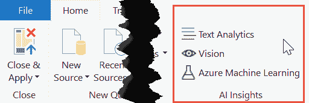

图 13.1 – Power BI Desktop 中的 AI 洞察

在 *图 13.1* 中您可以看到的前两个选项（**文本分析**和**视觉**）在幕后使用 **Azure 认知服务**，具体是文本分析服务和计算机视觉服务。基本上，多亏了 Power BI 中的这些功能，您现在可以使用 *四个功能* 通过机器学习的力量丰富您的数据。

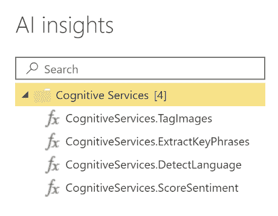

图 13.2 – Power BI 中的认知服务功能

这些功能如下：

+   **TagImages**. 分析图像，根据其内容生成标签

+   **ExtractKeyPhrases**. 评估非结构化文本，并为每个文本列返回一组关键短语

+   **DetectLanguage**. 评估文本输入，并为每一列返回语言名称和 ISO 标识符

+   **ScoreSentiment**. 评估文本输入并为每个文档返回一个情感分数，范围从 0（负面）到 1（正面）

AI Insights 的另一种选择是能够在 Power Query 中将托管在**Azure 机器学习**中的模型用作评分函数。

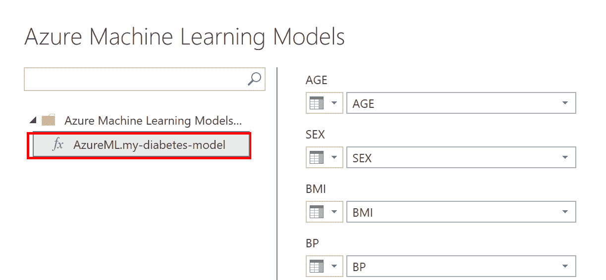

图 13.3 – Power BI 中的 Azure 机器学习功能

更重要的是，高级 AI 功能还包括通过**数据流自动机器学习**在 GUI 上即时创建机器学习模型的能力。

自动机器学习解决方案非常方便，特别是对于没有太多机器学习经验的分析师来说。您将在下一节中详细了解这一点。现在您只需要知道，在 Power BI 中，您可以生成三种类型的模型：**分类**（二元或多标签）、**回归**和**时间序列预测**（即将推出）。

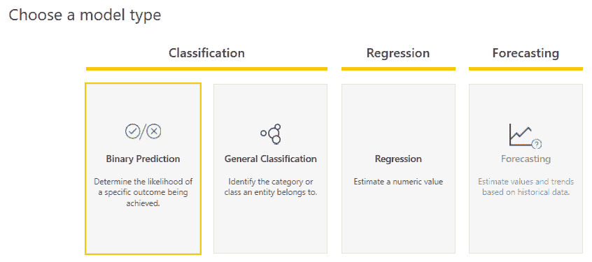

图 13.4 – Power BI 中的数据流自动机器学习

在幕后，有 Azure AutoML 服务允许您进行模型训练，但通过利用数据流，您不需要实例化机器学习工作区来运行自动机器学习实验。

只有 Power BI Pro 许可证的用户无法直接从 Power BI GUI 访问这些出色的功能。然而，多亏了 Python 和 R 在 Power BI 中的引入，现在可以使用机器学习算法或外部服务，只需几行代码就可以实现它们的实现。

真的可能只有几行代码就足够训练一个机器学习模型吗？其中的技巧在哪里？！让我们来解释这个谜团。

## 使用自动机器学习解决方案

从头编写代码进行机器学习需要特定的知识，而通常使用 Power BI 的通用分析师并不具备这些知识。因此，我们建议从现在开始，对于没有数据科学背景的分析师，推荐使用**自动机器学习**（**AutoML**）过程。这难道意味着任何人都可以仅通过使用 AutoML 算法，而不了解这一科学背后的理论，就能创建一个准确的机器学习模型吗？绝对不是！以下适用：

> **重要提示**
> 
> 自动机器学习工具减轻了分析师在机器学习过程中典型的重复性任务（超参数调整、模型选择等）。通常，那些需要分析师具备特定理论知识（例如，缺失值填充、数据集平衡策略、特征选择和特征工程）的步骤被排除在自动化步骤之外。因此，在开始自动机器学习过程之前，没有应用只有专家才知道的适当转换到数据集，会导致生成一个可能足够准确但无法确保产品性能的基线模型。

你可能会认为 AutoML 工具受到数据科学家的厌恶。这也是一个神话。他们中的许多人将其用作快速原型设计和重复步骤的执行工具，同时他们专注于更关键的任务。

在本章中，我们将满足于获得离散的性能模型（如果我们足够幸运，拥有一个正确转换的训练数据集，有时会非常好），因此 AutoML 解决方案提供的输出已经足够好了。

此外，我们将专门使用 Python 中的 AutoML 解决方案，因为它是大多数第三方机器学习平台中最广泛使用的语言。R 语言的使用范围略小于 Python，但这并不意味着你在 R 中得到的结果有任何不准确性。相反，正如你可能在之前的章节中注意到的，一些仅存在于 R 而不存在于 Python 中的专门统计函数包，允许对数据进行高度灵活的操作。

简而言之，到目前为止，使用 Python 进行机器学习工作允许模型在流行的平台之间轻松共享。因此，我们建议它适用于 Power BI 分析师，他们可能更愿意将模型创建委托给更专业的平台，然后再将其导入 Power BI。

让我们看看本章代码中将使用哪些 AutoML 工具。

### PyCaret

**PyCaret** ([`pycaret.org/`](https://pycaret.org/)) 是一个开源、低代码的 Python 机器学习库，它自动化了机器学习实验周期，使商业分析师和领域专家能够访问这些高级技术，同时也帮助数据科学家变得更加高效和高效。

PyCaret 可以解决的问题类型如下：

+   **分类**（预测一个分类目标变量）

+   **回归**（预测一个数值目标变量）

+   **聚类**（将观测值分组到具有特定属性的特定集合中）

+   **异常检测**（在数据集中寻找异常值的过程，这些异常值的数量远少于常规观测值）

+   **自然语言处理**（用于分类和回归的有用特征中的文本转换）

+   **关联规则**（一种基于概率理论的基于规则的技巧，用于根据概率理论在特征之间找到重要关系）

对于更有经验的用户，PyCaret 还提供了方便的模型集成和模型解释功能。

### Azure AutoML

Azure AutoML 是一种基于云的服务，可用于自动化构建用于分类、回归和预测任务的机器学习管道。这些管道涉及数据集的预处理阶段，以便更好地适应下一阶段使用的训练算法。在调整和训练多个模型后，Azure AutoML 将选择其中最准确的模型，同时还会考虑由先前训练模型集成产生的另外两个模型。

可用的任务如下：

+   分类

+   回归

+   时间序列预测

要了解更多关于这个平台的详细信息，请参阅参考资料。

### RemixAutoML for R

为了完整起见，我们还建议 R 的 AutoML 解决方案之一，即**RemixAutoML**（[`github.com/AdrianAntico/RemixAutoML`](https://github.com/AdrianAntico/RemixAutoML)）。这是一个函数集，它简化了 R 中许多 AutoML 包的使用（CatBoost、LightGBM、XGBoost 和 H2O）。除了让没有经验的分析师能够通过 AutoML 用几行代码创建机器学习模型之外，这个库还包含非常高级的功能（例如，用于特征工程和时间序列预测的功能），这些功能通常被更有经验的分析师使用。

现在让我们看看在 Power BI 中使用机器学习模型的多种方法。

## 在 Power Query 中嵌入训练代码

训练机器学习模型的最简单解决方案之一是在导入您将构建模型的数据集后，直接在 Power Query 中编写所需的代码。

在相当大的数据集上训练模型通常需要相当长的时间来完成。当您在 Power Query 中嵌入代码时，它将在每次数据刷新时运行，这可能会导致在线获取数据时出现不可忽视的延迟。因此，以下适用：

> **重要提示**
> 
> 当您确信完成模型训练所需的时间是可以接受的时，建议使用此解决方案。

现在让我们看看如何使用 PyCaret 编写一些训练代码的示例。

### 使用 PyCaret 训练和使用 ML 模型

让我们以泰坦尼克号灾难数据集为例来训练一个机器学习模型。具体来说，我们希望创建一个模型，根据数据集中其他特征描述的乘客属性来预测乘客是否幸存（`Survived`列）。显然，这是一个*二元分类*（是否幸存？是或否），我们可以很容易地使用 PyCaret 实现。

由于 PyCaret 和其他所有依赖库都在不断进化，因此您还需要安装**Visual C++ Build tools**来构建必要的轮子并避免诸如*Failed building wheel for <package>*之类的错误。以下是正确安装 PyCaret 所需的全部步骤，适用于 Windows：

1.  从[`visualstudio.microsoft.com/visual-cpp-build-tools/`](https://visualstudio.microsoft.com/visual-cpp-build-tools/)下载安装程序并运行它。

1.  在下一个窗口中，仅选择**使用 C++进行桌面开发**选项。

1.  您将收到提示重新启动计算机。请这样做。

1.  一旦您的笔记本电脑重新启动，运行您的 Anaconda Prompt 并输入以下命令以创建新的`pycaret_env`环境：

    ```py
    conda create --name pycaret_env python=3.7
    ```

1.  输入以下命令以切换到新环境：

    ```py
    conda activate pycaret_env
    ```

1.  输入以下命令以安装 PyCaret 的完整版本：

    ```py
    pip install pycaret
    ```

完成这些步骤后，您可以继续查看模型的训练代码。唯一的小问题是处理数据集中的缺失值（您已经在*第十二章*，*添加统计洞察、异常值和缺失值*中分析过它们）。不幸的是，PyCaret 目前仅支持使用最简单的方法处理缺失值，即使用均值或中位数对数值进行推断，以及使用众数或固定字符串对分类值进行推断。由于我们想要向您展示如何使用*K-Nearest Neighbors (KNN)*算法推断缺失值，正如*第十二章*，*添加统计洞察、异常值和缺失值*中预期的那样，您将需要编写比平时更多的代码。

用于通过 KNN 算法推断缺失值的代码将在 Power BI 中导入 Titanic 数据集后的第一个转换步骤中使用。您可以在`Chapter13/Python`文件夹中的`01-impute-dataset-with-knn.py`文件中找到代码。首先，代码将进行简单的特征选择，消除在模型训练过程中可能引起噪声的字段。之后，由于上述由 scikit-learn 通过**KNNImputer**模块公开的推断算法不处理数据集中的分类变量，代码还负责使用**ordinal encoding**技术（使用类别到整数的映射）对分类变量进行编码，这得益于 scikit-learn 的**OrdinalEncoder**模块。在此阶段，代码使用默认的距离度量来推断缺失值，即欧几里得距离度量，在计算训练数据集成员之间的距离时不会包括 NaN 值。

一旦获得推断数据集，您可以使用该数据集来训练模型，然后对测试数据集进行评分。您可以在`Chapter13/Python`文件夹中的`02-train-model-with-pycaret.py`文件中找到代码。为了方便起见，您将使用推断数据集的 95%来训练模型，而剩余的 5%将用作测试数据集。所有这些步骤都将放在 Power BI 中用于缺失值推断的前一个转换步骤之后。

你将利用 scikit-learn 的 `train_test_split()` 方法将数据集分为训练集和测试集。之后，通过调用 PyCaret 的 `setup()` 和 `compare_models()` 函数，模型训练将非常简单。在 `setup()` 函数中，你需要定义用于训练的数据框，目标变量（`Survived`），以及哪些是分类变量，哪些是顺序变量。此外，必须使用静默模式，否则需要用户干预来验证其他变量的推断类型。`compare_models()` 函数使用交叉验证训练并评估 PyCaret 为分类提供的所有模型的性能。除了返回表现最佳的模型外，此函数还返回交叉验证返回的每个模型的性能值。

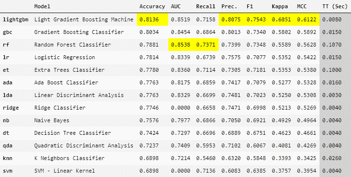

图 13.5 – 所有模型的性能

*图 13.5* 展示了每个模型的几个典型分类指标。其中最常用的是当数据集平衡时（换句话说，当目标变量的一个类别与另一个类别的观测数之间略有不成比例时）的 **ROC 曲线下面积**（**AUC** 或 **AUC-ROC**）。以下说明适用：

> **重要提示**
> 
> `compare_models()` 函数在 Power BI 中无法正常工作，除非你禁用并行处理，通过将 `n_jobs=1` 传递给 `setup()` 函数。如果你没有将 `1` 分配给 `n_job`，则 PyCaret 默认将其设置为 -1（最大并行性），在幕后，最佳模型会使用多个线程正确计算，但 Power BI 无法追踪到主进程，因此会卡住。

在 AUC 大约为 0.85（由于过程是随机的，因此可能会有所变化）的情况下，**随机森林分类器**似乎是通过训练 95% 的补全数据集获得的最佳模型。然后，你将使用新训练的模型（`best_model`）通过 PyCaret 的 `predict_model()` 函数来获取数据集剩余 5% 的预测。你将得到类似以下的结果：

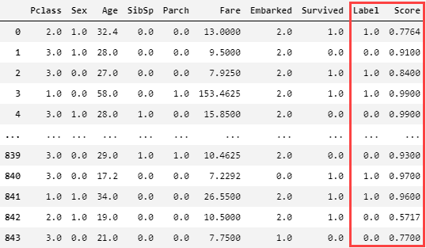

图 13.6 – 测试数据集的预测

如你所见，对数据集进行评分生成的结果包括两个新的分类列：`Score` 列代表一个度量值的估计，例如预测类别在 `Label` 列中报告的概率。如果你对获得真正的概率估计感兴趣，你必须**校准**模型（更多细节请参阅参考文献）。训练的模型也将保存为 PKL 文件以供将来重用。

让我们看看如何在 Power BI 中实现这里所解释的内容。

### 在 Power BI 中使用 PyCaret

首先，确保 Power BI Desktop 在 **选项** 中引用了新的 `pycaret_env` Python 环境。然后，按照以下步骤操作：

1.  点击 **获取数据**，搜索 `web`，选择 **Web**，然后点击 **连接**。

1.  将 `http://bit.ly/titanic-dataset-csv` URL 输入到 URL 文本框中，然后点击 **确定**。

1.  你将看到数据预览。然后，点击 **转换数据**。

1.  在功能区点击 **转换**，然后点击 **运行 Python 脚本**。

1.  在 `Chapter13\Python` 文件夹中的 `01-impute-dataset-with-knn.py` 文件中找到脚本并输入。

1.  我们只对 `df_imputed` 数据框中的数据进行关注。因此，点击其 **表** 值。

1.  你将看到所有缺失值已填充的数据集预览。

1.  在功能区点击 **转换**，然后点击 **运行 Python 脚本**。

1.  在 `Chapter13\Python` 文件夹中的 `02-train-model-with-pycaret.py` 文件中找到脚本并输入。

1.  我们只对 `predictions` 数据框中的数据进行关注。因此，点击其 **表** 值。

1.  你将看到由模型生成的预测和输入数据集的预览。

1.  在功能区点击 **主页**，然后点击 **关闭并应用**。

太棒了！你刚刚使用几行 Python 代码训练了一个机器学习模型，并使用 PyCaret 对测试数据集进行了评分！

现在我们来看看当模型在 Power BI 之外训练时该如何操作。

## 在 Power Query 中使用训练好的模型

正如你在 *第四章* 中所看到的，*导入未处理的数据对象*，你过去通常会将复杂、耗时处理的结果（因此也是一个机器学习模型）以你使用的语言特定的序列化格式共享。在那个阶段，反序列化文件并准备好在 Power Query 中使用以预测新观察的目标变量是非常简单的。然而，了解评分函数（它接收新观察作为输入并返回预测）所需的依赖关系很重要，因为它们与模型的训练方式密切相关。因此，我们建议以下做法：

> **重要提示**
> 
> 当你需要使用第三方提供的序列化机器学习模型时，确保该模型的开发者也为你提供了一个可工作的评分函数，以避免在预测未知观察的目标值时出现不必要的麻烦。

如果你这么想，序列化和反序列化机器学习模型的能力可以解决在上一节中直接在 Power Query 中训练模型时提出的延迟问题。假设你第一次运行嵌入式训练代码。紧接着，将模型序列化并保存到磁盘上。在下一次刷新时，你不必再次运行训练代码，而是检查预期的路径中是否存在序列化模型文件。如果存在，则加载该文件，反序列化它，并使用该模型进行下一步；如果不存在，则再次运行训练代码。

显然，上述过程涉及到专家的干预，当模型表现不佳时，专家会决定删除序列化文件，因为在此期间，业务数据可能已经发生了重大变化，以至于之前的模型不再准确，就像使用过去数据进行的训练之后那样（这个过程被称为**模型漂移**；更多细节请参阅参考资料）。

我们不会深入探讨此解决方案的实现细节，但我们想提供一个针对上一个部分提出的问题的可能解决方案的提示。

现在我们将使用已经训练好的 PyCaret 模型在 Power BI 中实现一个未见数据集的评分。

### 使用训练好的 PyCaret 模型在 Power Query 中进行评分

如果您记得正确的话，在上一个部分中，您将 Power BI 中训练好的模型保存到了磁盘上的 PKL 文件中。您还导出了相同代码中计算的测试数据集到 CSV 文件。在本会话中，您将直接使用序列化模型，使用`load_model()`函数加载它，以及要评分的测试 CSV 数据集。由于模型是使用 PyCaret 训练的，所以评分函数简单给出为`predict_model()`函数。请记住，当不使用像 PyCaret 这样的简化框架时，评分函数可能更复杂。

在 Power BI 中遵循以下步骤：

1.  点击**获取数据**，选择**文本/CSV**，然后点击**连接**：

1.  在`Chapter13`文件夹中选择`titanic-test.csv`文件，然后点击**打开**。

1.  您将看到测试数据的预览。然后，点击**转换数据**。

1.  在功能区点击**转换**，然后点击**运行 Python 脚本**。

1.  在`Chapter13\Python`文件夹中的`03-score-dataset-using-pycaret-model.py`文件中输入脚本。

1.  我们只对`predictions`数据框感兴趣。因此，点击其**表**值。

1.  您将看到测试数据集的预览，其中增加了两个额外的列——`标签`和`评分`。

1.  在功能区点击**主页**，然后点击**关闭并应用**。

如您所见，这是在 Power BI 中使用自定义机器学习模型进行评分的最直接和最常见的方式。事实上，我们建议以下做法：

> **重要提示**
> 
> 在 Power BI 之外的平台进行训练和通常管理机器学习模型是很方便的，这样可以解耦模型开发/调整干预措施与报告的其他部分。

现在我们来看看如何在**脚本可视化**中直接使用序列化的机器学习模型。

## 在脚本可视化中使用训练好的模型

如你在 *第四章* 中所学，*导入未处理的数据对象*，由于对象序列化和其字符串表示，你可以将任何对象以字符串数据框的形式导入到 Python 或 R 视觉中。一旦该数据框在脚本视觉中可用，你可以通过逆序列化转换将其还原为原始对象。由于你可以对任何对象执行我们描述的操作，显然你也可以对已在 Power BI 外部训练的机器学习模型执行此操作。

当在 *Script Visual* 会话中可用适当反序列化的模型时，可以使用上一节中描述的评分函数立即预测新的观测值。

你可能会问自己，当数据必须首先在 Power BI 数据模型中可用才能在视觉中使用时，在脚本视觉中评分数据集有什么意义。事实上，如果用作模型输入的观测数据已经在 Power BI 的数据模型中找到，那么直接在 Power Query 中应用批量评分可能更好，这样就可以将预测作为数据集的新列使用。所有这些都是绝对正确的。然而，在某些情况下，使用脚本视觉是方便的：

> **重要提示**
> 
> 当你需要实现一些允许你探索模型输出并动态改变变量的模拟报告时，在脚本视觉中使用机器学习模型是方便的，而不必刷新整个报告。

在这种情况下，我们建议使用 Power BI 中的 **假设参数** ([`bit.ly/power-bi-what-if`](https://bit.ly/power-bi-what-if)) 来处理数值特征，它们是动态的，并为用户提供了一个非常实用的报告。对于分类变量，你可以使用 Power BI 中的 **输入数据** 功能手动输入它们的内容，这将创建一个断开连接的表。假设参数默认在数据模型中创建断开连接的表。

为了正确理解这段话，请确保你理解了 *第四章*，*导入未处理的数据对象* 的内容。假设你必须向一个期望两个变量作为输入的机器学习模型提供观察结果 – 一个数值变量和一个分类变量。当将信息传递给脚本视觉的数据框时，除了来自 Power Query 的序列化模型数据框的字段（`model_id`、`chunk_id` 和 `model_str`）之外，你还需要将相关值分配给两个输入变量相关的参数筛选器。由于在筛选时每个参数每次只能选择一个值，因此所有参数的集合形成一个元组，在我们的情况下是（`numeric_value`、`category_id`）。这个元组将根据字符串块数据框（由 `model_id`、`chunk_id` 和 `model_str` 列组成）的行数进行复制，并将其连接到它，以提供最终的数据框，该数据框将在脚本视觉会话中名为 `dataset` 的变量中可用。

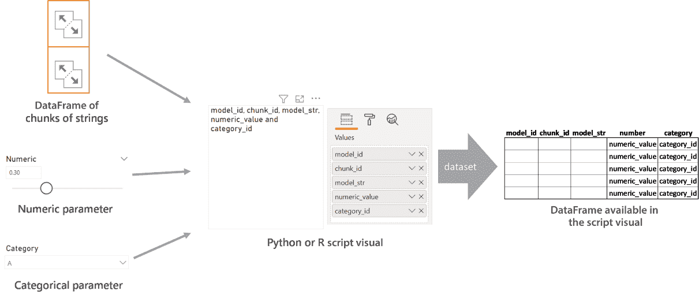

图 13.7 – 将 PKL 文件内容反序列化到 Python 视觉中

一旦在脚本视觉中有了数据集数据框，你可以仅对列（`model_id`、`chunk_id` 和 `model_str`）应用反序列化转换，从而获得可用于评分的机器学习模型。如果你选择仅对列（`number`、`category`）应用，并对结果数据框的所有行应用 distinct 函数，你将获得作为反序列化模型输入提供的参数元组。因此，你可以从模型中计算预测值，向其提供参数元组作为输入。然后，你可以在脚本视觉中显示的图中使用这个预测。

让我们实际看看如何在 Python 脚本视觉中动态预测来自机器学习模型的值。

### 在脚本视觉中使用训练好的 PyCaret 模型评分观察结果

你将要做的事情是正确序列化 Power Query 中字典中包含的机器学习模型（在我们的情况下，只有一个）。这样，就获得了一个包含上述字典中每个序列化模型字符串表示的数据框。因此，可以通过报告中的筛选器选择感兴趣的模型，并因此使用 Python 脚本视觉中的相应数据框部分，在其中可以反序列化数据框的内容，从而获得用于评分的模型。

因此，让我们继续在 Power BI 中开发我们的报告。确保 Power BI 在 **选项** 中正确引用 `pycaret_env` 环境。以下是需要遵循的步骤：

1.  点击 **获取数据**，然后 **更多…**。在搜索框中开始输入 `script`，双击 **Python 脚本**。Python 脚本编辑器将弹出。

1.  将`04-serialize-ml-models-in-power-query.py`文件的内容复制到`Chapter13\Python`文件夹中。然后，将其粘贴到 Python 脚本编辑器中，相应地更改 PKL 文件的绝对路径，然后点击**确定**。

1.  导航器窗口将打开，为您提供选择要导入哪个 dataframe 的选项。选择包含模型 ID 的`model_ids_df` dataframe 和包含序列化模型字符串表示的`models_df` dataframe，然后点击**加载**。在幕后，通过`model_id`字段在模型 ID 和序列化模型 dataframe 之间自动创建 1:1 关系。

    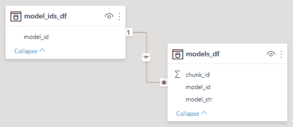

    图 13.8 – 模型表之间自动创建的关系

    这种关系允许您筛选**models_df**表中的行集，以便在 Python 可视化中使用，对应于您通过下一步创建的切片器选择的模型 ID。

1.  点击切片器视觉图标。

    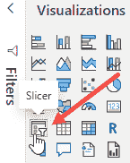

    图 13.9 – 选择切片器视觉

    然后，点击**model_ids_df**表中的**model_id**度量值。

    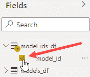

    图 13.10 – 点击 model_id 度量值以在切片器中显示

1.  点击切片器右上角的向下箭头以选择**下拉**切片器类型。

    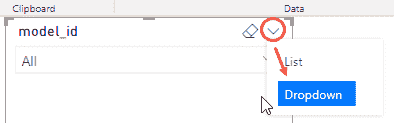

    图 13.11 – 选择下拉切片器类型

1.  调整切片器的底部边缘，点击其格式选项，开启**单选**选项，关闭**切片器标题**，然后添加标题`模型 ID`。

    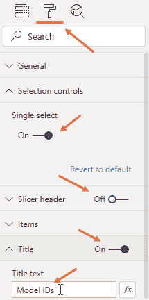

    图 13.12 – 设置切片器选项

    然后，将其移动到报告的顶部中央。

1.  您现在将为每个变量添加一组“假设”参数及其关联的切片器，并将它们作为输入传递给模型。点击功能区上的**建模**选项卡，然后点击**新建参数**。

1.  在下一个对话框中，在**名称**字段中输入`Pclass 参数`，将数据类型保留为`整数`，在**最小值**字段中输入`1`，在**最大值**字段中输入`3`，将**增量**保留为 1，并在**默认值**字段中输入`2`。

    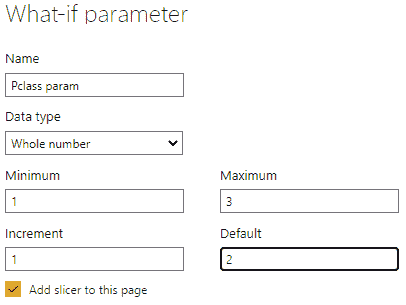

    图 13.13 – 为 Pclass 添加“假设”参数

    保持**将切片器添加到本页**选中，然后点击**确定**。

1.  调整 Pclass 切片器的底部边缘。然后，点击其格式选项，关闭**切片器标题**，开启**标题**，并将文本输入为`乘客等级`。然后将它移动到报告的左上角。

1.  确保将**Pclass 参数**的**Pclass**值重命名为在模型中表示它的变量的相同名称，即`Pclass`。

    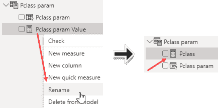

    图 13.14 – 重命名 Pclass 参数值

1.  由于变量**Sex**是分类的（F 或 M），您需要手动为其创建一个不连续的表格。因此，在功能区中点击**首页**选项卡，然后点击**输入数据**。

1.  创建表格的第一列，**Sex**，并向其中添加值 0 和 1。然后，创建新的列，**SexLabel**，当**Sex**为`0`时输入`Female`，当**Sex**为`1`时输入`Male`。

    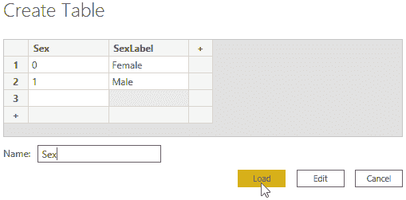

    图 13.15 – 手动输入 Sex 的数据

    将`Sex`作为表名输入，然后点击**加载**。

1.  让我们为`Sex`变量添加一个筛选器。首先在报告画布上的一个空白处点击。然后，点击筛选器视觉元素以将筛选器添加到报告中。接着，点击**SexLabel**字段，然后点击**Sex**字段（顺序很重要）。然后，点击筛选器右上角的向下箭头以选择**下拉**筛选器类型。同时，点击其格式选项，在**选择控制**组中开启**单选**选项，关闭**筛选器标题**选项，开启**标题**，并将文本输入为`Sex`。调整其底部边缘并将其移动到**乘客等级**筛选器下方。

    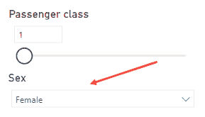

    图 13.16 – 为 Sex 创建的新下拉筛选器

1.  让我们为`Age`变量创建一个新的`What-if`参数。在功能区上点击**建模**选项卡，然后点击**新建参数**。在下一个对话框中，在**名称**字段中输入`Age param`，保留数据类型为`整数`，在**最小值**字段中输入`1`，在**最大值**字段中输入`80`，保留**增量**为`1`，并在**默认值**字段中输入`30`。保持**添加筛选器到本页**选中，然后点击**确定**。

1.  调整年龄筛选器的底部边缘。然后，点击其格式选项，关闭**筛选器标题**，开启**标题**，并将文本输入为`Age`。然后，将其移动到报告的顶部左侧，位于 Sex 筛选器下方。

1.  请确保将**年龄参数**的**年龄**值重命名为模型中代表它的变量的相同名称，即`Age`。

    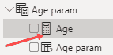

    图 13.17 – 重命名年龄参数值

1.  让我们为`SibSp`变量创建一个新的`What-if`参数。在功能区上点击**建模**选项卡，然后点击**新建参数**。在下一个对话框中，在**名称**字段中输入`SibSp param`，保留数据类型为`整数`，在**最小值**字段中输入`0`，在**最大值**字段中输入`8`，保留**增量**为`1`，并在**默认值**字段中输入`0`。保持**添加筛选器到本页**选中，然后点击**确定**。

1.  调整 SibSp 筛选器的底部边缘。然后，点击其格式选项，关闭**筛选器标题**，开启**标题**，并将文本输入为`Siblings/spouse aboard`。然后，将其移动到报告的顶部左侧，位于年龄筛选器下方。

1.  确保将**SibSp 参数**的**SibSp 值**重命名为它在模型中代表的变量的相同名称，即`SibSp`。

    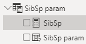

    图 13.18 – 重命名 SibSp 参数值

1.  让我们为`Parch`变量创建一个新的 What-if 参数。在功能区点击**建模**选项卡，然后点击**新建参数**。在下一个对话框中，在**名称**字段中输入`Parch param`，保留**整数**作为数据类型，在**最小值**字段中输入`0`，在**最大值**字段中输入`6`，保留**增量**为`1`，并在**默认值**字段中输入`0`。保持**添加切片器到本页**选中，然后点击**确定**。

1.  调整 Parch 切片器的底部边缘。然后，点击其格式选项，关闭**切片器标题**，开启**标题**，并将文本输入为`Parents/children aboard`。然后，将其移动到报告的顶部左侧，位于 SibSp 切片器下方。

1.  确保将**Parch 参数**的**Parch 值**重命名为它在模型中代表的变量的相同名称，即 Parch：

    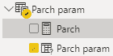

    图 13.19 – 重命名 Parch 参数值

1.  让我们为`Fare`变量创建一个新的 What-if 参数。在功能区点击**建模**选项卡，然后点击**新建参数**。在下一个对话框中，在**名称**字段中输入`Fare param`，选择`十进制数`作为数据类型，在**最小值**字段中输入`0`，在**最大值**字段中输入`515`，在**增量**字段中输入`1`，然后在**默认值**字段中输入`250`。保持**添加切片器到本页**选中，然后点击**确定**。

1.  调整 Fare 切片器的底部边缘。然后，点击其格式选项，关闭**切片器标题**，开启**标题**，并将文本输入为`Fare`。然后，将其移动到报告的顶部左侧，位于 Parch 切片器下方。

1.  确保将**Fare 参数**的**Fare 值**重命名为它在模型中代表的变量的相同名称，即`Fare`。

    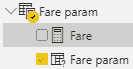

    图 13.20 – 重命名 Fare 参数值

1.  让我们为`Embarked`变量添加一个切片器。由于`Embarked`变量是分类的（`0`、`1`或`2`），你需要手动为其创建一个不连续的表格。因此，在功能区点击**主页**选项卡，然后点击**输入数据**。

1.  创建表格的第一列，**Embarked**（此名称必须与模型变量的名称相对应），然后向其中添加值 0、1 和 2。然后，创建一个新的列，**EmbarkedLabel**，并输入`Cherbourg`、`Queenstown`和`Southampton`，分别对应`0`、`1`和`2`。

    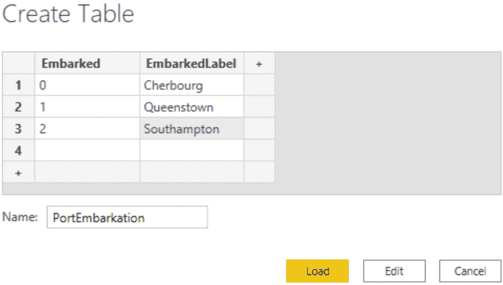

    图 13.21 – 手动输入 Embarked 数据

    将表格名称输入为`PortEmbarkation`，然后点击**加载**。

1.  现在，为 `Embarked` 变量添加一个切片器。首先在报告画布上的一个空白处点击。然后，点击切片器可视化以将切片器添加到报告中。首先点击 **EmbarkedLabel** 字段，然后点击 **Embarked** 字段（顺序很重要）。然后，点击切片器右上角的向下箭头以选择 **下拉** 切片器类型。还要点击其格式选项。在 **选择控制** 组中开启 **单选**，关闭 **切片器标题**，开启 **标题**，并将文本输入为 `启航港`。调整其底部边缘并将其移至乘客类别切片器下方。

1.  现在，在报告画布上的一个空白处点击，然后在 **可视化** 字段中点击 **Python 可视化**，并在提示时启用它。之后，将其移动到报告的中心。

1.  保持选中状态，点击 `models_df` 表的所有三个字段（**chunk_id**、**model_id** 和 **model_str**）。

1.  在保持 Python 可视化选中的同时，也点击所有参数的所有度量（带有计算器图标的那些），以及分类变量的识别字段（**Embarked** 和 **Sex** 字段）。记住，度量的名称必须与模型提供的变量名称相对应，以便报告能够正常工作。在选择度量后，你可能需要再次启用 Python 可视化。你可以通过简单地点击 Python 可视化中标记为 **选择以启用** 的黄色按钮来完成此操作。选择完成后，你应该在 Python 可视化中看到所有度量的名称以及 `models_df` 表的字段名称。

    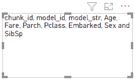

    图 13.22 – 在 Python 可视化中可见的选定度量名称

1.  现在，点击 Python 可视化的 **格式** 选项卡，展开 **标题** 区域，使用 **预测字符串** 编辑文本，并将字体大小增加到 28 点。

1.  将 `05-deserialize-ml-models-in-python-visual.py` 文件的代码复制到 `Chapter13\Python` 文件夹中，并将其粘贴到 Python 可视化脚本编辑器中。然后，点击 Python 脚本编辑器右上角的 **运行脚本** 箭头图标。你将得到一个预测（标签和分数），预测你选择的参数描述的人是否会存活。

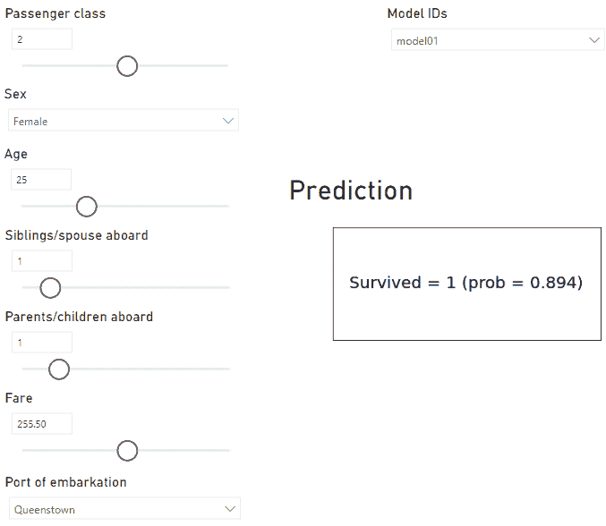

图 13.23 – 泰坦尼克号模型的完整预测模拟报告

请记住，使用这里遵循的相同方法，可以使用 R 训练的模型制作相同的报告。实际上，为了完整性，我们在存储库中添加了 `Chapter13\R` 文件夹，其中包含本节中使用的脚本，这对于获得这里得到的结果非常有用。在这些脚本中，我们使用预定义的算法（**随机森林**）训练了模型，并使用了最近引入的 **Tidymodels** 框架，该框架利用了 Tidyverse 原则。有关更多详细信息，请参阅参考文献。

哇！你已经成功在 Power BI 中创建了一个动态预测报告，这是少数开发者能够做到的！

现在我们来看看即使没有 Premium 功能、嵌入式功能或 PPU 许可证，如何调用 Microsoft 在 Power BI 中公开的 AI 和机器学习服务。

## 在 Power Query 中调用 Web 服务

在 Power Query 中与机器学习模型交互的另一种方式是调用 Web 服务。正如你可能已经知道的，机器学习模型可以用来批量处理多个观察值的评分，使用一个训练好的模型（之前描述的过程）。与机器学习模型交互的另一种选择是将它部署到 Web 服务中，以便可以通过 REST API 调用它。你已经学习了如何在 *第九章* 中与外部 API 一起工作，*调用外部 API 以丰富您的数据*。以下内容适用于外部 API：

> **重要提示**
> 
> 记住，由于出于安全原因阻止了互联网访问，你不能从 Python 或 R 可视化中通过 REST API 调用消耗外部服务。因此，你只能在 Power Query 中消耗这些服务。

作为示例，在本节中，你将了解如何通过 **Azure Machine Learning** 调用已发布端点的预测，以及如何使用认知服务中 **Azure Text Analytics** 提供的服务。你可以在 Power Query 中使用一些 M 代码来访问这些服务，尽管这并不完全直接。幸运的是，有可用的 SDK，这使得访问公开的服务变得容易得多。这些 SDK 是为 Python 开发的，因此我们的示例将仅限于 Python。

让我们先看看如何与使用 Azure AutoML 训练的模型交互。

### 在 Power Query 中使用 Azure AutoML 模型

在本节中，你将首先了解如何使用 Azure AutoML GUI 训练机器学习模型。之后，你将使用发布在 Azure 容器实例上的模型作为 Power BI 中的 Web 服务。

#### 使用 Azure AutoML UI 训练模型

为了使用 Azure AutoML，您必须首先有权访问 Azure 订阅（记住您可以创建一个免费账户，如链接所示：[`bit.ly/azure-free-account`](https://bit.ly/azure-free-account))。之后，您需要创建一个 **Azure 机器学习工作区**，通过 Azure 提供的不同技术来训练模型。您可以通过简单地遵循链接中的步骤来完成此操作：[`bit.ly/create-azureml-workspace`](https://bit.ly/create-azureml-workspace)。一旦工作区被分配，您就可以登录到 **Azure 机器学习工作室**，这是一个所有您将与之工作的机器学习资产都组织得最好的环境。执行以下步骤以登录到 Azure ML Studio 并开始一个 AutoML 实验：

1.  前往 [`ml.azure.com/`](https://ml.azure.com/)。

1.  您将被提示选择您的 Azure 订阅和要工作的 Azure ML 工作区。点击 **开始**。您将看到如下内容：

    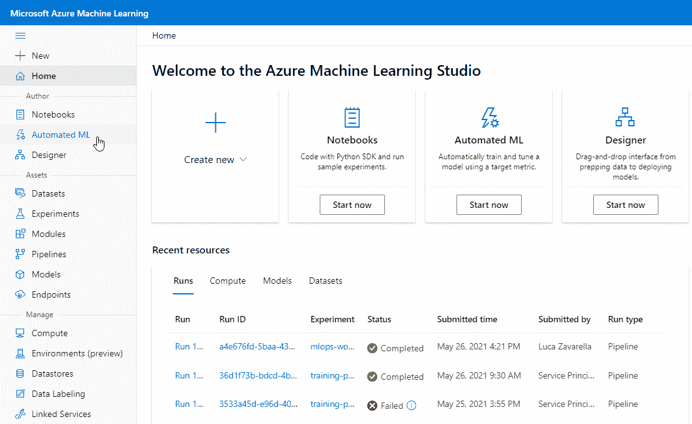

    图 13.24 – Azure ML Studio 门户

1.  首先，您需要导入用于训练模型的数据库集。您将使用上一节中完成的缺失值插补所获得的相同数据集。点击左侧菜单上的 **数据集**，然后点击 **创建数据集**。

    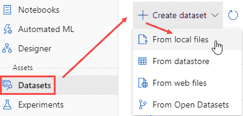

    图 13.25 – 在 Azure ML 中创建新的数据集

1.  您将被提示输入数据集名称和类型。将名称输入为 `titanic-imputed`，并将类型保留为 **表格**。

    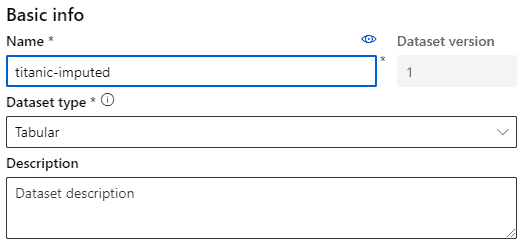

    图 13.26 – 选择数据集名称和类型

    然后，点击 **下一步**。

1.  您必须上传包含泰坦尼克号灾难插补数据的 CSV 文件。因此，点击 **上传**，然后点击 **上传文件**，最后通过 **打开文件** 对话框在 `Chapter13` 文件夹中选择 `titanic-imputed.csv` 文件。文件将被上传到在实例化新的 Azure ML 工作区时在幕后创建的默认 Azure Blob 存储中（`workspaceblobstore`）。点击 **下一步**。

1.  在下一页，您将预览您正在导入的数据集。引擎会自动为您选择最佳导入选项。但如果您想更改某些内容，您可以在这一页进行更改。在这种情况下，一切都已经就绪，所以点击 **下一步**。

1.  在下一页，您可以更改您正在读取的数据的插补模式。在这种情况下，保留每个字段的推断类型，因为导出的 CSV 文件包含整数和小数数值。然后，点击 **下一步**。

1.  将显示一个摘要页面。因此，只需点击 **创建**，您的数据集就会被添加到 Azure ML。

1.  现在，您需要创建一个用于模型训练的计算集群。点击左侧菜单上的 **计算** 选项卡，然后点击 **计算集群**，最后点击 **新建**。

    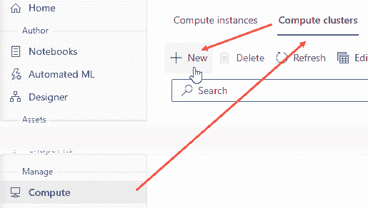

    图 13.27 – 创建新的计算集群

1.  然后，您可以选择集群的首选位置以及每个集群节点要使用的虚拟机类型和大小。您可以保留默认选择并点击**下一步**。

1.  为您的集群选择一个名称（在我们的案例中，是`cluster`），最小节点数（保持为 0 以使其在未使用时自动关闭），以及最大节点数（将其设置为 2）。然后，点击**创建**以分配您的计算集群。

1.  现在，点击左侧菜单上的**自动机器学习**选项卡，然后点击**新建自动机器学习运行**。

    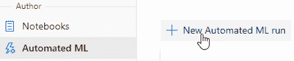

    图 13.28 – 创建新的 AutoML 实验

1.  在下一页，选择**titanic-imputed**数据集并点击**下一步**。

1.  现在，您可以通过输入新实验（虚拟文件夹）的名称来配置运行，该实验将包含所有 AutoML 运行（我们使用了`titanic`作为名称），机器学习目标列（`Survived`，预测的目标），以及用于执行 AutoML 运行的计算集群（之前创建的`cluster`）。

    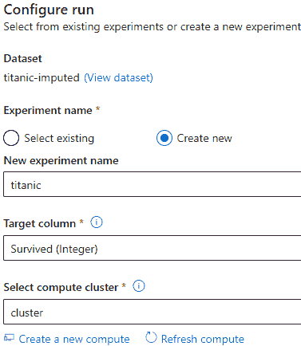

    图 13.29 – 配置您的 AutoML 运行

1.  您可以声明您想要运行的机器学习实验类型。在我们的案例中，它是一个分类。

    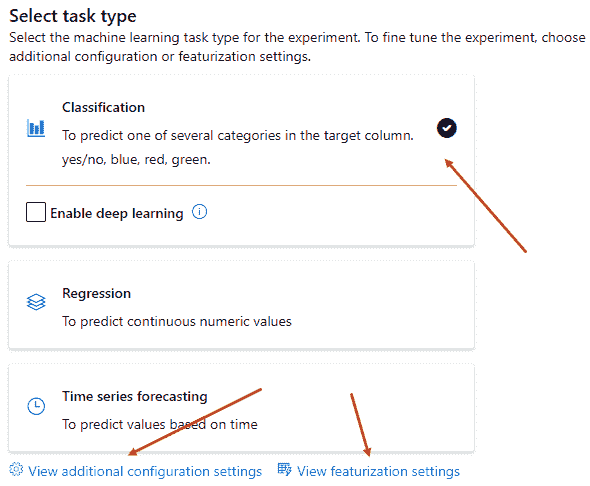

    图 13.30 – 设置 AutoML 任务类型

1.  点击**查看更多配置设置**，您可以选择在实验中使用的首要指标。选择**AUC 加权**选项，然后点击**保存**。

1.  通过点击**查看特征化设置**，您可以启用 AutoML 提供的自动特征化选项。默认情况下，它是开启的。您还可以为每一列选择特征类型以及为每个缺失值填充策略（策略是简单的）。保持一切在**自动**，然后点击**保存**。

1.  现在您可以点击**完成**以开始您的 AutoML 实验。您将被重定向到**运行**页面，过一会儿，您将看到实验正在运行。

    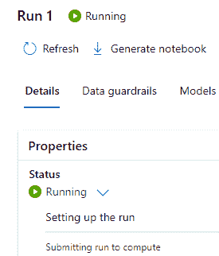

    图 13.31 – 您的 AutoML 实验正在运行

1.  大约 30 分钟后，实验应该结束。点击**AutoML 运行**页面上的**模型**选项卡，您将看到根据最佳性能排序的训练管道。

    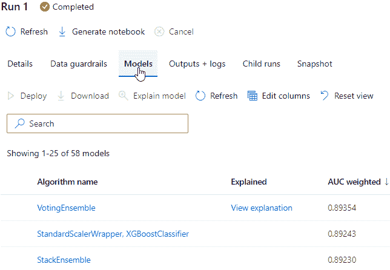

    图 13.32 – AutoML 找到的最佳性能管道

1.  对于最佳性能模型（**VotingEnsemble**），还自动生成了**可解释性仪表板**，您可以通过点击**查看解释**来访问。有关此内容的更多详细信息，请参阅参考资料。现在，点击**VotingEnsemble**链接以转到使用该管道训练模型的特定运行。然后，点击**部署**按钮。

    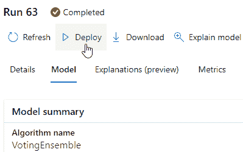

    图 13.33 – 将最佳模型部署到 Web 服务

    右侧将出现一个新表单，要求提供有关要在 Web 服务上部署的模型的信息。只需给模型端点起一个名字（`titanic-model`），选择**Azure 容器实例**作为计算类型，因为这将不是一个生产环境，并激活**启用认证**功能。在生产环境中，*Azure Kubernetes 服务*（AKS）是最佳选择。然后，点击**部署**并等待模型部署。当**部署状态**字段在**模型**摘要中变为**成功**时，点击**titanic-model**端点链接。

1.  端点**详细信息**页面包含有关服务的所有信息。部署至少 10 分钟后，它必须处于健康部署状态才能使用。你可以点击**测试**选项卡，通过提供测试输入数据来测试你的端点。我们最感兴趣的选项卡是**消费**，其中指示了从外部系统调用 REST API 的坐标（REST 端点 URL 和认证密钥）。你还可以在**消费选项**部分直接复制允许你在 Python 中消费服务的代码片段。我们将使用此代码的变体在 Power Query 中对测试观测值进行评分。

到目前为止，模型已经准备好在 Web 服务上通过 REST API 进行消费。现在让我们在 Power Query 中使用它。

#### 在 Power BI 中消费已部署的 Azure ML 模型

使用 Azure ML Studio 中**端点消费**选项卡提出的 Python 代码的变体，我们创建了一个函数，该函数接受端点 URL、API 密钥以及包含要评分观测值的 dataframe 作为参数。在输出中，我们得到一个只包含`predicted_label`列的 dataframe，其中包含每个观测值的评分。

从通过 Azure AutoML 训练并在 Azure 容器实例上作为 Web 服务部署的模型中获取测试数据集预测的步骤如下：

1.  点击**获取数据**，选择**文本/CSV**，然后点击**连接**：

1.  在`Chapter13`文件夹中选择`titanic-test.csv`文件，然后点击**打开**。

1.  你将看到测试数据的预览。点击**转换数据**。

1.  在功能区点击**转换**，然后点击**运行 Python 脚本**。

1.  在`Chapter13\Python`文件夹中的`06-use-azure-ml-web-service-in-power-bi.py`文件中输入脚本。请记住相应地编辑端点 URL 和密钥。

1.  我们只对`scored_df`数据框感兴趣。因此，点击其**表**值。

1.  你将看到包含一个额外列 – `predicted_label`的测试数据集的预览。

1.  在功能区点击**主页**，然后点击**关闭并应用**。

太棒了！你能够在没有 PPU 许可证或高级容量的情况下，消费在 Azure 机器学习上训练并部署到 Azure 容器实例中的模型。

### 在 Power Query 中使用认知服务

Azure 认知服务 **文本分析 API** 是一种提供文本挖掘和分析自然语言处理 (NLP) 功能的服务。提供的功能包括情感分析、意见挖掘、关键词提取、语言检测和命名实体识别。

首先，您需要通过 Azure 门户部署文本分析资源。

#### 配置文本分析

您必须拥有 Azure 订阅才能使用这些服务。然后，您需要按照以下步骤创建文本分析资源：

1.  前往 Azure 门户 ([`portal.azure.com/`](https://portal.azure.com/)) 并点击 **创建资源** 的加号图标。

1.  在搜索框中开始输入文本字符串，**文本分析** 选项将出现。点击它。然后，点击 **文本分析** 页面上的 **创建** 按钮。

1.  忘记选择 **自定义问答** 选项，而是点击 **继续创建您的资源**。

1.  在 **创建文本分析** 页面上，选择您喜欢的区域并给服务命名（在我们的例子中，`textanalytics555`；您可以使用您选择的唯一名称）。将您的资源分配给名为 `text-analytics` 的新资源组。然后，选择 **免费 F0** 定价层，勾选 **负责任的 AI 通知** 选项，并点击 **审查 + 创建**。然后，在下一页上点击 **创建**。

1.  资源部署完成后，点击 **转到资源** 并在下一页上点击 **API 密钥** 链接。然后，注意 **KEY 1** 的详细信息（您可以在其右侧点击 **复制到剪贴板** 图标），以及端点 URL。您将在 Python 代码中使用这些信息。

您的资源现在可以通过专门的 Python SDK 使用了。

#### 配置您的 Python 环境和 Windows

为了使用文本分析，您必须首先按照以下步骤安装 **Microsoft Azure Text Analytics Python 客户端库**：

1.  打开您的 Anaconda Prompt。

1.  通过输入以下命令切换到您的 PyCaret 环境：`conda activate pycaret_env`。

1.  通过输入以下命令安装客户端库：`pip install azure-ai-textanalytics==5.1.0`。

之后，为了避免在 Windows 10 中出现“*Python 的 ssl 模块不可用*”错误，您需要将 `pycaret_env\Library\bin` 路径添加到 Windows 环境变量 `PATH` 中。以下是执行此操作的步骤：

1.  点击屏幕左下角的 Windows **开始** 图标，并开始数字化 x `变量`.string 这将搜索所有名称中包含字符串变量的 Windows 选项。然后，点击 **编辑您的账户的环境变量**。

1.  在 **环境变量** 窗口中，在 **用户变量** 下双击 **Path** 变量（如果你为所有用户安装了 Miniconda，你需要更改 **Path** 系统变量）。在出现的 **编辑环境变量** 对话框中，点击 **新建** 按钮，并添加路径 `C:\<你的路径>\miniconda3\envs\pycaret_env\Library\bin`。然后，在所有窗口上点击 **确定**。

1.  你需要重新启动系统以使更改生效。

你现在可以准备好使用 Power Query 消费服务了。

#### 在 Power BI 中消费文本分析 API

在本节中，我们将向您展示如何通过在虚构公司 *Fabrikam Fiber* 上的文本分析进行情感分析。它在美国提供有线电视和相关服务，允许用户在其网站上留下评论。你的目标是定义每个评论的积极程度、中立程度和消极程度。

基本上，一旦客户端通过 URL 和密钥进行认证，你就可以通过 `analyze_sentiment()` 方法轻松地进行情感分析，而无需了解任何 NLP 基础。请注意，文本分析免费层仅限于一次处理 10 个文档（在我们的案例中是评论）。因此，我们构建的代码包括将评论分成每组 10 个，并对每个组调用 API。

让我们看看如何做到这一点：

1.  点击 **获取数据**，选择 **文本/CSV**，然后点击 **连接**：

1.  在 `Chapter13` 文件夹中选择 `FabrikamComments.csv` 文件，然后点击 **打开**。

1.  你将看到 Fabrikam 数据集的预览。然后，点击 **转换数据**。

1.  在功能区上点击 **转换**，然后点击 **运行 Python 脚本**。

1.  在 `Chapter13\Python` 文件夹中找到 `07-use-text-analytics-in-power-bi.py` 文件中的脚本。请记住，要适当地替换你之前在 Azure 门户中复制的服务 URL 和其密钥。

1.  我们只对 `sentiment_enriched_df` 数据框感兴趣。所以点击它的 **表** 值。

1.  你将看到 Fabrikam 数据集的预览，其中增加了以下附加列：`comment_sentiment`、`overall_positive_score`、`overall_neutral_score` 和 `overall_negative_score`：

    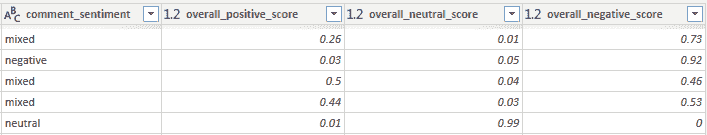

    图 13.34 – 额外的情感分析列

1.  在功能区上点击 **主页**，然后点击 **关闭并应用**。

这太棒了！多亏了 Python 库 `azure.ai.textanalytics`，你只用几行代码就能以非常简单的方式执行情感分析。同样容易，你还可以使用 Power BI 中的其他认知服务提供的服务，这些服务通过其他 Python SDK 实现。

## 摘要

在本章中，你学习了 Power BI 如何通过数据流功能默认与 Microsoft AI 服务交互。你还了解到，通过使用 AutoML 平台，你可以绕过 Power BI 与 Microsoft AI 服务接口所需的许可问题（PPU 许可证或高级容量）。你使用了一个本地 AutoML 解决方案（PyCaret）和 Azure AutoML 在云端解决了一个二元分类问题。你还使用了认知服务的文本分析，直接使用 Python SDK 进行了一些情感分析。

你已经了解到，通过人工智能的丰富功能主要发生在 Power Query 中（它允许访问互联网），尽管你看到过一种情况，直接在 Python 视图中使用机器学习模型可能更方便。

在下一章中，你将看到如何在 Power BI 中实现数据集的探索。

## 参考文献

对于额外的阅读，请参阅以下书籍和文章：

1.  *使用数据流实现 AI*](https://docs.microsoft.com/en-us/power-bi/transform-model/dataflows/dataflows-machine-learning-integration)

1.  *《Azure 自动化机器学习（AutoML）综述*](https://medium.com/microsoftazure/a-review-of-azure-automated-machine-learning-automl-5d2f98512406)

1.  *《使用 Microsoft Azure 进行自动化机器学习，作者：Dennis Michael Sawyers，Packt 出版社》*](https://www.amazon.com/Automated-Machine-Learning-Microsoft-Azure/dp/1800565313/)

1.  *机器学习中概念漂移的温和介绍*](https://machinelearningmastery.com/gentle-introduction-concept-drift-machine-learning/)

1.  *使用 K 最近邻算法进行机器学习基础知识*](https://towardsdatascience.com/machine-learning-basics-with-the-k-nearest-neighbors-algorithm-6a6e71d01761)

1.  *Python 的「predict_proba」实际上并不预测概率（以及如何修复它）*](https://towardsdatascience.com/pythons-predict-proba-doesn-t-actually-predict-probabilities-and-how-to-fix-it-f582c21d63fc)

1.  *使用可解释性包在 Python 中解释 ML 模型和预测*](https://docs.microsoft.com/en-us/azure/machine-learning/how-to-machine-learning-interpretability-aml)

1.  *《开始使用 Tidymodels》*](https://www.tidymodels.org/start/)
