# 14 探索性数据分析

在第十三章*在不使用高级或嵌入式容量的情况下使用机器学习*中，我们提到，在数据集上盲目地使用**自动机器学习**（**AutoML**）解决方案通常不会导致非常精确的模型。这是因为需要通过在早期阶段使用统计工具来理解数据集的最内在特征，以便提取有用信息，从而获得更好的模型。

用于此类数据集分析的方法被称为**探索性数据分析**（**EDA**），它最初由 John Turkey 提出，旨在鼓励统计学家探索数据并制定可能导致新的数据收集和实验的假设，从而最终丰富数据集中变量之间的模式。

在本章中，你将了解以下主题：

+   EDA 的目标是什么？

+   使用 Python 和 R 进行探索性数据分析

+   Power BI 中的探索性数据分析

## 技术要求

本章要求你拥有一个正常工作的互联网连接，并且**Power BI 桌面版**已经安装在你的机器上。你必须已经按照第二章*配置 Power BI 中的 R*和第三章*配置 Power BI 中的 Python*中概述的方式正确配置了 R 和 Python 引擎以及 IDE。

## EDA 的目标是什么？

EDA 的目标是确保随后用于更复杂过程的数据库首先必须是干净的，也就是说，它没有缺失值和异常值，这些异常值可能会扭曲可能后续的分析。此外，在这个阶段选择实际上带有信息的变量，并尝试删除那些主要决定噪声的变量，这对于消除可能导致后续过程得出结论的不准确来源至关重要。在这个阶段，研究变量之间的关联并从分析的数据中获得见解，以证明任何随后要应用的更复杂处理是重要的。

最终，数据探索性分析（EDA）的阶段如下：

1.  理解你的数据

1.  清洗你的数据

1.  发现变量之间的关联

让我们详细看看它们涉及哪些类型的分析。

### 理解你的数据

在这个第一阶段，理解每个变量在数据集所代表的问题背景下的含义是至关重要的。一旦与变量关联的可度量的业务实体变得清晰，就更容易得出关于它们如何相互作用的结论。

了解**数据集的大小**，即变量数量和观测数量（行数），有助于你获得将要处理的数据大小的初步概念。之后，立即识别并定义所涉及的**变量类型**（可以是数值型或分类型）对于以最合适的方式可视化它们至关重要。

然后，了解数据集中**数值变量**的**描述性统计**有助于对它们的值有更大的敏感性。对于每个数值变量，你可以通过突出其偏度和箱线图来表示其直方图，以便更好地分析其分布，正如你在*第十一章*中已经学习过的，*添加统计洞察：关联性*。

对于**分类变量**而言，另一方面，了解不同类别的数量以及它们所识别的观测特征非常重要。可以使用**条形图**表示每个独特类别的频率和相对于总数的相对百分比。以下是一个考虑泰坦尼克号灾难数据集的例子：

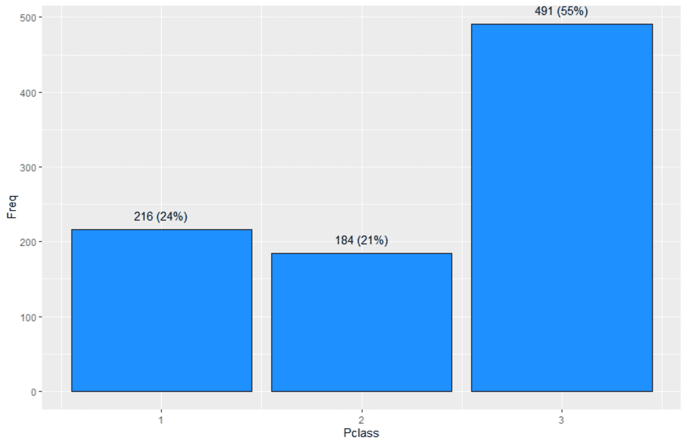

图 14.1 – Pclass 的柱状图

重要的是检查是否有一个以上的类别具有非常低的频率，因为这可能意味着将它们合并为一个类别是有意义的。这通常在机器学习项目的后续阶段（称为**特征工程**）中完成，以避免例如拥有一个不够通用的模型，该模型无法适用于它必须适应的所有情况（过度拟合的现象），因此确定其性能不佳。

同样非常重要的一点是，给分析师提供图形化表示一对变量的可能性，以便理解它们如何相互作用（数据集的**多元分析**）。显然，可视化的类型会根据涉及的变量数据类型而变化：在两个数值变量的情况下，你将有一个散点图；在两个分类变量的情况下，你将有一个马赛克图；在一个数值变量和一个分类变量的情况下，你将为每个类别有几个箱线图（或雨云图）。

在这个阶段，我们可以继续描述处理数据清洗的阶段。

### 清洗你的数据

如你在*第十二章*中学习的，*添加统计洞察：异常值和缺失值*，获得一个尽可能接近其所代表真实情况的统计稳健数据集最重要的活动是这两个：

+   确定和处理**异常值**

+   填充**缺失值**

在 EDA 过程中，利用所有有助于直接检测异常值和缺失值的有用视觉和非视觉工具非常重要。这将允许在后续阶段修复发现的任何异常。

如你之前所学的，对于**单变量异常值分析**，使用箱线图表示数值变量的单个分布非常有用。而且，在通过 Yeo-Johnson 变换转换变量后，能够看到哪些异常值仍然存在或被添加进来也非常有用。这样你可以看到是否值得尝试将分布标准化，以处理尽可能少的异常值。

考虑到一个数值变量和一个分类变量，进行**异常值的双变量分析**也很方便，这样你可以研究数值变量分布的异常，这些异常被分类变量的每个标签所分解。

在仔细研究和识别可能的异常值之后，还很重要的一点是要有一个方便的变量之间**缺失值**的组合和交集的可视化。因此，目标不仅是了解每个变量的缺失值的数量和相对百分比值，还要通过 upset 图方便地可视化这些缺失值是如何相互作用的。

最后，让我们转向变量之间关联的分析。

### 发现变量之间的关联

如你在第十一章*添加统计洞察：关联*中学到的，了解数据集中变量之间的**关联程度**当然有助于你理解哪些变量携带了最多的信息，哪些变量主要产生噪音。选择最有信息的变量并将它们用于训练机器学习模型，无疑有助于你获得更稳定和性能更好的结果。

拥有可视化工具来解释成对数值-数值、数值-分类和分类-分类变量之间的关联，无疑有助于特征选择的艰难任务。

有一些工具可以让你自动生成 EDA 报告。让我们看看它们是什么。

## 使用 Python 和 R 进行探索性数据分析

如果你必须仅使用 Python 或 R 进行数据探索，有一些工具可以自动生成一系列可视化，使你的生活变得更轻松。以下有两个列表，一个用于 Python 工具，另一个用于 R 工具，以防你需要任何工具。在 Python 中找到交互式数据分析工具比在 R 中更容易。R 中可用的包通常提供包装器，这极大地简化了通过编码进行的 EDA。

用于 EDA 的 Python 库如下：

+   **SweetVIZ** ([`pypi.org/project/sweetviz/`](https://pypi.org/project/sweetviz/)): 一个开源的 Python 库，通过仅用两行代码即可生成美观、高密度的可视化，从而启动 EDA。

+   **Lux** ([`lux-api.readthedocs.io/`](https://lux-api.readthedocs.io/)): 一个通过自动化可视化过程和数据分析流程来简化快速和轻松数据探索的 Python 库。

+   **Pandas Profiling** ([`pandas-profiling.github.io/pandas-profiling/`](https://pandas-profiling.github.io/pandas-profiling/)): 从 pandas 数据框生成用于数据分析的概要报告。

+   **PandasGUI** ([`github.com/adamerose/pandasgui`](https://github.com/adamerose/pandasgui)): 一个用于查看、绘图和分析 pandas 数据框的图形用户界面。

+   **D-Tale** ([`github.com/man-group/dtale`](https://github.com/man-group/dtale)): 结合 Flask 后端和 React 前端，为您提供一个轻松查看和分析 pandas 数据结构的方法。

EDA 的 R 包如下：

+   **ExPanDaR** ([`github.com/joachim-gassen/ExPanDaR`](https://github.com/joachim-gassen/ExPanDaR)): ExPanD 是一个基于 Shiny 的应用程序，支持交互式数据探索分析。

+   **ggquickeda** ([`github.com/smouksassi/ggquickeda`](https://github.com/smouksassi/ggquickeda)): 一个 R Shiny 应用程序/包，使您能够快速探索数据，并通过散点图、点图、箱线图、条形图等实时检测趋势。

+   **summarytools** ([`github.com/dcomtois/summarytools`](https://github.com/dcomtois/summarytools)): 这是一个用于数据清洗、探索和简单报告的 R 包。它与 R 中常用的报告软件和工具（如 RStudio）集成良好。

+   **DataExplorer** ([`boxuancui.github.io/DataExplorer/`](https://boxuancui.github.io/DataExplorer/)): 目的是自动化大部分数据处理和可视化，使用户能够专注于研究数据和提取见解。

查看参考文献以获取有关上述工具的更多详细信息。

如果您想利用 Power BI 作为可视化工具，不幸的是，您无法使用上述 Python 工具自动生成的许多可视化。因此，我们将使用 R 包通过代码生成必要的用于基本 EDA 的内容，因为 R 可以非常容易地获得任何复杂性的高质量图形。让我们看看如何。

## Power BI 中的数据探索分析

在本节中，我们将广泛使用`GGplot2`包，这是一个基于**图形语法**的高级 R 库，用于创建图表。我们并不打算详细介绍该包所暴露的每个功能，即使它在伴随章节的代码中得到了相当广泛的应用。我们的目标是，一如既往地，提供易于定制的代码，用于在其他项目中使用，最重要的是，提供一个更详细查看所用函数的起点。有关更多详细信息，请参阅本章的参考文献。

除了 Tidyverse 在 R 中提供的工具（包括`ggplot2`）之外，我们还将使用`summarytools`和`DataExplorer`包在 Power BI 中创建 EDA 报告。因此，安装它们是必要的：

1.  打开 RStudio 并确保它引用的是您最新的 CRAN R（在我们的例子中是版本 4.0.2）。

1.  点击**控制台**窗口并输入以下命令：`install.packages('Rcpp')`。这是一个`summarytools`的依赖项。然后，按*Enter*键。

1.  输入以下命令：`install.packages('summarytools')`。然后，按*Enter*键。

1.  输入以下命令：`install.packages('DataExplorer')`。然后，按*Enter*键。

在这一点上，我们可以开始实施我们的 EDA 报告。然而，首先重要的是强调，在您的报告中使用的每个 R 脚本中都必须定义变量的数据类型。

> **重要提示**
> 
> 为了进行数据探索分析（EDA），定义要分析的数据集中的变量数据类型非常重要。根据特征的数据类型，应用不同的分析策略。数据模型中 Power BI 表的列的数据类型不能与 R 处理的数据类型一一对应。因此，需要在 R 脚本中直接定义列的数据类型，以防止 Power BI 覆盖它们。

此外，您将在`Chapter14\R`文件夹中找到的`00-init-dataset.R`脚本将用作 EDA 报告在 Power BI 中的**官方 CSV 连接器**，因为在这种情况下，将数据直接加载到 R 中用于每个脚本更为方便。在加载您的数据后，您需要定义要删除的列，包括分类和整数字段。指定为整数的列将被视为数值或分类变量，由分析师根据最能描述分析现象的函数来选择。所有其他列都应视为数值：

```py
library(readr)
library(dplyr)
dataset_url <- 'http://bit.ly/titanic-dataset-csv'
src_tbl <- read_csv(dataset_url)
vars_to_drop <- c('PassengerId')
categorical_vars <- c('Sex', 'Ticket', 'Cabin', 'Embarked')
integer_vars <- c('Survived', 'Pclass', 'SibSp', 'Parch')
```

如果您需要导入 Excel 文件而不是 CSV 文件，您已经知道如何根据在*第七章*中学到的知识对代码进行更改。

然后脚本将定义应用适当转换的`tbl` tibble：

```py
tbl <- src_tbl %>% 
  mutate( 
    across(categorical_vars, as.factor),
    across(integer_vars, as.integer)
  ) %>% 
  select( -all_of(vars_to_drop) )
```

此脚本将预先加载到您为 EDA 报告开发的每个其他 R 脚本中，以确保您在内存中准备好具有精确数据类型的特定数据集。

因此，让我们从数据集的基本统计信息开始开发报告。

### 数据集摘要页面

EDA 报告的第一页负责向分析师提供数据集中包含数据的概述。一些**基本信息**将通过`DataExplorer`包的`introduce()`函数的输出得到展示。这些信息如下：

+   行和列的数量

+   离散（分类）和连续（数值）列的数量

+   所有缺失值的列数

+   数据集中缺失值的总数

+   完整行的数量，即没有缺失值

+   数据集中观测值的总数，即行数乘以列数

+   内存使用量（以 KB 为单位）

+   重复行的数量

然后从`summarytools`包的`dfSummary()`函数的输出开始计算整个数据集的**摘要统计表**。它包含的每个变量的信息如下：

+   变量名和数据类型

+   根据数据类型的基本统计信息

+   唯一有效值的数量（非空）

+   有效值的频率

+   有效值的数量及其百分比

+   缺失值的数量及其百分比

最后，由于 `summarytools` 包的 `descr()` 函数，提供了更多关于数值变量的详细统计信息。除了最常见的统计信息外，还添加了以下统计信息：

+   **中位数绝对偏差** (*mad*): 与方差和标准差不同，它是对数据集分布广泛程度的鲁棒性度量。它通常用于非正态分布。

+   **四分位距** (*iqr*): 正如您在箱线图中看到的，它是分布值大部分所在位置的度量。

+   **变异系数** (*cv*): 它是相对变异性的度量，因为它是有标准差与平均值的比率。

+   **偏度系数** (*skewness*): 它是衡量分布对称性缺乏的度量。

+   **峰度** (*kurtosis*): 它是衡量数据相对于正态分布是重尾还是轻尾的度量。

通过这些信息，分析师可以全面了解数据集中包含的数据的形状。

让我们看看如何在 Power BI 中实现它们。首先，确保 Power BI Desktop 在 **选项** 中引用了正确的 R 版本。然后按照以下步骤操作：

1.  点击 **获取数据**，搜索 `script`，选择 **R 脚本**，然后点击 **连接**。

1.  将您在文件 `01-basic-info.R` 中找到的脚本输入到 `Chapter14\R` 文件夹中。确保 `init_path` 变量指向同一文件夹中可以找到的 `00-init-dataset.R` 文件的正确绝对路径。

1.  在导航对话框中，选择 `basic_info_tbl`、`numeric_vars_descr_stats_tbl`、`summary_tbl` 和 `sample_tbl` 表。然后点击 **加载**。

1.  在 Power BI Desktop 右侧的 **字段** 面板上加载了四个表之后，您可以通过勾选它们的度量来简单地将它们添加到您的报告画布中。例如，展开 `basic_info_tbl` 内容，并按此顺序检查字段 `attribute`（字符串字段）和 `value`（数值字段），以获取表格图表（如果您首先点击数值字段，您将得到柱状图）。画布上会出现一个表格：

    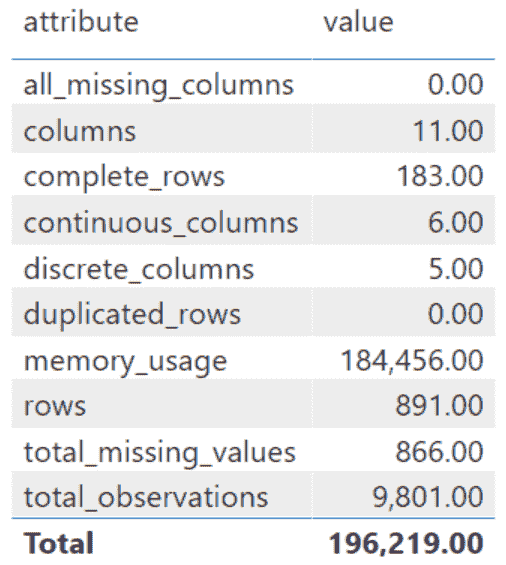

    图 14.2 – 首次状态的基本信息表

    在这个例子中，**总计** 行没有意义。因此，必须在视觉的 **格式** 属性上将其消除。

1.  确保选择了表格视觉，然后点击右侧 **可视化** 面板上的 **格式** 选项（墙刷图标）。展开 **总计** 部分，关闭 **总计** 选项。然后展开 **字段格式化** 部分，从组合框中选择 `value` 字段，并在 **值小数位数** 文本框中输入 `0`。最后，打开 **标题** 选项并展开其选项。然后在文本框中输入标签 `Basic Dataset Info`。

1.  现在，在画布上的一个空白位置单击，展开`summary_tbl`字段，并按照以下顺序检查：**变量**，**统计值**，**唯一有效**，**有效频率**，**有效**，和**缺失**。之后，展开视觉的右侧边缘，以便查看所有列。

1.  如同在**步骤 5**中对`basic_info_tbl`表格所做的那样，也删除此表格的**总计**行，并使用此字符串作为标签：`Dataset Summary`。

1.  现在，在画布上的一个空白位置单击，展开`numeric_vars_descr_stats_tbl`字段，并按照以下顺序检查：**变量**，**平均值**，**标准差**，**最小值**，**四分位数 1**，**中位数**，**四分位数 3**，**最大值**，**绝对偏差**，**四分位距**，**变异系数**，**偏度**，和**峰度**。之后，展开视觉的右侧边缘，以便查看所有列。

1.  对于这个表格，也删除**总计**行，并使用以下字符串作为标签：`Descriptive Statistics for Numeric Variables`。

1.  现在，在画布上的一个空白位置单击，展开`sample_tbl`字段，并在检查**名称**之后按照你想要的顺序检查所有字段（在开始检查非数字字段时，默认选择的视觉将是表格）。

1.  对于这个表格，也删除**总计**行，并使用以下字符串作为标签：`Dataset Sample`。

1.  在画布上重新定位视觉元素并稍微扩展单个表格列之后，你将得到你的第一个 EDA 报告页面，如下所示：

    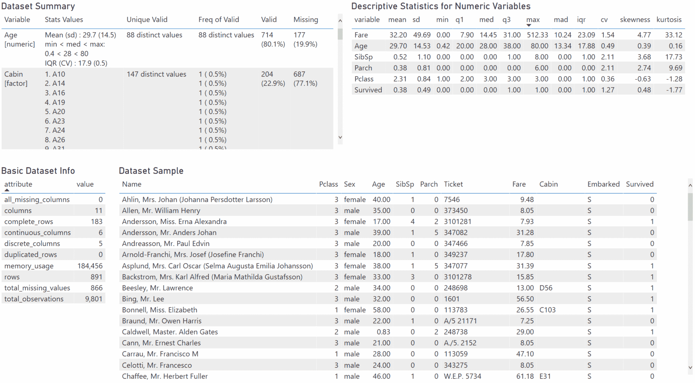

    图 14.3 – EDA 报告的摘要页面

1.  只需使用标签`摘要`重命名页面（右键单击底部页面标签并点击**重命名页面**）。

请记住以下几点：

> **重要提示**
> 
> 为了显示数据集的样本细节，你必须在 Power BI Desktop 中正确选择其字段。这意味着，如果你想更改源数据集，你必须手动编辑样本细节视觉。

干得好！你刚刚开发了你的 EDA 报告的第一页。

让我们现在尝试开发一个专门用于分析缺失值的页面。

### 缺失值探索

虽然一些关于缺失值的信息以文本格式出现在新开发的**摘要**页面上，但提供一个包含专门针对缺失值的视觉的页面对于分析师来说绝对是一个优势。

除了显示表示每个变量缺失值百分比的简单**棒棒糖图**外，你还将使用** upset 图**来允许分析师找出哪些变量的组合被发现完全缺失，正如你在**第十二章**，**添加统计洞察：异常值和缺失值**中学到的那样。

因此，让我们开始开发**关联**页面：

1.  如果尚未存在，通过在画布底部的标签附近单击加号图标创建一个新的 Power BI 报告页面。将创建一个名为**页面 1**的新标签。

1.  首先，在报告画布上的一个空白处点击。然后点击**可视化**面板中的**R Visual**图标，并在提示时启用它。之后，将其移动到页面左侧，并调整大小以填充一半。

1.  保持选中状态，点击`basic_info_tbl`表的`attribute`字段。你不会在 R Visual 代码中使用这个字段，但你必须选择至少一个度量来启用可视化中的脚本。

1.  现在点击 R Visual 的**格式**选项卡，并在**标题**部分输入字符串`缺失值百分比`作为标题。

1.  将文件`02-missing-values-plot-1.R`的代码复制到`Chapter14\R`文件夹中，并将其粘贴到 R Visual 脚本编辑器中。然后点击 R 脚本编辑器右上角的**运行脚本**箭头图标（每次请求时启用 R Visual）。你将在其中得到棒棒糖图。

1.  再次在报告画布上的一个空白处点击。然后点击**可视化**面板中的**R Visual**图标，并在提示时启用它。之后，将其移动到页面右侧，并调整大小以填充一半。

1.  保持选中状态，点击`basic_info_tbl`表的`attribute`字段。你不会在 R Visual 代码中使用这个字段，但你必须选择至少一个度量来启用可视化中的脚本。

1.  现在点击 R Visual 的**格式**选项卡，并在**标题**部分输入字符串`变量同时缺失`作为标题。

1.  将文件`03-missing-values-plot-2.R`的代码复制到`Chapter14\R`文件夹中，并将其粘贴到 R Visual 脚本编辑器中。然后点击 R 脚本编辑器右上角的**运行脚本**箭头图标（每次请求时启用 R Visual）。你将在其中得到 upset 图。

1.  只需将当前页面重命名（在页面底部的标签上右键单击并点击**重命名页面**）使用标签`缺失值分析`。

很好！现在分析师理解缺失值对数据集的影响要容易得多。整个页面将如下所示：

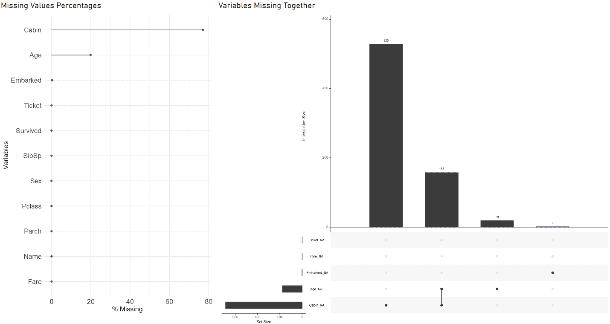

图 14.4 – EDA 报告的缺失值分析页面

现在让我们转向开发一个专门用于数据集单变量分析的页面。

### 单变量探索

数据集的一维分析包括对其组成变量的分布的分析。根据变量的数据类型，用于辅助这一分析的可视化工具不同。

对于数值变量的分析，使用几个图表来更好地描绘它们的分布：第一张图中有**直方图和密度图**重叠，而在第二张图中有一个**雨云图**（密度图和箱线图的组合）。在*图 14.5*中，你可以找到一个数值变量图表的例子：

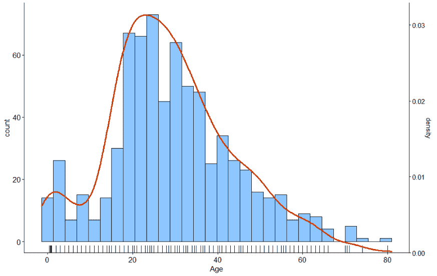

图 14.5 – 年龄的直方图和密度图

对于分类变量，使用简单的**条形图**，目的是限制显示的不同类别的最大数量，以免超过预定义的数量，并将其他类别分组到虚拟的**其他**类别中：

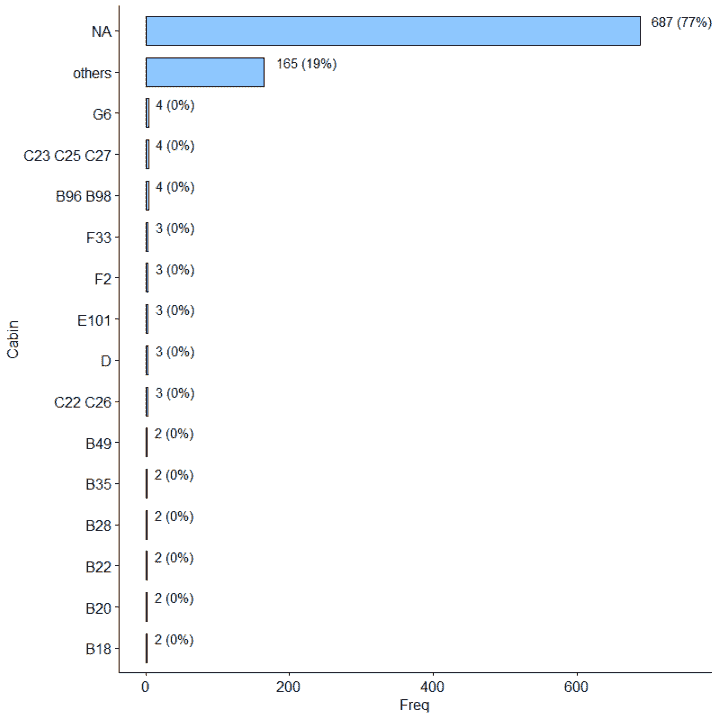

图 14.6 – 舱位变量的条形图

在 Power BI 中显示变量的选择是通过下拉筛选器完成的。如果一个变量是整型，它将同时出现在数值变量的下拉列表和分类变量的下拉列表中，这样分析师就可以以他们认为更合适的方式可视化它们。

由于图表将通过 R Visuals 显示，如果你希望将 EDA 报告发布到 Power BI 服务，你必须确保要使用的 R 包与 Power BI 服务上找到的 R 引擎版本兼容。记住，Power BI Desktop 一次只能引用一个 R 引擎，这将是你在机器上用于 Power Query 和 R Visuals 的引擎。因此，如果你计划在报告发布后使用最新的 R 引擎进行 Power Query，你也应该安装在此引擎上渲染报告所需的包。这样，你确保在测试期间 Power BI Desktop 上报告也能正确渲染：

1.  打开 RStudio 并确保它引用的是你的 CRAN R 专门用于 R Visuals（在我们的案例中是版本 3.4.4）。

1.  点击 **控制台** 窗口并输入以下命令：`install.packages('cowplot')`。它类似于 `ggplot2` 的扩展，提供对齐、排列和注释图表的主题和函数。然后，按 *Enter*。

1.  输入以下命令：`install.packages('ggpubr')`。它提供了一些易于使用的函数，用于创建和自定义基于 `ggplot2` 的出版物图表。然后，按 *Enter*。

1.  输入以下命令：`install.packages('ggExtra')`。这是一个函数和层的集合，用于增强 `ggplot2`，主要用于其 `ggMarginal` 函数，该函数向散点图添加边缘直方图/箱线图/密度图。然后，按 *Enter*。

1.  输入以下命令：`install.packages('RColorBrewer')`。它是管理 R 中的颜色和调色板的一个基本工具。然后，按 *Enter*。

1.  输入以下命令：`install.packages('ggmosaic')`。它旨在创建分类数据的可视化，特别是 mosaic 图。然后，按 *Enter*。

1.  输入以下命令：`install.packages('` `ggdist')`。它旨在创建分类数据的可视化，特别是 mosaic 图。然后，按 *Enter*。

1.  将 RStudio R 引用更改为你的 CRAN R 专门用于 Power Query（在我们的案例中是版本 4.0.2）并重新启动 RStudio。

1.  重复步骤 2 到 7。

现在，你可以开始开发你报告的新页面，该页面专注于数据集的单变量分析：

1.  如果尚未存在，通过点击画布底部的标签附近的加号图标创建一个新的 Power BI 报表页面。将创建一个名为**页面 1**的新标签页。

1.  点击**获取数据**，搜索`script`，选择**R 脚本**，然后点击**连接**。

1.  将文件`04-serialize-univariate-plots.R`中的脚本输入到`Chapter14\R`文件夹中。确保`folder`变量指向`Chapter14`文件夹的正确绝对路径。

1.  在导航对话框中，选择`basic_info_tbl`、`numeric_vars_descr_stats_tbl`、`summary_tbl`和`sample_tbl`表。然后点击**加载**。

1.  此脚本将每个变量相关的图表列表序列化到磁盘，根据其类型。一旦你点击**确定**，你将在磁盘上找到以下文件：`histodensity_lst.rds`、`histodensity_transf_lst.rds`（根据 Yeo-Johnson 转换的数值变量），以及`barchart_lst.rds`。当涉及变量的可能组合较少时，预先计算图表列表并将它们序列化到磁盘是一个好策略。

1.  在导航对话框中，选择`categorical_df`和`numeric_df`表。正如你所见，`numeric_df`表包含`numeric_col_name`列中数值变量的名称，重复两次，一次对应于`transf_type`列中要应用于它们的每种转换类型（`standard`和`yeo-johnson`）：

    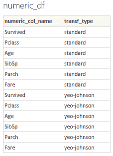

    图 14.7 – numeric_df 表的内容

    然后，点击**加载**。

1.  点击切片器的视觉图标。然后展开**字段**面板下的`numeric_df`表，并检查`numeric_col_name`度量。

1.  点击切片器右上角的向下箭头以选择**下拉**切片器类型。

1.  调整切片器的底部边缘，点击其**格式**选项，在**选择控件**下打开**单选**，关闭**切片器标题**，并添加**标题**`数值变量`。

1.  首先点击报表画布上的空白处。然后点击切片器视觉图标。然后展开**字段**面板下的`numeric_df`表，并检查`transf_type`度量。

1.  点击切片器右上角的向下箭头以选择**下拉**切片器类型。

1.  调整切片器的底部边缘，点击其**格式**选项，在**选择控件**下打开**单选**，关闭**切片器标题**，并添加**标题**`转换`。

1.  现在，首先点击报表画布上的空白处。然后点击**可视化**面板中的**R 视觉**图标，并在提示时启用它。之后，将其移动到刚刚创建的两个切片器下面。

1.  保持选中状态，点击**numeric_df**表的两个字段（**numeric_col_name**和**transf_type**）。

1.  现在，点击 R 视觉的**格式**选项卡并关闭**标题**选项。

1.  将文件 `05-plot-numeric-variables.R` 的代码复制到 `Chapter14\R` 文件夹中，并将其粘贴到 R Visual 脚本编辑器中。然后点击 R 脚本编辑器右上角的 **运行脚本** 箭头图标（每次请求时启用 R Visual）。你将得到未变换的 `Age` 变量的单变量分析：

    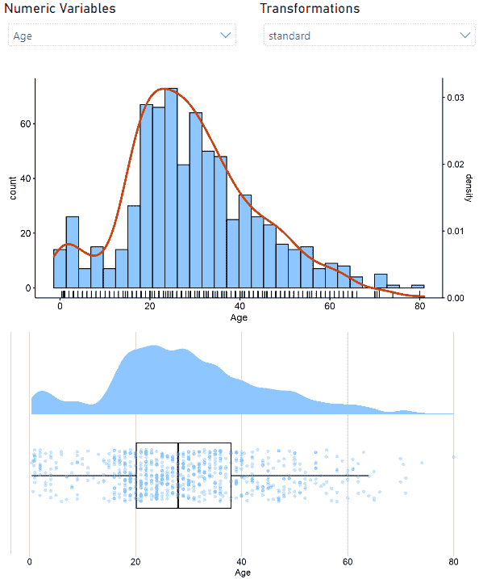

    图 14.9 – 年龄变量的单变量分析

1.  如果你从 **变换** 下拉菜单中选择 `yeo-johnson` 变换，图表将相应更新：

    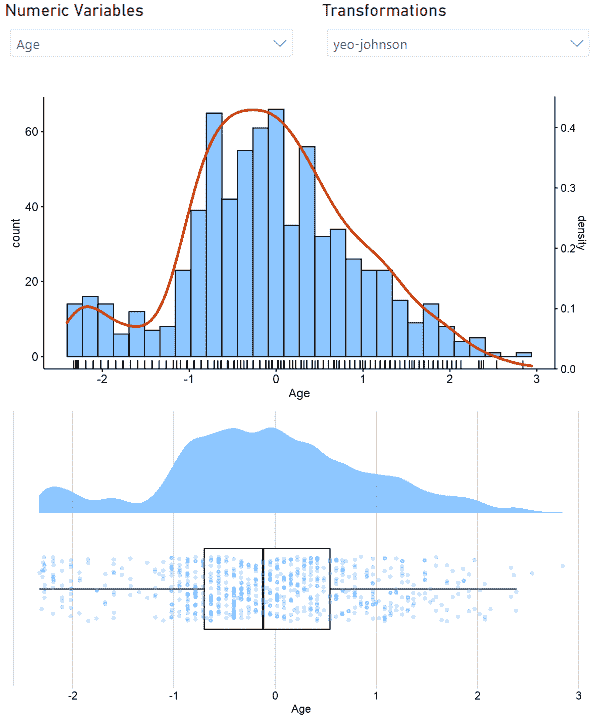

    图 14.10 – Yeo-Johnson 变换后的年龄变量的单变量分析

1.  让我们现在创建分类变量的切片器。首先点击报告画布上的一个空白位置。然后点击切片器视觉图标。接着展开 **字段** 面板下的 `categorical_df` 表，并检查 `categorical_col_name` 度量。

1.  点击切片器右上角的向下箭头以选择 **下拉** 切片器类型。

1.  调整切片器的底部边缘，点击其 **格式** 选项，在 **选择控件** 下打开 **单选**，关闭 **切片器标题**，并添加 **标题** `分类变量`。

1.  首先点击报告画布上的一个空白位置。然后点击 **可视化** 面板中的 **R Visual** 图标，并在提示时启用它。之后，将其移动到你刚刚创建的切片器下方。

1.  保持选中状态，点击 **categorical_df** 表的字段（**categorical_col_name**）。

1.  现在点击 R Visual 的 **格式** 选项卡并关闭 **标题** 选项。

1.  将文件 `06-plot-categorical-variables.R` 的代码复制到 `Chapter14\R` 文件夹中，并将其粘贴到 R Visual 脚本编辑器中。然后点击 R 脚本编辑器右上角的 **运行脚本** 箭头图标（每次请求时启用 R Visual）。你将得到 `Cabin` 变量的单变量分析：

    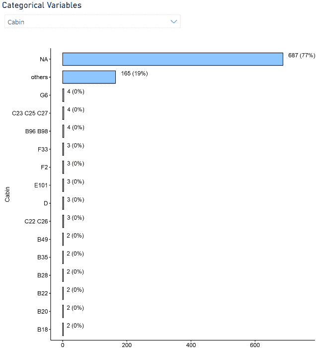

    图 14.11 – 船舱变量的单变量分析

1.  只需将当前页面重命名（在页面底部的标签上右键单击并点击 **重命名页面**），使用标签 `单变量分析`。

很好！你刚刚开发了一个针对单变量数据集分析的出色 EDA 报告页面。通过玩切片器，整个页面将像以下这样：

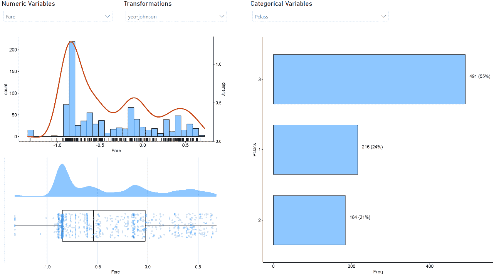

图 14.12 – 单变量分析 EDA 报告页面

现在是时候开发一个针对数据集多元分析的报告页面了。

### 多元探索

通常，对单个变量的分析永远不足以让分析师对数据集有一个完整的了解。能够使用允许根据数据类型交互多个变量的视觉工具，无疑是向更准确的数据集分析迈进的一步。

分析两个数值变量交互作用最常用的视觉方法是**散点图**。在我们的案例中，我们将使用这种图表的增强版本，在边缘添加变量的**边缘分布**。此外，还可以根据另一个分类变量对点进行着色。这样，分析师可以研究三个变量的交互作用。在*图 14.13*中，你可以找到一个关于变量`Age`和`Fare`按`Sex`分组的这种图表的示例。

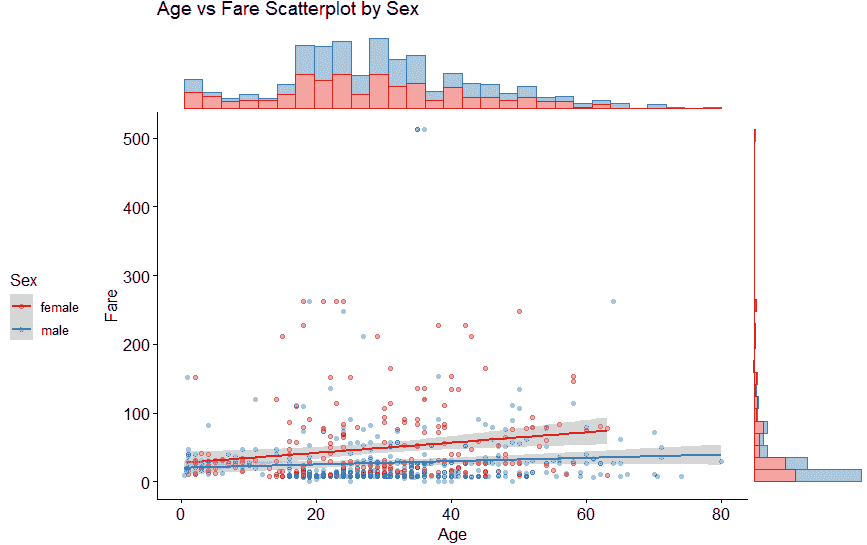

图 14.13 – 按性别划分的年龄和船票散点图，边缘直方图

如你所见，分组变量的类别有多少，就有多少回归线。在缺少分组变量的情况下，回归线是唯一的，在这种情况下，图表还显示了 Pearson 的 R 系数、Spearman 的**rho**和 Kendall 的**tau**的值，以及从相应测试中得出的 p 值。简而言之，在这种情况下，**p 值**表示样本数据中 `x` 和 `y` 之间的相关性偶然发生的概率（查看参考文献以了解更多关于 p 值的信息）：

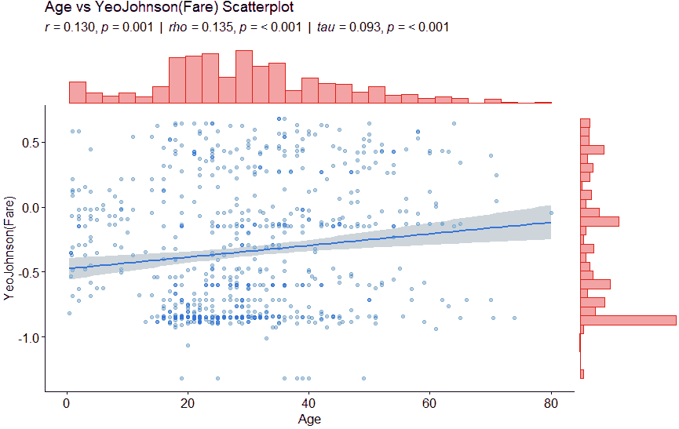

图 14.14 – 未分组的年龄和船票（转换后）散点图

如果要研究的交互作用的变量是分类的，**mosaic 图**将帮助你。在*图 14.15*中，你可以找到按`Sex`分组的`SibSp`和`Pclass`变量的 mosaic 图：

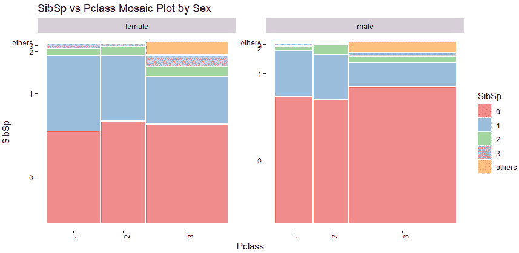

图 14.15 – 按性别分组的 Pclass 和 SibSp 的 mosaic 图

最后，通过可视化每个类别的**雨云图**，可以研究数值变量与分类变量之间的交互作用。此外，始终可以通过第三个分类变量来分割图表，就像之前的例子一样。在*图 14.16*中，你可以看到一个关于变量`Fare`（通过 Yeo-Johnson 转换以获得更好的可视化）和`Pclass`以及`Sex`的示例图表：

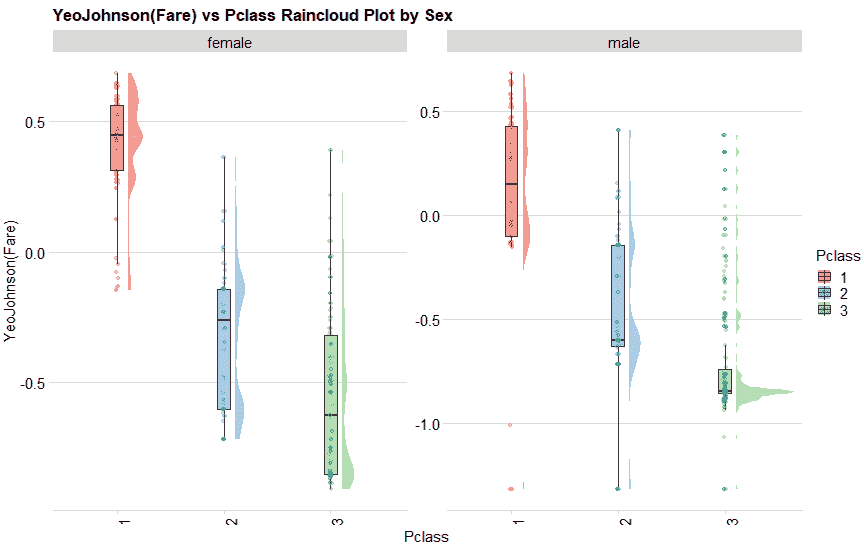

图 14.16 – 按性别分组的船票和 Pcalss 变量的雨云图

现在，你可以开始开发你报告的新页面，该页面专门用于数据集的单变量分析：

1.  如果还没有，请通过点击画布底部的标签旁边的加号图标来创建一个新的 Power BI 报告页面。将创建一个名为**页面 1**的新标签页。

1.  点击**获取数据**，搜索`脚本`，选择**R 脚本**，然后点击**连接**。

1.  将在文件`07-create-multivariate-objects.R`中找到的脚本输入到`Chapter14\R`文件夹中。确保`folder`变量指向`Chapter14`文件夹的正确绝对路径。

1.  在导航器对话框中，选择`multivariate_df`表格。这次，生成图表的代码将直接在 R Visual 中编写，无需先序列化再在可视化时调用。这种策略与用于单变量分析页面所用的策略相反，因为在这种情况下，游戏中变量之间的组合数量要高得多，要在列表中生成相同数量的图表并序列化一切并不非常高效。`multivariate_df`表格是所有参与多元分析的变量之间交叉连接的结果数据框（两个数值变量，每个变量的转换类型相关变量，两个分类变量，以及另一个用于分组的分类变量：总共七个变量）：

    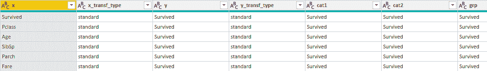

    图 14.17 – multivariate_df 表格的内容

    然后点击**加载**。

1.  点击切片器视觉图标。然后展开**字段**面板下的`multivariate_df`表格，并检查`x`度量。

1.  点击切片器右上角的向下箭头以选择**下拉**切片器类型。

1.  调整切片器的底部边缘，点击其**格式**选项，在**选择控制**下切换开启**单选**，在**切片器标题**部分下输入`x 数值`标题，开启**标题**部分，并添加`分析变量`标题。

1.  首先在报告画布上的空白处点击，然后点击切片器视觉图标。在**字段**面板下展开`multivariate_df`表格，并检查`x_transf_type`度量。

1.  点击切片器右上角的向下箭头以选择**下拉**切片器类型。

1.  调整切片器的底部边缘，点击其**格式**选项，在**选择控制**下切换开启**单选**，在**切片器标题**部分下输入`x 转换`标题，并保持**标题**部分关闭。

1.  按照步骤 5 到 10 重复操作，以创建**y 数值**和**y 转换**切片器，确保分别选择`y`和`y_transf_type`度量。对于它们也保持**标题**部分关闭。

1.  首先在报告画布上的空白处点击，然后点击切片器视觉图标。在**字段**面板下展开`multivariate_df`表格，并检查`cat1`度量。

1.  点击切片器右上角的向下箭头以选择**下拉**切片器类型。

1.  调整切片的底部边缘，点击其 **格式** 选项，在 **选择控件** 下启用 **单选**，在 **切片标题** 部分下输入 `cat1 分类` 标题，并保持 **标题** 部分关闭。

1.  重复步骤 12 到 14 以创建 **cat2 分类** 切片。确保选择 `cat2` 度量。

1.  首先点击报告画布上的一个空白位置，然后点击切片可视化图标。在 **字段** 面板下展开 `multivariate_df` 表，并检查 `grp` 度量。

1.  点击切片右上角的向下箭头以选择 **下拉** 切片类型。

1.  调整切片的底部边缘，点击其 **格式** 选项，在 **选择控件** 下启用 **单选**，在 **切片标题** 部分下输入 `grp 分类` 标题，并保持 **标题** 部分关闭。

1.  尝试将所有这些滑块对齐到页面顶部的单行中，如下所示：

    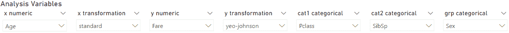

    图 14.18 – 页面顶部的多元页面切片

1.  首先点击报告画布上的一个空白位置。然后点击 **可视化** 面板中的 **R 可视化** 图标，并在提示时启用它。之后，将其移动到您刚刚创建的切片行下方，并调整大小以填满页面。

1.  保持选中状态，点击 `multivariate_df` 表的所有字段。

1.  现在点击 R 可视化的 **格式** 选项卡并关闭 **标题** 选项。

1.  将文件 `08-plot-multivariate-plots.R` 的代码复制到 `Chapter14\R` 文件夹中，并将其粘贴到 R 可视化脚本编辑器中。然后点击 R 脚本编辑器顶部的 **运行脚本** 箭头图标（每次请求时都启用 R 可视化）。您将在其中获得所有多元分析图表。

1.  只需将当前页面重命名（在页面底部的标签上右键单击并点击 **重命名页面**），使用标签 `多元分析`。

太棒了！这个专门用于多元分析的 EDA 报告页面对于分析师来说非常具有揭示性。通过调整切片，整个页面将像以下这样：

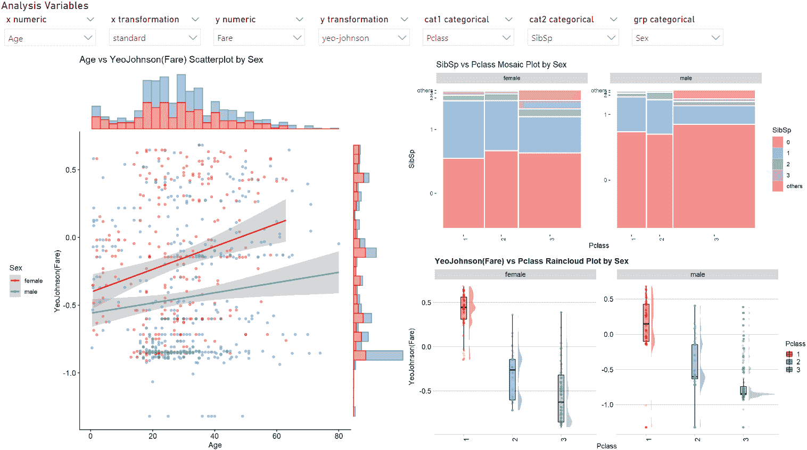

图 14.19 – EDA 报告的多元分析页面

请记住，数值变量 `y` 用于散点图和雨云图的 *y* 轴。分类变量 `cat1` 用作雨云图和错综图的 *x* 轴。分类变量 `grp` 用于根据标签对三个图表进行分组。

您刚刚看到了 R 在专业图形开发方面的强大和灵活性。让我们看看如何开发一个用于变量关联的页面。

### 变量关联

如你在**第十一章**中学到的，**添加统计洞察：关联**，了解将两个变量联系起来的相关系数，这给了你评估一个变量对另一个变量的预测能力的机会。从同一章节，你也学到了如何根据涉及的不同类型变量的组合来计算相关系数。

在本节中，我们将把所学知识应用于开发一个包含根据相关系数强度着色的**热图**的 EDA 报告页面。以下是一个示例：

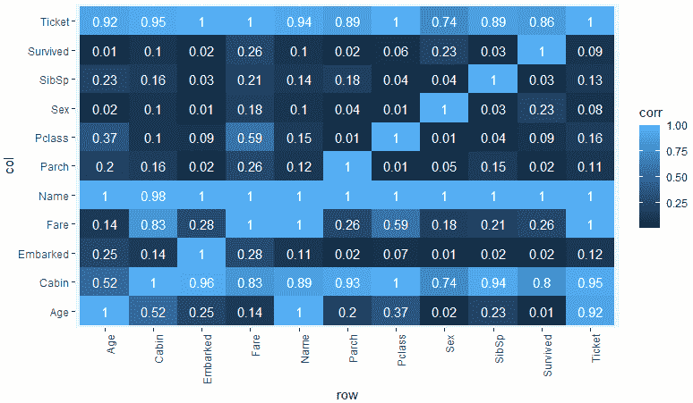

图 14.20 – 数据集的相关热图

相关系数将根据分析师可以通过两个筛选器做出的选择来计算：一个允许你选择用于数值变量之间相关性的方法，另一个允许你选择用于分类变量之间相关性的方法。

因此，让我们开始开发**关联**页面：

1.  如果尚未存在，请通过点击画布底部标签附近的加号图标创建一个新的 Power BI 报告页面。将创建一个名为**页面 1**的新标签页。

1.  点击**获取数据**，搜索`script`，选择**R 脚本**，然后点击**连接**。

1.  将你可以在文件`09-create-association-objects.R`中找到的脚本放入`Chapter14\R`文件夹中。确保`folder`变量指向`Chapter14`文件夹的正确绝对路径。

1.  在**导航器**对话框中，选择`corr_tbl`表。这个表是由一系列转换给出的。首先，对于数值变量和分类变量的相关方法组合，计算了一个包含相应相关系数的列。这通过使用在**第九章**中引入的 R 的并行计算来加速。之后，执行了一个转置操作，将所有这些列合并到单个列`corr`中，并创建了一个新的列`corr_type`，其中包含标识所使用方法组合的字符串。最后，将`corr_type`列拆分为两个单独的列，一个用于数值变量的相关方法筛选器，另一个用于分类变量的相关方法筛选器。以下是结果表的样本：

    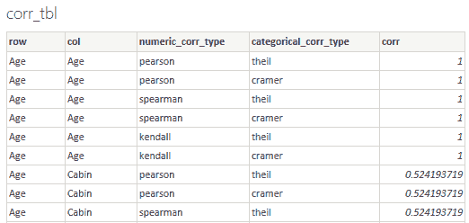

    图 14.21 – corr_tbl 表的内容

    然后点击**加载**。

1.  点击筛选器视觉图标。然后在**字段**面板下展开`corr_tbl`表，并检查`numeric_corr_type`度量。

1.  点击筛选器右上角的向下箭头以选择**下拉**筛选器类型。

1.  调整切片器的底部边缘，点击其**格式**选项，在**选择控件**下启用**单选**，在**切片器标题**部分下输入`Numeric correlation type`标题，启用**标题**部分，并添加`分析变量`标题。

1.  首先在报告画布上的一个空白处点击，然后点击切片器可视化图标。展开**字段**面板下的`corr_tbl`表，并检查`categorical_corr_type`度量。

1.  点击切片器右上角的向下箭头以选择**下拉**切片器类型。

1.  调整切片器的底部边缘，点击其**格式**选项，在**选择控件**下启用**单选**，在**切片器标题**部分下输入`Categorical correlation type`标题，并保持**标题**部分关闭。

1.  尝试将所有这些滑块对齐到页面顶部的单行，如下所示：

    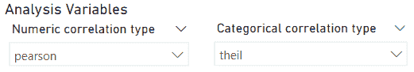

    图 14.22 – 页面顶部的关联页面切片器

1.  首先在报告画布上的一个空白处点击。然后点击**可视化**面板中的**R 可视化**图标，并在提示时启用它。之后，将其移动到您刚刚创建的切片行下方，并调整大小以填充整个页面。

1.  选中后，点击`corr_tbl`表中的`col`、`corr`和`row`字段。

1.  将文件`10-plot-association-plots.R`的代码复制到`Chapter14\R`文件夹中，并将其粘贴到 R 可视化脚本编辑器中。然后点击 R 脚本编辑器右上角的**运行脚本**箭头图标（每次请求时启用 R 可视化）。您将在其中获得所有多元分析图。

1.  现在点击 R 可视化的**格式**选项卡，并在**标题**部分输入字符串`Categorical Heatmap`作为标题。

1.  只需重命名当前页面（在页面底部的标签上右键单击并点击**重命名页面**），使用标签`关联分析`。

使用 R 和 `Ggplot` 创建相关性热图竟然如此简单，令人印象深刻！

玩转切片器，整个页面将类似于以下这样：

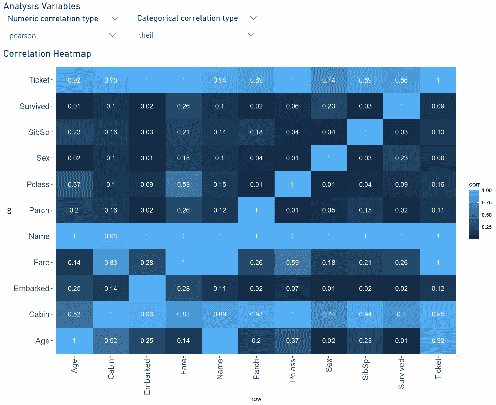

图 14.23 – EDA 报告的关联分析页面

哇！您已经完成了您的第一个 EDA 报告。您不得不承认，结果令人惊叹！

## 摘要

在本章中，您学习了什么是探索性数据分析（EDA）以及它帮助实现的目标。

您还学习了最常用的工具，用于使用 Python 和 R 进行自动化的 EDA。

最后，您使用 R 及其创建图形最流行的包开发了一个完整且动态的 EDA 报告，用于分析数据集。

在下一章中，您将看到如何开发高级可视化。

## 参考文献

对于进一步阅读，请参阅以下书籍和文章：

1.  *使用 Sweetviz 只需两行代码即可进行强大的 EDA（探索性数据分析）* ([`towardsdatascience.com/powerful-eda-exploratory-data-analysis-in-just-two-lines-of-code-using-sweetviz-6c943d32f34`](https://towardsdatascience.com/powerful-eda-exploratory-data-analysis-in-just-two-lines-of-code-using-sweetviz-6c943d32f34))

1.  *Lux：用于智能视觉数据发现的 Python API* ([`www.youtube.com/watch?v=YANIids_Nkk`](https://www.youtube.com/watch?v=YANIids_Nkk))

1.  *泰坦尼克数据集的 pandas 分析* ([`pandas-profiling.github.io/pandas-profiling/examples/master/titanic/titanic_report.html`](https://pandas-profiling.github.io/pandas-profiling/examples/master/titanic/titanic_report.html))

1.  *pandasGUI 演示* ([`www.youtube.com/watch?v=NKXdolMxW2Y`](https://www.youtube.com/watch?v=NKXdolMxW2Y))

1.  *关于多维数据有效可视化的图形语法全面指南* ([`towardsdatascience.com/a-comprehensive-guide-to-the-grammar-of-graphics-for-effective-visualization-of-multi-dimensional-1f92b4ed4149`](https://towardsdatascience.com/a-comprehensive-guide-to-the-grammar-of-graphics-for-effective-visualization-of-multi-dimensional-1f92b4ed4149))

1.  *完整的 ggplot2 教程* ([`r-statistics.co/Complete-Ggplot2-Tutorial-Part1-With-R-Code.html`](http://r-statistics.co/Complete-Ggplot2-Tutorial-Part1-With-R-Code.html))

1.  *关于解释相关性的所有你需要知道的内容* ([`towardsdatascience.com/eveything-you-need-to-know-about-interpreting-correlations-2c485841c0b8`](https://towardsdatascience.com/eveything-you-need-to-know-about-interpreting-correlations-2c485841c0b8))
