# 第十七章：16 交互式 R 自定义视觉

在*第十五章，高级可视化*中，您了解到由于**ggplot**引入的灵活性，可以制作非常复杂的图表。然而，有时您可能会觉得由于缺乏交互性，如工具提示，您无法充分利用图表中显示的信息。在本章中，您将学习如何通过直接使用*HTML 小部件*将交互性引入使用 R 创建的自定义图形。以下是我们将要涵盖的主题：

+   为什么需要交互式 R 自定义视觉？

+   使用 Plotly 添加一点交互性

+   利用 HTML 小部件提供的交互性

+   将所有内容打包成 Power BI 自定义视觉

+   在 Power BI 中导入自定义视觉包

## 技术要求

本章要求您拥有一个正常工作的互联网连接，并在您的机器上安装**Power BI 桌面版**。您必须已按照*第二章，配置 Power BI 中的 R*和*第三章，配置 Power BI 中的 Python*中概述的方式正确配置了 R 和 Python 引擎以及 IDE。

## 为什么需要交互式 R 自定义视觉？

让我们从您已经在 R 中实现的图形开始。例如，考虑*第十四章，探索性数据分析*中引入的`Fare`与`Pclass`变量的 raincloud 图：

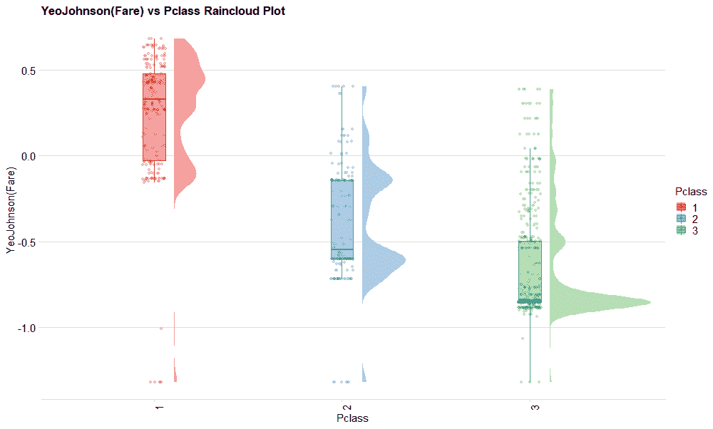

图 16.1 – 票价（转换后）和 Pclass 变量的 Raincloud 图

请暂时只关注您在*图 16.1*中看到的箱线图。尽管`Fare`变量已经根据 Yeo-Johnson 进行了转换以尝试减少偏度，但根据分类变量`Pclass`描述的每个乘客类别仍然存在一些极端的异常值。例如，如果您想了解与左侧箱线图的胡须（围栏）对应的转换变量`Fare`的值，以便您然后确定位于这些胡须之外的异常值，那么当您将鼠标移至该箱线图附近时，这些值出现将会很方便，就像*图 16.2*中所示：

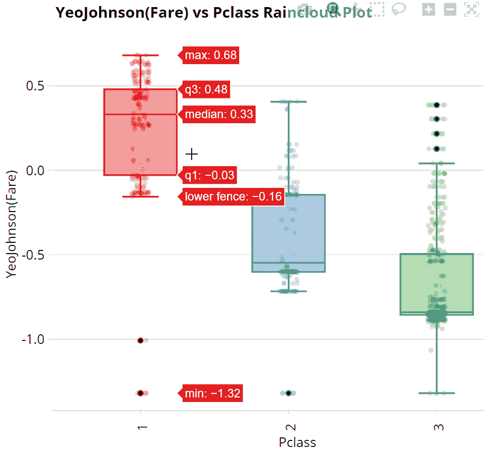

图 16.2 – 在第一类的票价（转换后）箱线图中显示的主要标签

当您将鼠标悬停在表示特定孤立异常值的点上时，了解其实际值将会更有趣，就像*图 16.3*中所示：

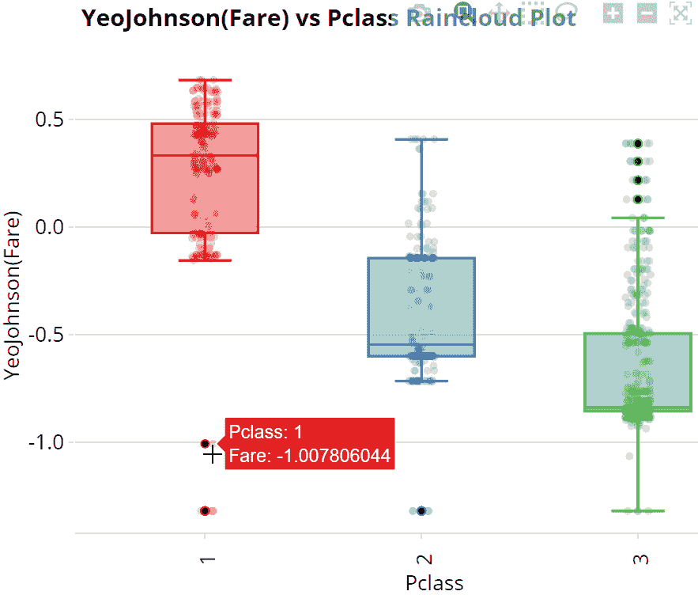

图 16.3 – 高亮显示的异常值对应的票价（转换后）和 Pclass 的值

毫无疑问，如果引入这些交互式功能，分析图表的读者将会欢迎。

因此，让我们看看如何将这些交互式功能添加到使用 ggplot 开发的现有图形中。

## 使用 Plotly 添加一点交互性

这是一个开源的 JavaScript 数据可视化库，它是声明性和高级的，允许您创建数十种交互式图表，名为 **Plotly.js**。这个库是其他 Plotly 客户端库的核心，为 Python、Scala、R 和 ggplot 开发。特别是，为 R 开发的库，名为 **Plotly.R** ([`github.com/ropensci/plotly`](https://github.com/ropensci/plotly))，提供了 `ggplotly()` 函数，为我们完成了所有的魔法：它检测了使用 ggplot 开发的现有图形中包含的所有基本属性，并将它们转换为交互式网络可视化。让我们看一个例子。

首先，您需要通过 `install.packages('plotly')` 脚本在您最新的 CRAN R 引擎上安装 Plotly.R 库([`github.com/ropensci/plotly`](https://github.com/ropensci/plotly))。

> **重要提示**
> 
> 为了简单起见，我们将确保在最新的 CRAN R 引擎上运行自定义视觉，因为所有必要的库已经在之前的章节中安装了。如果目标是发布带有自定义视觉的报告到 Power BI，您必须确保自定义视觉在 Power BI 上（在我们的案例中，CRAN R 3.4.4）正确渲染。

然后，运行您可以在 `Chapter16` 文件夹中的 `01-interactive-boxplots.R` 文件中找到的脚本。脚本的内容是从 *第十四章，数据探索* 中使用的各种脚本中提取的，所以对您来说没有什么新的。您之前没有见过的脚本部分如下：

```py
plotly::ggplotly(rc, tooltip = c('x', 'y'))
```

这是将静态图形转换为基于 HTML 的动态图形的代码部分，如您所见，它是对 `ggplotly()` 函数的一个简单调用。结果如下：

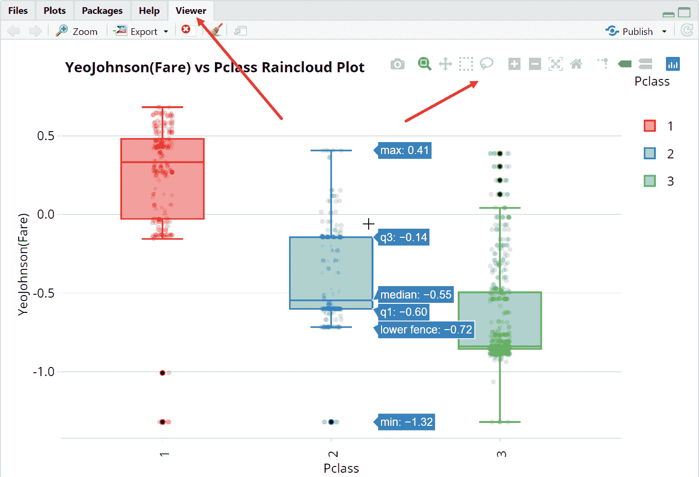

图 16.4 – 将 ggplotly() 函数应用于 raincloud 图的结果

如您所见，在 RStudio 中，结果不再显示在 **Plots** 选项卡中，而是在 **Viewer** 选项卡中显示，该选项卡专门用于 HTML 输出。您还会注意到右上角存在 **Modebar**，它允许您对图表设置一些操作，例如缩放和悬停选项。

但最引人注目的是，您没有看到一系列如预期中的 raincloud 图，而是简单的箱线图！如果您查看 RStudio 控制台，您会注意到有三个相同的警告信息，每个信息对应一个本应表示的 raincloud 图：

```py
In geom2trace.default(dots[[1L]][[3L]], dots[[2L]][[1L]], dots[[3L]][[1L]]) :
  geom_GeomSlabinterval() has yet to be implemented in plotly.
  If you'd like to see this geom implemented,
  Please open an issue with your example code at
  https://github.com/ropensci/plotly/issues
```

你可能已经注意到，只有密度图消失了。这意味着在 Plotly 当前版本（4.9.4.1）中，由`ggdist`库创建的对象尚未得到管理。此外，`ggplotly()`将填充和颜色美学渲染为不同的，这与`ggplot`静态图形不同。当然，这项功能仍需改进，而且很可能会在未来版本中解决这些错误。无论如何，图形仍然可用，并展示了如何轻松地将交互性添加到 ggplot 图形中。

到目前为止，你可能认为任何用 HTML 和 JavaScript 制作的图表都可以在 Power BI 中使用。显然，情况并非如此。

> **重要提示**
> 
> 在 Power BI 中使用的每个交互式图形都必须是*HTML 小部件*。

事实上，Plotly.R 通过 HTML 小部件暴露图形。让我们看看这是怎么回事。

## 利用 HTML 小部件提供的交互性

**HTML 小部件**是允许你构建交互式网页的 R 包。这些包由一个框架生成，该框架用于在 R 和 JavaScript 库之间创建绑定。这个框架由 RStudio 开发的`htmlwidgets`包提供。HTML 小部件始终托管在 R 包中，包括源代码和依赖项，以确保即使无法访问互联网，小部件也能完全可重复。有关如何从头开始开发 HTML 小部件的更多详细信息，请参阅参考资料。

除了能够在**RMarkdown**文件（带有 R 的动态文档）或**Shiny**应用程序（直接从 R 构建的交互式 Web 应用程序）中嵌入 HTML 小部件之外，`htmlwidgets`包还允许你通过`saveWidget()`函数将它们保存为独立的网页文件。

话虽如此，有成百上千的 R 包通过 HTML 小部件暴露其功能。你可以通过**htmlwidgets 图库**([`gallery.htmlwidgets.org/`](http://gallery.htmlwidgets.org/))来搜索可能适合你的交互式图形。

好吧，在 Power BI 中可视化这些 HTML 小部件是可能的，无论是图库中的还是通过 Plotly 制作的，这听起来不错。但如何将用 HTML 和 JavaScript 制作的动态图形嵌入到 Power BI 中呢？你必须通过*pbiviz 工具*编译一个由 R 驱动的视觉。

让我们看看如何操作。

## 将所有内容打包成 Power BI 自定义视觉

**Power BI 视觉工具**（**pbiviz**）是构建 Power BI 中定制视觉元素的最简单方法。它们是用 **JavaScript**（使用 **Node.js**）编写的，并用于编译 **.pbiviz 软件包**的源代码。一个 .pbiviz 软件包是 **Power BI 视觉项目**的压缩版本，而 **Power BI 视觉项目**又是一组文件夹、脚本和资产，用于创建你想要实现的定制可视化。通常，标准的 Power BI 视觉项目是通过 pbiviz 命令行工具从模板创建的。模板内容取决于你想要创建定制视觉的方法（**TypeScript**、**R Visual** 或 **R HTML**）。

> **重要提示**
> 
> pbiviz 工具不支持任何在后台使用 Python 的技术，例如 *ipywidget 小部件*。

在这种情况下，为了能够使用 R Visual 和 R HTML 模式开发有趣的定制视觉元素，值得稍微学习 R 和 ggplot。此外，如 *第二章，配置 Power BI 中的 R* 的结尾所述，请注意以下事项。

> **重要提示**
> 
> Power BI 中的 **发布到 Web** 选项不允许你发布包含标准 R 视觉元素的报告。你可以通过创建允许与该选项一起发布的 R 定制视觉来绕过这个限制。

现在我们来看看如何安装 pbiviz 工具。

### 安装 pbiviz 软件包

pbiviz 命令行工具提供了你在 Power BI 服务上开发视觉元素和测试报告和仪表板所需的一切。正因为如此，你需要安装一个 SSL 证书，以便你的笔记本电脑可以安全地与 Power BI 服务交互。

让我们一步一步地看看如何做：

1.  前往 [`nodejs.org/en/`](https://nodejs.org/en/) 并安装为所有用户推荐的 Node.js 版本，按照安装程序的默认选项进行。

1.  重新启动你的笔记本电脑，因为这是 *步骤 4* 命令正常工作的必要条件。

1.  点击 Windows **开始** 按钮，开始输入字符串 `“power”`，然后点击 **Windows PowerShell** 应用程序。

1.  在 PowerShell 控制台中输入以下命令：`npm i -g powerbi-visuals-tools`。如果你收到一些弃用警告，不要担心，等待安装完成。

1.  在 PowerShell 控制台中输入以下命令：`pbiviz --install-cert`。它返回一个位置，其中创建了 PFX 文件（应该是 `C:\Users\<你的用户名>\AppData\Roaming\npm\node_modules\powerbi-visuals-tools\certs`）和一个数字密码。注意这两个，因为你稍后需要它们。

1.  按 **Win**+**R** 并在 **打开** 文本框中输入 `mmc`。它将打开 **Microsoft 管理控制台**。

1.  点击 **文件**，然后点击 **添加/删除插件…**。

1.  选择 **证书**，然后点击 **添加**，接着选择 **我的用户帐户** 并点击 **完成**。

1.  在 **添加或删除插件** 窗口中点击 **确定**。

1.  在主窗口中，展开**证书**节点和**受信任根证书颁发机构**节点，选择此节点下的**证书**。您将在中间面板中看到所有证书的列表。在右侧的**操作**面板上，点击**更多操作**，选择**所有任务…**，然后点击**导入…**。

1.  在**证书导入向导**的欢迎窗口中点击**下一步**。在下一个窗口中点击**浏览**，导航到您在*步骤 5*中记录的位置。从**文件名**文本框附近的文件类型组合框中选择**个人信息交换 (*.pfx, *.p12)**。然后会出现`PowerBICustomVisualTest_public.pfx`文件。选择它并点击**打开**。然后点击**下一步**。

1.  输入您在*步骤 5*中记录的数字密码，保留默认的**导入选项**，并点击**下一步**。

1.  将**受信任根证书颁发机构**作为**证书存储**，点击**确定**。在主窗口中点击**下一步**，然后点击**完成**。您将看到一个**安全警告**窗口询问您是否要安装证书。点击**是**，将出现一个**导入成功**对话框。点击**确定**。

1.  为了验证一切是否顺利，返回到 PowerShell 控制台，输入`pbiviz`命令并按*Enter*。您应该看到以下输出：

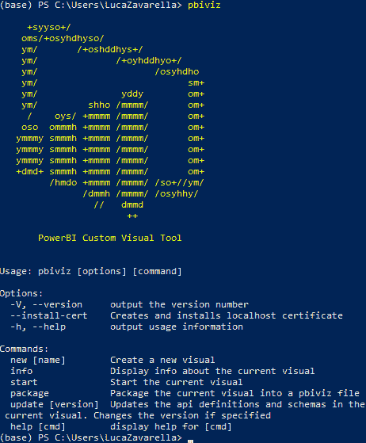

图 16.5 – pbiviz 已正确安装

太好了！现在您已经正确配置了 pbiviz 工具，并准备好编译自定义视觉。

让我们现在用 R HTML 自定义视觉来测试它们。

### 开发您的第一个 R HTML 自定义视觉

为了创建一个 R HTML 自定义视觉，您必须首先从 pbiviz 工具提供的模板开始生成一个标准的 Power BI Visual 项目，类型为 R HTML。然后，您只需修改项目提供的脚本，以创建您想要开发的视觉。

在本节中，您将包装在前一节中遇到的动态箱线图图形。

获取`.pbiviz`包的步骤如下：

1.  如果您上次使用后已关闭，请从**开始**菜单打开**Windows PowerShell**控制台。控制台将默认启动的文件夹是`C:\Usersers\<您的用户名>`。

1.  使用`md Power-BI-Custom-Visuals`命令创建一个名为`Power-BI-Custom-Visuals`的文件夹，专门用于自定义视觉。

1.  使用`cd Power-BI-Custom-Visuals`命令进入您刚刚创建的文件夹。

1.  使用`pbiviz new interactiveboxplots -t rhtml`命令从模板生成一个标准的 R HTML Power BI Visual 项目。

1.  在 VS Code 中打开您刚刚创建的模板文件夹。您会看到如下内容：

    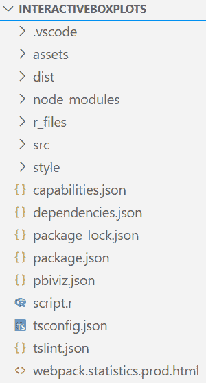

    图 16.6 – VS Code 中交互式箱线图文件夹的内容视图

    您将在 GitHub 仓库的 `Chapter16\PBI-Visual-Project\interactiveboxplots` 文件夹中找到一个完整的、准备好编译的项目。您可以用它作为下一步的参考。

1.  打开您刚刚创建的模板的 `pbiviz.json` 文件，以输入您将要编译的自定义视觉的基本信息。请正确格式化（右键点击文档并点击 **格式文档**）。在 *图 16.7* 和随后的图中，您可以在左侧找到模板代码的一部分，在右侧，您可以找到应该如何修改：

    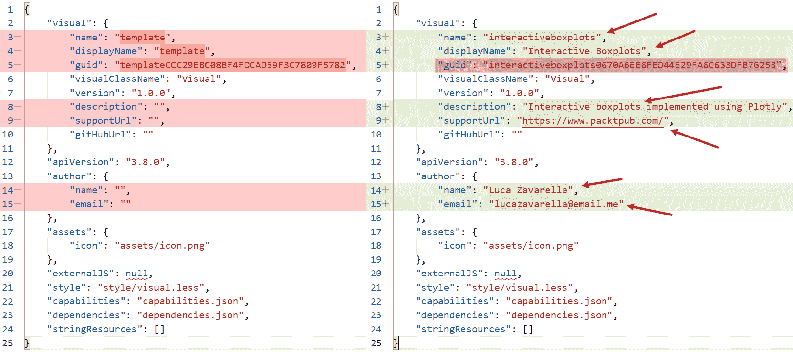

    图 16.7 – 在 VS Code 中编辑 pbiviz.json 文件内容

    下面是编辑 `"visual"` 节点属性详情：

    +   `"name"`: <您的自定义视觉名称>

    +   `"displayName"`: <显示的自定义视觉名称>

    +   `"description"`: <自定义视觉的描述>

    +   `"supportUrl"`: <支持联系网址>

    下面是编辑 `"author"` 节点属性详情：

    +   `"name"`: <作者的全名>

    +   `"email"`: <作者的电子邮件>

1.  现在打开 `capabilities.json` 文件。它用于声明可视化接受的哪些数据类型，在属性面板中放置哪些可自定义属性，以及其他创建可视化所需的信息。它包含几个根对象。您需要编辑的第一个是 `dataRoles` ([`bit.ly/pbiviz-dataroles`](https://bit.ly/pbiviz-dataroles))。在这个部分，您可以定义您的视觉期望的数据字段。默认模板只有唯一的 `Values` 字段作为默认值，就像标准的 R Visual 一样。在我们的案例中，多元方差箱线图视觉需要三个字段：

    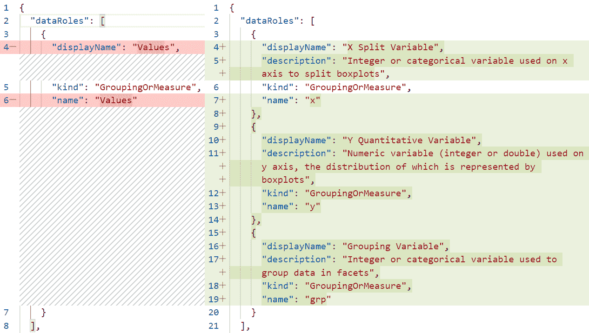

    图 16.8 – 编辑 capabilities.json 文件中的 dataRoles 部分

1.  根据在 `dataRoles` 中添加的项目，您必须相应地更改 `capabilities.json` 文件的 `dataViewMappings` 根对象内容（[`bit.ly/pbiviz-dataviewmappings`](https://bit.ly/pbiviz-dataviewmappings)）。它们描述了数据角色之间的关系，并允许您指定数据可视化的条件要求。在我们的案例中，我们需要声明在 `dataRoles` 中创建的三个字段作为脚本输入数据集的组成部分：

    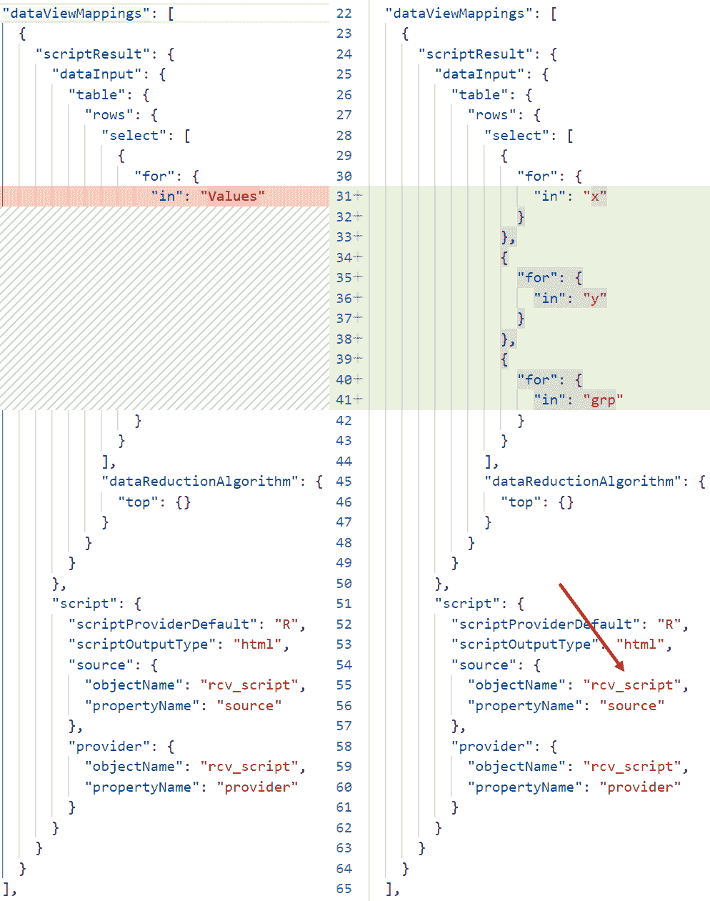

    图 16.9 – 编辑 capabilities.json 文件中的 dataViewMappings 部分

    如您所见，模板中引用的 `“script”` 子部分指的是 `rcv_script` 对象。我们将在下一节中看到它是如何定义的。

1.  `capabilities.json`文件的`objects`部分描述了与可视化关联并可出现在**格式**面板中的可自定义属性（[`bit.ly/pbiviz-objects`](https://bit.ly/pbiviz-objects)）。在我们的情况下，我们想要参数化可以应用于变量 y 的转换类型。因此，我们将确保用户可以从位于**常规**部分下方**变量设置**部分的**Y 转换类型**组合框中选择转换类型：

    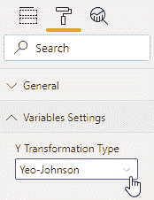

    图 16.10 – 将自定义参数添加到格式面板

    实现如图 16.10 所示效果的脚本更改如下：

    

    图 16.11 – 编辑`capabilities.json`文件的对象部分

    `suppressDefaultTitle`参数允许你抑制通常出现在每个 R 可视化左上角的标题。正如你在图 16.11 中看到的那样，`dataViewMappings`部分中引用的`rcv_script`对象在此部分定义。与刚刚添加的不同，`rcv_script`对象不应在**格式**面板中显示，而仅用于描述定义 R 脚本的`source`和`provider`对象的属性。为了实际上声明要在**格式**面板中显示的参数，你需要对`settings.ts`文件进行一些小的修改。让我们看看如何做。

1.  打开位于 Power BI Visual 项目`src`文件夹中的`settings.ts`文件。它包含要在你的可视化中显示的元素的 TypeScript 设置。我们不是显示`rcv_script`对象，而是显示包含与要对 y 变量应用转换类型关联的参数的`settings_variables_params`对象：

    

    图 16.12 – 编辑`settings.ts`文件

    关于此脚本中使用的类的更多详细信息，请参阅参考资料。

1.  打开`dependencies.json`文件。它包含了对生成可视化的 R 代码中使用的每个库的引用。除了已经存在的（`ggplot2`、`plotly`、`htmlwidgets`和`xml2`）之外，你还需要添加以下库：`RColorBrewer`、`cowplot`、`dplyr`、`purrr`、`forcats`和`recipes`。只需遵循现有库已使用的语法，同时记住你可以在`displayName`中放入任何字符串。

1.  最后，您可以在`script.r`文件中输入生成视觉的 R 代码。您可以用在 GitHub 仓库中共享的 Power BI 视觉项目中的同名文件内容替换其全部内容。在脚本的开头，您会找到一些用于在 RStudio 中调试任何问题的注释行。然后是一个`source()`命令，它将从`r_files`文件夹中提供的`flatten_HTML.r`文件加载实用函数。它们有助于将 Plotly 或小部件对象转换为自包含的 HTML。接下来的代码与您在前面章节中看到的非常相似。这里集成了处理传递给视觉作为输入数据的字段和用于处理变量 y 转换类型的参数的代码片段。以下是一个示例：

    ```py
    y_transf_name <- 'standard'
    if(exists("settings_variable_params_y_transf_name")){
      y_transf_name <- as.character(settings_variable_params_y_transf_name)
    }
    ```

    `settings_variable_params_y_transf_name`变量名由包含该参数的节名称和参数本身的名称的并集给出。最后，在脚本末尾有两段代码。一段用于从 Plotly Modebar 中删除一些图标：

    ```py
    disabledButtonsList <- list(
        'toImage', 'sendDataToCloud', 'zoom2d', 'pan',
        'pan2d', 'select2d', 'lasso2d',
        'hoverClosestCartesian', 'hoverCompareCartesian')
    p$x$config$modeBarButtonsToRemove = disabledButtonsList
    p <- config(p, staticPlot = FALSE, editable = FALSE, sendData = FALSE, showLink = FALSE, displaylogo = FALSE,  collaborate = FALSE, cloud=FALSE)
    ```

    另一个是针对 Plotly 错误的解决方案，即使传递了`outlier.shape = NA`参数给`geom_boxplot()`，它也会显示箱线图的异常值：

    ```py
    hideOutliers <- function(x) {  
      if (x$hoverinfo == 'y') {  
        x$marker = list(opacity = 0)
        x$hoverinfo = NA    
      }  
      return(x)  
    }
    p[["x"]][["data"]] <- purrr::map(p[["x"]][["data"]], ~ hideOutliers(.))
    ```

    最后，`internalSaveWidget(p, 'out.html')`命令使用脚本开头加载的其中一个实用函数来生成一个自包含的 HTML 格式的扁平化视觉，并以标准名称`out.html`正确管理，由 Power BI 管理。最后的命令调用了`ReadFullFileReplaceString()`函数。它允许您替换由代码生成的`out.html`文件中的字符串，以便修改由 Plotly 生成的默认配置。具体来说，这里使用的命令纠正了生成的 HTML 小部件的填充设置。

1.  现在回到 Windows PowerShell 控制台，确保您位于`Power-BI-Custom-Visuals\interactiveboxplots`文件夹中。如果您在`Power-BI-Custom-Visuals`文件夹中，只需使用`cd interactiveboxplots`命令。然后，输入`pbiviz package`命令来编译包含您的自定义视觉的.pbiviz 包。在 pbiviz 工具的编译操作结束时，您将看到类似以下内容：

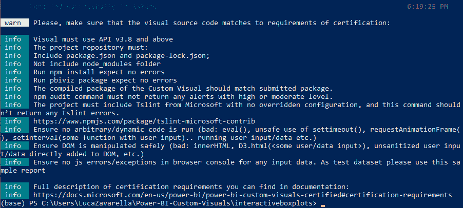

图 16.13 – 自定义视觉编译成功

干得非常好！您已使用 pbiviz 工具编译了您的第一个 R HTML 自定义视觉。好吧，编译好的包在哪里？别担心，查看您的 Power BI 视觉项目中的`dist`文件夹。

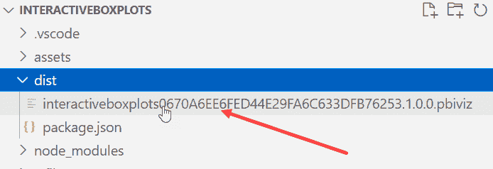

图 16.14 – 您刚刚编译的.pbiviz 包

就在这里！现在让我们将其导入 Power BI。

## 将自定义视觉包导入 Power BI

现在大部分工作已经完成，将自定义视觉导入 Power BI 就变得非常简单。首先，您需要在 R 引擎中安装 `xml2` 包，因为它被提供的实用函数所使用：

1.  打开 RStudio 并确保它引用的是您最新的 CRAN R（在我们的案例中是版本 4.0.2）。

1.  点击 **控制台** 窗口并输入以下命令：`install.packages('xml2')`。如果您记得，这个库在之前章节中看到的依赖文件中列出。然后，按 *Enter*。

现在让我们将自定义视觉导入 Power BI：

1.  确保 Power BI Desktop 在 **选项** 中引用的是正确的 R 引擎（最新的一个）。

1.  点击 **获取数据**，搜索 `web`，选择 **Web**，然后点击 **连接**。

1.  输入以下 URL 作为源：[`bit.ly/titanic-dataset-csv`](http://bit.ly/titanic-dataset-csv)。然后按 **确定**。

1.  确保文件源是 **65001: Unicode (UTF-8**) 并按 **加载**。

1.  点击 **视觉** 面板下的省略号，然后点击 **从文件导入视觉**：

    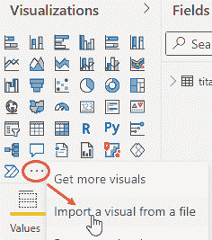

    图 16.15 – 从文件导入自定义视觉

1.  在下一个打开的窗口中，移动到以下文件夹：`C:\Users\<your-username>\Power-BI-Custom-Visuals\interactiveboxplots\dist`。然后选择您的 `.pbiviz` 包并点击 **打开**。在下一个对话框中点击 **确定**。

1.  如您所见，在 **视觉** 面板上出现了一个新的图标：

    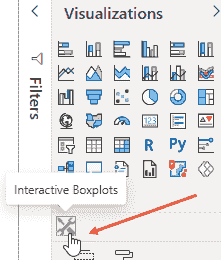

    图 16.16 – 从文件导入自定义视觉

    请记住，如果您想为您的视觉使用自定义图标，只需在编译前用 `assets` 文件夹中的 `icon.png` 文件替换它。点击它以将您的自定义视觉添加到报告画布上。然后在下一个对话框中点击 **启用**。

1.  扩大自定义视觉区域，然后在 **字段** 面板上展开 **titanic-dataset-csv** 表，首先检查 **舱等** 字段，然后是 **票价** 字段：

    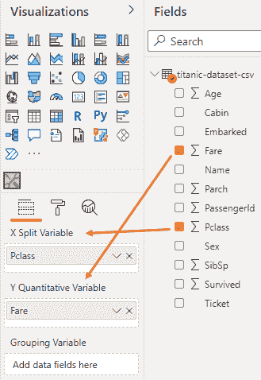

    图 16.17 – 选择舱等和票价字段作为 X 和 Y 变量

    查看您的自定义视觉。您将看到类似以下内容：

    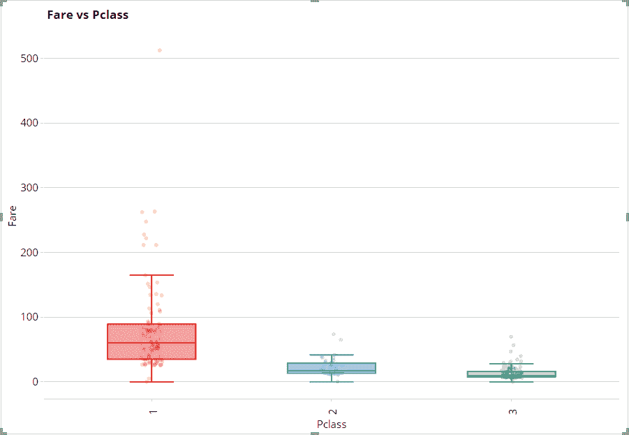

    图 16.18 – 显示票价与舱等对比的箱线图的自定义视觉

1.  现在点击视觉的 **格式** 图标，展开 **变量设置** 部分，并选择 **Yeo-Johnson** 作为 **Y 变换类型**：

    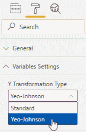

    图 16.19 – 选择 Yeo-Johnson 作为 Y 变换类型

    现在查看您的自定义视觉。您将看到类似以下内容：

    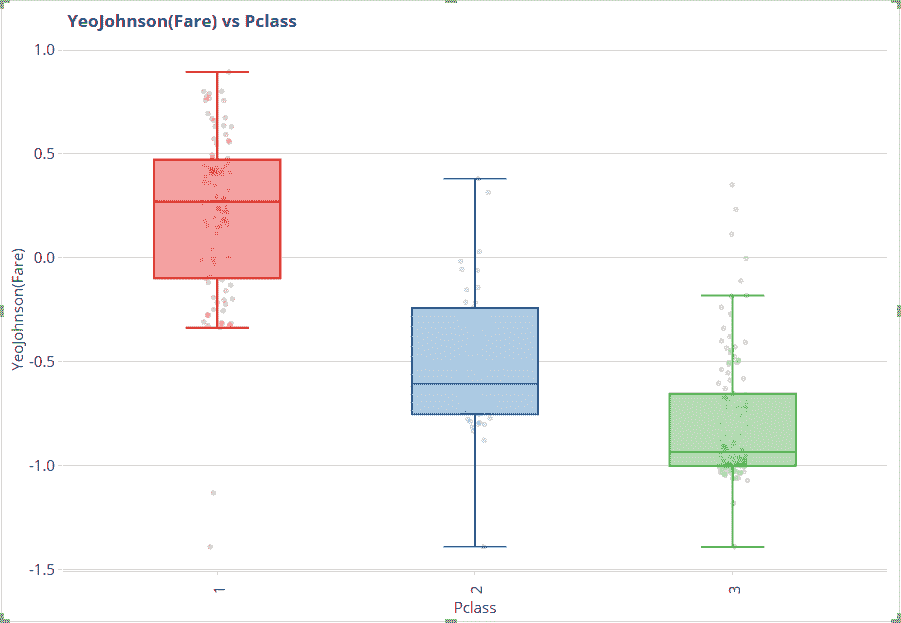

    图 16.20 – 显示票价（转换后）与舱等对比的箱线图的自定义视觉

1.  现在回到 **titanic-dataset-csv** 表格上的 **字段** 面板，检查 **Sex** 字段（它将与视觉的 **分组变量** 关联），然后再看看这个视觉。它将如下所示：

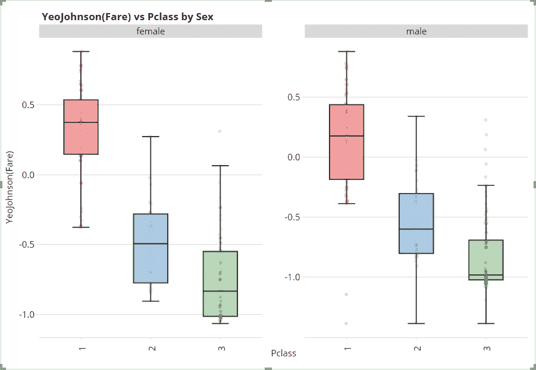

图 16.20 – 您的自定义可视化，显示票价（转换后）与 Pclass 按性别分组的箱线图

真的很令人印象深刻！您的自定义交互式可视化效果棒极了，而且工作得非常好！

## 摘要

在本章中，我们学习了在某些情况下使用交互式可视化相对于静态可视化的优势。我们学习了如何通过 Plotly 为使用 Ggplot 开发的图表添加一些基本交互性。

我们了解到，在 Power BI 上制作交互式视觉的关键在于它们基于 HTML 小部件。因此，我们通过 pbiviz 工具逐步实现了自定义可视化。

最后，我们将编译好的包导入 Power BI 以测试其功能。至此，本书的内容就结束了。希望这次旅程是富有成效且令人满意的！

## 参考文献

对于进一步阅读，请参阅以下书籍和文章：

1.  *Plotly R 开源绘图库* ([`plotly.com/r/`](https://plotly.com/r/))

1.  *[课程] R: 使用 htmlwidgets 进行交互式可视化* ([`www.linkedin.com/learning/r-interactive-visualizations-with-htmlwidgets/welcome`](https://www.linkedin.com/learning/r-interactive-visualizations-with-htmlwidgets/welcome))

1.  *创建小部件* ([`www.htmlwidgets.org/develop_intro.html`](http://www.htmlwidgets.org/develop_intro.html))

1.  *Power BI 可视化项目结构* ([`docs.microsoft.com/en-us/power-bi/developer/visuals/visual-project-structure`](https://docs.microsoft.com/en-us/power-bi/developer/visuals/visual-project-structure))

1.  *pbiviz.json 文件中使用的模式* ([`github.com/microsoft/PowerBI-visuals-tools/blob/main/templates/visuals/.api/v1.13.0/schema.pbiviz.json`](https://github.com/microsoft/PowerBI-visuals-tools/blob/main/templates/visuals/.api/v1.13.0/schema.pbiviz.json))

1.  *capabilities.json 文件中使用的模式* ([`github.com/microsoft/PowerBI-visuals-tools/blob/main/templates/visuals/.api/v1.13.0/schema.capabilities.json`](https://github.com/microsoft/PowerBI-visuals-tools/blob/main/templates/visuals/.api/v1.13.0/schema.capabilities.json))

1.  *Power BI 自定义可视化第五部分 – 格式化* ([`shetland.azurewebsites.net/2021/02/18/power-bi-custom-visual-part-5-formatting/`](https://shetland.azurewebsites.net/2021/02/18/power-bi-custom-visual-part-5-formatting/))
