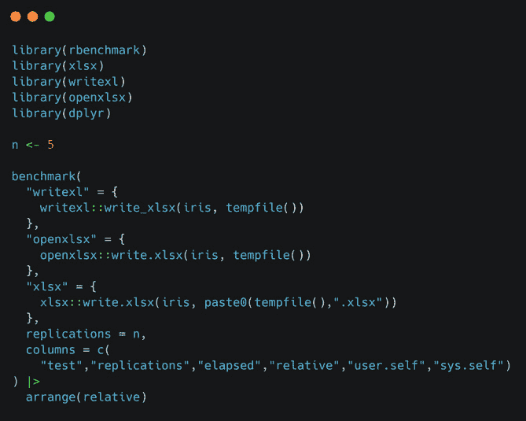
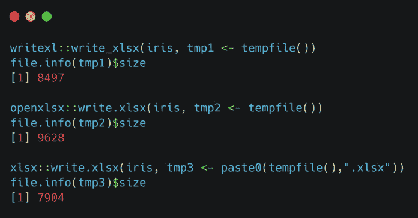
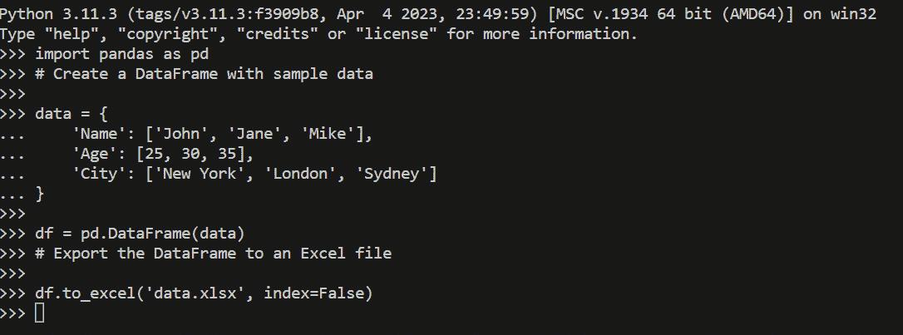
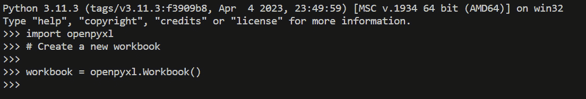
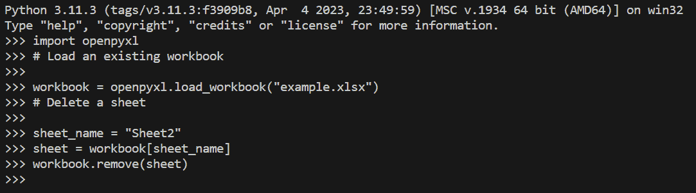
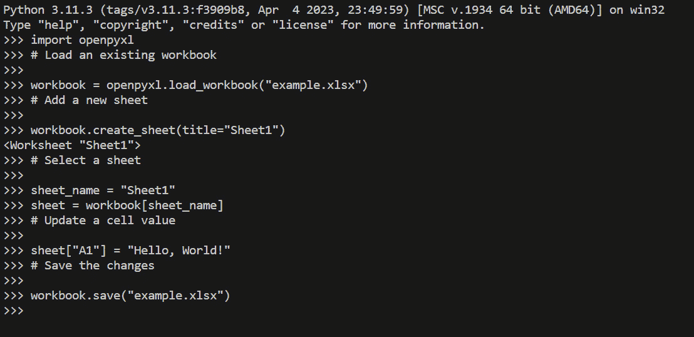
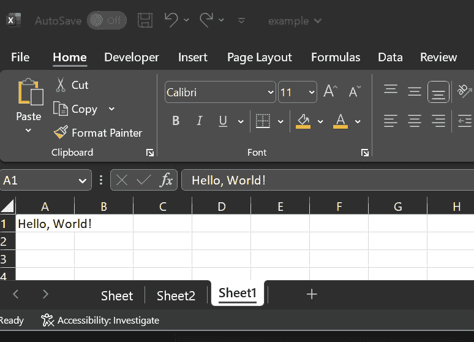

# 编写 Excel 工作表

这可能听起来与现代数据科学实践相矛盾，但 Excel 在分析和数据叙事的世界中仍有其位置。将数据从 R 和 Python 导出到 Excel 可以出于几个原因而有益，为用户提供利用两个平台优势的机会。Excel 是一个用户界面友好的广泛使用的电子表格程序，而 R 和 Python 是一种强大的统计编程语言。通过将数据从 R 和 Python 导出到 Excel，用户可以利用 Excel 熟悉且多功能的特性来进一步分析、可视化和共享数据。

将数据从 R 和 Python 导出到 Excel 的一大优势是能够利用 Excel 广泛的数据操作和可视化功能。Excel 提供了各种工具，如数据透视表、图表和条件格式化，这些工具使用户能够更互动和直观地探索和展示数据。这些功能允许快速的数据探索、识别趋势，并创建外观专业的报告或演示文稿。

此外，将数据导出到 Excel 可以方便与可能不熟悉 R 和 Python 或统计编程的同事或利益相关者进行协作。Excel 是一个被广泛认可且易于使用的工具，常用于各个行业的数据分析和报告。通过将数据导出到 Excel，用户可以与他人共享数据，这些人可能更愿意使用电子表格，从而实现更便捷的协作和知识交流。

另一个将数据从 R 和 Python 导出到 Excel 的原因是利用 Excel 广泛的插件和扩展生态系统。Excel 提供了众多专业工具和插件，可以增强数据分析，如 Power Query、Power Pivot 和 Solver。这些工具提供了数据清理、高级计算和优化的额外功能，这些功能在 R 和 Python 中可能不太容易获得或不够用户友好。将数据导出到 Excel 允许用户利用这些工具并从更广泛的 Excel 生态系统中受益。

总结来说，将数据从 R 和 Python 导出到 Excel 允许您利用 Excel 的用户友好界面、强大的数据操作和可视化能力，以及与广泛用户的兼容性。通过结合 R 和 Excel 的优势，个人可以增强他们的数据分析工作流程，提高协作，并有效地传达从统计分析中得出的见解。

在本章中，我们将涵盖以下主要主题：

+   可写入 Excel 工作表的包

+   使用 Python 创建和操作 Excel 工作表

+   保持简单 —— 使用 `pandas` 将数据导出到 Excel

+   高级模式 —— 使用 `openpyxl` 操作 Excel

+   在 `openpyxl` 和 `pandas` 之间进行选择

+   其他替代方案

# 技术要求

在本章中，我们将使用内置的 `Iris` 数据集。这是一个用于演示的好数据集。

本章的代码可以在本书的 GitHub 仓库中找到：[`github.com/PacktPublishing/Extending-Excel-with-Python-and-R/tree/main/Chapter2`](https://github.com/PacktPublishing/Extending-Excel-with-Python-and-R/tree/main/Chapter2)。

# 写入 Excel 文件的包

在本节中，我们将介绍几个不同的库，我们可以使用这些库将`data.frames`/`tibbles`写入 Excel 文件。我们将使用`writexl`、`openxlsx`和`xlsx`库。

在下一节中，我们将列出每个包，指定您可以在哪里找到写入 Excel 数据的功能文档，并介绍函数的参数。

## writexl

`writexl`包是 rOpenSci 联盟的一部分，可以在[`docs.ropensci.org/writexl/reference/write_xlsx.html`](https://docs.ropensci.org/writexl/reference/write_xlsx.html)找到。

该库不需要 Java 或 Excel 即可工作。

将数据写入 Excel 的函数是`write_xlsx()`。让我们来看看函数的不同参数，并查看一个完整的伪函数调用。

首先，让我们看看函数调用本身——即`write_xlsx()`：

```py
write_xlsx(
  x,
  path = tempfile(fileext = ".xlsx"),
  col_names = TRUE,
  format_headers = TRUE,
  use_zip64 = FALSE
)
```

现在，让我们来看看这段代码中的每个参数：

+   `x`：这是将成为`.xlsx`文件工作表的 DataFrame 或命名 DataFrame 列表。

+   `path`：要写入的文件名。在这里，您可以输入类似于`tempfile(fileext = ".xlsx")`的内容，以在文件顶部写入列名。

+   `format_headers`：使`.xlsx`文件中的`col_names`居中并加粗。

+   `use_zip64`：使用`.xlsx`文件。并非所有平台都能读取此文件。

让我们看看这个函数在典型实践中的简单示例会是什么样子：

```py
write_xlsx(list(mysheet = iris), path = "./iris_data_written.xlsx")
```

## openxlsx

`openxlsx`包可以在[`ycphs.github.io/openxlsx/`](https://ycphs.github.io/openxlsx/)找到；我们将使用`write.xlsx()`函数写入 Excel 文件。同样，我们将介绍完整的函数调用以及传递给此函数的参数：

```py
write.xlsx(
  x,
  file,
  asTable = FALSE,
  overwrite = TRUE,
  …
)
```

现在，让我们过一遍函数的所有参数：

+   `x`：一个 DataFrame 或可以由`writeData()`或`writeDataTable()`处理的（命名）对象列表，用于写入文件。

+   `file`：保存`.xlsx`文件的文件路径。

+   `asTable`：如果为`TRUE`，则将使用`writeDataTable()`而不是`writeData()`将`x`写入文件（默认值为`FALSE`）。

+   `overwrite`：覆盖现有文件（默认为`TRUE`，与`write.table`相同）。

+   `...`：传递给`buildWorkbook()`函数的附加参数。要查看更多详细信息，您可以在 R 控制台中输入`?openxlsx::buildWorkbook`。

让我们看看一段简短的代码示例，我们将使用它将 Iris 数据集写入文件：

```py
openxlsx::write.xlsx(
x = iris,
File = paste0(getwd(), "/iris.xlsx"
)
```

接下来，我们将查看最后一个包，`xlsx`。

## xlsx

可以在[`github.com/colearendt/xlsx`](https://github.com/colearendt/xlsx)找到`xlsx`包；我们用来探索写入 Excel 文件的函数是`write.xlsx()`。鉴于这个函数与`openxlsx`库中的函数同名，了解命名空间冲突是很重要的。这种情况发生在有两个或更多独立包中的函数具有相同名称时。避免用户出现任何可能的命名空间冲突很容易，但可能会有些繁琐。为此，你可以写`xlsx::write.xlsx()`。再次强调，让我们回顾一下完整的函数调用以及传递给此函数的参数：

```py
write.xlsx(
  x,
  file,
  sheetName = "Sheet1",
  col.names = TRUE,
  row.names = TRUE,
  append = FALSE,
  showNA = TRUE,
  password = NULL
)
```

现在，让我们回顾一下函数的参数：

+   `x`: 要写入工作簿的 DataFrame。

+   `file`: 输出文件的路径。

+   `sheetName`: 包含工作表名称的字符字符串。

+   `col.names`: 一个逻辑值，指示是否将`x`的列名与`x`一起写入文件。

+   `row.names`: 一个逻辑值，指示是否将`x`的行名与`x`一起写入文件。

+   `append`: 一个逻辑值，指示是否将`x`附加到现有文件。如果为`TRUE`，则从磁盘读取文件。否则，创建文件。

+   `showNA`: 一个逻辑值。如果设置为`FALSE`，`NA`值将保留为空单元格。

+   `password`: 包含密码的字符串。

一个简单的函数调用将采取以下形式：

```py
xlsx::write.xlsx(x = iris,
File = paste0(getwd(), "/iris.xlsx"
)
```

现在我们已经讨论了三个不同的函数，重要的是要看到每个函数是如何写入的——也就是说，它们写入磁盘所需的时间以及输出文件的大小。为此，我们将使用`rbenchmark`库进行速度测试。我们还将引入`dplyr`库，按速度的相对顺序排列结果。之后，我们将看到哪个文件具有最小的输出大小。

这里是完成这个任务的代码：



图 2.1 – 文件写入基准测试

这段 R 代码用于比较将 DataFrame 写入 Excel 文件的三个不同包的性能：`writexl`、`openxlsx`和`xlsx`。以下是代码的分解：

1.  代码首先使用`library()`函数加载几个库（`rbenchmark`、`xlsx`、`writexl`、`openxlsx`和`dplyr`）。这些库提供了将在代码中稍后使用的函数。如果你没有安装它们，你需要使用类似`install.packages("package")`的命令来安装。

1.  `n`变量被赋予值为`5`。这个变量代表代码将为每个包执行多少次以衡量性能。

1.  调用`benchmark()`函数来比较三个 Excel 写入包的性能。它接受几个参数：

    +   第一个参数 `writexl` 是分配给第一个测试的名称。在大括号内，调用 `writexl` 包中的 `write_xlsx()` 函数将 `iris` 数据集写入临时 Excel 文件。

    +   第二个参数 `openxlsx` 是分配给第二个测试的名称。在大括号内，调用 `openxlsx` 包中的 `write.xlsx()` 函数将 `iris` 数据集写入临时 Excel 文件。

    +   第三个参数 `xlsx` 是分配给第三个测试的名称。在大括号内，调用 `xlsx` 包中的 `write.xlsx()` 函数将 `iris` 数据集写入具有 `.xlsx` 扩展名的临时 Excel 文件。

    +   `replications` 参数设置为 `n`，表示每个测试应该重复的次数。

    +   `columns` 参数指定要在输出中包含的列。它包括测试名称、任何重复项、经过的时间、相对性能、用户时间和系统时间。

1.  然后将生成的基准测试结果通过管道（`|>`）传递到 `dplyr` 包的 `arrange()` 函数。`arrange()` 函数用于根据相对性能列对结果进行排序，按升序排列。

    对于前面的基准测试过程，结果如下：

    ```py
      test      replications elapsed relative  user.self  sys.self
    1 writexl      5     0.03   1.000      0.01        0.00
    2 openxlsx     5     0.32   10.667     0.01        0.00
    3 xlsx         5     0.88   29.333     0.81      0.01
    ```

    总结来说，前面的代码加载必要的库，对三个不同的 Excel 写入包（`writexl`、`openxlsx` 和 `xlsx`）进行基准测试，并根据相对性能对结果进行排序。目的是比较这些包在将 `iris` 数据集写入 Excel 文件时的效率。需要注意的是，这里有许多因素在起作用，例如系统和操作系统等。现在，让我们看看文件大小如何：



图 2.2 – 文件大小比较

这段 R 代码使用不同的包将 `iris` 数据集写入 Excel 文件，然后检索这些文件的大小（以字节为单位）：

+   `writexl` 包中的 `write_xlsx()` 函数使用两个参数：`iris` 数据集和由 `tempfile()` 函数生成的临时文件路径。`write_xlsx()` 函数将 `iris` 数据集写入临时 Excel 文件。

+   `file.info()` 函数使用临时文件路径 `(tmp1)` 作为参数被调用。它检索有关文件的信息，包括其大小。使用 `$size` 属性来提取文件的大小。

+   `openxlsx` 包中的 `write.xlsx()` 函数使用两个参数：`iris` 数据集和由 `tempfile()` 函数生成的另一个临时文件路径。`write.xlsx()` 函数将 `iris` 数据集写入临时 Excel 文件。

+   与**第二点**类似，`file.info()` 函数使用临时文件路径 `(tmp2)` 作为参数来检索文件的大小。

+   来自`xlsx`包的`write.xlsx()`函数使用两个参数调用：`iris`数据集和由`tempfile()`和`paste0()`函数组合生成的临时文件路径。`write.xlsx()`函数将`iris`数据集写入具有`.xlsx`扩展名的临时 Excel 文件。对于`xlsx`包，我们使用`paste0()`并指定文件扩展名，因为这不是函数的默认行为，所以用户必须小心并相应地指定这一点。

+   再次，`file.info()`函数使用临时文件路径`(tmp3)`作为参数来检索文件大小。

总结来说，这段代码使用不同的包（`writexl`、`openxlsx`和`xlsx`）将`iris`数据集写入三个单独的 Excel 文件。然后，它使用`file.info()`函数检索这些文件的大小。其目的是比较使用这些不同包生成的 Excel 文件的大小。再次强调，许多超出本书范围的因素可能会影响文件大小，但你必须意识到不同的系统和配置可能会对此产生影响。

## 一个全面的总结和洞察

在上一节中，我们学习了如何使用三个不同的包（`data.table`、`dplyr`和`tidyr`）将`data.frame`写入 Excel。我们了解到，这三个不同的包在文件写入速度和输出文件本身的大小上存在差异。运行这些基准测试很重要，因为我们可能试图实现速度、小文件大小或两者的组合。

当谈到速度时，有几个原因说明为什么在 R 中运行基准测试是好的：

+   **准确性**：基准测试可以用来准确测量不同函数的速度。这很重要，因为它可以帮助你选择最适合你任务的函数。

+   **一致性**：基准测试可以用来在一段时间内一致地测量不同函数的速度。这很重要，因为它可以帮助你识别任何可能发生的性能变化。

+   **可靠性**：基准测试可以用来在不同平台上可靠地测量不同函数的速度。这很重要，因为它可以帮助你确保基准测试的结果是准确和可重复的。

除了这些优点之外，基准测试还可以用来识别代码中的瓶颈。这可以帮助你提高代码的性能，因为你可以在执行时间最长的区域进行优化。

这里有一些最受欢迎的 R 基准测试包：

+   `microbenchmark`：这个包提供了一个简单方便的方式来基准测试 R 代码

+   `rbenchmark`：这个包提供了比`microbenchmark`更全面的基准测试功能

+   `rbenchmark2`：这个包是`rbenchmark`的分支，提供了额外的功能，例如能够基准测试多个核心

在选择基准测试包时，考虑你的需求和可用功能非常重要。例如，如果你需要基准测试大量代码，你可能希望选择支持 *并行基准测试* 的包。

一旦你选择了基准测试包，你就可以用它来比较不同函数的速度。为此，你需要创建一个包含你想要比较的函数的基准测试对象。然后你可以使用 `benchmark` 对象来运行这些函数并测量它们的执行时间。

基准测试的结果可以用来确定适合你任务的最高效函数。然后你可以利用这些信息来提升你代码的性能。

在本节中，我们不仅学习了如何将数据写入 Excel 文件，还学习了如何使用不同的 R 库来完成这一任务。这很重要，因为它帮助你探索实现同一目标的不同方法。这项练习还展示了实现方式之间的差异，我们通过检查输出文件大小以及通过基准测试每个包将数据写入 Excel 所需的时间来观察到这些差异。接下来，我们将使用 Python 进行类似的练习。

# 使用 Python 创建和操作 Excel 表格

在本节中，我们将探讨如何使用 Python 创建和操作 Excel 表格。

在各种数据分析和报告场景中，将数据导出到 Excel 是一个常见需求。Excel 提供了一个熟悉且广泛使用的界面，用于数据可视化、共享和进一步分析。

在接下来的章节中，我们将涵盖各种任务，包括创建新工作簿、向现有工作簿添加工作表、删除工作表以及在 Excel 工作簿中操作数据。Python 提供了几个库，使这些任务变得简单高效。但首先，让我们了解为什么我们需要将数据导出到 Excel。

## 为什么要将数据导出到 Excel？

将数据导出到 Excel 提供了几个好处。首先，Excel 提供了一个用户友好的环境，用于数据探索和可视化，使用户能够轻松地对数据进行排序、筛选和分析。此外，Excel 丰富的格式化功能使其适合生成专业报告或与可能没有编程知识的利益相关者共享数据。此外，Excel 支持各种公式和函数，使用户能够轻松地对导出的数据进行计算。

让我们看看如何使用 Python 将数据导出到 Excel！

# 保持简单——使用 pandas 将数据导出到 Excel

`pandas` 是 Python 中一个流行的数据处理库，它提供了强大的数据分析工具，同时也提供了将数据导出到 Excel 的出色功能。使用 `pandas`，你可以轻松地将你的数据转换成 Excel 表格或工作簿。

`pandas` 提供了 `DataFrame.to_excel()` 方法，允许你仅用几行代码就将数据导出到 Excel 文件。以下是一个示例：

```py
import pandas as pd
# Create a DataFrame with sample data
data = {
    'Name': ['John', 'Jane', 'Mike'],
    'Age': [25, 30, 35],
    'City': ['New York', 'London', 'Sydney']
}
df = pd.DataFrame(data)
# Export the DataFrame to an Excel file
df.to_excel('data.xlsx', index=False)
```

代码不返回任何内容，但它确实有一个副作用 – 它创建了包含导出数据的 `data.xlsx` 文件：



图 2.3 – 使用 pandas 导出 Excel

虽然 `pandas` 在简单的数据导出方面做得很好，但我们可能希望对 Excel 工作簿有更多的控制。接下来的几个小节将涵盖使用 `openpyxl` 的更高级 Excel 操作。我们将从创建和删除工作表等基础知识开始，包括在现有工作表中操作数据。

# 高级模式 – 使用 openpyxl 操作 Excel

在本节中，我们将探讨 `openpyxl` 包，它允许在写入数据时与 Excel 进行更细致的交互。

## 创建新工作簿

要在 Python 中开始处理 Excel 工作表，我们需要创建一个新的工作簿。`openpyxl` 提供了一个直观的 API 来创建、修改和保存 Excel 工作簿。以下是一个示例代码片段，演示了如何创建一个新的工作簿：

```py
import openpyxl
# Create a new workbook
workbook = openpyxl.Workbook()
```

再次强调，前面的代码片段不返回任何内容，但它确实有一个副作用 – 它创建了工作簿：



图 2.4 – 使用 openpyxl 创建工作簿

## 向工作簿中添加工作表

一旦我们有了工作簿，我们就可以向其中添加工作表。添加工作表使我们能够将数据组织到单独的分区或类别中。`openpyxl` 提供了一个简单的方法 `create_sheet()`，用于向工作簿中添加工作表。让我们看看一个示例：

```py
import openpyxl
# Create a new workbook
workbook = openpyxl.Workbook()
# Add a new sheet
workbook.create_sheet(title="Sheet2")
# Save the changes
workbook.save("example.xlsx")
```

结果是一个我们可以继续使用的 `openpyxl` 工作表对象。然后可以将结果工作簿保存以供将来使用。

前面的示例尝试保存您正在处理的工作簿。如果工作簿在 Excel 中打开，尝试将失败，并显示一个难以理解的关于 COM 系统的错误消息。在尝试从 Python 端保存工作之前，请确保关闭 Excel 实例！这个警告将适用于本书的大部分内容，所以请记住在后面的章节中也要注意。

## 删除工作表

有时，我们可能需要从工作簿中删除一个工作表。`openpyxl` 中的 `remove()` 方法允许我们通过名称删除工作表。以下是如何从工作簿中删除工作表的示例。请注意，我们不会保存结果，因此文件存储的版本保持不变：

```py
import openpyxl
# Load an existing workbook
workbook = openpyxl.load_workbook("example.xlsx")
# Delete a sheet
sheet_name = "Sheet2"
sheet = workbook[sheet_name]
workbook.remove(sheet)
```

与之前一样，代码有一个副作用（被删除的工作表）但没有返回值：



图 2.5 – 使用 openpyxl 删除工作表

在本例中，我们使用了之前创建的工作表。使用 `openpyxl` 的 `load_workbook()` 方法来加载现有工作簿，之后使用 `remove()` 方法删除指定名称的工作表。

## 操作现有工作簿

Python 库如 `openpyxl` 提供了强大的方法来操作现有的 Excel 工作簿。我们可以修改单元格、应用格式、插入公式等。让我们看看如何更新现有工作簿中单元格值的示例：

```py
import openpyxl
# Load an existing workbook
workbook = openpyxl.load_workbook("example.xlsx")
# Add a new sheet
workbook.create_sheet(title="Sheet1")
# Select a sheet
sheet_name = "Sheet1"
sheet = workbook[sheet_name]
# Update a cell value
sheet["A1"] = "Hello, World!"
# Save the changes
workbook.save("example.xlsx")
```

这段代码将直接更改 Excel 表格中单元格的值：



图 2.6 – 使用 openpyxl 更新单元格的值

结果正如我们所预期（请注意，删除工作表的过程没有被保存）：



图 2.7 – 我们努力的成果 – A1 单元格中的 Hello, World! 在 Sheet1 表格中

# 选择 openpyxl 和 pandas

当涉及到将数据导出到 Excel 时，`openpyxl` 和 `pandas` 都是极佳的选择。`openpyxl` 是一个专门用于处理 Excel 文件的库，因为它提供了创建、修改和保存 Excel 工作簿的广泛功能。另一方面，`pandas` 提供了一个高级数据操作接口，并提供了方便的方法将数据导出到 Excel，这在只需要简单的数据导出时非常理想。

如果您需要精细控制 Excel 文件的结构，例如添加格式、公式或图表，`openpyxl` 是一个合适的选择。它允许您直接与底层的 Excel 对象工作，提供更多灵活性。另一方面，如果您主要关注数据操作，并希望以更简单的方式将 DataFrame 导出到 Excel 而不必担心 Excel 特定功能，`pandas` 是一个方便的选择。它抽象了一些底层细节，并为导出数据提供了一个更直接的接口。虽然 `openpyxl` 提供了一种简单的抽象方式来操作和控制工作表，R 语言也有类似的功能，例如在 `openxlsx` 和 `xlsx` 等包中，它们都提供了自己形式的这些功能。

# 其他替代方案

除了 `pandas` 和 `openpyxl` 之外，还有其他库可以从 Python 将数据导出到 Excel。一些流行的替代方案包括 `XlsxWriter`、`xlrd` 和 `xlwt`。这些库提供了不同的功能和能力，选择取决于您的具体需求。例如，`XlsxWriter` 强调性能并支持高级 Excel 功能，而 `xlrd` 和 `xlwt` 提供了读取和写入旧版 Excel 文件格式（`.xls`）的功能。

在本节中，我们探讨了将数据导出到 Excel 的好处，展示了如何使用 `pandas` 来实现这一操作，介绍了使用 `openpyxl` 创建和操作 Excel 表格的过程，讨论了根据您的需求选择 `openpyxl` 或 `pandas` 的原因，并提到了其他可用的替代方案。通过利用这些库的强大功能，您可以从 Python 无缝地将数据导出到 Excel，从而实现高效的分析、报告和协作。

# 摘要

在*第二章*，我们探讨了使用不同的 R 和 Python 库将数据写入 Excel 的过程，并对它们的性能进行了基准测试。我们还讨论了使用 `pandas` 和 `openpyxl` 从 Python 创建和操作 Excel 工作表。通过比较它们的特性和探索替代方案，你已对 R 和 Python 在 Excel 任务方面的能力有了深入了解。

在下一章中，我们将学习如何使用 R 和 Python 执行 VBA 代码。
