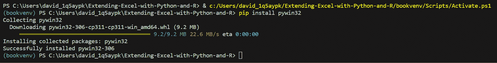
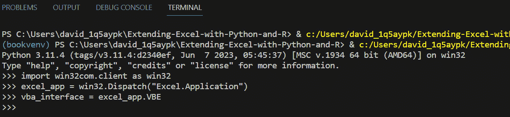
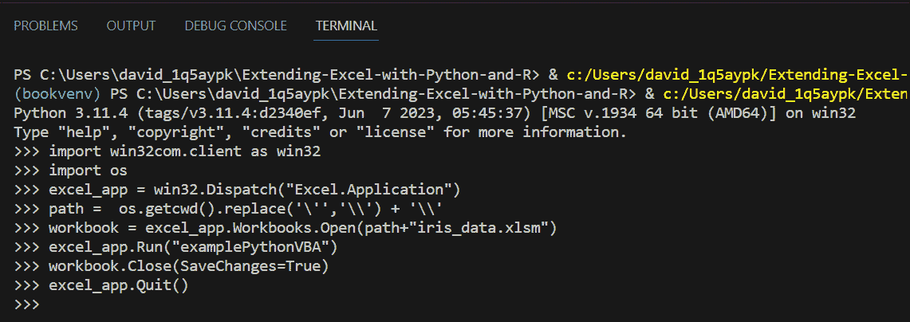
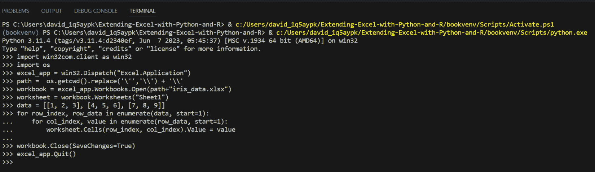
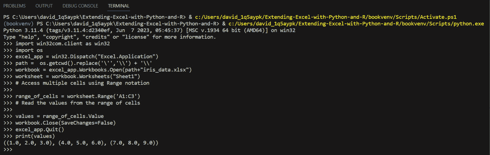

# 在 R 和 Python 中执行 VBA 代码

集成不同的编程语言可以解锁强大的功能并简化工作流程。当涉及到处理 Excel 文件时，**Visual Basic for Applications** (**VBA**) 是自动化任务的一个流行选择。然而，在某些情况下，您可能希望从 R 或 Python 中执行 VBA 代码，利用这些语言在数据处理、分析和可视化方面的优势。

通过 R 或 Python 从 Excel 文件中执行 VBA 代码提供了一种灵活的方法来利用现有的 VBA 宏或扩展 Excel 的功能。这种集成使数据科学家、分析师和开发者能够无缝地将 Excel 文件纳入其工作流程，结合 VBA 的优势与 R 或 Python 的分析能力。

通过从 R 或 Python 中执行 VBA 代码，您可以自动化复杂的过程，执行数据处理，生成报告，并以编程方式与 Excel 的功能交互。这种能力使用户能够处理大型数据集，实施高级数据处理技术，并生成定制化的输出。

R 和 Python 中有几种库和包可用于从 Excel 文件中执行 VBA 代码。这些工具提供 API 和函数，用于与 Excel 通信并直接从您的脚本中执行 VBA 宏，从而消除手动干预的需要。

在本章中，我们将探讨从 Excel 文件中执行 VBA 代码的不同方法，使用 R 和 Python。我们将深入实际示例，展示如何将这些语言与 Excel 集成，并利用其结合的力量来自动化任务并增强数据分析工作流程。

通过结合 R 或 Python 中的 VBA 执行功能，用户可以将基于 Excel 的项目提升到新的水平，提高效率、准确性和生产力。请继续关注，了解更多关于这个激动人心的集成及其广泛应用的详细信息。

在本章中，我们将涵盖以下主要主题：

+   安装并解释 R 包，RDCOMClient

+   使用 RDCOMClient 执行示例 VBA 代码

+   使用 `pywin32` 进行 VBA 集成的 Python

# 技术要求

在本节中，我们需要安装一个 R 库和一个 Python 库：

+   `RDCOMClient` R 库

+   Python 的 `pywin32` 库

本章中所有相关的代码都可以在以下 GitHub 仓库中找到：

[`github.com/PacktPublishing/Extending-Excel-with-Python-and-R/main/chapter3`](https://github.com/PacktPublishing/Extending-Excel-with-Python-and-R/main/chapter3)

# 安装并解释 RDCOMClient R 库

`RDCOMClient` 是一个 R 包，它为 R 和微软的 **组件对象模型** (**COM**) 架构之间提供了一个桥梁，使用户能够在 R 中与 COM 对象交互。通过 RDCOMClient，用户可以利用基于 COM 的应用程序（如 Microsoft Excel、Word、PowerPoint 和 Outlook）的力量来自动化任务、操作数据并将 R 与其他软件系统集成。

在深入了解 RDCOMClient 之前，理解 COM 对象的概念非常重要。COM 是一种二进制接口标准，允许不同的软件组件在多种编程语言和平台上相互交互并共享功能。在 RDCOMClient 的上下文中，COM 对象是指由基于 COM 的应用程序公开的应用特定对象，这些对象可以通过编程方式访问和操作。

RDCOMClient 提供了一套函数和方法来与 COM 对象交互，使自动化任务和从基于 COM 的应用程序中提取数据变得更加容易。以下是一些关键特性：

+   `RDCOMClient` 允许用户创建和连接到 COM 对象，在 R 和目标应用程序之间建立通信通道。例如，您可以从 R 中直接创建 Excel 应用程序对象并访问其功能。

+   `RDCOMClient` 允许您调用方法和检索或修改对象属性。这种功能使您能够自动化复杂任务，操作数据并自定义应用程序行为。

+   `RDCOMClient` 允许访问 COM 对象中的集合，例如 Excel 中的工作簿、工作表或范围。这种能力使您能够直接从 R 中提取、操作和分析数据，利用 Excel 内置功能的强大功能。

+   `RDCOMClient` 支持事件处理，使用户能够对 COM 对象触发的事件做出响应。例如，您可以编写 R 代码，以便在 Excel 中发生特定事件（如单元格值更改或工作表激活）时执行。

+   `RDCOMClient` 提供了处理 COM 对象交互过程中可能出现的错误机制，确保代码的健壮性。它还管理内存分配和清理，防止内存泄漏并优化资源利用。

`RDCOMClient` 的多功能性为各种应用打开了广泛的可能性。以下是一些示例：

+   `RDCOMClient` 允许用户在 Excel 中自动化重复性任务，例如数据提取、格式化、图表创建和报告生成。这可以显著提高数据分析工作流程中的生产力和准确性。

+   `RDCOMClient`，您可以通过编程方式创建、修改和从 Word 文档中提取内容，从而实现自动化文档生成、格式化和数据集成。

+   `RDCOMClient` 促进与 Outlook 的集成，使用户能够自动化电子邮件管理、日历安排和联系人同步等功能。

+   使用 `RDCOMClient` 动态创建和修改 PowerPoint 演示文稿，自动化生成幻灯片、格式化以及根据数据分析结果嵌入图表或表格。

`RDCOMClient` 作为将 R 与基于 COM 的应用程序集成的强大工具，提供了自动化、数据处理和系统集成的大量功能。通过弥合 R 和 COM 架构之间的差距，`RDCOMClient` 使用户能够利用 R 和各种 COM 应用程序的优势，为提高生产力、数据分析和工作自动化开辟无限可能。

既然我们已经讨论了我们可以使用 RDCOMClient 做什么，那么让我们来了解一下安装过程。

## 安装 RDCOMClient

要在 R 中安装包，你通常会在命令提示符中输入类似 `install.packages("dplyr")` 的命令来安装 `dplyr` 库。

对于 `RDCOMClient` 库，这会有一些变化。通常情况下，如果你使用 RStudio——你获取包的默认仓库——它将默认使用全局（CDN）RStudio 仓库，但针对这个包，我们将为安装命令提供一些特殊指令。

注意

RDCOMClient 仅在 Windows 系统上可用。

下面是命令的显示方式：

```py
install.packages(
"RDCOMClient",
repos = "http://www.omegahat.net/R",
type = "win.binary"
)
```

现在我们已经安装了 `RDCOMClient`，我们可以继续使用它做一些事情。在下一节中，我们将介绍如何使用它的几个示例。这个库的安装可能会有些繁琐，对于一些人来说，以下方法可能更有效：

```py
Install.packages("devtools")
Library(devtools)
Install_github("omegahat/RDCOMClient")
```

# 执行带有 RDCOMClient 的示例 VBA

对于这次执行，我们首先需要一个新的工作簿。让我们称它为 `mult_by_rand_ch3`。

在 `Record` 和其他名为 `Value` 的列上。这些列将简单地是数字 1 到 10。完成这个步骤后，我们需要继续创建一个简单的 VBA 脚本来从 `RDCOMClient` 库中执行。

我们将编写一个宏，该宏将获取 `Value` 列，然后使用 `RAND()` 函数将数字乘以一个随机数。

让我们回顾一下创建宏的步骤，并描述它是如何工作的。首先，看一下以下 VBA 代码：

```py
Sub MultiplyByRandom()
    Dim rng As Range
    Dim cell As Range
    ' Set the range to the desired range on Sheet1
    Set rng = Sheets("Sheet1").Range("B2:B11")
    ' Loop through each cell in the range
    For Each cell In rng
        ' Multiply the cell value by RAND() and store the result in the adjacent cell
        cell.Offset(0, 1).Value = cell.Value * Rnd()
    Next cell
End Sub
```

为了创建这个宏，你需要点击 **开发者** 选项卡或按 *Alt* + *F11* 打开 Visual Basic 编辑器。

通过访问 **插入** | **模块** 来插入一个新模块。完成此操作后，您可以将前面的代码输入到窗口中，然后关闭编辑器窗口。

为了获得一些清晰度，让我们回顾一下宏的每一行都做了什么：

+   `Sub MultiplyByRandom()`: 这行定义了一个名为 `MultiplyByRandom` 的 VBA 子程序的开始。

+   `Dim rng As Range` 和 `Dim cell As Range`：这些行声明了两个名为 `rng` 和 `cell` 的 `Range` 变量。这些变量将分别用于存储范围和单个单元格。

+   `Set rng = Sheets("Sheet1").Range("B2:B11")`: 这行将 `rng` 变量设置为指向 `Sheet1` 上从 B2 到 B11 的单元格范围。它指定了存储数字的位置。

+   `For Each cell In rng`：这一行启动一个循环，该循环将遍历`rng`范围内的每个单元格。它将当前单元格分配给`cell`变量，每次循环迭代一次。

+   `cell.Offset(0, 1).Value = cell.Value * Rnd()`：这一行使用`Rnd()`函数将当前单元格的值乘以一个随机生成的数字。然后将结果存储在相邻的单元格中，该单元格是通过使用`Offset`方法将引用向右移动一列（`0`行，`1`列）获得的。

+   `Next cell`：这一行表示循环的结束。它将循环移动到范围内的下一个单元格并重复该过程，直到处理完所有单元格。

+   `End Sub`：这一行标志着`MultiplyByRandom` VBA 子程序的结束。

为了运行这个宏，我们可以编写将执行它的 R 代码。我们将使用`RDCOMClient`库，并使用我们创建的 Excel `Workbook`对象中的`$Run()`方法来完成这项工作。

让我们继续编写这个脚本。

以下是对 R 代码中每一行的简单解释。

这一行加载了`RDCOMClient`库，该库提供了与 Microsoft Office 应用程序（如 Excel）交互的功能：

```py
# Load the library
library(RDCOMClient)
```

以下几行定义了 Excel 工作簿的文件路径和名称变量。它们仅适用于作者，并且应更新以反映您的工作位置。您可能在项目中工作并使用类似`paste0(getwd(), "/")`的东西。`f_path`、`f_chapter`和`f_name`变量分别指定目录路径、子目录名称和文件名。`paste0()`函数用于将这些变量连接起来以创建完整的文件路径：

```py
# Set file path
f_path <- "C:/Users/steve/Documents/GitHub/Extending-Excel-with-Python-and-R/"
f_chapter <- "chapter3/"
f_name <- "mult_by_rand_ch3.xlsm"
f <- paste0(f_path, f_chapter, f_name)
```

接下来的几行使用`COMCreate()`函数创建 Excel 应用程序的一个实例。`xl_app`变量代表 Excel 应用程序。然后，使用 Excel 应用程序的`Workbooks()`属性的`Open()`方法打开指定的工作簿（`f`）。最后，`xl_app[['Visible']] <- TRUE`将 Excel 应用程序的可见性设置为可见：

```py
# Make Excel App
xl_app <- COMCreate("Excel.Application")
xl_wkbk <- xl_app$Workbooks()$Open(f)
xl_app[['Visible']] <- TRUE
```

这一行将要在 Excel 中执行的宏的名称分配给`macro_name`变量。宏名称设置为`MultiplyByRandom`：

```py
macro_name <- "MultiplyByRandom"
```

这一行在 Excel 应用程序中执行`MultiplyByRandom`宏。使用 Excel 应用程序的`Run()`方法运行指定的宏：

```py
# Run the macro
xl_app$Run(macro_name)
```

这些行使用`xl_wkbk`工作簿对象的`close()`方法保存工作簿并关闭它。`TRUE`参数表示在关闭之前应保存更改。最后，使用`xl_app` Excel 应用程序的`Quit()`方法关闭 Excel 应用程序：

```py
# Save and Quit
xl_wkbk$close(TRUE); xl_app$Quit()
```

总结来说，代码使用`RDCOMClient`打开一个 Excel 工作簿，运行名为`MultiplyByRandom`的宏，保存更改，然后关闭工作簿和 Excel 应用程序。

让我们看看这是如何在 Python 中工作的！

# 使用 pywin32 将 VBA 与 Python 集成

在本节中，我们将深入探讨从 Python 执行 VBA 代码，探索两种语言之间的无缝集成以及它为自动化 Excel 任务、扩展功能和在 Python 工作流程中利用 Excel 的力量所开启的无限可能性。

本节将涵盖从 Python 使用 VBA 的动机、如何在 Windows 上设置环境以及如何编写和执行 VBA 代码。让我们深入探讨。

## 为什么要从 Python 执行 VBA 代码？

在深入细节之前，让我们探讨为什么从 Python 执行 VBA 代码可以非常有益。

Excel，凭借其广泛的功能和特性，是数据分析、报告和自动化的关键工具。然而，当处理复杂的数据操作或高级计算时，Excel 的内置功能有时可能不足。这就是 Python 和 VBA 集成发挥作用的地方。

Python 为数据处理、分析和机器学习提供了一个丰富的生态系统。其库，如 `pandas`、`NumPy` 和 `SciPy`，提供了强大的数据处理、统计分析建模工具。通过利用 Python 的灵活性和丰富的库，您可以增强 Excel 的功能，轻松应对复杂的数据分析任务。

通过将 Python 与 VBA 集成，您可以利用两种语言的优势。Python 提供了一个强大且灵活的数据分析环境，而 VBA 在自动化特定于 Excel 的任务和访问高级 Excel 功能方面表现出色。这种协同作用允许您使用 Python 的丰富库扩展 Excel 的功能，高效地处理大型数据集，并无缝地进行复杂计算和数据转换。

从 Python 执行 VBA 代码的好处不仅限于数据分析。您可以利用 Python 更广泛的生态系统来处理网络抓取、文本处理、机器学习和与外部 API 集成等任务。通过结合 Python 的多功能性和 VBA 的特定于 Excel 的功能，您可以创建超越 Excel 单独限制的动态和高效的工作流程。

此外，将 Python 和 VBA 集成开辟了协作和代码共享的机会。Python 在数据科学家、分析师和开发者中的流行确保了一个庞大的社区和丰富的共享知识。通过通过 VBA 将 Python 与 Excel 集成，您可以弥合这两个世界之间的差距，使数据分析师、开发人员和 Excel 高级用户能够协作并从彼此的专业知识中受益。

总结来说，从 Python 执行 VBA 代码使您能够做到以下事项：

+   利用 Python 丰富的库和工具进行数据分析和操作

+   使用 VBA 自动化重复性任务并构建自定义 Excel 应用程序

+   使用 Python 强大的生态系统进行复杂计算、数据处理和统计分析

+   利用 Python 的多功能性和访问外部数据源和 API 来扩展 Excel 的功能

+   在 Python 数据分析师、开发人员和 Excel 高级用户之间协作和共享代码

Python 和 VBA 的集成使您能够释放 Excel 的全部潜力，利用两种语言的优势，并将您的数据分析、报告和自动化技能提升到新的高度。

让我们继续设置从 Python 执行 VBA 代码的环境。

## 设置环境

要成功从 Python 执行 VBA 代码，我们需要通过安装所需的依赖项和配置必要的连接来设置环境。本节将指导您通过三个简单步骤确保设置过程的顺利。

### 安装 pywin32 库

`pywin32` 库作为 Python 和 Windows API 以及 COM 对象之间的桥梁。它使 Python 能够与 Excel 的对象模型交互并执行 VBA 代码。

要安装 `pywin32`，您可以使用包管理器，如 `pip`，在您的命令提示符或终端中运行以下命令：

```py
python –m pip install pywin32==306
```

这是它的运行方式：



图 3.1 – 使用 pip 在 Windows 上安装 pywin32

这将安装 `pywin32` 包及其依赖项，使 Python 能够与 Excel 通信。

### 建立与 Excel 的连接

一旦安装了 `pywin32`，我们就可以从 Python 建立与 Excel 的连接。此连接使我们能够以编程方式访问 Excel 的工作簿、工作表、范围和其他 Excel 特定功能。

要建立连接，我们可以利用 `pywin32` 提供的 `win32com.client` 模块。以下是如何创建与 Excel 连接的示例：

```py
import win32com.client as win32
excel_app = win32.Dispatch("Excel.Application")
```

如果环境设置正确，此代码将返回空值。然而，如果代码返回 `com_error`，请转到“环境设置错误处理”部分。



图 3.2 – 测试与 Excel 的连接

在前面的代码片段中，我们导入了 `win32com.client` 模块，并使用 `win32.Dispatch` 方法创建了一个新的 Excel 应用程序实例。这创建了 Python 和 Excel 之间的连接，使我们能够与 Excel 的对象交互并执行 VBA 代码。

### 创建与 VBA 代码交互的界面

连接建立后，我们可以创建一个界面，使我们能够从 Python 执行 VBA 代码。此界面作为 Python 和 VBA 之间的桥梁，使我们能够发送命令、调用 VBA 函数和访问 VBA 宏。要创建一个界面，我们可以使用前一步骤中获得的 `excel_app` 对象：

```py
vba_interface = excel_app.VBE
```

您可能会收到类似“程序访问 Visual Basic 项目不受信任”的错误。在这种情况下，您可以在 [`stackoverflow.com/questions/17033526/programmatic-access-to-visual-basic-project-is-not-trusted-from-iis`](https://stackoverflow.com/questions/17033526/programmatic-access-to-visual-basic-project-is-not-trusted-from-iis) 查找解决方案。

在前面的代码中，我们访问了 `excel_app` 对象。这使我们能够访问 VBA 的功能，包括执行 VBA 代码、操作模块以及从 Python 与 Excel 的对象交互。

通过遵循这些步骤，我们可以无缝地设置环境以执行 VBA 代码。`pywin32` 库的安装和与 Excel 的连接建立为执行 VBA 代码和利用 Excel 功能的基础。在接下来的章节中，我们将更深入地探讨执行 VBA 代码、与 Excel 对象交互以及探索将 Python 和 VBA 集成的各种用例。

## 环境设置中的错误处理

最后一条代码可能会给你显示“**项目不受信任**”的错误。正如错误提示的那样，这是因为你的 Excel 安全设置中 VBA 不受信任。要程序化访问 VBA，你需要更改安全设置。

注意

这超出了本书的范围，因此只有在你接受风险的情况下才更改设置。

要更改安全设置，你需要创建一个新的注册表键并向其中添加一个新的属性，方法是作为管理员运行 PowerShell。运行以下代码：

```py
 New-Item -path HKLM:\Software\Microsoft\Office\16.0\Excel\ -Name "Security"
Set-ItemProperty -path HKLM:\Software\Microsoft\Office\16.0\Excel\Security -Name "AccessVBOM" -Value 1
'''
```

然后，重新运行 Python 代码以测试环境是否正确设置。

现在我们已经设置了环境，让我们继续从 Python 执行 VBA 代码并探索它提供的可能性。

## 编写和执行 VBA 代码

一旦环境设置完成，我们就可以深入到从 Python 编写和执行 VBA 代码的过程。本节将介绍与 Excel 交互、运行 VBA 宏以及将结果检索回 Python 的不同方法和技巧。

让我们探索编写和执行 VBA 代码的一些关键方面。

### 使用 win32com.client 模块

由 `pywin32` 库提供的 `win32com.client` 模块提供了一种方便的方式来创建 COM 接口并从 Python 与 Excel 交互。使用此模块，你可以访问 Excel 的对象、打开工作簿、操作工作表以及执行 VBA 宏。

这里有一个示例，演示了如何使用 `win32com.client` 打开 Excel 工作簿并执行 VBA 宏。在运行此代码之前，你可以确保 `iris_data.xlsm` 包含宏，方法是转到 **开发者** | **宏**（或 **Visual Basic**），查看是否存在宏：

```py
import win32com.client as win32
import os
excel_app = win32.Dispatch("Excel.Application")
path =  os.getcwd().replace('\'','\\') + '\\'
workbook = excel_app.Workbooks.Open(path+"iris_data.xlsm")
excel_app.Run("examplePythonVBA")
workbook.Close(SaveChanges=True)
excel_app.Quit()
```

在相关方面，这里我们使用 `os` 库来处理工作目录和 Windows 特定的目录分隔符，以确保使用正确的绝对路径。这已经在之前的章节中进行了注释——文件必须位于 Python 运行的同一文件夹中（工作目录）或者你需要提供一个绝对路径。

代码没有返回任何内容，因为我们得到的效果是在 Excel 一侧：



图 3.3 – 从 Python 运行 VBA 宏

在前面的代码中，我们使用 `win32.Dispatch` 创建了 Excel 应用程序的实例，并使用 `Workbooks.Open` 方法打开了一个工作簿。然后，我们使用 `excel_app.Run` 执行名为 `examplePythonVBA` 的 VBA 宏。最后，我们关闭工作簿，不保存更改，并退出 Excel 应用程序。

宏只是简单地在一个单元格中创建一个包含简短信息的新的工作表。

运行此代码后，您可以打开 `.xlsm` 工作簿，查看宏是否实际工作。

### 与 Excel 对象交互

使用 `win32com.client`，您可以访问各种 Excel 对象，如工作表、范围和图表，允许您以编程方式操作它们。例如，您可以将数据写入特定范围，格式化单元格，创建图表或执行计算。以下是一个使用 Python 将数据写入 Excel 工作表的示例：

```py
import win32com.client as win32
import os
excel_app = win32.Dispatch("Excel.Application")
path =  os.getcwd().replace('\'','\\') + '\\'
workbook = excel_app.Workbooks.Open(path+"iris_data.xlsm")
worksheet = workbook.Worksheets("Sheet1")
data = [[1, 2, 3], [4, 5, 6], [7, 8, 9]]
for row_index, row_data in enumerate(data, start=1):
for col_index, value in enumerate(row_data, start=1):
worksheet.Cells(row_index, col_index).Value = value
workbook.Close(SaveChanges=True)
excel_app.Quit()
```

如果成功，代码不会返回任何输出：



图 3.4 – 交互单元格的输出

在前面的代码中，我们打开了一个 Excel 工作簿，访问名为 **Sheet1** 的特定工作表，并使用单元格的 **属性** 将数据写入单元格。我们遍历数据，并在相应的单元格中设置值。

### 将结果返回到 Python

在 Excel 中执行 VBA 代码后，您可能希望将结果返回到 Python 以进行进一步的分析或处理。完成此操作的一种方法是通过使用 Excel 的对象模型访问特定的值或范围，并将它们检索到 Python 变量中。

以下是一个使用 Python 从 Excel 工作表检索数据到 Python 列表的示例：

```py
import win32com.client as win32
import os
excel_app = win32.Dispatch("Excel.Application")
path =  os.getcwd().replace('\'','\\') + '\\'
workbook = excel_app.Workbooks.Open(path+"iris_data.xlsm")
worksheet = workbook.Worksheets("Sheet1")
# Access multiple cells using Range notation
range_of_cells = worksheet.Range('A1:C3')
# Read the values from the range of cells
values = range_of_cells.Value
workbook.Close(SaveChanges=False)
excel_app.Quit()
print(values)
```

代码的结果是一个元组的元组：

`((1.0, 2.0, 3.0), (4.0, 5.0, 6.0), (7.0, 8.0, 9.0))`



图 3.5 – 从 Excel 中检索数据

在前面的代码中，我们定义了一个 Excel 单元格范围，并使用 `Value` 属性检索它们的值。我们将这些值存储在 Python 列表中，以便进一步处理或分析。

通过利用 `win32com.client` 模块和 Excel 对象模型，你可以有效地从 Python 编写和执行 VBA 代码。

提供的代码示例说明了如何与 Excel 交互、运行 VBA 宏，并将数据返回到 Python 以进行进一步操作。尝试这些技术，根据您的具体需求进行修改，并探索将 Python 和 VBA 集成到 Excel 自动化和数据处理中的可能性。

让我们看看这个设置如何帮助自动化任务。

# 自动化 Excel 任务

从 Python 执行 VBA 代码的主要好处之一是自动化 Excel 任务。

本节将讨论使用 Python 中的 VBA 自动化常见 Excel 操作的实际示例。通过无缝集成 Python 和 VBA，您可以简化您的数据分析工作流程，并显著提高您的生产力。

让我们探索一些可以使用这种强大组合自动化的任务。

### 数据操作

通过 Python 和 VBA 的集成，您可以在 Excel 中自动化数据操作任务。这包括排序数据、筛选记录、合并数据集和执行复杂转换等任务。例如，您可以使用 Python 从外部源检索数据，使用 Python 库如 `pandas` 或 `NumPy` 处理数据，然后使用 VBA 更新 Excel 工作表中的转换数据。这种集成允许您自动化重复的数据操作任务并确保数据来源的一致性。

### 格式化

在 Excel 中自动化格式化任务可以节省大量的时间和精力。通过 Python 和 VBA，您可以定义格式化规则并将它们应用到特定的单元格、范围或整个工作表中。这包括字体样式、单元格边框、背景颜色和数字格式等格式化选项。通过结合 Python 的灵活性和 VBA 的格式化功能，您可以轻松地创建动态且视觉上吸引人的 Excel 报告或仪表板。

### 图表创建

Excel 的图表功能可以通过自动化从 Python 创建图表来有效利用。您可以从各种来源提取数据，在 Python 中进行必要的计算或汇总，然后使用 VBA 动态生成图表。这种自动化允许您直接从 Python 分析创建交互式和数据驱动的可视化，节省您的时间并提供对图表过程的更多控制。

由于这个主题相当庞大且重要，我们将在后面的专门章节中对其进行详细阐述。

### 复杂计算

Excel 以其强大的内置函数和公式而闻名。通过结合 Python 和 VBA，您可以进一步扩展 Excel 的计算能力。您可以利用 Python 的库进行高级数学或统计计算，并使用 VBA 将结果无缝集成到 Excel 中。这种集成使您能够在熟悉的 Excel 环境中执行复杂的计算、模拟或预测建模。

通过 Python 和 VBA 集成自动化 Excel 任务，您可以节省时间、消除手动错误并提高数据分析工作流程的效率。提供的代码示例和解释为您探索自动化的广泛可能性提供了一个起点。尝试不同的场景，根据您的具体需求调整代码，并充分发挥 Python 和 VBA 在 Excel 自动化方面的潜力。

我们现在知道如何从 Python 自动化 Excel 任务。我们也应该考虑为什么（或为什么不）这样做。

## 执行 VBA 从 Python 的优缺点

在本节中，我们将深入探讨从 Python 执行 VBA 代码的优缺点。通过了解这种方法的优点和局限性，您可以在选择适合您特定需求的工具时做出明智的决定。

让我们探讨从 Python 执行 VBA 代码的益处和考虑因素。

这里是从 Python 执行 VBA 代码的好处：

+   **灵活性与强大功能**：通过结合 Python 和 VBA，您可以同时获得这两种语言的灵活性和强大功能。Python 提供了丰富的库和工具，用于数据分析、科学计算和自动化。另一方面，VBA 在 Excel 中提供了广泛的功能，允许您利用其内置功能、公式和宏。这种组合使您能够高效地完成复杂任务并自动化 Excel 操作。

+   **与外部数据源的集成**：Python 在连接外部数据源方面表现出色，例如数据库、API 或网络爬取。通过从 Python 执行 VBA 代码，您可以无缝地将这些外部数据源与 Excel 集成。Python 可以检索数据，执行计算或转换，然后使用 VBA 更新 Excel 工作簿。这种集成使您能够利用 Python 的数据处理和分析能力，同时利用 Excel 的可视化和报告功能。

+   **自动化与效率**：从 Python 执行 VBA 代码允许您自动化重复的 Excel 任务，从而提高生产力和效率。您可以通过自动化数据导入/导出、数据清理、格式化和报告生成来简化工作流程。这种自动化消除了手动错误，减少了手动工作量，并为您腾出更多时间进行更关键的分析和决策任务。

以下是从 Python 执行 VBA 代码的改进领域：

+   **兼容性与平台依赖性**：从 Python 执行 VBA 代码主要支持基于 Windows 的系统。如果您在不同的操作系统上工作，例如 macOS 或 Linux，可能会遇到兼容性问题。此外，与不同版本的 Excel 或 Office 的兼容性可能有所不同，因此在共享或分发您的 Python 和 VBA 集成解决方案时需要仔细考虑。

+   **学习曲线和技能要求**：成功从 Python 执行 VBA 代码需要熟悉这两种语言。您需要了解 VBA 的语法和功能，以便进行 Excel 自动化，以及 Python 的语法和功能，以便与 Excel 交互并执行 VBA 代码。这可能需要一些学习和实践，尤其是如果您对这两种语言中的任何一种都不熟悉。

+   **维护和更新**：与任何软件集成一样，维护和更新可能需要考虑。如果 Excel 或 Python 生态系统有变化或更新，您可能需要相应地调整您的代码。此外，确保在不同版本的 Excel 和 Python 之间的兼容性和功能可能需要定期更新和测试。

尽管有这些考虑，但从 Python 执行 VBA 代码提供了一种强大的方法来自动化 Excel 任务，利用外部数据源，并创建高效的数据分析工作流程。通过结合 Python 和 VBA 的优势，你可以在 Python 项目中充分发挥 Excel 的潜力，并提高你的生产力和数据处理能力。

# 摘要

在本章中，我们学习了如何分别使用 `RDCOMClient` 和 `pywin32` 集成 R、Python 和 VBA。我们获得了从 Python 执行 VBA 代码、设置环境以及自动化 Excel 任务的知识，并理解了这种集成的优缺点。

这项知识将使你能够提升你的 Excel 自动化技能。

在下一章中，我们将深入探讨高级主题，基于你现有的知识进行构建。
