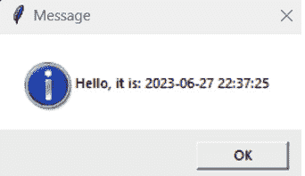

# 4

# 进一步自动化 - 任务调度和电子邮件

有时候，我们可能会花费无数个小时耐心地创建、格式化和发送 Excel 电子表格。但是，别担心！有了编程的力量，特别是 R 或 Python，您可以轻松自动化这些繁琐的任务，并重新获得宝贵的时间。

想象一下：您有一份需要整理成专业外观的销售额数据列表，并通过电子邮件发送给多个收件人。与其手动进行数据输入和格式化，您可以利用 R 或 Python 的强大功能简化您的工作流程。

在 R 中，您可以使用惊人的 `taskscheduleR` 包来安排任务，并在指定时间自动运行您的脚本。有了这个，您可以设置一个重复的任务来生成您的 Excel 电子表格并发送它们，无需动手。对于电子邮件，您可以使用 `RDCOMClient`、`Windows365R` 或 `blastula` 包，这些包允许您直接与 Outlook 和 Gmail 交互。这意味着您可以轻松地编写和发送带有附件的电子邮件，并根据需要自定义内容和收件人。

但是，Python 爱好者们，不要担心，您也可以达到同样的自动化魔法水平。在 Python 中，您可以使用 `pywin32` 库通过 Gmail 发送格式优美的电子邮件。它与您的代码无缝集成，使您能够轻松地附加 Excel 电子表格并自定义电子邮件的内容和收件人。

通过利用 R 或 Python 的力量，结合 `taskscheduleR`、`RDCOMClient`、`Windows365R` 或 `blastula`，您可以成为办公室的英雄，迅速提供准确、视觉上吸引人的电子表格，同时品尝您的咖啡。告别令人厌烦的重复工作，迎接高效的自动化。让您的创造力蓬勃发展，解锁 R 或 Python 的力量，自信且轻松地征服 Excel 电子表格和电子邮件分发的世界！

在本章中，我们将涵盖以下主要主题：

+   安装和理解 `taskscheduleR` 库

+   使用 `RDCOMClient`、`Windows365R` 和 `blastula` 在 Outlook 或 Gmail 中进行电子邮件操作

+   安排 Python 脚本

+   使用 Python 进行电子邮件通知和自动化

# 技术要求

本章的代码可以在以下位置找到：[`github.com/PacktPublishing/Extending-Excel-with-Python-and-R/tree/main/Chapter%204`](https://github.com/PacktPublishing/Extending-Excel-with-Python-and-R/tree/main/Chapter%204)。

您需要安装以下新的 R 和 Python 包：

+   `Blastula`

+   `Windows365R`

+   `schedule==1.2.0`

+   `apscheduler==3.10.1`

# 安装和理解 tasksheduleR 库

`taskscheduleR` R 包允许您使用 Windows 任务计划程序安排 R 脚本或进程。这意味着您可以在 R 内部自动执行特定时间点的 R 进程。该包基本上是`Schtasks.exe`功能的包装器。`Schtasks.exe`是一个命令行工具，允许您在本地或远程计算机上创建、删除、查询、更改、运行和完成计划任务。要使用`taskscheduleR`，您首先需要从 CRAN 安装该包。一旦安装了包，您就可以使用以下函数来安排 R 脚本：

+   `taskscheduler_create()`: 此函数创建一个新的计划任务。

+   `taskscheduler_remove()`: 此函数删除现有的计划任务。如果您使用的是版本 1.8，则该函数为`taskscheduler_delete()`。

+   `taskscheduler_get()`: 此函数获取现有计划任务的信息。

`taskscheduler_create()`函数接受多个参数，包括计划任务名称、要运行的 R 脚本和运行脚本的计划。例如，以下代码将创建一个每天上午 10:00 运行 R 脚本`my_scheduled_excel_script.R`的计划任务：

```py
taskscheduler_create(
  name = "My Scheduled Excel Task",
  rscript = "my_scheduled_excel_script.R",
  schedule = "DAILY",
  start_time = "10:00:00"
)`
```

您还可以通过安装`miniUI`和`shiny`来使用 GUI 为作业调度器创建任务。这将安装包的附加功能，让您可以轻松创建任务而无需编写任何代码。如果您想安装前面列出的包，可以使用以下代码：

```py
# The initial package itself
install.packages("taskscheduleR")
# To use the GUI
install.packages('miniUI')
install.packages('shiny')
```

现在，我们来看看如何创建这些脚本。

## 创建示例脚本

我们需要做的第一件事是创建一个可以通过 Windows 任务计划程序运行的脚本。让我们保持脚本简单，只使用 R 函数`Sys.time()`打印`Hello`和当前日期和时间。完成此操作后，我们就可以创建几个将运行脚本的作业。

这里是`hello_world.R`脚本：

```py
library("tcltk")
tkmessageBox(
  title='Message',
  message = paste0("Hello, it is: ", Sys.time()),
  type = "ok"
  )
```

第一行代码，`library("tcltk")`，加载了`tcltk`包，该包提供了在 R 中创建和与**图形用户界面**（**GUIs**）交互的函数。

第二行代码，`tkmessageBox()`，创建一个消息框。消息框是一个弹出窗口，显示一条消息并允许用户采取某些操作，例如点击按钮。

`tkmessageBox()`函数的参数如下：

+   `title`: 消息框的标题。

+   `message`: 将在消息框中显示的消息。

+   `type`: 消息框的类型。可能的值有`ok`、`okcancel`、`yesno`、`yesnocancel`、`retrycancel`和`abortretryignore`。

在这种情况下，消息框的类型是`ok`，这意味着用户只能点击一个`ok`按钮来关闭消息框。

第三行代码，`paste0("Hello, it is: ", Sys.time())`，创建一个将在消息框中显示的字符串。该字符串包括从`Sys.time()`函数获取的当前时间。

当运行此代码时，将弹出一个消息框，显示当前时间和一个 `ok` 按钮。用户可以点击 **OK** 按钮关闭消息框。

下面是消息框外观的截图：



图 4.1 – Hello world 消息框

现在，让我们编写几个脚本，它们将在预定时间在屏幕上弹出此消息。以下是一个每小时运行一次的脚本：

```py
taskscheduler_create(
  taskname = "Hello World Hourly",
  rscript = "hello_world.R",
  schedule = "HOURLY"
)
```

代码的第一行，`taskscheduler_create()`，调用了来自 `taskscheduleR` 包的 `taskscheduler_create()` 函数。`taskscheduleR` 包提供了用于创建和管理 Windows 任务调度器作业的函数。

`taskscheduler_create()` 函数接受以下三个参数：

+   `taskname`：任务调度器作业的名称

+   `rscript`：任务调度器作业将要运行的 R 脚本的路径

+   `schedule`：任务调度器作业的调度

在这种情况下，任务名称是 `Hello World Hourly`，R 脚本是 `hello_world.R`，调度是 `"HOURLY"`。

代码的第二行，`taskname = "Hello World Hourly"`，将任务名称设置为 `Hello World Hourly`。任务名称是任务调度器作业的唯一标识符。

代码的第三行，`rscript = "hello_world.R"`，设置了任务调度器作业将要运行的 R 脚本的路径。R 脚本必须保存在任务调度器可以访问的位置。

代码的第四行，`schedule = "HOURLY"`，设置了任务调度器作业的调度。调度是一个字符串，指定了任务调度器作业何时运行。调度 `"HOURLY"` 表示任务调度器作业将每小时运行一次。当运行此代码时，将创建一个新的任务调度器作业，每小时运行 `hello_world.R` R 脚本。

现在，如果你不使用 Microsoft 365，我们将继续使用 `RDCOMClient` 来操作 Outlook。这将使我们能够在其他进程中编写发送电子邮件的脚本。

# Outlook 的 RDCOMClient

正如我们所见，`RDCOMClient` 是一个强大的 R 包，它允许你通过 COM 接口与 Microsoft Outlook 进行交互。使用 `RDCOMClient`，你可以自动化 Outlook 中的任务，例如发送电子邮件、访问文件夹、管理约会等。通过 `RDCOMClient` 使用 Outlook 发送电子邮件非常简单，只需遵循几个步骤即可。以下是相应的脚本：

```py
install.packages("RDCOMClient")
library(RDCOMClient)
OutApp <- COMCreate("Outlook.Application")
OutMail <- OutApp$CreateItem(0)
outMail[["To"]] <- "recipient@example.com"
outMail[["Subject"]] <- "Hello from RDCOMClient"
outMail[["Body"]] <- "This is the body of the email."
outMail$Attachments$Add("C:/path/to/attachment.txt")
outMail$Send()
outMail <- NULL
OutApp <- NULL
```

让我们现在理解前面代码的每一行：

1.  首先，你需要在 R 环境中安装并加载 `RDCOMClient` 包。

1.  一旦安装，使用 `library()` 函数加载该包。

1.  接下来，使用 `COMCreate()` 函数创建一个新的 Outlook 应用程序对象。

1.  这将建立与 Outlook 应用程序的连接。现在，你可以使用 `OutApp$CreateItem()` 方法创建一个新的电子邮件对象，并指定电子邮件类型为 `olMailItem`。

1.  接下来，您可以设置电子邮件的各种属性，例如收件人、主题、正文、附件等。以下是如何设置这些属性的示例：

    ```py
    outMail[["To"]] <- "recipient@example.com"
    outMail[["Subject"]] <- "Hello from RDCOMClient"
    outMail[["Body"]] <- "This is the body of the email."
    outMail$Attachments$Add("C:/path/to/attachment.txt")
    ```

1.  在设置所需的属性后，您可以使用`Send()`方法发送电子邮件，然后就可以结束了！

    电子邮件将从您的 Outlook 账户发送到指定的收件人，并带有配置的属性。记得在完成操作后释放 COM 对象并终止连接。

    这确保了资源得到适当的释放。

通过使用`RDCOMClient`，您可以直接从 R 中自动化 Outlook 中的电子邮件发送任务，从而让您的工作流程更加流畅并节省时间。它提供了一个方便的方法将 R 与 Outlook 集成，并允许以编程方式利用其功能。

现在，我们将深入探讨`Microsoft365R`和`blastula`这两个协同工作的包。这将替代使用`RDCOMClient`库，原因在于`Microsoft365R`适用于使用 Microsoft Azure 而不是通过 Outlook 的通用 SMTP 连接的用户。

# 使用 Microsoft365R 和 blastula 包

我们现在将介绍两个可以相互配合使用以通过 Microsoft Outlook 创建电子邮件的包。这些包是 Microsoft365R 和 blastula。让我们在接下来的部分中查看它们。

## Microsoft365R

**Microsoft365R**是一个 R 库，它提供了一个接口来访问 Microsoft 365（以前称为 Office 365）云服务。它建立在`AzureGraph`包之上，该包为与 Microsoft Graph API 交互提供了高级抽象。目前，`Microsoft365R`支持以下 Microsoft 365 服务：

+   Teams

+   Outlook

+   SharePoint Online

+   OneDrive

该库为访问每个这些服务提供了几个顶级客户端函数。例如，`get_personal_onedrive()`函数可以用来访问您的个人 OneDrive 账户，而`get_business_outlook()`函数可以用来访问您的工作或学校 Outlook 账户。

Microsoft365R 还提供了一些用于处理 Microsoft Graph API 的辅助函数。例如，`list_drive_contents()`函数可以用来列出 OneDrive 驱动器的内容，而`send_email()`函数可以用来从 Outlook 发送电子邮件。

该库有良好的文档记录，并提供了一些示例来帮助您开始使用。它还定期积极维护和更新，包括新功能和错误修复。

使用 Microsoft365R 的一些好处如下：

+   它提供了一个简单易用的界面，用于访问 Microsoft 365 云服务

+   它建立在`AzureGraph`包之上，该包为与 Microsoft Graph API 交互提供了高级抽象

如果你正在寻找一个提供访问 Microsoft 365 云服务的 R 库，那么 Microsoft365R 是一个不错的选择。它在包的 vignettes 中有很好的文档记录，积极维护，并支持广泛的 Microsoft 365 服务。我们将只关注其 Outlook 的使用。

## blastula 包

`blastula` R 包是一个工具，它使得从 R 生成和发送 HTML 电子邮件变得容易。你可以使用 Markdown 文本、基于块的组件，甚至 HTML 片段来创建包含三个内容区域的电子邮件消息：正文、页眉和页脚。该包还提供了设置 `install.packages("blastula")` 的函数。

使用 blastula 而不是其他电子邮件包的一些优点如下：

+   它允许你使用 Markdown 文本、基于块的组件，甚至 HTML 来创建专业且可能计算出的文档电子邮件。你可以在电子邮件的正文、页眉和页脚中实现这一点。

+   该包还提供了设置 SMTP 访问凭证和通过传统 SMTP 服务器发送电子邮件的功能，或者如果你是 RStudio Connect 用户，你可以通过 RStudio Connect 发送电子邮件。

+   生成的电子邮件在任何显示器上看起来都会很棒。

+   语法直观，让你可以快速有效地编写代码，同时将主要关注点放在电子邮件本身的信息上。

下面是一个使用 `blastula` 创建和发送简单 HTML 电子邮件消息的示例：

1.  首先，我们需要使用 `library(blastula)` 和 `library(glue)` 加载 `blastula` 包。

1.  接下来，我们可以使用 `compose_email()` 函数创建电子邮件消息。我们可以向正文参数提供 Markdown 文本以在 HTML 中渲染；例如，参见以下：

    ```py
    email <- compose_email(
      body = md(glue(
    "Hello, this is {sale_file} contains the latest quarters data. Here is a picture of the graph that will be on our dashboard:![sales dashboard] https://dashboard.company.com/)")
    )
    ```

1.  然后，我们可以通过调用电子邮件对象在查看器中预览电子邮件消息：

    ```py
    email
    ```

1.  最后，我们可以使用 `smtp_send()` 函数通过 SMTP 服务器发送电子邮件消息。我们需要提供收件人的电子邮件地址、发件人的电子邮件地址、主题行和 SMTP 服务器的凭证：

    ```py
    email %>%
      smtp_send(
         to = "jane_doe@example.com",
         from = "joe_public@example.net",
         subject = "Testing the `smtp_send()` function",
         credentials = creds_file("email_creds")
      )
    ```

    `creds_file()` 函数是一个辅助函数，用于为 SMTP 访问创建凭证文件。

    我们可以使用 `create_smtp_creds_file()` 函数交互式地生成此文件：

    ```py
    create_smtp_creds_file(
      file = "email_creds",
      user = "joe_public@example.net",
      provider = "gmail"
    )
    ```

这将提示我们输入我们的密码和两步验证码（如果已启用）以访问 Gmail。凭证文件将保存在安全位置，并可以用于未来的电子邮件消息。

既然我们已经单独了解了这两个包，让我们看看如何将它们结合起来使用，以实现更稳健和流畅的效果。

下面是一个完整的脚本，然后我们将讨论它是如何工作的：

```py
install.packages("blastula")
install.packages("Microsoft365R")
library(blastula)
library(Microsoft365R)
# Get work/school email
outlb <- get_business_outlook()
# compose an email with blastula
bl_body <- "## Hello!
You can write email in **Markdown** with the blastula package."
bl_em <- compose_email(
     body=md(bl_body),
     footer=md("sent via Microsoft365R and R")
)
em <- outlb$create_email(bl_em, subject="Hello from R", to="email@example.com")
# add an attachment and send it
em$add_attachment("mydocument.docx")
em$send()
```

现在，让我们逐一查看脚本中的每个部分，以了解正在发生的事情。

1.  首先，我们必须安装 `blastula` 和 `Microsoft365R` 包。

1.  然后，我们使用 `library()` 函数将那些库调用到当前会话中。

1.  然后，我们创建一个名为 `outlb` 的变量，用于存储 `get_business_outlook()` 函数的变量。

1.  然后我们创建电子邮件的主体。我们可以使用 Markdown 语法编写电子邮件。

1.  在我们创建电子邮件的主体之后，我们接着创建一个变量来保存使用 `compose_email()` 函数创建的电子邮件本身。

1.  从这里，我们添加附件并发送电子邮件。

电子邮件是通过配置的工作/学校电子邮件账户发送的。因此，总的来说，这些代码行安装必要的包，加载所需的库，检索工作/学校电子邮件账户，使用 `blastula` 包编写电子邮件，向电子邮件添加附件，并最终使用 `Microsoft365R` 包发送电子邮件。

你已经了解了 R 中的安排和电子邮件集成。现在，让我们看看如何在 Python 中实现相同的功能！

# 安排 Python 脚本

自动化不仅限于手动执行脚本；它还涉及在特定间隔或事件中安排它们运行。安排 Python 脚本允许你自动化重复性任务，执行定期数据更新，生成报告，以及执行系统维护，而无需人工干预。

在本节中，我们将探讨安排 Python 脚本的多种技术和工具，以实现高效和及时的执行。

到本节结束时，你将全面了解适用于 Python 脚本的多种安排技术和工具。你将具备有效安排 Python 脚本、自动化常规任务并最大化生产力的知识和技能。无论你是在 Windows 或类 Unix 系统上运行脚本，这一章节都将赋予你实施可靠且高效的 Python 脚本安排解决方案的能力。

## Python 脚本安排简介

我们将首先讨论安排 Python 脚本的重要性及其在简化工作流程中的益处。你将了解为什么安排对于自动化任务至关重要，以及它如何节省时间和精力。我们还将强调 Python 脚本安排在实际场景中的常见应用。

安排 Python 脚本在自动化任务和提升工作流程效率方面发挥着至关重要的作用。通过安排脚本在特定间隔或事件中运行，你可以消除手动执行的需求，并确保及时准确的数据处理、报告生成和系统维护。

在本节中，我们将探讨 Python 脚本安排的重要性，并强调其在以下列出的各个领域的益处：

+   **自动化重复性任务**：数据处理、分析和报告中的许多任务都涉及重复操作。安排 Python 脚本允许你自动化这些任务，减少手动执行所需的时间和精力。无论是从外部来源获取数据、执行计算、生成报告还是更新数据库，安排脚本都能确保一致可靠的自动化。

+   **定期数据更新**：在许多应用中，数据需要定期从外部来源更新或从内部系统刷新。Python 脚本安排使您能够定义自动获取、转换和更新数据的计划。通过指定所需的频率，您可以确保数据保持最新，无需人工干预。

+   **生成报告**：报告通常定期生成，如每日、每周或每月。使用 Python 脚本安排，您可以通过安排脚本在特定间隔运行来自动化报告的生成。这确保了报告的持续生成和准时交付，节省了宝贵的时间和精力。

+   **系统维护**：Python 脚本安排不仅限于数据相关任务；它还可以用于系统维护活动。从执行备份和数据库维护到运行系统检查和执行常规清理任务，安排 Python 脚本使您能够在无需人工干预的情况下保持系统平稳运行。

+   **实际场景**：Python 脚本安排在各个行业和领域都有应用。例如，在电子商务中，脚本可以安排更新产品库存、同步价格和生成销售报告。在金融领域，安排的脚本可以抓取股市数据、计算投资组合表现和生成财务报表。在 IT 运营中，脚本可以安排进行系统监控、日志分析和自动事件响应。这些只是 Python 脚本安排如何在不同领域提高生产力和效率的几个例子。

通过理解 Python 脚本安排的重要性及其益处，您可以识别自动化任务、简化工作流程和提高整体生产力的机会。

在接下来的章节中，我们将探讨用于安排 Python 脚本的不同方法和工具，为您提供实施有效且可靠的自动化解决方案的知识和技术。

## 内置安排选项

Python 在 Windows 和 Unix-like 系统上提供内置的安排选项，无需外部库。这些选项提供了一种方便且轻量级的方式来安排和执行您的 Python 脚本，在预定义的间隔内运行。在本节中，我们将探讨内置的安排选项，并讨论其特性、用法和限制。

我们将探讨 **Windows 任务计划程序** 和 Unix-like 系统上的 **crontab**。您将学习如何使用这些原生安排工具设置计划任务，指定执行频率，并配置各种选项以满足您的特定需求。

这里是内置选项及其关键特性的列表：

### cron（Unix-like 系统）

以下列出的是 cron 的关键特性：

+   cron 是一种基于时间的作业安排程序，可在 Unix-like 操作系统上使用，包括 Linux 和 macOS

+   它允许您通过指定时间、日期和频率使用 cron 表达式来安排重复的任务

+   cron 提供了定义计划的灵活性，例如在特定时间、特定周几或定期运行脚本

+   它得到了广泛的支持，并且多年来一直是类 Unix 系统上调度任务的既定标准

+   虽然 cron 不是 Python 特定的工具，但您可以通过指定适当的命令行调用来使用它来安排 Python 脚本的执行

### Windows 任务计划程序（Windows 系统）

以下列出了 Windows 系统的特性：

+   Windows 任务计划程序是 Windows 操作系统提供的内置任务调度工具

+   它允许您在 Windows 机器上安排在特定时间或事件运行的任务

+   您可以通过图形用户界面或使用命令行工具`schtasks`创建计划任务

+   Windows 任务计划程序提供了一系列定义触发器的选项，例如特定时间、每日、每周或每月的计划，甚至基于系统事件

+   它提供了一个用户友好的界面来管理计划任务，包括设置依赖关系、优先级设置和错误处理

### Python 的`time.sleep()`函数

这是`time.sleep()`函数的关键特性列表：

+   虽然 Python 的内置`time`模块并非专门设计用于调度任务，但它提供了一种简单的方法来在脚本执行之间引入延迟

+   `time.sleep()`函数暂停脚本指定的秒数，允许您控制脚本运行之间的时间间隔

+   虽然此选项缺乏专用调度工具的复杂性和高级功能，但在需要固定延迟的简单情况下可能很有用

+   然而，请注意，使用`time.sleep()`作为调度机制可能不适合精确或复杂的调度需求

重要的是要注意，这些内置的调度选项有其优点和局限性。它们适用于许多用例，但可能不提供复杂调度场景所需的先进功能和灵活性。在这种情况下，外部库和工具可以提供更稳健的解决方案。

在下一节中，我们将探讨一些流行的第三方库，用于调度 Python 脚本，提供额外的功能和定制选项。

## 第三方调度库

虽然 Python 的内置调度选项可以处理许多常见的调度任务，但还有几个第三方库可用，它们提供了更多高级功能和定制选项。这些库提供了更大的灵活性和对调度 Python 脚本的控件，使您能够轻松处理复杂的调度场景。

在本节中，我们将探讨一些流行的第三方调度库，并讨论它们的功能和优势。我们将涵盖使用类似 cron 的语法定义调度、处理时区和管理并发执行等主题。

### schedule

下面是`schedule`库的功能和优势：

+   `schedule`库是一个轻量级的 Python 库，简化了任务调度的过程。

+   它提供了一个直观且易于使用的 API，用于使用流畅的接口定义调度。

+   该库支持各种调度选项，如特定时间、间隔和类似 cron 的表达式。

+   `schedule`允许您在定义的调度下执行函数、方法，甚至 shell 命令。

+   它被设计得简单轻量，适合小型项目或需要最小化调度解决方案的情况。

下面是一个在 Python 中使用`schedule`的简单示例：

```py
import schedule
import time
def job():
    print("This job is executed every day at 8:00 AM.")
# Schedule the job to run every day at 8:00 AM
schedule.every().day.at("08:00").do(job)
# Keep the program running
while True:
    schedule.run_pending()
    time.sleep(1)
```

在这个示例中，我们导入`schedule`库并定义一个名为`job()`的函数，该函数打印一条消息。然后，我们使用`schedule.every().day.at(08:00).do(job)`语法来安排`job`函数每天早上 8:00 运行。最后，我们使用一个`while`循环来持续检查待处理的计划任务并执行它们。请注意，这种解决方案意味着控制台被`blocked`，即运行这个无限循环的 Python 进程将无法执行其他任务。要停止调度器，只需中断内核/控制台或终止底层的 Python 进程。

您可以通过使用`schedule`库提供的不同方法来自定义调度行为，例如`.every().day.at()`、`.every().monday`、`.every().hour`等。此外，您可以根据需求安排在特定间隔运行的任务，或者组合多个调度模式。

接下来，让我们看看`APScheduler`。

### 高级 Python 调度器 (APScheduler)

下面是`APScheduler`的功能和优势：

+   **高级 Python 调度器**（**APScheduler**）是 Python 中调度任务的另一个流行选择。

+   它提供了一套丰富的功能，包括各种触发类型，如间隔、cron 表达式和基于日期的触发器。

+   APScheduler 支持多种作业存储，包括内存、SQL 数据库和 Redis。

+   它提供了高级调度选项，如作业合并、分布式调度和时间支持。

+   APScheduler 具有完善的文档，并被广泛应用于各种应用中，从简单的脚本到复杂的 Web 应用。

下面是一个使用`APScheduler`库安排任务的示例代码片段：

```py
from apscheduler.schedulers.blocking import BlockingScheduler
# Create a scheduler instance
scheduler = BlockingScheduler()
# Define a task function
def send_email():
     # Code to send an email
     print("Email sent!")
# Schedule the task to run every hour
scheduler.add_job(send_email, 'interval', hours=1)
# Start the scheduler
scheduler.start()
```

从前面的示例中，我们可以理解以下内容：

1.  我们首先从`apscheduler.schedulers.blocking`模块中导入`BlockingScheduler`类。然后，我们使用`BlockingScheduler()`创建调度器的一个实例。

1.  接下来，我们定义一个名为`send_email()`的函数，它代表发送电子邮件的任务。在这个函数内部，您可以编写发送电子邮件或执行任何其他所需操作的代码。

1.  要调度任务，我们使用调度器的`add_job()`方法。在这种情况下，我们将`send_email`函数指定为要执行的任务。我们还通过`interval`选项提供调度参数，该选项表示任务应定期执行。在这个例子中，我们将其设置为每小时运行一次（`hours=1`）。

1.  最后，我们通过调用`start()`方法来启动调度器。这将初始化调度器并开始根据定义的日程执行任务。

`APScheduler`库提供了各种调度选项，例如固定间隔、cron 表达式、日期/时间触发器等。您可以通过查阅文档并使用 APScheduler 提供的适当调度选项来根据您的具体需求自定义调度行为。

接下来，为了完整性，让我们看一下 Celery 包。

### Celery

以下是一些 Celery 的功能和好处：

+   Celery 是一个用于任务执行和调度的分布式任务队列库。

+   它为在多个工作者或机器上跨多个 Python 任务提供了一种强大且可扩展的解决方案。

+   Celery 支持各种调度选项，包括间隔、类似 crontab 的表达式等。

+   它提供了高级功能，如任务优先级、结果跟踪、重试和任务链。

+   Celery 与消息代理如**RabbitMQ**、**Redis**或**Apache Kafka**很好地集成，提供了可靠且可扩展的任务调度能力。

通过使用 Celery 调度器，您可以根据特定的日程自动化任务的执行，允许您在应用程序中执行周期性或基于时间的操作。不过，配置和部署 Celery 应用程序超出了本书的范围，所以这里仅为了完整性而提及。如果您想深入了解，可以查阅官方文档：[`docs.celeryq.dev/en/stable/userguide/periodic-tasks.html`](https://docs.celeryq.dev/en/stable/userguide/periodic-tasks.html)。

这些第三方调度库为调度 Python 脚本提供了强大且灵活的解决方案。根据您的具体需求和调度任务的复杂性，您可以选择最适合您需求的库。每个库都有其自身的优势和功能，因此根据您项目的需求进行评估非常重要。

在下一节中，我们将探讨使用这些库来为各种用例调度 Python 脚本的实际示例。

## 适用于强大自动化方案的最佳实践和考虑因素

当与调度 Python 脚本一起工作时，遵循最佳实践并考虑各种因素对于确保高效和可靠的自动化至关重要。本节提供了关于有效调度 Python 脚本的最佳实践和考虑因素的见解。

这些最佳实践将帮助您创建强大且可维护的计划任务。让我们在以下章节中讨论这些最佳实践。

### 错误处理和日志记录

这里是错误处理和日志记录的最佳实践：

+   实施强大的错误处理机制来处理脚本执行过程中可能发生的任何意外异常和错误

+   使用日志框架来捕获有关脚本执行的详细信息，包括错误、警告和信息消息

+   正确的错误处理和日志记录允许您诊断问题、跟踪脚本性能并确保计划任务按预期执行

### 资源管理

这里是资源管理的最佳实践：

+   考虑您计划中的 Python 脚本所需的资源，例如 CPU、内存和磁盘空间

+   通过识别和最小化任何资源密集型操作或瓶颈来优化资源使用

+   确保您的脚本正确释放资源，以避免资源泄漏或冲突

### 安全考虑

这里是安全考虑的最佳实践：

+   评估调度 Python 脚本的安全影响，特别是如果它们涉及敏感数据或与外部系统交互

+   实施必要的安全措施，例如加密凭证、保护 API 端点以及遵守身份验证和授权协议

+   定期审查和更新安全措施以减轻潜在的风险和漏洞

### 测试和验证

这里是测试和验证的最佳实践：

+   仔细测试和验证您的计划 Python 脚本，以确保它们的正确性和可靠性

+   执行单元测试、集成测试和端到端测试，以验证脚本按预期工作并处理各种场景

+   考虑创建一个预演环境，在那里您可以测试计划任务，然后再将它们部署到生产环境

### 监控和警报

这里是监控和警报的最佳实践：

+   建立监控和警报机制以跟踪计划任务的执行状态

+   监控调度系统的性能和健康状况，包括脚本执行时间、资源使用以及任何潜在的错误或故障

+   配置警报，以便在任务失败时通知您，以便进行快速干预和故障排除

### 文档和维护

这里是文档和维护的最佳实践：

+   记录调度过程，包括配置、依赖关系以及管理计划任务的具体说明

+   维护您计划中的 Python 脚本的最新日程安排，包括每个任务的频率和预期结果

+   定期审查和更新你的计划设置、脚本和依赖项，以适应不断变化的需求和技术。

通过遵循这些最佳实践并考虑相关因素，你可以确保计划 Python 脚本的可靠性、效率和安全性。将这些考虑因素纳入你的计划工作流程将有助于任务的顺利执行，并帮助你维护一个结构良好且可持续的自动化系统。

在下一节中，我们将探讨实际示例和应用案例，说明这些最佳实践和考虑因素在现实场景中的应用。

通过完成本节关于安排 Python 脚本的内容，你获得了自动化和管理脚本执行的有价值知识和技能。让我们总结一下你所学到的内容：

+   你探讨了不同操作系统中可用的各种内置计划选项，例如类 Unix 系统上的 cron 作业和 Windows 上的任务计划程序，使你能够安排在特定时间或间隔运行 Python 脚本。

+   你发现了第三方计划库，如 `APScheduler` 和 `Schedule`，它们提供了更高级的计划功能，例如类似 cron 的表达式和基于间隔的计划。

+   你了解了安排 Python 脚本的最佳实践，包括错误处理、资源管理、安全考虑、测试、验证、监控和警报，以及文档和维护。

+   通过实际示例和应用案例，你获得了实施和管理计划 Python 脚本的实际经验，确保你的任务自动化高效且可靠。

通过掌握本节涵盖的概念和技术，你现在可以有效地安排 Python 脚本，自动化重复性任务，并简化你的工作流程。能够安排脚本为自动化各种流程、提高生产力和为更关键的任务节省宝贵时间打开了新的可能性。

在下一节中，我们将深入探讨令人兴奋的电子邮件通知领域，并探讨如何通过将电子邮件功能集成到你的 Python 脚本中，增强你的自动化工作流程。

# 使用 Python 进行电子邮件通知和自动化

与安排 Python 脚本类似，电子邮件通知和自动化可以使你的日常工作更加高效。本节将涵盖基础知识，例如使用 Python 发送电子邮件的动机，接着介绍设置环境和发送基本电子邮件，然后讨论一个实际应用案例：发送脚本状态电子邮件通知。

## Python 中电子邮件通知简介

电子邮件通知在自动化中发挥着至关重要的作用，通过提供及时更新、警报和报告。在本节中，我们将探讨将电子邮件功能集成到您的 Python 脚本中的重要性。我们将讨论电子邮件通知可以带来益处的各种用例，并深入探讨它们在简化工作流程和增强沟通方面的优势。

让我们从最基本的考虑开始：你为什么要这样做？

### 集成电子邮件功能到您的脚本的使用案例和优势

电子邮件通知具有多功能性，可以应用于各种场景。以下是一些常见的用例：

+   **任务完成通知**：这些通知发送给利益相关者，表明任务或过程的成功完成，有助于让他们了解一切进展顺利。

+   **错误和异常报告**：这涉及到在脚本执行过程中发生错误或异常时向相关团队成员或管理员发出警报，以便进行及时的故障排除和问题解决。

+   **进度更新**：这为利益相关者或客户提供定期的进度更新，确保透明度并保持开放的沟通渠道。

+   **数据分析报告**：这些通过电子邮件自动生成和发送数据分析报告，通过消除手动报告创建和分发的需求来节省时间和精力。

+   **系统监控**：这涉及到设置电子邮件通知以监控系统状态，例如服务器正常运行时间、磁盘空间使用情况或应用程序性能。即时警报可以帮助在问题影响操作之前解决潜在问题。

通过将电子邮件通知集成到您的 Python 脚本中，您可以享受到以下好处：

+   **实时更新**：了解自动化任务的进度、状态和结果

+   **增强协作**：通过提供及时的通知，促进团队成员之间的沟通和协作

+   **错误检测和解决**：接收有关脚本中错误或异常的警报，使您能够快速识别和解决问题

+   **定制和个人化**：根据您的具体要求定制电子邮件通知，包括内容、格式和收件人

+   **简化工作流程**：自动化报告、更新和警报的交付，节省手动分发的时间和精力

在本节中，我们将探讨 Python 中电子邮件通知的各个方面，使您能够利用这一强大的通信工具在自动化工作流程中。

让我们深入探讨如何有效地设置和使用电子邮件功能。

## 设置电子邮件服务

在深入探讨从 Python 发送电子邮件通知之前，设置必要的电子邮件服务以在您的脚本和电子邮件服务器之间建立连接是至关重要的。

到本节结束时，您将清楚地了解如何为您的 Python 脚本设置电子邮件服务。您将具备选择合适的电子邮件服务提供商、获取所需的 SMTP 服务器凭据、配置安全连接以及测试连接的必要知识。一旦您的电子邮件服务就绪，您就可以继续从您的 Python 脚本中无缝发送电子邮件通知的下一步了。

让我们开始，有效地设置您的电子邮件服务。

在本节中，我们将介绍配置电子邮件服务所需的步骤，包括以下方面。

### 选择电子邮件服务提供商

可用的电子邮件服务提供商有多种，每个都提供不同的功能和选项。在本节中，我们将以 Gmail 为例，但代码可以轻松地适应其他提供商，例如 Microsoft Exchange 等。

### 获取 SMTP 服务器凭据

要以编程方式发送电子邮件，重要的是获取您的电子邮件服务提供商提供的 SMTP 服务器凭据。这些凭据对于与电子邮件服务器建立连接和发送安全电子邮件至关重要。

在本节中，我们将指导您获取配置电子邮件设置所需的信息。

+   `smtp.example.com` 或 `mail.example.com`。请确保您验证了您特定电子邮件服务的正确 SMTP 服务器地址。

+   **端口号**：端口号指定了 SMTP 服务器的通信端点。SMTP 通信的常见端口号包括 25、465（用于 SSL/TLS 加密连接）和 587（用于 STARTTLS 加密连接）。您的电子邮件服务提供商将指定用于发送电子邮件的适当端口号。

+   **认证详情**：为了通过 SMTP 服务器进行认证，您需要提供用户名和密码。这些凭据用于建立安全连接并确保只有授权用户可以发送电子邮件。您的电子邮件服务提供商将为您提供必要的认证详情。在某些情况下，可能需要 API 密钥或访问令牌而不是传统的用户名和密码进行认证。

需要注意的是，获取 SMTP 服务器凭据的过程可能因您的电子邮件服务提供商而异。一些提供商提供特定的说明或账户设置，您可以在其中找到所需信息。如果您不确定在哪里找到您的 SMTP 服务器凭据，建议您咨询您的电子邮件服务提供商提供的文档或支持资源。

通过获取 SMTP 服务器凭据，您将具备与电子邮件服务器建立连接和以编程方式发送电子邮件的必要信息。这使您能够利用 Python 的力量在您的应用程序或脚本中自动化电子邮件通知、更新和其他通信任务。

### 测试连接

为了确保成功设置，测试您的 Python 脚本与电子邮件服务器之间的连接是非常重要的。

在下一节中，我们将演示如何通过使用提供的 SMTP 服务器凭据发送测试电子邮件来执行连接测试。这将有助于验证连接是否正确建立，并且您的脚本可以与电子邮件服务器通信。

## 发送基本电子邮件

现在我们已经设置了电子邮件服务，我们可以继续下一步：从 Python 发送基本电子邮件。

到本节结束时，您将深入了解如何从 Python 发送基本电子邮件。您将了解如何导入所需的库、创建电子邮件消息、与电子邮件服务器建立连接以及使用 SMTP 协议发送电子邮件。有了这些知识，您将能够从您的 Python 脚本中发送基于文本的简单电子邮件，并为更高级的电子邮件通知打下基础。

在本节中，我们将探讨发送电子邮件的基本概念和技术。

### 导入所需的库

要从 Python 发送电子邮件，我们需要导入提供电子邮件相关功能的必要库。接下来，我们将讨论流行的库，如`smtplib`和`email.mime`，它们为创建和发送电子邮件提供了便利的功能。我们将指导您完成安装过程，并演示如何将这些库导入到您的 Python 脚本中。

### 创建电子邮件消息

在发送电子邮件之前，我们需要构建电子邮件消息，这包括发件人、收件人、主题和邮件正文。我们将向您展示如何使用`email.mime`库创建电子邮件消息，允许您自定义电子邮件的各个方面，例如添加附件或设置 HTML 内容。我们将提供代码示例和解释，以帮助您理解电子邮件消息的结构和组件。

### 建立连接

要发送电子邮件，我们需要使用 SMTP 协议与电子邮件服务器建立连接。我们将演示如何使用之前获得的 SMTP 服务器凭据建立连接。我们将指导您完成创建 SMTP 对象、设置连接和处理在建立连接过程中可能出现的任何潜在错误或异常的过程。

### 发送电子邮件

一旦建立连接，我们就可以继续发送电子邮件。我们将演示如何使用`smtplib`库发送电子邮件消息。我们将涵盖必要的步骤，包括通过电子邮件服务器进行身份验证、指定发件人和收件人地址以及调用`sendmail()`方法。我们还将讨论错误处理，并提供确保电子邮件成功投递的最佳实践。

前面的部分是以下代码示例中实现的步骤：

```py
import smtplib
from email.mime.text import MIMEText
from email.mime.multipart import MIMEMultipart
# Define email server and credentials
smtp_server = 'your_smtp_server'
smtp_port = 587
smtp_username = 'your_username'
smtp_password = 'your_password'
# Create a MIME message
message = MIMEMultipart()
message['From'] = 'sender@example.com'
message['To'] = 'recipient@example.com'
message['Subject'] = 'Test Email'
# Add the email body
body = MIMEText('This is the email body.')
message.attach(body)
# Establish a connection with the email server
with smtplib.SMTP(smtp_server, smtp_port) as server:
    # Start the TLS encryption
    server.starttls()
    # Log in to the email server
    server.login(smtp_username, smtp_password)
    # Send the email
    server.send_message(message)
```

从此代码示例中，我们可以观察到以下内容：

1.  我们首先导入`smtplib`库以建立 SMTP 连接，并从`email.mime`模块导入`MIMEText`和`MIMEMultipart`类以创建电子邮件消息。

1.  接下来，我们定义 SMTP 服务器详情，包括服务器地址、端口以及用于身份验证的凭据（用户名和密码）。

1.  然后，我们创建一个名为 message 的`MIMEMultipart`对象，它代表电子邮件消息。我们设置发送者和接收者地址，以及电子邮件的主题。

1.  接着，我们使用 SMTP 服务器对象的`send_message()`方法发送电子邮件，将消息作为参数传递。

1.  记得替换占位符值（`your_smtp_server`和`your_username`）。为了添加电子邮件正文，我们创建一个名为 body 的`MIMEText`对象并将其附加到消息中。

1.  然后，我们使用`smtplib.SMTP`类通过传递服务器地址和端口作为参数与电子邮件服务器建立连接。我们使用`starttls()`方法启动 TLS 加密。

1.  接下来，我们使用`login()`方法登录电子邮件服务器，并提供用户名和密码。

最后，使用`your_password`、`sender@example.com`和`recipient@example.com`替换占位符值，并使用你实际的 SMTP 服务器详情和电子邮件地址。

通过遵循此代码示例，你将能够使用 Python 中的`smtplib`和`email.mime`库发送基本的电子邮件。

## 发送脚本状态电子邮件通知

在本节中，你将学习如何定义触发器、实现电子邮件通知逻辑、自定义电子邮件内容，以及有效地处理电子邮件投递和错误。掌握这些技能后，你将能够增强脚本的监控和报告功能，并了解自动化流程的进度和结果。

到本节结束时，你将清楚地了解如何将电子邮件通知集成到 Python 脚本中，以接收脚本执行和状态的更新。

Python 中电子邮件通知的一个关键用例是接收脚本或进程的状态更新。在本节中，我们将深入了解发送电子邮件通知以跟踪脚本执行和状态的过程。通过实现此功能，你可以在需要时了解自动化流程的进度和结果，并采取必要的行动。

首先，让我们探讨发送脚本状态电子邮件通知所涉及的步骤。

### 定义触发器

在我们能够发送电子邮件通知之前，我们需要定义触发器，以确定何时发送通知。触发器可以基于脚本执行期间发生的特定条件或事件。例如，你可能希望在脚本成功完成、遇到错误或达到特定里程碑时发送电子邮件通知。通过定义触发器，你可以完全控制电子邮件通知的发送时间和条件。

### 实现电子邮件通知逻辑

一旦定义了触发器，我们就可以继续实现发送电子邮件通知的逻辑。这需要在你的脚本中包含必要的代码来检查触发器并启动电子邮件发送过程。你需要导入所需的库，与电子邮件服务器建立连接，并自定义电子邮件内容。逻辑应该设计得能够高效地根据指定的触发器处理发送电子邮件通知。

### 自定义电子邮件内容

为了在电子邮件通知中提供相关和有价值的内容，你可以自定义电子邮件的各个方面，如主题、正文以及任何附加细节。内容可以包括有关脚本执行状态、错误消息、相关数据或统计信息以及任何其他对理解脚本进度重要的细节。通过自定义电子邮件内容，你可以确保收件人获得采取适当行动或做出明智决策所必需的信息。

### 处理电子邮件投递和错误

发送电子邮件涉及与电子邮件服务器的交互，各种因素都可能影响电子邮件的成功投递。处理潜在问题，如网络连接问题、电子邮件服务器错误或收件人电子邮件地址错误，非常重要。通过实施错误处理机制，你可以优雅地处理电子邮件投递问题，并确保通知可靠地发送。此外，日志记录和错误报告对于故障排除和诊断可能发生的任何电子邮件相关问题非常有用。

总结来说，通过实现脚本状态的电子邮件通知，你可以了解自动化过程的进度和结果。你可以灵活地定义触发器、自定义电子邮件内容，并有效地处理潜在的电子邮件投递问题。这种功能增强了脚本监控和报告能力，并使你能够根据脚本的状态及时采取行动。有了这些技术，你可以在保持对执行情况更新的同时，自信地自动化你的流程。

# 摘要

在 Python 的调度和电子邮件通知章节中，你已经对关键概念有了全面的理解。你学习了 Python 脚本的不同调度选项，包括内置选项和第三方库，如`schedule`和`APScheduler`。本章还强调了遵循电子邮件通知最佳实践的重要性，例如错误处理、资源管理、安全考虑、测试、监控、文档和维护。

现在，您应该能够认识到电子邮件通知在提供自动化系统中流程状态和结果及时更新方面的价值。我们已经探讨了 Python 的强大库和模块，例如 `smtplib` 和 `email.mime`，它们能够创建和定制电子邮件消息。此外，您已经获得了通过配置 SMTP 服务器、认证凭证和其他相关设置来设置电子邮件服务所需的知识。我们还了解了 R 中的包，如 `tasksheduleR`、`blastula` 和 `Microsoft365R`，它们也将执行这些功能。它们具有坚实且简单的语法，这使得它们成为非常强大的工具。

在对基础知识有了坚实的理解之后，您已经学会了如何构建简单的电子邮件消息，包括必要的头信息和内容，以实现基本的电子邮件功能。您还发现了电子邮件通知在提供脚本执行更新方面的多功能性，包括成功、失败或特定事件。现在，您已经拥有了这些见解，读者将能够有效地将电子邮件通知集成到他们的 Python 项目中。

通过完成本章，您应该已经对在 Python 中安排脚本和电子邮件通知有了全面的理解。您已经学会了何时以及如何使用各种调度工具，设置电子邮件服务，并发送基本电子邮件。在下一章中，我们将学习如何使用 Python 和 R 格式化 Excel。

# 第二部分：美化效果 – 格式化、图表及其他

在本部分中，我们将深入了解增强 Excel 工作表的视觉吸引力和功能。您将学习如何使用 `styledTables`、`tablaxlsx`、`excelR`、`basictabler` 和 `tidyxl` 等库在 R 中以及 `pandas` 和 `openpyxl` 在 Python 中优雅地格式化您的数据。您将发现将 `ggplot2` 和 `matplotlib` 图表无缝插入 Excel 工作表中的技术，使您的数据生动起来。此外，您将掌握使用 R 中的 `tidyquant`、Python 中的 `win32com` 和 `pypiwin32` 创建数据透视表的艺术，以及使用 `{gt}` 创建高级汇总表。

本部分包含以下章节：

+   *第五章*, *格式化您的 Excel 工作表*

+   *第六章*, *插入 ggplot2/matplotlib 图表*

+   *第七章*, *数据透视表和汇总表*
