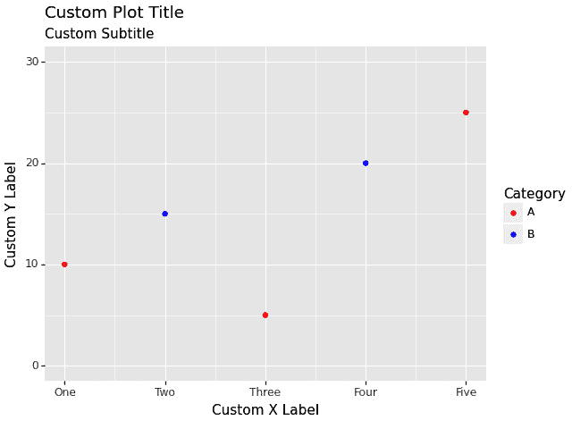

# 插入 ggplot2/matplotlib 图表

作为程序员，数据可视化是分析并以更易于访问和直观的方式呈现复杂信息的不可或缺的工具。它们在各个领域都发挥着至关重要的作用，从数据分析和企业智能到科学研究甚至日常决策。可视化对决策有益的一个原因是它们帮助分析师理解数据，以帮助传达有助于决策过程的项目。以下是一些其他原因：

+   **增强理解**：可视化提供了清晰简洁的数据表示，使得技术和非技术利益相关者都能更容易地把握复杂的关系、趋势和模式。它们有助于识别异常值、相关性以及可能在原始数据中被忽视的见解。

+   **有效沟通**：可视化是一种超越语言障碍的强大沟通工具，它简化了复杂的概念。在会议、演示和报告中以图表、图形和交互式仪表板的形式呈现数据，可以使叙事更具吸引力和说服力。当数据以视觉形式呈现时，它变得更容易消化和理解。例如，桑基图有助于使从起点到终点的数据流可视化变得易于消化。

+   **地理空间分析**：地理数据可视化使得更深入的探索成为可能。

流行数据可视化的例子包括用于时间序列分析的折线图、用于分类数据比较的条形图和饼图、用于相关性分析的散点图、用于多元比较的气泡图以及用于地理空间数据表示的等值线图。

总结来说，数据可视化对于程序员来说是不可或缺的，因为它们促进了数据理解、沟通、决策和探索，使它们成为当今数据驱动世界中的基本工具。

在接下来的章节中，我们将探讨使用 `ggplot2` 和 `cowplot` 构建一些可视化，例如直方图、有序条形图和哑铃图。

在本章中，我们将学习以下主题：

+   使用 `ggplot2` 可视化数据

+   使用 `plotnine2`、`matplotlib` 和 `plotly` 图表增强你的 Excel 报告

+   使用可视化增强 Excel 报告

+   数据可视化库简介

+   使用 `plotnine`（Python 的 `ggplot2`）创建图表

+   其他可视化库

+   在 Excel 中嵌入可视化

# 技术要求

对于本章，你需要确保安装了几个不同的 R 包。这些包括以下内容：

+   `ggplot2 3.4.4`

+   `cowplot 1.1.3`

本章的代码可以在以下链接的 GitHub 上找到：[`github.com/PacktPublishing/Extending-Excel-with-Python-and-R/tree/main/chapter`](https://github.com/PacktPublishing/Extending-Excel-with-Python-and-R/tree/main/chapter6)。

# 一些基础知识

在我们深入本章的核心内容之前，这里有一些事情将有助于我们理解：

+   **有效沟通**：可视化是一种强大的沟通工具，它超越了语言障碍并简化了复杂的概念。在会议、演示和报告中以图表、图形和交互式仪表板的形式呈现数据，可以在会议、演示和报告中提供更有说服力和有说服力的叙述。

+   **数据驱动决策**：可视化使决策者能够基于数据证据做出判断。当数据以视觉形式呈现时，更容易识别潜在的机会、风险和改进领域，从而做出更明智和有效的决策。

+   **识别趋势和异常**：可视化工具使程序员能够快速发现数据中的趋势、变化和异常。这在金融等需要及时识别异常以防止重大财务损失的行业中尤其有价值。

+   **探索性数据分析**（**EDA**）：在数据分析的探索阶段，数据可视化至关重要。通过创建散点图、直方图、箱线图和热图，程序员可以在进行更深入的分析之前探索数据的分布和关系。

+   **实时监控**：在处理不断变化的数据的应用程序中，实时可视化提供了一种动态的方式来监控关键指标并迅速对新兴情况做出反应。

+   **地理空间分析**：地理数据可视化，如地图和热图，对于分析基于位置的信息（如客户分布、疾病爆发或环境变化）非常有价值。

+   **预测和预测分析**：可视化有助于展示预测模型的结果和趋势，使利益相关者更容易理解潜在的情景并做出主动决策。

+   **交互式报告**：交互式可视化允许最终用户自定义和交互数据，创造更个性化的体验并允许更深入的探索。

让我们现在深入了解这些基础知识。

## 使用 ggplot2 可视化数据

`ggplot2` 是 R 编程语言中一个强大且广泛使用的可视化包。由 Hadley Wickham 开发，它是 `tidyverse` 生态系统的一部分。通过 `ggplot2`，用户可以通过声明式方法创建高质量和可定制的图形，其中图表是通过指定数据、将美学映射到变量以及添加几何形状、统计和主题层来构建的。其图形语法范式允许您轻松创建复杂的可视化，使其成为探索性数据分析和信息展示的热门选择。

在本节中，我们将使用 `ggplot2` 库和随 R 一起提供的 `iris` 数据集制作几个图表。我们首先需要做的是安装它并将其加载到当前环境中：

```py
install.packages("ggplot2")
library(ggplot2)
```

现在我们已经安装并加载了库，我们可以首先看看使用`hist()`函数并通过循环鸢尾花数据集中`Species`列的`Sepal.Width`数据，基础 R 中的图形会是什么样子。

让我们带着解释来看一下剩下的脚本：

```py
hist(iris$Sepal.Width)
par(mfrow = c(2,2))
for (species in unique(iris$Species)) {
  hist(iris$Sepal.Width[iris$Species == species], main = species,
         xlab = species)
}
hist(iris$Sepal.Width, main = "All Species")
par(mfrow = c(1,1))
```

第一行代码，`hist(iris$Sepal.Width)`，为所有鸢尾花种类的花瓣宽度绘制直方图。鸢尾花数据集内置在 R 中，因此我们不需要使用`data()`函数来加载它。鸢尾花数据集的`Sepal.Width`列包含每个花朵的花瓣宽度测量值。`hist()`函数在指定的列中绘制数据的直方图。

第二行代码，`par(mfrow = c(2,2))`，告诉 R 将绘图区域分成四个象限。这将允许我们并排绘制四个直方图。

第三行代码，`for (species in unique(iris$Species)) {`，开始一个`for`循环。这个`for`循环将遍历鸢尾花数据集中`Species`列的唯一值。`unique()`函数返回一个包含列中所有唯一值的向量。

`for`循环的主体，`hist(iris$Sepal.Width[iris$Species == species], main = species, xlab = species)`，为当前种类的花瓣宽度绘制直方图。表达式`iris$Sepal.Width[iris$Species == species]`选择当前种类的花瓣宽度测量值。`main`参数指定直方图的标题，`xlab`参数指定 x 轴的标签。

第四行代码，`hist(iris$Sepal.Width, main = "All Species")`，为所有种类的花瓣宽度绘制直方图。这个直方图绘制在绘图区域的最后一个象限。

第五行代码，`par(mfrow = c(1,1))`，告诉 R 将绘图区域重置为单个象限。现在我们已经看过了代码，让我们看看输出是什么样子：

f


图 6.1 – 基础 R 直方图

现在我们已经完成了基础 R 版本，让我们看看在`ggplot2`中它会是什么样子：

```py
# Make a histogram of the sepal width for all species
iris |>
ggplot(aes(x = Sepal.Width)) +
  geom_histogram(alpha = 0.328) +
  theme_minimal()
# Make a histogram of the sepal width for each species
iris |>
ggplot(aes(x = Sepal.Width, fill = Species)) +
  geom_histogram(alpha = 0.328) +
  theme_minimal()
```

第一行代码，`iris |> ggplot(aes(x = Sepal.Width)) + geom_histogram(alpha = 0.328) + theme_minimal()`，为所有鸢尾花种类的花瓣宽度绘制直方图。鸢尾花数据集内置在 R 中，因此我们不需要使用`data()`函数来加载它。`ggplot()`函数是 R 中的一个强大绘图函数，允许我们创建自定义的可视化。`aes()`函数指定了绘图的美学映射。在这种情况下，我们将花瓣宽度映射到*x*轴。`geom_histogram()`函数在指定的列中绘制数据的直方图。alpha 参数指定了直方图中柱子的透明度。`theme_minimal()`函数将最小主题应用到绘图上。

第二行代码，`iris |> ggplot(aes(x = Sepal.Width, fill = Species)) + geom_histogram(alpha = 0.328) + theme_minimal()`，为每个物种绘制了花瓣宽度的直方图。`aes()` 函数中的 `fill` 参数指定了直方图中条形的填充颜色。在这种情况下，我们使用 `Species` 列来为直方图中的条形着色。这将使我们能够看到每个物种花瓣宽度的分布。现在我们已经看过了代码，让我们看看输出结果。

这将分为两个图表，因为 `ggplot2` 对象不是使用 `par()` 函数以类似的方式绘制的。

这里是第一个图表：


图 6.2 – 所有物种的 Sepal.Width ggplot2 直方图

这是第二个图表：


图 6.3 – Sepal.Width 的 ggplot2 直方图，按物种填充

现在，在 `ggplot2` 中并排查看直方图的一种方法是使用 `facet_wrap()` 函数：

```py
iris |>
  ggplot(aes(x = Sepal.Width, fill = Species)) +
  geom_histogram(alpha = 0.328) +
  facet_wrap(~ Species, scales = "free") +
  theme_minimal()
```

`aes()` 函数指定了图表的美学映射。在这种情况下，我们将花瓣宽度映射到 *x* 轴，将物种映射到条形的填充颜色。`geom_histogram()` 函数在指定的列中绘制数据的直方图。alpha 参数指定了直方图中条形的透明度。`facet_wrap()` 函数为 `Species` 列的每个值创建一个单独的图表。`scales = "free"` 参数告诉 `facet_wrap()` 函数允许每个图表的 x 轴和 y 轴比例变化。`theme_minimal()` 函数将最小主题应用到图表上。代码的输出是一系列三个直方图，每个直方图对应于一种鸢尾花物种。直方图显示了每个物种花瓣宽度的分布。条形的颜色差异使我们能够轻松地看到每个物种花瓣宽度的分布。以下是结果：


图 6.4 – 使用 facet_wrap 的 Sepal.Width ggplot2 直方图

在本节中，我们学习了如何使用基础 R 和 `ggplot2` 绘制一些简单的直方图。我们还学习了如何在两种情况下通过物种对直方图进行分面。

我们已经完成了在 `ggplot` 中的工作，现在是时候看看我们如何通过使用 cowplot 来扩展图表，这可以帮助我们构建更复杂且适合发表的图形。

## 使用 cowplot 包可视化数据

R 的 `cowplot` 包提供了许多用于绘制高质量数据的函数。`cowplot` 包是一个 R 库，它提供了各种功能来帮助创建发表质量的图形。它可以用于以下方面：

+   `plot_grid()` 函数可以用来将多个图表排列成一个网格，并带有标签和注释

+   `align_plots()` 函数可以用来对多个绘图的对齐轴和其他元素，使它们看起来一致

+   `plot_grid()` 函数可以用来混合来自不同绘图框架的绘图，例如 `ggplot2` 和基础图形

+   `ggdraw()` 和 `draw_*()` 函数可以用来向绘图添加注释，例如文本、图像和形状

+   `cowplot` 包包含几个专为出版物质量图形设计的主题

既然我们已经了解了什么是 `cowplot`，那么让我们深入第一个例子：

```py
# Install Libraries
install.packages("ggplot2")
install.packages("cowplot")
# Load required libraries
library(ggplot2)
library(cowplot)
# Load the Iris dataset
data(iris)
```

在前面的代码中，我们安装了 `ggplot2` 和 `cowplot` 库；即使它们已经安装，这也会正常工作，但我们将会安装最新版本。

现在，让我们使用一个 `for` 循环为 iris 数据集中的每个物种创建一个绘图：

```py
# Create separate histograms for each species
histograms <- list()
for (species in unique(iris$Species)) {
  data_subset <- iris[iris$Species == species, ]
  histogram <- ggplot(data_subset, aes(x = Sepal.Width)) +
     geom_histogram(binwidth = 0.1, fill = "lightblue", color = "black") +
     labs(title = paste("Sepal Width Histogram for", species)) +
     labs(x = "", y = "") +
     theme_minimal()
  histograms[[species]] <- histogram
}
```

让我们一步步简单地分解代码。

`histograms <- list()` 行创建了一个名为 `histograms` 的空列表，我们将在这里存储每个物种的直方图。

在下一行，对于 `(species in unique(iris$Species))` `{ ... }`，循环遍历 Iris 数据集中的每个独特的物种，并对每个物种执行以下步骤。接下来是 `data_subset <- iris[iris$Species == species, ]`；这一行创建了一个 Iris 数据集的子集，只包括与循环中当前物种匹配的行。这有助于我们一次关注一个物种的数据。

`histogram <- ggplot(data_subset, aes(x = Sepal.Width)) + ...` 这一行是魔法发生的地方。我们正在使用 `ggplot2` 库创建一个直方图。这就像绘制一个显示有多少花朵具有特定花瓣宽度的图表。`aes(x = Sepal.Width)` 选项告诉 R 我们对在 *x*-轴上绘制 `Sepal.Width` 感兴趣。

第五行，`geom_histogram(binwidth = 0.1, fill = "lightblue", color = "black")`，向直方图中添加条形。它指定了条形的外观，例如它们的宽度和颜色。这就像构建直方图的列。

`labs(title = paste("Sepal Width Histogram for", species))` 这一行向直方图添加了一个标题，告诉我们它是什么。标题根据循环中的当前物种而变化。这就像为每个直方图写一个标签。下一行，`labs(x = "", y = "")`，移除了 *x*- 和 *y*-轴标签，使直方图看起来更干净。然后我们使用 `theme_minimal()` 添加一个主题到绘图上，这使得直方图的背景简单且干净。最后，`histograms[[species]] <- histogram` 这一行将当前物种的直方图取出，并将其存储在 `histograms` 列表中。我们使用物种名称来访问这个直方图。接下来的代码略有不同，但会产生完全相同的绘图：

```py
histograms <- lapply(unique(iris$Species), function(species) {
  data_subset <- iris[iris$Species == species, ]
  histogram <- ggplot(data_subset, aes(x = Sepal.Width)) +
     geom_histogram(binwidth = 0.1, fill = "lightblue", color = "black") +
     labs(title = paste("Sepal Width Histogram for", species)) +
     labs(x = "", y = "") +
     theme_minimal()
  return(histogram)
})
```

因此，总的来说，这段代码为 iris 数据集中不同物种的萼片宽度创建了直方图。它是通过循环每个物种，为该物种创建数据子集，然后创建具有适当格式和标签的直方图来实现的。所有直方图都存储在一个名为`histograms`的列表中，因此我们可以稍后使用它们。在这个列表中，每个物种都是一个直方图对象，并且对象是以它所可视化的物种命名的。现在，我们将创建并解释在完整数据集上创建的直方图，然后使用 cowplot 的`plot_grid()`函数将它们全部组合。以下是代码：

```py
# Create histogram for all species combined
all_species_hist <- ggplot(iris, aes(x = Sepal.Width)) +
  geom_histogram(binwidth = 0.1, fill = "lightblue", color = "black") +
  labs(title = "Sepal Width Histogram for All Species") +
  theme_minimal()
# Arrange histograms using cowplot
plot_grid(
  histograms[["setosa"]],
  histograms[["versicolor"]],
  histograms[["virginica"]],
  all_species_hist,
  ncol = 2,
  align = "hv"
  )
```

创建`all_species_hist`变量的第一行代码为所有物种的`Sepal.Width`列创建直方图。直方图的 binwidth 为`0.1`，填充颜色为浅蓝色。边框颜色为黑色。直方图的标题为`所有物种的萼片宽度直方图`。直方图的样式为`theme_minimal()`。

下一条代码，`plot_grid(histograms[["setosa"]], histograms[["versicolor"]], histograms[["virginica"]], all_species_hist, ncol = 2, align = "hv")`，使用`cowplot`包将每个物种的直方图排列成网格。直方图以两列排列，并且水平垂直对齐。

`plot_grid()`函数接受一个包含图表的列表作为其参数。图表根据`ncol`和`nrow`参数指定的列数和行数排列成网格。`align`参数指定图表如何相互对齐。在这种情况下，图表通过`align = "hv"`参数水平垂直对齐。

`plot_grid()`函数的输出是一个可以保存到文件或显示在 R 控制台中的图表网格。现在，让我们看看最终的输出：


图 6.5 – 使用 cowplot 绘制四个直方图

现在我们已经看到了如何有效地使用`cowplot`来组合图表和控制图形的其他部分，我们可以继续到下一种图表类型，条形图和哑铃图。

## 条形图和哑铃图

条形图和哑铃图都是用于表示数据的可视化类型。以下是每种类型的描述及其优缺点。首先是条形图。条形图，也称为条形图，使用矩形条来比较不同类别的数据。每根条的长度或高度代表特定类别的值。条形图可以垂直或水平绘制，最常见的类型是垂直。条形图的一些优点如下：

+   **易于阅读和理解**：条形图简单直观，即使没有统计学或数据可视化背景的人也能轻松理解。

+   **有效的比较工具**：条形图允许快速轻松地比较不同类别，这使得它们在识别模式或趋势时非常有用

+   **适用于分类数据**：条形图非常适合表示分类或离散变量

这里有一些缺点：

+   **连续数据受限**：条形图在表示连续变量或具有许多不同值的 数据方面不如有效

+   **潜在的阅读问题**：当条形数量较多或数值接近时，可能难以在图表上准确读取数值

哑铃图，也称为连接点图或范围条形图，比较两个类别或组的数值。它由两个通过线连接的点或标记组成，每个点代表一个值，线表示它们之间的范围。以下是它的优点：

+   **突出差异和比较**：哑铃图在强调两个类别或组之间的差异或比较方面非常有效

+   **显示范围和方差**：哑铃图中连接点的线代表数值之间的范围或方差，提供了额外的信息

+   **适用于分类或连续数据**：哑铃图可以用于有序变量和连续变量

这里有一些缺点：

+   **多比较受限**：哑铃图最适合比较两个类别或组。如果有超过两个组，图表可能会变得杂乱且难以理解。

+   **不如条形图或时间序列图常见或熟悉**：哑铃图不像条形图或时间序列图那样被广泛使用或认可，这可能会使一些观众感到不熟悉。

总结来说，条形图适用于比较组间数值，而哑铃图适合比较两个类别或组。每种可视化都有其优势和局限性，选择取决于数据的性质和您想要传达的具体见解。

现在我们对不同的图表类型及其优缺点有了些了解，是时候深入探讨如何创建它们并查看输出结果了。

### 使用 ggplot2 的条形图

条形图可以垂直或水平绘制，其中最常见的类型是垂直。条形图左侧或右侧的垂直轴称为 y 轴，而图表底部的水平轴称为 x 轴。每个条形的高度或长度代表特定数据类别的值。条形图可以轻松地比较不同组之间的不同数据集，并且可以展示一段时间内数据的重要变化。在解释复杂数据的意义时，它们非常有用，因为它们允许快速轻松地比较不同类别。条形图特别适用于展示信息片段，并且常用于以视觉方式展示涉及数据的数据或概念。条形图的一些关键特性包括以下内容：

+   条形是矩形且宽度相等，高度不同

+   一个条形与另一个条形之间的间隙应保持均匀

+   它可以是水平的或垂直的

总体来说，条形图是一种在视觉上快速传达关系信息的有效工具，可以轻松地比较不同组之间的不同数据集。现在我们已基本了解了条形图及其用途，让我们通过使用 `ggplot2` 库的示例来学习。

首先，让我们加载所需的库，其中 `healthyR` 和 `healthyR.data` 可能需要在您的机器上安装，因为它们可能尚未安装：

```py
library(healthyR.data)
library(healthyR)
library(ggplot2)
library(dplyr)
library(forcats)
library(purrr)
```

在这里，我们加载了几个提供数据操作函数和工具（`dplyr`、`forcats` 和 `purrr`）以及可视化工具（`ggplot2`）的包。这些包扩展了 R 处理数据和创建图表的能力。我们加载了 `healthyR.data` 库以便使用数据集，以及 `healthyR` 库以便使用 `category_counts_tbl()` 函数。

下一段代码用于创建我们将要绘制的数据集：

```py
df <- healthyR_data |>
  filter(payer_grouping != '?') |>
  category_counts_tbl(
     .count_col = payer_grouping
     , .arrange = TRUE
     , ip_op_flag
  ) |>
  group_by(ip_op_flag) |>
  mutate(order_var = paste0(
     sprintf("%02i", as.integer(rank(n))),
     " - ",
     payer_grouping
     )) |>
  ungroup()
```

在这一步，使用管道（`|>`）对数据进行一系列操作：

+   `healthyR_data` 是由 `healthyR.data` 包提供的数据集。

+   `filter()` 函数删除了 `payer_grouping` 列不等于 `'`?`’’ 的行。

+   `category_counts_tbl()` 函数被应用，该函数计算每个唯一的值在 `payer_grouping` 列中每个 `ip_op_flag` 值组合中的出现次数。`.count_col` 参数指定要计数的列，`.arrange` 按降序排序计数，而 `ip_op_flag` 则按此列对数据进行分组。

+   数据使用 `group_by()` 函数按 `ip_op_flag` 列进行分组。

+   `mutate()` 函数添加了一个名为 `order_var` 的新列，其中包含基于计数列 `n` 的格式化排名值。这是通过使用 `sprintf()` 函数将排名格式化为两位整数来完成的。然后我们取消分组，因为组不再必要。

现在，让我们制作这个图表：

```py
ggplot(df, aes(x = order_var, y = n)) +
  geom_col(alpha = 0.328) +
  labs(x = "", y = "") +
  theme(legend.position = "none") +
  facet_wrap(~ ip_op_flag, scale = "free") +
  scale_x_discrete(
     labels =  with(df, as.character(payer_grouping) |>
                              set_names(order_var))) +
  xlab(NULL) +
  theme(axis.text.x = element_text(
     angle = 90, hjust=1, vjust=.5)) +
  coord_flip() +
  theme_minimal()
```

本节使用 `ggplot2` 创建条形图：

+   `ggplot()` 初始化图表，`aes()` 指定美学（例如 x 轴和 y 轴上放置的内容）。

+   `geom_col()` 向图表中添加条形，其中每个条形的高度代表 *n* 的值。alpha 参数控制条形的透明度。

+   `labs()` 将轴标签设置为空。

+   `theme()` 允许进行主题调整，例如移除图例和使用简约主题。

+   `facet_wrap()` 用于为 `ip_op_flag` 的每个唯一值创建单独的面板。

+   `scale_x_discrete()` 用于使用 `payer_grouping` 值自定义 *x* 轴标签，按 `order_var` 索引。

+   `xlab(NULL)` 移除 *x* 轴标签。

+   `theme(axis.text.x = element_text(angle = 90, hjust = 1, vjust = .5))` 调整了 *x* 轴文本的外观，使其垂直。

+   `coord_flip()` 翻转 *x* 和 *y* 轴。

+   `theme_minimal()` 将简约主题应用到图表上。

总结来说，这段代码首先对数据集进行筛选和处理，然后创建一个具有多个维度的条形图，每个维度显示基于分类变量计数的条形。图表的外观通过各种 `ggplot2` 函数和设置进行定制。现在，在完成所有这些之后，让我们看看最终的输出结果：


图 6.6 – 使用 ggplot2 创建条形图

在本节中，我们学习了如何制作一个相当复杂的水平条形图。我们创建了一个有序的图表，允许我们按相同的因素列查看两个不同组的信息。它显示了住院和门诊维度的保险支付者组体积。现在，我们将转向双杠图。

### ggplot2 的双杠图

双杠图，也称为*点线图*，是一种显示不同类别之间两点变化的可视化图表。它通常使用点（代表类别）通过线连接来显示变化。在 R 中，你可以使用 `ggplot2` 等库创建双杠图。下面是如何做到这一点的方法。

首先，请确保你已经安装并加载了 `ggplot2` 和 `dplyr` 包。如果需要，你可以使用 `install.packages("ggplot2")` 和 `install.packages("dplyr")` 安装它们。

让我们创建一个数据框；我们将使用两列来表示初始值和最终值，以及一个分类变量来对它们进行分组。你的数据可能看起来像这样：

```py
# Sample data
data <- data.frame(
  Category = c("A", "B", "C", "D"),
  Initial = c(10, 15, 8, 12),
  Final = c(18, 22, 14, 16)
)
```

现在，在我们制作实际图表之前，让我们先创建数据的中点：

```py
data <- data |>
  mutate(Midpoint = (Initial + Final)/2)
```

现在，我们可以继续创建图表：

```py
# Create the dumbbell plot using ggplot2
dumbbell_plot <- ggplot(data, aes(x = Category, xend = Category, 
    y = Initial, yend = Final)) +
  geom_segment(color = "gray50") +  # Lines connecting dots
  geom_point(color = "blue", size = 3) +  # Initial values
  geom_point(aes(y = Final),
                  color = "orange", size = 3) +  # Final values
  geom_text(aes(label = Midpoint),
                 vjust = -0.5, size = 3) +  # Midpoint labels
  labs(title = "Dumbbell Plot",
         x = "Category",
         y = "Values") +
  theme_minimal()
# Print the plot
dumbbell_plot
```

此示例假设你的数据框中有一个 `Category` 列，它定义了组/类别。图表将显示初始值（蓝色点）、最终值（红色点）、连接它们的线以及线上的中点标签。你可以根据你的喜好自定义外观、颜色、标签和其他元素。现在，让我们看看我们创建了什么。


图 6.7 – 使用 ggplot2 创建的双杠图

请记住，这只是一个基本示例。根据您的数据和需求，您可能需要调整代码以适应您的需求。现在是时候制作一些时间序列图表了。

# 使用 plotnine2、matplotlib 和 plotly 图表增强您的 Excel 报告

本章的 Python 部分探讨了如何使用 Python 将流行的数据可视化库，如 `plotnine`、`matplotlib` 和 `plotly`，与 Microsoft Excel 集成。

您将学习如何利用每个库的优势来有效地可视化数据并增强您的 Excel 报告。

本章的这一部分组织如下：

+   *使用可视化增强 Excel 报告*：我们将提供有关如何有效地使用可视化来传达洞察力和模式的指导。

+   *可视化库简介*：我们将概述关键的可视化库 – `plotnine`、`matplotlib` 和 `plotly`。了解这些库及其用例对于选择满足您需求的正确库至关重要。

+   *使用 `plotnine` 创建图表*：本节将深入探讨如何使用 `plotnine` 库制作复杂的图表。您将学习如何生成各种图表类型，自定义视觉元素，并添加额外的层以增强清晰度。

+   *使用 `matplotlib` 创建图表*：`matplotlib` 是一个用于创建静态可视化的多功能库。我们将向您介绍使用 `matplotlib` 生成不同类型图表的过程，然后将它们转移到 Excel 中以包含在您的报告中。

+   *将可视化嵌入到 Excel 中*：本节涵盖了将使用 Python 库生成的图表和图表插入到 Excel 工作表中的实际操作。

到本章结束时，您将具备无缝连接 Python 数据可视化和 Excel 报告的技能。无论您是创建静态图表还是交互式可视化，您都将能够以视觉吸引力和洞察力在 Excel 中展示数据，从而促进更具吸引力和影响力的报告。

让我们开始绘图吧！（现在您可以想象自己发出邪恶的笑声！）

# 使用可视化增强 Excel 报告

在本章的这一部分，我们深入探讨使用可视化来增强 Excel 报告的实际应用。除了从 Python 生成和嵌入可视化的技术方面之外，我们还将探讨这些辅助工具在数据驱动决策背景下的更广泛意义。Excel 中的可视化不仅仅是关于美观；它们是有效传达隐藏在数据中的洞察力、模式和趋势的强大工具。无论您是为利益相关者、同事还是客户准备报告，掌握融入可视化艺术的技巧都将提升您数据驱动的叙述，并促进更明智的决策。

接下来的部分将提供指导，说明如何在 Excel 报告中战略性地使用可视化以最大化其影响力。你不仅将学习如何创建引人入胜的图表和图形，还将学习如何有效地解释和展示它们，以传达数据的故事。

将可视化集成到 Excel 报告中不仅关乎美观——它关乎将数据转化为能够驱动明智决策的洞察。我们将深入探讨各种策略，通过有效利用可视化来增强报告的影响力。

可视化的力量不仅在于其美学，还在于它们用数据讲述引人入胜故事的能力。通过掌握选择正确可视化类型、利用注释、简化复杂数据以及遵循设计原则的艺术，你将充分准备，将 Excel 报告提升到新的影响力和清晰度水平。

# 数据可视化库简介

数据可视化是数据分析的基本方面，Python 提供了一套丰富的库来创建引人入胜且信息丰富的可视化。在本节中，我们将向您介绍三个突出的数据可视化库——`plotnine`、`matplotlib`和`plotly`。了解每个库的优势和应用对于在 Excel 报告中有效地传达数据的故事至关重要。

## Plotnine – 优雅的图形语法

`ggplot2`库是 R 编程语言中流行的数据可视化库，以其表达性和声明性语法而闻名。Python 的适配版本称为`plotnine`。

它基于`plotnine`在创建复杂、出版物质量图表方面表现出色。它提供了对美学的精细控制，使你能够自定义可视化的每一个方面。

## Plotly – 交互式可视化

`plotly`是一个多功能的 Python 库，专注于创建交互式、基于网络的可视化。它允许你构建交互式仪表板、散点图、折线图等。用户可以在数据点上悬停、放大或筛选数据，以实现动态的用户体验。

`plotly`与 Jupyter 笔记本无缝集成，使其成为数据科学家和分析师的首选。它非常适合为网络应用程序、报告和数据探索生成交互式可视化。

## Matplotlib – 经典且可定制的图表

`matplotlib`是创建 Python 中静态、高质量可视化的基础库。它提供了一系列绘图函数，使其适用于各种图表类型，如折线图、条形图和散点图。

`matplotlib`高度可定制，允许你控制图表的每一个细节，从颜色和标签到字体和网格线。它是生成用于研究论文、演示文稿和 Excel 报告的定制静态图表的首选选择。

理解这些库的功能和最佳用例将赋予你选择适合你数据可视化需求正确工具的能力。无论你想要使用 `plotnine` 创建优雅的静态图表，还是使用 `plotly` 创建交互式仪表板，或者使用 `matplotlib` 创建高度定制的可视化，你都将拥有选择与你的目标相符的库的知识。

在接下来的章节中，我们将更深入地探讨每个库，提供实际示例和见解，帮助你掌握在 Python 中进行数据可视化的艺术，以便为 Excel 报告制作。

让我们先深入了解 `plotnine`。

# 使用 plotnine 创建图表（Python 的 ggplot2）

在本节中，我们将探索 Python 中 `plotnine` 库的强大功能，该库从 R 的 `ggplot2` 中汲取灵感，如本章 R 部分所述。你会发现（除了 R 和 Python 之间语法差异的考虑之外）代码和功能极其相似——`plotnine` 和 *ggplot2* 真的是姐妹包。

到本节结束时，你将熟练掌握生成各种可视化、自定义每个细节以及添加额外层以增强清晰度的技能。

## 理解图形语法

在我们深入探讨使用 `plotnine` 创建令人印象深刻的图表之前，了解图形语法至关重要。这种结构化的数据可视化方法构成了 `plotnine` 的核心，并使你能够通过组合数据、美学和几何对象来构建复杂的图表。

让我们分解一些关键概念：

+   `plotnine` 将数据与图表中的视觉元素相连接。你需要指定哪些变量代表 *x* 和 *y* 轴、颜色、形状、大小等。

+   **美学**：美学控制数据属性如何以视觉方式表示。你可以使用美学来编码诸如颜色、形状和大小等信息。

+   `plotnine` 鼓励分层方法。每一层都会为你的图表添加一个新元素，例如点、线或标签。这允许创建复杂且信息丰富的可视化。

## 生成各种图表类型

`plotnine` 库的一个优势是其多功能性。你可以创建多种图表类型，满足不同的数据可视化需求。

在本节中，我们将使用 `plotnine` 展示各种图表类型的构建。

+   **散点图**：简单而有效，散点图有助于可视化两个数值变量之间的关系：

    ```py
    from plotnine import ggplot, aes, geom_point, geom_bar, geom_histogram, geom_boxplot, geom_tile, geom_violin, theme_minimal, labs
    import pandas
    # Sample data
    data = pandas.DataFrame({'x': [1, 2, 3, 4, 5],
                             'y': [2, 4, 1, 3, 5]})
    # Create a scatter plot
    gg = ggplot(aes(x='x', y='y'), data) + geom_point()
    print(gg)
    ```

    这是前面代码生成的图表：


图 6.8 – 基本散点图

+   **条形图**：非常适合显示分类数据，条形图在比较方面表现优秀：

    ```py
    # Sample data
    data = pandas.DataFrame({'category': ['A', 'B', 'C', 'D'],
                             'value': [10, 25, 15, 30]})
    # Create a bar chart
    gg = ggplot(aes(x='category', y='value'), 
        data) + geom_bar(stat='identity')
    print(gg)
    ```

    这是它的图表：


图 6.9 – 基本条形图

+   **直方图**：这些用于探索单个变量的分布：

    ```py
    # Sample data
    data = pandas.DataFrame({'values': [1, 2, 2, 3, 3, 3, 4, 4, 5]})
    # Create a histogram
    gg = ggplot(aes(x='values'), data) + geom_histogram(binwidth=1,
        fill='blue', color='black', alpha = 0.5)
    print(gg)
    ```

    这是它的图表：


图 6.10 – 基本直方图

注意我们如何使用与 R `ggplot2` 语法完全类似，包括 alpha 参数来控制透明度的语法。这表明 R 和 Python 在某些包中实际上是相似的工具，具有相似的语法！

+   **箱线图**：箱线图提供了数据集分布的摘要，包括中位数、四分位数和潜在的异常值：

    ```py
    # Sample data
    data = pandas.DataFrame({'category': ['A', 'A', 'B', 'B', 'C', 'C'],
                             'value': [10, 15, 20, 25, 30, 35]})
    # Create a box plot
    gg = ggplot(aes(x='category', y='value'), data) + geom_boxplot()
    print(gg)
    ```

    这是相应的图表：


图 6.11 – 一个基本的箱线图

+   使用 `geom_tile()` 来实现这一点：

    ```py
    data = {
            'x': ['A', 'A', 'A', 'A', 'B', 'B', 'B', 'B', 'C', 'C', 'C', 'C', 'D', 'D', 'D', 'D'],
            'y': ['W', 'X', 'Y', 'Z', 'W', 'X', 'Y', 'Z', 'W', 'X', 'Y', 'Z', 'W', 'X', 'Y', 'Z'],
            'value': [10, 15, 5, 20, 25, 30, 35, 40, 45, 50, 55, 60, 65, 70, 75, 80]
    }
    # Convert data to a DataFrame
    data = pandas.DataFrame(data)
    # Create a heatmap
    gg = (ggplot(data, aes(x='x', y='y', fill='value'))
                + geom_tile()
                + theme_minimal()
                + labs(title='Heatmap Example', x='X-Axis', y='Y-Axis', fill='Values'))
    print(gg)
    ```

    这是相应的图表：


图 6.12 – 一个基本的热图

+   **小提琴图**：结合箱线图和核密度估计，小提琴图展示了具有丰富细节的数据分布：

    ```py
    # Sample data
    data = {
            'Category': ['A', 'A', 'B', 'B', 'B', 'C', 'C', 'D', 'D', 'D'],
            'Value': [10, 15, 25, 30, 35, 45, 50, 65, 70, 75]
    }
    # Convert data to a DataFrame
    df = pandas.DataFrame(data)
    # Create a violin plot
    gg = (ggplot(df, aes(x='Category', y='Value', fill='Category'))
                + geom_violin()
                + theme_minimal()
                + labs(title='Violin Plot Example', x='Category', y='Value', fill='Category'))
    print(gg)
    ```

    这是相应的图表：


图 6.13 – 一个基本的提琴图

现在基础知识已经介绍完毕，让我们看看是什么让 `plotnine` 如此特别——所有的自定义可能性！

## 自定义 plotnine 图表的视觉元素

`plotnine` 库的优势也体现在自定义上。你可以定制视觉呈现的各个方面以满足特定需求。以下是关于如何自定义视觉呈现各个方面的详细说明：

+   使用 `plotnine`，你可以使用 `xlab()` 和 `ylab()` 函数分别自定义 *x* 和 *y* 轴的标签。要为你的图表添加标题和副标题，请使用 `ggtitle()` 和 `labs()` 函数：

    ```py
    # Customize labels and titles
    gg = gg + xlab("Custom X Label") + ylab("Custom Y Label")
    gg = gg + ggtitle("Custom Plot Title") + labs(subtitle="Custom Subtitle")
    ```

+   `scale_x_continuous()` 和 `scale_y_continuous()` 用于自定义刻度和图例：

    ```py
    # Customize axes and legends
    gg = gg + scale_x_continuous(breaks=[1, 2, 3, 4, 5],
        labels=["One", "Two", "Three", "Four", "Five"])
    gg = gg + scale_y_continuous(limits=(0, 10))
    gg = gg + scale_color_manual(values={'A': 'red', 'B': 'blue'})
    ```

+   使用 `theme_minimal()` 或 `theme_light()` 来保持报告或演示文稿的整体整洁外观。

    ```py
    # Apply themes
    # gg = gg + theme_minimal()
    gg = gg + theme_light()
    ```

+   使用 `theme()` 函数调整参数，如 `text`、`text_size`、`text_family` 和 `text_align` 以实现所需的文本格式：

    ```py
    # Control text formatting
    gg = gg + theme(text=element_text(size=12, family="Arial",
        face="bold", color="black"),
        axis_text_x=element_text(angle=45, hjust=1)
    ```

    上述自定义设置产生了以下图表：



图 6.14 – 自定义视觉元素

通过自定义这些元素，你可以创建视觉上吸引人且高度定制的视觉呈现，以有效地传达你的数据洞察。

除了自定义之外，`plotnine` 还有一个绝招——图层！在下一节中，我们将探讨图层是什么以及如何使用它们来呈现最佳的视觉呈现。

## 添加额外的图层

层叠是 `plotnine` 中的一个强大概念。它允许你在单个图表上叠加多个图层，每个图层传达数据的不同方面。在本节中，我们将探讨一些常见的图层：

+   **趋势线**：添加趋势线以揭示数据中的潜在模式

+   **误差线**：通过包含误差线来可视化变异性和不确定性

+   **注释**：使用文本标签或几何形状突出显示特定的数据点或区域

要添加误差线，你可以使用以下代码：

```py
from plotnine import (
    ggplot, aes, geom_line, geom_point, geom_errorbar, 
    position_dodge, geom_text, labs, geom_smooth
    )
import pandas
import numpy
# Sample data
data = pandas.DataFrame({
        'x': [1, 2, 3, 4, 5],
        'y': [10, 15, 8, 12, 18],
        'group': ['A', 'A', 'B', 'B', 'C'],
        'error': [1, 2, 1.5, 1, 2.5],
        'label_x': [2, 4, 3, 1, 5],
        'label_y': [16, 11, 6, 13, 17],
        'annotation_text': ['Peak', 'Valley', 'Low', 'High', 'Bottom']
})
# Create a ggplot object
gg = ggplot(data, aes(x='x', y='y', group='group')) + \
        geom_line() + \
        geom_point() + \
        geom_errorbar(aes(ymin='y - error', ymax='y + error'), 
        width=0.1, size=0.5, 
        position=position_dodge(width=0.2)) + \
        geom_text(aes(x='label_x', y='label_y', 
        label='annotation_text'), size=10)
# Draw the plot
print(gg)
```

这产生了以下图表：


图 6.15 – 添加了误差线

对于趋势线，你可以使用以下方法：

```py
# Sample data
data = pandas.DataFrame({
        'X': numpy.arange(1, 21),
        'Y': numpy.random.randint(1, 101, size=20)
})
# Create a base plot
gg = (ggplot(data, aes(x='X', y='Y')) +
            geom_point() +
            labs(title='Scatter Plot with Trendline')
         )
# Add a trendline
gg = gg + geom_smooth(method='lm', se=False, linetype='dashed',
    color='red', size=1)
print(gg)
```

这将在图表中添加趋势线：


图 6.16 – 带趋势线的散点图

最后，对于注释，我们有以下内容：

```py
# Sample data
data = pandas.DataFrame({
        'X': numpy.arange(1, 11),
        'Y': numpy.random.randint(1, 101, size=10)
})
# Create a base plot
gg = (ggplot(data, aes(x='X', y='Y')) +
            geom_point() +
            labs(title='Scatter Plot with Annotations')
         )
# Add an annotation and adjust the position of the labels along the y-axis using nudge_y by 5 units
gg = gg + geom_text(aes(label='Y'), nudge_y=5, color='blue')
print(gg)
```

这会产生以下图表：


图 6.17 – 带注释的散点图

无论您是传达洞察力、比较数据集还是探索趋势，`plotnine`都将赋予您为 Excel 报告创建引人入胜且数据驱动的叙述的能力。

接下来，让我们看看使用`matplotlib`的类似图表！

## 使用 matplotlib 生成图表

在本节中，我们将深入探讨`matplotlib`的灵活世界，它是 Python 中最广泛使用的可视化库之一。使用`matplotlib`，您有权创建一系列静态可视化，精细调整其外观，并按您的特定需求定制。无论您是想制作散点图、条形图、直方图或其他数据图形表示，`matplotlib`都提供了将您的数据转化为引人入胜的视觉洞察力的工具。

### 使用 matplotlib 创建多种图表类型

`matplotlib`因其多功能性而受到赞誉，提供了广泛的图表类型以满足不同的数据可视化需求。在本节中，我们将深入研究使用`matplotlib`构建各种图表类型，让您能够制作散点图、条形图、直方图、箱线图、热图和小提琴图。无论您是寻求探索变量之间的关系、显示分类数据还是分析数据分布，`matplotlib`都为您提供了创建所需可视化的工具：

+   **散点图**：以下是它们的代码：

    ```py
    import numpy
    import pandas
    import matplotlib.pyplot as plt
    ### scatter plot
    data = {
            'Height': [155, 162, 168, 173, 179],
            'Weight': [50, 56, 61, 65, 72]
    }
    df = pandas.DataFrame(data)
    # Create a scatter plot
    df.plot.scatter(x='Height', y='Weight', 
        title='Scatter Plot of Height vs. Weight')
    # Save the plot to a file (e.g., .png) in your working directory
    plt.savefig('matplotlib_scatter_plot.png')
    # Show the plot
    plt.show()()
    ```

    此代码将创建身高与体重的关系散点图，并将其保存为`.png`图像。您可以根据需要进一步自定义图表。结果如下所示：


图 6.18 – 使用 matplotlib 的基本散点图

+   **条形图**：以下是它们的代码：

    ```py
    data = {'Category': ['A', 'B', 'C', 'D', 'E'],
                    'Values': [15, 28, 24, 20, 32]}
    df = pandas.DataFrame(data)
    # Create a basic bar chart
    plt.figure(figsize=(8, 6))
    plt.bar(df['Category'], df['Values'], color='skyblue')
    plt.xlabel('Categories')
    plt.ylabel('Values')
    plt.title('Basic Bar Chart')
    # Save the plot to a file (e.g., .png)
    plt.savefig('matplotlib_bar_chart.png')
    plt.show()
    ```

    此代码创建了一个简单的条形图，类别在*x*轴上，相应的值在*y*轴上，结果如下：


图 6.19 – 使用 matplotlib 的基本条形图

+   **直方图**：以下是它们的代码：

    ```py
    # Generate some random data for the histogram
    data = numpy.random.normal(0, 1, 1000)
    # Create a basic histogram
    plt.figure(figsize=(8, 6))
    plt.hist(data, bins=20, color='lightblue', edgecolor='black')
    plt.xlabel('Values')
    plt.ylabel('Frequency')
    plt.title('Basic Histogram')
    # Save the plot to a file (e.g., .png)
    plt.savefig('matplotlib_histogram.png')
    plt.show()
    ```

    此代码从随机数据生成直方图，展示了值的频率分布。您可以调整箱数、颜色、标签和其他属性以根据需要自定义直方图。生成的直方图如下所示：


图 6.20 – 使用 matplotlib 的基本直方图

+   **箱线图**：以下是它们的代码：

    ```py
    # Generate some random data for the box plot
    data = [numpy.random.normal(0, 1, 100) for _ in range(3)]  # Three sets of random data
    # Create a basic box plot
    plt.figure(figsize=(8, 6))
    plt.boxplot(data, vert=False, 
        labels=['Set 1', 'Set 2', 'Set 3'])
    plt.xlabel('Values')
    plt.ylabel('Data Sets')
    plt.title('Basic Box Plot')
    # Save the plot to a file (e.g., .png)
    plt.savefig('matplotlib_boxplot.png')
    plt.show()
    ```

    此代码从随机数据生成基本箱线图，比较三个不同的数据集。您可以调整各种参数以根据需要自定义箱线图的外观。前面的代码产生以下可视化：


图 6.21 – 使用 matplotlib 的基本箱线图

+   **热图**：以下是它们的代码：

    ```py
    # Generate some random data for the heatmap
    numpy.random.seed(42)
    data = numpy.random.rand(5, 5)  # Create a 5x5 matrix of random values
    # Create a heatmap
    plt.figure(figsize=(8, 6))
    heatmap = plt.imshow(data, cmap='viridis', 
        interpolation='nearest')
    plt.colorbar(heatmap)
    plt.title('Heatmap Example')
    # Save the plot to a file (e.g., .png)
    plt.savefig('matplotlib_heatmap.png')
    plt.show()
    ```

    在此代码中，我们生成一个随机的 5x5 矩阵值并从中创建一个热图。我们将使用 `viridis` 色彩映射，但您可以从各种色彩映射中选择以调整颜色方案。此示例演示了如何创建基本热图；您可以根据数据和偏好进一步自定义它。结果热图如下所示：


图 6.22 – 使用 matplotlib 的基本热图

+   **小提琴图**：以下是它们的代码：

    ```py
    # Generate some random data for the violin plot
    numpy.random.seed(42)
    data = [numpy.random.normal(0, std, 100) for std in range(1, 4)]
    # Create a violin plot
    plt.figure(figsize=(8, 6))
    plt.violinplot(data, showmedians=True)
    plt.title('Violin Plot Example')
    plt.xticks([1, 2, 3], ['Group 1', 'Group 2', 'Group 3'])
    plt.xlabel('Groups')
    plt.ylabel('Values')
    # Save the plot to a file (e.g., .png)
    plt.savefig('matplotlib_violinplot.png')
    plt.show()
    ```

    在此代码中，我们生成三组随机数据并创建小提琴图来可视化它们的分布。`showmedians=True` 参数在每把小提琴内显示中值。您可以根据特定数据集和需求调整数据、标签和其他图表属性。让我们看看生成的图表：


图 6.23 – 使用 matplotlib 的基本小提琴图

接下来，让我们看看如何自定义 matplotlib 图表中的视觉元素。

## 自定义 matplotlib 图表的可视元素

`matplotlib` 创建的图表当然可以以多种方式自定义，就像使用 `plotly` 生成的图表一样。在本节中，我们将探讨最重要的方面，并在过程中提供一些示例。

### 标签和标题

`matplotlib` 允许您轻松自定义坐标轴标签、图表标题和副标题。您可以为 *x* 和 *y* 轴设置标签，为图表添加上下文标题，甚至添加副标题以提供额外信息或背景。以下是如何在 `matplotlib` 中自定义标签和标题的示例：

```py
# Sample data
x = [1, 2, 3, 4, 5]
y = [10, 20, 25, 30, 35]
# Create a scatter plot
plt.scatter(x, y)
# Customize labels and titles
plt.xlabel('X-axis Label')
plt.ylabel('Y-axis Label')
plt.title('Custom Title')
plt.suptitle('Subtitle for Additional Context')
# Display the plot
plt.show()
```

这是它的图表：


图 6.24 – 使用 matplotlib 自定义标签

### 坐标轴和图例

`matplotlib` 允许您调整坐标轴刻度，添加坐标轴断点，并微调图例。您可以在 *x* 和 *y* 轴上更改范围、刻度和小数点位置。此外，您还可以自定义图例以更好地表示数据系列或类别。

下面是一个自定义坐标轴和图例的示例：

```py
import matplotlib.pyplot as plt
# Sample data
x = [1, 2, 3, 4, 5]
y = [10, 20, 25, 30, 35]
# Create a line plot
plt.plot(x, y, label='Data Series A')
# Customize axes and legend
plt.xlim(0, 6)
plt.ylim(0, 40)
plt.xticks([1, 2, 3, 4, 5])
plt.yticks([0, 10, 20, 30, 40])
plt.legend()
# Display the plot
plt.show()
```

这是它的图表：


图 6.25 – 使用 matplotlib 自定义坐标轴和图例

### 主题

`matplotlib` 提供了各种主题，以保持可视化的一致性。您可以从不同的预定义样式中选择，以匹配您的报告或演示文稿的美学。以下是如何应用不同主题的方法。作为一个例子，我们将应用您在本章早期熟悉的 `ggplot` 主题：

```py
import matplotlib.pyplot as plt
# Apply a different theme
plt.style.use('ggplot')
# Sample data and plot
x = [1, 2, 3, 4, 5]
y = [10, 20, 25, 30, 35]
plt.plot(x, y)
# Display the plot
plt.show()
```

这是图表：


图 6.26 – 在 matplotlib 中使用主题

### 文本格式化

`matplotlib` 允许你控制文本大小、样式和对齐，以获得精美的外观。你可以调整字体大小，使用粗体或斜体样式，并指定标题、标签和注释等文本元素的对齐方式。以下是一个文本格式化的示例：

```py
import matplotlib.pyplot as plt
# Sample data and plot
x = [1, 2, 3, 4, 5]
y = [10, 20, 25, 30, 35]
plt.plot(x, y)
# Customize text formatting
plt.title('Custom Title', fontsize=16, fontweight='bold', 
    color='blue')
plt.xlabel('X-axis Label', fontsize=12, fontstyle='italic', 
    color='green')
plt.ylabel('Y-axis Label', fontsize=12, fontweight='bold', 
    color='red')
# Display the plot
plt.show()
```

这是相应的图表：


图 6.27 – 使用 matplotlib 进行文本格式化

这些示例展示了你如何在 `matplotlib` 可视化中实现各种定制方面。

这就结束了我们对 Python 中最受欢迎和功能强大的可视化库的概述。下一节将涵盖其他可选方案的简要描述。

# 其他可视化库

为了完整性，这里简要描述其他流行的库。

## plotly

`plotly` 是一个流行的 Python 库，以其创建交互式和视觉上吸引人的数据可视化而闻名。它在生成动态图表、仪表板和交互式图表方面表现出色。不幸的是，由于微软引入的安全考虑，`plotly` 库的交互功能与 Excel 的最新版本无法无缝工作。这种限制可能会阻碍依赖最新 Excel 特性和功能的用户将其集成到 Excel 中。鉴于本书的重点是增强你的 Excel 工作流程，我们将不会详细介绍 `plotly`。

## seaborn

`seaborn` 是另一个专为统计数据可视化设计的 Python 库。虽然它提供了广泛的定制选项和创建复杂图表的能力，但与 `matplotlib` 和 `plotnine` 等库相比，通常需要更多的代码来实现相同的结果。鉴于本章的重点是简单性和易用性，我们选择强调提供更直接和简洁的数据可视化方法的库。

在本节中，我们主要关注 `matplotlib` 和 `plotnine`，因为它们简单且与 Excel 兼容，确保你可以快速生成并集成可视化到 Excel 报告中，而无需不必要的复杂性。

现在我们已经介绍了你可以用来创建可视化的最受欢迎的库，我们可以继续讨论图表的分布：将它们嵌入到 Excel 中！

# 将可视化嵌入到 Excel 中

当使用 `matplotlib` 和 `plotnine` 等 Python 库创建可视化时，你可能希望将这些可视化无缝集成到你的 Excel 报告或电子表格中。将这些图表和图表嵌入到 Excel 中可以成为你的数据分析工具包中的一个宝贵补充。在本节中，我们将探讨将 `matplotlib` 和 `plotnine` 可视化嵌入到 Excel 的基础知识，帮助你利用 Python 数据可视化库的强大功能以及 Excel 的报告功能。

## 基本嵌入过程

将`matplotlib`和`plotnine`可视化嵌入到 Excel 中的过程通常涉及将你的图表或图形导出为图像文件（如 PNG 或 JPEG），然后将这些图像导入到你的 Excel 表中。虽然这种方法不提供与其他一些方法相同级别的交互性，但它是一种简单直接的方法，可以将 Python 生成的数据可视化添加到 Excel 报告中。

这里是基本步骤：

1.  在你的 Python 脚本或 Jupyter 笔记本中，使用`matplotlib`或`plotnine`进行可视化。根据你的数据分析和要求进行自定义。

1.  使用`matplotlib`或`plotnine`将你的可视化保存为图像文件。常见的图像格式，如 PNG 或 JPEG，适用于此目的。确保你将图像保存到可以从你的 Excel 表中访问的位置。

1.  `pywin32`：

    ```py
    import win32com.client as win32
    # Initialize Excel
    excel = win32.gencache.EnsureDispatch('Excel.Application')
    excel.Visible = True
    # Create a new workbook
    workbook = excel.Workbooks.Add()
    # Define the (absolute) image path
    image_path = 'path\\to\\your\\image.png'
    # Insert the image into a specific sheet and cell
    sheet = workbook.ActiveSheet
    cell = sheet.Range("A1")  # You can specify the cell where you want to insert the image
    # Add the image to the worksheet (note that Width and Height might need to be adjusted)
    sheet.Shapes.AddPicture(image_path, LinkToFile=False,
        SaveWithDocument=True, Left=cell.Left, 
        Top=cell.Top, Width=300, Height=200)
    # Save the workbook
    workbook.SaveAs('your_excel_with_image.xlsx')
    # Close Excel
    excel.Application.Quit()
    ```

1.  **安排脚本更新（可选）**：如果你的数据经常变化，你可能需要考虑使用前一个*选项 2*中的方法来安排在 Excel 中生成图像的脚本，并将其插入。这样，你的可视化将定期自动更新。你可以使用你在*第四章*中学到的知识来做这件事。

虽然这种方法提供了你可视化的静态表示，但它是用 Python 生成的图表和图形来增强 Excel 报告的实用方法。

# 摘要

在 Excel 报告中嵌入可视化提供了一种实用的方法来增强数据展示、自定义和自动化。无论你是在处理销售数据、财务报告还是任何其他数据集，这种方法都能让你创建出能够有效传达数据驱动洞察力的有洞察力的报告。

在本章中，你了解了数据可视化技术的一般知识，如何使用这些技术扩展你的 Excel 工作流程和报告，以及如何在 R 和 Python 中实现它们。

我们详细介绍了最受欢迎和最强大的 R 包和 Python 库。你了解了执行分析时使用的典型图表，以及如何传达你的发现，包括使用案例和示例，说明这些数据可视化可以在哪些情况下使用。

下次你准备 Excel 报告时，你将能够用最美丽、最有洞察力的可视化来惊艳你的观众！

在下一章中，我们将探讨另一种方法来向那些对原始数据细节过多的观众传达你的发现：自动化数据透视表。
