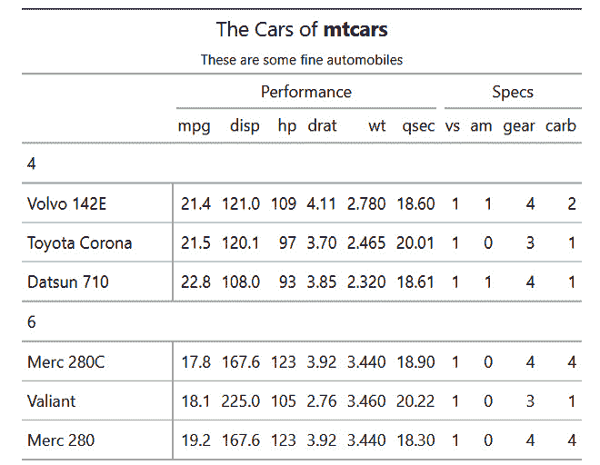

# 数据透视表与汇总表

在数据分析和电子表格操作领域，数据透视表是一种强大的工具，使用户能够将大型数据集转换和汇总为更易于管理和有洞察力的格式。通过提供一种有组织和动态的数据分析方法，数据透视表已成为各个领域专业人士不可或缺的资产。

那么，什么是数据透视表？数据透视表是一种在电子表格软件（如 Microsoft Excel 或 Google Sheets）中使用的数据处理技术，用于分析和提取复杂数据集的有意义见解。它允许用户重新结构和压缩大量信息，以简洁、易懂的格式呈现，从而促进更好的决策和数据探索。

在数据分析的世界里，数据透视表作为多功能的工具，赋予用户将原始数据转化为可操作见解的能力。通过以用户友好的格式组织、汇总和展示数据，数据透视表简化了决策过程，并促进了对于复杂数据集的深入理解。它们的适应性、交互性和简单性使它们成为各行各业和数据分析任务中的宝贵资产。

本章我们将涵盖以下主题：

+   使用 Base R 的 `xtabs` 函数创建表格

+   使用 `gt` 包创建表格

+   使用 `tidyquant` 创建数据透视表

+   使用 `win32com` 和 `pypiwin32` 在 Python 中创建和管理数据透视表

+   使用 Python 基础创建数据透视表

# 技术要求

对于本章，你可以在以下链接中找到使用的代码：[`github.com/PacktPublishing/Extending-Excel-with-Python-and-R/tree/main/Chapter7`](https://github.com/PacktPublishing/Extending-Excel-with-Python-and-R/tree/main/Chapter7)。

对于 R 语言，我们将涵盖以下一些包：

+   `tidyquant >=` `1.0.6`

+   `gt >-` `0.10.0`

# 使用 Base R 的 `xtabs` 函数创建表格

在我们进入主题的核心之前，让我们了解一些重要组件。

下面是一些数据透视表的关键组件列表：

+   **行和列**：数据透视表通常涉及两个主要组件——行和列。数据行包含单个记录或观察值，而列包含定义这些记录的属性或变量。

+   **值**：数据透视表允许用户通过基于特定指标（如总和、平均值、计数或百分比）计算值来汇总和总结数据。

+   **过滤器与切片器**：过滤器和切片器使用户能够聚焦于数据透视表中的特定数据子集，增强了分析的粒度。这些工具在处理大型数据集时特别有用。

+   **行和列标签**：数据透视表允许用户将属性拖放到行和列标签中，动态定义表格的布局和结构。

交叉表的核心功能是围绕用户定义的标准重新排列和汇总数据。通过“旋转”数据，表格生成一个多维度的汇总，提供在原始数据集中可能不明显的信息。以下将详细说明交叉表的工作原理：

+   **选择**: 用户选择他们想要分析的数据集，并标识包含相关属性和度量的列。

+   **排列**: 用户将这些属性和度量放置在交叉表布局的特定区域，例如行、列、值和过滤器。

+   **计算**: 交叉表自动计算所选属性的各种组合的指定度量。例如，它可以显示不同地区每个产品类别的总销售额。

+   **交互性**: 交叉表是交互式的；用户可以通过拖放属性轻松修改布局，从而实时探索数据。

交叉表提供了一些优势，使它们成为数据分析中不可或缺的工具：

+   **数据汇总**: 交叉表允许快速有效地汇总数据，帮助用户理解大型数据集中的模式、趋势和异常。

+   **快速洞察**: 用户可以迅速生成洞察，而无需复杂的编码或复杂的公式。

+   **灵活分析**: 交叉表允许用户通过重新排列属性来尝试不同的视角，从而帮助识别相关性和发展趋势。

+   **报告生成**: 交叉表在创建全面和有信息量的报告、仪表板和可视化中起着关键作用。

+   **数据清洗**: 在分析数据之前，可以使用交叉表来识别缺失值、异常值或不一致性。

R 中的 `xtabs()` 函数用于从数据框中的因子列创建列联表。您可以使用熟悉的公式输入：`x ~ y`。列联表是一个显示两个或多个分类变量频率分布的表格。在这种情况下，我们将使用 `UCBAdmissions` 数据集来演示如何使用 `xtabs()` 函数。

`xtabs()` 函数的语法如下：

```py
xtabs(formula, data, subset, sparse, na.action, addNA, exclude, drop.unused.levels)
```

每个选项的含义如下：

+   `formula`: 一个公式对象，包含交叉分类变量（由 ~ 分隔）

+   `data`: 包含公式中变量的数据框

+   `subset`: 一个可选的表达式，用于指定要使用的观测值子集

+   `sparse`: 一个逻辑值，指示是否返回稀疏矩阵

+   `na.action`: 一个用于处理缺失值的函数

+   `addNA`: 一个逻辑值，指示是否为缺失值添加行和列

+   `exclude`: 一个要排除表中的值的向量

+   `drop.unused.levels`: 一个逻辑值，指示是否删除未使用的因子级别

要使用 `xtabs()` 函数和 `UCBAdmissions` 数据集，我们首先需要使用 `as.data.frame()` 函数将其转换为数据框。`UCBAdmissions` 数据集包含男性和女性申请者的数量以及被录取或拒绝的男性和女性申请者的数量。我们可以使用 `xtabs()` 函数创建一个展示性别和录取状态频率分布的列联表。以下是相应的代码：

```py
# Convert the dataset to a data frame
df <- as.data.frame(UCBAdmissions)
# Create a contingency table using xtabs()
xtabs(Freq ~ Gender + Admit, df)
        Admit
Gender   Admitted Rejected
  Male       1198     1493
  Female      557     1278
```

`xtabs()` 函数的输出将是一个展示性别和录取状态频率分布的表格。表格的行代表性别，列代表录取状态。表格中的值代表性别和录取状态组合的频率。

总结来说，`xtabs()` 函数的语法包括几个参数，允许对输出进行定制。要使用 `xtabs()` 函数和 `UCBAdmissions` 数据集，我们首先需要使用 `as.data.frame()` 函数将其转换为数据框。然后，我们可以使用 `xtabs()` 函数创建一个展示性别和录取状态的频率分布的列联表。

现在我们已经在基础 R 中生成了一个列联表，我们可以继续使用 `gt` 包，这将使我们能够制作更熟悉的内容：交叉表，正如我们所知。

# 使用 `gt` 包制作表格

R 中的 `gt` 包允许用户创建美观且可定制的表格。`gt` 包的主要优点之一是易用性。该包旨在易于使用，具有简单的语法，使得快速创建表格变得容易。此外，该包提供了广泛的定制选项，允许用户创建符合其特定需求的表格。

`gt` 包的另一个优点是它能够处理大型数据集。该包针对性能进行了优化，这意味着它可以处理大型数据集而不会减慢速度。这对于需要从大型数据集中创建表格的用户尤其有用，因为它允许他们快速高效地完成。

`gt` 包还提供了广泛的美化选项，使用户能够创建视觉上吸引人且易于阅读的表格。用户可以自定义表格的字体、颜色和格式，从而轻松创建符合其品牌或设计偏好的表格。

最后，`gt` 包是开源的，这意味着它正不断地由 R 社区进行更新和改进。这确保了该包始终保持最新和相关性，并且定期添加新功能和改进。

总结来说，`gt` 包是 R 中创建表格的强大工具。其易用性、性能、定制选项以及开源特性使其成为需要快速高效创建表格的 R 用户的首选。让我们通过使用 `gt` 包和 `mtcars` 数据集来查看一个示例。

在本节中，我们正在检查`gt`包是否已安装。如果尚未安装，我们使用`install.packages`函数来安装它。`gt`包是一个用于在 R 中创建格式优美的表格的包：

```py
# The gt package
if (!require(gt)) {
  install.packages("gt", dependencies = TRUE)
}
```

在这里，我们加载了两个额外的包：`dplyr`和`tibble`。这些包为 R 中的数据处理和分析提供了有用的函数和数据结构：

```py
library(dplyr)
library(tibble)
```

在本节中，我们对`mtcars`数据集执行几个操作：

```py
tab <- mtcars |>
  rownames_to_column() |>
  arrange(factor(cyl), mpg) |>
  group_by(cyl) |>
  slice(1:3) |>
  gt()
```

操作如下：

+   `rownames_to_column()`: 我们将数据集的行名转换为常规列，以便我们可以处理它。这是一个来自`tibble`包的函数。

+   `arrange(factor(cyl), mpg)`: 我们首先按`cyl`列的升序排序数据集，然后按`mpg`列的升序排序。这，连同`group_by`和`slice`，是来自`dplyr`的一个函数。

+   `group_by(cyl)`: 我们正在按`cyl`列对数据集进行分组。

+   `slice(1:3)`: 我们正在选择每个组中的前三行。

+   `gt()`: 我们使用`gt`包创建一个表格来显示结果数据。

在下一节中，我们向表格中添加一个`Performance`横杆（一组列的标签）。我们指定我们想要包含在此横杆下的列：`mpg`、`disp`、`hp`、`drat`、`wt`和`qsec`。这些列与汽车的性能相关：

```py
tab <- tab |>
  tab_spanner(
    label = "Performance",
    columns = c(mpg, disp, hp, drat, wt, qsec)
  )
```

类似地，在本节中，我们向表格中添加一个`Specs`横杆（用于包含列的标签），并指定要包含在此横杆下的列：`vs`、`am`、`gear`和`carb`。这些列包含有关汽车的规格信息：

```py
tab <- tab |>
  tab_spanner(
    label = "Specs",
    columns = c(vs, am, gear, carb)
  )
```

在最后一节中，我们使用标题和副标题设置表格标题。标题是`mtcars 的汽车`，带有一些 Markdown 格式，副标题是`这些是一些` `优秀的汽车`：

```py
tab <- tab |>
  tab_header(
    title = md("The Cars of **mtcars**"),
    subtitle = "These are some fine automobiles"
  )
tab
```

因此，总的来说，这段 R 代码加载必要的包，操作`mtcars`数据集以创建一个包含性能和规格信息的自定义表格，并为表格设置标题。现在我们已经走过了所有代码，让我们看看它的输出。如果您想自己尝试，只需在控制台中调用标签页。表格如下所示：



图 7.1 – mtcars 和 gt 包

现在我们已经看到了如何通过创建不同的横杆和标题使用`gt`包创建交叉表，我们可以继续到`tidyquant`包，它将为用户在 R 中创建交叉表提供更加熟悉的感觉。

# 使用 tidyquant 创建交叉表

`tidyquant`库中的`pivot_table()`函数是创建 R 中数据框的汇总表的有用工具。它允许您指定表格的行、列、值和聚合函数，并使用其他选项，如排序、格式化和筛选。

要使用 `pivot_table()` 函数，您需要首先通过使用 `library(tidyquant)` 命令加载 `tidyquant` 库。然后，您可以将数据框作为函数的第一个参数传递，然后是定义您的表的其它参数。例如，如果您想创建一个显示不同鸢尾花物种的平均萼片长度和萼片宽度的表格，可以使用以下代码：

```py
# Load the tidyquant library
library(tidyquant)
library(purrr)
# Create a pivot table
pivot_table(.data = iris,
            .rows = ~ Species,
            .values = c(~ mean(Sepal.Length),
                   ~ mean(Sepal.Width))) |>
set_names("Species","Mean_Sepal_Length","Mean_Sepal_Width")
```

此代码的输出如下：

```py
# A tibble: 3 × 3
  Species    Mean_Sepal_Length Mean_Sepal_Width
  <fct>                  <dbl>            <dbl>
1 setosa                  5.01             3.43
2 versicolor              5.94             2.77
3 virginica               6.59             2.97
```

下面是对代码的简单解释：

+   `tidyquant` 和 `purrr`。这些库提供了数据操作和分析的函数和工具。

+   `pivot_table` 函数用于重塑鸢尾花数据集中的数据。它接受三个主要参数：

    +   `.data`：这是您想要工作的数据集，在本例中是鸢尾花数据集。

    +   `.rows`：此参数指定您想要如何分组或分类您的数据。在这段代码中，它根据代表不同品种的鸢尾花物种的 `Species` 列对数据进行分组。

    +   `.values`：此参数指定您想要计算和显示值的列。在这里，它计算了两个列——`Sepal.Length` 和 `Sepal.Width`——对于每个物种的平均值（平均值）。

+   `set_names` 函数用于重命名结果表的列。列名设置为 `Species`、`Mean_Sepal_Length` 和 `Mean_Sepal_Width`。

因此，总结来说，此代码将鸢尾花数据集按物种分组，计算每个物种的平均萼片长度和平均萼片宽度，然后将结果表的列重命名以使其更易于理解。结果是显示每个鸢尾花物种的平均萼片长度和平均萼片宽度的新的表格。

现在我们已经讨论了 R 中的材料，让我们继续学习 Python！

# 使用 win32com 和 pypiwin32 在 Python 中创建和管理交叉表

交叉表是数据分析中的强大工具，允许您快速有效地总结和探索大型数据集。虽然它们是电子表格软件（如 Microsoft Excel）的标准功能，但您也可以使用 Python 编程方式创建和操作交叉表。在本章的这一部分，我们将深入研究交叉表的世界，并学习如何利用 `win32com` 和 `pywin32` 库来发挥其潜力。

# 使用 Python 创建交叉表：基础知识

交叉表是数据分析领域不可或缺的工具。它们提供了一种动态的方式来总结、探索并从复杂的数据集中获得洞察。然而，当处理大量数据时，设置和自定义交叉表可能是一个耗时且容易出错的过程，通常需要手动干预。

在本章中，我们将探讨 Python 如何与 `win32com` 和 `pywin32` 库结合使用，以简化和管理交叉表的创建和管理。这种强大的组合使数据分析师和专业人员能够高效地处理大量数据，而无需重复的手动任务。

想象一下，只需几行 Python 代码就能创建数据透视表、应用高级计算和刷新数据。这正是我们本节的目标。我们将为您提供知识和工具，以充分利用数据透视表的全功能，同时消除手动设置中的繁琐部分。

## **设置 Python 环境**

在我们深入创建数据透视表之前，您需要设置您的 Python 环境，并安装所需的库。`win32com` 和 `pywin32` 对于与 Microsoft Excel 交互是必不可少的，因此请确保它们已安装在您的系统上。我们已经在 *第三章* 中介绍了安装过程，并提供了如何将 Python 与 Excel 连接的基本示例。请参阅 *使用 pywin32 将 VBA 与 Python 集成* 部分，特别是 *设置环境子部分*。如果您尚未设置 `pywin32`，请参阅该章节。

## 创建数据透视表

与数据透视表一起工作的基础当然是创建它们。我们将从基础知识开始，教您如何从头开始构建数据透视表。以下是一步一步的指南，帮助您开始：

1.  **连接到 Excel**：创建一个 Excel 实例并打开一个工作簿。如果工作簿不存在，您可以按照以下方式创建一个新的工作簿：

    ```py
    import win32com.client as win32
    # Create an Excel workbook and add a sheet
    excel = win32.gencache.EnsureDispatch('Excel.Application')
    workbook = excel.Workbooks.Add()
    worksheet = workbook.Worksheets(1)
    ```

1.  **向工作表添加数据**：您需要数据来创建数据透视表。通常，这些数据已经存在，但为了本例的目的，您可以将示例数据添加到工作表中，如下所示：

    ```py
    worksheet.Cells(1, 1).Value = 'Name'
    worksheet.Cells(1, 2).Value = 'Category'
    worksheet.Cells(1, 3).Value = 'Sales'
    worksheet.Cells(2, 1).Value = 'John'
    worksheet.Cells(2, 2).Value = 'Electronics'
    worksheet.Cells(2, 3).Value = 1000
    worksheet.Cells(3, 1).Value = 'Alice'
    worksheet.Cells(3, 2).Value = 'Clothing'
    worksheet.Cells(3, 3).Value = 800
    worksheet.Cells(4, 1).Value = 'John'
    worksheet.Cells(4, 2).Value = 'Clothing'
    worksheet.Cells(4, 3).Value = 300
    # Add more data as needed
    ```

1.  **选择数据范围**：定义您想要用于数据透视表的数据范围。您可以通过指定数据的起始和结束单元格来完成此操作：

    ```py
    data_range = worksheet.Range('A1:C4')  # Adjust the range as needed
    ```

1.  **创建数据透视表**：现在，您可以根据所选的数据范围创建数据透视表。指定您希望数据透视表所在的位置以及您在数据透视表中用于行、列和值的列：

    ```py
    # Add a new worksheet to the workbook to hold the Pivot Table:
    pivot_table_sheet = workbook.Worksheets.Add()
    pivot_table_sheet.Name = 'Pivot Table'
    # Create a Pivot Cache using the data range:
    pivot_cache = workbook.PivotCaches().Create(SourceType=1, SourceData=data_range)
    # Create the Pivot Table on the new sheet using the Pivot Cache:
    pivot_table = pivot_cache.CreatePivotTable(
        TableDestination=pivot_table_sheet.Cells(3, 1),
        TableName='MyPivotTable')
    # Add the row, column and data fields
    pivot_table.PivotFields('Name').Orientation = 1 # row field
    pivot_table.PivotFields('Category').Orientation = 2 # column field
    pivot_table.PivotFields('Sales').Orientation = 4 # data field
    # Add the calculated fields
    calculated_field = pivot_table.CalculatedFields().Add(
        "Total Sales", "=SUM(Sales)")
    # Refresh the PivotTable to apply changes
    pivot_table.RefreshTable()
    ```

    在本例中，`SourceType` 参数指定了 `PivotTable` 的数据源类型。在这种情况下，`SourceType = 1` 表示数据源是一个 Excel 工作表。`SourceType` 参数可以取以下值之一（或代表它们的 1 到 3 之间的数字）：

    +   `xlDatabase`：这表示数据源是一个 Excel 工作表或外部数据库。它是数据透视表中最常见的数据源类型。

    +   `xlExternal`：这表示数据源是一个 OLAP 立方体或不是直接从 Excel 可访问的外部数据源。

    +   `xlConsolidation`：这表示数据源是一个合并。合并是从多个工作表或工作簿中聚合数据的透视表。

1.  **保存工作簿并关闭 Excel**：别忘了保存您带有新创建的数据透视表的 Excel 工作簿：

    ```py
    workbook.SaveAs('PivotTableExample.xlsx')
    workbook.Close()
    excel.Quit()
    ```

    当保存 Excel 工作表时，如果您不想将工作表保存到 Python 的工作目录，您可以提供完整路径。

就这样！你已经使用 Python 中的 `pywin32` 创建了一个交叉表。你可以调整数据、交叉表位置和格式化选项，以满足你的特定需求。

现在你已经准备好了一个基本的交叉表，让我们看看如何将其修改以适应你的需求。

## 操作交叉表

一旦你有了交叉表，你可能想要对它们执行各种操作，例如过滤、排序和刷新数据。以下是这些步骤：

1.  首先，打开上一节中的 Excel 文件并选择创建的交叉表：

    ```py
    import win32com.client as win32
    # Connect to Excel
    excel = win32.gencache.EnsureDispatch('Excel.Application')
    # Open the workbook with the pivot table
    workbook = excel.Workbooks.Open('PivotTableExample.xlsx')  # Replace with your workbook path
    worksheet = workbook.Worksheets(1)
    # Access the Pivot Table
    pivot_table = worksheet.PivotTables('MyPivotTable')  # Use the name of your pivot table
    ```

1.  你可以根据值在交叉表中过滤数据。在这个例子中，我们将过滤 `类别` 字段，只显示 `电子产品`：

    ```py
    # Filter by value (need to make the field a Page field instaed of a column field)
    category_field = pivot_table.PivotFields('Category')
    category_field.Orientation = 3 # page field
    category_field.CurrentPage = "Electronics"
    ```

1.  你可能需要排序交叉表中的行或列。在这个例子中，我们将按升序排序 `名称` 字段：

    ```py
    # Sort Rows or Columns
    name_field = pivot_table.PivotFields('Name')
    name_field.AutoSort(1, "Name")
    ```

1.  如果你的源数据已更改，你可以刷新交叉表以更新它：

    ```py
    # Define the new source data range
    new_source_data_range = 'Sheet1!A1:C2'
    # Update the SourceData property of the pivot table's Table object
    pivot_table.TableRange2(workbook.Sheets('Sheet1').Range(
        new_source_data_range))
    # Refresh data
    pivot_table.RefreshTable()
    ```

1.  在操作交叉表后，保存你的更改并关闭工作簿：

    ```py
    workbook.Save()
    workbook.Close()
    excel.Quit()
    ```

注意

在使用 Python 访问或操作它时，请不要打开电子表格（在 Excel 中），因为这会导致难以调试的 `com_errors` 实例。

这些步骤应该能帮助你开始使用 `pywin32` 操作交叉表。你可以调整过滤器、排序标准和刷新频率，以满足你的特定需求并自动化涉及交叉表的各项任务。

一旦你的交叉表按照你的要求设置好，你可能需要通过分组一些（或全部）类别来进一步改进它，以更好地反映你试图传达的信息。在下一小节中，我们将详细介绍如何做到这一点。

## 交叉表中的分组

在交叉表中分组数据可以帮助你创建一个更有组织和洞察力的数据集视图。你可以根据特定的标准，如日期范围、数值区间或自定义类别来分组数据。在本节中，我们将探讨如何使用 Python 和 `pywin32` 库将分组应用于你的交叉表。

### 创建日期分组

分组的一个常见用例是按日期范围聚合数据。例如，你可能希望将销售数据分组到月度或季度间隔。为此，你可以在交叉表中创建日期分组。

我们将首先生成一些示例数据：

```py
# Sample Data Generation
import pandas as pd
import random
from datetime import datetime, timedelta
import win32com.client as win32
import os
import numpy as np
data = {
    'Date': [datetime(2023, 1, 1) + timedelta(days=i) for i in range(365)],
    'Sales': [random.randint(100, 1000) for _ in range(365)]
}
df = pd.DataFrame(data)
# Create an ExcelWriter object and write the DataFrame to the Excel worksheet
df.to_excel("GroupingExample.xlsx", sheet_name='Sheet1', index=False)
```

将数据保存在 Excel 表格中（默认情况下在 Python 工作目录中，但也可以指定其他位置），我们可以遵循通常的步骤打开 Excel 表格，为交叉表添加一个专用标签，并创建交叉表。之前已涵盖的步骤在此省略（但可在 GitHub 上找到）。步骤如下：

```py
# Connect to Excel
# Open the Excel workbook and add a sheet
# Add a new worksheet to the workbook to hold the Pivot Table:
# Define the range of data to be used as input for the pivot table
# Create a Pivot Cache using the data range:
# Create the Pivot Table on the new sheet using the Pivot Cache:
# Add the 'Date' field to Rows and define the date_field variable as done with name_field in the example above.
# Add the calculated fields
calculated_field = pivot_table.CalculatedFields().Add("Total Sales", "=SUM(Sales)")
# Group by months
date_field.Subtotals = [False]*12
date_field.NumberFormat = 'MMMM YYYY'
# Sort Rows
date_field.AutoSort(1, "Date")
```

在这个例子中，我们创建了一个交叉表，并将 `日期` 字段添加到行中，以及一个用于 `总销售额` 的计算字段。然后我们指定了希望以月-年格式格式化日期。最后，格式化后的日期被排序。

要将分组字段添加到数据透视表中，我们需要知道哪些值属于一组（注意，这些值已被格式化为不显示确切的日期，但它们仍然有所不同）：

```py
# count the unique values for each value of the date column in the pivot
date_values = pd.DataFrame([item.Value for item in date_field.PivotItems()], columns = ['date'])
unique_values = pd.DataFrame(np.transpose(np.unique(date_values, return_counts=True)), columns=['date', 'count'])
date_values_count = date_values.merge(unique_values).drop_duplicates()
# Group by months
# Set the GroupOn property
date_range = pivot_table_sheet.Range(f"A4:A{starting_row + date_values_count['count'].iloc[0]}")
date_range.Group()
# You can use the above method to group the other months as well if you want to
# Note: the pivot is now changed, the second group starts at row starting_row + 2, instead of starting_row + 32
```

这创建了一个名为`Date2`的分组数据透视字段。在`Date2`字段中，属于一月的日期被分组到`Group1value`中，而其他日期则被分组到只包含单个日期的组中。使用前面的示例，您现在可以遍历月-年日期的其他唯一值，并将其他日期也进行分组。请注意，`总销售额`的计算字段现在是在这些组上计算的。

最后，我们将新分组字段的格式更改为月-年格式，将`日期`字段中的原始数据改回显示完整日期，并隐藏组细节以提高清晰度。最后，刷新数据透视表，保存并关闭 Excel 文件：

```py
# change the formatting of the grouped column to show only month and year and change back the original date column to show the full date
# change the formatting of the grouped column to show only month and year and change back the original date column to show the full date
pivot_table.PivotFields('Date2').NumberFormat = 'MMMM YYYY'
date_field.NumberFormat = 'DD MMMM YYYY'
# hide the details of the grouped values
for item in pivot_table.PivotFields('Date2').PivotItems():
    item.ShowDetail = False
# Refresh data
pivot_table.RefreshTable()
#pivot_table.PivotFields('Date2').Orientation = 2
# Save and close
workbook.Save()
workbook.Close()
excel.Quit()
```

这只是一个例子，说明了您如何使用分组来更有效地分析数据。根据您的数据集和分析目标，您可以自定义分组以适应您的特定需求。

本节涵盖了您需要从 Python 直接创建和操作数据透视表的步骤。我们介绍了将数据透视表插入 Excel 表格以及添加数据透视表所需的各种类型字段作为基础。然后，我们深入到更复杂的领域，包括计算字段、格式化和最终分组值。通过本节学到的技能，您现在可以创建出适合您分析的数据透视表，而无需打开 Excel！

# 摘要

在本章中，我们通过 R 和 Python 的功能开始了利用数据透视表力量的旅程。数据透视表——数据分析中不可或缺的工具——提供了一种动态的方式来总结和探索大量数据集。通过掌握本章中概述的技术，您已经解锁了数据透视表的全部潜力，使您能够自动化其创建、操作和增强。

我们首先介绍了数据透视表在数据分析中的重要性，并为我们探索奠定了基础。我们侧重于实用性，指导您安装必要的库，确保您的 R 或 Python 环境为处理 Excel 的复杂性做好了充分准备。

从零开始构建数据透视表是我们的第一次尝试，为您提供了选择数据源、排列行和列以及自定义表格外观的基本知识。我们在揭秘创建过程方面没有留下任何疑问。

操作数据透视表打开了一个全新的世界。您学习了如何动态地筛选、排序和刷新数据，这些技能使您能够根据不断变化的需求定制数据透视表。

此外，我们还探讨了高级数据透视表功能，如计算字段和分组，展示了您新获得的专业知识的多样性和深度。这些高级技术是深入了解数据并增强分析能力的宝贵工具。

总之，您通过 R 和 Python 学习数据透视表的经历，使您拥有了全面的技术技能，能够高效有效地应对数据分析挑战。凭借这些知识，您可以将数据转化为可操作的见解，简化工作流程，并自信地进行数据驱动决策。能够通过 R 和 Python 自动化和操作数据透视表，在当今数据驱动世界中是一种宝贵的资产，您现在已准备好充分利用这一力量。

在下一章中，我们将了解**数据探索分析**（**EDA**）是如何在数据分析中工作的。

# 第三部分：EDA、统计分析与时间序列分析

深入 R 和 Python 的**数据探索分析**（**EDA**）世界，揭示 Excel 数据中的洞察力和模式。探索统计分析的基础，包括线性回归和逻辑回归技术。深入研究时间序列分析领域，掌握统计、图表和预测方法，以获得对时间数据趋势和模式的宝贵洞察。

本部分包含以下章节：

+   *第八章*, *使用 R 和 Python 进行数据探索分析*

+   *第九章*, *统计分析：线性回归和逻辑回归*

+   *第十章*, *时间序列分析：统计、图表和预测*
