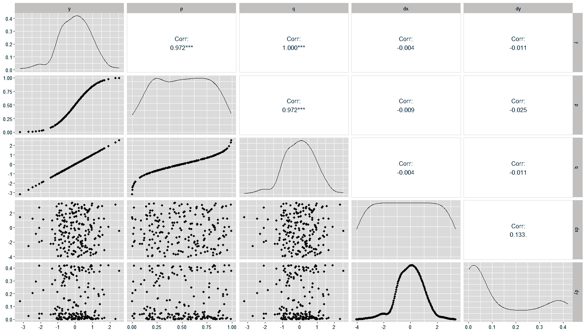
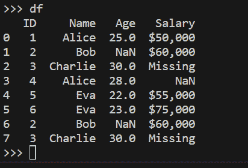
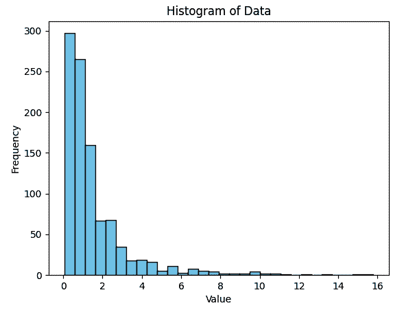
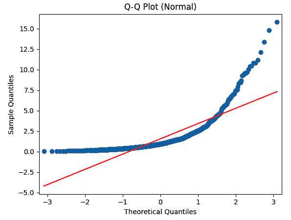
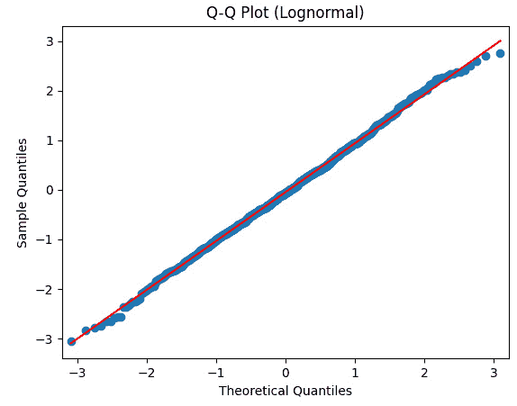
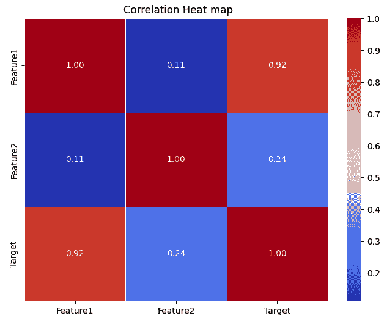
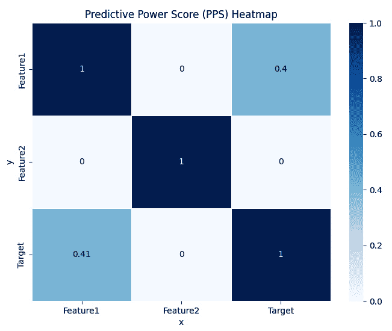

# 使用 R 和 Python 进行探索性数据分析

**探索性数据分析**（**EDA**）是数据科学家在数据分析过程中的一个关键初始步骤。它涉及系统地检查和可视化数据集，以揭示其潜在的规律、趋势和见解。EDA 的主要目标是更深入地了解数据，识别潜在的问题或异常，并指导后续的分析和建模决策。

EDA 通常从一系列数据汇总技术开始，例如计算基本统计量（均值、中位数和标准差）、生成频率分布以及检查数据类型和缺失值。这些初步步骤提供了数据集结构和质量的概述。

可视化在 EDA 中扮演着核心角色。数据科学家创建各种图表和图形，包括直方图、箱线图、散点图和热图，以可视化数据中的分布和关联。这些可视化有助于揭示数据中的异常值、偏度、相关性和聚类，有助于识别有趣的模式。

探索分类变量涉及生成条形图、饼图或堆叠条形图，以了解不同类别的分布及其关系。这对于客户细分或市场分析等任务非常有价值。

EDA 还涉及评估变量之间的关系。数据科学家使用相关矩阵、散点图和回归分析来揭示联系和依赖关系。理解这些关联可以指导模型中的特征选择，并帮助识别潜在的共线性问题。

数据转换和清洗通常在 EDA（探索性数据分析）过程中执行，以解决诸如异常值、缺失数据和偏度等问题。关于数据插补、缩放或编码分类变量的决策可能基于在探索过程中获得的见解。

总体而言，EDA 是数据科学工作流程中的一个关键阶段，因为它为后续的数据建模、假设检验和决策奠定了基础。它通过提供对数据集特征和细微差别的全面理解，使数据科学家能够就数据预处理、特征工程和建模技术做出明智的选择。EDA 有助于确保基于数据的见解和决策建立在坚实的数据理解和探索基础上。

在本章中，我们将涵盖以下主题：

+   探索数据分布

+   数据结构和完整性

+   使用各种包进行 EDA

# 技术要求

对于本章，所有脚本和文件都可以在以下链接的 GitHub 上找到：[`github.com/PacktPublishing/Extending-Excel-with-Python-and-R/tree/main/Chapter%208`](https://github.com/PacktPublishing/Extending-Excel-with-Python-and-R/tree/main/Chapter%208)。

对于 R 部分，我们将涵盖以下库：

+   `skimr 2.1.5`

+   `GGally 2.2.0`

+   `DataExplorer 0.8.3`

# 使用 `skimr` 理解数据

作为 R 语言程序员，`skimr` 包是一个有用的工具，可以提供关于变量（如数据框和向量）的汇总统计信息。该包提供了一组更丰富的统计信息，以便与基础 R 的 `summary()` 函数相比，为最终用户提供更稳健的信息集。

要使用 `skimr` 包，首先必须使用 `install.packages("skimr")` 命令从 `CRAN` 安装它。一旦安装，就可以使用 `library(skimr)` 命令加载包。然后使用 `skim()` 函数来汇总整个数据集。例如，`skim(iris)` 将提供 `iris` 数据集的汇总统计信息。`skim()` 的输出是水平打印的，每个变量类型一个部分，每个变量一个行。

该包还提供了 `skim_to_wide()` 函数，它将 `skim()` 的输出转换为宽格式。这可以用于将汇总统计信息导出到电子表格或其他外部工具。

总体而言，`skimr` 包是一个有用的工具，可以快速轻松地获取 R 中变量的汇总统计信息。它提供的统计信息比 R 基础函数 `summary()` 更丰富，且易于使用和定制。该包特别适用于数据探索和数据清洗任务，因为它允许用户快速识别数据中的潜在问题。现在，我们已经对 `skimr` 包有了基本的了解，让我们看看它的实际应用。

这段 R 代码用于使用 `skimr` 包生成 `iris` 数据集的汇总。`skimr` 包提供了一种方便的方式来快速汇总和可视化数据集的关键统计信息。

下面是对每一行代码的解释以及预期的输出：

+   `if(!require(skimr)){install.packages("skimr")}`：这一行检查 `skimr` 包是否已经安装。如果没有安装，它将使用 `install.packages("skimr")` 安装包。这确保了 `skimr` 包在后续代码中使用时可用。

+   `library(skimr)`：这一行将 `skimr` 包加载到 R 会话中。一旦包被加载，就可以使用其函数和特性。

+   `skim(iris)`：这一行调用 `skim()` 函数，来自 `skimr` 包，并应用于 `iris` 数据集。`skim()` 函数生成数据集的汇总，包括每个变量（列）的统计信息和相关信息。

现在，让我们讨论预期的输出。当你运行 `skim(iris)` 命令时，你应该在 R 控制台中看到 `iris` 数据集的汇总。输出将包括如下统计信息和相关信息：

+   **计数**：每个变量的非缺失值数量

+   **缺失**：每个变量的缺失值数量（如果有）

+   **唯一值**：每个变量的唯一值数量

+   **平均值**：每个数值变量的平均值

+   **最小值**：每个数值变量的最小值

+   **最大值**：每个数值变量的最大值

+   **标准差**：每个数值变量的标准差

+   其他汇总统计数据

输出将类似于以下内容，但包含更详细的统计数据：

```py
> skim(iris)
── Data Summary ────────────────────────
                           Values
Name                       iris
Number of rows             150
Number of columns          5
_______________________
Column type frequency:
  factor                   1
  numeric                  4
________________________
Group variables            None
── Variable type: factor ─────────────────────────────────────────────────────────────────────────
  skim_variable n_missing complete_rate ordered n_unique top_counts
1 Species               0             1 FALSE          3 set: 50, ver: 50, vir: 50
── Variable type: numeric ────────────────────────────────────────────────────────────────────────
  skim_variable n_missing complete_rate mean    sd  p0 p25  p50 p75 p100 hist
1 Sepal.Length          0             1 5.84  0.828  4.3  5.1  5.8  6.4  7.9 ▆▇▇▅▂
2 Sepal.Width           0             1 3.06  0.436  2   2.8  3    3.3  4.4 ▁▆▇▂▁
3 Petal.Length          0             1 3.76  1.77  1   1.6  4.35  5.1  6.9  ▇▁▆▇▂
4 Petal.Width           0             1 1.20  0.762 0.1 0.3  1.3  1.8  2.5  ▇▁▇▅▃
```

此输出提供了对`iris`数据集的全面总结，帮助您快速了解其结构和关键统计数据。您还可以将分组后的`tibble`传递给`skim()`函数，并以此方式获得结果。

现在我们已经通过一个简单的示例了解了如何使用`skimr`包来探索我们的数据，我们现在可以继续了解`GGally`包。

# 在 R 中使用 GGally 包

在其核心，`GGally`是 R 中广受欢迎的`ggplot2`包的扩展。它将`ggplot2`的优雅和灵活性提升到一个令人眼花缭乱的函数集合，释放您的创造力，以惊人的方式可视化数据。

使用`GGally`，您可以轻松创建美丽的散点图、直方图、条形图等等。它有什么独特之处？`GGally`简化了创建复杂多元图表的过程，为您节省时间和精力。想要探索相关性、可视化回归模型或制作出色的生存曲线吗？`GGally`会支持你。

但`GGally`不仅仅关乎美观；它关乎洞察。它使您能够通过视觉探索揭示数据中的隐藏关系。直观的语法和用户友好的界面使其既适合新手也适合经验丰富的数据科学家。

更好的是，`GGally`鼓励协作。其易于分享的可视化可以成为向更广泛的受众传达您发现的有力工具，从同事到客户。

因此，如果您想提升您的数据可视化技能，不妨试试`GGally`。它是您在数据可视化领域的可靠盟友，帮助您将数字转化为引人入胜的故事。释放数据的真正潜力，让`GGally`成为您的创意伙伴。您的数据从未如此出色！现在，让我们通过一个简单的用例来了解如何使用它：

```py
if(!require(GGally)){install.packages("GGally")}
If(!require(TidyDensity)){install.packages("TidyDensity")}
library(GGally)
library(TidyDensity)
tidy_normal(.n = 200) |>
  ggpairs(columns = c("y","p","q","dx","dy"))
```

让我们一步步来分析：

+   `if(!require(GGally)){install.packages("GGally")}`: 此行检查`GGally`包是否已安装在你的 R 环境中。如果没有安装，它将使用`install.packages("GGally")`继续安装。

+   `library(GGally)`: 在确保`Ggally`已安装后，此代码将`GGally`包加载到当前的 R 会话中。此包提供创建各种类型图表和可视化的工具，包括散点图矩阵。

+   `library(TidyDensity)`: 类似地，此行加载了`TidyDensity`包，用于创建整洁密度图。整洁密度图是一种以整洁和有序的方式可视化数据分布的方法。

+   `tidy_normal(.n = 200)`：在此，代码生成一个包含 200 个随机数据点的数据集。这些数据点被假定为遵循正态分布（钟形曲线）。`tidy_normal` 函数用于创建此数据集。

+   `ggpairs(columns = c("y","p","q","dx","dy"))`：这里发生了魔法。`GGally` 软件包中的 `ggpairs` 函数被调用，使用之前生成的数据集。它创建了一个散点图矩阵，其中每个变量的组合都相互绘制。`y`、`p`、`q`、`dx` 和 `dy` 变量是用于创建散点图的数据集列。

总结来说，此代码首先安装并加载必要的 R 软件包（`GGally` 和 `TidyDensity`）。然后，它生成一个包含 200 个随机点的数据集，并使用 `ggpairs` 函数创建一个散点图矩阵。散点图矩阵可视化数据集中指定列之间的关系，让您探索数据的模式和相关性。让我们看看生成的结果图：



图 8.1 – 使用 GGally 在 tidy_normal() 生成的 200 个点上进行操作

这里生成的是随机数据，因此您可能不会得到完全相同的结果。现在我们已经用一个简单的例子介绍了 `GGally` 软件包，我们可以继续介绍 `DataExplorer` 软件包，看看它如何与之比较。

# 使用 DataExplorer 软件包

`DataExplorer` R 软件包的创建是为了在 EDA 过程中简化大部分数据管理和可视化的责任。EDA 是数据分析中的一个关键和初级阶段，在此阶段，分析师对数据进行初步观察，以形成有意义的假设并确定后续行动。

`DataExplorer` 提供了各种函数来完成以下任务：

+   **扫描和分析数据变量**：该软件包可以自动扫描和分析数据集中的每个变量，识别其类型、数据分布、异常值和缺失值。

+   `DataExplorer` 提供了各种可视化函数，以帮助分析师理解变量之间的关系并识别数据中的模式。这些函数包括直方图、散点图、箱线图、热图和相关性矩阵。

+   `DataExplorer` 还提供了转换数据的函数，例如将分类变量转换为数值变量、填充缺失值以及缩放数值变量。

`DataExplorer` 可以用于各种 EDA 任务，例如以下内容：

+   `DataExplorer` 可以用于识别数据集中的不同类型变量、它们的分布以及它们之间的关系

+   `DataExplorer` 可以帮助分析师识别数据中的异常值和缺失值，这在构建预测模型之前解决可能很重要。

+   `DataExplorer`可以通过识别变量之间的模式和关系来帮助分析师生成关于数据的假设

这里有一些如何使用该包的示例：

```py
install.packages("DataExplorer")
library(DataExplorer)
library(TidyDensity)
library(dplyr)
df <- tidy_normal(.n = 200)
df |>
  introduce() |>
  glimpse()
```

首先，我们检查`DataExplorer`包是否已安装。如果没有，我们就安装它。然后，我们加载`DataExplorer`包，以及`TidyDensity`和`dplyr`包。

接下来，我们创建一个包含 200 个观测值的正态分布数据集。我们使用`tidy_normal()`函数来做这件事，因为它是在 R 中创建正态分布数据集的一种方便方式。通常，人们最有可能只使用`tidy_normal()`输出的*y*列。

一旦我们有了数据集，我们就使用`DataExplorer`包中的`introduce()`函数来生成数据的摘要。这个摘要包括关于观测数和变量类型的详细信息。

最后，我们使用`dplyr`包中的`glimpse()`函数来显示转置后的数据。这是一种快速了解数据并确保其看起来符合预期的好方法。

换句话说，这段代码是探索 R 中正态分布数据集的一种快速简单的方法。它非常适合学生和初学者，也适合需要快速开始工作的经验丰富的数据科学家。现在，让我们看看输出：

```py
> df |>
+   introduce() |>
+   glimpse()
Rows: 1
Columns: 9
$ rows                 <int> 200
$ columns              <int> 7
$ discrete_columns     <int> 1
$ continuous_columns   <int> 6
$ all_missing_columns  <int> 0
$ total_missing_values <int> 0
$ complete_rows        <int> 200
$ total_observations   <int> 1400
$ memory_usage         <dbl> 12344
```

接下来，让我们看一下`plot_intro()`函数，并查看使用简单调用`df |>` `plot_intro()`在相同数据上的输出：


图 8.2 – `plot_intro()`函数

最后，我们将查看`plot_qq()`函数的输出：


图 8.3 – 包含所有数据的`plot_qq()`函数

我们现在将看到一个只包含两个变量的**分位数-分位数**（**Q-Q**）图，这两个变量分别是*q*和*y*列。以下是代码：

```py
df[c("q","y")] |>
  plot_qq()
```

这是它的图表：


图 8.4 – 只包含 y 和 q 列的`plot_qq()`函数

我们的意图是让您理解 Q-Q 图，但如果不是这样，简单的谷歌搜索也会得到许多好的结果。另一个从未讨论过的问题是如何在 R 中处理缺失数据。有许多函数可以用来捕获、清理和了解它们，例如`all()`、`any()`、`is.na()`和`na.omit()`。在这里，我建议您在网上探索这些，所有这些都已经广泛讨论过。现在我们已经讨论了 R 中不同包中一些函数的几个不同示例，是时候探索 Python 中的相同内容了。

# 开始使用 Python 进行 EDA

如前所述，EDA（探索性数据分析）是视觉和统计上探索数据集以揭示模式、关系和洞察的过程。这是深入更复杂的数据分析任务之前的一个关键步骤。在本节中，我们将向您介绍 EDA 的基础知识，并展示如何为 EDA 准备您的 Python 环境。

EDA 是数据分析的初始阶段，您在此阶段检查和总结您的数据集。EDA 的主要目标如下：

+   **了解数据**：深入了解数据的结构、内容和质量

+   **识别模式**：在数据中发现模式、趋势和关系

+   **检测异常**：找到可能需要特别关注的异常值和异常

+   **生成假设**：对您的数据提出初始假设

+   **为建模做准备**：预处理数据以进行高级建模和分析

在您能够执行 EDA 之前，您需要设置您的 Python 环境以处理 Excel 数据。我们已在之前的章节中介绍了第一步：即安装必要的库并从 Excel 加载数据。

接下来，我们将介绍 EDA 最重要的基础知识：数据清洗和数据探索。

数据清洗是准备您的 Excel 数据以在 Python 中进行 EDA 的一个关键步骤。它涉及识别和纠正可能影响您分析准确性和可靠性的各种数据质量问题。

让我们从数据清洗的复杂性开始，没有它，您无法对 EDA 的结果有信心。我们将关注通用的数据清洗挑战以及来自 Excel 的数据特有的挑战。

# Python 中处理 Excel 数据的数据清洗

在 Python 处理 Excel 数据时，数据清洗是一个关键过程。它确保您的数据处于正确的格式且无错误，从而使您能够进行准确的 EDA。

我们将以生成一些脏数据作为示例：

```py
import pandas as pd
import numpy as np
# Create a DataFrame with missing data, duplicates, and mixed data types
data = {
    'ID': [1, 2, 3, 4, 5, 6],
    'Name': ['Alice', 'Bob', 'Charlie', 'Alice', 'Eva', 'Eva'],
    'Age': [25, np.nan, 30, 28, 22, 23],
    'Salary': ['$50,000', '$60,000', 'Missing', '$65,000', '$55,000',
    '$75,000']
}
df = pd.DataFrame(data)
# Introduce some missing data
df.loc[1, 'Age'] = np.nan
df.loc[3, 'Salary'] = np.nan
# Introduce duplicates
df = pd.concat([df, df.iloc[1:3]], ignore_index=True)
# Save the sample data in present working directory
df.to_excel('dirty_data.xlsx')
```

创建的数据框看起来如下：



图 8.5 – 使用 GGally 对 tidy_normal()生成的 200 个点进行操作

脏数据准备就绪后，我们可以开始清洗它，这包括处理缺失数据、重复数据和在清洗 Excel 数据时进行数据类型转换。让我们看看如何做这件事。

## 处理缺失数据

首先识别有缺失数据的单元格或列。在 Python 中，缺失值通常表示为**NaN**（代表**Not a Number**）或**None**。

根据上下文，您可以选择替换缺失值。常见的技术包括以下：

+   使用均值、中位数或众数填充缺失的数值。请注意，如果进行回归分析，这将会人为地降低标准误差测量值。在为建模目的清洗数据时请记住这一点！

+   使用众数（最频繁的类别）替换缺失的类别数据。

+   使用前向填充或后向填充来传播前一个或下一个有效值。

+   根据数据中的趋势插值缺失值。

Python 提供了几种高效且统计上稳健的解决方案来完成这项任务，从基本的`pandas`方法到具有更稳健的插补方法的专用包，如`fancyimpute`。然而，插补不应盲目应用，因为缺失数据本身也可以是信息，而插补的值可能会导致分析结果不正确。正如往常一样，领域知识是获胜的关键。

区分三种类型的缺失数据非常重要：

+   **完全随机缺失**（**MCAR**）：

    +   在这种情况下，数据的缺失是完全随机的，与任何观察到的或未观察到的变量无关。

    +   数据点缺失的概率对所有观测值都是相同的。

    +   缺失值和非缺失值之间没有系统性差异。

    +   以下是一个例子：受访者意外跳过一些问题的调查。

+   **随机缺失**（**MAR**）：

    +   缺失性取决于观察到的数据，但不取决于未观察到的数据。

    +   数据点缺失的概率与数据集中其他观察到的变量相关。

    +   一旦考虑到其他观察到的变量，数据的缺失性就是随机的。

    +   以下是一个例子：在一份调查中，男性可能比女性更不愿意透露他们的收入。在这种情况下，收入数据在性别条件下是随机缺失的。

+   **非随机缺失**（**MNAR**）：

    +   缺失性取决于未观察到的数据或缺失值本身。

    +   数据点缺失的概率与缺失值或其他未观察到的变量相关。

    +   即使考虑到观察到的变量，缺失性也不是随机的。

    +   以下是一个例子：在关于收入的调查中，高收入者可能不太愿意透露他们的收入。

如果一行或一列中有很大一部分包含缺失数据，你可能考虑完全删除该行或列。在这样做时要小心，因为这不应导致信息的大量丢失：

```py
import pandas as pd
import numpy as np
# Load Excel data into a pandas DataFrame
df = pd.read_excel('dirty_data.xlsx', index_col=0)
# Handling Missing Data
# Identify missing values
missing_values = df.isnull().sum()
# Replace missing values with the mean (for numeric columns)
df['Age'].fillna(df['Age'].mean(), inplace=True)
# Replace missing values with the mode (for categorical columns)
df['Salary'].fillna(df['Salary'].mode()[0], inplace=True)
# Forward-fill or backward-fill missing values
# This line is a placeholder to show you what's possible
# df['ColumnWithMissingValues'].fillna(method='ffill', inplace=True)
# Interpolate missing values based on trends
# This line is a placeholder to show you what's possible
# df['NumericColumn'].interpolate(method='linear', inplace=True)
# Remove rows or columns with missing data
df.dropna(axis=0, inplace=True)  # Remove rows with missing data
df.dropna(axis=1, inplace=True)  # Remove columns with missing data
df.to_excel('cleaned_data.xlsx')
```

## 处理重复数据

从检测重复行开始。Python 库，如`pandas`，提供了检测和处理重复行的函数。要识别重复项，可以使用`duplicated()`方法。如果适用，继续删除重复行：在检测到重复项后，你可以选择使用`drop_duplicates()`方法来删除它们。在删除重复项时要小心，特别是在预期存在重复项的情况下：

```py
# Handling Duplicates
# Detect and display duplicate rows
duplicate_rows = df[df.duplicated()]
print("Duplicate Rows:")
print(duplicate_rows)
# Remove duplicate rows
df.drop_duplicates(inplace=True)
```

## 处理数据类型转换

从 Excel 读取数据，虽然高度自动化，但可能导致数据类型识别错误。在 Python 中，当使用`pandas`等库读取 Excel 数据时，数据类型通常会自动分配。然而，验证每列是否分配了正确的数据类型（例如，数值、文本、日期等）是至关重要的。

这种影响从过大的内存占用到实际的语义错误。例如，如果布尔值存储为浮点数，它们将被正确处理，但将占用更多的内存（而不是 64 字节的单个位），而尝试将字符串转换为浮点数可能会破坏你的代码。为了减轻这种风险，首先确定加载的数据中的数据类型。然后，将数据类型转换为适当的类型。要在 Python 中转换数据类型，可以使用`pandas`中的`astype()`方法。例如，要将列转换为数值数据类型，可以使用`df['Column Name'] = df['Column Name'].astype(float)`。

这里有一个如何做到这一点的例子：

```py
# Handling Data Type Conversion
# Check data types
print(df.dtypes)
# Convert a column to a different data type (e.g., float)
df.loc[df['Salary']=='Missing', 'Salary'] = np.NaN
df.loc[:, 'Salary'] = df['Salary'].str.replace("$", "")
df.loc[:, 'Salary'] = df['Salary'].str.replace(",", "")
df['Salary'] = df['Salary'].astype(float)
print(df)
# Now that Salary is a numeric column, we can fill the missing values with mean
df['Salary'].fillna(df['Salary'].mean(), inplace=True)
```

## Excel 特定的数据问题

让我们看看特定于从 Excel 加载数据的问题：

+   **合并单元格**：当 Excel 文件中的合并单元格导入 Python 时，可能会导致数据集出现不规则性。建议在导入前在 Excel 中取消合并单元格。如果取消合并不可行，考虑在 Python 中对这些单元格进行预处理。

+   读取 Excel 文件时使用`pandas`的`na_values`参数来指定在导入时应被视为缺失值（NaN）的值

+   在导入前手动调整 Excel 文件以删除不必要的空单元格

通过在 Python 中解决这些常见的 Excel 数据处理问题，你可以确保你的数据以干净和可用的格式用于你的探索性数据分析（EDA）。干净的数据在探索阶段可以带来更准确和有意义的洞察，这一点我们将在下一部分进行讨论。

# 在 Python 中执行 EDA

在数据加载和清理完成后，你可以开始你的初步数据探索之旅。这一阶段对于深入理解你的数据集、揭示其潜在模式以及确定潜在的感兴趣或关注领域至关重要。

这些初步步骤不仅为你的 EDA 提供了一个坚实的基础，还帮助你发现数据中的隐藏模式和关系。有了这种初步理解，你可以继续进行更高级的数据探索技术，并更深入地研究 Excel 数据集。

在接下来的章节中，我们将深入探讨具体的数据探索和可视化技术，以进一步增强你对数据集的洞察力。有了这些知识，让我们继续到下一部分，我们将探讨更详细地理解数据分布和关系的技巧。

## 汇总统计信息

首先为你的数据集生成汇总统计信息。这包括基本指标，如数值特征的均值、中位数、标准差和分位数。对于分类特征，你可以计算频率计数和百分比。这些统计信息为你提供了数据集中趋势和分布的初步概述。

摘要统计信息提供了对数据集中趋势、分布和分布的简洁且信息丰富的概述。这一步骤对于理解数据集的基本特征至关重要，无论它包含数值特征还是分类特征。以下部分将更详细地探讨生成摘要统计信息。

### 数值特征

对于数值特征，以下统计信息是一个良好的起点：

+   **平均值**：平均值（平均数）是集中趋势的度量，表示所有数值的总和除以数据点的总数。它提供了对数据典型值的洞察。

+   **中位数**：中位数是当所有数据点按升序或降序排序时的中间值。它是一个稳健的集中趋势度量，受极端值（异常值）的影响较小。

+   **标准差**：标准差量化了数据中变化或分散的程度。标准差越高，数据分布越广。

+   **百分位数**：百分位数表示特定数据值，以下哪个百分比的数据点落在该值以下。例如，第 25 百分位数（Q1）表示 25%的数据点位于其以下。百分位数有助于识别数据分布特征。

### 分类特征

分类特征有其自己的摘要统计信息，这将为您提供洞察：

+   **频率**：对于分类特征，计算每个唯一类别的频率计数。这显示了每个类别在数据集中出现的频率。

+   **百分比**：将频率计数表示为相对于观察总数百分比，可以提供对每个类别相对普遍性的洞察。

生成摘要统计信息具有多个目的：

+   **了解您的数据**：摘要统计信息有助于您了解数值数据的典型值和分布。对于分类数据，它显示了类别的分布。

+   **识别异常值**：异常值，即与正常值显著不同的数据点，通常可以通过摘要统计信息检测到。异常高的或低的平均值可能表明存在异常值。

+   **数据质量评估**：摘要统计信息可以揭示缺失值，这些值可能在您的数据集中以 NaN 的形式出现。识别缺失数据对于数据清理至关重要。

+   **初步洞察**：这些统计信息提供了对数据结构的初步洞察，这可以指导后续分析和可视化选择。

在 Python 中，如`pandas`之类的库使计算摘要统计信息变得简单直接。对于数值数据，您可以使用如`.mean()`、`.median()`、`.std()`和`.describe()`之类的函数。对于分类数据，`.value_counts()`和自定义函数可以计算频率计数和百分比。

以下是一个示例，说明您如何使用 Python 和`pandas`生成数值和分类数据的摘要统计信息。我们将为演示目的创建样本数据：

```py
import pandas as pd
import random
# Create a sample DataFrame
data = {
    'Age': [random.randint(18, 60) for _ in range(100)],
    'Gender': ['Male', 'Female'] * 50,
    'Income': [random.randint(20000, 100000) for _ in range(100)],
    'Region': ['North', 'South', 'East', 'West'] * 25
}
df = pd.DataFrame(data)
# Calculate summary statistics for numerical features
numerical_summary = df.describe()
# Calculate frequency counts and percentages for categorical features
categorical_summary = df['Gender'].value_counts(normalize=True)
print("Summary Statistics for Numerical Features:")
print(numerical_summary)
print("\nFrequency Counts and Percentages for Categorical Features (Gender):")
print(categorical_summary)
```

在这个例子中，我们创建了一个包含`Age`（年龄）、`Gender`（性别）、`Income`（收入）和`Region`（地区）列的样本`DataFrame`，命名为`df`。我们使用`df.describe()`计算数值特征（`Age`和`Income`）的摘要统计（均值、标准差、最小值、最大值、四分位数等）。然后我们使用`df['Gender'].value_counts(normalize=True)`计算`Gender`分类特征的频率计数和百分比。`normalize=True`参数将计数表示为百分比。如果设置为`False`，`value_counts()`命令将返回一个包含`Gender`列中每个唯一值原始计数的序列。

你可以通过将数据加载到`pandas` `DataFrame`中，然后应用这些摘要统计函数来调整此代码以适应你的 Excel 数据集。

一旦你生成了摘要统计，你将为你的数据探索之旅打下坚实的基础。这些统计提供了进一步分析和可视化的起点，帮助你发现 Excel 数据集中的宝贵见解。

## 数据分布

理解你数据的分布是基础性的。它是正态分布、偏斜，还是遵循其他分布？识别数据的分布有助于后续的统计分析模型选择。

在深入挖掘你的数据之前，了解其分布是至关重要的。数据的分布指的是数据值是如何分布或排列的。了解数据分布有助于你在统计分析建模方面做出更好的决策。以下是一些与数据分布相关的关键概念：

+   **正态分布**：在正态分布中，数据对称地分布在均值周围，形成一个钟形曲线。当数据遵循正态分布时，许多统计技术都很容易应用。你可以使用直方图和 Q-Q 图等可视化方法或 Shapiro-Wilk 测试等统计测试来检查正态性。

+   **偏度**：偏度衡量数据分布的不对称性。正偏表示分布的尾部延伸到右侧，而负偏则表示延伸到左侧。识别偏度很重要，因为它可能影响某些统计测试的有效性。

+   **峰度**：峰度衡量分布的“重尾性”或“尖峰性”。高峰度值表示重尾，而低值表示轻尾。理解峰度有助于选择合适的统计模型。

+   **其他分布**：数据可以遵循各种分布，如指数分布、对数正态分布、泊松分布或均匀分布。计数通常遵循泊松分布，降雨量是对数正态分布的，这些分布无处不在！在选择统计模型和进行预测时，识别正确的分布是至关重要的。

要使用 Python 分析数据分布，你可以创建诸如直方图、核密度图和箱线图等可视化图表。此外，统计测试和 SciPy 等库可以帮助你识别和量化与正态性的偏差。

让我们看看一个示例代码片段，该代码片段从`lognormal`分布生成样本数据，执行 Shapiro-Wilk 测试，创建具有`Normal`和`lognormal`分布的 Q-Q 图，并计算偏度和峰度统计量！

首先，让我们生成一些样本数据：

```py
import pandas as pd
import numpy as np
import matplotlib.pyplot as plt
from scipy import stats
import statsmodels.api as sm
# Generate sample data from a lognormal distribution
np.random.seed(0)
data = np.random.lognormal(mean=0, sigma=1, size=1000)
# Create a Pandas DataFrame
df = pd.DataFrame({'Data': data})
# Next, we can plot a histogram of the data to get visual insights into the distribution:
# Plot a histogram of the data
plt.hist(data, bins=30, color='skyblue', edgecolor='black')
plt.title('Histogram of Data')
plt.xlabel('Value')
plt.ylabel('Frequency')
plt.show()
```

结果直方图显示了一个非常明显的偏斜，这使得`Normal`分布不太可能，而对数正态分布很可能是最佳选择（考虑到样本数据的生成方式，这一点并不令人惊讶）：



图 8.6 – 数据的直方图

接下来，我们可以进行一些基本的统计分析来确认从直方图产生的怀疑——首先进行正态性的 Shapiro-Wilk 检验，然后绘制`Normal`分布的 Q-Q 图，最后绘制与疑似`lognormal`分布的 Q-Q 图：

```py
# Perform the Shapiro-Wilk test for normality
shapiro_stat, shapiro_p = stats.shapiro(data)
is_normal = shapiro_p > 0.05  # Check if data is normally distributed
print(f'Shapiro-Wilk p-value: {shapiro_p}')
print(f'Is data normally distributed? {is_normal}')
# Create Q-Q plot with a Normal distribution
sm.qqplot(data, line='s', color='skyblue')
plt.title('Q-Q Plot (Normal)')
plt.xlabel('Theoretical Quantiles')
plt.ylabel('Sample Quantiles')
plt.show()
# Create Q-Q plot with a lognormal distribution
log_data = np.log(data)
sm.qqplot(log_data, line='s', color='skyblue')
plt.title('Q-Q Plot (Lognormal)')
plt.xlabel('Theoretical Quantiles')
plt.ylabel('Sample Quantiles')
plt.show()
```

第一个 Q-Q 图显示，`Normal`分布对数据是一个非常差的拟合：



图 8.7 – 正态分布的 Q-Q 图

下一个 Q-Q 图，这次是对`lognormal`分布的，显示了几乎完美的拟合，另一方面：



图 8.8 – 对数正态分布的 Q-Q 图

最后，我们计算偏度和峰度以确保我们走在正确的道路上，并打印出所有结果：

```py
# Calculate skewness and kurtosis
skewness = stats.skew(data)
kurtosis = stats.kurtosis(data)
print(f'Skewness: {skewness}')
print(f'Kurtosis: {kurtosis}')
```

从直方图、Shapiro-Wilk 测试拒绝`normal`分布的假设、两个 Q-Q 图和偏度与峰度估计量来看，我们可以合理地得出结论，数据确实是从`lognormal`分布生成的！

现在是时候从单变量分析转向多个变量之间的关系了。

## 变量之间的关联

通过散点图和相关性矩阵探索变量之间的关系。识别特征之间的任何强相关性或依赖性。这一步可以在分析的后期阶段引导特征选择或工程。在本节中，我们将深入探讨使用 Python 研究这些关系的方法。

我们将使用以下库和样本数据集：

```py
import pandas as pd
import numpy as np
import seaborn as sns
import matplotlib.pyplot as plt
import ppscore as pps
# Generate test data with three variables
np.random.seed(0)
data = {
    'Feature1': np.random.randn(100),
    'Feature2': np.random.randn(100) * 2,
}
# Create a linear Target variable based on Feature1 and a non-linear function of Feature2
data['Target'] = data['Feature1'] * 2 + np.sin(data['Feature2']) + np.random.randn(100) * 0.5
# Create a DataFrame
df = pd.DataFrame(data)
```

你可以将此代码改编为分析你在前几章中学到的 Excel 数据中变量之间的关系。

### 相关性热图

评估关系最常见的方法之一是通过绘制相关性热图。这个热图提供了数据集中数值变量之间相关性的视觉表示。使用`Seaborn`等库，你可以创建一个信息丰富的热图，该热图通过颜色编码相关性，使识别强和弱关系变得容易。

让我们看看如何做到这一点：

```py
# Calculate and plot the correlation heatmap
corr_matrix = df.corr()
plt.figure(figsize=(8, 6))
sns.heatmap(corr_matrix, annot=True, cmap='coolwarm', fmt=".2f",
    linewidths=.5)
plt.title('Correlation Heatmap')
plt.show()
```

在此代码中，我们创建了一个相关性热图来可视化这些变量之间的关系。生成的热图提供了很好的见解：



图 8.9 – 相关性热图

### 预测能力分数 (PPS)

除了传统的相关性度量之外，PPS 还提供了关于变量之间非线性关系和预测能力的见解。PPS 量化了一个变量如何预测另一个变量。

现在，我们将演示如何使用 `ppscore` 库计算和可视化 PPS 矩阵，这将使你对数据的预测潜力有更深入的了解：

```py
# Calculate the Predictive Power Score (PPS)
plt.figure(figsize=(8, 6))
matrix_df = pps.matrix(df)[['x', 'y', 'ppscore']].pivot(columns='x',
    index='y', values='ppscore')
sns.heatmap(matrix_df, vmin=0, vmax=1, cmap="Blues", linewidths=0.5,
    annot=True)
plt.title("Predictive Power Score (PPS) Heatmap")
plt.show()
# Additional insights
correlation_target = df['Feature1'].corr(df['Target'])
pps_target = pps.score(df, 'Feature1', 'Target') ['ppscore']
print(f'Correlation between Feature1 and Target: {correlation_target:.2f}')
print(f'Predictive Power Score (PPS) between Feature1 and Target: {pps_target:.2f}')
```

在这个代码片段中，我们计算了 PPS 矩阵，该矩阵衡量了每个特征相对于 `目标` 变量的预测能力。最后，我们计算了 `特征 1` 与 `目标` 变量之间的相关性和 PPS。PPS 热图的结果有助于进一步了解变量之间的关系：



图 8.10 – PPS 热图

## 散点图

散点图是另一种用于可视化关系的宝贵工具。它们允许你通过在二维平面上绘制数据点来探索两个数值变量之间的交互。我们在 *第六章* 中介绍了创建散点图的方法。

## 可视化关键属性

可视化是理解数据的有力工具。你可以创建各种图表来可视化数据集的关键属性。对于数值数据，直方图、箱线图和散点图可以揭示数据分布、异常值和潜在的关联。分类数据可以通过条形图和饼图来探索，显示频率分布和比例。这些可视化提供了在仅汇总统计数据中可能不明显的信息。我们在 *第六章* 中介绍了这些方法。

# 摘要

在本章中，我们深入探讨了两个关键过程：使用 R 和 Python 进行数据清洗和 EDA，特别关注 Excel 数据。

数据清洗是一个基本步骤。我们学习了如何处理缺失数据，无论是通过插补、删除还是插值。处理重复数据也是另一个关键焦点，因为 Excel 数据通常来自多个地方，可能会受到冗余的困扰。强调正确分配数据类型，以防止由数据类型问题引起的分析错误。

在 EDA 领域，我们首先从汇总统计开始。这些指标，如数值特征的均值、中位数、标准差和百分位数，为我们提供了对数据集中趋势和变异性的初步了解。然后，我们探讨了数据分布，这对于后续的分析和建模决策至关重要。最后，我们深入研究了变量之间的关系，通过散点图和相关性矩阵来揭示特征之间的相关性依赖。

通过掌握这些技术，你将能够应对 Excel 数据的复杂性。你可以确保数据质量并利用其潜力为明智的决策提供支持。随后的章节将在此基础上构建，使你能够执行高级分析和可视化，从而从你的 Excel 数据集中提取可操作的见解。

在下一章中，我们将把清洗和探索后的数据充分利用起来：我们将从**统计分析**开始，特别是线性回归和逻辑回归。
