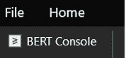
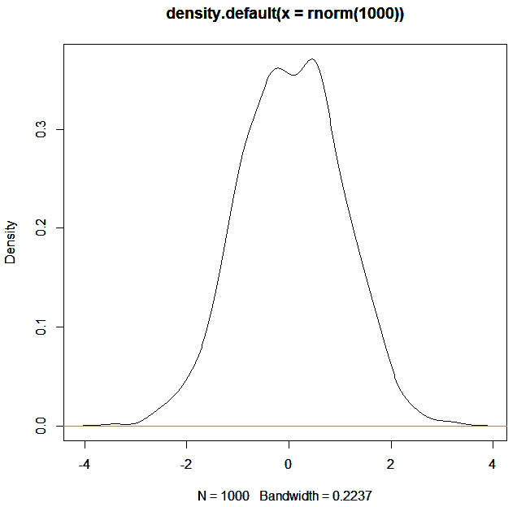
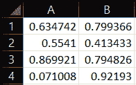
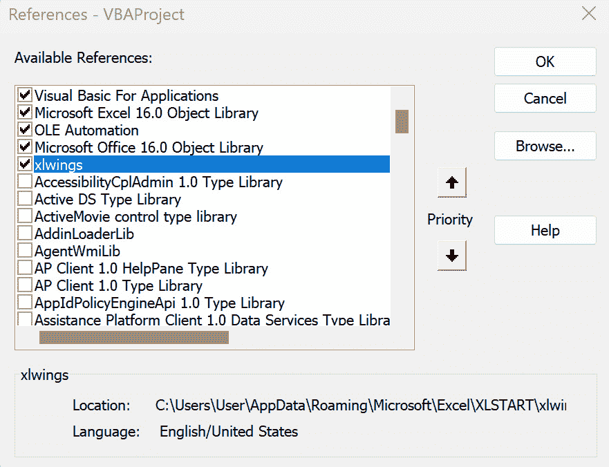
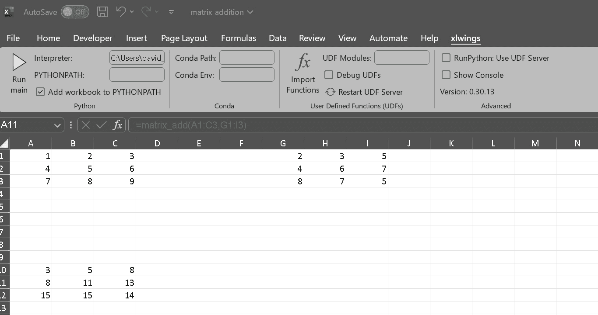
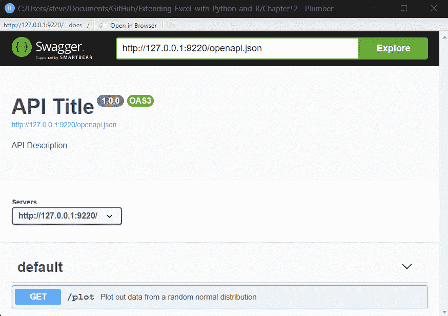
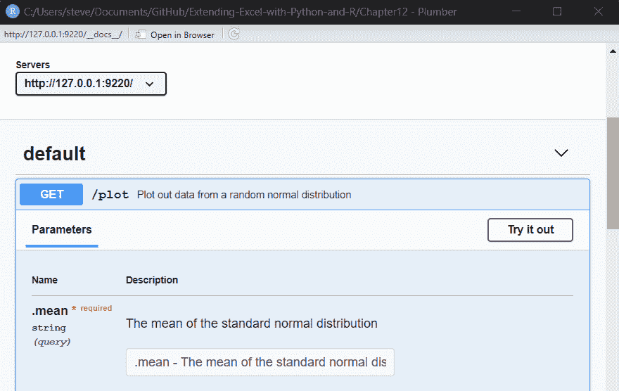
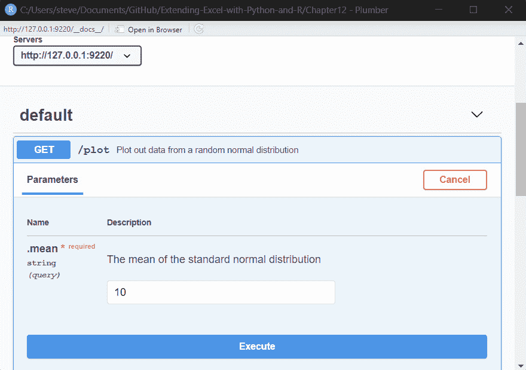
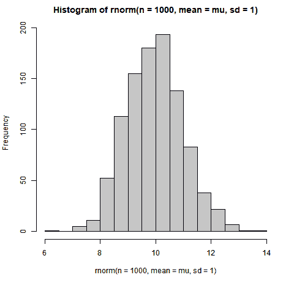

# 11

# 直接从 Excel 或通过 API 本地调用 R/Python

在本章中，我们将讨论如何在 Excel 内部调用 R 和 Python。你可能想知道为什么你想要这样做，因为 Excel 内部有许多函数可以使用，或者如果你愿意，可以使用应用程序的 VBA 部分编写。你可能想要从 Excel 调用 R 或 Python 的一个原因是为了利用这些编程语言在数据分析可视化方面的强大功能和灵活性。Excel 是一种广泛使用的电子表格应用程序，可以处理大型数据集并执行基本的计算和函数。然而，当涉及到更高级或定制的任务时，例如统计建模、机器学习、网络抓取、自然语言处理等，Excel 有一些局限性。通过从 Excel 调用 R 或 Python，你可以访问这些语言提供的丰富库和包，并使用它们以更复杂的方式操纵、转换和可视化你的数据。你还可以自动化你的工作流程并创建可重复的报告和仪表板。从 Excel 调用 R 或 Python 可以提高你的生产力和效率，以及扩展你的分析能力。

在这里，我们将有一些不同。在本章中，我们将介绍两种从 Excel 调用 R 和 Python 的（非常）不同的方法：本地调用，其中 R 或 Python 安装在同一台机器上，以及运行和使用 API 调用，其中 R 或 Python 功能作为 API 端点部署到服务器上。对于后者，我们将探讨开源工具和一些最受欢迎的商业解决方案。

# 技术要求

在本章中，你可以在以下链接找到所有代码：[`github.com/PacktPublishing/Extending-Excel-with-Python-and-R/tree/main/Chapter%2011`](https://github.com/PacktPublishing/Extending-Excel-with-Python-and-R/tree/main/Chapter%2011).

你需要安装以下外部软件：

+   BERT，可以在以下位置找到：[`bert-toolkit.com/download-bert`](http://bert-toolkit.com/download-bert)

+   Python 和 `xlwings`（参考 *设置环境* 部分）

+   R 的 `plumber`

+   Python 的 FastAPI

让我们从第一部分开始。

# 在本地从 Excel 调用 R 和 Python

在本章的第一部分，我们将学习如何使用可以直接与 R 接口的 Excel，以及 `xlwings` 从 Excel 交互 Python。我们还将快速展示如何使用 VBA 脚本从 Excel 调用 R。在本章中，我们将涵盖以下主要主题：

+   为什么你想要在本地从 Excel 调用 R/Python

+   设置环境

+   直接从 Excel 调用 R/Python

让我们开始吧！

# 为什么你想要在本地从 Excel 调用 R/Python

正如我们在开头讨论的那样，通过使用 VBA，你可以在 Excel 中进行各种分析和编程。然而，编写这些代码可能很繁琐，实施起来也困难。通过利用 `BERT` 和 `xlwings` 的力量，你可以使用现成的丰富功能集，或者在这些语言中编写自己的函数并在 Excel 中使用它们。

使用 `BERT`，你可以在 Excel 中获得 R 的力量：R 是一种功能强大的统计编程语言，具有广泛的能力。`BERT` 允许你直接在 Excel 中使用这些能力，而无需切换到单独的 R 环境。如果你已经在 Excel 中工作，并且不想离开应用程序，这将非常方便。

`BERT` 允许你编写可以在 Excel 中用作自定义函数的 R 函数。这可以用于创建 Excel 中不可用的函数，或者提高现有 Excel 函数的性能。例如，你可以使用 `BERT` 调用 R 内部构建的函数来创建布朗运动，这在 R 中编码会比在 Excel 中更容易。

对于 R，`BERT` 是什么，对于 Python，`xlwings` 就是那个。它们的益处也是相似的：在 Python 中创建你的解决方案，然后直接从 Excel 中调用它。

让我们开始设置你的环境，这样你就可以动手实践了！

# 设置环境

由于设置 `BERT` 和 `xlwings` 的环境不是一件简单的事情，我们将在接下来的小节中详细说明这个过程。

## 设置 BERT for R 的步骤

在本节中，我们将介绍在 Windows 上安装 `BERT`，以便我们可以利用 `BERT` 从 R 内部操作 Excel。我们首先必须做的是下载 `BERT` 安装程序，可以从这里获得：[`bert-toolkit.com/download-bert`](https://bert-toolkit.com/download-bert)。

下载完成后，你可以像安装任何其他程序一样安装它。安装后，你可以使用 Excel 的 **添加组件** 工作表来打开 **BERT 控制台**，如下所示：



图 11.1 – 从 Excel 的添加组件功能区打开的 BERT 控制台

一旦看到它，点击按钮，控制台就会打开，如下所示：


图 11.2 – BERT 控制台

现在，让我们转向 Python。

## 设置 xlwings for Python 的步骤

在本小节中，我们将介绍设置 `xlwings` 所需的步骤：

### 安装 Python

确保你的机器上已安装 Python。你可以从官方 Python 网站下载最新版本（[`www.python.org/downloads/`](https://www.python.org/downloads/)）。在安装过程中，你可以勾选表示 **将 Python 添加到 PATH** 的复选框，以便更容易访问。

#### 安装 Excel 插件：

按照以下简单步骤开始使用 `xlwings`：

1.  打开命令提示符并运行以下命令：

    ```py
    WARNING: The script xlwings.exe is installed in '<folder>' which is not on PATH. If you do, you will have to specify the full path to be able to call xlwings in the next step.
    ```

1.  要安装插件，请使用命令行客户端：

    ```py
    xlwings add-in will appear after the Help menu in the toolbar:
    ```


图 11.3 – Excel 中的 xlwings 在功能区

#### 配置 Excel 和 Python 环境

在 Excel 插件设置中指定 Python 解释器路径来配置 `xlwings`。然而，这通常由 `xlwings` 自动完成。

为了验证设置，运行下一节中给出的任何示例。

#### 故障排除

如果您遇到问题，请参阅 `xlwings` 的文档（[`docs.xlwings.org/en/stable/`](https://docs.xlwings.org/en/stable/)）。检查常见的故障排除技巧和解决方案。

这份逐步指南确保您本地环境的顺利设置，使 Excel 和 Python 能够无缝协同工作。遵循这些说明将为后续章节提供一个坚实的基础，让您能够利用 Excel 和 Python 的结合力量。

现在您已经设置好了，让我们来探讨如何实际使用这些工具！

# 直接从 Excel 调用 R/Python

在本节中，我们将深入探讨使用上一节中设置的工具从 Excel 调用 R 和 Python 的方法。我们将介绍几种实现方式，并提供示例，以便您可以尝试它们。

## 使用 VBA 和 BERT 执行 R

另一种从 Excel 调用 R 的好方法是使用 VBA 宏。这要求工作簿以宏启用工作簿保存。由于 BERT 是设计从 Excel 到 R 工作的，R 表达式的语法可以在 VBA 控制台中编写，并在 VBA 中使用以下方式调用：

```py
Application.Run "BERT.Exec", r
```

让我们看看一个简单的例子：

```py
Sub PlotNormalDensity()
    r = "plot(density(rnorm(1000)))"
    Application.Run "BERT.Exec", r
End Sub
```

这将最终生成一个随机正态分布密度的图表。让我们看看输出结果：



图 11.4 – 使用 BERT 从 VBA 调用 R

## 通过 BERT 与 Excel 交互

使用 BERT 通过 **Excel 脚本接口** 操作 Excel 是可能的。你可能想知道，“我为什么要做这样的事情”？好吧，记住，有了 BERT，你不仅可以访问 Excel，还可以访问 R。这意味着你可以使用 R 函数来生成数据，这些函数可能不在 Excel 中；让我们看看一个例子。这是在左侧面板中完成的。

首先，我们将定义一个范围：

```py
rng <- EXCEL$Application$get_Range( "A1:B4" )
```

这将在 R 中定义一个范围，用于单元格 `A1:B4`，并将其作为名为 `rng` 的变量放入全局环境中。这是在 BERT 的 R 接口中输入的。现在这个范围已经定义，就可以看到有多少范围命令在您的指尖，以及其中的一些：

```py
> length(ls(rng))
[1] 234
> head(ls(rng))
[1] "Activate"                        "AddComment"
                   "AddCommentThreaded"
[4] "AdvancedFilter"         "AllocateChanges"       "ApplyNames"
```

因此，我们看到有 234 个范围命令可用。通过调用 `ls(rng)`，R 控制台将打印出所有命令；这里，我们使用 `head()` 以仅显示前几个。在这里，我们将使用 `RAND()` Excel 命令将随机数放入定义的范围中：

```py
rng$put_Formula("=RAND()");
```

让我们看看 Excel 文件中的输出结果：



图 11.5 – 在 Excel 中使用 BERT 的 RAND() 函数

如果我们想保持在 BERT 内部并查看发送到 Excel 的值，我们可以执行以下操作：

```py
> rng$get_Value()
                        [,1]            [,2]
[1,] 0.63474248 0.7993663
[2,] 0.55409965 0.4134328
[3,] 0.86992109 0.7948257
[4,] 0.07100827 0.9219299
```

现在我们已经了解了如何通过 R 与 Excel 交互的一些基础知识，是时候看看我们如何在 Python 中实现类似的功能了。

# 使用 xlwings 从 Excel 调用 Python

您可以使用 `xlwings` 从 Excel 调用 Python 的三种方法：

+   标题栏 `xlwings` 选项卡下的 `Run` 按钮

+   宏：这些从 Excel 调用 Python

+   **用户自定义函数**（**UDFs**）（仅限 Windows）

让我们来看看这三种方法的优缺点，以及一个示例！

## 运行按钮

`Run` 按钮期望在具有与工作簿相同名称的 Python 模块中有一个名为 `main` 的函数。这是文档中的引用，是一个硬性前提。这种方法的主要优点是无需 VBA 和宏；您可以使用正常的 XLSX 文件，这在不允许 XLSM 文件的安全受限情况下非常有用。

要尝试 `Run` 按钮，请按照以下步骤操作：

1.  创建一个名为 `sumitup.py` 的 Python 模块，代码如下：

    ```py
    import xlwings as xw
    def main():
                wb = xw.Book.caller()
                a = wb.sheets[0]['A1'].value
                b = wb.sheets[0]['A2'].value
                wb.sheets[0]['A3'].value = a + b
                pass
    ```

1.  打开 Excel 并在单元格 A1 中输入 `2`，在单元格 A2 中输入 `3`。

1.  将 Excel 表格保存为 `sumitup.xlsx`，与 `sumitup.py` 所在的文件夹相同。

1.  在功能区 `xlwings` 菜单中点击 `Run` 按钮。

这种方法的缺点是严格的命名约定和文件放置，以及缺乏灵活性；只有 `main()` 函数将被调用，Python 代码需要编码哪些字段将被用作输入以及输出将去哪里，这意味着您不能从 Excel 端传递输入到函数。

## 宏

如果您需要更多的灵活性，并且可以使用宏（并将文件保存为 XLSM），您可以从 VBA 使用 `RunPython`。

在这个例子中，`RunPython` 将导入 `world` 模块并运行该模块中的 `helloworld()` 函数。要运行此示例，请尝试以下步骤：

1.  创建一个 `.xlsm` 文件并保存为 `world.xlsm`。

1.  打开 VBA 编辑器并尝试以下操作：

    1.  打开 `xlwings` 已被选中：



图 11.6 – 将 xlwings 引用添加到 VBA 项目中

1.  在文件中创建一个新的宏，使用 `Sub` 如下所示：

    ```py
      Sub HelloWorld()
               RunPython "import world; world.helloworld()"
    End Sub
    ```

1.  在保存 `.xlsm` 文件的同一文件夹中创建 `hello.py` 模块，内容如下：

    ```py
    import xlwings as xw
    def helloworld():
        wb = xw.Book.caller()
        wb.sheets[0]['A1'].value = 'Hello World!'
    ```

1.  现在，您可以在 `world.xlsm` 中运行宏并查看结果！

如您所见，使用宏解决了 `Run` 按钮的一个缺点，即 Python 模块（s）和函数（s）的位置和名称。然而，您仍然不能直接从 Excel 文件传递输入；输入必须在 Excel 文件中预先确定的单元格中，输出单元格（s）也必须预先确定。

注意，你可以更改模块的名称（以便不与 Excel 文件名称匹配）以及模块的位置（即，将其保存在与`.xlsm`文件不同的文件夹中）。从`xlwings`文档中，我们看到“*默认情况下，RunPython 期望 Excel 文件目录中的 world.py 与 Excel 文件具有相同的名称，但你也可以更改这两者：如果你的 Python 文件在不同的文件夹中，请将此文件夹添加到 config 中的 PYTHONPATH。如果文件具有不同的名称，请相应地更改 RunPython 命令*。”

## UDFs

用户自定义函数允许用户扩展 Excel，添加可以像`SUM()`和`IF()`一样使用的自定义函数。

如下所示，使用`xlwings`在 Python 中编写 UDF 非常简单：

```py
import xlwings as xw
import numpy as np
@xw.func
@xw.arg('x', np.array, ndim=2)
@xw.arg('y', np.array, ndim=2)
def matrix_add(x, y):
    return x + y
```

在前面的示例中，我们指定输入都是`numpy`数组实例，并定义了矩阵加法函数。

要使用`xlwings`将 Python 函数集成到 Excel 中，你需要以特定的方式设置你的 Python 源文件。默认情况下，`xlwings`期望 Python 源文件位于 Excel 文件相同的目录中，并且与 Excel 文件具有相同的名称，但使用`.py`扩展名而不是`.xlsm`。

或者，你可以通过`xlwings`功能区指定一个特定的模块。

一旦你准备好了你的 Python 源文件，你可以按照以下步骤将函数导入到 Excel 中：

1.  将 Excel 文件保存为与你的 Python 模块相同的名称，并将其保存为与 Python 模块相同的文件夹中的`.xlsm`文件。

1.  在 Excel 中，转到`xlwings`选项卡，然后单击**导入 Python UDFs**以获取对 Python 模块所做的更改。

1.  将数据输入到 Excel 表中的两个范围（确保范围的维度适合矩阵乘法）。

1.  在单元格中输入公式 `=matrix_add([range1]`, `[range2])`，其中 `[range1]` 和 `[range2]` 是你已输入数据的数据范围。

    你应该看到正确的结果显示在单元格中：



图 11.7 – 使用 xlwings 的 matrix_add 函数从 Excel 中

这种方法的优点是显而易见的：Excel 用户可以确定使用哪些输入以及输出应该去哪里，而无需实际与 Python（或你，Python 开发者）交互。

这种方法的缺点是`xlwings`及其所有类似解决方案的通用缺点；对于本地 Python（或 R）安装，所有依赖项都必须正确设置，并且必须为所有用户提供正确的版本。

请注意，UDFs 不与 Python 一起工作，Python 可以从 Microsoft Store 获取。

值得注意的是，存在替代方案，尤其是 PyXLL，它是`xlwings`的流行替代品。它提供了类似的功能和限制（包括但不限于不与从 Microsoft Store 安装的 Python 一起工作）。

在本章中，你已经学习了为什么以及如何使用工具`BERT`和`xlwings`直接从 Excel 调用 R 和 Python。

在本章的下一部分，我们将探讨另一种实现此类集成的方法，无需本地安装，同时完全控制代码及其版本（这在企业环境中可能很有用），但需要服务器环境。

# 通过 API 从 Excel 调用 R 和 Python

**API**，或**应用程序编程接口**，作为不同软件应用之间的桥梁，允许它们以标准化的方式通信和共享数据。它就像餐厅里的服务员，接受你的订单并将其传达给厨房，一旦准备好就带回食物。

在数字世界中，API 指定了软件组件应该如何交互。它定义了应用程序可以使用的方法和数据格式来请求和交换信息。API 可以用于各种目的，例如访问网络服务、数据库，甚至硬件设备。

API 的一个基本用途是允许第三方开发者将他们的应用程序与现有服务或平台集成。在你对 R 和 Python 的编码兴趣的背景下，API 可以用于数据检索，以及将你的模型暴露给其他软件，包括 Excel。

API 的美丽之处在于其多功能性。它们抽象了底层系统的复杂性，为开发者提供了一个标准化的方式来与之交互。这种抽象使得开发过程和集成过程更加直接，促进了协作和创新。

从本质上讲，API 是数字世界的隐形英雄，它促进了各种软件组件之间的无缝通信，并使得创建更强大和互联的应用程序成为可能。无论你是在处理数据、网络服务还是其他软件，理解和有效使用 API 可以显著提升你作为程序员的技能。

在本节中，我们将涵盖以下主要主题：

+   API 简介

+   将 R 和 Python 作为 API 端点公开的开源解决方案

+   从 Excel 调用 API 进行集成

# API 简介

你可以将 API 想象成一套规则，允许一个软件组件与另一个软件组件交互。一个 API 使用的快速示例就是智能手机上的天气应用连接到天气系统以获取当前的天气或天气预报。

将 API 想象成一种机制，除了是不同系统之间通信的途径之外，还可以将其视为一份合同。API 的文档将具体说明一个系统如何连接并与另一个系统进行交流，它被允许做什么，以及频率如何。

维护 API 的系统通常会充当一种客户端和服务器类型的安排。REST API 是当今最受欢迎的 API 类型之一。**REST**代表**表示状态转移**。这种类型 API 的主要优点是它无状态。无状态意味着服务器在请求之间不会保存客户端数据。发送到服务器的请求会让你想起一个 URL。一个通用的 REST API 调用可能看起来如下：

```py
 GET https://example.com/api/v1/users
```

你可以将前面的操作视为获取用户列表，你可能认为你会获取一个列表，因为这是一个`GET`请求。下面是一个通用的`POST`请求：

```py
POST https://example.com/api/v1/users
Content-Type: application/json
{
  "name": "John Doe",
  "email": "john.doe@example.com"
}
```

在这里，你已经向服务器发送了（`POST`）数据。因此，在 REST API 中，考虑从服务器发送和获取信息。

现在我们已经了解了 API 是什么以及它们的一些类型和用例，我们可以继续探讨将 R/Python 作为 API 端点暴露的开源解决方案。

# 将 R 作为 API 端点暴露的开源解决方案

我们将首先展示如何通过 plumber 包将 R 暴露为一个 API 端点。plumber 包及其相关文档可以在以下 URL 找到：[`www.rplumber.io/index.html`](https://www.rplumber.io/index.html)。

我们首先要做的是构建一个非常简单的单参数 API，以获取标准正态分布的直方图。让我们看看代码；然后我们将讨论其中发生的事情：

```py
#* Plot out data from a random normal distribution
#* @param .mean The mean of the standard normal distribution
#* @get /plot
#* @serializer png
function(.mean) {
  mu <- as.numeric(.mean)
  hist(rnorm(n = 1000, mean = mu, sd = 1))
}
```

以`#*`开头的行是注释。在 plumber API 中，这些注释是特殊的，用于文档。它们描述了 API 端点的作用，并提供了有关参数的信息。第一条注释介绍了 API 端点的目的。它指出 API 将根据随机正态分布的数据生成一个图表。行`#* @param .mean The mean of the standard normal deviation`描述了一个名为`.mean`的参数，代表标准正态分布的均值。plumber API 中的参数类似于在请求 API 时可以传递的输入。

以下`#* @get /plot`注释指定了可以通过`HTTP GET`请求访问此 API 端点，端点路径是`/plot`。用简单的话说，如果你想使用这个 API，你会请求类似[`your-api-url/plot`](http://your-api-url/plot)的东西。函数定义如下：`function(.mean)`；这里，实际的 R 函数开始。它接受一个参数，`.mean`，这是标准正态分布的均值。为了将参数传递给`rnorm()`函数本身，我们必须确保将其声明为数值数据类型。我们通过以下方式内部声明：`mu <- as.numeric(.mean)`，其中参数`.mean`被转换为数值并存储在一个名为`mu`的变量中。在将参数转换为数值后，我们可以将其传递给`rnorm()`和`hist()`以创建图表。

最后，我们到了生成和绘制数据的地方。这是通过以下代码片段完成的：`hist(rnorm(n = 1000, mean = mu, sd = 1))`：这一行生成 1000 个来自指定均值（`mu`）和标准差（`sd = 1`）的正态分布的随机数。然后，它创建这些数字的直方图。本质上，它是在生成随机数据并绘制直方图。

总结来说，当部署此 plumber API 时，它创建了一个端点（`/plot`），当使用平均值访问时，会根据正态分布的随机数据生成直方图。平均值是您在向此 API 发出请求时提供的参数。这是一个简单而强大的例子，展示了您如何使用 R 和 plumber 在网络上公开数据处理能力。

现在我们已经生成了将生成 API 的代码，让我们看一下代码运行后的输出。为此，让我们查看以下脚本：

```py
# Library Load
library(plumber)
# Set dir and file path
wd <- getwd()
sub_dir <- paste0("/Chapter 11/")
full_dir <- paste0(wd, sub_dir)
f <- "plumber_api.R"
f_path <- paste0(full_dir, f)
# Initiate root
root <- pr(f_path)
root
# Plumber router with 1 endpoint, 4 filters, and 0 sub-routers.
# Use `pr_run()` on this object to start the API.
├──[queryString]
├──[body]
├──[cookieParser]
├──[sharedSecret]
└──/plot (GET)
```

让我们逐行解释：

```py
# Library Load
library(plumber)
```

这行代码加载了`plumber`包，这是创建 plumber API 所必需的：

```py
# Set dir and file path
wd <- getwd()
sub_dir <- paste0("/Chapter 11/")
full_dir <- paste0(wd, sub_dir)
f <- "plumber_api.R"
f_path <- paste0(full_dir, f)
```

这些行设置了`plumber` API 文件的目录和文件路径。`getwd()`函数返回工作目录，即 R 当前使用当前目录。`paste0(`)函数用于连接字符串，因此`sub_dir`变量包含字符串`/Chapter11/`，而`full_dir`变量包含到`/Chapter12/`目录的路径。`f`变量包含 plumber API 文件的文件名，即`plumber_api.R`。`f_path`变量包含 plumber API 文件的完整路径，这是`full_dir`和`f`变量的组合：

```py
# Initiate root
root <- pr(f_path)
```

这一行通过使用`f_path`变量作为参数调用`pr()`函数来启动 plumber API。`pr()`函数读取 plumber API 文件并创建一个 plumber API 对象：

```py
root
```

这一行简单地返回`root`变量，它是 plumber API 对象。提供的 R 代码从名为`plumber_api.R`的文件中创建一个 plumber API。然后，可以使用 plumber API 将 R 函数公开为 Web 端点。

让我们用一个简单的类比：想象一下，你有一家餐厅，并想提供外卖服务。你可以创建一个简单的网站，让客户可以在线订购食物。该网站需要能够与你的餐厅厨房通信以放置订单。在这个类比中，plumber API 就像网站，而 R 函数就像餐厅的厨房。plumber API 允许你将 R 函数公开给外界，以便其他应用程序可以与之通信。现在让我们运行 API 并看看会发生什么；我们用以下代码这样做：`pr_run(root)`：



图 11.8 – plumber GET API

我们看到，当我们运行前面的代码时，我们得到一个屏幕，允许我们测试 API；所以，让我们这样做。

要做到这一点，我们可以点击 **GET** 按钮，因为这是一个 GET API 调用。当我们这样做时，我们会看到以下屏幕：



图 11.9 – 输入 API 参数

我们可以看到我们可以向 `.mean` 的参数输入一个参数；让我们输入 `10`。首先，点击 **Try it out** 按钮，然后您可以输入一个值；然后，您可以点击 **Execute**，如以下截图所示：



图 11.10 – 输入参数并点击执行

现在，让我们点击那个 `curl` 请求：

```py
curl -X GET "http://127.0.0.1:9220/plot?.mean=10" -H "accept: image/png"
```

接下来，我们获取请求 URL：

```py
http://127.0.0.1:9220/plot?.mean=10
```

最后但同样重要的是，我们得到了直方图：



图 11.11 – 由 API 调用生成的直方图

现在，我们已经学习了如何构建和使用 R 的 API，我们将在下一节学习如何为 Python 做同样的事情。

# 将 Python 作为 API 端点公开的开源解决方案

`FastAPI` 是一个基于 Python 3.7+ 标准 Python 类型提示的现代、快速（高性能）Web 框架，用于构建 API。它易于使用，并允许您快速创建健壮的 API。

您可以使用 `pip` 安装 FastAPI：

```py
pip install fastapi
```

以下是一个创建 `FastAPI` 端点以公开 Python 函数的简化示例：

```py
from fastapi import FastAPI, Query
app = FastAPI()
@app.get("/api/add")
def add_numbers(
    num1: int = Query(..., description="First number"),
    num2: int = Query(..., description="Second number"),
):
    result = num1 + num2
    return {"result": result}
```

在此示例中，位于 `/api/add` 端点的 `add_numbers` 函数接受两个查询参数（`num1` 和 `num2`），代表要相加的数字。使用 FastAPI 的 `Query` 函数定义这些参数，并带有可选的描述。然后计算结果，并返回包含结果的 JSON 响应。

通过这个示例，您现在可以向 `/api/add?num1=3&num2=4` 发送 `GET` 请求以获取结果。`num1` 和 `num2` 参数在 URL 的查询字符串中指定。

`FastAPI` 自动生成 OpenAPI 和 JSON Schema 文档，使用户能够方便地理解和交互您的 API。

要运行开发服务器，请在命令行中运行以下命令：

```py
uvicorn your_app_name:app --reload
```

将 `your_app_name` 替换为您的 Python 文件名，同时请注意，Python 文件名应不同于 `fastapi` 或与之前安装的模块类似。

重要提示

确保您的 API 安全，特别是如果它可以通过互联网访问。`FastAPI` 提供了处理身份验证和授权的功能。

我们已经介绍了如何为 R 和 Python 创建 API。现在是时候从 Excel 中调用我们创建的 API 了！

# 从 Excel VBA 调用 API

现在，我们将回顾代码，该代码将允许我们使用`curl`请求从由`plumber_api.R`文件生成的 API 中获取图片。为了做到这一点，您必须运行上一节中的代码：`root |> pr_run()`；这是将打开 swagger 对话框并给出`plumber`中运行的 URL 的部分。对我来说，在撰写本文时，它如下所示：`http://127.0.0.1:6855`。

在本节中，我们将特别执行 VBA 中的`curl`命令来发送`GET`请求。以下是将要运行的代码，解释将随后进行：

```py
Sub MakeCurlRequestAndInsertImage()
       ' Define the curl command
       Dim curlCommand As String
       curlCommand = "curl -X GET ""http://127.0.0.1:6855/plot?.mean=0"" -H ""accept: image/png"" -o " & Environ("TEMP") & "\temp_image.png"
       ' Run the curl command using Shell
       Shell "cmd /c " & curlCommand, vbHide
       ' Create a new worksheet or refer to an existing one (Sheet1)
       Dim ws As Worksheet
       Set ws = ActiveWorkbook.Worksheets("Sheet1")
       ' Clear previous content in Sheet1
       ws.Cells.Clear
       ' Insert the image into the worksheet
       ws.Pictures.Insert(Environ("TEMP") & "\temp_image.png").Select
End Sub
```

让我们一步步简单地分解代码：

定义`curl`命令：

```py
Dim curlCommand As String
curlCommand = "curl -X GET ""http://127.0.0.1:6855/plot?.mean=0"" -H ""accept: image/png"" -o " & Environ("TEMP") & "\temp_image.png"
```

这部分创建了一个变量（`curlCommand`），用于存储命令行指令。该命令实际上是在告诉计算机使用`curl`（一个用于发送 HTTP 请求的命令行工具）从指定的网址（`http://127.0.0.1:6855/plot?.mean=0`）获取图片。所有这些都在 VBA 编辑器中单行完成。`-H`标志指定了一个 HTTP 头，在这种情况下，告诉服务器我们接受 PNG 格式的图片。`-o`标志指定了输出文件，它被设置为将图片保存到临时文件夹中，文件名为`temp_image.png`。

使用`Shell`运行`curl`命令：

```py
Shell "cmd /c " & curlCommand, vbHide
```

这行代码使用 Windows 命令提示符（`cmd /c`）执行`curlCommand`。最后的`vbHide`意味着在执行过程中命令提示符窗口将不可见：

```py
Create or refer to a worksheet (Sheet1):
Dim ws As Worksheet
Set ws = ActiveWorkbook.Worksheets("Sheet1")
```

这部分创建了一个变量（`ws`），用于表示 Excel 中的一个工作表。它要么创建一个名为`"Sheet1"`的新工作表，要么引用活动工作簿中现有的一个。

清除`Sheet1`中的先前内容：

```py
ws.Cells.Clear
```

这行代码将指定工作表（`"Sheet1"`）中现有的任何内容清除。

将图片插入工作表：

```py
ws.Pictures.Insert(Environ("TEMP") & "\temp_image.png").Select
```

这行代码将`curl`命令下载的图片插入指定的工作表（`"Sheet1"`）。`Environ("TEMP")`指的是系统的临时文件夹。`"\temp_image.png"`是`curl`命令下载的图片文件名。

总结来说，这段 VBA 代码通过使用`curl`命令从网址下载图片，然后将该图片插入名为`Sheet1`的 Excel 工作表中。首先清除工作表，以确保没有之前的内容残留。

现在，让我们看看 VBA 脚本的输出：


图 11.12 – 由 R 从 VBA 生成的直方图

在本节中，您学习了如何通过 R 中的 plumber 包创建 API。您还学习了如何在 Excel VBA 宏内部通过 curl 请求调用此 API。

基于 API 的解决方案之美在于，Excel（以及随之而来的终端用户）无需知道 API 背后的代码是用 R 编写的。同一个宏可以调用用 Python 编写的 API，而无需任何更改！

那么，这种方法的优缺点是什么？

优点已在之前阐明：无需本地安装，无需为每个用户维护 R/Python 环境，并且对 API 背后运行的代码拥有完全控制权。如果您需要更新任何内容，从 R/Python 版本到包依赖，再到代码本身，您都可以在服务器端进行，而无需涉及最终用户。

一个普遍存在的问题是所有基于 API 的解决方案：它需要设置和维护一个服务器，这对于数据分析师和数据科学家来说通常既困难又不被允许。这意味着需要专门的 IT 资源。

对于 API 托管的开源解决方案，有一个普遍存在的问题：你在许可证费用上节省的，你需要在更多自己动手上付出代价。开源 API 解决方案期望你处理安全性（参见 FastAPI 部分末尾的注释）、与企业环境的集成（如用户管理），以及通常需要你自己完成所有事情。

最后，`plumber`和`FastAPI`的一个共同缺点是需要编写自定义代码来定义您的 API 端点和功能。在单人团队中，这除了需要的时间之外，并不是一个大问题，但在大型团队中，这往往导致一个碎片化的环境，在那里很难强制执行命名约定和标准化。

在本章的下一节中，我们将探讨一些最常用的商业解决方案，用于托管 R 和 Python API 端点，并了解它们如何解决这些问题。

## R 和 Python 的商业 API 解决方案

在本节中，我们将介绍一些最常用的商业 API 解决方案，用于 R 和 Python。

### Azure Functions（以及其他大型云服务提供商的类似解决方案）

**Azure Functions** 是由 Microsoft Azure 提供的一种无服务器计算服务。它允许您在不显式配置或管理基础设施的情况下运行由事件触发的代码。您可以使用包括 Python 和 JavaScript 在内的广泛支持的语言构建 API、响应事件和执行各种任务：

+   **用例**：非常适合构建轻量级、事件驱动的 API 或微服务。与其他 Azure 服务的集成提供了可扩展性和灵活性。

+   **优点**：无服务器基础设施意味着对 IT 参与的最小需求。

+   **缺点**：灵活性有限（例如，R/Python 版本的选项）和迁移到其他云提供商的难度。

### Posit Connect

**Posit Connect** 是一个商业解决方案，旨在将 R 和 Python 连接到 Excel。它促进了分析学和数据科学直接集成到 Excel 工作簿中，使用户能够在熟悉的 Excel 界面中利用 R 和 Python 的力量。

+   **用例**：特别适合将 Excel 作为数据分析主要工具的组织，提供了一种无缝的方式，通过高级分析增强 Excel 的功能。

+   **优点**：为 Posit 解决方案提供深度集成的生态系统，包括 RStudio、Quarto 和 Shiny Pro。

+   **缺点**：它使用 plumber 和 FastAPI/Flask，因此您需要编写自定义代码来定义您的 API，从而导致在开源 API 解决方案下讨论的缺点。仅支持 Linux 服务器，无论是在本地还是在云端。

### ownR Infinity 平台

**ownR Infinity** 是一个多功能的平台，旨在在用户友好的环境中赋予 R 和 Python 功能。通过启用创建个性化函数和模型，它们可以转化为可访问的 API，特别关注在 Excel 中的无缝集成。

+   **用例**：适用于高度依赖 R 和 Python 进行高级数据分析的组织。非常适合寻求通过统计和数据分析功能增强 Excel 功能的用户。

+   **优点**：提供了用户友好的界面，无需广泛的编程知识即可利用 R 和 Python 的功能。使 R 和 Python 的功能在各种环境中无缝集成。

+   **缺点**：仅支持 Linux 服务器，无论是在本地还是在云端。

以下是如何在 Excel 中使用 ownR API 的示例，您可以在此处下载示例工作簿：[`bitbucket.org/functionalanalytics/examples/src/master/ccy%20converter%20Excel%20demo%20button.xlsm`](https://bitbucket.org/functionalanalytics/examples/src/master/ccy%20converter%20Excel%20demo%20button.xlsm)。

以下代码示例使用托管 API：[`bitbucket.org/functionalanalytics/converter/src/master/`](https://bitbucket.org/functionalanalytics/converter/src/master/)

注意，除了纯 Python 代码（或 R 代码）之外，无需编写任何自定义代码，也无需手动添加安全性、部署和其他考虑因素，因为这些由 ownR 自动添加。

这些商业解决方案提供了高水平的集成和功能，用于连接 Python 和 R 与 Excel 和其他前端，满足分析和数据科学社区内多样化的用例和偏好。

与开源解决方案相比，商业解决方案的优点在于支持水平和在诸如开箱即用的安全性、与更广泛的企业的深度和易于集成以及出现问题时专门的客户支持等方面的指导。

缺点很明显：这些解决方案有许可费用，需要专门的预算。虽然所有这些公司都旨在以降低人工工作量并增加附加值来证明价格合理，但与预算持有者的讨论从来都不容易。

# 摘要

在本章中，您已经学习了如何从 Excel 而不是反过来调用 R 和 Python，以进一步增强最终用户的能力。我们涵盖了这样做的原因以及两种非常不同的方法：在本地调用 R 和 Python 以及通过 API 端点调用。

对于本地调用 R 和 Python，我们详细介绍了`BERT`和`xlwings`，从设置和测试环境，到创建 R 和 Python 解决方案，以及如何使用`BERT`和`xlwings`提供的各种方法从 Excel 中调用这些解决方案，例如 VBA 代码和 UDFs。

接下来，你学习了 API 端点以及使用 API 端点将 Python 和 R 连接到 Excel 的好处。我们讨论了这种设置的优缺点，然后深入探讨了两种 API 托管方式：开源工具和商业解决方案。我们介绍了两种最常用的开源设置：用于 R 的 plumber 和用于 Python 的 FastAPI。最后，我们查看了一些商业解决方案，用于托管 R 和 Python API 端点。

下一章（也是最后一章）将涵盖一个更具领域针对性的主题：在 Excel 中使用 Python 和 R 进行数据分析和可视化。

# 第五部分：使用 R 和 Python 对 Excel 数据进行数据分析与可视化 – 一个案例研究

利用 Python 和 R 的力量深入 Excel 中的数据分析与可视化世界。通过一个引人入胜的案例研究，你将发现如何利用这些多才多艺的编程语言来揭示洞察力，可视化数据，并在 Excel 中直接进行明智的决策。

本部分包含以下章节：

+   *第十二章*，*在 Excel 中使用 R 和 Python 进行数据分析和可视化 – 一个案例研究*
