# 使用 R 和 Python 在 Excel 中进行数据分析与可视化 – 案例研究

在本章的最后部分，我们将执行一个分析——**可视化**和一个简单的模型——使用 Excel 中的数据构建，并将所有这些结果放回其中。当数据量很大，或者计算本身最适合在 Excel 外部进行时，这可能很有用。

首先，我们将从导入我们的数据开始，然后通过可视化进行一些数据探索。对于本章，我们将使用名为 `ggplot2` 的 R 包中的 `diamonds` 数据集。我们将查看价格作为结果的数据，并通过钻石特性的不同方面来观察它。在完成可视化后，我们将进行一些简单的建模，以根据其特性预测钻石的价格。

在本章中，我们将涵盖以下主要主题：

+   获取可视化

+   执行一个简单的 **机器学习** （**ML**） 模型

# 技术要求

对于本章，我们将使用以下包/库：

+   `ggplot2 3.4.4`

+   `dplyr 1.1.4`

+   `healthyR 0.2.1`

+   `readxl 1.4.3`

+   `tidyverse 2.0.0`

+   `janitor 2.2.0`

+   `writexl 1.5.0`

+   `healthyR.ai 0.0.13`

# 使用 R 获取可视化

在本节中，我们将介绍如何获取数据的一些可视化。我们将创建几个可视化，并对其中结果的简短解释。为此，我们将使用基础 R 创建两个直方图，并使用 `ggplot2` 库创建几个不同的可视化。

## 获取数据

我们需要做的第一件事是加载库并获取数据。我在一个特定于这本书的目录中工作，因此我可以直接从我所写的章节中获取函数；你的路径可能不同。让我们看看到目前为止的代码：

```py
# Library Load
library(ggplot2)
library(dplyr)
library(healthyR)
library(readxl)
# Source Functions
source(paste0(getwd(),"/Chapter1/excel_sheet_reader.R"))
# Read data
file_path <- paste0(getwd(), "/Chapter12/")
df <- read_excel_sheets(
  filename = paste0(file_path, "diamonds_split.xlsx"),"),
  single_tbl = TRUE
)
```

我们在这里所做的是简单地调用几个库到我们的环境中，拉入读取工作表的函数，并读取我们的数据。我们使用 `source()` 命令将 `read_excel_sheets()` 函数加载到我们的环境中。你可能想知道本节的数据是如何创建的，这是很重要的，因为它是从 `ggplot2` 库导出的。如果你想要重新创建数据，以便前面的代码可以工作，接下来的部分也可以工作，以下是代码：

```py
# Library Load
library(tidyverse)
library(writexl)
library(janitor)
# Write File to disk
file_path <- paste0(getwd(), "/Chapter12/")
# Split data by cut and clean names of the list
df_list <- split(diamonds, diamonds$cut) |>
  clean_names()
# Write to xlsx
df_list |>
  write_xlsx(paste0(file_path, "diamonds_split.xlsx"))
```

现在我们已经了解了如何生成和读取数据，让我们开始看看一些可视化。

## 可视化数据

在本节中，我们将使用两种不同的方法来创建图表，首先使用基础 R，其次使用 `ggplot2`。考虑到这一点，让我们开始吧。

### 基础 R 可视化

我们将要做的第一件事是为`diamonds`数据集中的`price`列创建一些直方图。价格是我们将在下一节中用作模型的预测变量的结果变量。首先，我们需要创建一个将传递给直方图的断点向量。关于最优分箱策略的技巧有很多文献。基本核心是这将有助于为直方图提供适当的形状，以最好地表示数据。这是一个单独的主题，我们不会在本书中探讨，因为这个主题可以单独成为一本书。有一个名为`opt_bin()`的函数来自`healthyR`包，它可以生成一个包含传递给它的`value`列断点的 tibble。让我们看看它：

```py
breaks <- tibble(x = df$price) |>
  opt_bin(x) |>
  pull(value)
head(breaks)
[1]  326.000 1130.217 1934.435 2738.652 3542.870 4347.087
```

做这件事的目的是尝试捕捉数据中适当的信息密度。`hist()`基本函数已经以标准方法很好地完成了这一点。现在，让我们继续创建图表，并看看方法并排展示。我们将使用`par(mfrow = c(1, 2))`，这样我们就可以并排绘制它们：

```py
par(mfrow = c(1, 2))
hist(df$price, main = "Price Histogram - Default binning",
      xlab = "Price", ylab = "Frequency")
hist(df$price, breaks = breaks, main = "Price Histogram - Optimal binning",
      xlab = "Price", ylab = "Frequency")
par(mfrow = c(1, 1))
```

让我们看看它产生了什么：

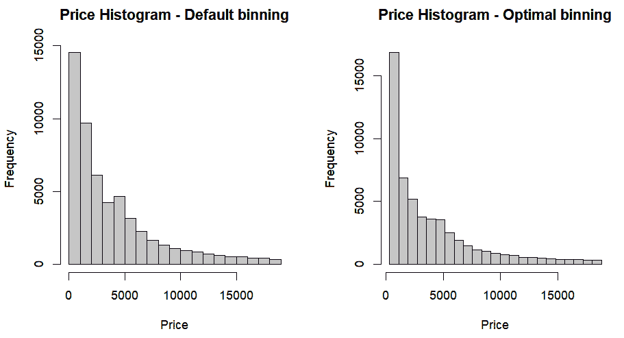

图 12.1 – 默认分箱与最优分箱的直方图比较

我们可以看到直方图的形状略有不同，但同样，这个策略可能不适合你，或者你可能有一个你经常使用的其他策略；这只是一个说明不同方法确实存在的方法。这就是使用基础 R 制作视觉效果的全部内容；我们现在将转向使用`ggplot2`。

### 使用 ggplot2 的视觉效果

现在，我们将使用`ggplot2`制作其余的视觉效果，因为我发现它的语法更容易一些，而且可以生成的图形更复杂，除了它还是`tidyverse`包的一部分，这意味着它可以与其他包（如`dplyr`）互操作。你可能还需要安装`hexbin`包。让我们开始吧：

```py
df |>
  ggplot(aes(x = carat, y = price, fill = cut)) +
  geom_hex(bins = length(breaks), alpha = 1/5) +
  facet_wrap(~ clarity, scales = "free") +
  theme_minimal() +
  labs(
     x = "Carat",
     y = "Price",
     title = "Diamonds Data",
     fill = "Cut"
  ) +
  hr_scale_color_colorblind()
```

下面是代码的分解。

对于数据和美学，是这样进行的：

+   `df |> ggplot(...)`: 这使用`df`中的数据开始可视化。

+   `aes(x = carat, y = price, fill = cut)`: 这定义了绘图的美学：

    +   `x`: x 轴代表克拉重量

    +   `y`: y 轴代表价格

    +   `fill`: 颜色填充代表钻石的切割

对于六边形几何形状，我们有以下内容：

+   `geom_hex(bins = length(breaks), alpha = 1/5)`: 这绘制了代表数据点的六边形。

+   `bins`: 这控制了六边形网格的箱数。在这里，它使用与`breaks`中定义的相同数量（在提供的代码中未显示）。

+   `alpha`: 这是六边形的透明度，设置为 1/5 以获得更好的可见性。

对于通过清晰度分面，我们有以下内容：

+   `facet_wrap(~ clarity, scales = "free")`: 这根据钻石的光度将数据分组到子图中，每个图都有独立的颜色尺度

这些是主题和标签：

+   `theme_minimal()`: 这应用了一个最小主题，以获得更清晰的视觉效果

+   `labs(..., title = "Diamonds Data")`: 这为坐标轴和标题添加了标签。

这是为色盲友好调色板编写的代码：

+   `hr_scale_color_colorblind()`: 这确保了调色板针对色盲观众进行了优化

现在，让我们检查输出。

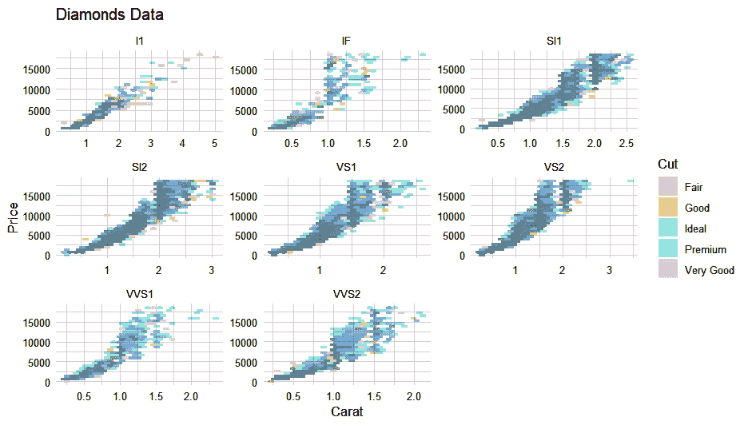

图 12.2 – 使用六边形几何的 ggplot2 钻石数据

总体而言，此代码可视化了钻石的克拉重量、价格和切割之间的关系，并考虑了具有色盲友好调色板的光度组。

下一个我们将看到的视觉是使用箱线图来检查数据的分散：

```py
df |>
  ggplot(aes(x = carat, y = price, fill = cut)) +
  geom_boxplot(alpha = 1/5, outlier.color = "lightgrey") +
  facet_wrap(~ clarity, scales = "free") +
  theme_minimal() +
  labs(
     x = "Carat",
     y = "Price",
     title = "Diamonds Data",
     fille = "Cut"
  ) +
  hr_scale_color_colorblind()
```

再次，让我们看看输出：

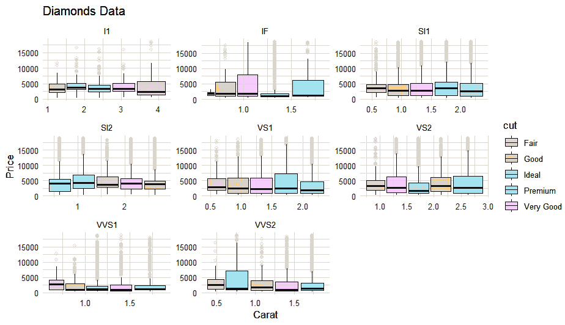

图 12.3 – ggplot2 价格分散箱线图

我们现在可以带着一个问题来看平均价格：它是否准确地显示了信息？让我们参考以下代码：

```py
df |>
  summarize(m = mean(price), .by = c(clarity, cut)) |>
  ggplot(aes(x = clarity, y = m, group = cut, color = cut)) +
  geom_point() +
  geom_line() +
  geom_smooth() +
  facet_wrap(~cut, ncol = 2) +
  labs(x= "Clarity",
         y = "Mean Price",
         title = "Mean Price by Clarity and Cut",
         color = "Cut") +
  theme_minimal() +
  hr_scale_color_colorblind()
```

此代码的输出如下：

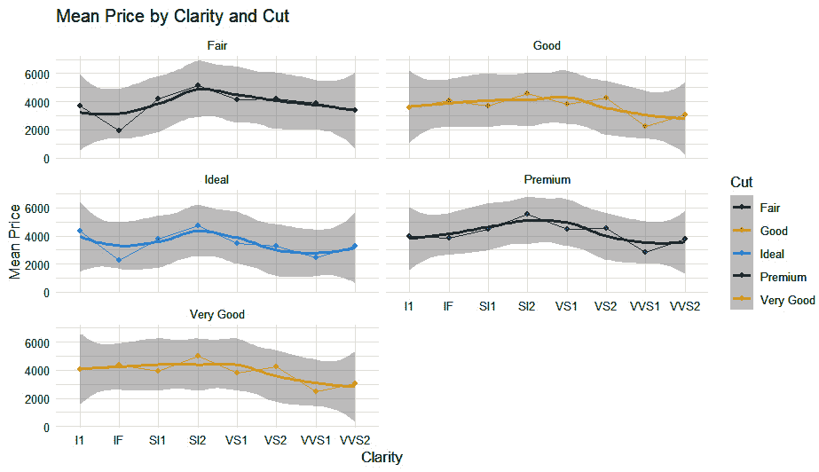

图 12.4 – ggplot2 平均价格分散

这里是平均价格的另一视角，但这次是通过查看每克拉的平均价格：

```py
df |>
  summarize(m = mean(price/carat), .by = c(cut, color, clarity)) |>
  ggplot(aes(x = color, y = m, group = clarity, color = clarity)) +
  geom_point() +
  geom_line() +
  facet_wrap(~ cut, ncol = 2, scales = "free") +
  labs(x= "Clarity",
         y = "Mean Price",
         title = "Mean Price per Carat by Clarity, Color and Cut",
         color = "Cut") +
  theme_minimal() +
  hr_scale_color_colorblind()
```

让我们看看这个故事告诉我们什么：

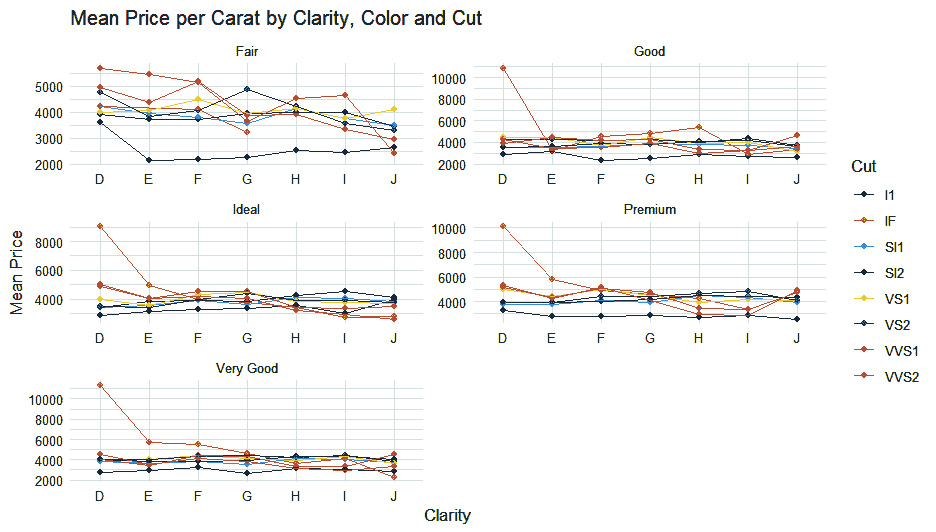

图 12.5 – ggplot 每克拉平均价格

这些是非常好的钻石 – 只要清晰度比“良好”更好，切割或颜色是否重要？看起来并不重要。

最后，我们将查看一个按切割而不是按颜色分面的价格直方图，我们将使用之前创建的`breaks`数据。请看以下代码：

```py
df |>
  ggplot(aes(x = price)) +
  geom_histogram(breaks = breaks, fill = "lightblue",
                        color = "black") +
  theme_minimal() +
  facet_wrap(~ cut, ncol = 2, scales = 'free') +
  labs(x = "Price", y = "Frequency", title = "Price Histogram by Cut")
```

让我们再看最后一眼：

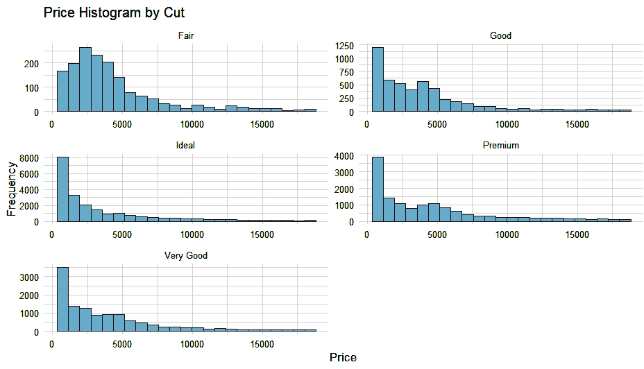

图 12.6 – 根据切割方式分面的价格直方图

现在我们已经创建了所有视觉元素，我们可以进入建模阶段。

# 使用 R 执行简单的机器学习模型

在本节中，我们将介绍如何在 R 中执行一个简单的机器学习模型。在 R 中有许多不同的方法来做这件事，我无法一一列出，然而 CRAN 已经做了这件事，这样你和我就不必做了。如果你想查看 CRAN 上机器学习的任务视图，可以点击以下链接：[`cran.r-project.org/view=MachineLearning`](https://cran.r-project.org/view=MachineLearning)。

对于本节，我们将使用由`healthyR.ai`包实现的 XGBoost 算法。算法本身并没有不同的写法，唯一的不同是输出中数据保存的方式。`healthyR.ai`包还包含 XGBoost 算法的预处理程序，以确保在建模之前输入数据与算法期望的数据匹配。我们将使用的主要函数是`hai_xgboost_data_prepper()`和`hai_auto_xgboost()`。

我们不会再次介绍加载数据，因为之前已经介绍过了。让我们开始吧！

## 数据预处理

在我们开始之前，我们将预处理我们的数据，以确保它满足算法建模的需求。这可以通过`healthyR.ai`库中的`hai_xgboost_data_prepper()`函数来实现。我们将看看数据在处理前后的样子。让我们看看以下代码和输出：

```py
# Lib Load
library(healthyR.ai)
library(dplyr)
glimpse(head(df, 2))
Rows: 2
Columns: 10
$ carat   <dbl> 0.22, 0.86
$ cut      <chr> "Fair", "Fair"
$ color   <chr> "E", "E"
$ clarity <chr> "VS2", "SI2"
$ depth   <dbl> 65.1, 55.1
$ table   <dbl> 61, 69
$ price   <dbl> 337, 2757
$ x         <dbl> 3.87, 6.45
$ y         <dbl> 3.78, 6.33
$ z         <dbl> 2.49, 3.52
```

这是处理开始之前的数据。我们看到有 10 列，我们可以在输出中清楚地看到每一列的数据类型。现在，让我们通过将数据传递给`hai_xgboost_data_prepper()`并检查那里的输出来创建一个`recipe`对象。这个函数接受两个参数：`.data`和`.recipe_formula`：

```py
# Pass data through pre-processor
rec_obj <- hai_xgboost_data_prepper(
  .data = df,
  .recipe_formula = price ~ .
)
rec_obj
── Recipe ───────────
── Inputs
Number of variables by role
outcome:   1
predictor: 9
── Operations
• Factor variables from: tidyselect::vars_select_helpers$where(is.character)
• Novel factor level assignment for: recipes::all_nominal_predictors()
• Dummy variables from: recipes::all_nominal_predictors()
• Zero variance filter on: recipes::all_predictors()
```

现在，让我们看看处理后的数据。我们可以看到以下列已经添加，并且所有数据类型现在都是`<dbl>`，这是预处理程序所要求的：

```py
# Now see the juiced output
get_juiced_data(rec_obj) |>
  head(2) |>
  glimpse()
Rows: 2
Columns: 24
$ carat            <dbl> 0.22, 0.86
$ depth            <dbl> 65.1, 55.1
$ table            <dbl> 61, 69
$ x                  <dbl> 3.87, 6.45
$ y                  <dbl> 3.78, 6.33
$ z                  <dbl> 2.49, 3.52
$ price            <dbl> 337, 2757
$ cut_Good        <dbl> 0, 0
$ cut_Ideal      <dbl> 0, 0
$ cut_Premium   <dbl> 0, 0
$ cut_Very.Good <dbl> 0, 0
$ color_E         <dbl> 1, 1
$ color_F         <dbl> 0, 0
$ color_G         <dbl> 0, 0
$ color_H         <dbl> 0, 0
$ color_I         <dbl> 0, 0
$ color_J         <dbl> 0, 0
$ clarity_IF     <dbl> 0, 0
$ clarity_SI1   <dbl> 0, 0
$ clarity_SI2   <dbl> 0, 1
$ clarity_VS1   <dbl> 0, 0
$ clarity_VS2   <dbl> 1, 0
$ clarity_VVS1  <dbl> 0, 0
$ clarity_VVS2  <dbl> 0, 0
```

现在我们已经看到了处理后的数据，让我们使用`hai_auto_xgboost()`函数进行建模。这是完整的函数调用和它的文档可以在[`www.spsanderson.com/healthyR.ai/reference/hai_auto_xgboost.html`](https://www.spsanderson.com/healthyR.ai/reference/hai_auto_xgboost.html)找到：

```py
hai_auto_xgboost(
  .data,
  .rec_obj,
  .splits_obj = NULL,
  .rsamp_obj = NULL,
  .tune = TRUE,
  .grid_size = 10,
  .num_cores = 1,
  .best_metric = "f_meas",
  .model_type = "classification"
)
```

现在，我们将创建模型并检查输出。我使用了`.num_cores = 10`、`.best_metric = "rsq"`和`.model_type = "regression"`，并且我不建议你自己运行这个，除非你有足够的时间。

现在，使用`hai_auto_xgboost()`函数进行建模：

```py
auto_xgb <- hai_auto_xgboost(
  .data = df,
  .rec_obj = rec_obj,
  .best_metric = "rsq",
  .num_cores = 10,
  .model_type = "regression"
)
```

这会产生一个相当大的对象；在我的机器上，它是 196.1 MB，其中最大部分是`$tuned_info`，占`169836312 bytes`，这主要是由于`plotly`图和 Monte Carlo 交叉验证的`tibble`，因为输入数据的大小。我们现在可以看看导出的某些对象：

```py
xgb_wflw_fit <- auto_xgb$model_info$fitted_wflw
class(xgb_wflw_fit)
[1] "workflow"
mod_spec <- xgb_wflw_fit[["fit"]][["actions"]][["model"]][["spec"]]
mod_spec
Boosted Tree Model Specification (regression)
Main Arguments:
  trees = 817
  min_n = 17
  tree_depth = 9
  learn_rate = 0.0205081386887847
  loss_reduction = 2.0421383990836e-05
  sample_size = 0.762693894910626
Computational engine: xgboost
```

我们首先做的是提取拟合的工作流对象，该对象可以用来使用通用的`predict()`函数对数据进行预测。我们知道它是一个`workflow`对象，因为我们运行了`class(xgb_wflw_fit)`。

我们最后要做的就是查看拟合模型的规格本身。这将显示在交叉验证过程中设置的参数。重要的是要记住，我没有使用种子，这意味着您可能得到不同的结果。这旨在作为一个入门，而不是对输入和输出的详尽描述，而是仅仅展示如何将 XGBoost 模型拟合到 Excel 文件中的数据，因为您不能像在 R 中那样轻松地完成这样的建模任务。

现在，我们可以进入 Python 部分，我们将对相同的数据集执行类似的流程。

# 使用 Python 获取可视化

在本节中，我们将回顾 Python 中的数据可视化，类似于前面的 R 部分。我们将使用 `plotnine` 来创建与 R 中使用 `ggplot2` 创建的可视化相似的结果，并提供结果的解释。

## 获取数据

就像前面的章节一样，我们将使用 `pandas` 加载数据。就像之前一样，XLSX 文件的路径可能与你我的不同，所以相应地调整 `filepath`：

```py
import pandas as pd
# Define the file path (may be different for you)
file_path = "./Chapter 12/diamonds.xlsx"
# Load the dataset into a pandas DataFrame
df = pd.read_excel(file_path)
# Display the first few rows of the DataFrame
print(df.head())
```

注意，我们使用原始的 `diamonds` 数据集，而没有先将其分割再重新组合，就像本章 R 部分所做的那样。

## 可视化数据

一旦我们加载数据，我们就可以使用 `plotnine` 创建可视化。在本节中，我们将演示如何可视化 `diamonds` 数据集的各个方面。

使用之前加载的数据集，我们可以先看看数据：

```py
from plotnine import ggplot, aes, geom_bin2d, facet_wrap, theme_minimal, labs, scale_fill_manual
# Define a colorblind-friendly color palette
color_palette = ["#E69F00", "#56B4E9", "#009E73", "#F0E442", "#0072B2", "#D55E00", "#CC79A7"]
# Plot using plotnine
(
    ggplot(df, aes(x='carat', y='price', fill='cut')) +
    geom_bin2d(bins=20) +  # Adjust the bins parameter as needed
    facet_wrap('~ clarity', scales='free') +
    theme_minimal() +
    labs(
        x='Carat',
        y='Price',
        title='Diamonds Data',
        fill='Cut'
    ) +
    scale_fill_manual(values=color_palette)
)
```

这段 Python 代码使用 `plotnine` 对数据进行了可视化，复制了本章开头使用的 R 代码。`ggplot()` 函数初始化绘图，`aes()` 定义美学，`geom_bin2d()` 添加几何形状，`facet_wrap()` 创建面元，`theme_minimal()` 设置主题，`labs()` 添加标签，`scale_fill_manual(values=color_palette)` 确保使用预定义的 `color_palette` 使调色板色盲友好。

生成的图像将看起来像这样：

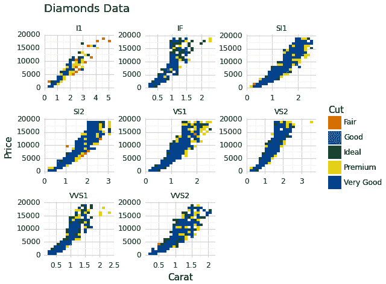

图 12.7 – diamonds 数据集的 plotnine 散点图

如您所见，该图通过使用颜色编码钻石的切割来显示克拉重量和价格之间的关系，并使用色盲友好的颜色方案。

让我们来看看数据的箱线图（我们不会再次重新导入所有的 `plotnine` 函数）：

```py
from plotnine import geom_boxplot
# Plot using plotnine
(
    ggplot(df, aes(x='carat', y='price', fill='cut')) +
    geom_boxplot(alpha=1/5, outlier_color="lightgrey") +
    facet_wrap('~ clarity', scales='free') +
    theme_minimal() +
    labs(
        x='Carat',
        y='Price',
        title='Diamonds Data',
        fill='Cut'
    ) +
    scale_fill_manual(values=color_palette)
)
```

在此代码中，`geom_boxplot()` 用于创建箱线图。`outlier_color` 参数设置为 `lightgrey` 以改变箱线图中异常值的颜色：

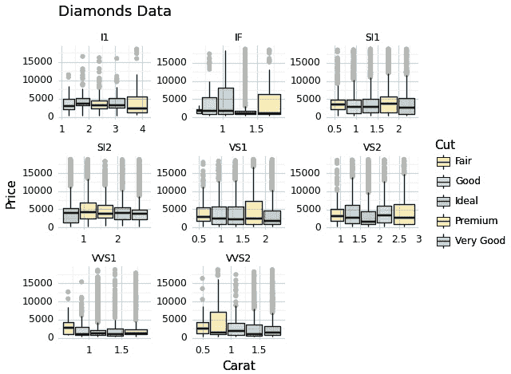

图 12.8 – diamonds 数据集的箱线图

数据可视化的核心目的是为了深入了解数据，以便更好地理解它。如果我们绘制平均价格，我们会看到我们需要看到的内容吗？

我们可以使用`pandas`中的`groupby`功能来汇总价格，计算每个组的平均值，并创建一个包含点、线和平滑线的图表，以可视化清晰度和切工的平均价格：

```py
from plotnine import geom_point, geom_line, geom_smooth, scale_color_manual
# Plot the mean price
(
    ggplot(df.groupby(['clarity', 'cut']).mean().reset_index(), aes(x='clarity', y='price', group='cut', color='cut')) +
    geom_point() +
    geom_line() +
    geom_smooth() +
    facet_wrap('~ cut', ncol=2) +
    labs(
        x='Clarity',
        y='Mean Price',
        title='Mean Price by Clarity and Cut',
        color='Cut'
    ) +
    theme_minimal() +
    scale_color_manual(values=color_palette)
)
```

让我们看看结果数据可视化：

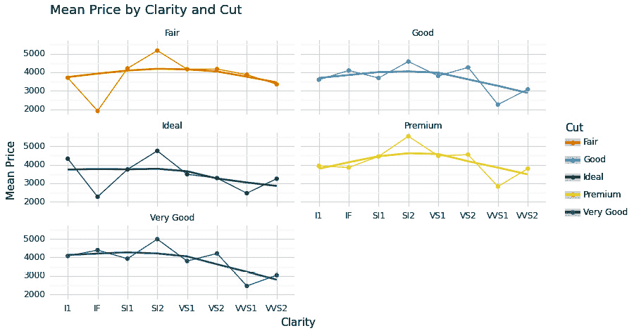

图 12.9 – 根据清晰度和切工的平均价格

对于每个切工，都会出现类似的曲线：平均价格首先随着清晰度的提高而上升，然后下降。上升和下降对于**理想**清晰度来说最不相关，而对于**优质**和**非常好**清晰度来说最相关。

我们能否通过以不同的分组绘制平均价格来获得更多见解？让我们看看每克拉的平均价格：

```py
# Calculate mean price per carat by clarity, color, and cut
df_mean = df.groupby(['cut', 'color', 'clarity']).apply(lambda x: (x['price'] / x['carat']).mean()).reset_index(name='m')
# Plot using plotnine
(
        ggplot(df_mean, aes(x='color', y='m', group='clarity', color='clarity')) +
        geom_point() +
        geom_line() +
        facet_wrap('~ cut', ncol=2, scales='free') +
        labs(
                x='Clarity',
                y='Mean Price',
                title='Mean Price per Carat by Clarity, 
                Color and Cut',
                color='Cut'
        ) +
        scale_color_manual(values=color_palette)
)
```

结果图像确实显示了一些有趣的东西：

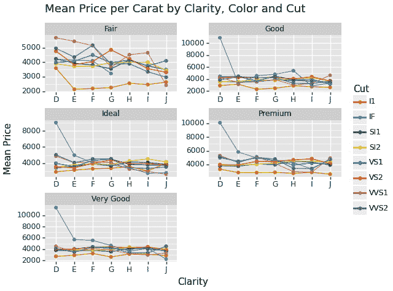

图 12.10 – 根据清晰度、颜色和切工的平均价格

对于除了**公平**以外的所有清晰度，我们看到 D 色对于 IF 切工的价格极端，但对于其他切工，价格保持相似。然而，对于**公平**清晰度，价格显示出明显的下降趋势，只有 D 色与其他颜色在 I1 切工之间存在较大的价格差异。

最后，在继续建模之前，让我们看看价格按切工的直方图：

```py
from plotnine import geom_histogram
# Create a histogram of price by Cut
(
        ggplot(df, aes(x='price')) +
        geom_histogram(fill='lightblue', color='black') +
        theme_minimal() +
        facet_wrap('~ cut', ncol=2, scales='free') +
        labs(x='Price', y='Frequency', title='Price Histogram by Cut')
)
```

我们使用默认的分组，因为不幸的是，用于 R 版本的优秀包`healthyR`目前还没有 Python 版本（可用）。

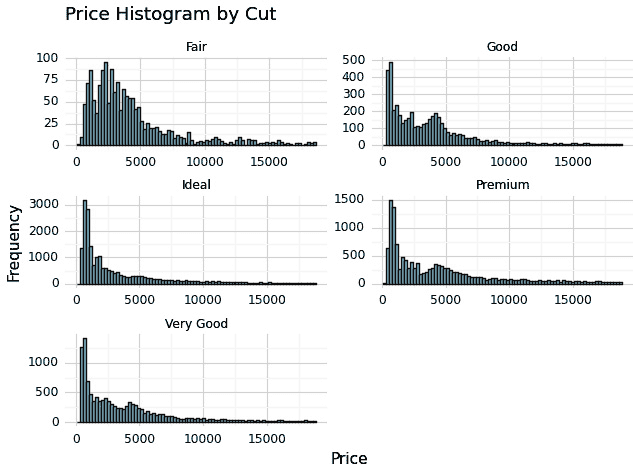

图 12.11 – 根据切工的价格直方图

我们可以看到价格有一个非常长的尾巴（也就是说，即使不常见，极高价格也是相对典型的），并且令人惊讶的是，我们还可以看到**良好**和**优质**切工的第二个高点（对于**非常好**切工来说，程度较小）。

通过可视化更好地理解了数据，我们可以开始建模！

# 使用 Python 执行简单的机器学习模型

在本节中，我们将在 Python 中创建一个简单的机器学习模型。Python 已经成长为主要用于机器学习工作的语言（R 是明显的替代品），实现机器学习算法的包的数量难以高估。话虽如此，`sklearn`仍然是使用最广泛的，因此我们也将选择它在本节中使用。与本章的 R 部分类似，我们将使用`xgboost`模型，因为它在性能和可解释性之间取得了很好的平衡。

我们将使用上一节中加载的数据。

## 数据预处理

对于建模阶段的第一步，是准备数据。幸运的是，`sklearn`内置了预处理功能！

让我们回顾一下数据预处理中涉及到的步骤：

+   `sklearn`提供了填充缺失值或删除包含缺失数据行/列的方法。

+   `sklearn`提供了用于缩放特征的实用工具，包括标准化（将特征缩放到具有零均值和单位方差）和归一化（将特征缩放到指定的范围）。

+   `sklearn`提供了一元编码分类变量或使用序数标签进行编码的方法。

+   `sklearn`提供了用于按指定比例将数据集分为训练集和测试集的函数。

+   `sklearn`支持各种特征工程技术，例如多项式特征生成、交互项创建以及使用**主成分分析**（PCA）等技术进行降维。

注意

重要的是要在不将测试数据的信息污染到训练数据中的方式下进行特征工程，就像数据清洗（如插补）一样。

我们在专门的章节中详细介绍了数据清洗，因此我们将利用`diamonds`数据集已经清洗好的事实。我们将继续进行特征缩放和分类变量的编码：

```py
from sklearn.preprocessing import StandardScaler, OneHotEncoder
from sklearn.model_selection import train_test_split
import numpy as np
# Encode categorical variables
encoder = OneHotEncoder()
df_encoded = encoder.fit_transform(df[['cut', 'color', 'clarity']])
# Scale numerical features
scaler = StandardScaler()
df_scaled = scaler.fit_transform(df[['carat', 'depth', 'table', 
    'x', 'y', 'z']])
# Concatenate encoded categorical features with scaled numerical features
df_processed = np.concatenate((df_encoded.toarray(), df_scaled),
    axis=1)
# Split data into training and testing sets
X_train, X_test, y_train, y_test = train_test_split(
    df_processed, df["price"], test_size=0.2, random_state=42)
```

此代码片段演示了如何使用独热编码对分类变量（切割、颜色和清晰度）进行编码，并使用`sklearn`中的`StandardScaler`对数值特征进行缩放。然后，它将编码的分类特征与缩放的数值特征连接起来，并使用`train_test_split()`将数据集分为训练集和测试集。

让我们比较预处理前后的数据。

原始数据集看起来如下：

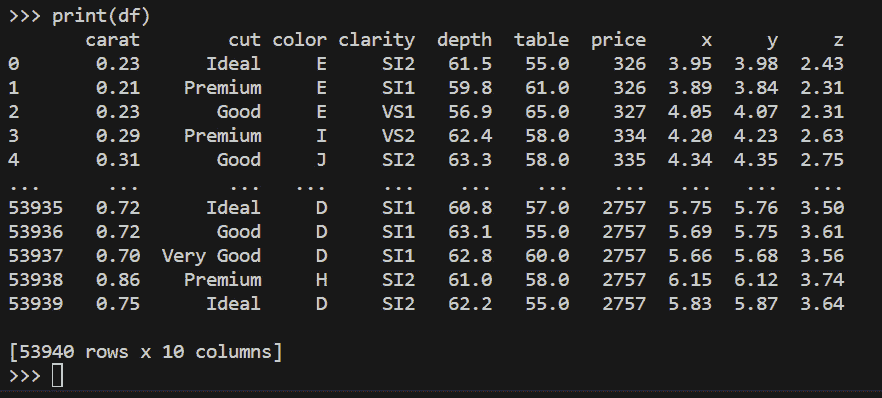

图 12.12 – 从 Excel 读取的原始数据

如您所见，数据集包含数值和分类变量（后者将使用独热编码进行编码）的混合。

预处理之后，数据集看起来如下：

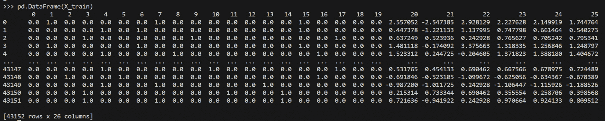

图 12.13 – 预处理后的训练数据

之前展示的预处理后的训练数据行数较少（其余部分构成测试数据），但列数更多：虽然`price`列不存在（这是我们想要预测的变量），但分类变量已被多个`0`和`1`值所替代 – 这是独热编码的结果。对于每个分类变量的每个唯一值，都会引入一个新列，如果原始数据集有该值，则该列的值为`1`，如果有其他值，则该列的值为`0`。

`y_train`变量包含训练数据中每行的`price`列的值。

使用预处理后的数据，我们可以开始建模：

```py
from sklearn.ensemble import GradientBoostingRegressor
from sklearn.metrics import mean_squared_error
# Instantiate XGBoost regressor
xgb_reg = GradientBoostingRegressor(random_state=42)
# Train the model
xgb_reg.fit(X_train, y_train)
# Predict on the test set
y_pred = xgb_reg.predict(X_test)
# Calculate RMSE
rmse = np.sqrt(mean_squared_error(y_test, y_pred))
print("Root Mean Squared Error:", rmse)
```

在此代码中，我们观察到以下内容：

1.  我们从`sklearn.ensemble`中导入`GradientBoostingRegressor`。

1.  我们从`scikit-learn`的实现中实例化了一个梯度提升回归器（`xgb_reg`）。

1.  我们使用训练数据（`X_train`和`y_train`）通过`fit`方法训练模型。

1.  我们使用`predict`方法在测试集上进行预测，并计算预测值（`y_pred`）与实际目标值（`y_test`）之间的`RMSE`。

RMSE 是回归分析中广泛使用的指标，用于衡量预测值与观察值之间误差的平均幅度。它提供了一个单一的数值来评估回归模型的拟合优度。RMSE 与目标变量（`price`）处于相同的尺度（单位）。

RMSE 的值越低，表明模型的预测值越接近实际值，这意味着性能更好。换句话说，较低的 RMSE 表示模型与真实值的平均偏差更小，这表明更高的准确性和更好的预测能力。

RMSE 特别有用，因为它考虑了误差的幅度，并且对较大误差的惩罚比对较小误差的惩罚更重。因此，最小化 RMSE 导致的模型能提供更精确和准确的预测。

总体而言，RMSE 是一个有价值的工具，用于比较不同的回归模型，并在实际应用中评估它们的预测准确性。

模型结果具有大约 `720` 的均方根误差（RMSE），这显著低于平均价格（`3933`）和 `price` 变量的标准差（`3989`）。这确实是好消息，因为它表明模型拟合相当好。

当然，您可以考虑其他机器学习模型（如随机森林、`lightgbm` 或 `catgbm`，甚至 **深度学习模型**）以及其他拟合优度指标（如 R2、MAE 等）。本节旨在作为端到端工作流程的入门指南，因此探索这些选项超出了本书的范围。

摘要

在最后一章中，我们探讨了使用 R 和 Python 以及来自 Excel 的数据执行数据分析和可视化的技术。我们首先加载并可视化了 `diamonds` 数据集以及用于数据可视化的 `ggplot2` 和 `plotnine` 库。通过箱线图、平均价格可视化和直方图等各种图表，我们了解了数据集中不同变量之间的关系。

在进行机器学习建模时，我们使用了 `healthyR` 和 `scikit-learn` 库来预处理数据，包括编码分类变量并将数据集划分为训练集和测试集。然后我们使用 XGBoost 算法实现了一个回归模型，并使用 RMSE 指标评估其性能。

通过利用 R、Python 和 Excel 的优势，用户可以增强他们的分析能力，并从他们的数据中提取有价值的见解。

感谢您与我们一同踏上通过 Excel 中的 R 和 Python 探索数据分析与可视化的激动人心的旅程。我们希望您觉得内容引人入胜，示例富有洞察力。随着您继续探索和实施从本书中获得的知识，我们希望您能在数据驱动的努力中发现新的可能性和机会。祝您分析愉快，可视化精彩！
