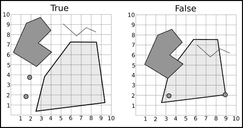

gpx_dict = xmltodict.parse(gpx_file.read())

print("Waypoint:")

print(gpx_dict['gpx']['wpt'][0].keys())

print("Geocache:")

print(gpx_dict['gpx']['wpt'][0]['geocache'].keys())

3. 现在，编辑 if __name__ == '__main__':块以测试代码：if __name__ == "__main__":

gdal.PushErrorHandler('CPLQuietErrorHandler')

read_gpx_file("../../data/geocaching.gpx")

4. 再次使用*Shift* + *F10*运行代码并查看结果：Waypoint:

[u'@lat', u'@lon', u'time', u'name', u'desc', u'src', u'url', u'urlname', u'sym', u'type', u'geocache']

Geocache:

[u'@status', u'@xmlns', u'name', u'owner', u'locale', u'state', u'country', u'type', u'container', u'difficulty', u'terrain', u'summary', u'description', u'hints', u'licence', u'logs', u'geokrety']

处理完成，退出代码为 0

通过 print(gpx_dict['gpx']['wpt'][0].keys())语句，我们获得了 gpx 的值，然后是 wpt，它是一个列表。然后，我们获得了此列表的第一个元素的键并打印了它。

接下来，通过 print(gpx_dict['gpx']['wpt'][0]['geocache'].keys())，我们获得了 geocache 的值并打印了其键。

查看输出并注意，这与我们在 PyCharm 中探索 GPX 文件结构时所做的是同一件事。现在结构作为字典可用，包括标签的属性，这些属性在字典中以@符号表示。

现在我们有了处理 GPX 文件字典的简单且方便的方法，让我们提取和展平相关信息，并使函数返回它。编辑 read_gpx_file 函数，如下所示：

def read_gpx_file(file_path):

"""读取包含寻宝点的 GPX 文件。

:param str file_path: 文件的完整路径。

"""

with open(file_path) as gpx_file:

gpx_dict = xmltodict.parse(gpx_file.read())

output = []

for wpt in gpx_dict['gpx']['wpt']:

geometry = [wpt.pop('@lat'), wpt.pop('@lon')]

# 如果 geocache 不在字典中，则跳过此 wpt。

try:

geocache = wpt.pop('geocache')

except KeyError:

continue

attributes = {'status': geocache.pop('@status')}

# 合并字典。

attributes.update(wpt)

attributes.update(geocache)

# 构建一个 GeoJSON 特征并将其追加到列表中。

feature = {

"type": "Feature",

"geometry": {

"type": "Point",

"coordinates": geometry},

"properties": attributes}

output.append(feature)

return output

注意，在这里，我们使用了字典的 pop 方法；此方法返回给定键的值并从字典中删除该键。目标是只保留具有属性（properties）的字典，这些属性可以合并成一个包含属性的单一字典；合并是通过 update 方法完成的。

当某些航点没有 geocache 键时，我们会捕获异常并跳过此点。

最后，将信息组合成一个具有 GeoJSON 结构的字典。你可以这样做：

1. 使用以下代码编辑 if __name__ == '__main__':块：if __name__ == "__main__":

gdal.PushErrorHandler('CPLQuietErrorHandler')

points = read_gpx_file("../../data/geocaching.gpx") print points[0]['properties'].keys()

2. 运行代码，你将看到以下输出：

['status', u'logs', u'locale', u'terrain', u'sym', u'geokrety', u'difficulty', u'licence', u'owner', u'urlname', u'desc', u'@xmlns', u'src', u'container', u'name', u'url', u'country', u'description', u'summary', u'state', u'time', u'hints', u'type']

Process finished with exit code 0

非常好！现在，所有地理藏点的属性都包含在特征的 *properties* 中。

**返回同质数据**

我们有一个 read_gpx_file 函数，它返回字典中的特征列表，以及一个 open_vector_file 函数，它返回 OGR 数据源。我们还有一个 get_datasource_information 函数，它返回关于文件所需的信息。

现在，是时候将这些函数结合起来，以便能够读取多种类型的数据（GPX、Shapefiles 等）。为此，我们将更改 open_vector_file 函数，使其能够根据文件格式做出决策，并转换数据，以确保始终返回相同的结构。执行以下步骤：1. 首先，确保 geo_function.py 中的函数顺序正确；如果不正确，请重新排列以符合以下顺序：

def read_gpx_file(file_path):

def get_datasource_information(datasource, print_results=False): def open_vector_file(file_path):

def create_transform(src_epsg, dst_epsg):

def transform_geometries(datasource, src_epsg, dst_epsg):

def transform_points(points, src_epsg=4326, dst_epsg=3395): 2. 现在，添加一个新函数，将 OGR 特征转换为字典，就像我们对 GPX 文件所做的那样。此函数可以插入在 open_vector_file 之前，如下所示：

def read_ogr_features(layer):

"""将图层中的 OGR 特征转换为字典。

:param layer: OGR 图层。

"""

features = []

layer_defn = layer.GetLayerDefn()

layer.ResetReading()

type = ogr.GeometryTypeToName(layer.GetGeomType())

for item in layer:

attributes = {}

for index in range(layer_defn.GetFieldCount()):

field_defn = layer_defn.GetFieldDefn(index)

key = field_defn.GetName()

value = item.GetFieldAsString(index)

attributes[key] = value

feature = {

"type": "Feature",

"geometry": {

"type": type,

"coordinates": item.GetGeometryRef().ExportToWkt()},

"properties": attributes}

features.append(feature)

return features

3. 现在，通过以下代码编辑 open_vector_file 函数：def open_vector_file(file_path):

"""打开与 OGR 兼容的矢量文件或 GPX 文件。

返回特征列表和关于文件的信息。

:param str file_path: 文件的完整路径。

"""

datasource = ogr.Open(file_path)

# 检查文件是否已打开。

if not datasource:

if not os.path.isfile(file_path):

message = "路径错误。"

else:

message = "文件格式无效。"

raise IOError('Error opening the file {}\n{}'.format(

file_path, message))

metadata = get_datasource_information(datasource)

file_name, file_extension = os.path.splitext(file_path)

# 检查是否为 GPX 文件，如果是则读取。

if file_extension in ['.gpx', '.GPX']:

features = read_gpx_file(file_path)

# 如果没有，则使用 OGR 获取特征。

else:

features = read_ogr_features(

datasource.GetLayerByIndex(0))

return features, metadata

4. 为了确保一切正常，让我们通过打开两种不同的文件类型来测试代码。编辑 if __name__ == '__main__': 块，如下所示：if __name__ == "__main__":

gdal.PushErrorHandler('CPLQuietErrorHandler')

points, metadata = open_vector_file(

"../../data/geocaching.shp")

打印 points[0]['properties'].keys()

points, metadata = open_vector_file(

"../../data/geocaching.gpx")

打印 points[0]['properties'].keys()

5. 运行代码并查看以下输出：

['src', 'dgpsid', 'vdop', 'sat', 'name', 'hdop', 'url', 'fix', 'pdop',

'sym', 'ele', 'ageofdgpsd', 'time', 'urlname', 'magvar', 'cmt', 'type',

'geoidheigh', 'desc']

['status', u'logs', u'locale', u'terrain', u'sym', u'geokrety', u'difficulty', u'licence', u'owner', u'urlname', u'desc', u'@xmlns', u'src', u'container', u'name', u'url', u'country', u'description', u'summary', u'state', u'time', u'hints', u'type']

进程以退出代码 0 完成

**将数据转换为 Geocache 对象** 到目前为止，我们已经定义了 Geocache 类；它具有纬度和经度属性以及一个返回这对坐标的方法。PointCollection 是一个包含地标的集合。

我们还有一个 open_vector_file 函数，它返回表示特征的字典列表。

现在，我们将通过利用 open_vector_file 函数实现将数据导入 PointCollection 类的过程来达到更高的抽象层次。

执行以下步骤：

1. 打开 models.py 文件，并在文件开头执行以下代码以编辑导入：

# coding=utf-8

导入 gdal

导入 os 模块

from pprint import pprint

from utils.geo_functions import open_vector_file

2. 现在，让我们让 PointCollection 在实例化时自动导入文件。

前往 models.py 文件，更改类 __init__ 方法，并添加 import_data 和 _parse_data 方法。运行此脚本：

class PointCollection(object):

def __init__(self, file_path=None):

"""此类表示一组矢量数据。”

self.data = []

self.epsg = None

if file_path:

self.import_data(file_path)

def import_data(self, file_path):

"""打开与 OGR 兼容的矢量文件并解析数据。”

:param str file_path: 文件的完整路径。

"""

features, metadata = open_vector_file(file_path)

self._parse_data(features)

self.epsg = metadata['epsg']

打印 "导入的文件: {}".format(file_path)

def _parse_data(self, features):

"""将数据转换为 Geocache 对象。”

:param features: 特征列表。

"""

for feature in features:

geom = feature['geometry']['coordinates']

attributes = feature['properties']

cache_point = Geocache(geom[0], geom[1],

attributes = attributes) self.data.append(cache_point)

3. 现在，我们只需要将 Geocache 类调整为接收和存储属性。

用以下代码替换它：

class Geocache(object):

"""此类表示单个地理藏宝点。”

def __init__(self, lat, lon, attributes=None):

self.lat = lat

self.lon = lon

self.attributes = attributes

@property

def coordinates(self):

return self.lat, self.lon

属性参数被称为**关键字参数**。关键字参数是可选的，默认值是等号后面的值。

由于目前没有对地理藏宝数据格式的标准化，我们将保留从源文件中读取的所有属性不变。

在 Python 中，你不必提前定义类实例将具有哪些属性；属性可以在代码执行期间添加。然而，在 __init__ 方法中定义它们是一个好习惯，因为它可以避免错误，例如尝试访问未定义的属性。PyCharm 可以跟踪这些属性并警告你关于拼写错误。它还充当文档。

1. 在测试代码之前，编辑 PointCollection 类并添加一个显示一些信息的方法，如下所示：

#...

def describe(self):

print("SRS EPSG 代码：{}".format(self.epsg))

print("特征数量：{}".format(len(self.data))) 2. 为了测试你的代码，通过以下代码行编辑 if __name__ == '__main__'块：

if __name__ == '__main__':

gdal.PushErrorHandler('CPLQuietErrorHandler')

**vector_data = PointCollection("../data/geocaching.gpx")** vector_data.print_information()

3. 现在，运行代码。你应该看到以下输出：导入文件：../data/geocaching.gpx

SRS EPSG 代码：4326

特征数量：112

进程以退出代码 0 结束

**合并多个数据源**

现在数据以 PointCollection 形式包含 Geocache 对象，从多个文件或多个 PointCollection 数据中合并数据应该很容易。

执行以下步骤：

1. 进行另一次测试。首先，我们将查看是否可以导入多个文件并编辑 models.py 文件的 if __name__ == '__main__'块。执行以下代码：

if __name__ == '__main__':

gdal.PushErrorHandler('CPLQuietErrorHandler')

vector_data = PointCollection("../data/geocaching.gpx") vector_data.describe()

vector_data.import_data("../data/geocaching.shp") vector_data.describe()

2. 再次运行代码。现在，在导入另一个文件后，你应该看到特征数量翻倍，如下所示：

导入文件：../data/geocaching.gpx

SRS EPSG 代码：4326

特征数量：112

导入文件：../data/geocaching.shp

SRS EPSG 代码：None

特征数量：242

进程以退出代码 0 结束

3. 让我们实现一些非常优雅的功能。我们将向 PointCollection 类添加一个魔法方法，以便我们可以合并两个实例的内容。

4. 编辑 PointCollection 类，并在 __init__ 方法之后添加 __add__ 方法

通过以下代码实现方法：

class PointCollection(object):

def __init__(self, file_path=None):

"""此类表示一组矢量数据。”

self.data = []

self.epsg = None

if file_path:

self.import_data(file_path)

def __add__(self, other):

self.data += other.data

return self

与 __init__ 方法类似，__add__ 方法是 Python 的*魔法方法*之一。

这些方法不是直接调用的；它们在特定事件发生时自动调用。__init__ 方法在类实例化时调用，__add__ 方法在使用加号（+）运算符时调用。因此，为了合并两个 PointCollection 实例的数据，我们只需要将它们相加。以下是我们需要做的：

1. 编辑 if __name__ == '__main__':块，如下所示：if __name__ == '__main__':

gdal.PushErrorHandler('CPLQuietErrorHandler')

my_data = PointCollection("../data/geocaching.gpx") my_other_data = PointCollection("../data/geocaching.shp") merged_data = my_data + my_other_data

merged_data.describe()

2. 然后，运行代码并查看结果：

导入的文件：../data/geocaching.gpx

导入的文件：../data/geocaching.shp

SRS EPSG 代码：4326

特征数量：242

处理完成，退出代码为 0

**将新功能集成到**

**应用程序**

在第二章，《Geocaching App》中，我们开发了应用程序，使其能够找到靠近你位置的点。然而，在应用程序内部，数据组织方式不同；虽然这是一种处理数据非常有效的方法，但它使我们很难理解如何对此数据进行操作。

通过抽象，我们实现了一种新的数据表示形式——这是一种非常直观且易于使用的形式。

现在，我们将修改应用程序，使其能够使用这种新的数据类型来执行其功能，并且还可以聚合结合多个数据源的新功能。

查看 GeocachingApp 和 PointCollection 类；你可能注意到它们有一些部分看起来彼此相似。这两个类都存储数据，并且有打开数据的方法。

在这一点上，经过少量修改，如果我们将一个类的方法转移到另一个类中，我们最终可以得到一个功能性的应用程序，这正是我们将要做的。然而，我们不会复制和粘贴，而是使用 Python 的类继承。我们将使用 GeocachingApp 类，使其继承 PointCollection 类的所有功能。

为了完全理解，我们将逐个方法地通过这些过程。

打开你的 geocaching_app.py 文件，现在，让我们专注于类声明和 __init__ 方法。在导入部分进行以下更改，在类中，你可以保留其他方法不变；不要删除它们：

# coding=utf-8

from pprint import pprint

导入 gdal

导入 numpy as np

导入 math

从`utils.geo_functions`导入`transform_geometries`

从`utils.geo_functions`导入`transform_points`

从`models`导入`Geocache`，`PointCollection`

class GeocachingApp(PointCollection):

def __init__(self, data_file=None, my_location=None):

"""应用程序类。

:param data_file: 一个与 OGR 兼容的文件

与地理藏点一起。

:param my_location: 您的位置坐标。

"""

super(GeocachingApp, self).__init__(file_path=data_file)

self._datasource = None

self._transformed_geoms = None

self._my_location = None

self.distances = None

# 删除包含 "if data_file…" 的代码

if my_location:

self.my_location = my_location

在类声明（`class GeocachingApp(PointCollection)`）中，我们添加了`GeocachingClass`，这告诉 Python`GeocachingApp`类应该从`PointCollection`继承方法和属性。然而，由于两个类都有一个`__init__`方法，除非我们做些什么，否则地理藏应用（Geocaching app）的`__init__`方法将完全覆盖`PointCollection`方法。

我们希望调用两个`__init__`方法，因此我们将使用`super()`函数。这告诉 Python 调用继承类的`__init__`方法。此外，由于`PointCollection`类现在处理文件导入，我们将`data_file`参数传递给它。执行以下步骤：

1. 让我们测试它并检查继承是否工作。转到`if __name__ == "__main__":`

'__main__': 文件末尾的代码块，并按以下方式编辑：if __name__ == "__main__":

gdal.PushErrorHandler('CPLQuietErrorHandler')

# 创建应用程序：

my_app = GeocachingApp()

# 现在，我们将调用`PointCollection`类的一个方法：`my_app.import_data("../data/geocaching.gpx")`

2. 实际上，当你编写代码时，你可能注意到 PyCharm 的自动完成功能现在包括继承类的方法和属性。

3. 运行代码，你应该看到以下输出：

导入的文件：../data/geocaching.gpx

进程以退出代码 0 结束

恭喜！你刚刚成功使用了类继承。这是 Python 的一个非常强大且实用的特性。

**摘要**

在本章中，挑战在于找到一种方法来组合来自多个来源的数据。

解决这个问题的方法是编写可以接受不同类型的数据并将其转换为通用类型对象的代码。

为了实现这一点，我们首先创建了两个新的 Python 类。第一个是`Geocache`类，它代表一个单独的地理藏点位置，包含其坐标、名称和描述。第二个是`PointCollection`类，它代表一组`Geocache`对象。这个类具有从所需文件中导入和转换信息的 ability。

我们使用的这种技术被称为**抽象**；其基础在于隐藏复杂的过程，使其可以通过人类易于理解的对象来实现。

最后，我们通过类继承将这一新的抽象层集成到应用程序中。GeocachingApp 类继承了 PointCollection，最终它可以同时表现出任何一种或两种行为。

在下一章中，虽然我们将提高应用程序搜索点的功能，但你还将学习其他组合类的方法。

**第四章\. 提高应用程序搜索功能**

**能力**

到目前为止，我们的应用程序能够简单地搜索接近定义位置的点。在本章中，我们将进行一次巨大的飞跃，使我们的应用程序能够通过地理边界和数据的任何字段来过滤数据。

到本章结束时，你将能够搜索位于给定城市、州、国家或任何你定义的边界内的地理藏点。此外，你还可以通过其属性（如难度级别、名称、用户等）进行搜索。还可以组合多个过滤器。

在这个过程中，我们将看到如何处理多边形以及如何在地理处理应用程序中分析几何形状之间的关系。

为了实现这些目标，我们将探讨以下主题：如何使用众所周知的文本描述多边形

使用 Shapely 包处理几何形状

导入多边形数据

导入线数据

基类和继承的使用

几何关系类型

通过多个属性进行过滤和链式方法调用

**处理多边形**

假设我们想要通过一个给定的区域来过滤我们的数据，那么这个区域可能是由一个多边形表示的。

例如，以下图像表示世界各国的边界，它是由一个 Shapefile 渲染的，其中每个特征是一个国家，其几何形状是一个多边形。

与仅有一对坐标的地理藏点不同，多边形是一系列至少有三个点的坐标，起点和终点在同一个点上。

到现在为止，你可以假设我们无法使用与地理藏点相同的结构来存储多边形的坐标。我们需要存储整个 OGR 几何形状或存储可以从中或转换到它的东西。

这些多边形是如何表示的，这是一个重要的主题，因为掌握它可以使你以任何你需要的方式操纵它们。它还允许你从点坐标（例如从 GPS）或形成矩形等形状中构建多边形。

**了解众所周知的文本**

**众所周知的文本**（**WKT**）是一种人类可读的标记语言，用于在空间应用程序中表示几何形状。它最初由**开放地理空间联盟**（**OGC**）定义，并被许多软件作为数据交换的形式所接受。WKT 有一个二进制等效物，称为**众所周知的二进制**（**WKB**）。它用于数据存储和传输，在这些情况下不需要人类可读性。

让我们通过一些示例来了解 WKT 是如何工作的。首先，我们将创建一个 OGR

下图所示的多边形几何体：

1\. 在 geopy 项目中复制您的 Chapter3 文件夹，并将其重命名为 Chapter4\。

2\. 定位 Chapter4\experiments 目录并删除其中的文件。如果您没有这个目录，请创建它。

3\. 在 Chapter4\experiments 文件夹内，创建一个新的 Python 文件。在 PyCharm 中，右键点击文件夹并选择**新建** | **Python 文件**。将此文件命名为 wkt_experiments.py。

4\. 输入以下代码：

# coding=utf-8

import ogr

wkt_rectangle = "POLYGON ((1 1, 1 9, 8 9, 8 1, 1 1))"

geometry = ogr.CreateGeometryFromWkt(wkt_rectangle)

print(geometry.__class__)

print(geometry.Area())

print(8*7)

5\. 现在运行它（ *Alt* + *Shift* + *F10* 并选择 wkt_experiments）。你应该看到以下输出：

<class 'osgeo.ogr.Geometry'>

56.0

56

进程已结束，退出代码为 0

我们在这里所做的就是在 Python 字符串中定义了多边形的 WKT 表示。请注意，它从坐标 1.1 开始，按顺时针方向列出所有坐标，最后又回到 1.1（方向不重要；也可以是逆时针）。

在下一行，我们调用了 OGR 的 CreateGeometryFromWkt 函数，该函数将字符串作为参数传递。内部，它将字符串转换为 OGR 几何对象。

为了确保接下来的三行一切顺利，我们打印了对象的类名、OGR 计算的区域以及手动计算的区域。

现在，一个更复杂的多边形，中间有一个洞或一个*岛屿*。

6\. 编辑你的代码：

# coding=utf-8

import ogr

wkt_rectangle = "POLYGON ((1 1, 1 9, 8 9, 8 1, 1 1))"

geometry = ogr.CreateGeometryFromWkt(wkt_rectangle)

print(geometry.__class__)

print(geometry.Area())

print(8*7)

wkt_rectangle2 = "POLYGON ((1 1, 8 1, 8 9, 1 9, 1 1)," \

"(4 2, 4 5, 7 5, 7 2, 4 2))"

geometry2 = ogr.CreateGeometryFromWkt(wkt_rectangle2)

print(geometry.__class__)

print(geometry2.Area())

print((8*7) - (3*3))

7\. 现在再次运行它（ *Shift* + *F10*）。你应该看到以下输出：

<class 'osgeo.ogr.Geometry'>

56.0

56

<class 'osgeo.ogr.Geometry'>

47.0

47

每个多边形环都位于括号内，由逗号分隔。外部环应该首先描述，然后是所有内部环。

当复杂性和坐标数量增加时，使用 WKT 管理几何体变得复杂。为了解决这个问题和其他问题，我们将使用另一个包，这将使事情变得容易得多。

**使用 Shapely 处理几何体**

Shapely 是一个用于平面特征分析的 Python 包。它使用 GEOS 库中的函数以及 Java 拓扑套件（**JTS**）的移植版本。

它在处理几何体时主要具有与 OGR 相同的类和函数。

虽然它不能替代 OGR，但它有一个更*Pythonic*和非常直观的接口，它优化得更好，并且拥有完善的文档。

为了使事情更清晰，Shapely 旨在分析几何体，仅限于几何体。它不处理要素的属性，也不具备读取和写入地理空间文件的能力。

为了直接比较 Shapely 和 OGR，我们将重写之前的示例：

1. 将以下行添加到 wkt_experiments.py 文件中（你可以保留或删除之前的代码，由你决定）：

from shapely.geometry import Polygon

print('使用 Shapely 的示例')

polygon1 = Polygon([(1, 1), (1, 9), (8, 9), (8, 1), (1, 1)]) print(polygon1.__class__)

打印多边形 1 的面积

polygon2 = Polygon([(1, 1), (1, 9), (8, 9), (8, 1), (1, 1)], [[(4, 2), (4, 5),(7, 5), (7, 2), (4, 2)]])

print(polygon2.__class__)

print(polygon2.area)

2. 现在再次运行代码并查看输出：

使用 Shapely 的示例

<class 'shapely.geometry.polygon.Polygon'>

56.0

<class 'shapely.geometry.polygon.Polygon'>

47.0

Process finished with exit code 0

一切都按预期工作，但你可能注意到一些差异。首先，为了创建多边形，我们传递了一个元组的列表（它可以是列表的列表），其中每个元组是一个点坐标。这个小小的变化带来了很大的不同；列表比字符串更容易操作。

其次，当我们打印由 Shapely 创建的对象的类名时，我们看到它是一个多边形类，而不是像 OGR 那样是一个几何体。这代表了一个更高的抽象级别，如第三章中解释的*结合多个数据源*。随着它而来的是抽象的所有好处和减少对内部功能的担忧。

当你输入代码时，特别是 print(polygon1.area)，PyCharm 显示给你一个列表

Polygon 类的多种方法。这是 Shapely 的另一个特性，它是一个编写良好且 IDE 友好的 Python 包。结果是，它允许你使用自动完成、代码检查、重构以及现代 IDE 带来的许多其他功能。

**导入多边形**

现在我们已经了解了如何处理多边形以及如何表示和存储它们，我们将回到我们的应用程序中，添加导入包含多边形的地形文件的功能。就像我们处理点一样，我们将抽象要素到 Python 对象中，并且我们还将使用类继承。

首先，让我们看看我们已编写的代码。在 models.py 文件中，我们有 PointCollection 类：

class PointCollection(object):

def __init__(self, file_path=None):

"""这个类表示一组矢量数据。”

self.data = []

self.epsg = None

if file_path:

self.import_data(file_path)

def __add__(self, other):

self.data += other.data

return self

def import_data(self, file_path):

"""打开与 OGR 兼容的矢量文件并解析数据。”

:param str file_path: 文件的完整路径。

"""

features, metadata = open_vector_file(file_path)

self._parse_data(features)

self.epsg = metadata['epsg']

print("File imported: {}".format(file_path))

def _parse_data(self, features):

"""将数据转换为 Geocache 对象。

:param features: 特征列表。

"""

for feature in features:

geom = feature['geometry']['coordinates']

attributes = feature['properties']

cache_point = Geocache(geom[0], geom[1],

attributes = attributes)

self.data.append(cache_point)

def describe(self):

print("SRS EPSG code: {}".format(self.epsg))

print("Number of features: {}".format(len(self.data))) 这个类代表了一组地理藏点，并负责导入这些点以及转换和存储它们。这些正是我们想要实现以导入多边形的功能。

在上一章中，你看到了如何通过继承，使一个类从其他类继承功能。我们将使用同样的技术来使用我们已有的内容来导入多边形。

由于地理藏点和多边形的处理可能有其特殊性，因此需要针对每个对象具体指定一些内容。一个具体的例子是 _parse_data 方法，目前它将特征转换为地理藏点。

因此，直接从 PointCollection 类继承来表示多边形类不是一个好主意。相反，想法是拥有两个基类，一个表示单个对象，另一个表示该对象的集合。这些基类将包含点和多边形共有的方法，然后子类将包含针对每种情况的特定方法。

我们将要导入的多边形可能是国家、边界、州或省、城市、区域等。由于目前还不清楚，让我们称它为*boundaries*。

这将在以下步骤中解释：

1. 我们将开始创建 BaseGeoObject 对象，并从 Geocache 类进行适配。打开 Chapter4 文件夹中的 models.py 文件。

2. 创建 Geocache 类的副本，包含所有方法（复制粘贴）。

3. 将第一个副本重命名为 BaseGeoObject，并更改文档字符串为类似

"Base class for single geo objects.". 你应该有这个：class BaseGeoObject(object):

"""Base class for a single geo object."""

def __init__(self, lat, lon, attributes=None):

self.lat = lat

self.lon = lon

self.attributes = attributes

@property

def coordinates(self):

return self.lat, self.lon

class Geocache(object):

"""这个类代表了一个单个的地理藏点。”

def __init__(self, lat, lon, attributes=None):

self.lat = lat

self.lon = lon

self.attributes = attributes

@property

def coordinates(self):

return self.lat, self.lon

现在尝试思考，看着这两个类，Geocache 有什么是特定的，什么不属于通用 GeoObject 或属于它，以及每种类型的地理空间对象可能有哪些属性和方法。

这种分离可能会引起一些争议，有时，根据项目的复杂性和你处理的事物的性质，可能很难达成最终

在代码的第一遍迭代中。在你的项目中，你可能需要多次回来更改类的组织方式。

现在，我将提出以下逻辑：

**纬度，经度**: 这些属性仅适用于 Geocache。正如我们所见，我们可能有其他类型的几何形状，我们希望泛化几何形状的存储方式。

**属性**: 所有对象都应该具有这个属性。

**一个 __repr__ 方法**: 这是另一个像 __init__ 和 __add__ 一样的“魔法方法”，我们在上一章中提到过。当你在对象上使用 print()函数时，会调用 __repr__。我们将添加它，并将其设置为在基类中不实现，因为每种类型的对象都应该有自己的表示。

**坐标属性**: 所有地理对象都应该有坐标，但在这里的实现方式是针对 Geocache 特定的。我们将将其改为通用形式：一个包含对象几何形状的 geom 属性。

让我们对这些类进行第一次修改。编辑你的代码如下：class BaseGeoObject(object):

"""单个地理对象的基类。”

def __init__(self, geometry, attributes=None):

self.geom = geometry

self.attributes = attributes

@property

def coordinates(self):

raise NotImplementedError

def __repr__(self):

raise NotImplementedError

class Geocache(BaseGeoObject):

"""这个类表示单个地理藏点。”

def __init__(self, geometry, attributes=None):

super(Geocache, self).__init__(geometry, attributes)

def __repr__(self):

name = self.attributes.get('name', 'Unnamed')

return "{} {} - {}".format(self.geom.x,

self.geom.y, name)

在实例化时，向类中添加了一个 geom 属性作为必需参数。在这个属性中，我们将存储 Shapely 对象。lat 和 lon 属性已被删除；它们可以直接从 Shapely 对象（geom）访问，我们将调整 PointCollection 以实现这一点。

Geocache 类的 __repr__ 方法返回一个包含点的坐标和名称属性（如果可用）或“Unnamed”的字符串。

现在添加 Boundary 类：

class Boundary(BaseGeoObject):

"""表示单个政治边界。”

def __repr__(self):

return self.name

目前，Boundary 类几乎与 BaseGeoObject 类相同，所以我们只更改 __repr__ 方法，使其只返回边界的名称。

下一步是编辑集合类。我们的 PointCollection 类几乎与新组织兼容。我们只需要对 _parse_data 方法进行一些修改，将这个类转换为基类，并创建从它继承的类：

1\. 首先，就像我们之前做的那样，复制 PointCollection 类。

2\. 现在，重命名这个类的第一次出现并更改其文档字符串：class BaseGeoCollection(object):

"""这个类代表了一个空间数据的集合。”

...

3. 前往 _parse_data 方法并修改它如下：

#...

def _parse_data(self, features):

raise NotImplementedError

我们在这里明确指出，这个方法在基类中未实现。这样做有两个原因：首先，它向程序员提供了一个提示，即当这个类被继承时需要实现这个方法；它还声明了方法的 *签名*（它应该接收的参数）。其次，如果没有实现，Python 将引发 NotImplementedError 而不是 AttributeError，这会导致更好的调试体验。

1. 在我们继续之前，编辑文件开头的导入模块以匹配以下代码：

# coding=utf-8

从 __future__ 导入 print_function

导入 gdal

从 shapely.geometry 导入 Point

从 shapely 导入 wkb 和 wkt

从 utils.geo_functions 导入 open_vector_file

2. 基类已经准备好了，现在我们将编辑 PointCollection 类。

首先，您可以从这个类中删除所有方法。只留下文档字符串和 _parse_data 方法。

3. 编辑类声明并使其继承自 BaseGeoCollection。

4. 最后，编辑 _parse_data 方法以符合 Shapely 对象表示的几何形状。您的代码应如下所示：

class PointCollection(BaseGeoCollection):

"""这个类代表了一个空间数据的集合。

地理藏宝点。

"""

def _parse_data(self, features):

"""将数据转换为 Geocache 对象。

:param features: 特征列表。

"""

for feature in features:

coords = feature['geometry']['coordinates']

point = Point(float(coords[1]), float(coords[0]))

attributes = feature['properties']

cache_point = Geocache(point, attributes = attributes)

self.data.append(cache_point)

注意，区别在于在实例化 Geocache 时，我们不再传递坐标，而是现在传递一个 Point 对象，它是 Shapely 提供的 Point 类的实例。

5. 接下来，我们将创建 BoundaryCollection 类。在任何基类之后插入此代码：

class BoundaryCollection(BaseGeoCollection):

"""这个类代表了一个空间数据的集合。

地理边界。

"""

def _parse_data(self, features):

for feature in features:

geom = feature['geometry']['coordinates']

attributes = feature['properties']

polygon = wkt.loads(geom)

boundary = Boundary(geometry=polygon,

attributes=attributes)

self.data.append(boundary)

与 PointCollection 的区别在于我们现在正在创建多边形和 Boundary 类的实例。注意多边形是如何通过语句 wkt.loads(geom) 创建的。

6. 我们几乎完成了。检查是否一切正确。完整的 models.py 文件应包含以下代码：

# coding=utf-8

从 __future__ 导入 print_function

导入 gdal

从 shapely.geometry 导入 Point

从 shapely 导入 wkb 和 wkt

从 utils.geo_functions 导入 open_vector_file

class BaseGeoObject(object):

"""Base class for a single geo object."""

def __init__(self, geometry, attributes=None):

self.geom = geometry

self.attributes = attributes

@property

def coordinates(self):

raise NotImplementedError

def __repr__(self):

raise NotImplementedError

class Geocache(BaseGeoObject):

"""This class represents a single geocaching point."""

def __init__(self, geometry, attributes=None):

super(Geocache, self).__init__(geometry, attributes)

def __repr__(self):

name = self.attributes.get('name', 'Unnamed')

return "{} {} - {}".format(self.geom.x,

self.geom.y, name)

class Boundary(BaseGeoObject):

"""Represents a single geographic boundary."""

def __repr__(self):

return self.attributes.get('name', 'Unnamed')

class BaseGeoCollection(object):

"""This class represents a collection of spatial data."""

def __init__(self, file_path=None):

self.data = []

self.epsg = None

if file_path:

self.import_data(file_path)

def __add__(self, other):

self.data += other.data

return self

def import_data(self, file_path):

"""Opens an vector file compatible with OGR and parses the data.

:param str file_path: The full path to the file.

"""

features, metadata = open_vector_file(file_path)

self._parse_data(features)

self.epsg = metadata['epsg']

print("File imported: {}".format(file_path))

def _parse_data(self, features):

raise NotImplementedError

def describe(self):

print("SRS EPSG code: {}".format(self.epsg))

print("Number of features: {}".format(len(self.data))) class PointCollection(BaseGeoCollection):

"""This class represents a collection of

geocaching points.

"""

def _parse_data(self, features):

"""Transforms the data into Geocache objects.

:param features: A list of features.

"""

for feature in features:

coords = feature['geometry']['coordinates']

point = Point(coords)

attributes = feature['properties']

cache_point = Geocache(point, attributes=attributes)

self.data.append(cache_point)

class BoundaryCollection(BaseGeoCollection):

"""This class represents a collection of

geographic boundaries.

"""

def _parse_data(self, features):

for feature in features:

geom = feature['geometry']['coordinates']

attributes = feature['properties']

polygon = wkt.loads(geom)

boundary = Boundary(geometry=polygon,

attributes=attributes)

self.data.append(boundary)

7\. Now, in order to test it, go to the end of the file and edit the if __name__ ==

'__main__': block:

if __name__ == '__main__':

world = BoundaryCollection("../data/world_borders_simple.shp") for item in world.data:

print(item)

8\. Now run it, press *Alt* + *Shift* + *F10*, and select models. If everything is OK, you should see a long list of the unnamed countries:

File imported: ../data/world_borders_simple.shp

未命名

未命名

未命名

未命名…

Process finished with exit code 0

This is disappointing. We expected to see the names of the countries, but for some reason, the program failed to get it from the attributes. We will solve this problem in the next topic.

**获取属性值**

让我们探索世界边界的属性，以了解为什么我们无法获取名称。

1. 编辑 if __name__ == '__main__'块：

if __name__ == '__main__':

world = BoundaryCollection("../data/world_borders_simple.shp") print(world.data[0].attributes.keys())

2. 运行代码并查看输出：

File imported: ../data/world_borders_simple.shp

['SUBREGION', 'POP2005', 'REGION', 'ISO3', 'ISO2', 'FIPS', 'UN',

'NAME']

Process finished with exit code 0

我们所做的是获取 world.data 中的第一个项目，然后打印其属性键。输出中显示的列表有一个 NAME 键，但它全部是大写的。这对于包含在 DBF 文件中的数据 Shapefiles 来说非常常见。

由于我们不希望担心属性名称是大写还是小写，我们有两个可能的解决方案：在导入时转换名称，或者在请求属性值时即时转换名称。

根据您的应用程序，您可能可以使用其中一种方法获得更好的性能。在这里，为了教学目的，我们将选择即时转换并给它添加一点趣味。

3. 而不是直接访问属性，让我们创建一个为我们完成这项工作的方法。

编辑 BaseGeoObject 类的 __init__ 方法，并添加一个 get_attribute 方法：

class BaseGeoObject(object):

"""Base class for a single geo object."""

def __init__(self, geometry, attributes=None):

self.geom = geometry

self.attributes = attributes

**# 创建不区分大小写的属性查找表。**

**self._attributes_lowercase = {}**

**for key in self.attributes.keys():**

**self._attributes_lowercase[key.lower()] = key**

@property

def coordinates(self):

raise NotImplementedError

def get_attribute(self, attr_name, case_sensitive=False):

"""通过名称获取属性。

:param attr_name: 属性的名称。

:param case_sensitive: True 或 False。

"""

if not case_sensitive:

attr_name = attr_name.lower()

attr_name = self._attributes_lowercase[attr_name]

return self.attributes[attr_name]

def __repr__(self):

raise NotImplementedError

在 __init__ 方法中，我们创建了一个包含小写属性名称与原始名称之间等价的字典。如果您在互联网上搜索，会发现有许多技术可以实现不区分大小写的字典。但我们在这里实现的方法允许我们保留原始名称，使用户可以选择是否希望搜索区分大小写。

4. 现在，编辑 Boundary 类以使用新方法：

class Boundary(BaseGeoObject):

"""Represents a single geographic boundary."""

def __repr__(self):

return self.get_attribute('name')

5. 编辑 if __name__ == '__main__'块：

if __name__ == '__main__':

world = BoundaryCollection("../data/world_borders_simple.shp") for item in world.data:

print(item)

6. 再次运行代码。现在，你应该有一个漂亮的国籍名称列表：导入的文件：../data/world_borders_simple.shp

安提瓜和巴布达

阿尔及利亚

阿塞拜疆

阿尔巴尼亚

亚美尼亚…

进程以退出代码 0 完成

**导入线**

正如我们在地理藏宝点和政治边界中所做的那样，我们将实现程序导入线（即线字符串）的能力。这些线可以代表道路、河流、电力线等。有了这类特性，我们将能够搜索靠近给定道路的点等。

线和线集合也将是 BaseGeoObject 和 BaseGeoCollection 的子类。让我们首先创建一个 LineString 和 LineStringCollection 类，如下所示：

1. 将这个新类插入到 models.py 文件中。它可以在基类定义之后任何位置：

class LineString(BaseGeoObject):

"""表示单个线字符串。”

def __repr__(self):

return self.get_attribute('name')

再次，我们只实现了 __repr__ 方法。其他功能是从 BaseGeoObject 类继承的。

2. 现在，添加一个表示线字符串集合的类及其 _parse_data 方法：

class LineStringCollection(BaseGeoCollection):

"""表示线字符串的集合。”

def _parse_data(self, features):

for feature in features:

geom = feature['geometry']['coordinates']

attributes = feature['properties']

line = wkt.loads(geom)

linestring = LineString(geometry=line,

attributes=attributes)

self.data.append(linestring)

为了测试我们新的类，我们将使用包含美国主要道路的 shapefile。

3. 编辑文件末尾的 if __name__ == '__main__' 块。如果你愿意，可以注释掉之前的代码而不是删除它：

if __name__ == '__main__':

usa_roads = LineStringCollection('../data/roads.shp')

for item in usa_roads.data:

print(item)

4. 运行代码。你应该会在输出控制台中看到一个包含道路名称的大列表：导入文件：../data/roads.shp

州际公路 131

州际公路 3

州际公路 3

州际公路 3

州际公路 411

州际公路 3

州际公路 3

州际公路 5，州际公路 786…

进程以退出代码 0 完成

为了使我们的输出更有意义，我们可以更改每个 LineString 类的打印方式。记住，当你在对象上使用 print() 函数时，会调用名为 __repr__ 的特殊方法，并且它应该返回一个要打印的字符串。

让我们在打印 LineString 时返回更多信息。

5. 编辑你的 LineString 类并更改 __repr__ 方法，使其返回道路名称和长度：

class LineString(BaseGeoObject):

"""表示单个线字符串。”

def __repr__(self):

length = self.geom.length

return "{} - {}".format(self.get_attribute('name'), length)

在这里，我们使用了 Python 的字符串格式化来组成一个可以由此方法返回的字符串。

6. 运行代码并查看新的输出：

导入文件：../data/roads.shp

美国公路 395-0.16619770512

美国公路 30-0.0432070790491

州际公路 84-0.0256320861143

美国公路 6-0.336460513878

美国公路 40-0.107844768871

州际公路 272-0.0264889614357…

进程结束，退出代码为 0

尽管它比以前好得多，但它仍然有一个问题。长度是以度为单位，对我们来说意义不大，因为我们习惯于以米、英里或其他线性单位来衡量。因此，在打印长度之前，我们需要转换单位。

**转换空间参考系统**

**以及单位**

幸运的是，我们之前已经执行过此类操作，现在我们将将其适应到我们的数据模型中。

我们将在需要时才转换几何形状的坐标。为了执行转换，我们将创建一个新的实用函数，如下所示：1. 在我们的 utils 文件夹中打开 geo_functions.py 并创建一个新的函数：def transform_geometry(geom, src_epsg=4326, dst_epsg=3395):

"""将单个 wkb 几何形状进行转换。"""

:param geom: WKB 几何形状.

:param src_epsg: 源几何形状的 EPSG 代码。

:param dst_epsg: 目标几何形状的 EPSG 代码.

"""

ogr_geom = ogr.CreateGeometryFromWkb(geom)

ogr_transformation = create_transform(src_epsg, dst_epsg)

ogr_geom.Transform(ogr_transformation)

return ogr_geom.ExportToWkb()

它接受 WKB 格式的几何形状、其 EPSG 代码和 EPSG

返回具有所需输出坐标系代码的 WKB 几何形状。它执行转换并返回一个 WKB 几何形状。

现在回到模型；让我们导入这个函数并使用它。

2. 在 models.py 文件的开始处编辑导入：

# coding=utf-8

from __future__ import print_function

import gdal

from shapely.geometry import Point

from shapely import wkb, wkt

from utils.geo_functions import open_vector_file

**从 utils.geo_functions 导入 transform_geometry**

3. 现在，编辑 BaseGeoObject，以便我们的类可以继承这个新功能：class BaseGeoObject(object):

"""单个地理对象的基类。"""

def __init__(self, geometry, attributes=None):

self.geom = geometry

self.attributes = attributes

**self.wm_geom = None**

# 创建一个不区分大小写的属性查找表。

self._attributes_lowercase = {}

for key in self.attributes.keys():

self._attributes_lowercase[key.lower()] = key

**def transformed_geom(self):**

**"""返回转换为 WorldMercator 坐标系统的几何形状。**

**"""**

**如果 self.wm_geom 不存在：**

**geom = transform_geometry(self.geom.wkb)**

**self.wm_geom = wkb.loads(geom)**

**return self.wm_geom**

def get_attribute(self, attr_name, case_sensitive=False):

"""通过名称获取属性。"""

:param attr_name: 属性的名称。

:param case_sensitive: True 或 False.

"""

if not case_sensitive:

attr_name = attr_name.lower()

attr_name = self._attributes_lowercase[attr_name]

return self.attributes[attr_name]

def __repr__(self):

raise NotImplementedError

注意，我们选择保留几何形状在两个坐标系中。在第一次转换时，WorldMercator 中的几何形状存储在 wm_geom 属性中。下一次调用 transformed_geom 时，它将只获取属性值。这被称为 **记忆化**，我们将在本书的后面部分看到更多关于这种技术的例子。

根据您的应用程序，这可能是一个好习惯，因为您可能希望为特定目的使用不同的坐标系。例如，为了绘制地图，您可能希望使用经纬度，而为了进行计算，您将需要以米为单位的坐标。缺点是内存消耗更高，因为您将存储两组几何形状。

4. 最后，我们回到 LineString 类，并更改其 __repr__ 方法以使用 transformed_geom 来计算长度：

class LineString(BaseGeoObject):

"""表示单个线字符串。”

def __repr__(self):

return "{}-{}".format(self.get_attribute('name'), **self.transformed_geom().length)** 5. 运行代码并查看新的输出：

导入文件：../data/roads.shp

州际公路 3-100928.690515

州际公路 411-3262.29448315

州际公路 3-331878.76971

州际公路 3-56013.8246795.73…

处理完成，退出代码为 0

现在好多了，因为我们现在可以看到以米为单位的道路长度。但仍然不完美

because, normally, we would want the lengths in kilometres or miles. So, we need to convert the unit.

在 第一章， *准备工作环境* 中，我们创建了一个美丽的函数，能够执行这些转换；我们用它来转换面积单位。以它为模板，我们将实现它以转换长度单位。

由于这是一个可以在任何应用程序的任何部分使用的函数，我们将将其放入 utils 包（即目录）中的 geo_functions.py 模块中。

1. 编辑 geo_functions.py 文件，并复制粘贴我们使用的函数

第一章， *准备工作环境*，用于计算和转换面积单位。

我们将保留它以供以后使用：

def calculate_areas(geometries, unity='km2'):

"""计算一系列 ogr 几何形状的面积。”

conversion_factor = {

'sqmi': 2589988.11,

'km2': 1000000,

'm': 1}

if unity not in conversion_factor:

raise ValueError(

"此单位未定义：{}".format(unity))

areas = []

for geom in geometries:

area = geom.Area()

areas.append(area / conversion_factor[unity])

return areas

2. 复制此函数（复制并粘贴）并编辑它，使其类似于以下代码：def convert_length_unit(value, unit='km', decimal_places=2):

"""将给定值的长度单位进行转换。

输入是以米为单位，输出由单位设定

参数.

:param value: 以米为单位的输入值。

:param unit: 所需的输出单位。

:param decimal_places: 输出的小数位数。

"""

conversion_factor = {

'mi': 0.000621371192,

'km': 0.001,

'm': 1.0}

if unit not in conversion_factor:

raise ValueError(

"此单位未定义：{}".format(unit))

return round(value * conversion_factor[unit], decimal_places) 再次，这是一个非常通用的函数，因为你可以轻松地更改其代码以向其中添加更多的转换因子。在这里，我们还引入了 round()函数，因此我们可以看到更易读的结果。默认情况下，它将结果四舍五入到两位小数，这在大多数情况下，足以很好地表示长度。

3. 返回模型并在此其他导入之后导入此新函数：

# coding=utf-8

from __future__ import print_function

import gdal

from shapely.geometry import Point

from shapely import wkb, wkt

from utils.geo_functions import open_vector_file

from utils.geo_functions import transform_geometry

**from utils.geo_functions import convert_length_unit**

4. 现在编辑 LineString 类。我们将添加一个*方便方法*（我们将在本章后面了解更多关于此的内容），该方法将返回转换后的单位长度，更改 __repr__ 值以使用它，并改进字符串格式化以显示单位并获得更好的输出：

class LineString(BaseGeoObject):

"""表示单个线字符串。”

def __repr__(self):

**unit = 'km'**

**return "{} ({}{})".format(self.get_attribute('name'),** **self.length(unit), unit)**

**def length(self, unit='km'):**

**"""这是一个方便的方法，它返回给定单位中线的长度。"""

**:param unit: 所需的输出单位。**

**"""**

**return convert_length_unit(self.transformed_geom().length,** **unit)**

5. 再次运行代码，看看我们取得了什么成果：

导入文件：../data/roads.shp

州际公路 146（10.77 公里）

美国公路 7，美国公路 20（5.81 公里）

州际公路 295（13.67 公里）

州际公路 90（3.55 公里）

州际公路 152（18.22 公里）

州际公路 73（65.19 公里）

州际公路 20（53.89 公里）

州际公路 95（10.38 公里）

...

进程以退出代码 0 结束

**几何关系**

我们希望过滤掉落在给定边界（一个国家、州、城市等）内的地理缓存点。为了执行此类过滤，我们需要验证每个点，看看它是否在表示边界的多边形内部。

在地理处理中，两个几何体之间的关系由一组已知的谓词描述。这些关系非常重要，因为它们允许建立条件，从而可以进行操作和计算。

Shapely 附带了一套完整的谓词，用于分析两个几何体之间的关系。在我们进一步开发应用程序之前，让我们看看可能的关系检查。

**接触**

如果几何体有一个或多个共同点，但它们的内部不相交，则这是正确的。

**交叉**

如果两个对象相交但没有一个包含另一个，则这是正确的。

**包含**

这表示一个对象是否完全包含另一个对象；所有边界、线条或点都必须在第一个对象内部。

**包含**

如果一个几何形状包含在另一个几何形状中，则这是真的。它与*包含*相同，但如果您交换这两个几何形状。

**等于或几乎相等**

如果两个对象具有相同的边界和内部，则这是真的。几乎相等允许在测试精度的精度中配置容差。

**相交**

这表示一个几何形状以任何方式与另一个几何形状相交。如果以下任何关系为真，则这是真的：包含、交叉、相等、接触和包含。

**不相交**

这返回 true，如果两个几何形状之间没有关系。

**按属性和关系过滤**

现在我们知道几何形状是如何相互关联的，我们可以使用这些关系来搜索点。我们已经有导入点和表示任何可能对我们感兴趣的各种边界的多边形的方法。

随书文件附带的数据包含世界国家边界的示例，但您可以自由地在互联网上搜索对您有意义的任何数据。请记住，数据坐标应以纬度和经度表示，并且它们需要有一个名称字段。

对于我们的测试，我准备了一套特殊的全球地理藏宝点，我们将通过一个国家来过滤这些点。

建议的工作流程如下：

导入点和边界

找到我们想要使用的边界

通过该边界过滤点

将点返回给用户

为了找到我们想要的点，我们将遍历数据直到找到匹配项。迭代可能会根据数据量和每个循环上执行的操作而变得昂贵。让我们记住这一点。

工作流程的第一步已经完成，所以让我们编写代码来找到我们感兴趣的边界。如果您使用提供的数据，我们可以如下找到您国家的边界：

1. 前往 BoundaryCollection 类并添加一个新的方法 get_by_name: class BoundaryCollection(BaseGeoCollection):

"""此类表示一组

地理边界。

"""

def _parse_data(self, features):

for feature in features:

geom = feature['geometry']['coordinates']

attributes = feature['properties']

polygon = wkt.loads(geom)

boundary = Boundary(geometry=polygon,

attributes=attributes)

self.data.append(boundary)

def get_by_name(self, name):

"""通过其名称属性查找对象并返回它。”

for item in self.data:

if item.get_attribute('name') == name:

return item

raise LookupError(

"未找到名为：{}".format(name)) 这种非常简单的方法遍历数据。当它找到第一个边界

其名称属性与传递给参数的名称匹配的对象，函数执行停止并返回对象。如果没有找到任何内容，将引发 LookupError。

2\. 让我们玩玩它。转到文件末尾的 if __name__ == '__main__' 块并编辑它：

if __name__ == '__main__':

world = BoundaryCollection("../data/world_borders_simple.shp") print(world.get_by_name('Brazil'))

3\. 尝试不同的国家名称并查看结果。如果找到了，你应该得到类似以下输出：

文件已导入: ../data/world_borders_simple.shp

巴西

进程结束，退出代码为 0

4\. 如果没有找到，你应该得到一个很好的异常：

Traceback (most recent call last):

文件 "Chapter 4/code/models.py"，第 153 行，在 <module> 中 print(world_Boundarys.get_by_name('Foo'))

文件 "Chapter 4/code/models.py"，第 148 行，在 get_by_name 中

'Object not found with the name: {}'.format(name))

LookupError: Object not found with the name: Foo

进程结束，退出代码为 1

非常好，我们的方法工作得很好，并且还有一个额外的（几乎）意外的特性：它不仅对边界有效；它可以用来查找任何类型的 GeoObject。看看它如何只使用我们基类中可用的属性。

5\. 将 get_by_name 方法移动到 BaseGeoCollection 类中，并再次测试你的代码。记住，类内部方法的顺序对类的行为是无关紧要的，但最佳实践建议你首先放置魔法方法，然后是私有方法，最后是其他方法。你的完整 BaseGeoCollection 类应该如下所示：

class BaseGeoCollection(object):

"""此类表示空间数据集合。”

def __init__(self, file_path=None):

self.data = []

self.epsg = None

if file_path:

self.import_data(file_path)

def __add__(self, other):

self.data += other.data

return self

def _parse_data(self, features):

raise NotImplementedError

def import_data(self, file_path):

"""打开与 OGR 兼容的矢量文件并解析数据。”

:param str file_path: 文件的完整路径。

"""

features, metadata = open_vector_file(file_path)

self._parse_data(features)

self.epsg = metadata['epsg']

print("File imported: {}".format(file_path))

def describe(self):

print("SRS EPSG code: {}".format(self.epsg))

print("Number of features: {}".format(len(self.data))) def get_by_name(self, name):

"""通过名称属性查找对象并返回它。”

for item in self.data:

if item.get_attribute('name') == name:

return item

raise LookupError(

"Object not found with the name: {}".format(name)) 现在，在下一步中，我们将搜索位于我们找到的边界内的点。这次，我们将在 BaseGeoCollection 类中直接创建一个方法，这样它就通过继承对 PointCollection 和 BoundaryCollection 类可用。通过这样做，我们将获得一个额外功能——我们能够通过另一个边界来过滤边界。

6. 前往 BaseGeoCollection 类并添加 filter_by_boundary 方法：

#...

def filter_by_boundary(self, boundary):

"""通过给定边界过滤数据"""

result = []

for item in self.data:

if item.geom.within(boundary.geom):

result.append(item)

return result

在这里，我们创建了一个名为 result 的变量，它包含一个列表来存储通过测试的对象。使用 within 谓词来测试每个项目是否在作为参数传递的边界内。在这种情况下，如果没有找到任何内容，则不会引发异常，并返回一个空列表。

7. 编辑 if __name__ == '__main__':块中的测试代码：if __name__ == '__main__':

gdal.PushErrorHandler('CPLQuietErrorHandler')

world = BoundaryCollection("../data/world_borders_simple.shp") geocaching_points = PointCollection("../data/geocaching.gpx") usa_boundary = world.get_by_name('United States')

result = geocaching_points.filter_by_boundary(usa_boundary) for item in result:

print(item)

在测试过程中，创建了两个实例，一个来自 BoundaryCollection 类，另一个来自 PointCollection 类。数据文件作为参数传递。然后找到感兴趣的国家的信息，并存储在 usa_boundary 变量中。然后，将此变量传递给 filter_by_boundary 方法。

8. 运行代码。你应该会看到一个长长的 geocache 列表，如下所示：

-78.90175 42.89648 - LaSalle Park No 1

-78.89818 42.89293 - LaSalle Park No 2

-78.47808 43.02617 - A Unique Walk in Akron

-78.93865 42.95982 - A view of Strawberry Island

-78.90007 42.7484 - A View to a Windmill

-79.07533 43.08133 - A Virtual Made in the Mist

-74.43207 43.86942 - Adirondack Museum Guestbook…

Process finished with exit code 0

如预期的那样，它打印了一个 Geocache 对象的列表，其表示由 __repr__ 方法给出，即它们的坐标和名称。

**通过多个属性过滤**

下一步是通过它们的属性搜索 geocaching 点。例如，我们可能想要通过 geocache 的作者、找到 geocache 的难度等级等来过滤点。

我们将借鉴那些允许我们通过 GeoObject 的名称属性获取 GeoObject 和通过多边形过滤的方法所使用的技巧。这里的区别是我们必须允许我们想要过滤的属性作为参数传递，并且我们希望有组合多个字段的能力。

1. 让我们从在 BaseGeoCollection 类中添加一个简单的过滤方法开始：

#...

def filter(self, attribute, value):

"""通过属性过滤集合。

:param attribute: 要过滤的属性名称。

:param value: 过滤值。

"""

result = []

for item in self.data:

if item.get_attribute(attribute) == value:

result.append(item)

return result

此方法接受两个参数：我们想要过滤的属性名称以及该属性需要具有的值以通过过滤。与 get_by_name 不同，此过滤函数将找到的每个对象累积到一个列表中，并返回此列表。

2. 要测试过滤方法，编辑 if __name__ == '__main__':块。我们将过滤难度级别为 1 的地理藏点：

if __name__ == '__main__':

gdal.PushErrorHandler('CPLQuietErrorHandler')

points = PointCollection("../data/geocaching.gpx") result = points.filter('difficulty', '1')

points.describe()

print("找到 {} 个点".format(len(result)))

3. 运行代码。你应该得到以下输出：

导入的文件：../data/geocaching.gpx

SRS EPSG 代码：4326

特征数量：112

找到 38 个点

处理完成，退出代码为 0

在总共 112 个点中，有 38 个符合我们的标准。

**链式过滤**

这一部分值得单独说明，因为我们将要使用一个非常实用的 Python 技术，你很可能不止一次需要它来解决你的地理处理挑战。

到目前为止，我们可以应用单个过滤器，它将返回一个对象列表。如果我们想应用多个过滤器，我们可以简单地让过滤器函数返回另一个包含结果的集合对象，而不是返回一个列表。这样，我们可以使从一次过滤的结果中再次过滤成为可能，从而缩小结果范围。

除了出奇地简单外，这个解决方案在处理效率方面也非常高，因为在每次过滤过程中，结果都会更小，迭代次数也会减少。

Python 允许函数调用链式操作。这意味着我们不需要将每个步骤存储到变量中。我们可以简单地以非常优雅和直观的模式将每个调用依次放置，如下所示：

my_points = points.filter('difficulty', '1').filter('status', 'Available') 注意这是一个“与”条件。它将返回同时满足两个过滤条件的点。但由于我们在 BaseGeoCollection 类中实现了 __add__ 方法，我们可以轻松地实现“或”类型的过滤：

my_points = points.filter('difficulty', '1') + points.filter('difficulty',

'2')

1. 让我们的方法返回一个新的实例以使这成为可能。编辑 BaseGeoCollection 类的 filter 方法：

#...

def filter(self, attribute, value):

"""通过属性过滤集合。

:param attribute: 要过滤的属性名称。

:param value: 过滤值。

"""

result = self.__class__()

for item in self.data:

if getattr(item, attribute) == value:

result.data.append(item)

return result

现在，结果是一个与调用该方法的原实例相同的类的实例，因为 __class__ 是一个包含创建实例的类的属性。由于我们正在使用继承，这确保了结果与数据类型相同。尽管这是一个非常简单的解决方案，但它非常有效。让我们试试：

2. 编辑 if __name__ == '__main__':块，以便我们可以过滤出符合两个条件（且条件）的点：

if __name__ == '__main__':

gdal.PushErrorHandler('CPLQuietErrorHandler') points = PointCollection("../data/geocaching.gpx") result = points.filter('difficulty', '1').filter('container',

'Virtual')

points.describe()

result.describe()

3. 运行以下代码：

导入的文件：../data/geocaching.gpx

SRS EPSG 代码：4326

特征数量：112

SRS EPSG 代码：None

特征数量：34

Process finished with exit code 0

从上一个测试中，我们知道有 38 个难度为 1 的点，现在我们有 34 个

points 因为那些 38 个点，其中四个没有容器 = 虚拟。

4. 这次尝试使用或条件再进行另一个测试：

if __name__ == '__main__':

gdal.PushErrorHandler('CPLQuietErrorHandler')

points = PointCollection("../data/geocaching.gpx") result = points.filter('difficulty', '1') + points.filter(

'difficulty', '2')

points.describe()

result.describe()

5. 运行以下代码：

导入的文件：../data/geocaching.gpx

SRS EPSG 代码：4326

特征数量：112

SRS EPSG 代码：None

特征数量：50

Process finished with exit code 0

这次，这些难度为 1 的 38 个点与另外 12 个难度为 2 的点合并。

**集成到应用程序中**

随着我们继续使用更高层次的抽象级别工作，想想我们的应用程序组织。我们有两种类型的数据，并且有一个具有高级功能的 GeocachingApp 类。在这个阶段，我们想要的是使应用程序能够以我们在测试中做的方式过滤，但要以简单直接的方式进行。

看看应用程序现在的样子：

class GeocachingApp(PointCollection):

def __init__(self, data_file=None, my_location=None):

"""应用程序类。

:param data_file: 一个与 OGR 兼容的文件

with geocaching points.

:param my_location: 您的位置坐标。

"""

super(GeocachingApp, self).__init__(file_path=data_file)

self._datasource = None

self._transformed_geoms = None

self._my_location = None

self.distances = None

if my_location:

self.my_location = my_location

@property

def my_location(self):

return self._my_location

@my_location.setter

def my_location(self, coordinates):

self._my_location = transform_points([coordinates])[0]

def calculate_distances(self):

"""计算两点之间的距离。

一组点和给定位置。

:return: 按相同顺序返回距离列表

这些点。

"""

xa = self.my_location[0]

ya = self.my_location[1]

points = self._transformed_geoms

distances = []

for geom in points:

point_distance = math.sqrt(

(geom.GetX() - xa)**2 + (geom.GetY() - ya))

distances.append(point_distance)

return distances

def find_closest_point(self):

"""找到给定位置最近的点。

返回该点上的缓存。

:return: 包含点的 OGR 要素。

"""

# 第一部分。

distances = self.calculate_distances()

index = np.argmin(distances)

# 第二部分。

layer = self._datasource.GetLayerByIndex(0)

feature = layer.GetFeature(index)

打印 "最近点在：{}m".format(distances[index]) return feature

使用继承来给应用程序提供 PointCollection 类中包含的功能。但这个模式将不再适用，因为我们现在有两种类型的数据。我们必须移除继承并采取不同的方法。

我们将要做的就是存储集合类（PointCollection 和 BoundaryCollection）的实例，并实现将它们联系起来的方法，就像在链式过滤器主题的测试中做的那样。

让我们从导入和类的定义开始：

1. 打开 geocaching_app.py 文件，并编辑文件开头的导入部分，以包含新的类：

# 编码格式：utf-8

导入 gdal

导入 numpy as np

导入 math

从 utils.geo_functions 导入 transform_points

从 models 导入 PointCollection, BoundaryCollection

2. 现在，编辑 GeocachingApp 类定义和 __init__ 方法，如下所示：

class GeocachingApp(object):

def __init__(self,

geocaching_file=None,

boundary_file=None,

my_location=None):

"""应用程序类。

:param geocaching_file: 一个 OGR 兼容的文件

与地理藏宝点。

:param boundary_file: 一个包含边界的文件。

:param my_location: 你的位置坐标。

"""

self.geocaching_data = PointCollection(geocaching_file)

self.boundaries = BoundaryCollection(boundary_file)

self._my_location = None

如果 my_location:

self.my_location = my_location

继承已被移除，现在数据存储在 geocaching_data 和

boundaries 属性。如果用户将包含地理藏宝数据或边界数据的文件传递给 GeocachingApp 类，这些相同的文件将作为参数传递给 PointCollection 和 BoundaryCollection 的创建。

使用你现在拥有的，你已经开始做任何类型的过滤了。你只需要访问 geocaching_data 和 boundaries，并做我们之前所做的那样。让我们试试。

3. 前往文件末尾的 if __name__ == "__main__": 行，并编辑代码：

如果 __name__ == "__main__":

my_app = GeocachingApp("../data/geocaching.gpx",

"../data/world_borders_simple.shp")

usa_boundary = my_app.boundaries.get_by_name('United States') result = my_app.geocaching_data.filter_by_boundary(

usa_boundary)

打印(result)

4. 现在运行它。记住，每次你想运行不同的文件时，你需要按 *Alt* + *Shift* + *F10* 并在弹出窗口中选择文件。你应该再次看到包含地理藏宝点的列表输出。

但让我们假设存在一种需要多次使用的过滤功能，或者，也许有一种你希望明确的过滤功能。

按照相同的示例，假设我们正在按国家名称进行过滤。

我们可以使用 GeocachingApp 类，这是我们代码中抽象层次最高的一层，来实现这个或任何其他高级过滤方法。

5. 将此方法添加到 GeocachingApp 类：

#...

def filter_by_country(self, name):

"""通过给定的名称筛选国家。

:param name: 边界的名称（例如，县名）

:return: PointCollection

"""

boundary = self.boundaries.get_by_name(name)

return self.geocaching_data.filter_by_boundary(boundary)

在计算机编程中，这也被称为**便利方法**。它是为了方便解决更复杂的问题或避免样板代码（即避免代码重复）而创建的方法。

**总结**

在本章中，我们看到了几何形状之间不同类型的关系可以被测试，并且这些测试可以在程序中用来解决问题。

为了通过多边形进行筛选，我们首先使用与点相同的代码将这些多边形导入系统，但这次我们使用了 Shapely 来抽象多边形和点的几何形状。最后，我们使用几何关系来搜索多边形内的点。

然后，我们实现了一种通过名称属性筛选数据的方法，并使其能够通过对象的任何属性或任何属性组合进行筛选。

最后，我们将应用程序类适配到新的更改，并看到我们可以在其中添加便利方法以简化一些任务。

在下一章，我们将开始着手制作地图制作应用程序，并创建可视化我们数据的方法。

**第五章：制作地图**

在本章中，我们将启动一个新的应用程序，并使用它从矢量数据生成漂亮的地图。

为了生成这些地图，我们将使用 Mapnik，这是世界上使用最广泛的地图包之一。目标是了解它是如何工作的，并使其适应制作易于使用的地图应用程序。

在前面的章节中，我们创建了一些非常实用的类来抽象地理数据；我们将使这个应用程序能够消费此类数据。

我们将涵盖以下主题：

了解 Mapnik 及其工作原理

比较使用纯 Python 和 XML 定义地图时的差异

使用 Python 对象作为 Mapnik 的数据源

将 Mapnik 抽象为高级应用程序

**了解 Mapnik**

Mapnik 是我们用来制作地图的工具。它是一个非常强大的地图库，被许多网站使用。

在本节第一个主题中，我们将进行一些实验来了解 Mapnik 的功能。

现在，我们将通过几个实验来了解 Mapnik 的工作原理。

首先，让我们组织本章的代码：

1. 在你的 geopy 项目中，复制 Chapter4 文件夹并将其重命名为 Chapter5。

2. 在 Chapter5 文件夹内，创建一个名为 mapnik_experiments 的新文件夹。为此，在 Chapter5 文件夹中右键单击并选择**新建** | **目录**。

3. 仍然在 Chapter5 中，创建一个名为 output 的新文件夹；我们将把创建的地图和图像放入该文件夹。

**使用纯 Python 制作地图**

Mapnik 有两种定义地图的方式；一种使用纯 Python 代码，另一种使用 XML 文件。

Mapnik 的 Python API 非常广泛，几乎封装了该包的所有功能。在接下来的步骤中，我们将仅使用 Python 代码进行地图制作实验。

1\. 在 mapnik_experiments 文件夹内创建一个名为 mapnik_python.py 的 Python 文件。

2\. 将以下代码输入到 mapnik_python.py 文件中：

# coding=utf-8

导入 mapnik 库

# 创建地图

map = mapnik.Map(800, 600)

# 设置地图的背景颜色。

map.background = mapnik.Color('white')

# 创建一个样式和一个规则。

style = mapnik.Style()

rule = mapnik.Rule()

# 创建一个 PolygonSymbolizer 来填充多边形。

# 将其添加到规则中。

polygon_symbolizer = mapnik.PolygonSymbolizer(

mapnik.Color('#f2eff9'))

rule.symbols.append(polygon_symbolizer)

# 创建一个 LineSymbolizer 来设置多边形的边框样式。

# 将其添加到规则中。

line_symbolizer = mapnik.LineSymbolizer(

mapnik.Color('rgb(50%,50%,50%)'), 0.1)

rule.symbols.append(line_symbolizer)

# 将规则添加到样式。

style.rules.append(rule)

# 将样式添加到地图。

map.append_style('My Style', style)

# </Parameter>

data = mapnik.Shapefile(file='../../data/world_borders_simple.shp')

# 创建一个名为'world'的图层。

layer = mapnik.Layer('world')

# 设置图层数据源并将样式添加到图层。

layer.datasource = data

layer.styles.append('My Style')

# 将图层添加到地图。

map.layers.append(layer)

# 将地图缩放到所有图层范围。

map.zoom_all()

# 将地图写入图像。

mapnik.render_to_file(map,'../output/world.png', 'png')

3\. 现在运行代码；按*Alt* + *Shift* + *F10*并选择 mapnik_python。

4\. 在您的输出文件夹中应该有一个名为 world.png 的新文件。您可以在 PyCharm 中查看此图像；只需双击它。您应该看到这个：恭喜您创建了这张第一张美丽的地图；注意渲染的优越质量和 Mapnik 完成工作的速度。

**使用样式表制作地图**

除了使用 Python 代码外，地图样式、图层和其他定义也可以放在一个 XML 文件中。让我们试试这个：

1\. 在 mapnik_experiments 文件夹内，创建一个名为 map_style.xml 的新文件。

2\. 输入以下代码：

<Map background-color="white">

<Layer name="world">

<StyleName>My Style</StyleName>

<Datasource>

<Parameter name="file">

../../data/world_borders_simple.shp

</Parameter>

<Parameter name="type">shape</Parameter>

</Datasource>

</Layer>

</Map>

这是您地图的样式定义。尽管 PyCharm 是一个 Python IDE，但它也能识别许多文件类型，包括 XML；它应该会帮助您处理标签，并给代码应用漂亮的颜色。

现在需要 Python 代码来生成此地图：

3\. 在 mapnik_experiments 文件夹内创建一个名为 mapnik_xml.py 的 Python 文件，并输入以下代码：

# coding=utf-8

import mapnik

map = mapnik.Map(800, 600)

mapnik.load_map(map, 'map_style.xml')

map.zoom_all()

mapnik.render_to_file(map, '../output/world2.png')

4. 运行此文件。请记住，要运行上一个文件之外的不同文件，您需要按 *Alt* + *Shift* + *F10* 并选择它。

5. 打开输出文件夹中的生成图像（world2.png）；你应该看到与之前完全相同的结果。

在 Python 和 XML 中设置地图样式几乎具有相同的功能。除了少数非常具体的情况外，你可以使用其中任何一个来获得完全相同的结果。

在这些简单的示例中，使用 Python 或 XML 时需要注意两件事：代码可读性和组织。查看 XML 代码，你应该看到地图、样式和规则具有树状结构；这里非常清晰，但在纯 Python 定义中可能会变得混乱，并可能导致错误。

这是一个非常简单的地图，但随着你添加更多的规则和符号化器，使用纯 Python 来理解事情开始变得非常混乱。

另一个重要点是，将地图创建逻辑与样式分开是一个好主意。我们将在下一个主题中看到这样做如何帮助保持代码非常干净和可重用。 

**创建生成实用函数**

**maps**

现在我们将创建第一个将组成我们应用程序的函数。

1. 仍然在 mapnik_experiments 文件夹中，创建一个新的文件：map_functions.py。

2. 将以下代码插入到该文件中：

# coding=utf-8

import mapnik

def create_map(style_file, output_image, size=(800, 600)):

"""从 XML 文件创建地图并将其写入图像。

:param style_file: Mapnik XML 文件。

:param output_image: 输出图像文件的名称。

:param size: 地图的像素大小。

"""

map = mapnik.Map(*size)

mapnik.load_map(map, style_file)

map.zoom_all()

mapnik.render_to_file(map, output_image)

if __name__ == '__main__':

create_map('map_style.xml', '../output/world3.png',

size=(400, 400))

我们在这里所做的就是将地图生成代码打包到一个函数中，我们可以在将来重用它。它接受两个必需参数：XML 样式文件和 Mapnik 将结果写入的图像文件名。

第三个可选参数是创建的地图的大小；你可以传递一个包含地图宽度和高度的像素值的列表或元组。这个元组或列表随后使用 * 符号解包到 mapnik.Map 参数中。

最后，我们再次使用了 `if __name__ == '__main__':` 技巧来测试代码。

请记住，这个 if 块内部的所有内容仅在文件直接调用时运行。另一方面，如果这个文件作为模块导入，则此代码将被忽略。

如果需要更多关于该技术的信息，请查看第二章中的*创建应用程序入口点*部分，*Geocaching* *应用程序*。

**在运行时更改数据源**

这是一个有用的函数；现在我们可以用一行代码从 XML 文件创建地图。但是有一个缺陷：数据源（将要使用的 shapefile）在 XML 中是硬编码的。假设我们想要为多个 shapefile 生成地图；对于每个文件，我们都需要更改 XML，这阻碍了批处理操作的执行。

幸运的是，有两种方法可以更改 Mapnik 将使用的数据源文件，而无需手动更改 XML。我们可以编写代码来为我们编辑 XML，或者我们可以在地图定义中混合 XML 和 Python。

Mapnik 的 Map 对象有几个属性可以访问。目前，我们感兴趣的是访问层，因为层包含我们想要定义或更改的数据源。

每个 Map 实例都包含一个 layers 属性，该属性返回一个包含地图中定义的所有层的 Layers 对象。这个对象的行为类似于一个 Layer 对象的列表，其项可以通过迭代或通过索引检索。反过来，Layer 对象包含名称和数据源属性。让我们看看它是如何工作的：**注意**

检查 Mapnik API 文档：[`mapnik.org/docs/v2.2.0/api/python/`](http://mapnik.org/docs/v2.2.0/api/python/)

在那里你可以找到所有可用的类、方法和属性。

1. 修改你的函数，以便我们可以检查地图对象的属性：def create_map(style_file, output_image, size=(800, 600)):

"""从 XML 文件创建地图并将其写入图像。

:param style_file: Mapnik XML 文件。

:param output_image: 输出图像文件名。

:param size: 地图像素大小。

"""

map = mapnik.Map(*size)

mapnik.load_map(map, style_file)

**layers = map.layers**

**layer = layers[0]**

**print(layer)**

**print(layer.name)**

**print(layer.datasource)**

map.zoom_all()

mapnik.render_to_file(map, output_image)

突出的代码获取 layers 对象及其中的第一个层（索引为 0），然后打印它、它的名称和数据源属性。

2. 重新运行代码，你应该得到以下输出：

<mapnik._mapnik.Layer 对象在 0x01E579F0>

world

<mapnik.Datasource 对象在 0x01F3E9F0>

处理完成，退出代码为 0

正如你在输出中看到的，第一层是 XML 中定义的世界层，它有一个数据源。这个数据源就是我们希望在代码执行期间设置或修改的内容。

3. 再次进行测试。打开 map_style.xml 文件，从定义中删除数据源，如下所示：

<Map 背景颜色="白色">

<Layer 名称="world">

<StyleName>我的样式</StyleName>

</Layer>

</Map>

4. 再次运行代码并查看输出：

<mapnik._mapnik.Layer 对象在 0x01DD79F0>

world

None

处理完成，退出代码为 0

现在，当我们打印数据源属性时，它显示为 None，因为我们从定义中移除了它；此外，图像（world3.png）为空，因为没有数据要显示。现在我们将在 Python 代码中定义它。

5. 编辑`map_functions.py`文件：

# coding=utf-8

import mapnik

def create_map(shapefile, style_file, output_image, size=(800, 600)):

"""从 XML 文件创建地图并将其写入图像。

:param shapefile: 包含地图数据的 Shapefile。

:param style_file: Mapnik XML 文件。

:param output_image: 输出图像文件的名称。

:param size: 地图在像素中的大小。

"""

map = mapnik.Map(*size)

mapnik.load_map(map, style_file)

data source = mapnik.Shapefile(file=shapefile)

layers = map.layers

layer = layers[0]

layer.datasource = data source

map.zoom_all()

mapnik.render_to_file(map, output_image)

if __name__ == '__main__':

create_map('../../data/world_borders_simple.shp',`

'map_style.xml', '../output/world3.png',

size=(400, 400))

函数中新增的必需参数是包含数据的 shapefile 的名称。在代码中，我们从这个文件创建一个 Mapnik 数据源，获取第一层，并将其数据源设置为创建的那个。运行代码并查看输出，你应该会看到一个渲染好的世界地图。除了设置数据源外，还可以结合 XML 和 Python 以任何方式更改地图定义。

**自动预览地图**

当我们开始玩转地图样式时，每次想要查看结果时手动打开图像可能会有些无聊。因此，我们将编写一个函数，在运行代码时自动为我们打开并显示图像。为此，我们将使用**Open Computer Vision**（**OpenCV**）包。

1. 在`map_functions.py`文件的开始处导入包：`import mapnik`

import cv2

2. 在`create_map`函数之前创建这个新函数：`def display_map(image_file):`

"""打开并显示地图图像文件。

:param image_file: 图片的路径。

"""

image = cv2.imread(image_file)

cv2.imshow('image', image)

cv2.waitKey(0)

cv2.destroyAllWindows()

3. 现在将我们的测试改为调用该函数；为此，编辑`if __name__ == '__main__':`块：

'__main__': block:

if __name__ == '__main__':

map_image = '../output/world3.png'

创建地图(`create_map('../../data/world_borders_simple.shp',`)

'map_style.xml',map_image, size=(400, 400))

display_map(map_image)

4. 运行代码。现在你应该会看到一个包含地图图像的窗口弹出：

我们现在不会深入探讨 OpenCV 的功能；只需注意 cv2.waitKey(0)会暂停代码执行，直到按下任意键或窗口关闭。

**地图样式**

现在我们有一个生成地图的函数以及预览它们的一种简单方法，我们将尝试不同的样式选项：

1. 首先，让我们生成一个更大的地图，这样我们可以更好地看到变化。编辑 map_functions.py 文件末尾的 if __name__ == '__main__':块，更改 create_map 函数调用的大小参数：

if __name__ == '__main__':

map_image = '../output/world3.png'

create_map('../../data/world_borders_simple.shp',

'map_style.xml',map_image, size=(1024, 500))

display_map(map_image)

**地图样式**

地图是绘图的画布；可以更改背景颜色或背景图像、坐标参考系统以及一些其他选项。

让我们尝试更改背景：

1. 在文件 map_style.xml 中编辑地图标签以更改背景颜色。你可以使用十六进制值、颜色名称或 RGB 组合。以下是一个示例：

<Map background-color="#f8be78">

2. 运行代码并查看更改。

3. 现在尝试使用图像作为地图的背景。我提供了一个示例，它将类似于旧纸张；再次更改地图标签：

<Map background-color="#f8be78"

background-image="../../data/images/old-paper.png"> 4. 运行代码，你应该看到以下输出：

**注意**

注意，当生成地图时，背景图像的重要性高于背景颜色。

**多边形样式**

在你的 map_style.xml 文件中的 XML 树中，你应该注意到，在<Map>标签之后，你有

<Layer name="world">

<StyleName>My Style</StyleName>

</Layer>

</Map>

2. 运行代码并查看结果。

样式遵循**画家模型**。这意味着事物是按照它们在文件中的顺序**绘制**的，因此图案是在多边形填充上绘制的。

**线条样式**

线条（包括多边形边界）是通过 LineSymbolizer 标签和 LinePatternSymbolizer 标签进行样式的。在接下来的示例中，我们将地图恢复到其初始样式并放大，以便更好地看到选项如何影响生成的地图，如下所示：

1. 通过删除背景图像和多边形图案来编辑样式。通过更改最大范围进行放大：

<地图 背景颜色="white" 最大范围="-21,68,66,28">

<样式 name="My Style">

<规则>

<多边形符号 izer fill="#f2eff9" />

<线符号 izer stroke="rgb(50%,50%,50%)" stroke-width="0.1" />

</规则>

</样式>

<图层 name="world">

<样式名称>My Style</样式名称>

</图层>

</地图>

2. 现在更改 LineSymbolizer 标签：

<线符号 izer stroke="red" stroke-width="3.0" /> 3. 运行代码并查看线条如何变粗并变为红色。

你可能会注意到一些奇怪的边缘和点，因为这是一张低分辨率的全球地图，线条太粗。我们可以通过减少厚度和使用平滑参数来改进这张地图。

4. 再次编辑 LineSymbolizer 标签并运行代码。现在你应该有一个更清晰的地图：

<线符号 izer stroke="red" stroke-width="1.0" smooth="0.5" />

**文本样式**

现在，让我们将国家名称添加到我们的地图中。为此，我们将使用文本符号 izer 标签：

1. 使用以下代码更改 map_style.xml 文件：

<地图 背景颜色="white" 最大范围="-21,68,66,28">

<样式 name="My Style">

<规则>

<多边形符号 izer fill="#f2eff9" />

<线符号 izer stroke="red" stroke-width="1.0" smooth="0.5" />

<文本符号 izer face-name="DejaVu Sans Book" size="10"

填充="black" 外围填充= "white"

外围半径="1" 位置="内部"

allow-overlap="false">[姓名]

</文本符号 izer>

</规则>

</样式>

<图层 name="world">

<样式名称>My Style</样式名称>

</图层>

</地图>

2. 运行代码并查看结果：

**向地图添加图层**

我们看到可以使用 Python 更改地图的数据源。在 Mapnik 地图中，数据源位于图层内部或地图内部；为了简化，我们将仅使用图层来保存数据源。

如果我们想添加多个数据源（例如，点、线、多边形或图像），我们需要添加更多图层。作为一个例子，我们将添加我们在前几章中看到的地理藏宝点到地图上。

第一步是完全从 XML 文件中删除图层定义。这将完成将代码分为两个类别的分离：XML 仅包含样式，而 Python 代码处理数据和地图创建。

其次，我们将更改 create_map 函数，使其向地图添加图层。这个更改将只在我们完全在应用程序上实现此功能之前作为一个实验：

1. 在 mapnik_xml.xml 文件中，从定义中删除图层，将样式名称更改为 style1，并为点添加新的样式。同时，更改地图的范围以聚焦于点。它应该像这样：

<地图 背景颜色="white" 最大范围="-81,45,-69,40">

<样式 name="style1">

<规则>

<多边形符号 izer fill="#f2eff9" />

<线符号 izer stroke="red" stroke-width="1.0" smooth="0.5" />

<文本符号 izer face-name="DejaVu Sans Book" size="10"

fill="black" halo-fill= "white"

halo-radius="1" placement="interior"

allow-overlap="false">[NAME]

</TextSymbolizer>

</Rule>

</Style>

</Map>

2\. 在 map_functions.py 文件中，更改你的 create_map 函数和 if __name__ == '__main__': 块。完整的代码应如下所示：

# coding=utf-8

import mapnik

import cv2

def display_map(image_file):

"""打开并显示地图图像文件。

:param image_file: 图像的路径。

"""

image = cv2.imread(image_file)

cv2.imshow('image', image)

cv2.waitKey(0)

cv2.destroyAllWindows()

def create_map(shapefile, gpx_file, style_file, output_image, size=(800, 600)):

"""从 XML 文件创建地图并将其写入图像。

:param shapefile: 包含地图数据的形状文件。

:param style_file: Mapnik XML 文件。

:param output_image: 输出图像文件的名称。

:param size: 地图像素大小。

"""

map = mapnik.Map(*size)

mapnik.load_map(map, style_file)

layers = map.layers

# 添加形状文件。

world_datasource = mapnik.Shapefile(file=shapefile)

world_layer = mapnik.Layer('world')

world_layer.datasource = world_datasource

world_layer.styles.append('style1')

layers.append(world_layer)

# 添加形状文件。

points_datasource = mapnik.Ogr(file=gpx_file, layer='waypoints') points_layer = mapnik.Layer('geocaching_points')

points_layer.datasource = points_datasource

points_layer.styles.append('style2')

layers.append(points_layer)

map.zoom_all()

mapnik.render_to_file(map, output_image)

if __name__ == '__main__':

map_image = '../output/world3.png'

create_map('../../data/world_borders_simple.shp',

'../../data/geocaching.gpx',

'map_style.xml',map_image, size=(1024, 500))

display_map(map_image)

现在函数接受两个文件：一个包含世界边界的形状文件和一个包含航点的 GPX 文件。对于每个文件，创建一个包含它的数据源和图层，并将其添加到地图图层列表中。我们还使用在 XML 中定义的样式名称定义图层样式。

3\. 运行代码；你应该会看到默认的点符号化样式下渲染在世界边界上的点：

**点样式**

现在我们将改进点的视觉表示：1\. 编辑 map_style.xml 文件并更改点样式：

<Map background-color="white" maximum-extent="-81,45,-69,40">

</Map>

我们介绍了使用可缩放矢量图形（**SVG**）文件来表示点的用法；这种文件的优势在于，由于它由矢量组成而不是像素，因此可以缩放或缩放而不会失真。

由于我们使用的 SVG 文件太大，不适合我们的地图，因此使用了 transform 参数来缩放图像。

**注意**

你可以在以下位置了解更多关于 SVG 转换的信息

[`www.w3.org/TR/SVG/coords.html`](http://www.w3.org/TR/SVG/coords.html)

2\. 运行你的代码并查看结果：

**注意**

如果你的项目需要符号，你可以在**名词**项目中找到一个很好的集合，该项目汇集了来自世界各地的社区创作，网址为

[`thenounproject.com/`](https://thenounproject.com/)

我们已经有一个漂亮的点表示，现在我们将添加更多关于它们的信息。

**使用 Python 对象作为数据源**

**提示**

Mapnik for Windows 没有附带 Python 数据源插件，将为 Windows 用户提供一个解决方案；只需按照以下步骤操作。

在 Mapnik 内部，数据通过数据源对象表示。该对象负责访问数据源（例如，包含数据的文件、数据库等）并将该数据源提供的功能转换为特征对象。反过来，特征对象包含几何形状和多个属性（属性）。这种组织方式与我们之前在第四章，“改进应用搜索功能”主题中看到的非常相似，即*地理数据的表示*。

如果我们能够黑入数据源并提供我们想要的功能，我们就能够使 Mapnik 使用我们提供的 Python 对象作为数据源。

使用 Python 对象作为数据源（例如，而不是文件）的优点是，我们可以在数据上执行任何类型的转换和分析，然后将它馈送到 Mapnik，而无需将其保存到磁盘。通过这样做，我们保持数据在内存中，提高应用程序的性能，并使其更加灵活和易于使用。

幸运的是，Mapnik 已经提供了一个用于此类操作的类；正如你可能已经猜到的，它被称为 PythonDatasource。

在我们准备构建应用程序的过程中，在这一步中，我们将创建一个继承自 mapnik.PythonDatasource 并实现其所需方法的类。

首先，我们将查看 Mapnik 的源代码，以便了解 PythonDatasource 类的逻辑。

1\. 前往你的 Chapter5 文件夹，创建一个名为 my_datasource.py 的文件。

2\. 将此代码插入该文件：

# coding=utf-8

import mapnik

test_datasource = mapnik.PythonDatasource()

3\. 现在点击 PythonDatasource 上的任何位置，将光标放在它上面，然后按*Ctrl*

+ *B*. 或者，在 PythonDatasource 上的任何位置右键单击，然后选择**转到** | **声明**。

这将为您打开并显示类声明。

4. 我将逐部分讲解这个类，并在每个解释前放置类的摘录。如果您不在电脑附近，请不要担心。我会在每个解释前放置类的摘录：class PythonDatasource(object):

"""这是一个 Python 数据源的基类。

可选参数：

envelope：mapnik.Box2d (minx, miny, maxx, maxy) 边界

的数据源，默认为(-180,-90,180,90)

geometry_type：DataGeometryType 枚举值之一，默认为 Point

data_type：DataType 枚举之一，默认为 Vector

"""

def __init__(self, envelope=None, geometry_type=None,

data_type=None):

self.envelope = envelope or Box2d(-180, -90, 180, 90)

self.geometry_type = geometry_type or DataGeometryType.Point self.data_type = data_type or DataType.Vector

这是类的声明和 __init__ 方法；创建类的参数都是可选的，但如果我们需要，我们可以定义边界（即边界框）和两个重要参数：

geometry_type: 可以是 Collection、LineString、Point 或 Polygon 数据类型：可以是 Vector 或 Raster

def features(self, query):

"""返回一个可迭代对象，该对象生成在传递的查询内的 Feature 实例。

必要参数：

query：指定区域的 Query 实例

features 应该返回

"""

return None

这是 PythonDatasource 工作的关键方法。该方法应返回一个包含特征的*可迭代对象*。

可迭代对象是任何可以在 for 循环中使用的 Python 对象，或者，如 Python 词汇表所述，任何能够一次返回其成员的对象。它可以是一个列表、一个元组、一个字典等等。

尽管文档字符串中的描述，此方法为空并返回 None。它是表明它应该在子类中实现，以及如何创建此可迭代对象完全取决于程序员的指示：

**注意**

查看 Python 词汇表以获取有关新术语或您仍然感到困惑的术语的信息：[`docs.python.org/2/glossary.html.`](https://docs.python.org/2/glossary.html)

def features_at_point(self, point):

"""很少使用。返回一个可迭代对象，该对象生成指定点的 Feature 实例。”

return None

这是一个更方便的方法，所以我们不会使用它。

@classmethod

def wkb_features(cls, keys, features):

"""这是一个包装迭代器生成对的便利函数

将 WKB 格式的几何形状和键值对字典转换为 mapnik 特征。返回此值。

PythonDatasource.features()传递给它一个键序列

以出现在输出中，以及生成特征的迭代器。

例如，一个派生类可能有一个如下的 features()方法：

def features(self, query):

# ... 创建 WKB 特征 feat1 和 feat2

return mapnik.PythonDatasource.wkb_features(

keys = ( 'name', 'author' ),

features = [

(feat1, { 'name': 'feat1', 'author': 'alice' }),

(feat2, { 'name': 'feat2', 'author': 'bob' }),

]

)

"""

ctx = Context()

[ctx.push(x) for x in keys]

def make_it(feat, idx):

f = Feature(ctx, idx)

geom, attrs = feat

f.add_geometries_from_wkb(geom)

for k, v in attrs.iteritems():

f[k] = v

return f

return itertools.imap(make_it, features, itertools.count(1))

@classmethod

def wkt_features(cls, keys, features):

"""一个便利函数，用于包装一个生成 WKT 格式几何形状和键值对字典对的迭代器

转换为 mapnik 特征。从

PythonDatasource.features()，传递一个键序列

以便出现在输出中，并生成特征迭代器。

例如，可能有一个 features() 方法在

类似以下的派生类：

def features(self, query):

# ... 创建 WKT 特征 feat1 和 feat2

return mapnik.PythonDatasource.wkt_features(

keys = ( 'name', 'author' ),

features = [

(feat1, { 'name': 'feat1', 'author': 'alice' }),

(feat2, { 'name': 'feat2', 'author': 'bob' }),

]

)

"""

ctx = Context()

[ctx.push(x) for x in keys]

def make_it(feat, idx):

f = Feature(ctx, idx)

geom, attrs = feat

f.add_geometries_from_wkt(geom)

for k, v in attrs.iteritems():

f[k] = v

return f

return itertools.imap(make_it, features, itertools.count(1)) 这些是两个便利函数（或方法）。如果你不记得便利方法是什么，可以查看 第四章，*Improving the App Search Capabilities*) 中的 *Integrating* *with the app* 部分。我们在那里创建了一个。

这些方法是从包含几何形状和字典中属性列表（或元组）的列表创建 Mapnik 特征的可迭代对象的简单快捷方式，一个来自 WKT 几何形状，另一个来自 WKB 几何形状（如果你需要，可以查看 第四章，*Improving the App Search Capabilities*) 中的 *Knowing well-known text* 部分）。

一个注意事项是，这些不是实例方法；它们是类方法。注意

@classmethod 在方法名之前；这是一个装饰器，它改变了方法的行为。

我不会深入讲解类方法和装饰器（那需要整整一章的内容）。我们只需要知道，我们是从类而不是从实例调用这个方法，使用 PythonDatasource.wkt_features() 或

PythonDatasource.wkb_features().

在实践中，我们需要做的是创建一个从 PythonDatasource 继承并重新实现其特征方法的类。让我们从类骨架开始，然后稍后我们将回到我们在 第二章，*The* *Geocaching App*，第三章，*Combining Multiple Data Sources*，和 第四章，*Improving* *the App Search Capabilities* 中构建的类，并将它们用作特征的来源：1\. 编辑 my_datasource.py；删除之前的代码并添加新的类：

# coding=utf-8

import mapnik

class MapDatasource(mapnik.PythonDatasource):

"""Mapinik 的 PythonDatasource 的实现。”

def features(self, query=None):

raise NotImplementedError

我们首先做的事情是将查询参数设置为可选参数；我们不会移除它，因为存在破坏兼容性的风险。然后函数仅抛出一个异常，表示尚未实现。

**导出地理对象**

在我们继续之前，作为为 Windows 用户解决方法的一部分，我们需要将我们的地理对象导出为文件。

我们将使用 GeoJSON 文件格式。它是导出地理数据的好选择，因为：

它是可读的

这是一个开放标准

编写导出 GeoJSON 的代码很容易

Mapnik 可以导入它

属性/属性可以有多个级别

这里你可以看到我们之前在第三章中看到的 GeoJSON 文件示例

*结合多个数据源 – 地理数据是如何表示的*。你不需要输入它，我们只是用它作为参考来编写我们的导出代码：

{"type": "FeatureCollection",

"features": [

{"type": "Feature",

"geometry": {

"type": "Point",

"coordinates": [102.0, 0.5]},

"properties": {"prop0": "value0"}

},

{"type": "Feature",

"geometry": {

"type": "LineString",

"coordinates": [[102.0, 0.0], [103.0, 1.0], [104.0, 0.0]]

},

"properties": {

"prop0": "value0", "prop1": 0.0

}

},

{"type": "Feature",

"geometry": {

"type": "Polygon",

"coordinates": [

[[100.0, 0.0], [101.0, 0.0], [101.0, 1.0],

[100.0, 1.0], [100.0, 0.0] ]

]

},

"properties": {"prop0": "value0",

"prop1": {"this": "that"}

}

}

]

}

查看文件，我们可以看到我们创建的地理对象具有便于将其导出为该文件格式的特性。如果我们认为 BaseGeoObject 是一个 GeoJSON "Feature"，而 BaseGeoCollection 是一个

"FeatureCollection"，它很容易开始：1. 打开你的 models.py 文件，转到 BaseGeoObject 类。添加 export_geojson_feature 方法：

#...

def export_geojson_feature(self):

"""将此对象导出为字典格式，作为 GeoJSON 特征。

"""

feature = {

"type": "Feature",

"geometry": mapping(self.geom),

"properties": self.attributes}

return feature

映射函数调用每个 shapely 几何体都有的一个“魔法方法”；它返回几何体的 GeoJSON 表示。

2. 现在，编辑 BaseGeoCollection 类。添加 export_geojson 方法：

#...

def export_geojson(self, file):

"""将集合导出为 GeoJSON 文件。”

features = [i.export_geojson_feature() for i in self.data]

geojson = {"type": "FeatureCollection",

"features": features}

with open(file, 'w') as out_file:

json.dump(geojson, out_file, indent=2)

print("文件已导出: {}".format(file))

这里我们使用了一个列表推导式([i.export_geojson_feature() for i in self.data])来生成特征列表，然后使用 json 模块将字典序列化为 JSON。

3. 从 shapely 导入 mapping 函数，并将 json 模块添加到文件开头的导入中：

# coding=utf-8

from __future__ import print_function

导入 json

from shapely.geometry import Point, mapping

从 shapely 导入 wkb, wkt

导入 gdal 库

从 utils.geo_functions 导入 open_vector_file

从 utils.geo_functions 导入 transform_geometry

从 utils.geo_functions 导入 convert_length_unit

4. 最后，让我们测试它。编辑您的 if __name__ == '__main__':块：if __name__ == '__main__':

gdal.PushErrorHandler('CPLQuietErrorHandler')

points = PointCollection("../data/geocaching.gpx") points.export_geojson("output/data.json")

5. 运行代码并打开 output/data.json 文件以检查结果：

{

"type": "FeatureCollection",

"features": [

{

"geometry": {

"type": "Point",

"coordinates": [

-78.90175,

42.89648

]

},

"type": "Feature",

"properties": {

"status": "Available",

"logs": {

"log": [

{

"@id": "1",

"time": "05/09/2015T11:04:05",

"geocacher": "SYSTEM",

"text": "属性：快速缓存 | 适合儿童 |\n

},

...

所有内容都整齐地导出，包括所有属性和日志。PyCharm 还可以检查 JSON 文件，因此您可以使用结构面板（*Alt* + *7*）来探索文件结构，就像您处理 GPX 文件时那样。

**创建地图制作应用程序**

现在我们将准备一个能够使用此数据源的环境。我们将把之前的实验改编成构建块，并将它们放入应用程序类中，就像我们处理 Geocaching 应用程序时那样。

首先，让我们整理文件夹和文件。

1. 在您的 Chapter5 文件夹中创建一个名为 map_maker 的新包。为此，右键单击文件夹，选择**新建** | **Python 包**。

2. 将 my_datasource.py 文件移动到 map_make 文件夹中（拖放）。

3. 将 mapnik_experiments 文件夹中的 map_style.xml 和 map_functions.py 文件复制到 map_maker 文件夹中。

4. 将 map_style.xml 重命名为 styles.xml。

5. 在 Chapter5 根目录下创建一个名为 map_maker_app.py 的文件。完整的树结构应如下所示：

Chapter5

│ geocaching_app.py

| map_maker_app.py

│ models.py

│

├───mapnik_experiments

│

├───map_maker

│ __init__.py

│ my_datasource.py

| styles.xml

| map_functions.py

│

├───utils

现在我们创建一个代表应用程序的类。

6. 在 map_maker_app.py 文件中，创建这个新类及其 __init__ 方法：

# coding=utf-8

导入 cv2

导入 mapnik

class MapMakerApp(object):

def __init__(self, output_image=None):

"""应用程序类."""

self.output_image = output_image

output_image 将是应用程序将写入地图的图像。它不是私有的，因为在应用程序执行期间我们可能想要更改它。

7. 从 map_functions.py 文件中复制 display_map 函数，并将其适配为我们的新类的方法：

class MapMakerApp(object):

def __init__(self, output_image=None):

"""应用程序类."""

self.output_image = output_image
