def display_map(self):

"""打开并显示地图图像文件。

:param image_file: 图像的路径。

"""

image = cv2.imread(self.output_image)

cv2.imshow('image', image)

cv2.waitKey(0)

cv2.destroyAllWindows()

此函数现在使用 output_image 属性来显示地图，调用时除了类实例（self）外不接受任何参数。

接下来，让我们来处理 create_map 函数。

8. 从 map_functions.py 文件中复制 create_map 函数，并对类进行以下修改：

# coding=utf-8

import cv2

import mapnik

class MapMakerApp(object):

def __init__(self, output_image="map.png",

style_file="map_maker/styles.xml",

map_size=(800, 600)):

"""应用程序类。

:param output_image: 地图图像输出的路径。

:param style_file: 仅包含地图样式的 Mapnik XML 文件。

:param map_size: 地图像素大小。

"""

self.output_image = output_image

self.style_file = style_file

self.map_size = map_size

def display_map(self):

"""打开并显示地图图像文件。”

image = cv2.imread(self.output_image)

cv2.imshow('image', image)

cv2.waitKey(0)

cv2.destroyAllWindows()

def create_map(self):

"""创建地图并将其写入文件。”

map = mapnik.Map(*self.map_size)

mapnik.load_map(map, self.style_file)

layers = map.layers

map.zoom_all()

mapnik.render_to_file(map, self.output_image)

正如我们在 display_map 中所做的那样，现在 create_map 函数不接受任何参数（除了 self），所有参数都来自实例属性，这些属性被添加到 __init__ 方法中。我们还改进了这些参数的默认值。

从 create_map 中移除了所有层和数据源的定义，因为在接下来的步骤中我们将插入我们之前创建的 PythonDatasource。

**使用 PythonDatasource**

为了使用此类数据源并实现能够在地图上显示任意数量的数据源的能力，我们将使我们的应用程序类控制层和数据组织的结构，始终遵循应用程序应具有高度抽象的原则：

1. 在文件开头包含此导入：

from map_maker.my_datasource import MapDatasource

2. 修改类 __init__ 方法并创建一个 add_layer 方法，如下所示：class MapMakerApp(object):

def __init__(self, output_image="map.png",

style_file="map_maker/styles.xml",

map_size=(800, 600)):

"""应用程序类。

:param output_image: 地图图像输出的路径。

:param style_file: 仅包含地图样式的 Mapnik XML 文件。

:param map_size: 地图像素大小。

"""

self.output_image = output_image

self.style_file = style_file

self.map_size = map_size

self._layers = {}

def display_map(self):...

def create_map(self):...

def add_layer(self, geo_data, name, style='style1'):

"""向地图添加数据，以便在具有给定样式的层中显示。

:param geo_data: 一个 BaseGeoCollection 子类实例。

"""

data source = mapnik.Python(factory='MapDatasource',

data=geo_data)

layer = {"data source": data source,

"data": geo_data,

"style": style}

self._layers[name] = layer

我们在这里所做的是使用一个私有属性 (_layers) 来跟踪我们将使用的层，通过它们的名称。add_layer 方法负责实例化 MapDatasource 类，并将数据传递给它。

我们在这里使用的数据是 BaseGeoCollection 的子类，我们在前面的章节中使用过。有了这个，我们将仅使用高级对象来操作地图，并且还可以免费获得它们的所有功能。

正如我们之前所说，*Python Datasource 在 Windows 上不工作*，因此我们需要

创建一个解决方案来使事情在操作系统不同的情况下也能工作。我们将要做的是将数据保存到临时文件中，然后使用 Mapnik 的 GeoJSON

plugin to create a data source.

3\. 在文件开头添加以下导入：

# coding=utf-8

**导入 platform**

**导入 tempfile**

**从 models 导入 BoundaryCollection, PointCollection**

import cv2

import mapnik

4\. 现在让我们创建一个文件夹来存放我们的临时文件。在您的 Chapter5 文件夹内创建一个名为 temp 的新文件夹。

5\. 修改 add_layer 方法以包含解决方案：

#...

def add_layer(self, geo_data, name, style='style1'):

"""向地图添加数据，以给定样式在图层中显示。

:param geo_data: 一个 BaseGeoCollection 子类实例。

"""

if platform.system() == "Windows":

print("Windows system")

temp_file, filename = tempfile.mkstemp(dir="temp") print temp_file, filename

geo_data.export_geojson(filename)

data source = mapnik.GeoJSON(file=filename)

else:

data source = mapnik.Python(factory='MapDatasource',

data=geo_data)

layer = {"data source": data source,

"data": geo_data,

"style": style}

self._layers[name] = layer

在这里，我们使用 platform.system() 来检测操作系统是否为 Windows。如果是，则不是创建 Python DataSource，而是创建一个临时文件，并将 geo_data 导出至其中。然后我们使用 GeoJSON 插件打开该文件，创建 DataSource。

现在解决方案完成，我们需要回到 MapDatasource 的定义，并使其能够接受我们传递给它的数据。

6\. 在 my_datasource.py 文件中，在 MapDatasource 类中包含以下 __init__ 方法：

class MapDatasource(mapnik.PythonDatasource):

"""Mapnik 的 PythonDatasource 实现。”

def __init__(self, data):

super(MapDatasource, self).__init__(envelope, geometry_type, data_type)

self.data = data

def features(self, query=None):

raise NotImplementedError

我们对 PythonDatasource 的子类现在接受一个必选的数据参数。由于我们正在提高抽象级别，我们将使 MapDatasource 类通过检查它接收到的数据来自动定义所有其他参数；通过这个更改，我们不需要担心几何类型或数据类型。

7\. 对 __init__ 方法进行另一个修改：

class MapDatasource(mapnik.PythonDatasource):

"""Mapinik 的 PythonDatasource 的实现。”

def __init__(self, data):

data_type = mapnik.DataType.vector

if isinstance(data, PointCollection):

geometry_type = mapnik.GeometryType.Point

elif isinstance(data, BoundaryCollection):

geometry_type = mapnik.GeometryType.Polygon

else:

raise TypeError

super(MapDatasource, self).__init__(

envelope=None, geometry_type=geometry_type,

data_type=data_type)

self.data = data

def features(self, query=None):

raise NotImplementedError

在这里，isinstance() 检查数据类型，并为每种可能的类型定义了相应的 geometry_type，以便传递给父 __init__

method.

目前，我们只有一个数据类型：矢量。无论如何，我们将明确此定义（data_type = mapnik.DataType.vector），因为在下一章中，将介绍栅格类型。

在我们继续之前，让我们测试一下当前的应用程序。

8. 现在编辑文件末尾的 if __name__ == '__main__' 块：if __name__ == '__main__':

world_borders = BoundaryCollection(

"../data/world_borders_simple.shp")

map_app = MapMakerApp()

map_app.add_layer(world_borders, 'world')

map_app.create_map()

map_app.display_map()

**注意**

注意 Mapnik 是如何完全抽象的；我们现在只处理由我们的模型和应用程序提供的高级功能。

功能性，以及我们的模型和应用程序。

9. 运行代码；您应该看到一个空地图和在控制台中的输出：File imported: ../data/world_borders_simple.shp

Windows 系统

File exported: \geopy\Chapter5\temp\tmpfqv9ch

地图是空的，因为还缺少两个点：features 方法，它是我们地理数据和 Mapnik 数据源之间的粘合剂，以及使 create_map 函数使用我们已定义的图层。

10. 让我们从 create_map 方法开始。修改其代码，使其能够遍历我们的图层并将它们添加到地图中：

#...

def create_map(self):

"""创建地图并将其写入文件。”

map = mapnik.Map(*self.map_size)

mapnik.load_map(map, self.style_file)

layers = map.layers

for name, layer in self._layers.iteritems():

new_layer = mapnik.Layer(name)

new_layer.datasource = layer["data source"]

new_layer.stylers.append(layer['style'])

layers.append(new_layer)

map.zoom_all()

mapnik.render_to_file(map, self.output_image)

11. 现在编辑 styles.xml，以从中移除范围限制：

<Map background-color="white">

</Map>

12. 现在再次运行代码并查看输出。如果您使用的是 Windows，您应该看到一个渲染的地图。如果您使用的是 Linux，您应该得到一个异常：Traceback (most recent call last):

文件 … 在 <module>

raise NotImplementedError

NotImplementedError

进程以退出代码 1 结束

如果您遇到这个异常（在 Linux 上），那么是因为一切正常，Mapnik 调用了我们的未实现的功能方法。

因此，现在让我们实现这个方法。

13. 打开 my_datasource.py 文件并编辑我们的类：

class MapDatasource(mapnik.PythonDatasource):

"""Mapinik 的 PythonDatasource 实现。”

def __init__(self, data):

data_type = mapnik.DataType.Vector

if isinstance(data, PointCollection):

geometry_type = mapnik.GeometryType.Point

elif isinstance(data, BoundaryCollection):

geometry_type = mapnik.GeometryType.Polygon

else:

raise TypeError

super(MapDatasource, self).__init__(

envelope=None, geometry_type=geometry_type,

data_type=data_type)

self.data = data

def features(self, query=None):

keys = ['name',]

features = []

for item in self.data.data:

features.append([item.geom.wkb, {'name': item.name}])

return mapnik.PythonDatasource.wkb_features(keys, features) 14. 再次运行代码；现在您应该会在输出中看到渲染的地图：

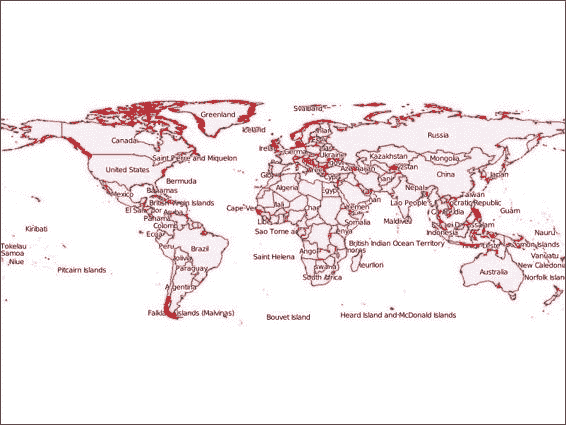

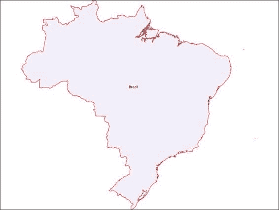

**使用带有过滤器的应用程序**

由于 BaseGeoCollection 类具有之前实现的过滤功能，因此可以在将其传递给地图之前过滤数据。

让我们尝试一些示例：

1. 在 map_maker_app.py 文件中，编辑 if __name__ == '__main__'块：if __name__ == '__main__':

world_borders = BoundaryCollection(

"../data/world_borders_simple.shp")

my_country = world_borders.filter('name', 'Brazil')

map_app = MapMakerApp()

map_app.add_layer(my_country, 'countries')

map_app.create_map()

map_app.display_map()

在这里，我们使用 BaseGeoCollection 类的过滤器功能按名称过滤国家；您可以自由尝试按您的国家进行过滤。

2. 运行代码，您应该会看到一个只包含一个国家的地图（应该激活缩放），如下面的截图所示：

3. 现在尝试组合过滤器以显示多个国家：

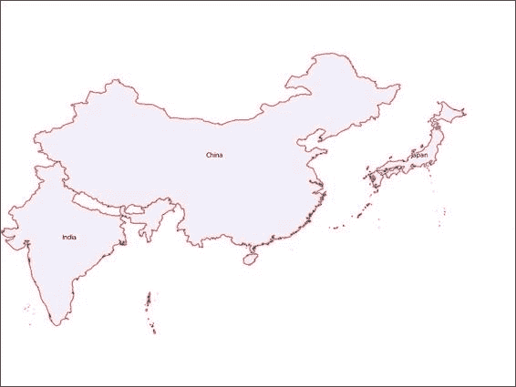

if __name__ == '__main__':

world_borders = BoundaryCollection(

"../data/world_borders_simple.shp")

countries = world_borders.filter('name', 'China') +\

world_borders.filter('name', 'India') +\

world_borders.filter('name', 'Japan')

map_app = MapMakerApp()

map_app.add_layer(countries, 'countries')

map_app.create_map()

map_app.display_map()

4. 再次运行代码并查看结果。

**总结**

在本章中，我们了解了 Mapnik 是如何工作的，以及如何使用 Python 和 XML 定义和样式化地图。使用 Mapnik 的 Python API，我们可以在 XML 中定义地图，然后在 Python 中修改它，这显示了对于各种需求的高度灵活性。

由于应用程序的结构，Mapnik 隐藏在高级功能之后，这些功能使我们能够使用之前创建的地理数据对象，允许应用程序过滤地图中要显示的数据。

在下一章中，我们将首次遇到栅格数据；我们将看到它是如何工作的，并在我们的地图中显示它。

**第六章\. 使用遥感**

**图像**

在本章中，我们将开始处理图像——这些图像可能来自卫星、无人机、飞机等携带的各种传感器。这些类型的图像，即从遥感设备收集的图像，是包含像素的图像，这些像素代表了一个给定地理区域的光谱响应。

除了将图像添加到地图上之外，准备图像在地图上展示也很重要。你可能需要合并、裁剪、改变分辨率、改变值以及执行许多其他转换，以便制作出视觉上吸引人的地图或有价值的信息。

为了对图像执行这些转换，我们将通过一个演绎过程，最终得到一个灵活且强大的软件结构。

这里涉及的主题包括：

理解图像是如何表示的

图像与真实世界的关系

合并、裁剪和调整图像的值 从高程数据创建阴影高程图

如何执行一系列处理步骤

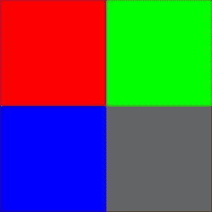

**理解图像是如何表示的**

**表示**

为了理解图像在计算机表示及其包含的数据方面的含义，我们将从一些示例开始。首先要做的事情是组织你的项目，按照本章的代码如下：

1\. 如前所述，在你的 geopy 项目中，复制你的 Chapter5 文件夹并将其重命名为 Chapter6。

2\. 在第六章中，导航到实验文件夹，并在其中创建一个名为 image_experiments.py 的新文件。打开它进行编辑。

我们将首先检查一个小样本图像，其结构类似于大型卫星图像。

没有什么花哨的，你会看到四个不同颜色的正方形。但如果我们再进一步，给它加上网格，我们就能看到更多一点的信息。

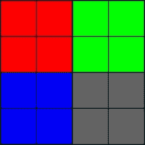

该图像被分成 16 个大小相等的正方形。这些正方形中的每一个都是一个所谓的**像素**。像素是图像（即，栅格数据）包含的最小信息部分。在谈论地理处理时，整个图像在真实世界中代表一个空间，而每个像素是那个空间的一部分。

在本章开头将样本图像添加到地图时，我们手动定义了该图像的范围（即其边界框）。这些信息告诉 Mapnik 图像中的坐标如何与真实世界的坐标相关联。

到目前为止，我们已经看到我们的样本图像有 16 个像素，形状为 4 x 4。但是，这幅图像或任何其他栅格数据如何与真实世界空间相关联，取决于数据中可能或可能不存储的信息。

第一个表示关系的信息是图像在世界中的位置。图像和栅格数据通常以左上角为原点。如果我们给原点分配一个坐标，我们就能将图像放置在世界中。

其次，我们需要有关此图像覆盖区域的信息。这种信息可以通过以下三种方式出现：

图像像素的大小

图像的大小

图像边界框的坐标

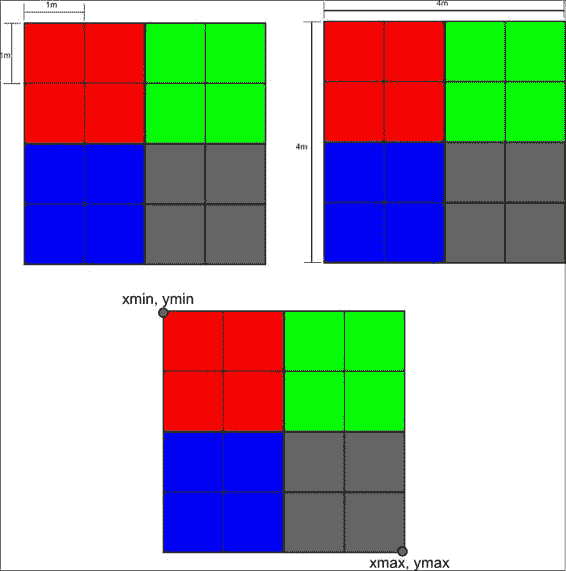

此信息与以下方程相关：

x_pixel_size = width / columns

y_pixel_size = height / lines

width = xmax – xmin

height = ymax – ymin

**使用 OpenCV 打开图像**

为了更好地理解，我们将使用 OpenCV 打开示例图像并检查其内容如下：

1\. 在你的 image_expriments.py 文件中，输入以下代码：def open_raster_file(image):

"""打开栅格文件。

:param image: 栅格文件的路径或 np 数组。

"""

image = cv2.imread(image)

return image

if __name__ == '__main__':

image = open_raster_file('../../data/sample_image.tiff')

print(image)

print(type(image))

print(image.shape)

2\. 运行代码。由于这是你第一次运行此文件，请按 *Alt* + *Shift* + *F10*

并从列表中选择 image_experiments。你应该看到以下输出：

[[[ 0 0 255]

[ 0 0 255]

[ 0 255 0]

[ 0 255 0]]

[[ 0 0 255]

[ 0 0 255]

[ 0 255 0]

[ 0 255 0]]

[[255 0 0]

[255 0 0]

[100 100 100]

[100 100 100]]

[[255 0 0]

[255 0 0]

[100 100 100]

[100 100 100]]]

<type 'numpy.ndarray'>

(4, 4, 3)

Process finished with exit code 0

表达式 print(type(image)) 打印存储在 image 变量中的对象的类型。如你所见，它是一个形状为 4 x 4 x 3 的 NumPy 数组。OpenCV

打开图像并将其数据放入数组中，尽管现在还很难可视化数据的组织方式。该数组包含每个

图像上的像素。

为了更好的可视化，我将为你重新组织打印输出：

[[[ 0 0 255] [ 0 0 255] [ 0 255 0] [ 0 255 0]]

[[ 0 0 255] [ 0 0 255] [ 0 255 0] [ 0 255 0]]

[[255 0 0] [255 0 0] [100 100 100] [100 100 100]]

[[255 0 0] [255 0 0] [100 100 100] [100 100 100]]]

现在数组的形状更有意义了。注意，我们有四条*行*，每行正好有四个*列*，正如我们在图像中看到的那样。每个项目都有一组三个数字，代表蓝色、绿色和红色通道的值。

**提示**

记住，当你使用 OpenCV 导入彩色图像时，通道的顺序将是 BGR（蓝色、绿色和红色）。

例如，以左上角的第一像素为例。它全部是红色，正如我们在图像中看到的那样：蓝 绿 红

[ 0 0 255]

因此，将图像作为 NumPy 数组导入的第一个且最重要的含义是，它们的行为类似于数组，并具有任何 NumPy 数组都有的所有函数和方法，这为在处理栅格数据时使用 NumPy 的全部功能打开了可能性。

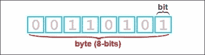

**了解数值类型**

在前一个主题中，每个像素都有三个通道：蓝色、绿色和红色。每个通道的值范围从 0 到 255（256 个可能的值）。这些通道的组合产生一个可见的颜色。这个值范围不是随机的；256 是使用单个**字节**可以实现的组合数量。

字节是计算机可以存储和从内存中检索的最小数据部分。它由 8 位零或一组成。

这对我们来说很重要，因为计算机使用其内存来存储图像，并且将为每个像素的每个通道保留一定空间来存储值。我们必须确保保留的空间足以存储我们想要存储的数据。

让我们进行一个抽象。假设你有 1 升（1000 毫升）的水，你想存储它。如果你选择一个 250 毫升的杯子来存储这水，多余的部分会溢出来。如果你选择一个容量为 10000 升的水罐车，你可以存储水，但会浪费很多空间。所以，你可能选择一个 3 升的桶，这样就可以足够存储水了。它不像卡车那么大，如果你想存储一点更多的水，你还会有些多余的空间。

在计算机中，事情的工作方式类似。在将东西放入容器之前，你需要选择容器的大小。在之前的例子中，OpenCV 为我们做出了这个选择。你将在未来的许多实例中看到，我们使用的程序将帮助我们做出这些选择。但是，对如何工作的清晰理解非常重要，因为如果水溢出来（即溢出），你的程序将出现意外的行为。或者，如果你选择一个太大的容器，你可能会耗尽计算机内存。

值存储的需求可能在以下方面有所不同：

只能是正数或正负数

整数或分数

小数或大数

复数

可用的选项及其大小可能因计算机架构和软件而异。对于常见的 64 位桌面，NumPy 将为你提供这些可能的数值类型：

bool：布尔值（True 或 False），以字节形式存储

int8：字节（-128 到 127）

int16：整数（-32768 到 32767）

int32：整数（-2147483648 到 2147483647）int64：整数（-9223372036854775808 到 9223372036854775807）uint8：无符号整数（0 到 255）

uint16：无符号整数（0 到 65535）

uint32：无符号整数（0 到 4294967295）

uint64：无符号整数（0 到 18446744073709551615）

float16: 半精度浮点数：符号位，5 位指数，10 位尾数

complex128: 由两个 64 位浮点数（实部和虚部）表示的复数

因此，我们可能预期我们的样本图像的类型是 uint8。让我们检查它是否正确：

1. 编辑 if __name__ == '__main__':块：

if __name__ == '__main__':

image = open_raster_file('../../data/sample_image.tiff')

print(type(image))

print(image.dtype)

2. 再次运行代码。你应该看到符合我们预期的输出：

<type 'numpy.ndarray'>

uint8

处理完成，退出代码为 0

**处理遥感图像和**

**数据**

卫星图像以不同的格式出现，服务于不同的目的。这些图像可以用来使用真实颜色可视化地球上的特征，或者用来通过人眼不可见的频谱部分来识别各种特征。

正如我们所见，我们的样本图像有三个通道（蓝色、绿色和红色），它们组合在一个文件中，以组成一个真实色彩图像。与样本图像不同，大多数卫星数据将每个通道分别存储在一个文件中。

这些通道被称为 **波段**，并包含可见或不可见于人眼的电磁频谱范围。

在以下示例中，我们将使用由 **Advanced Spaceborne Thermal Emission and Reflection Radiometer** (**ASTER**) 获取的数据生成的 **数字高程模型** (**DEM**)。

这些 DEM 的分辨率大约为 90 米，值存储在 16 位

表示以米为单位的高的有符号整数。

我们将要使用的数据集包含在数据文件夹中，并来自一个名为 *Poços de Caldas* 的巴西城市。这座城市位于一个巨大的已灭绝火山口内，这是我们希望在数据处理过程中看到的一个特征。出于教学目的和为了覆盖一个大区域，我们将使用四张图片：

**注意**

你可以在 [`earthexplorer.usgs.gov/`](http://earthexplorer.usgs.gov/) 获取更多数字高程模型。

1. 如果想下载并使用自己的 DEM，需要提取下载的 ZIP 文件

文件。注意，每个 ZIP 存档包含两张图片。以 _dem 结尾的是实际的高程数据。以 _num 结尾的包含质量评估信息。查看包含的 README.pdf 文件获取更多信息。

2. 将所有图片移动或复制到第六章代码的数据文件夹中。

每张图片代表一个 1 度的瓦片。图片覆盖的瓦片信息编码在文件名中，如下面的图片所示：

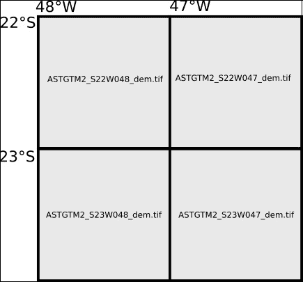

**图像镶嵌**

Mapnik 具有从磁盘读取瓦片数据的栅格数据源的能力。但我们不会使用它，因为将图像拼接在一起的过程非常重要，值得学习。

下面的代码将打开图像，将它们组合，并将单个组合图像保存到磁盘。这个过程（具有不同复杂程度）称为**拼贴**：1. 仍然在 image_experiments.py 文件中，在 open_raster_file 函数之后添加一个新函数：

def combine_images(input_images):

"""将图像组合成拼贴。

:param input_images: 输入图像的路径。

"""

images = []

for item in input_images:

images.append(open_raster_file(item))

print images

2. 现在，编辑 if __name__ == '__main__':块，以便我们可以测试代码：if __name__ == '__main__':

elevation_data = [

'../../data/ASTGTM2_S22W048_dem.tif',

'../../data/ASTGTM2_S22W047_dem.tif',

'../../data/ASTGTM2_S23W048_dem.tif',

'../../data/ASTGTM2_S23W047_dem.tif']

combine_images(elevation_data)

3. 运行代码并查看输出：

[array([[[1, 1, 1],

[1, 1, 1],

[2, 2, 2],

...,

[4, 4, 4],

[4, 4, 4],

[4, 4, 4]],

. . .

Process finished with exit code 0

你应该看到四个数组的列表。PyCharm 将隐藏一些值，以便它可以在控制台中适应。

我们首先应该注意到，输入图像参数中图像的顺序与输出列表中数组的顺序相同。这将在以后非常重要。

其次，尽管高程数据是 16 位有符号整数（int16），但表示图像的数组仍然有三个 8 位无符号整数的波段。这是一个错误。

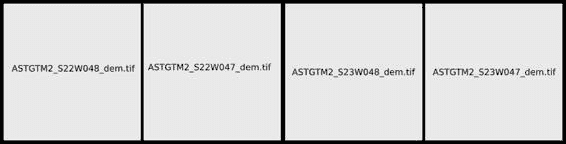

OpenCV 正在将灰度图像转换为彩色图像。我们将按照以下方式修复它：

1. 将 open_raster_file 函数修改为接受一个新参数。这将允许我们打开图像而不更改它们：

def open_raster_file(image, unchanged=True):

"""打开栅格文件。

:param image: 栅格文件的路径或 np 数组。

:param unchanged: 设置为 true 以保留原始格式。

"""

flags = cv2.CV_LOAD_IMAGE_UNCHANGED if unchanged else -1

image = cv2.imread(image, flags=flags)

return image

cv2.imread 中的 flags 参数允许我们调整图像的打开和转换为数组的方式。如果 flags 设置为 cv2.CV_LOAD_IMAGE_UNCHANGED，则图像将以原始形式打开，不进行任何转换。

2. 由于我们设置了默认的不变为 true，我们只需再次运行代码并查看结果：

[array([[ 508, 511, 514, ..., 1144, 1148, 1152],

[ 507, 510, 510, ..., 1141, 1144, 1150],

[ 510, 508, 506, ..., 1141, 1145, 1154],

...,

[ 805, 805, 803, ..., 599, 596, 593],

[ 802, 797, 803, ..., 598, 594, 590],

[ 797, 797, 800, ..., 603, 596, 593]], dtype=uint16)

. . .

Process finished with exit code 0

现在的值是正确的，并且它们是每个像素的测量高程（米）。

到目前为止，我们有一个按输入文件顺序排列的数组列表。为了确定下一步，我们可以想象这个列表就像图像被作为条带马赛克一样：现在，我们必须重新组织这个列表，以便图像放置在正确的位置。

记住，NumPy 数组有一个形状属性。在二维数组中，它是一个包含

the shape in columns and rows. NumPy 数组还有一个 reshape() 方法，它执行形状转换。

**注意**

查看 NumPy 文档中关于 reshape 方法和函数的说明。改变数组的形状是一个非常强大的工具，

[`docs.scipy.org/doc/numpy/reference/generated/numpy.reshape.html.`](http://docs.scipy.org/doc/numpy/reference/generated/numpy.reshape.html)

reshape 通过按顺序填充行中的输入值来工作。当行填满时，该方法跳到下一行并继续，直到结束。因此，如果我们将马赛克的预期形状传递给 combine_images 函数，我们就可以使用这些信息根据正确的位置组合图像。

但我们需要其他东西。我们需要通过像素数量知道输出图像的形状，这将是通过每个图像的形状与马赛克形状的乘积得到的。让我们在代码中尝试一些更改，如下所示：1. 编辑 combine_images 函数：

def combine_images(input_images, shape, output_image):

"""将图像组合成马赛克。

:param input_images: 输入图像的路径。

:param shape: 图像马赛克在列和行中的形状。

:param output_image: 输出图像马赛克的路径。

"""

if len(input_images) != shape[0] * shape[1]:

raise ValueError(

"图像数量与马赛克形状不匹配。") images = []

for item in input_images:

images.append(open_raster_file(item))

rows = []

for row in range(shape[0]):

start = (row * shape[1])

end = start + shape[1]

rows.append(np.concatenate(images[start:end], axis=1))

mosaic = np.concatenate(rows, axis=0)

print(mosaic)

print(mosaic.shape)

现在函数接受两个额外的参数，马赛克的形状（行和列中的图像数量，而不是像素数量）以及输出图像的路径，供以后使用。

使用此代码，图像列表被分离成行。然后，这些行被组合成完整的马赛克。

2. 在运行代码之前，别忘了在文件开头导入 NumPy：

# coding=utf-8

import cv2

import numpy as np

并编辑 if __name__ == '__main__': 块：if __name__ == '__main__':

elevation_data = [

'../../data/ASTGTM2_S22W048_dem.tif',

'../../data/ASTGTM2_S22W047_dem.tif',

'../../data/ASTGTM2_S23W048_dem.tif',

'../../data/ASTGTM2_S23W047_dem.tif']

combine_images(elevation_data, shape=(2, 2))

3. 现在运行代码并查看结果：

[[508 511 514…, 761 761 761]

[507 510 510…, 761 761 761]

[510 508 506…, 761 761 761]

...,

[514 520 517…, 751 745 739]

[517 524 517…, 758 756 753]

[509 509 510…, 757 759 760]]

(7202, 7202)

进程以退出代码 0 完成

现在它是一个包含 7202 x 7202 像素的单个数组。剩余的任务是将此数组保存到磁盘上的图像。

4\. 只需在函数中添加两行并编辑 if __name__ == '__main__':块：def combine_images(input_images, shape, output_image):

"""将图像组合成拼贴图。

:param input_images: 输入图像的路径。

:param shape: 拼贴图的列数和行数形状。

:param output_image: 输出图像拼贴图的路径。

"""

if len(input_images) != shape[0] * shape[1]:

raise ValueError(

"图像数量与拼贴图形状不匹配。") images = []

for item in input_images:

images.append(open_raster_file(item))

rows = []

for row in range(shape[0]):

start = (row * shape[1])

end = start + shape[1]

rows.append(np.concatenate(images[start:end], axis=1))

mosaic = np.concatenate(rows, axis=0)

print(mosaic)

print(mosaic.shape)

cv2.imwrite(output_image, mosaic)

if __name__ == '__main__':

elevation_data = [

'../../data/ASTGTM2_S22W048_dem.tif',

'../../data/ASTGTM2_S22W047_dem.tif',

'../../data/ASTGTM2_S23W048_dem.tif',

'../../data/ASTGTM2_S23W047_dem.tif']

combine_images(elevation_data, shape=(2, 2),

output_image="../output/mosaic.png")

**调整图像的值**

如果你运行前面的代码，你会看到一个黑色图像作为输出。这是因为表示该区域实际数据的值范围与 16 位整数图像的可能范围相比非常窄，我们无法区分灰度色调。为了更好地理解，让我们进行以下简单测试：1\. 仍然在 image_experiments.py 文件中，注释掉 if __name__ == '__main__':块并添加以下新块：

if __name__ == '__main__':

image = open_raster_file("../output/mosaic.png")

print(image.min(), image.max())

2\. 运行代码并查看控制台输出。

(423, 2026)

Process finished with exit code 0

精确地说，图像的范围从-32768 到 32767，该区域的高度从 423 到 2026。因此，我们需要将高度范围缩放到数据类型的范围。

由于我们正在制作旨在供人类可视化的数据表示，我们不需要使用大范围的灰度值。研究各不相同，但有些人说我们只能检测到 30 种色调，因此 256 个可能值的 8 位无符号整数应该足够用于数据可视化。

3\. 添加此新函数：

def adjust_values(input_image, output_image, img_range=None):

"""通过将一系列值投影到灰度图像中来在 input_image 中创建数据的可视化。

:param input_image: 包含数据的数组

或图像的路径。

:param output_image: 写入输出的图像路径。

:param img_range: 指定的值范围或 None 以使用图像的范围（最小值和最大值）。

"""

image = open_raster_file(input_image)

if img_range:

min = img_range[0]

max = img_range[1]

else:

min = image.min()

max = image.max()

interval = max - min

factor = 256.0 / interval

output = image * factor

cv2.imwrite(output_image, output)

此函数接受数组或图像文件的路径。利用此功能，

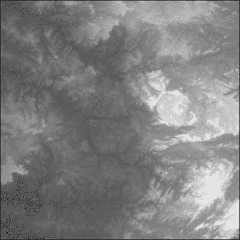

我们可以稍后使用此函数作为其他处理步骤的子步骤。您想要使用的值范围也是可选的。它可以手动设置，也可以从图像的最小值和最大值中提取。

4. 要测试代码，编辑 if __name__ == '__main__': 块：if __name__ == '__main__':

# 调整。

adjust_values('../output/mosaic.png',

'../output/mosaic_grey.png')

注意，输出图像现在是一个 png 文件。由于我们正在为可视化准备图像，我们可以承受在数据压缩中丢失信息，以换取更小的文件。

5. 运行代码并打开 mosaic_grey.png 文件以查看结果。现在你应该看到以下美丽的灰度图像：

**裁剪图像**

我们制作了一个大型的图像拼贴，以覆盖感兴趣的区域，在这个过程中，我们得到了一个比所需的图像大得多的图像。现在，是时候裁剪图像了，这样我们就能得到一个更小的图像，只包含我们想要看到的部分，从而节省磁盘空间和处理时间。

在我们的例子中，我们感兴趣的是火山口。它是图像右侧的圆形物体。为了只获取该感兴趣区域，我们将编写一个函数，该函数可以使用一组坐标的边界框来裁剪图像，如下所示：1. 将新函数添加到 image_experiments.py 文件中：

def crop_image(input_image, image_extent, bbox, output_image):

"""通过边界框裁剪图像。

bbox 和 image_extent 格式：(xmin, ymin, xmax, ymax)。

:param input_image: 包含数据的数组

或图像的路径。

:param image_extent: 图像的地理范围。

:param output_image: 输出图像的路径。

:param bbox: 感兴趣区域的边界框。

"""

input_image = open_raster_file(input_image)

img_shape = input_image.shape

img_geo_width = abs(image_extent[2] - image_extent[0])

img_geo_height = abs(image_extent[3] - image_extent[1])

# 一个地理单位包含多少像素。

pixel_width = img_shape[1] / img_geo_width

pixel_height = img_shape[0] / img_geo_height

# 要切割的像素索引。

x_min = abs(bbox[0] - image_extent[0]) * pixel_width

x_max = abs(bbox[2] - image_extent[0]) * pixel_width

y_min = abs(bbox[1] - image_extent[1]) * pixel_height

y_max = abs(bbox[3] - image_extent[1]) * pixel_height

output = input_image[y_min:y_max, x_min:x_max]

cv2.imwrite(output_image, output)

由于我们处理的是 NumPy 数组，裁剪本身就是一个简单的数组切片。

数组的切片与 Python 列表的切片非常相似，但具有额外的维度。语句 input_image[y_min:y_max, x_min:x_max] 表示我们只想获取数组中指定单元格（即像素）的部分。

因此，所有涉及的数学运算都是将地理单位转换为数组索引。

2\. 修改 if __name__ == '__main__': 块以测试代码：if __name__ == '__main__':

# Crop.

roi = (-46.8, -21.7, -46.3, -22.1) # 利益区域。

crop_image('../output/mosaic_grey.png',

(-48, -21, -46, -23), roi, "../output/cropped.png")

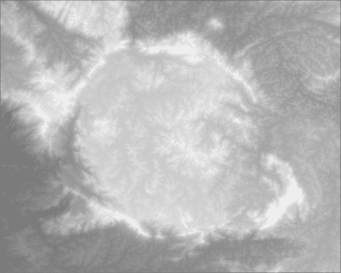

3\. 运行代码并打开输出图像以查看结果。

4\. 如果您错过了任何步骤，可以一次性运行整个流程。只需编辑 if __name__ == '__main__' 块：

if __name__ == '__main__':

# Combine.

elevation_data = [

'../../data/ASTGTM2_S22W048_dem.tif',

'../../data/ASTGTM2_S22W047_dem.tif',

'../../data/ASTGTM2_S23W048_dem.tif',

'../../data/ASTGTM2_S23W047_dem.tif']

combine_images(elevation_data, shape=(2, 2),

output_image="../output/mosaic.png")

# Adjust.

adjust_values('../output/mosaic.png',

'../output/mosaic_grey.png')

# Crop.

roi = (-46.8, -21.7, -46.3, -22.1) # 利益区域。

crop_image('../output/mosaic_grey.png',

(-48, -21, -46, -23), roi, "../output/cropped.png")

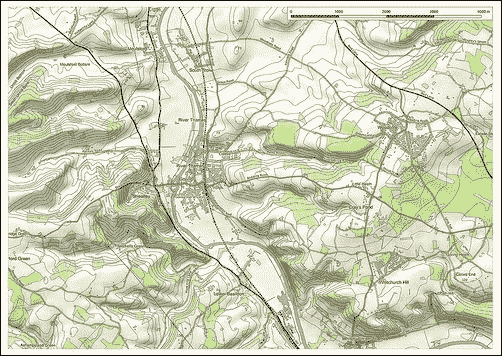

**创建阴影立体图像**

在我们处理之后，我们的数字高程模型图像有了很大的改进，但它仍然不适合地图。未经训练的眼睛可能很难仅通过观察不同灰度的阴影来理解地形。

幸运的是，有一种技术，称为**阴影渲染**或**立体渲染**，可以将高程数据转换为地形上的模拟阳光阴影。看看下面图片中的美丽地图，并注意当它以阴影立体图的形式呈现时，理解地形要容易得多：

该过程很简单，涉及将我们的图像通过以下知名算法：

1\. 将 create_hillshade 函数添加到您的 image_experiments.py 文件中：def create_hillshade(input_image, output_image,

azimuth=90, angle_altitude=60):

"""从数字高程模型创建阴影立体图像。

:param input_image: 包含数据的数组

或图像的路径。

:param azimuth: 模拟太阳方位角。

:param angle_altitude: 太阳高度角。

"""

input_image = open_raster_file(input_image)

x, y = np.gradient(input_image)

slope = np.pi / 2 - np.arctan(np.sqrt(x * x + y * y))

aspect = np.arctan2(-x, y)

az_rad = azimuth * np.pi / 180

alt_rad = angle_altitude * np.pi / 180

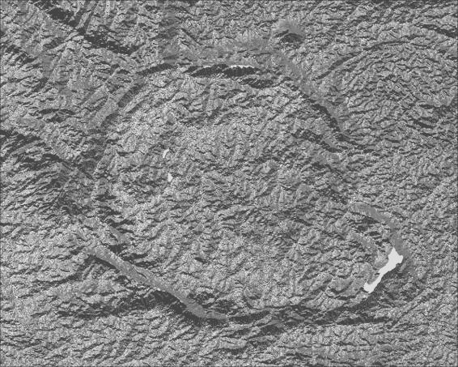

a = np.sin(alt_rad) * np.sin(slope)

b = np.cos(alt_rad) * np.cos(slope) * np.cos(az_rad - aspect) output = 255 * (a + b + 1) / 2

cv2.imwrite(output_image, output)

2\. 现在，修改 if __name__ == '__main__': 块以测试代码：if __name__ == '__main__':

create_hillshade("../output/cropped.png",

"../output/hillshade.png")

3\. 运行代码并打开输出图像以查看结果。如果一切顺利，您应该看到您数据的阴影立体图表示。

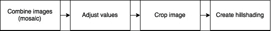

**构建图像处理管道**

图像处理，无论是用于地理应用还是其他应用，通常需要执行一系列变换（即步骤）以获得所需的最终结果。在这些序列中，一个步骤的输出是下一个步骤的输入。在计算机科学中，这被称为**处理管道**。

这种类型的数据操作非常灵活，因为您有一系列可以排列成多种组合以产生广泛结果的函数或步骤。

到目前为止，在本章的示例中，我们所做的是从磁盘打开一个图像，执行一个给定的操作，并将结果保存到磁盘上的另一个图像。然后，在下一步中，我们打开前一步的结果，依此类推。

尽管步骤尚未连接，我们可以想象以下图像处理管道：

将中间步骤保存到磁盘在需要使用这些图像或在其他情况下，当管道使用并行处理或其他更复杂的方法时是有用的。

对于某些情况，仅仅在管道中传递数据而不接触硬盘，只使用计算机内存可能更有趣。这样，我们应期望速度有显著提升，并且残余文件的产生会减少。

为了调和这两种情况，我们可以使用函数的类型检查来处理参数，使它们可以接受数组或文件路径。

参数，使它们可以接受数组或文件路径。导航到您的 open_raster_file 函数并修改其代码：

def open_raster_file(file_path, unchanged=True):

"""打开栅格文件。

**:param file_path: 栅格文件的路径或 np 数组。**

:param unchanged: 设置为 true 以保持原始格式。

"""

**if isinstance(file_path, np.ndarray):**

**return file_path**

flags = cv2.CV_LOAD_IMAGE_UNCHANGED if unchanged else -1

image = cv2.imread(file_path, flags=flags)

return image

此函数现在将检查 file_path 的类型。如果它已经是一个 NumPy 数组，它将被返回。这改变了我们所有函数的行为，因为它们现在可以接收数组作为输入。

如果我们在所有函数中添加返回语句并使它们返回输出数组，

我们将能够如下组合函数：create_hillshade(

crop_image(

adjust_values('mosaic.png'),

(-48, -21, -46, -23), roi), 'shaded.png')

您不需要输入此代码。这种表示法难以理解。函数调用的顺序不直观，难以确定每个参数属于哪个函数。

如果我们能够像在第四章的“链式过滤器”部分中做的那样通过链式调用函数来执行管道，那会更好。第四章，*改进应用搜索能力*。

实际上，如果能使用如下表示法那就太好了：adjust_values().crop_image().create_hillshade()

如同 第四章，*改进应用搜索功能*，我们需要的只是一个类和返回相同类型类的那些方法。有了这两样东西，步骤如何组合就没有限制了。所以，让我们开始吧。

**创建 RasterData 类**

我们的 RasterData 类将遵循之前与我们的向量所使用的模式。实例化时，该类将接收一个文件路径或一个数组。正如之前所说，为了使用方法链来执行处理管道，每个处理方法必须返回 RasterData 类的另一个实例。

我们将从类声明开始，然后填充它的方法。为了使剪切和粘贴我们已完成的工作更容易，我们将在 image_experiments.py 文件中进行以下步骤：

1. 在 image_experiments.py 文件顶部，导入之后，创建一个类：

# coding=utf-8

import cv2

import numpy as np

class RasterData(object):

def __init__(self, input_data, unchanged=True, shape=None):

"""表示以数组形式存在的栅格数据。

:param input_data: 栅格文件或 Numpy 数组。

:param unchanged: 如果为 True，则保持原始格式。

:param shape: 当使用多个输入数据时，此参数

确定组合的形状。

"""

self.data = None

if isinstance(input_data, list) \

or isinstance(input_data, tuple):

self.combine_images(input_data, shape)

else:

self.import_data(input_data, unchanged)

该数组将被存储在 data 属性中，因此我们最初将其设置为 None。

为了使这个类与其他类保持一致并避免名称上的冗余，我们需要进行一些其他更改。第一个更改是使用与之前相同的 import_data 方法。

2. 将 open_raster_file 函数剪切并粘贴到类中，将其重命名为 import_data，并修改其行为以像方法一样：

class RasterData(object):

def __init__(self, input_data, unchanged=True, shape=None):

...

def import_data(self, image, unchanged=True):

"""打开栅格文件。

:param image: 栅格文件路径或 np 数组。

:param unchanged: 如果为 True，则保持原始格式。

"""

if isinstance(image, np.ndarray):

self.data = image

return image

flags = cv2.CV_LOAD_IMAGE_UNCHANGED if unchanged else -1

self.data = cv2.imread(image, flags=flags)

而不是返回一个数组，现在它将数组放入 data 属性中。

接下来，由于我们将从步骤中移除将图像写入磁盘的义务，我们需要一个方法来执行此操作。

3. 添加 write_image 方法：

class RasterData(object):

def __init__(self, input_data, unchanged=True, shape=None):

...

def import_data(self, input_image, unchanged=True):

...

def write_image(self, output_image):

"""将数据写入磁盘作为图像。

:param output_image: 输出图像的路径和名称。

"""

cv2.imwrite(output_image, self.data)

return self

4. 按照示例的顺序，将 combine_images 函数剪切并粘贴到类中作为方法：

class RasterData(object):

def __init__(self, input_data, unchanged=True, shape=None):

...

def import_data(self, input_image, unchanged=True):

...

def write_image(self, output_image):

...

def combine_images(self, input_images, shape):

"""组合图像形成镶嵌。

:param input_images: 输入图像的路径。

:param shape: 镶嵌的列数和行数形状。

"""

if len(input_images) != shape[0] * shape[1]:

raise ValueError("图像数量与形状不匹配"

"镶嵌形状。")

images = []

for item in input_images:

if isinstance(item, RasterData):

images.append(item.data)

else:

images.append(RasterData(item).data)

rows = []

for row in range(shape[0]):

start = (row * shape[1])

end = start + shape[1]

rows.append(np.concatenate(images[start:end], axis=1))

mosaic = np.concatenate(rows, axis=0)

self.data = mosaic

return self

现在，你可以创建一个空的 RasterData 实例，然后使用此方法用镶嵌填充它。或者，你可以使用包含任何组合的图像路径、数组或甚至其他 RasterData 实例作为参数创建实例。它将自动将它们组合起来，将结果放入数据属性中，并返回自身。

现在你已经掌握了这个技巧，让我们用最后三个函数进行相同的转换。

5. 将 adjust_values、crop_image 和 create_hillshade 函数作为方法添加到类中。你的完整类应该如下所示：class RasterData(object):

def __init__(self, input_data, unchanged=True, shape=None):

"""表示以数组形式存在的栅格数据。

:param input_data: 栅格文件或 Numpy 数组。

:param unchanged: True 以保持原始格式。

:param shape: 当使用多个输入数据时，此参数

确定组合的形状。

"""

self.data = None

if isinstance(input_data, list) \

or isinstance(input_data, tuple):

self.combine_images(input_data, shape)

else:

self.import_data(input_data, unchanged)

def import_data(self, image, unchanged=True):

"""打开栅格文件。

:param image: 栅格文件的路径或 np 数组。

:param unchanged: True 以保持原始格式。

"""

if isinstance(image, np.ndarray):

self.data = image

return image

flags = cv2.CV_LOAD_IMAGE_UNCHANGED if unchanged else -1

self.data = cv2.imread(image, flags=flags)

def write_image(self, output_image):

"""将数据写入磁盘作为图像。

:param output_image: 输出图像的路径和名称。

"""

cv2.imwrite(output_image, self.data)

return self

def combine_images(self, input_images, shape):

"""组合图像形成镶嵌。

:param input_images: 输入图像的路径。

:param shape: 镶嵌的列数和行数形状。

"""

if len(input_images) != shape[0] * shape[1]:

raise ValueError("图像数量与形状不匹配"

"镶嵌形状。")

images = []

for item in input_images:

if isinstance(item, RasterData):

images.append(item.data)

else:

images.append(RasterData(item).data)

rows = []

for row in range(shape[0]):

start = (row * shape[1])

end = start + shape[1]

rows.append(np.concatenate(images[start:end], axis=1))

mosaic = np.concatenate(rows, axis=0)

self.data = mosaic

return self

def adjust_values(self, img_range=None):

"""通过将一系列值投影到灰度图像中来在输入图像中创建数据的可视化。

:param img_range: 指定的值范围

或 None 以使用图像的范围

(最小值和最大值)。

"""

image = self.data

if img_range:

min = img_range[0]

max = img_range[1]

else:

min = image.min()

max = image.max()

interval = max - min

factor = 256.0 / interval

output = image * factor

self.data = output

return self

def crop_image(self, image_extent, bbox):

"""通过边界框裁剪图像。

bbox 和 image_extent 格式: (xmin, ymin, xmax, ymax)。

:param input_image: 包含数据的数组

或图像的路径。

:param image_extent: 图像的地理范围。

:param output_image: 写入输出的图像路径。

:param bbox: 兴趣区域的边界框。

"""

input_image = self.data

img_shape = input_image.shape

img_geo_width = abs(image_extent[2] - image_extent[0])

img_geo_height = abs(image_extent[3] - image_extent[1])

# 一个地理单位包含多少像素。

pixel_width = img_shape[1] / img_geo_width

pixel_height = img_shape[0] / img_geo_height

# 要切割的像素索引。

x_min = abs(bbox[0] - image_extent[0]) * pixel_width

x_max = abs(bbox[2] - image_extent[0]) * pixel_width

y_min = abs(bbox[1] - image_extent[1]) * pixel_height

y_max = abs(bbox[3] - image_extent[1]) * pixel_height

output = input_image[y_min:y_max, x_min:x_max]

self.data = output

return self

def create_hillshade(self, azimuth=90, angle_altitude=60):

"""从数字高程模型创建阴影图。

:param input_image: 包含数据的数组

或图像的路径。

:param azimuth: 模拟的太阳方位角。

:param angle_altitude: 太阳高度角。

"""

input_image = self.data

x, y = np.gradient(input_image)

slope = np.pi / 2 - np.arctan(np.sqrt(x * x + y * y))

aspect = np.arctan2(-x, y)

az_rad = azimuth * np.pi / 180

alt_rad = angle_altitude * np.pi / 180

a = np.sin(alt_rad) * np.sin(slope)

b = np.cos(alt_rad) * np.cos(slope)\

* np.cos(az_rad - aspect)

output = 255 * (a + b + 1) / 2

self.data = output

return self

类已完整，我们可以创建一个流程来测试它。

6\. 编辑并组织 if __name__ == '__main__':块以测试图像处理流程：

if __name__ == '__main__':

高程数据 = [

'../../data/ASTGTM2_S22W048_dem.tif',

'../../data/ASTGTM2_S22W047_dem.tif',

'../../data/ASTGTM2_S23W048_dem.tif',

'../../data/ASTGTM2_S23W047_dem.tif']

roi = (-46.8, -21.7, -46.3, -22.1) # 兴趣区域。

iex = (-48, -21, -46, -23) # 图像范围。

RasterData(elevation_data, shape=(2, 2)).adjust_values().\

crop_image(iex, roi).create_hillshade().\

write_image('../output/pipeline_output.png')

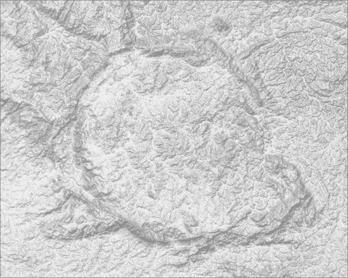

由于本书的宽度限制，管道被拆分为三行，但如果你愿意，可以在 PyCharm 中将其输入为单行。

7. 运行代码并欣赏结果。

到目前为止，你已经取得了了不起的成就。我说的不是阴影高程图，我说的是能够持续开发处理步骤并将它们组合成一个处理管道以实现最终结果的能力。我们在这里开发的结构可以用于几乎任何地理处理。

此外，请注意，由管道生成的图像的质量远优于之前的图像。这是因为数据一直存储在内存中。

这避免了在将数据多次保存到文件时由于压缩导致的数据丢失。

关于我们实现的结构功能的一些评论如下：所有的处理方法最终都做两件事：改变实例数据并返回实例本身。这意味着类实例将在管道中发生变异，随着过程的进行，旧数据将被新数据替换。因此，Python 的垃圾回收器将消除内存中的旧结果以节省空间。

如果在任何步骤中你想保存当前的处理状态，只需插入对 write_image 方法的调用（它也会返回 self，并且可以被管道化）。这是一个强大的功能。

调试工具，同时也可以在稍后需要重复长管道中的步骤时节省时间。

你可以分叉管道。你可以在不同的路径上创建一个分支，从而可以产生多个结果。为此，你可以使用 copy()函数，或者你可以在分叉之前将结果写入磁盘。在本书的后面部分，我们将看到，在进行并行处理时，有时我们也会需要这些技术。

**总结**

在本章中，我们了解了遥感图像如何在计算机内部表示为数组，以及我们如何利用这一特性来处理它们。我们看到了，为了在地图上使用图像，通常需要将它们转换以获得更好的结果。然后，我们编写了处理函数来处理数字高程模型图像，最终得到一幅美丽的阴影高程图。最后，我们创建了一个 RasterData 类，并将我们的函数转换成了这个类的成员方法。通过一些额外的修改，我们使这些方法能够链入处理管道。

在下一章中，我们将探索图像中的数据并获取有价值的信息。

**第七章：提取信息**

**栅格数据**

栅格数据不仅仅是视觉信息的资源，它们是给定空间属性的样本，其值可以进行分析以产生有价值的信息。

在本章中，我们将从栅格数据中提取信息，特别强调统计信息。遵循之前的示例，我们将使用数字高程模型来获取给定区域的最高和最低海拔值，将海拔范围分为类别，并生成直方图和其他统计信息。超越简单的数值，我们将在漂亮的彩色地图上显示所有信息。

本章涵盖的主题包括：

如何从栅格数据中获取统计信息

使用编程技术，如延迟评估和记忆化，以避免不必要的计算

如何格式化表格数据输出

如何着色地图并选择合适的颜色

如何混合颜色图以生成彩色和阴影图

**获取基本统计信息**

正如我们之前看到的，图像或栅格数据是包含表示给定现实世界空间的数值的数组。因此，它们是统计样本，并且可以用于统计分析。

当我们导入数据时，它被转换为 NumPy 数组。这些数组包含基本统计计算的方法。在本主题中，我们将从这些计算中获得结果并将它们保存到文件中。

在上一章的末尾，我们通过组合可以保存到磁盘上的步骤创建了一个图像处理流程。在这里，我们将遵循相同的模式。统计计算将被添加为另一个步骤。保持相同的组织结构允许用户在任何处理流程点上生成统计信息。如果需要，可以保存所有子步骤的统计信息。

让我们先组织我们的代码：

1. 正如我们在每一章的开始所做的那样，我们将从上一章复制代码。在你的 geopy 项目文件夹中，复制 Chapter 6 文件夹（*Ctrl* + *C*）并将其粘贴（*Ctrl* + *V*）。将复制的文件夹命名为 Chapter7\。

在最后一章中，我们在 image_experiments.py 文件中完成了 RasterData 类。由于我们的实验已经结束，让我们将这个类移动到一个永久且有意义的位置。

2. 复制文件 Chapter7/experiments/image_experiments.py（*Ctrl* + *C*）。

3. 选择 Chapter7 文件夹并将文件粘贴到那里（*Ctrl* + *V*）。

4. 将文件重命名为 raster_data.py。为此，右键单击文件并选择 **重构** | **重命名…** 或者选择文件并按 *Ctrl* + *F6*。将出现重构对话框。在对话框中更改名称，然后单击 **重构** 按钮。对话框中有两个复选框询问您是否想要搜索此文件的引用。如果它们被勾选（开启），PyCharm 将搜索并自动更改这些引用，因此代码将继续工作。

5. 删除 image_experiments.py 文件，因为它将不再有用。

现在我们已经组织好了代码，我们将分析一些方面并回顾一些点，以便规划我们的下一步。

让我们以一个具有基础工作模式的 RasterData 类实例为例：

在实例化时刻，你可以传递数据，或者你可以稍后导入数据。

之后，数据将存储为 NumPy 数组在 data 属性中。

当你在类中运行任何方法时，操作将被执行，如果需要，数据将被转换，并且实例本身将连同新数据一起返回。

类中除了数据外没有存储任何信息。因此，一些方法需要手动定义参数。

数据属性是一个 NumPy 数组，所以它具有所有 NumPy 数组方法。

**准备数据**

我们将要使用的是由包含高程数据的四幅图像组成的样本数据。处理流程将这些图像合并，调整值以在地图上显示，裁剪图像，然后生成阴影地形图。

这个流程适合可视化，但在调整值的时候会丢失数据。

对于这项工作，我们不希望发生这种情况。我们希望保留原始的米值。所以，我们首先需要做的是构建一个适合我们需求的流程，并在最后保存结果，这样我们就不需要在接下来的测试中重复所有步骤：1. 打开 raster_data.py 文件进行编辑，并在其末尾添加 if __name__

== '__main__': 包含以下代码的块:

if __name__ == '__main__':

高程数据 = [

'../data/ASTGTM2_S22W048_dem.tif',

'../data/ASTGTM2_S22W047_dem.tif',

'../data/ASTGTM2_S23W048_dem.tif',

'../data/ASTGTM2_S23W047_dem.tif']

roi = (-46.8, -21.7, -46.3, -22.1) # 利益区域.

iex = (-48, -21, -46, -23) # 图像范围.

data = RasterData(elevation_data, shape=(2, 2))

data.crop_image(iex, roi).write_image(

'output/dem.tif')

这与我们之前所做的是非常相似的，但是流程被简化为合并图像、裁剪并将结果写入 dem.tif 文件。它被选为 TIFF 文件，所以信息不会因为数据压缩而丢失。

2. 运行代码。记住，因为它是一个新文件，你需要点击**运行**或按*Alt* + *Shift* + *F10*并选择 raster_data。你应该看到一个输出告诉你一切顺利：

处理完成，退出代码 0

从现在起，我们可以使用准备好的图像 output/dem.tif 进行测试。这仅仅是一个加快过程的问题。我们即将要做的事情可以在任何 RasterData 实例中完成。

如果由于任何原因，你无法生成 dem.tif，请将样本数据中提供的 dem.tif 复制到你的输出文件夹。

**打印简单信息**

我们要获取一些统计输出的第一步是探索 NumPy 能提供什么。

如我们所知，RasterData 实例的数据属性是一个 NumPy 数组，那么让我们看看我们能从中得到什么：

1. 首先，检查到目前为止是否一切正常。清理 if __name__ ==

'__main__': 块并添加以下新代码：

if __name__ == '__main__':

raster_data = RasterData('output/dem.tif')

打印 raster_data.data

2. 使用 *Shift* + *F10* 运行代码。你应该看到以下输出：

[[ 933 935 942…, 1077 1076 1078]

[ 936 939 945…, 1075 1079 1076]

[ 935 939 946…, 1064 1072 1075]

...,

[ 780 781 781…, 1195 1193 1193]

[ 781 784 782…, 1191 1189 1188]

[ 781 784 785…, 1187 1185 1184]]

处理完成，退出代码为 0

这是包含数据的数组，单位为米。NumPy 自动抑制了一些行和列以减小输出大小。你看到这个输出是因为 NumPy 数组有一个 __repr__ 方法，它在调用 print 函数时告诉应该显示什么。

正如我们之前对矢量数据所做的那样，我们将自定义类的 __repr__ 方法，以便输出其中数据的一些信息。

3. 编辑 RasterData 类并在 __init__ 方法之后插入 __repr__ 方法：

方法：

class RasterData(object):

def __init__(self, input_data, unchanged=True, shape=None):

...

def __repr__(self):

return "Hi, 我是一个栅格数据！"

4. 现在，编辑 if __name__ == '__main__': 块并直接打印 RasterData 实例：

if __name__ == '__main__':

raster_data = RasterData('output/dem.tif')

print raster_data

5. 运行代码并查看是否得到以下输出：

Hi, 我是一个栅格数据！

处理完成，退出代码为 0

好的，这里没有特别之处。这只是提醒大家，__repr__ 方法不接受任何参数（除了实例 self）并且应该只返回一个字符串。此外，该方法在类中的位置没有影响。我们将其放置在 __init__ 方法之后是为了组织上的考虑。

所有 *魔法* 方法都在类的开头一起。

现在我们已经设置好了一切，让我们探索数据属性中的 NumPy 数组。

为了避免重复，我将抑制代码中的类声明和 __init__ 方法，并用 # 替换。

1. 编辑 __repr__ 方法，使其看起来如下：

# ...

def __repr__(self):

if self.data is None:

return "没有数据可显示！"

data = self.data

min = "最小值: {}".format(data.min())

mean = "平均值: {}".format(data.mean())

max = "最大值: {}".format(data.max())

return "Hi, 我是一个栅格数据!\n {} {} {}".format(

min, mean, max)

首先，要避免数据为空（None）时抛出异常。在这种情况下，该方法打印一条友好的消息，说明实例没有数据。如果实例有数据，则通过调用相应的方法准备包含最小值、平均值和最大值的三个字符串。最后，一个字符串被格式化以包含所有信息。

2. 使用 *Shift* + *F10* 运行代码。你应该看到以下输出：Hi, 我是一个栅格数据！

最小值: 671 平均值: 1139.06559874 最大值: 1798

处理完成，退出代码为 0

那太好了！现在，我们有一些关于我们数据的统计信息。

但此代码笨拙，如果我们想添加或删除从 __repr__ 返回的信息，我们需要进行大量的编辑。因此，在我们继续获取更多统计数据之前，我们将进行一些更改并自动化我们想要显示的信息的格式化过程。

**格式化输出信息**

在这一点上，我们正在以简单的字符串输出显示三个参数。我们想要改进这个代码，以便我们可以轻松地添加或删除输出中的参数。

在我们修改代码之前，让我们提前考虑我们可能还需要以其他格式输出这些统计数据，例如：

将数据以人类友好的格式保存到磁盘上的文件中

以计算机友好的格式（如 CSV 或 JSON）保存到磁盘上的文件中

作为传递给其他函数或方法的参数

因此，一种好的方法来准备代码以满足这些要求是将统计生成与输出分离，如下所示：

1. 首先，将数据验证从 __repr__ 方法中分离出来。创建一个新的方法来处理这个任务：

# ...

def _check_data(self):

"""检查是否有数据以及它是否是 Numpy 数组。"""

if self.data is None:

raise ValueError("未定义数据。")

elif not isinstance(self.data, np.ndarray):

raise TypeError("数据类型错误。")

验证更加严格，并且为每种可能的失败类型引发不同的异常。这使得代码模式既有用又安全，因为它允许在其他函数中执行错误处理，并且如果异常没有被正确捕获，它将停止程序的执行。

2. 现在，创建一个新的方法来计算和收集我们迄今为止所拥有的统计数据：

# ...

def _calculate_stats(self):

"""从数据中计算并返回基本的统计信息。

"""

self._check_data()

data = self.data

stats = {

"最小值": data.min(),

"平均值": data.mean(),

"最大值": data.max()}

返回 stats

在这里，统计数据存储在字典中有两个原因：它允许项目具有可读的名称（包括如果您希望的话，重音符号和空格）并且它避免了名称冲突。

最后，它让我们准备一个包含计算出的统计信息的可读输出。为此，我们将使用 tabulate 模块。

3. 在文件开头插入此导入：

# coding=utf-8

导入 cv2 库

import numpy as np

from tabulate import tabulate

4. 添加这个新方法：

# ...

def _format_stats(self, stats, out_format='human'):

"""以给定的输出格式格式化统计数据。

:param out_format: 'human' 或 'csv'

"""

table = []

for key, value in stats.iteritems():

table.append([key, value])

返回 tabulate(table)

tabulate 函数接受一个列表的列表，表示一个表格。然后它准备一个包含格式良好的表格字符串，其中包含这些数据。

5. 最后，编辑 __repr__ 方法：

# ...

def __repr__(self):

stats = self._calculate_stats()

stats = self._format_stats(stats)

return "栅格数据 - 基本统计。\n {}".format(stats) 6. 现在，再次使用 *Shift* + *F10* 运行代码。你应该看到以下输出：栅格数据 - 基本统计。

------- -------

最小值 671

最大值 1798

平均值 1139.07

------- -------

进程已退出，退出代码为 0

现在演示效果更好了。如果我们想添加或删除元素，我们只需编辑 _calculate_stats 方法中的字典。

**计算四分位数、直方图和其他统计信息**

我们有了数据的最小值、最大值和平均值。在我们的案例中，这是给定区域的最小值、最大值和平均值。在接下来的几个步骤中，我们将从数据中获得更多信息：

1. 编辑 _calculate_stats 方法，向字典中添加更多项：

# ...

def _calculate_stats(self):

"""从数据中计算并返回基本统计信息。

"""

self._check_data()

data = self.data

stats = {

"最小值": data.min(),

"平均值": data.mean(),

"最大值": data.max(),

"Q1": np.percentile(data, 25),

"中位数": np.median(data),

"Q3": np.percentile(data, 75),

"方差": data.var(),

"直方图": np.histogram(data)

}

return stats

你可以向字典中添加任何值。也许，你可以从 NumPy 函数或方法或从你自己开发的功能中获取它。

**注意**

你可以在 [NumPy 统计](http://docs.scipy.org/doc/numpy/reference/routines.statistics.html) 中找到更多信息。

[NumPy 数组方法](http://docs.scipy.org/doc/numpy/reference/arrays.ndarray.html#array-methods) 和

[NumPy 数组方法](http://docs.scipy.org/doc/numpy/reference/arrays.ndarray.html#array-methods)。

2. 使用 *Shift* + *F10* 运行代码。你应该得到更多值作为输出：栅格数据 - 基本统计。

---------

Q1 992.0

Q3 1303.0

最小值 671

方差 37075.0925323

直方图 (array([ 83917, 254729, ..., 44225, 8279, 2068]), array([ 671. , 783.7, ..., 1685.3, 1798.]))

中位数 1140.0

最大值 1798

平均值 1139.06559874

--------- ---------------

进程已退出，退出代码为 0

注意到输出中的直方图由两个数组组成：一个包含每个桶中发生的次数，另一个包含每个桶的上限。由于我们处理的是地理数据，如果这些信息被转换成每个区间的面积，会更好。

要做到这一点，我们只需将货币数量（给定范围内的像素数量）乘以每个像素表示的区域。我们将在下一节准备一些事情之后做到这一点。

**将统计信息做成延迟属性**

我们的统计功能现在运行良好，我们将对其进行改进。我们不再需要每次都计算所需的统计信息，而是一次性计算，并且仅在第一次需要时计算。

我们将使用两种非常有用的编程技术：**延迟评估**和**记忆化**。

懒加载是在过程或计算被延迟，并且仅在需要时才执行。记忆化是在昂贵过程的结果被存储以供以后使用，以避免每次可能需要时都重新计算。

让我们看看它是如何工作的：

1\. 在 __init__ 方法中添加一个新的 _stats 属性：

class RasterData(object):

def __init__(self, input_data, unchanged=True, shape=None):

"""表示为数组的栅格数据。

:param input_data: 栅格文件或 NumPy 数组。

:param unchanged: 如果为 True，则保持原始格式。

:param shape: 当使用多个输入数据时，此参数

确定组合的形状。

"""

self.data = None

self._stats = None

if isinstance(input_data, list) \

或 isinstance(input_data, tuple):

self.combine_images(input_data, shape)

else:

self.import_data(input_data, unchanged)

属性名以下划线开头。请记住，这种表示法表明该属性只能从实例本身访问。此属性将作为缓存来存储统计数据。

2\. 现在添加一个返回统计信息的属性方法：

#...

@property

def stats(self):

if self._stats is None:

self._stats = self._calculate_stats()

return self._stats

当访问此属性时，它将验证如果 _stats 为 None。如果是，则计算统计数据并将结果存储到 _stats 中。下次需要时，它只返回存储的内容。

当获取此信息的过程成本较高时，使属性延迟评估并添加记忆化非常重要。只有在需要给定属性时，才会使用处理能力和时间。

3\. 现在，将 __repr__ 方法更改为使用此新功能：

# ...

def __repr__(self):

stats = self._format_stats(self.stats)

return "Raster data basic statistics.\n {}".format(stats)

**创建颜色分类图像**

如果我们想在地图上显示图像信息，我们必须准备我们得到的结果的视觉输出。一种常见且高效的视觉表示形式是将值分为类别，并为每个类别分配不同的颜色。在我们的情况下，我们可以将数据分为高度类别。NumPy 使我们很容易做到这一点。让我们编写一个可以在管道中调用的方法来开始：

1\. 在 RasterData 类中添加一个新的方法：

#...

def colorize(self, style):

"""基于包含限制和颜色的样式生成 BGR 图像。

:param style: 包含限制和颜色的列表。

"""

shape = self.data.shape

limits = []

colors = []

# 分离限制和颜色。

for item in style:

limits.append(item[0])

colors.append(self._convert_color(item[1]))

colors = np.array(colors)

# 将每种颜色放入其限制中。

flat_array = self.data.flatten()

di_array = np.digitize(flat_array, limits)

di_array = di_array.reshape((shape[0], shape[1], 1))

results = np.choose(di_array, colors)

# 将 RGB 转换为 BGR。

results = np.asarray(results, dtype=np.uint8)

results = cv2.cvtColor(results, cv2.COLOR_RGB2BGR)

self.data = results

return self

为了实现我们的目标，这里发生了两个重要的事情。首先，数据通过 NumPy 的 digitize 函数索引到类别中。然后，每个类别都接收一个具有定义颜色的 RGB 值。这是使用 choose 函数完成的。

此方法接受一个样式作为参数。这个样式是一个限制和颜色的列表，就像地图图例一样。例如，样式可以定义为：style = [[700, "#f6eff7"],

[900, "#bdc9e1"],

[1100, "#67a9cf"],

[1300, "#1c9099"],

[1800, "#016c59"]]

这意味着所有低于 700 的值都将具有颜色 "#f6eff7"，等等。颜色以十六进制表示。这种表示法在 Web 应用中很受欢迎，在这里选择它是因为它简短且易于输入或复制。

在这一点上，请注意，在这个方法内部，我们调用了 _convert_color 方法，该方法将执行颜色表示法的转换。让我们将此方法添加到类中：1. 将 _convert_color 方法添加到类中：

#...

def _convert_color(self, color_code):

"""将颜色表示法进行转换。

:param color_code: 包含十六进制颜色的字符串

或者 JavaScript 表示法。

"""

if color_code[0] == "#":

result = (int(color_code[1:3], 16),

int(color_code[3:5], 16),

int(color_code[5:7], 16))

elif color_code[:3] == "rgb":

result = map(int, color_code[4:-1].split(','))

else:

raise ValueError("Invalid color code.")

return result

2. 最后，编辑 if __name__ == '__main__': 块以测试我们的代码：if __name__ == '__main__':

raster_data = RasterData('output/dem.tif')

style = [[700, "#f6eff7"],

[900, "#bdc9e1"],

[1100, "#67a9cf"],

[1300, "#1c9099"],

[1800, "#016c59"]]

raster_data.colorize(style).write_image(

'output/classified.png')

3. 运行代码，然后打开输出图像以查看结果：

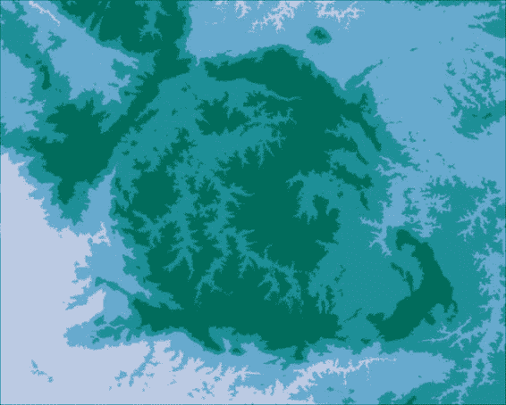

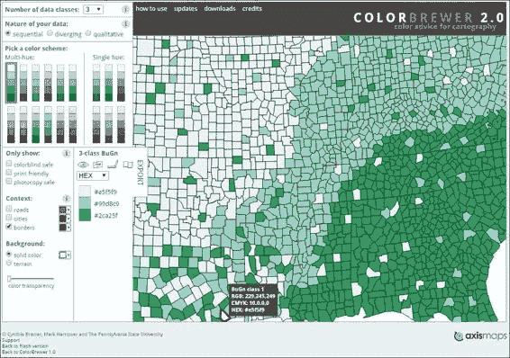

**选择地图的正确颜色**

在地图中使用什么颜色是决定地图能否正确传递所需信息的一个决定性因素。为了选择一组好的颜色，应考虑以下因素：

人眼区分色调的能力——类别需要视觉上可区分，否则地图可能包含对某些人看起来相同颜色的颜色

地图将展示的媒体（例如，纸张或屏幕）——

根据媒体，颜色可能会发生轻微变化，这可能会损害地图的可读性

色盲安全性——这是一个包含度量，它允许更广泛的受众解释信息

数据类型（例如，顺序或定性）——使用与您想要展示的内容相匹配的颜色

关于这个主题有许多研究，Cynthia Brewer 的研究非常实用且在现代地图制作者中很受欢迎。她制作了一套广泛用于地图的颜色，并以 ColorBrewer 的名义提供这些信息供使用。

让我们借助 ColorBrewer 更改地图的颜色：1\. 访问[`colorbrewer2.org/`](http://colorbrewer2.org/)网站。您应该看到此界面：

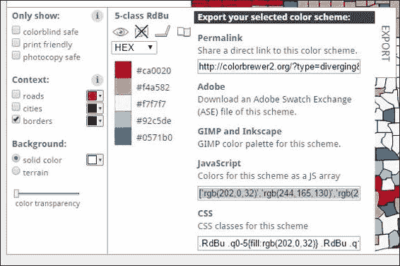

2\. 左侧面板允许您设置选择颜色的参数。在顶部，将**数据类别数量**更改为**5**，如我们的数据所示。

3\. 关于我们数据的特点，两种选项都很好，顺序或发散。我将为此示例选择发散。

4\. 在选择颜色方案之前，如果您愿意，可以通过**色盲安全**、**打印友好**和**复印安全**来过滤方案。

5\. 现在，选择一个您喜欢的颜色方案，并注意面板和地图的右下角将更改以显示此方案的颜色。

6\. 让我们将此方案以实用方式导出，以便在代码中使用。单击颜色右侧的**导出**选项卡。将打开一个新面板，如下所示：7\. 注意**JavaScript**框中包含 RGB 值列表。我们可以在代码中轻松解析此信息。因此，我们将选择其内容并将其复制。

8\. 返回我们的代码，并将颜色粘贴到名为 colorbrewer 的变量中，在 if __name__ == '__main__':块中：

if __name__ == '__main__':

colorbrewer = ['rgb(202,0,32)','rgb(244,165,130)',

'rgb(247,247,247)','rgb(146,197,222)',

'rgb(5,113,176)']

raster_data = RasterData('data/dem.tif')

style = [[700, "#f6eff7"],

[900, "#bdc9e1"],

[1100, "#67a9cf"],

[1300, "#1c9099"],

[1800, "#016c59"]]

raster_data.colorize(style).write_image(

'output/classified.png')

在这一点上，样式尚未完成。存在两个问题：颜色格式与我们所需的不同，并且我们没有与它们相关的限制。由于我们希望过程尽可能实用，我们将编写代码来解决这两个问题，而不是手动转换颜色并将它们与限制相关联。

首先，让我们实现程序接受颜色和限制分开的能力。

9\. 将样式定义中存在的限制放入不同的列表中：if __name__ == '__main__':

colorbrewer = ['rgb(202,0,32)','rgb(244,165,130)',

'rgb(247,247,247)','rgb(146,197,222)',

'rgb(5,113,176)']

limits = [700, 900, 1100, 1300, 1800]

raster_data = RasterData('data/dem.tif')

raster_data.colorize(style).write_image('output/classified.png') 10\. 现在编辑 colorize 方法：

#..

def colorize(self, limits, raw_colors):

"""基于包含限制和颜色的样式生成 BGR 图像。

:param limits: 一系列限制。

:param raw_colors: 一系列颜色代码。"""

shape = self.data.shape

colors = []

for item in raw_colors:

colors.append(self._convert_color(item))

colors = np.array(colors)

# 将每个颜色放入其限制中。

flat_array = self.data.flatten()

di_array = np.digitize(flat_array, limits, right=True)

di_array = di_array.reshape((shape[0], shape[1], 1))

results = np.choose(di_array, colors)

# 将 RGB 转换为 BGR。

results = np.asarray(results, dtype=np.uint8)

results = cv2.cvtColor(results, cv2.COLOR_RGB2BGR)

self.data = results

return self

此方法现在接受两个参数而不是只有一个样式。唯一剩下的任务是将这种新的颜色格式转换过来。

11. 编辑 _convert_color 方法：

#...

def _convert_color(self, color_code):

"""转换颜色表示法。

:param color_code: 包含十六进制颜色的字符串

或者使用 JavaScript 语法。

"""

if color_code[0] == "#": result = (int(color_code[1:3], 16),

int(color_code[3:5], 16),

int(color_code[5:7], 16))

elif color_code[:3] == "rgb":

result = map(int, color_code[4:-1].split(','))

else:

raise ValueError("Invalid color code.")

return result

此方法现在能够检测和转换我们使用的两种颜色代码。如果颜色代码未被识别，它还可以引发异常。

12. 为了测试代码，编辑 if __name__ == '__main__': 块以符合新的格式：

if __name__ == '__main__':

raster_data = RasterData('output/dem.tif')

colors = ['rgb(202,0,32)', 'rgb(244,165,130)',

'rgb(247,247,247)', 'rgb(146,197,222)',

'rgb(5,113,176)']

limits = [700, 900, 1100, 1300, 1800]

raster_data.colorize(limits, colors).write_image(

'output/classified.png')

13. 最后，使用 *Shift* + *F10* 运行代码并检查输出。我选择的模式产生了以下结果：

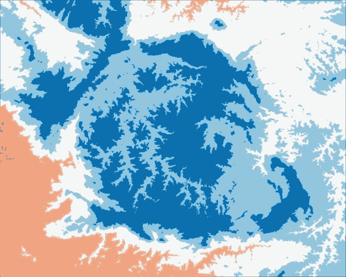

尽管这是一张美丽的图片，但在颜色选择上存在错误。暖色调代表的是较低的海拔。这可能会导致混淆，因为在大多数地图上，规则是颜色越暖，数值越高。

这只是一个反转颜色的问题。让我们在我们的 colorize 方法中添加一个选项来做这个。

14. 编辑 colorize 方法：

#...

def colorize(self, limits, raw_colors, invert_colors=False):

"""根据包含限制和颜色的样式生成 BGR 图像。

:param limits: 一个限制列表。

:param raw_colors: 一个颜色代码列表。

:param invert_colors: 反转颜色顺序。

"""

shape = self.data.shape

colors = []

if invert_colors:

raw_colors = list(reversed(raw_colors))

# 转换颜色。

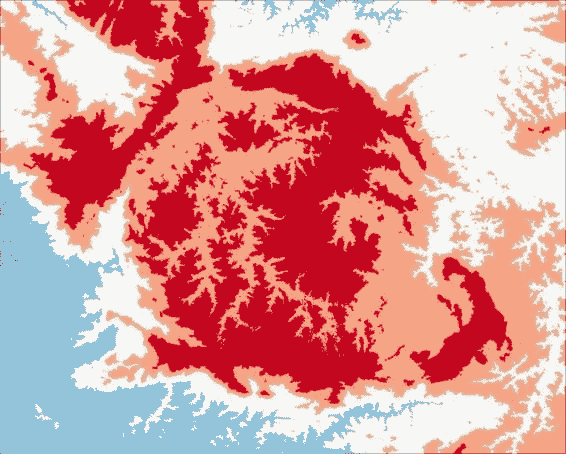

for item in raw_colors:

colors.append(self._convert_color(item))

colors = np.array(colors)

# 将每种颜色放入其限制范围内。

flat_array = self.data.flatten()

di_array = np.digitize(flat_array, limits, right=True)

di_array = di_array.reshape((shape[0], shape[1], 1))

results = np.choose(di_array, colors)

# 将 RGB 转换为 BGR。

results = np.asarray(results, dtype=np.uint8)

results = cv2.cvtColor(results, cv2.COLOR_RGB2BGR)

self.data = results

return self

15. 现在，再次编辑 if __name__ == '__main__': 块：

if __name__ == '__main__':

raster_data = RasterData('output/dem.tif')

colors = ['rgb(202,0,32)', 'rgb(244,165,130)',

'rgb(247,247,247)', 'rgb(146,197,222)',

'rgb(5,113,176)']

limits = [700, 900, 1100, 1300, 1800]

raster_data.colorize(limits, colors, True).write_image(

'output/classified.png')

16. 运行代码并查看新的输出：

**图像混合**

如果我们能够将着色图像与阴影高程图像结合起来，我们的结果将更加具有视觉吸引力和信息量。同样，由于我们处理的是数组，我们可以推断出这种组合可以通过在两个数组之间执行算术运算来实现。

在图像处理中，这被称为**alpha 混合**。基本上，对两个图像都应用了透明度，然后它们被混合成一个新的图像。在接下来的步骤中，我们将创建一个执行此操作的功能：

1. 首先，为了避免多次生成阴影高程，让我们将其保存在磁盘上，并编辑 raster_data.py 文件的 if __name__ == '__main__':块：if __name__ == '__main__':

raster_data = RasterData('output/dem.tif')

raster_data.adjust_values().create_hillshade(

10, 60).write_image('output/shaded.png')

2. 运行代码并检查图像是否正确写入磁盘。

3. 现在，将 alpha_blend 方法添加到 RasterData 类中：

#...

def alpha_blend(self, raster_data, alpha=0.5):

"""将此栅格数据与另一个数据合并。

:param raster_data: RasterData 实例。

:param alpha: 应用透明度的量。

"""

shade = cv2.cvtColor(raster_data.data, cv2.COLOR_GRAY2BGR)

result = (1-alpha) * self.data + alpha * shade

self.data = result

return self

4. 最后，再次编辑 if __name__ == '__main__':块以测试代码：if __name__ == '__main__':

shaded = RasterData('output/shaded.png')

classified = RasterData('output/classified.png')

classified.alpha_blend(shaded).write_image(

'output/color_shade.png')

5. 运行代码并检查输出文件夹中的图像：

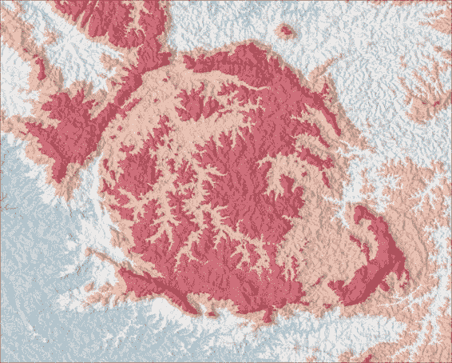

你应该看到这个美丽的输出。注意阴影高程与着色图像的结合如何产生一个即使对于未经训练的眼睛也能传达大量信息的地图。

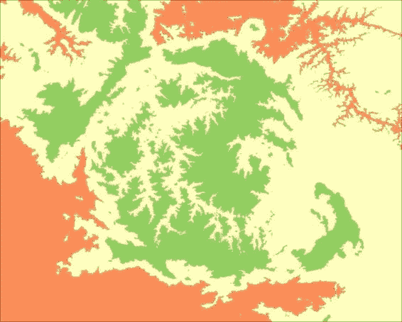

**用颜色显示统计数据**

地图着色仅是定义样式中的限制和颜色的问题。因此，如果我们想将统计信息转换为颜色，我们只需将我们想要的值与一系列颜色关联起来。

首先，让我们用四分位数来尝试：

1. 由于所有准备工作都在我们的课程中完成，我们只需要更改 if __name__ == '__main__':块中的代码：

if __name__ == '__main__':

dem = RasterData('output/dem.tif')

shaded = RasterData('output/shaded.png')

limits = [dem.stats['Q1'],

dem.stats['Q3'],

dem.stats['Maximum']]

colors = ["#fc8d59", "#ffffbf", "#91cf60"]

dem.colorize(limits, colors).write_image('output/stats.png') dem.alpha_blend(shaded).write_image('output/shaded_stats.png') 以下图像展示了分析参数的彩色输出：

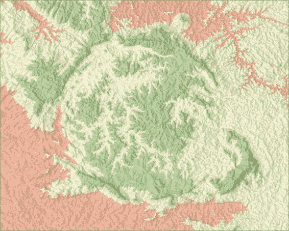

对于这张图像，你可以这样开始引导：

**使用直方图对图像进行着色** 我们还可以使用直方图对地图进行着色。NumPy 生成的直方图由两个一维数组组成。第一个包含给定区间内的发生次数（即像素数量）。第二个包含*桶*或限制。默认情况下，直方图使用 11 个桶，因此我们还需要 11 种不同的颜色来生成地图。让我们改变我们的测试来看看这是如何工作的：1. 编辑 if __name__ == '__main__':块：

if __name__ == '__main__':

dem = RasterData('data/dem.tif')

shaded = RasterData('output/shaded.png')

colors = ['rgb(103,0,31)','rgb(178,24,43)','rgb(214,96,77)',

'rgb(244,165,130)','rgb(253,219,199)',

'rgb(247,247,247)','rgb(209,229,240)',

'rgb(146,197,222)','rgb(67,147,195)',

'rgb(33,102,172)','rgb(5,48,97)']

limits = dem.stats['Histogram'][1]

dem.colorize(limits, colors, True).write_image('output/hist.png') dem.alpha_blend(shaded).write_image('output/shaded_hist.png') 这里使用的颜色也来自 ColorBrewer。它们从红色到蓝色具有发散性质。限制是通过简单地使用 stats 属性和包含桶的第二个数组从直方图中获得的。

2. 运行代码并查看输出。

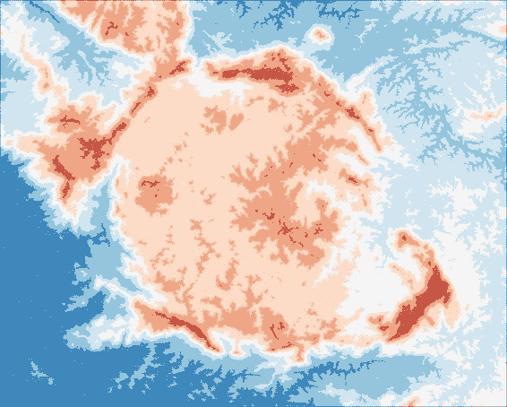

阴影结果应该看起来像以下图像：

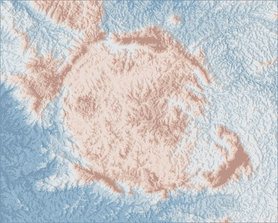

使用更多的类别可以更好地表示高度变化，并使我们能够清楚地看到高海拔的峰值。

**总结**

在本章中，我们处理了原始栅格数据，并使用一系列技术从中提取统计信息，并将其显示在高质量地图上。这些程序使我们能够在地理空间信息方面达到高水平的沟通，因为产生的材料易于解释，即使是未经训练的眼睛也能看懂。

在下一章中，我们将进入一个新的领域，并开始关注我们代码的效率，以便及时处理大量地理空间数据集。

**第八章 数据挖掘应用**

随着数据量的增加，新的挑战也随之而来。大量数据带来与过度处理时间和大量内存消耗相关的问题。这些问题可能会使数据分析变得痛苦，甚至可能使其完全不可能进行。

在本章中，我们将创建一个能够以高效方式处理大量数据集的应用程序。我们将审查我们的代码，实现新的工具和技术，这将使我们的分析不仅运行得更快，而且还能更好地利用计算机硬件，使几乎任何数量的数据都能被处理。

为了实现这些目标，我们将学习如何使用数据库以及如何将数据流式传输到它们中，使计算能力的使用保持恒定和稳定，无论数据量的大小。

这些工具还将使我们能够执行更高级的搜索、计算，并从不同来源获取交叉信息，让您能够挖掘宝贵的信息。

本章将涵盖以下主题：

代码效率是什么以及如何衡量它

如何将数据导入到空间数据库中

如何将数据库数据抽象为 Python 对象

查询和从空间数据库中获取信息 理解代码效率

效率代码的构成取决于正在分析的点。当我们谈论计算效率时，有四个点可能需要考虑：

代码执行所需的时间

运行时使用的内存量

占用的磁盘空间量

代码是否使用了所有可用的计算能力

优秀的、高效的代码不仅关乎计算效率；它还关乎编写能够为开发过程带来这些有利品质的代码（仅举几个例子）：

清洁且有序的代码

易读的代码

易于维护和调试

广泛的

防止误用

显然，有些点是相互矛盾的。这里只举几个例子。为了加快一个过程，您可能需要使用更多的内存。为了使用更少的内存，您可能需要更多的磁盘空间。或者，为了获得更快的代码，您可能需要放弃泛化，

编写非常具体的函数。

是开发者根据软件需求和投资于某一点或另一点所获得的收益来决定对抗性特征之间的平衡。

例如，如果可以编写出非常干净的代码，同时执行时间上的损失很小，开发者可能会选择编写干净且易于维护的代码，这将使他和他的团队能够更容易地理解。

第二组好的特性容易受到人类评估的影响，而第一组中的项目可以通过计算机进行测量和比较。

**测量执行时间**

为了测量一段代码的执行速度，我们需要测量其执行时间。所测量的时间是相对的，并受多种因素的影响：操作系统、是否有其他程序正在运行、硬件等。

在我们的效率测试中，我们将测量执行时间，对代码进行修改，然后再次测量。这样，我们将看到这些修改是否提高了代码效率。

让我们从简单的例子开始，并测量其运行所需的时间。

1. 如前所述，在您的 geopy 项目中复制上一章的文件夹，并将其重命名为 Chapter8。您的项目结构应如下所示：

├───Chapter1

├───Chapter2

├───Chapter3

├───Chapter4

├───Chapter5

├───Chapter6

├───Chapter7

├───Chapter8

│ ├───experiments

│ ├───map_maker

│ ├───output

│ └───utils

└───data

2. 点击您的实验文件夹，并在其中创建一个新的 Python 文件。将该文件命名为 timing.py。

3. 现在将以下代码添加到该文件中：

# coding=utf-8

def make_list1(items_list):

result = ""

for item in items_list:

template = "我喜欢{}。 \n"

text = template.format(item)

result = result + text

return result

if __name__ == '__main__':

my_list = ['培根', '千层面', '沙拉', '鸡蛋', '苹果']

print(make_list1(my_list))

4. 再次运行代码。按 *Alt* + *Shift* + *F10* 并从列表中选择一个计时。你应该得到这个输出：

我喜欢培根。

我喜欢千层面。

我喜欢沙拉。

我喜欢鸡蛋。

我喜欢苹果。

没有什么花哨的，这是一个简单的低效函数，用于格式化文本并生成可打印的事物列表。

5. 现在我们将测量执行所需的时间。修改你的代码：

# coding=utf-8

from timeit import timeit

def make_list1(items_list):

result = ""

for item in items_list:

template = "我喜欢{}。 \n"

text = template.format(item)

result = result + text

return result

if __name__ == '__main__':

my_list = ['培根', '千层面', '沙拉', '鸡蛋', '苹果']

number = 100

execution_time = timeit('make_list1(my_list)',

setup='from __main__ import make_list1, my_list',

number=number)

print("执行代码{}次花费了{}秒"。format(

execution_time, number))

6. 再次使用 *Shift* + *F10* 运行代码并查看结果：执行代码 100 次花费了 0.000379365835017 秒

Process finished with exit code 0

这里我们使用 timeit 模块来测量我们函数的执行时间。

由于一些代码运行速度很快，我们需要多次重复执行以获得更精确的测量和更有意义的数字。重复执行语句的次数由数字参数给出。

7. 将你的数字参数增加到 1000000 并再次运行代码：执行代码 1000000 次花费了 3.66938576408 秒

Process finished with exit code 0

现在我们有一个更一致的数字可以工作。如果你的电脑比我的快得多，你可以增加这个数字。如果它更慢，就减少它。

拿一张纸并记下那个结果。我们将更改函数，看看我们是否使代码更高效。

8. 添加我们函数的另一个版本；命名为 make_list2: def make_list2(items_list):

result = ""

template = "我喜欢{}。 \n"

for item in items_list:

text = template.format(item)

result = result + text

return result

9. 还要更改你的 if __name__ == '__main__': 块。我们将清楚地说明正在执行函数的哪个版本：

if __name__ == '__main__':

my_list = ['培根', '千层面', '沙拉', '鸡蛋', '苹果']

number = 1000000

function_version = 2

statement = 'make_list{}(my_list)'.format(function_version) setup = 'from __main__ import make_list{}, my_list'.format(

function_version)

execution_time = timeit(statement, setup=setup, number=number) print("版本{}。".format(function_version))

print("执行代码{}次花费了{}秒"。format(

execution_time, number))

10. 再次运行代码并查看结果。在我的电脑上，我得到了这个：版本 2。

It took 3.5384931206s to execute the code 1000000 times

Process finished with exit code 0

这是对执行时间的一点点改进。在版本 2 中，我们唯一做出的改变是将模板移出了 for 循环。

11. 创建函数的第三个版本：

def make_list3(items_list):

result = ""

template = "I like "

for item in items_list:

text = template + item + ". \n"

result = result + text

返回结果

12. 将你的 function_version 变量更改为 3 并再次运行代码：版本 3。

执行 1000000 次代码耗时 1.88675713574 秒

进程以退出代码 0 结束

现在我们改变了字符串"I like "的构成方式。我们不是使用字符串格式化，而是添加了字符串的部分，得到的代码比上一个版本快了近两倍。

你可以通过试验、查阅互联网上的文章或通过经验来找出哪些小的改动可以减少执行时间。但有一种更肯定、更强大的方法来找出代码中花费更多时间的地方；这被称为**分析**。

**代码分析**

通过试验，我们发现代码中最昂贵的部分是字符串格式化。

当你的代码变得更加复杂时，通过这种方法找到瓶颈变得更加困难，在某个时候变得不切实际。

解决方案是分解并分析小块代码。为了查看它们执行所需的时间，对代码进行剖析。

Python 自带了一个很好的分析工具，它可以在一定程度上自动化这个过程。

让我们在我们的代码上使用它，看看它告诉我们什么：

1. 在文件开头添加此导入：

from timeit import timeit

**导入 cProfile**

2. 编辑你的 if __name__ == '__main__':块以使用分析器：if __name__ == '__main__':

my_list = ['bacon', 'lasagna', 'salad', 'eggs', 'apples']

number = 1000000

profile = cProfile.Profile()

profile.enable()

for i in range(number):

make_list1(my_list)

profile.disable()

profile.print_stats(sort='cumulative')

3. 运行代码。你应该能在控制台上看到分析器统计信息。（由于空间原因，我抑制了一些信息）：

6000002 次函数调用在 4.755 秒内

按照累积时间排序

ncalls tottime percall cumtime percall

1000000 2.718 0.000 4.738 0.000 timing.py

5000000 2.019 0.000 2.019 0.000 {'format' ...}

1 0.017 0.017 0.017 0.017 {range}

1 0.000 0.000 0.000 0.000 {'disable' ...}

执行分析器有多种方式。在我们的例子中，我们实例化了 Profile 类，并使用 enable 和 disable 方法来告诉分析器从哪里开始和停止收集数据。再次强调，调用 make_list1 的次数被重复了 1000000 次，以生成更大的数字。

在输出中，我们可以看到 make_list1 被调用了 1000000 次，format 方法被调用了五百万次，耗时 2.019 秒。请注意，分析器只提供了有关方法和函数的信息。

**在数据库上存储信息**

在前面的章节中，基本的流程是在每次运行代码时将所有数据导入内存作为 Python 对象。当我们处理小块数据时，这完全可行且效率很高。

在某个时候，你可能已经注意到我们代码的性能受到了削弱，尤其是在我们开始导入国家边界以及所有属性时。这是因为导入属性很慢。

其次，尽管我们的过滤机制工作得相当好，但我们处理大型数据集时可能会遇到问题。

解决这些问题的公式非常简单，只包含两个基本成分：

只获取你需要的内容

使用索引搜索

第一点是只获取你需要的记录，以及获取给定分析所需的属性。

第二点关于如何找到事物。在我们的方法中，一个循环会测试每条记录的条件，直到找到所需的记录（即测试返回 True）。或者，如果计算机有关于项目位置的某种想法，搜索将会更快；这就是索引。

而不是试图自己实现这些功能，我们可以使用数据库来为我们处理这些机制；它们是这个类型工作的最先进技术。

这里我们有两个选择：

使用带有**Spatialite**扩展的**SQLite**数据库，这是一个开源、简单且非常高效的 SQL 数据库。它不需要服务器或安装，Python 自带了连接到它的连接器。

使用带有**Postgis**扩展的**PostgreSQL**数据库。这也是一个开源且强大的数据库服务器。

选择权在你，除了在设置中有一小点变化外，它不会对代码产生影响。

**提示**

你可以从以下链接下载 PostgreSQL：[`www.postgresql.org/.`](http://www.postgresql.org/) 为了启用 Postgis，你只需要在安装过程中在堆栈构建器中选择它。

如果你使用 Ubuntu，你可以在以下链接中找到更多详细信息：

[`wiki.ubuntu.com/UbuntuGIS.`](https://wiki.ubuntu.com/UbuntuGIS)

**创建对象关系映射**

**对象关系映射**（**ORM**）是我们将使用的方法，将存储在数据库中的数据转换为 Python 对象。这与我们在 models.py 文件中做的没有区别，我们在那里编写了将存储在地理文件（例如，GPX 形状文件）中的数据转换为 Python 对象的代码。

这次，我们将通过将数据导入数据库来闭合这个循环，然后稍后以前那种优雅直观的方式从其中检索数据或信息。

SQL 数据库，如 SQLite，将数据存储在具有行和列的表中。以下表格说明了我们之前使用的地理缓存数据将如何以这种格式表示：

**ID Geom Name**

**状态**

**所有者提示**

1

（wkb）LaSalle Park 可用 John

在签名下

2

（wkb）停车场

可用的 Nina

大树

我们可以猜测这与能够导入任何类型数据的假设不相符，因为列的类型是固定的。如果我们有具有不同属性或更多属性的数据，我们需要不同的表或添加更多列以匹配所有可能性。

为了克服此架构的限制，我们将使用 SQL 的关系功能

数据库。我们将存储项目和属性在不同的表中，并将它们关联起来：**点**

**ID 几何**

1

42.89 - 78.90

2

43.00 - 78.0

**属性**

**ID 键**

**值**

**point_id**

1

名称 LaSalle Park 1

2

状态 可用

1

3

拥有者 John

1

4

提示

签名下

1

5

名称 停车场

2

6

状态 可用

2

7

拥有者 Nina

2

8

提示

大树

2

这种键/值数据模型允许每个点（或其他对象）具有任意数量和类型的属性。每个属性通过一个 ID 与其所有者关联。

你可能听说过 Django，这是一个包含所有功能的 Python 网络框架。事实上，Django 内置了一个出色的 ORM，并且它对地理空间数据库和地理空间操作有非常成熟的支持（Django 的这部分称为 **GeoDjango**，默认包含）。你也会注意到，从我们的模型到 Django 的过渡将非常平滑，它们将像以前一样易于使用。

**准备环境**

为了使用 Django 的 ORM，我们需要设置一个 Django 项目。为此，我们将准备所需的最小结构，这包括几个文件和设置。

首先，让我们设置我们的应用程序以使用 Django。

1. 在你的 Chapter8 文件夹中，创建一个名为 settings.py 的新 Python 文件。如果你使用 PostgreSQL/Postgis，请将以下代码添加到文件中：DATABASES = {

'default': {

'ENGINE': 'django.contrib.gis.db.backends.postgis',

'NAME': 'postgres',

'USER': 'postgres',

'PASSWORD': 'mypassword',

'PORT': 5432

}}

第一个项目（DATABASES）是数据库设置。如果你有默认的 PostgreSQL/Postgis 安装，这将有效。只需更改你在安装过程中设置的密码。

2. 如果你使用 SQLite/Spatialite，请使用以下配置：DATABASES = {

'default': {

'ENGINE': 'django.contrib.gis.db.backends.spatialite',

'NAME': 'mydatabase.db'

}}

3. 在数据库配置后，添加以下项：

INSTALLED_APPS = ('django.contrib.gis', 'geodata')

SECRET_KEY = 'abc'

INSTALLED_APPS 项告诉 Django 在哪里查找模型。SECRET_KEY 用于 Django 的用户管理。尽管我们不会使用它，但需要设置（可以使用任何值作为密钥）。

4. 现在创建一个 Python 包，它将成为我们的 Django 应用。在 Chapter8 文件夹下右键单击并选择 **新建** | **Python 包**。将其命名为 geodata。

文件夹下右键单击并选择 **新建** | **Python 包**。将其命名为 geodata。

5. 在 Chapter8 内创建一个新的 Python 文件，并将其命名为 geodata_app.py。

**修改我们的模型**

我们已经有了基本结构，现在我们需要调整我们的模型，以便它们可以使用数据库而不是将所有信息存储在内存中。Django 的模型定义与我们非常相似。

利用 Django 提供的新功能，我们将对设计选择进行一个更改：而不是为每种类型的对象（地理藏宝、道路、边界等）创建一个类，我们将只有一个可以存储所有这些数据以及我们可以想到的其他数据的类。

1. 在 geodata 文件夹内创建一个名为 models.py 的文件，并添加以下代码：

# coding=utf-8

from django.contrib.gis.db import models

class GeoObject(models.Model):

geom = models.GeometryField()

atype = models.CharField(max_length=20)

objects = models.GeoManager()

GeoObject 类代表一个单独的对象（表中的一行）。它可以在 geom 字段中接受任何类型的几何形状（一个点、多边形等）。atype 属性代表对象的高级类型。这个属性将告诉我们它是一个地理藏宝点还是其他东西（我们使用 atype 而不是 type 是为了避免与内部 type()函数冲突）。

最后，objects 属性代表 GeoObject 集合（数据库中的表）。在 Django 中，这被称为**管理器**；不要担心，我们稍后会看到更多关于这个的内容。

2. 现在我们需要为 GeoObject 添加标签；标签将包含每个属性。在 GeoObject 类之后添加另一个类。

class Tag(models.Model):

key = models.CharField(max_length=250)

value = models.CharField(max_length=250)

geo_object = models.ForeignKey(GeoObject, related_name='tags') 再次，这个类代表一个单独的对象，一个带有键和值的单独标签，通过外键与 GeoObject 连接。结果是，Tag 类有一个 GeoObject，而 GeoObject 有多个标签。

**自定义管理器**

如前所述，经理可以被视为数据库中表的一种表示。它包含检索记录、添加、删除以及许多其他操作的方法。

Django 附带了一个 GeoManager 类，用于包含空间对象的表。如果我们想为我们的 GeoData 管理器添加更多功能，我们只需要从 GeoManager 继承，然后在 GeoObject 类中添加一个具有其实例的类属性。实际上，我们只是替换了 objects 属性中的实例。

让我们将我们的 BaseGeoCollection 类调整为 GeoObject 类的管理器：1. 导航到你的 Chapter8/models.py 文件（我们在前面的章节中编写的那个文件）并将其重命名为 Chapter8/old_models.py。通过这样做，我们可以避免混淆，不清楚我们在谈论哪个模型。

2. 在 geodata 文件夹内创建一个名为 managers.py 的文件。将以下代码添加到该文件中：

# coding=utf-8

from django.contrib.gis.db.models import GeoManager

from utils.geo_functions import open_vector_file

class GeoCollection(GeoManager):

"""这个类代表空间数据集合。"""

Pass

这是迁移我们的 BaseGeoCollection 类的第一步。请注意，我们将其命名为 GeoCollection，因为它将不再是基类。我们将简化我们的代码，这样这个类将管理所有类型的地理对象。为此，我们将从 BaseGeoCollection 类中添加 import_data 方法，并将其与 PointCollection 类中的 _parse_data 方法结合。在我们继续之前，让我们看看这些方法现在的样子（你不需要输入此代码）：

#...

def import_data(self, file_path):

"""打开与 OGR 兼容的矢量文件并解析数据。

:param str file_path: 文件的完整路径。

"""

features, metadata = open_vector_file(file_path)

self._parse_data(features)

self.epsg = metadata['epsg']

print("文件导入成功: {}".format(file_path))

#...

def _parse_data(self, features):

"""将数据转换为 Geocache 对象。

:param features: 特征列表。

"""

for feature in features:

coords = feature['geometry']['coordinates']

point = Point(float(coords[1]), float(coords[0]))

attributes = feature['properties']

cache_point = Geocache(point, attributes=attributes)

self.data.append(cache_point)

注意，import_data 函数首先打开矢量文件，然后将特征发送到 _parse_data 函数，该函数遍历数据，创建点并将特征属性放入字典中。如果我们成功导入任何类型的几何形状并将特征属性传递给标签模型，我们最终将得到一段代码，它可以服务于任何类型的地理空间对象。

3. 再次编辑 geodata/managers.py 中的代码。无论你是想复制并编辑提到的函数还是从头开始输入新的 import_data 方法，都取决于你。

生成的代码应该是以下内容：

# coding=utf-8

from django.contrib.gis.db.models import GeoManager

from django.db import IntegrityError, DataError

from utils.geo_functions import open_vector_file

from shapely.geometry import shape

class GeoCollection(GeoManager):

"""这个类代表一组空间数据。”

def import_data(self, file_path, atype):

"""打开与 OGR 兼容的矢量文件并解析数据。

:param str file_path: 文件的完整路径。

"""

features, metadata = open_vector_file(file_path)

for feature in features:

geom = shape(feature['geometry'])

geo_object = self.model(geom=geom.wkt, atype=atype)

geo_object.save()

for key, value in feature['properties'].iteritems():

try:

geo_object.tags.create(key=key, value=value)

except (IntegrityError, DataError):

pass

print("文件导入成功: {}".format(file_path))

我们使用了 Shapley 的 shape 函数，直接将 feature['geometry']（一个类似于 GeoJSON 几何的字典）转换为正确的 shapely 几何类型。

然后，我们使用该几何形状来获取其 WKT 表示形式。

方法中包含了 atype 参数，我们可以用它来定义 GeoObject 的类型。请记住，atype 不是一个几何类型；它代表对象的较高层次类型（地理缓存、边界、道路、河流、航点等）。

在语句 geo_object = self.model(geom=geom.wkt, atype=atype)中，我们看到了 Django 管理器的伟大特性：相同的管理器可以被多个模型使用，self.model 包含了对从该管理器被调用的类的引用。

如果我们决定采用另一种设计模式，并为每种对象类型使用一个类，我们仍然可以使用相同的管理器来管理所有这些。

按顺序，模型被保存，然后遍历属性字典，并为每个项目创建一个标签。我们在这里捕获异常，因为我们有两个可能发生的特殊条件：如果属性的值为 None，它将引发 IntegrityError；如果值的长度大于 250，它将引发 DataError。如果你对长字段感兴趣，例如来自地理藏宝数据的日志，你可以增加字段 max_length 或尝试不同的字段类型。

4. 我们在这里不使用元数据，读取它可能会在 Windows 用户之间引起库不兼容错误。因此，我们将从 open_vector_file 函数中删除它。编辑你的 utils/geo_functions.py 文件以更改此函数。此外，让我们打印读取到的要素数量：def open_vector_file(file_path):

"""打开与 OGR 兼容的矢量文件或 GPX 文件。

返回要素列表和有关文件的信息。

:param str file_path: 文件的完整路径。

"""

datasource = ogr.Open(file_path)

# 检查文件是否已打开。

if not datasource:

if not os.path.isfile(file_path):

message = "Wrong path."

else:

message = "File format is invalid."

raise IOError('Error opening the file {}\n{}'.format(

file_path, message))

file_name, file_extension = os.path.splitext(file_path)

# 检查它是否是 GPX，如果是，则读取它。

if file_extension in ['.gpx', '.GPX']:

features = read_gpx_file(file_path)

# 如果不是，请使用 OGR 获取要素。

else:

features = read_ogr_features(datasource.GetLayerByIndex(0)) print("{} features.".format(len(features)))

return features

5. 最后，编辑 geodata/models.py 以导入和使用新的管理器：

# coding=utf-8

from django.contrib.gis.db import models

from managers import GeoCollection

class GeoObject(models.Model):

geom = models.GeometryField()

atype = models.CharField(max_length=20)

objects = GeoCollection()

class Tag(models.Model):

key = models.CharField(max_length=250)

value = models.CharField(max_length=250)

geo_object = models.ForeignKey(GeoObject, related_name='tags') 我们几乎准备好开始测试了。此时，你的第八章结构应该是这样的：

+---Chapter8

| geocaching_app.py

| geodata_app.py

| map_maker_app.py

| models_old.py

| raster_data.py

| settings.py

| settings.pyc

| __init__.py

|

+---experiments

|

+---geodata

| | managers.py

| | models.py

| | __init__.py

|

+---map_maker

|

+---output

|

\---utils

check_plugins.py

data_transfer.py

geo_functions.py

**生成表和导入数据** 现在是时候让 Django 为我们生成数据库表了。由于我们的模型已经定义，我们只需要调用一对命令，Django 就会施展其魔法。

1. 返回 geodata_app.py 文件并添加一些内容：

# coding=utf-8

import os

import django

os.environ.setdefault("DJANGO_SETTINGS_MODULE", "settings") django.setup()

from django.core.management import call_command

from geodata.models import *

def prepare_database():

"""在设置数据库或更改模型时调用此命令。”

"""

call_command('makemigrations', 'geodata')

call_command('migrate', 'geodata')

if __name__ == '__main__':

prepare_database()

在我们导入 os 和 django 之后，我们需要指定它应该查找哪个设置文件。之后，django.setup() 初始化 Django。

The prepare_database 函数调用两个负责数据库创建的 Django 管理命令。每次我们更改我们的模型时，都需要调用它。内部，Django 会记录所做的更改并自动生成执行数据库修改的 SQL 查询。

2. 现在运行你的代码。如果一切顺利，你应该会在输出中看到数据库迁移的结果：

Migrations for 'geodata':

0001_initial.py:

- 创建模型 GeoObject

- 创建模型 Tag

需要执行的操作：

Apply all migrations: geodata

Running migrations:

Rendering model states… DONE

Applying geodata.0001_initial… OK

Process finished with exit code 0

3. 现在，再次编辑 geodata_app.py 以添加一个导入一些数据的方便函数。

我们将使用地理藏宝数据作为测试：

# coding=utf-8

import os

import django

os.environ.setdefault("DJANGO_SETTINGS_MODULE", "settings") django.setup()

from django.core.management import call_command

from geodata.models import *

def prepare_database():

"""在设置数据库或更改模型时调用此命令。

"""

call_command('makemigrations', 'geodata')

call_command('migrate', 'geodata')

def import_initial_data(input_file, atype):

"""将新数据导入数据库。”

print("Importing {}...".format(atype))

GeoObject.objects.import_data(input_file, atype)

print("Done!")

if __name__ == '__main__':

# prepare_database()

import_initial_data("../data/geocaching.gpx", 'geocaching') 这个新函数仅是一个方便函数，以减少输入，因为我们很快就会导入大量数据。我们正在注释掉 prepare_database() 语句，因为我们稍后会使用它。

4. 现在运行你的代码（确保只运行一次以避免重复条目）。在你的输出中你应该看到以下内容：

Importing geocaching…

112 个特征。

Done!

Process finished with exit code 0

**过滤数据**

现在我们数据库中有了一些数据，是时候测试它并看看我们是否能像之前那样过滤一些点。

1. 编辑你的 if __name__ == '__main__': 块（记得注释掉之前的命令）：

if __name__ == '__main__':

# prepare_database()

# 从'../data/geocaching.gpx'导入初始数据('geocaching') points = GeoObject.objects.filter(atype='geocaching',

tags__key='状态',

tags__value='可用')

打印(points 的长度)

对于 points[0].tags.all()中的每个 tag：

打印(tag.key, tag.value)

在这里，我们使用我们的管理器继承的过滤方法来过滤地理藏宝类型的相关记录。此外，我们通过在属性名后使用双下划线来访问相关的标签，以过滤仅可用的地理藏宝。这是通过打印返回的第一个点的所有标签来完成的。

2. 运行你的代码，你应该会看到一个类似这样的标签列表：224

(u'类型', u'其他')

(u'提示', u'在签名下')

(u'时间', u'2013-09-29T00:00:00Z')

(u'州', u'纽约')

(u'国家', u'美国')

(u'URL', u'http://www.opencaching.us/viewcache.php?cacheid=1728') (u'名称', u'LaSalle Park No 1')

(u'容器', u'虚拟')

(u'来源', u'www.opencaching.us')
