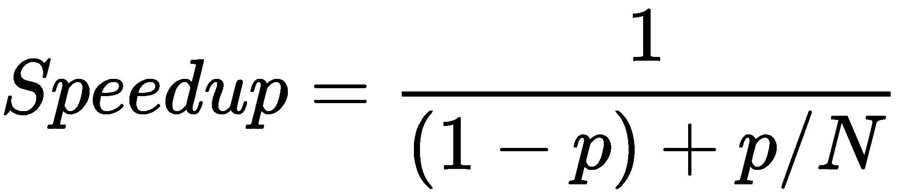
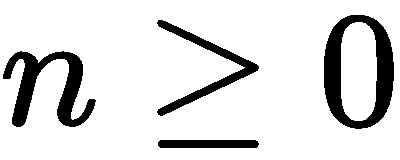
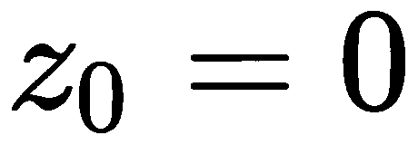
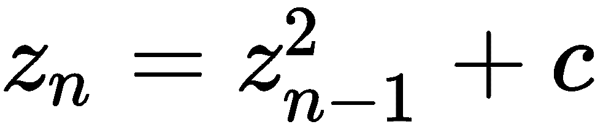
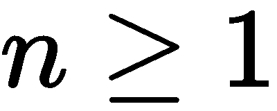
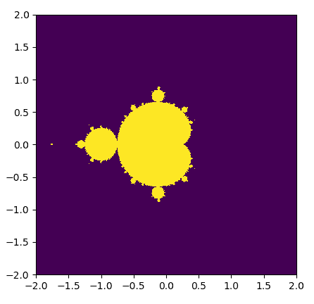
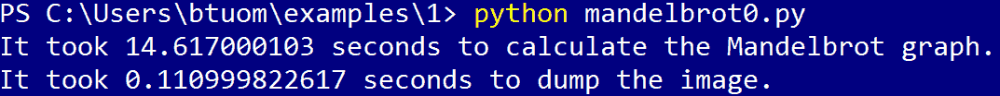
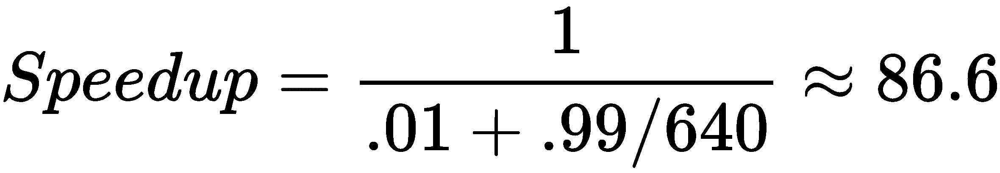
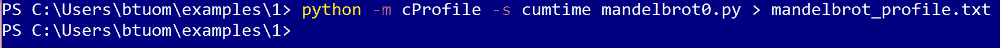
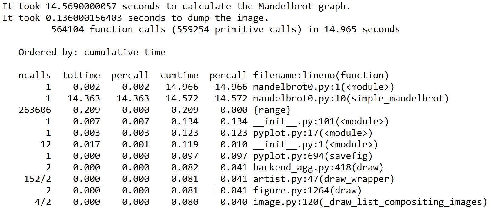

# 第一章：为什么选择 GPU 编程？

结果表明，除了能够为视频游戏渲染图形之外，**图形处理单元**（**GPU**）还为普通消费者提供了一个易于访问的**大规模并行****计算**手段——一个普通人现在可以从当地的电子产品店购买一张价值 2000 美元的现代 GPU 显卡，将其插入家里的 PC，然后几乎立即使用它进行计算能力，这在 5 到 10 年前只有顶级公司和大学的超级计算机实验室才能提供。近年来，GPU 的这种开放可访问性在许多方面都变得明显，这可以通过对新闻的简要观察来揭示——加密货币矿工使用 GPU 生成比特币等数字货币，遗传学家和生物学家使用 GPU 进行 DNA 分析和研究，物理学家和数学家使用 GPU 进行大规模模拟，AI 研究人员现在可以编程 GPU 编写剧本和创作音乐，而像谷歌和 Facebook 这样的主要互联网公司则使用配备 GPU 的服务器**农场**进行大规模机器学习任务……这个列表可以一直继续下去。

本书的主要目的是让您尽快掌握 GPU 编程，这样您也可以尽快开始使用它们的强大功能，无论您的最终目标是什么。我们的目标是涵盖如何编程 GPU 的核心基本知识，而不是提供 GPU 如何工作的复杂技术细节和图示。在本书的结尾，我们将提供进一步的资源，以便您可以进一步专业化，并应用您对 GPU 的新知识。（关于特定所需的技术知识和硬件的进一步细节将在本节之后提供。）

在这本书中，我们将使用**CUDA**，这是 NVIDIA 提供的用于**通用 GPU**（**GPGPU**）编程的框架，它最初于 2007 年发布。虽然 CUDA 是 NVIDIA GPU 的专有技术，但它是一个成熟且稳定的平台，相对容易使用，提供了一套无与伦比的第三方加速数学和 AI 相关库，并且在安装和集成方面几乎无烦恼。此外，还有现成的和标准化的 Python 库，如 PyCUDA 和 Scikit-CUDA，这使得 GPGPU 编程对有志于 GPU 编程的人来说更加容易接触。出于这些原因，我们选择在本书中使用 CUDA。

CUDA 的发音是**coo-duh**，而不是作为缩写**C-U-D-A**！CUDA 最初代表**Compute Unified Device Architecture**，但 NVIDIA 已经放弃了这个缩写，现在将 CUDA 作为一个全大写的正确名称。

我们现在将开始我们的 GPU 编程之旅，首先概述**Amdahl 定律**。Amdahl 定律是一种简单但有效的方法，可以估计通过将程序或算法卸载到 GPU 上所能获得的潜在速度提升；这将帮助我们确定是否值得我们努力重写代码以利用 GPU。然后我们将简要回顾如何使用*cProfile*模块分析我们的 Python 代码，以帮助我们找到代码中的瓶颈。

本章的学习成果如下：

+   理解 Amdahl 定律

+   在你的代码中应用 Amdahl 定律

+   使用*cProfile*模块进行 Python 代码的基本分析

# 技术要求

建议为本章安装 Anaconda Python 2.7：

[Anaconda 下载](https://www.anaconda.com/download/)

本章的代码也可在 GitHub 上找到：

[使用 Python 和 CUDA 进行 GPU 编程实战](https://github.com/PacktPublishing/Hands-On-GPU-Programming-with-Python-and-CUDA)

关于先决条件的更多信息，请查看本书的序言；关于软件和硬件要求，请查看[使用 Python 和 CUDA 进行 GPU 编程实战](https://github.com/PacktPublishing/Hands-On-GPU-Programming-with-Python-and-CUDA)的 README 部分。

# 并行化和 Amdahl 定律

在我们深入挖掘并解锁 GPU 的潜力之前，我们首先必须意识到与现代英特尔/AMD 中央处理单元（CPU）相比，它们的计算能力在哪里——这种能力并不在于它比 CPU 有更高的时钟速度，也不在于单个核心的复杂性或特定设计。单个 GPU 核心实际上相当简单，并且在与现代单个 CPU 核心相比时处于劣势，后者使用许多复杂的工程技巧，例如分支预测来减少计算的**延迟**。**延迟**指的是执行单个计算从开始到结束的总持续时间。

GPU 的强大之处在于其核心数量远多于 CPU，这意味着在**吞吐量**上有了巨大的进步。这里的**吞吐量**指的是可以同时进行的计算数量。让我们用一个类比来更好地理解这意味着什么。GPU 就像一条非常宽阔的城市道路，设计用来同时处理许多低速行驶的汽车（高吞吐量，高延迟），而 CPU 则像一条狭窄的高速公路，一次只能允许几辆车通过，但可以将每辆单独的汽车更快地送到目的地（低吞吐量，低延迟）。

通过查看这些新 GPU 有多少核心，我们可以了解吞吐量的增加。为了给你一个概念，平均的英特尔或 AMD CPU 只有两个到八个核心——而入门级消费级 NVIDIA GTX 1050 GPU 有*640 个核心*，而最新的顶级 NVIDIA RTX 2080 Ti 有*4,352 个核心*！只要我们知道如何正确地**并行化**我们希望加速的任何程序或算法，我们就可以利用这种巨大的吞吐量。通过**并行化**，我们的意思是通过重写程序或算法，以便我们可以将我们的工作负载分割成在多个处理器上同时并行运行。让我们从现实生活中的一个类比来思考。

假设你正在建造一栋房子，并且你已经准备好了所有的设计和材料。你雇佣了一个工人，并估计建造这栋房子需要 100 小时。让我们假设这栋特定的房子可以以这种方式建造，即额外雇佣的每个工人都可以完美地分担工作——也就是说，两个工人需要 50 小时，四个工人需要 25 小时，十个工人需要 10 小时来建造这栋房子——建造你房子的所需小时数将是 100 除以你雇佣的工人数量。这是一个**可并行化任务**的例子。

我们注意到，对于两个工人来说，完成这项任务的速度是单独一个工人独自建造房屋（即串行）的两倍，对于十个工人一起完成（即并行）则是十倍——也就是说，如果 *N* 是工人的数量，那么它将是 *N* 倍快。在这种情况下，*N* 被称为将我们的任务并行化到串行版本中的**加速比**。

在我们开始编写给定算法的并行版本之前，我们通常首先估算一下并行化将给我们的任务带来的**潜在**加速比。这有助于我们确定是否值得投入资源和时间来编写程序的并行化版本。因为现实生活比我们给出的例子要复杂得多，所以很明显，我们不可能总是完美地并行化每个程序——大多数时候，只有我们程序的一部分可以很好地并行化，而其余部分则必须串行运行。

# 使用 Amdahl 定律

我们现在将推导出**Amdahl 定律**，这是一个简单的算术公式，用于估算将串行程序的一部分代码并行化到多个处理器上可能产生的潜在速度提升。我们将通过继续我们之前的建造房子的类比来完成这个推导。

上次，我们只考虑了房屋的实际物理建造作为整个时间跨度，但现在，我们也将设计房屋的时间纳入建造房屋的时间跨度。假设世界上只有一个人有设计你房屋的能力——那就是你——而你设计你房屋的计划需要 100 小时。没有其他任何人能与你相比的建筑天赋，所以这部分任务根本不可能被其他建筑师分担——也就是说，设计你的房屋将需要 100 小时，无论你拥有多少资源或能雇佣多少人。所以，如果你只有一个劳动力来建造你的房屋，建造整个房屋所需的时间将是 200 小时——100 小时用于设计，100 小时用于单个劳动力建造。如果我们雇佣两个劳动力，这将需要 150 小时——设计房屋的时间将保持为 100 小时，而建造将需要 50 小时。很明显，建造房屋所需的总小时数将是 100 + 100 / *N*，其中*N*是我们雇佣的劳动力数量。

现在，让我们退一步思考，如果我们雇佣一个劳动力，建造房屋需要多少时间——我们最终使用这个来确定随着我们雇佣更多劳动力时的加速比；也就是说，这个过程变得有多快。如果我们雇佣一个劳动力，我们会看到设计和建造房屋所需的时间相同——100 小时。所以，我们可以这样说，在设计上花费的时间部分是 0.5（50%），建造房屋所需的时间部分也是 0.5（50%），当然，这两个部分加起来是 1，即 100%。当我们增加劳动力时，我们想要与这个进行比较——如果我们有两个劳动力，建造的时间部分减半，所以与我们的任务原始串行版本相比，这将需要 0.5 + 0.5/2 = 0.75（75%）的时间，0.75 乘以 200 小时是 150 小时，所以我们可以看到这是有效的。此外，我们可以看到，如果我们有*N*个劳动力，我们可以计算出*N*个劳动力的并行化建造将需要多少时间，公式是 0.5 + 0.5 / *N*。

现在，让我们确定通过增加额外劳动力所获得的 *加速比*。如果我们有两个劳动力，建造房屋需要 75%的时间，我们可以取 0.75 的倒数来确定我们并行化的加速比——也就是说，加速比将是 1 / 0.75，大约是 1.33 倍于只有一个劳动力的情况。在这种情况下，如果我们有*N*个劳动力，加速比将是 1 / (0.5 + 0.5 / *N*)。

我们知道，随着我们添加越来越多的劳动者，.5 / N 将非常接近 0，因此我们可以看到，当你并行化这个任务时，你总能得到一个速度提升的上限——即 1 / (.5 + 0) = 2。我们可以用估计的最大速度提升来除以原始串行时间，以确定这个任务将花费的绝对最小时间——200 / 2 = 100 小时。

我们刚刚应用于确定并行编程中加速原理的规则被称为**阿姆达尔定律**。它只需要了解我们原始串行程序中代码的可并行化执行时间比例，这被称为*p*，以及我们可用的处理器核心数*N*。

在这种情况下，不可并行化代码的执行时间比例总是*1 – p*，所以我们只需要知道*p*。

我们现在可以使用**阿姆达尔定律**如下计算速度提升：



总结一下，阿姆达尔定律是一个简单的公式，它允许我们大致（非常粗略地）估计一个至少可以部分并行化的程序的可能速度提升。这可以提供一个一般性的想法，即是否值得编写特定串行程序的并行版本，前提是我们知道我们可以并行化多少代码（*p*），以及我们可以在多少核心上运行我们的并行化代码（*N*）。

# **曼德尔布罗特集**

我们现在准备看到一个非常标准的并行计算示例，我们将在本文的后面部分再次讨论——一个生成*曼德尔布罗特集*图像的算法。让我们首先准确地定义我们的意思。

对于给定的复数*c*，我们定义一个递归序列用于，其中和对于。如果|*z[n]*|在*n*增加到无穷大时仍然被 2 所限制，那么我们将说*c*是曼德尔布罗特集的成员。

回想一下，我们可以将复数可视化为位于二维笛卡尔平面上，其中*x*轴代表实部，y 轴代表虚部。因此，我们可以很容易地用一个非常吸引人（并且众所周知）的图表来可视化曼德尔布罗特集。在这里，我们将用较浅的色调表示曼德尔布罗特集的成员，用较深的色调表示非成员，如下所示：



现在，让我们考虑如何在 Python 中生成这个集合。我们首先必须考虑一些事情——因为我们显然不能检查每个复数是否在 Mandelbrot 集中，我们必须选择一个特定的范围来检查；我们必须确定每个范围内我们将考虑的点数（*宽度，高度*）；以及我们将检查的*最大值*n 的值（`max_iters`）。我们现在可以准备实现一个生成 Mandelbrot 集图的函数——在这里，我们通过在图中迭代每个点来按顺序执行。

我们首先导入 NumPy 库，这是一个数值库，我们将在整篇文章中大量使用。我们的实现在这里是`simple_mandelbrot`函数。我们首先使用 NumPy 的`linspace`函数生成一个网格，这个网格将作为离散的复平面（接下来的代码应该相当直接）：

```py
import numpy as np

def simple_mandelbrot(width, height, real_low, real_high, imag_low, imag_high, max_iters):

     real_vals = np.linspace(real_low, real_high, width)
     imag_vals = np.linspace(imag_low, imag_high, height)

     # we will represent members as 1, non-members as 0.

     mandelbrot_graph = np.ones((height,width), dtype=np.float32)

     for x in range(width):

         for y in range(height):

             c = np.complex64( real_vals[x] + imag_vals[y] * 1j  )           
             z = np.complex64(0)

             for i in range(max_iters):

                 z = z**2 + c

                 if(np.abs(z) > 2):
                     mandelbrot_graph[y,x] = 0
                     break

     return mandelbrot_graph
```

现在，我们想要添加一些代码来将 Mandelbrot 集的图像输出为 PNG 格式文件，所以让我们在开头添加适当的头文件：

```py
from time import time
import matplotlib
# the following will prevent the figure from popping up
matplotlib.use('Agg')
from matplotlib import pyplot as plt
```

现在，让我们添加一些代码来生成 Mandelbrot 集并将其输出到文件，并使用 time 函数来计时这两个操作：

```py
if __name__ == '__main__':

     t1 = time()
     mandel = simple_mandelbrot(512,512,-2,2,-2,2,256, 2)
     t2 = time()
     mandel_time = t2 - t1

     t1 = time()
     fig = plt.figure(1)
     plt.imshow(mandel, extent=(-2, 2, -2, 2))
     plt.savefig('mandelbrot.png', dpi=fig.dpi)
     t2 = time()

     dump_time = t2 - t1

     print 'It took {} seconds to calculate the Mandelbrot graph.'.format(mandel_time)
     print 'It took {} seconds to dump the image.'.format(dump_time)
```

现在让我们运行这个程序（这个程序也可以作为`mandelbrot0.py`文件，位于 GitHub 仓库的`1`文件夹中）：



生成 Mandelbrot 集大约需要 14.62 秒，而将图像输出大约需要 0.11 秒。正如我们所看到的，我们是逐点生成 Mandelbrot 集的；不同点的值之间没有相互依赖性，因此它是一个本质上可并行化的函数。相比之下，输出图像的代码不能并行化。

现在，让我们从 Amdahl 定律的角度来分析这个问题。如果我们在这里并行化代码，我们能获得什么样的加速效果？整个程序运行大约需要 14.73 秒；由于我们可以并行化 Mandelbrot 集的生成，我们可以认为并行化代码的执行时间部分*p* = 14.62 / 14.73 = .99。这个程序有 99%的并行性！

我们能获得什么样的加速效果？嗯，我现在正在使用一台配备入门级 GTX 1050 GPU（640 个核心）的笔记本电脑；因此，当我们使用公式时，我们的*N*将是 640。我们如下计算加速比：



这确实非常好，这会告诉我们，将我们的算法编程以使用 GPU 是值得的。记住，Amdahl 定律只提供了一个非常粗略的估计！当我们将计算卸载到 GPU 时，会有额外的考虑因素，例如 CPU 向 GPU 发送和接收数据所需的时间；或者，卸载到 GPU 的算法只有部分可并行化。

# 代码性能分析

在前面的例子中，我们看到了我们可以使用 Python 中的标准 `time` 函数单独计时不同的函数和组件。虽然这种方法对于我们的小型示例程序来说效果不错，但这并不总是适用于调用许多不同函数的大型程序，其中一些可能或可能不值得我们并行化，甚至优化在 CPU 上。我们的目标是找到程序的瓶颈和热点——即使我们感到精力充沛，在每次函数调用周围使用 `time`，我们可能也会错过某些东西，或者可能有一些系统或库调用我们没有考虑，但恰好是它们减慢了速度。在我们甚至考虑将代码重写为在 GPU 上运行之前，我们应该找到候选的代码部分来卸载到 GPU 上；我们必须始终遵循著名美国计算机科学家唐纳德·克努特（Donald Knuth）的明智话语：过早优化是万恶之源。

我们使用所谓的**分析器**来找到代码中的这些热点和瓶颈。一个**分析器**将方便地让我们看到程序花费最多时间的地方，并允许我们相应地进行优化。

# 使用 cProfile 模块

我们将主要使用 *cProfile* 模块来检查我们的代码。这个模块是标准库中的一个函数，包含在每一个现代 Python 安装中。我们可以通过命令行使用 `-m cProfile` 来运行分析器，并指定我们想要按每个函数累计花费的时间来组织结果，使用 `-s cumtime`，然后使用 `>` 运算符将输出重定向到文本文件中。

这在 Linux Bash 或 Windows PowerShell 命令行上都会有效。

让我们试试看：



我们现在可以使用我们喜欢的文本编辑器查看文本文件的内容。让我们记住，程序的输出将包含在文件的开始部分：



现在，由于我们没有在原始示例中删除对 `time` 的引用，我们在文件开始的前两行看到了它们的输出。然后我们可以看到在这个程序中进行的总函数调用次数以及运行它的累计时间。

随后，我们有一个函数列表，按程序中调用的累积耗时从多到少排序；第一行是程序本身，而第二行是，正如预期的那样，来自我们程序的 `simple_mandelbrot` 函数。（注意这里的时间与我们使用 `time` 命令测量的时间一致）。之后，我们可以看到许多与将 Mandelbrot 图形输出到文件相关的库和系统调用，所有这些调用相对于较少的时间。我们使用 *cProfile* 的此类输出来推断给定程序中的瓶颈。

# 摘要

使用 GPU 而不是 CPU 的主要优势是其更高的吞吐量，这意味着我们可以在 GPU 上同时执行比 CPU 更多的*并行*代码；GPU 不能使递归算法或不可并行化算法变得稍微快一些。我们注意到一些任务，例如建造房子的例子，只有部分可并行化——在这个例子中，我们无法加快设计房子的过程（在这种情况下，设计本质上是*串行*的），但我们可以通过雇佣更多的工人来加快建设过程（在这种情况下，建设是可并行化的）。

我们使用这个类比来推导阿姆达尔定律，这是一个公式，如果我们知道可并行化代码的执行时间百分比以及我们需要运行此代码的处理器数量，它就可以给我们一个程序潜在加速的粗略估计。然后，我们将阿姆达尔定律应用于分析生成曼德布罗特集并将其输出到图像文件的小程序，并确定这是一个很好的候选者，可以并行化到 GPU 上。最后，我们简要概述了使用*cPython*模块分析代码；这允许我们看到程序中的瓶颈，而无需显式地计时函数调用。

现在我们已经建立了一些基本概念，并且有了学习 GPU 编程的动机，我们将在下一章设置基于 Linux 或 Windows 10 的 GPU 编程环境。然后，我们将在下一章立即深入 GPU 编程的世界，在那里我们将实际编写本章中看到的曼德布罗特程序的 GPU 版本。

# 问题

1.  本章的曼德布罗特示例中有三个`for`语句；然而，我们只能并行化前两个。为什么我们不能并行化所有的`for`循环？

1.  当我们将阿姆达尔定律应用于将串行 CPU 算法卸载到 GPU 时，它没有考虑到什么？

1.  假设你获得了对三个全新的顶级机密 GPU 的独家访问权，它们在所有方面都相同，除了核心数量——第一个有 131,072 个核心，第二个有 262,144 个核心，第三个有 524,288 个核心。如果你将这些 GPU（生成 512 x 512 像素图像的曼德布罗特示例）并行化并卸载，第一个和第二个 GPU 之间的计算时间会有差异吗？第二个和第三个 GPU 之间呢？

1.  你能想到在阿姆达尔定律的背景下，将某些算法或代码块指定为*可并行化*的任何问题吗？

1.  为什么我们应该使用分析器而不是仅仅使用 Python 的`time`函数？
