# 第二章：设置您的 GPU 编程环境

我们现在将看到如何在 Windows 和 Linux 下设置适合 GPU 编程的环境。在两种情况下，我们都需要采取几个步骤。我们将逐一进行这些步骤，并在进行过程中注意 Linux 和 Windows 之间的任何差异。当然，您可以根据自己的操作系统选择跳过或忽略任何不适用部分或注释。

读者应注意，在本章中，我们只涵盖两种基于 64 位 Intel/AMD 的 PC 平台——Ubuntu LTS（长期支持）版本和 Windows 10。请注意，任何基于 Ubuntu LTS 的 Linux 操作系统（如 Xubuntu、Kubuntu 或 Linux Mint）也同等适用于通用的 Unity/GNOME 基于的 Ubuntu 版本。

我们建议使用 Python 2.7 而不是 Python 3.x。Python 2.7 在我们文本中使用的所有库中都有稳定的支持，并且我们已经在这本书的所有示例中用 Python 2.7 在 Windows 和 Linux 平台上进行了测试。Python 3.x 用户可以使用这本书，但应了解 Python 2.7 和 Python 3.x 之间的差异。其中一些示例已经使用 Python 3.7 进行了测试，但需要一些标准更改，例如在 Python `print`函数中添加括号。

Packt 作者 Sebastian Raschka 博士提供了一个 Python 2.7 和 3.x 之间关键差异的列表，请参阅[`sebastianraschka.com/Articles/2014_python_2_3_key_diff.html`](https://sebastianraschka.com/Articles/2014_python_2_3_key_diff.html)。

我们特别建议 Windows 和 Linux 用户使用 Anaconda Python 2.7 发行版，因为它可以基于用户安装，无需`sudo`或`管理员`访问权限，包含本文本中所需的所有数据科学和可视化模块，并使用利用 Intel 的**数学内核库**（**MKL**）的快速预优化 NumPy/SciPy 包。（默认的 Linux `/usr/bin/python`安装也应足够用于本文本，但您可能需要手动安装一些包，例如 NumPy 和 Matplotlib。）

Anaconda Python (包括 2.7 和 3.x 版本) 可以在[`www.anaconda.com/download/`](https://www.anaconda.com/download/)下载，适用于所有平台。

对于使用其他受支持平台（例如，macOS、Windows 7/8、Windows Server 2016、Red Hat/Fedora、OpenSUSE 和 CENTOS）的用户，应查阅官方 NVIDIA CUDA 文档（[`docs.nvidia.com/cuda/`](https://docs.nvidia.com/cuda/)）以获取更多详细信息。此外，还有其他硬件的可能性：对嵌入式系统或具有某些板卡经验（如 Raspberry Pi）的机器人感兴趣的读者可能希望从基于 ARM 的 NVIDIA Jetson 开发板开始，而对云计算或网页编程感兴趣的读者可能考虑远程使用适当的 Azure 或 AWS 实例。在这些情况下，鼓励读者阅读官方文档来设置他们的驱动程序、编译器和 CUDA 工具包。本章中的一些步骤可能适用也可能不适用。

本章的学习成果包括：

+   确保我们拥有适当的硬件

+   安装 NVIDIA GPU 驱动程序

+   设置适当的 C/C++ 编程环境

+   安装 NVIDIA CUDA 工具包

+   为 GPU 编程设置我们的 Python 环境

# 技术要求

对于本章，建议在 [`www.anaconda.com/download/`](https://www.anaconda.com/download/) 安装 Anaconda Python 2.7。

本章的代码也可在 GitHub 上找到，网址为 [`github.com/PacktPublishing/Hands-On-GPU-Programming-with-Python-and-CUDA.`](https://github.com/PacktPublishing/Hands-On-GPU-Programming-with-Python-and-CUDA)

关于先决条件的更多信息，请参阅本书的序言；有关软件和硬件要求，请参阅 [`github.com/PacktPublishing/Hands-On-GPU-Programming-with-Python-and-CUDA.`](https://github.com/PacktPublishing/Hands-On-GPU-Programming-with-Python-and-CUDA) 的 README 部分

# 确保我们拥有正确的硬件

对于本书，我们建议您至少拥有以下硬件：

+   基于 64 位 Intel/AMD 的 PC

+   4 GB（GB）的 RAM

+   NVIDIA GeForce GTX 1050 GPU（或更高版本）

此配置将确保您可以舒适地学习 GPU 编程，运行本书中的所有示例，并且还可以运行一些其他较新且有趣的基于 GPU 的软件，例如 Google 的 TensorFlow（一个机器学习框架）或 Vulkan SDK（一个前沿的图形 API）。

**请注意，您必须拥有 NVIDIA 品牌的 GPU 才能使用本书！** CUDA 工具包是 NVIDIA 卡的专有软件，因此它不适用于编程 Intel HD 或 Radeon GPU。

如前所述，我们将假设您正在使用 Windows 10 或 Ubuntu LTS（长期支持）版本。

Ubuntu LTS 版本通常具有 14.04、16.04、18.04 等形式的版本号。

Ubuntu LTS 是 Linux 中最主流的版本，这确保了与新的软件和工具包的最大兼容性。请记住，基于 Ubuntu 的 Linux 变种有很多，例如 Linux Mint 或 Xubuntu，它们通常工作得同样好。（我个人发现，Linux Mint 对于配备 GPU 的笔记本电脑来说，开箱即用效果相当不错。）

我们应该注意，我们假设您至少有一个入门级的 GTX 1050（帕斯卡）GPU，或者任何新架构中的等效产品。请注意，本书中的许多示例可能在大多数较旧的 GPU 上都能工作，但作者只在 GTX 1050（在 Windows 10 上）和 GTX 1070（在 Linux 上）上进行了测试。虽然这些示例没有在较旧的 GPU 上进行测试，但 2014 年代的入门级 Maxwell 架构 GPU，例如 GTX 750，也应该适用于本文的目的。

如果您使用的是台式机 PC，请在继续之前，按照所有包含的说明物理安装您的 GPU。

# 检查您的硬件（Linux）

我们现在将在 Linux 上进行一些基本检查，以确保我们有正确的硬件。让我们首先打开终端并进入 bash 命令行——您可以在 Ubuntu 中通过按组合键 *Ctrl* + *Alt* + *T* 来快速完成此操作。

现在我们通过输入 `lscpu` 并按 *Enter* 键来检查我们的处理器。会出现很多信息，但只需查看第一行，确保架构确实是 x86_64：

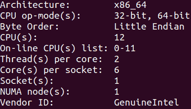

接下来，我们在 bash 提示符中输入 `free -g` 来检查我们的内存容量，然后再次按 *Enter* 键。这将告诉我们第一行第一项中我们拥有的总内存量（以千兆字节为单位），以及下一行中交换空间中的内存量：

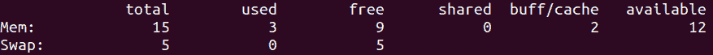

这当然足够了。

最后，让我们看看我们是否有合适的 GPU。NVIDIA GPU 通过 PCI 总线与我们的 PC 通信，因此我们可以使用 `lspci` 命令列出所有 PCI 硬件。通常会有很多其他硬件列出来，所以让我们使用 `grep` 命令通过在 bash 提示符中输入 `lspci | grep -e "NVIDIA"` 来仅过滤 NVIDIA GPU：

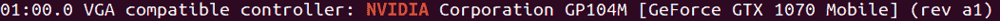

这是一个 GTX 1070，幸运的是，它超过了我们至少需要 GTX 1050 的需求。

# 检查您的硬件（Windows）

首先，我们必须打开 Windows 控制面板。我们通过按 *Windows* + *R* 并在提示符中输入 `Control Panel` 来完成此操作，如下面的截图所示：

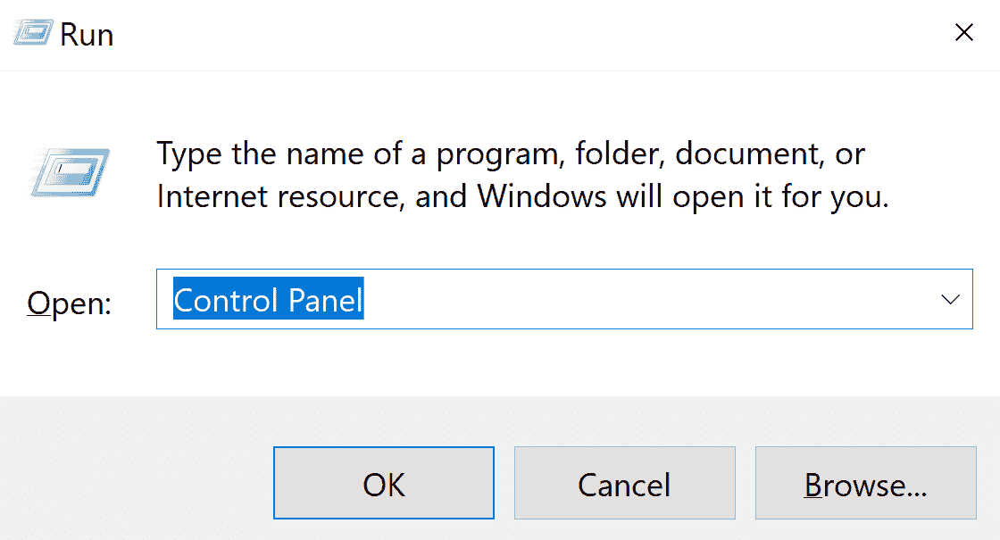

Windows 控制面板会弹出。现在点击系统和安全，然后在下一个屏幕上选择系统。这将立即告诉我们我们有多少 RAM，以及我们是否有 64 位处理器：

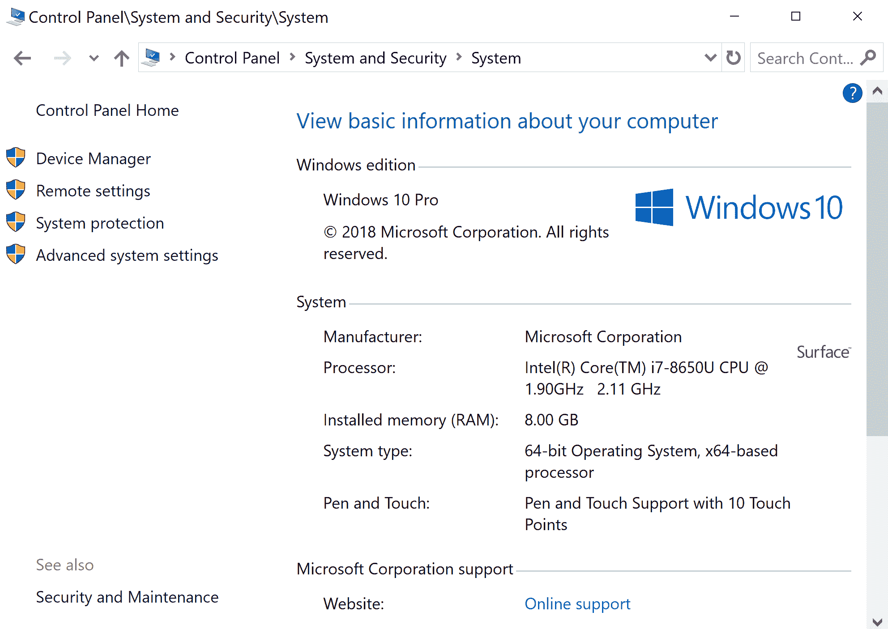

要检查我们的 GPU，请点击窗口左上角的设备管理器。随后，Windows 设备管理器将弹出；然后你可以选择显示适配器下拉框来检查系统上安装了哪些 GPU：

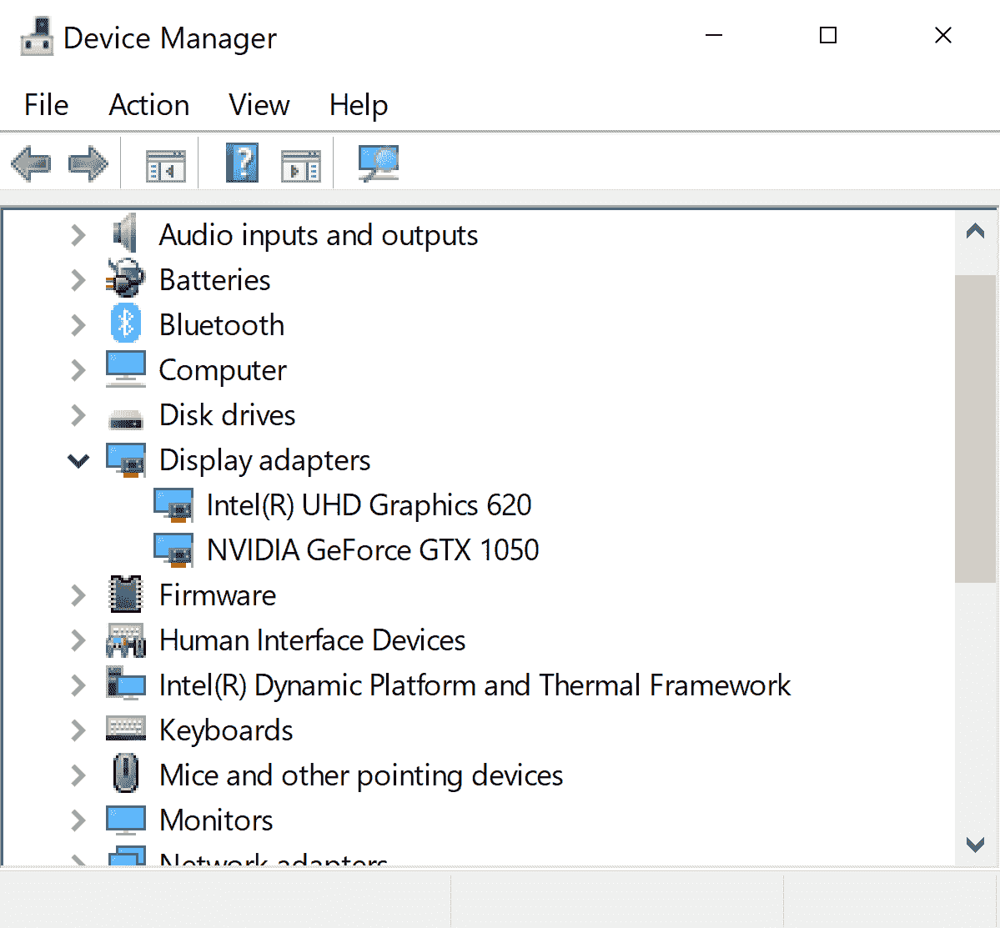

# 安装 GPU 驱动程序

如果你已经安装了 GPU 的驱动程序，你可能可以跳过这一步；此外，一些 CUDA 版本已经预包装了最新驱动程序。通常，CUDA 对安装的驱动程序非常挑剔，甚至可能不与 CUDA 工具包驱动程序兼容，因此你可能需要尝试几个不同的驱动程序才能找到可以工作的一个。

通常来说，Windows 的 CUDA 驱动程序兼容性更好，安装过程也更用户友好。Windows 用户可以考虑跳过这一步，直接使用与 CUDA 工具包捆绑的驱动程序，我们将在本章稍后安装。然而，我们强烈建议 Linux 用户（尤其是 Linux 笔记本电脑用户）在继续之前，仔细遵循本节中的所有步骤。

# 安装 GPU 驱动程序（Linux）

在 Ubuntu 中，NVIDIA GPU 的默认驱动程序是一个名为 Nouveau 的开源驱动程序；不幸的是，这个驱动程序与 CUDA 完全不兼容，因此我们必须安装一个专有驱动程序。我们必须将特殊的`graphics-drivers`仓库添加到我们的包管理器中，以便能够将专有的 NVIDIA 驱动程序下载到我们的 Ubuntu 系统中。我们通过在 bash 提示符中输入以下行来添加仓库：

```py
sudo add-apt-repository ppa:graphics-drivers/ppa
```

由于这是一个`sudo`超级用户命令，你必须输入你的密码。我们现在通过输入以下行来将我们的系统与新仓库同步：

```py
sudo apt-get update
```

我们现在应该准备好安装我们的驱动程序了。从 Ubuntu 桌面，按*Windows* + *R*，然后输入`software and drivers`：

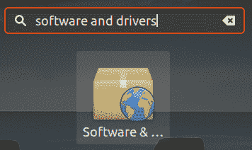

软件与驱动程序设置菜单应该会出现。从这里，点击标记为“附加驱动程序”的选项卡。你应该能看到为你 GPU 提供的可用稳定专有驱动程序的选择；选择你看到的最新一个（在我的情况下，是`nvidia-driver-396`，如下所示）：

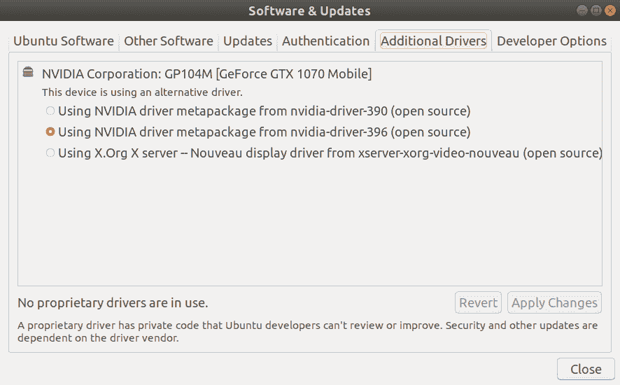

选择最新驱动程序后，点击应用更改。你将再次被提示输入`sudo`密码，然后驱动程序将开始安装；应该会出现一个进度条。请注意，这个过程可能需要很长时间，并且你的电脑可能会看起来像是在挂起；这个过程可能需要超过一个小时，所以请耐心等待。

最后，当过程完成后，重置你的电脑，并返回到你的 Ubuntu 桌面。现在按*Windows* + *A*，然后输入`nvidia-settings`（或者你也可以从 bash 提示符运行这个程序）。NVIDIA X 服务器设置管理器应该会出现，并指示你正在使用适当的驱动程序版本：

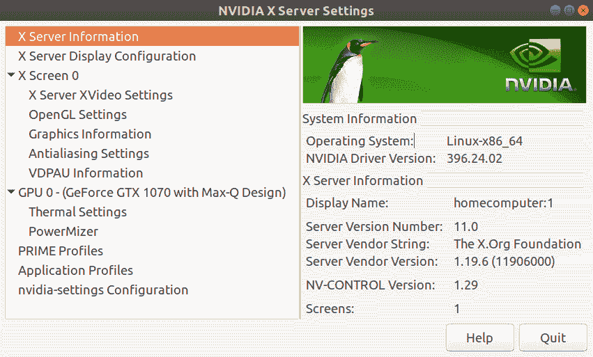

# 安装 GPU 驱动程序（Windows）

再次强调——通常建议读者最初跳过此步骤，然后安装 CUDA 工具包中包含的驱动程序。

Windows 的最新驱动程序可以直接从 NVIDIA 的网站 [`www.nvidia.com/Download/`](http://www.nvidia.com/Download/) 获取。只需从下拉菜单中选择适合您 GPU 的适当 Windows 10 驱动程序，这些是可执行文件（`.exe`）。只需双击文件管理器中的文件即可安装驱动程序。

# 设置 C++ 编程环境

现在我们已经安装了驱动程序，我们必须设置我们的 C/C++ 编程环境；Python 和 CUDA 对它们可能集成的编译器和 IDE 都有特定的要求，因此您可能需要小心。对于 Ubuntu Linux 用户，标准仓库编译器和 IDE 通常可以正常工作并与 CUDA 工具包完美集成，而 Windows 用户可能需要更加小心。

# 设置 GCC、Eclipse IDE 和图形依赖项 (Linux)

从 Ubuntu 桌面打开终端 (*Ctrl* + *Alt* + *T*)。我们首先按照以下方式更新 `apt` 仓库：

```py
sudo apt-get update
```

现在，我们可以使用一行额外的命令安装我们需要的所有 CUDA 软件：

```py
sudo apt-get install build-essential binutils gdb eclipse-cdt
```

在这里，`build-essential` 是包含 `gcc` 和 `g++` 编译器和其他实用程序（如 make）的软件包；`binutils` 包含一些通用的实用程序，如 LD 链接器；`gdb` 是调试器；Eclipse 是我们将使用的 IDE。

让我们再安装一些额外的依赖项，这将允许我们使用以下命令运行 CUDA 工具包中包含的一些图形（OpenGL）演示：

```py
sudo apt-get install freeglut3 freeglut3-dev libxi-dev libxmu-dev
```

现在您应该可以安装 CUDA 工具包了。

# 设置 Visual Studio (Windows)

在撰写本文时，只有 Visual Studio 2015 似乎与 Python 和最新的 CUDA 工具包完美集成；即 Visual Studio 版本 14.0。

虽然在 Visual Studio 的较新版本（例如 2017）下可能可以创建一个子安装，但我们建议读者直接在系统上安装带有 C/C++ 支持的 Visual Studio 2015。

Visual Studio Community 2015，该软件的免费版本，可以从 [`visualstudio.microsoft.com/vs/older-downloads/`](https://visualstudio.microsoft.com/vs/older-downloads/) 下载。

在这里，我们将进行最小化安装，只包含 CUDA 所需的组件。我们运行安装软件，并选择自定义安装：

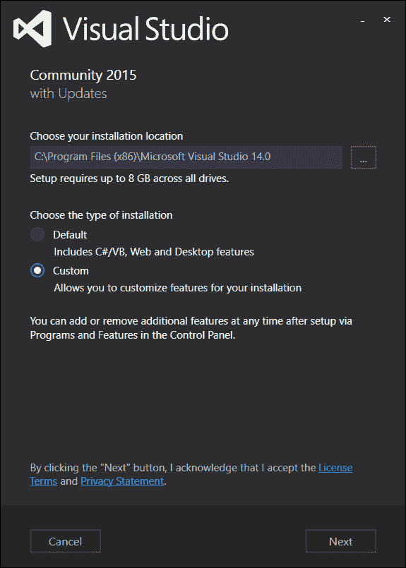

点击“下一步”，然后点击编程语言下拉框，然后选择 Visual C++（如果您需要或需要其他目的的其他软件包或编程语言，请随意选择，但我们只需要 Visual C++ 用于 GPU 编程）：

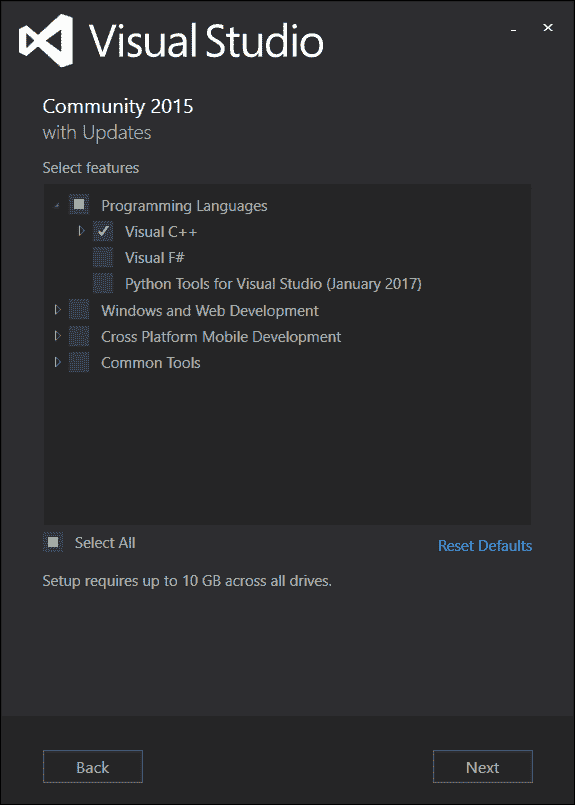

这可能需要一些时间来安装。完成此步骤后，我们将准备好安装 CUDA 工具包。

# 安装 CUDA 工具包

最后，我们正在逐渐接近我们的目标！现在，我们通过访问 [`developer.nvidia.com/cuda-downloads`](https://developer.nvidia.com/cuda-downloads) 下载我们的 CUDA 工具包。 [](https://developer.nvidia.com/cuda-downloads) 选择适当的操作系统，您将看到几个选项。在 Windows 和 Linux 的案例中，都有网络和本地安装选项。我倾向于在 Windows 和 Linux 下都使用本地安装选项，因为我更喜欢一次性下载整个包；如果出现任何网络问题，那么您可以确信这些问题不会在您安装 CUDA 工具包时发生。

# 安装 CUDA 工具包（Linux）

对于 Linux 用户，您将看到有使用 `.deb` 包和 `.run` 文件的选择；对于大多数用户，我建议选择 `.deb` 文件，因为这会自动安装 CUDA 所需的任何缺失包。`.run` 文件在您的系统 **高级包工具** (**APT**) 系统之外安装，这实际上只是将适当的文件复制到系统 `/usr` 的二进制和库目录。如果您不想干扰您系统的 APT 系统或仓库，并且对 Linux 有很好的理解，`.run` 文件可能更合适。在任何情况下，都要仔细遵循网站上关于安装包的说明，这些说明可能因版本而异。

在包安装完成后，您可能需要配置您的 `PATH` 和 `LD_SYSTEM_CONFIG` 环境变量，以便您的系统可以找到 CUDA 所需的适当二进制可执行文件和库文件。我建议通过将以下行追加到您用户目录下的 `.bashrc` 文件末尾来完成此操作。使用您喜欢的文本编辑器，例如 `gedit`、`nano`、`emacs` 或 `vim` 打开 `~/.bashrc` 文件，并在文件的底部添加以下行：

```py
export PATH="/usr/local/cuda/bin:${PATH}
export LD_LIBRARY_PATH="/usr/local/cuda/lib64:${LD_LIBRARY_PATH}"
```

保存文件并退出终端。现在，您可以通过打开一个新的终端并输入 `nvcc --version` 然后按 *Enter* 键来确保您已正确安装了工具包，这将为您提供工具包编译器的版本信息。（`nvcc` 是命令行 CUDA C 编译器，类似于 `gcc` 编译器。）

# 安装 CUDA 工具包（Windows）

对于 Windows 用户，您可以通过双击 `.exe` 文件并遵循所有屏幕提示来安装包。

安装完成后，重置您的系统。现在，我们将通过检查 `nvcc` 编译器来确保 CUDA 已正确安装。在开始菜单下，点击 `Visual Studio 2015` 文件夹，然后点击 VS2015 x64 本地工具命令提示符。一个终端窗口将弹出；现在输入 `nvcc --version` 并按 *Enter* 键，应该会给出 NVIDIA 编译器的版本信息。

# 设置我们的 Python 环境以进行 GPU 编程

在我们的系统上正确安装了编译器、IDE 和 CUDA 工具包之后，我们现在可以为 GPU 编程设置一个合适的 Python 环境。这里有多种选择，但我们明确建议您使用 Anaconda Python 发行版。Anaconda Python 是一个自包含且用户友好的发行版，可以直接安装到您的用户目录中，并且安装、使用或更新时不需要任何管理员或`sudo`级别的系统访问权限。

请记住，Anaconda Python 有两种版本——Python 2.7 和 Python 3。由于 Python 3 目前对我们将使用的某些库支持不佳，因此本书中将使用 Python 2.7，它仍然有广泛的主流使用。

您可以通过访问[`www.anaconda.com/download`](https://www.anaconda.com/download)，选择您的操作系统，然后选择下载发行版的 Python 2.7 版本来安装 Anaconda Python。按照 Anaconda 网站上的说明安装发行版，这相对简单。我们现在可以为 GPU 编程设置我们的本地 Python 安装。

我们现在将设置本书可能最重要的 Python 包：Andreas Kloeckner 的 PyCUDA 包。

# 安装 PyCUDA（Linux）

在 Linux 中打开命令行。通过在 bash 提示符下输入`which python`并按*Enter*键来确保您的`PATH`变量已正确设置，以便使用本地 Anaconda Python 安装（而不是系统范围内的安装）；这应该会告诉您 Python 二进制文件位于您的本地`~/anaconda2/bin`目录中，而不是`/usr/bin`目录中。如果不是这种情况，打开文本编辑器，在`~/.bashrc`文件的末尾添加一行`export PATH="/home/${USER}/anaconda2/bin:${PATH}"`，保存此文件，然后打开一个新的终端，再次检查。

PyCUDA 的安装有几种选择。最简单的方法是通过在命令行中输入`pip install pycuda`从 PyPI 仓库安装最新稳定版本。您也可以通过遵循 PyCUDA 官方网站[`mathema.tician.de/software/pycuda/`](https://mathema.tician.de/software/pycuda/)上的说明来安装 PyCUDA 的最新版本。请注意，如果您希望从不同的来源重新安装 PyCUDA，请务必先使用`pip uninstall pycuda`卸载它。

# 创建环境启动脚本（Windows）

Windows 用户需要特别注意，为了使用 PyCUDA，他们必须确保 Visual Studio 和 Anaconda Python 环境变量设置正确；否则，Python 将无法找到 NVIDIA 的 `nvcc` CUDA 编译器或 Microsoft 的 `cl.exe` C++编译器。幸运的是，包含设置这些环境的批处理脚本，但我们必须小心确保每次我们想要进行 GPU 编程时都执行这些脚本。

因此，我们将创建一个批处理脚本，通过依次调用其他两个脚本来启动适当的 IDE 或命令行环境。（此脚本也可在 [`github.com/PacktPublishing/Hands-On-GPU-Programming-with-Python-and-CUDA/blob/master/2/launch-python-cuda-environment.bat`](https://github.com/btuomanen/handsongpuprogramming/blob/master/2/launch-python-cuda-environment.bat) 找到。）

一定要首先打开 Windows 记事本，并按照以下步骤操作：

首先，找到您的 Visual Studio `vcvars.bat` 文件的位置；在 Visual Studio 2015 的情况下，它位于 `C:\Program Files (x86)\Microsoft Visual Studio 14.0\VC\vcvarsall.bat`。

将以下行输入到您的文本编辑器中，然后按 *Enter* 键：

```py
call "C:\Program Files (x86)\Microsoft Visual Studio 14.0\VC\vcvarsall.bat" amd64
```

我们现在需要调用 Anaconda 的 `activate.bat` 脚本来设置 Anaconda Python 环境变量；标准路径是 `Anaconda2\Scripts\activate.bat`。我们必须进一步通过此脚本的参数来指示 Anaconda 库的位置。在我的情况下，我的启动脚本中的第二行将是 `call "C:\Users\%username%\Anaconda2\Scripts\activate.bat" C:\Users\%username%\Anaconda2`。

最后，我们批处理脚本的最后一行将启动您偏好的编程环境——IDE 或命令行提示符——这将继承前两个脚本设置的所有必要环境和系统变量。如果您喜欢使用传统的 DOS 样式命令提示符，则此行应该是 `cmd`。如果您喜欢使用 PowerShell，则将其更改为 `powershell`。在某些情况下，您将需要使用命令行，特别是对于访问命令行的 `pip` 和 `conda` 来更新您的 Python 库。

最后，将此文件保存到您的桌面上，文件名为 `launch-python-cuda-environment.bat`。您现在可以通过双击此文件来启动我们的 Python GPU 编程环境。

（请注意，如果您想使用 Jupyter Notebook 或 Spyder Python IDE，您可以直接通过命令行使用 `jupyter-notebook` 或 `spyder` 启动这些 IDE，或者您也可以创建一个批处理脚本，只需将 `cmd` 替换为适当的 IDE 启动命令。）

# 安装 PyCUDA（Windows）

由于大多数 Python 库主要是为 Linux 用户编写和设计的，建议您从以下地址 Christoph Gohlke 的网站上安装预构建的 PyCUDA 轮子二进制文件：[`www.lfd.uci.edu/~gohlke/pythonlibs/#pycuda`](https://www.lfd.uci.edu/~gohlke/pythonlibs/#pycuda)。下载一个文件，格式为 `pycuda‑2017.1.1+cuda(VERSION)‑cp27‑cp27m‑win_amd64.whl`，其中版本是您的 CUDA 版本号。现在，您可以通过在命令行中输入以下命令来安装 PyCUDA，并将 `pycuda.whl` 替换为您 PyCUDA 轮子的完整路径和文件名：

```py
pip install pycuda.whl
```

（或者，您也可以尝试从 PyPI 存储库使用 `pip install pycuda` 安装 PyCUDA，或者按照 PyCUDA 网站的说明进行操作。）

# 测试 PyCUDA

最后，我们到了一个可以查看我们的 GPU 编程环境是否真正工作的阶段。我们将运行下一章中的一个小程序，该程序将查询我们的 GPU 并提供有关型号、内存、核心数量、架构等方面的相关信息。从存储库中的目录 `3` 获取 Python 文件 (`deviceQuery.py`)，该文件也可在 [`github.com/PacktPublishing/Hands-On-GPU-Programming-with-Python-and-CUDA/blob/master/3/deviceQuery.py`](https://github.com/PacktPublishing/Hands-On-GPU-Programming-with-Python-and-CUDA/blob/master/3/deviceQuery.py) 找到。

如果您使用的是 Windows，请确保通过启动我们在上一节中创建的桌面上的 `.bat` 文件来启动 GPU 编程环境。否则，如果您使用的是 Linux，请打开 bash 终端。现在输入以下行并按 *Enter—*`python deviceQuery.py`。

这将输出许多行数据，但前几行应表明您的 GPU 已被 PyCUDA 检测到，并且您应该在下一行看到型号号：

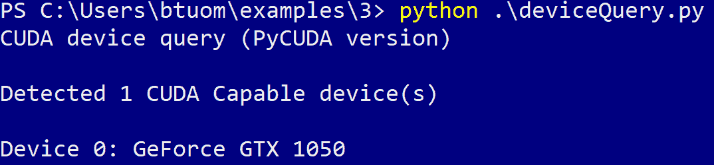

恭喜，您现在可以开始进入 GPU 编程的世界了！

# 摘要

设置 Python 环境以进行 GPU 编程可能是一个非常细致的过程。对于本文本的目的，建议 Windows 和 Linux 用户都使用 Anaconda Python 2.7 发行版。首先，我们应该确保我们有正确的硬件进行 GPU 编程；一般来说，64 位 Windows 或 Linux PC，具有 4GB 的 RAM，以及 2016 年或更晚的任何入门级 NVIDIA GPU 都将满足我们的需求。Windows 用户应小心使用与 CUDA 工具包和 Anaconda 都兼容的 Visual Studio 版本（例如 VS 2015），而 Linux 用户应特别注意其 GPU 驱动程序的安装，并在其 `.bashrc` 文件中设置适当的环境变量。此外，Windows 用户应创建一个适当的启动脚本，以设置其 GPU 编程环境，并应使用预编译的轮子文件安装 PyCUDA 库。

现在，随着我们的编程环境已经设置并就绪，我们将花费下一章学习 GPU 编程的非常基础的知识。我们将了解如何将数据写入和从 GPU 的内存中读取，以及如何在 CUDA C 中编写一些非常简单的 *逐元素* GPU 函数。（如果你看过经典的 1980 年代电影《空手道小子》，那么你可能会把下一章看作是 GPU 编程的“涂蜡，抹蜡”阶段。）

# 问题

1.  我们能在我们的主处理器的内置英特尔 HD GPU 上运行 CUDA 吗？在独立的 AMD Radeon GPU 上呢？

1.  这本书使用 Python 2.7 还是 Python 3.7 作为示例？

1.  我们在 Windows 中使用什么程序来查看我们安装了哪些 GPU 硬件？

1.  我们在 Linux 中使用什么命令行程序来查看我们安装了哪些 GPU 硬件？

1.  我们在 Linux 中使用什么命令来确定我们的系统有多少内存？

1.  如果我们不希望修改我们的 Linux 系统的 APT 仓库，我们应该使用 `run` 还是 `deb` 安装程序来安装 CUDA？
