# 第四章：内核、线程、块和网格

在本章中，我们将看到如何编写有效的 **CUDA 内核**。在 GPU 编程中，**内核**（我们交替使用术语如 **CUDA 内核** 或 **内核函数**）是一个可以直接从 **主机**（CPU）启动到 **设备**（GPU）的并行函数，而 **设备函数** 是只能从内核函数或另一个设备函数中调用的函数。（一般来说，设备函数看起来和表现就像正常的串行 C/C++ 函数，只是它们在 GPU 上运行，并且从内核中并行调用。）

然后，我们将了解 CUDA 如何使用 **线程**、**块** 和 **网格** 的概念来抽象掉 GPU 的某些底层技术细节（例如核心、战程和流式多处理器，我们将在本书的后续章节中介绍），以及我们如何使用这些概念来减轻并行编程的认知负担。我们将学习关于线程同步（包括块级和网格级）以及 CUDA 中使用 **全局** 和 **共享** **内存** 的线程间通信。最后，我们将深入了解如何在 GPU 上实现我们自己的并行前缀类型算法的技术细节（即我们在上一章中介绍过的扫描/归约类型函数），这将使我们能够将本章学到的所有原理付诸实践。

本章的学习成果如下：

+   理解内核和设备函数之间的区别

+   如何在 PyCUDA 中编译和启动内核，并在内核中使用设备函数

+   在启动内核的上下文中有效地使用线程、块和网格，以及如何在内核中使用 `threadIdx` 和 `blockIdx`

+   如何以及为什么在内核中使用线程同步，使用 `__syncthreads()` 同步单个块中的所有线程，以及主机同步整个块网格中的所有线程

+   如何使用设备全局和共享内存进行线程间通信

+   如何使用我们新学到的关于内核的所有知识来正确实现并行前缀和的 GPU 版本

# 技术要求

为了本章，需要一个配备现代 NVIDIA GPU（2016 年及以后）的 Linux 或 Windows 10 PC，并安装所有必要的 GPU 驱动程序和 CUDA 工具包（9.0 及以后版本）。还需要一个合适的 Python 2.7 安装（例如 Anaconda Python 2.7），并带有 PyCUDA 模块。

本章的代码也可在 GitHub 上找到：

[`github.com/PacktPublishing/Hands-On-GPU-Programming-with-Python-and-CUDA`](https://github.com/PacktPublishing/Hands-On-GPU-Programming-with-Python-and-CUDA)

关于先决条件的更多信息，请参阅本书的**前言**；关于软件和硬件要求，请查阅 [`github.com/PacktPublishing/Hands-On-GPU-Programming-with-Python-and-CUDA`](https://github.com/PacktPublishing/Hands-On-GPU-Programming-with-Python-and-CUDA) 中的 `README` 部分。

# 内核

正如上一章所做的那样，我们将学习如何在 Python 代码中编写 CUDA 内核函数作为内联 CUDA C，并使用 PyCUDA 将它们启动到我们的 GPU 上。在上一章中，我们使用了 PyCUDA 提供的模板来编写符合特定设计模式的内核；相比之下，我们现在将看到如何从头开始编写我们自己的内核，这样我们就可以编写各种灵活的内核，这些内核可能不符合 PyCUDA 覆盖的任何特定设计模式，并且我们可以对内核有更精细的控制。当然，这些收益将伴随着编程复杂性的增加；我们特别需要理解**线程**、**块**和**网格**及其在内核中的作用，以及如何**同步**执行内核的线程，以及了解如何在线程之间交换数据。

让我们从简单开始，尝试重新创建我们在上一章中看到的一些元素级操作，但这次我们不使用`ElementwiseKernel`函数；我们现在将使用`SourceModule`函数。这是 PyCUDA 中的一个非常强大的函数，它允许我们从零开始构建内核，所以通常最好从简单开始。

# PyCUDA 的 SourceModule 函数

我们将使用 PyCUDA 的`SourceModule`函数来编译原始的内联 CUDA C 代码，将其编译成可用的内核，这样我们就可以从 Python 中启动它们。我们应该注意，`SourceModule`实际上是将代码编译成一个**CUDA 模块**，这就像一个 Python 模块或 Windows DLL，只是它包含了一组编译后的 CUDA 代码。这意味着在使用 PyCUDA 的`get_function`获取我们想要使用的内核的引用之前，我们不得不“提取”出来。让我们从一个基本的例子开始，看看如何使用`SourceModule`来使用 CUDA 内核。

和之前一样，我们将从一个最简单的内核函数开始——一个将向量乘以标量的函数。我们首先进行导入：

```py
import pycuda.autoinit
import pycuda.driver as drv
import numpy as np
from pycuda import gpuarray
from pycuda.compiler import SourceModule
```

现在我们可以立即开始编写我们的内核：

```py
ker = SourceModule("""
__global__ void scalar_multiply_kernel(float *outvec, float scalar, float *vec)
{
 int i = threadIdx.x;
 outvec[i] = scalar*vec[i];
}
""")
```

因此，让我们停下来，将其与在`ElementwiseKernel`中是如何做的进行对比。首先，当我们声明 CUDA C 中的内核函数时，我们在它前面加上`__global__`关键字。这将使编译器将这个函数识别为内核。我们总是只声明为一个`void`函数，因为我们总是通过传递一个指向我们作为参数传递的某个空内存块的指针来获取我们的输出值。我们可以像声明任何标准 C 函数的参数一样声明参数：首先我们有`outvec`，它将是我们输出的缩放向量，当然是一个浮点数组指针。接下来是`scalar`，它用一个简单的`float`表示；注意，这不是一个指针！如果我们希望向内核传递简单的单例输入值，我们总是可以这样做而不使用指针。最后，我们有我们的输入向量`vec`，当然也是一个浮点数组指针。

内核函数的单例输入参数可以直接从主机传递，而无需使用指针或分配设备内存。

在我们继续测试内核之前，让我们先看看内核。我们回忆一下，`ElementwiseKernel`通过 PyCUDA 设置的一个值`i`自动并行化多个 GPU 线程；每个单独线程的标识由`threadIdx`值给出，我们通过以下方式检索它：`int i = threadIdx.x;`。

`threadIdx`用于告诉每个单独的线程其身份。这通常用于确定输入和输出数据数组中应该处理哪些值的索引。（这也可以用于使用标准的 C 控制流语句，如`if`或`switch`，为特定线程分配不同于其他线程的任务。）

现在，我们准备像以前一样并行执行标量乘法：`outvec[i] = scalar*vec[i];`。

现在，让我们测试这段代码：我们首先必须从我们刚刚用`SourceModule`编译的 CUDA 模块中*提取*编译后的内核函数的引用。我们可以使用 Python 的`get_function`获取这个内核引用，如下所示：

```py
scalar_multiply_gpu = ker.get_function("scalar_multiply_kernel")
```

现在，我们必须在 GPU 上放置一些数据来实际测试我们的内核。让我们设置一个包含 512 个随机值的浮点数组，然后使用`gpuarray.to_gpu`函数将这些值复制到 GPU 的全局内存中的数组。 （我们将在这个 GPU 和 CPU 上对这个随机向量乘以一个标量，看看输出是否匹配。）我们还将使用`gpuarray.empty_like`函数在 GPU 的全局内存中分配一块空内存：

```py
testvec = np.random.randn(512).astype(np.float32)
testvec_gpu = gpuarray.to_gpu(testvec)
outvec_gpu = gpuarray.empty_like(testvec_gpu)
```

我们现在准备启动内核。我们将标量值设置为`2`。（同样，由于标量是单例，我们不需要将其值复制到 GPU 上——但我们应该小心地正确类型转换它。）在这里，我们必须使用`block`和`grid`参数将线程数特别设置为`512`。我们现在准备启动：

```py
scalar_multiply_gpu( outvec_gpu, np.float32(2), testvec_gpu, block=(512,1,1), grid=(1,1,1))
```

我们现在可以使用`gpuarray`输出对象中的`get`函数来检查输出是否与预期输出匹配，并与 NumPy 的`allclose`函数比较正确输出：

```py
print "Does our kernel work correctly? : {}".format(np.allclose(outvec_gpu.get() , 2*testvec) )
```

（此示例的代码作为`simple_scalar_multiply_kernel.py`文件，位于存储库的`4`目录下。）

现在我们开始移除我们在上一章学习的 PyCUDA 内核模板的训练轮——我们现在可以直接用纯 CUDA C 编写内核并启动它，以在 GPU 上使用特定数量的线程。然而，在我们继续内核之前，我们还得学习更多关于 CUDA 如何将线程组织成称为**块**和**网格**的抽象单元集合的知识。

# 线程、块和网格

到目前为止，在这本书中，我们一直将“**线程**”这个术语视为理所当然。让我们退后一步，看看这究竟意味着什么——线程是一系列在 GPU 单个核心上执行的指令——**核心**和**线程**不应被视为同义词！实际上，可以启动使用比 GPU 上核心更多的线程的内核。这是因为，类似于英特尔芯片可能只有四个核心，但在 Linux 或 Windows 中却可以运行数百个进程和数千个线程，操作系统的调度器可以在这些任务之间快速切换，给人一种它们同时运行的感觉。GPU 以类似的方式处理线程，允许在数万个线程上无缝计算。

在 GPU 上，多个线程在称为**块**的抽象单元中执行。你应该记得我们是如何从标量乘法内核中的`threadIdx.x`获取线程 ID 的；结尾有一个`x`，因为还有`threadIdx.y`和`threadIdx.z`。这是因为你可以对三个维度进行索引，而不仅仅是单个维度。我们为什么要这样做呢？让我们回顾一下关于计算曼德布罗特集的例子，来自第一章，*为什么进行 GPU 编程？*和第三章，*使用 PyCUDA 入门*。这是在二维平面上逐点计算的。因此，对于像这样的算法，我们可能更倾向于在两个维度上索引线程。同样，在某些情况下，使用三个维度可能是有意义的——在物理模拟中，我们可能需要在 3D 网格中计算移动粒子的位置。

块进一步在称为**网格**的抽象批次中执行，最好将其视为**块的块**。与块中的线程一样，我们可以使用由`blockIdx.x`、`blockIdx.y`和`blockIdx.z`给出的常量值在网格中最多三个维度上索引每个块。让我们通过一个例子来帮助我们理解这些概念；为了简单起见，这里我们只使用两个维度。

# 康威的生命游戏

*生命游戏*（通常简称为*LIFE*）是由英国数学家约翰·康威在 1970 年发明的一种细胞自动机模拟。这听起来很复杂，但实际上非常简单——LIFE 是一个零玩家*游戏*，由一个二维二进制格子的*细胞*组成，这些细胞要么被认为是*活*的，要么是*死的*。该格子通过以下规则迭代更新：

+   任何拥有少于两个活邻居的活细胞都会死亡

+   任何拥有两个或三个邻居的活细胞都会存活

+   任何拥有超过三个邻居的活细胞都会死亡

+   任何拥有恰好三个邻居的死亡细胞都会复活

这四个简单的规则产生了一个具有有趣数学性质且在动画中看起来相当美观的复杂模拟。然而，在格子中有大量单元时，它可能运行得相当慢，并且通常在纯 Python 序列编程中会导致*不流畅*的动画。然而，这是可并行的，因为很明显，格子中的每个单元都可以由一个 CUDA 线程管理。

现在，我们将实现 LIFE 作为一个 CUDA 内核，并使用`matplotlib.animation`模块来动画化它。这对我们来说现在很有趣，因为我们将能够在这里应用我们对块和网格的新知识。

我们将首先按照以下方式包含适当的模块：

```py
import pycuda.autoinit
import pycuda.driver as drv
from pycuda import gpuarray
from pycuda.compiler import SourceModule
import numpy as np
import matplotlib.pyplot as plt 
import matplotlib.animation as animation
```

现在，让我们通过`SourceModule`深入编写我们的内核。我们将首先使用 C 语言的`#define`指令来设置一些常量和宏，这些我们将贯穿整个内核使用。让我们看看我们将设置的第一个，`_X` 和 `_Y`：

```py
ker = SourceModule("""
#define _X  ( threadIdx.x + blockIdx.x * blockDim.x )
#define _Y  ( threadIdx.y + blockIdx.y * blockDim.y )
```

让我们首先记住`#define`在这里是如何工作的——它将在编译时将任何`_X`或`_Y`的文本文字替换为定义的值（在这里的括号中），即它为我们创建宏。（作为一个个人风格问题，我通常在我的所有 C 宏前加一个下划线。）

在 C 和 C++中，`#define`用于创建**宏**。这意味着`#define`不会创建任何函数或设置适当的常量变量——它只是允许我们在编译前通过替换文本来简化我们的代码。

现在，让我们具体谈谈 `_X` 和 `_Y` 的含义——这些将是我们在用于 LIFE 的二维格子上单个 CUDA 线程单元的笛卡尔 *x* 和 *y* 值。我们将在一个由二维块组成的二维网格上启动内核，这些块将对应整个单元格。我们将必须使用线程和块常量来找到格子上的笛卡尔点。让我们看看一些图表来阐明这一点。一个位于二维 CUDA 块中的线程可以如下可视化：

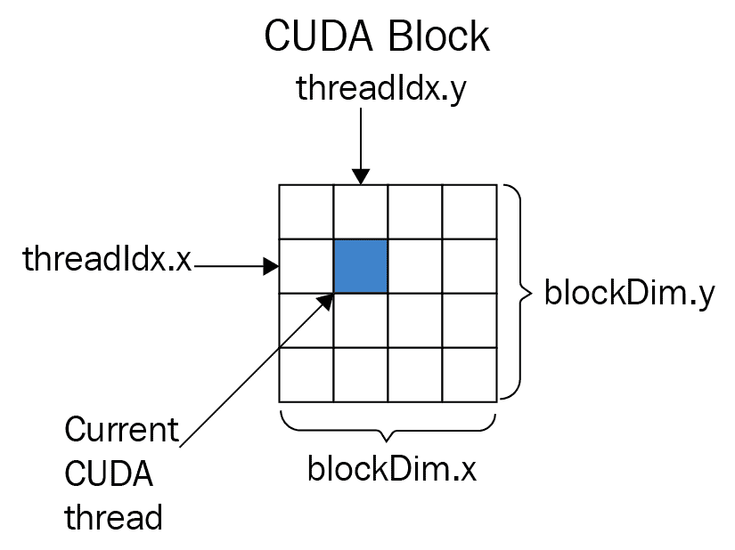

到目前为止，你可能想知道为什么我们不只在单个块上启动内核，这样我们就可以直接将`_X`设置为`threadIdx.x`，将`_Y`设置为`threadIdx.y`，然后完成。这是由于 CUDA 对我们施加的块大小限制——目前，仅支持最多由 1,024 个线程组成的块。这意味着我们最多只能制作 32 x 32 维度的单元格，这将导致一个相当无聊的模拟，可能更适合在 CPU 上完成，因此我们将在网格上启动多个块。（我们当前块的大小将由`blockDim.x`和`blockDim.y`给出，这将帮助我们确定目标 *x* 和 *y* 坐标，正如我们将看到的。）

同样，像之前一样，我们可以使用`blockIdx.x`和`blockIdx.y`确定我们在二维网格中的哪个块：

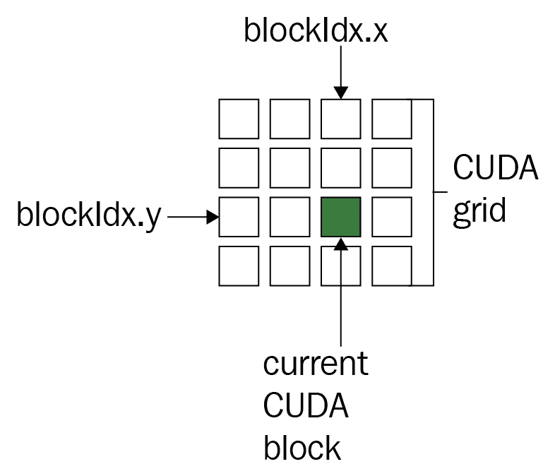

在我们对数学进行一些思考之后，应该很明显，`_X`应该定义为`(threadIdx.x + blockIdx.x * blockDim.x)`，而`_Y`应该定义为`(threadIdx.y + blockIdx.y * blockDim.y)`。（添加括号是为了在宏插入代码时不会干扰运算顺序。）现在，让我们继续定义剩余的宏：

```py
#define _WIDTH  ( blockDim.x * gridDim.x )
#define _HEIGHT ( blockDim.y * gridDim.y  )

#define _XM(x)  ( (x + _WIDTH) % _WIDTH )
#define _YM(y)  ( (y + _HEIGHT) % _HEIGHT )
```

`_WIDTH`和`_HEIGHT`宏将分别给出我们细胞晶格的宽度和高度，这应该从图中很清楚。让我们讨论`_XM`和`_YM`宏。在我们的 LIFE 实现中，我们将端点“环绕”到晶格的另一侧——例如，我们将*x*-值为`-1`视为`_WIDTH - 1`，将*y*-值为`-1`视为`_HEIGHT - 1`，同样，我们将*x*-值为`_WIDTH`视为`0`，将*y*-值为`_HEIGHT`视为`0`。为什么我们需要这样做？当我们计算给定细胞的活邻居数量时，我们可能处于某个边缘，邻居可能是外部点——定义这些宏来调制我们的点将自动为我们解决这个问题。请注意，在使用 C 的取模运算符之前，我们必须添加宽度或高度——这是因为与 Python 不同，C 中的取模运算符对于整数可以返回负值。

我们现在有一个最终的宏需要定义。我们回忆一下，PyCUDA 将二维数组作为一维指针传递给 CUDA C；二维数组从 Python 中以行向量的方式传递到一维 C 指针。这意味着我们需要将晶格上给定细胞的笛卡尔(*x*, *y*)点转换为指针对应的一维点。在这里，我们可以这样做：

```py
#define _INDEX(x,y)  ( _XM(x)  + _YM(y) * _WIDTH )
```

由于我们的细胞晶格是按行存储的，我们必须将*y*-值乘以宽度来偏移到对应行的点。现在，我们最终可以开始实现 LIFE 了。让我们从 LIFE 最重要的部分开始——计算给定细胞有多少活邻居。我们将使用 CUDA **设备函数**来实现这一点，如下所示：

```py
__device__ int nbrs(int x, int y, int * in)
{
     return ( in[ _INDEX(x -1, y+1) ] + in[ _INDEX(x-1, y) ] + in[ _INDEX(x-1, y-1) ] \
                   + in[ _INDEX(x, y+1)] + in[_INDEX(x, y - 1)] \
                   + in[ _INDEX(x+1, y+1) ] + in[ _INDEX(x+1, y) ] + in[ _INDEX(x+1, y-1) ] );
}

```

设备函数是一个串行编写的 C 函数，由内核中的单个 CUDA 线程调用。也就是说，这个小程序将在我们的内核中由多个线程并行调用。我们将我们的细胞晶格表示为 32 位整数的集合（1 表示活细胞，0 表示死细胞），因此这适用于我们的目的；我们只需添加我们当前细胞周围邻居的值。

CUDA **设备函数** 是一个串行 C 函数，它由内核中的单个 CUDA 线程调用。虽然这些函数本身是串行的，但它们可以通过多个 GPU 线程并行运行。设备函数不能由主机计算机直接在 GPU 上启动，只能通过内核。

现在，我们准备编写 LIFE 的内核实现。实际上，我们已经完成了大部分艰苦的工作——我们检查当前线程单元的邻居数量，检查当前单元是活着还是死亡，然后使用适当的 switch-case 语句根据 LIFE 的规则确定其在下一次迭代中的状态。我们将为此内核使用两个整数指针数组：一个将引用上一次迭代的输入（`lattice`），另一个将引用我们将计算的输出迭代（`lattice_out`）：

```py
__global__ void conway_ker(int * lattice_out, int * lattice  )
{
   // x, y are the appropriate values for the cell covered by this thread
   int x = _X, y = _Y;

   // count the number of neighbors around the current cell
   int n = nbrs(x, y, lattice);

    // if the current cell is alive, then determine if it lives or dies for the next generation.
    if ( lattice[_INDEX(x,y)] == 1)
       switch(n)
       {
          // if the cell is alive: it remains alive only if it has 2 or 3 neighbors.
          case 2:
          case 3: lattice_out[_INDEX(x,y)] = 1;
                  break;
          default: lattice_out[_INDEX(x,y)] = 0;                   
       }
    else if( lattice[_INDEX(x,y)] == 0 )
         switch(n)
         {
            // a dead cell comes to life only if it has 3 neighbors that are alive.
            case 3: lattice_out[_INDEX(x,y)] = 1;
                    break;
            default: lattice_out[_INDEX(x,y)] = 0;         
         }

}
""")

conway_ker = ker.get_function("conway_ker")

```

我们记得使用三重括号关闭内联 CUDA C 段，然后使用`get_function`获取我们的 CUDA C 内核的引用。由于内核只会更新一次晶格，我们将在 Python 中设置一个简短的功能，以覆盖更新晶格动画的所有开销：

```py
def update_gpu(frameNum, img, newLattice_gpu, lattice_gpu, N):    
```

`frameNum`参数只是 Matplotlib 动画模块更新函数所需的一个值，我们可以忽略它，而`img`将是我们的单元晶格的代表性图像，这是模块迭代显示所必需的。

让我们关注剩下的三个参数—`newLattice_gpu`和`lattice_gpu`将是我们将保持持久的 PyCUDA 数组，因为我们希望在可能的情况下避免在 GPU 上重新分配内存块。`lattice_gpu`将是单元阵列的当前一代，它将对应于内核中的`lattice`参数，而`newLattice_gpu`将是晶格的下一代。`N`将表示晶格的高度和宽度（换句话说，我们将处理一个*N x N*的晶格）。

我们使用适当的参数启动内核，并设置块和网格大小如下：

```py
    conway_ker(newLattice_gpu, lattice_gpu, grid=(N/32,N/32,1), block=(32,32,1) )    
```

我们将设置块大小为 32 x 32，使用`(32, 32, 1)`；由于我们只使用两个维度来构建我们的单元晶格，因此可以将*z*-维度设置为 1。请记住，块的大小限制为 1,024 个线程—*32 x 32 = 1024*，所以这将是可行的。（请注意，这里 32 x 32 并没有什么特殊之处；如果我们想的话，可以使用 16 x 64 或 10 x 10 这样的值，只要线程总数不超过 1,024 即可。）

CUDA 块中的线程数限制为最多 1,024 个。

现在，我们来看网格值——在这里，由于我们正在处理 32 的维度，应该很明显，*N*（在这种情况下）应该是 32 的倍数。这意味着在这种情况下，我们限制在 64 x 64、96 x 96、128 x 128 和 1024 x 1024 这样的晶格。再次强调，如果我们想使用不同大小的晶格，那么我们必须改变块的大小。（如果这还不清楚，请查看之前的图表并回顾我们在内核中定义的宽度和高度宏。）

我们现在可以使用`get()`函数从 GPU 内存中获取最新生成的晶格后，设置我们的动画图像数据。我们最终使用 PyCUDA 切片操作符`[:]`将新的晶格数据复制到当前数据中，这将复制之前在 GPU 上分配的内存，这样我们就不需要重新分配：

```py
    img.set_data(newLattice_gpu.get() )    
    lattice_gpu[:] = newLattice_gpu[:]

    return img
```

让我们设置一个 256 x 256 大小的晶格。我们现在将使用`numpy.random`模块中的选择函数为我们的晶格设置一个初始状态。我们将使用随机数填充一个*N* x *N*的整数图，一和零；一般来说，如果大约 25%的点是一，其余的是零，我们可以生成一些有趣的晶格动画，所以我们就这样做：

```py
if __name__ == '__main__':
    # set lattice size
    N = 256

    lattice = np.int32( np.random.choice([1,0], N*N, p=[0.25, 0.75]).reshape(N, N) )
    lattice_gpu = gpuarray.to_gpu(lattice)
```

最后，我们可以使用适当的`gpuarray`函数在 GPU 上设置晶格，并相应地设置 Matplotlib 动画，如下所示：

```py
lattice_gpu = gpuarray.to_gpu(lattice)
    lattice_gpu = gpuarray.to_gpu(lattice)
    newLattice_gpu = gpuarray.empty_like(lattice_gpu) 

    fig, ax = plt.subplots()
    img = ax.imshow(lattice_gpu.get(), interpolation='nearest')
    ani = animation.FuncAnimation(fig, update_gpu, fargs=(img, newLattice_gpu, lattice_gpu, N, ) , interval=0, frames=1000, save_count=1000) 

    plt.show()
```

我们现在可以运行我们的程序并享受表演（代码也作为`conway_gpu.py`文件在 GitHub 仓库的`4`目录下提供）：

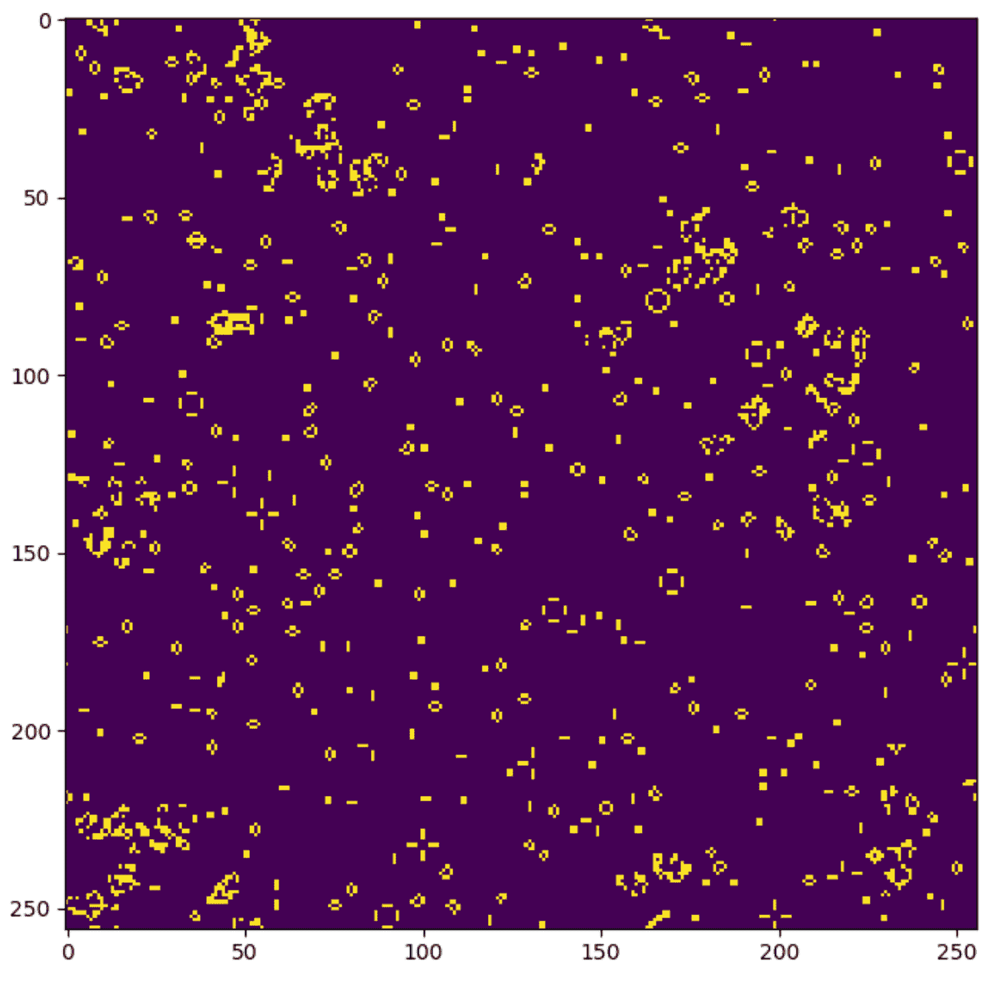

# 线程同步和交互

我们现在将讨论 GPU 编程中的两个重要概念——**线程同步**和**线程交互**。有时，在继续任何进一步的计算之前，我们需要确保每个线程都达到了代码中的同一确切行；我们称之为线程同步。同步与线程交互协同工作，即不同的线程相互传递和读取输入；在这种情况下，我们通常想要确保在传递任何数据之前，所有线程都在计算中的同一步骤上对齐。我们将从这里开始，了解 CUDA `__syncthreads`设备函数，它用于同步内核中的单个块。

# 使用`__syncthreads()`设备函数

在我们之前的康威生命游戏示例中，我们的内核在每次由主机启动时只更新晶格一次。在这种情况下，同步所有已启动内核中的线程没有问题，因为我们只需要处理晶格的先前迭代，这是现成的。

现在让我们假设我们想要做一些稍微不同的事情——我们想要重新编写我们的内核，使其在给定的细胞晶格上执行一定数量的迭代，而不需要主机反复重新启动。这最初可能看起来很微不足道——一个简单的解决方案可能就是添加一个整数参数来指示迭代次数，并在内联`conway_ker`内核中的`for`循环中，做一些额外的简单更改，然后完成。

然而，这引发了**竞态条件**的问题；这是多个线程读取和写入相同内存地址以及由此可能产生的问题。我们的旧 `conway_ker` 内核通过使用两个内存数组来避免这个问题，一个数组严格用于读取，另一个数组严格用于每个迭代的写入。此外，由于内核只执行单个迭代，我们实际上是在使用主机来同步线程。

我们想在 GPU 上进行多个完全同步的 LIFE 迭代；我们还将希望使用单个内存数组来表示格。我们可以通过使用名为 `__syncthreads()` 的 CUDA 设备函数来避免竞态条件。这个函数是一个**块级同步屏障**——这意味着当线程遇到 `__syncthreads()` 实例时，它将停止执行，并等待同一块内的每个其他线程都达到相同的 `__syncthreads()` 调用，然后线程才会继续执行后续的代码行。

`__syncthreads()` 只能在单个 CUDA 块内同步线程，而不能在 CUDA 网格内的所有线程！

现在，让我们创建我们的新内核；这将是对先前 LIFE 内核的修改，它将执行一定数量的迭代然后停止。这意味着我们不会将其表示为动画，而是一个静态图像，所以我们在开始时将加载适当的 Python 模块。（此代码也位于 GitHub 仓库中的 `conway_gpu_syncthreads.py` 文件中）：

```py
import pycuda.autoinit
import pycuda.driver as drv
from pycuda import gpuarray
from pycuda.compiler import SourceModule
import numpy as np
import matplotlib.pyplot as plt 
```

现在，让我们再次设置我们的内核，该内核将计算 LIFE：

```py
ker = SourceModule("""
```

当然，我们的 CUDA C 代码将在这里，这将与之前大致相同。我们只需对我们的内核做一些修改。当然，我们可以保留设备函数 `nbrs`。在我们的声明中，我们将只使用一个数组来表示细胞格。我们可以这样做，因为我们将会使用适当的线程同步。我们还需要用一个整数来指示迭代次数。我们设置参数如下：

```py
__global__ void conway_ker(int * lattice, int iters)
{
```

我们将继续像之前一样进行，只是使用 `for` 循环进行迭代：

```py
 int x = _X, y = _Y; 
 for (int i = 0; i < iters; i++)
 {
     int n = nbrs(x, y, lattice); 
     int cell_value;
```

让我们回顾一下，之前我们直接在数组中设置新的细胞格值。这里，我们将保留该值在 `cell_value` 变量中，直到块内的所有线程都同步。我们继续像之前一样进行，使用 `__syncthreads` 阻塞执行，直到当前迭代的所有新细胞值都确定，然后才在格子数组中设置值：

```py
 if ( lattice[_INDEX(x,y)] == 1)
 switch(n)
 {
 // if the cell is alive: it remains alive only if it has 2 or 3 neighbors.
 case 2:
 case 3: cell_value = 1;
 break;
 default: cell_value = 0; 
 }
 else if( lattice[_INDEX(x,y)] == 0 )
 switch(n)
 {
 // a dead cell comes to life only if it has 3 neighbors that are alive.
 case 3: cell_value = 1;
 break;
 default: cell_value = 0; 
 } 
 __syncthreads();
 lattice[_INDEX(x,y)] = cell_value; 
 __syncthreads();
 } 
}
""")
```

我们现在将像之前一样启动内核并显示输出，对晶格进行 1,000,000 次迭代。请注意，由于每个块中线程数量的限制为 1,024，我们只使用我们的网格中的一个块，其大小为 32 x 32。（再次强调，`__syncthreads`仅在块中的所有线程上工作，而不是在整个网格上的所有线程上，这就是为什么我们在这里限制自己只使用一个块的原因）：

```py
conway_ker = ker.get_function("conway_ker")
if __name__ == '__main__':
 # set lattice size
 N = 32
 lattice = np.int32( np.random.choice([1,0], N*N, p=[0.25, 0.75]).reshape(N, N) )
 lattice_gpu = gpuarray.to_gpu(lattice)
 conway_ker(lattice_gpu, np.int32(1000000), grid=(1,1,1), block=(32,32,1))
 fig = plt.figure(1)
 plt.imshow(lattice_gpu.get())
```

当我们运行程序时，我们将得到以下所需的输出（这是随机 LIFE 晶格在经过一百万次迭代后收敛的结果！）：

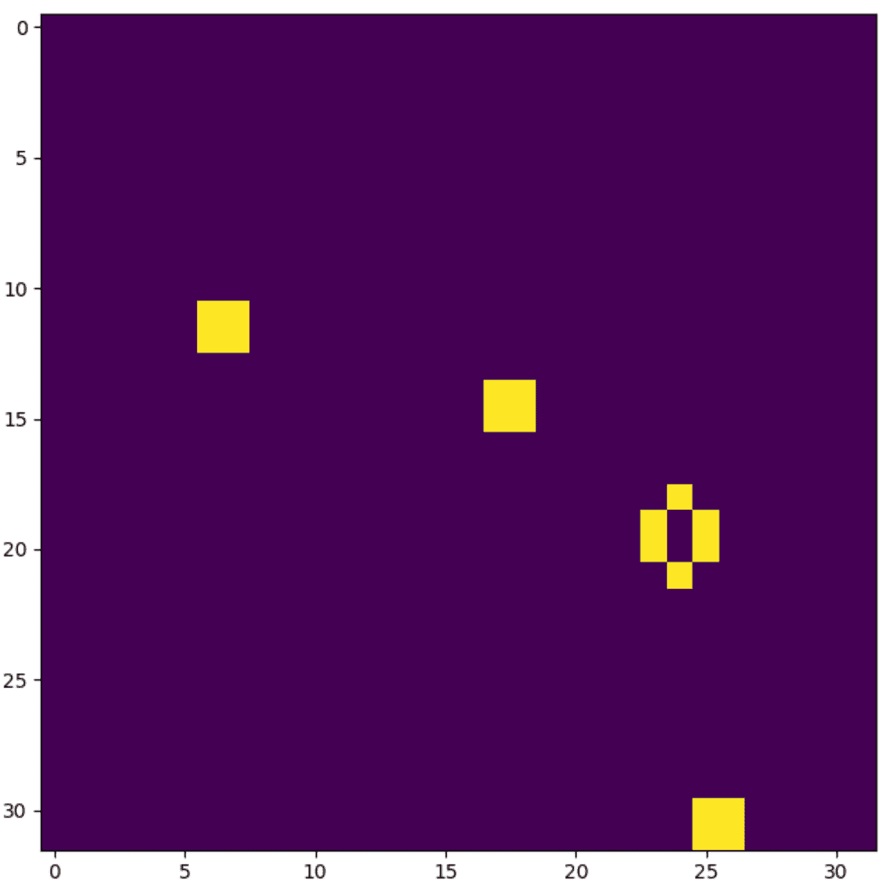

# 使用共享内存

从先前的例子中我们可以看到，内核中的线程可以通过 GPU 全局内存中的数组进行相互通信；虽然对于大多数操作可以使用全局内存，但我们可以通过使用**共享内存**来加快速度。这是一种专门用于单个 CUDA 块内线程间通信的内存类型；使用它的优点是它对于纯线程间通信要快得多。然而，与全局内存相比，存储在共享内存中的内存不能直接被主机访问——共享内存必须首先由内核本身复制回全局内存。

在我们继续之前，让我们先退一步，思考一下我们的意思。让我们看看在我们刚才看到的迭代 LIFE 内核中声明的变量。让我们首先看看`x`和`y`，这两个整数保存了特定线程单元格的笛卡尔坐标。记住，我们使用`_X`和`_Y`宏设置它们的值。（尽管编译器优化除外，但我们希望将这些值存储在变量中以减少计算，因为直接使用`_X`和`_Y`将在我们的代码中每次引用这些宏时重新计算`x`和`y`的值）：

```py
 int x = _X, y = _Y; 
```

我们注意到，对于每个单独的线程，晶格中都有一个唯一的笛卡尔点，它将对应于`x`和`y`。同样，我们使用一个变量`n`，它声明为`int n = nbrs(x, y, lattice);`，来指示特定单元格周围的活细胞数量。这是因为，当我们通常在 CUDA 中声明变量时，它们默认是每个单独线程的局部变量。请注意，即使我们在线程内部声明一个数组，如`int a[10];`，也将在每个线程中有一个大小为 10 的局部数组。

局部线程数组（例如，内核中`int a[10];`的声明）和指向全局 GPU 内存的指针（例如，以`int * b`的形式作为内核参数传递的值）看起来和表现可能相似，但实际上非常不同。对于内核中的每个线程，将有一个单独的`a`数组，其他线程无法读取，但有一个单一的`b`将持有相同的值，并且对所有线程都是同等可访问的。

我们准备使用共享内存。这允许我们在单个 CUDA 块内的线程之间声明共享变量和数组。这种内存比使用全局内存指针（如我们至今所使用的）要快得多，同时减少了分配内存的开销。

假设我们想要一个大小为 10 的共享整数数组。我们声明如下——`__shared__ int a[10]`。请注意，我们不必局限于数组；我们可以创建共享单例变量，如下所示：`__shared__ int x`。

让我们重写上一小节中看到的 LIFE 迭代版本的几行代码，以利用共享内存。首先，让我们将输入指针重命名为`p_lattice`，这样我们就可以在我们的共享数组上使用这个变量名，并在我们的代码中懒加载所有对`lattice`的引用。由于我们将坚持使用 32 x 32 单元格的晶格，我们按照以下方式设置新的共享`lattice`数组：

```py
__global__ void conway_ker_shared(int * p_lattice, int iters)
{
 int x = _X, y = _Y;
 __shared__ int lattice[32*32];
```

现在，我们必须将所有值从全局内存`p_lattice`数组复制到`lattice`。我们将以完全相同的方式索引我们的共享数组，因此我们只需在这里使用我们旧的`_INDEX`宏。请注意，我们在复制后确保放置`__syncthreads()`，以确保在继续 LIFE 算法之前，所有对晶格的内存访问都已完全完成：

```py
 lattice[_INDEX(x,y)] = p_lattice[_INDEX(x,y)];
 __syncthreads();
```

内核的其余部分与之前完全相同，只是我们需要将共享晶格复制回 GPU 数组。我们这样做，然后关闭内联代码：

```py
 __syncthreads();
 p_lattice[_INDEX(x,y)] = lattice[_INDEX(x,y)];
 __syncthreads();
} """)
```

我们现在可以像以前一样运行它，使用相同的测试代码。（这个例子可以在 GitHub 仓库中的`conway_gpu_syncthreads_shared.py`中看到。）

# 并行前缀算法

我们现在将使用我们对 CUDA 内核的新知识来实现**并行前缀算法**，也称为**扫描设计模式**。我们已经在上一章中看到了这种算法的简单示例，即 PyCUDA 的`InclusiveScanKernel`和`ReductionKernel`函数。现在我们将更详细地探讨这个想法。

这种设计模式的核心动机是我们有一个二元运算符 ，也就是说一个作用于两个输入值并给出一个输出值的函数（例如—+, , （最大值），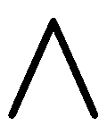（最小值）），以及元素集合 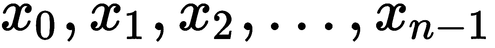，并且从这些中我们希望高效地计算 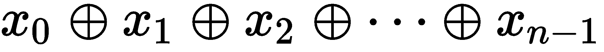。此外，我们假设我们的二元运算符  是**结合律**的——这意味着，对于任何三个元素，*x*，*y* 和 *z*，我们总是有：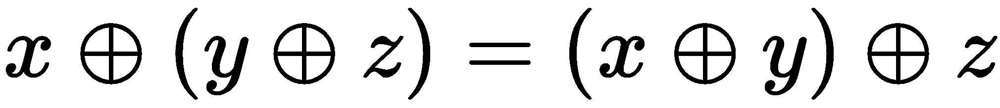。

我们希望保留部分结果，即 *n - 1* 个子计算——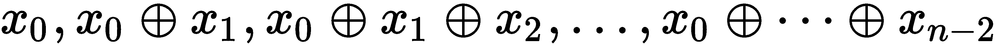。并行前缀算法的目的是有效地生成这个包含 *n* 个和的集合。在串行操作中生成这些 *n* 个和通常需要 *O(n)* 的时间，而我们希望降低时间复杂度。

当使用“并行前缀”或“扫描”这些术语时，通常指的是一种生成所有这些 *n* 个结果的算法，而“归约”/“归约”通常指的是只产生单个最终结果的算法，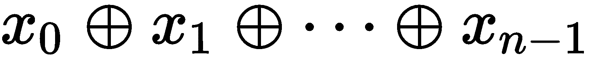。 (这是 PyCUDA 的情况。)

实际上，并行前缀算法有几种变体，我们将首先从最简单（也是最古老）的版本开始，这被称为朴素并行前缀算法。

# 朴素并行前缀算法

**朴素并行前缀算法**是这个算法的原始版本；这个算法被称为“朴素”，因为它假设给定 *n* 个输入元素，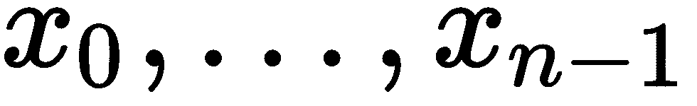，并且进一步假设 *n* 是二进制的（即， 对于某个正整数 *k*），并且我们可以在 *n* 个处理器（或 *n* 个线程）上并行运行算法。显然，这将对我们可能处理的集合的基数 *n* 施加严格的限制。然而，在这些条件得到满足的情况下，我们有一个很好的结果，即其计算时间复杂度仅为 *O(log n)*。我们可以从算法的伪代码中看到这一点。在这里，我们将用  来表示输入值，用 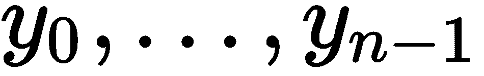 来表示输出值：

```py
input: x0, ..., xn-1 initialize:
for k=0 to n-1:
    yk := xk begin:
parfor i=0 to n-1 :
    for j=0 to log2(n):
        if i >= 2j :
            yi := yi  yi - 2^j else:
            continue
        end if
    end for
end parfor
end
output: y0, ..., yn-1
```

现在，我们可以清楚地看到这将需要 *O(log n)* 的渐近时间，因为外层循环在 `parfor` 上并行化，而内层循环需要 *log2*。经过几分钟的思考后，应该很容易看出 *y[i]* 的值将产生我们期望的输出。

现在让我们开始我们的实现；在这里，我们的二进制运算符将是简单的加法。由于这个例子是说明性的，这个内核将严格地使用 1,024 个线程。

让我们先设置好标题，然后直接进入编写内核：

```py
import pycuda.autoinit
import pycuda.driver as drv
import numpy as np
from pycuda import gpuarray
from pycuda.compiler import SourceModule
from time import time

naive_ker = SourceModule("""
__global__ void naive_prefix(double *vec, double *out)
{
     __shared__ double sum_buf[1024]; 
     int tid = threadIdx.x; 
     sum_buf[tid] = vec[tid];

```

那么，让我们看看我们有什么：我们用 GPU 数组 `double *vec` 来表示输入元素，用 `double *out` 来表示输出值。我们声明一个共享内存 `sum_buf` 数组，我们将用它来计算我们的输出。现在，让我们看看算法本身的实现：

```py
 int iter = 1;
 for (int i=0; i < 10; i++)
 {
     __syncthreads();
     if (tid >= iter )
     {
         sum_buf[tid] = sum_buf[tid] + sum_buf[tid - iter]; 
     } 
     iter *= 2;
 }
 __syncthreads();
```

当然，没有 `parfor`，它是隐式地在 `tid` 变量上进行的，这表示线程号。我们还可以通过从初始化为 1 的变量开始，并在每次迭代 i 中迭代乘以 2 来省略使用 *log[2]* 和 *2^i*。注意，如果我们想更加技术化，我们可以使用位运算符来完成这个操作。）我们将 `i` 的迭代次数限制为 10，因为 *2¹⁰ = 1024*。现在我们将按照以下方式关闭我们的新内核：

```py
 __syncthreads();
 out[tid] = sum_buf[tid];
 __syncthreads();

}
""")
naive_gpu = naive_ker.get_function("naive_prefix")

```

现在我们来看看内核之后的测试代码：

```py
if __name__ == '__main__':
 testvec = np.random.randn(1024).astype(np.float64)
 testvec_gpu = gpuarray.to_gpu(testvec)

 outvec_gpu = gpuarray.empty_like(testvec_gpu)
 naive_gpu( testvec_gpu , outvec_gpu, block=(1024,1,1), grid=(1,1,1))

 total_sum = sum( testvec)
 total_sum_gpu = outvec_gpu[-1].get()

 print "Does our kernel work correctly? : {}".format(np.allclose(total_sum_gpu , total_sum) )
```

我们只关心输出中的最终求和，我们通过 `outvec_gpu[-1].get()` 来检索它，回忆一下，在 Python 中 "-1" 索引给出数组的最后一个成员。这将 `vec` 中每个元素的求和；部分和在 `outvec_gpu` 的先前值中。（这个例子可以在 GitHub 仓库中的 `naive_prefix.py` 文件中看到。）

从本质上讲，并行前缀算法必须运行在 *n* 个线程上，对应于大小为 *n* 的数组，其中 *n* 是二进制的（再次强调，这意味着 *n* 是 2 的某个幂）。然而，如果我们假设我们的算子有一个**恒等元素**（或者说，**中性元素**），即对于任何 *x* 值，都有—。在这种情况下，如果我们的算子是 +，则恒等元素是 0；如果它是 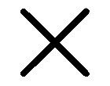，则恒等元素是 1；我们只是用一系列 *e* 值填充元素 ，以便我们有一个新的集合的二进制基数 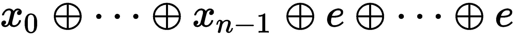。

# 包含与排除前缀

让我们暂停一下，做一个非常微妙但非常重要的区分。到目前为止，我们一直关注的是接受形式为  的输入，并输出形式为 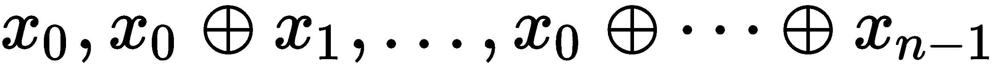 的数组。产生这种输出的前缀算法被称为**包含的**；在**包含前缀算法**的情况下，输出数组中每个索引对应的元素都包含在相同索引的求和操作中。这与**排除前缀算法**形成对比。**排除前缀算法**的不同之处在于，它同样接受形式为  的 *n* 个输入值，并产生长度为 *n* 的输出数组 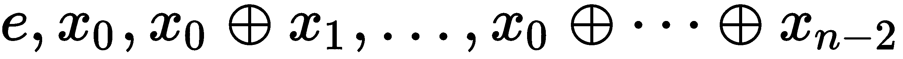。

这很重要，因为前缀算法的一些高效变体本质上都是**排他的**。我们将在下一小节中看到一个例子。

注意，独占算法产生的输出几乎与包含算法相同，只是它向右移动并省略了最终值。因此，只要我们保留  的副本，我们就可以从任一算法中轻易地获得等效的输出。

# 高效并行前缀算法

在我们继续介绍新的算法之前，我们将从两个角度来审视朴素算法。在理想情况下，计算时间复杂度为 *O(log n)*，但这仅在我们有足够数量的处理器来处理我们的数据集时成立；当我们的数据集的基数（元素数量）*n*远大于处理器数量时，这将成为一个 *O(n log n)* 的时间算法。

让我们定义一个与我们的二元运算符  相关的新概念——这里的**工作**是由并行算法在执行期间所有线程对该运算符的调用次数。同样，**跨度**是线程在内核执行期间进行的调用次数；而整个算法的**跨度**与每个单独线程中最长的跨度相同，这将告诉我们总的执行时间。

我们寻求具体减少算法在所有线程上执行的工作量，而不仅仅是关注跨度。在朴素前缀的情况下，当可用的处理器数量不足时，所需额外的工作会花费更多的时间；这额外的工作将溢出到有限的处理器数量中。

我们将介绍一个新的算法，它是**高效工作的**，因此更适合有限数量的处理器。这由两个独立的部分组成——**上推阶段（或归约）**和**下推阶段**。我们还应该注意，我们将看到的算法是一个独占前缀算法。

**上推阶段**类似于一个单一的归约操作，以产生由归约算法给出的值，即 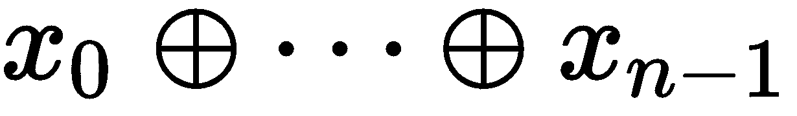 ；在这种情况下，我们保留所需的局部和(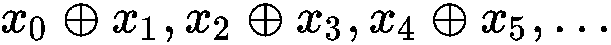)以实现最终结果。然后，下推阶段将操作这些局部和，并给出最终结果。让我们看看一些伪代码，从上推阶段开始。（接下来的小节将立即从伪代码中深入到实现。）

# 高效并行前缀（上推阶段）

这是上推阶段的伪代码。（注意对 `j` 变量的 `parfor`，这意味着此代码块可以并行化到由 `j` 索引的线程上）： 

```py
input: x0, ..., xn-1initialize:
    for i = 0 to n - 1:
        yi := xi
begin:
for k=0 to log2(n) - 1:
    parfor j=0 to n - 1: 
        if j is divisible by 2k+1:
            yj+2^(k+1)-1 = yj+2^k-1  yj +2^(k+1) -1else:
            continue
end
output: y0, ..., yn-1

```

# 高效并行前缀（下推阶段）

现在，让我们继续下推阶段，它将操作上推阶段的输出：

```py
input: x0, ..., xn-1 initialize:
    for i = 0 to n - 2:
        yi := xi
    yn-1 := 0
begin:
for k = log2(n) - 1 to 0:
    parfor j = 0 to n - 1: 
        if j is divisible by 2k+1:
            temp := yj+2^k-1
            yj+2^k-1 := yj+2^(k+1)-1
            yj+2^(k+1)-1 := yj+2^(k+1)-1  temp
        else:
            continue
end
output: y0 , y1 , ..., yn-1
```

# 高效并行前缀 — 实现

作为本章的总结，我们将编写一个算法的实现，它可以操作超过 1,024 的任意大小的数组。这意味着这将操作网格以及块；因此，我们将不得不使用主机进行同步；此外，这需要我们实现两个单独的内核，用于 up-sweep 和 down-sweep 阶段，它们将作为两个阶段中的`parfor`循环，以及 Python 函数，将作为 up-和 down-sweep 的外部`for`循环。

让我们从 up-sweep 内核开始。由于我们将从主机迭代重新启动此内核，我们还需要一个参数来指示当前迭代（`k`）。我们将使用两个数组进行计算以避免竞态条件——`x`（用于当前迭代）和`x_old`（用于前一个迭代）。我们如下声明内核：

```py
up_ker = SourceModule("""
__global__ void up_ker(double *x, double *x_old, int k)
{
```

现在，让我们设置`tid`变量，它将在网格中所有块的所有线程中标识当前线程。我们使用与我们在前面看到的原始网格级实现康威的*生命游戏*相同的技巧：

```py
int tid =  blockIdx.x*blockDim.x + threadIdx.x;
```

我们现在将使用 C 位运算符直接从`k`生成 2^k 和 2^(k+1)。我们现在将`j`设置为`tid`乘以`_2k1`——这将使我们能够移除伪代码中的"if `j` is divisible by 2^(k+1)"，从而只启动我们需要的线程数：

```py
 int _2k = 1 << k;
 int _2k1 = 1 << (k+1);

 int j = tid* _2k1;
```

我们可以用 CUDA C 中的左位运算符（`<<`）轻松生成二进制（2 的幂）整数。回想一下，整数 1（即 2⁰）表示为 0001，2（2¹）表示为 0010，4（2²）表示为 0100，依此类推。因此，我们可以通过`1 << k`操作来计算 2^k。

我们现在可以用一行代码运行 up-sweep 阶段，注意到`j`确实可以被 2^(k+1)整除，这是其构造决定的：

```py

 x[j + _2k1 - 1] = x_old[j + _2k -1 ] + x_old[j + _2k1 - 1];
}
""")
```

我们已经完成了内核的编写！但当然，这并不是 up-sweep 的完整实现。我们还需要用 Python 来完成剩余的部分。让我们获取我们的内核并开始实现。这部分主要自说自话，因为它完全遵循伪代码；我们应该记住，我们是通过使用`[:]`从`x_gpu`复制来更新`x_old_gpu`的，这将保留内存分配，并且只是复制新数据而不是重新分配。此外，请注意我们如何根据要启动的线程数量设置我们的块和网格大小——我们试图保持块大小为 32 的倍数（这是我们在本文中的经验法则，我们将在第十一章，*CUDA 性能优化*中具体说明为什么我们特别使用 32）。我们应该在文件开头放置`from __future__ import division`，因为我们将在计算块和内核大小时使用 Python 3 风格的除法。

有一个问题需要提及，我们假设`x`是长度为 32 或更大的二进制长度——如果你希望这个操作在大小不同的数组上运行，可以简单地通过用零填充我们的数组来修改这一点：

```py

up_gpu = up_ker.get_function("up_ker")

def up_sweep(x):
    x = np.float64(x)
    x_gpu = gpuarray.to_gpu(np.float64(x) )
    x_old_gpu = x_gpu.copy()
    for k in range( int(np.log2(x.size) ) ) : 
        num_threads = int(np.ceil( x.size / 2**(k+1)))
        grid_size = int(np.ceil(num_threads / 32))

        if grid_size > 1:
            block_size = 32
        else:
            block_size = num_threads

        up_gpu(x_gpu, x_old_gpu, np.int32(k) , block=(block_size,1,1), grid=(grid_size,1,1))
        x_old_gpu[:] = x_gpu[:]

    x_out = x_gpu.get()
    return(x_out)
```

现在我们将开始编写下降扫描部分。同样，我们先从核心开始，这个核心将具有伪代码中内层`parfor`循环的功能。它遵循之前的模式——再次，我们将使用两个数组，因此在这里使用伪代码中的`temp`变量是不必要的，并且再次我们使用位移操作符来获取 2^k 和 2^(k+1)的值。我们计算`j`的方式与之前相似：

```py
down_ker = SourceModule("""
__global__ void down_ker(double *y, double *y_old, int k)
{
 int j = blockIdx.x*blockDim.x + threadIdx.x;

 int _2k = 1 << k;
 int _2k1 = 1 << (k+1);

 int j = tid*_2k1;

 y[j + _2k - 1 ] = y_old[j + _2k1 - 1];
 y[j + _2k1 - 1] = y_old[j + _2k1 - 1] + y_old[j + _2k - 1];
}
""")

down_gpu = down_ker.get_function("down_ker")
```

现在我们可以编写我们的 Python 函数，该函数将迭代启动内核，这对应于下降扫描阶段的外层`for`循环。这与上升扫描阶段的 Python 函数类似。从伪代码中观察的一个重要区别是我们必须从外层`for`循环中的最大值迭代到最小值；我们可以直接使用 Python 的`reversed`函数来完成这个操作。现在我们可以实现下降扫描阶段：

```py

def down_sweep(y):
    y = np.float64(y)
    y[-1] = 0
    y_gpu = gpuarray.to_gpu(y)
    y_old_gpu = y_gpu.copy()
    for k in reversed(range(int(np.log2(y.size)))):
        num_threads = int(np.ceil( y.size / 2**(k+1)))
        grid_size = int(np.ceil(num_threads / 32))

        if grid_size > 1:
            block_size = 32
        else:
            block_size = num_threads

        down_gpu(y_gpu, y_old_gpu, np.int32(k), block=(block_size,1,1), grid=(grid_size,1,1))
        y_old_gpu[:] = y_gpu[:]
    y_out = y_gpu.get()
    return(y_out)
```

实现了上升扫描和下降扫描阶段之后，我们最后的任务就变得非常简单了：

```py
def efficient_prefix(x):
        return(down_sweep(up_sweep(x)))

```

我们现在已经完全实现了工作高效并行前缀算法的主机同步版本！（这个实现可以在存储库中的`work-efficient_prefix.py`文件中找到，还有一些测试代码。）

# 摘要

我们从康威的《生命游戏》实现开始，这让我们对 CUDA 内核中许多线程在块-网格张量结构中的组织方式有了了解。然后我们通过 CUDA 函数`__syncthreads()`深入研究了块级同步，以及通过使用共享内存进行块级线程间通信；我们还看到单个块可以操作的线程数量有限，因此当我们创建将在更大网格中使用多个块的内核时，我们必须小心使用这些功能。

我们概述了并行前缀算法的理论，并以实现一个简单的并行前缀算法作为结束，该算法作为一个单独的内核可以操作大小受限为 1,024 的数组（它与`___syncthreads`同步，并在内部执行了`for`和`parfor`循环），以及一个工作高效的并行前缀算法，它通过两个内核和三个 Python 函数实现，可以操作任意大小的数组，其中内核作为算法的内层`parfor`循环，Python 函数则有效地作为外层`for`循环并同步内核的启动。

# 问题

1.  将`simple_scalar_multiply_kernel.py`中的随机向量修改为长度为 10,000，并修改内核定义中的`i`索引，使其可以以网格的形式在多个块中使用。看看你能否现在通过将块和网格参数设置为类似`block=(100,1,1)`和`grid=(100,1,1)`的方式，在 10,000 个线程上启动这个内核。

1.  在上一个问题中，我们启动了一个同时使用 10,000 个线程的核心；截至 2018 年，没有任何 NVIDIA GPU 拥有超过 5,000 个核心。为什么这仍然有效并给出预期的结果？

1.  假设我们有一个大小为 n 的数据集，并且我们有 n 个或更多的处理器，原始并行前缀算法的时间复杂度为 O(*log n*)。假设我们在具有 640 个核心的 GTX 1050 GPU 上使用原始并行前缀算法。当`n >> 640`时，渐近时间复杂度会变成什么？

1.  修改`naive_prefix.py`以操作任意大小的数组（可能是非二进制的），但受限于 1,024。

1.  `__syncthreads()` CUDA 设备函数仅同步单个块内的线程。我们如何在整个网格的所有块的所有线程之间进行同步？

1.  你可以通过这个练习说服自己，第二个前缀和算法确实比原始前缀和算法更高效。假设我们有一个大小为 32 的数据集。在这种情况下，第一个和第二个算法所需的“加法”操作的确切数量是多少？

1.  在实现工作高效的并行前缀时，我们使用 Python 函数来迭代我们的内核并同步结果。为什么我们不能在内核内简单地放置一个`for`循环，并谨慎地使用`__syncthreads()`呢？

1.  为什么在单个内核中实现原始并行前缀，该内核在 CUDA C 中处理自己的同步，比使用两个内核和 Python 函数实现工作高效的并行前缀并让主机处理同步更有意义？
