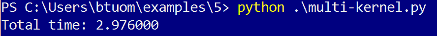
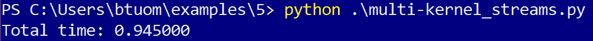
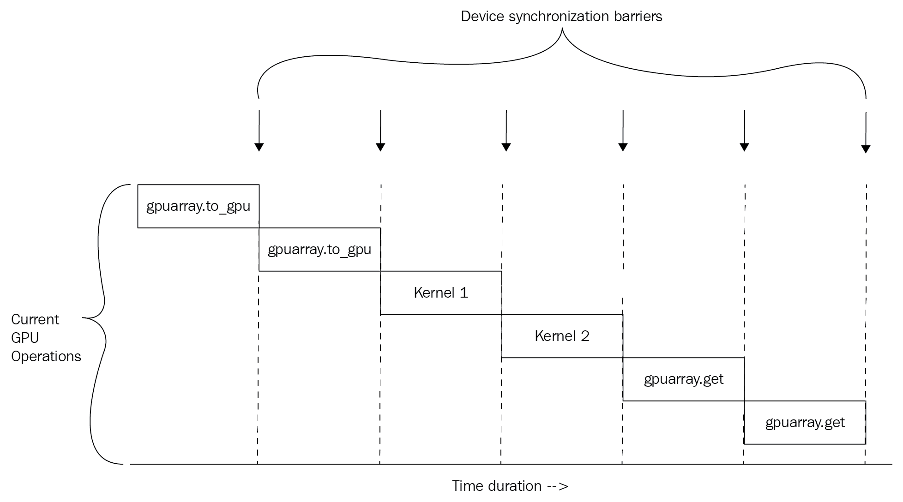
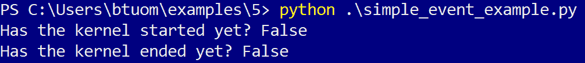
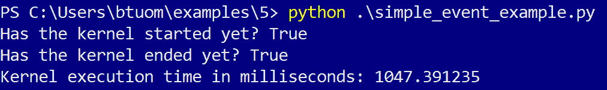
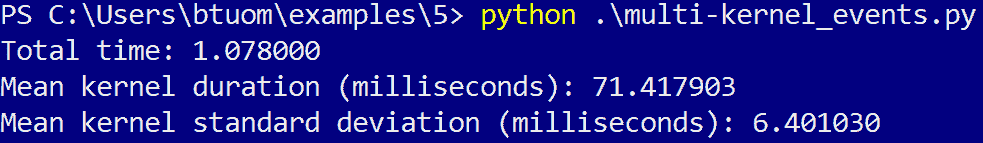
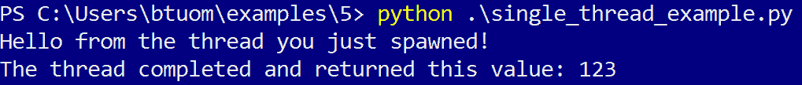

# 第五章：流、事件、上下文和并发

在前面的章节中，我们看到了在与 GPU 交互时，从主机执行的两个主要操作：

+   将内存数据复制到和从 GPU

+   启动内核函数

我们知道，在单个内核中，其众多线程之间存在一个并发级别；然而，还有另一个并发级别，是针对多个内核以及我们可用的 GPU 内存操作。这意味着我们可以同时启动多个内存和内核操作，而无需等待每个操作完成。然而，另一方面，我们必须要有一定的组织性，以确保所有相互依赖的操作都得到同步；这意味着我们不应该在输入数据完全复制到设备内存之前启动特定的内核，或者不应该在内核执行完成之前将启动内核的输出数据复制到主机。

为了达到这个目的，我们有了所谓的**CUDA 流**——一个**流**是一系列按顺序在 GPU 上运行的操作。单独来看，一个流本身并没有什么用处——关键是通过使用多个流来获得对主机发出的 GPU 操作的并发性。这意味着我们应该交错启动对应不同流的 GPU 操作，以利用这个概念。

在本章中，我们将广泛介绍流的概念。此外，我们还将探讨**事件**，这是流的一个特性，用于精确地计时内核，并向主机指示在给定流中完成了哪些操作。

最后，我们将简要介绍 CUDA **上下文**。一个**上下文**可以被视为与操作系统中进程的类似，因为 GPU 将每个上下文的数据和内核代码*隔离*并封装起来，使其与其他当前存在于 GPU 上的上下文隔离开。我们将在本章末尾看到这个概念的基本内容。

以下为本章的学习成果：

+   理解设备和流同步的概念

+   学习如何有效地使用流来组织并发 GPU 操作

+   学习如何有效地使用 CUDA 事件

+   理解 CUDA 上下文

+   学习如何在给定上下文中显式同步

+   学习如何显式创建和销毁 CUDA 上下文

+   学习如何使用上下文以允许在主机上的多个进程和线程中使用 GPU

# 技术要求

为了本章，需要一个配备现代 NVIDIA GPU（2016 年及以后）的 Linux 或 Windows 10 PC，并安装所有必要的 GPU 驱动程序和 CUDA Toolkit（9.0 及以后）。还需要一个合适的 Python 2.7 安装（例如 Anaconda Python 2.7），并包含 PyCUDA 模块。

本章的代码也可在 GitHub 上找到：

[`github.com/PacktPublishing/Hands-On-GPU-Programming-with-Python-and-CUDA`](https://github.com/PacktPublishing/Hands-On-GPU-Programming-with-Python-and-CUDA)

关于先决条件的更多信息，请查看本书的**前言**，而对于软件和硬件要求，请查看[`github.com/PacktPublishing/Hands-On-GPU-Programming-with-Python-and-CUDA`](https://github.com/PacktPublishing/Hands-On-GPU-Programming-with-Python-and-CUDA)中的 README。

# CUDA 设备同步

在我们能够使用 CUDA 流之前，我们需要理解**设备同步**的概念。这是一个操作，其中主机阻止任何进一步的执行，直到所有发送到 GPU 的操作（内存传输和内核执行）都已完成。这是为了确保依赖于先前操作的操作不会以错误的顺序执行——例如，确保在主机尝试读取输出之前，CUDA 内核启动已完成。

在 CUDA C 中，设备同步是通过`cudaDeviceSynchronize`函数实现的。这个函数有效地阻止了主机上的进一步执行，直到所有 GPU 操作都已完成。`cudaDeviceSynchronize`如此基本，以至于它通常是大多数 CUDA C 书籍中最早涉及的主题之一——我们还没有看到这一点，因为 PyCUDA 已经在我们需要时自动为我们调用。让我们看看 CUDA C 代码的一个例子，看看这是如何手动完成的：

```py
// Copy an array of floats from the host to the device.
cudaMemcpy(device_array, host_array, size_of_array*sizeof(float), cudaMemcpyHostToDevice);
// Block execution until memory transfer to device is complete.
cudaDeviceSynchronize();
// Launch CUDA kernel.
Some_CUDA_Kernel <<< block_size, grid_size >>> (device_array, size_of_array);
// Block execution until GPU kernel function returns.
cudaDeviceSynchronize();
// Copy output of kernel to host.
cudaMemcpy(host_array,  device_array, size_of_array*sizeof(float), cudaMemcpyDeviceToHost);
// Block execution until memory transfer to host is complete.
cudaDeviceSynchronize();
```

在这段代码块中，我们可以看到，在每次 GPU 操作之后，我们必须直接与设备同步。如果我们只需要一次调用一个 CUDA 内核，就像这里看到的那样，这是可以的。但如果我们想要并发启动多个独立的核心和操作不同数据数组的内存操作，在整个设备上进行同步将是不高效的。在这种情况下，我们应该在多个流中进行同步。我们现在将看到如何做到这一点。

# 使用 PyCUDA 流类

我们将从一个简单的 PyCUDA 程序开始；所有这些都将做的是生成一系列随机的 GPU 数组，使用简单的内核处理每个数组，并将数组复制回主机。然后我们将修改这个程序以使用流。请记住，这个程序将没有任何意义，除了说明如何使用流以及你可以获得的一些基本性能提升。（这个程序可以在 GitHub 仓库中的`multi-kernel.py`文件下找到，位于`5`目录中。）

当然，我们首先需要导入适当的 Python 模块，以及`time`函数：

```py
import pycuda.autoinit
import pycuda.driver as drv
from pycuda import gpuarray
from pycuda.compiler import SourceModule
import numpy as np
from time import time
```

现在，我们将指定我们希望处理多少数组——在这里，每个数组将由不同的内核启动处理。我们还指定了我们将生成的随机数组的长度，如下所示：

```py
num_arrays = 200
array_len = 1024**2
```

现在，我们有一个对每个数组进行操作的内核；所有这些将做的只是遍历数组中的每个点，并将其乘以 2 并除以 2 共 50 次，最终保持数组不变。我们希望限制每个内核启动使用的线程数，这将帮助我们获得 GPU 上多个内核启动的并发性，以便每个线程可以通过 `for` 循环遍历数组的不同部分。(再次提醒，这个内核函数除了了解流和同步之外，对其他任何用途都是完全无用的!) 如果每个内核启动使用太多的线程，那么在以后获得并发性将会更难：

```py
ker = SourceModule(""" 
__global__ void mult_ker(float * array, int array_len)
{
     int thd = blockIdx.x*blockDim.x + threadIdx.x;
     int num_iters = array_len / blockDim.x;

     for(int j=0; j < num_iters; j++)
     {
         int i = j * blockDim.x + thd;

         for(int k = 0; k < 50; k++)
         {
              array[i] *= 2.0;
              array[i] /= 2.0;
         }
     }
}
""")

mult_ker = ker.get_function('mult_ker')
```

现在，我们将生成一些随机数据数组，将这些数组复制到 GPU 上，迭代地在 64 个线程上启动我们的内核，然后将输出数据复制回主机，并使用 NumPy 的 `allclose` 函数断言它们相同。我们将使用 Python 的 `time` 函数记录从开始到结束的所有操作的持续时间，如下所示：

```py
data = []
data_gpu = []
gpu_out = []

# generate random arrays.
for _ in range(num_arrays):
    data.append(np.random.randn(array_len).astype('float32'))

t_start = time()

# copy arrays to GPU.
for k in range(num_arrays):
    data_gpu.append(gpuarray.to_gpu(data[k]))

# process arrays.
for k in range(num_arrays):
    mult_ker(data_gpu[k], np.int32(array_len), block=(64,1,1), grid=(1,1,1))

# copy arrays from GPU.
for k in range(num_arrays):
    gpu_out.append(data_gpu[k].get())

t_end = time()

for k in range(num_arrays):
    assert (np.allclose(gpu_out[k], data[k]))

print 'Total time: %f' % (t_end - t_start)
```

现在，我们已经准备好运行这个程序。我现在就会运行它：



因此，这个程序完成几乎花了三秒钟。我们将进行一些简单的修改，以便我们的程序可以使用流，然后看看我们是否能获得任何性能提升（这可以在存储库中的 `multi-kernel_streams.py` 文件中看到）。

首先，我们注意到对于每个内核启动，我们都有一个处理的数据数组，这些数据存储在 Python 列表中。我们必须为每个单独的数组/内核启动对创建一个单独的流对象，所以让我们首先添加一个名为 `streams` 的空列表，它将保存我们的流对象：

```py
data = []
data_gpu = []
gpu_out = []
streams = []
```

我们现在可以生成一系列我们将用于组织内核启动的流。我们可以从 `pycuda.driver` 子模块使用 `Stream` 类获取流对象。由于我们已经导入了这个子模块并将其别名为 `drv`，我们可以用新的流对象填充我们的列表，如下所示：

```py
for _ in range(num_arrays):
    streams.append(drv.Stream())
```

现在，我们首先需要修改将数据传输到 GPU 的内存操作。考虑以下步骤：

1.  查找第一个使用 `gpuarray.to_gpu` 函数将数组复制到 GPU 的循环。我们希望切换到异步和流友好的版本，即 `gpu_array.to_gpu_async` 函数。 (我们现在还必须使用 `stream` 参数指定每个内存操作应使用的流):

```py
for k in range(num_arrays):
    data_gpu.append(gpuarray.to_gpu_async(data[k], stream=streams[k]))
```

1.  我们现在可以启动我们的内核。这完全和以前一样，只是我们必须通过使用 `stream` 参数指定要使用哪个流：

```py
for k in range(num_arrays):
    mult_ker(data_gpu[k], np.int32(array_len), block=(64,1,1), grid=(1,1,1), stream=streams[k])
```

1.  最后，我们需要将我们的数据从 GPU 上拉下来。我们可以通过将 `gpuarray get` 函数切换到 `get_async`，并再次使用 `stream` 参数来实现，如下所示：

```py
for k in range(num_arrays):
    gpu_out.append(data_gpu[k].get_async(stream=streams[k]))
```

现在，我们已经准备好运行我们的流友好修改后的程序：



在这种情况下，我们有三重性能提升，考虑到我们不得不做的修改非常少，这并不算太坏。但在我们继续之前，让我们尝试更深入地理解为什么这会起作用。

让我们考虑两个 CUDA 内核调用的案例。我们将在启动内核前后执行与每个内核对应的 GPU 内存操作，总共六个操作。我们可以用以下图表可视化 GPU 上随时间发生的操作——沿*x*轴向右移动对应时间长度，而*y*轴对应特定时间执行的 GPU 操作。这可以用以下图表表示：



可视化为什么流在性能提升方面工作得如此之好并不太难——由于单个流中的操作只有在所有*必要*的先前操作都完成后才会被阻塞，我们将获得不同 GPU 操作之间的并发性，并充分利用我们的设备。这可以通过并发操作的巨大重叠来看到。我们可以如下可视化基于流的并发性随时间的变化：


# 使用 CUDA 流并发执行康威生命游戏

现在，我们将看到一个更有趣的应用——我们将修改上一章的 LIFE（康威生命游戏）模拟，这样我们就可以同时显示四个独立的动画窗口。（如果你还没有看过上一章的例子，建议你看看这个例子。）

让我们从存储库中获取上一章的旧 LIFE 模拟副本，它应该在`4`目录下的`conway_gpu.py`文件中。我们现在将修改它以创建基于 CUDA 流的新并发 LIFE 模拟。（我们将在下一章的`5`目录下的`conway_gpu_streams.py`文件中看到这个基于流的模拟。）

前往文件末尾的主函数。我们将设置一个新变量`num_concurrent`，它指示我们一次将显示多少个并发动画（其中`N`表示模拟格子的高度/宽度，如前所述）。我们在这里将其设置为`4`，但你可以自由尝试其他值：

```py
if __name__ == '__main__':

    N = 128
    num_concurrent = 4
```

现在，我们需要一组`num_concurrent`流对象，并且还需要在 GPU 上分配一组输入和输出格子。当然，我们将将这些存储在列表中，并像以前一样初始化格子。我们将设置一些空列表，并在循环中填充适当的对象，如下所示（注意我们如何在每次迭代中设置一个新的初始状态格子，将其发送到 GPU，并将其连接到`lattices_gpu`）：

```py
streams = []
lattices_gpu = []
newLattices_gpu = []

for k in range(num_concurrent):
    streams.append(drv.Stream())
    lattice = np.int32( np.random.choice([1,0], N*N, p=[0.25, 0.75]).reshape(N, N) )
    lattices_gpu.append(gpuarray.to_gpu(lattice)) 
    newLattices_gpu.append(gpuarray.empty_like(lattices_gpu[k])) 
```

由于我们只是在程序启动时执行这个循环一次，并且几乎所有计算工作都会在动画循环中完成，所以我们实际上并不需要担心使用我们刚刚立即生成的流。

我们现在将使用 Matplotlib 的子图功能设置环境；注意我们如何通过设置 `ncols` 参数来设置多个动画图。我们将有一个另一个列表结构，它将对应于 `imgs` 中所需的动画更新图像。注意我们现在如何使用 `get_async` 和适当的对应流来设置它：

```py
fig, ax = plt.subplots(nrows=1, ncols=num_concurrent)
imgs = []

for k in range(num_concurrent):
    imgs.append( ax[k].imshow(lattices_gpu[k].get_async(stream=streams[k]), interpolation='nearest') )

```

在主函数中最后要更改的是以 `ani = animation.FuncAnimation` 开头的倒数第二行。让我们修改 `update_gpu` 函数的参数，以反映我们正在使用的新列表，并添加两个额外的参数，一个用于传递我们的 `streams` 列表，以及一个参数来指示应该有多少个并发动画：

```py
ani = animation.FuncAnimation(fig, update_gpu, fargs=(imgs, newLattices_gpu, lattices_gpu, N, streams, num_concurrent) , interval=0, frames=1000, save_count=1000)    
```

我们现在对 `update_gpu` 函数进行必要的修改，以接受这些额外的参数。在文件中向上滚动一点，并按以下方式修改参数：

`def update_gpu(frameNum, imgs, newLattices_gpu, lattices_gpu, N, streams, num_concurrent)`:

我们现在需要修改这个函数，使其迭代 `num_concurrent` 次，并在返回整个 `imgs` 列表之前，像之前一样设置 `imgs` 的每个元素：

```py
for k in range(num_concurrent):
    conway_ker( newLattices_gpu[k], lattices_gpu[k], grid=(N/32,N/32,1), block=(32,32,1), stream=streams[k] )
     imgs[k].set_data(newLattices_gpu[k].get_async(stream=streams[k]) )
     lattices_gpu[k].set_async(newLattices_gpu[k], stream=streams[k])

 return imgs
```

注意我们做出的更改——每个内核都在适当的流中启动，而 `get` 已切换到与同一流同步的 `get_async`。

最后，循环中的最后一行将 GPU 数据从一个设备数组复制到另一个数组，而不进行任何重新分配。在此之前，我们可以使用简写切片操作符 `[:]` 直接在数组之间复制元素，而不在 GPU 上重新分配任何内存；在这种情况下，切片操作符的表示法充当了 PyCUDA `set` 函数的 GPU 数组的别名。（当然，`set` 是将一个 GPU 数组复制到另一个相同大小的数组而不进行任何重新分配的函数。）幸运的是，确实存在这个函数的流同步版本，即 `set_async`，但我们需要明确使用这个函数，并指定要复制的数组和要使用的流。

我们现在已经完成并准备好运行这个程序。转到终端，在命令行中输入 `python conway_gpu_streams.py` 来享受这个展示：


# 事件

**事件**是存在于 GPU 上的对象，其目的是作为操作流的里程碑或进度标记。事件通常用于在设备端提供测量时间持续性的功能，以精确地计时操作；我们迄今为止所做的时间测量都是使用基于主机的 Python 性能分析器和标准 Python 库函数，如 `time`。此外，事件还可以用于向主机提供有关流的状态以及它已经完成哪些操作的状态更新，以及用于基于流的显式同步。

让我们从使用无显式流的示例开始，并使用事件仅测量单个内核启动。（如果我们不在我们的代码中显式使用流，CUDA 实际上会无意识地定义一个默认流，所有操作都将放入该流中）。

在这里，我们将使用与本章开头相同的无用的乘除循环内核和头文件，并修改以下大部分内容。我们希望这个示例中单个内核实例运行很长时间，因此我们将生成一个巨大的随机数数组供内核处理，如下所示：

```py
array_len = 100*1024**2
data = np.random.randn(array_len).astype('float32')
data_gpu = gpuarray.to_gpu(data)
```

我们现在使用`pycuda.driver.Event`构造函数构建我们的事件（当然，`pycuda.driver`已经被我们之前的导入语句别名为`drv`）。

我们将在这里创建两个事件对象，一个用于内核启动的开始，另一个用于内核启动的结束（我们将始终需要两个事件对象来测量任何单个 GPU 操作，就像我们很快就会看到的那样）：

```py
start_event = drv.Event()
end_event = drv.Event()
```

现在，我们即将启动内核，但首先，我们必须使用事件记录函数标记`start_event`实例在执行流中的位置。我们启动内核，然后标记`end_event`在执行流中的位置，并使用`record`：

```py
start_event.record()
mult_ker(data_gpu, np.int32(array_len), block=(64,1,1), grid=(1,1,1))
end_event.record()
```

事件具有二进制值，表示它们是否已到达或尚未到达，这由函数 query 给出。让我们在内核启动后立即打印两个事件的更新状态：

```py
print 'Has the kernel started yet? {}'.format(start_event.query())
 print 'Has the kernel ended yet? {}'.format(end_event.query())
```

让我们现在运行这个程序并看看会发生什么：



我们的目标是最终测量内核执行的持续时间，但内核显然还没有启动。PyCUDA 中的内核是异步启动的（无论它们是否存在于特定的流中），因此我们必须确保我们的主机代码与 GPU 正确同步。

由于`end_event`是最后一个到达的，我们可以通过这个事件对象的 synchronize 函数阻塞进一步的宿主代码执行，直到内核完成；这将确保在执行任何进一步的宿主代码行之前内核已经完成。让我们在适当的位置添加一行代码来完成这个操作：

```py
end_event.synchronize()

print 'Has the kernel started yet?  {}'.format(start_event.query())

print 'Has the kernel ended yet? {}'.format(end_event.query())
```

最后，我们准备测量内核的执行时间；我们使用事件对象的`time_till`或`time_since`操作来与另一个事件对象进行比较，以获取这两个事件之间的时间（以毫秒为单位）。让我们使用`start_event`的`time_till`操作来测量`end_event`：

```py
print 'Kernel execution time in milliseconds: %f ' % start_event.time_till(end_event)
```

可以使用`time_till`和`time_since`函数测量 GPU 上已经发生的两个事件之间的持续时间。请注意，这些函数始终以毫秒为单位返回值！

让我们现在再次尝试运行我们的程序：



（此示例也可在存储库中的`simple_event_example.py`文件中找到。）

# 事件和流

我们现在将了解如何使用事件对象与流相关联；这将使我们能够对各种 GPU 操作的流程有高度细致的控制，使我们能够确切地知道每个单独的流通过`query`函数已经进展到什么程度，甚至允许我们在忽略其他流的同时，将特定流与主机同步。

首先，我们必须认识到这一点——每个流都必须有自己的专用事件对象集合；多个流不能共享一个事件对象。让我们通过修改先前的示例`multi_kernel_streams.py`来具体看看这意味着什么。在内核定义之后，让我们添加两个额外的空列表——`start_events`和`end_events`。我们将用事件对象填充这些列表，这些对象将对应于我们拥有的每个流。这将使我们能够为每个流中的每个 GPU 操作计时，因为每个 GPU 操作都需要两个事件：

```py
data = []
data_gpu = []
gpu_out = []
streams = []
start_events = []
end_events = []

for _ in range(num_arrays):
    streams.append(drv.Stream())
    start_events.append(drv.Event())
    end_events.append(drv.Event())
```

现在，我们可以通过修改第二个循环来单独计时每个内核启动，使用启动开始和结束的事件记录。请注意，由于存在多个流，我们必须将适当的流作为参数输入到每个事件对象的`record`函数中。另外，请注意，我们可以在第二个循环中捕获结束事件；这仍然允许我们完美地捕获内核执行持续时间，而不会在启动后续内核时产生任何延迟。现在考虑以下代码：

```py
for k in range(num_arrays):
    start_events[k].record(streams[k])
    mult_ker(data_gpu[k], np.int32(array_len), block=(64,1,1), grid=(1,1,1), stream=streams[k])

for k in range(num_arrays):
    end_events[k].record(streams[k])
```

现在我们将提取每个单独内核启动的持续时间。在迭代断言检查之后添加一个新空列表，并通过`time_till`函数填充持续时间：

```py
kernel_times = []
for k in range(num_arrays):
   kernel_times.append(start_events[k].time_till(end_events[k]))
```

现在，让我们在最后添加两个`print`语句，以告诉我们内核执行时间的平均值和标准差：

```py
print 'Mean kernel duration (milliseconds): %f' % np.mean(kernel_times)
print 'Mean kernel standard deviation (milliseconds): %f' % np.std(kernel_times)
```

我们现在可以运行这个：



（此示例也可在存储库中作为`multi-kernel_events.py`找到。）

我们可以看到，内核持续时间的标准偏差相对较低，这是好的，因为每个内核在相同的块和网格大小上处理相同数量的数据——如果存在高度偏差，那么这意味着我们在内核执行中对 GPU 的使用非常不均匀，我们就必须重新调整参数以获得更高的并发级别。

# 上下文

CUDA **上下文**通常被描述为类似于操作系统中的一个进程。让我们回顾一下这意味着什么——进程是单个程序在计算机上运行的实例；所有在操作系统内核之外运行的程序都在进程中运行。每个进程都有自己的指令集、变量和分配的内存，并且一般来说，对其他进程的动作和内存是盲目的。当一个进程结束时，操作系统内核执行清理操作，确保进程分配的所有内存都已释放，并关闭进程所使用的任何文件、网络连接或其他资源。（好奇的 Linux 用户可以使用命令行`top`命令查看他们计算机上运行的进程，而 Windows 用户可以使用 Windows 任务管理器查看它们）。

与进程类似，上下文与单个使用 GPU 的主程序相关联。上下文在内存中保存所有正在使用和分配的 CUDA 内核和内存，对其他当前存在的上下文中的内核和内存是盲目的。当一个上下文被销毁（例如在基于 GPU 的程序结束时），GPU 将执行上下文中所有代码和分配的内存的清理，为其他当前和未来的上下文释放资源。我们迄今为止编写的所有程序都存在于单个上下文中，因此这些操作和概念对我们来说是不可见的。

让我们记住，单个程序最初是一个单个进程，但它可以自身复制以在多个进程或线程中运行。类似地，单个 CUDA 主机程序可以在 GPU 上生成和使用多个 CUDA 上下文。通常，当我们想要在新的进程或线程中获取主机并发性时，我们会创建一个新的上下文。（然而，应该强调的是，主机进程和 CUDA 上下文之间没有确切的 1 对 1 关系）。

就像生活中的许多其他领域一样，我们将从一个简单的例子开始。我们首先将了解如何访问程序默认的上下文并在其上进行同步。

# 同步当前上下文

我们将了解如何在 Python 中显式同步我们的设备上下文，就像在 CUDA C 中一样；这实际上是 CUDA C 中需要了解的最基本技能之一，并且在大多数其他关于此主题的书籍的第一章或第二章中都有涉及。到目前为止，我们能够避免这个话题，因为 PyCUDA 已经通过`pycuda.gpuarray`函数（如`to_gpu`或`get`）为我们自动执行了大多数同步操作；否则，在`to_gpu_async`或`get_async`函数的情况下，同步由流处理，正如我们在本章开头所看到的。

我们将谦逊地开始修改我们在第三章，“PyCUDA 入门”中编写的程序，该程序使用显式上下文同步生成 Mandelbrot 集的图像。（这可以在存储库中的`3`目录下的文件`gpu_mandelbrot0.py`中找到。）

我们在这里不会比原始的 Mandelbrot 程序获得任何性能提升；这个练习的唯一目的只是帮助我们理解 CUDA 上下文和 GPU 同步。

查看头文件，我们当然会看到`import pycuda.autoinit`这一行。我们可以使用`pycuda.autoinit.context`访问当前上下文对象，并且我们可以通过调用`pycuda.autoinit.context.synchronize()`函数在我们的当前上下文中进行同步。

现在让我们修改`gpu_mandelbrot`函数以处理显式同步。我们看到的第一个与 GPU 相关的行是这一行：

`mandelbrot_lattice_gpu = gpuarray.to_gpu(mandelbrot_lattice)`

我们现在可以将这个改为显式同步。我们可以使用`to_gpu_async`异步地将数据复制到 GPU，然后按照以下方式同步：

```py
mandelbrot_lattice_gpu = gpuarray.to_gpu_async(mandelbrot_lattice)
pycuda.autoinit.context.synchronize()
```

然后我们看到下一行使用`gpuarray.empty`函数在 GPU 上分配内存。由于 GPU 架构的本质，CUDA 中的内存分配总是自动同步的；这里没有*异步*内存分配的等效项。因此，我们保留这一行不变。

在 CUDA 中进行内存分配始终是同步的！

我们现在看到接下来的两行——我们的 Mandelbrot 内核通过调用`mandel_ker`来启动，我们通过调用`get`来复制我们的 Mandelbrot `gpuarray`对象的内容。在内核启动后进行同步，将`get`切换到`get_async`，最后同步最后一行：

```py
mandel_ker( mandelbrot_lattice_gpu, mandelbrot_graph_gpu, np.int32(max_iters), np.float32(upper_bound))
pycuda.autoinit.context.synchronize()
mandelbrot_graph = mandelbrot_graph_gpu.get_async()
pycuda.autoinit.context.synchronize()
```

我们现在可以运行这个程序，它将生成 Mandelbrot 图像到磁盘，就像在第三章，“PyCUDA 入门”中一样。

（此示例也可在存储库中作为`gpu_mandelbrot_context_sync.py`文件找到。）

# 手动创建上下文

到目前为止，我们一直在所有 PyCUDA 程序的开始处导入`pycuda.autoinit`；这实际上在程序开始时创建了一个上下文，并在程序结束时销毁它。

让我们尝试手动进行。我们将编写一个小程序，该程序仅将一个小数组复制到 GPU，将其复制回主机，打印数组，然后退出。

我们从导入开始：

```py
import numpy as np
from pycuda import gpuarray
import pycuda.driver as drv
```

首先，我们使用`pycuda.driver.init`函数初始化 CUDA，这里将其别名为`drv`：

```py
drv.init()
```

现在我们选择我们希望与之工作的 GPU；在一个人拥有多个 GPU 的情况下，这是必要的。我们可以使用`pycuda.driver.Device`来选择一个特定的 GPU；如果你只有一个 GPU，就像我一样，你可以使用`pycuda.driver.Device(0)`来访问它，如下所示：

```py
dev = drv.Device(0)
```

我们现在可以使用`make_context`在这个设备上创建一个新的上下文，如下所示：

```py
ctx = dev.make_context()
```

现在我们有了一个新的上下文，这将成为默认上下文。让我们将一个数组复制到 GPU 上，再复制回主机，并打印它：

```py
x = gpuarray.to_gpu(np.float32([1,2,3]))
print x.get()
```

现在我们已经完成了。我们可以通过调用 `pop` 函数来销毁上下文：

```py
ctx.pop()
```

就这样！我们应该始终记住，在程序退出之前，使用 `pop` 显式创建的上下文应该被销毁。

（此示例可在存储库中该章节目录下的 `simple_context_create.py` 文件中查看。）

# 主机端多进程和多线程

当然，我们可能希望通过在主机 CPU 上使用多个进程或线程来获得主机端的并发性。让我们现在通过快速概述来区分主机端操作系统进程和线程。

每个存在于操作系统内核之外的主机端程序都作为进程执行，也可以存在于多个进程中。进程有自己的地址空间，因为它与其他所有进程并发运行，独立于其他进程。一般来说，进程对其他进程的行为是盲目的，尽管多个进程可以通过套接字或管道进行通信。在 Linux 和 Unix 中，使用 fork 系统调用创建新进程。

相比之下，主机端线程存在于单个进程内，单个进程内也可以存在多个线程。单个进程中的多个线程是并发运行的。同一进程中的所有线程共享进程内的同一地址空间，并可以访问相同的共享变量和数据。通常，使用资源锁来访问多个线程之间的数据，以避免竞态条件。在 C、C++或 Fortran 等编译型语言中，通常使用 Pthreads 或 OpenMP API 来管理多个进程线程。

线程比进程轻量得多，操作系统内核在单个进程中的多个线程之间切换任务比在多个进程之间切换任务要快得多。通常，操作系统内核会自动在不同的 CPU 核心上执行不同的线程和进程，以建立真正的并发。

Python 的一个特性是，虽然它通过 `threading` 模块支持多线程，但所有线程都会在同一个 CPU 核心上执行。这是由于 Python 作为解释型脚本语言的技术细节，与 Python 的全局解释器锁（GIL）有关。要通过 Python 在主机上实现真正的多核并发，我们不幸地必须使用 `multiprocessing` 模块来生成多个进程。（不幸的是，由于 Windows 处理进程的方式，multiprocessing 模块目前在 Windows 上尚不完全可用。Windows 用户如果想要在主机端有并发性，将不得不坚持使用单核多线程。）

我们现在将看到如何使用 Python 中的两个线程来使用基于 GPU 的操作；Linux 用户请注意，这可以通过将 `threading` 的引用切换到 `multiprocessing`，并将 `Thread` 的引用切换到 `Process` 来轻松扩展到进程，因为这两个模块看起来和表现得很相似。然而，由于 PyCUDA 的性质，我们必须为每个将使用 GPU 的线程或进程创建一个新的 CUDA 上下文。让我们看看如何立即做到这一点。

# 主机端并发的多个上下文

首先，让我们简要回顾一下如何在 Python 中创建一个可以返回值的单个主机线程的示例。 (此示例也可以在存储库中的 `5` 目录下的 `single_thread_example.py` 文件中找到。) 我们将通过使用 `threading` 模块中的 `Thread` 类来创建 `Thread` 的子类来实现这一点，如下所示：

```py
import threading
class PointlessExampleThread(threading.Thread):
```

我们现在设置构造函数。我们调用父类的构造函数，并在对象内部设置一个空变量，该变量将是线程的返回值：

```py
def __init__(self):
    threading.Thread.__init__(self)
    self.return_value = None
```

我们现在在线程类中设置 `run` 函数，这是线程启动时将执行的内容。我们只需让它打印一行并设置返回值：

```py
def run(self):
    print 'Hello from the thread you just spawned!'
    self.return_value = 123
```

我们最终必须设置 `join` 函数。这将允许我们从线程接收返回值：

```py
def join(self):
    threading.Thread.join(self)
    return self.return_value
```

现在我们已经设置好了我们的线程类。让我们创建一个 `NewThread` 对象的实例，通过调用 `start` 方法来启动新线程，然后通过调用 `join` 方法阻塞执行并从主机线程获取输出：

```py
NewThread = PointlessExampleThread()
NewThread.start()
thread_output = NewThread.join()
print 'The thread completed and returned this value: %s' % thread_output
```

现在，让我们运行这个：



现在，我们可以在主机上的多个并发线程中扩展这个想法，通过多个上下文和线程来启动并发 CUDA 操作。我们现在将查看最后一个示例。让我们重用本章开头提到的无意义的乘除内核，并在我们创建的每个线程中启动它。

首先，让我们看看导入部分。由于我们正在创建显式上下文，请记住删除 `pycuda.autoinit` 并在最后添加一个 `threading` 的导入：

```py
import pycuda
import pycuda.driver as drv
from pycuda import gpuarray
from pycuda.compiler import SourceModule
import numpy as np
from time import time
import threading 
```

我们将使用与之前相同的数组大小，但这次我们将线程的数量与数组数量直接对应。通常，我们不想在主机上创建超过 20 个线程，所以我们只创建 `10` 个数组。现在，考虑以下代码：

```py
num_arrays = 10
array_len = 1024**2
```

现在，我们将我们的旧内核存储为一个字符串对象；由于这只能在上下文中编译，因此我们必须在每个线程中单独编译它：

```py
kernel_code = """ 
__global__ void mult_ker(float * array, int array_len)
{
     int thd = blockIdx.x*blockDim.x + threadIdx.x;
     int num_iters = array_len / blockDim.x;
    for(int j=0; j < num_iters; j++)
     {
     int i = j * blockDim.x + thd;
     for(int k = 0; k < 50; k++)
     {
         array[i] *= 2.0;
         array[i] /= 2.0;
     }
 }
}
"""
```

现在，我们可以开始设置我们的类。我们将创建 `threading.Thread` 的另一个子类，就像之前一样，并将构造函数设置为接受一个输入数组作为参数。我们将使用 `None` 初始化一个输出变量，就像之前做的那样：

```py
class KernelLauncherThread(threading.Thread):
    def __init__(self, input_array):
        threading.Thread.__init__(self)
        self.input_array = input_array
        self.output_array = None
```

我们现在可以编写 `run` 函数。我们选择我们的设备，在该设备上创建一个上下文，编译我们的内核，并提取内核函数引用。注意 `self` 对象的使用：

```py
def run(self):
    self.dev = drv.Device(0)
    self.context = self.dev.make_context()
    self.ker = SourceModule(kernel_code)
    self.mult_ker = self.ker.get_function('mult_ker')
```

我们现在将数组复制到 GPU 上，启动内核，并将输出复制回主机。然后我们销毁上下文：

```py
self.array_gpu = gpuarray.to_gpu(self.input_array)
self.mult_ker(self.array_gpu, np.int32(array_len), block=(64,1,1), grid=(1,1,1))
self.output_array = self.array_gpu.get()
self.context.pop()
```

最后，我们设置了 `join` 函数。这将返回 `output_array` 到主机：

```py
 def join(self):
     threading.Thread.join(self)
     return self.output_array
```

我们现在完成了我们的子类。我们将设置一些空列表来保存我们的随机测试数据、线程对象和线程输出值，类似于之前。然后我们将生成一些随机数组进行处理，并设置一个内核启动线程列表，这些线程将操作每个相应的数组：

```py
data = []
gpu_out = []
threads = []
for _ in range(num_arrays):
    data.append(np.random.randn(array_len).astype('float32'))
for k in range(num_arrays):
 threads.append(KernelLauncherThread(data[k]))
```

我们现在将启动每个线程对象，并使用 `join` 将其输出提取到 `gpu_out` 列表中：

```py
for k in range(num_arrays):
    threads[k].start()

for k in range(num_arrays):
    gpu_out.append(threads[k].join())
```

最后，我们只是对输出数组进行简单的断言，以确保它们与输入相同：

```py
for k in range(num_arrays):
    assert (np.allclose(gpu_out[k], data[k]))

```

这个例子可以在存储库中的 `multi-kernel_multi-thread.py` 文件中看到。

# 摘要

我们从学习设备同步以及从主机对 GPU 上操作同步的重要性开始本章；这允许依赖操作在继续之前完成先前的操作。这个概念一直被隐藏起来，因为 PyCUDA 到目前为止一直在为我们自动处理同步。然后我们学习了 CUDA 流，它允许在 GPU 上独立执行操作序列，而无需在整个 GPU 上同步，这可以给我们带来很大的性能提升；然后我们学习了 CUDA 事件，它允许我们在给定的流中计时单个 CUDA 内核，并确定流中的特定操作是否发生。接下来，我们学习了上下文，它在主机操作系统中的过程类似。我们学习了如何在整个 CUDA 上下文中显式同步，然后看到了如何创建和销毁上下文。最后，我们看到了如何在 GPU 上生成多个上下文，以便在主机上的多个线程或进程之间共享 GPU 使用。

# 问题

1.  在第一个示例的内核启动参数中，我们的内核是针对 64 个线程启动的。如果我们增加线程数量到 GPU 核心数及以上，这会如何影响原始版本和流版本的性能？

1.  考虑一下本章开头给出的 CUDA C 示例，它说明了 `cudaDeviceSynchronize` 的使用。你认为在不使用流而仅使用 `cudaDeviceSynchronize` 的情况下，是否可以在多个内核之间获得某种程度的并发性？

1.  如果你是一名 Linux 用户，请修改之前给出的最后一个示例，使其操作过程而不是线程：

1.  考虑一下 `multi-kernel_events.py` 程序；我们说内核执行持续时间的低标准偏差是好事。如果存在高标准偏差，那会是什么问题？

1.  在上一个例子中，我们只使用了 10 个主机端线程。列举两个原因说明为什么我们必须使用相对较少的线程或进程来在主机上启动并发 GPU 操作。
