# 调试和性能分析您的 CUDA 代码

在本章中，我们将最终学习如何使用几种不同的方法和工具来调试和性能分析我们的 GPU 代码。虽然我们可以轻松地使用像 Spyder 和 PyCharm 这样的 IDE 调试纯 Python 代码，但我们不能使用这些工具来调试实际的 GPU 代码，记住 GPU 代码本身是用 CUDA-C 编写的，而 PyCUDA 提供了一个接口。调试 CUDA 内核的第一个也是最简单的方法是使用 `printf` 语句，我们实际上可以在 CUDA 内核的中间直接调用它以打印到标准输出。我们将看到如何在 CUDA 的上下文中使用 `printf` 以及如何有效地应用它进行调试。

接下来，我们将填补我们 CUDA-C 编程中的一些空白，以便我们可以在 NVIDIA Nsight IDE 中直接编写 CUDA 程序，这将使我们能够为一些我们一直在编写的代码编写 CUDA-C 测试用例。我们将探讨如何编译 CUDA-C 程序，无论是使用命令行中的 `nvcc` 还是使用 Nsight IDE。然后，我们将了解如何在 Nsight 中进行调试并使用 Nsight 来理解 CUDA 锁步属性。最后，我们将概述 NVIDIA 命令行和 Visual Profilers，以分析我们的代码。

本章的学习成果包括以下内容：

+   有效地使用 `printf` 作为 CUDA 内核的调试工具

+   在 Python 之外编写完整的 CUDA-C 程序，特别是为创建调试测试用例

+   使用 `nvcc` 编译器在命令行上编译 CUDA-C 程序

+   使用 NVIDIA Nsight IDE 开发和调试 CUDA 程序

+   理解 CUDA warp 锁步属性以及为什么我们应该避免单个 CUDA warp 中的分支发散

+   学习有效地使用 NVIDIA 命令行和 Visual Profilers 进行 GPU 代码性能分析

# 技术要求

为了本章，需要一个配备现代 NVIDIA GPU（2016 年及以后）的 Linux 或 Windows 10 PC，并安装所有必要的 GPU 驱动程序和 CUDA Toolkit（9.0 及以后版本）。还需要一个合适的 Python 2.7 安装（例如 Anaconda Python 2.7），并包含 PyCUDA 模块。

本章的代码也可在 GitHub 上找到：[`github.com/PacktPublishing/Hands-On-GPU-Programming-with-Python-and-CUDA`](https://github.com/PacktPublishing/Hands-On-GPU-Programming-with-Python-and-CUDA)。

关于先决条件的更多信息，请参阅本书的**前言**，有关软件和硬件要求，请查看 [`github.com/PacktPublishing/Hands-On-GPU-Programming-with-Python-and-CUDA`](https://github.com/PacktPublishing/Hands-On-GPU-Programming-with-Python-and-CUDA) 中的 README。

# 在 CUDA 内核中使用 `printf`

可能会让人惊讶，但我们可以实际上从 CUDA 内核中直接打印文本到标准输出；不仅如此，每个单独的线程都可以打印它自己的输出。这在我们调试内核时尤其有用，因为我们可能需要在代码的特定点监控特定变量或计算的值，这也会使我们摆脱使用调试器逐步进行的束缚。从 CUDA 内核打印输出是通过 C/C++编程中最基本的功能完成的，这是大多数人当他们用 C 编写第一个`Hello world`程序时会学习到的功能：`printf`。当然，`printf`是打印字符串到标准输出的标准函数，在 C 编程语言中相当于 Python 的`print`函数。

在我们了解如何在 CUDA 中使用`printf`之前，让我们简要回顾一下如何使用它。首先要注意的是，`printf`总是将其第一个参数作为字符串；所以用 C 打印"Hello world!"是通过`printf("Hello world!\n");`完成的。（当然，`\n`表示"新行"或"返回"，将输出在终端移动到下一行。）如果我们要从 C 中直接打印任何常数或变量，`printf`也可以接受可变数量的参数：如果我们想打印`123`个整数到输出，我们这样做`printf("%d", 123);`（其中`%d`表示字符串后面跟着一个整数。）

同样，我们使用`%f`、`%e`或`%g`来打印浮点值（其中`%f`是十进制表示，`%e`是科学记数法，`%g`是最短的表示，无论是十进制还是科学记数法）。我们甚至可以一行打印多个值，记得将这些说明符按正确顺序放置：`printf("%d is a prime number, %f is close to pi, and %d is even.\n", 17, 3.14, 4);`将在终端上打印"17 is a prime number, 3.14 is close to pi, and 4 is even."。

现在，这本书已经快读了一半，我们终于要开始创建我们的第一个 CUDA 并行`Hello world`程序了！我们首先将适当的模块导入 Python，然后编写我们的内核。我们将从打印每个单独线程的线程和网格标识符开始（我们只在一个维度的块和网格中启动，所以我们只需要`x`值）：

```py
ker = SourceModule('''
__global__ void hello_world_ker()
{
    printf("Hello world from thread %d, in block %d!\\n", threadIdx.x, blockIdx.x);
```

让我们暂停一下，注意我们写了`\\n`而不是`\n`。这是因为 Python 本身的三重引号会解释`\n`为"新行"，所以我们必须通过使用双反斜杠来表明我们字面意思是这个，以便将`\n`直接传递给 CUDA 编译器。

现在，我们将打印一些关于块和网格维度信息，但我们想确保它在每个线程完成其初始`printf`命令之后打印。我们可以通过在`__syncthreads();`中添加来确保每个单独的线程在第一个`printf`函数执行后都会同步。

现在，我们只想将块和网格维度打印到终端一次；如果我们只是在这里放置`printf`语句，每个线程都会打印出相同的信息。我们可以通过只有一个指定的线程打印到输出来实现；让我们选择第 0 个块的第 0 个线程，这是唯一一个无论我们选择的块和网格维度如何都保证存在的线程。我们可以使用 C 的`if`语句来实现这一点：

```py
 if(threadIdx.x == 0 && blockIdx.x == 0)
 {
```

现在，我们将打印块和网格的维度，并关闭`if`语句，这样我们的 CUDA 内核就结束了：

```py
 printf("-------------------------------------\\n");
 printf("This kernel was launched over a grid consisting of %d blocks,\\n", gridDim.x);
 printf("where each block has %d threads.\\n", blockDim.x);
 }
}
''')
```

现在，我们将提取内核并在由两个块组成的网格上启动它，其中每个块有五个线程：

```py
hello_ker = ker.get_function("hello_world_ker")
hello_ker( block=(5,1,1), grid=(2,1,1) )
```

让我们立即运行这个程序（此程序也在存储库中的`hello-world_gpu.py`文件下的`6`目录中可用）：

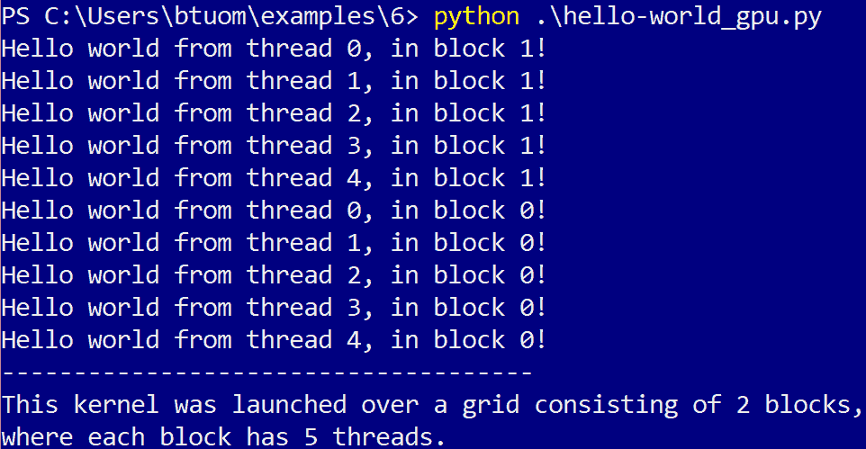

# 使用 printf 进行调试

在我们继续之前，让我们通过一个例子来了解如何使用`printf`调试 CUDA 内核。这种方法没有精确的科学，但它是可以通过经验学会的技能。我们将从一个用于矩阵-矩阵乘法的 CUDA 内核开始，但其中存在几个错误。（鼓励读者在阅读过程中查看代码，该代码作为存储库中`6`目录下的`broken_matrix_ker.py`文件提供。）

在我们继续之前，让我们简要回顾一下矩阵-矩阵乘法。假设我们有两个矩阵 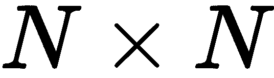，*A*和*B*，我们将它们相乘得到另一个与它们大小相同的矩阵*C*，如下所示：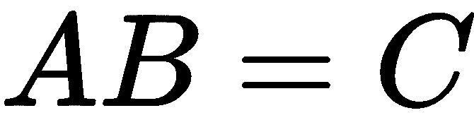。我们通过遍历所有元组 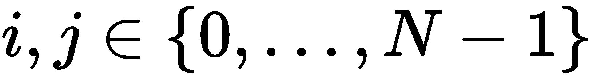并将 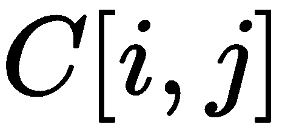的值设置为*A*的第*i*行与*B*的第*j*列的点积来实现这一点：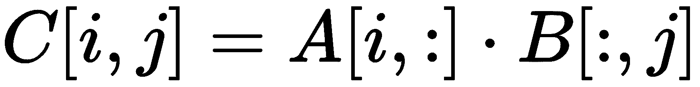。

换句话说，我们将输出矩阵*C*中的每个*i, j*元素设置为如下：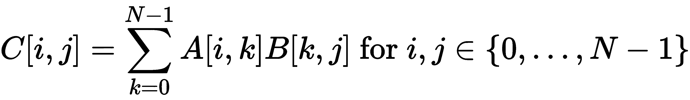

假设我们已经编写了一个内核，该内核将执行矩阵-矩阵乘法，它接受两个表示输入矩阵的数组，一个额外的预分配的浮点数组，该数组将写入输出，以及一个整数，表示每个矩阵的高度和宽度（我们将假设所有矩阵的大小相同且为方形）。所有这些矩阵都应表示为一维`float *`数组，以行向一维布局。此外，这将实现为每个 CUDA 线程将处理输出矩阵中的一个行/列元组。

我们制作了一个小的测试用例，并将其与 CUDA 中矩阵乘法的输出进行对比，结果在两个 4 x 4 矩阵的断言检查中失败了，如下所示：

```py
test_a = np.float32( [xrange(1,5)] * 4 )
test_b = np.float32([xrange(14,10, -1)]*4 )
output_mat = np.matmul(test_a, test_b)

test_a_gpu = gpuarray.to_gpu(test_a)
test_b_gpu = gpuarray.to_gpu(test_b)
output_mat_gpu = gpuarray.empty_like(test_a_gpu)

matrix_ker(test_a_gpu, test_b_gpu, output_mat_gpu, np.int32(4), block=(2,2,1), grid=(2,2,1))

assert( np.allclose(output_mat_gpu.get(), output_mat) )
```

我们将立即运行这个程序，不出所料，得到以下输出：

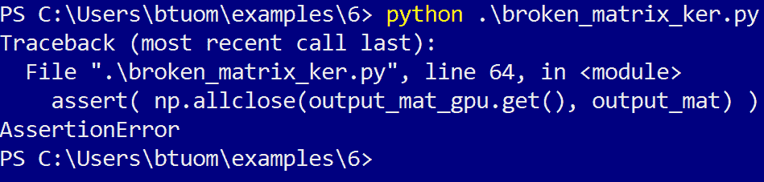

现在我们来看看 CUDA C 代码，它由一个内核和一个设备函数组成：

```py
ker = SourceModule('''
// row-column dot-product for matrix multiplication
__device__ float rowcol_dot(float *matrix_a, float *matrix_b, int row, int col, int N)
{
 float val = 0;

 for (int k=0; k < N; k++)
 {
     val += matrix_a[ row + k*N ] * matrix_b[ col*N + k];
 }
 return(val);
}

// matrix multiplication kernel that is parallelized over row/column tuples.

__global__ void matrix_mult_ker(float * matrix_a, float * matrix_b, float * output_matrix, int N)
{
 int row = blockIdx.x + threadIdx.x;
 int col = blockIdx.y + threadIdx.y;

 output_matrix[col + row*N] = rowcol_dot(matrix_a, matrix_b, col, row, N);
}
''')
```

我们的目的是在 CUDA 代码中智能地放置`printf`调用，以便我们可以监控内核和设备函数中的多个适当的值和变量；我们还应该确保在每个`printf`调用中打印出线程和块号。

让我们从内核的入口点开始。我们看到两个变量，`row`和`col`，因此我们应该立即检查这些。让我们在设置它们之后立即放置以下行（由于这是在两个维度上并行化的，我们应该打印`threadIdx`和`blockIdx`的*x*和*y*值）：

```py
printf("threadIdx.x,y: %d,%d blockIdx.x,y: %d,%d -- row is %d, col is %d.\\n", threadIdx.x, threadIdx.y, blockIdx.x, blockIdx.y, row, col);
```

再次运行代码，我们得到以下输出：

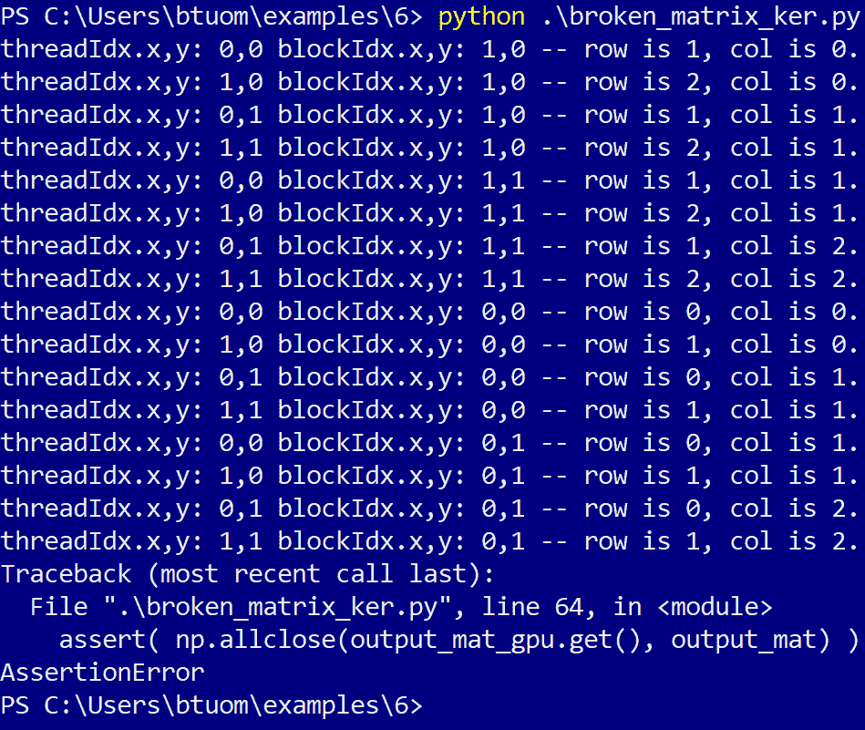

有两个问题立即显得突出：行和列元组的值有重复（每个单独的元组应该只表示一次），并且当它们都应该达到三个时，行和列的值从未超过两个。这应该提示我们，我们在计算行和列的值时是错误的；确实，我们忘记将`blockIdx`值乘以`blockDim`值来找到目标行/列值。我们按照以下方式修复这个问题：

```py
int row = blockIdx.x*blockDim.x + threadIdx.x;
int col = blockIdx.y*blockDim.y + threadIdx.y;
```

尽管如此，如果我们再次运行程序，我们仍然得到一个断言错误。让我们保留原始的`printf`调用，这样我们可以在继续的过程中监控这些值。我们看到内核中有一个对设备函数的调用，`rowcol_dot`，因此我们决定调查那里。让我们首先通过在开始处放置这个`printf`调用来确保变量被正确地传递到设备函数中：

```py
printf("threadIdx.x,y: %d,%d blockIdx.x,y: %d,%d -- row is %d, col is %d, N is %d.\\n", threadIdx.x, threadIdx.y, blockIdx.x, blockIdx.y, row, col, N);
```

当我们运行我们的程序时，将输出更多行，然而，我们会看到一条写着——`threadIdx.x,y: 0,0 blockIdx.x,y: 1,0 -- row is 2, col is 0.`的行，还有另一条写着——`threadIdx.x,y: 0,0 blockIdx.x,y: 1,0 -- row is 0, col is 2, N is 4`的行。通过`threadIdx`和`blockIdx`的值，我们看到这是同一块中的同一线程，但`row`和`col`的值是相反的。确实，当我们查看`rowcol_dot`设备函数的调用时，我们看到`row`和`col`确实与设备函数声明中的相反。我们修复了这个问题，但当我们再次运行程序时，我们得到了另一个断言错误。

让我们在设备函数中放置另一个`printf`调用，在`for`循环内；这当然是要执行矩阵`A`的行与矩阵`B`的列之间的点积。我们将检查我们正在乘的矩阵的值以及`k`的值；我们也将只查看第一个线程的值，否则我们将得到一个混乱的输出：

```py
if(threadIdx.x == 0 && threadIdx.y == 0 && blockIdx.x == 0 && blockIdx.y == 0)
            printf("Dot-product loop: k value is %d, matrix_a value is %f, matrix_b is %f.\\n", k, matrix_a[ row + k*N ], matrix_b[ col*N + k]);

```

在我们继续之前，让我们看看为我们的单元测试设置的`A`和`B`矩阵的值：

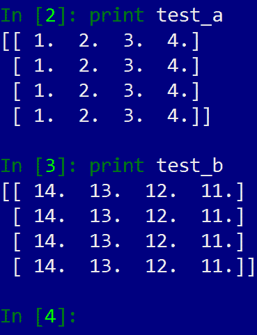

我们看到，当我们切换列时，两个矩阵都会变化，但当我们改变行时，它们是恒定的。因此，根据矩阵乘法的性质，矩阵`A`的值应该在`for`循环中的`k`上变化，而矩阵`B`的值应该保持不变。让我们再次运行程序并检查相关的输出：

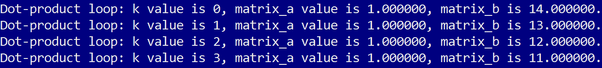

因此，看起来我们没有以正确的方式访问矩阵的元素；记住这些矩阵是以行为主序存储的，我们修改索引以便以正确的方式访问它们的值：

```py
val += matrix_a[ row*N + k ] * matrix_b[ col + k*N];
```

再次运行程序将不会产生断言错误。恭喜你，你刚刚使用唯一的`printf`调试了一个 CUDA 内核！

# 用 CUDA-C 填补空白

我们现在将介绍如何编写一个完整的 CUDA-C 程序的基础知识。我们将从小处着手，将上一节中调试的小矩阵乘法测试程序的*固定*版本翻译成纯 CUDA-C 程序，然后我们将使用 NVIDIA 的`nvcc`编译器从命令行编译成本机 Windows 或 Linux 可执行文件（我们将在下一节中看到如何使用 Nsight IDE，所以现在我们只使用文本编辑器和命令行）。再次鼓励读者在翻译过程中查看我们从 Python 翻译的代码，这些代码作为存储库中的`matrix_ker.py`文件提供。 

现在，让我们打开我们最喜欢的文本编辑器，创建一个名为`matrix_ker.cu`的新文件。扩展名将表明这是一个 CUDA-C 程序，可以使用`nvcc`编译器进行编译。

CUDA-C 程序和库源代码文件名总是使用`.cu`文件扩展名。

让我们从一开始——就像 Python 在程序开始时使用`import`关键字导入库一样，我们回忆 C 语言使用`#include`。在我们继续之前，我们需要包含一些导入库。

让我们从这些开始：

```py
#include <cuda_runtime.h>
#include <stdio.h>
#include <stdlib.h>
```

让我们简要思考一下我们需要这些做什么：`cuda_runtime.h`是包含所有特定 CUDA 数据类型、函数和结构的声明头文件，我们将在我们的程序中需要这些。我们将需要包含这个头文件来编写任何纯 CUDA-C 程序。`stdio.h`当然提供了所有标准 I/O 函数，如`printf`，我们需要`stdlib.h`来在主机上使用`malloc`和`free`动态内存分配函数。

记住，在每一个纯 CUDA-C 程序的开头都要包含`#include <cuda_runtime.h>`！

现在，在我们继续之前，我们记得我们最终必须用正确的已知输出检查内核的输出，就像我们使用 NumPy 的`allclose`函数那样。不幸的是，C 语言中没有像 Python 中的 NumPy 那样的标准或易于使用的数值数学库。通常情况下，如果它是简单的东西，就像这个例子一样，自己编写等效函数会更容易。这意味着我们现在必须显式地创建 NumPy 的`allclose`的等效函数。我们将这样做：我们将使用 C 语言的`#define`宏设置一个名为`_EPSILON`的值，它将作为一个常量来指示输出和预期输出之间的最小值，我们将设置一个名为`_ABS`的宏，它将告诉我们两个数字之间的绝对差值。我们这样做如下：

```py
#define _EPSILON 0.001
#define _ABS(x) ( x > 0.0f ? x : -x )
```

我们现在可以创建自己的`allclose`版本。这将接受两个浮点指针和一个整数值`len`。我们遍历两个数组并检查它们：如果任何点之间的差异超过`_EPSILON`，我们返回-1，否则我们返回 0 以指示两个数组确实匹配。

我们注意到一点：由于我们使用 CUDA-C，我们在函数定义前加上`__host__`，以表明这个函数是打算在 CPU 上而不是在 GPU 上运行：

```py
__host__ int allclose(float *A, float *B, int len)
{

  int returnval = 0;

  for (int i = 0; i < len; i++)
  {
    if ( _ABS(A[i] - B[i]) > _EPSILON )
    {
      returnval = -1;
      break;
    }
  }

  return(returnval);
}
```

现在，我们可以将设备和内核函数直接复制粘贴，就像它们在我们的 Python 版本中显示的那样：

```py

__device__ float rowcol_dot(float *matrix_a, float *matrix_b, int row, int col, int N)
{
  float val = 0;

  for (int k=0; k < N; k++)
  {
        val += matrix_a[ row*N + k ] * matrix_b[ col + k*N];
  }

  return(val);
}

__global__ void matrix_mult_ker(float * matrix_a, float * matrix_b, float * output_matrix, int N)
{

    int row = blockIdx.x*blockDim.x + threadIdx.x;
    int col = blockIdx.y*blockDim.y + threadIdx.y;

  output_matrix[col + row*N] = rowcol_dot(matrix_a, matrix_b, row, col, N);
}
```

再次，与`__host__`相比，请注意，CUDA 设备函数前面是`__device__`，而 CUDA 内核前面是`__global__`。

现在，就像在任何一个 C 程序中一样，我们需要编写`main`函数，该函数将在主机上运行，在那里我们将设置我们的测试用例，并从那里显式地将我们的 CUDA 内核启动到 GPU 上。再次强调，与普通的 C 语言相比，我们必须显式地指定这也将在 CPU 上运行，使用`__host__`：

```py
__host__ int main()
{
```

我们首先必须做的是选择和初始化我们的 GPU。我们使用`cudaSetDevice`如下：

```py
cudaSetDevice(0);
```

`cudaSetDevice(0)`将选择默认的 GPU。如果你在你的系统中安装了多个 GPU，你可以使用`cudaSetDevice(1)`、`cudaSetDevice(2)`等来选择并使用它们。

我们现在将`N`设置为 Python 中的值，以表示我们矩阵的高度/宽度。由于我们的测试用例将只包含 4 x 4 矩阵，我们将它设置为`4`。由于我们将使用动态分配的数组和指针，我们还将设置一个值来指示我们的测试矩阵所需的字节数。矩阵将包含*N* x *N*个浮点数，我们可以使用 C 中的`sizeof`关键字来确定所需的字节数：

```py
int N = 4;
int num_bytes = sizeof(float)*N*N;
```

我们现在以这种方式设置我们的测试矩阵；这些将正好对应于我们在 Python 测试程序中看到的`test_a`和`test_b`矩阵（注意我们如何使用`h_`前缀来表示这些数组存储在主机上，而不是在设备上）：

```py

 float h_A[] = { 1.0, 2.0, 3.0, 4.0, \
                 1.0, 2.0, 3.0, 4.0, \
                 1.0, 2.0, 3.0, 4.0, \
                 1.0, 2.0, 3.0, 4.0 };

 float h_B[] = { 14.0, 13.0, 12.0, 11.0, \
                 14.0, 13.0, 12.0, 11.0, \
                 14.0, 13.0, 12.0, 11.0, \
                 14.0, 13.0, 12.0, 11.0 };
```

我们现在设置另一个数组，它将指示先前测试矩阵的矩阵乘法预期输出。我们将必须显式地计算这些值并将它们放入我们的 C 代码中。最终，我们将在程序结束时将其与 GPU 输出进行比较，但让我们先设置它并把它处理掉：

```py
float h_AxB[] = { 140.0, 130.0, 120.0, 110.0, \
                 140.0, 130.0, 120.0, 110.0, \
                 140.0, 130.0, 120.0, 110.0, \
                 140.0, 130.0, 120.0, 110.0 };
```

我们现在声明一些指向将存在于 GPU 上的数组的指针，为此我们将复制`h_A`和`h_B`的值以及指向 GPU 输出的指针。注意我们只是使用标准的浮点指针来做这件事。注意前缀`d_`——这是另一个标准的 CUDA-C 约定，表示这些将存在于设备上：

```py
float * d_A;
float * d_B;
float * d_output;
```

现在，我们将使用`cudaMalloc`在设备上为`d_A`和`d_B`分配一些内存，这几乎与 C 中的`malloc`相同；这正是 PyCUDA `gpuarray`函数如`empty`或`to_gpu`在整本书中无形中调用我们以在 GPU 上分配内存数组的方式：

```py
cudaMalloc((float **) &d_A, num_bytes);
cudaMalloc((float **) &d_B, num_bytes);
```

让我们稍微思考一下它是如何工作的：在 C 函数中，我们可以通过在变量前加上一个与号（`&`）来获取变量的地址；如果你有一个整数`x`，我们可以用`&x`来获取它的地址。`&x`将是一个指向整数的指针，所以它的类型将是`int *`。我们可以使用这个来设置参数的值到一个 C 函数中，而不是只使用纯返回值。

由于`cudaMalloc`通过参数设置指针而不是通过返回值（与常规的`malloc`不同），我们必须使用与号操作符，这将是一个指向指针的指针，因为它是一个指向浮点指针的指针，就像这里一样（`float **`）。由于`cudaMalloc`可以分配任何类型的数组，我们必须显式地使用括号来转换这个值。最后，在第二个参数中，我们必须指明在 GPU 上分配多少字节；我们之前已经设置了`num_bytes`，表示我们将需要多少字节来存储一个由浮点数组成的 4 x 4 矩阵，所以我们将其插入并继续。

现在，我们可以通过两次调用 `cudaMemcpy` 函数，将 `h_A` 和 `h_B` 中的值分别复制到 `d_A` 和 `d_B` 中，如下所示：

```py
cudaMemcpy(d_A, h_A, num_bytes, cudaMemcpyHostToDevice);
cudaMemcpy(d_B, h_B, num_bytes, cudaMemcpyHostToDevice);
```

`cudaMemcpy` 总是接受一个目标指针作为第一个参数，一个源指针作为第二个参数，要复制的字节数作为第三个参数，以及一个最终参数。最后一个参数将指示我们是否使用 `cudaMemcpyHostToDevice` 从主机复制到 GPU，使用 `cudaMemcpyDeviceToHost` 从 GPU 复制到主机，或者使用 `cudaMemcpyDeviceToDevice` 在 GPU 上的两个数组之间复制。

现在我们将使用另一个 `cudaMalloc` 调用来分配一个数组，用于在 GPU 上存储矩阵乘法的结果：

```py
cudaMalloc((float **) &d_output, num_bytes);
```

最后，当我们想要检查内核的输出时，我们将在主机上设置一些内存来存储 GPU 的输出。让我们设置一个常规的 C float 指针，并使用 `malloc` 分配内存，就像我们通常做的那样：

```py
float * h_output;
h_output = (float *) malloc(num_bytes);
```

现在，我们几乎准备好启动我们的内核。CUDA 使用一个名为 `dim3` 的数据结构来指示内核启动的块和网格大小；我们将这样设置它们，因为我们想要一个 2x2 维度的网格和同样维度的块：

```py
dim3 block(2,2,1);
dim3 grid(2,2,1);
```

我们现在准备好启动我们的内核；我们使用三重三角形括号来指示 CUDA-C 编译器内核应该启动的块和网格大小：

```py
matrix_mult_ker <<< grid, block >>> (d_A, d_B, d_output, N);
```

当然，在我们可以将内核的输出复制回主机之前，我们必须确保内核已经执行完成。我们通过调用 `cudaDeviceSynchronize` 来完成这个操作，这将阻止主机在内核执行完成之前向 GPU 发送任何更多命令：

```py
cudaDeviceSynchronize();
```

现在，我们可以将内核的输出复制到我们在主机上分配的数组中：

```py
cudaMemcpy(h_output, d_output, num_bytes, cudaMemcpyDeviceToHost);
```

再次，我们进行同步：

```py
cudaDeviceSynchronize();
```

在我们检查输出之前，我们意识到我们不再需要我们在 GPU 上分配的任何数组。我们通过在每个数组上调用 `cudaFree` 来释放这些内存：

```py
cudaFree(d_A);
cudaFree(d_B);
cudaFree(d_output);
```

我们已经完成了 GPU 的工作，因此我们调用 `cudaDeviceReset`：

```py
cudaDeviceReset();
```

现在，我们使用本章开头编写的 `allclose` 函数检查我们复制到主机上的输出。如果实际输出与预期输出不匹配，我们打印一个错误并返回 `-1`，否则，我们打印它们匹配，并返回 `0`。然后，我们在程序的 `main` 函数上放置一个闭合括号：

```py
if (allclose(h_AxB, h_output, N*N) < 0)
 {
     printf("Error! Output of kernel does not match expected output.\n");
     free(h_output);
     return(-1);
 }
 else
 {
     printf("Success! Output of kernel matches expected output.\n");
     free(h_output);
     return(0);
 }
}
```

注意，由于我们在 `h_output` 上分配了内存，我们在这里进行了最后一次调用标准 C 的 `free` 函数。

现在我们保存我们的文件，并使用命令行中的 `nvcc matrix_ker.cu -o matrix_ker` 将其编译成 Windows 或 Linux 可执行文件。这应该输出一个二进制可执行文件，`matrix_ker.exe`（在 Windows 上）或 `matrix_ker`（在 Linux 上）。让我们现在尝试编译和运行它：

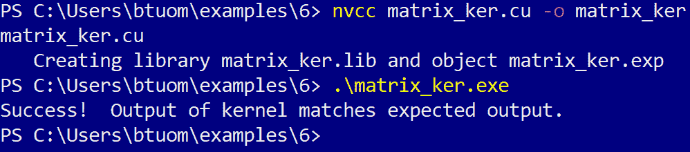

恭喜你，你刚刚创建了你第一个纯 CUDA-C 程序！（此示例作为 `matrix_ker.cu` 存储在存储库中，位于 `7` 目录下。）

# 使用 Nsight IDE 进行 CUDA-C 开发和调试

现在我们来学习如何使用 Nsight IDE 开发 CUDA-C 程序。我们将看到如何导入我们刚刚编写的程序，并在 Nsight 中编译和调试它。请注意，Nsight 的 Windows 和 Linux 版本之间存在差异，因为它在 Windows 下是 Visual Studio IDE 的插件，在 Linux 下是 Eclipse IDE 的插件。我们将在以下两个小节中介绍这两个版本；如果你不适用某个操作系统，可以自由跳过。

# 在 Windows 中使用 Nsight 与 Visual Studio

打开 Visual Studio，然后点击文件，然后选择新建 | 项目.... 将弹出一个窗口，你可以设置项目的类型：选择 NVIDIA 下拉菜单项，然后选择 CUDA 9.2：

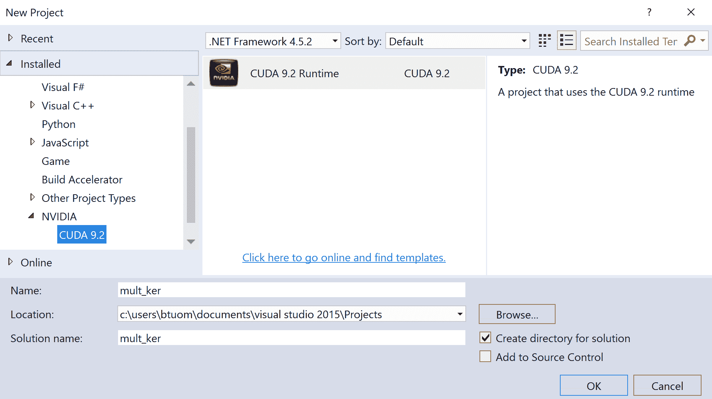

给项目起一个合适的名字，然后点击确定。解决方案资源管理器窗口中应该会出现一个简单的预置 CUDA 测试程序，包含一个源文件 `kernel.cu`，它包含一个简单的并行加法内核和测试代码。如果你想查看它是否可以编译和运行，请点击 IDE 顶部标记为本地 Windows 调试器的绿色右箭头。应该会弹出一个终端，显示内核的一些文本输出，然后立即关闭。

如果你从 Visual Studio 运行基于 Windows Terminal 的应用程序后遇到问题，尝试在主函数的末尾添加 `getchar();`，这将使终端保持打开状态，直到你按下键。 (或者，你还可以在程序末尾使用调试器断点。)

现在，让我们添加我们刚刚编写的 CUDA-C 程序。在解决方案资源管理器窗口中，右键单击 `kernel.cu`，然后点击 `kernel.cu` 上的移除。现在，右键单击项目名称，然后选择添加，然后选择现有项。现在我们将能够选择一个现有文件，所以找到 `matrix_ker.cu` 的路径并将其添加到项目中。点击 IDE 顶部标记为本地 Windows 调试器的绿色箭头，程序应该会编译并运行，再次在 Windows Terminal 中。所以，就是这样——我们只需这些步骤就可以在 Visual Studio 中设置和编译完整的 CUDA 程序了。

现在我们来看如何调试我们的 CUDA 内核。让我们首先在我们的代码中添加一个断点，在内核 `matrix_mult_ker` 的入口点，我们设置 `row` 和 `col` 的值。我们可以通过点击窗口左侧行号左侧的灰色列来添加这个断点；对于每个添加的断点，那里应该会出现一个红色圆点。（你可以忽略 Visual Studio 编辑器可能在你的代码下放置的任何红色波浪线；这是由于 CUDA 不是 Visual Studio 的 *原生* 语言）： 

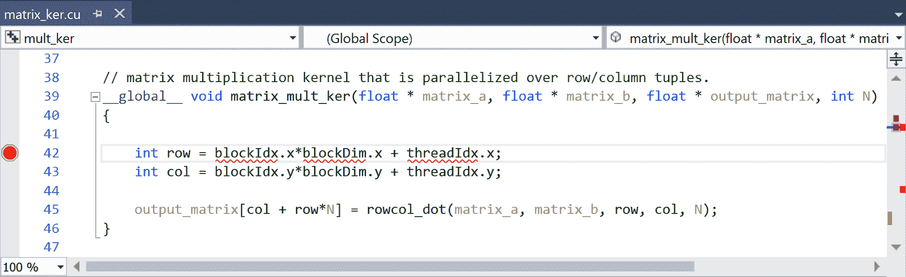

我们现在可以开始调试。从顶部菜单中选择 Nsight 下拉菜单，然后选择开始 CUDA 调试。这里可能有两个选项，开始 CUDA 调试（下一代）和开始 CUDA 调试（旧版）。哪个都无所谓，但您可能根据您的 GPU 遇到 Next-Gen 的问题；在这种情况下，请选择 Legacy。

您的程序应该启动，并且调试器应该在我们刚刚设置的内核断点处停止。让我们按*F10*来跳过这一行，现在看看`row`变量是否被正确设置。让我们查看变量探索器中的局部变量窗口：

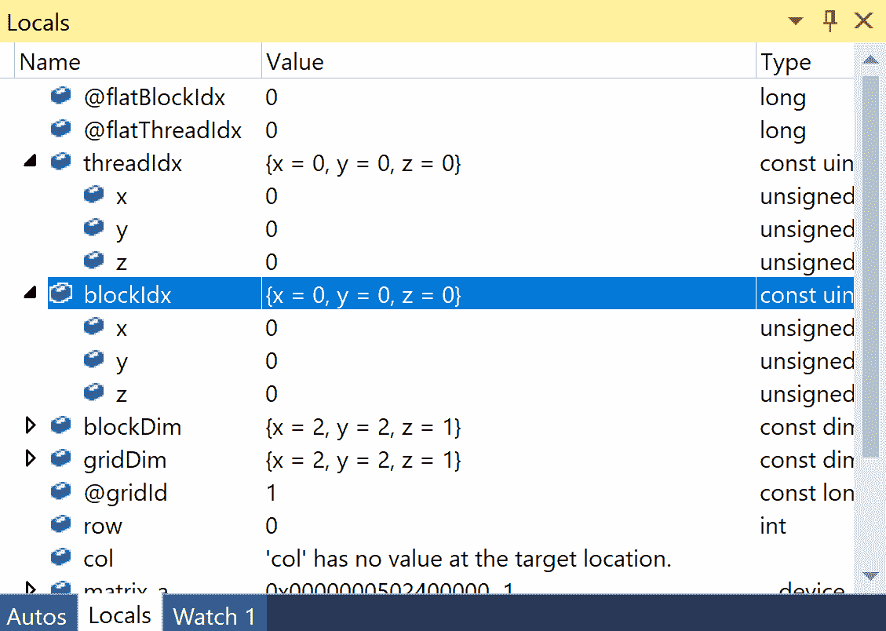

我们可以看到，我们目前位于网格中第一个块中的第一个线程，通过检查`threadIdx`和`blockIdx`的值；`row`被设置为`0`，这确实对应于正确的值。现在，让我们检查不同线程的`row`值。为此，我们必须在 IDE 中切换**线程焦点**；我们通过点击 Nsight 下拉菜单上面的 Nsight，然后选择窗口|CUDA 调试焦点...来完成此操作。应该出现一个新菜单，允许您选择新的线程和块。在菜单中将线程从 0, 0, 0 更改为 1, 0, 0，然后点击确定：

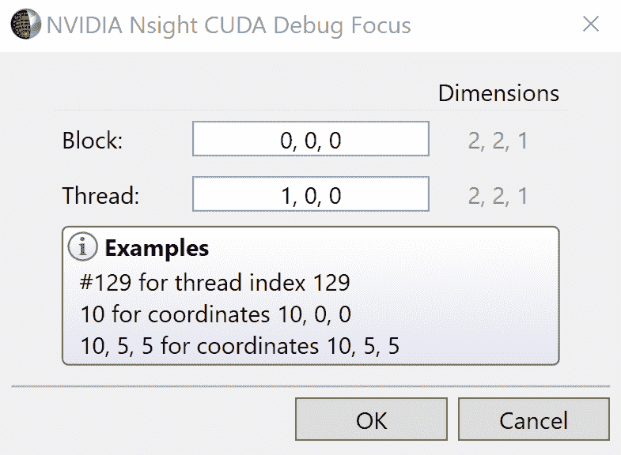

当您再次检查变量时，应该看到`row`变量为这个线程设置了正确的值：

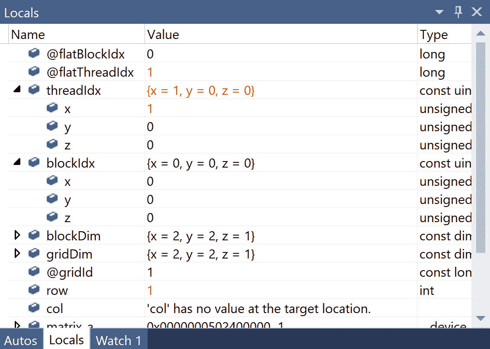

简而言之，这就是在 Visual Studio 中使用 Nsight 进行调试的方法。我们现在有了如何在 Windows 中的 Nsight/Visual Studio 中调试 CUDA 程序的基础，我们可以像在常规 Windows 程序中一样使用所有常规约定进行调试（设置断点、启动调试器、继续/恢复、跳过、进入和退出）。主要区别在于您必须知道如何在不同 CUDA 线程和块之间切换以检查变量，否则基本上是相同的。

# 在 Linux 中使用 Eclipse 的 Nsight

现在，我们将看到如何在 Linux 中使用 Nsight。您可以通过选择它或使用`nsight`命令从命令行运行它来打开 Nsight。Nsight IDE 将打开。从 IDE 的顶部，点击文件，然后从下拉菜单中选择新建...，然后从那里选择新建 CUDA C/C++项目。将出现一个新窗口，从这里选择 CUDA 运行时项目。给项目起一个合适的名字，然后点击下一步。您将需要提供进一步的设置选项，但默认设置对我们目前的目的来说已经足够好。（请注意，在第三和第四屏幕中，这里将位于源文件夹和项目路径的位置。）您将到达一个最终屏幕，在那里您可以按完成来创建项目：

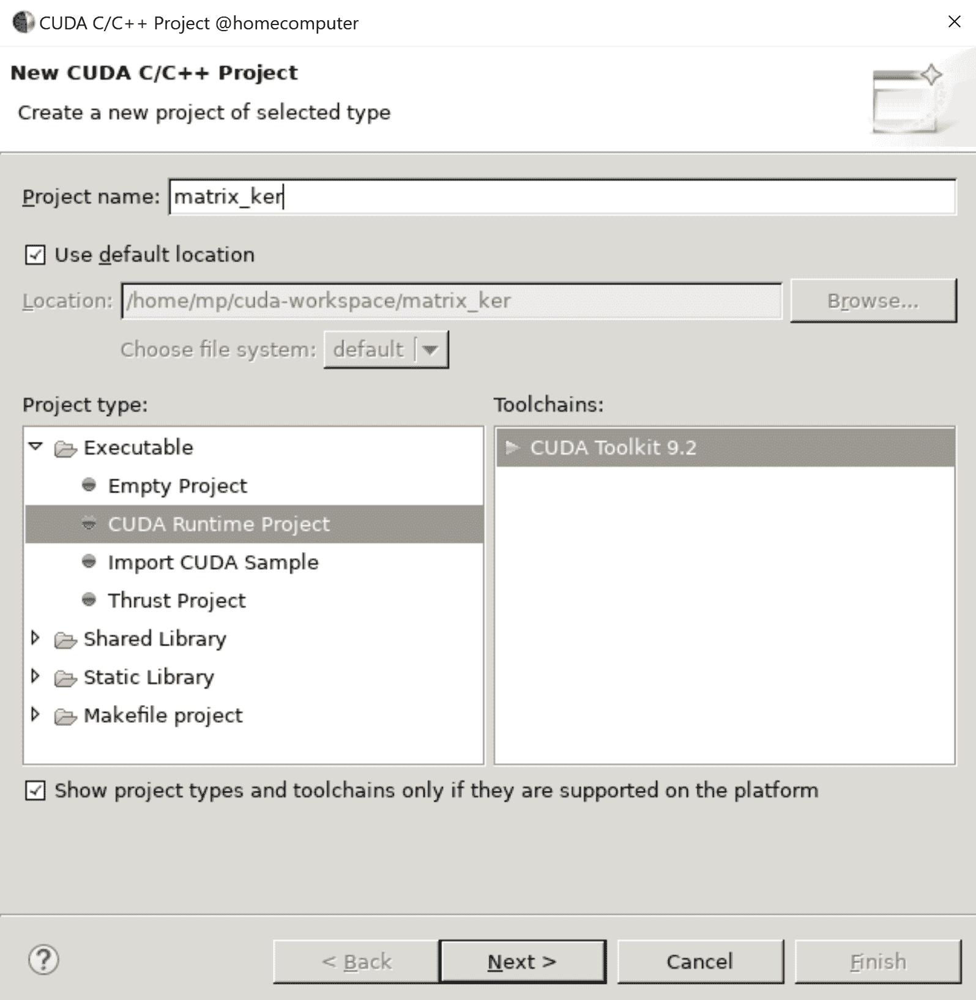

最后，您将到达一个项目视图，其中包含您的新项目和一些占位符代码打开；截至 CUDA 9.2，这将是倒数第二个内核示例。

我们现在可以导入我们的代码。你可以只是使用 Nsight 中的编辑器删除默认源文件中的所有代码，并将其剪切粘贴进来，或者你可以手动从项目的源目录中删除文件，手动将 `matrix_ker.cu` 文件复制到源目录中，然后通过选择它并按 *F5* 来在 Nsight 中刷新源目录视图。你现在可以通过按 *Ctrl* + *B* 构建项目，并通过按 *F11* 运行它。程序输出应该出现在 IDE 的控制台子窗口中，如下所示：

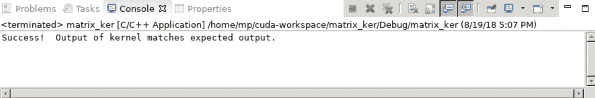

我们现在可以在我们的 CUDA 代码中设置一个断点；让我们将其设置在内核入口点，此时行值被设置。我们在 Eclipse 编辑器中将光标置于该行上，然后按 *Ctrl* + *Shift* + *B* 来设置它。

我们现在可以通过按 *F11*（或点击错误图标）开始调试。程序应该在 `main` 函数的非常开始处暂停，因此按 *F8* 来 *恢复* 到第一个断点。你应该在 IDE 中看到我们的 CUDA 内核的第一行被高亮显示，并有一个箭头指向它；让我们通过按 *F6* 跳过当前行，这将确保行值已被设置。

现在，我们可以轻松地在我们的 CUDA 网格中的不同线程和块之间切换，以检查它们当前持有的值，如下所示：从 IDE 的顶部，点击窗口下拉菜单，然后点击显示视图，然后选择 CUDA。应该会打开一个包含当前正在运行的内核的窗口，从这里你可以看到该内核正在运行的块列表。

点击第一个，从这里你将能够看到块内运行的各个单独的线程：

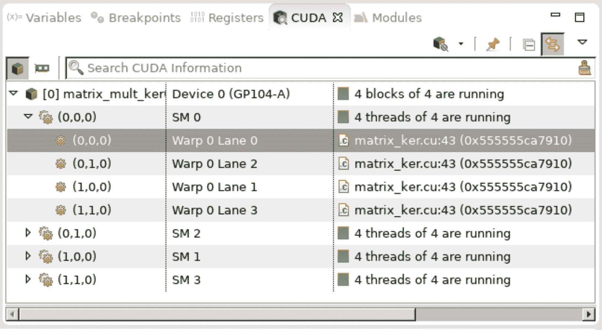

现在，我们可以通过单击变量选项卡来查看第一个块中第一个线程对应的变量——在这里，行应该是 0，正如我们所预期的：

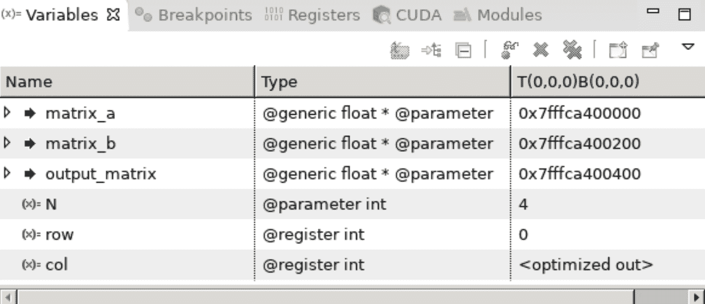

现在，我们可以通过再次转到 CUDA 选项卡，选择适当的线程，并切换回来来检查不同线程的值。让我们保持在同一个块中，但这次选择线程 (1, 0, 0)，再次检查行值：

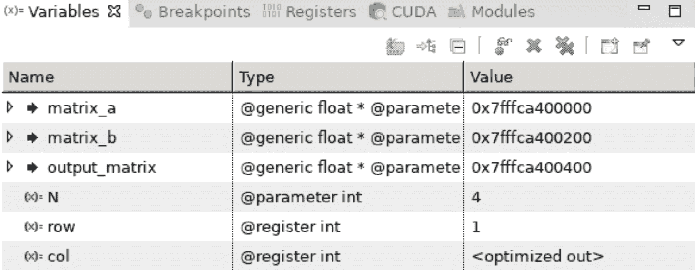

我们看到行的值现在是 1，正如我们所预期的。

现在我们已经了解了如何在 Linux 中的 Nsight/Eclipse 上调试 CUDA 程序的基础，我们可以使用所有常规约定，就像在任何一个其他 IDE 中调试常规 Linux 程序一样（设置断点、启动调试器、继续/恢复、跳过、进入和退出）。主要区别在于，我们必须知道如何在不同 CUDA 线程和块之间切换以检查变量，否则基本上是相同的。

# 使用 Nsight 理解 CUDA 中的 warp lockstep 属性

我们现在将使用 Nsight 逐步执行一些代码，以帮助我们更好地理解一些 CUDA GPU 架构，以及内核内部的**分支**是如何处理的。这将让我们对如何编写更高效的 CUDA 内核有所了解。当我们提到**分支**时，我们指的是 GPU 如何处理 CUDA 内核内部的控制流语句，如`if`、`else`或`switch`。特别是，我们感兴趣的是内核内部如何处理**分支发散**，这发生在内核中的一个线程满足成为`if`语句的条件，而另一个线程不满足且是`else`语句时：它们是发散的，因为它们正在执行不同的代码片段。

让我们编写一个小型的 CUDA-C 程序作为实验：我们将从一个打印一个输出，如果其`threadIdx.x`值是偶数，另一个如果它是奇数的内核开始。然后我们编写一个`main`函数，该函数将在这个由 32 个不同线程组成的单个块上启动这个内核：

```py
#include <cuda_runtime.h>
#include <stdio.h>

__global__ void divergence_test_ker()
{
    if( threadIdx.x % 2 == 0)
        printf("threadIdx.x %d : This is an even thread.\n", threadIdx.x);
    else
        printf("threadIdx.x %d : This is an odd thread.\n", threadIdx.x);
}

__host__ int main()
{
    cudaSetDevice(0);
    divergence_test_ker<<<1, 32>>>();
    cudaDeviceSynchronize();
    cudaDeviceReset();
}
```

（此代码也作为`divergence_test.cu`存储库中的文件提供。）

如果我们从命令行编译并运行这个程序，我们可能会天真地期望看到来自偶数和奇数线程的字符串交错序列；或者它们可能会随机交错——因为所有线程都是并发运行的，并且大约在同一时间分支，这听起来是有道理的。

然而，每次我们运行这个程序时，我们总是得到这个输出：

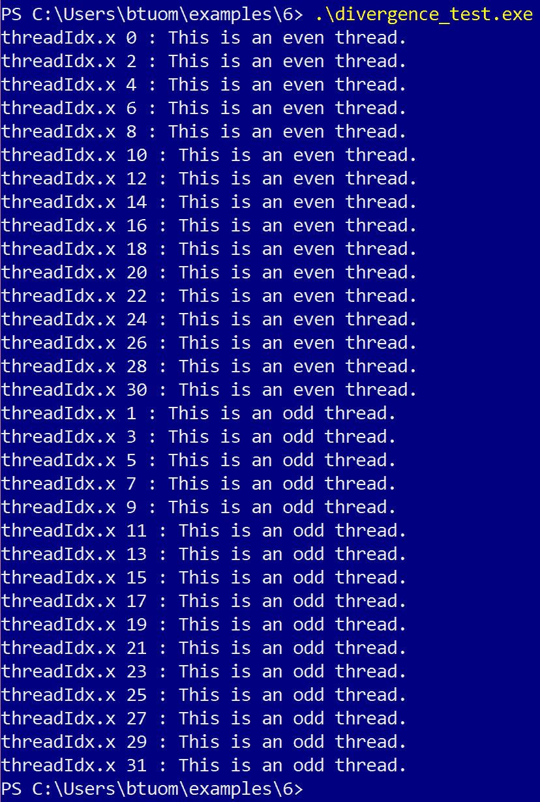

所有对应于偶数线程的字符串首先打印出来，而所有奇数字符串随后打印。也许 Nsight 调试器可以提供一些线索；让我们像上一节那样将这个小程序导入到 Nsight 项目中，在内核中的第一个`if`语句处设置一个断点。然后我们将执行`step over`，这样调试器就会在第一个`printf`语句处停止。由于 Nsight 中的默认线程是（0,0,0），这应该满足了第一个`if`语句，所以它会卡在那里，直到调试器继续。

让我们切换到一个奇数线程，比如（1,0,0），看看它在我们的程序中的位置：

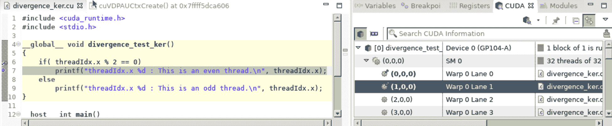

非常奇怪！线程（1,0,0）在执行过程中也处于与线程（0,0,0）相同的位置。实际上，如果我们检查这里所有的其他奇数线程，它们都会卡在相同的位置——在一个所有奇数线程都应该直接跳过的`printf`语句上。

发生了什么？这被称为** warp 步调一致属性**。在 CUDA 架构中，**warp** 是一个包含 32 个 "lanes" 的单元，我们的 GPU 在其中执行内核和网格，每个 lane 将执行一个线程。warp 的一个主要限制是，在单个 warp 上执行的所有线程都必须以**步调一致**的方式执行相同的精确代码；这意味着并非每个线程都确实运行相同的代码，而是忽略对其不适用的一步。 (这被称为步调一致，因为它就像一群士兵以**步调一致**的方式齐步前进——无论他们是否想前进！)

步调一致属性意味着如果一个 warp 上运行的单个线程在单个 `if` 语句中与其他 31 个线程发生分歧，那么其他 31 个线程的执行将被延迟，直到这个异常的单个线程完成其孤立的 `if` 分支并返回。这是你在编写内核时应该始终牢记的一个属性，也是为什么在 CUDA 编程中应该尽可能减少分支分歧的一般规则。

# 使用 NVIDIA nvprof 分析器和 Visual Profiler

我们将以对命令行 Nvidia `nvprof` 分析器的一个简要概述结束。与 Nsight IDE 相比，我们可以自由使用我们编写的任何 Python 代码——我们在这里不会被迫编写完整的、纯 CUDA-C 测试函数代码。

我们可以使用 `nvprof program` 命令对二进制可执行程序进行基本分析；我们同样可以使用 `python` 命令作为第一个参数，脚本作为第二个参数进行 Python 脚本的分析，如下所示：`nvprof python program.py`。让我们使用 `nvprof matrix_ker` 对我们之前编写的简单矩阵乘法 CUDA-C 可执行程序进行分析：

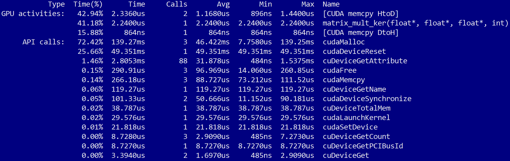

我们看到这与我们最初在 第一章 中分析 Mandelbrot 算法的 Python cProfiler 模块的输出非常相似，*为什么进行 GPU 编程？*——但现在，这仅告诉我们所有已执行的 CUDA 操作。因此，当我们特别想要在 GPU 上进行优化时，我们可以使用这个工具，而不是关心主机上执行的任何 Python 或其他命令。 (如果我们添加命令行选项 `--print-gpu-trace`，我们还可以进一步分析每个单独的 CUDA 内核操作及其块和网格大小启动参数。)

让我们再来看一个技巧，帮助我们*可视化*程序中所有操作的执行时间；我们将使用`nvprof`来导出一个文件，然后可以被 NVIDIA Visual Profiler 读取，并以图形方式展示给我们。让我们用一个来自上一章的例子来演示，`multi-kernel_streams.py`（这个文件在仓库的`5`目录下有提供）。让我们回顾一下，这是我们介绍 CUDA 流概念的入门示例之一，CUDA 流允许我们并发执行和组织多个 GPU 操作。让我们使用以下命令将输出保存到以`.nvvp`为后缀的文件中：`nvprof -o m.nvvp python multi-kernel_streams.py`。现在我们可以使用`nvvp m.nvvp`命令将这个文件加载到 NVIDIA Visual Profiler 中。

我们应该看到所有 CUDA 流的时间线如下（记住，这个程序中使用的内核名称叫做`mult_ker`）：

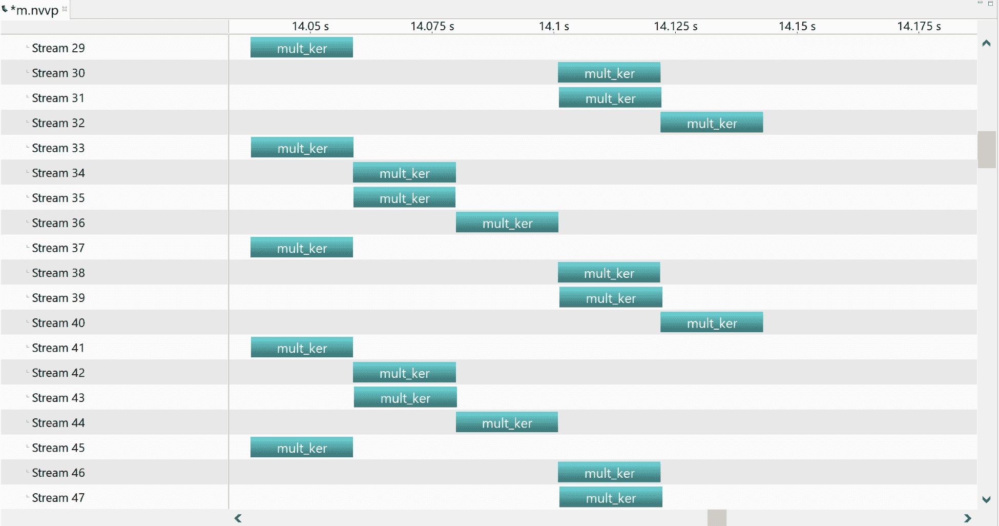

我们不仅可以看到所有内核的启动，还可以看到内存分配、内存复制和其他操作。这有助于直观和可视化地理解程序随时间如何使用 GPU。

# 摘要

我们在本章开始时看到如何在 CUDA 内核中使用`printf`输出单个线程的数据；我们特别看到这对于调试代码非常有用。然后我们填补了 CUDA-C 知识中的某些空白，这样我们就可以编写完整的测试程序，我们可以将其编译成正确的可执行二进制文件：这里有很多我们之前没有注意到的开销，我们现在必须非常细致。接下来，我们看到了如何在 Nsight IDE 中创建和编译一个项目，以及如何使用它进行调试。我们看到了如何在 CUDA 内核中设置任何断点并切换到单个线程以查看不同的局部变量。我们还使用了 Nsight 调试器来了解 warp 同步属性以及为什么在 CUDA 内核中避免分支发散很重要。最后，我们简要概述了 NVIDIA 命令行`nvprof`分析器和 Visual Profiler，用于分析我们的 GPU 代码。

# 问题

1.  在我们编写的第一个 CUDA-C 程序中，我们在使用`cudaMalloc`在 GPU 上分配内存数组后没有使用`cudaDeviceSynchronize`命令。为什么这并不是必要的？（提示：回顾上一章。）

1.  假设我们有一个内核被启动在一个由两个块组成的网格上，每个块有 32 个线程。假设第一个块中的所有线程都执行一个`if`语句，而第二个块中的所有线程都执行相应的`else`语句。第二个块中的所有线程是否都需要像第一个块中的线程实际执行它们一样“同步”通过`if`语句中的命令？

1.  如果我们执行一段类似的代码，但只是在由一个包含 64 个线程的单个块组成的网格上执行，其中前 32 个线程执行一个`if`语句，而接下来的 32 个线程执行一个`else`语句，会怎样？

1.  `nvprof`分析器能为我们测量到 Python 的 cProfiler 无法测量的内容有哪些？

1.  请列举一些我们可能更倾向于使用`printf`来调试 CUDA 内核的上下文，以及一些可能更容易使用 Nsight 来调试 CUDA 内核的上下文。

1.  在 CUDA-C 中，`cudaSetDevice`命令的目的是什么？

1.  为什么在 CUDA-C 中，每次内核启动或内存复制后我们都必须使用`cudaDeviceSynchronize`？
