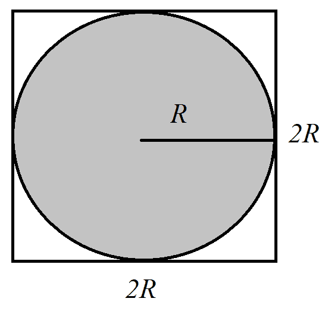

# CUDA 设备函数库和 Thrust

在上一章中，我们通过 Scikit-CUDA 包装模块对 CUDA 中可用的库进行了相当广泛的概述。现在我们将探讨一些其他库，这些库我们将直接从 CUDA C 本身使用，而不需要像 Scikit-CUDA 中的那些包装器帮助。我们将从查看两个标准库开始，这些库包含可以从任何 CUDA C 内核中调用的设备函数 cuRAND 和 CUDA Math API。通过学习如何使用这些库，我们将了解如何在蒙特卡洛积分的上下文中使用这些库。蒙特卡洛积分是一种已知的随机方法，它提供了从微积分中确定积分值的估计。我们将首先查看一个基本示例，说明如何使用 cuRAND 实现一个简单的蒙特卡洛方法来对π（如众所周知的常数π=3.14159...）的值进行基本估计，然后我们将开始一个更雄心勃勃的项目，在这个项目中我们将构建一个 Python 类，该类可以对任何任意数学函数进行确定积分，并使用 Math API 创建这样的函数。我们还将探讨如何在设计此类时有效地使用元编程的一些想法。

然后，我们将再次使用 Thrust C++库来编写一些纯 CUDA 程序。Thrust 是一个提供 C++模板容器的库，类似于 C++标准模板库（STL）。这将使我们能够以更自然的方式操作 CUDA C 数组，这种方式更接近 PyCUDA 的`gpuarray`和 STL 的 vector 容器。这将使我们免于不断使用指针，如*mallocs*和*frees*，这些在之前的 CUDA C 中困扰了我们。

本章我们将探讨以下主题：

+   理解种子在生成伪随机数列表中的作用

+   在 CUDA 内核中使用 cuRAND 设备函数生成随机数

+   理解蒙特卡洛积分的概念

+   在 Python 中使用基于字典的字符串格式化进行元编程

+   使用 CUDA Math API 设备函数库

+   理解什么是函子

+   在纯 CUDA C 编程中使用 Thrust 向量容器

# 技术要求

为了本章内容，需要一个配备现代 NVIDIA GPU（2016 年及以后）的 Linux 或 Windows 10 PC，并安装所有必要的 GPU 驱动程序和 CUDA Toolkit（9.0 及以后版本）。还需要一个合适的 Python 2.7 安装（例如 Anaconda Python 2.7），并包含 PyCUDA 模块。

本章的代码也托管在 GitHub 上，可以在[`github.com/PacktPublishing/Hands-On-GPU-Programming-with-Python-and-CUDA`](https://github.com/PacktPublishing/Hands-On-GPU-Programming-with-Python-and-CUDA)找到。

关于本章的先决条件，请查看本书的序言。有关软件和硬件要求，请查看[`github.com/PacktPublishing/Hands-On-GPU-Programming-with-Python-and-CUDA`](https://github.com/PacktPublishing/Hands-On-GPU-Programming-with-Python-and-CUDA)中的 README。

# cuRAND 设备函数库

让我们从 cuRAND 开始。这是一个标准的 CUDA 库，用于在 CUDA 内核中按线程逐线程生成伪随机值，它通过在内核中的每个单独线程中调用设备函数来初始化和调用。我们再次强调，这是一个**伪随机**值序列——因为数字硬件总是确定性的，永远不会随机或任意，所以我们使用算法从一个初始的**种子值**生成一系列看似随机的值。通常，我们可以将种子值设置为真正的随机值（例如毫秒级的时钟时间），这将为我们提供一个很好的任意序列的*随机*值。这些生成的随机值与由相同种子生成的序列中的先前或未来值没有相关性，尽管当您将来自不同种子的值组合在一起时，可能会有相关性或重复。因此，您必须小心，确保您希望相互*随机*的值是由相同的种子生成的。

让我们先看看`curand_init`函数的原型，我们将使用适当的种子来初始化它：

```py
__device__ void curand_init ( unsigned long long seed, unsigned long long sequence, unsigned long long offset, curandState_t *state)
```

在这里，所有输入都是无符号长整型，在 C 语言中是无符号（非负值）的 64 位整数。首先，我们可以看到`seed`，当然，这是种子值。一般来说，您会使用时钟值或其变体来设置它。然后我们看到一个名为`sequence`的值，正如我们之前所述，cuRAND 生成的值只有在它们由相同的种子值生成时才会真正地在数学上相互随机。因此，如果我们有多个线程使用相同的种子值，我们使用`sequence`来指示当前线程要使用的长度为 2¹⁹⁰ 的随机数子序列，而使用`offset`来指示在这个子序列中的起始点；这将生成在各个线程中都是数学上相互随机且无相关性的值。最后，最后一个参数是一个指向`curandState_t`对象的指针；这跟踪我们在伪随机数序列中的位置。

在初始化类对象之后，您将通过调用适当的设备函数来生成适当的随机分布的随机值。最常用的两种分布是均匀分布和正态分布（高斯分布）。均匀分布（在 cuRAND 中为 `curand_uniform`）是一个在给定范围内所有值等可能输出的函数：也就是说，对于 0 到 1 的均匀分布，有 10% 的概率值将落在 0 和 0.1 之间，或者落在 0.9 到 1 之间，或者落在彼此之间相隔 0.1 的任意两点之间。正态分布（在 cuRAND 中为 `curand_normal`）的值以特定的均值为中心，将根据分布的标准差分布，形成著名的钟形曲线。（在 cuRAND 中，`curand_normal` 的默认均值为 `0`，标准差为 `1`，因此对于其他值需要手动进行平移和缩放。）cuRAND 还支持另一个著名的分布，即泊松分布（`curand_poisson`），用于对随机事件随时间发生的情况进行建模。

在下一节中，我们将主要探讨如何在均匀分布的上下文中使用 cuRAND，因为它们适用于蒙特卡洛积分。对学习如何使用 cuRAND 的更多功能感兴趣的读者应查阅 NVIDIA 的官方文档。

# 使用蒙特卡洛估计 π

首先，我们将应用我们对 cuRAND 的新知识来估计著名的数学常数 π，也就是 Pi，它当然是一个无限不循环的无理数 3.14159265358979...

然而，为了得到一个估计值，我们需要花一点时间来思考这意味着什么。让我们考虑一个圆。记住，圆的半径是从圆心到圆上任何一点的长度；通常，这用 *R* 表示。直径定义为 *D = 2R*，周长 *C* 是围绕圆的长度。π 定义为 *π = C / D*。我们可以使用欧几里得几何来找到圆面积的公式，结果为 *A = πR²*。现在，让我们考虑一个半径为 *R* 的圆，它被一个边长为 *2R* 的正方形所包围：



当然，我们知道正方形的面积是 *(2R)² = 4R²*。让我们假设 *R=1*，这样我们就知道圆的面积正好是 π，而正方形的面积正好是 4。让我们进一步假设，圆和正方形都位于笛卡尔平面上原点 (0,0) 位置。现在，让我们在正方形内随机取一个完全随机的值 (*x,y*)，看看它是否落在圆内。我们如何做到这一点呢？通过应用勾股定理：我们通过检查 *x² + y²* 是否小于或等于 1 来做到这一点。让我们用 *iters* 表示我们选择的随机点的总数，用 *hits* 表示击中的数量。

让我们对这个问题进行更多的思考：在圆内选择一个点的概率应该与圆的面积除以矩形的面积成比例；这里，这是 π / 4。然而，如果我们选择一个非常大的随机点值，请注意，我们将得到以下近似值：


这正是我们将如何估计 π！在我们能够得到 Pi 的合理估计之前，我们必须进行非常高的迭代次数，但请注意，这非常易于并行化：我们可以在不同的线程中检查“命中”，将总迭代次数分配给不同的线程。最终，我们只需将所有线程中的总“命中”数相加，以得到我们的估计。

我们现在可以开始编写一个程序来制作我们的蒙特卡洛估计。让我们首先导入我们将需要的常规 Python 模块，对于 PyCUDA 程序有一个来自 SymPy 的附加项：

SymPy 用于在 Python 中进行完美的 *符号* 计算，这样当我们处理非常大的整数时，我们可以使用 `Rational` 函数来对除法进行更精确的浮点估计。

```py
import pycuda.autoinit
import pycuda.driver as drv
from pycuda import gpuarray
from pycuda.compiler import SourceModule
import numpy as np
from sympy import Rational
```

现在，当我们构建我们的内核时，我们必须做一些与正常情况略有不同的事情：我们需要在 `SourceModule` 中设置选项 `no_extern_c=True`。这修改了代码的编译方式，以便我们的代码可以正确地与 C++ 代码链接，这是 cuRAND 库所要求的。然后我们开始编写我们的内核并包含适当的头文件：

```py
ker = SourceModule(no_extern_c=True, source='''
#include <curand_kernel.h>
```

现在，让我们包含一个用于勾股定理距离的宏。由于我们只是检查这个值是否等于或小于 `1`，因此我们可以省略平方根。我们将使用很多无符号 64 位整数，所以让我们再定义一个宏来节省我们反复输入 `unsigned long long`：

```py
#define _PYTHAG(a,b) (a*a + b*b)
#define ULL unsigned long long
```

我们现在可以设置我们的内核。根据 PyCUDA 的性质，这将必须编译为真正的 C 函数接口，而不是 C++ 函数。我们使用 `extern "C"` 块来完成这个操作：

```py
extern "C" {
```

我们现在可以定义我们的内核。我们将有两个参数：一个用于 `iters`，这是每个线程的总迭代次数，另一个用于存储每个线程的总“命中”数的数组。我们将需要一个 `curandState` 对象来完成这个任务：

```py
__global__ void estimate_pi(ULL iters, ULL * hits)
{
    curandState cr_state;
```

让我们将全局线程 ID 存储在一个名为 `tid` 的整数中：

```py
int tid = blockIdx.x * blockDim.x + threadIdx.x;
```

`clock()` 是一个设备函数，它输出当前时间，精确到毫秒。我们可以将 `tid` 添加到 `clock()` 的输出中，以获得每个线程的唯一种子。我们不需要使用不同的子序列或偏移量，所以让我们将它们都设置为 0。我们还将仔细地将所有内容类型转换为 64 位无符号整数：

```py
curand_init( (ULL) clock() + (ULL) tid, (ULL) 0, (ULL) 0, &cr_state);
```

让我们设置 `x` 和 `y` 的值以保持矩形中的一个随机点：

```py
float x, y;
```

然后，我们将迭代`iters`次，看看我们在圆中得到了多少次击中。我们使用`curand_uniform(&cr_state)`生成这些击中。注意，我们可以从 0 到 1 生成它们，而不是从-1 到 1，因为这些在`_PYTHAG`宏中的平方将消除任何负值：

```py
for(ULL i=0; i < iters; i++)
 {
     x = curand_uniform(&cr_state);
     y = curand_uniform(&cr_state);

     if(_PYTHAG(x,y) <= 1.0f)
         hits[tid]++;
 }
```

我们现在可以结束并关闭我们的内核，以及`extern "C"`块，使用另一个最终的`}`括号：

```py
return;
}
}
''')
```

现在，让我们使用`get_function`获取我们的内核的 Python 包装函数。我们还将设置块和网格的大小：每个块 32 个线程，每个网格 512 个块。让我们计算总的线程数，并在 GPU 上设置一个数组来存储所有的击中（当然，初始化为 0）：

```py
pi_ker = ker.get_function("estimate_pi")
threads_per_block = 32
blocks_per_grid = 512
total_threads = threads_per_block * blocks_per_grid
hits_d = gpuarray.zeros((total_threads,),dtype=np.uint64)
```

让我们设置每个线程的迭代总数为 2²⁴：

```py
iters = 2**24
```

我们现在可以像往常一样启动内核：

```py
pi_ker(np.uint64(iters), hits_d, grid=(blocks_per_grid,1,1), block=(threads_per_block,1,1))
```

现在，让我们对数组中的击中次数进行求和，这给出了总的击中次数。我们还将计算数组中所有线程的总迭代次数：

```py
total_hits = np.sum( hits_d.get() )
total = np.uint64(total_threads) * np.uint64(iters)
```

我们现在可以用`Rational`来做出我们的估计，如下所示：

```py
est_pi_symbolic =  Rational(4)*Rational(int(total_hits), int(total) )
```

我们现在可以将这个值转换为浮点数：

```py
est_pi = np.float(est_pi_symbolic.evalf())
```

让我们检查我们的估计与 NumPy 的常量值`numpy.pi`进行对比：

```py
print "Our Monte Carlo estimate of Pi is : %s" % est_pi
print "NumPy's Pi constant is: %s " % np.pi
print "Our estimate passes NumPy's 'allclose' : %s" % np.allclose(est_pi, np.pi)
```

我们现在完成了。让我们从 IPython 运行这个程序并检查它（此程序也作为`monte_carlo_pi.py`文件包含在此书存储库的`Chapter08`中）：


# CUDA Math API

现在，我们将看看**CUDA Math API**。这是一个由与标准 C `math.h`库中类似的设备函数组成的库，可以从内核中的单个线程中调用。这里的一个区别是单精度和双精度浮点运算被重载，所以如果我们使用`sin(x)`，其中`x`是一个浮点数，那么正弦函数将输出一个 32 位浮点数，而如果`x`是一个 64 位双精度数，那么`sin`的输出也将是一个 64 位值（通常，这是 32 位函数的正确名称，但它在末尾有一个`f`，例如`sinf`）。还有额外的**内建**函数。内建函数不如原始函数精确，但速度更快，是集成在 NVIDIA CUDA 硬件中的；通常，它们的名称与原始函数相似，但前面有两个下划线——因此，内建、32 位正弦函数是`__sinf`。

# 定积分的简要回顾

现在，我们将使用 Python 中的面向对象编程来设置一个类，我们可以使用它来评估函数的定积分，使用蒙特卡洛方法。让我们停下来谈谈我们的意思：假设我们有一个数学函数（就像你在微积分课程中可能看到的那种），我们称之为*f(x)*。当我们在这两点*a*和*b*之间的笛卡尔平面上绘制这个函数时，它可能看起来像这样：


现在，让我们来回顾一下定积分的确切含义——让我们将此图中第一个灰色区域表示为 *I*，第二个灰色区域表示为 *II*，第三个灰色区域表示为 *III*。注意，这里的第二个灰色区域位于零以下。*f* 在这里的定积分，从 *a* 到 *b*，将是 *I - II + III* 的值，我们将这个数学上表示为 。一般来说，从 *a* 到 *b* 的定积分就是所有由 *f* 函数和 x 轴以及 y > 0 在 *a* 和 *b* 之间的“正”面积的总和，减去所有由 *f* 函数和 x 轴以及 y < 0 在 *a* 和 *b* 之间的“负”面积。

有许多方法可以计算或估计两个点之间函数的定积分。你可能在一个微积分课程中见过的一种方法是找到一个闭合形式的解：找到 *f* 的反导数 *F*，并计算 *F(b) - F(a)*。然而，在许多领域，我们可能无法找到精确的反导数，而必须通过数值方法来确定定积分。这正是蒙特卡洛积分背后的想法：我们在 *a* 和 *b* 之间许多许多随机点处评估 *f*，然后使用这些点来估计定积分。

# 使用蒙特卡洛方法计算定积分

我们现在将使用 CUDA Math API 来表示任意数学函数 *f*，同时使用 cuRAND 库来实现蒙特卡洛积分。我们将通过 **元编程** 来做这件事：我们将使用 Python 从代码模板生成设备函数的代码，该代码将插入到适当的蒙特卡洛内核中进行积分。

这里的想法是它看起来和表现方式将与我们在 PyCUDA 中看到的一些元编程工具类似，例如 `ElementwiseKernel`。

让我们从将适当的模块导入到我们的新项目中开始：

```py
import pycuda.autoinit
import pycuda.driver as drv
from pycuda import gpuarray
from pycuda.compiler import SourceModule
import numpy as np
```

我们将在 Python 中使用一种名为 **基于字典的字符串格式化** 的技巧。在我们继续之前，让我们花几分钟时间来了解一下这个技巧。假设我们正在编写一段 CUDA C 代码，并且我们不确定是否希望特定的变量集合是 float 还是 double；可能看起来像这样：`code_string="float x, y; float * z;"`。我们可能实际上想要格式化代码，以便可以随时在 float 和 double 之间切换。让我们将字符串中的所有 `float` 引用更改为 `%(precision)s`——`code_string="%(precision)s x, y; %(precision)s * z;"`。现在我们可以设置一个合适的字典，将 `%(presision)s` 与 `double` 交换，即 `code_dict = {'precision' : 'double'}`，然后使用 `code_double = code_string % code_dict` 获取新的 double 字符串。让我们看一下：


现在，让我们暂时思考一下我们希望我们的新蒙特卡洛积分器如何工作。我们还将让它接受一个字符串，该字符串是一个使用 CUDA Math API 编写的数学方程，用于定义我们想要积分的函数。然后我们可以使用我们刚刚学到的字典技巧将这个字符串放入代码中，并使用它来积分任意函数。我们还将使用模板在用户的选择下在`float`和`double`精度之间切换。

现在，我们可以开始我们的 CUDA C 代码：

```py
MonteCarloKernelTemplate = '''
#include <curand_kernel.h>
```

我们将保留之前使用的无符号 64 位整数宏`ULL`。让我们定义一些新的宏，用于 x 的倒数（`_R`）和平方（`_P2`）：

```py
#define ULL unsigned long long
#define _R(z) ( 1.0f / (z) )
#define _P2(z) ( (z) * (z) )
```

现在，让我们定义一个设备函数，我们的方程字符串将插入其中。当我们需要从字典中交换文本时，我们将使用`math_function`值。我们将有一个名为`p`的另一个值，用于精度（它可以是`float`或`double`）。我们将把这个设备函数称为`f`。我们将在函数声明中放置一个`inline`，这样当从内核调用时可以节省一点时间：

```py
__device__ inline %(p)s f(%(p)s x)
{
    %(p)s y;
    %(math_function)s;
    return y;
}
```

现在，让我们思考一下这将如何工作——我们声明一个 32 或 64 位的浮点值`y`，调用`math_function`，然后返回`y`。`math_function`只有在它是某种作用于输入参数`x`并设置某些值到`y`的代码时才有意义，例如`y = sin(x)`。让我们记住这一点并继续。

现在，我们将开始编写我们的蒙特卡洛积分内核。让我们记住，我们必须使用`extern "C"`关键字使我们的 CUDA 内核对纯 C 可见。然后我们将设置我们的内核。

首先，我们将使用`iters`指示内核中每个线程应该取多少个随机样本；然后我们使用`lo`指示积分的下限（*b*）和`hi`指示上限（*a*），并将一个数组`ys_out`传递进去，用于存储每个线程的积分部分集合（我们将在主机端对`ys_out`求和以获得从`lo`到`hi`的完整定积分的值）。再次注意，我们是如何将精度称为`p`：

```py
extern "C" {
__global__ void monte_carlo(int iters, %(p)s lo, %(p)s hi, %(p)s * ys_out)
{
```

我们需要一个`curandState`对象来生成随机值。我们还需要找到全局线程 ID 和线程总数。由于我们正在处理一维数学函数，因此在一维`x`上设置我们的块和网格参数是有意义的：

```py
curandState cr_state;
int tid = blockIdx.x * blockDim.x + threadIdx.x;
int num_threads = blockDim.x * gridDim.x;
```

现在，我们将计算单个线程将处理的`lo`和`hi`之间的面积。我们将通过将整个积分长度（将是`hi - lo`）除以线程总数来完成此操作：

再次注意，我们是如何使用模板技巧，使得这个值可以具有多精度。

```py
%(p)s t_width = (hi - lo) / ( %(p)s ) num_threads;
```

回想一下，我们有一个名为 `iters` 的参数；这表示每个线程将采样多少随机值。我们需要知道样本的密度；也就是说，每单位距离的平均样本数。我们这样计算，记得将整数 `iters` 转换为浮点值：

```py
%(p)s density = ( ( %(p)s ) iters ) / t_width;
```

回想一下，我们正在将我们积分的面积除以线程数。这意味着每个线程将有自己的起始点和结束点。由于我们正在为每个线程公平地划分长度，我们这样计算：

```py
%(p)s t_lo = t_width*tid + lo;
 %(p)s t_hi = t_lo + t_width;
```

我们现在可以像之前一样初始化 cuRAND，确保每个线程都从它自己的独立种子生成随机值：

```py
curand_init( (ULL)  clock() + (ULL) tid, (ULL) 0, (ULL) 0, &cr_state);
```

在我们开始采样之前，我们需要设置一些额外的浮点值。`y` 将保存从 `t_lo` 到 `t_hi` 的积分估计的最终值，而 `y_sum` 将保存所有采样值的总和。我们还将使用 `rand_val` 变量来保存我们生成的原始随机值，以及 `x` 来存储从我们将从中采样的区域缩放后的随机值：

```py
%(p)s y, y_sum = 0.0f;
%(p)s rand_val, x;
```

现在，让我们循环到函数的采样值，将这些值添加到 `y_sum` 中。值得注意的是 `curand_uniform—` 结尾的 `%(p_curand)`s。这个函数的 32 位浮点版本是 `curand_uniform`，而 64 位版本是 `curand_uniform_double`。我们稍后必须根据我们选择的精度级别将其与 `_double` 或空字符串进行交换。注意我们如何缩放 `rand_val`，以便 `x` 落在 `t_lo` 和 `t_hi` 之间，记住 cuRAND 中的随机均匀分布只产生介于 0 和 1 之间的值：

```py
for (int i=0; i < iters; i++)
{
    rand_val = curand_uniform%(p_curand)s(&cr_state);
    x = t_lo + t_width * rand_val;
    y_sum += f(x);
}
```

我们现在可以通过将 `y_sum` 除以密度来计算从 `t_lo` 到 `t_hi` 的子积分值：

```py
y = y_sum / density;
```

我们将这个值输出到数组中，关闭 CUDA 内核，以及 `extern "C"`，使用最后的闭合括号。我们已完成 CUDA C 的编写，因此我们将使用三个引号关闭这一部分：

```py
ys_out[tid] = y;
}
}
'''
```

现在，我们将做一些不同的事情——我们将设置一个类来处理我们的定积分。让我们称它为 `MonteCarloIntegrator`。当然，我们将从编写构造函数开始，即 `__init__` 函数。这就是我们将输入对象引用 `self` 的地方。让我们将 `math_function` 的默认值设置为 `'y = sin(x)'`，默认精度为 `'d'`，即双精度。我们还将 `lo` 的默认值设置为 0，`hi` 设置为 NumPy 对 π 的近似值。最后，我们将有每个线程将取的随机样本数（`samples_per_thread`）和我们将启动内核的网格大小（`num_blocks`）的值。

让我们从将文本字符串 `math_function` 存储在 `self` 对象中以备后用开始这个函数：

```py
def __init__(self, math_function='y = sin(x)', precision='d', lo=0, hi=np.pi, samples_per_thread=10**5, num_blocks=100):

        self.math_function = math_function
```

现在，让我们设置与我们将需要的浮点精度相关的值，这些值将在以后使用，特别是用于设置我们的模板字典。我们还将存储对象中的 `lo` 和 `hi` 值。让我们还要确保在用户输入无效数据类型或 `hi` 实际上小于 `lo` 时抛出异常错误：

```py
         if precision in [None, 's', 'S', 'single', np.float32]:
             self.precision = 'float'
             self.numpy_precision = np.float32
             self.p_curand = ''
         elif precision in ['d','D', 'double', np.float64]:
             self.precision = 'double'
             self.numpy_precision = np.float64
             self.p_curand = '_double'
         else:
             raise Exception('precision is invalid datatype!')

     if (hi - lo <= 0):
         raise Exception('hi - lo <= 0!')
     else:
         self.hi = hi
         self.lo = lo
```

我们现在可以设置我们的代码模板字典：

```py
MonteCarloDict = {'p' : self.precision, 'p_curand' : self.p_curand, 'math_function' : self.math_function}
```

我们现在可以使用基于字典的字符串格式化生成实际的最终代码，并编译。让我们还通过在 `SourceModule` 中设置 `options=['-w']` 来关闭 `nvcc` 编译器的警告：

```py
self.MonteCarloCode = MonteCarloKernelTemplate % MonteCarloDict

self.ker = SourceModule(no_extern_c=True , options=['-w'], source=self.MonteCarloCode)
```

现在，我们将使用 `get_function` 在我们的对象中设置一个函数引用到我们的编译内核。在我们继续之前，让我们在对象中保存剩下的两个参数：

```py
self.f = self.ker.get_function('monte_carlo')
self.num_blocks = num_blocks
self.samples_per_thread = samples_per_thread
```

现在，虽然我们需要不同的 `MonteCarloIntegrator` 对象实例来评估不同数学函数或浮点精度的定积分，但我们可能想要在不同的 `lo` 和 `hi` 范围内评估相同的积分，改变线程数/网格大小，或者改变每个线程中取样的数量。幸运的是，这些更改很容易实现，并且都可以在运行时进行。

我们将为评估给定对象的积分设置一个特定的函数。我们将这些参数的默认值设置为在构造函数调用期间存储的值：

```py
def definite_integral(self, lo=None, hi=None, samples_per_thread=None, num_blocks=None):
    if lo is None or hi is None:
        lo = self.lo
        hi = self.hi
    if samples_per_thread is None:
        samples_per_thread = self.samples_per_thread
    if num_blocks is None:
        num_blocks = self.num_blocks
        grid = (num_blocks,1,1)
    else:
        grid = (num_blocks,1,1)

    block = (32,1,1)
    num_threads = 32*num_blocks
```

我们可以通过设置一个空数组来存储部分子积分并启动内核来完成这个函数。然后我们需要对子积分进行求和以得到最终值，然后返回：

```py
self.ys = gpuarray.empty((num_threads,) , dtype=self.numpy_precision)

self.f(np.int32(samples_per_thread), self.numpy_precision(lo), self.numpy_precision(hi), self.ys, block=block, grid=grid)

self.nintegral = np.sum(self.ys.get() )

return np.sum(self.nintegral)
```

我们现在准备尝试一下。让我们只设置一个具有默认值的类——这将把 `y = sin(x)` 从 0 到 π 进行积分。如果你记得微积分，*sin(x)* 的反导数是 *-cos(x)*，因此我们可以这样评估定积分：


因此，我们应该得到一个接近 2 的数值。让我们看看我们得到的是什么：


# 编写一些测试用例

现在，我们将最终看到如何通过 `math_function` 参数使用 CUDA Math API 为我们的类编写一些测试用例。如果你有任何 C/C++ 标准数学库的经验，这些将相当直接。同样，这些函数是重载的，这样我们就不必在单精度和双精度之间切换时更改任何名称。

我们已经看到了一个例子，即 *y = sin(x)*。让我们尝试一个稍微更有雄心的例子：


我们将从这个函数的 *a=11.733* 到 *b=18.472* 进行积分，然后检查我们的蒙特卡洛积分器的输出与另一个来源已知此积分值的比较。在这里，Mathematica 指出，这个定积分的值是 8.9999，因此我们将对此进行检查。

现在，让我们考虑如何表示这个函数：在这里，`*log*`指的是自然对数（也称为`*ln*`），在 Math API 中这仅仅是`log(x)`。我们已为平方设置了一个宏，因此我们可以将`*sin²(x)*`表示为`_P2(sin(x))`。现在我们可以用`y = log(x)*_P2(sin(x))`来表示整个函数。

让我们使用以下方程，从`*a=.9*`到`*b=4*`进行积分：


记住`_R`是我们为倒数设置的宏，我们可以使用 Math API 这样编写函数：

```py
'y = _R( 1 + sinh(2*x)*_P2(log(x)) )' 
```

在我们继续之前，让我们注意 Mathematica 告诉我们这个定积分的值是 .584977。

让我们检查另一个函数。让我们有点雄心壮志，比如说它是这个：


我们可以将其表示为`'y = (cosh(x)*sin(x))/ sqrt( pow(x,3) + _P2(sin(x)))'`；自然地，`sqrt`是分母中的平方根，`pow`允许我们取任意幂的值。当然，`sin(x)`是`*sin(x)*`，`cosh(x)`是`*cosh(x)*`。我们从这个积分从`*a*=1.85`到`*b*=4.81`；Mathematica 告诉我们这个积分的真实值是-3.34553。

我们现在准备好检查一些测试用例，并验证我们的蒙特卡洛积分是否正常工作！让我们遍历一个列表，列表的第一个值是一个字符串，表示函数（使用 Math API），第二个值表示积分的下限，第三个值表示积分的上限，最后一个值表示使用 Mathematica 计算的预期值：

```py
if __name__ == '__main__':

    integral_tests = [('y =log(x)*_P2(sin(x))', 11.733 , 18.472, 8.9999), ('y = _R( 1 + sinh(2*x)*_P2(log(x)) )', .9, 4, .584977), ('y = (cosh(x)*sin(x))/ sqrt( pow(x,3) + _P2(sin(x)))', 1.85, 4.81, -3.34553) ]
```

我们现在可以遍历这个列表，看看我们的算法与 Mathematica 相比表现如何：

```py
for f, lo, hi, expected in integral_tests:
    mci = MonteCarloIntegrator(math_function=f, precision='d', lo=lo, hi=hi)
    print 'The Monte Carlo numerical integration of the function\n \t f: x -> %s \n \t from x = %s to x = %s is : %s ' % (f, lo, hi, mci.definite_integral())
    print 'where the expected value is : %s\n' % expected
```

让我们现在运行这个：


这也可以在本书仓库的`Chapter08`目录下的`monte_carlo_integrator.py`文件中找到。

# CUDA Thrust 库

我们现在将查看 CUDA Thrust 库。这个库的核心特性是一个高级向量容器，类似于 C++ 自身的向量容器。虽然这听起来可能微不足道，但这将使我们能够在 CUDA C 中以更少的指针、mallocs 和 frees 依赖性进行编程。与 C++ 向量容器一样，Thrust 的向量容器自动处理元素的调整大小和连接，并且利用 C++ 析构函数的魔力，当 Thrust 向量对象超出作用域时，`*freeing*`也会自动处理。

Thrust 实际上提供了两个向量容器：一个用于主机端，一个用于设备端。主机端的 Thrust 向量与 STL 向量大致相同，主要区别在于它可以更容易地与 GPU 交互。让我们用一些正确的 CUDA C 代码来写一点，以了解这是如何工作的。

让我们从包含语句开始。我们将使用主机和设备端向量的标题，并且我们还将包含 C++ 的 `iostream` 库，这将允许我们在终端上执行基本的 I/O 操作：

```py
#include <thrust/host_vector.h>
#include <thrust/device_vector.h>
#include <iostream>
```

让我们只使用标准的 C++ 命名空间（这样我们就不必在检查输出时输入 `std::` 解析运算符）：

```py
using namespace std;
```

我们现在将创建主函数并在主机端设置一个空的 Thrust 向量。同样，这些都是 C++ 模板，所以我们必须在声明时用 `< >` 括号选择数据类型。我们将将其设置为整数数组：

```py
int main(void)
{
 thrust::host_vector<int> v;
```

现在，让我们通过使用 `push_back` 将一些整数追加到 `v` 的末尾，就像我们使用常规 STL 向量那样：

```py
v.push_back(1);
v.push_back(2);
v.push_back(3);
v.push_back(4);
```

我们现在将遍历向量的所有值，并输出每个值：

这里的输出应该是 `v[0] == 1` 通过 `v[3] == 4`。

```py
for (int i = 0; i < v.size(); i++)
    cout << "v[" << i << "] == " << v[i] << endl;
```

到目前为止，这可能看起来很 trivial。让我们在 GPU 上设置一个 Thrust 向量，然后从 `v` 中复制内容：

```py
thrust::device_vector<int> v_gpu = v;
```

是的，就是这样——只有一行，我们就完成了。现在主机上的 `v` 的所有内容都将复制到设备上的 `v_gpu`！（如果这没有让你感到惊讶，请再次查看第六章，*调试和性能分析您的 CUDA 代码*，并思考在没有 Thrust 的情况下这需要多少行代码。）

让我们尝试在我们的新 GPU 向量上使用 `push_back`，看看我们能否将其与另一个值连接起来：

```py
v_gpu.push_back(5);
```

我们现在将检查 `v_gpu` 的内容，如下所示：

```py
for (int i = 0; i < v_gpu.size(); i++)
    std::cout << "v_gpu[" << i << "] == " << v_gpu[i] << std::endl;
```

这一部分应该输出 `v_gpu[0] == 1` 通过 `v_gpu[4] == 5`。

再次，多亏了这些对象的析构函数，我们不需要进行任何清理，例如释放分配的内存块。现在我们可以直接从程序中返回，我们就完成了：

```py
    return 0;
}
```

# 在 Thrust 中使用函数对象

让我们看看我们如何在 Thrust 中使用一个称为 **functors** 的概念。在 C++ 中，**functor** 是一个看起来和表现像函数的类或结构体对象；这让我们可以使用看起来和表现像函数的东西，但可以持有一些不需要每次使用时都设置的参数。

让我们从适当的包含语句开始一个新的 Thrust 程序，并使用标准命名空间：

```py
#include <thrust/host_vector.h>
#include <thrust/device_vector.h>
#include <iostream>
using namespace std;
```

现在，让我们设置一个基本的函数对象。我们将使用 `struct` 来表示它，而不是 `class`。这将是一个加权乘法函数，我们将权重存储在一个名为 `w` 的浮点数中。我们将创建一个构造函数，它使用默认值 `1` 设置权重：

```py
struct multiply_functor {
 float w;
 multiply_functor(float _w = 1) : w(_w) {}
```

我们现在将使用 `operator()` 关键字设置我们的函数对象；这将指示编译器将以下代码块视为此类对象的 `default` 函数。记住，这将作为一个设备函数在 GPU 上运行，所以我们用 `__device__` 前缀整个代码块。我们用括号表示输入，并输出适当的值，这只是一个缩放后的倍数。现在，我们可以用 `};` 关闭我们结构的定义：

```py
    __device__ float operator() (const float & x, const float & y) { 
        return w * x * y;
     }
};
```

现在，让我们用这个来创建一个基本的点积函数；回想一下，这需要在两个数组之间进行逐点乘法，然后是一个`reduce`类型的求和。让我们首先声明我们的函数并创建一个新的向量`z`，它将保存逐点乘法的值：

```py
float dot_product(thrust::device_vector<float> &v, thrust::device_vector<float> &w ), thrust::device_vector<float> &z)
{
 thrust::device_vector<float> z(v.size());
```

我们现在将使用 Thrust 的`transform`操作，它将对`v`和`w`的输入逐点操作，并将输出到`z`。注意我们如何将函数对象输入到`transform`的最后一个槽位；通过使用这样的普通闭合括号，它将使用构造函数的默认值（w = 1），这样它将作为一个正常的、非加权/缩放的点积：

```py
thrust::transform(v.begin(), v.end(), w.begin(), z.begin(), multiply_functor());
```

我们现在可以使用 Thrust 的`reduce`函数对`z`进行求和。让我们只返回这个值：

```py
return thrust::reduce(z.begin(), z.end());
}
```

我们完成了。现在，让我们编写一些测试代码——我们将计算向量`[1,2,3]`和`[1,1,1]`的点积，这对我们来说很容易检查。（这将等于 6。）

让我们只设置第一个向量`v`，使用`push_back`：

```py
int main(void)
{
    thrust::device_vector<float> v;
    v.push_back(1.0f);
    v.push_back(2.0f);
    v.push_back(3.0f);
```

我们现在可以声明一个大小为`3`的向量`w`，并使用 Thrust 的`fill`函数将其默认值设置为`1`，如下所示：

```py
thrust::device_vector<float> w(3);
thrust::fill(w.begin(), w.end(), 1.0f);
```

让我们检查一下我们的值是否设置正确，通过将它们的值输出到`cout`：

```py
for (int i = 0; i < v.size(); i++)
 cout << "v[" << i << "] == " << v[i] << endl;

for (int i = 0; i < w.size(); i++)
 cout << "w[" << i << "] == " << w[i] << endl;
```

现在，我们可以检查我们的点积输出，然后从程序中返回：

```py
cout << "dot_product(v , w) == " << dot_product(v,w) << endl;
return 0;
}
```

让我们编译这个（在 Linux 或 Windows 的命令行中使用`nvcc thrust_dot_product.cu -o thrust_dot_product`）并运行它：


这个代码也包含在这本书的仓库中`Chapter08`目录下的`thrust_dot_product.cu`文件中。

# 摘要

在本章中，我们探讨了如何在 cuRAND 中通过选择合适的种子来初始化随机数流。由于计算机是确定性设备，它们只能生成伪随机数的列表，因此我们的种子应该是真正随机的；通常，将线程 ID 添加到毫秒级的时钟时间中对于大多数目的来说已经足够好了。

然后，我们探讨了如何使用 cuRAND 的均匀分布来进行 Pi 的基本估计。然后我们承担了一个更雄心勃勃的项目，创建了一个 Python 类，可以计算任意函数的定积分；我们使用了一些元编程的思想，结合 CUDA Math API 来定义这些`任意`函数。最后，我们对 CUDA Thrust 库进行了简要概述，它通常用于在 Python 之外编写纯 CUDA C 程序。Thrust 最显著地提供了一个类似于标准 C++ `vector`的`device_vector`容器。这减少了在 CUDA C 中使用指针的一些认知开销。

最后，我们简要地看了一个如何使用 Thrust 和一个适当的函数对象来进行简单的`point-wise`和`reduce`操作的例子，形式上是实现一个简单的点积函数。

# 问题

1.  尝试重写 Monte Carlo 积分示例（位于 `monte_carlo_integrator.py` 文件中的 `__main__` 函数），使用 CUDA 的 `instrinsic` 函数。与之前相比，精度如何？

1.  我们在所有的 cuRAND 示例中都只使用了均匀分布。你能列举一个在 GPU 编程中使用正态（高斯）随机分布的可能用途或应用吗？

1.  假设我们使用两个不同的种子生成一个包含 100 个伪随机数的列表。我们是否应该将这些数拼接成一个包含 200 个数字的列表？

1.  在上一个示例中，尝试在 `multiply_functor` 结构体中 `operator()` 函数的定义前添加 `__host__`。现在，看看你是否可以直接使用这个函数实现一个主机端的点积函数，而不需要做任何进一步的修改。

1.  查看位于 Thrust `examples` 目录下的 `strided_range.cu` 文件。你能想到如何使用这个文件通过 Thrust 实现一个通用的矩阵-矩阵乘法吗？

1.  在定义函数时，`operator()` 函数的重要性是什么？
