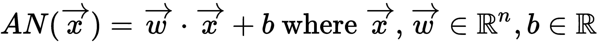
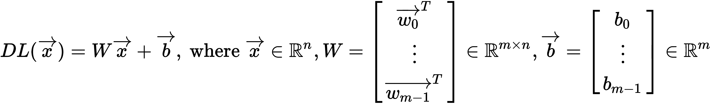
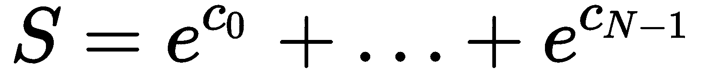

# 深度神经网络的实现

我们现在将使用我们积累的 GPU 编程知识，使用 PyCUDA 实现我们自己的深度神经网络（DNN）。在过去的十年中，DNN 吸引了大量的关注，因为它们为机器学习（ML）提供了一个强大而优雅的模型。DNN 也是第一个（除了渲染图形之外）能够通过利用其巨大的并行吞吐量来展示 GPU 真正力量的应用之一，这最终帮助 NVIDIA 崛起成为人工智能领域的主要参与者。

在本书的编写过程中，我们主要是一章一章地以“气泡”的形式覆盖个别主题——在这里，我们将基于我们迄今为止所学的许多主题，为我们自己的 DNN 实现构建一个实现。虽然目前有多个开源框架可供公众使用，用于基于 GPU 的 DNN，例如 Google 的 TensorFlow 和 Keras、Microsoft 的 CNTK、Facebook 的 Caffe2 和 PyTorch，但从头开始实现一个是非常有教育意义的，这将使我们更深入地了解 DNN 所需的底层技术。这里有大量的材料要介绍，所以我们在简要介绍一些基本概念后，将直接进入正题。

在本章中，我们将探讨以下内容：

+   理解**人工神经元**（**AN**）是什么

+   理解在一个**深度神经网络**（**DNN**）中可以组合多少个 AN

+   在 CUDA 和 Python 中从头实现 DNN

+   理解如何使用交叉熵损失来评估神经网络的输出

+   实现梯度下降以训练 NN

+   学习如何在小型数据集上训练和测试 NN

# 技术要求

需要一台装有现代 NVIDIA GPU（2016 年及以后）的 Linux 或 Windows 10 PC，并安装所有必要的 GPU 驱动程序和 CUDA Toolkit（9.0 及以后）。还需要一个合适的 Python 2.7 安装（例如 Anaconda Python 2.7），并安装 PyCUDA 模块。

本章的代码也可在 GitHub 上找到：[`github.com/PacktPublishing/Hands-On-GPU-Programming-with-Python-and-CUDA`](https://github.com/PacktPublishing/Hands-On-GPU-Programming-with-Python-and-CUDA)。

关于本章先决条件的更多信息，请参阅本书的序言。有关软件和硬件要求，请参阅[`github.com/PacktPublishing/Hands-On-GPU-Programming-with-Python-and-CUDA`](https://github.com/PacktPublishing/Hands-On-GPU-Programming-with-Python-and-CUDA)中的 README 文件。

# 人工神经元和神经网络

让我们简要回顾一下 **机器学习（ML）** 和 **神经网络（NNs）** 的基础知识。在机器学习中，我们的目标是收集一组具有特定标签类别或特征的数据，并使用这些示例来训练我们的系统以预测未来数据的值。我们称根据先前训练数据预测未来数据类别或标签的程序或函数为 **分类器**。

有许多类型的分类器，但在这里我们将专注于神经网络。神经网络背后的想法是它们（据说）以类似于人类大脑的方式工作，即它们通过使用一组 **人工神经元（AN**） 的集合来学习和分类数据，所有这些神经元都连接在一起形成一个特定的结构。然而，让我们暂时退后一步，看看单个 AN 是什么。在数学上，这只是一个从线性空间 **R^n** 到 **R** 的 **仿射** 函数，如下所示：



我们可以看到，这可以被描述为一个常数权重向量 ***w*** 与输入向量 ***x*** 之间的点积，并在末尾添加一个额外的偏置常数 *b*。 (再次强调，这个函数的唯一 *输入* 是 *x*；其他值都是常数！)

现在，单个 **人工神经网络（AN**） 个体来说相当无用（而且愚蠢），因为它们的 *智能* 只有在与大量其他 AN 协作时才会出现。我们的第一步是将一组 *m* 个类似的 AN 逐个堆叠起来，以形成一个我们称之为 **密集层（DL**） 的结构。这是密集的，因为每个神经元将处理来自 *x* 的每个单个输入值 - 每个 AN 将从 **R^n** 中接收一个数组或向量值，并输出一个 **R** 中的单个值。由于有 *m* 个神经元，这意味着我们可以说它们的输出总体上是在 **R^m** 空间中。我们会注意到，如果我们把每层的权重堆叠起来，形成一个 *m x n* 的权重矩阵，我们就可以通过矩阵乘法加上适当的偏置来计算每个神经元的输出：



现在，假设我们想要构建一个能够对 *k* 个不同的类别进行分类的神经网络分类器；我们可以创建一个新的额外的密集层，它接收来自先前密集层的 *m* 个值，并输出 *k* 个值。假设我们为每一层都找到了适当的权重和偏置值（这当然不是一件简单的事情），并且我们还在每一层之后设置了适当的 **激活函数**（我们将在后面定义），这将作为我们 *k* 个不同类别之间的分类器，根据最终层的输出给出 *x* 落入每个相应类别的概率。当然，我们在这里已经走得有点远了，但简而言之，这就是神经网络的工作原理。

现在，看起来我们只需将密集层连接成长链，就可以实现分类。这就是所谓的深度神经网络（DNN）。当我们有一个不直接连接到输入或输出的层时，它被称为隐藏层。DNN 的优势是额外的层允许神经网络捕捉到浅层神经网络无法捕捉到的数据的抽象和细微之处。

# 实现人工神经元的密集层

现在，让我们实现神经网络最重要的构建块，即 **密集层**。让我们首先声明一个 CUDA 内核，如下所示：

```py
__global__ void dense_eval(int num_outputs, int num_inputs, int relu, int sigmoid, float * w, float * b, float * x, float *y, int batch_size, int w_t, int b_t, float delta)
```

让我们逐个检查输入。`num_outputs` 当然表示这一层总共有多少个输出；这正是这一层中的神经元数量。`num_inputs` 告诉我们输入数据的大小。为 `relu` 和 `sigmoid` 设置正值将指示我们应该在层的输出上使用相应的激活函数，这我们将在稍后定义。`w` 和 `b` 是包含这一层权重和偏差的数组，而 `x` 和 `y` 将作为我们的输入和输出。通常，我们希望一次对多个数据进行分类。我们可以通过将 `batch_size` 设置为我们希望预测的点数来表示这一点。最后，`w_t`、`b_t` 和 `delta` 将在训练过程中使用，通过 **梯度下降** 确定这一层的适当权重和偏差。（我们将在稍后的部分看到更多关于梯度下降的内容。）

现在，让我们开始编写我们的内核。我们将并行化每个输出的计算，为此，我们将设置一个整数 `i` 作为全局线程 ID，并且对于任何运行此内核的额外不必要的线程，我们将使用适当的 `if` 语句使其不执行任何操作：

```py
{
 int i = blockDim.x*blockIdx.x + threadIdx.x;

 if (i < num_outputs)
 {
```

现在，让我们使用适当的 `for` 循环遍历批处理中的每个数据点：

```py
for(int k=0; k < batch_size; k++)
 { 
```

我们将权重和输入的 32 位浮点数相乘并累加到一个 64 位的双精度 `temp` 变量中，然后添加适当的偏差点。然后我们将这个变量转换回 32 位浮点，并将值放入输出数组中，然后关闭对 `k` 的循环：

```py
double temp = 0.0f;
 for (int j = 0; j < num_inputs; j++)
 {
   temp += ((double) w[(num_inputs)*i + j ] ) * ( (double) x[k*num_inputs + j]);
 }
 temp += (double) b[i];
 y[k * num_outputs + i] = (float) temp;  
}
```

*乘法和累加* 类型的操作通常会导致很大的数值精度损失。这可以通过在操作过程中使用更高精度的临时变量来存储值，并在操作完成后将该变量类型转换回原始精度来缓解。

要训练一个神经网络（NN），我们最终必须计算每个单独层中每个权重和偏置相对于我们的神经网络（NN）的导数（来自微积分）。记住，数学函数 *f* 在值 *x* 处的导数可以估计为 *f**(x + δ) - f(x) / δ*，其中 delta (δ) 是某个足够小的正数。我们将使用输入值 `w_t` 和 `b_t` 来指示内核我们是否想要计算相对于特定权重或偏置的导数；否则，我们将这些输入值设置为负值，仅为此层进行评估。我们还将设置 delta 为计算导数时适当小的值，并使用它来增加适当的偏置或权重的值：

```py
if( w_t >= 0 && i == (w_t / num_inputs))
 {
 int j = w_t % num_inputs;
 for(int k=0; k < batch_size; k++)
  y[k*num_outputs + i] += delta*x[k*num_inputs+j];
}
if( b_t >= 0 && i == b_t )
 {
  for(int k=0; k < batch_size; k++)
  y[k*num_outputs + i] += delta;
 }
```

现在，我们将添加一些代码，用于所谓的**修正线性单元**（或**ReLU**）和**sigmoid 激活函数**。这些用于处理密集神经网络层的即时输出。ReLU 只将所有负值设置为 0，而对于正输入则充当恒等函数，而 sigmoid 则计算每个值的 `sigmoid` 函数值（ *1 / (1 + e^(-x))*）。ReLU（或任何其他激活函数）在神经网络中的隐藏层之间用作使整个神经网络作为非线性函数的手段；否则，整个神经网络将构成一个平凡的（且计算效率低下的）矩阵运算。（虽然还有许多其他非线性激活函数可以在层之间使用，但 ReLU 被发现是训练中特别有效的函数。）Sigmoid 被用作神经网络中用于**标记**的最终层，即可能为给定输入分配多个标签的层，而不是将输入分配给单个类别。

在我们甚至开始定义这个 CUDA 内核之前，让我们先在文件中稍微向上移动一点，并将这些操作定义为 C 宏。同时，我们也将记得在此时添加我们刚刚编写的 CUDA-C 代码：

```py
DenseEvalCode = '''
#define _RELU(x) ( ((x) > 0.0f) ? (x) : 0.0f )
#define _SIGMOID(x) ( 1.0f / (1.0f + expf(-(x)) ))
```

现在，我们将使用内核输入 `relu` 和 `sigmoid` 来指示我们是否应该使用这些额外的层；我们将从这些输入中获取正值来分别指示它们应该被使用。我们可以添加这个，关闭我们的内核，并将其编译成一个可用的 Python 函数：

```py
if(relu > 0 || sigmoid > 0)
for(int k=0; k < batch_size; k++)
 { 
   float temp = y[k * num_outputs + i];
   if (relu > 0)
    temp = _RELU(temp);
   if (sigmoid > 0)
    temp = _SIGMOID(temp);
   y[k * num_outputs + i] = temp; 
  }
 }
 return;
}
'''
eval_mod = SourceModule(DenseEvalCode)
eval_ker = eval_mod.get_function('dense_eval')
```

现在，让我们回到文件的开始部分，设置适当的导入语句。注意，我们将包含 `csv` 模块，该模块将用于处理测试和训练的数据输入：

```py
from __future__ import division
import pycuda.autoinit
import pycuda.driver as drv
from pycuda import gpuarray
from pycuda.compiler import SourceModule
from pycuda.elementwise import ElementwiseKernel
import numpy as np
from Queue import Queue
import csv
import time
```

现在，让我们继续设置我们的密集层；我们希望将其包装在一个 Python 类中，以便于使用，这将使我们在开始将这些密集层连接成一个完整的神经网络时生活得更加轻松。我们将称之为`DenseLayer`，并从编写构造函数开始。这里的大部分输入和设置应该是自解释的：我们绝对应该添加一个选项来从预训练网络中加载权重和偏差，我们还将包括指定默认*delta*值以及默认流的选项。（如果没有提供权重或偏差，权重将初始化为随机值，而所有偏差都设置为 0。）我们还将指定是否在这里使用 ReLU 或 sigmoid 层。在最后，注意我们是如何设置块和网格大小的：

```py
class DenseLayer:
    def __init__(self, num_inputs=None, num_outputs=None, weights=None, b=None, stream=None, relu=False, sigmoid=False, delta=None):
        self.stream = stream

        if delta is None:
            self.delta = np.float32(0.001)
        else:
            self.delta = np.float32(delta)

        if weights is None:
            weights = np.random.rand(num_outputs, num_inputs) - .5
            self.num_inputs = np.int32(num_inputs)
        self.num_outputs = np.int32(num_outputs) 

        if type(weights) != pycuda.gpuarray.GPUArray:
            self.weights = gpuarray.to_gpu_async(np.array(weights, 
            dtype=np.float32) , stream = self.stream)
        else:
            self.weights = weights

        if num_inputs is None or num_outputs is None:
            self.num_inputs = np.int32(self.weights.shape[1])
            self.num_outputs = np.int32(self.weights.shape[0])

        else:
            self.num_inputs = np.int32(num_inputs)
            self.num_outputs = np.int32(num_outputs)

        if b is None:
            b = gpuarray.zeros((self.num_outputs,),dtype=np.float32)

        if type(b) != pycuda.gpuarray.GPUArray:
            self.b = gpuarray.to_gpu_async(np.array(b, 
            dtype=np.float32) , stream = self.stream)
        else:
            self.b = b 

        self.relu = np.int32(relu)
        self.sigmoid = np.int32(sigmoid)

        self.block = (32,1,1)
        self.grid = (int(np.ceil(self.num_outputs / 32)), 1,1)
```

现在，我们将在本类中设置一个函数来评估来自这一层的输入；我们将仔细检查输入（x），以确定它是否已经在 GPU 上（如果没有，将其传输到`gpuarray`），并且我们将允许用户指定一个预分配的`gpuarray`作为输出（y），如果没有指定，将手动分配一个输出数组。我们还将检查训练情况下的 delta 和`w_t`/`b_t`值，以及`batch_size`。然后，我们将对`x`输入运行内核，输出进入`y`，最后返回`y`作为输出值：

```py
def eval_(self, x, y=None, batch_size=None, stream=None, delta=None, w_t = None, b_t = None):

if stream is None:
    stream = self.stream

if type(x) != pycuda.gpuarray.GPUArray:
    x = gpuarray.to_gpu_async(np.array(x,dtype=np.float32), stream=self.stream)

if batch_size is None:
    if len(x.shape) == 2:
        batch_size = np.int32(x.shape[0])
    else:
        batch_size = np.int32(1)

if delta is None:
    delta = self.delta

delta = np.float32(delta)

if w_t is None:
    w_t = np.int32(-1)

if b_t is None:
    b_t = np.int32(-1)

if y is None:
    if batch_size == 1:
        y = gpuarray.empty((self.num_outputs,), dtype=np.float32)
    else:
        y = gpuarray.empty((batch_size, self.num_outputs), dtype=np.float32)

    eval_ker(self.num_outputs, self.num_inputs, self.relu, self.sigmoid, self.weights, self.b, x, y, np.int32(batch_size), w_t, b_t, delta , block=self.block, grid=self.grid , stream=stream)

 return y
```

就这样。我们已经完全实现了一个密集层！

# softmax 层的实现

我们现在将探讨如何实现一个**softmax 层**。正如我们之前讨论的，sigmoid 层用于为类别分配标签——也就是说，如果你想要从输入中推断出多个非互斥的特征，你应该使用 sigmoid 层。**softmax 层**用于当你只想通过推断为样本分配单个类别时——这是通过计算每个可能类别的概率（当然，所有类别的概率之和为 100%）来完成的。然后，我们可以选择概率最高的类别来给出最终的分类。

现在，让我们看看 softmax 层到底做了什么——给定一个包含*N*个实数的集合（*c[0]，...，c[N-1]*），我们首先计算每个数的指数函数之和（），然后计算每个数除以这个和的指数，以得到 softmax：


让我们从我们的实现开始。我们将先编写两个非常短的 CUDA 内核：一个用于计算每个输入的指数，另一个用于计算所有点的平均值：

```py
SoftmaxExpCode='''
__global__ void softmax_exp( int num, float *x, float *y, int batch_size)
{
 int i = blockIdx.x * blockDim.x + threadIdx.x;

 if (i < num)
 {
  for (int k=0; k < batch_size; k++)
  {
   y[num*k + i] = expf(x[num*k+i]);
  }
 }
}
'''
exp_mod = SourceModule(SoftmaxExpCode)
exp_ker = exp_mod.get_function('softmax_exp')

SoftmaxMeanCode='''
__global__ void softmax_mean( int num, float *x, float *y, int batch_size)
{
 int i = blockDim.x*blockIdx.x + threadIdx.x;

 if (i < batch_size)
 {
  float temp = 0.0f;

  for(int k=0; k < num; k++)
   temp += x[i*num + k];

  for(int k=0; k < num; k++)
   y[i*num+k] = x[i*num+k] / temp;
 }

 return;
}'''

mean_mod = SourceModule(SoftmaxMeanCode)
mean_ker = mean_mod.get_function('softmax_mean')
```

现在，让我们编写一个 Python 包装类，就像我们之前做的那样。首先，我们将从构造函数开始，并使用`num`来指示输入和输出的数量。我们还可以指定一个默认流，如果需要的话：

```py
class SoftmaxLayer:
    def __init__(self, num=None, stream=None):
     self.num = np.int32(num)
     self.stream = stream
```

现在，让我们以与密集层类似的方式编写`eval_ 函数`：

```py
def eval_(self, x, y=None, batch_size=None, stream=None):
 if stream is None:
 stream = self.stream

 if type(x) != pycuda.gpuarray.GPUArray:
  temp = np.array(x,dtype=np.float32)
  x = gpuarray.to_gpu_async( temp , stream=stream)

 if batch_size==None:
  if len(x.shape) == 2:
   batch_size = np.int32(x.shape[0])
  else:
   batch_size = np.int32(1)
 else:
  batch_size = np.int32(batch_size)

 if y is None:
  if batch_size == 1:
   y = gpuarray.empty((self.num,), dtype=np.float32)
 else:
  y = gpuarray.empty((batch_size, self.num), dtype=np.float32)

 exp_ker(self.num, x, y, batch_size, block=(32,1,1), grid=(int( np.ceil( self.num / 32) ), 1, 1), stream=stream)

 mean_ker(self.num, y, y, batch_size, block=(32,1,1), grid=(int( np.ceil( batch_size / 32)), 1,1), stream=stream)

 return y

```

# 交叉熵损失的实现

现在，让我们实现所谓的 **交叉熵损失** 函数。这个函数用于在训练过程中测量神经网络在数据点的子集上的准确性；我们的损失函数输出的值越大，我们的神经网络在正确分类给定数据时的准确性就越低。我们通过计算预期输出和神经网络实际输出之间的标准平均对数熵差异来实现这一点。为了数值稳定性，我们将输出值限制为 `1`：

```py
MAX_ENTROPY = 1

def cross_entropy(predictions=None, ground_truth=None):

 if predictions is None or ground_truth is None:
  raise Exception("Error! Both predictions and ground truth must be float32 arrays")

 p = np.array(predictions).copy()
 y = np.array(ground_truth).copy()

 if p.shape != y.shape:
  raise Exception("Error! Both predictions and ground_truth must have same shape.")

 if len(p.shape) != 2:
  raise Exception("Error! Both predictions and ground_truth must be 2D arrays.")

 total_entropy = 0

 for i in range(p.shape[0]):
  for j in range(p.shape[1]):
   if y[i,j] == 1: 
    total_entropy += min( np.abs( np.nan_to_num( np.log( p[i,j] ) ) ) , MAX_ENTROPY) 
   else: 
    total_entropy += min( np.abs( np.nan_to_num( np.log( 1 - p[i,j] ) ) ), MAX_ENTROPY)

 return total_entropy / p.size
```

# 顺序网络的实现

现在，让我们实现一个最终类，该类将多个密集层和 softmax 层对象组合成一个单一的、连贯的前馈顺序神经网络。这将被实现为另一个类，它将包含其他类。让我们首先从编写构造函数开始——我们可以在这里设置最大批量大小，这将影响为使用此网络分配的内存量——我们将在列表变量 `network_mem` 中存储为每个层的权重和输入/输出分配的内存。我们还将存储 `DenseLayer` 和 `SoftmaxLayer` 对象在列表 `network` 中，以及关于 NN 中每个层的信息在 `network_summary` 中。注意我们还可以在这里设置一些训练参数，包括 delta、用于梯度下降的流数量（我们稍后将看到），以及训练的轮数。

我们还可以在开始时看到一个名为 layers 的其他输入。在这里，我们可以通过描述每个层来指示神经网络的结构，构造函数将通过遍历 layers 的每个元素并调用我们即将实现的 `add_layer` 方法来创建这些层：

```py
class SequentialNetwork:
 def __init__(self, layers=None, delta=None, stream = None, max_batch_size=32, max_streams=10, epochs = 10):

 self.network = []
 self.network_summary = []
 self.network_mem = []

 if stream is not None:
  self.stream = stream
 else:
  self.stream = drv.Stream()

 if delta is None:
  delta = 0.0001

 self.delta = delta
 self.max_batch_size=max_batch_size
 self.max_streams = max_streams
 self.epochs = epochs

 if layers is not None:
  for layer in layers:
   add_layer(self, layer)
```

现在，让我们实现 `add_layer` 方法。我们将使用字典数据类型来传递有关层的所有相关信息到序列网络中——包括层的类型（密集型、softmax 等）、输入/输出的数量、权重和偏差。这将向对象的网络和 `network_summary` 列表变量追加适当的对象和信息，以及适当地分配 `gpuarray` 对象到 `network_mem` 列表：

```py
def add_layer(self, layer):
 if layer['type'] == 'dense':
  if len(self.network) == 0:
   num_inputs = layer['num_inputs']
  else:
   num_inputs = self.network_summary[-1][2]

  num_outputs = layer['num_outputs']
  sigmoid = layer['sigmoid']
  relu = layer['relu']
  weights = layer['weights']
  b = layer['bias']

  self.network.append(DenseLayer(num_inputs=num_inputs, num_outputs=num_outputs, sigmoid=sigmoid, relu=relu, weights=weights, b=b))
  self.network_summary.append( ('dense', num_inputs, num_outputs))

  if self.max_batch_size > 1:
   if len(self.network_mem) == 0:
self.network_mem.append(gpuarray.empty((self.max_batch_size, self.network_summary[-1][1]), dtype=np.float32))
 self.network_mem.append(gpuarray.empty((self.max_batch_size, self.network_summary[-1][2] ), dtype=np.float32 ) ) 
 else:
 if len(self.network_mem) == 0:
 self.network_mem.append( gpuarray.empty( (self.network_summary[-1][1], ), dtype=np.float32 ) )
 self.network_mem.append( gpuarray.empty((self.network_summary[-1][2], ), dtype=np.float32 ) ) 

 elif layer['type'] == 'softmax':

  if len(self.network) == 0:
   raise Exception("Error! Softmax layer can't be first!")

  if self.network_summary[-1][0] != 'dense':
   raise Exception("Error! Need a dense layer before a softmax layer!")

  num = self.network_summary[-1][2]
  self.network.append(SoftmaxLayer(num=num))
  self.network_summary.append(('softmax', num, num))

  if self.max_batch_size > 1:
   self.network_mem.append(gpuarray.empty((self.max_batch_size, self.network_summary[-1][2] ), dtype=np.float32)) 
  else:
   self.network_mem.append( gpuarray.empty((self.network_summary[-1][2], ), dtype=np.float32))
```

# 推理方法的实现

我们现在将为 `SequentialNetwork` 类添加两个推理方法——即，对于特定的输入预测输出。我们将首先调用 `predict` 方法，这将由最终用户使用。在训练过程中，我们必须基于仅从一些层中得到的部分结果进行预测，我们将为此目的创建另一个方法，称为 `partial_predict`。

让我们先从实现 *predict* 开始。这个方法将接受两个输入——一个形式为一维或二维 NumPy 数组的样本集合，以及可能是一个用户定义的 CUDA 流。我们首先将对样本（这里称为 `x`）进行一些类型检查和格式化，记住样本将按行存储：

```py
def predict(self, x, stream=None):

 if stream is None:
  stream = self.stream

 if type(x) != np.ndarray:
  temp = np.array(x, dtype = np.float32)
  x = temp

 if(x.size == self.network_mem[0].size):
  self.network_mem[0].set_async(x, stream=stream)
 else:

  if x.size > self.network_mem[0].size:
   raise Exception("Error: batch size too large for input.")

  x0 = np.zeros((self.network_mem[0].size,), dtype=np.float32)
  x0[0:x.size] = x.ravel()
  self.network_mem[0].set_async(x0.reshape( self.network_mem[0].shape), stream=stream)

 if(len(x.shape) == 2):
  batch_size = x.shape[0]
 else:
  batch_size = 1
```

现在，让我们执行实际的推理步骤。我们只需迭代整个神经网络，对每一层执行`eval_`：

```py
for i in xrange(len(self.network)):
 self.network[i].eval_(x=self.network_mem[i], y= self.network_mem[i+1], batch_size=batch_size, stream=stream)
```

现在，我们将从神经网络、GPU 的最终输出中提取，并将其返回给用户。如果`x`中的样本数量实际上小于最大批量大小，我们将在返回之前适当地切片输出数组：

```py
y = self.network_mem[-1].get_async(stream=stream)

if len(y.shape) == 2:
 y = y[0:batch_size, :]

return y
```

现在，完成了这些，让我们实现`partial_predict`。让我们简要地讨论一下这个想法背后的原理。当我们处于训练过程中，我们将评估一系列样本，然后观察对每个权重和偏置分别添加*delta*的细微变化将如何影响输出。为了节省时间，我们可以计算每层的输出并将它们存储在给定的样本集合中，然后只需重新计算权重改变的那一层以及所有后续层的输出。我们很快就会更深入地了解这个想法，但现在，我们可以这样实现：

```py
def partial_predict(self, layer_index=None, w_t=None, b_t=None, partial_mem=None, stream=None, batch_size=None, delta=None):

 self.network[layer_index].eval_(x=self.network_mem[layer_index], y = partial_mem[layer_index+1], batch_size=batch_size, stream = stream, w_t=w_t, b_t=b_t, delta=delta)

 for i in xrange(layer_index+1, len(self.network)):
  self.network[i].eval_(x=partial_mem[i], y =partial_mem[i+1], batch_size=batch_size, stream = stream)
```

# 梯度下降

现在，我们将以**批量随机梯度下降（BSGD）**的形式实现我们神经网络的完整训练方法。让我们逐字思考这意味着什么。**批量**意味着这个训练算法将一次处理一组训练样本，而不是同时处理所有样本，而**随机**表示每个批量是随机选择的。**梯度**意味着我们将使用微积分中的梯度——在这里，是损失函数上每个权重和偏置的导数集合。最后，**下降**意味着我们正在尝试减少损失函数——我们通过迭代地对权重和偏置进行细微的*减法*更改来实现这一点。

从微积分中记住，一个点的梯度始终指向最大*增加*的方向，其相反方向是最大*减少*的方向。由于我们想要一个*减少*，所以我们减去梯度。

现在，我们将实现 BSGD 作为我们`SequentialNetwork`类中的`bsgd`方法。让我们逐一过一下`bsgd`的输入参数：

+   `training`将是一个二维 NumPy 数组，包含训练样本

+   `labels`将是每个训练样本对应的神经网络最终层的期望输出

+   `delta`将指示我们在计算导数时应该增加权重多少

+   `max_streams`将指示 BSGD 将执行计算的并发 CUDA 流的最大数量

+   `batch_size`将指示我们希望每个权重更新的损失函数计算批量大小的程度

+   `epochs`将指示我们多少次洗牌当前样本集的顺序，将其拆分为一批，然后执行 BSGD

+   `training_rate`将指示我们使用梯度计算更新权重和偏置的速率

我们将像往常一样开始这个方法，执行一些检查和类型转换，将 CUDA 流对象集合设置为一个 Python 列表，并在另一个列表中分配一些额外的 GPU 内存：

```py
def bsgd(self, training=None, labels=None, delta=None, max_streams = None, batch_size = None, epochs = 1, training_rate=0.01):

 training_rate = np.float32(training_rate)

 training = np.float32(training)
 labels = np.float32(labels)

 if( training.shape[0] != labels.shape[0] ):
  raise Exception("Number of training data points should be same as labels!")

 if max_streams is None:
  max_streams = self.max_streams

 if epochs is None:
 epochs = self.epochs

 if delta is None:
 delta = self.delta

 streams = []
 bgd_mem = []

 # create the streams needed for training
 for _ in xrange(max_streams):
  streams.append(drv.Stream())
  bgd_mem.append([])

 # allocate memory for each stream
 for i in xrange(len(bgd_mem)):
  for mem_bank in self.network_mem:
   bgd_mem[i].append( gpuarray.empty_like(mem_bank) )
```

现在，我们可以开始训练了。我们将从对每个`epoch`执行整个 BSGD 迭代开始，每个 epoch 对整个数据集进行随机打乱。我们还会在终端打印一些信息，以便用户在训练过程中有一些状态更新：

```py
num_points = training.shape[0]

if batch_size is None:
 batch_size = self.max_batch_size

index = range(training.shape[0])

for k in xrange(epochs): 

 print '-----------------------------------------------------------'
 print 'Starting training epoch: %s' % k
 print 'Batch size: %s , Total number of training samples: %s' % (batch_size, num_points)
 print '-----------------------------------------------------------'

 all_grad = []

 np.random.shuffle(index)
```

现在，我们将创建一个循环，遍历打乱的数据集中的每个批次。我们首先从当前批次计算熵，并且也会打印出来。如果用户看到熵的下降，那么他们将知道梯度下降在这里正在起作用：

```py
for r in xrange(int(np.floor(training.shape[0]/batch_size))):

 batch_index = index[r*batch_size:(r+1)*batch_size] 

 batch_training = training[batch_index, :]
 batch_labels = labels[batch_index, :]

 batch_predictions = self.predict(batch_training)

 cur_entropy = cross_entropy(predictions=batch_predictions, ground_truth=batch_labels)

 print 'entropy: %s' % cur_entropy
```

接下来，我们将遍历我们神经网络中的每个密集层，计算整个权重和偏置集的梯度。我们将这些权重和偏置的导数存储在*展平*（一维）数组中，这些数组将对应于我们的 CUDA 内核中的`w_t`和`b_t`索引，这些索引也是展平的。由于我们将有多个流处理不同权重的不同输出，我们将使用 Python 队列容器来存储尚未处理此批次的权重和偏置集：然后我们只需从这个容器顶部弹出值到下一个可用的流（我们将这些存储为元组，第一个元素表示这是一个权重还是偏置，特别是）：

```py
for i in xrange(len(self.network)):

 if self.network_summary[i][0] != 'dense':
  continue

 all_weights = Queue()

 grad_w = np.zeros((self.network[i].weights.size,), dtype=np.float32)
 grad_b = np.zeros((self.network[i].b.size,), dtype=np.float32)

 for w in xrange( self.network[i].weights.size ):
  all_weights.put( ('w', np.int32(w) ) )

 for b in xrange( self.network[i].b.size ):
  all_weights.put(('b', np.int32(b) ) )
```

现在，我们需要遍历每个权重和偏置，我们可以使用一个`while`循环来检查我们刚刚设置的`queue`对象是否为空。我们将设置另一个队列`stream_weights`，这将帮助我们组织每个流处理了哪些权重和偏置。在适当地设置权重和偏置输入后，我们现在可以使用`partial_predict`，通过使用当前流和相应的 GPU 内存数组：

注意，我们已经在计算熵的批次样本上执行了`predict`，所以我们现在能够在这个批次上执行`partial_predict`，前提是我们小心地使用哪些内存和层。

```py
while not all_weights.empty():

 stream_weights = Queue()

 for j in xrange(max_streams):

  if all_weights.empty():
    break

  wb = all_weights.get()

  if wb[0] == 'w':
   w_t = wb[1]
   b_t = None
  elif wb[0] == 'b':
   b_t = wb[1]
   w_t = None

  stream_weights.put( wb )

  self.partial_predict(layer_index=i, w_t=w_t, b_t=b_t, partial_mem=bgd_mem[j], stream=streams[j], batch_size=batch_size, delta=delta)
```

我们只计算了小部分权重和偏置的输出预测。我们必须为每个计算熵，然后将导数值存储在展平的数组中：

```py
for j in xrange(max_streams):

 if stream_weights.empty():
  break

 wb = stream_weights.get()

 w_predictions = bgd_mem[j][-1].get_async(stream=streams[j])

 w_entropy = cross_entropy(predictions=w_predictions[ :batch_size,:], ground_truth=batch_labels)

 if wb[0] == 'w':
  w_t = wb[1]
  grad_w[w_t] = -(w_entropy - cur_entropy) / delta

 elif wb[0] == 'b':
  b_t = wb[1]
  grad_b[b_t] = -(w_entropy - cur_entropy) / delta
```

我们现在已经完成了`while`循环。一旦我们到达这个循环的外面，我们就知道我们已经计算了该特定层的所有权重和偏置的导数。在我们迭代到下一层之前，我们将当前权重和偏置集的梯度计算值追加到`all_grad`列表中。同时，我们也将展平的权重列表重塑回原始形状：

```py
all_grad.append([np.reshape(grad_w,self.network[i].weights.shape) , grad_b])
```

在我们迭代完每一层之后，我们可以在这一批数据上对神经网络（NN）的权重和偏置进行优化。注意，如果`training_rate`变量远小于`1`，这将减慢权重更新的速度：

```py
for i in xrange(len(self.network)):
 if self.network_summary[i][0] == 'dense':
  new_weights = self.network[i].weights.get()
  new_weights += training_rate*all_grad[i][0]
  new_bias = self.network[i].b.get()
  new_bias += training_rate*all_grad[i][1]
  self.network[i].weights.set(new_weights)
  self.network[i].b.set(new_bias)
```

我们已经完全实现了一个（非常简单）基于 GPU 的 DNN！

# 数据的预处理和标准化

在我们继续进行训练和测试我们全新的神经网络之前，我们需要暂时退后一步，谈谈**数据预处理**和**数据标准化**。神经网络对数值误差非常敏感，尤其是当输入具有较大尺度差异时。这可以通过正确**预处理**我们的训练数据来缓解；这意味着对于输入样本中的每个点，我们将计算所有样本中每个点的平均值和方差，然后在输入神经网络进行训练或推理（预测）之前，对每个样本中的每个点减去平均值并除以标准差。这种方法被称为**标准化**。让我们编写一个小的 Python 函数来完成这项工作：

```py
def condition_data(data, means=None, stds=None):

 if means is None:
  means = np.mean(data, axis=0)

 if stds is None:
  stds = np.std(data, axis = 0)

 conditioned_data = data.copy()
 conditioned_data -= means
 conditioned_data /= stds

 return (conditioned_data, means, stds)
```

# 爱丽丝数据集

现在，我们将构建我们自己的 DNN 来解决一个实际问题：根据花瓣的测量值对花卉类型进行分类。我们将使用著名的*爱丽丝数据集*来完成这项工作。这个数据集存储为逗号分隔值（CSV）文本文件，每行包含四个不同的数值（花瓣测量值），后面跟着花卉类型（在这里，有三个类别—*Irissetosa*，*Irisversicolor*和*Irisvirginica*）。现在，我们将设计一个小型 DNN 来根据这个集合对鸢尾花类型进行分类。

在我们继续之前，请下载爱丽丝数据集并将其放入您的当前工作目录。这个数据集可以从加州大学欧文分校机器学习存储库获得，网址如下：[`archive.ics.uci.edu/ml/machine-learning-databases/iris/iris.data`](https://archive.ics.uci.edu/ml/machine-learning-databases/iris/iris.data)。

我们首先将处理这个文件，将其转换为适当的数据数组，以便我们用于训练和验证我们的深度神经网络（DNN）。让我们从打开我们的主函数开始；我们需要将花卉的名称转换为 DNN 可以输出的实际类别，因此让我们创建一个小的字典，它将为每个类别提供相应的标签。我们还将设置一些空列表来存储我们的训练数据和标签：

```py
if __name__ == '__main__':
 to_class = { 'Iris-setosa' : [1,0,0] , 'Iris-versicolor' : [0,1,0], 'Iris-virginica' : [0,0,1]}

 iris_data = []
 iris_labels = []
```

现在，让我们从 CSV 文件中读取数据。我们将使用 Python 的`csv`模块中的`reader`函数，这是我们之前导入的：

```py
with open('C:/Users/btuom/examples/9/iris.data', 'rb') as csvfile:
 csvreader = csv.reader(csvfile, delimiter=',')
 for row in csvreader:
  newrow = []
  if len(row) != 5:
   break
  for i in range(4):
   newrow.append(row[i])
  iris_data.append(newrow)
  iris_labels.append(to_class[row[4]])
```

现在，我们将随机打乱数据，并使用其中的三分之二作为训练数据。剩余的三分之一将用于测试（验证）数据：

```py
iris_len = len(iris_data)
shuffled_index = list(range(iris_len))
np.random.shuffle(shuffled_index)

iris_data = np.float32(iris_data)
iris_labels = np.float32(iris_labels)
iris_data = iris_data[shuffled_index, :]
iris_labels = iris_labels[shuffled_index,:]

t_len = (2*iris_len) // 3

iris_train = iris_data[:t_len, :]
label_train = iris_labels[:t_len, :]

iris_test = iris_data[t_len:,:]
label_test = iris_labels[t_len:, :]
```

现在，最后，我们可以开始构建我们的 DNN 了！首先，让我们创建一个`SequentialNetwork`对象。我们将`max_batch_size`设置为`32`：

```py
sn = SequentialNetwork( max_batch_size=32 )
```

现在，让我们创建我们的神经网络。这将由四个密集层（两个隐藏层）和一个 softmax 层组成。我们将逐步增加每层的神经元数量，直到最后一层，该层将只有三个输出（每个类别一个）。这种每层神经元数量的增加使我们能够捕捉到数据的一些细微之处：

```py

sn.add_layer({'type' : 'dense', 'num_inputs' : 4, 'num_outputs' : 10, 'relu': True, 'sigmoid': False, 'weights' : None, 'bias' : None} ) 
sn.add_layer({'type' : 'dense', 'num_inputs' : 10, 'num_outputs' : 15, 'relu': True, 'sigmoid': False, 'weights': None, 'bias' : None} ) 
sn.add_layer({'type' : 'dense', 'num_inputs' : 15, 'num_outputs' : 20, 'relu': True, 'sigmoid': False, 'weights': None, 'bias' : None} ) 
sn.add_layer({'type' : 'dense', 'num_inputs' : 20, 'num_outputs' : 3, 'relu': True, 'sigmoid': False, 'weights': None , 'bias': None } ) 
sn.add_layer({'type' : 'softmax'})
```

现在，我们将对训练数据进行条件化处理，并使用我们刚刚实现的 BSGD 方法开始训练。我们将设置 `batch_size` 为 `16`，`max_streams` 为 `10`，`epochs` 的数量设置为 100，`delta` 设置为 0.0001，`training_rate` 设置为 1——这些参数对于几乎任何现代 GPU 都是可接受的。同时，我们也会计时训练过程，这可能相当耗时：

```py
ctrain, means, stds = condition_data(iris_train)

t1 = time()
sn.bsgd(training=ctrain, labels=label_train, batch_size=16, max_streams=20, epochs=100 , delta=0.0001, training_rate=1)
training_time = time() - t1
```

现在，我们的 DNN 已经完全训练完毕。我们准备好开始验证过程了！让我们设置一个名为 `hits` 的 Python 变量来统计总的正确分类数量。我们还需要对验证/测试数据进行条件化处理。还有一件事——我们通过 DNN 的 softmax 层的最大值对应的索引来确定类别。我们可以通过使用 NumPy 的 `argmax` 函数来检查这给我们的是否是正确的分类，如下所示：

```py
hits = 0
ctest, _, _ = condition_data(iris_test, means=means, stds=stds)
for i in range(ctest.shape[0]):
 if np.argmax(sn.predict(ctest[i,:])) == np.argmax( label_test[i,:]):
  hits += 1
```

现在，我们已经准备好检查我们的 DNN 实际上工作得如何了。让我们输出准确率以及总的训练时间：

```py
print 'Percentage Correct Classifications: %s' % (float(hits ) / ctest.shape[0])
print 'Total Training Time: %s' % training_time
```

现在，我们已经完成了。现在我们可以完全使用 Python 和 CUDA 实现一个深度神经网络（DNN）了！一般来说，对于这个问题，你可以期望得到 80%-97% 的准确率，在任意 Pascal 级别的 GPU 上训练时间大约为 10-20 分钟。

本章的代码存储在 `deep_neural_network.py` 文件中，位于本书 GitHub 仓库的相应目录下。

# 摘要

在本章中，我们首先给出了人工神经网络的定义，并展示了如何将单个人工神经网络（AN）组合成密集层，这些密集层最终组合成一个完整的深度神经网络。然后，我们在 CUDA-C 中实现了一个密集层，并创建了一个相应的 Python 包装类。我们还包含了在密集层的输出上添加 ReLU 和 sigmoid 层的功能。我们看到了使用 softmax 层的定义和动机，该层用于分类问题，并在 CUDA-C 和 Python 中实现了它。最后，我们实现了一个 Python 类，以便我们可以从之前的类构建一个顺序前馈 DNN；我们实现了一个交叉熵损失函数，然后在我们的 DNN 实现中使用这个损失函数来训练权重和偏差。最后，我们使用我们的实现在一个真实数据集上构建、训练和测试了一个 DNN。

由于我们能够编写自己的基于 GPU 的深度神经网络（DNN），我们现在对自己的 CUDA 编程能力非常有信心！接下来，我们将进入下一章的非常高级的内容，我们将探讨如何编写自己的接口来调用编译好的 CUDA 代码，以及一些关于 NVIDIA GPU 的非常技术性的细节。

# 问题

1.  假设你构建了一个 DNN，在训练后，它只产生了垃圾输出。经过检查，你发现所有的权重和偏置要么是巨大的数字，要么是 NaN。可能的问题是什么？

1.  列出一个小`training_rate`值可能存在的问题。

1.  列出一个大`training_rate`值可能存在的问题。

1.  假设我们想要训练一个 DNN，该 DNN 将为动物图像分配多个标签（如“粘滑的”、“毛茸茸的”、“红色的”、“棕色的”等等）。我们应该在 DNN 的末尾使用 sigmoid 层还是 softmax 层？

1.  假设我们想要将一张单独的动物图像分类为猫或狗。我们应该使用 sigmoid 函数还是 softmax 函数？

1.  如果我们减小批处理大小，在梯度下降训练过程中，权重和偏置的更新会有更多还是更少？
