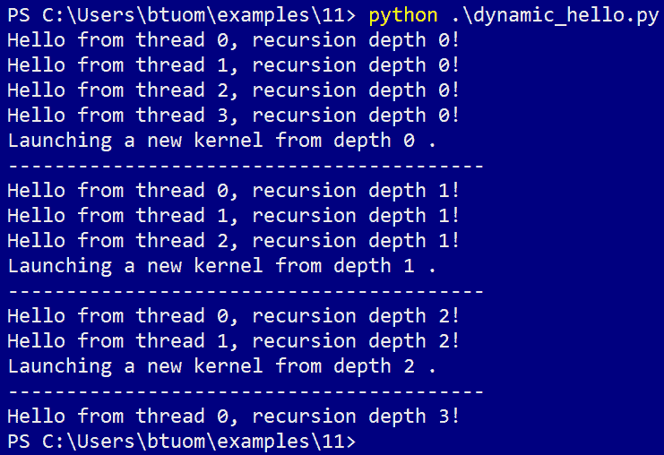
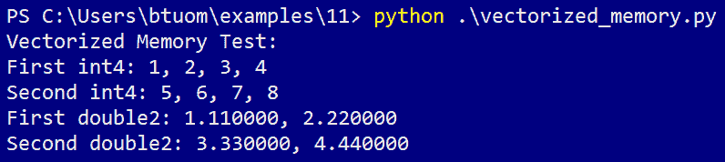
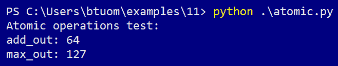
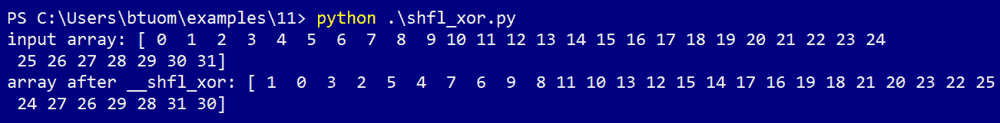
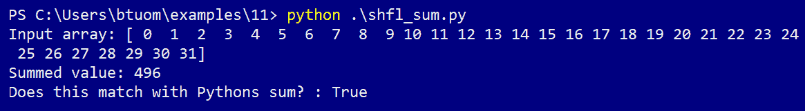
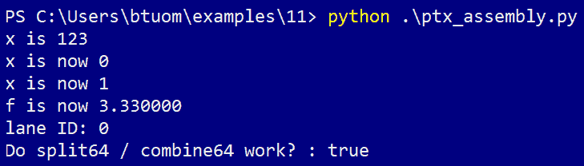
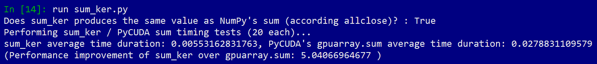

# CUDA 中的性能优化

在本章的最后，我们将介绍一些相当高级的 CUDA 特性，我们可以使用它们进行底层性能优化。我们将从学习动态并行开始，这允许内核在 GPU 上启动和管理其他内核，并看看我们如何使用它来实现直接在 GPU 上的快速排序。我们将学习关于矢量化内存访问的内容，这可以在从 GPU 的全局内存读取时提高内存访问速度。然后我们将看看如何使用 CUDA 原子操作，这些是线程安全的函数，可以在没有线程同步或*互斥锁*的情况下操作共享数据。我们将学习关于 Warps 的内容，它们是由 32 个或更少的线程组成的根本块，线程可以直接读取或写入彼此的变量，然后简要地进入 PTX 汇编的世界。我们将通过在 CUDA-C 代码中直接编写一些基本的 PTX 汇编内联来实现这一点，而 CUDA-C 代码本身将内联在我们的 Python 代码中！最后，我们将把这些小的底层调整集中到一个最终的例子中，我们将应用它们来制作一个极快的求和内核，并将其与 PyCUDA 的求和进行比较。

本章的学习成果如下：

+   CUDA 中的动态并行

+   使用动态并行在 GPU 上实现快速排序

+   使用矢量化类型来加速设备内存访问

+   使用线程安全的 CUDA 原子操作

+   基本 PTX 汇编

+   将所有这些概念应用于编写性能优化的求和内核

# 动态并行

首先，我们将看看**动态并行**，这是 CUDA 中的一个特性，允许内核在没有主机交互或输入的情况下启动和管理其他内核。这也使得许多通常在主机端可用的 CUDA-C 特性也变得在 GPU 上可用，例如设备内存分配/释放、设备到设备的内存复制、上下文范围内的同步以及流。

让我们从一个非常简单的例子开始。我们将创建一个包含*N*个线程的小内核，每个线程将从终端打印一条简短的消息，然后递归地启动另一个包含*N - 1*个线程的内核。这个过程将持续进行，直到*N*达到 1。（当然，除了说明动态并行的工作原理之外，这个例子几乎没有什么实际意义。）

让我们从 Python 中的`import`语句开始：

```py
from __future__ import division
import numpy as np
from pycuda.compiler import DynamicSourceModule
import pycuda.autoinit
```

注意，我们必须导入`DynamicSourceModule`而不是通常的`SourceModule`！这是因为动态并行特性需要编译器设置特定的配置细节。否则，这看起来和表现就像是一个普通的`SourceModule`操作。现在我们可以继续编写内核：

```py
DynamicParallelismCode='''
__global__ void dynamic_hello_ker(int depth)
{
 printf("Hello from thread %d, recursion depth %d!\\n", threadIdx.x, depth);
 if (threadIdx.x == 0 && blockIdx.x == 0 && blockDim.x > 1)
 {
  printf("Launching a new kernel from depth %d .\\n", depth);
  printf("-----------------------------------------\\n");
  dynamic_hello_ker<<< 1, blockDim.x - 1 >>>(depth + 1);
 }
}'''
```

这里需要注意的最重要的事情是：我们必须小心，只有一个线程使用一个放置良好的`if`语句检查`threadIdx`和`blockIdx`值来启动下一个内核迭代的下一个内核。如果我们不这样做，那么每个线程在每次深度迭代中都会启动比必要的更多的内核实例。此外，注意我们只需用通常的 CUDA-C 三重括号符号以正常方式启动内核——我们不需要使用任何晦涩或低级命令来利用动态并行性。

当使用 CUDA 动态并行特性时，务必小心避免不必要的内核启动。这可以通过指定一个线程启动下一个内核迭代来实现。

现在让我们来完成这个任务：

```py
dp_mod = DynamicSourceModule(DynamicParallelismCode)
hello_ker = dp_mod.get_function('dynamic_hello_ker')
hello_ker(np.int32(0), grid=(1,1,1), block=(4,1,1))
```

现在我们可以运行前面的代码，这将给出以下输出：



此示例也可以在本书 GitHub 仓库目录下的`dynamic_hello.py`文件中找到。

# 带有动态并行的快速排序

现在让我们看看动态并行的一个稍微有趣且实用的应用——**快速排序算法**。实际上，这是一个非常适合并行化的算法，我们将看到这一点。

让我们从简要回顾开始。快速排序是一种递归的、原地排序算法，平均和最佳情况性能为*O(N log N)*，最坏情况性能为*O(N²)*。快速排序通过在未排序数组中选择一个任意点称为*pivot*，然后将数组划分为一个左数组（包含所有小于枢轴的点），一个右数组（包含所有等于或大于枢轴的点），枢轴位于两个数组之间来执行。如果现在一个或两个数组长度大于 1，则我们递归地对一个或两个子数组再次调用快速排序，此时枢轴点在其最终位置。

使用纯 Python 和函数式编程，快速排序可以单行实现：

`qsort = lambda xs : [] if xs == [] else qsort(filter(lambda x: x < xs[-1] , xs[0:-1])) + [xs[-1]] + qsort(filter(lambda x: x >= xs[-1] , xs[0:-1]))`

通过快速排序在左右数组上递归调用的事实，我们可以看到并行性将如何发挥作用——我们可以看到这将从单个线程操作一个初始的大型数组开始，但到数组变得非常小的时候，应该有多个线程在操作它们。在这里，我们实际上将通过每个*单个线程*启动所有内核来实现这一点！

让我们开始吧，从导入语句开始。（我们将确保导入标准随机模块中的`shuffle`函数，以便稍后进行示例。）

```py
from __future__ import division
import numpy as np
from pycuda.compiler import DynamicSourceModule
import pycuda.autoinit
from pycuda import gpuarray
from random import shuffle
```

现在我们将编写我们的快速排序内核。我们将为分区步骤编写一个`device`函数，它将接受一个整数指针、子数组的最低分区点和最高分区点。此函数还将使用此子数组的最高点作为枢轴。最终，在此函数完成后，它将返回枢轴的最终位置：

```py
DynamicQuicksortCode='''
__device__ int partition(int * a, int lo, int hi)
{
 int i = lo;
 int pivot = a[hi];
 int temp;

 for (int k=lo; k<hi; k++)
 {
  if (a[k] < pivot)
  {
   temp = a[k];
   a[k] = a[i];
   a[i] = temp;
   i++;
  }
 }

 a[hi] = a[i];
 a[i] = pivot;

 return i;
}
```

现在，我们可以将实现此分区函数的内核写入并行快速排序。我们将不得不使用 CUDA-C 的流约定，我们之前还没有看到：在 CUDA-C 中，要在流`s`中启动内核*k*，我们使用`k<<<grid, block, sharedMemBytesPerBlock, s>>>(...)`。通过在这里使用两个流，我们可以确保它们是并行启动的。（考虑到我们不会使用共享内存，我们将第三个启动参数设置为“0”）。流对象的创建和销毁应该是自解释的：

```py
__global__ void quicksort_ker(int *a, int lo, int hi)
{

 cudaStream_t s_left, s_right; 
 cudaStreamCreateWithFlags(&s_left, cudaStreamNonBlocking);
 cudaStreamCreateWithFlags(&s_right, cudaStreamNonBlocking);

 int mid = partition(a, lo, hi);

 if(mid - 1 - lo > 0)
   quicksort_ker<<< 1, 1, 0, s_left >>>(a, lo, mid - 1);
 if(hi - (mid + 1) > 0)
   quicksort_ker<<< 1, 1, 0, s_right >>>(a, mid + 1, hi);

 cudaStreamDestroy(s_left);
 cudaStreamDestroy(s_right);

}
'''
```

现在，让我们随机打乱一个包含 100 个整数的列表，并让我们的内核为我们排序。注意我们是如何在单个线程上启动内核的：

```py
qsort_mod = DynamicSourceModule(DynamicQuicksortCode)

qsort_ker = qsort_mod.get_function('quicksort_ker')

if __name__ == '__main__':
    a = range(100)
    shuffle(a)

    a = np.int32(a)

    d_a = gpuarray.to_gpu(a)

    print 'Unsorted array: %s' % a

    qsort_ker(d_a, np.int32(0), np.int32(a.size - 1), grid=(1,1,1), block=(1,1,1))

    a_sorted = list(d_a.get())

    print 'Sorted array: %s' % a_sorted
```

此程序也包含在这本书 GitHub 仓库的`dynamic_quicksort.py`文件中。

# 向量化数据类型和内存访问

我们现在将查看 CUDA 的向量化数据类型。这些是标准数据类型（如 int 或 double）的**向量化**版本，因为它们可以存储多个值。32 位类型有**向量化**版本，大小可达 4（例如，`int2`、`int3`、`int4`和`float4`），而 64 位变量只能向量化到其原始大小的两倍（例如，`double2`和`long2`）。对于大小为 4 的向量化变量，我们使用 C 的“struct”表示法访问每个单独的元素，对于成员`x`、`y`、`z`和`w`，而对于 3 个成员的变量，我们使用`x`、`y`和`z`，对于 2 个成员的变量，我们只使用`x`和`y`。

这些可能现在看起来没有意义，但这些数据类型可以用来提高从全局内存加载数组时的性能。现在，让我们做一个小的测试，看看我们如何从一个整数数组中加载一些`int4`变量，以及从双精度浮点数组中加载`double2`变量——我们将不得不使用 CUDA 的`reinterpret_cast`运算符来完成这个操作：

```py
from __future__ import division
import numpy as np
from pycuda.compiler import SourceModule
import pycuda.autoinit
from pycuda import gpuarray

VecCode='''
__global__ void vec_ker(int *ints, double *doubles) { 

 int4 f1, f2;

 f1 = *reinterpret_cast<int4*>(ints);
 f2 = *reinterpret_cast<int4*>(&ints[4]);

 printf("First int4: %d, %d, %d, %d\\n", f1.x, f1.y, f1.z, f1.w);
 printf("Second int4: %d, %d, %d, %d\\n", f2.x, f2.y, f2.z, f2.w);

 double2 d1, d2;

 d1 = *reinterpret_cast<double2*>(doubles);
 d2 = *reinterpret_cast<double2*>(&doubles[2]);

 printf("First double2: %f, %f\\n", d1.x, d1.y);
 printf("Second double2: %f, %f\\n", d2.x, d2.y);

}'''
```

注意我们如何必须使用解引用运算符`*`来设置向量化变量，以及我们如何必须通过引用跳转到下一个地址（`&ints[4]`、`&doubles[2]`），通过在数组上使用引用运算符`&`来加载第二个`int4`和`double2`：



这个例子也包含在这本书 GitHub 仓库的`vectorized_memory.py`文件中。

# 线程安全的原子操作

我们现在将学习 CUDA 中的**原子操作**。原子操作是非常简单的线程安全操作，它们输出到单个全局数组元素或共享内存变量，否则这通常会导致竞态条件。

让我们考虑一个例子。假设我们有一个内核，并在某个时刻为所有线程设置了一个名为 `x` 的局部变量。然后我们想要找到所有 `x` 中的最大值，并将这个值设置为我们用 `__shared__ int x_largest` 声明的共享变量中。我们可以通过在每一个线程上调用 `atomicMax(&x_largest, x)` 来实现这一点。

让我们看看原子操作的简要示例。我们将为两个实验编写一个小程序：

+   将变量设置为 0，然后为每个线程加 1

+   在所有线程中查找最大线程 ID 值

让我们先像往常一样将 `tid` 整数设置为全局线程 ID，然后将全局 `add_out` 变量设置为 0。在过去，我们会通过一个线程使用 `if` 语句来修改变量，但现在我们可以使用 `atomicExch(add_out, 0)` 在所有线程上执行。让我们进行导入并编写我们的内核到这一点：

```py
from __future__ import division
import numpy as np
from pycuda.compiler import SourceModule
import pycuda.autoinit
from pycuda import gpuarray
import pycuda.driver as drv

AtomicCode='''
__global__ void atomic_ker(int *add_out, int *max_out) 
{

 int tid = blockIdx.x*blockDim.x + threadIdx.x;

 atomicExch(add_out, 0);
```

应该注意的是，虽然原子操作确实是线程安全的，但它们并不能保证所有线程都会同时访问它们，它们可能在不同线程的不同时间被执行。这在这里可能是个问题，因为我们将在下一步修改 `add_out`。这可能会导致 `add_out` 在被一些线程部分修改后重置。让我们进行块同步以防止这种情况：

```py
 __syncthreads();
```

我们现在可以使用 `atomicAdd` 为每个线程的 `add_out` 加 1，这将给出线程的总数：

```py
 atomicAdd(add_out, 1);
```

现在让我们通过使用 `atomicMax` 来检查所有线程的 `tid` 的最大值。然后我们可以关闭我们的 CUDA 内核：

```py
 atomicMax(max_out, tid);

}
'''
```

我们现在将添加测试代码；让我们尝试在 1 块 100 个线程上启动。这里我们只需要两个变量，所以我们将不得不分配一些只有大小为 1 的 `gpuarray` 对象。然后我们将打印输出：

```py
atomic_mod = SourceModule(AtomicCode)
atomic_ker = atomic_mod.get_function('atomic_ker')

add_out = gpuarray.empty((1,), dtype=np.int32)
max_out = gpuarray.empty((1,), dtype=np.int32)

atomic_ker(add_out, max_out, grid=(1,1,1), block=(100,1,1))

print 'Atomic operations test:'
print 'add_out: %s' % add_out.get()[0]
print 'max_out: %s' % max_out.get()[0]
```

现在我们已经准备好运行这个了：



这个例子也作为本书 GitHub 仓库中的 `atomic.py` 文件提供。

# Warp shuffling

我们现在将探讨所谓的 **warp shuffling**。这是 CUDA 中的一项功能，允许同一 CUDA Warp 内的线程通过直接读取和写入彼此的寄存器（即它们的局部栈空间变量）来并发通信，而不使用 *shared* 变量或全局设备内存。Warp shuffling 实际上比其他两种选项更快、更容易使用。这听起来几乎太好了，以至于几乎不可能为真，所以肯定有一个 *陷阱—*的确，这个 *陷阱* 是它只适用于同一 CUDA Warp 上的线程，这限制了 shuffling 操作只能用于大小为 32 或更小的线程组。另一个陷阱是，我们只能使用 32 位或更小的数据类型。这意味着我们无法在 Warp 中 shuffle 64 位 *long long* 整数或 *double* 浮点值。

只有 32 位（或更小）的数据类型可以与 CUDA Warp shuffling 一起使用！这意味着虽然我们可以使用整数、浮点数和字符，但不能使用双精度或**长长**整数！

在我们继续任何编码之前，简要回顾一下 CUDA Warps。（在继续之前，你可能希望回顾第六章中名为*The warp lockstep property*的部分，即*调试和性能分析您的 CUDA 代码*。）CUDA 中的**Warp**是 CUDA 中最小的执行单元，由 32 个或更少的线程组成，在恰好 32 个 GPU 核心上运行。正如 Grid 由块组成一样，块同样由一个或多个 Warp 组成，具体取决于块使用的线程数——如果一个块由 32 个线程组成，那么它将使用一个 Warp，如果它使用 96 个线程，它将包含三个 Warp。即使 Warp 的大小小于 32，它也被视为一个完整的 Warp：这意味着只有一个线程的块将使用 32 个核心。这也意味着一个包含 33 个线程的块将包含两个 Warp 和 31 个核心。

为了记住我们在第六章中看到的内容，即*调试和性能分析您的 CUDA 代码*，Warp 有一个被称为**锁步属性**的特性。这意味着 Warp 中的每个线程将迭代每条指令，与 Warp 中的每个其他线程完美并行。也就是说，单个 Warp 中的每个线程将同时执行相同的精确指令，*忽略*任何不适用于特定线程的指令——这就是为什么在单个 Warp 中尽可能避免线程之间的任何分歧。NVIDIA 称这种执行模型为**单指令多线程**，或**SIMT**。到现在为止，你应该明白为什么我们一直在文本中始终如一地使用 32 线程的块！

在我们继续之前，我们需要学习一个新术语——Warp 中的一个**lane**是 warp 中特定线程的唯一标识符，其值将在 0 到 31 之间。有时，这也被称为**Lane ID**。

让我们从简单的例子开始：我们将使用`__shfl_xor`命令在所有偶数和奇数编号的 Lanes（线程）之间交换特定变量的值。这实际上非常快且容易完成，所以让我们编写我们的内核并看看：

```py
from __future__ import division
import numpy as np
from pycuda.compiler import SourceModule
import pycuda.autoinit
from pycuda import gpuarray

ShflCode='''
__global__ void shfl_xor_ker(int *input, int * output) {

int temp = input[threadIdx.x];

temp = __shfl_xor (temp, 1, blockDim.x);

output[threadIdx.x] = temp;

}'''
```

这里的一切对我们来说都很熟悉，除了 `__shfl_xor`。这是单个 CUDA 线程如何看待这个函数的：这个函数从当前线程接收 `temp` 的值作为输入。它对当前线程的二进制通道 ID 与 `1` 进行 `XOR` 操作，这将要么是其左邻居（如果线程的通道的最不重要位是二进制的`1`），要么是其右邻居（如果最不重要位是二进制的“0”）。然后它将当前线程的 `temp` 值发送给其邻居，同时检索邻居的 `temp` 值，这就是 `__shfl_xor`。这个值将作为输出返回到 `temp`。然后我们设置输出数组中的值，这将交换我们的输入数组值。

现在，让我们编写剩余的测试代码，然后检查输出：

```py
shfl_mod = SourceModule(ShflCode)
shfl_ker = shfl_mod.get_function('shfl_xor_ker')

dinput = gpuarray.to_gpu(np.int32(range(32)))
doutout = gpuarray.empty_like(dinput)

shfl_ker(dinput, doutout, grid=(1,1,1), block=(32,1,1))

print 'input array: %s' % dinput.get()
print 'array after __shfl_xor: %s' % doutout.get()
```

上述代码的输出如下：



在我们继续之前，让我们再举一个 warp 混洗的例子——我们将实现一个操作，用于在 warp 中的所有线程上对单个局部变量求和。让我们回顾一下来自第四章，*内核、线程、块和网格*中的朴素并行求和算法，这个算法非常快，但它做出了一个*朴素*的假设，即我们拥有的处理器数量和我们拥有的数据块数量一样多——在我们生活中，这实际上是非常少见的，假设我们正在处理大小为 32 或更小的数组。我们将使用 `__shfl_down` 函数在一个 warp 中实现这一点。`__shfl_down` 函数接受第一个参数中的线程变量，通过第二个参数中指示的步数在线程之间*移位*一个变量，而第三个参数将指示 warp 的总大小。

现在我们立即实现这个操作。再次提醒，如果你不熟悉朴素并行求和或者不记得为什么它应该有效，请回顾第四章，*内核、线程、块和网格*。我们将使用 `__shfl_down` 实现直接的求和，然后在包含从 0 到 31 的整数的数组上运行这个操作。然后我们将它与 NumPy 的 `sum` 函数进行比较，以确保正确性：

```py
from __future__ import division
import numpy as np
from pycuda.compiler import SourceModule
import pycuda.autoinit
from pycuda import gpuarray

ShflSumCode='''
__global__ void shfl_sum_ker(int *input, int *out) {

 int temp = input[threadIdx.x];

 for (int i=1; i < 32; i *= 2)
     temp += __shfl_down (temp, i, 32);

 if (threadIdx.x == 0)
     *out = temp;

}'''

shfl_mod = SourceModule(ShflSumCode)
shfl_sum_ker = shfl_mod.get_function('shfl_sum_ker')

array_in = gpuarray.to_gpu(np.int32(range(32)))
out = gpuarray.empty((1,), dtype=np.int32)

shfl_sum_ker(array_in, out, grid=(1,1,1), block=(32,1,1))

print 'Input array: %s' % array_in.get()
print 'Summed value: %s' % out.get()[0]
print 'Does this match with Python''s sum? : %s' % (out.get()[0] == sum(array_in.get()) )
```

这将给出以下输出：



本节中的示例也作为 `shfl_sum.py` 和 `shfl_xor.py` 文件包含在本书的 GitHub 仓库中的 `Chapter11` 目录下。

# 内联 PTX 汇编

现在，我们将探讨编写 PTX（并行线程执行）汇编语言，这是一种在所有 Nvidia GPU 上工作的伪汇编语言，它反过来由即时（JIT）编译器编译成特定 GPU 的实际机器代码。虽然这显然不是日常使用，但如果需要，它将让我们在比 C 语言更低级别上工作。一个特定的用例是，你可以轻松地反汇编 CUDA 二进制文件（主机端可执行文件/库或 CUDA .cubin 二进制文件）并检查其 PTX 代码，如果否则没有源代码。这可以通过 Windows 和 Linux 中的`cuobjdump.exe -ptx cuda_binary`命令来完成。

如前所述，我们将在 CUDA-C 中仅涵盖 PTX（并行线程执行）的一些基本用法，CUDA-C 具有特定的语法和用法，这与在 GCC 中使用内联主机端汇编语言类似。让我们开始编写我们的代码——我们将进行导入并开始编写我们的 GPU 代码：

```py
from __future__ import division
import numpy as np
from pycuda.compiler import SourceModule
import pycuda.autoinit
from pycuda import gpuarray

PtxCode='''
```

我们将通过将代码写入单独的设备函数来在这里进行几个迷你实验。让我们从一个简单的函数开始，该函数将输入变量设置为 0。（在 CUDA 中，我们可以使用 C++的按引用传递操作符`&`，我们将在`device`函数中使用它。）

```py
__device__ void set_to_zero(int &x)
{
 asm("mov.s32 %0, 0;" : "=r"(x));
}
```

在我们继续之前，让我们分解一下。`asm`当然会指示`nvcc`编译器我们将要使用汇编，因此我们必须将这段代码放入引号中，以便它可以被正确处理。`mov`指令只是复制一个常数或其他值，并将其输入到一个**寄存器**中。（寄存器是 GPU 或 CPU 使用的最基本类型的片上存储单元，用于存储或操作值；这是大多数*局部*变量在 CUDA 中使用的方式。）`mov.s32`中的`.s32`部分表示我们正在处理一个有符号的 32 位整数变量——PTX 汇编语言没有像 C 语言那样的*类型*数据，因此我们必须小心使用正确的特定操作。`%0`告诉`nvcc`使用与字符串这里的`0th`参数相对应的寄存器，我们用逗号将其与`mov`的下一个*输入*分开，逗号是常数`0`。然后我们像在 C 语言中一样以分号结束汇编语句行，并用引号关闭这段汇编代码。然后我们必须使用冒号（而不是逗号！）来指示我们想要在代码中使用哪些变量。`"=r"`意味着两件事：等号`=`将指示`nvcc`该寄存器将被写入作为输出，而`r`表示这应该被处理为 32 位整数数据类型。然后我们将要由汇编器处理的变量放在括号中，然后像任何 C 函数一样关闭`asm`。

所有这些都是为了设置单个变量的值为 0！现在，让我们创建一个小的设备函数，该函数将为我们添加两个浮点数：

```py
__device__ void add_floats(float &out, float in1, float in2)
{
 asm("add.f32 %0, %1, %2 ;" : "=f"(out) : "f"(in1) , "f"(in2));
}
```

让我们停下来注意一些事情。首先，当然，我们使用 `add.f32` 来表示我们想要将两个 32 位浮点数相加。我们还使用 `"=f"` 来表示我们将写入一个寄存器，并且使用 `f` 来表示我们只从它读取。此外，注意我们如何使用冒号来区分 `nvcc` 中的 `write` 寄存器和 `only read` 寄存器。

在我们继续之前，让我们看看另一个简单的例子，即类似于 C 中的 `++` 操作符的函数，它将整数增加 `1`。

```py
__device__ void plusplus(int &x)
{
 asm("add.s32 %0, %0, 1;" : "+r"(x));
}
```

首先，请注意我们使用“0th”参数作为输出和第一个输入。接下来，请注意我们使用 `+r` 而不是 `=r`——`+` 告诉 `nvcc`，在这个指令中这个寄存器将被读取和写入。

现在，我们不会比这更复杂，因为即使在汇编语言中编写一个简单的 `if` 语句也是相当复杂的。然而，让我们看看一些更有用的例子，这些例子在使用 CUDA Warps 时会很有帮助。让我们从一个小的函数开始，它将给我们当前线程的通道 ID；这特别有用，实际上比使用 CUDA-C 做这件事要简单得多，因为通道 ID 实际上存储在一个称为 `%laneid` 的特殊寄存器中，我们无法在纯 C 中访问它。（注意我们在代码中使用两个 `%` 符号，这将指示 `nvcc` 直接在汇编代码中使用 `%` 来引用 `%laneid`，而不是将其解释为 `asm` 命令的参数。）

```py
__device__ int laneid()
{
 int id; 
 asm("mov.u32 %0, %%laneid; " : "=r"(id)); 
 return id;
}
```

现在，让我们再写两个有用的函数来处理 CUDA Warps。记住，你只能通过 shuffle 命令传递一个 32 位变量。这意味着为了在 warp 中传递一个 64 位变量，我们必须将其分成两个 32 位变量，分别将这两个变量 shuffle 到另一个线程，然后将这些 32 位值重新组合成原始的 64 位变量。我们可以使用 `mov.b64` 命令来处理将 64 位双精度浮点数拆分成两个 32 位整数的情况——注意我们必须使用 `d` 来表示 64 位浮点双精度数。

注意以下代码中我们使用了 `volatile`，这将确保在编译后这些命令将严格按照编写的方式执行。我们这样做是因为有时编译器会对内联汇编代码进行自己的优化，但对于像这样特别微妙的操作，我们希望它们按照编写的方式执行。

```py
__device__ void split64(double val, int & lo, int & hi)
{
 asm volatile("mov.b64 {%0, %1}, %2; ":"=r"(lo),"=r"(hi):"d"(val));
}

__device__ void combine64(double &val, int lo, int hi)
{
 asm volatile("mov.b64 %0, {%1, %2}; ":"=d"(val):"r"(lo),"r"(hi));
}
```

现在，让我们编写一个简单的内核，它将测试我们编写的所有 PTX 汇编设备函数。然后我们将通过单个线程启动它，以便我们可以检查一切：

```py
__global__ void ptx_test_ker() { 

 int x=123;

 printf("x is %d \\n", x);

 set_to_zero(x);

 printf("x is now %d \\n", x);

 plusplus(x);

 printf("x is now %d \\n", x);

 float f;

 add_floats(f, 1.11, 2.22 );

 printf("f is now %f \\n", f);

 printf("lane ID: %d \\n", laneid() );

 double orig = 3.1415;

 int t1, t2;

 split64(orig, t1, t2);

 double recon;

 combine64(recon, t1, t2);

 printf("Do split64 / combine64 work? : %s \\n", (orig == recon) ? "true" : "false"); 

}'''

ptx_mod = SourceModule(PtxCode)
ptx_test_ker = ptx_mod.get_function('ptx_test_ker')
ptx_test_ker(grid=(1,1,1), block=(1,1,1))
```

现在，我们将运行前面的代码：



这个例子也可以在这个书的 GitHub 仓库的 `Chapter11` 目录下的 `ptx_assembly.py` 文件中找到。

# 性能优化的数组求和

对于本书的最后一个例子，我们现在将创建一个标准的数组求和内核，针对给定的双精度浮点数组，但这次我们将使用本章学到的每一个技巧，使其尽可能快。我们将通过 NumPy 的 `sum` 函数检查我们的求和内核的输出，然后使用标准的 Python `timeit` 函数运行一些测试，以比较我们的函数与 PyCUDA 自身的 `sum` 函数在 `gpuarray` 对象上的性能。

让我们开始导入所有必要的库，然后从与上一节类似的 `laneid` 函数开始：

```py
from __future__ import division
import numpy as np
from pycuda.compiler import SourceModule
import pycuda.autoinit
from pycuda import gpuarray
import pycuda.driver as drv
from timeit import timeit

SumCode='''
__device__ void __inline__ laneid(int & id)
{
 asm("mov.u32 %0, %%laneid; " : "=r"(id)); 
}
```

让我们记下几点——注意我们在设备函数的声明中添加了一个新的内联语句。这将有效地使我们的函数成为一个宏，当我们从内核调用它时，这将减少调用和分支到设备函数的时间。另外，注意我们通过引用设置 `id` 变量而不是返回一个值——在这种情况下，实际上可能需要使用两个整数寄存器，并且应该有一个额外的复制命令。这保证了这种情况不会发生。

让我们以类似的方式编写其他设备函数。我们需要有两个额外的设备函数，以便我们可以将 64 位双精度浮点数拆分和组合成两个 32 位变量：

```py
__device__ void __inline__ split64(double val, int & lo, int & hi)
{
 asm volatile("mov.b64 {%0, %1}, %2; ":"=r"(lo),"=r"(hi):"d"(val));
}

__device__ void __inline__ combine64(double &val, int lo, int hi)
{
 asm volatile("mov.b64 %0, {%1, %2}; ":"=d"(val):"r"(lo),"r"(hi));
}
```

让我们开始编写内核。我们将接收一个名为 `input` 的双精度浮点数组，然后将整个和输出到 `out`，它应该初始化为 `0`。我们首先获取当前线程的 lane ID，并将两个值从全局内存加载到当前线程，使用向量化内存加载：

```py
__global__ void sum_ker(double *input, double *out) 
{

 int id;
 laneid(id);

 double2 vals = *reinterpret_cast<double2*> ( &input[(blockDim.x*blockIdx.x + threadIdx.x) * 2] );
```

现在，让我们将这些值从 `vals` 变量的 `double2` 中求和到一个新的双精度变量 `sum_val` 中，这将跟踪这个线程的所有求和。我们将创建两个 32 位整数 `s1` 和 `s2`，我们将使用它们来拆分这个值并与 warp 混洗共享，然后创建一个 `temp` 变量来存储我们从这个 warp 中的其他线程接收到的重构值：

```py
 double sum_val = vals.x + vals.y;

 double temp;

 int s1, s2;
```

现在，让我们再次使用 Naive Parallel sum 在 warp 中进行求和，这相当于在 warp 中对 32 位整数进行求和，但我们将在每个迭代中使用我们的 `split64` 和 `combine64` PTX 函数在 `sum_val` 和 `temp` 上：

```py
 for (int i=1; i < 32; i *= 2)
 {

     // use PTX assembly to split
     split64(sum_val, s1, s2);

     // shuffle to transfer data
     s1 = __shfl_down (s1, i, 32);
     s2 = __shfl_down (s2, i, 32);

     // PTX assembly to combine
     combine64(temp, s1, s2);
     sum_val += temp;
 }
```

现在我们已经完成了，让我们让每个 warp 的 `0th` 线程使用线程安全的 `atomicAdd` 将它们的结束值添加到 `out` 中：

```py
 if (id == 0)
     atomicAdd(out, sum_val);

}'''
```

我们现在将使用 `timeit` 操作编写测试代码，以测量我们的内核和 PyCUDA 的 `sum` 函数在 10000*2*32 个双精度浮点数组上 20 次迭代的平均时间：

```py
sum_mod = SourceModule(SumCode)
sum_ker = sum_mod.get_function('sum_ker')

a = np.float64(np.random.randn(10000*2*32))
a_gpu = gpuarray.to_gpu(a)
out = gpuarray.zeros((1,), dtype=np.float64)

sum_ker(a_gpu, out, grid=(int(np.ceil(a.size/64)),1,1), block=(32,1,1))
drv.Context.synchronize()

print 'Does sum_ker produces the same value as NumPy\'s sum (according allclose)? : %s' % np.allclose(np.sum(a) , out.get()[0])

print 'Performing sum_ker / PyCUDA sum timing tests (20 each)...'

sum_ker_time = timeit('''from __main__ import sum_ker, a_gpu, out, np, drv \nsum_ker(a_gpu, out, grid=(int(np.ceil(a_gpu.size/64)),1,1), block=(32,1,1)) \ndrv.Context.synchronize()''', number=20)
pycuda_sum_time = timeit('''from __main__ import gpuarray, a_gpu, drv \ngpuarray.sum(a_gpu) \ndrv.Context.synchronize()''', number=20)

print 'sum_ker average time duration: %s, PyCUDA\'s gpuarray.sum average time duration: %s' % (sum_ker_time, pycuda_sum_time)
print '(Performance improvement of sum_ker over gpuarray.sum: %s )' % (pycuda_sum_time / sum_ker_time)
```

让我们从 IPython 中运行这个例子。确保你事先已经运行了 `gpuarray.sum` 和 `sum_ker`，以确保我们不会因为 `nvcc` 的编译而计时：



所以，虽然求和通常相当无聊，但我们却可以因为巧妙地使用硬件技巧，能显著加快这种平淡无奇且微不足道的算法而感到兴奋。

这个例子作为`performance_sum_ker.py`文件包含在这本书的 GitHub 仓库的`Chapter11`目录下。

# 摘要

我们从学习动态并行性开始这一章，这是一种允许我们从其他内核直接在 GPU 上启动和管理内核的范例。我们看到了如何直接在 GPU 上实现快速排序算法。然后我们学习了 CUDA 中的矢量化数据类型，并看到了如何使用这些数据类型来加速从全局设备内存中的内存读取。然后我们学习了 CUDA Warps，它们是 GPU 上 32 个线程或更少的单元，我们看到了单个 Warp 内的线程如何使用 Warp Shuffle 直接读取和写入彼此的寄存器。然后我们探讨了如何用 PTX 汇编编写一些基本操作，包括导入操作，如确定车道 ID 和将 64 位变量分割成两个 32 位变量。最后，我们通过编写一个新的用于双精度数组性能优化的求和内核来结束这一章，我们应用了本章学到的几乎所有技巧。我们看到这实际上比标准 PyCUDA 对长度为 500,000 的双精度数组求和要快。

我们已经完成了这本书的所有技术章节！你应该为自己感到骄傲，因为你现在肯定是一个熟练的 GPU 程序员，有很多技巧在你的袖子里。我们现在将开始最后一章，我们将简要地浏览一下你可以采取的不同路径来应用和扩展你的 GPU 编程知识。

# 问题

1.  在原子操作示例中，尝试在内核启动之前将网格大小从 1 更改为 2，同时保持总块大小为 100。如果这导致`add_out`（除了 200 以外的任何值）的输出不正确，那么为什么是错误的，考虑到`atomicExch`是线程安全的？

1.  在原子操作示例中，尝试移除`__syncthreads`，然后使用网格大小为 1 和块大小为 100 的原始参数运行内核。如果这导致`add_out`（除了 100 以外的任何值）的输出不正确，那么为什么是错误的，考虑到`atomicExch`是线程安全的？

1.  为什么我们不需要在大小为 32 或更小的块上使用`__syncthreads`来同步？

1.  我们看到`sum_ker`大约比 PyCUDA 对长度为 640,000（`10000*2*32`）的随机值数组求和快五倍。如果你尝试在这个数字的末尾添加一个零（即乘以 10），你会注意到性能下降到`sum_ker`只比 PyCUDA 的求和快 1.5 倍。如果你在这个数字的末尾再添加一个零，你会注意到`sum_ker`只比 PyCUDA 的求和快 75%。你认为这是为什么？我们如何改进`sum_ker`以使其在更大的数组上更快？

1.  哪个算法执行更多的加法操作（包括对 C +运算符和 atomicSum 的调用）：`sum_ker`还是 PyCUDA 的`sum`？
