# 第一章。立即开始使用 SymPy

欢迎使用 *立即开始使用 SymPy*。这本书特别创建，旨在为你提供所有你需要的信息，以便快速掌握 SymPy。你将学习 SymPy 的基础知识，构建你的第一个 SymPy 代码，并在使用 SymPy 时发现一些技巧和技巧。

本文档包含以下章节：

*那么，什么是 SymPy？* 帮助你了解 SymPy 实际上是什么，你可以用它做什么，以及为什么它如此出色。

*安装* 教你如何在浏览器中尝试 SymPy，以最少的麻烦下载和安装它，然后设置其可选依赖项，以便你可以使用所有功能。

*快速入门 – 自动化曲线绘制* 将向你展示如何通过引导你创建一个常见的曲线绘制应用程序，来执行 SymPy 的核心任务之一，自动化数学任务。

*你需要了解的前 5 个功能* 将教你如何使用 SymPy 最重要的功能执行五个任务。在本节结束时，你将能够创建符号表达式，操作它们，将它们转换为高效的数值函数，计算极限、积分和导数，并解方程。

*你应该了解的人和地点* 为你提供了许多有用的链接到开源项目，因为它围绕一个社区。你将找到项目页面和论坛，以及一些有用的文章、教程、博客和 SymPy 贡献者的 Twitter 动态。

# 那么，什么是 SymPy？

SymPy 是一个完全用 Python 编写的符号计算库，在 BSD 类型的许可免费软件许可下分发。其核心符号能力包括：

+   初等代数

+   模式匹配和替换

+   符号变换和简化

+   所有常见的数学函数以及许多特殊函数

+   微积分：极限、导数、积分、泰勒级数等

+   解多种类型的方程，包括微分方程

+   线性代数

+   多项式

+   无穷级数和无穷乘积

+   平面几何

+   物理常数和单位

+   在任意精度下的数值计算

SymPy 还包括处理高级、专业主题的子包，例如范畴论、量子逻辑、机械动力学或统计学。即使你不需要它们的函数，它们也可以作为如何编码复杂领域知识的有用示例。

SymPy 与科学 Python 生态系统中的其他部分很好地集成。在 IPython 笔记本中使用它提供了一个用于原型设计和符号模型与计算探索的生产性环境。强大的数值库——如 NumPy、SciPy、pandas 和 sklearn——也只需几个导入语句即可使用，并且 SymPy 具有帮助平滑符号和数值世界之间过渡的功能。

SymPy 与传统计算机代数系统不同的地方在于，它很容易集成到任何处理流程中。借鉴 Python 的特性，它很容易与任何其他 Python 库或其他语言进行接口。例如，它可以作为两个原本不兼容的系统之间的桥梁，如专有的动力学建模应用程序或耦合微分方程的 C 库，将用户输入转换为渲染器的输入，或者作为将方程转换为高效代码的更简单、更不易出错的方法。

# 安装

通过四个简单的步骤，您就可以安装 SymPy 并将其准备就绪，以便在您的系统上使用。

## 第 1 步 – 在线尝试

使用 SymPy 最简单的方法是在浏览器中尝试它。SymPy 可从 [`live.sympy.org`](http://live.sympy.org) 获取，这是一个在线 Python shell，其中已导入 SymPy，允许您执行简单计算。花点时间熟悉它。在线文档中的每个代码片段都可以转换为 SymPy Live shell，因此您会经常使用它。它看起来如下所示：

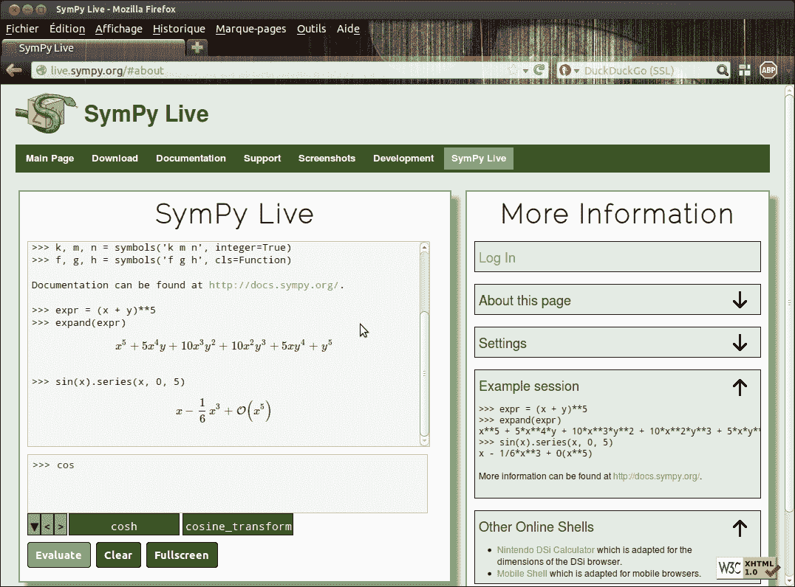

Live shell 与默认的 Python shell 类似，启用了自动补全功能，并基于 LaTeX 进行美观打印。在线应用的明显限制是：本地文件系统不可用，计算受到限制。

当涉及到最终产品的部署和分发时，SymPy 的宽松许可不对其再利用施加任何法律限制，并且作为一个纯 Python 库，它很容易安装到大多数环境中，因此可以轻松地使用它来允许最终用户进行数学感知脚本编写。

## 第 2 步 – 安装环境

SymPy 完全用 Python 编写，没有强制依赖项。因此，您只需要一个合适的 Python 解释器版本即可运行它。

然而，对于使用 SymPy 进行开发或交互式使用，强烈建议安装 NumPy、matplotlib，最重要的是 IPython。IPython 笔记本提供了一个高效的环境，用于交互式探索，并具备显示数学符号的能力。

在 Mac 和 Windows 设备上，最简单的方法是安装以下科学 Python 发行版之一：

+   **Python(x, y)** – [`code.google.com/p/pythonxy/`](http://code.google.com/p/pythonxy/)

+   **Enthought Python Distribution**（**EPD**）- [`www.enthought.com/products/epd.php`](http://www.enthought.com/products/epd.php)

+   **Anaconda CE** – [`www.continuum.io/downloads.html`](http://www.continuum.io/downloads.html)

Python(x, y) 针对 Windows 平台，是该平台上的最佳选择。EPD 仅对学术人员和学生在使用上免费。Anaconda CE 功能较少，但对所有人免费。所有这三个都提供了 SymPy 以及 Python 科学堆栈的核心组件；如果您安装了其中之一，就可以跳到第 4 步。

在 Linux 上，包管理器简化了具有依赖关系的包的安装。同样适用于希望比发行版路线提供更多系统控制的 Mac 用户（Homebrew 或 Macports）。具有相同要求的 Windows 用户将不得不依赖不同项目提供的二进制安装程序或掌握编译 Python 扩展的技艺。

最受支持的 Python 版本是 2.7，但 2.6、3.2、3.3 和 PyPy 也受到支持。此外，SymPy 还支持 Python 2.5，但 IPython 笔记本不支持。您可能已经有一个 Python 解释器，但如果它不是 2.7 版本，我们建议您使用包管理器安装它，或者访问[`www.python.org/download/`](http://www.python.org/download/)并选择适当的安装程序。

对于 IPython，我们需要版本 0.13 或更高版本。如果您可以使用包管理器安装，请注意，某些发行版将组件拆分为几个包。例如，在 Debian 和 Ubuntu 上，您应该使用以下命令：

```py
$ sudo apt-get install ipython-notebook
```

如果您的操作系统没有提供足够新的版本，请访问[`ipython.org`](http://ipython.org)，并按照安装说明进行操作。在 Ubuntu 上，您还可以使用位于[`launchpad.net/~jtaylor/+archive/ipython`](https://launchpad.net/~jtaylor/+archive/ipython)的**个人软件包存档**（**PPA**）。

对于 NumPy 和 matplotlib，没有严格的版本要求，因此您可能可以使用包管理器提供的任何版本。在 Debian 和 Ubuntu 上，您只需要使用以下命令：

```py
$ sudo apt-get install python-numpy python-matplotlib
```

如果您习惯于编译 C 和 C++扩展，从源代码安装库不会遇到特别的困难。只需定位并（如果需要）编译它们各自的依赖项，然后使用 pip 编译和安装库本身。如果您还没有 pip，请访问[`www.pip-installer.org/en/latest/installing.html`](http://www.pip-installer.org/en/latest/installing.html)并按照说明操作。然后，输入以下命令：

```py
$ [sudo] pip install numpy matplotlib ipython[zmq,notebook]
```

## 第 3 步 – 安装 SymPy

最简单的方法是使用 pip。在命令行中，只需输入以下命令即可：

```py
$ [sudo] pip install sympy
```

另一种可能性是下载源代码存档。访问[`code.google.com/p/sympy/downloads/list`](http://code.google.com/p/sympy/downloads/list)，并选择适合您 Python 版本的最新源代码发布版（其名称应类似于`sympy-0.7.2.tar.gz`，或者如果您使用 Python 3.*，则为`sympy-0.7.2-py3.2.tar.gz`）。解压存档，在新创建的文件夹中打开控制台，并输入以下命令（如果需要，将`python`替换为`python3`）：

```py
$ python setup.py install
```

SymPy 现在应该已经安装，您可以丢弃存档和文件夹。

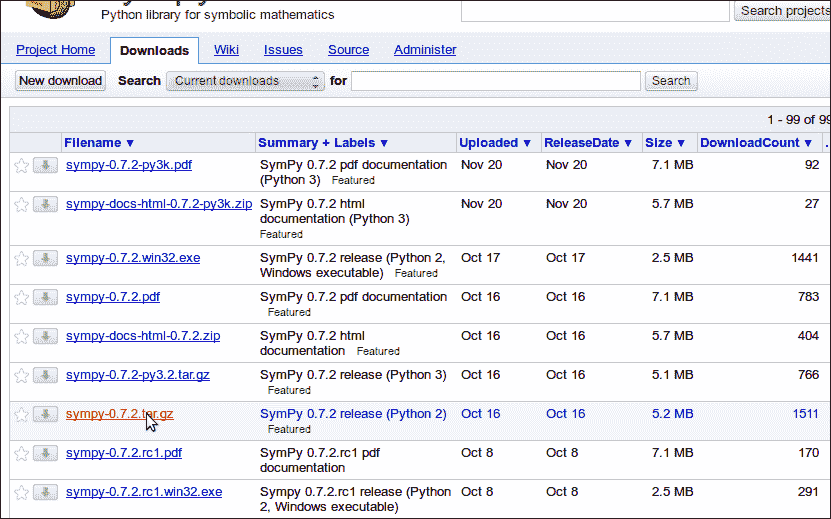

选择正确的存档进行下载

最后，在 Linux 上，另一个简单的替代方案是使用您发行版的包管理器。例如，对于 Debian 和 Ubuntu，使用以下命令：

```py
$ sudo apt-get install python-sympy
```

然而，您可能无法获得最新版本的 SymPy。

无论如何，为了检查 SymPy 是否已正确安装，进入 Python 命令行并输入 `import sympy`。它应该成功而不会产生任何输出（忽略与 matplotlib 相关的任何警告）。为了确保 SymPy 在您的系统上按预期工作，您还可以使用 `sympy.test()` 运行完整的测试套件（请注意，这需要相当长的时间）。

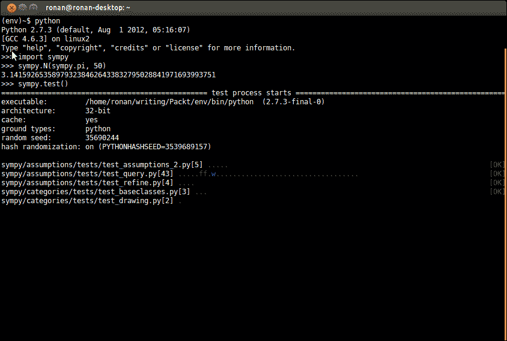

测试 SymPy 的新安装

## 第 4 步 – 配置笔记本

IPython 笔记本是一个分为前端和执行 Python 代码的内核的双进程应用程序。前端是一个在网页浏览器中运行的 JavaScript 应用程序（所有主流浏览器的最新版本都受支持，但 Internet Explorer 除外）。

笔记本是一个完美的探索性分析环境。它基于单元的概念，即多行文本输入框的直观和简约界面。它们可以包含文本——以结构化笔记本和添加解释，或者 Python 代码。代码单元作为单元执行，最后一行的结果以类似壳的方式显示。还有一个丰富且可扩展的以 `%` 开头的魔法命令系统，它允许在笔记本内执行几乎任何可想象的操作，从配置 IPython 到执行 shell 命令到嵌入其他语言。在 **帮助** 菜单中查找更多信息。

笔记本内置了对显示 matplotlib 图形的支持，并且我们建议您在处理 SymPy 时始终使用它（一个原因是 sympy-0.7.2、IPython 和 matplotlib 之间的三方交互存在一个怪癖，一旦导入 SymPy，后者就无法正确配置）。因此，要启动笔记本，请使用以下命令：

```py
$ ipython notebook –-pylab inline
```

这应该会在您的网页浏览器上打开 IPython 仪表板页面。创建一个新的笔记本。为了配置它以进行 SymPy 会话，请在第一个单元中输入以下内容并按 *Shift* + *Enter* 执行：

```py
%load_ext sympy.interactive.ipythonprinting
from sympy import *
x, y, z = symbols('x y z')
```

+   第一行设置使用 MathJax 的基于 LaTeX 的结果渲染。

+   第二个导入来自 `sympy` 命名空间的大量名称。这使得以自然的方式输入公式成为可能，但您应该意识到与 `numpy` 存在许多名称冲突。因此，当您计划在同一个笔记本中大量使用这两个库时，您最好使用类似于 `import sympy as sy` 的导入快捷方式技巧。

+   第三行是可选的，仅创建一些用于玩耍的数学变量。

现在，尝试输入一个公式，例如 `(exp(x)/factorial(y))**z`，并欣赏结果。您应该看到以下内容：

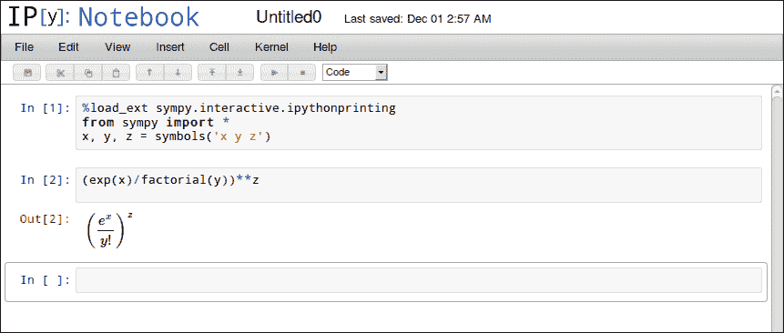

## 就是这样

到目前为止，您应该有一个可以充分利用 SymPy 的工作环境。我们鼓励您在笔记本中尝试并发现更多。

# 快速入门 – 自动绘制曲线

SymPy 的主要用途是自动化繁琐的数学过程，因此让我们看看一个这样的例子。曲线绘制是入门微积分课程中的基本内容，学生需要通过代数运算、极限和导数来找出函数曲线的显著特征。在本节中，你将学习如何使用 SymPy 自动执行它。

这个任务有很多变体。为了简单起见，我们将它简化为其基本要素：识别曲线的局部极值和渐近线，并在函数的图像上突出显示它们。我们还将限制自己使用有理分数，即等于多项式比率的函数。

我们将在 IPython 笔记本中独家工作，利用其高级数学渲染和内联绘图功能。我们的目标将是编写一个函数，该函数接受一个字符串（使用 Python 语法表示数学函数），并创建一个类似于以下图示的图形：

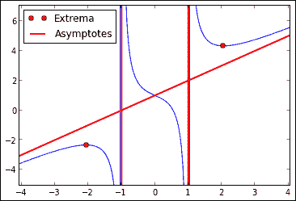

## 第 1 步 – 处理输入

让我们选择`string = '1/(x-1) + 1/(x+1) + x + 1'`作为引导我们的例子。`sympify()`函数可以将字符串转换为表达式。然而，这个表达式需要进一步转换。一个问题在于 SymPy 默认在复数域中进行计算，但在这里我们只对实数感兴趣。我们还需要确保表达式明确地以有理分数的形式存在。

因此，我们的第一个任务是创建一个处理所有这些操作的功能。多亏了笔记本界面，你可以逐步构建它，首先通过创建一系列操作示例字符串的语句，然后将这些操作序列转换为`convert_input(string)`函数，该函数适用于所有有效的输入字符串。以下是如何展示这些步骤的：

1.  创建一个新的笔记本。

1.  在第一个单元格中，添加`%load_ext sympy.interactive.ipythonprinting`和`from sympy import *`（参考“快速入门”部分的“步骤 4 – 配置笔记本”），然后按*Shift* + *Enter*执行。

1.  在下一个单元格中，键入`string = '1/(x-1) + 1/(x+1) + x + 1'`。

1.  仍然在第二个单元格中，添加行：`expr = sympify(string)`并执行它。这会将`string`转换为 SymPy 表达式。

1.  通过在第三个单元格中执行`expr`来检查你的结果。

1.  在第二个单元格中，找到`expr`使用`sym, = expr.free_symbols`（如果没有符号或符号多于一个，这将失败）所使用的符号。再次执行单元格并检查你的结果。

1.  使用`x = Symbol(sym.name, real=True)`创建具有相同名称的实数符号。

1.  使用`expr = expr.subs(sym, x)`将表达式中的`sym`替换为`x`，并检查你的结果。

1.  将表达式转换为有理分数。为此，你需要`together()`函数，它将表达式组合成一个单独的分数，以及`cancel()`函数，它简化分数。

1.  最后，创建 `convert_input(string)` 函数：在单元格的第二行之前插入 `def convert_input(string):`，在末尾添加 `return frac, x`，并且为了清晰起见，将第一行（`string` 的定义）移到其他地方。

现在你可以对你的函数在 `string` 和其他输入上进行测试。在接下来的章节中，我们将假设 `frac, x = convert_input('1/(x-1) + 1/(x+1) + x + 1')` 已经运行。此时，你的笔记本应该包含以下内容：

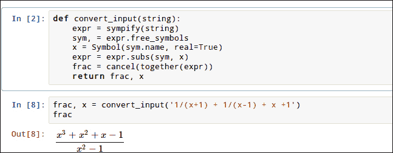

## 第 2 步 – 查找定义域

函数的定义域是使表达式有定义的 *x* 的值的集合。在有理分数的情况下，这些是分母不为零的值。因此，计算定义域只是找到分母的（实数）根并计算根的补集的问题。你可以这样做（在每条指令之后继续检查结果）：

1.  使用 `den = denom(x)` 提取分数的分母。

1.  使用 `poles = solve(den, x)` 查找分母的零点。由于 `x` 被声明为实数，此 `solve()` 调用找到 `den` 为零的 `x` 的实数值。

1.  获取定义域。整个实数线是 `Interval(-oo, oo)`，而零点的列表可以通过调用 `FiniteSet.fromiter(poles)` 转换为符号集合。

这里是与这一步骤对应的笔记本单元格：

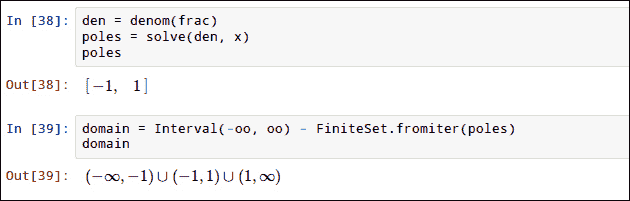

## 第 3 步 – 查找局部极值

为了找到局部极值，我们需要计算函数的导数。导数的零点给出临界点，换句话说，曲线具有水平切线的点。函数的局部极值实际上是导数改变符号的零点，但为了简单起见，我们将忽略这个细节，并假设，正如通常情况，每个零点都是一个极值。

因此，你应该使用以下步骤：

1.  通过调用 `diff(frac, x)` 计算导数。

1.  对上一个结果应用 `cancel()` 函数以简化导数。这两个步骤可以使用以下代码合并：`deriv = cancel(diff(frac, x))`。

1.  使用以下代码查找零点：`extrema = solve(deriv, x)`。

1.  在每个极值处获取函数的值。为此，使用 `frac.subs(x, x0)` 将 `x` 替换为每个极值的 `x0` 位置。

应用这些指令应该给出以下结果：

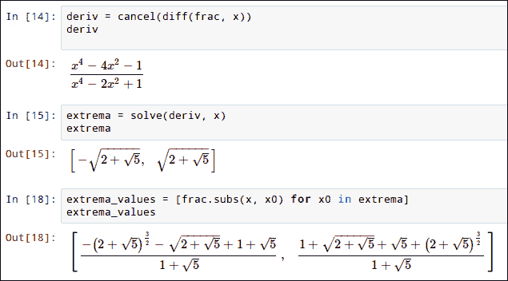

## 第 4 步 – 计算渐近线

我们现在将找到曲线的渐近线。实际上，我们已经知道垂直渐近线；它们只是每个极点*x0*的*x = x0*直线。对于有理函数，唯一可能的另一个渐近线可以通过研究当*x*趋于无穷大时函数的行为来找到。如果我们有*f(x) ≈ m x + p*，那么*y = m x + p*就是渐近线的方程。为了找到*m*和*p*，如果*m*不是无穷大，我们将*m*作为*f(x)/x*的极限，然后取*p*作为*f(x) – m x*的极限。

实际上，做起来比解释起来容易得多——只需遵循以下说明：

1.  使用`m = limit(y/x, x, oo)`计算*f(x)/x*的极限。

1.  要检查 m 不是无穷大，使用`m.is_bounded`

1.  使用`p = limit(y – m*x, x, oo)`计算 f(x) – m x 的极限。

1.  将其封装成一个函数`find_asymptote(expr, x)`，如果渐近线存在，则返回`(m, p)`，否则返回`None`。

此步骤的结果应如下所示：

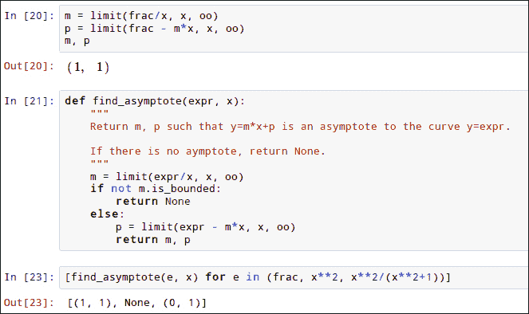

## 步骤 5 – 绘制曲线

要创建总结图，我们将直接使用 matplotlib。因此，让我们首先看看如何仅绘制曲线。由于在 SymPy 内部进行直接数值评估虽然精确，但相当慢，因此使用它生成曲线将是不高效的。幸运的是，很容易将符号表达式“编译”成一个利用 NumPy 快速向量化操作的 Python 函数。其余的只是标准的 matplotlib。按照以下说明操作：

1.  使用`import matplotlib.pyplot as plt`和`import numpy as np`导入 matplotlib 和 NumPy。

1.  使用`func = lambdify([x], frac)`编译函数。

1.  使用`np.linspace()`函数创建一个采样*x*-区间的 NumPy 数组。

1.  在数组上评估编译后的函数。

1.  使用`plt.plot()`绘制图形。

1.  使用`plt.xlim()`和`plt.ylim()`函数在*x*和*y*方向上设置边界框。

1.  将此过程封装成一个辅助函数，`plot_curve(expr, x, (x_min, x_max), (y_min, y_max))`。

对于此步骤，你应该得到以下结果：

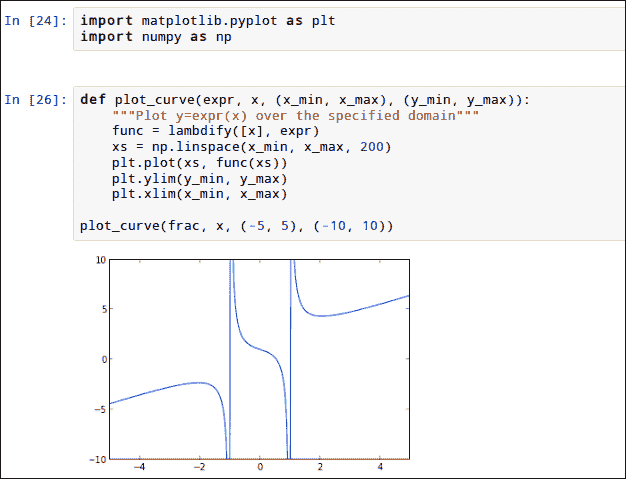

## 步骤 6 – 构建图形

为了制作最终的图形，我们需要选择一个绘图域，在函数的图形上叠加渐近线和临界点，并添加一个描述性标题。

选择一个既信息丰富又美观的域实际上是一种艺术。自动完成这个任务因此具有挑战性。我们将通过确保域包含所有有趣的 x 和 y 值，并在所有边上添加一个`2`的缓冲区来避免这个困难。在代码中，这意味着`x_min = min(xs) - 2`和`x_max = max(xs) + 2`。

这里是你应该使用的步骤：

1.  编写一个辅助函数 `choose_domain()`：它需要接受一个列表，将其元素转换为浮点数，并返回上述的 `x_min` 和 `x_max`。请注意，在符号 SymPy 对象上调用 `float()` 会自动使用数值算法将它们转换为普通的 Python 浮点数。

1.  找到 `x` 的界限，有趣的是原点、极点和极值。为此，你可以使用以下代码：

    ```py
    x_min, x_max = choose_domain([0] + poles + extrema)
    ```

1.  使用以下方法找到 `y` 的界限，使用原点、极值和斜渐近线的端点：

    ```py
    y_min, y_max = choose_domain([0] + extrema_values + [m*x_min + p, m*x_max + p])
    ```

1.  使用 `plot_curve(frac, x, (x_min, x_max), (y_min, y_max))` 绘制曲线。

1.  使用以下代码添加垂直渐近线：

    ```py
    plt.vlines(poles, y_min, y_max, 'r', linewidth=2)
    ```

1.  使用以下代码添加斜渐近线：

    ```py
    plt.plot([x_min, x_max], [m*x_min + p, m*x_max + p], 'r', linewidth=2)
    ```

1.  使用以下代码添加极值：

    ```py
    plt.plot(extrema, extrema_values, 'ro')
    ```

1.  最后，添加标题。SymPy 的 `latex()` 函数返回其参数的 LaTex 表示形式，matplotlib 可以渲染。这允许你使用数学符号在标题中，使用以下代码：

    ```py
    plt.title("Sketch of $%s \mapsto %s$" % (latex(x), latex(frac)))
    ```

这些步骤的最终结果如下所示：

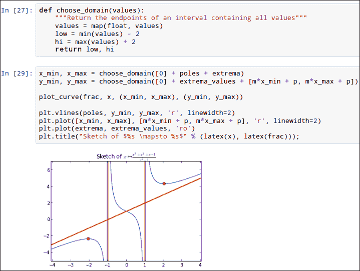

### 小贴士

**下载示例代码**

你可以从你购买的所有 Packt 书籍的账户中下载示例代码文件。[`www.packtpub.com`](http://www.packtpub.com)。如果你在其他地方购买了这本书，你可以访问 [`www.packtpub.com/support`](http://www.packtpub.com/support) 并注册以直接将文件通过电子邮件发送给你。

# 你需要了解的前五项功能

当你开始使用 SymPy 时，你会意识到你可以用它做很多事情，你需要理解许多概念。本节将教你关于 SymPy 中最基本的功能和最常见任务的所有内容。

## 创建表达式

数学表达式是 SymPy 中最重要的对象。几乎你能做的每一件事都涉及到在某个时刻使用表达式。在本节中，你将学习如何最好地创建 SymPy 可以操作数学表达式。

表达式的第一个构建块是数字。SymPy 使用它自己的类来表示它们，因为 Python 内置类型的行为了解数值评估，而不是符号计算。主要有两种数字：精确表达式和浮点数。后者由 `Float` 类表示。

精确表达式可能涉及许多不同的类别，如下所示：

+   `Integer` 表示任意大小的有符号整数。

+   `Rational` 表示有理数，或普通分数。内部实现为一个整数对。

+   常见的数学常数由单例类表示，并且可以直接在 `sympy` 命名空间中访问。因此，`pi` 是单位圆的直径，`E` 是自然对数的底数，而 `I` 是虚数单位。请注意，没有与复数对应的单独类型。相反，它们以通常用笔和纸书写的方式表示，例如，`2 + 3*I` 表示 2 + 3i。

`Integer` 对象的行为大多类似于 Python 的内置 `int`。最重要的例外是整数之间的除法是精确的，并返回一个 `Integer` 或 `Rational` 对象。以下是一些算术操作的示例：

```py
>>> Integer(3) + Integer(4)
7
>>> Integer(3) - Integer(4)
-1
>>> Integer(3) * Integer(4)
12
>>> Integer(4) / Integer(3)  # returns a Rational
4/3
>>> Integer(6) / Integer(3)  # returns an Integer
2
>>> Integer(3) ** Integer(4)
81
>>> Integer(4) // Integer(3)
1
>>> Integer(12) % Integer(5)
2
```

### 注意

当你将一个数字输入到解释器中，例如 "3"，它创建了一个 Python 内置对象，其类为 `int`。要将它转换为 SymPy 对象，你需要使用 `sympify()` 函数，或者更方便的快捷方式 `S()`。因此，你可以使用 `S(23)` 来创建一个整数。然而，所有在 SymPy 对象和 Python 数字之间的操作都将数字转换为 SymPy 对象，所有常见函数对其参数也做同样的处理。这大大减少了使用 `S()` 的需求。在实践中，要记住的规则是，只有在除以两个整数时才必须使用 `S()`，例如 `S(1)/2`。

可用一些额外的操作，例如使用 `factorint()` 进行素数分解，使用 `lcm()` 查找最小公倍数，或使用 `gcd()` 查找最大公约数。

```py
>>> factorint(42)
{2: 1, 3: 1, 7: 1}
>>> lcm(15, 20)
60
>>> gcd(15, 20)
5
```

有理数也支持所有算术操作。结果分数总是化简到最简形式。此外，将一个数提升到分数次幂会产生代数的 *n* 次根。有一些便利性使此类计算更容易：`sqrt(n)` 是 `n**(S(1)/2)` 的快捷方式，而 `root(n, a)` 是 `n**(1/a)` 的快捷方式。

因此，使用 SymPy 进行涉及分数和平方根的计算与仅使用整数进行的基本算术一样简单。以下是遵循的步骤：

1.  创建相关数字，必要时使用 `S()`。

1.  以明显的方式写出计算。

例如，以下命令找到边长为半和三分之二的直角三角形的斜边：

```py
>>> # Decomposing for clarity
>>> a = S(1)/2
>>> b = S(2)/3
>>> sqrt(a**2 + b**2)
5/6
>>> # In a real setting, you would probably rather use a one-liner
>>> # But mind the parentheses!
>>> sqrt((S(1)/2)**2 + (S(2)/3)**2)
5/6
```

负数和复数的根是支持的，但请注意，第 *n* 次根始终定义为该数的正则 *n* 次根。这意味着特别是负数的立方根是一个具有正实部和虚部的复数。此外，这些根通常使用 -1 的分数次幂来表示，如下面的示例所示：

```py
>>> root(-25, 4)
(-1)**(1/4)*sqrt(5)
>>> root(-1, 3) != -1
True
```

### 符号

我们刚刚看到了如何使用数字进行计算，但数学的真正力量来自于使用代数变量。为此，你需要使用 `Symbol` 对象。要创建它们，你必须指定它们的名称，并且你可以选择指定关于变量的各种“假设”。可用的假设包括“整数”、“实数”、“正数”等。如果没有指定，`Symbol` 对象被视为复数变量。属性之间的含义会自动考虑，不可能的组合会导致错误。以下是一些 `Symbol` 声明的示例：

```py
>>> z = Symbol('z') # complex variable
>>> x = Symbol('x', real=True) # real variable
>>> a = Symbol('a', positive=True) # positive and therefore real
```

`symbols()` 函数使得一次性创建多个符号变得更加容易。你给出的关键字参数会被传递给 `Symbol()` 构造函数。对于第一个参数，它接受一个受 Python `slice` 语法启发的迷你语言，以下是一个示例：

```py
>>> symbols('x, y, z')
(x, y, z)
>>> symbols('a:c, i:k')
(a, b, c, i, j, k)
>>> symbols('x:5')
(x0, x1, x2, x3, x4)
>>> symbols('x3:12')
(x3, x4, x5, x6, x7, x8, x9, x10, x11)
```

### 备注

你可能会在互联网上（包括 SymPy 的官方文档）找到一些关于 `sympy.abc` 模块或 `var` 函数的引用。它们唯一的目的就是节省一点输入，同时使用隐式魔法来实现。我们建议你只使用 `Symbol()` 或 `symbols()` 以及显式赋值来创建 `Symbol` 对象。

在 IPython 笔记本中，包含希腊字母、下划线和/或数字的符号名称会得到特殊的渲染，如下面的截图所示：

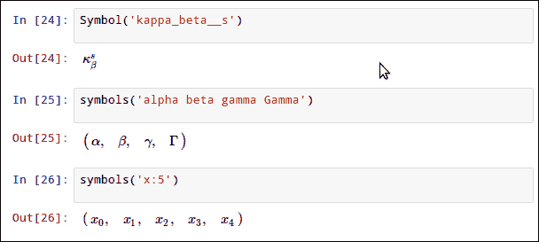

对于文本的其余部分，我们将假设以下定义是有效的：

```py
>>> x, y = symbols('x, y', real=True)
>>> a, b = symbols('a, b', positive=True)
>>> z = symbols('z')
```

所有对数字进行操作的算术运算符和数学函数也可以对符号进行操作。结果是新的符号表达式。非常简单的计算，如 `x + x`，会自动执行，但更复杂的表达式，如 `(x + 1) * (x - 1)`，则不会简化，正如你所看到的：

```py
>>> x + 2*y + x - 3*y
2*x - y
>>> (x + 1)*(x - 1)
(x - 1)*(x + 1)
```

值得强调的是，从 Python 解释器的角度来看，SymPy 符号只是普通对象。即使是经验丰富的 SymPy 用户有时也会被 Python 变量和数学变量之间的语义相似性所困扰。为了避免在这方面产生混淆，让我们分析以下一系列语句：

```py
>>> t = Symbol('t')
>>> expr = t + 1
>>> t = 1
>>> expr
t + 1
```

在第一行，使用 `t` 作为其名称属性值的 `Symbol` 对象被创建。此对象立即绑定到名为 `t` 的 Python 变量。在第二行，对象 `(1 + Symbol('t'))` 被绑定到变量 `expr`。在第三行，变量 `t` 重新绑定到对象 `1`。这种新的绑定方式不会以任何方式影响第一、二行中创建的对象，正如第四行所展示的。

### 备注

当一个 `Symbol` 对象绑定到具有相同名称的变量时（例如，使用语句 `x = Symbol('x')`）会产生混淆。为了完全避免这种情况，考虑为变量和 `Symbol` 对象使用不同的名称，即 `symb = Symbol('x')`。

### 函数

SymPy 实现了大量的数学函数。它们的名称往往遵循程序员的命名约定，例如，“atanh”用于双曲正切，“log”用于自然对数，或“sqrt”用于平方根。

将函数应用于精确数字表达式始终会产生另一个精确表达式。这个结果通常是一个未评估的表达式，如 sin(1)，除非存在简单结果，如 sin(0) = 0，在这种情况下，它会被返回。评估结果有时可能涉及浮点计算，这些计算会自动以足够的精度执行。

以下是一个使用数学函数的基本示例：

```py
>>> cos(log(2))
cos(log(2))
```

也可以创建抽象的符号函数；这种语法的格式是`Function('f')`。这些函数的行为类似于内置函数，但它们的值始终保持未评估状态，如下例所示：

```py
>>> f = Function('f')
>>> f(0)
f(0)
```

由表达式如 g(x) = 1 – x²定义的数学函数由 Lambda 对象表示。这个类的名称和它使用的语法反映了 Python 的`Lambda`关键字。调用这些对象会根据给定的表达式评估函数。以下是一个演示创建和使用`Lambda`对象的示例：

```py
>>> g = Lambda([x], 1 - x**2)
>>> g
Lambda(_x, -_x**2 + 1)
>>> g(2)
-3
```

注意，`Lambda`对象实际上很少真正有用。研究先前定义的函数`g`的惯用方法是定义`expr = 1 - x**2`并操作该表达式。

## 操作表达式

一旦创建了表达式，你通常需要以某种方式对其进行转换。本节将教你如何检查它们，并以多种方式转换它们。

### 表达式的结构

从结构上来说，SymPy 对象如整数、有理数、常量和符号被称为**原子**。所有表达式都是建立在这些更简单的对象之上的。它们遵循以下不变性：`expr == expr.__class__(*expr.args)`，这意味着它们的全部属性仅从它们的类型和`.args`属性的内容中派生。此外，由于`expr.args`的元素本身也是 SymPy 对象，整个表达式实际上具有树状结构，其中 SymPy 类作为节点，原子作为叶子。

探索这个表达式树既容易又富有启发性。以下是一些你可以使用的选项：

+   `srepr()`函数打印表达式的一个低级表示。

+   要遍历整个表达式树，使用`preorder_traversal()`；它返回一个迭代器，以先序方式产生节点。也就是说，它首先产生根（完整表达式），然后是其第一个子节点，然后是第一个子节点的第一个子节点，依此类推。

+   直接通过`args`链钻入。

以下命令显示了探索表达式`exp(-x)*log(1-x)*2`的所有这些方式：

```py
>>> expr = exp(-x)*log(1-x)*2
>>> srepr(expr)
"Mul(Integer(2), Function('exp')(Mul(Integer(-1), Symbol('x'))), Function('log')(Add(Mul(Integer(-1), Symbol('x')), Integer(1))))"
>>> list(preorder_traversal(expr))
[2*exp(-x)*log(-x + 1), 2, exp(-x), -x, -1, x, log(-x + 1), -x + 1, 1, -x, -1, x]
>>> expr.__class__, expr.args
(, (2, exp(-x), log(-x + 1)))
>>> expr.args[1].__class__, expr.args[1].args
(exp, (-x,))
```

在这个例子中，你可以看到两个重要的类，`Add` 和 `Mul`，它们分别用于内部表示加法和乘法。特别注意的是，`1 - x` 实际上表示为 `Add(Mul(-1, x), 1)`，并且实际存储参数的顺序与它们输入的顺序没有关系。

你还可以使用 `.atoms()` 方法获得表达式内容的聚合视图。默认情况下，它返回包含在表达式中的原子对象的集合。也可以传递一个类型给它，以返回表达式树中出现的该类型的所有对象。以下是如何将其应用于前面示例中表达式的几种方法：

```py
>>> expr.atoms()
set([1, 2, -1, x])
>>> expr.atoms(Integer)
set([1, 2, -1])
```

如果你想检查表达式依赖于哪些变量，这种纯粹的结构查询提供的信息不足，因为一些对象，如 `Lambda`，在内部使用 `Symbol` 作为绑定变量：在 `Lambda([x], x*2)` 中，符号的身份并不重要，并且对于任何实际目的，这个对象与 `Lambda([y], y**2)` 是相同的。在这种情况下，你需要的是 `free_symbols` 属性，它只返回作为自由变量的符号。因此，检查某个表达式是否明确依赖于 `x` 的正确方式是 `x in expr.free_symbols`，如下面的示例所示：

```py
>>> Lambda([x, y], x + y).free_symbols
set([])
>>> Lambda([x, y], a*x + b*y).free_symbols
set([b, a])
```

想象一下，对表达式进行的每一个操作都可以通过遍历表达式树并检查其元素（正如我们刚才所看到的）来直接构造结果。实际上，SymPy 源代码中相当大的一部分就是这样做的。然而，对于普通用途来说，这太繁琐了，而且有更多更方便的方式来操作表达式，但在调试任何问题时，探索表达式树应该是你的第一反应。

### 查询属性

每个表达式都有属性，包括 `is_integer`、`is_real` 等。这些属性允许查询对象的数学属性，并对应于符号上的类似名称的假设。它们根据数学属性是否被证明为真、被证明为假或具有不确定的真值返回 `True`、`False` 或 `None`。

对于数字表达式，它们通常会返回一个确定的答案，即 `True` 或 `False`。另一方面，对于符号表达式，`None` 是一个常见且有意义的结果。例如，如果 `x = Symbol('x', real=True)`，那么 `x.is_positive` 必须返回 `None`，因为正数和负数都与 `x` 是实数的假设兼容。

以下命令演示了这些属性在数字和符号表达式上的计算：

```py
>>> (pi**2 - 9).is_positive
True
>>> (x**2 + 1).is_positive
True
>>> (x**2 - 1).is_positive is None
True
```

SymPy 在执行许多操作时会检查属性，并且可以根据它们返回不同的结果。例如，比较以下：

```py
>>> sqrt(z**2)  # recall that z is complex
sqrt(z**2)
>>> sqrt(x**2)  # x is real
Abs(x)
>>> sqrt(a**2)  # a is positive
a
```

### 代换

SymPy 对象和表达式是不可变的。转换它们实际上意味着创建一个新的对象，它在某些方面与初始对象不同。最直接的方法是使用 `.subs()` 方法。`expr.subs(old, new)` 返回一个新的表达式，其中 `expr` 中所有 `old` 的出现都被 `new` 替换。要同时替换多个不同的表达式，你也可以将它作为一个包含 `{old: new}` 对的字典的单个参数传递，如下面的例子所示：

```py
>>> x, y = symbols('x, y', real=True)
>>> (cos(x) * exp(y)).subs({x: pi, y: 2})
-exp(2)
```

代入也是评估函数在特定值时的最地道方式。以一个例子来说明，如果你想要计算 `f(2)`，其中函数 `f` 定义为 `f(x) = exp(x+1)/(x²-2)`，你应该这样做：

1.  创建对应于 `exp(x+1)/(x**2 - 2)` 函数的表达式。

1.  在表达式中将 `x` 代入 `2`。

对应的命令如下：

```py
>>> expr = exp(x+1)/(x**2-2)
>>> expr.subs(x, 2)
exp(3)/2
```

一个涉及代入的有用技巧是强制进行 SymPy 通常不会做的某些转换。例如，假设你想要在一个更大的表达式中将 `sqrt((z-1)**2)` 简化为 `z-1`，即使 `z` 是复数，你应该这样做：

1.  确定什么假设可以使转换成立。在这里，你需要使 `(z - 1).is_positive` 的值为真。

1.  找到一个代入，使得假设成立。在这里，将 `z` 替换为 `1 + a`，`a` 为正数，就可以做到这一点。

1.  进行代入：

    ```py
    expr.subs(z, 1 + a).
    ```

1.  可选地，对代入后的表达式进行更多操作（在这个例子中不需要）。

1.  代回初始符号。

对应的命令如下：

```py
>>> expr = sqrt((z-1)**2)/z
>>> tmp_expr = expr.subs(z, 1 + a)
>>> tmp_expr
a/(a + 1)
>>> expr = tmp_expr.subs(a, z-1)
>>> expr
(z - 1)/z
```

### 简化

当你有一个符号表达式时，一个常见的需求是将它转换成更短或更容易理解的形式。通常来说，处理 `1` 比处理 `cos(x)**2 + sin(x)**2` 更方便。这就是 `simplify()` 函数发挥作用的地方。

`simplify()` 应用一系列简化的启发式算法。它可以使用三角关系，应用对数和指数的性质，简化分数和平方根，等等。在这些操作中，它考虑了对象的性质，尤其是 `is_positive` 和 `is_real`，如下面的例子所示：

```py
>>> simplify(cos(x)**2 + sin(x)**2
1
>>> simplify(cos(log(a**2))*tan(log(a**2)))
sin(2*log(a))
```

注意，一般来说，简化不是一个定义良好的概念，被认为是最简单的表达式取决于它随后的使用方式。`simplify()` 是交互式探索或当你对表达式了解不多时的一个好选择。然而，SymPy 有大量专门化的简化函数，所以当你知道表达式的结构和你需要的转换类型时，使用这些函数会更好。

这里列出了最有用的几个（`sympy.simplify` 模块中还有更多）：

+   `radsimp()`: 这将简化包含平方根的表达式

+   `trigsimp()`: 这将简化三角函数的组合

+   `cancel()`: 这将清除分数的分子和分母之间的公因数

+   `together()`: 这个函数将分数的加和放在相同的分母上

+   `apart()`: 这个函数应用部分分式分解

以下命令展示了它们的使用方法：

```py
>>> radsimp(1/(sqrt(5) – 2))
2 + sqrt(5)
>>> trigsimp(sin(x)**2 + cos(x)**2)
1
>>> cancel((x**2 - 1)/(x - 1))
x + 1
>>> together(1/(x-1) - 1/(x+1))
2/((x - 1)*(x + 1))
>>> apart(2/(x**2 - 1))
-1/(x + 1) + 1/(x - 1)
```

另一类变换是由 `expand` 函数族提供的。它们通过简化表达式结构或用更基本的对象替换“高级”对象来修改表达式。它们的结果通常比输入长（有时非常长）。`expand()` 本身通过一组复杂的关键字标志将所有 `expand_*()` 函数包含在内（详细信息请参阅其文档字符串）。

与 `simplify()` 类似，`expand()` 也是一个一站式商店，但当你能使用专门的变体时，你应该使用它们。以下是一些示例，展示了这些变体的使用：

```py
>>> expand_power_base((a*b)**3)
a**3*b**3
>>> expand_power_exp(2**(a+b))
2**a*2**b
>>> expand_log(log(a*b**2))
log(a) + 2*log(b)
>>> expand_complex((-1)**(S(1)/3))
1/2 + sqrt(3)*I/2
>>> expand_trig(cos(a+b))
-sin(a)*sin(b) + cos(a)*cos(b)
```

### 检查数学上的相等性

使用 `==` 比较两个表达式检查它们是否在结构上相同，这是数学相等的充分但不必要条件。请注意，只有打印相同的表达式才能被认为是相等的：

```py
>>> x + x == 2*x
True
>>> x*(x+1) == x**2 + x
False
```

要检查两个表达式在数学上是否相等，你需要检查它们的差是否简化为零。为此，对差值应用一个规范化函数，并测试它是否等于零。`simplify()` 通常是一个有用的选择，但 `expand()` 也可以使用：

```py
>>> simplify(x*(x+1) - (x**2 + x)) == 0
True
>>> simplify(1/cos(x)**2 - (1 + tan(x)**2)) == 0
True
```

## 数值评估

在本节中，你将学习从符号计算中获得数值结果的所有最佳方法。

### 浮点数

为了表示浮点数，SymPy 使用 `Float` 类。与内置的 `float` 和 `sympy.Float` 之间的主要区别在于后者使用任意精度。这意味着你可以用它来获取你想要的任意多位数的精度。

浮点数是近似值。符号计算在所有涉及的对象都已知精确时效果最佳。因此，你应该避免在表达式中出现 `Float` 对象。相反，使用 `Rational` 和其他符号对象进行计算，并将最终结果转换为数值值。这是通过 `N()` 函数完成的。它接受一个可选的第二个参数 `'n'`，指定结果的小数位数精度。默认情况下，结果有 15 位精度，这大约是 Python `float` 可以编码的精度。然而，使用 `N()` 与浮点运算之间的主要区别是，如果需要，`N()` 可以在更高的精度下执行中间计算。以下示例说明了这一点：

```py
>>> N(exp(pi*sqrt(163)))
2.62537412640769e+17
>>> N(exp(pi*sqrt(163)), 50)
262537412640768743.99999999999925007259719818568888
>>> q = exp(pi*sqrt(163))
>>> N(ceiling(q) - q)
7.49927402801814e-13
```

在最后一行，注意结果的确切度。这只能通过在内部使用更高的精度才能获得。这表明尽可能进行精确计算的重要性。实际上，如果 `q` 被转换为双精度浮点数（具有约 15 位精度），将无法扩展精度以恢复有意义的结果。

你可以在以下代码中看到，过早地将 `Float` 转换为错误甚至荒谬的结果：

```py
>>> r = N(exp(pi*sqrt(163)))
>>> ceiling(r) - r
-6.00000000000000
```

要从符号计算中获得数值结果，最好使用 `N()` 的 `subs` 选项，它接受一个替换字典。以下是逐步过程：

1.  创建一个符号表达式。

1.  进行符号计算。

1.  使用 `N()` 并带有 `subs` 选项来评估结果。

例如，以下命令计算 `f` 在 x=1.2345 处的导数，其中 `f(x) = exp(x)/(x+1)`：

```py
>>> expr = exp(x)/(x+1)
>>> deriv = diff(expr, x)
>>> N(deriv, subs={x: 1.2345})
0.849702535502635
```

### 编译表达式

SymPy 的浮点计算功能是用纯 Python 实现的，其主要目标是精度，而不是速度。因此，对于许多需要双精度但计算量大的应用（如绘图或数值积分），它们太慢了。

解决这个问题的方法是，将使用 SymPy 获得的符号表达式转换为数值评估的更有效形式。更具体地说，这种形式通常是一个使用 `numpy` 的函数。要获得它，你可以使用 `lambdify()`。其接口是 `lambdify(args, expr)`，其中 `expr` 是你希望转换的表达式，而 `args` 是对应于结果 Python 可调用参数的符号列表，因此，例如，`lambdify([x, y, z], x+y)` 实际上等同于 `lambda x, y, z: x+y`。

以下是你应该遵循的步骤，以高效地评估大量参数值的表达式：

1.  创建符号表达式。它通常是某些符号计算的结果，但在这个例子中，我们将使用 `a + x**2`。

1.  识别表达式中出现的所有符号。这一步通常是微不足道的（在这里，符号显然是 `x` 和 `a`），但仍然至关重要：如果你不小心遗漏了一个符号，"编译"后的函数实际上会返回一个符号表达式并且运行缓慢。

1.  使用 `lambdify()` 编译表达式。在这个例子中，你应该使用 `lambdify([x, a], a + x**2, "numpy")`（我们将在以下解释中解释第三个参数的含义）。

1.  创建包含参数值的 NumPy 数组。

1.  评估编译后的函数。

对应的命令如下：

```py
>>> f = lambdify([x, a], a + x**2, "numpy")
>>> arr = np.random.randn(1000)
>>> result = f(arr, 0.4)
>>> result[:3]
array([ 0.75059394,  4.68686571,  1.70330863])
```

默认情况下，`lambdify()` 将 SymPy 函数转换为标准库中的 `math` 模块、`numpy` 或 `mpmath` 的等效函数，按照优先级递减。为了获得快速的数值评估，最佳选择是仅使用 NumPy 函数。为此，将字符串 `"numpy"` 作为 `lambdify` 的第三个参数传递。

你也可以通过传递适当的对象作为第三个参数，让 `lambdify()` 使用你希望使用的任何函数。传递任何模块都会从中获取函数，但请注意，函数是通过名称匹配的，因此命名差异（例如，`sympy.atan` 与 `numpy.arctan`）可能会阻止某些函数被转换。你也可以直接传递一个将名称映射到函数的字典。

为 `math`、`numpy`、`mpmath` 和 `sympy` 模块提供正确等价的预置字典也是可用的。要使用它们，传递模块名称作为字符串。

最后，也可以通过将几个映射规范放入一个列表中来组合这些映射规范。例如，假设你已经创建了自己的正弦近似，并希望对于任何其他函数回退到 NumPy，你会使用以下方法：

```py
[{'sin': mysin}, "numpy"]
```

## 微积分

微积分可能是 SymPy 最重要的应用之一。在本节中，你将学习如何计算导数、积分、极限和级数。

### 导数

要计算一个函数的导数，创建相应的表达式并使用 `diff()`。它的第一个参数是表达式，第二个参数是你想要对其求导的变量。结果是导数的表达式：

```py
>>> diff(exp(x**2), x)
2*x*exp(x**2)
>>> diff(x**2 * y**2, y)
2*x**2*y
```

也可以通过一次调用 `diff()` 来计算高阶导数：

```py
>>> diff(x**3, x, x)
6*x
>>> diff(x**3, x, 2)
6*x
>>> diff(x**2 * y**2, x, 2, y, 2)
4
```

由于 SymPy 专注于表达式而不是函数，符号函数的导数可能会显得有些令人惊讶，但笔记本中的 LaTeX 渲染应该会使它们的意义变得清晰。

```py
>>> f = Function('f')
>>> diff(f(x**2), x)
2*x*Subs(Derivative(f(_xi_1), _xi_1), (_xi_1,), (x**2,))
```

让我们看看下面的截图：

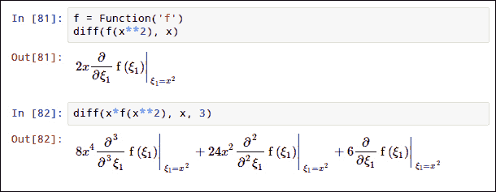

### 极限

极限是通过 `limit()` 获得的。当 `x` 走向某个值 `x0` 时，`expr` 的极限的语法是 `limit(expr, x, x0)`。要指定向无限大的极限，需要使用 SymPy 的无限对象，名为 `oo`。此对象也将返回无限大的极限：

```py
>>> limit(exp(-x), x, oo)
0
>>> limit(1/x**2, x, 0)
oo
```

还有一个第四个可选参数，用于指定极限目标的接近方向。`"+"`（默认值）表示从上方给出极限，而`"-"`表示从下方。显然，当极限目标是无限大时，此参数将被忽略：

```py
>>> limit(1/x, x, 0, "-")
-oo
>>> limit(1/x, x, 0, "+")
oo
```

让我们看看下面的截图：

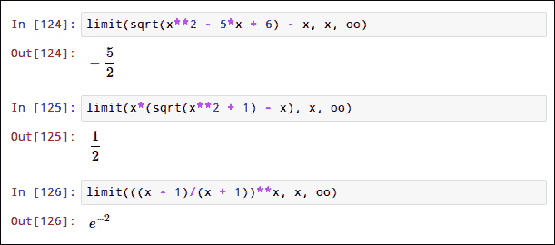

### 积分

SymPy 具有强大的积分算法，特别是可以找到大多数可以用特殊函数表示的对数和指数函数的积分，以及更多，这得益于 Meijer G 函数。

集成的主要函数是 `integrate()`。它可以计算反导数（不定积分）和定积分。请注意，反导数的值仅定义到任意常数，但结果不包括它。

```py
>>> integrate(sin(x), x)
-cos(x)
>>> integrate(sin(x), (x, 0, pi))
2
```

未评估的符号积分和反导数由 `Integral` 类表示。如果无法计算积分，`integrate()` 可能会返回这些对象。

也可以直接使用与 `integrate()` 相同的语法创建 `Integral` 对象。要评估它们，调用它们的 `.doit()` 方法：

```py
>>> integral = Integral(sin(x), (x, 0, pi))
>>> integral
Integral(sin(x), (x, 0, pi))
>>> integral.doit()
2
```

让我们看看下面的截图：

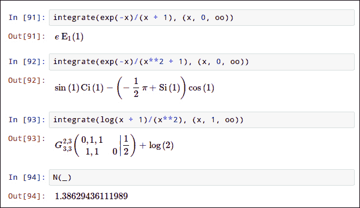

### 泰勒级数

泰勒级数近似是通过截断函数的泰勒级数得到的函数近似。要计算它，使用 `series(expr, x, x0, n)`，其中 `x` 是相关变量，`x0` 是展开的点（默认为 0），`n` 是展开的阶数（默认为 6）：

```py
>>> series(cos(x), x)
1 - x**2/2 + x**4/24 + O(x**6)
>>> series(cos(x), x, n=10)
1 - x**2/2 + x**4/24 - x**6/720 + x**8/40320 + O(x**10)
```

结果中的 `O(x**6)` 部分是一个 "大 O" 对象。直观上，它表示所有阶数等于或高于 6 的项。此对象会自动吸收或结合变量的幂，这使得对展开式进行简单算术运算变得方便：

```py
>>> O(x**2) + 2*x**3
O(x**2)
>>> O(x**2) * 2*x**3
O(x**5)
>>> expand(series(sin(x), x, n=6) * series(cos(x), x, n=4))
x - 2*x**3/3 + O(x**5)
>>> series(sin(x)*cos(x), x, n=5)
x - 2*x**3/3 + O(x**5)
```

如果你想将展开式用作函数的近似，`O()` 项会阻止它像普通表达式那样行为，因此你需要将其移除。你可以通过使用名为 `.removeO()` 的方法来完成此操作：

```py
>>> series(cos(x), x).removeO()
x**4/24 - x**2/2 + 1
```

泰勒级数在笔记本中看起来更好，如下面的截图所示：

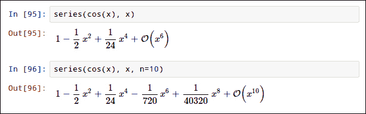

## 解方程

本节将教你如何解决 SymPy 处理的不同类型的方程。

用于解方程的主要函数是 `solve()`。它的接口相对复杂，因为它接受许多不同类型的输入，并且根据输入可以以各种形式输出结果。

在最简单的情况下，一元方程，使用 `solve(expr, x)` 语法来解方程 expr = 0 对于变量 `x`。如果你想解形式为 A = B 的方程，只需将其放在前面的形式下面，使用 `solve(A - B, x)`。这可以解决涉及有理分数、平方根、绝对值、指数、对数、三角函数等的代数方程和超越方程。结果是满足方程的变量的值列表。

以下命令展示了几个可以解决的方程示例：

```py
>>> solve(x**2 - 1, x)
[-1, 1]
>>> solve(x*exp(x) - 1, x)
[LambertW(1)]
>>> solve(abs(x**2-4) - 3, x)
[-1, 1, -sqrt(7), sqrt(7)]
```

注意，结果的形式意味着它只能返回有限解集。在真实解是无限的情况下，这可能会产生误导。当解是一个区间时，`solve()` 通常返回一个空列表。对于周期函数，通常只返回一个解：

```py
>>> solve(0, x) # all x are solutions
[]
>>> solve(x - abs(x), x) # all positive x are solutions
[]
>>> solve(sin(x), x) # all k*pi with k integer are solutions
[0]
```

解方程的域取决于变量的假设。因此，如果变量是一个实数 `Symbol` 对象，则只返回实数解，但如果它是复数，则返回复平面上的所有解（受上述返回无限解集的限制）。当解多项式时，这种差异很容易看出，如下例所示：

```py
>>> solve(x**2 + 1, x)
[]
>>> solve(z**2 + 1, z)
[-I, I]
```

表达式中出现的变量数量没有限制。解一个多元表达式的任意变量允许它以其他变量的函数形式表示，并从其他表达式中消除它。以下示例展示了以不同方式解同一个多元表达式的方法：

```py
>>> solve(x**2 - exp(a), x)
[-exp(a/2), exp(a/2)]
>>> solve(x**2 - exp(a), a)
[log(x**2)]
>>> solve(x**2 - exp(a), x, a)
[{x: -exp(a/2)}, {x: exp(a/2)}]
>>> solve(x**2 - exp(a), x, b)
[{x: -exp(a/2)}, {x: exp(a/2)}]
```

要解一个方程组，将表达式列表传递给 `solve()`：每个表达式都将像在单变量情况下一样被解释，作为形式为 expr = 0 的方程。结果可以以两种形式之一返回，具体取决于输入的数学结构：要么作为包含解变量值的元组列表，每个元组包含解时给出的变量顺序，要么作为单个字典，适合用于 `subs()`，将变量映射到它们的值。

如以下示例所示，预测结果的形式可能很难：

```py
>>> solve([exp(x**2) - y, y - 3], x, y)
[(-sqrt(log(3)), 3), (sqrt(log(3)), 3)]
>>> solve([x**2 - y, y - 3], x, y)
[(-sqrt(3), 3), (sqrt(3), 3)]
>>> solve([x - y, y - 3], x, y)
{y: 3, x: 3}
```

这种返回类型的可变性对于交互式使用来说很好，但对于库代码，需要更多的可预测性。在这种情况下，你应该使用 `dict=True` 选项。然后输出将始终是变量到值的映射的列表。将以下示例与上一个示例进行比较：

```py
>>> solve([x**2 - y, y - 3], x, y, dict=True)
[{y: 3, x: -sqrt(3)}, {y: 3, x: sqrt(3)}]
>>> solve([x - y, y - 3], x, y, dict=True)
[{y: 3, x: 3}]
```

# 你应该了解的人和地方

如果你需要 SymPy 的帮助，以下是一些人和地方，它们将非常有价值。

## 官方网站

+   主页：[`sympy.org/`](http://sympy.org/)

+   手册和文档：[`docs.sympy.org/`](http://docs.sympy.org/)

+   Wiki: [`wiki.sympy.org/`](http://wiki.sympy.org/)

+   博客：[`sympy.blogspot.com/`](http://sympy.blogspot.com/)

+   源代码：[`github.com/sympy/sympy`](https://github.com/sympy/sympy)

## 文章和教程

+   Jason Moore 在 [`www.moorepants.info/blog/npendulum.html`](http://www.moorepants.info/blog/npendulum.html) 上展示了由 SymPy 驱动的多体动力学令人印象深刻的演示。

+   在 SciPy 2011 上提供的 SymPy 教程：[`mattpap.github.com/scipy-2011-tutorial/html/index.html`](http://mattpap.github.com/scipy-2011-tutorial/html/index.html)

+   SymPy 的教程，直接来自官方文档：[`docs.sympy.org/0.7.2/tutorial.html`](http://docs.sympy.org/0.7.2/tutorial.html)

## 社区

+   官方邮件列表：`<sympy@googlegroups.com>`

+   邮件列表的 Web 界面：[`groups.google.com/forum/?fromgroups#!forum/sympy`](https://groups.google.com/forum/?fromgroups#!forum/sympy)

+   官方 IRC 频道：`#sympy on freenode`

+   用户常见问题解答：[`github.com/sympy/sympy/wiki/Faq`](https://github.com/sympy/sympy/wiki/Faq)

## 博客

+   整个社区的官方博客聚合器：[`planet.sympy.org/`](http://planet.sympy.org/)

+   SymPy 项目负责人 Aaron Meurer 的博客：[`asmeurersympy.wordpress.com/`](http://asmeurersympy.wordpress.com/)

+   Matthew Rocklin 在 SymPy 的统计和线性代数博客上写博：[`matthewrocklin.com/blog/`](http://matthewrocklin.com/blog/)

## Twitter

+   要获取更多开源信息，请关注 Packt 在 [`twitter.com/#!/packtopensource`](http://twitter.com/#!/packtopensource)
