导航标签栏界面

现在你已经成功安装了 ArcGIS Pro，是时候开始检查用户界面及其工作方式了。ArcGIS Pro 是 Esri 的第一个使用标签栏界面的桌面产品，这已成为许多当前桌面应用程序的常见做法，包括**Microsoft Office**、**Adobe Creative Suite**和**Autodesk**的**AutoCAD**。新的标签栏使得访问工具和功能比老版本的 ArcMap 和 ArcCatalog 应用程序使用的下拉菜单和工具栏界面更快、更方便。

在本章中，你将学习如何导航 ArcGIS Pro 使用的新标签栏界面。我们还将涵盖以下主题：

+   理解新的界面术语

+   使用界面

+   学习与 ArcGIS Pro 标签栏菜单相关的术语

+   学习如何在地图、场景和布局之间切换

+   学习如何自定义 ArcGIS Pro 界面

完成本章后，你将更加熟悉在 ArcGIS Pro 中工作，并对你将经常使用的许多工具的位置更加自信。

# 第四章：技术要求

要完成本章的练习，你需要以下内容：

+   ArcGIS Pro **基本**或更高许可

+   在你的计算机上安装 ArcGIS Pro 2.6 或更高版本

+   一个互联网连接

# 理解新的界面术语

任何在 GIS 领域工作过的人都知道，它有自己的语言。你会听到 GIS 用户使用诸如**拓扑**、**shapefiles**、**网络**、**地理数据库**、**要素类**等术语。随着你对**地理信息系统**（**GIS**）经验的增长，这种新语言将变得习以为常。你会发现自己在谈话中不经意间使用了这些词汇。虽然你可能完全理解自己在说什么，但非 GIS 用户可能不一定理解。因此，新的 ArcGIS Pro 标签栏界面将需要你扩展你的 GIS 词汇表。

在本节中，你将开始学习与标签栏相关的新词汇和术语。这将使你能够更轻松地在界面中导航并遵循练习中的说明。理解这些也将帮助你更好地与其他用户和 Esri 技术支持沟通，如果需要的话。

## ArcGIS Pro 界面术语

ArcGIS Pro 使用的新界面有一套全新的词汇和短语与之相关。为了成功使用、导航和理解这个界面，你需要确保你知道其中的一些是什么以及它们的含义。让我们在下面的表格中看看这个例子：

| **ArcGIS Pro 术语** | **定义** |
| --- | --- |
| 标签栏 | ArcGIS Pro 顶部的一块矩形菜单区域。标签栏分为标签页，包含与组相关的工具和功能。一些标签页是通用的，而其他标签页是上下文相关的，这意味着它们会根据正在执行的任务而变化。 |
| 选项卡 | 通过功能区访问的相关工具和功能的集合。类似于 **ArcMap** 中的工具栏，选项卡可以是核心的或上下文相关的。核心选项卡是那些始终位于功能区上的选项卡，例如 **项目** 和 **共享**。上下文选项卡将根据用户当前执行的任务而变化和出现。上下文选项卡的例子包括 **地图**、**布局**、**外观** 和 **标签**。 |
| 窗格 | 一个可停靠的窗口，允许用户访问信息或工具。类似于 **ArcMap** 中的可停靠窗口，例如 **目录**、**搜索**、**ArcToolbox** 和 **表格** 窗口。像这些窗口一样，窗格可以打开和关闭，固定在位置，或设置为自动隐藏。 |
| 组（在功能区选项卡上） | 位于选项卡内的相关工具的子集。选项卡上的组示例是 **图层**，它位于地图选项卡上，包含向地图添加多个工具的工具。 |
| 快速访问工具栏 | 常用工具和命令的快捷方式集合。快速访问工具栏通常位于 ArcGIS Pro 界面的左上角，尽管位置可以更改。这类似于 Windows 的任务栏。 |
| 视图 | 一个允许您查看数据和执行任务的窗口。视图可能是一个 2D 地图、一个 3D 场景或一个布局，或者您数据的其他可视化形式。这类似于 **ArcMap** 中的数据和布局视图。然而，在 ArcGIS Pro 中，您可以拥有多个视图，并且可以同时查看它们。 |

这些是在您开始使用 ArcGIS Pro 并浏览其界面时需要理解的一些关键术语。当您开始使用界面时，如果您使用了较旧的 ArcMap 应用程序，我相信您会发现它比 ArcMap 使用的界面更加直观，ArcMap 通过无数的工具栏和菜单隐藏了其许多功能。

## 介绍用户界面

现在您已经理解了与新界面相关的关键术语，是时候看看这些项在 ArcGIS Pro 中的实际位置了。您可能会问自己新的功能区界面如何使访问工具和功能更快。这个问题的答案是双重的：

+   首先，新的界面是智能的。它将向您展示与当前操作相关的工具和信息。例如，当在布局中工作时，会展示与创建和打印布局相关的工具。如果您通过在地图中选择一个图层来切换焦点，则会自动展示一系列新选项，允许您控制和配置各种图层属性，如符号化和标签。

+   其次，新的功能区界面类似于许多常用应用程序中的界面，如第一段中提到的。这大大降低了学习曲线，使用户在使用 ArcGIS Pro 时感到更加舒适。

在功能区中的这种自动行为被称为**上下文菜单**或**标签**。智能功能区会在你需要时提供工具。当你继续处理其他项目或任务时，功能区会自动相应地更新。

这不仅将所需的工具放在你的指尖，还消除了同时打开大量工具栏和窗口的需求，从而减少了屏幕杂乱并腾出屏幕空间供其他用途。

让我们快速浏览一下界面，看看这些组件和功能位于何处：

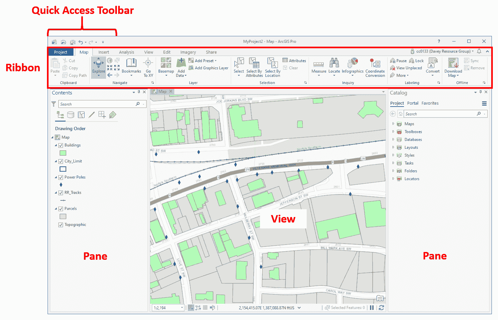

上述截图显示了 ArcGIS Pro 界面中几个关键组件的位置。从左上角开始，你会找到快速访问工具栏。它包含允许你打开现有项目、创建新项目、保存项目、撤销和重做的按钮。在其下方是功能区。这是你通过各种标签访问 ArcGIS Pro 功能的地方。在其下方你会找到不同的面板和视图。这些将根据你的项目内容和打开的内容而变化。当你第一次打开 ArcGIS Pro 时，你会在左侧看到内容面板，中间是主要视图，右侧是目录面板。

随着你阅读本书的进展，你会发现你可以根据你的工作流程和系统将各种视图和面板停靠或取消停靠，以提供极大的灵活性和更高的效率。

# 使用界面

现在你已经知道了几个关键组件的位置以及与界面相关的术语，是时候开始使用 ArcGIS Pro 界面了。你将首先使用功能区核心标签中的某些工具。然后，你将处理不同的视图和与之相关的上下文标签。最后，你将研究一些面板。

## 导航功能区

标签式界面并不新鲜。正如我们之前提到的，它们已成为包括**Microsoft Word**、**Excel**和**PowerPoint**在内的多数应用程序的常见选择，以及**AutoCAD**和**Photoshop**。因此，用户已经习惯了这些标签界面的外观和性能。然而，Esri 在 ArcGIS Pro 之前一直缓慢地在其桌面 GIS 应用程序中采用这种界面类型。

ArcGIS Pro 是 Esri 首个完全采用功能区界面的桌面应用程序。与它们较老的 ArcMap 和 ArcCatalog 应用程序中的旧式工具栏界面相比，这个新界面要用户友好得多。正如你将看到的，它是智能的。它会根据你的选择提供工具，并在应用程序中保持它们的活动状态。这意味着你不需要搜索就能找到你需要的功能。

现在，您将开始更全面地研究这个界面。我们将从功能区开始，功能区位于 ArcGIS Pro 的顶部，是一个矩形区域。它包括标签页、组和工具，如下面的截图所示：

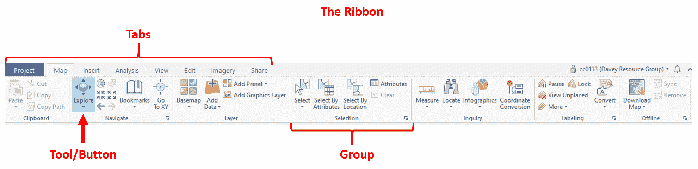

当您首次打开新项目时，您通常会在功能区看到项目、地图、插入、分析、视图、编辑和共享标签页。每个标签页都包含与标签名称相关的工具。例如，地图标签页包括在地图内导航、添加图层、选择要素和访问地图中要素信息的工具。

现在，让我们开始更详细地查看一些最常用的标签页和该标签页中的一些关键工具。您将在阅读本书的过程中查看其他标签页。您将从项目标签页开始。

### 项目标签页

项目标签页提供了管理项目和配置选项所需的功能。此标签页允许您创建新项目、打开现有项目、保存当前项目以及复制当前项目。您还可以从该标签页连接到不同的 ArcGIS Online 账户或门户。您可以看到许多这些设置，如下面的截图所示：

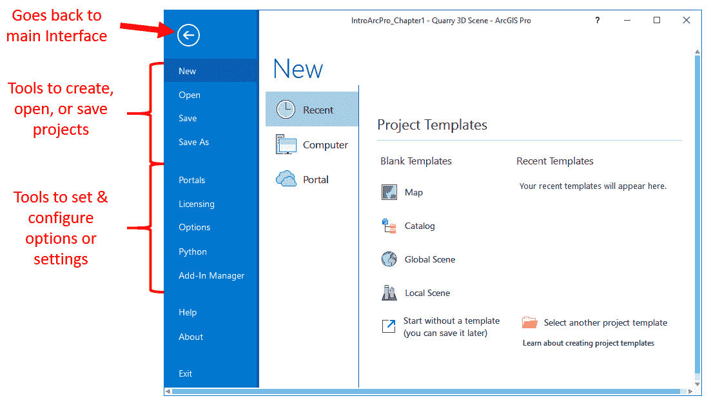

让我们更详细地看看这些标签页的功能：

+   **新建**：这将使用所选模板创建一个新项目。模板控制在新创建的项目中自动包含的内容。ArcGIS Pro 自带几个项目模板。这些是目录、地图、全球场景和本地场景。

+   **保存**：这保存您当前打开的项目。这将包括您对地图、图层属性和布局所做的任何更改。这不会保存您对地图中要素及其属性所做的编辑。

+   **另存为**：这将在您选择的位置创建当前项目文件的副本，并使用新名称。它不会创建原始项目中引用的数据库、文件夹、文件、表或其他项目项的副本。新保存的项目将引用与原始项目相同的地点。

+   **门户**：这允许您管理您连接到的门户。这可能包括 ArcGIS Online 或**ArcGIS 企业门户**的连接。**主门户**由 ArcGIS Pro 用于确定您是否有有效的许可证以及许可证级别以及您有权使用的扩展。其他门户可以用于访问数据、服务和基础地图，这些可以在 ArcGIS Pro 中用于创建地图和执行分析，从而补充您自己的标准数据集。

+   **许可证**：这允许您查看您被授予的 ArcGIS Pro 许可证级别和扩展。一旦您知道可用的许可证级别和扩展，您就可以确定您在 ArcGIS Pro 中能够执行哪些功能。

在您首次登录使用 ArcGIS Pro 后，如果您所在组织的管理员允许，您可以选择离线使用您的许可证。这将把许可证借出给您当前使用的计算机，并且不再需要您登录到 ArcGIS Online 或 ArcGIS Enterprise Portal 以使用 ArcGIS Pro。使用此选项时要小心。如果在离线使用许可证期间计算机丢失或出现故障，将没有简单的方法来恢复它。您需要联系 **Esri 支持**并让他们解决问题。

+   **选项**：这允许您设置各种 ArcGIS Pro 用户选项，让您能够自定义它。您可以为正在工作的特定项目设置不同的选项，例如单位，或者为应用程序的一般用途设置，例如为所有新地图或添加到项目中的场景设置默认底图。当您探索每个选项时，您可以点击窗口底部的 **了解更多关于链接**，获取有关该选项相关设置的更多信息。

+   **Python**：这允许您为脚本添加额外的 Python 模块，以扩展或自动化 ArcGIS Pro 的功能。

+   **插件管理器**：这允许您添加自定义扩展，您或其他人可能已创建以增强 ArcGIS Pro 的功能。这些插件必须使用 **.NET** 创建。

### 地图选项卡

标签栏上的地图选项卡提供了用于处理二维和三维地图的工具的访问权限。从此选项卡，您可以向地图添加新图层，选择要素，更改底图，等等。对于以前使用过较老 ArcMap 应用程序的用户，此选项卡结合了在 **标准** 和 **工具** 工具栏上找到的功能：

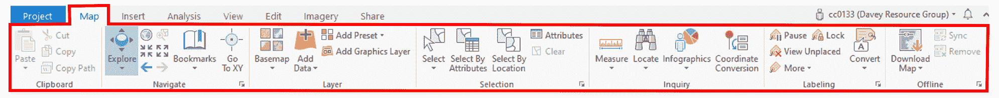

如前一个截图所示，地图选项卡包含七个组：

+   剪贴板

+   导航

+   图层

+   选择

+   查询

+   标注

+   离线

每个组都包含与组名称相关的工具。例如，选择组选项卡包括几个工具，允许您使用各种方法在地图中选择要素。您可以直接从地图中选择要素，或者基于特定的属性值，或者基于一个或多个图层中要素之间的空间关系。我们现在将更详细地查看一些最常用的工具。

#### 导航组

导航组包含允许您在地图内导航到位置的工具：

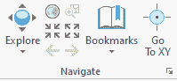

它包括允许您放大到区域以便查看更多细节或缩小以查看更大区域的工具。它还包括允许您返回地图中特定区域的工具。这些被称为 **书签**。让我们更详细地看看这些工具：

+   **探索**: 探索工具是一个多功能工具，允许你在地图内缩放和平移。它还允许你单击地图中的要素并检索与要素链接的属性。此工具将**放大**、**缩小**、**平移**和**识别**工具的功能结合到一个与使用**Google Maps**时鼠标操作非常相似的单一工具中。

你可以使用此工具通过鼠标在地图内进行导航。以下列表描述了用于在 ArcGIS Pro 界面中导航的各种鼠标按钮的功能：

+   **左键单击一个要素**: 打开识别弹出窗口，显示与要素链接的属性。

+   **左键或右键拖动**: 点击并按住鼠标左键，然后将指针向左或向右拖动，将地图视图在该方向上平移。

+   **移动滚轮**: 在地图上放大和缩小。将滚轮远离你时，地图会放大。将滚轮朝向你时，地图会缩小。

+   **右键单击并拖动**: 根据鼠标的移动，持续放大或缩小地图。

+   **单次右键单击**: 打开菜单。出现的菜单将取决于你右键单击的位置。

+   **按住滚轮并拖动（仅限 3D 地图/场景）**: 沿 3D 轴旋转和倾斜地图视图。

此工具与带有左右按钮之间滚轮的鼠标配合使用最佳。其他类型的指点设备也可以使用，但功能可能因硬件而异。一些与此工具相关的按钮可以在项目选项卡上的“选项”工具下进行更改。例如，你可以更改滚轮的缩放方向。

+   **书签**: 书签工具允许你将活动地图中的保存空间位置进行缩放。这允许你快速返回到重要位置，如项目区域、特殊事件地点、关键地块等。项目中的每个地图或场景都将有其自己的唯一书签集。

主要工具下方的下拉箭头将允许你访问与活动地图或场景一起保存的书签。它还提供了创建新书签和管理现有书签的工具。每个地图或场景可以拥有的书签数量没有限制。

我们现在将转到图层组。

#### 图层组

图层组包含用于向你的地图添加新图层或数据的工具：

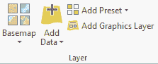

一些工具可以与二维和三维数据一起使用。其他工具则更适合其中一种。还有用于向地图添加非空间数据的工具。这些工具使用坐标值或地址来显示点的位置。再次，让我们探索这些工具：

+   **添加数据**: 此工具允许你向地图添加新的二维或三维图层。添加的图层可以引用各种类型的数据，并可以来自不同的位置。它还允许你添加表格数据。

如果您查看，您会注意到此工具图标下方有一个小箭头。单击箭头或文本将显示添加数据到地图或场景的方法列表。您可以选择的方法包括以下内容：

| **数据** | 此选项将空间或表格数据添加到地图中。它可以用来添加引用 shapefile、地理数据库要素类和 ArcGIS Server 网络服务的图层。可以从各种来源将独立表添加到地图中，以及**dBase**文件、`.csv`文件、数据库表和 Excel 电子表格。 |
| --- | --- |
| **从路径添加数据** | 此选项允许您使用服务的**统一资源定位符**（**URL**）、本地数据源的**通用命名约定**（**UNC**）或连接数据源的目录路径来添加数据。 |
| **X,Y 点数据** | 此选项允许您根据存储在独立表、`.csv`文件、文本文件或电子表格中的坐标向地图添加点。每个点还将与该记录或行相关联的附加属性或信息链接。 |
| **路线事件** | 此选项显示线性网络中兴趣点之间的路线位置。 |
| **查询图层** | 此选项根据结构化查询语言（**SQL**）的`select`语句从企业数据库创建查询图层。此选项不适用于文件地理数据库、shapefile 或 coverage。 |
| **地址图层** | 此选项使用指定的地址定位器对地址表进行地理编码，创建新的地理数据库要素类或 shapefile。 |
| **添加多维栅格图层** | 此选项允许您将**网络公共数据格式**（**NetCDF**）、**GRIdded Binary**（**GRIB**）或**分层数据格式**（**HDF**）栅格格式添加到您的地图或场景中。这些是多维栅格格式，通常与大气、海洋学或地球科学一起使用。 |
| **高程源** | 此选项允许您将高程表面添加到地图或场景中。这可以是**数字高程模型**（**DEM**）、**不规则三角网**（**TIN**）或网络地形服务，以及其他选项。高程源可能代表某个区域的地形高程或某些其他特定高程，例如允许的最大建筑高度。 |
| **提取位置** | 此选项允许您从文档中提取点位置。这些位置可能以 X 和 Y 坐标或地址的形式出现。这需要 ArcGIS Pro 的**LocateXT**扩展。 |

正如您所看到的，在 ArcGIS Pro 中向地图或场景添加数据有许多方法。您应该使用的方法将取决于您希望添加的数据类型。在您阅读本书的过程中，您将有机会使用上述几种方法。

+   **添加预设**：此工具用于将具有预定义符号设置集的新 3D 图层添加到场景中。预定义属性由定义的符号库中的画廊确定。ArcGIS Pro 提供了**真实树木**、**主题树木**、**真实建筑**、**地面**（**地形**）、**图标点**和**主题形状**的画廊。使用此工具添加图层可以更容易地在 3D 环境中可视化数据，特别是对于那些可能刚开始处理 3D 数据的人来说。

+   添加图形图层：这是一个在 ArcGIS Pro 2.6 中添加的新工具。它允许您向地图添加图形，如文本框、箭头或其他形状。这些图形与地图中的任何图层或要素都没有连接。

我们将接下来检查选择组。

#### 选择组

选择组包含用于选择数据的各种工具，包括选择、按属性选择、按位置选择和清除：

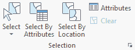

您应该使用的选择工具将取决于您想要完成什么任务以及您如何选择数据以完成任务。让我们来看看这些：

+   **选择**：选择工具允许您通过点击要素或绘制区域来从地图或场景中选择要素。工具底部的下拉箭头让您选择想要绘制的区域类型。您可以选择绘制矩形、多边形、自由手绘套索、圆形或线条，或者追踪地图中现有的要素。

+   **按属性选择**：按属性选择工具允许您根据指定的属性值选择要素。例如，您可能想选择所有由 Tripp Corbin 拥有的地块或所有由韧性铸铁制成的下水道管道。此工具将允许您做到这一点。

在工具窗口中，您将创建一个 SQL `where` 子句，它告诉应用程序您正在搜索哪些特定的值。如果您不知道如何编写 SQL 子句，请不要担心。ArcGIS Pro 会根据一系列简单的选择和输入提示构建查询。

+   **按位置选择**：此工具允许您根据空间关系在一个或多个图层中选择要素。例如，您可能需要选择所有位于您知道将要进行施工的道路 100 英尺范围内的地块，以便获取所有沿道路居住者的名单。或者，您可能需要选择所有与洪泛区相交或横穿的道路，以便在紧急疏散计划中不包括这些道路。

在 ArcGIS Pro 的早期版本中，按属性选择和按位置选择工具在地理处理面板中打开。在 ArcGIS Pro 2.6 中，这些工具现在在它们自己的浮动窗口中打开。接下来，我们将探索查询组。

#### 查询组

查询组包含一些工具，可以帮助您检索有关您地图的一些基本信息。您可以使用不同的单位来测量长度和面积，检索一些基本的统计数据，或者甚至使用该组中的工具找到感兴趣的点：

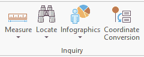

这些工具的详细信息如下：

+   **信息图表**：此工具允许您检索您在地图中选择的区域的基本人口统计数据。它将检索显示平均家庭收入或人口种族构成的信息和图表。

此工具访问 Esri 的地理丰富服务，通过您的 ArcGIS Online 登录连接。因此，此工具需要您有互联网连接，连接到 ArcGIS Online，并且有可用的 ArcGIS Online 信用额度才能工作。使用此工具将消耗 ArcGIS Online 信用额度，您在使用此工具时应始终牢记这一点。此工具的信用使用量很小 - 每次使用时仅约百分之一。

+   **测量**：此工具允许用户通过在地图内点击位置来测量长度和面积。如果您在 3D 场景中工作，您还可以选择测量垂直距离。

您可以更改此工具使用的单位，因此它们与分配给您的地图的单位不同。这样，即使您的地图是以米为单位，您也可以让测量工具提供以英尺、英里或公里为单位的距离。面积单位也可以设置。与 ArcMap 不同，当您的地图位于地理坐标系中时，您仍然可以测量面积。

+   **定位**：此工具允许您使用地址或常用名称定位地点。默认情况下，此工具使用来自 ArcGIS Online 的 **Esri 世界地理编码服务**。此服务要求您与 ArcGIS Online 保持活跃的连接才能工作。然而，与信息图表工具不同，它不使用信用额度。您可以将自己的地址定位器添加到项目中，然后它们将可用于此工具。**

***   坐标转换：这是 ArcGIS Pro 2.6 中添加的另一项新工具。它允许您将坐标从一个坐标系转换为另一个坐标系。目前，此工具要求输入坐标必须位于 WGS84 地理坐标系中。输出可以是 shapefile、地理数据库要素类、KMZ 或 CSV 文件**

**您现在已熟悉了 ArcGIS Pro 功能区中的 **地图** 选项卡上的工具。这些工具是您在应用程序中工作时最常使用的工具之一。我们现在将进入一个与使用地图选项卡相关的练习。

## 练习 2A – 使用地图选项卡

现在，您将有机会试用我们讨论过的一些工具。您将看到它们如何在 ArcGIS Pro 的功能区界面中工作，以及这些工具的一些相关选项。我们将从打开一个现有项目并使用**导航**工具开始。

## 步骤 1 – 打开项目

在这一步中，你将打开一个已经创建的项目。该项目包括一个包含几个图层用于虚构的 Trippville 市的 2D 地图：

1.  通过单击 Windows **开始**按钮并转到 ArcGIS 程序组，或通过单击任务栏或桌面上的快捷方式来启动 ArcGIS Pro。

记住，你需要确保你连接到互联网，以便验证你的许可证。ArcGIS Pro 应该会记住你在第一章“介绍 ArcGIS Pro”中的用户登录。如果不是，当被要求时登录到 ArcGIS Online。

1.  在 ArcGIS Pro 起始页面上，单击位于“最近项目”下方的“打开另一个项目”选项，如图所示：

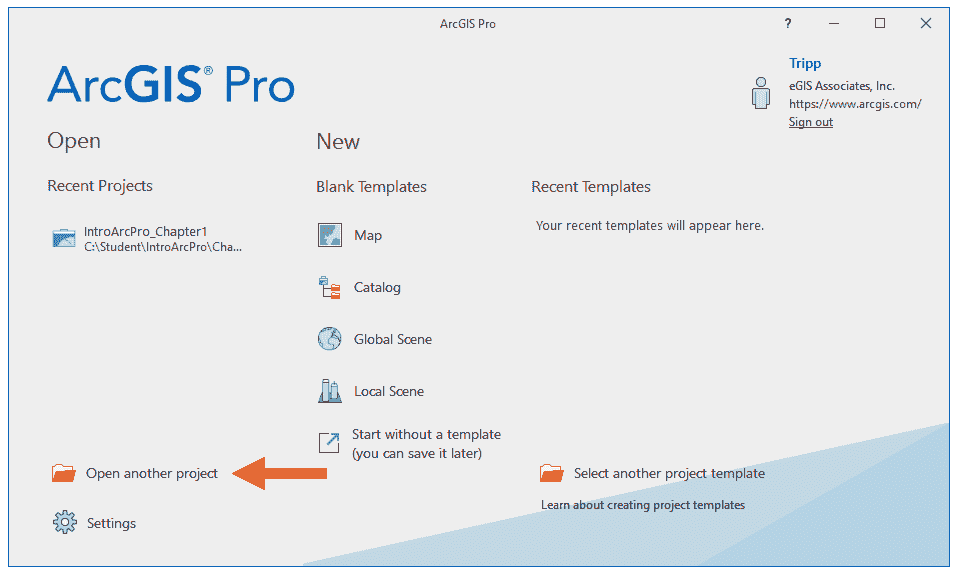

1.  在打开项目窗口的左侧面板中单击“计算机”。

1.  在右侧面板中，双击你的`C:`驱动器。

记住，如果你将练习数据安装到了默认位置之外的位置，你需要导航到那个驱动器和位置。这些步骤假设数据已经安装到了默认位置。

1.  导航到`C:\Student\IntroArcPro\Chapter2`或你安装练习数据的位置。

1.  选择`Ex 2A.aprx`文件，然后单击“确定”。

你选择的项目应在 ArcGIS Pro 中打开，并类似于以下截图：

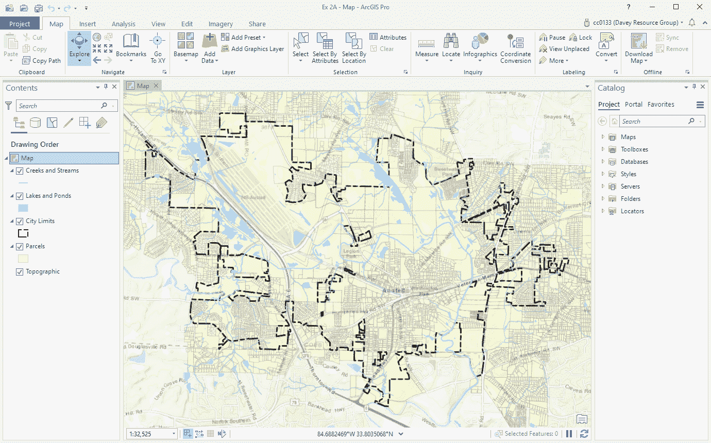

有几个因素可能会导致你的项目看起来不同。ArcGIS Pro 应用程序在你的显示器上的大小将影响其显示方式。你设置的计算机分辨率也会影响项目的显示方式。除此之外，你打开的窗格、窗口和自定义也会改变项目在你的屏幕上的外观。所以，如果你看到的项目与截图不完全一样，不要过于担心。它应该只是相似。

## 第 2 步 – 导航地图

在打开项目后，你现在将开始探索你看到的地图。你将使用位于功能区地图选项卡上的导航工具来缩放和访问数据：

1.  在功能区中激活**地图**选项卡。然后，在导航组中单击**书签**工具并选择华盛顿公园书签。这将自动将你缩放到华盛顿公园的位置。

1.  在地图选项卡上的导航组中单击**探索**工具，使其成为活动工具。

1.  左键单击华盛顿公园的包裹。继续按住鼠标按钮，并将鼠标拖动到地图视图的左下角，直到华盛顿公园位于左下角。现在，释放鼠标按钮。

你刚刚使用了探索工具来平移地图视图。正如你在本章前面所学到的，探索工具有很多用途。现在，你将探索这个工具的其他一些功能。

1.  在探索工具仍然激活的状态下，单击地图视图中任何包裹。

**问题**：*使用探索工具点击地块时会发生什么？*

1.  通过点击窗口右上角的小“X”来关闭出现的弹出窗口。

1.  点击探索工具下方的小下拉箭头并选择“可见图层”，如下面的截图所示：

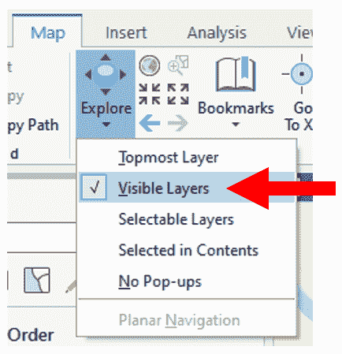

1.  点击与步骤 4 中相同的地块。

1.  看看信息弹出窗口的底部。您应该在左下角看到 1/2。在窗口的上方面板中，您也应该看到两个项目列出。如果没有，这意味着窗口太小，无法一次性显示所有信息：

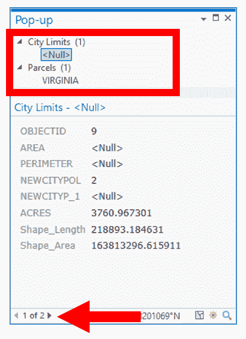

您可以使用右侧的滚动条上下移动。

您看到的信息可能取决于您在地图上的点击位置。如果出现这种情况，请不要担心。您只是点击了不同的地块或地图区域。

1.  点击位于 1/2 右侧的小箭头。这将切换到您点击的其他功能的信息。同时，注意在点击小箭头时窗口顶部的面板发生了什么变化。

1.  在顶部面板中，您也应该看到两个项目。它们按所在的图层分组。点击“City Limits”下的值并查看发生了什么。然后，点击“Parcels”下的值并观察下方的信息面板。

正如您现在所看到的，您可以通过点击弹出窗口底部的箭头或顶部面板中的单个值来访问使用探索工具时点击的功能信息。这是一种快速检索您在地图上看到的功能的基本信息的方法。

如果需要，弹出窗口也可以调整大小和移动。您甚至可以通过点击窗口顶部的标题区域并拖动到您想要的位置来将其移动到另一个显示器或显示设备。您还可以将其停靠在 ArcGIS Pro 界面中，使其始终出现在相同的位置，这样更容易找到。让我们看看它是如何工作的。

1.  点击弹出窗口的标题区域并继续按住您的左鼠标按钮。当您这样做时，您应该在 ArcGIS Pro 界面中看到棕色和白色的停靠图标，如下面的截图所示：

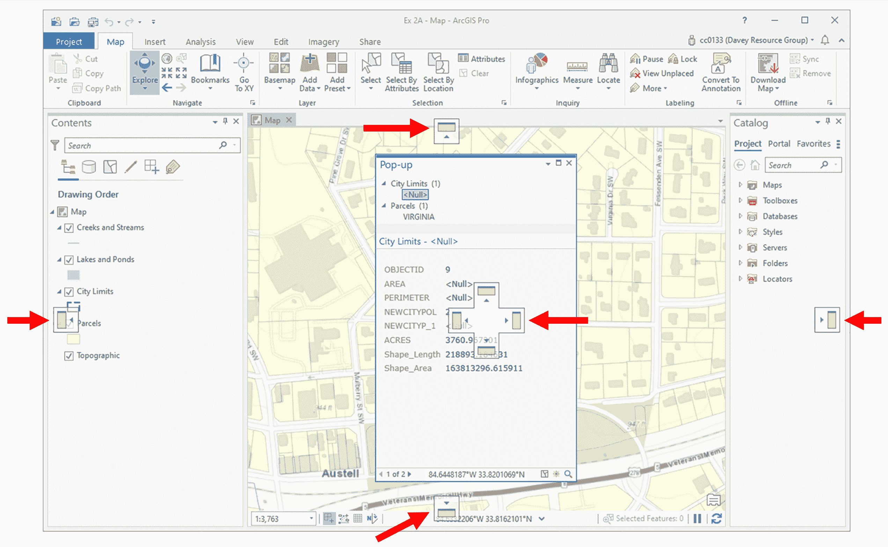

1.  在按住左鼠标按钮的同时，将鼠标指针拖动到那些停靠图标之一。您可以选择任何一个。一旦您的指针悬停在停靠图标上，释放鼠标按钮。

释放鼠标按钮后，弹出窗口应该会自动停靠在 ArcGIS Pro 中的该位置。窗口将在您每次使用探索工具的这个功能时继续出现在该位置，即使您关闭了窗口。

1.  通过点击位于窗口右上角的小“X”来关闭弹出窗口。

通常建议您关闭任何您未在积极使用的窗口或面板。这将释放更多空间在您的显示器上，并保持应用程序性能更佳。

您现在已探索了一些与探索工具相关的基本功能。您将在整本书中使用此工具，让您了解更多关于它的信息。但现在，是时候转向另一个工具了。

## 第 3 步 – 使用信息图表工具（可选）

现在，让我们快速查看一下**信息图表**工具。如前所述，此工具允许您使用来自 ArcGIS Online 的**Esri 地理丰富服务**检索人口统计信息。此工具确实使用 ArcGIS Online 积分，这是 ArcGIS Online 的货币。然而，在此步骤中使用的数量将非常少。您应该在本步骤完成后使用不到一个积分。

如果您担心使用 ArcGIS Online 积分，或者您的管理员限制了您，您可以跳过此步骤：

1.  在 ArcGIS Pro 界面左侧通常位于内容窗格中，右键单击市界层。然后，从出现的菜单中选择“缩放到图层”。地图应缩放到显示 Trippville 整个市界的区域。

1.  在功能区中的地图选项卡上，单击查询组中的信息图表工具。

1.  在以下截图所示的城市 Trippville 的北部，在市界内以及穿过城市中心的铁路线以北的任何地方单击。 

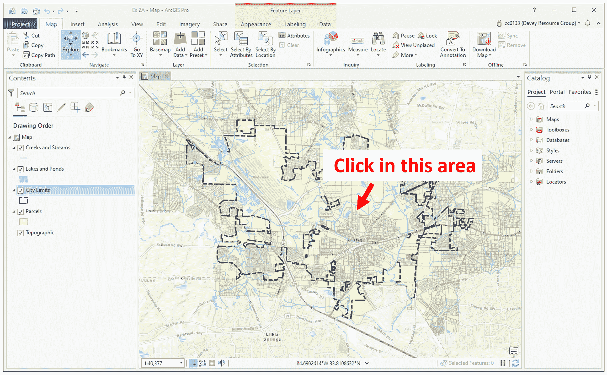

信息图表窗口将打开，显示该区域的人口统计信息。窗口应类似于以下截图。Esri 不断更新和改进此工具，所以您看到的内容可能略有不同。如果确实如此，请不要担心，只要您看到某些内容即可：

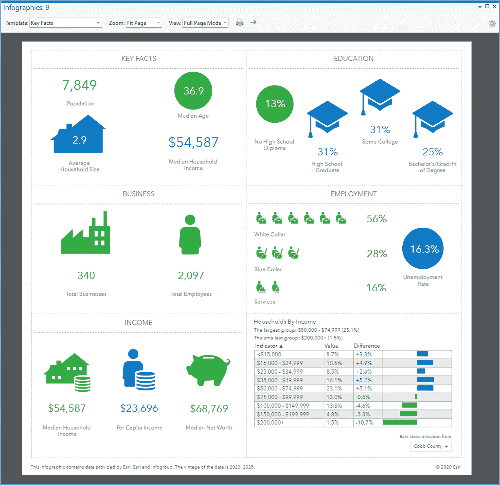

如果这是您第一次使用此工具，您将从“关键事实”屏幕开始。这提供了您点击区域的基本人口统计信息。

如果您遇到错误，这通常是由两件事引起的。首先，您未登录到您的 ArcGIS Online 用户账户。您可以通过查看 ArcGIS Pro 右上角来验证您的用户名是否已登录。第二个常见错误的原因是您已用完 ArcGIS Online 积分，或者没有权限使用积分。

1.  在信息图表窗口中，单击您看到的其中一个项目。这将显示您单击的项目更详细的信息。

1.  继续探索信息图表工具。尝试更改窗口顶部的模板选项。探索一些模板选项。

1.  一旦您完成对信息图表工具的探索，请关闭窗口。

1.  现在，单击功能区中的“项目”选项卡。

1.  从左侧菜单选择“另存为”。

1.  在“另存为”窗口中，导航到 `C:\Student\IntroArcPro\My Projects`。将你的项目命名为 `your name_Ex2A`（即 `Tripp_Ex2A`）并点击保存。

1.  保存你的项目后，关闭 ArcGIS Pro。

如第一章“介绍 ArcGIS Pro”中所述，ArcGIS Pro 运行成功需要大量的计算机资源。你在应用程序中做得越多，运行时间越长，它消耗的资源就越多。因此，建议每天开始时，通过打开或重启计算机来开始一个全新的启动，这将确保最大数量的计算机资源可用。然后，当你休息吃饭，如午餐时，关闭 ArcGIS Pro，并在回来时重新打开它。这同样也会释放不必要的资源，使计算机以及 ArcGIS Pro 运行得更好。

你现在已经成功打开了一个 ArcGIS Pro 项目，检索了你在地图上看到的要素信息，并导航到地图上的不同位置。这些是非常常见的任务，你将经常使用。现在，是时候继续到“上下文选项卡”的概念了。

现在你已经有机会使用 ArcGIS Pro 和功能区获得一些经验，你希望已经开始理解选项卡的概念。现在是时候继续到一个更高级但相关的概念，即上下文选项卡。

# 了解上下文选项卡

上下文选项卡是当你选择 ArcGIS Pro 中的某个项目时出现的智能选项卡。这可能是一个图层、一个地图、一个布局、一个表格等等。当你选择这些项目中的一个时，功能区上会出现一个或多个选项卡，包含特定于该项目的工具。

这些通常被组合成一个上下文选项卡集。例如，如果你从“内容”窗格中选择一个图层，将出现“要素图层”上下文选项卡集，它包含三个上下文选项卡，即“外观”、“标签”和“数据”。你将接下来检查要素图层上下文选项卡集及其包含的选项卡。你将在本书的其他章节中探索其他上下文选项卡。

## 理解要素图层上下文选项卡集

当你在“内容”窗格中选择一个图层时，会出现要素图层上下文选项卡集。它包括三个上下文选项卡，即外观、标签和数据选项卡。每个选项卡都允许你访问与所选图层相关的各种属性。以下截图说明了此上下文选项卡集及其包含的上下文选项卡：

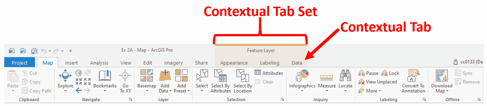

我们现在将更详细地检查这些上下文选项卡中的每一个，从外观选项卡开始。

### 了解外观选项卡

“外观”选项卡包含控制所选图层显示的工具。在这里，你可以更改符号、设置可见性比例、应用透明度等：

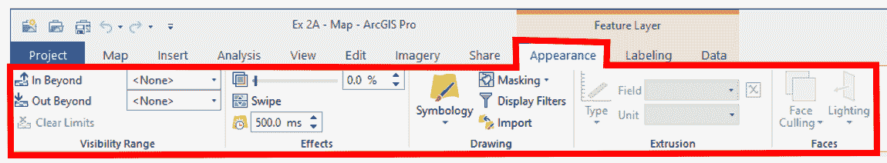

你可以看到在外观选项卡中有五个组。这些是可见范围、效果、绘图、挤压和面。我们将在接下来的章节中学习这些组。

可见范围、效果和绘图组将对所有图层可用。

#### 可见范围组

可见范围允许你设置图层可见或不可见的比例。这允许你根据缩放程度控制地图中显示的细节级别：

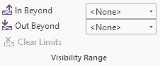

这减少了杂乱，提高了可读性，并提高了地图的重绘性能。如果你想要将包含大量可能重叠或开始合并的详细信息的图层应用可见比例范围，这将很有用。这也适用于你打算通过 ArcGIS Online 或 ArcGIS Enterprise 发布为网络服务的任何地图。

#### 效果组

如下所示的效果组包含了一些有趣且有用的工具，如果你有一个包含重叠图层且可能相互隐藏的地图：

以下是对效果组中各种工具功能的描述：

+   透明度：透明度工具包括滑动条，用于将透明度应用于所选图层。通过使图层更加透明，你可以看到地图中可能位于其下方的其他图层。

+   滑动：在透明度设置下方是滑动工具。此工具正好符合其名称的含义。它允许你使用鼠标将所选图层滑动到一边。你可以从左到右、从右到左、从上到下或从下到上滑动。这允许你在滑动时暂时开启或关闭图层的一部分。此工具非常适合在两个或多个图层之间进行比较。

+   闪烁：在效果工具下方是闪烁工具。此工具会使图层根据指定的间隔自动开启和关闭。

我们接下来将检查绘图组。

#### 绘图组

绘图组控制所选图层的各种显示属性，例如使用什么符号，使用一个图层隐藏或遮盖另一个图层，以及应用显示过滤器，以便在指定比例下仅显示所选图层中的特定要素。以下截图显示了你在该组中可以找到的各种工具：

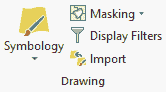

以下是对本组包含的工具功能的描述：

+   符号：符号工具允许你控制你希望应用于图层的符号类型。这可以是单个符号、独特符号、渐变色符号等。你将在第三章，“创建 2D 地图”中了解更多关于不同符号方法的信息。

+   遮罩：此工具允许您根据另一个图层中的要素遮罩或隐藏一个图层中的要素。这可以减少地图上的杂乱，并使其更容易阅读。

+   显示过滤器：此工具允许您控制在指定比例下何时在图层中显示特定组的功能。这些组是根据您创建的查询或表达式创建的。

+   导入：此工具允许您根据另一个现有图层或图层文件导入图层的符号设置。

我们将接下来检查挤出和面组。

#### 挤出和面组

当您在 3D 场景中工作时，才会出现挤出和面组。挤出允许您将 2D 特征扩展到 3D 表面之上，例如建筑足迹或灯柱。以下是对这两个组的截图：

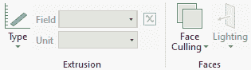

挤出图层必须在内容窗格的 3D 图层类别中。面组包含用于控制 3D 场景中透明度和光照的工具。面裁剪允许您看到 3D 要素的部分。光照允许您创建和控制阴影。您将在第五章，*创建和使用项目*中了解更多关于这些工具和设置的信息。

我们将在下一节中学习标签选项卡。

### 了解标签选项卡

标签是将文本添加到地图或场景的一种方法。它们提供了有关地图中显示的要素的有用信息，例如道路名称、地块所有者或资产库存编号。标签是动态的。这意味着几件事情。

首先，它们与存储在图层属性表中的值相关联。其次，计算机将根据您配置的设置放置标签。当您在地图内平移或缩放时，标签将移动并改变位置。

以下截图显示了标签选项卡的视觉表示：

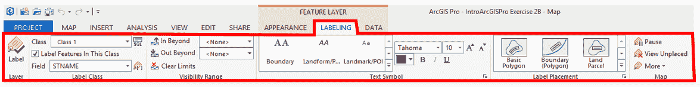

标签选项卡包含六个组。具体如下：

+   图层

+   标签类别

+   可见范围

+   文本符号

+   标签放置

+   地图

上下文选项卡允许您访问用于向所选图层中的要素添加和配置文本标签的工具。此表上显示的工具将根据您选择的图层类型而有所不同。点、线和多边形将具有不同的选项。

例如，当标记线图层时，您可以将标签放置在上方、下方或在线上，并使标签与线平行、垂直或沿线弯曲，而对于多边形图层，您可以选择仅在多边形内放置标签，或者允许它们在多边形外部。您还可以选择标签是否仅水平或允许在多边形对角线上。在 ArcGIS Pro 中，这被称为*直线*。

我们将在接下来的章节中查看上述六个组。

#### 图层组

此组包含一个工具——**标签**。标签工具用于开启或关闭所选图层的标签。这只是开启或关闭图层标签的几种方法之一。

#### 标签类组

标签类组包含允许您确定要标记哪些要素以及从属性表中标记它们的哪些字段或字段的工具。以下截图显示了您将在该组中找到的工具：

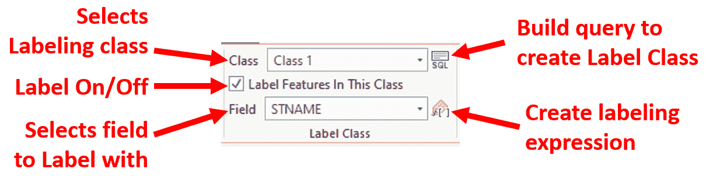

以下列表提供了该组中工具功能的描述：

+   类下拉选择：此选项允许您选择要更改设置标签类。每个标签类都可以有自己的独特标签设置。例如，您可以根据每条道路的类型创建一个标签类，以便高速公路可以使用与本地城市道路不同的设置进行标记。这可以大大扩展标签的灵活性。图层至少有一个标签类，称为“类 1”。除非您创建标签类查询，否则此默认类将包括图层中的所有要素。

+   标签类查询：此工具允许您创建一个查询，该查询反过来创建一个新的标签类。新类将包含满足您构建的查询条件的要素。例如，您可能希望将所有商业地产与住宅地产进行不同的标记。因此，您将需要使用一个仅过滤那些地产的查询来为商业地产创建一个标签类。

+   在此类中标记特征：此选项用于开启或关闭在“类”下拉选择中显示的类的标签。如果图层只有一个标签类，此选项将开启或关闭整个图层的标签。

+   字段下拉选择：此下拉选项允许您从图层的属性表中选择要标记地图上要素的字段。此下拉菜单将自动填充所选图层属性表中的字段。

+   标签表达式：此工具将打开标签类面板，并允许您构建自定义的标签表达式。标签表达式允许您使用多个字段进行标记，向标签添加更多信息，将标签拆分到多行，等等。您可以使用**VBScript**、**JScript**、**Python**或**Arcade**语言创建表达式。

#### 文本符号组

文本符号组选项卡包含控制和标签可视化的工具和设置：

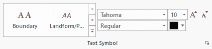

在这里，您可以更改字体、大小和颜色。您还可以选择使标签加粗、斜体或下划线。ArcGIS Pro 还包括几个预定义的标签样式，您也可以从该选项卡组中选择使用。

#### 标签位置组

标签位置组选项卡控制标签相对于被标记要素的一般位置：

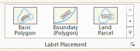

此处的选项将根据您是否正在处理点、线或多边形而有所不同。例如，对于线图层，您将具有将标签放置在上方、下方或在线上的选项。点或多边形图层的选项将不同。

#### 地图组

最后一个组标签是“地图”。位于此处的工具控制地图内标签的绘制：

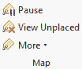

让我们更详细地看看这些选项：

+   暂停：暂停地图上标签的重绘，以加快性能。

+   显示未放置的位置：显示由于与其他要素或标签冲突或根据您的配置设置而未放置在地图上的标签的位置。

+   更多：此选项提供下拉菜单，显示其他选项或设置，如下面的截图所示：

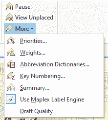

位于“更多”菜单下的工具提供了对您的标签以及它们与其他标签和要素交互的更高级设置。您还可以选择在地图中希望使用的标签引擎。默认情况下，ArcGIS Pro 使用**Maplex 标签引擎**。这是您可以使用的两个引擎之一。另一个是**Esri 标准标签引擎**。Maplex 是两个中更高级的，为您的标签提供了更多的配置选项。

### 了解“数据”标签页

“数据”标签页包含与所选层属性表交互的工具。它包含八个组：

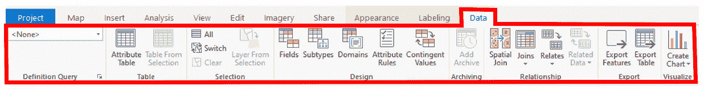

这些组如下：

+   定义查询

+   表格

+   选择

+   设计

+   归档

+   关联

+   导出

+   可视化

我们将只探索此标签页上找到的一些最常用的组和工具。

#### 定义查询组

此组仅包含一个下拉列表选项。下拉列表将填充为为所选层创建的任何定义查询，并应用您选择的查询。定义查询允许您对图层中显示的要素应用过滤器，以便您只能看到符合查询要求的要素。这有助于减少地图上的杂乱并提高性能。

#### 表格组

此组包含两个工具，这些工具将打开所选层的属性表。一个打开整个表，另一个仅打开表以显示所选要素。让我们来探索这些：

+   **属性表**：此选项打开所选层的属性表。属性表包含有关地图上显示的要素的附加信息。

+   **从选择创建表**：此选项打开所选层的属性表，但仅显示表中已选择的要素的记录。如果没有选择任何要素，则此图标将变为灰色。

#### 选择组

此组包含允许您从表格中选择或取消选择记录的工具。记录是您在表格中看到的行。如果您正在查看属性表，则表中的每个记录对应于地图图层中的某个要素。因此，选择表格中的记录也会选择地图上的要素。让我们更深入地了解一下：

+   **全部**：此工具选择活动表格中的所有记录。

+   **切换**：此工具反转您的选择。最初未选择的记录现在被选中，而最初被选中的记录被取消选中。

+   **清除**：此工具清除您的选择。这意味着取消选中所有选中的记录，使您没有任何选择。

+   **从选择创建图层**：此工具创建一个包含所选要素的新图层。此新图层将引用相同的数据源，但仅显示最初选中的要素。

#### 导出组

此组包含允许您将功能或记录导出到新数据源的工具。这可以是一个新的要素类或独立表格，具体取决于您选择哪个工具。

+   **导出要素**：此工具将所选图层中的要素导出到新的形状文件或地理数据库要素类，创建导出时的图层副本。

+   **导出表格**：此工具将所选图层的属性表中的记录导出到新的独立表格。新表格可以保存到地理数据库或 `.dbf` 文件。

使用这两个工具，如果在运行工具时选择了任何功能或记录，则只会导出所选的功能或记录。如果没有选择任何内容，则将导出整个图层或表格。

此选项卡上的其余组将不会介绍，因为它们对于本书的水平来说太高级了。其中一些在 Packt 的《ArcGIS Pro 2.x 烹饪书》中有讨论，如果您想了解更多关于它们的信息。现在，是时候测试您新获得的一些知识了。

现在我们将进入下一节，关于处理二维和三维图层，因为我们现在熟悉了上下文选项卡及其所有组件。

## 练习 2B – 处理二维和三维图层

现在是时候看看特征图层上下文选项卡集中包含的工具如何工作了。在这个练习中，您将使用选项卡集中找到的上下文选项卡上的工具来更改现有项目中的图层。您将更改图层的符号、标签等。

### 步骤 1 – 打开项目并添加图层

在此步骤中，您将打开一个已经创建的项目。然后您将向地图添加一些额外的图层：

1.  使用您已经学到的技能，启动 ArcGIS Pro 并打开 Ex 2B 项目。此项目位于 `C:\Student\IntroArcPro\Chapter2` 或您安装课程数据的位置。

1.  激活地图选项卡，然后单击图层组中位于的“添加数据”工具。

确保点击按钮图标，而不是图标下面的箭头或文本。如果你点击了箭头或文本并且出现了一个菜单，从菜单中选择数据。

1.  通过点击位于添加数据窗口右侧面板中的小箭头，展开项目文件夹。然后，选择数据库文件夹，以便看到两个地理数据库，`IntroArcGISPro Exercise 2A` 和 `Trippville_GIS`。

1.  双击 `IntroArcGISPro Exercise 2A` 地理数据库，以便你可以看到其内容。

1.  按住你的 *Ctrl* 键，点击 bldg._footprints、RR_Tracks 和 Street_Centerlines 特征类以选择它们，如图下截图所示。然后，点击 OK 按钮将选定的特征类添加到你的地图中：

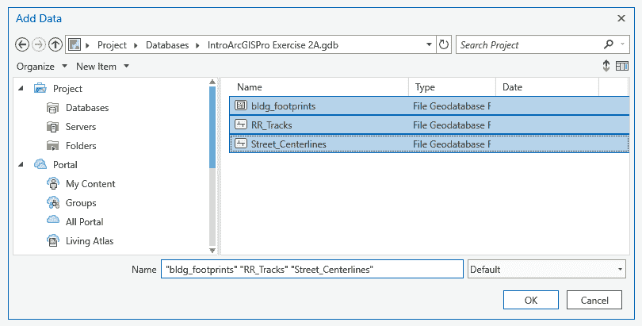

你现在已经从一个地理数据库中向地图添加了三个新的图层。一旦你按下 OK 按钮，它们应该会出现在你的地图中。花点时间注意新图层在内容窗格中的层列表中的位置。bldg_footprints 图层应该出现在你添加的其他两个图层下面，因为它是一个多边形图层。Street_Centerlines 和 RR_Tracks 被添加到列表的顶部，因为它们是线图层。

总是记住在 ArcGIS Pro 中工作的时候，项目永远不会存储实际显示的数据。每个图层都引用一个外部数据源，例如地理数据库特征类。

现在你已经添加了新的图层，你需要配置它们的一些属性，例如符号。

### 第 2 步 – 更改符号

你刚刚向地图中添加了三个新的图层。现在你需要调整你添加的图层的符号。你将更改你添加的铁路图层以使用常见的铁路符号。你将以类似的方式更改建筑足迹。最后，你将调整道路中心线，使它们根据其条件进行符号化：

1.  在内容窗格中右键单击 bldg_footprints 图层，并从出现的菜单中选择属性。该图层也可能被命名为 Buildings。

1.  点击位于属性窗口左侧面板中的“常规”。

1.  将名称更改为 `Building Footprints` 并点击 OK。注意内容窗格中图层的变化。

*当你右键单击*bldg_footprints*图层时，你注意到功能区发生了什么吗？* 特征层上下文选项卡会自动出现，提供对其包含的工具的访问。你现在将使用这些工具来调整你刚刚重命名的建筑层。

1.  确保你在内容窗格中仍然选择了 Building Footprints 图层。然后，在特征层上下文选项卡集中选择外观上下文选项卡。

1.  点击符号工具以打开 ArcGIS Pro 界面右侧的符号面板。符号面板允许你更改图层的符号设置。

1.  在符号面板中，确认主符号设置为`Single Symbol`，如以下截图所示。如果不是，使用下拉箭头将其设置为`Single Symbol`，如下所示：

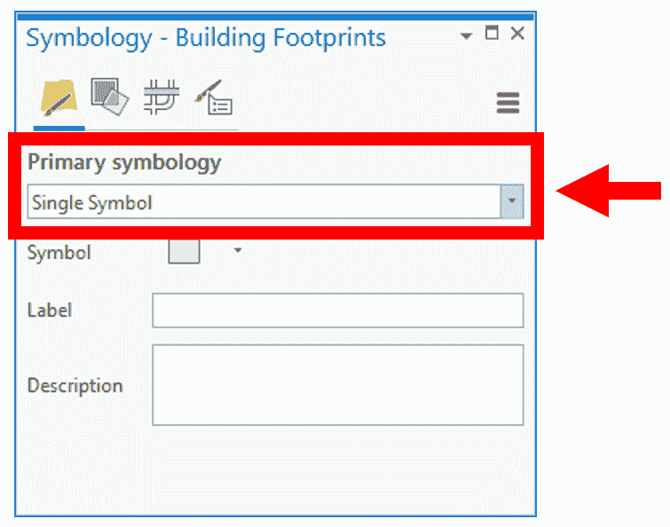

你当前符号的颜色可能与前面的示例中显示的不同。ArcGIS Pro 在将新图层添加到地图时随机分配颜色。

1.  点击位于“符号”一词右侧的小样本符号。这将打开符号面板到符号图库，如下截图所示：

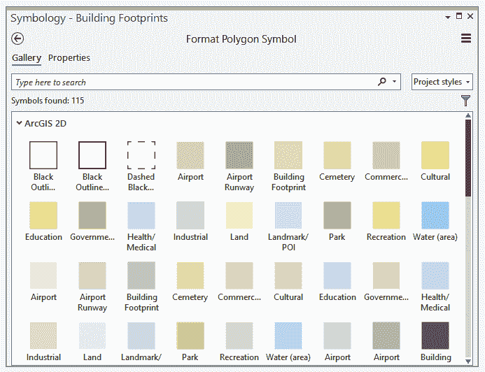

1.  在符号面板顶部附近的位置的搜索框中，键入`Building Footprint`以过滤图库，只显示与建筑占地面积相关的符号。

你刚刚更改了建筑占地面积图层的符号。符号很重要，因为它允许你区分不同的图层，以便你能从另一个图层中识别出该图层中的特征。

1.  选择图库中与建筑占地面积相关的任何符号样本。

**问题**：*选择新符号时会发生什么？*

1.  现在，在内容面板中选择 RR_Tracks 图层，并观察符号面板中发生了什么。

1.  再次点击位于“符号”一词右侧的样本符号以打开图库。

1.  使用之前相同的过程，将符号更改为图库中的铁路符号，如符号面板中所示，如下截图所示：

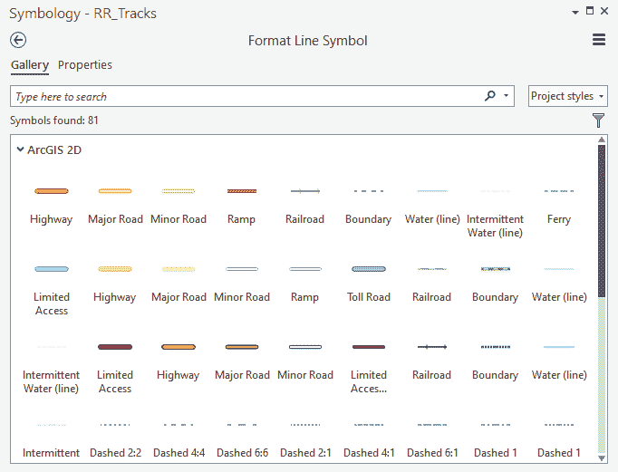

1.  在符号面板顶部的搜索框中，键入`Railroad`以过滤图库到铁路符号。

1.  选择你喜欢的任何提供的样本符号。完成后，通过点击右上角的小 X 关闭符号面板。

通常建议你在使用完任何面板或窗口后关闭它们。这将减少屏幕杂乱和任何对系统资源的消耗。

1.  在内容面板中，右键单击 RR_Tracks 图层，并从出现的菜单中选择属性。

1.  在图层属性窗口的常规选项卡中，将图层名称更改为`Railroad`，然后点击确定。

1.  点击项目标签并选择另存为。

1.  导航到`C:\Student\IntroArcPro\My Projects`，并将你的项目命名为`<your name> Ex2B`。

与许多其他程序不同，ArcGIS Pro 没有为你的项目提供自动保存功能。因此，当你添加图层、更改符号、添加新地图等时，经常保存你的项目总是一个好主意，以确保这些更改被保存，你不会丢失你所做的工作。

现在将更改道路中心线的符号以反映其状态。这比更改单个符号要复杂一些。

1.  使用你已经学到的技能，将`Street_Centerline`图层重命名为`Streets`。

1.  确保在内容面板中仍然选择了街道层。然后，点击功能区中的“外观”选项卡。

1.  接下来，点击位于符号工具下方的小箭头。从下拉选项中选择唯一值，如以下截图所示：

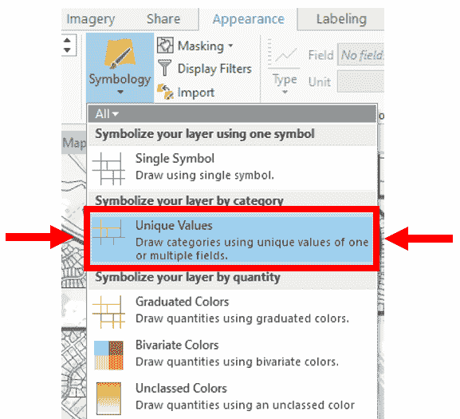

符号面板将再次在 ArcGIS Pro 的右侧打开。它看起来与您使用单符号时不同。它包含许多更多选项和设置。这些选项允许您根据一个或多个字段中找到的属性配置您的符号。

1.  在“字段 1”旁边的下拉框中，选择条件，如以下截图所示。请注意，ArcGIS Pro 自动添加此字段中找到的所有值并分配一个符号：

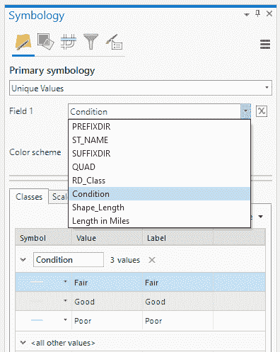

1.  点击位于符号面板中间网格中“公平”旁边的符号以打开符号库。

1.  如以下截图所示，点击面板顶部的“属性”选项卡：

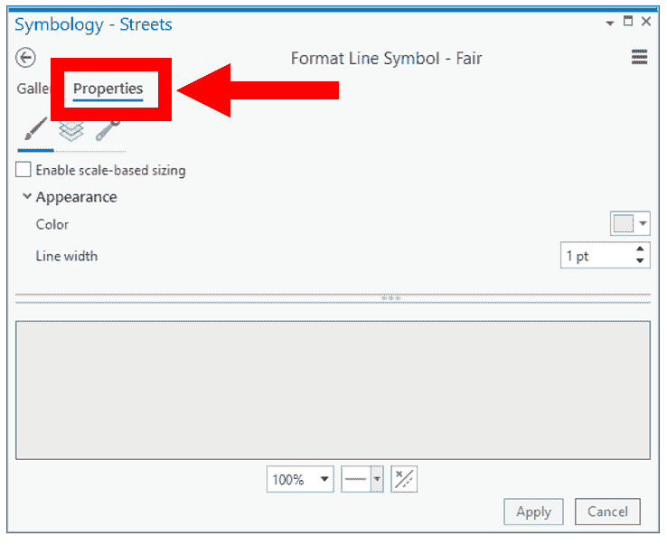

1.  从颜色下拉选择中，将颜色设置为橙色或其他您喜欢的颜色，并将宽度设置为`1 pt`。然后，点击应用。

1.  点击位于符号面板顶部的返回箭头，以返回到整个街道层的符号设置。

1.  使用之前相同的方法，对以下列表中显示的“优秀”和“差”值的符号进行以下调整：

    +   优秀：明亮的绿色和宽度为`1.5 pt`。

    +   差：明亮的红色和宽度为`3 pt`。

完成后，您的地图应类似于以下所示：

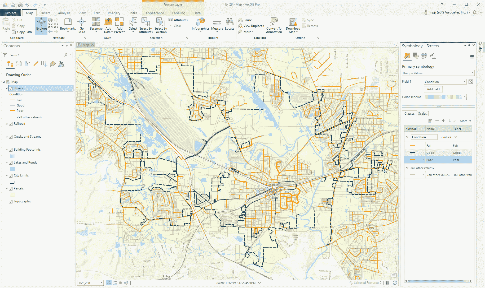

1.  完成更改符号后，关闭符号面板。您可以根据需要更改地图中的其他图层。

1.  通过点击 ArcGIS Pro 界面左上角非常顶部的快速访问工具栏中的“保存”按钮来保存您的项目。

您刚刚使用功能层上下文标签调整了符号。最初，您只是更改了一个图层中所有要素的符号。然后，您更改了街道层的符号，以便您可以看到该层中每条街道的条件。这种能力使您的地图更具信息性和实用性。它还展示了 GIS 的强大之处，即空间数据与属性信息相链接。现在，让我们向地图添加一些标签。

### 第 3 步 - 标签

在此步骤中，您将使用功能层上下文标签集中的“标签”选项卡向地图添加街道名称。您将配置街道层的标签以完成此任务：

1.  在内容面板中选择街道层。

1.  在功能层上下文标签集中点击“标签”选项卡。

1.  点击位于图层组中标签栏最左侧的标签按钮，如图下截图所示，以为街道图层打开标签。您点击工具后应该会在地图上看到标签出现：

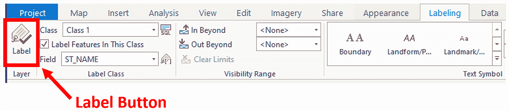

1.  在标签页的标签放置组中，选择北美街道选项，如图下截图所示。然后 ArcGIS Pro 将使用此放置样式定义的放置属性，包括道路名称出现在中心线上方并弯曲以跟随道路：

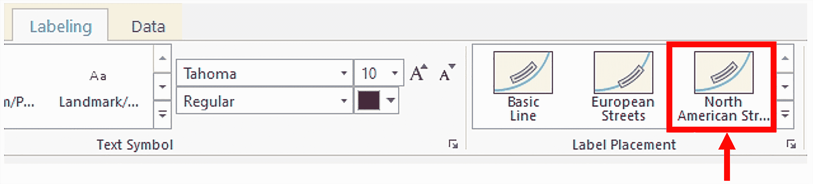

当您为街道图层启用标签时，标签类面板也在 ArcGIS Pro 的右侧打开，与符号面板在同一位置。此面板允许您细化各种标签设置。

1.  在内容面板中右键单击街道图层。从出现的菜单中选择“标签属性”以打开标签类面板。

1.  点击位于标签类面板顶部的位置标签页，如图下截图所示：

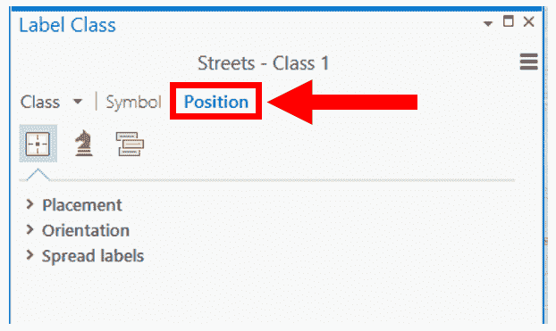

1.  在标签类面板中，点击“适配策略”按钮。这个按钮看起来像棋盘上的*骑士棋子*，如图下截图所示：

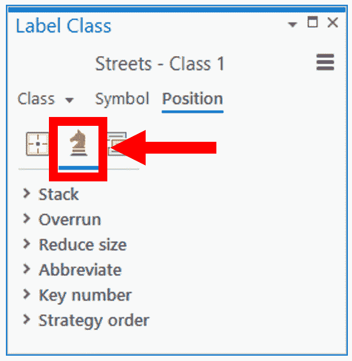

1.  点击“减小尺寸”旁边的箭头以展开该策略的选项。

1.  点击“减小字体大小”旁边的复选框以启用此适配策略。

1.  将“下限”设置为`5.0 pts`并将“步长间隔”设置为`1.0 pt`。

这将允许 ArcGIS Pro 自动调整字体大小，以便将道路名称适当地显示在地图上。这将允许显示更多的道路名称。

1.  缩放以查看标签显示效果。关闭“减小字体大小”选项，然后再次缩放以查看此选项的影响。

1.  保存您的项目并关闭标签类面板。

您现在已向地图添加了显示街道名称的文本。自动标签已添加到该文本中。标签是动态文本，它与要素的属性相关联。如您所见，您可以配置一些选项，但最终，软件决定哪些要素被标记以及标签将出现在何处。

到目前为止，您一直在 2D 地图上工作。现在，是时候通过下一步尝试进入 3D 领域了。

### 第 4 步 – 使用 3D 图层

ArcGIS Pro 与其他 GIS 软件区别之一是能够在无需额外软件或扩展（如**3D Analyst**）的情况下进行 3D 数据的工作和可视化。在 3D 中查看、编辑和查询数据的能力是 ArcGIS Pro 的核心功能之一。

在此步骤中，你将向 3D 场景添加包含建筑轮廓的层，然后将其拉伸，以便你可以看到建筑的高度。处理 3D 数据会比 2D 数据更占用你的电脑。所以，如果这一步执行得较慢，请不要感到惊讶。如果你的电脑勉强满足运行 ArcGIS Pro 的最低要求，那么在尝试完成这一步时可能会遇到问题和崩溃：

1.  在界面右侧通常位于界面右侧的目录窗格中，点击窗格顶部“地图”旁边的箭头以展开其内容。

如果你没有看到目录窗格，你可能在你关闭其他窗格时意外关闭了它。你可以通过点击“视图”选项卡然后点击“项目”按钮来重新打开它。

1.  扩展“地图”文件夹后，你应该看到两个地图，即“地图”和“场景”。右键单击“场景”，然后选择“打开本地视图”，如图所示。这会打开 3D 场景：

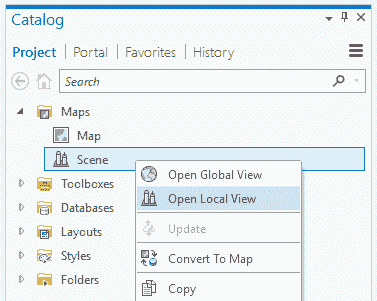

1.  在功能区中激活“地图”选项卡并选择“探索”工具。

1.  按住鼠标滚轮向下，然后将鼠标稍微远离自己以在 3D 平面上旋转地图视图，直到它看起来类似于以下截图。它不需要完全精确，只要接近示例即可：

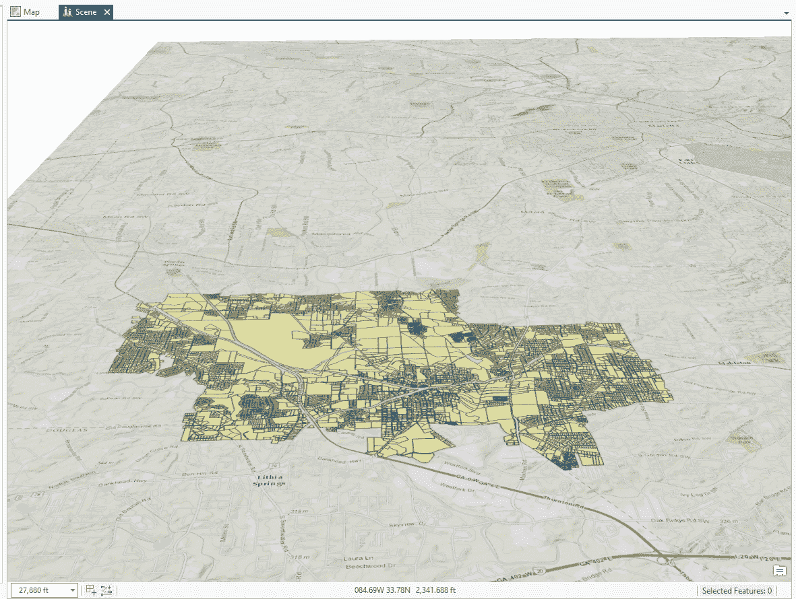

1.  将鼠标指针放在包裹层中心附近，然后滚动鼠标滚轮远离自己以放大。继续使用滚动轮直到你对如何在 3D 场景中导航感到舒适。

1.  点击“添加数据”工具，导航到位于“项目”和“数据库”文件夹下的`IntroArcGISPro Exercise 2A.gdb`。点击“bldg_footprints”要素类并点击“选择”。

1.  使用你在之前步骤中学到的相同过程，将“bldg_footprints”层重命名为`Building Footprints`。

1.  在内容窗格中选择“Building Footprints”层，并将其拖动到 3D 层，如图所示。这将允许你为此层应用 3D 符号：

如果你无法将“Building Footprints”层移动到 3D 层，你可能需要确保你在内容窗格中查看的是“按绘图顺序”选项。这是窗格顶部第一个按钮。

1.  保存你的项目。

1.  如果需要，在功能区中激活“地图”选项卡。然后，点击“书签”工具并选择“建筑”书签。这将放大场景，这意味着你可以看到建筑在地面高程上叠加的情况。

1.  再次选择“建筑层”，然后点击“外观”选项卡。注意它看起来与你在处理 2D 地图时看到的内容有很大不同。

1.  在拉伸组中，点击“类型”下方的小箭头并选择“基础高度”。这将允许你根据建筑估计的高度拉伸建筑，这意味着你可以在 3D 视图中看到每座建筑的不同高度。

1.  在类型旁边的字段下拉选项中，从出现的列表中选择估计高度，如图所示。这是每座建筑的估计高度：

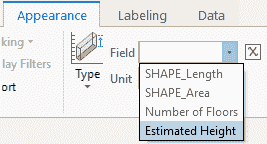

你的地图现在应该看起来类似于以下截图。你的建筑物的颜色可能不同，这是可以预料的。记住，ArcGIS Pro 在将图层添加到地图或场景时会随机分配颜色：

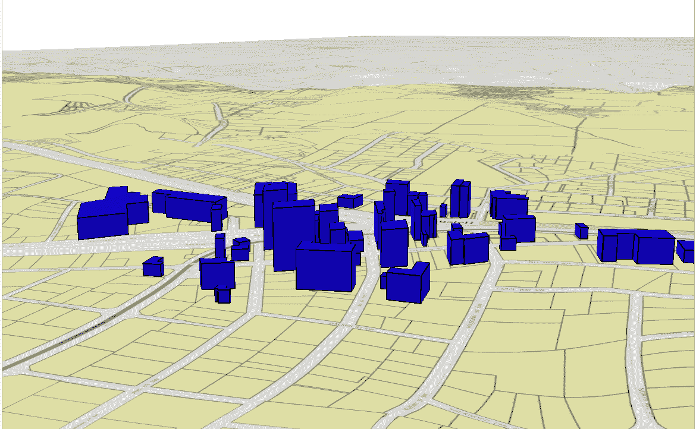

你刚刚在 ArcGIS Pro 中添加并符号化了一个 3D 图层。你现在可以看到城市中不同建筑之间的 3D 关系。在 3D 中可视化数据开辟了全新的数据查看方式。它可以使你看到在一个或多个图层中特征之间的关系，这些关系你可能无法在 2D 视图中看到。任何图层都可以在 3D 中可视化。这种能力不仅限于处理基础设施的图层。你将在第四章“创建 3D 场景”中了解更多关于创建 3D 场景的内容。

### 挑战

使用你在本练习中获得的知识，尝试将场景中建筑物的符号更改为你在上一步中看到的符号库中找到的灰色建筑足迹符号之一。更改 3D 图层的符号与你在 2D 地图中更改铁路和建筑足迹图层符号的方法非常相似。

# 摘要

在本章中，你已经学会了如何使用 ArcGIS Pro 的界面和相关的术语。正如你所看到的，功能区提供了方便快捷的工具访问。上下文标签页通过最少的点击或搜索，使与任务和项目相关的特定工具可供你使用。

功能区中的许多工具都与界面右侧出现的面板协同工作。这些面板提供了访问所选工具使用的设置和输入，以细化其功能。

使用这些工具，你能够处理 2D 和 3D 数据，以及标注特征和更改它们的符号。你还了解了探索工具具有广泛的功能，从在地图中导航到检索数据。

在下一章中，你将探索如何在项目中创建新的 2D 地图。这包括添加新地图的各种方法、从外部来源导入地图以及复制现有地图。你还将了解不同的方法，通过这些方法你可以向地图中添加新的图层。**
