创建三维场景

随着世界变得越来越拥挤，在三维环境中查看数据的需求也在增长。随着现代城市基础设施在上下以及向外扩展，看到地面以上和以下的内容对于规划新项目、应对紧急情况和管理基础设施变得至关重要。

**ArcGIS Pro** 允许用户原生地创建三维地图或场景。在过去，这需要用户拥有如 **3D Analyst** 这样的扩展程序。在 ArcGIS Pro 中原生地创建三维场景，实际上开启了一个全新的世界和查看数据的方式。

本章将为您提供从地面以上或以下挤出数据的能力，以便查看诸如验证是否存在干扰新下水道线的现有天然气管道，或者正在建设的新办公楼是否会遮挡市长对公园的视线等问题。简而言之，ArcGIS Pro 允许您以与真实世界相同的方式可视化您的数据。

本章将涵盖以下主题：

+   理解三维场景

+   了解高程及其使用方法

# 第七章：技术要求

渲染三维场景需要比传统二维地图更多的计算机资源。为了成功完成本章，您需要一台满足或超过在 第一章 “介绍 ArcGIS Pro” 中概述的 *作者系统推荐* 部分详细说明的计算机。

如果您的计算机仅满足 **环境系统研究学院**（**Esri**）列出的最低系统规格，那么您将难以完成本章的练习。

# 理解三维场景

ArcGIS Pro 允许您轻松地将三维地图添加到项目中。在 ArcGIS Pro 中，三维地图被称为 **场景**。当您向项目中添加新的场景时，您可以选择希望使用的类型或视图模式。ArcGIS Pro 支持两种模式——即 **全球** 和 **本地**。

**全球场景** 设计用于支持地球曲率有显著影响的大面积区域。这可能用于显示飓风的轨迹或跨越多个州或国家的天然气管道路径，如下面的截图所示：

上一张截图是一个全球场景的示例，展示了美国东海岸的航空公司飞行路径。地球曲率无疑对这些长距离的飞行路径有影响。由于全球场景覆盖范围的广泛，这些场景通常使用地理坐标系。

**局部场景**是为较小区域设计的，其中地球曲率的影响较小，通常使用投影坐标系。一个局部场景可能被一个城市用来展示其市中心区域，或者被工程师用来规划带有桥梁的新道路延伸，或者被一个手机公司用来在社区内定位新的手机塔。

以下截图展示了一个局部场景的示例，该场景描绘了特定项目区域内的建筑。它们根据其高度垂直拉伸以创建 3D 视图，展示了每座建筑与其周围建筑在水平和垂直方向上的关系：

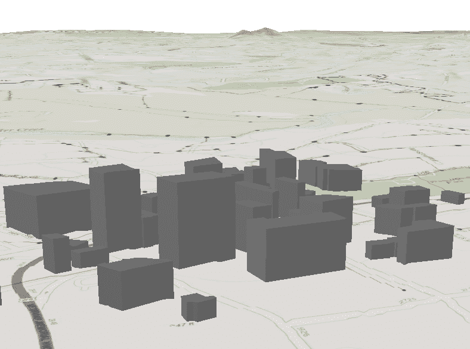

场景不必局限于显示基础设施。任何数据都可以以 3D 形式可视化。在以下截图中，你可以看到一张地图，显示了美国大陆每个州的**地理信息系统认证专业员**（GISP）数量：

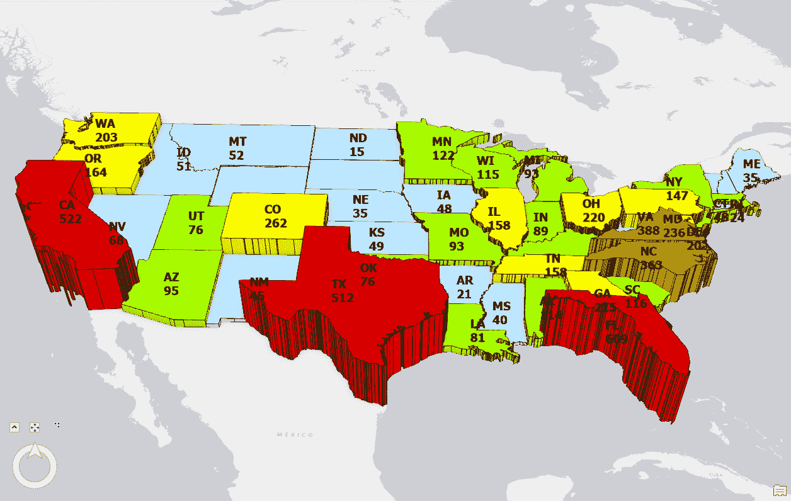

从之前的截图中，信息本可以用传统的 2D 地图和渐变色来展示。但正如你所见，根据每个州 GIS 认证专业员数量垂直拉伸每个州，为地图增添了新的层次，这使得很容易看出哪些州拥有最多的 GIS 认证专业员，哪些州拥有最少。

这种相同的可视化技术可以用来查看一个地区的总人口、平均降雨量、中位数年龄、犯罪数量等等，其效果甚至比使用传统的 2D 地图还要显著。场景可以是一种有效的方式，用来传达分析结果或突出差异，除了在现实世界的视角中展示特征。

你将有机会通过实际操作练习将你刚刚学到的知识付诸实践。接下来的练习将指导你在 ArcGIS Pro 中创建一个简单的场景。

## 练习 4A – 创建简单的 3D 场景

在这个练习中，你将使用一个**Esri 项目模板**创建一个简单的 3D 场景。你将添加并拉伸一个图层，使其在地面之上具有一定的高度。为了完成这个任务，你将首先创建一个新的项目，其中将包含一个新的场景。然后，你将向场景中添加 2D 和 3D 图层。一旦完成，你将拉伸 3D 图层，使其看起来像是从地面上方升起。

### 第 1 步 – 创建项目和 3D 场景

在这一步，你将使用 ArcGIS Pro 中包含的模板之一创建一个新的项目。这个模板将自动包含一个局部 3D 场景。为了创建项目和 3D 场景，我们将使用以下步骤：

1.  打开 ArcGIS Pro。

1.  在 ArcGIS Pro 启动窗口中，选择位于“新建”列中的局部场景模板，如图所示。这将创建一个包含单个局部 3D 场景的新项目：

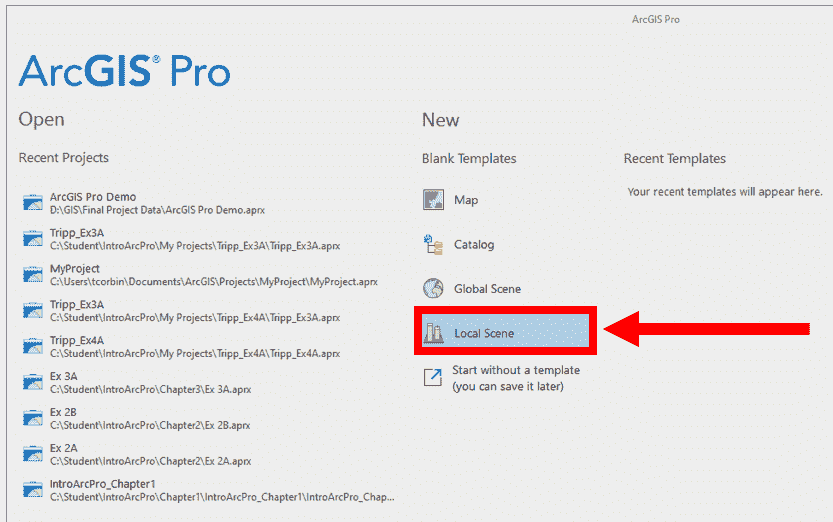

1.  将你的新项目命名为`%your name%Ex4A`（例如，`TrippEx4A`），并将位置设置为`C:\Student\IntroArcPro\My Projects`，然后点击 OK。

你的新项目应该以已经创建的场景打开。场景将是空的，除了底图之外。在你的内容面板中，你应该看到两个类别——即 2D 图层和 3D 图层。2D 图层覆盖在你的地面高程表面上。3D 图层可能在地表之上或之下拉伸。

在下一步中，你将添加一个图层并将其设置为 3D。

### 第 2 步 - 添加图层

在这一步中，你将在你的地图中添加几个图层。一些图层将保持为 2D 图层，并作为一般背景。你将按照以下步骤将`Building`图层设置为 3D，并拉伸以显示建筑的高度：

1.  在功能区中使地图标签页处于活动状态，并选择添加数据。

1.  在添加数据窗口左侧面板中的树中，展开计算机。

1.  然后，在同一个面板中选择`C:`驱动器，如图所示：

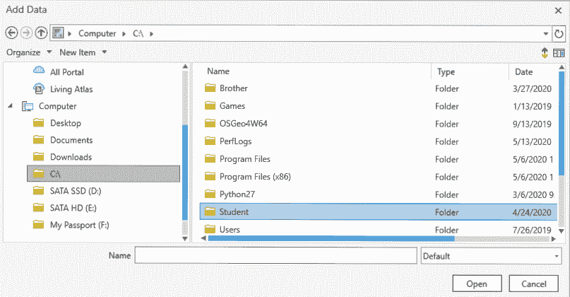

1.  然后，双击 Student | IntroArcPro | Databases。

1.  然后，双击 UnionCity 地理数据库。

1.  在按住*Ctrl*键的同时，选择以下要素类：

    +   Census_Blocks

    +   CityLimits

    +   Railroad

    +   StreetRW

1.  完成后，点击 OK 按钮。新图层已添加到你的场景中，ArcGIS Pro 会自动将你缩放到你添加的新图层的范围。

1.  通过将它们拖动到以下顺序来调整内容面板中图层的绘制顺序：

    +   City Limits

    +   Railroad

    +   Street Rights-of-Way

    +   Census Blocks

如果你在更改图层顺序时遇到困难，请确保你在内容面板中的“按绘制顺序”列表上。这是唯一允许你在地图或场景中更改图层绘制顺序的列表。

完成后，你的内容面板应该看起来像以下截图：

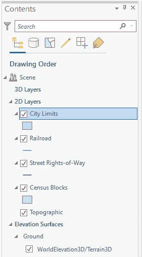

1.  使用你迄今为止学到的技能，将你刚刚添加到图层（你可以在屏幕上看到）的符号设置为以下设置：

    +   对于 City Limits 图层，按照以下步骤操作：

        +   对于颜色属性，选择无颜色。

        +   选择黑色作为轮廓颜色属性。

        +   将轮廓宽度属性设置为`3` pt。

    +   对于 Railroad 图层，按照以下步骤操作：

        +   从图库中选择 Railroad 符号。

    +   对于 Street Rights-of-Way 图层，按照以下步骤操作：

        +   选择黑色作为颜色属性。

        +   将线宽属性设置为`1` pt。

    +   对于 Census Blocks 图层，目前没有变化。

你的场景现在应该非常类似于以下截图：

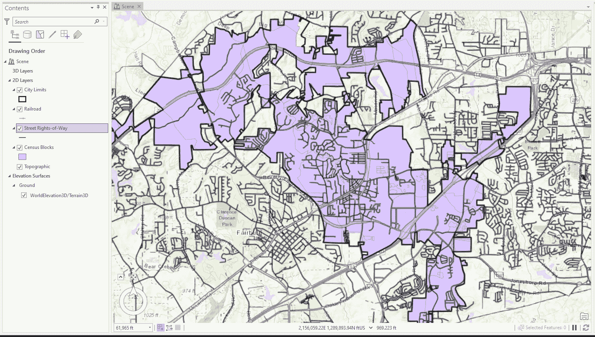

1.  最后，保存你的项目。

在 ArcGIS Pro 中工作的时候，定期保存项目总是一个好主意。这在处理场景时尤其正确。场景需要大量的计算机资源来渲染，这使得它们更容易出现问题，尤其是如果你的计算机硬件配置较低的话。经常保存意味着如果应用程序崩溃，你将需要做更少的重复工作。

你已经向场景中添加了几个图层，但到目前为止，它们都是二维的。在下一步中，你将把一个二维图层转换为三维图层。

### 第 3 步 – 创建 3D 图层

在这一步中，你将把人口普查区块层从二维图层转换为三维图层。你将通过基于属性字段拉伸每个区块多边形的高度，以显示每个区块的总人口。你将通过以下步骤来完成这项工作：

1.  在内容面板中，选择人口普查区块层。然后，将其从二维图层类别拖放到三维图层类别。

当你这样做时，你可能注意到人口普查区块轮廓的部分消失了。这是因为 3D 层中包含的一些特征现在低于高程表面。

1.  确保你仍然选择了人口普查区块层，然后在特征层上下文标签页上的外观标签上单击。

1.  在拉伸组标签页中，点击类型下方的下拉箭头，选择基础高度，如图所示：

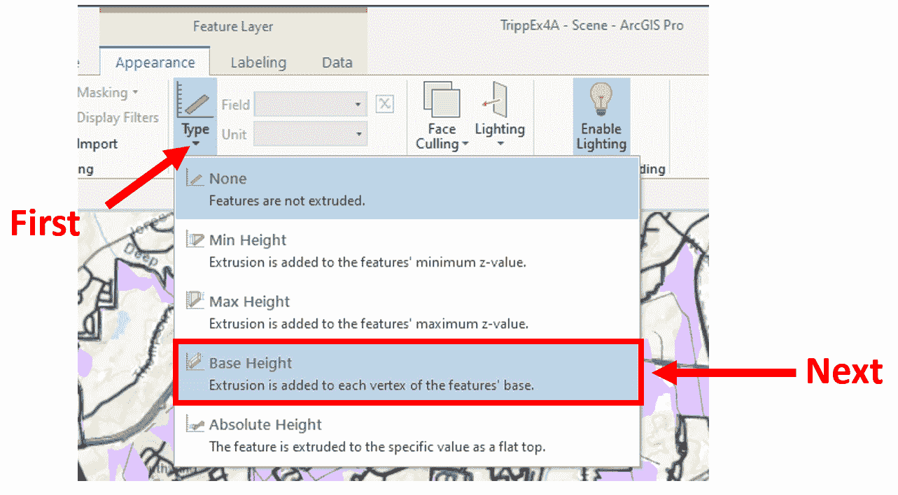

从前面的截图可以看出，拉伸一个图层允许它在三维中显示。它设置了 ArcGIS Pro 将用于确定特征高度以及如何显示高度的方法。基础高度选项将指定字段的值添加到羽毛的每个顶点，以创建三维视图。在 ArcGIS Pro 中，你可以选择四种类型的拉伸。你将在稍后了解更多关于这些的信息。

1.  在字段单元格中，点击下拉箭头并从与人口普查区块层相关的属性表填充的字段列表中选择总人口。

1.  然后，将单位设置为英尺。这意味着它将每个多边形拉伸到等于总人口值的高度（英尺）。

现在，人口普查区块层应该看起来有了一定的深度，因为它现在为每个特征显示了高度。你将现在验证这一点。

1.  之后，在人口普查区块层上右键单击，并从出现的菜单中选择如图所示的缩放到图层：

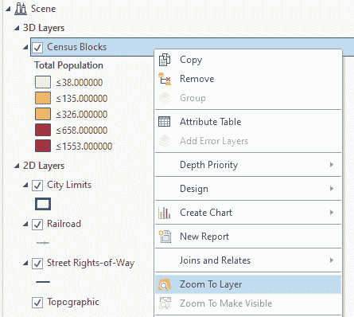

1.  如果需要，在功能区中激活地图标签页，然后选择探索工具，以便在场景中导航。

1.  将鼠标指针移至人口普查区块层的中心附近。

1.  然后，按住鼠标滚轮，然后将鼠标移向场景顶部，使其沿*z*轴旋转。这允许您看到拉伸的人口普查区块，其总人口值以高度的形式显示。继续旋转地图，直到您可以清楚地看到人口普查区块的高度。

您的场景现在应该看起来类似于以下截图：

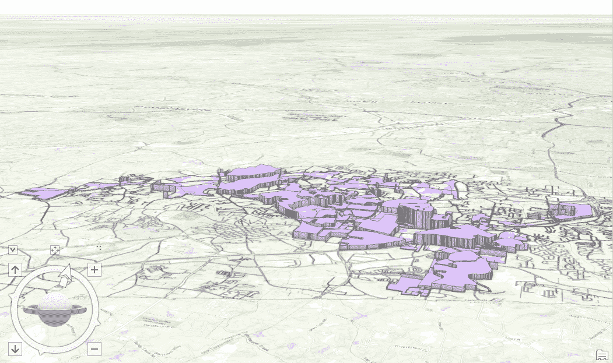

请记住，人口普查区块的颜色可能不同，因为 ArcGIS Pro 会为新添加的图层分配一个随机颜色。

1.  继续使用鼠标在您的新场景中进行缩放、旋转和平移。尝试在 3D 环境中了解导航的工作方式。

您还可以使用地图左下角的方向盘箭头在地图中进行平移和缩放。+ 和 – 图标用于放大和缩小地图比例。上和下箭头沿*z*轴上下平移。中心带有箭头的环可以用来旋转视图。如果您展开指南针，您将看到围绕球体中心的另一个环，您可以使用它来沿*z*轴旋转视图。

1.  最后，保存您的项目。

恭喜！您刚刚在 ArcGIS Pro 中创建了您的第一个 3D 场景。对于许多人来说，这可能是您第一次创建的场景。在下一节中，您将了解如何将 3D 拉伸与传统的 2D 符号化结合起来，创建一个真正有影响力的地图。

### 第 4 步 – 结合符号类型

除了将图层拉伸以使其在 3D 中显示外，您还可以应用传统的符号化方法，例如您在第三章“创建 2D 地图”中学到的那些。这使得在可视化数据时，场景更加强大，因为它们提供了更多信息。

在这一步中，您将应用传统的渐变色符号化到人口普查区块层，使场景更加信息丰富且易于解释。您将使用代表其所属人口范围的颜色的符号化每个人口普查区块。您可以通过以下步骤完成此操作：

1.  在内容面板中，选择人口普查区块层。

1.  在功能区中，点击外观选项卡。

1.  点击位于符号化按钮下方的箭头，然后选择渐变色，如图所示：

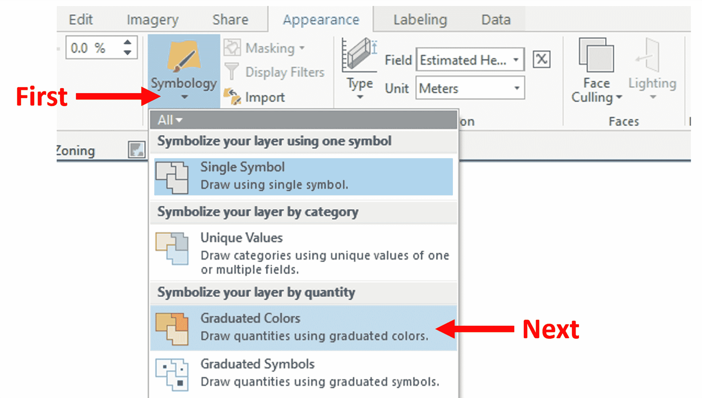

1.  现在符号化面板应该已经打开。然后，使用下拉箭头将字段值设置为总人口。

1.  接下来，选择一个您认为最能显示总人口值的颜色方案。通常，您希望低值用比高值更不强烈的颜色表示。

1.  当您对所选的颜色方案满意后，保存您的项目，然后关闭符号化面板。

完成前面的步骤后，您的地图应该看起来类似于以下截图所示（当然，您的颜色可能因您选择的方案而有所不同）：

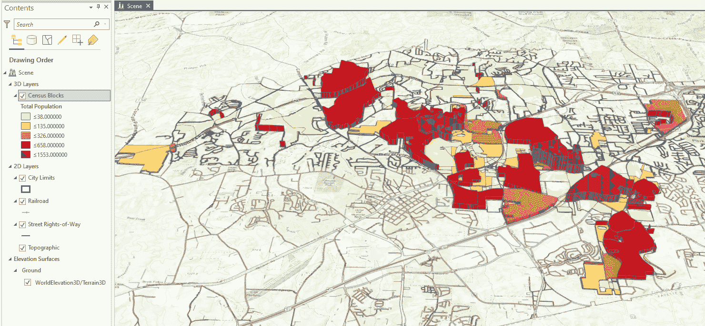

现在，您不仅可以根据它们的高度快速识别出哪些区块的总人口最多，还可以看到每个区块所属的人口范围。这使得场景成为传播信息的一个非常强大的工具。

1.  最后，关闭 ArcGIS Pro。如果被要求保存项目，请保存。

您现在已在 ArcGIS Pro 中创建了您的第一个 3D 场景。场景的任何重要组成部分都是使用海拔。这定义了地面以及空间中特征的位置。

在下一节中，您将了解在创建场景时海拔的重要性，您可以使用哪些作为海拔来源，以及如何在场景中控制它们。

# 了解海拔及其使用方法

当您在 ArcGIS Pro 中创建 3D 场景时，有几个海拔您需要关注。首先，您需要定义地面海拔。地面海拔为您的场景提供了一个基线，并且是许多其他图层在您的地图中应用的基础。

一旦您已经建立了地面海拔，您接下来需要确定您的 3D 特征的海拔。您通常会为 3D 特征使用两个海拔，第一个是起始或基础海拔，第二个是特征的高度或深度。这些可能与地面直接相关，或者是在绝对海拔上。

我们现在将更详细地研究您需要在场景中设置的这些不同海拔。我们将从讨论如何设置地面海拔以及您可以使用哪些数据格式来为场景建立地面海拔开始。然后，我们将检查您可以使用的方法来设置特征的基础和高度或深度海拔。

## 建立地面海拔

地面海拔被 ArcGIS Pro 用于在您创建的 3D 场景中表示地球表面。每个场景都应该指定一个地面表面。默认情况下，ArcGIS Pro 使用 Esri World Elevation 表面，该表面通过 **ArcGIS Online** 发布。不过，请放心，使用来自 ArcGIS Online 的此表面不会消耗您的任何 ArcGIS Online 信用额度。此表面，以及 **ArcGIS Online Basemaps** 表面，完全免费使用。

您不需要仅使用 Esri World Elevation 表面——如果需要，您可以选择使用您自己的海拔表面。您自己的本地表面通常更准确，因此它将提供更好的结果。

场景的范围限制为用作地面海拔的数据源的范围。这意味着您的场景范围将被裁剪到您的地面海拔来源覆盖的总面积。为了确保您的场景显示所需的面积，您可以使用多个数据源作为地面海拔。这在尝试展示大面积或需要拼接多个数据集时特别有用。

当使用多个数据源作为地面时，你需要确保它们彼此之间很好地对齐。以下截图展示了两个用作地面高程的表面没有正确对齐的例子。你可以很容易地看到这如何扭曲了沿公共接缝的场景：

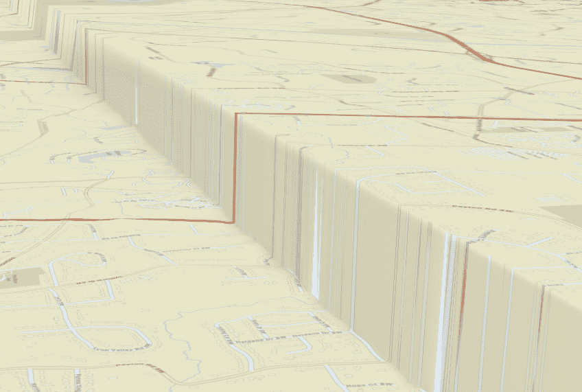

如果高程源之间存在显著差异，如前一个截图所示，这将扭曲沿那些接缝的场景，并对你可能进行的任何分析产生负面影响。

你可以使用多种类型的数据作为地面。这包括**数字高程模型**（DEM）、**不规则三角网**（TIN）和 Web 高程表面。

### 理解 DEM

DEM 是一种表示定义范围内高程的栅格数据集。栅格数据由一系列等大小的单元格组成，每个单元格包含一个数值。该值所代表的内容将取决于栅格的目的。

在 DEM 的情况下，栅格单元格值代表单元格覆盖区域的平均高程。以下截图是一个 DEM 的例子：

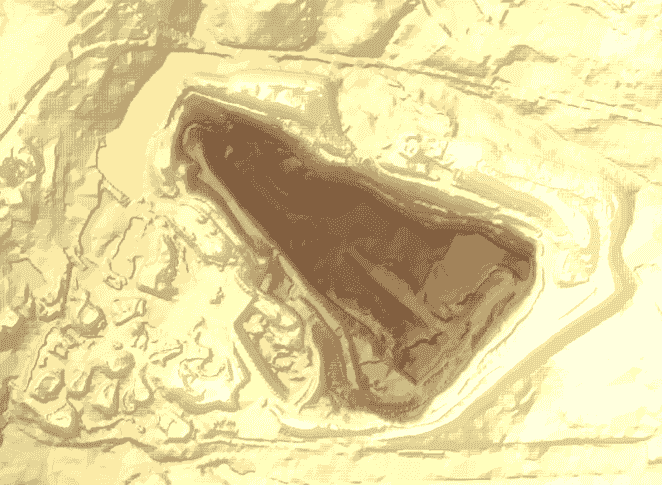

如前一个截图所示，如果你在某个点上放大这个 DEM，你会开始看到组成栅格数据的单个正方形单元格。你现在看到的正方形通常被称为像素，尽管这不完全正确。每个单元格被分配了它覆盖的平均高程值。单元格可能是 1 英尺 x1 英尺，或 2 米 x2 米。单元格的大小决定了分辨率，并在其准确性中发挥作用。

像素实际上指的是显示分辨率。它们等于图像本身的分辨率和你的计算机显示图像的能力的组合。

*DEM 是如何知道其单元格覆盖区域的平均高程的？* 与所有 GIS 数据一样，它可以通过许多不同的方法推导出来。它可能是基于土地测量员获取的高程信息创建的。它可能是通过使用立体摄影方法由**摄影测量员**编制的。它可能是通过等高线或这些方法的某种组合进行插值的。

常见的栅格格式包括`.jpg`、`.jpeg`、`.jp2`、`.tiff`、`.png`、**无缝图像数据库**（`.sid`）、**增强压缩小波**（`.ecw`）、`.img`、`.bmp`和**GRID**（Esri 原生栅格格式）格式。

在 ArcGIS Pro 中创建 DEM 需要你有**空间分析**扩展。然而，如果你已经可以访问它，你可以创建一个 3D 场景，并使用 DEM 作为你的地面表面，即使没有扩展。

让我们继续讨论 TINs。

### 理解 TINs

TIN 是一种基于向量的表面表示。它由一系列节点和线条构成，形成一个相邻三角形的网络。这些三角形构成了 3D 表面的面，包括相同高程的区域。

下面的截图显示了 TIN 在绘制时的一个例子——你可以看到构成 TIN 的三角形：

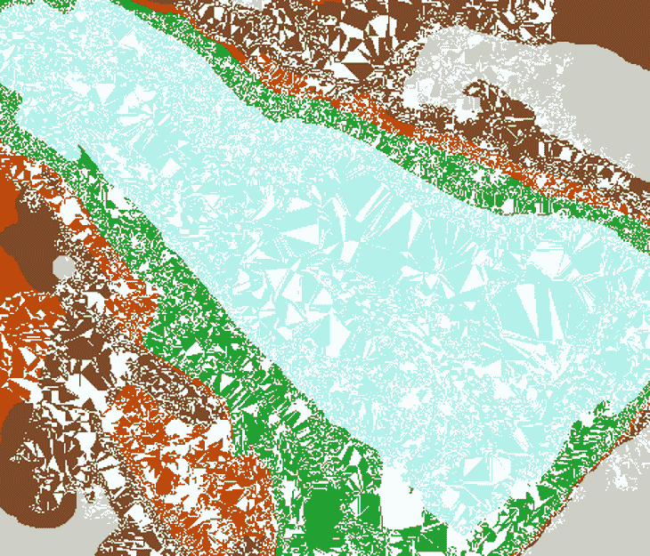

一旦所有三角形都被绘制出来，你将看到一个看似实体的表面。很容易看到 TIN 中的高程变化，如下面的截图所示：

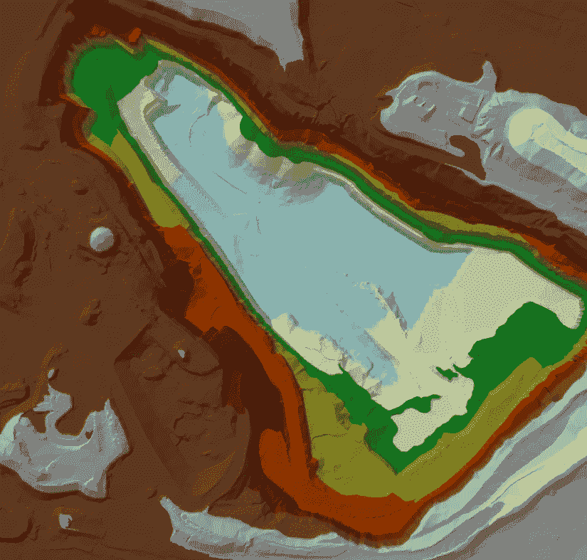

由于 TIN 是由基于向量的数据构成的，因此与等效的 DEM 相比，它们的总文件大小通常更小。然而，由于它们的复杂性，当在分析中使用时，它们可能需要更长的时间来绘制或处理。强烈建议，如果你将在 ArcGIS Pro 中使用 TIN，请确保你的计算机配备有专门的图形卡。

由于 TIN 是基于向量的，因此可以从各种输入数据（如溪流、山脊线、道路等）创建。当 TIN 生成时，这些输入要素将保持在相同的位置，并与 TIN 内的节点或边匹配。这可以使 TIN 达到通常使用 DEM 无法实现的高度精度和细节。

创建 TIN 确实需要你有 3D Analyst 扩展。然而，如果已经存在 TIN，你可以在 ArcGIS Pro 中不使用扩展将其用作地面表面或图层。

你现在对高程是什么以及它们在 ArcGIS Pro 中是如何工作的有了更深入的理解。*但是，关于你 GIS 图层中的要素呢？**你如何以正确的高度显示它们？* 在下一节中，我们将探讨如何做到这一点。

## 理解拉伸要素

拉伸要素是将它们从扁平的二维形状转变为三维对象的方法，为它们提供高度。例如，你可以拉伸电杆或树木，以便可以看到它们的高度。

这两者通常都存储为点要素。当你将它们拉伸到有高度时，它们变成了垂直线。在下面的截图中，你可以看到一些被拉伸以创建 3D 特征的建筑物和电杆的例子：

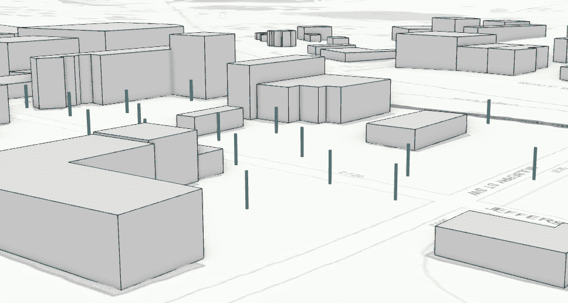

从前面的截图可以看出，这个场景中的建筑物最初是一个二维多边形图层，它仅显示了建筑物在地面的足迹。通过拉伸它们，你现在可以看到它们相对于地面的高度，从而更深入地理解它们与其他特征之间的空间关系。电杆最初是一个二维点图层，通过拉伸来显示它们的高度。现在，你可以可视化建筑物和电杆之间的关系。

ArcGIS Pro 提供了四种拉伸要素的方法。你使用哪种方法将取决于你为你的要素拥有的信息，如下表详细说明：

| **拉伸类型** | **描述** | **要求** | **数据类型** |
| --- | --- | --- | --- |
| 最小高度 | 这会将拉伸高度添加到最小 **z** 值，产生一个平顶特征。 | 它需要一个包含特征沿地面表面最低点海拔值的属性字段。 | 线或多边形 |
| 最大高度 | 这会将拉伸高度添加到最大 **z** 值，产生一个平顶特征。 | 它需要一个包含特征在其地面表面最高点海拔值的属性字段。 | 线或多边形 |
| 基础高度 | 这会将拉伸添加到每个特征顶点的基础海拔。结果可能不是平顶，这取决于特征顶点的基础高度。 | 不需要属性字段。但是，如果可用，拉伸可以基于如测量高度等字段。 | 点、线和多边形 |
| 绝对高度 | 特征将被拉伸到指定的高度，无论基础海拔或其他 *z* 值如何。 | 它需要一个包含每个特征顶部海拔值的属性字段。 | 点、线和多边形 |

拉伸是我们可以用 3D 显示 GIS 数据的许多方法之一。在下一节中，你将探索一些你可以使用的其他方法。最适合你的方法将取决于你的数据——例如，它是否实际存储了 *z* 坐标或在其属性中存储了海拔或高度信息。

## 显示 3D 数据的其他方法

拉伸不是显示 3D 数据的唯一方法。ArcGIS Pro 包含许多 3D 符号样式，可以为你的场景添加一层现实感。3D 符号旨在使用通常预期的纹理、材料和细节来显示特征。例如，它们可以为建筑物提供砖的外观，或者显示一个看起来真实的消防栓，就像你在路上开车时可能会看到的那样。通常，这些符号具有内置的 3D 设置，不需要将特征拉伸。

如果你拥有 3D Analyst 扩展，你也可以使用 **CityEngine** 符号规则来应用更加逼真的场景。CityEngine 是 Esri 的另一个应用程序，允许用户创建他们数据的先进 3D 渲染。

以下截图展示了使用 ArcGIS Pro 中的 3D 符号样式所能实现的效果示例。在这里，你可以看到包含建筑物、路灯、消防栓和电力杆的逼真街道景观：

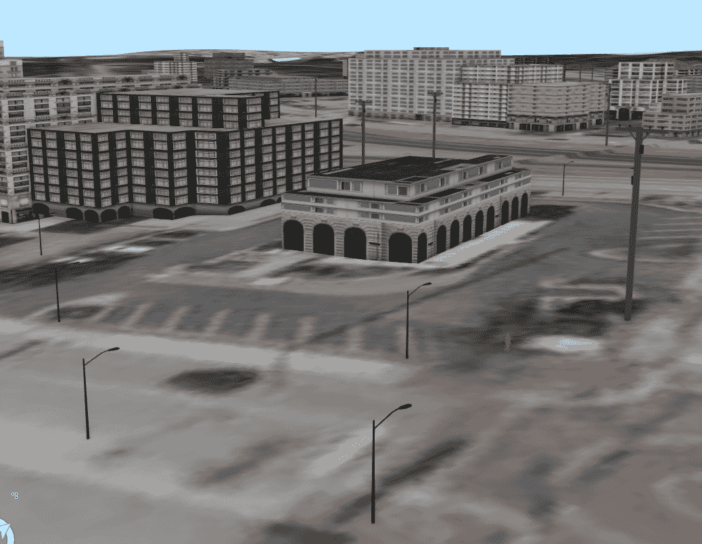

让我们继续进行练习，以更好地理解高级 3D 渲染。这将为你提供一些实际操作经验，使用你刚刚学到的一些方法。

## 练习 4B – 创建本地场景

本练习的场景如下：一位**社区和经济发展主任**正在制作一个他们将向一群关心市民展示的演示文稿。他们要求你创建一个可用于演示文稿的中央商业区 3D 场景。

在这个练习中，你将创建一个本地场景以满足主任的要求。这个场景将使用一个本地开发的、比 Esri 世界高程模型更精确的 DEM。然后，你将添加并使用 3D 符号化图层来创建一个更逼真的场景。

### 第 1 步 - 打开项目并添加本地场景

在这一步，你将打开你创建的最后一个项目并添加一个新的本地场景。为此，我们遵循以下步骤：

1.  启动 ArcGIS Pro。

1.  打开你在*练习 4A*部分创建的项目。这应该在你最近打开的项目列表中。

1.  在目录面板中，右键单击地图文件夹并选择新建本地场景。

1.  一旦生成了新的场景，右键单击它并从出现的菜单中选择重命名，如图所示：

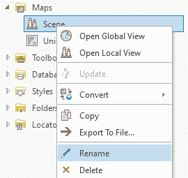

1.  将新名称输入为“Local Scene”，然后按你的*Enter*键。

你刚刚在你的上一个练习中创建的项目中创建了一个新的本地场景。记住——一个项目可以包含多个地图和场景。这使得管理和访问更加容易。

### 第 2 步 - 设置地面表面

在这一步，你将分配城市工程师提供的 DEM 作为地面表面。这个 DEM 是由城市工程师根据他们从专业测量员那里收集的测量数据创建的。我们使用以下步骤来分配 DEM：

1.  在功能区中，点击地图选项卡。

1.  点击添加数据按钮下的小下拉箭头以展开菜单。

1.  从菜单中选择高程源。这位于菜单的底部附近，如图所示：

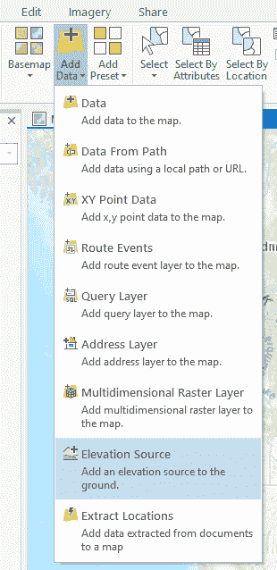

1.  然后，在添加高程源窗口的左侧面板中，选择位于项目下的数据库。

1.  之后，在窗口的右侧面板中，双击 Trippville_GIS.gdb 地理数据库。

1.  然后，从窗口的右侧面板中选择 DEM 并点击确定。

现在，DEM 应该出现在内容面板下的高程表面类别中。如以下截图所示，你的场景现在有两个地面表面——你刚刚添加的 DEM 表面和来自 ArcGIS Online 的 WorldElevation3D/Terrain3D 表面：

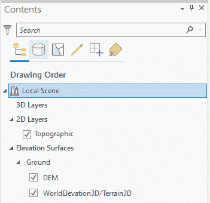

现在，你将从你的场景中移除 WorldElevation3D/Terrain3D 表面。你不需要使用 Esri 提供的这个表面，因为你有自己的，它覆盖了你正在工作的整个城市区域。

1.  然后，右键单击 WorldElevation3D/Terrain3D 表面并从菜单中选择移除，如图所示：

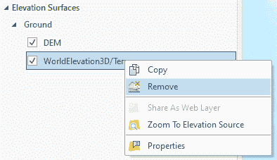

你刚刚已经将场景的地表设置为城市工程师提供的 DEM。如果你的场景目前看起来是空的，请不要担心。当你向场景添加更多层时，这个问题将会解决。

### 第 3 步 - 添加图层和设置符号

现在你已经定义了地表，是时候开始按照以下步骤添加导演要求的图层了：

1.  使用你学到的技能，将以下层添加到你的场景中，来自`Trippville_GIS.gdb`地理数据库：

    +   建筑物：位于`基础要素`数据集中。

    +   Fire_hyd：位于`水要素`数据集中。

    +   Light_Poles：位于地理数据库的根目录。

1.  然后，将建筑物层拖动到 3D 组层。

1.  单击位于图层名称下方的小符号，如图所示打开界面右侧的符号面板：

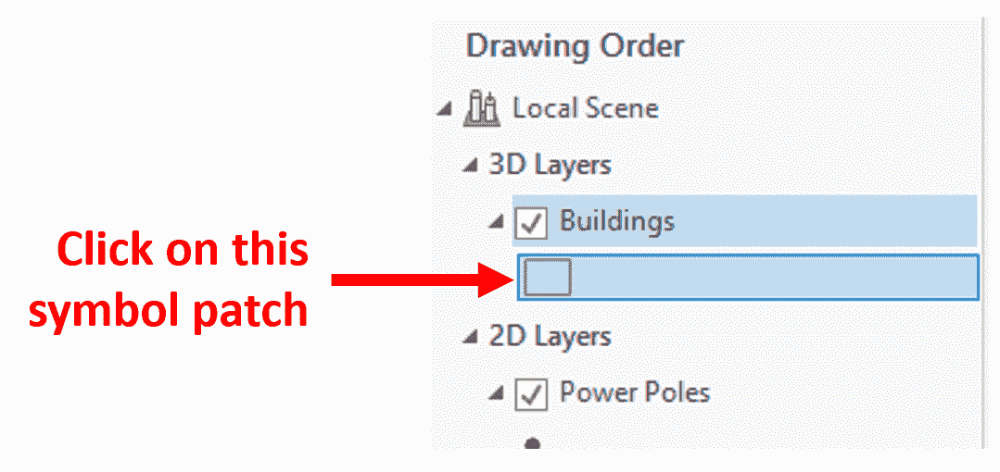

1.  确保在符号面板的顶部选择了图库选项卡。然后，在搜索区域中键入`Building`，然后在搜索单元格右侧的下拉框中将搜索设置为所有样式。

1.  在程序符号下选择“国际建筑”，然后右键单击建筑物层并选择缩放到图层。然后，确保在功能区地图选项卡上选择了探索工具。

1.  将鼠标指针放在一栋建筑的中心附近，并按下鼠标的滚轮。在按住滚轮的同时，将鼠标指针移动到场景的顶部，以旋转场景，这样你可以查看建筑物层的高度，该层现在使用你刚刚应用的三维符号样式。

一旦你旋转了场景，放大以获得更近的查看。你的场景应该看起来与以下截图相似。你会注意到你的建筑物现在比在上一项练习中仅仅拉伸时要逼真得多：

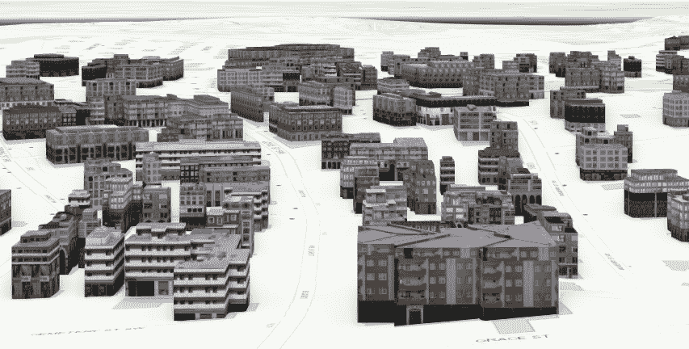

你的场景看起来可能不会与之前的截图完全一样，因为你的比例、旋转和位置可能不同。然而，你的建筑物的外观应该相似。

1.  现在，将灯柱层拖动到 3D 类别。

1.  然后，单击位于图层名称下方的小点符号。

1.  在符号面板中，首先，确保图库选项卡处于活动状态，然后在搜索区域中键入`Light`。你可能还需要确保仍然将所有样式设置为搜索选项。

1.  然后，从 3D 街道场景中选择“灯亮柱 - 灯灭”符号，因为这个符号与 Trippville 市使用的符号最接近（如果你希望选择不同的一个，也可以）。

1.  然后，在灯柱层上右键单击，选择属性，然后在左侧面板中单击显示选项。

1.  然后，勾选显示 3D 符号以实际单位表示的复选框，然后单击确定。

这样可以让你设置灯柱的正确高度。城市中使用的灯柱标准高度是 18 英尺。在设置灯柱高度之前，你还需要对项目设置进行一项更改。默认情况下，3D 符号使用米作为指定高度的单位。你需要在项目选项中将其更改为英尺。

1.  在功能区中点击项目选项卡，然后选择选项，接着在项目下点击单位。

1.  展开 3D 符号显示单位，然后点击以下截图所示的网格中行末的 Foot_US 单选按钮：

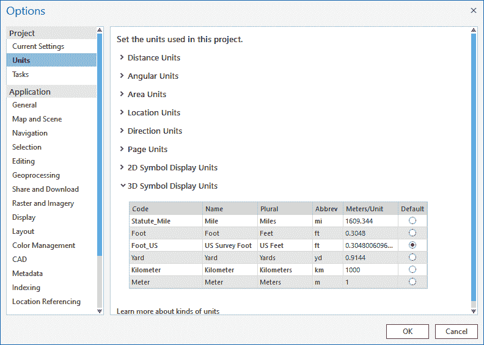

1.  一旦你确认了设置，点击确定。

1.  点击项目窗口左上角的返回箭头，返回到你的场景。

1.  然后，保存你的项目。

1.  之后，点击位于灯柱层名称下方的位置的符号修补。

1.  然后，在符号选项卡中点击属性选项，确保灯柱层仍然被选中。

1.  之后，将大小选项设置为`18`英尺，然后点击应用。

1.  为 Fire_Hyd 层重复此过程，并使用以下设置：

    +   在符号字段中选择消防栓。

    +   将高度字段设置为`3`点。

你的场景现在应该看起来与这个相似，这取决于你的旋转和缩放比例，如果你已经正确应用了所有设置：

你几乎完成了。现在，你需要应用一个底图，它添加了一个更逼真的背景，并将天空应用到场景中。

1.  在功能区地图选项卡中点击底图按钮。

1.  选择影像底图。这将允许你使用航空摄影作为底图，这将为场景增添一丝现实感。

1.  现在，为了添加天空，你需要将填充应用到整个场景。在内容窗格中右键单击本地场景，然后选择属性。

1.  然后，在地图属性窗口的左侧窗格中选择常规选项。

1.  将背景颜色选项设置为天青石蓝，使用下拉箭头显示调色板（如果你认为另一种颜色会更好，可以选择不同的颜色），然后点击确定。

1.  最后，保存你的项目。花些时间在刚刚创建的场景中进行平移、旋转和缩放。它看起来非常逼真，这正是导演所希望达成的效果。

你的最终场景应该看起来与这个相似（你的可能因旋转和比例略有不同）：

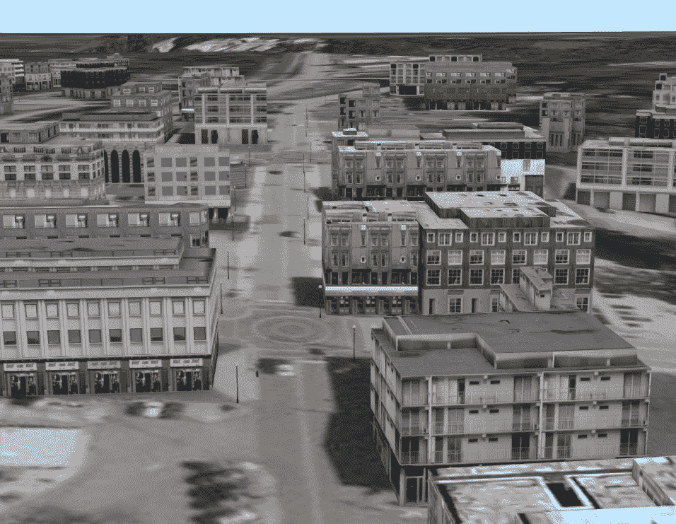

恭喜！你已经创建了一个看起来逼真的市中心区域的 3D 可视化。现在，请确保保存你的项目，以免丢失你已完成的所有辛勤工作。

# 摘要

现在，你已经看到 ArcGIS Pro 支持一些非常强大的工具，用于在 3D 中可视化数据。这为使用你的 GIS 数据提供了新的理解层次。你已经学会了如何创建不同的场景来支持不同的空间范围。

你还学习了如何使用不同的方法将 2D 数据转换为 3D 特征，使用拉伸或 3D 符号样式。在使用拉伸时，你可以使用 ArcGIS Pro 支持的四种方法之一来展示特征的真正高度。现在，你可以使用 3D 符号为你的场景添加一层视觉真实感。

创建 3D 场景的关键要素是定义地面表面。你了解到可以使用默认的 Esri 提供的全球高程表面或你自己的表面。现在，你能够使用你自己的表面——这可以是数字高程模型（DEM）或不规则三角网（TIN）。使用你自己的地面表面可以提高场景内高程数据的精度以及沿*Z*轴的特征之间的关系。

在下一章中，你将学习更多关于项目如何在 ArcGIS Pro 中工作。到目前为止，你主要在已经创建的项目上工作。接下来，你将探索组成 ArcGIS Pro 项目的各个部分以及如何自己创建新的项目。

# 进一步阅读

如果你想要更详细地探索这些概念，你可能想要查看以下内容：

+   *ArcGIS Pro 2.X 烹饪书*，*第十章**，3D 地图和 3D 分析***
