创建和使用项目

**ArcGIS Pro**重新引入了项目概念给 Esri 用户。Esri 最初通过他们的**ArcView** **GIS**应用程序使用项目文件来管理您的**地理信息系统**（**GIS**）。ArcView GIS 使用项目来管理地图布局、视图、表格、数据连接等，所有这些都在一个单一的`.apr`文件中。这使得我们可以从单一位置访问与项目相关的所有内容。

当 Esri 在 1999 年发布 ArcGIS 时，之前描述的方法被放弃。取而代之的是，Esri 决定使用单独的文件，称为**地图文档**（`.mxd`文件）来为**ArcMap**使用。地图文档包含一个地图和一个或多个数据框架。因此，对于您需要的每个地图，您将不得不创建一个单独的地图文档。如果您还需要创建 3D 地图，您将需要另一个单独的文件，称为场景（`.sxd`）。所有这些都意味着您通常需要管理并跟踪成百上千个文件，这使得管理变得更加困难。

**ArcGIS Pro 项目**极大地简化了 GIS 管理。现在，项目允许您将完成项目所需的所有资源集中在一个地方。因此，本章将帮助您了解您不再需要搜索正确的地图文档。您只需打开您感兴趣项目的 ArcGIS Pro 项目文件，所有地图、数据连接、布局、工具等都会出现在那里。本章还将帮助您更快地定位服务。此外，完成本章后，您将能够创建自己的项目和模板。

在本章中，您将学习如何使用项目。这包括以下主题：

+   使用 ArcGIS Pro 项目

+   创建新项目和项目模板

+   创建自定义项目模板

# 技术要求

要完成本章的练习，您需要访问**ArcGIS Pro 2.6**或更高版本。任何软件许可级别都足够。

# 使用 ArcGIS Pro 项目

ArcGIS Pro 使用项目文件而不是地图文档和场景来访问 GIS 数据、制作地图、执行分析和共享工作。项目文件具有`.aprx`文件扩展名，并包含完成特定项目所需的全部 GIS 资源。项目可以在本地网络中创建和共享，以便项目团队中的其他人可以快速访问他们完成分配任务所需的资源。

本节将通过实际操作练习帮助您学习如何使用 Esri 模板创建新项目。

每个项目都将包含与每个特定项目相关的组件和资源。其中一些组件和资源将适用于多个项目，而其他一些则仅适用于单个项目。因此，仅仅因为某个组件或资源与一个项目相关联，并不意味着它不能用于另一个项目。

项目也有与之相关的术语。在处理项目时理解这些术语将非常重要。我们现在将开始探讨与项目相关的术语以及可以包含在项目中的某些组件或资源。

## 理解项目术语

与 ArcGIS Pro 应用程序一样，ArcGIS Pro 中的项目也有与之相关的特定词汇。我们将快速定义一些这些术语，以便您在阅读本书、参加研讨会、在 Esri 出版物中看到它们时，可以开始理解它们的含义：

+   **项目项**：项目项是指存储在 ArcGIS Pro 项目中的任何项目、组件或资源。项目项包括地图、场景、文件夹连接、数据库连接、ArcGIS Server 连接、**Web 地图服务**（WMS）连接、工具箱、定位器等。这些项目项可以通过 ArcGIS Pro 中的目录窗格或目录视图访问。

+   **门户**：在 ArcGIS Pro 中，“门户”指的是连接到**ArcGIS Online**或**Portal for ArcGIS**。ArcGIS Online 是 Esri 的云解决方案，用于存储和访问 GIS 资源，包括地图、数据和应用程序。Portal for ArcGIS 提供了与 ArcGIS Online 相同的功能，但它是安装在您的组织本地基础设施上并托管在该基础设施上的。Portal for ArcGIS 也是**ArcGIS Enterprise**的一部分，之前称为**ArcGIS Server**。

+   **门户项**：门户项是指通过指定门户访问的任何项目。门户项可能包括网络地图、要素层、瓦片层、层包、地图包和项目包。

+   **项目包**：项目包类似于层或地图包。它将一个项目相关的所有项目项打包或压缩成一个单一的整合文件。项目包可以用来与他人分享项目，即使他们没有连接到您的网络，也可以用来归档项目。项目包将具有`.ppkx`文件扩展名，可以存储在本地文件夹或上传到您的门户。

+   **“主页”文件夹**： “主页”文件夹指的是存储项目文件的文件夹。除非用户指定了不同的位置，否则“主页”文件夹是 ArcGIS Pro 创建特定项目内容的地方。要更改“主页”文件夹，只能通过将项目保存到不同的文件夹来实现。新项目的默认主页文件夹是`C:\Users\%user name%\Documents\ArcGIS\Projects`。

+   **默认地理数据库**：默认地理数据库被地理处理工具用作结果输出元素的自动默认工作空间。这意味着由分析、转换和其他工具使用产生的新要素类将自动保存到默认地理数据库中，除非你指定了不同的位置。任何地理数据库都可以用作默认地理数据库。当创建新项目时，ArcGIS Pro 将在“主页”文件夹中自动为项目创建一个新的地理数据库文件。

现在你已经了解了一些与项目相关的术语，是时候看看如何管理一个项目了。正如你将看到的，一个单独的 ArcGIS Pro 项目可以包含大量项目。在下一节中，你将学习如何使用目录窗格来管理和访问这些项目。

### 使用目录窗格

当你在 ArcGIS Pro 中打开项目或创建新项目时，目录窗格将是您首先看到的内容之一。默认情况下，它将位于 ArcGIS Pro 界面的右侧，与内容窗格相对。

目录窗格包含以下内容：

+   项目标签页

+   章节门户

+   收藏夹标签页

我们将在接下来的章节中查看这些元素。

#### 项目标签页

目录窗格提供了对项目元素的访问。从那里，你可以访问地图、场景、文件夹连接、布局、数据库连接以及其他与项目相关的元素，如下面的截图所示：

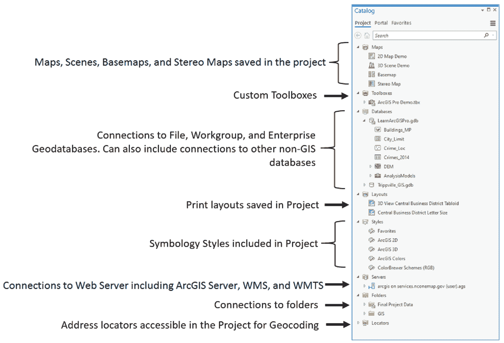

如前一个截图所示，目录窗格顶部有三个标签页——项目、章节和收藏夹。项目标签页允许你访问存储在项目中的项目元素，例如地图或布局，或者为项目建立了连接的元素，例如文件夹、数据库或网络连接。应指出的是，ArcGIS Pro 不支持个人地理数据库。然而，文件、工作组和企业地理数据库是受支持的。

现在我们将转到章节门户部分。

#### 章节门户

章节门户提供了访问你已建立的 ArcGIS Online 或 Portal for ArcGIS 连接的途径。从该标签页，你可以访问已发布的内容以及你有权限使用的内容。这可能包括网络地图、要素层和网络应用程序。章节门户上有四个按钮：

+   我的文档：第一个按钮是“我的文档”。这允许你访问你在 ArcGIS Online 或 Portal for ArcGIS 中创建的内容。这可能包括网络地图、网络场景、仪表板、图层包等：

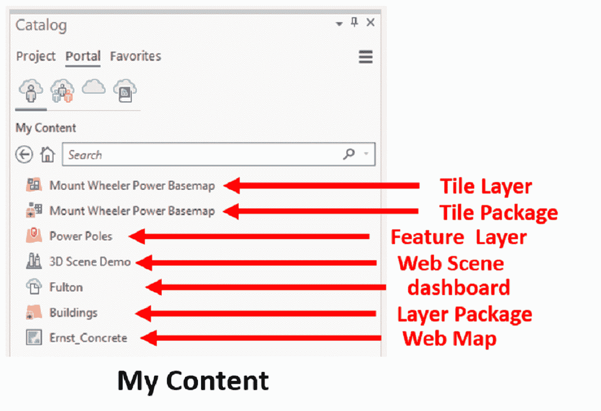

+   组：第二个按钮是“组”。此按钮允许你查看你作为成员的各个组以及共享到这些组的内容：

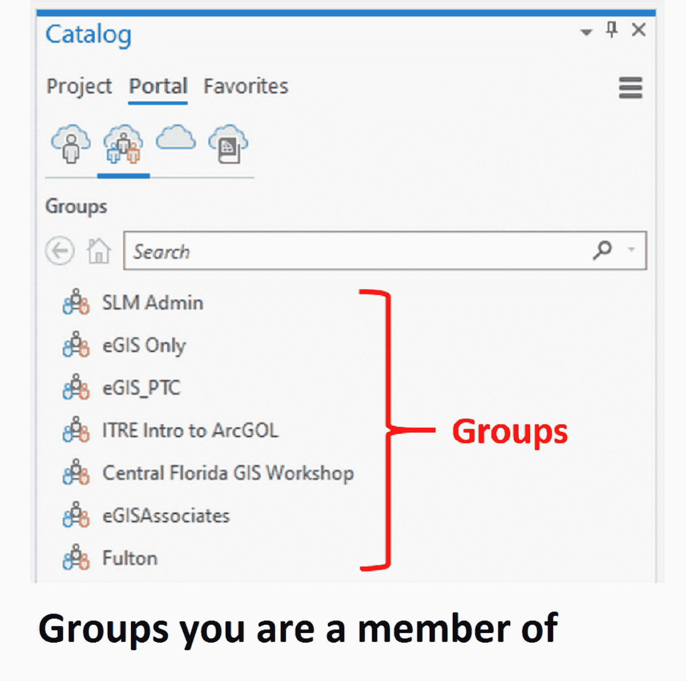

+   所有门户：下一个按钮是所有门户。这允许您查看您连接的所有门户（除了您的主门户）中与您共享的内容。如果您连接到 ArcGIS Online，这包括任何在 ArcGIS Online 中发布并与所有人共享的数据。由于可能可用的大量数据，当您点击此按钮时，内容区域将显示为空白。因此，您必须搜索内容才能使其出现。以下截图显示了所有门户标签页：

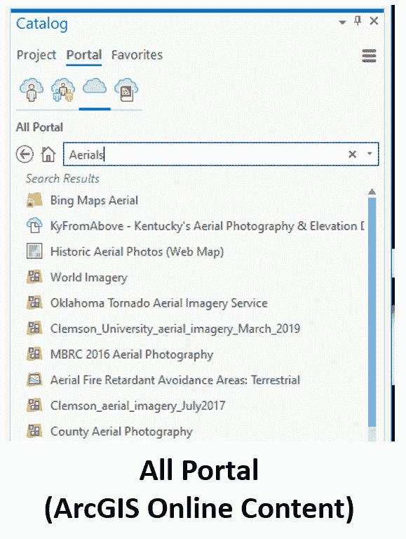

+   动态地图集：最后一个按钮是动态地图集。Esri 的动态地图集功能提供您可以从权威来源访问的数据：

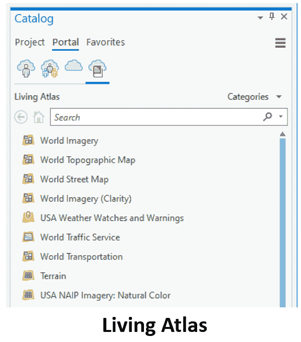

任何拥有账户的人都可以发布一般 ArcGIS Online 内容，但只有经过审查的贡献者才能将数据发布到动态地图集。如果您正在寻找可以有一定信任程度的数据，这是一个很好的起点。

我们现在将进入收藏夹标签页部分。

#### 收藏夹标签页

目录窗格中的收藏夹标签页允许您存储您在多个项目中经常使用的数据库、文件夹和服务器连接。这提供了从 ArcGIS Pro 轻松访问这些资源的能力，并能够快速将它们添加到当前活动项目中。

例如，如果您的组织有一个用于所有项目的首选 GIS 数据库，那么您可能希望将其添加为收藏夹，这样您就可以在开始新项目时轻松将其添加到新项目中。以下截图显示了收藏夹连接的一些示例：

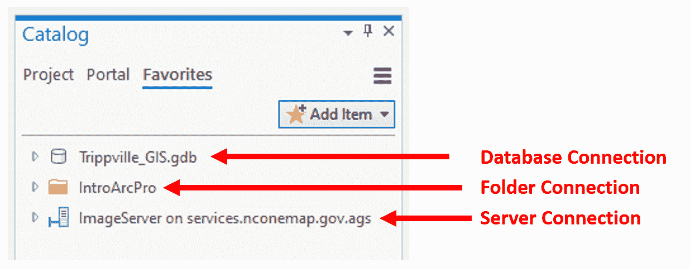

如您从前面的截图中所见，收藏夹作为您用户配置文件的一部分存储，就像您的**Windows**中的“文档”文件夹一样。如果您的组织使用漫游配置文件，那么您的 ArcGIS 收藏夹将在您的网络中的计算机之间跟随您。

如果您的组织仅使用本地配置文件，这在很大程度上很常见，那么您的收藏夹将仅可在您添加资源到收藏夹时使用的计算机上。截至 ArcGIS Pro 2.5 及更早版本，没有方法可以与他人或整个组织共享收藏夹。

一旦某个项目已添加到您的收藏夹中，您还可以选择将该项目自动添加到您创建的任何新项目中。这意味着它将自动出现在每个新创建项目的目录窗格和项目标签页中。

现在您已经学习了与项目相关的一些术语，并且已经介绍了目录窗格，是时候看到它在实际中的应用了。

## 练习 5A – 使用目录窗格

在这个练习中，您将努力创建一个显示 Union City 的洪泛区和排水流域的地图。您将需要使用目录窗格来建立几个连接，包括地理数据库和服务器，以访问创建地图所需的其他信息。您将从包含在您下载的数据中的现有项目开始，该项目已经包含了一个基本的地图。

### 第 1 步 – 打开和保存项目

在此步骤中，您将打开一个现有项目并将其保存。这将是在此练习期间您将继续工作的项目：

1.  启动 ArcGIS Pro。再次提醒，您将需要一个互联网连接并访问 ArcGIS Online。

1.  使用您在过去章节中学到的技能，打开位于`C:\Student\IntroArcPro\Chapter5`的 ArcGIS Pro `练习 5A`项目。

1.  然后，将项目保存为`%your name% Ex5A`（例如，`Tripp Ex5A.aprx`）。将项目保存在上一步中打开的位置。

如果您已成功打开并保存了正确的项目，您应该会看到以下视觉效果：

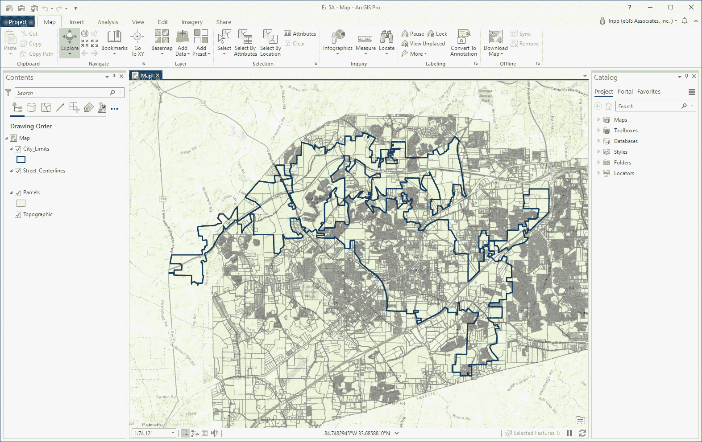

现在，让我们继续练习并进入下一步，在那里您将使用目录窗格来探索您刚刚打开的项目。

### 第 2 步 – 导航目录窗格

现在您已经打开了项目，您应该看到位于 ArcGIS Pro 界面右侧的目录窗格。在此步骤中，您将看到目录窗格中已经可用的内容：

1.  在目录窗格中，点击位于地图左侧的小箭头以展开该部分。

问题：*在地图下您看到了哪些列表？*

1.  在同一窗格下展开数据库部分。

问题：*在数据库部分下您看到了哪些列表？*

1.  展开 ArcGIS Pro `练习 5A`地理数据库以查看它包含哪些要素类。

1.  将地图中的图层与项目的地理数据库中的要素类进行比较。

问题：*地图是否包含引用地理数据库中所有要素类的所有图层？项目地理数据库是否包含代表洪泛区和排水流域的要素类？*

1.  展开目录窗格中的其他部分，以查看您目前可以访问的其他项目项。

问题：*在此项目中目前还有哪些其他项目可用？*

1.  在目录窗格中点击门户标签页。默认情况下，您将开始于我的内容列表。

1.  通过将指针移到一些门户项目上，探索您在“我的内容”列表中可用的门户项目。

如果您从未向 ArcGIS Online 或 ArcGIS Portal 发布过任何内容，您可能什么也看不到。在本书的后面部分，您将发布地图和项目到 ArcGIS Online。这些项目将随后出现在您的门户和我的内容列表中。

1.  点击门户标签页上的“组”按钮，以查看您是成员或可以访问的组。

问题：*您看到了哪些组？*

如果您之前在 ArcGIS Online 或 Portal for ArcGIS 中没有为您的组织创建组，您可能在这里看不到任何内容。随着您的组织更多地使用这些技术，预计组列表将增长。

### 第 3 步 – 添加数据库连接

在此步骤中，您将添加到另一个包含您为此项目所需附加数据的地理数据库的连接：

1.  在目录窗格中点击回“项目”选项卡。

1.  右键单击数据库，然后点击添加数据库，如下面的截图所示：

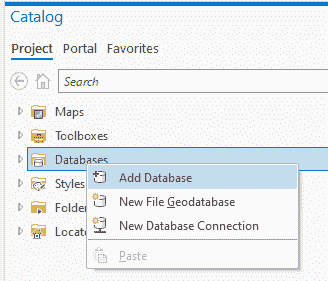

1.  在“选择现有地理数据库”窗口中，导航到`C:\Student\IntroArcPro\Databases`。选择`UnionCity.gdb`并点击打开。现在您应该在 ArcGIS Pro Exercise 5A 项目地理数据库下方的目录窗格中看到`UnionCity`地理数据库。`UnionCity`地理数据库包含您需要添加到地图中的附加图层。

1.  扩展 UnionCity 地理数据库，以便您可以看到它包含哪些要素类。选择 Floodplains 要素类。

1.  按住*Ctrl*键，选择 Watersheds 要素类。

1.  右键单击选定的两个要素类之一，然后选择“添加到当前地图”选项。

您的地图应该看起来与以下截图中的地图相似：

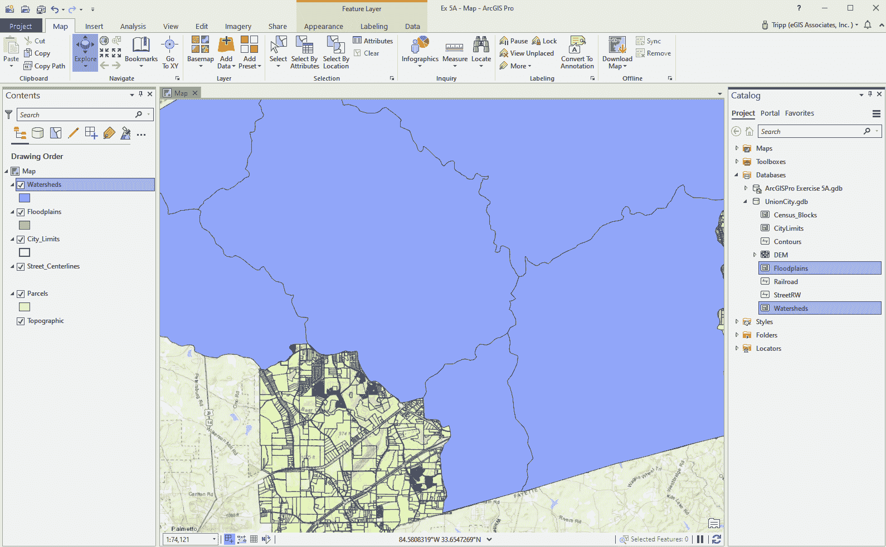

在您连接到该地理数据库后，您已经从不同的地理数据库中添加了两个图层到您的地图中。

您的颜色可能不同，这取决于 ArcGIS Pro 为新添加的图层分配了什么颜色。请记住，ArcGIS Pro 为地图中添加的新图层分配随机颜色。

虽然图层现在在地图上可见，但您需要对图层进行一些调整以提高地图的可读性。

### 第 4 步 – 调整图层

在此步骤中，您将更改符号和图层顺序，以便地图更容易阅读。首先，您将更改图层绘制顺序：

1.  在 ArcGIS Pro 界面左侧的“内容”窗格中选择 Watersheds 图层。

1.  在按住鼠标左键的同时，将 Watersheds 图层拖动到图层列表中的 Parcels 图层下方。

1.  现在，将 Floodplains 图层拖动到 Parcels 图层下方但 Watersheds 图层上方，如下面的截图所示：

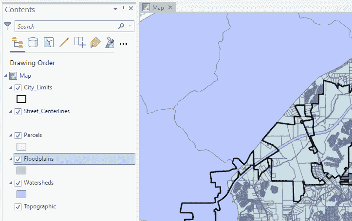

1.  右键单击 Floodplains 图层并选择“缩放到图层”。

现在您已经按照您想要的顺序排列了绘图图层，是时候为每个图层工作符号了。首先，您需要为项目添加一个包含洪水平原符号的新样式。

1.  在目录窗格中，右键单击样式，然后选择添加 | 添加样式，如下面的截图所示：

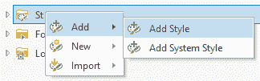

1.  在“添加样式文件”窗口中，点击左侧面板中位于项目下的文件夹。

1.  双击窗口右侧面板中的 Chaper5A 文件夹。

1.  选择 ESRI.stylx 并点击确定。如果你被要求升级样式，请点击是。

此样式最初来自 Esri 的较老版本的**ArcMap**产品。ArcGIS Pro 能够使用通过此方法创建的、用于与 ArcMap 一起使用的样式。

你刚刚将此新样式添加到你的项目中，这将允许你使用其中包含的符号为你的地图图层使用。样式存储符号、颜色、北箭头、比例尺和其他用于创建地图和布局的地图元素。

1.  点击位于地块图层下方的符号补丁，以打开符号面板。

1.  点击属性标签页，并使用下拉箭头将颜色设置为无颜色。

1.  确保轮廓颜色设置为黑色，然后点击应用。

1.  在内容面板中选择洪水平原图层。

1.  从功能区选择外观组标签页。

1.  点击符号下拉箭头并选择唯一值。这将打开 ArcGIS Pro 界面右侧的符号面板。

符号面板的内容应该会发生变化。你现在应该能看到选择用于控制符号的字段选项，以及一个颜色方案选项、一个类别标签页和一个比例标签页。我们将配置其中一些选项，以便根据与此图层关联的属性表中存储的值来符号化洪水平原图层。

1.  对于字段 1，选择 SFHA，如以下截图所示。此字段用于指定一个区域是否位于**特殊洪水危险区**（**SFHA**）内或外，这通常也被称为 100 年洪水区。你想要符号化位于 SHFA 内的区域：

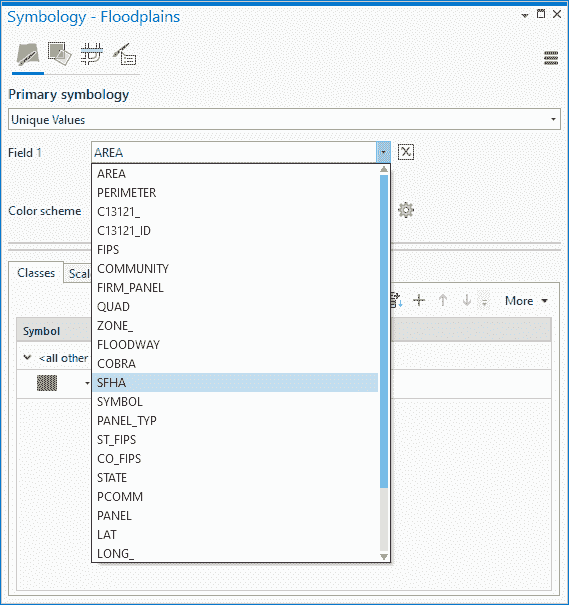

1.  点击网格中位于 IN 旁边的符号补丁。

1.  确保在符号面板中选择图库标签页。

1.  在符号面板顶部的搜索栏中，键入`Flood`并按*Enter*键。

1.  选择名为 100 Year Flood Overlay 的符号。请注意，这位于你添加到项目的 Esri 样式中。它仅可供你使用，因为你添加了它。

1.  点击符号面板左上角的位置处的返回箭头，以返回到洪水平原图层的设置。

1.  点击 OUT 旁边的符号补丁，并将其设置为空心。如有需要，再次使用搜索功能。

1.  点击返回箭头以返回到唯一值设置。

1.  在符号网格中，选择显示为 SFHA 的位置，并键入`100 Year Floodplain`以替换它，如以下截图所示：

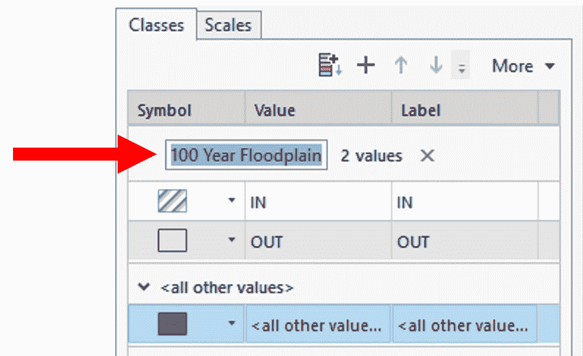

1.  点击位于符号网格上方右侧的更多选项，并取消选择或取消勾选显示所有其他值，如以下截图所示。这将移除值在内容面板和图例中显示：

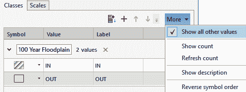

因此，您现在已向项目中添加了新的样式，并使用该样式中的符号更新了 Floodplains 图层的符号。您还有一个图层需要调整，即 Watershed 图层。我们现在将使用现有的图层文件应用符号到这个图层。

1.  在内容窗格中选择 Watersheds 图层。

1.  在功能区中选择“外观”选项卡。

1.  点击“导入”工具。这将打开界面右侧的地理处理窗格。

1.  点击位于符号图层旁边的浏览按钮。

1.  在左侧面板的“项目”下点击“文件夹”选项。

1.  选择 Watersheds.lyrx 文件并点击“确定”。

1.  确保在地理处理窗格中的符号字段下，类型字段设置为 Value_Field，源字段设置为 WATERSHED，目标字段设置为 WATERSHED，如下面的截图所示：

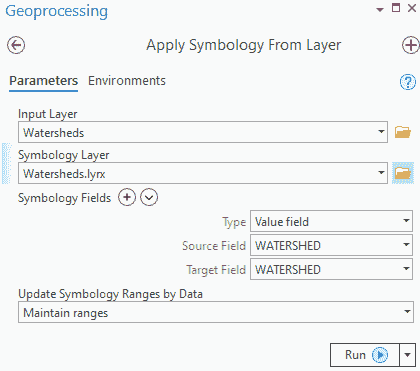

1.  一旦您已验证符号字段选项，请点击地理处理窗格底部的“运行”按钮。

您的地图现在应该看起来与下面的截图相似：

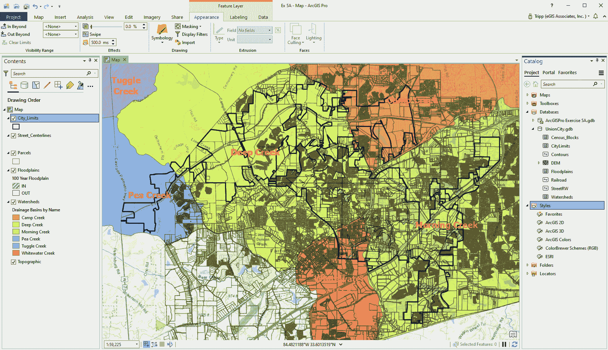

您刚刚使用图层文件调整了 Watershed 图层的外观。图层文件不仅可以用来应用符号设置，还可以用来应用其他图层属性，如**标签**。您还可以看到每个流域都标有它的名称。

1.  保存您的项目。

因此，您已经向地图添加了多个图层，并对添加的图层进行了多次调整。您在内容窗格中调整了绘制顺序，以便每个图层都可见。然后，您使用不同的方法更改了这些图层使用的符号。

### 第 5 步 – 从门户访问和添加图层（可选）

我们几乎完成了。假设在最后一分钟，决定您需要将航空照片添加到地图上。您被指示使用由 Fulton County 提供的 ArcGIS Online 服务。我们将使用以下步骤：

1.  在目录窗格中，选择顶部的“门户”选项卡。

1.  选择“所有门户”按钮，以便您可以访问和搜索所有 ArcGIS Online 内容。

1.  在搜索框中输入`Fulton County Pictometry Imagery`并按您的*Enter*键。

1.  滚动并找到最新的`Pictometry`瓦片图像服务，如下面的截图所示：

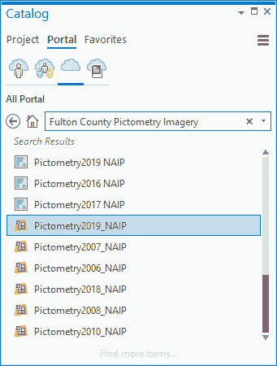

您应该记住，瓦片图像服务将由一个带有几个绿色蓝色正方形的黄色梯形表示。不要将瓦片图像服务与地图服务混淆。

1.  右键点击最新图像，例如 Pictometry2019_NAIP 瓦片服务，然后选择“添加到当前地图”。

1.  保存您的项目。

您现在已从您的门户连接中向地图添加了航空摄影图层。接下来，让我们探索如何在目录窗格中添加收藏夹。

### 第 6 步 – 将文件夹连接添加为收藏夹

正如你所知，这本书中你一直在使用的数据都存储在一个单独的文件夹中——`IntroArcPro`。因此，你将把这个文件夹添加到目录窗格的收藏夹标签页中，以便在需要时轻松访问：

1.  在目录窗格中，点击收藏夹标签。

1.  在右侧，点击添加项目按钮，并从出现的菜单中选择添加文件夹，如图所示：

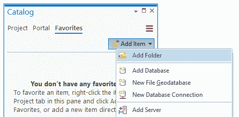

1.  在添加文件夹连接窗口中，展开左侧面板中的计算机选项，以便你可以看到其内容。

1.  点击 C:驱动器，以便其内容出现在窗口的右侧面板中。

1.  滚动直到你看到学生文件夹，然后双击它。

1.  选择 IntroArcPro 文件夹并点击确定。

现在，你应该在目录窗格的收藏夹列表中看到`IntroArcPro`文件夹。这个文件夹将现在始终出现在你使用的计算机上的这个列表中，直到你决定将其移除。接下来，我们将把这个收藏夹添加到你的项目中。

### 第 7 步 – 将收藏夹添加到项目中

现在你已经将一个收藏夹添加到你的列表中，你仍然需要将其添加到当前项目中作为连接。由于文件夹连接现在是收藏夹，所以这样做很容易。在这个步骤中，你将看到如何轻松地将它添加到当前打开的项目中：

1.  在目录窗格中，点击收藏夹标签，然后右键单击你在上一步中添加的 IntroArcPro 文件夹连接。

1.  从出现的菜单中选择“添加到项目”，如图所示：

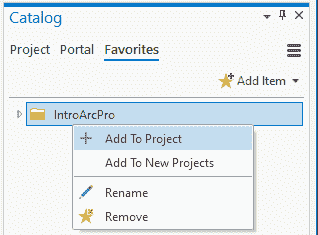

1.  现在，点击目录窗格中的“项目”标签。

1.  展开文件夹文件夹，以便你可以看到在此项目中可用的文件夹连接。

你应该看到两个文件夹连接可用——`Chapter5`和`IntroArcPro`。`IntroArcPro`连接是你刚刚从收藏夹中添加的。现在，存储在`IntroArcPro`文件夹中的所有数据和其它文件夹都可供你访问和使用在你正在工作的项目中。你也将能够同样快速地将`IntroArcPro`连接添加到你现在或未来工作的任何其他项目中。

1.  保存你的项目并关闭 ArcGIS Pro。

在这个练习中，你学习了如何导航目录窗格以及如何使用它来向你的地图添加新图层。你还学习了如何访问门户连接并创建可以轻松添加到项目的收藏夹连接。接下来，你将探索如何从头开始创建新项目。

# 创建新项目和项目模板

正如你所见，项目是 ArcGIS Pro 的核心。它们包含用户完成各种 GIS 任务所需的所有内容。到目前为止，你使用的项目已经为你创建好了。它们包括地图、三维场景和各种连接。*那么，你是如何从头创建一个新项目的呢？*

在本节中，您将学习如何使用 Esri 提供的模板之一创建新项目。然后，您将学习如何创建自己的模板，以便用于创建新项目。

## 使用 Esri 模板创建新项目

当您打开 ArcGIS Pro 时，您可以选择打开现有项目或创建新项目。如果您选择创建新项目，首先选择一个模板。模板会自动在创建的新项目中生成内容和连接。模板可以创建地图、场景、布局、文件夹连接、数据库连接等。

除了模板创建的内容外，在 `Home` 文件夹中还会创建一个新的项目特定文件地理数据库和工具箱。请记住，`Home` 文件夹是我们创建的新项目的文件夹。您的新项目将自动将这些设置为默认的地理数据库和工具箱。

Esri 已经创建了一些模板，您可以在安装 ArcGIS Pro 后立即开始创建新项目。这包括四个模板，每个模板都有特定的用途。具体如下：

| **Esri 模板名称** | **一般描述** |
| --- | --- |
| `Map` | 主要用于二维数据。自动包含一个包含您组织默认底图层的二维地图。 |
| `Catalog` | 创建一个完全空的新项目，没有地图、场景或布局。这在 ArcGIS Pro 的早期版本中被称为 `Blank` 模板。 |
| `Global Scene` | 主要用于覆盖较大区域的二维数据。自动包含一个三维全局场景。 |
| `Local Scene` | 主要用于覆盖较小区域的二维数据。自动包含一个三维局部场景。 |

要使用前面提到的模板之一，您只需在 ArcGIS Pro 打开屏幕上的“新建”面板或项目选项卡中的“新建”选项中选择它。自 **ArcGIS Pro 2.3** 版本以来，您还可以选择在没有模板的情况下启动项目。这与使用 `Catalog` 模板类似，但它不会自动创建支持项目结构，您将在不久后了解这一点。

如果您不想使用 Esri 提供的四个模板之一，您还可以选择其他项目模板。您将在本章的后面学习如何选择其他模板。现在让我们看看这些 Esri 模板是如何工作的。

## 练习 5B – 使用 Esri 模板创建新项目

在这个练习中，您将创建一个新项目，该项目将包含一个局部场景，并使用一些您在上一个练习中使用过的数据。您被要求为 Union City 创建一个三维场景，展示城市的高程变化和流域的位置。

### 步骤 1 – 使用局部场景模板创建新项目

在这一步，你将创建并探索一个使用“本地场景”模板创建的新空白项目：

1.  打开 ArcGIS Pro。

1.  在 ArcGIS Pro 的起始页面的右侧，选择位于“新建”列下的“本地场景”模板。

1.  在“创建新项目”窗口中，将你的项目命名为 `%Your Name% Ex5B`，并将位置设置为 `C:\Student\IntroArcPro\My Projects`。你的窗口应该类似于以下截图：

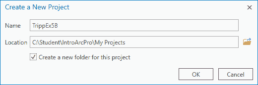

1.  点击“确定”以打开你的新项目。

你的新项目应该打开了一个只包含二维地形基础图层的场景。现在，我们将花一点时间来探索使用这个 Esri 模板自动完成的其他操作。探索目录窗格。

问题：在“地图”下有什么可用或列出？在“工具箱”下有什么可用或列出？在“数据库”下有什么可用或列出？

1.  继续探索目录窗格中的剩余项目，直到你对所创建的新项目以及你目前可以访问的内容完全熟悉。

现在，我们将看看当你创建新项目时发生了什么，这样你就可以看到 ArcGIS Pro 在创建新项目时做了什么。你应该使用操作系统的文件资源管理器查看你的项目。

1.  打开你的文件资源管理器应用程序。它使用一个类似于文件组织器中文件文件夹的图标。你通常可以在任务栏或桌面上找到它。

1.  一旦你打开了文件资源管理器，导航到 `C:\Student\IntroArcPro\My Projects`。你应该在“我的项目”文件夹内看到一个名为 `%Your Name% Ex5B` 的文件夹。这个文件夹是在你创建新项目时由 ArcGIS Pro 自动创建的。这是你的项目的主文件夹。

1.  打开主文件夹，以便你可以看到其内容。主文件夹应包含几个文件夹和文件，所有这些都是在你创建新项目时由 ArcGIS Pro 自动生成的，如下所示：

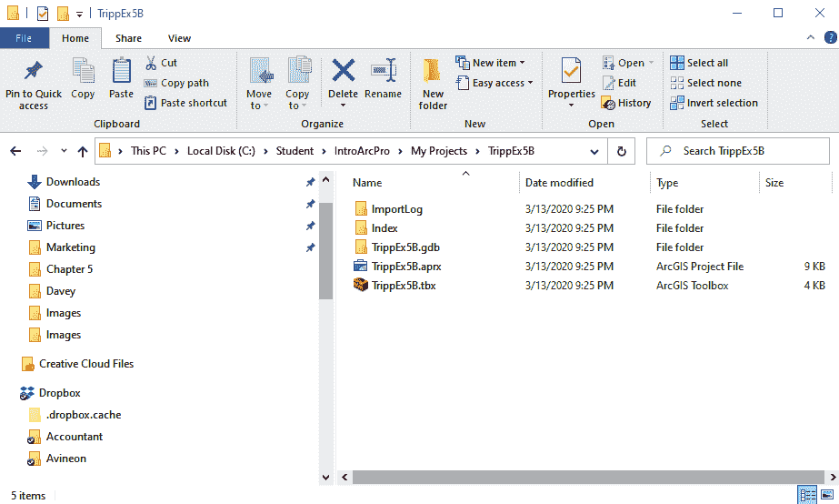

不同的模板将创建不同的文件和文件夹。记住，模板是根据特定目的创建的，所以每个模板在某种程度上都会有所不同。如果你愿意，可以深入探索一些文件夹。

1.  完成后，关闭文件资源管理器并返回 ArcGIS Pro。

你刚刚使用 Esri 提供的“本地场景”模板创建了一个新项目。现在，让我们继续下一步。

### 第 2 步 – 连接到数据源并添加你的表面

在这一步，你将连接到你在上一个练习中使用的 Union City 地理数据库。然后，你将设置场景以使用该地理数据库中的 **数字高程模型**（**DEM**）作为高程表面。高程表面作为地面水平或高度，所有其他图层都在场景提供的三维视图中叠加：

1.  在内容窗格中右键单击你的场景，然后选择“属性”。

1.  在左侧窗口中点击“常规”选项，并将场景重命名为`Union City`。

1.  在左侧窗口中点击“坐标系”选项，然后点击位于“添加坐标系”按钮旁边的下拉箭头。它看起来像是一个带有绿色加号的线框地球仪。

1.  从以下截图所示的选项列表中选择“导入坐标系”选项：

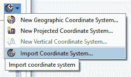

1.  在“导入坐标系”窗口中，导航到`C:\Student\IntroArcPro\Databases\UnionCity.gdb`。然后，选择 DEM 栅格并点击“确定”按钮。这样设置您的场景，使其将使用与 DEM 和其他您将在本练习中添加到场景中的图层相同的坐标系。

1.  在“地图属性”窗口中点击“确定”以应用您的更改，然后关闭窗口。

1.  在目录窗格中，右键点击“数据库”文件夹，然后从出现的菜单中选择“添加数据库”。

1.  在“计算机”下，导航到`C:\Student\IntroArcPro\Databases\`并选择 UnionCity.gdb。点击“确定”按钮以添加数据库连接。

在您向场景添加任何图层之前，您需要定义高程表面。默认情况下，ArcGIS Pro 使用来自 ArcGIS Online 的 Esri 世界高程模型。但是，如果您有，您可以使用自己的模型。在我们的例子中，我们确实有自己的数字高程模型，并且它比 Esri 的模型更精确。因此，现在应该配置您的场景以使用您本地的、更精确的 DEM。

1.  从功能区选择“地图”选项卡。

1.  在图层组下点击“添加数据”文本，然后从出现的列表中选择“添加高程源”选项。

1.  在左侧面板中点击“数据库”选项。

1.  在“添加高程源”窗口的右侧面板中双击 UnionCity.gdb。

1.  选择出现的 DEM 并点击“确定”。

您现在应该能在内容窗格中看到位于默认 ArcGIS Pro 地面高程之上的 Union City DEM。由于我们不在意 Union City 区域外的区域，在这个场景中，您将移除默认的 ArcGIS Pro 地面表面。

1.  在内容窗格中，右键点击“世界高程 3D/地形 3D 表面”，然后从出现的菜单中选择“移除”，如图所示：

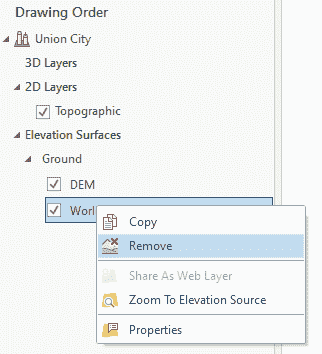

1.  使用您在之前的练习中学到的技能，将洪水平原和水系要素类添加到场景中。

1.  使用您在上一个练习中使用的相同过程，调整符号化方式，使它们与*练习 5A*中的符号化方式相同：

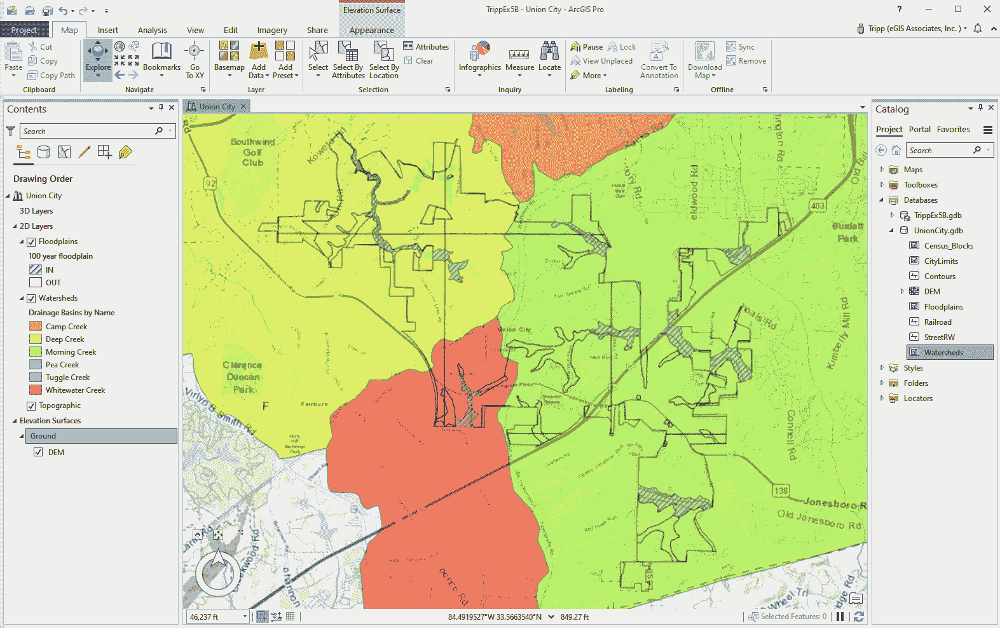

为了完成这个任务，您可能需要连接到`Chapter5`文件夹并再次添加 Esri 样式。

1.  保存您的项目。

1.  在功能区点击“地图”组标签。

1.  点击“添加数据”按钮，并导航到`C:\Student\IntroArcPro\`中的`Chapter5`文件夹。

如果你连接到`Chapter5`文件夹，你只需点击文件夹 | Chapter5 作为快捷方式，快速访问文件夹。

1.  从`Chapter5`文件夹中，选择 3D Buildings.lyrx 并点击确定。

你刚刚使用图层文件添加了一个新的图层到你的场景中。正如你所看到的，图层被自动分配了特定的符号。这是因为你使用图层文件添加数据，而不是直接进入地理数据库并添加要素类。图层文件包含图层的预定义设置，包括符号、标签、透明度、源等。它允许你标准化图层，以便在多个地图中使用。

1.  右键单击你刚刚添加的 Building 图层，并选择缩放到图层。

1.  使用探索工具，结合鼠标的滚轮，将视图放大到 Whitewater Creek、Morning Creek 和 Deep Creek 流域交汇的区域。放大直到你的地图看起来像以下截图所示：

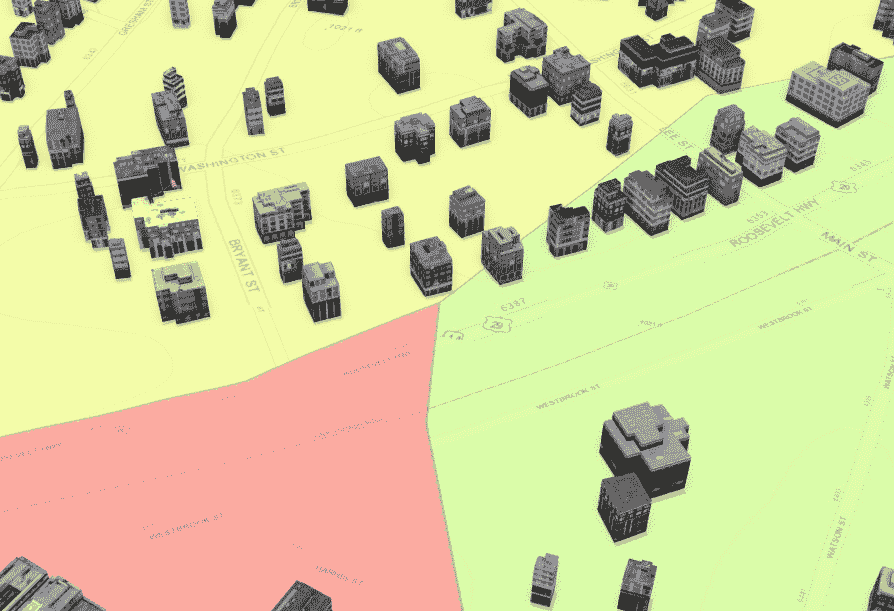

如前一个截图所示，你现在可以看到应用了真实面向的 3D 建筑。你可以看到它们所在的流域，如果你四处移动，你还可以看到哪些位于 100 年洪水平原上。

1.  保存你的项目并关闭 ArcGIS Pro。

因此，在本节中，你已经学会了如何使用 Esri 的`Local Scene`模板创建新项目，以及如何使用图层和本地高程表面构建场景。*但是，你如何为你的组织中的 ArcGIS Pro 用户创建自己的项目模板呢？*我们将接下来探讨这个问题。

# 创建自定义项目模板

在上一个练习中，你看到了模板如何有助于开始一个新的项目。在本节中，你将学习如何创建自定义项目模板。

模板可以标准化你在 ArcGIS Pro 中创建的所有项目，以确保它们访问正确的数据库，包含适当的样式，并具有正确的布局元素。项目模板实际上是项目包的专用版本，可用于创建新项目。它们具有`.aptx`文件扩展名。

项目模板可以保存到多个位置。你可以将它们保存到你的电脑、网络共享、ArcGIS Online 或 Portal for ArcGIS。你保存的位置将有助于确定谁可以使用它们。

保存到电脑上的项目模板通常只能由你使用。这可能会限制它们在组织中的价值。然而，由于它们存储在你的电脑上，它们可能更适合你的个人使用。这是因为它们可以包含连接到你的电脑上存在的本地资源，而其他人可能无法访问。此外，如果你包括连接到受保护的数据源或文件，你不必担心其他用户是否有权限也访问这些位置。

你保存到网络共享（例如，你的文件服务器上的文件夹或 ArcGIS Online）的项目模板，可以在创建新项目时被组织中的其他人使用，前提是他们有足够的权限访问该位置。这允许你标准化组织内 ArcGIS Pro 用户创建的项目，这有几个优点：

+   模板可以确保你使用的是常见的地图布局，这包括标准的标题块、北箭头、标志和法律免责声明。

+   模板可以确保每个人都能访问正确的数据源、文件夹、样式和工具箱。

+   通过标准化常见项目结构，模板可以确保数据和文件被保存到正确的位置。

+   模板可以确保每个人在创建地图或场景时都使用正确的底图。

上述几点只是使用组织内部模板的一些优点。如果你打算将模板保存到 ArcGIS Online，你需要注意一个安全问题，那就是你需要确保仔细考虑你选择与谁分享。

如果你的组织已启用组织外部的共享，那么其他人可能访问你的模板。当你创建并保存模板到 ArcGIS Online 时，你会被询问你希望与谁分享模板。如果你选择所有人，那么你将与你能够访问 ArcGIS Online 的任何用户分享你的模板。这包括那些不属于你组织的人。这意味着不隶属于你的公司或团队的 ArcGIS Pro 用户将能够使用你的模板。这也意味着他们能够看到你在模板中包含的一切，例如数据库连接、标志、文件夹连接、布局等等。如果你不小心，对模板的访问可能代表一个即将发生的安全漏洞。因此，当你将模板保存到 ArcGIS Online 时，请确保注意你选择与之分享的人。

让我们再做一个练习，这个练习能帮助我们创建一个自定义模板。

## 练习 5C – 创建自定义项目模板

现在你已经了解了为什么你想创建自定义项目模板，让我们来看看如何做到这一点。在这个练习中，你将创建一个自定义项目模板并将其保存到你的电脑上。这个模板将包括地图、数据库连接等等。一旦创建了模板，你将创建一个新的项目，该项目将使用该模板。

### 第 1 步 – 创建项目

所有模板都是从项目开始的。因此，要创建一个新的模板，你必须首先有一个包含你希望在模板中包含的所有标准设置的项目的项目。所以，我们将通过创建一个新的项目来开始这一步，使用的是 `目录` 模板，它为你提供了一个空白画布，你可以在此基础上构建你的模板：

1.  启动 ArcGIS Pro。

1.  在 ArcGIS Pro 的起始页面的右侧，选择“目录”项目模板。

1.  在“创建新项目”窗口中，将您的项目命名为`%Your Name% Ex5C`，并将位置设置为`C:\Student\IntroArcPro\My Projects`。

1.  在目录窗格中，右键单击数据库，然后选择“添加数据库”。

1.  在“选择现有地理数据库”窗口中，导航到`C:\Student\IntroArcPro\Databases`，然后选择`Trippville_GIS.gdb`文件，将其添加为连接的数据库。

1.  使用您已学到的技能，将`ESRI.stylx`样式添加到项目中。

1.  保存您的项目。

我们现在将进入下一节，该节将描述下一步。

### 第 2 步 – 在模板中设置默认地图

现在您已打开了一个新项目并建立了一些数据库和样式的默认连接，您现在将创建一个默认地图，该地图将包含在模板中。您将配置一个底图，然后设置默认视图范围：

1.  在内容窗格中，右键单击项目，然后选择“新建地图”。这将向您的项目添加一个新的地图。

1.  在功能区地图组选项卡中，点击底图下方的下拉箭头，然后选择“影像”。

1.  在目录窗格中，展开连接到的数据库文件夹和 Trippville_GIS 地理数据库。

1.  展开基础要素数据集，在 City_Limit 要素类上右键单击，然后选择“添加到当前地图”。

您的地图应该会缩放到您刚刚添加的新 City Limits 层，因此它应该看起来类似于以下截图：

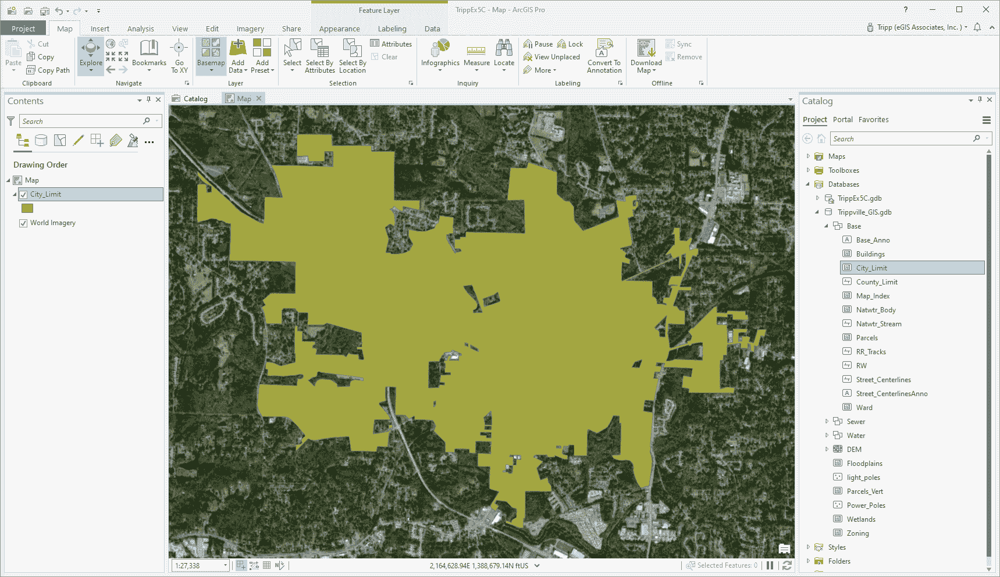

记住，在您的地图中，City_Limit 层的颜色可能不同，因为 ArcGIS Pro 在您不使用图层文件添加新层的情况下，会为新层分配一个随机颜色。

添加 City_Limit 层还将分配您希望用于地图和模板的坐标系。与 ArcMap 一样，在 ArcGIS Pro 中添加到地图的第一个图层将分配坐标系。现在，您将设置视图范围，这将是您项目中此地图的默认范围。

1.  在内容窗格中右键单击地图，然后选择“属性”。

1.  在地图属性窗口中，从左侧窗格中选择“范围”。

1.  在右侧面板中点击“使用自定义范围”选项卡。

1.  点击“从获取范围”下的“当前可见范围”选项。这将设置您的地图，当您选择“缩放到全图”按钮时，它将带您到这个缩放比例。然后，点击“确定”以应用设置。

1.  使用您在第二章“导航功能区”中学到的技能，对 City_Limit 层进行以下更改：

    +   将符号设置为空心填充。

    +   将轮廓设置为火星红。

    +   将轮廓宽度设置为`2` pt。

    +   将图层重命名为`City Limits`。

1.  保存您的项目。

您已创建了一个简单的地图，该地图将成为您正在努力创建的模板的一部分。这意味着任何使用该模板的人都将从该项目中的此地图开始。

### 第 3 步 – 从现有地图文档添加布局

在将项目保存为模板之前，你还需要添加最后一项内容。我们想要添加我们在用**ArcMap**创建的地图文档中使用的布局，这是另一个 Esri 应用程序。这将使我们的地图无论在 ArcGIS Pro 还是 ArcMap 中创建，看起来都一样：

1.  点击功能区上的插入组选项卡。

1.  点击位于新建布局旁边的小下拉箭头，并选择窗口底部出现的导入布局文件...，如图所示：

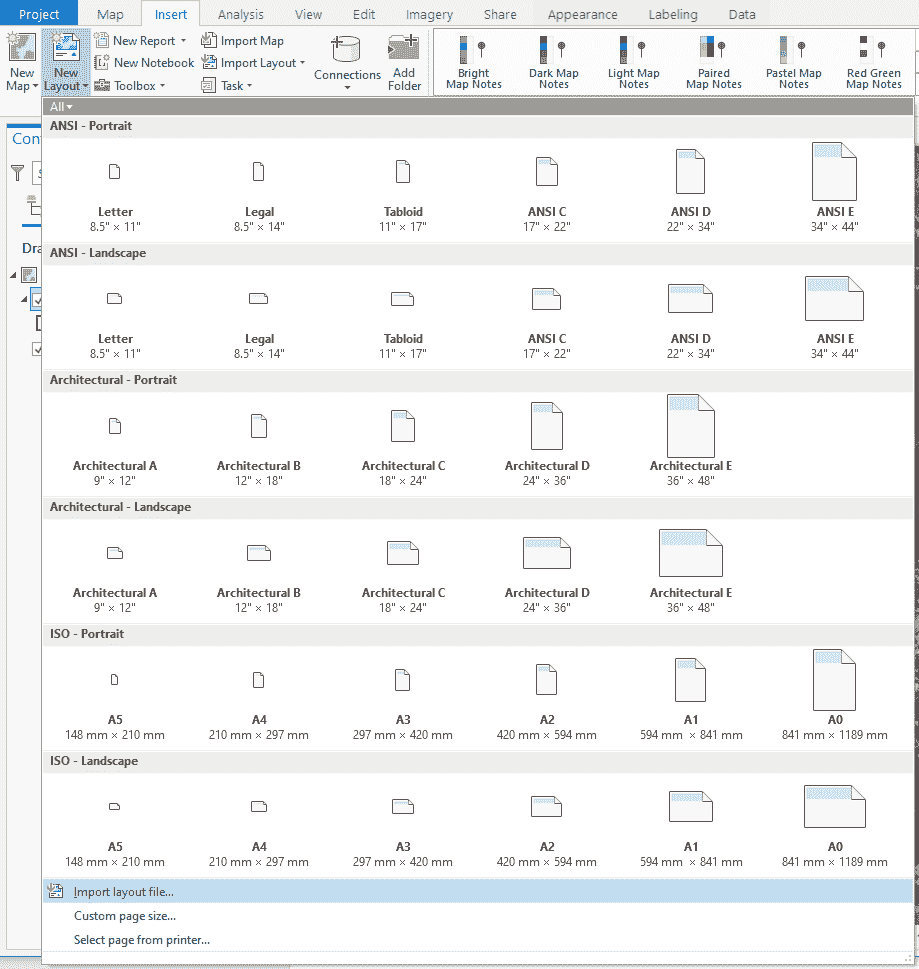

1.  在导入窗口中，导航到`C:\Student\IntroArcPro\Chapter5`。选择`Sample Layout.mxd`文件，然后点击确定。

你刚刚导入的地图布局是在地图文档中，这个布局是用 ArcMap 创建的，并被你的组织用作打印所有地图的标准布局。你需要对这个布局做一些调整，以便它在 ArcGIS Pro 中正常工作。

1.  在内容面板中右键单击地图框架，并选择属性以打开界面右侧的格式化地图框架面板。

1.  确保在面板中选择了选项按钮。它是位于地图框架下的第一个。

1.  你应该看到两个选项——常规和地图框架。在常规选项中，将框架重命名为`地图框架`。

1.  在地图框架选项中，点击下拉菜单并选择地图。当你这样做时，你应该看到你在*步骤 2*中创建的地图；它应该出现在布局中。现在它应该看起来像这样：

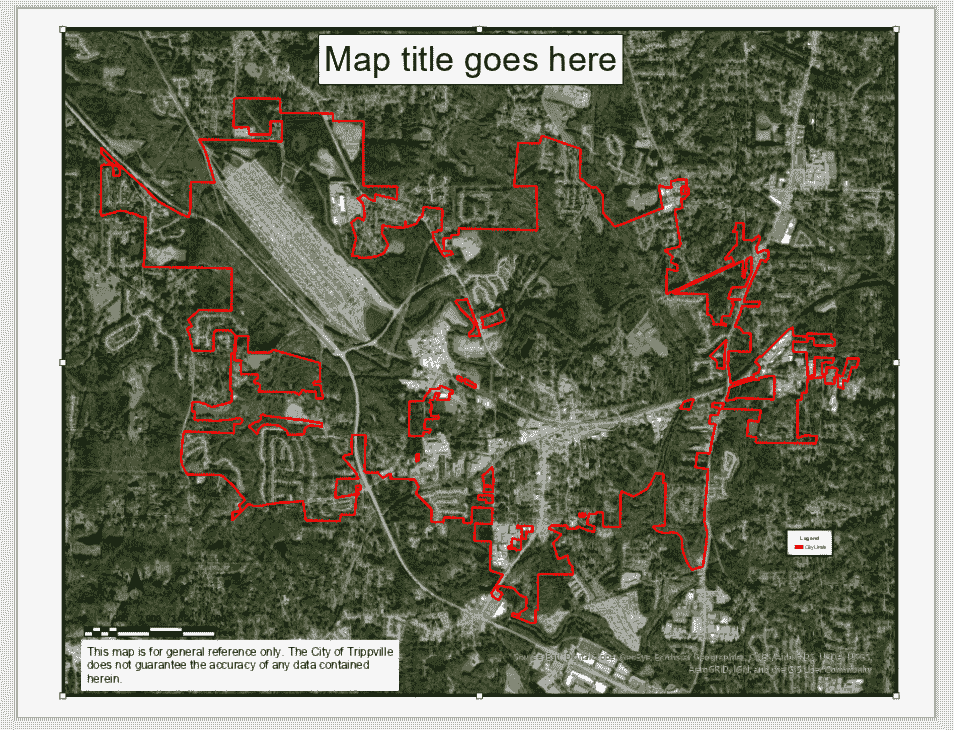

1.  关闭格式化地图框架面板。

1.  你应该为这个布局保存一个书签，这样你就可以轻松地返回这个位置和比例。选择功能区上的布局选项卡。

1.  点击地图组中书签按钮下方的小箭头。

1.  然后，选择新建书签。在创建书签窗口中，将书签命名为`打印布局`。在描述类型中，这个书签将带回到正确的位置和比例以打印整个城市界限区域。然后，点击确定。

1.  关闭示例布局并保存你的项目。

让我们看看下一节中的下一步。

### 第 4 步 – 将项目保存为模板

现在你已经配置了项目，使其具有标准样式和文件夹连接，还包括了一个示例地图和布局，这将成为新项目的共同基础，你现在可以保存你的项目为模板：

1.  点击功能区上的共享选项卡。

1.  在另存为组选项卡中选择项目模板按钮。

1.  创建项目模板面板显示在界面的右侧。在开始创建部分下，选择将模板保存到文件。

1.  点击位于名称和位置下的浏览按钮，以指定保存模板的位置和名称。

默认位置位于你的用户配置文件和 `ProjectTemplates` 文件夹中。你将接受默认位置，以便当你在 ArcGIS Pro 中启动时，模板会出现在你的列表中。

1.  将你的模板命名为 `%your name% 2D Project Template`（即 `Tripp 2D Project Template`）并点击保存。

1.  现在，你需要填写模板的项目描述信息。项目描述是元数据的简短形式。按照指示完成以下内容：

    +   **摘要**：这作为二维 ArcGIS Pro 项目的模板，包括一个二维地图和一个布局。它将自动连接到 `Trippville_GIS` 地理数据库并添加 Esri 符号样式。

    +   **标签**：标签是 ArcGIS Pro 中搜索功能使用的关键词，例如 `2D`、`Trippville`、`布局`、`地图` 和 `模板`。

1.  点击分析按钮以确保你的模板不包含任何会导致其无法正常工作的错误。分析按钮将自动带你到窗格中的消息标签页。你不应该看到任何错误或警告。如果有，请按照 ArcGIS Pro 的建议进行纠正。

1.  一旦在“消息”标签页中没有错误，点击窗格中的创建按钮。如果你被问及是否要保存项目，点击是。

当 ArcGIS Pro 完成创建模板后，你会看到一个消息告诉你它已完成。

1.  关闭 ArcGIS Pro。如果你希望保存项目，可以选择保存，但不是必需的。

我们现在将进入练习的最后一步。

### 第 5 步 - 使用自定义模板创建新项目

现在你已经创建了一个自定义项目模板，当你创建新项目时需要知道如何使用它。在这个步骤中，你将使用你刚刚创建的项目模板来创建一个新的 ArcGIS Pro 项目：

1.  启动 ArcGIS Pro。

1.  在 ArcGIS Pro 的起始页面上，点击位于右下角的“选择另一个项目模板”，如图所示：

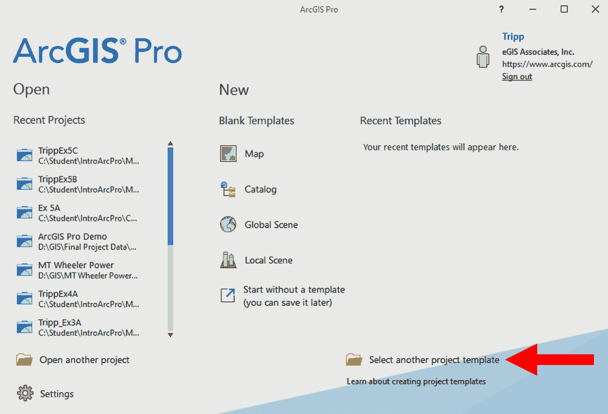

1.  选择你在上一步中创建的模板。它应该出现在“从模板创建新项目”窗口的右侧面板中。然后，点击确定。

1.  将你的新项目命名为 `%your name% template test`。

1.  将保存位置设置为 `C:\Student\IntroArcPro\My Projects` 并点击确定。

你的新项目应该打开时带有一个非常熟悉的地图。你应该看到带有影像底图的 City Limits 图层。

1.  花一些时间探索目录窗格。查看有哪些连接、地图、布局和样式。

1.  当你完成对新项目的探索后，保存它并关闭 ArcGIS Pro。

你已经使用自己的自定义模板创建了一个新项目。

## 警告

当使用 ArcGIS Pro 创建自定义模板时，您应该知道如果模板引用了位于映射驱动器上的数据或文件夹会发生什么。**映射驱动器**是指通过驱动器字母引用的驱动器，例如`C:`驱动器，通常是您计算机上的本地驱动器，或者`M:`驱动器，它位于网络文件服务器上。

在使用 ArcGIS Pro 时，建议您不要使用映射驱动器，尤其是在创建模板时。建议您使用**通用命名约定**（**UNC**）路径。*那么，什么是 UNC 路径呢？* 这是 IT 人员用来将映射驱动器字母连接到服务器上文件夹的方法。UNC 路径看起来像`\\GIS_Server\GIS_Data_folder`。`GIS_Server`是您网络中服务器的名称或 IP 地址。`GIS_Data_Folder`是服务器管理员在该服务器上创建的共享，以便网络上的其他人可以访问其中的文件。

ArcGIS Pro 对 UNC 路径的偏好对于存储在服务器上的数据是有意义的，因为在办公室里，不同的人可能会使用不同的驱动器字母来引用服务器上的同一位置。例如，我可能将`\\GIS_Server\GIS_Data_folder`映射到`M:`驱动器，因为我认为 GIS 是映射，所以我认为将 GIS 数据映射到`M:`驱动器是有意义的。然而，我的同事可能将相同的服务器位置映射到`G:`驱动器。但是，如果我用 UNC 路径，那么对我们两个人来说，它将是同一个位置。

*那么，如果您创建了一个引用映射驱动器的模板会发生什么呢？* 好吧，当您基于模板创建新项目时，ArcGIS Pro 实际上会创建您数据的副本。它这样做而没有任何警告，除非您仔细查看您的图层源，否则您可能不会注意到这一变化。要了解更多信息，请访问[`youtu.be/tyu439Uownk`](https://youtu.be/tyu439Uownk)。

应该提到的是，如果您引用的是企业/SDE 数据库或网络服务，则不会发生这种复制。

# 摘要

在本章中，您学习了在 ArcGIS Pro 中使用项目的重要性。它们是应用程序的核心。您已经看到它们包含与项目相关联的所有项目，包括数据库连接、地图、样式、工具箱、布局、服务器连接等等。通过将这些内容都包含在项目中，您将更容易访问在 ArcGIS Pro 中执行 GIS 工作所需的所有资源。

您现在知道如何使用 Esri 提供的模板以及您自己可以创建的定制模板来创建新项目。一旦创建了一个项目，您也知道如何向项目中添加新资源，以便您能够执行所需的 GIS 功能以完成任务。如您所见，项目不仅限于单个数据库、地图、文件夹或样式。您可以选择创建尽可能多的连接，以便您能够访问所需的任何数据集、工具和符号。

由于单个项目可以包含多个连接和其他项目，因此管理项目中的所有项目内容对于确保项目有效运行并获取最相关数据至关重要。ArcGIS Pro 中的目录窗格提供了访问、添加、查看或删除这些资源的工具和方法。这将确保项目高效运行。

最后，您学习了如何使用项目模板通过预先配置各种项目项来提高创建新项目的效率。您可以选择使用预定义的 ArcGIS Pro 模板之一，或者您可以创建自己的定制模板。

您现在已经掌握了创建地图、场景和项目所需的技能和理解。下一章将向您介绍如何创建布局，以便您能够以专业的方式展示您的作品。
