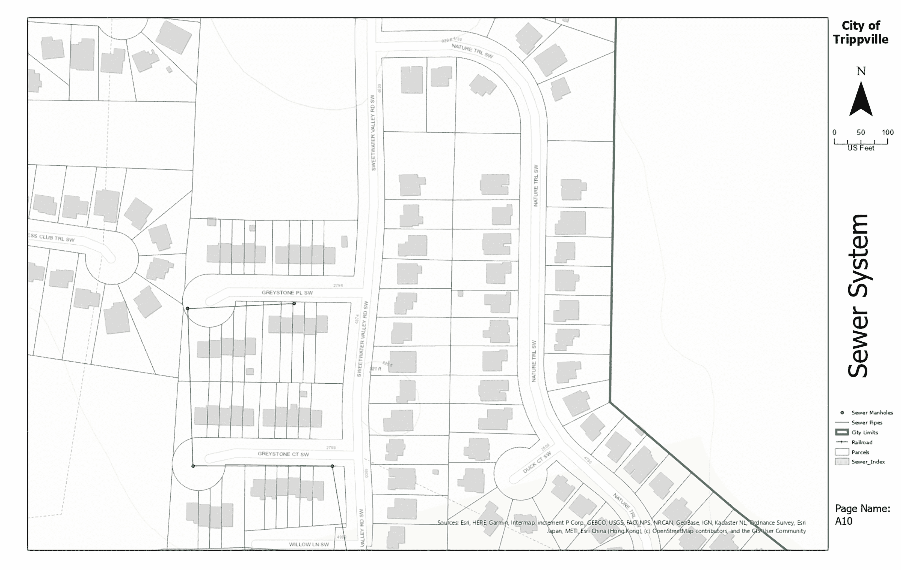

使用地图系列创建地图集

在上一章中，您学习了如何创建新的布局来展示和打印您的地图。这是我们与他人共享**地理信息系统**（**GIS**）数据的主要方法之一。

然而，在许多情况下，单一的大或小地图可能无法满足用户的需求。这对于在野外工作的人来说尤其如此。大地图难以操作，变得难以使用。小地图通常无法在野外清晰地显示所需的数据详细程度。

解决这些问题的常见做法是为需要显示的区域创建地图集或系列。ArcGIS Pro 内置了创建这些地图集的功能，称为**地图系列**。对于那些使用过较旧的**ArcMap**应用程序的人来说，**地图系列**提供了与**数据驱动页面**相同的基本功能。

本章将教授您启用和配置地图系列功能的过程，以便您可以生成自己的地图集。在本章中，您将学习以下主题和技能：

+   什么是地图系列？

+   了解索引

+   启用地图系列功能

+   打印地图系列

# 技术要求

要完成本章的练习，您需要访问**ArcGIS Pro 2.6**或更高版本的**许可证**。任何三个许可证级别都可以使用，因为**地图系列**是软件的核心功能之一。**

**# 什么是地图系列？

在 ArcGIS Pro 中，地图系列指的是两件事：

+   第一是软件中自动化的功能，允许您轻松创建地图集或地图册。

+   第二点是该功能的结果。

因此，地图集或地图册也可以称为**地图系列**。这是因为它是一系列单独的地图页面，可以组合在一起形成一个更大的地图区域。

在 ArcGIS Pro 中，一个项目可以包含多个地图系列，就像它可以包含多个地图、场景或布局一样。正如您稍后将会学到的那样，地图系列功能与布局相关联。因此，理论上，每个布局都可以转换成地图系列。在本节中，我们将探讨创建地图系列的步骤。

## 理解和创建地图系列

正如创建布局需要一些前瞻性思考一样，创建地图系列也是如此。您仍然需要考虑受众、目的和情况。就像传统的布局一样，这三个考虑因素将指导您创建您的地图系列。它们将帮助您确定哪些图层应该包含在内，需要多少细节，以及系列中页面的大小，这也会影响您可以使用来显示数据的比例。

一旦您根据受众、目的和情境考虑确定了需求，您就可以开始设置您的地图系列了。这通常包括以下五个步骤，如图中所示：

以下图解说明了创建地图系列的以下步骤：

1.  第一步是向地图添加并符号化您将在地图系列布局中使用的图层。这些图层将支持地图系列的目的或提供上下文信息。

1.  下一步将是确定您想要用作地图系列索引的图层。索引定义了系列中每页的位置、数量和范围。我们将在本章后面更详细地讨论索引。

1.  然后，您需要开始创建您的布局。这将遵循您用于创建传统单一地图布局的基本过程，但有一些细微的差别。

第一个区别是确定页面方向和大小。这个决定将基于几个因素，例如地图系列最终是否将成为装订成册的书本或报告。如果是这样，*装订将位于哪一侧？*

其次，*您是否需要在系列中的每一页都包含页码或工作表编号？* 然后，*您是否需要在每一页上包含比例、北箭头、图例或其他需要留出空间的地图元素？* 这些只是影响您布局整体设计的一些例子。

以下截图是地图系列布局的示例：

当您努力创建布局，甚至在确定索引时，您还应该考虑您想要地图系列显示和打印的比例。这可以是系列中所有页面的单个比例，也可以根据索引而变化。

1.  如果您想要系列使用基于每个索引特征的变量比例，您有两个选择。第一个选择是将每一页的比例调整到定义该页面的索引特征可以适合布局的地图框架区域。这是最简单的方法，但这也意味着您将不知道系列中每一页的确切比例。

第二种选择是使用索引层属性表中的一个字段，该字段包含每个索引特征的指定比例值。这为您提供了您所知道的精确比例。缺点是您必须确定每个单独的索引特征和页面的比例。

1.  最后，您需要在项目中启用并配置地图系列。这从打开您想要用于系列的布局开始。然后，在功能区中点击“布局”选项卡。接下来，您需要点击“页面设置”组中的“地图系列”按钮。这将打开“布局属性”窗口并切换到“地图系列”选项卡。从那里，您可以配置所提供的各种设置。我们将在本章后面的练习中介绍这些设置。

现在您已经了解了启用和配置地图系列所需的基本步骤，我们将更深入地探讨您可以用来定义地图系列的索引类型。

# 了解索引

没有索引图层，你无法创建地图系列。在本节中，你将了解你可以使用的索引类型以及如何创建它们。

索引决定了哪些页面将包含在地图系列中，以及它们将覆盖的位置。你可以使用四种类型的索引；它们如下所示：

+   **网格索引**：网格索引由矩形或多边形组成。它们通常通过它们在网格中占据的行和列来识别，类似于电子表格中的单元格。在大多数情况下，多边形的大小相同，但不必大小相同。下面的屏幕截图说明了网格索引的一个示例：

+   **条带索引**：这种索引遵循线性特征，如道路中心线、电力传输线等。正如你在下面的屏幕截图中可以看到的，它通常会有一个基于它所跟随的特征的旋转。下面的屏幕截图显示了条带索引的一个示例：

+   **不规则索引**：不规则索引是基于现有图层的一个索引，该图层中的每个特征在地图系列中都有自己的页面。例如，在下面的屏幕截图中，我们可以看到城市内的普查区块。如果你使用它作为索引，那么每个普查区块都将成为系列中的一个页面。任何图层都可以用作索引，无论其几何类型（点、线或多边形）如何：

如果你想要创建一个地图集，例如，在单独的页面上显示固体废物处置场每个监测井的位置，你可以通过使用监测井作为不规则索引来实现，即使监测井是点特征。

+   **书签索引**：最后一种索引是引用地图中已保存的书签。你在这本书的前面练习中已经使用过书签。书签是保存的空间位置，允许你快速返回地图中的该位置。它们不仅返回到相同的位置，而且返回到相同的可见范围和比例。地图可以包含多个书签，如下面的屏幕截图所示：

当用作索引时，每个书签代表你正在创建的地图集中的一个页面。这种类型的索引是在 ArcGIS Pro 2.6 中添加的。在早期版本中不可用。

**哪种索引效果最好？** 这将取决于地图系列的目的。如果你试图突出显示位于单个图层中的特定特征，那么基于该单个图层的非规则索引可能是最佳选择。如果你试图为沿道路或公用事业传输线路的项目创建地图系列，那么**条带索引**可能是最佳选择。如果你试图创建将覆盖整个城市或公用事业系统的地图系列，那么**网格索引**通常是最佳选择。

在下一节中，你将学习如何创建网格和条带索引。如前所述，不同的情况将决定使用哪种类型的索引最好。因此，了解如何创建这两种索引非常重要。

## 创建网格和条带索引

如果你还没有创建索引，ArcGIS Pro 确实提供了创建网格和条带索引的工具。如果你查看制图工具箱和地图系列工具集，你会找到那些工具。接下来，我们将探讨这些工具中的两个——即网格索引要素和条带地图索引要素——在接下来的几节中。

### 理解网格索引要素工具

网格索引要素工具在规则网格中创建一个多边形**要素类**或**shapefile**，可以用作指定地图系列页面的索引。你还可以选择创建只包含与另一个要素层或多个要素层相交的多边形要素的网格。因此，如果你正在为你的公交线路创建新的网格索引，则可以将工具设置为忽略地图中不包含公交线路的任何区域。

下面的截图显示了你可以为此工具指定的一些参数：

如前述截图所示，输出要素类是一个必填参数，因为此工具的目的是创建一个新的要素类，该要素类将作为地图系列的索引。如果你只想为存在特定图层的区域创建索引多边形，那么你需要将这些限制图层添加到输入要素中。

多边形宽度、多边形高度、行数和列数的参数是相互关联的。这些设置旨在确定索引多边形的大小及其总数。如果你设置了宽度和高度，ArcGIS Pro 将自动计算行数和列数。

如果你设置了行数和列数，ArcGIS Pro 将自动计算宽度和高度。它根据覆盖你运行工具的地图中所有图层所需的全空间范围来计算这些值，除非你指定了输入要素。

### 了解条带地图索引要素工具

条带地图索引功能工具创建一个遵循线性特征的 polygon 要素类或 shapefile。这个工具不仅创建了索引多边形，还创建了自动计算的属性。这些属性可以用来旋转和定位页面上的地图，该地图遵循索引的线性特征。

此外，它还将生成属性，指示哪些索引要素位于索引要素的各个侧面。以下截图显示了条带地图索引功能工具的参数：

如前一个截图所示，条带地图索引功能工具要求你指定输入线要素和输出要素类。

对于输入线要素，你指定一个特定的图层，该图层必须是线或折线图层或要素类。如果你在运行工具之前也选择了特定的线，它将只在所选线沿线生成索引多边形。如果你在指定的输入线要素图层中没有选择任何要素，它将在该图层中包含的所有线沿线创建索引多边形。

让我们看看创建网格索引的下一个练习。

## 练习 7A – 创建网格索引

Trippville 市下水道系统的现场施工队伍需要地图册在野外使用，以便他们在外出修理或更换系统部件时知道下水道系统的各个组件的位置。他们希望你能以 1:1200 的比例打印页面，其中 1 英寸等于 100 英尺。在你可以创建所需的地图册之前，你需要创建一个索引。

在这个练习中，你将使用网格索引功能工具来创建创建所需地图册所需的索引。你需要创建的网格索引将只包含包含下水道系统组件的城市区域内的索引多边形。

### 第 1 步 – 打开 ArcGIS Pro 和你的项目

第一步是打开你将要创建布局的项目：

1.  按照前几个练习中的方式启动 ArcGIS Pro。然后，点击 ArcGIS Pro 起始页面中最近项目列底部的“打开另一个项目”选项。

1.  在左侧面板的“打开项目”窗口中，展开“计算机”选项，导航到`C:\Student\IntroArcPro\Chapter7`。

1.  然后，选择`Ex7A.aprx`文件，点击“确定”按钮。

你的项目应该以包含多个图层的方式打开，包括下水道检查井、下水道管道、城市界限、铁路和地块。它还可能包含一个底图，例如地形图，这取决于你组织的设置。

### 第 2 步 – 创建网格索引

由于项目已打开，现在是时候使用网格索引功能工具创建索引了。

由于下水道系统主要由管道组成，这些是线性特征，你可能想知道为什么你会创建网格索引而不是条带索引。

答案是，污水系统由许多相互连接的管道组成，这些管道通常紧密排列，并沿多个方向运行。这将在最佳情况下使创建与线性特征方向一致的条带索引变得有困难。

因此，网格索引是一个更好的选择。另一方面，如果只有特定的污水系统部分需要覆盖以进行有限的项目，那么条带索引可能更好。

现在，是时候创建索引了。请按照以下步骤操作：

1.  从功能区，单击分析选项卡。

1.  现在，单击位于地理处理组中的工具按钮，以打开地理处理面板。

1.  接下来，单击位于面板顶部的工具箱选项卡，以便可以看到包含在 ArcGIS Pro 中的所有系统工具箱。

1.  找到并展开制图工具箱，以便可以看到其内容。

1.  现在，找到并展开地图系列工具集。

1.  单击网格索引要素工具以打开它。

1.  单击输出要素类单元格右侧的浏览器按钮。这将打开输出要素类窗口。

1.  在刚刚打开的窗口的左侧面板中，展开项目选项，其中应包含数据库和文件夹。

1.  选择数据库文件夹，然后双击 Ex7A 数据库。

1.  在输出要素类窗口底部的名称单元格中，键入`Sewer_Index`并单击保存。

1.  在输入要素选项下，使用下拉箭头从出现的列表中选择污水检查井。当您这样做时，应在您刚刚选择的污水检查井层下方自动出现另一个单元格。

1.  在输入要素下方出现的新单元格中，单击下拉箭头并从出现的列表中选择污水管道。

1.  确保已勾选“生成与输入要素层或数据集相交的多边形网格”选项，如下截图所示：

下一步是设置多边形高度和宽度或行数和列数。幸运的是，我们的城市有一个标准的布局，它喜欢用于地图册。

这是一张 11 英寸乘 17 英寸的纸张，具有 10 英寸乘 15 英寸的固定地图视图区域，设计用于沿左侧装订。了解这一点以及现场人员所需的比例，将允许您计算新索引多边形的宽度和高度，并在工具中定义这些值。

1.  将多边形宽度设置为`1500`并更改单位为英尺。

1.  将多边形高度设置为`1000`，如果需要，请更改单位为英尺。注意多边形网格原点坐标、行数和列数值是如何根据您输入的多边形大小自动计算的。它还使用您定义的两个输入层的空间范围。

1.  确认您的网格索引要素工具设置如下截图所示，然后单击运行：

一旦工具成功运行，新创建的 Sewer_Index 层应该出现在您的地图中，如下面的截图所示：

如您所见，新创建的多边形并没有覆盖整个城市。它们只覆盖了包含 Sewer Manholes 和 Sewer Pipes 层中要素的部分。

1.  一旦您已验证网格索引要素工具成功运行，请关闭地理处理面板，并通过点击快速访问工具栏上的保存按钮保存您的项目。

1.  关闭 ArcGIS Pro。

您现在已创建索引，您将使用它来定义将包含在地图系列中的页面，您将在后续练习中启用它。您在创建的 Sewer_Index 层中看到的每个多边形都将是地图系列中的一页。通过创建此索引，您将知道必须提供哪些参数才能使用网格索引要素工具生成此图层。

现在您已经知道如何创建索引，是时候看看如何在 ArcGIS Pro 项目和布局中启用地图系列功能了。

# 启用地图系列功能

下一步是启用地图系列功能。您需要从您计划用于系列的布局中执行此操作，通过功能区中的布局选项卡或通过布局属性。

启用地图系列并不像切换开关或圆形按钮那样简单。虽然有一个必须启用的切换开关，但还有几个参数或设置必须配置，如下面的截图所示：

如您从前面的截图中所见，这些设置分为三个类别——索引层、可选字段和地图范围。在您配置这三个组中的设置之前，您必须首先将地图系列从“无”设置为“空间”。

要配置索引层设置，请按照以下步骤操作：

1.  您通常首先配置索引层的设置。首先，您需要选择哪个地图框架将成为地图系列的主要框架。从该地图框架开始，然后选择用作索引的图层。

1.  接下来，您需要设置与索引层关联的哪个属性字段用于名称字段。该字段将用于识别地图系列中每一页的名称。

1.  您需要为索引层配置的最后一个是排序字段。该字段将用于将系列中的各个页面放置在所需的顺序中。排序字段可以设置为与名称字段相同的字段，也可以设置为完全不同的字段。

1.  接下来，如果需要，您可以配置可选字段设置。这些设置对于地图系列功能的工作不是必需的，但可能提供更大的能力或控制系列如何运行。您可以在以下截图中看到您可以配置的一些可选字段设置：

如您在前面的屏幕截图中所见，最佳字段设置包括以下内容：

+   分组：此选项使用从索引层中指定的字段中找到的值来对系列中的页面进行分组——例如，您可能有一个字段用于标识投递区域或投票区。

+   页码：这允许您指定包含页码的索引层中的字段。这可以是用于页面名称或页面排序的同一字段，也可以是完全不同的字段。

+   第一页：这允许您设置系列的开篇页码。这允许您为其他页面进行规划，例如标题页或目录，以便包含在您的地图书中。

+   旋转：此选项允许您指定包含旋转值的字段，该值将用于自动旋转布局中的地图视图。这通常与条形索引一起使用。

+   空间参考：这允许您根据索引层中的一个字段为系列中的各个页面使用不同的坐标系。如果您需要覆盖的区域跨越不同的坐标系区域，例如从**通用横轴墨卡托**（**UTM**）16 到 UTM 17，您可能需要使用此设置。

1.  最后，您需要配置您的地图范围设置。这决定了布局中出现的地图框架的比例。这里的选项包括以下内容：

    +   最佳匹配：此选项将自动调整每页的地图框架大小，以确保索引特征在地图框架内。这意味着比例可能会从一页到另一页有所不同，尤其是在使用包含不同大小特征的规则索引时。您可以在此选项下控制边距大小和比例舍入。

    +   居中并保持比例：这些选项将地图视图居中在索引特征上，并保持地图框架当前的比例；或者，您可以指定用于所有页面的比例。

    +   使用来自字段的缩放：此选项允许您使用索引层的属性表中的字段来控制布局中地图框架的比例。如果您的索引层由各种大小的特征组成，并且您想确保它们以特定比例显示，而不是仅仅调整以适应页面，这将非常有用。

现在，您需要使用在*练习 7A*中创建的索引配置 Trippville 下水道系统的地图系列。

## 练习 7B – 启用地图系列

在上一个练习中，您为 Trippville 卫生下水道系统创建了一个索引，以便为城市的现场工作人员制作地图册。现在，您需要使用该索引并启用下水道系统的地图系列，这意味着在解决此问题之前，您需要完成*练习 7A*。

在这个练习中，您将使用 Trippville 标准 11 英寸×17 英寸布局启用地图系列，该布局已在您将使用的项目中存在。

### 第 1 步 – 打开项目和布局

在此步骤中，你将打开你在 *练习 7A* 中使用的项目以及你将用于启用的新地图系列的布局：

1.  按照过去的方式启动 ArcGIS Pro。然后，在 ArcGIS Pro 启动页面上的“最近的项目”列底部点击“打开另一个项目”选项。

1.  在左侧面板的“打开项目”窗口中，展开“计算机”选项，导航到 `C:\Student\IntroArcPro\Chapter7`。

1.  然后，选择 `Ex7A.aprx` 文件并点击“确定”按钮。

1.  项目打开后，在目录窗格中展开“布局”文件夹，以便你可以看到其内容。

1.  在“布局”文件夹中的地图系列布局上右键单击，并从出现的菜单中选择“打开”。

布局应该看起来类似于以下截图：

布局应在主视图区域打开。

你的比例和范围可能不同，以及你的索引层的填充颜色。

现在你已经打开了布局，是时候启用地图系列并配置其设置了。

### 第 2 步 – 启用和配置地图系列

在此步骤中，你将在 ArcGIS Pro 中启用地图系列功能并配置所需设置：

1.  在功能区中点击“布局”选项卡。接下来，点击“页面设置”组中的“地图系列”按钮。这将打开带有“地图系列”选项卡已选择的“布局属性”窗口。

1.  在“布局属性”窗口的右侧面板中，点击“无”以显示下拉列表。从列表中选择“空间”，如以下截图所示：

1.  在索引层设置下，验证以下设置：

    +   对于“地图框架”字段，选择“地图框架”选项。

    +   对于“图层”字段，选择“Sewer_Index”选项。

    +   对于“名称字段”字段，选择“页面名称”选项。

    +   对于“排序字段”字段，选择“页面名称”选项。

1.  对于这个地图系列，你不需要配置任何“可选字段”设置，因为你的索引网格大小相同，旋转相同，并且不跨越多个坐标系统区域。因此，你可以跳过它们。然而，如果你愿意，也可以展开并查看它们。

1.  点击位于“可选字段”下方的“地图范围”，以显示这些设置。

1.  选择“中心和保持比例”选项。在“比例”框中点击并输入 `1:1200`。这将使每一页都位于该页的索引网格中心，并以现场人员所需的比例显示。

1.  一旦你完成了地图系列设置配置，点击“确定”以完成功能启用。

1.  保存你的项目。

当地图系列启用时，内容窗格应自动切换到“列表地图系列页面”。这显示了你系列中所有页面的列表。我们将在练习的稍后部分研究如何使用此列表。接下来，你需要对你的布局进行一个小小的修改。

### 第 3 步 – 向布局添加页面名称

在启用地图系列后，是时候将页面名称添加到布局中，以便在更新以显示系列中的每个页面时，页面名称将自动更新。您将使用动态文本来完成此操作：

1.  点击功能区中的“插入”选项卡。

1.  点击位于“插入”选项卡文本组中的“动态文本”。这将导致出现一个选项菜单。

1.  在菜单中向下滚动到地图系列组。然后，选择页面名称，如下面的截图所示：

1.  您需要将页面名称动态文本添加到布局的右下角。因此，将您的鼠标指针移动到图例左下方的位置。点击并按住鼠标按钮，同时将指针向下和向右拖动，如图所示，然后释放它：

您刚刚将页面名称动态文本插入到布局中。此值将在您查看系列中的不同页面时自动更新。您将在本练习的稍后部分有机会看到这一点。然而，您插入的文本有点小，所以接下来，您需要更改其大小。

1.  点击刚刚出现在功能区中的“格式”选项卡。

1.  在“格式”选项卡的“文本符号”组中将文本大小更改为 `14` pt。您刚刚插入的动态文本应该会放大，现在应该更容易阅读。

1.  保存您的项目。

您现在已在您一直在工作的 ArcGIS Pro 项目中启用并配置了地图系列。**您如何知道它是否工作正常？****您如何查看系列中的单个页面？**这些都是很好的问题。那么，让我们在下一节中学习答案。

### 第 4 步 - 查看系列中的页面

现在是时候验证系列是否正常工作了。您将通过查看系列中的几个页面来完成这项工作，使用内容面板在这些页面之间导航：

1.  在内容面板中，点击“按绘图顺序列出”按钮，以便您可以看到布局的内容。

1.  通过点击它左侧的小箭头来展开地图框架。

1.  通过点击其左侧的小箭头来展开 Sewer System Map。现在，您应该看到地图中包含的层列表。

1.  通过点击位于其左侧的勾选标记来关闭 Sewer_Index 层。现在，您应该能够看到其他地图层。

在启用并配置地图系列后，您不需要显示索引层即可使地图系列功能正常。该层必须保留在使用的地图中，但不需要保持开启状态。

1.  在内容面板中，点击“列出地图系列页面”按钮以查看系列中的页面列表。

1.  双击内容面板中显示的页面列表中的任何页面，并观察布局中发生了什么。请密切关注地图视图和页面名称文本。

1.  继续双击内容面板中的几个更多页面，并观察布局中发生了什么。

1.  保存您的项目。

如您所见，当您在内容面板中双击一个页面时，地图视图和页面名称文本会自动更新以匹配该页面。地图视图会缩放到该网格多边形的定位，页面名称会更改以匹配该页面的值。

### 第 5 步 – 打印地图系列

创建地图集的最后一步是打印它。在这一步中，您将了解如何打印您创建的地图系列：

1.  点击功能区中的共享标签页。

1.  接下来，点击共享标签页中的打印组中的布局按钮。这将打开打印布局面板。

通常情况下，您会选择所需的打印机并配置页面。使用此布局，这意味着将页面大小设置为对开本（11 x 17 英寸）并将方向设置为横向。然后，您通常会验证输出质量设置，以确保它们与您使用的打印机和纸张类型相匹配。

然而，对于这个练习，我们将假设这些基本配置步骤已经完成，并直接跳到地图系列设置。

1.  在打印布局面板中，向下滚动到地图系列并展开它。

1.  注意打印地图系列的所有选项。您可以打印全部、当前、所选和页面范围。

如果您想要实际打印，您会在地图系列下选择所需的选项，然后点击打印按钮。由于我们不知道您有什么打印机，也不希望浪费您的纸张或打印用品，您将直接关闭打印布局面板而不打印。然而，以下截图展示了如果打印，系列中的页面应该看起来是什么样子：

1.  关闭打印布局面板。

1.  保存您的项目并关闭 ArcGIS Pro。

现在您已经完成了这个练习，您知道如何在 ArcGIS Pro 中正确启用和配置地图系列，以及如何打印它。

# 摘要

在本章中，您了解到地图系列功能允许您使用项目中的一个地图和布局快速轻松地创建地图集。您现在有了创建地图系列的能力，这在实地或用于报告时非常有帮助。

如您所了解，有三种类型的索引——即网格、条带和不规则。您应该使用哪一种取决于您正在创建的地图系列的目的。ArcGIS Pro 包括用于创建网格和条带索引的地理处理工具。这些工具位于制图工具箱和地图系列工具集中。您现在可以使用一个定义将要包含在您创建的系列中的页面位置和区域的索引。

在下一章中，您将学习编辑空间数据所需的基本工作流程。您将检查用于更新地图图层中引用的点、线和多边形的常用工作流程和方法。**
