学习编辑表格数据

在前一章中，您学习了如何使用 ArcGIS Pro 编辑空间数据。但空间数据只是**地理信息系统（GIS**）数据的一半。另一半是与空间数据连接的属性或表格数据。能够保持属性更新与维护空间数据一样重要。

正如您在前几章中看到的，属性表是要素类和图层的一部分，它被用于多种方式。您可以使用它来配置用于在地图中显示图层的符号。属性值用于帮助定义用于创建新要素的特征模板。您可以在属性中查询值以选择用于分析或编辑的要素。这只是您可以使用存储在属性表中的数据的一些方式。因此，确保它保持与连接的空间要素一样最新同样重要。

通过本章，您将能够编辑和维护 GIS 中要素的属性数据。

本章涵盖了以下主题：

+   编辑您的模式

+   在数据库中填充字段值

完成本章后，您将对 GIS 中的数据库表及其维护有更深入的理解。您将学会各种工具和方法，这些工具和方法可以帮助您保持与空间要素相关的属性（即它们与当前条件相匹配）的时效性和准确性。

# 技术要求

在开始本章的练习之前，您需要完成第八章中的所有练习，*编辑空间数据*。本章的练习基于那一章的内容。

与本书中的其他章节一样，您需要安装**ArcGIS Pro 2.6**或更高版本。基本许可证应该足以完成本章包含的练习。虽然不是必需的，但拥有多个显示器可能会有所帮助。

# 编辑您的模式

随着您组织需求的增长和变化，您的 GIS 需要保持同步。这意味着您需要修改数据库模式。

*“模式”这个词是什么意思？* 简而言之，它指的是数据库的结构。因此，模式不仅是一个 GIS 术语，也是其他数据库中使用的术语。在 GIS 数据库的情况下，模式指的是诸如存储在数据库中的要素类、与哪些要素类链接的属性字段、数据库中包含的域、是否有任何表或要素类相关联等等。

ArcGIS Pro 允许您对 GIS 数据模式进行一些更改。它将允许您添加新的要素类、添加字段和创建域。目前它确实有一些限制，例如您不能创建拓扑或几何网络。希望随着 ArcGIS Pro 的不断成熟，这些限制将消失。

在本节中，你将学习如何更改你的 GIS 数据库的模式。你将从如何向表中添加新字段开始。然后，你将看到如何将数据，如 shapefile，导入到你的 GIS 数据库中，以创建新的要素类。

## 添加字段

有时候，更改你的模式只需向属性表中添加一个新字段这么简单。字段是数据库表中的一个列。在 ArcGIS Pro 中添加字段的实际操作并不复杂，尤其是与编辑空间数据相比。然而，这确实需要一些思考。

在添加新字段时，你需要考虑与该字段相关联的属性，例如字段名称和字段类型，这些内容我们将在接下来的几节中介绍。

### 字段名称

在数据库表中，每个字段都必须有一个唯一的名称。这个名称不能包含空格或特殊字符，尽管下划线是被允许的。字段名称的允许长度将取决于数据库的类型。*这是***dBase***，***Access***，还是***SQL Server***表？* 每种都有其自身的限制。

根据经验，我发现将字段名称限制在 7 到 8 个字符之间效果最好。这将防止在将数据导出到不支持你本地数据库名称长度的不同格式时，字段名称被缩短。

这通常发生在你的 GIS 数据存储为支持长字段名称的地理数据库时，但你导出为不支持长字段名称的 shapefile。Shapefiles 以**dBase**格式存储属性，该格式不支持长字段名称。作为一个较老的数据库类型，dBase 只支持 7 到 8 个字符的字段名称。因此，在地理数据库中命名为`parcel_indentification_number`的字段，在导出为 shapefile 时可能会被重命名为`parcel_in`。

### 别名

别名是字段的更描述性的名称。别名可以包含特殊字符，如空格，并且它没有与字段名称相关的长度限制。别名允许用户更好地理解字段的用途。默认情况下，别名是当在 ArcGIS Pro 中打开表时显示的名称。

### 字段类型

当你向数据库添加字段时，你必须决定将存储在该字段中的数据类型。这就是字段类型。

根据你正在处理的数据库类型，存在几种字段类型。以下是在 ArcGIS Pro 中可以使用的某些最常见字段类型列表：​

| **名称** | **描述** | **注释** |
| --- | --- | --- |
| **文本**或**字符串** | 这存储字母数字数据。字段的最大长度可达 255 个字符。在 ArcGIS Pro 中的默认长度是 50 个字符。 | 与其他字段类型相比，它不提供最佳的数据库性能。请确保将大小设置为尽可能小，以节省存储空间。 |
| **整数** (**长**和**短**) | 它存储没有小数位的整数。长整数和短整数的区别取决于数据库，但通常短整数可以存储介于-33,000 到 33,000 之间的值。长整数将存储大约-21 亿到 21 亿之间的值。 | 它是所有字段类型中性能最好的。这使得它们成为如果整体数据库性能是关注点时的最佳类型。 |
| **浮点数**或**单精度** | 它们存储小数值，具体取决于数据库，约为 6 到 8 位小数。 | 它们提供中等的数据库性能。 |
| **双精度** | 它存储小数值，具体取决于数据库，有 15 位或更多的小数位。 | 它的性能与浮点数相似。 |
| **日期** | 它存储日期和时间。格式取决于数据库。 |  |
| **二进制大对象** (**BLOB**) | 这是 BLOB 字段。它用于存储不适合其他字段类型的数据；并非所有数据库都支持 BLOB。 | 它是所有字段类型中性能最差的。如果导出到不支持此类型的数据库，可能会引起问题。 |
| **栅格** | 它直接在数据库中存储图像或图片。这是一个专门的 BLOB 字段。 | 它与 BLOB 有相同的问题。 |
| **全局唯一标识符** (**GUID**) | GUID 为数据库中具有此字段类型的所有记录和表提供唯一的标识值。 | 如果您计划允许移动或离线编辑或使用数据库复制，则需要 GUID 字段。 |

现在您已经了解了模式是什么以及如何添加字段，是时候向表中添加字段了。

## 练习 9A – 添加字段并填充值

公共工程总监要求您确定他正在工作的项目中每段道路的长度（以英里为单位）。虽然您有道路的中心线数据，但它没有以英里为单位标注长度。因此，您需要添加一个新字段来存储长度，然后为每个段计算该值。 

我们现在将添加字段。在这些步骤中，您将打开您的项目，然后添加一个新字段，该字段将存储每段道路的长度（以英里为单位）：

1.  打开 ArcGIS Pro 和位于`C:\Student\IntroArcPro\Chapter9`的`Ex9A`项目。

1.  在内容窗格中，选择 Street Centerlines 层。特征层组标签应出现在功能区上。

1.  在特征层组标签中点击数据标签页。

1.  在数据标签页的设计组中，选择字段按钮。

在界面之前的主视图区域应打开一个新标签页。这个新视图显示了 Street_Centerline 层的当前属性字段及其属性。

问题：*与 Street_Centerline 要素类关联的属性字段有哪些，它们是什么类型？*

1.  在现有字段的底部，您应该看到一行写着“点击此处添加字段”；点击它。

1.  将字段命名为`Len_Mi`。

1.  然后点击“别名”单元格，为新字段指定别名为`Length in Miles`。

1.  然后在添加数据窗口的左侧面板中点击“数据类型”单元格，将其设置为浮点数。您使用浮点数据类型是因为 Director 只查找到小数点后两位的英里长度。

1.  保持所有其他设置不变，表格现在应该看起来像这样：

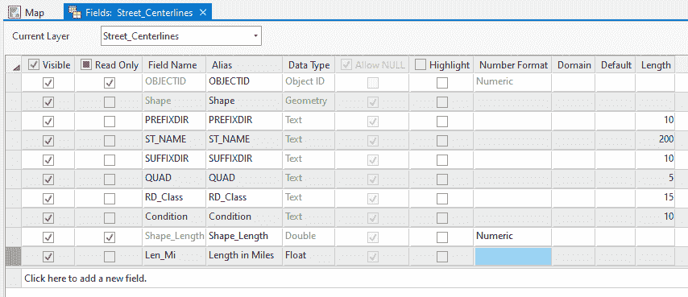

1.  一旦您已验证新字段已正确添加，请点击功能区中的“字段”选项卡上的“保存”按钮。

如果“保存”按钮变灰，那很可能意味着您有未保存的数据编辑。如果有任何未保存的挂起数据编辑，则无法更改数据库模式。

1.  关闭字段视图。

1.  保存您的项目并关闭 ArcGIS Pro。

您刚刚为 Street_Centerlines 要素类添加了一个新字段，您可以使用该字段来存储每段道路的长度（英里）。接下来，您将学习如何将数据从其他来源导入到您的 GIS 数据库中。

## 导入新的要素类

添加字段是您可以对 GIS 数据库模式进行的更改之一。您还可以通过从头创建或从其他数据源导入来添加全新的要素类。

在 GIS 数据库中存储其他格式和位置的数据并不罕见，这些数据对您的 GIS 数据库有益。将所有这些不同的数据源移动到单个 GIS 数据库中，使它们更容易使用、查找和管理。ArcGIS Pro 包含导入、导出和转换数据的工具。这允许您构建一个可以与其他解决方案集成的综合 GIS 数据库。

因此，让我们继续进行下一个练习，该练习是关于导入 shapefile 的。

## 练习 9B – 导入 shapefile

招聘了一位当地顾问来定位 Trippville 市内的所有水表。他们向公共工程总监提供了包含他们找到的水表及其收集的属性的 shapefile。

您现在需要将此 shapefile 导入到城市的地理数据库中，以便它与构成城市水系统的其他要素类存储在同一位置。

### 步骤 1 – 打开项目并添加图层

在此步骤中，您将打开您在本章中一直在使用的项目。然后您将添加由顾问提供给 Director 的 shapefile，其中包含他们找到的水表数据和属性：

1.  打开 ArcGIS Pro 和之前练习中使用的`Ex9A`项目。

1.  在功能区地图选项卡上，点击“添加数据”按钮。

1.  在添加数据窗口的左侧面板中点击位于“项目”下的“文件夹”。

1.  在添加数据窗口的右侧面板中双击`Chapter9`文件夹。

1.  选择`Water_Valves.shp`，然后点击“确定”按钮。

你现在已经将顾问收集的数据添加到地图中。这些数据存储为 Esri shapefile。你需要将收集的数据作为新的要素类添加到城市的地理数据库中。你可以通过将你刚刚添加到地图中的 shapefile 导出到城市的地理数据库来实现这一点。

### 第 2 步 – 导出至地理数据库

现在你将把 shapefile 导出到 Trippville 市的地理数据库中的要素类。你将把新导入的要素类存储在**Water**要素数据集中，与其他与水系统相关的要素类一起：

1.  右键点击你刚刚添加到地图中的 Water_Valves 层。

1.  在显示的上下文菜单中，向下到数据并选择导出要素，如图所示：

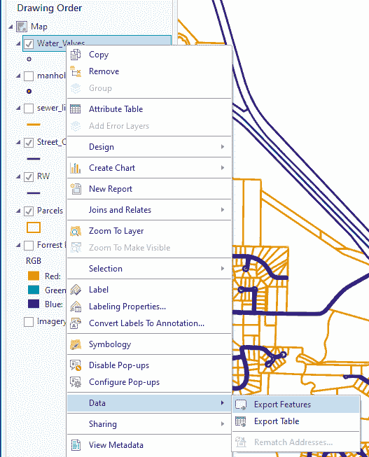

1.  这将在其自己的浮动窗口中打开“导出要素”工具。输入要素值应自动填充为 Water_Valves 层，因为那是你右键点击的层。现在点击输出位置右侧的浏览按钮。

1.  点击输出位置窗口左侧面板中项目下的数据库文件夹。

1.  双击输出位置窗口右侧面板中列出的 Trippville_GIS 地理数据库。

1.  然后点击 Water 要素数据集并点击“确定”按钮以设置输出位置。这就是你即将创建的新要素类将被存储的地方。

1.  在输出要素类下面的单元格中输入`Water_Valves`。

1.  验证你的导出要素工具看起来像以下截图，然后点击窗口底部的“确定”按钮：

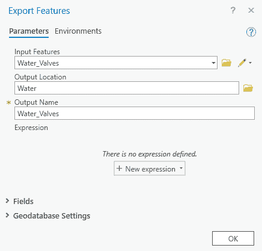

当工具运行完成后，你应该会在地图中看到添加了一个名为“Water_Valves”的第二层。这个新层现在使用的是在地理数据库中创建的新要素类作为其数据源。你现在需要验证这一点。

1.  点击内容面板顶部的“按源列表”按钮。

1.  验证你是否在`Trippville_GIS.gdb`工作空间下看到 Water_Valves 层，以及在`Chapter9`文件夹中也有一个。

1.  右键点击`Chapter9`文件夹中的 Water_Valves 层，然后点击“删除”。这将从地图中删除基于原始 shapefile 的层，以便只保留引用城市主地理数据库的那个层。

1.  保存你的项目并关闭 ArcGIS Pro。

你刚刚将 shapefile 转换为地理数据库要素类，并验证了转换成功。将 shapefile 中的数据导入地理数据库创建了一个新的要素类，这也是对模式的更改。

正如本章开头提到的，能够调整你的 GIS 数据库模式以反映不断变化的需求和条件是很重要的。你现在知道如何向数据库添加新字段，以便在需要时收集新信息。你也已经学会了如何将外部数据源导入 GIS 中，以创建新的信息层。

现在你已经了解了字段，我们将进入下一节，关于在数据库中填充字段值。

# 在数据库中填充字段值

到目前为止，在本章中，你已经学习了如何通过添加字段和导入其他文件来更改你的 GIS 数据库的模式。*但是，你如何填充你创建的新字段，或者只是修改与现有要素相关的属性呢？*

在本节中，我们将探讨几种实现这一目标的方法。我们将从编辑现有要素的个别值开始。我们将探讨如何执行批量编辑以填充表格中的值。

## 理解编辑或添加单个值的方法

当你对空间数据进行修改时，你还需要养成更新与这些要素相关属性的习惯。这些属性存储在图层的属性表中。正如本章开头提到的，属性在 ArcGIS Pro 中用于许多操作，包括控制符号和通过查询选择要素。因此，确保你的要素属性与你的空间数据一样准确和最新是至关重要的。

在 ArcGIS Pro 中，你可以通过几种方式编辑或更新属性值。在本节中，我们将重点关注两种最常见的方法：属性窗口和直接在表格视图中。

### 属性窗口

传统上，属性窗口是从功能区中的“编辑”选项卡打开的。在这个窗口中，你可以对单个选定的要素的属性值进行修改。你只需在字段名称右侧的单元格中单击，并输入新的值，如下面的截图所示：

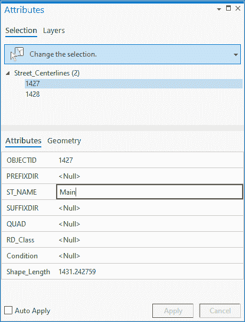

此窗口包含两个选项卡：

+   **选择**选项卡：选择选项卡包括三个部分。它们是选择工具、所选要素列表以及几何值属性字段列表，如下面的截图所示：

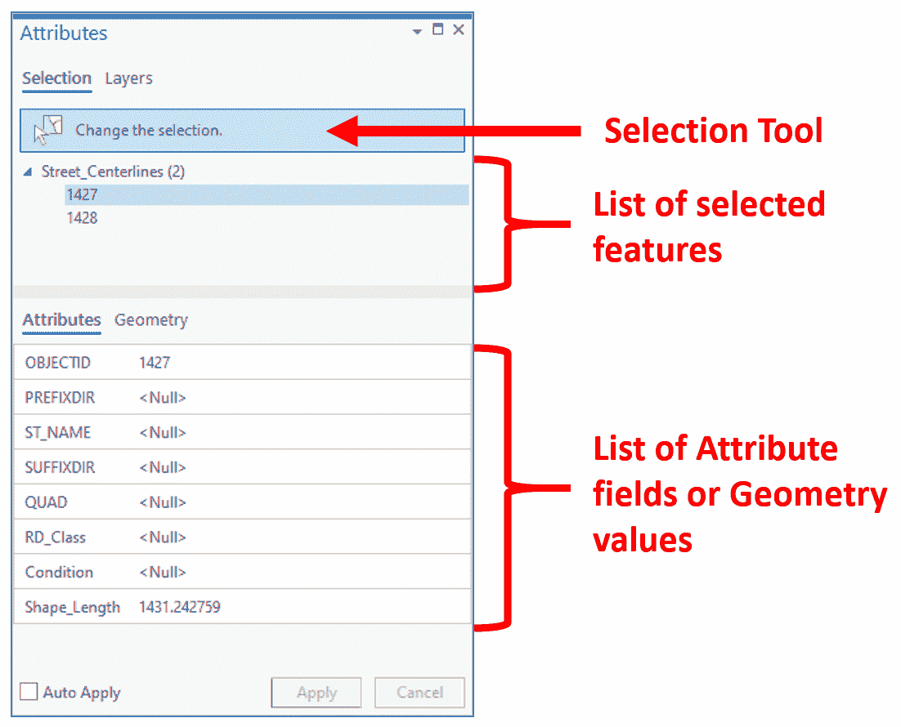

+   **图层**选项卡：属性窗口中的“图层”选项卡允许你选择一个特定的图层进行审查，然后遍历这些图层中的所有要素，如下面的截图所示：

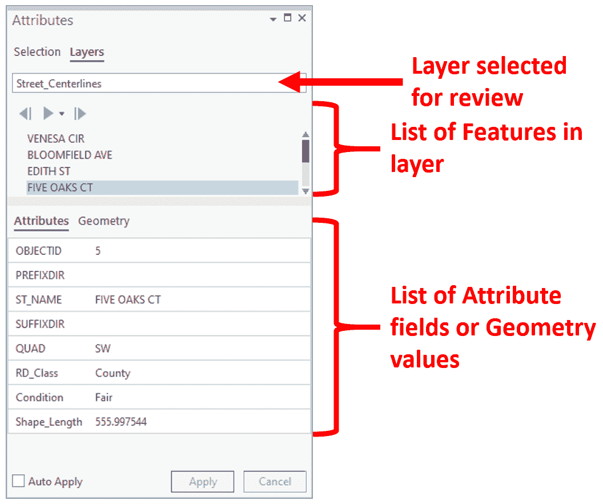

每个选项卡都允许你编辑所选要素的属性值。你将有机会在“练习 9C”中使用属性窗口来编辑值。但在那之前，让我们看看直接在属性表中编辑属性值的另一种方法。

### 直接在属性表中编辑

您也可以直接在属性表中编辑属性值。这可能会更高效，因为您通常已经打开了属性表以用于其他目的。

在属性表中编辑可以简单到在表格中的单元格内点击并输入新值。这非常类似于编辑包含在**Excel**电子表格中的数据，如下面的截图所示：

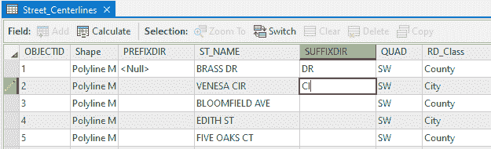

虽然这样做很简单，但也指出了老版本的**ArcMap**软件用户不需要担心的问题。在老版本的 ArcMap 应用程序中，您必须开始一个编辑会话才能编辑任何数据。

在 ArcGIS Pro 中，这不再需要。您可以在任何时间编辑您有权限的任何数据。这包括图层属性表中的属性值。因此，虽然 ArcGIS Pro 使编辑数据变得更容易，但也使创建错误信息变得更容易。在 ArcGIS Pro 中工作时，始终记住这一点非常重要。

我们将进入下一个关于编辑属性的练习。

## 练习 9C – 编辑属性

在这个练习中，您将更新*练习 8A*中第八章，*学习编辑空间数据*中创建的街道中心线的属性。您将使用属性窗口来执行这些更改。

### 第 1 步 – 打开项目并缩放到正确位置

在这一步中，您将打开您将要工作的项目，并缩放到您在*练习 8A*中添加到`Trippville_GIS`地理数据库中的街道中心线的位置，第八章，*学习编辑空间数据*：

*1. 打开 ArcGIS Pro 和您在*练习 9A*和*练习 9B*中使用的`Ex9A`项目。

1.  在功能区中的地图标签页上，点击书签按钮，并从出现的列表中选择“新建子分区 1”。这应该会将您的地图缩放到与*练习 8A*中相同的熟悉位置，第八章，*学习编辑空间数据*。

1.  在内容窗格中，点击“按编辑列表”按钮。然后右键单击 Street_Centerlines 图层，并从出现的菜单中选择“使此为唯一可编辑的图层”，如下面的截图所示：

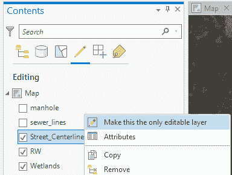

1.  接下来，在内容窗格中点击“按选择列表”按钮。再次右键单击 Street_Centerlines 图层，并从出现的菜单中选择“使此为唯一可选择的图层”。

您现在已打开正确的项目并缩放到您将进行编辑数据区域的区域。然后您将 `Street_Centerlines` 图层设置为唯一可编辑和可选择的图层。这将有助于确保您在下一步中只编辑您打算编辑的图层中的数据。在以下步骤中，您将为在 第八章*“学习编辑空间数据”*中的*第 8A 部分*中创建的每个街道中心线段输入名称。

### 第 2 步 – 添加 Street_Centerline 属性值

在此步骤中，您将使用属性窗口更新您在*第 8A 部分*中创建的每个街道中心线段名称，该部分位于*第八章*“学习编辑空间数据”中：*

*1. 在功能区点击“编辑”选项卡。

1.  接下来，点击“编辑”选项卡上的“选择”组中的“选择”工具。

1.  点击以下截图所示的东北部最远的街道中心线段：

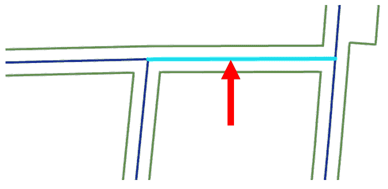

1.  点击“编辑”选项卡上的“选择”组中的“属性”按钮。这将打开属性窗口。

1.  在属性窗口中，通过查看显示所选特征列表的窗口区域，验证您已选择一个 Street_Centerlines 特征。

1.  在 ST_NAME 右侧的单元格中点击，并输入 `OAK PL`。完成后按 *Enter* 键。您的属性窗口应类似于以下截图所示：

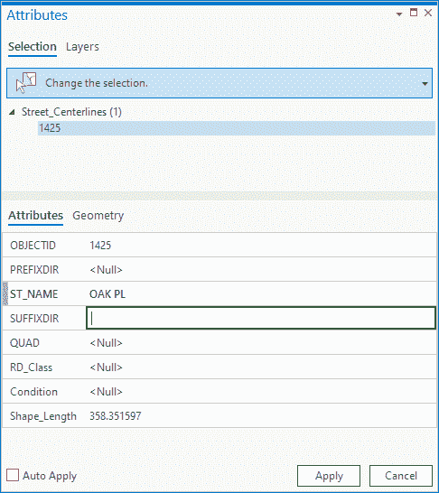

1.  现在，点击 RD_Class 右侧的单元格，并输入 `City`，因为您输入的新街道中心线是城市维护的道路。

1.  最后，点击 Condition 右侧的单元格。然后输入 `Good` 并在完成后按 *Enter* 键。这些是新道路，它们应该处于良好状态。

1.  按下“应用”键将更改应用于属性表。

1.  在“编辑”选项卡中，点击“保存”按钮将您的编辑保存回数据库。

“应用”按钮仅将更改应用于存储在您计算机本地内存中的数据副本。请记住，在 ArcGIS Pro 中的地图中的所有图层都指向数据源。此数据被缓存或复制到您的计算机的**随机存取存储器**（**RAM**）或本地驱动器。当您保存编辑时，您所做的更改实际上会被推回到原始数据源，以便所有人都能看到。

1.  使用相同的过程，更新 Oak Place 组成的外圈剩余段落的 ST_NAME 字段，如图所示：

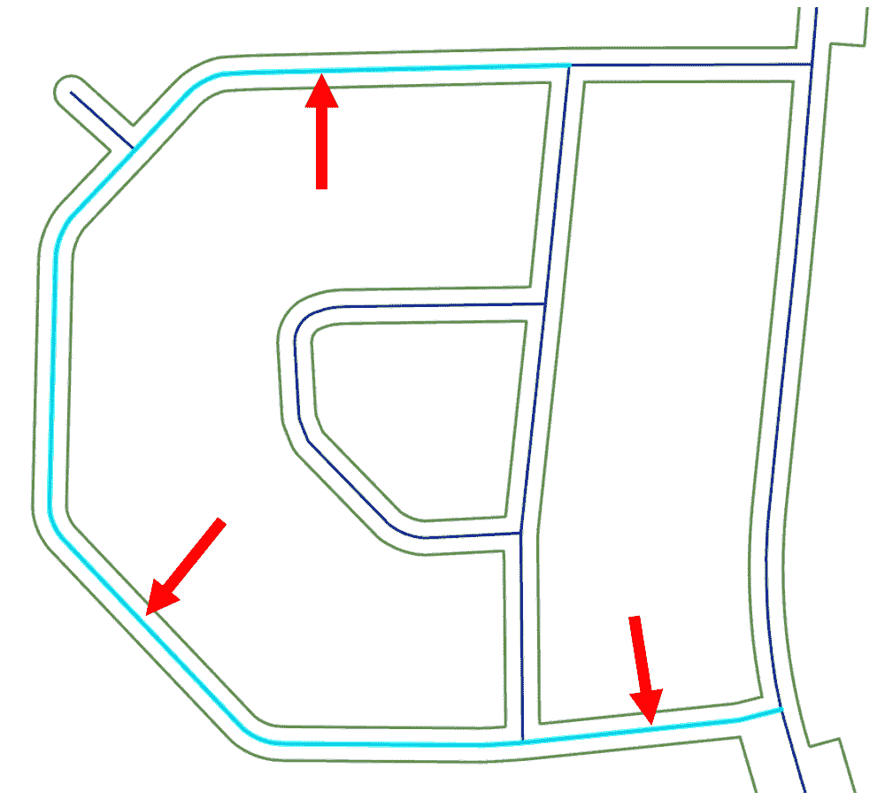

1.  更新剩余段落后，请确保保存您的编辑和项目。

1.  关闭 ArcGIS Pro。

你刚刚更新了你在上一个练习中创建的几个街道中心线段的属性。一般来说，最好在编辑空间数据的同时更新属性。这可以确保你的 GIS 数据的两个组成部分都准确且最新。

接下来，我们将探索允许你一次性编辑多个要素属性的工具。

## 使用工具批量填充表格值

通常在向表中添加新字段或需要大量要素具有相似值更改时，在一个批量编辑中做出这些更改或更新会更有效。ArcGIS Pro 支持多种工具和方法来完成这项工作。现在我们将回顾一些最常用的工具。

### 计算字段工具

**计算字段**工具是一个地理处理工具，它将使用表达式批量填充表中的指定字段值。这个表达式可以像从另一个字段复制值那样简单，也可以像执行一系列数学方程和逻辑函数那样复杂。这些表达式可以用**Python**或**Arcade**编写。你将在第十二章“使用 ModelBuilder 和 Python 自动化流程”和第十四章“使用 Arcade 表达式进行标注和符号”中分别了解这两种语言的一些内容。

尽管它是在自己的窗口中而不是在地理处理面板中打开的，但这仍然是一个地理处理工具。这意味着，如果你在表中选择了记录，它只会将值填充到所选记录中。如果你没有选择任何记录，此工具将填充表中所有记录的字段值，覆盖任何现有信息。

### 计算几何工具

**计算几何**地理处理工具根据空间值将值计算到所需的字段中。你可以使用此工具计算诸如面积、周长、中心坐标、顶点数量等。你可以计算的确切空间特征将取决于相关要素的几何类型。例如，你不能使用计算几何工具计算点要素的面积，因为点没有面积。

此工具还可以用于单位转换，例如，如果你有一个以英制单位创建的多边形，但你需要知道其面积以平方公里为单位。那么你可以使用计算几何工具将英制单位转换为公制单位，而无需你知道确切的转换系数。

现在是时候通过实际操作练习来查看这些工具的实际应用了。

## 练习 9D – 使用工具批量填充字段值

在这个练习中，您将能够一次性使用计算字段和计算几何工具处理多个要素。您将首先使用字段计算器工具来填充您在*练习 9A*中创建的**Len_Mi**字段。然后您将使用计算几何工具计算湿地多边形的面积。

### 第 1 步 - 使用字段计算器工具填充字段

在此步骤中，您将把每个路段的长度以英里为单位填充到您在*练习 9A*中创建的字段中。您可以使用您已经学到的某些编辑技能手动为每个路段这样做。这将非常耗时。有一个更有效的方法。

您已识别出与街道中心线相关联的字段之一是**Shape_Length**。因此，现在您已经有了显示每个路段长度的值。这些值是以英尺为单位的，但要将正确的值填充到您的新字段中以表示英里，您需要将英尺转换为英里。正如您在本节中之前所学，ArcGIS Pro 包括一个名为字段计算器的工具，它允许您根据特征类中所有要素的表达式填充字段。我们将按照以下步骤进行操作：

1.  打开 ArcGIS Pro，并打开您在本章之前练习中使用的`Ex9A`项目。

1.  如果需要，通过点击视图区域顶部的选项卡激活 ArcGIS Pro 中的地图视图。

1.  在内容面板中，通过转到按可编辑按钮，确保 Street_Centerlines 图层是可编辑的。

1.  在内容面板中右键单击 Street_Centerlines 图层，并选择属性表以打开界面底部的表窗口。

1.  右键单击您创建的新字段。它应该使用您创建新字段时指定的别名显示——长度（英里）。请注意，该字段是空的。空表示它为空。没有存储任何值。

1.  选择计算字段，这将打开其自己的浮动窗口中的地理处理工具。

1.  在字段框中，双击 Shape_Length。这将按照以下截图所示，将带有正确语法的字段名称插入到位于字段和辅助工具下方的表达式框中：

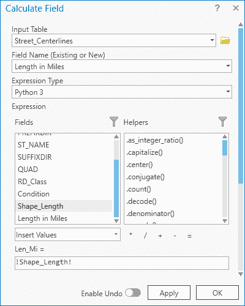

1.  点击位于辅助工具框下方的/符号以将其添加到表达式中。此符号将每个记录中 Shape_Length 字段存储的值除以您接下来指定的值。

1.  在表达式框中，在/符号后键入`5280`。这是英里中的英尺数。您的表达式应该看起来像这样：

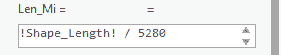

1.  一旦您验证了您的表达式，请点击计算字段窗口底部的确定按钮。

1.  当计算字段完成时，你现在应该能看到你创建并填充了值的字段。如果你滚动表格，你会看到它为表格中的所有记录计算了英里长度的值。计算字段工具是一种非常强大且高效的方法来填充字段。

1.  关闭 Street_Centerlines 层属性表并保存你的项目。

接下来，你将使用计算几何工具来填充湿地区层中多边形的面积字段。

### 第 2 步 – 使用计算几何工具

当你正在确定道路的英里长度时，公共工程总监走过来说，你是否能计算湿地区的面积。你将使用计算几何工具和以下步骤来完成这项工作：

1.  在内容窗格中，选择湿地区层。

1.  在功能区点击数据标签页，然后在表格组中选择属性表按钮。这将打开湿地区层的属性表。

1.  查看你刚刚打开的表格，以查看表格中存在哪些字段。接下来，在表格中的 ACREAGE 字段上右键点击，并从出现的菜单中选择计算几何，如图下所示：

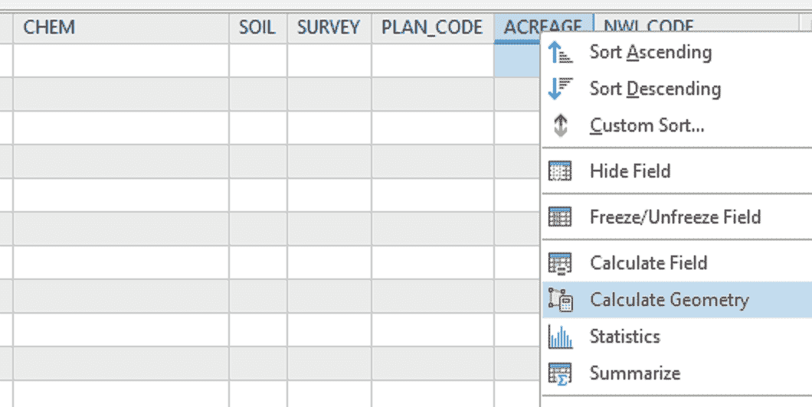

1.  在刚刚打开的计算几何工具窗口中，验证输入要素参数设置为湿地区。

1.  在目标字段下，验证第一行设置为 ACREAGE。

1.  在 ACREAGE 旁边的属性列下，使用下拉箭头选择面积，如图下所示：

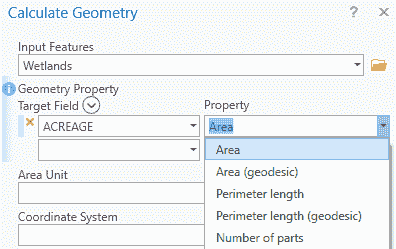

1.  现在计算几何工具窗口中应该出现一条新行，命名为面积单位。使用下拉箭头将其设置为英亩。

1.  使用下拉箭头将坐标系参数设置为当前地图（地图）。这将坐标系设置为 NAD_1983_StatePlane_Georgia_West_FIPS_1002_Feet，这是分配给当前活动地图的坐标系。

1.  验证你的计算几何工具看起来如下，然后点击确定：

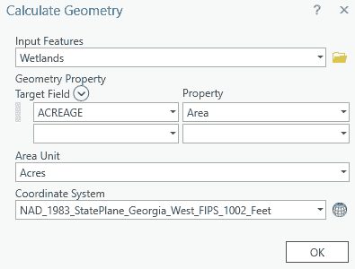

1.  检查 ACREAGE 字段，查看它现在包含的值。

1.  保存你的项目并关闭 ArcGIS Pro。

你刚刚使用计算几何工具填充了该层中多边形的总面积字段。此外，这个工具将面积单位从平方英尺转换为英亩，而你不需要知道转换系数，就像你在上一个练习中所做的那样。

本节教你如何在 GIS 数据库中的表中填充值。你学习了如何输入单个值以确保你添加或更改的新特征也能保持其属性最新。你还学习了如何使用**计算字段**和**计算几何**工具同时填充表格中多个记录的值。

# 摘要

正如你所学的，总会有创建和更新数据的需求。在 GIS 中，这包括空间信息和表格信息。在上一章中，你学习了如何编辑空间数据，包括点、线和多边形。在这一章中，你学习了如何更新和创建表格信息。

我们首先讨论的是如何修改你的数据库模式。模式是数据库的结构。这包括你的 GIS 数据库中包含哪些要素类，这些要素类的属性表中有什么字段，以及更多。你现在有了向你的属性表添加新字段和将数据从其他来源导入到你的 GIS 数据库中的技能。

你还学会了如何更新你在地图中显示的特征的属性值。你现在知道如何使用“计算字段”和“计算几何”工具单独或批量完成这项工作。

因此，在这章和上一章之间，你已经掌握了保持你的 GIS 数据库更新和准确所需的基本技能。在下一章中，你将学习如何使用 ArcGIS Pro 分析数据。

# 进一步阅读

如果你想要了解更多关于本章讨论的概念，你可能想要查看以下资源：

+   *ArcGIS Pro 2.x 烹饪书*：*第四章*和*第五章*

+   在 eGIS Associates YouTube 频道上的 ArcGIS Pro 数据编辑播放列表：[`www.youtube.com/user/eGISAssociates`](https://www.youtube.com/user/eGISAssociates)**
