使用 ModelBuilder 和 Python 自动化流程

正如你所学的，执行分析或编辑要素需要许多步骤。你使用 ArcGIS Pro 越多，就越会发现自己在重复同样的过程。你也可能意识到，你反复执行的一些过程实际上只需要你进行很少的交互，比如选择一个要素，然后告诉 ArcGIS Pro 输出保存的位置。

*如果你能自动化你反复执行的过程，那岂不是很有益？* 你可以创建一个传说中的**简易**按钮，只需点击一个工具，填写一些参数，然后工具就会执行，完成后提供结果。这无疑会使你的工作变得更简单。

在本章中，使用 ArcGIS Pro，你将学习如何使用**ModelBuilder**和**Python 脚本**创建**简易**按钮或工具。这将为你提供创建自动化流程的技能，这些流程可以按顺序或同时运行多个工具以完成操作。ModelBuilder 使用可视化界面创建自动化模型，无需成为程序员。

Python 是 ArcGIS 平台的主要脚本语言。使用它，你可以创建非常强大的脚本，这些脚本可以在 ArcGIS Pro 中使用，也可以集成 ArcGIS 的所有组件中的过程，包括**企业**、**在线**、**扩展**、**门户**等。然而，创建 Python 脚本确实需要编写代码。

在本章中，你将学习以下主题：

+   区分任务、地理处理模型和 Python 脚本

+   创建地理处理模型

+   运行地理处理模型

+   使模型交互式

+   学习 Python

# 第十六章：技术要求

与本书中的其他章节一样，你需要拥有**ArcGIS Pro 2.5**或更高版本。本章的练习可以使用 ArcGIS Pro 的任何许可级别。

# 区分任务、地理处理模型和 Python 脚本

你在上一个章节中学习了任务，并阅读了本章的介绍；现在你可能想知道任务、地理处理模型和 Python 脚本之间的区别是什么。这是一个很好的问题。

你将在本节中找到这个问题的答案，但要理解它，你必须首先了解这些事物中的每一个是什么。你已经知道什么是任务，所以我们现在将专注于更好地理解模型和 Python 脚本是什么。一旦你理解了这一点，你就可以理解这三个之间的区别。

## 了解地理处理模型

**地理处理模型** 是在 ModelBuilder 窗口中创建的自定义工具，其中包含多个地理处理工具及其各种参数（包括输入、输出、选项和其他值），它们作为集成过程的一部分协同工作，就像是一个单独的工具一样运行。以下图表显示了一个非常简单的模型示例：

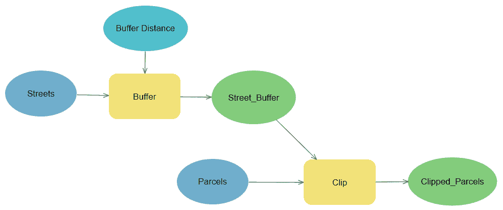

从前面的图表中，您可以看到它包含两个您在 第十章 中学习到的地理处理工具，即 *使用地理处理工具进行分析* 的缓冲区和剪辑工具。在模型中，缓冲区工具在输入 Streets 的周围创建缓冲多边形。

生成的缓冲多边形随后被用来剪辑出 Parcels 中的要素，这是位于缓冲多边形内部的剪辑要素输入。由于这两个地理处理工具都位于模型内部，用户只需运行模型而不是必须单独运行每个工具。模型会根据其中指定的参数自动运行工具。您将在本章后面学习更多关于模型组件以及如何创建模型的内容。

地理处理模型可以包括地理处理工具、Python 脚本、迭代器、仅模型工具和其他模型。这使得它们可以简单或复杂到您需要它们完成您设计的流程的程度。ModelBuilder 窗口允许用户在可视化环境中创建地理处理模型。构建模型不需要编写代码。

**Esri** 实际上把 ModelBuilder 称为一种可视化编程语言。

地理处理模型可以使用 **ArcGIS Desktop** （**ArcMap** 或 **ArcCatalog**）或 ArcGIS Pro 创建。然而，在一个软件中创建的模型并不总是能在另一个软件中成功运行。模型越简单，越有可能实现跨应用程序兼容。地理处理模型的另一个缺点是它只能从 ArcGIS Pro 或 ArcGIS Desktop 运行。您无法安排它们在特定日期和时间自动运行。至少不是通过它们自己。

现在我们来学习 Python 脚本。

## 理解 Python 脚本

**Python 脚本** 也是一个自定义工具，可以在集成过程中运行多个地理处理工具及其各种参数。然而，与不需要您编写编程代码的模型不同，Python 脚本则需要。您必须了解 Python 脚本语言才能创建 Python 脚本。以下代码是 ArcGIS 为 Python 创建的一个 Python 脚本的小片段：

```py
#--------------------------------------------------------------
# Name:        Union Tool Sample Script
# Purpose:     Runs the Union Geoprocessing tool from ArcGIS
# Author:      Esri & Tripp Corbin
#
# Created:     09/15/2015
# Updated:     05/08/2020 by Tripp Corbin, GISP
#
# Usage: Union two feature classes
#---------------------------------------------------------------
# Import the system modules
import arcpy

# Sets the current workspace to avoid having to specify the full path
# to the feature classes each time
arcpy.env.workspace = "C:\\student\\IntroArcPro\\Databases\\Trippville_GIS.gdb"

#Runs Union Geoprocessing tool on 2 Feature classes
arcpy.Union_analysis (["Parcels", "Floodplains"], "Parcels_Floodplain_Union", "NO_FID", 0.0003)
```

前面的代码以几行注释开始，提供了脚本目的的一般描述以及谁创建了它。在注释描述之后是下一行的`import`命令，它加载`arcpy`模型，以便脚本可以访问 ArcGIS 功能。这之后是一些更多的描述性注释，然后定义了一个变量来设置脚本中使用的数据将被访问或保存的工作空间。最后，脚本运行了你在第十章中学习的`Union`工具，*使用地理处理工具进行分析*。

Python 脚本相对于地理处理模型有几个优点：

+   首先，Python 不仅限于 ArcGIS。实际上，Python 可以用来为许多其他应用程序创建脚本，例如**Excel**、**SharePoint**、**AutoCAD**、**Photoshop**、**SQL Server**等。这意味着你可以使用 Python 脚本来在多个平台上运行工具，以创建一个真正集成的流程。

+   第二，Python 脚本可以从 ArcGIS 外部运行。这意味着你可以使用操作系统的调度应用程序安排它们在特定的时间和日期运行。如果你的脚本包含 ArcGIS 地理处理工具，脚本将需要访问 ArcGIS 许可证才能成功运行，但 ArcGIS 在脚本被安排运行时不需要打开和活动。

+   第三，Python 可以用来创建完全定制的地理处理工具。它不仅限于你在 ArcGIS Pro 工具箱中找到的地理处理工具。

现在我们来看看任务、地理处理工具和 Python 脚本之间的区别。

## 这三个之间的区别是什么？

现在你对任务、地理处理模型和 Python 脚本有了更深入的理解，你将能够正确地理解它们之间的区别。每个都可以在标准化和自动化常见的工作流程和过程中发挥作用。

下面的表格将提供对这三个之间区别的更清晰理解：

| **参数** | **任务** | **地理处理模型** | **Python 脚本** |
| --- | --- | --- | --- |
| 自动运行单个地理处理工具 | 是，它可以作为步骤的一部分自动运行单个工具。 | 是 | 是 |
| 允许用户在运行工具之前提供输入 | 是 | 是 | 是 |
| 自动按顺序运行多个地理处理任务 | 否 | 是 | 是 |
| 包含在任务中 | 否 | 是 | 是 |
| 包含在地理处理模型中 | 否 | 是 | 是 |
| 提供了文档化的工作流程 | 是 | 是 | 否 |
| 从 ArcGIS Pro 外部（外部）运行 | 否 | 否 | 是 |
| 与其他应用程序集成 | 否 | 否 | 是 |
| 安排在特定的时间和日期运行 | 否 | 否 | 是 |
| 需要编程语言知识 | 否 | 否 | 是 |

因此，正如您现在可以从前面的表中看到的那样，任务、地理处理模型和 Python 脚本之间存在很大的差异。任务用于定义包含多个步骤的工作流程。一个任务可能包括使用地理处理模型或 Python 脚本，但地理处理模型或 Python 脚本不能引用任务。

既然您已经了解了任务、地理处理模型和 Python 脚本之间的区别，我们将开始探索如何创建一个地理处理模型。

# 创建地理处理模型

如前所述，地理处理模型是从 ModelBuilder 内部创建的自定义工具。ModelBuilder 提供了构建模型的图形界面，同时允许您访问仅适用于模型的额外工具、迭代器、环境设置和模型属性。

创建模型的原因有很多。第一个也是最常见的原因是自动化在 ArcGIS Pro 中执行的重复过程。如果您有一个定期执行的分析、转换或其他过程，则可以使用模型来自动化它。

其次，您可以使用模型在 ArcGIS Pro 中思考和创建流程图过程。这可以帮助您确保您已经考虑了完成过程所需的所有工具和数据。一旦完成，该模型将提供完成该过程的工具，以及解释如何执行该过程的视觉和文本文档。

您可以将模型与组织内的其他人共享，以便他们可以使用它来执行该过程。这可以减少您的工作量，让您能够专注于其他需要更高知识和技能水平的工作。由于模型会自动运行其中包含的地理处理工具，您可以通过创建一个易于其他不太熟悉**地理信息系统**（**GIS**）的成员独立运行的模型来简化操作，而无需完全理解 ArcGIS Pro。这也有助于标准化我们的方法，确保一切都在一致和批准的方式下完成。

所有这些都有助于通过提高效率来节省我们时间和金钱，这是 ModelBuilder 的主要力量。与任务一样，模型由多个组件组成，并与其相关的术语相关联。我们将在下一节中了解这些内容。

## 理解模型组件和术语

在您能够创建模型之前，您需要了解构成它们的各个部分。模型包括一系列连接的过程。每个过程都包含一个工具，可以是地理处理工具、另一个模型或 Python 脚本。每个工具都有变量作为输入或输出。

以下图表显示了两个连接的过程：

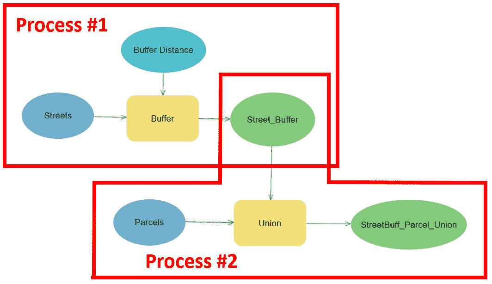

如前图所示，该模型包含围绕缓冲区和联合工具构建的两个过程。这些工具中的每一个都有许多变量输入。变量通过蓝色和绿色的椭圆形来识别。请注意，两个过程正在共享一个变量 - Street_Buffer。这个变量是缓冲区工具的输出，也是联合工具的输入。

模型中包含三种基本的变量类型。如下所示：

+   **数据变量**：这些变量是作为工具、脚本或模型输入的现有数据。这些可以是地图中的图层、独立的表格、文本文件、要素类、shapefile 等。

+   **值变量**：这些变量是工具可能使用的附加信息，以运行。在缓冲区工具的情况下，用于创建缓冲区的距离被视为值变量，以及溶解、端类型和其他参数，这些参数在您在地理处理窗格中正常运行缓冲区工具时出现。

+   **派生变量**：这些变量是过程的输出。同样，这可以是一个新的图层、要素类、表格、栅格或更多，具体取决于过程中使用的工具。

下图展示了模型中三种基本变量的一个示例：

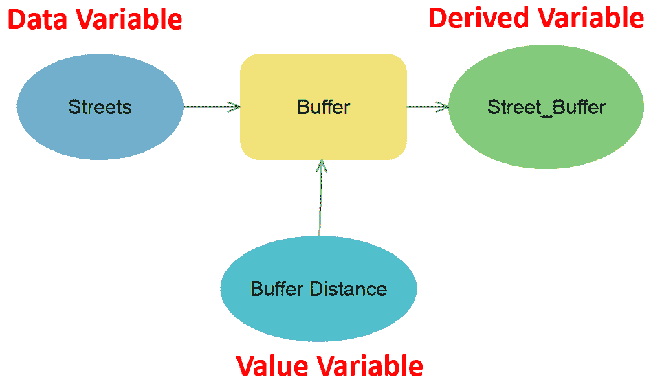

由于 ModelBuilder 是一种可视化编程语言，如前图所示，您可以根据它们的颜色区分变量的类型。虽然您可以通过默认设置调整这些设置，但数据变量是较深的蓝色。值变量是较浅的蓝色，派生变量是绿色。

接下来，我们将学习如何保存您创建的模型。

## 保存模型

如果您希望保存您创建的模型以便再次使用或与他人共享，您必须将其保存在您将创建的自定义工具箱中。模型不能保存在 ArcGIS Pro 安装时自动包含的系统工具箱中。

当您创建一个新的项目时，ArcGIS Pro 会自动为该项目创建一个自定义工具箱。它存储在`项目`文件夹中，作为一个`.tbx`文件。这为您提供了一个易于使用的地方来存储您的模型。此工具箱还自动链接到您的项目，并在以下方式中在目录窗格中可访问：

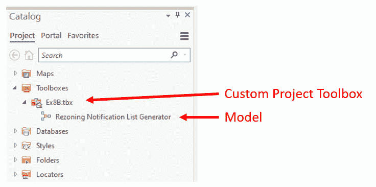

您也可以在地理数据库中创建自定义工具箱，以便与它一起，您的模型和 Python 脚本也存储在您的 GIS 数据中，如下面的截图所示（如果要将保存到工具箱中的模型或工具用于多个 ArcGIS Pro 项目，这是一个不错的选择）：

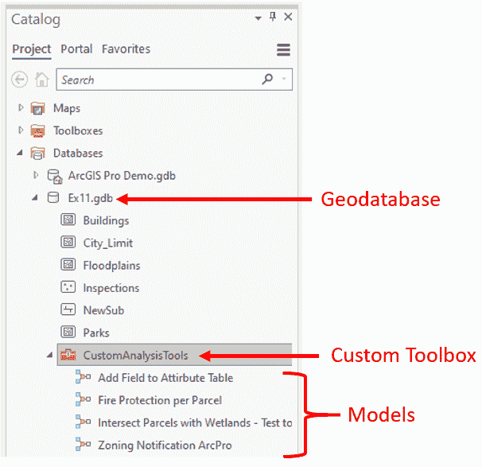

您还可以创建除自动与新建项目一起创建的`.tbx`文件之外的其他自定义`.tbx`文件。如果您要保存的工具和模型不仅将在多个项目中使用，而且还将跨多个数据库使用，或者是在咨询人员和多个客户的情况下使用，那么使用自定义`.tbx`文件是完美的。以下屏幕截图显示了位于文件夹中的自定义工具箱文件示例：

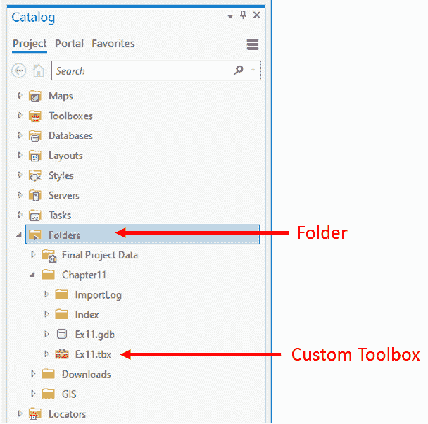

使用自定义`.tbx`文件存储模型也使得与他人共享它们变得更加容易，因为它们比地理数据库小，而且还包括所有 GIS 数据。`.tbx`文件可以轻松地通过电子邮件发送、上传到**文件传输协议**（**FTP**）站点，或者放置在您的 ArcGIS Online 账户中。

现在您已经对模型有了很好的总体理解，包括其组件以及如何保存模型，现在是时候将知识付诸实践了。

## 练习 12A – 创建模型

最近刚刚通过了一项新法规，以保护 Trippville 地区的溪流。该法规要求所有新的建筑或改善项目至少在所有溪流或溪流的中心线 150 英尺以外进行。这有望保护河岸不受侵蚀，并减少污染径流到达它们。

社区和经济发展主任要求您计算每个地块在非扰动区域内的总面积以及每个地块有多少面积在外。由于您需要随时在添加新的分区或商业开发时更新此分析，因此您决定创建一个模型，每次您需要执行这些计算时都可以运行该模型。

在这个练习中，您将创建一个简单的模型，该模型将计算每个地块在溪流周围非扰动缓冲区内部和外部各占多少面积。此模型将包括几个地理处理工具及其相关变量。

### 第 1 步 – 打开项目和 ModelBuilder 窗口

第一步是打开项目然后打开 ModelBuilder 窗口，这样您就可以开始创建模型：

1.  启动 ArcGIS Pro 并打开位于`C:\Student\IntroArcPro\Chapter12`的`Ex12.aprx`项目。

1.  当项目启动时，请在目录窗格中展开`Toolboxes`文件夹。

1.  右键单击您屏幕上看到的 Ex12 工具箱。

1.  选择“新建 | 模型”选项，如图所示：

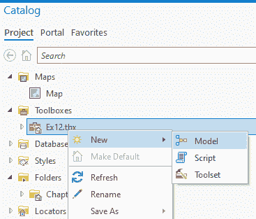

ModelBuilder 现在应该已经打开，并且 ModelBuilder 选项卡应该已经出现在功能区中。ModelBuilder 窗口和选项卡一起使用来创建或编辑模型。正如您在以下屏幕截图中所见，ModelBuilder 选项卡包含用于保存模型、在 ModelBuilder 窗口中导航以及向模型添加内容的工具：

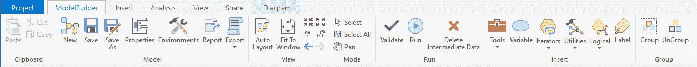

您现在将开始使用这些工具来创建您的模型。

### 第 2 步 – 添加模型组件

在这一步，你将开始向你的模型添加工具和变量。你将探索可以在这里使用的一些不同方法。你将首先添加生成流周围非干扰缓冲区的过程：

1.  在工具栏的模型构建器选项卡上的插入组中单击工具按钮。这将在界面的右侧打开地理处理面板。

1.  在面板顶部单击工具箱选项卡以显示 ArcGIS Pro 中的各种工具箱。这些工具箱将是你的系统工具箱。

1.  展开分析工具工具箱，然后展开邻近工具集。

1.  从工具箱中将缓冲工具拖放到模型构建器窗口中，使其看起来像这样：

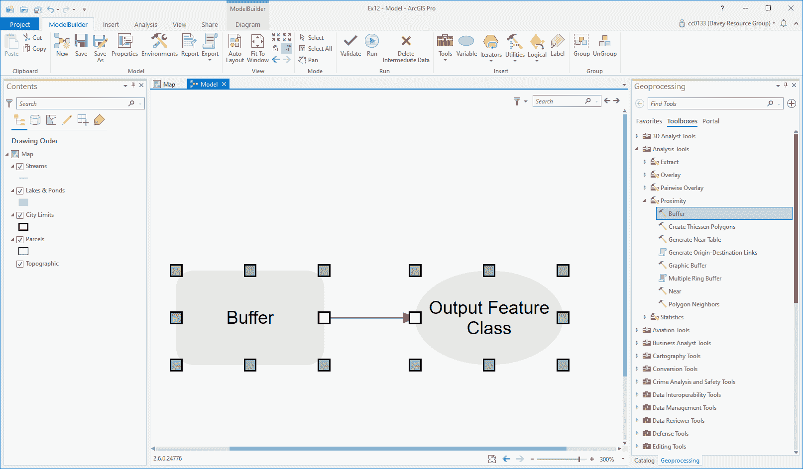

你刚刚将第一个过程添加到了模型中。模型过程将存在于三种状态之一：**未准备好运行**、**准备好运行**和**已运行**。你刚刚添加的过程处于**未准备好运行**状态。

ArcGIS Pro 通过以灰色显示工具和变量来直观地表示。一个过程将在所有必需的变量都定义之前处于**未准备好运行**状态。在**缓冲**工具的情况下，你尚未定义所需的三个变量：**输入要素类**、**缓冲距离**和**输出要素类**。你现在将这样做。

1.  模型中使用的缓冲工具的输入要素类将是你的地图中的流层。因此，你现在需要将这个层作为变量添加到模型中。在内容窗格中选择流层，并将其拖入模型构建器窗口。它将以蓝色椭圆形添加，如下面的截图所示：

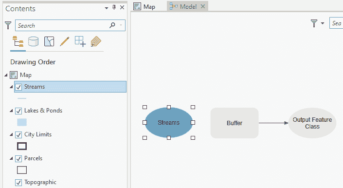

1.  在模型构建器中的空白区域内单击以取消选择流变量。

1.  现在，你需要将你刚刚添加的流变量连接到缓冲工具。单击流变量，然后按住鼠标左键，将鼠标指针移动到缓冲工具上。然后，释放鼠标按钮。

1.  应该出现一个小弹出菜单；选择输入要素。你刚刚为**缓冲**工具定义了输入要素类。

1.  现在，在模型构建器窗口中双击缓冲工具。这将打开模型构建器中的工具对话框，以便你可以定义其他变量。

1.  输出应自动设置为 Streams_Buffer，它正在保存到`C:\Student\IntroArcPro\Chapter12\Ex12.gdb\`。通过将鼠标悬停在输出要素类名称上验证这是否正确。对于这个练习来说，这将很好，所以你将保持不变，不进行更改。

1.  在距离[值或字段]中输入`150`，并验证单位是英尺。

1.  由于导演没有指出保留任何流属性在新缓冲层中对于计算很重要，因此您将得到的结果缓冲区将溶解。单击“溶解类型”下的下拉箭头，然后选择将所有输出要素溶解为单个要素：

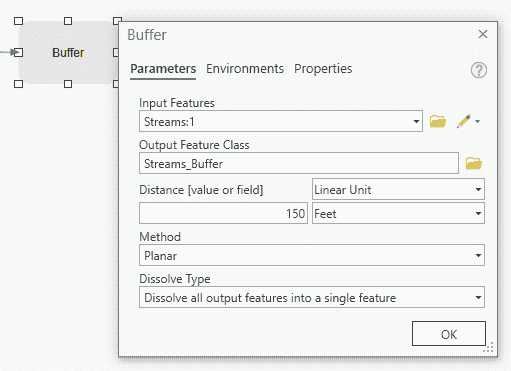

缓冲工具窗口现在应该看起来与前面的截图相似。根据您之前可能执行的操作，输入要素的名称可能略有不同。

1.  在验证了您的设置后，单击“确定”。

1.  在模型构建器选项卡上单击自动布局按钮。

您的模型现在应包含一个单个完成流程，该流程处于**就绪运行**状态。您可以通过工具和所有连线变量的彩色填充（非灰色）来判断它是否就绪运行，如下面的截图所示：


现在让我们保存您的模型，以确保在发生意外情况时您的工作不会丢失。

1.  在模型构建器选项卡上的模型组中单击“属性”按钮。

1.  在相应的属性中填写以下详细信息：

    +   在名称字段中键入`ParcelsStreamProtectionBuffer`。

    +   在标签字段中键入`Parcels Stream Protection Buffer Analysis`。

    +   将所有其他属性保留为默认设置。

1.  确认您的工具属性窗口看起来与以下截图相似，然后单击“确定”：

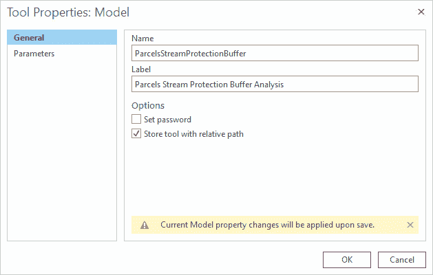

1.  在模型构建器选项卡上的模型组中单击“保存”按钮以保存模型。如果您仍然打开了目录窗格，您应该看到模型的名称从“模型”更改为您之前输入的标签。

模型的名称不能包含空格或其他特殊字符，除了下划线。标签可以更加详细，没有相同的限制。

您在模型中创建的流程将生成流周围的缓冲区。现在您需要添加另一个流程来计算每个包裹在缓冲区内的数量。

您将使用**联合**工具将包裹与新建的流缓冲区联合。这将创建一个新的要素类，它将在流缓冲区重叠的地方分割每个包裹，从而让您确定缓冲区内外的数量。

### 第 3 步 - 添加另一个流程

在此步骤中，您将向模型中添加另一个流程。此流程将包括**联合**工具。然后，您将此新流程链接到您在上一步骤中创建的流程：

1.  再次在模型构建器选项卡上单击工具按钮以打开地理处理窗格。

1.  在分析工具箱中展开叠加工具集。

1.  通过在工具上右键单击并选择将工具添加到模型中，将联合工具添加到您的模型中。

1.  如果需要，使用您的滚轮在模型构建器窗口中向外缩放，直到您有足够的空间看到联合工具和缓冲工具。

1.  在选择**合并工具**和**输出要素类变量**后，使用您的鼠标将它们移动到缓冲工具下方，如图所示：

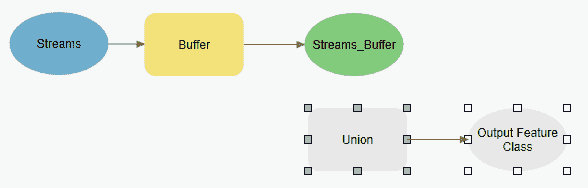

您现在已将合并工具添加到模型中。现在您需要将其链接到缓冲工具的输出，并定义其余所需变量。

1.  双击合并工具以打开工具窗口。

1.  在合并工具窗口中，单击“输入要素”旁边的小箭头，然后从显示的列表中选择“地块”。

1.  重复此过程以选择位于模型变量下的**Streams_Buffer**。

1.  将输出设置为`C:\Student\IntroArcPro\Chapter12\Ex12.gdb\Parcels_StreamBuff_Union`。

1.  确认您的合并工具设置与以下截图匹配，然后单击“确定”：

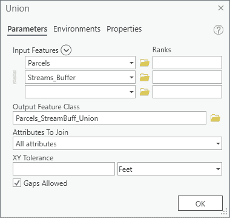

您的整个模型现在应处于**就绪运行**状态，看起来类似于以下：

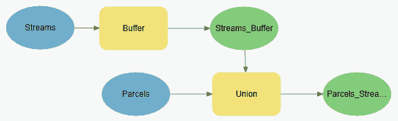

与前面的图相比，您的布局可能不同。只要正确连接，并且进程处于**就绪运行**状态，这是可以接受的。

1.  保存您的模型和项目。

1.  您可以选择关闭 ArcGIS Pro 或保持打开状态，如果您计划继续使用。

您已经学会了如何创建模型，并理解了其组件。创建模型后，当然，您会想要运行它。运行模型的方法有很多，所以我们将查看如何在下一节中运行模型。

# 运行模型

您可以运行整个模型和处于**就绪运行**状态的进程，或者只运行模型中的单个进程。在本节中，您将探索在模型构建器中创建的模型的不同运行方式。

如果您希望运行整个模型，最简单的方法是双击它，从存储的工具箱中运行。这将运行模型中所有处于**就绪运行**或**已运行**状态的进程。如果您允许用户为模型中的某些变量提供值，他们将在模型运行之前被提示输入这些值。

否则，如果您没有允许用户输入，模型将只指示地理处理窗口中没有参数，您只需单击“运行”按钮即可。您将在本章稍后学习如何使模型交互。

您也可以选择从**模型构建器**窗口运行模型或模型中的进程。在**模型构建器**选项卡中单击“运行”按钮将运行模型中所有准备就绪的进程。它不会运行处于**已运行**或**未就绪**状态的进程。这允许您在构建和测试模型的同时，无需运行整个模型。

现在您已经对如何运行模型有了更多的了解，您将有机会将所学知识付诸实践。

## 练习 12B – 运行模型

在这个练习中，你将首先在 ModelBuilder 中运行你的模型。然后，你将直接从工具箱中运行它，这样你就可以看到当用户运行模型时会经历什么。

### 第 1 步 – 从 ModelBuilder 运行模型

在这一步，你将在第十二章的*练习 12A*，*使用 ModelBuilder 和 Python 自动化流程*中，从 ModelBuilder 内部运行你在第十二章创建的模型。你还将探索如何运行单个过程，这样你可以在创建模型的同时测试你的模型：

1.  如果你在上一个练习后关闭了 ArcGIS Pro，请启动 ArcGIS Pro 并打开`Ex12.aprx`项目。

1.  在目录窗格中展开工具箱文件夹，然后展开 Ex12 工具箱。

1.  右键单击你在*练习 12A*中创建的模型，并从显示的上下文菜单中选择编辑。这将打开 ModelBuilder 窗口。

如果你在上一个练习中成功创建了模型并保存了它，所有进程都应该处于**就绪运行**状态。这可以通过所有工具和变量都应用了实心填充色来表示。如果有任何填充灰色或为空，那么你需要回到第十二章的*练习 12A*，*使用 ModelBuilder 和 Python 自动化流程*，并重新完成练习。

1.  在 ModelBuilder 中右键单击缓冲工具。选择运行以使用在模型中定义的连接变量运行**缓冲**工具。ModelBuilder 内部将弹出一个小窗口，显示**缓冲**工具的进度，并告诉你何时完成。当工具完成时，注意**缓冲**工具及其相关变量的图形发生了什么，如下面的截图所示：

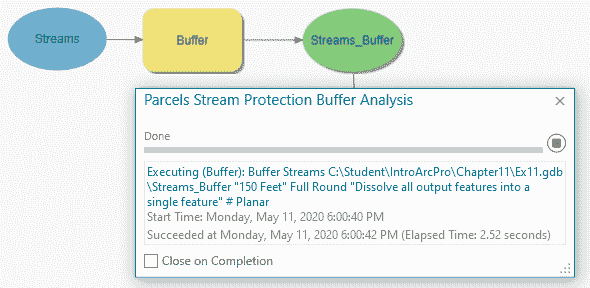

**缓冲**工具进程现在处于**已运行**状态。这意味着你已经在模型中成功运行了该进程。

问题：*缓冲工具及其相关变量的图形是如何变化的？*

正如你开始学习的那样，进程的状态将影响其运行方式。现在这个进程处于**已运行**状态，如果你在功能区点击运行按钮，它将不会再次运行。运行按钮只会运行处于**就绪运行**状态的进程。让我们验证一下。

1.  通过点击右上角的 x 关闭运行缓冲工具时出现的弹出窗口。

1.  在 ModelBuilder 选项卡上的运行组中点击运行按钮。观察模型运行时发生了什么。

问题：*模型是否尝试重新运行**缓冲**工具？当你点击**运行**按钮时，模型运行了哪些工具或工具，为什么？*

我们现在将进入下一步，关于如何重置运行状态。

### 第 2 步 – 重置运行状态

在这一步，你将学习如何将模型中所有处于**已运行**状态的过程的运行状态重置为**准备运行**状态：

1.  在工具栏的 ModelBuilder 选项卡中，点击运行组中的验证按钮，如图所示：

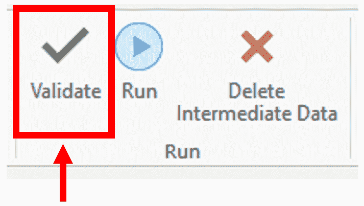

问题：*模型中所有处于**已运行**状态的过程会发生什么？*

1.  点击工具栏上的运行按钮，观察这次模型是如何运行的。所有过程这次都会运行，因为它们都处于**准备运行**状态。

现在，你将实际验证你的模型是否运行，并在项目数据库中创建了它应该创建的特征类。

1.  在目录窗格中展开数据库文件夹，然后展开 Ex12 地理数据库。

如果你没有在地理数据库中看到任何内容，你可能需要右键单击它并选择刷新。这应该允许它显示模型创建的新要素类。

问题：*你在数据库中看到了什么？*

1.  右键单击你在 Ex12 地理数据库中看到的每个要素类，然后选择删除，直到数据库为空。如果你被问及是否确定要永久删除这些项目，请选择是。删除这些要素类将允许你在下一步直接从工具箱运行模型时验证模型是否正确运行。

1.  关闭**ModelBuilder**窗口。如果被要求保存模型，请保存。

我们现在将进入下一步，关于如何从工具箱运行模型。

### 第 3 步 – 从工具箱运行模型

在这一步，你现在将直接从工具箱运行模型。这将是大多数用户访问和运行你创建的模型的方式。使用这种方法运行模型将允许你拥有与用户运行模型时相同的体验：

1.  确保地图视图是活动的，通过点击视图区域顶部的地图选项卡。

1.  在目录窗格中，展开工具箱 | Ex12 工具箱。

1.  双击你创建的 Parcels Streams Protection Buffer Analysis 模型，如图所示：

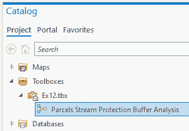

1.  当你双击你的模型时，它应该在地理处理窗格中打开。它将声明没有参数。这是预期的，因为你没有定义任何作为参数的变量，这些变量将接受用户输入。点击地理处理窗格底部的运行按钮。

1.  当模型完成后，返回到目录窗格。

1.  再次转到数据库 | Ex12 地理数据库。

问题：*现在在 Ex12 地理数据库中的要素类是什么，它与你在 ModelBuilder 内部运行模型时有什么不同？*

当你在 ModelBuilder 内部运行模型时，它会在 Ex12 地理数据库内产生两个不同的要素类。然而，当你从工具箱运行它时，它只产生了一个。*这是为什么？*

答案是模型中由**缓冲区**工具创建的特征类被认为是**中间数据**。中间数据是指任何在模型内部创建并随后被其他工具使用，但不是一系列链接过程最终结果的要素类或表。

当你从一个工具箱中运行模型时，它会自动清理。这意味着它会自动删除模型运行过程中创建的中间数据。它留下的唯一数据是模型中任何过程的最终结果，这不是中间数据。最终结果是，你得到了你需要的数据，而没有留下大量可能使你的数据库变得杂乱无章的局部数据集或图层。

1.  保存你的项目并关闭 ArcGIS Pro。

现在，你已经学会了如何根据你在应用程序中的位置使用不同的方法来运行你的模型。在创建或编辑模型时，你现在知道如何运行模型中包含的各个过程。你还学会了如何从 ModelBuilder 和工具箱中运行你的模型。

现在你已经创建并运行了你的第一个模型，你现在可以随时运行这个模型来更新洪水平原内外每个地块的计算。

在下一节中，我们将学习如何使我们的模型对用户更加交互式。

# 制作一个交互式模型

因此，你已经创建了你的第一个模型。这是一个非常高效的工具，可以帮助你快速更新信息。然而，*如果缓冲区距离发生变化或主管想要查看不同的图层，如土地利用或仅商业地产，会发生什么？* 在本节中，你将探索不同的方法，允许用户为模型中包含的指定参数提供输入。

目前，你创建的模型是针对一组特定变量硬编码的。如果有什么变化，你将不得不在模型可以使用之前编辑它。*难道不是更有效，允许其他人在运行模型时为变量指定不同的值吗？* 你可以做到这一点。这只需要你将变量指定为模型内的参数。这样，用户在运行模型之前就可以提供值。

要将变量指定为参数，以便用户在运行时指定值，你只需在 ModelBuilder 中右键单击变量并选择参数。当你这样做时，一个小的大写 P 将出现在变量旁边，表明它现在是一个模型参数，如下面的图所示：

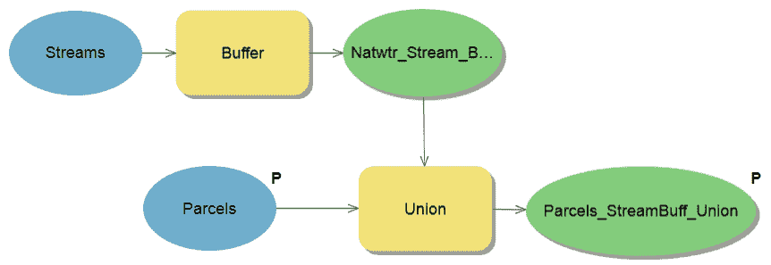

在前面的图中，你可以看到 Parcels 和 Parcels_ StreamBuff_Union 变量都被标记为参数。这将允许用户选择他们希望用于这些变量的值。这意味着他们除了可以将溪流缓冲区与地块图层联合外，还可以控制结果保存的位置和名称。

使模型交互式可以大大增加其功能。它将允许模型在不同的场景和不同的数据集中使用。缺点是，你使模型越交互式，引入操作员错误的机会就越大。用户可能会为工具选择错误的输入层或忘记他们设置最终结果保存的位置。这可能导致比模型设计解决的问题更多。因此，灵活性硬编码之间总是需要平衡，以消除错误来源。

现在，让我们给你一个机会使你的模型交互式。

## 练习 12C – 允许用户输入运行模型

导演对你的模型印象深刻。它使他们能够轻松地计算出流保护区内外每一块地的面积。委员会正在考虑改变非干扰区的缓冲距离，而导演希望查看不同距离的影响。因此，他们需要能够以允许他们指定不同缓冲距离并使用不同名称保存整体结果的方式运行模型。

在这个练习中，你将使你之前创建的模型对用户交互式，并允许他们为模型内的变量提供自己的值。你将允许用户指定他们想要使用的缓冲距离以及模型的最终输出。

### 第 1 步 – 标记变量为参数

在这一步中，你将学习如何在模型内指定变量为参数。你将使缓冲距离和**联合**工具的输出在你的模型中成为参数：

1.  打开 ArcGIS Pro 和`Ex12.aprx`项目。

1.  在目录窗格中展开工具箱文件夹。

1.  在目录窗格中展开 Ex12 工具箱，然后右键单击 Parcels 流。右键单击在上一练习中创建的保护缓冲分析模型。选择编辑以在模型构建器中打开它。

1.  右键单击联合工具的输出变量并选择参数。变量旁边应出现一个小 P，如图所示：

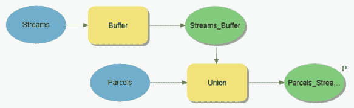

1.  然后，保存你的模型。

通过将**联合**工具的输出作为模型参数，用户现在将能够选择他们将在哪里保存模型的最终输出以及它将被命名为什么。这是导演要求的两个要求之一。现在你需要允许用户指定一个缓冲距离。

缓冲距离目前是硬编码在模型中的。你需要像对**联合**工具的输出那样将其作为参数。然而，缓冲变量是隐藏的。因此，首先，你需要使它在模型中可见，然后将其指定为参数。

### 第 2 步 – 暴露隐藏变量

在这一步中，你将暴露**缓冲**工具的距离变量，以便你可以将其作为参数：

1.  在模型构建器中右键单击缓冲工具。

1.  选择创建变量 | 从参数选项。这将显示与**缓冲**工具相关联的所有隐藏变量的列表。

1.  选择距离[值或字段]，如图所示的下个屏幕截图：

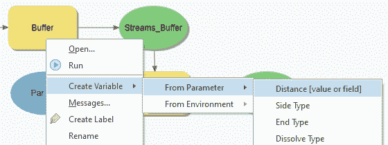

**距离**变量现在应该在你的模型中可见。现在它可见后，你将能够将其指定为一个参数。

1.  将鼠标指针移动到刚刚添加到我们模型中的距离变量上。当指针变为两个交叉箭头时，表示现在处于移动模式，拖动距离变量使其位于缓冲工具上方，如图所示的下一个屏幕截图：

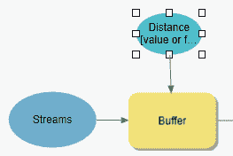

1.  右键单击距离变量并选择参数。现在应该在小写字母 P 旁边出现，表示它现在是一个模型参数。

1.  保存你的模型。

你的模型现在应该看起来非常类似于这个：

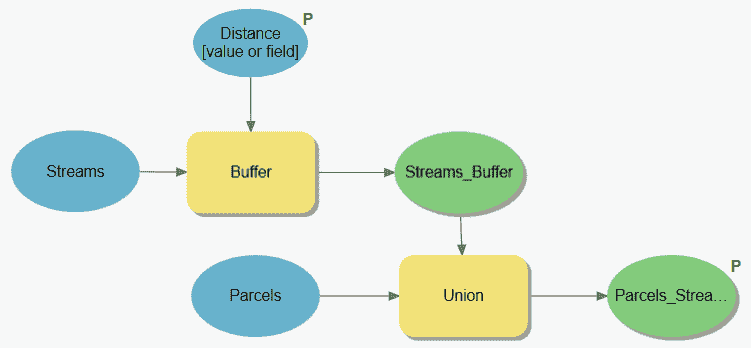

前一个屏幕截图所示的模型现在应该满足导演提出的要求。他们现在可以使用不同的距离从溪流中看到它对地块的影响。导演可以在每次运行模型时将结果保存到不同的名称和位置。

最后一步是验证你的工作。你需要测试运行模型以查看它是否允许用户指定距离和输出值。

### 第 3 步 – 运行模型

在这一步，你将从工具箱中运行模型以确保它允许导演输入距离并指定输出保存的位置。由于你没有更改模型的总体逻辑或功能，因此不需要再次测试模型内部的过程：

1.  关闭模型构建器视图。

1.  如果需要，在目录窗格中展开工具箱文件夹和 Ex12 工具箱。

1.  双击你创建的模型以在地理处理窗格中打开它。

注意这次当你打开模型在地理处理窗格中时，它看起来不同。不再是说没有参数，而是要求用户提供你指定的两个变量的值。

1.  将 Parcels_Stream_Union 变量的值更改为`C:\Student\IntroArcPro\Chapter12\Ex12.gdb\***%Your Name%_Results***`（即`Tripp_Results`）。

1.  将距离值更改为任何你想要的不是 150 英尺的值。如果你愿意，甚至可以更改单位。

1.  在你更改变量的值完成后，点击地理处理窗格底部的运行按钮。

1.  一旦模型运行完成，关闭地理处理窗格。

1.  在目录窗格中，验证生成的输出要素类位于`Ex12.gdb`。

1.  保存你的项目并关闭 ArcGIS Pro。

您现在已经创建了您的第一个交互式模型。此模型为用户提供更多灵活性，使他们能够调查不同的场景。接下来，您将了解 Python，它是 ArcGIS 平台的主要脚本语言。您可以使用 Python 脚本来自动化流程，然后安排它们在特定时间运行。Python 脚本还可以用于帮助将 ArcGIS 与其他应用程序集成。这使得 Python 脚本语言成为提高您 GIS 效率的有力工具。

# 学习 Python

Python 是 ArcGIS 平台的主要脚本语言。它已取代了其他语言，如 **Visual Basic** (**VB**)。**ArcGIS Pro 2.5** 目前与 **Python 3.6.9** 兼容，当您安装 ArcGIS Pro 时，它会自动安装。

Python 已通过 `ArcPy` 模块完全集成到 ArcGIS 地理处理 **应用程序编程接口** (**API**) 中。这意味着您可以在 ArcGIS Pro 中使用地理处理工具，并在您的脚本中自动化和安排任务。

与 ModelBuilder 不同，Python 不限于仅限于 ArcGIS 平台。它用于创建访问其他应用程序、操作系统和计算机中函数的脚本。这使得您能够创建扩展和集成 ArcGIS Pro 功能的脚本，跨越平台和应用程序。因此，Python 是 GIS 开发者工具箱中一个非常灵活的工具。

Python 脚本可以存储在 ArcGIS 工具箱或独立的文件夹中，以 `.py` 文件的形式。与 **C++** 或 VB 等其他编程语言不同，创建 Python 脚本不需要特殊的应用程序开发软件。您可以使用简单的文本编辑器，如 **记事本** 或 **写字板**。Python 有几个免费的 **集成开发环境** (**IDE**) 应用程序，例如 **PythonWin** 或 **IDLE**。IDE 应用程序比文本编辑器提供了更好的开发环境，因为它们包括自动编码提示和调试工具。当您安装 ArcGIS 时，它将自动安装 Python 和 IDLE。

ArcGIS Pro 还包括一个 Python 窗口，可以用来编写 Python 脚本、使用 Python 运行工具以及将 Python 脚本加载到视图中查看代码。新 Python 开发者通常会发现 Python 窗口很有帮助，因为它具有集成界面和自动建议功能，这有助于指导正确的语法。

让我们先看看一些 Python 基础知识。

## 理解 Python 基础

由于这是您对 Python 的第一次介绍，现在是介绍一些基础知识和最佳实践的好时机。这些知识将帮助您开始编写自己的脚本。

### 注释和记录您的脚本

当您开始创建 Python 脚本时，包含代码中的文档被认为是一种最佳实践，这有助于其他开发者理解代码中的内容以及脚本特定部分的目的。这也有助于您在将来需要回到您很久以前编写的脚本并需要做出更改时。

这种代码内文档通常使用注释来完成。将注释代码视为存储在代码本身中的元数据形式。它为用户和其他程序员提供了 *who*、*what*、*where*、*when* 和 *why* 数据。他们可能需要这些数据来成功使用、集成或编辑您创建的脚本。不同的编程语言使用不同的方法来注释代码。Python 使用 **井号** (#) 来标识其代码中的注释行，如下面的截图所示：

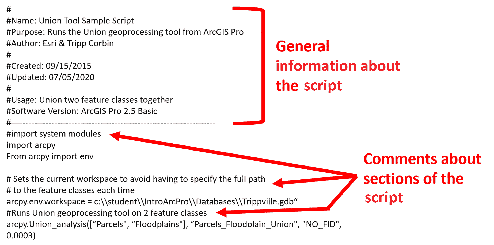

如您在前面的截图中所见，每当 Python 遇到以 # 开头的行时，它会忽略该行并移动到下一行。它将继续忽略带有 # 的行，直到遇到一个开头不是 # 的行。

传统上，Python 脚本中的前几行用于提供有关脚本的基本信息，例如其目的、谁创建了它、何时创建的、为哪个 ArcGIS 版本创建的，等等。提供这些基本信息被认为是行业最佳实践。

现在，让我们了解我们在 Python 中使用的变量。

### Learning about variables

就像模型一样，Python 脚本可以包含变量。在 Python 中定义变量时，您给它一个名称和一个值。同样，与模型类似，分配给变量的值可以是硬编码的，可以引用另一个过程的结果，或者可以是 `ArcPy` 或另一个模块的函数。

例如，您可以定义一个变量，该变量将被用作 **Buffer** 工具的输入如下：

```py
In_buf_fc = "streams"
```

这个变量随后将在 Python 脚本中使用 **Buffer** 工具如下：

```py
Buffer_analysis (In_buf_fc, "C:\\GIS\\Trippville.gdb\\Streams_Buffer", 
    "125 Feet", "FULL", "ROUND")
```

您可以从前面的示例代码中看到，已定义变量的使用已被突出显示。在实际脚本中，您不会将变量**加粗**。这只是在这个例子中为了帮助您更容易地看到变量的使用。

在编写脚本时，需要特别注意的另一件特别重要的事情是 Python 是区分大小写的。这意味着名为 `Mapsize` 的变量与名为 `mapsize` 的变量不同。对 Python 来说，这些都是两个不同且独立的对象。这是编写和运行 Python 脚本时最常见的问题之一。

Python 在脚本中定义变量时还有其他限制：

+   变量名必须以字母开头。它们不能以数字开头。

+   变量名不能包含空格或其他特殊字符。一个例外是下划线（_*_*）。

+   变量名不能包含以下保留关键字：

    +   Class

    +   If

    +   For

    +   While

    +   Return

现在让我们继续学习 Python 中使用的数据路径。

### 理解数据路径

通常，当你定义变量、访问数据或保存工具的结果时，你需要引用特定的文件或数据路径。在传统的 **Windows** 环境中，这通常需要你使用反斜杠定义路径。例如，你通过访问 `C:\Student\IntroArcPro` 来获取这本书的数据和练习。这是一个路径的例子。

不幸的是，你无法在 Python 脚本中使用这种常见的定义路径的方法。反斜杠在 Python 中是保留字符，用于表示转义或行续行。因此，在指定数据路径时，你必须使用不同的方法。Python 支持三种定义路径的方法：

+   双反斜杠：`C:**\\**Student**\\**IntroArcPro`

+   单个正斜杠：`C:**/**Student**/**IntroArcPro`

+   带有前缀 `r` 的单个反斜杠：`r"C:\Student\IntroArcPro"`

在创建自己的脚本时，你可以使用上述任何一种方法。虽然在一个脚本中使用这些方法是可接受的，但建议你尝试在整个脚本中始终使用相同的方法。这将帮助你更快地定位可能的错误并修复它们。

在下一节中，我们将学习 `ArcPy` 模块。

## 学习 ArcPy 模块

`ArcPy` 模块是一个 Python 站点包，它允许 Python 访问 ArcGIS 功能。功能级别受限于运行脚本的 ArcGIS Pro 许可证级别和用户可用的扩展。

通过 `ArcPy` 模块，Python 不仅可以使用 ArcGIS Pro 系统工具箱中的工具或其他自定义工具执行地理处理任务，还可以执行其他功能，例如列出给定位置内的可用数据集或描述现有数据集。它还可以创建对象，如点、线、多边形、范围等。

`ArcPy` 模块包含几个子模块。这些子模块是特定目的的库，包含函数和类。这些子模块包括以下内容：

+   数据访问模块 (`arcpy.da`)

+   映射模块 (`arcpy.mp`)

+   空间分析师模块 (`arcpy.sa`)

+   网络分析师模块 (`arcpy.na`)

空间分析师和网络分析师模块需要访问同名的 ArcGIS 扩展。

`ArcPy` 模块必须被加载到脚本中，以便 Python 可以访问 ArcGIS Pro 的功能。这通常是在新脚本的开头使用以下语法完成的：

```py
import arcpy
```

这一行允许 Python 访问 ArcGIS Pro 工具和函数。也可以使用相同的行加载其他模块，例如操作系统 (`os`) 或系统 (`sys`) 模块。

现在你已经对 `ArcPy` 模块有了非常基本的了解，*你如何知道在 Python 脚本中使用地理处理工具的正确语法呢？* 在下一节中，你将了解到如何找到 ArcGIS Pro 中包含的各种地理处理工具的正确语法。

### 查找地理处理工具的 Python 语法

找到执行特定地理处理工具所需的 Python 代码就像打开该工具的帮助信息一样简单。Esri 在 ArcGIS Pro 及其扩展中为所有地理处理工具提供了示例 Python 代码。

这包括在脚本中使用的正确语法以及可以与工具一起使用的变量描述。当通过单击面板右上角的小蓝色问号打开工具时，可以在地理处理面板中访问特定工具的帮助。如下面的截图所示：

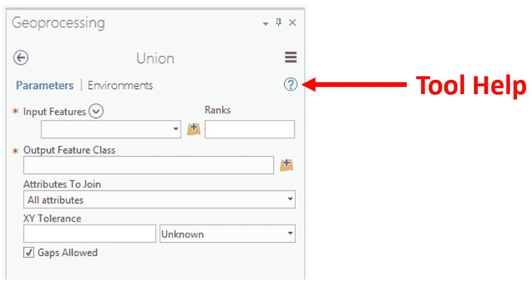

帮助信息中的语法页面将显示代码的正确格式，以及可能包含的可能变量的描述。以下截图显示了来自 Esri 帮助的 **Union** 工具语法的示例：

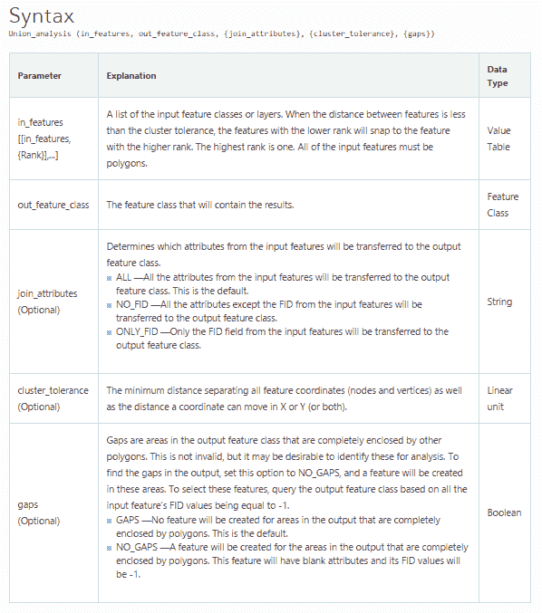

可以通过 ArcGIS Pro 在线帮助中的工具参考访问 ArcGIS Pro 中所有工具的帮助。访问地址为 [`pro.arcgis.com/en/pro-app/tool-reference/main/arcgis-pro-tool-reference.htm`](http://pro.arcgis.com/en/pro-app/tool-reference/main/arcgis-pro-tool-reference.htm)。

帮助信息还将包括代码示例片段，帮助将语法与更大的过程联系起来。通常可以将帮助中的示例代码复制并粘贴到你的脚本中；然后，你可以轻松调整复制的代码以满足你的需求，如下面的截图所示：

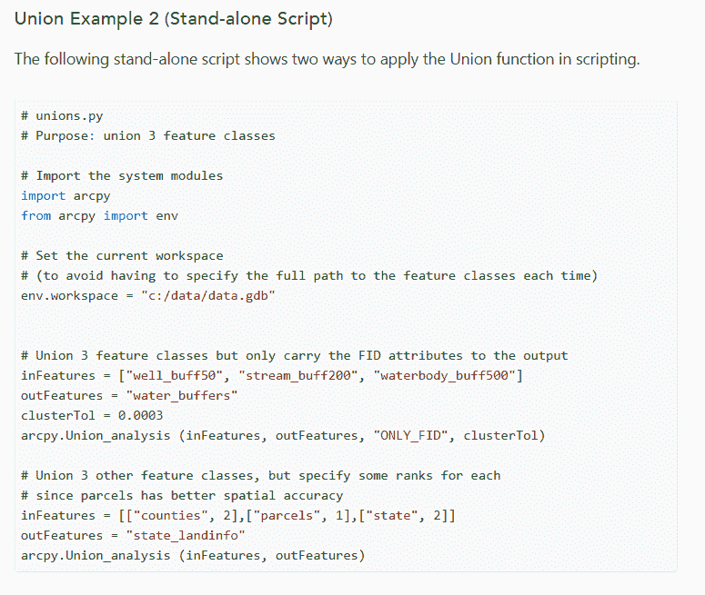

上述截图是来自帮助的 Union 工具示例代码片段。正如你所见，它提供了一个在现实世界环境中代码的可理解示例。这为你提供了一个更好的理解，了解该工具如何在自定义脚本中使用。注意代码示例中的注释以及它们如何帮助更好地理解代码各部分的目的。

如果你想要更详细地探索 ArcGIS 和 Python 之间的关系，你可能发现这个链接有帮助和参考价值：[`pro.arcgis.com/en/pro-app/arcpy/get-started/installing-python-for-arcgis-pro.htm`](https://pro.arcgis.com/en/pro-app/arcpy/get-started/installing-python-for-arcgis-pro.htm)

现在是你尝试编写一个简单的 Python 脚本的时候了。

## 练习 12D – 创建 Python 脚本

Trippville 市运营一个 GIS 网络应用，允许市民和选举官员访问地块数据。这个 GIS 网络应用结合了来自城市的其他数据层和 ArcGIS Online 以及 **Google Maps** 的数据。因此，地块必须从本地州平面坐标系投影到 **WGS 84 Web Mercator** （**辅助球面**） **系统**。这是 Esri、**Google** 和 **Bing** 用于 GIS 网络应用和数据的常用坐标系。

你还可以在将新数据添加到网络应用之前更新 **Acres** 字段，以添加或合并的新地块。你可以使用 **Calculate Field** 工具通过将 Shape_Length 字段（以英尺为单位）转换为英亩来完成此操作。

在过去，你手动执行了这些操作。然而，你将要去度假，导演希望在你离开期间地块数据仍然定期更新。他们可以将数据复制到网络应用中，但不知道如何执行其他操作。因此，他们希望你创建一个可以定期自动执行这些操作的自动化程序。

由于导演希望这个程序按自动化日程运行，你需要编写一个 Python 脚本。在这种情况下，模型不起作用。在这个练习中，你将编写一个基本的 Python 脚本，该脚本将计算每个地块的面积，更新 **Acres** 字段，然后将数据从当前在 WGS 84 Web Mercator （辅助球面）坐标系中的州平面坐标系投影过来。

### 第 1 步 – 打开 IDLE

在这一步，你将打开 IDLE 应用程序，以便你可以开始创建你的脚本：

1.  点击你的开始按钮。这通常位于屏幕左下角的任务栏中。在 **Windows 8.1** 或 **Windows 10** 中，它显示为四个白色方块。

1.  在 Windows 8.1 或 10 中，点击小向下的箭头以访问所有已安装的程序或应用。

1.  在所有程序列表中导航到 ArcGIS 程序组。在 **Windows XP** 或 **Windows 7** 中，你可能需要展开组以查看其中的程序。

1.  定位 IDLE （Python GUI）应用程序，并点击它以启动程序。

你现在已经打开了 Python IDLE 应用程序。你将在该应用程序中编写你的脚本。它将以壳窗口打开。

壳窗口显示从 IDLE 运行脚本时生成的消息和错误。你实际上不会在这个窗口中编写脚本。你需要打开一个新的代码窗口来开始编写脚本。

1.  点击文件 | 新文件选项。这将打开你将用于编写脚本的代码窗口。你现在应该能看到类似以下内容：

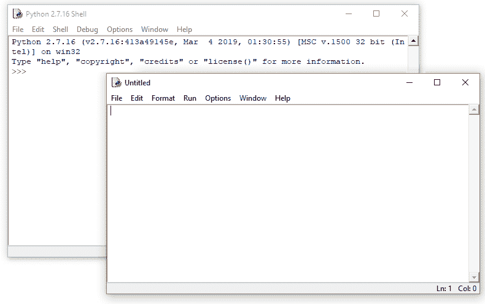

1.  在顶部菜单中点击选项并选择配置 IDLE。你可以在 IDLE 的任意窗口中这样做。

1.  点击常规选项卡，并将默认源编码设置为 UTF-8，如以下截图所示：

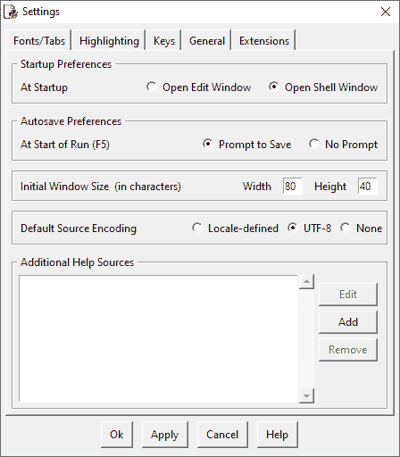

1.  点击应用和确定。

现在你已经配置了 IDLE 选项，是时候开始编写脚本了。

### 第 2 步 - 编写脚本

现在，你将开始编写脚本，以完成之前手动执行的各项任务。首先，你将根据最佳实践在脚本中插入一些基本信息。然后，你将导入`ArcPy`模块，最后，你将编写脚本的代码：

1.  首先，你将保存你的空脚本，以便给它一个名字。在未命名的窗口中，点击文件 | 保存选项。

1.  在另存为窗口中，导航到`C:\Student\IntroArcPro\Chapter12`，将你的文件命名为`AcresWebProject.py`，然后点击保存。

你刚刚保存了你的空脚本。你应该在代码窗口的顶部看到新的名称和路径。

1.  现在，你将在脚本的开头添加一些通用信息作为注释。记住，`#`在 Python 代码中标识注释。将以下示例代码输入到 IDLE 代码窗口中（`目的`部分应全部在一行中输入；如果你将其拆分成多行，你需要在每行的开头放置`#`）：

```py
#**********************************************
#Script Title: AcresWebProject.py
#Script Author: Your Name
#Script Created on: Today's date
#Last Updated on: Today's date
#Last Updated by: Your Name
#Purpose: This script calculates the parcels area in acres and updates the acres field. It then projects the parcels to the WGS 84 Web Mercator coordinate system so it can be used within the City's web application.
#Software: ArcGIS Pro 2.5 (or the version you are running)
#*****************************************************
```

1.  现在你需要添加导入`ArcPy`模块的代码行，以便脚本可以访问 ArcGIS Pro 工具。在代码窗口中添加以下代码到你的脚本中：

```py
#Imports the ArcPy module for ArcGIS
import arcpy
```

1.  通过点击文件并保存来保存你的脚本。如果你收到警告，只需点击确定。

现在，你将在脚本中定义一些变量，指定地块数据的存储位置以及`投影`工具结果保存的位置。

1.  在代码窗口中`import`语句之后，输入以下代码：

```py
#Specifies the input variables for the script tools
#If the data is moved or in a different database then these paths will need to be updated
Parcels = "C:\\Student\\IntroArcPro\\Databases
    \\Trippville_GIS.gdb\\Base\\Parcels"
```

```py
Parcels_Web = "C:\\Student\\IntroArcPro\\Chapter12\\Ex12.gdb
     \\Parcels_Web"
```

你刚刚添加到 Python 脚本中的前几行代码以两条注释开始，解释了下一行做什么。正如你所学的，注释行由`#`符号标识。接下来的两行定义了两个变量。

第一个是`Parcels`。这个变量指向存储在 Trippville_GIS 地理数据库中的**基础**要素数据集中的`Parcels`要素类。在这段代码中定义的第二个变量是`Parcels_Web`。它引用 Ex12 地理数据库中的`Parcels_Web`要素类。

1.  保存你的脚本。

现在，你需要开始添加脚本中需要运行的工具的代码。你将使用 ArcGIS Pro 帮助获取`计算字段`和`投影`工具的正确语法。然后，修改它以便在脚本中正确运行。

1.  打开 ArcGIS Pro 和`Ex12.aprx`。

1.  点击分析选项卡和工具按钮以打开地理处理面板。

1.  在地理处理面板中，点击面板顶部附近的工具箱。

1.  展开数据管理工具箱和字段工具集。

1.  选择计算字段工具。

1.  点击帮助按钮。它位于右上角的蓝色问号。

1.  你已经打开了此工具的在线工具参考；点击语法。

1.  高亮并复制工具的语法。它应该如下所示：

```py
CalculateField_management (in_table, field, expression, 
    {expression_type}, {code_block})
```

1.  激活 IDLE 代码窗口，并将复制的语法粘贴到之前定义的变量下面的行。

1.  在你刚刚粘贴到脚本中的代码上方添加一条注释，说明`计算每个地块的英亩数并更新英亩字段`。

1.  现在编辑你刚刚粘贴到脚本中的代码样本语法如下：

```py
arcpy.CalculateField_management (Parcels, "Acres", "!Shape_Area! / 
    43560", "PYTHON_9.3", "")
```

1.  你现在已经在 Python 脚本中定义了`CalculateField`工具，因此它包含了运行所需的全部变量；保存你的脚本。

1.  现在你需要将**项目**工具添加到脚本中，并正确定义其语法。使用与**计算字段**工具相同的流程，打开**项目**工具的帮助，并将语法复制到你的脚本中。**项目**工具位于同一个工具箱中，但在投影和变换工具集中。

1.  在项目工具的代码上方添加一个适当的注释，让其他人知道它的目的，类似于你为**计算字段**工具添加的注释。

1.  修改**项目**工具代码如下（为了方便，你可以从`Chapter12`文件夹中的`Project Tool Sample.txt`文件中复制语法）：

```py
arcpy.Project_management(Parcels, Parcels_Web, "PROJCS['WGS_1984_Web_Mercator_Auxiliary_Sphere',
GEOGCS['GCS_WGS_1984',DATUM['D_WGS_1984',SPHEROID['WGS_1984',6378137.0,298.257223563]],PRIMEM['Greenwich',0.0],UNIT['Degree',0.0174532925199433]],PROJECTION['Mercator_Auxiliary_Sphere'],PARAMETER['False_Easting',0.0],PARAMETER['False_Northing',0.0],PARAMETER['Central_Meridian',0.0],PARAMETER['Standard_Parallel_1',0.0],PARAMETER['Auxiliary_Sphere_Type',0.0],UNIT['Meter',1.0]]", "WGS_1984_(ITRF00)_To_NAD_1983", "PROJCS['NAD_1983_StatePlane_Georgia_West_FIPS_1002_Feet',GEOGCS['GCS_North_American_1983',DATUM['D_North_American_1983',SPHEROID['GRS_1980',6378137.0,298.257222101]],PRIMEM['Greenwich',0.0],UNIT['Degree',0.0174532925199433]],PROJECTION['Transverse_Mercator'],PARAMETER['False_Easting',2296583.333333333],PARAMETER['False_Northing',0.0],PARAMETER['Central_Meridian',-84.16666666666667],PARAMETER['Scale_Factor',0.9999],PARAMETER['Latitude_Of_Origin',30.0],UNIT['Foot_US',0.3048006096012192]]")
```

上述代码看起来非常复杂，在某种程度上确实如此。它包含了定义两个坐标系统所需的所有参数。第一个是`Parcels`要素类的坐标系统。第二个是输出要素类`Parcels_Web`使用的坐标系统。

1.  保存你的脚本。

你的脚本在你的屏幕上应该看起来像这样：

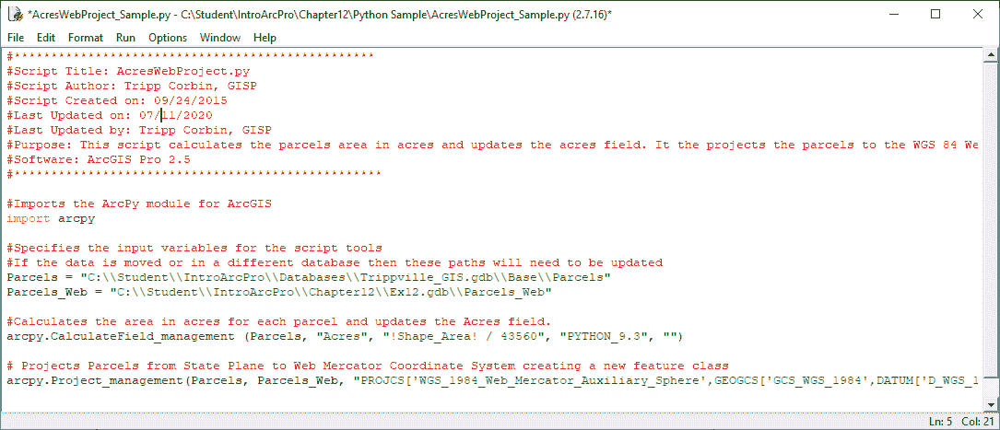

1.  一旦你验证了你的脚本并保存了它，关闭 IDLE。

我们现在将进入下一步。

### 第 3 步 – 将脚本添加到 ArcGIS Pro 并运行

现在你已经创建了一个 Python 脚本，需要将其添加到 ArcGIS Pro 中并测试它。在这一步中，你将把你刚刚创建的脚本添加到项目中的工具箱中，然后运行它：

1.  如果需要，启动 ArcGIS Pro 并打开`Ex12.aprx`。

1.  在目录窗格中，展开工具箱文件夹。

1.  右键单击 Ex12 工具箱，从菜单中选择新建>脚本。

1.  按照以下信息填写新脚本：

    +   在名称字段中输入`CalcAcresProject`。

    +   在标签字段中输入`计算地块英亩数并投影到 Web Mercator`。

1.  点击位于脚本文件单元格旁边的浏览按钮，然后导航到`C:\Student\IntroArcPro\Chapter12`，并选择你刚刚创建的`AcresWebProject.py`脚本。你的窗口现在应该看起来像这样：

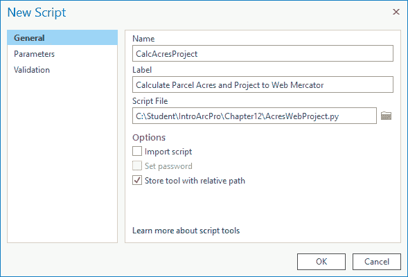

1.  确认一切设置正确后，点击确定。

脚本将出现在 Ex12 工具箱中。这意味着你现在可以在 ArcGIS Pro 中运行它。你必须将你创建的所有 Python 脚本添加到工具箱中，然后它们才能在 ArcGIS Pro 中使用。对于那些有 ArcGIS for Desktop 经验的人，应该注意的是，ArcGIS Pro 目前还不支持 Python 插件。该功能应该添加到未来的版本中。

现在你需要运行脚本以测试并确保它按预期工作。

1.  双击你刚刚添加到工具箱中的 Python 脚本。这将它在地理处理窗格中打开。由于你将所有变量硬编码到脚本中，它没有用户需要定义的参数。

1.  点击地理处理窗格底部的运行按钮。

1.  一旦脚本运行完成，返回到目录窗格。

1.  展开数据库文件夹，并展开`Ex12.gdb`。如果脚本运行成功，你应该会看到一个名为`Parcels_Web`的新要素类。你可能需要右键单击 Ex12 地理数据库并刷新，以便看到创建的新要素类。

如果你确实看到了新的要素类，恭喜！你刚刚创建并运行了你的第一个 Python 脚本。如果你的脚本没有成功运行，你可能希望将其与位于`C:\Student\IntroArcPro\Chapter12\`的`Python Sample`文件夹中的示例进行比较。

1.  保存你的项目并关闭 ArcGIS Pro 以及 IDLE（如果它仍然打开）。

你刚刚创建了你第一个 Python 脚本，它将数据从一个坐标系统投影到另一个坐标系统。由于这是一个 Python 脚本，你可以使用操作系统中找到的调度功能来安排此脚本以指定频率自动运行，这样你就不必担心它。这可以减少你的整体工作量并确保所需功能定期运行。

# 摘要

在本章中，你了解到 ArcGIS Pro 包含两种自动化和简化任务的方法；也就是说，你可以创建一个模型或 Python 脚本。哪一个将工作得最好将主要取决于你的技能以及它们将如何被使用。你已经获得了创建和运行自己模型的能力。

我们了解到模型是在模型构建器中创建的，它提供了一个图形界面，用于创建将自动化完成分析或其他工作流程所需的一系列过程的工具。每个模型将包含一系列过程。每个过程将包括一个工具，可以是地理处理工具、脚本或另一个模型，以及它们相关的变量。当你创建模型时，你可以选择通过指定变量为参数来使其交互式。模型的最大的局限性是它们只能在 ArcGIS Pro 内部运行。这意味着它们不能被安排自动运行。

Python 脚本可以用来自动化流程，这些流程可以随后被安排在指定的时间和日期运行。与模型的情况不同，创建 Python 脚本确实需要了解 Python 语言以及编写代码的能力。

除了 Python 脚本可以按计划运行的能力之外，它们还可以用来访问 ArcGIS Pro 以外的其他应用程序的功能。通过本章，你已经获得了创建可以将多个不同应用程序的功能集成到单个自动化脚本中的脚本的技能。

在下一章中，你将学习如何将你在 ArcGIS Pro 中创建的各种地图和数据与他人共享，无论是位于你的计算机网络上还是不在你的网络上。你还将学习如何与没有 GIS 软件的人共享你的 GIS 内容。

# 进一步阅读

如果你想了解更多关于为 ArcGIS 创建 Python 脚本的信息，你可能想获取 Eric Pimpler 编著的《使用 Python 编程 ArcGIS 烹饪书》。
