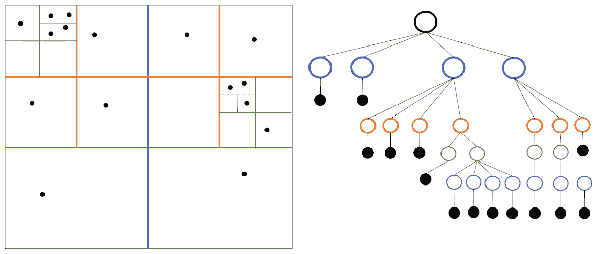
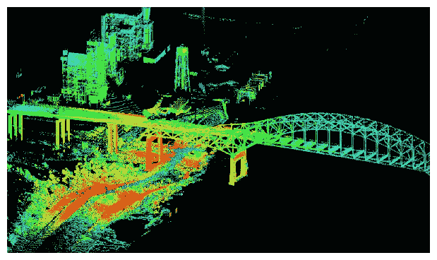

# 第二章：学习地理空间数据

地理空间分析中最具挑战性的方面之一是数据。地理空间数据已经包括数十种文件格式和数据库结构，并且仍在不断发展和增长，以包括新的数据类型和标准。此外，几乎任何文件格式在技术上都可以包含地理空间信息，只需简单地添加一个位置即可。

在本章中，我们将探讨以下主题：

+   了解常见的数据格式

+   检查地理空间数据的常见特征

+   理解空间索引

+   了解最广泛使用的矢量数据类型

+   理解栅格数据类型

我们还将对一些更复杂的新类型有所了解，包括点云数据、网络服务和地理空间数据库。

# 了解常见的数据格式

作为地理空间分析师，你可能会经常遇到以下几种常见的数据类型：

+   电子表格和**逗号分隔值**（**CSV 文件**）或**制表符分隔值**（**TSV 文件**）

+   标注地理信息的照片

+   轻量级二进制点、线和多边形

+   多吉字节卫星或航空图像

+   高程数据，如网格、点云或基于整数的图像

+   XML 文件

+   JSON 文件

+   数据库（包括服务器和文件数据库）

+   网络服务

+   地理数据库

每种格式都包含其自身的访问和处理挑战。当你对数据进行分析时，通常需要先进行某种形式的预处理。你可能需要将大区域的卫星图像裁剪或子集化到仅包含你感兴趣的区域，或者你可能需要减少集合中的点数，只保留符合你数据模型中某些标准的数据。这种类型预处理的良好例子是我们在第一章末尾查看的`SimpleGIS`示例，*使用 Python 学习地理空间分析*。该州数据集只包含科罗拉多州而不是所有 50 个州。城市数据集只包含三个样本城市，展示了三个不同的人口水平，以及不同的相对位置。

在第一章，“使用 Python 学习地理空间分析”，中提到的常见地理空间操作是该类型预处理的基础。然而，值得注意的是，地理空间分析领域已经逐渐转向易于获取的基础地图。直到大约 2004 年，地理空间数据获取困难，桌面计算能力远不及今天。预处理数据是任何地理空间项目的绝对第一步。然而，在 2004 年，谷歌发布了谷歌地图，这并不久于谷歌地球之后。微软也一直在开发一项名为**TerraServer**的技术收购，他们大约在这个时候重新推出了这项技术。2004 年，**开放地理空间联盟**（**OGC**）更新了其**网络地图服务**（**WMS**）的版本，该服务正在增长使用和受欢迎程度。同年，Esri 也发布了其 ArcGIS 服务器系统的第 9 版。这些创新是由谷歌的网页地图瓦片模型驱动的，它允许在不同分辨率下提供平滑、全球、可滚动的地图，通常被称为**滑块地图**。

在谷歌地图出现之前，人们已经在互联网上使用地图服务器，最著名的是 MapQuest 驾驶方向网站。然而，这些地图服务器一次只能提供少量数据，通常在有限的区域内。谷歌的瓦片系统将全球地图转换为图像和地图数据的分层图像瓦片。这些瓦片通过 JavaScript 和基于浏览器的`XMLHttpRequest` API 动态提供，更常见的是**异步 JavaScript 和 XML**（**AJAX**）。谷歌的系统可以扩展到数百万用户，使用普通的网络浏览器。更重要的是，它允许程序员利用 JavaScript 编程来创建混合应用，以便他们可以使用谷歌地图 JavaScript API 向地图添加额外的数据。混合应用的概念实际上是一个共享地理空间层系统。只要数据是网络可访问的，用户就可以将来自不同网络服务的组合和重组数据合并到一个地图中。其他商业和开源系统很快模仿了这一概念。

分布式地理空间层的显著例子是**OpenLayers**，它提供了一个类似谷歌的开源 API，现在已经超越了谷歌的 API，提供了额外的功能。与 OpenLayers 相辅相成的是**OpenStreetMap**，它是开源的，是对 OpenLayers 等系统使用的瓦片地图服务的回应。OpenStreetMap 拥有全球性的街道级矢量数据和其他空间特征，这些数据来自可用的政府数据源和来自全球数千名编辑者的贡献。OpenStreetMap 的数据维护模式类似于在线百科全书维基百科，为文章的信息创建和更新提供众包。最近，甚至出现了更多的地图 API，包括 Leaflet 和 Mapbox，它们继续在灵活性、简单性和功能上增加。

混合革命对数据产生了有趣且有益的副作用。地理空间数据传统上难以获取。收集、处理和分发数据的成本使得地理空间分析仅限于那些能够通过生产数据或购买数据来承担这种高昂的前期成本的群体。几十年来，地理空间分析一直是政府、非常大的组织和大学的工具。一旦网络地图趋势转向大规模、全球瓦片地图，组织开始基本上免费提供基础图层，以吸引开发者使用他们的平台。大规模可扩展的全球地图系统需要大规模可扩展、高分辨率的数据才能发挥作用。地理空间软件生产商和数据提供商希望保持他们的市场份额，并跟上技术趋势。

地理空间分析师从这一市场转变中受益匪浅。首先，数据提供商开始以一个称为**墨卡托投影**的通用投影来分发数据。墨卡托投影是一种 400 多年前引入的航海导航投影。正如我们在第一章中提到的，《用 Python 学习地理空间分析》，所有投影都有实际的好处，以及扭曲。墨卡托投影的扭曲是其大小。在全球视图中，格陵兰岛看起来比南美洲大陆还要大。然而，像每个投影一样，它也有一些好处。墨卡托保留了角度。可预测的角度使得中世纪的航海家在绘制穿越海洋的航线时能够画出直线航向线。谷歌地图最初并没有使用墨卡托投影。然而，很快就很明显，高纬度和低纬度的道路在地图上以奇特的角相遇，而不是现实中 90 度的角度。

由于谷歌地图的主要目的是提供街级驾驶方向，谷歌牺牲了全球视图的准确性，以换取在查看单个城市时街道之间的相对更好的准确性。竞争性的地图系统也效仿了这一做法。谷歌还标准化了 WGS 84 基准。这个基准定义了一个特定的地球球面模型，称为**大地水准面**。这个模型定义了正常海平面。谷歌做出这一选择的意义在于，**全球定位系统**（**GPS**）也使用这个基准。因此，大多数 GPS 设备默认使用这个基准，使得谷歌地图与原始 GIS 数据兼容变得容易。

墨卡托投影的谷歌变体通常被称为**谷歌墨卡托**。**欧洲石油调查组**（**EPSG**）为投影分配简短的数字代码，作为引用它们的一种简单方式。他们开始将投影称为 EPSG:900913，即用数字拼写的*Google*。后来，EPSG 分配了代码 EPSG:3857，废弃了旧代码。大多数 GIS 系统将这两个代码视为同义的。需要注意的是，谷歌对其使用的标准墨卡托投影进行了轻微的调整；然而，这种变化几乎察觉不到。谷歌在所有地图比例尺上使用球面公式，而标准墨卡托在大比例尺上假设椭圆形状。

以下墨卡托投影的图像（[`en.wikipedia.org/wiki/File:Tissot_mercator.png`](https://en.wikipedia.org/wiki/File:Tissot_mercator.png)）来自维基百科：


它使用蒂索的指示器展示了由墨卡托投影引起的扭曲，该指示器在地图上投影了大小相等的椭圆。椭圆的扭曲清楚地显示了投影如何影响大小和距离：网络地图服务减少了寻找数据的工作量，并为分析师创建基础图预处理的大部分工作。然而，要创建有价值的东西，你必须了解地理空间数据以及如何处理它。本章概述了你在地理空间分析中可能会遇到的一些常见数据类型和问题。

在本章中，将常用两个术语：

+   **矢量数据**：矢量数据包括任何使用点、线或多边形最小表示地理定位数据的格式。

+   **栅格数据**：栅格数据包括任何以行和列的网格存储数据的格式。栅格数据包括所有图像格式。

这些是大多数地理空间数据集可以归组的两个主要类别。

如果你想看到更准确地显示大陆相对大小的投影，请参考古德同位素投影：[`en.wikipedia.org/wiki/Goode_homolosine_projection`](https://en.wikipedia.org/wiki/Goode_homolosine_projection)。

# 理解数据结构

尽管有数十种格式，地理空间数据有一些共同的特点。了解这些特点可以帮助你通过识别几乎所有空间数据共有的成分来接近和理解不熟悉的数据格式。给定数据格式的结构通常由其预期用途驱动。

一些数据是为了高效存储或压缩而优化的，一些是为了高效访问而优化的，一些是为了轻量级和可读性（网络格式）而设计的，而其他数据格式则试图包含尽可能多的不同数据类型。

有趣的是，今天一些最受欢迎的格式也是最简单的一些，甚至缺乏在更强大和复杂的格式中找到的功能。对于地理空间分析师来说，易用性非常重要，因为他们花费大量时间将数据集成到地理信息系统，以及在分析师之间交换数据。简单的数据格式最能促进这些活动。

# 常见特性

地理空间分析是一种将信息处理技术应用于具有地理背景的数据的方法。这个定义包含了地理空间数据最重要的元素：

+   **地理位置数据**：地理位置信息可以简单到地球上的一个点，指明照片拍摄的位置。它也可以复杂到卫星相机工程模型和轨道力学信息被用来重建卫星捕获图像的确切条件和位置。

+   **主题信息**：主题信息也可以涵盖广泛的可能。有时，图像中的像素是地面的视觉表示中的数据。其他时候，图像可能使用多光谱波段（如红外光）进行处理，以提供图像中不可见的信息。处理后的图像通常使用与键相关联的结构化调色板进行分类，该键描述了每种颜色代表的信息。其他可能性包括某种形式的数据库，其中包含每个地理定位特征的信息行和列，例如我们来自第一章“使用 Python 学习地理空间分析”的`SimpleGIS`中每个城市的关联人口。

这些两个因素存在于所有可以被认为是地理空间数据的格式中。地理空间数据的另一个常见特性是空间索引。概览数据集也与索引有关。

# 理解空间索引

地理空间数据集通常是非常大的文件，大小轻易达到数百兆字节，甚至达到数吉字节。在执行分析时，地理空间软件在尝试反复访问大文件时可能会相当慢。

如在第一章“使用 Python 学习地理空间分析”中简要讨论的那样，空间索引创建了一个指南，允许软件快速定位查询结果，而无需检查数据集中每个单独的特征。空间索引允许软件消除可能性，并在数据的一个更小的子集上进行更详细的搜索或比较。

# 空间索引算法

许多空间索引算法是几十年来用于非空间信息的已建立算法的衍生。最常见的前两个空间索引算法是**四叉树索引**和**R 树索引**。

# 四叉树索引

四叉树算法实际上代表了一系列基于共同主题的不同算法。四叉树索引中的每个节点包含四个子节点。这些子节点通常是方形或矩形的。当一个节点包含指定数量的特征并且添加了更多特征时，节点会分裂。

将空间划分为嵌套正方形的概念可以加快空间搜索。软件只需一次处理五个点，并使用简单的大于/小于比较来检查一个点是否在节点内部。四叉树索引最常见于基于文件的索引格式。

下图显示了一个按四叉树算法排序的点数据集。黑色点是实际数据集，而框是索引的边界框。请注意，没有任何边界框重叠。左边的图显示了索引的空间表示，而右边的图显示了典型索引的层次关系，这是空间软件如何看待索引和数据的方式。

这种结构允许空间搜索算法在尝试定位一个或多个点与某些其他特征集的关系时快速排除可能性，如下面的图所示：



现在我们已经了解了四叉树索引，让我们来看看另一种常见的空间索引类型，称为 R 树。

# R 树索引

**R 树**索引比四叉树更复杂。R 树旨在处理 3D 数据，并优化以将索引存储在兼容数据库使用磁盘空间和内存的方式。使用来自各种空间算法的算法将邻近对象分组在一起。组中的所有对象都由一个最小矩形所包围。这些矩形被聚合到每个级别都平衡的层次节点中。

与四叉树不同，R 树的边界框可能跨越节点重叠。由于它们的相对复杂性和面向数据库的结构，R 树通常在空间数据库中找到，而不是基于文件的格式中。

下图来自[`en.wikipedia.org/wiki/File:R-tree.svg`](https://en.wikipedia.org/wiki/File:R-tree.svg)，显示了一个用于 2D 点数据集的平衡 R 树：


索引将大型数据集分割成小块，但为了加快搜索速度，它们可能会采用一种称为**网格**的技术。我们将在下一节中探讨这一点。

# 网格

空间索引也经常采用整数网格的概念。地理坐标通常是带有 2 到 16 位小数的浮点十进制数。对浮点数进行比较的计算成本远高于使用整数。索引搜索是关于首先消除不需要精度的可能性。

因此，大多数空间索引算法将浮点坐标映射到固定大小的整数网格。在搜索特定特征时，软件可以使用更有效的整数比较而不是处理浮点数。一旦结果被缩小，软件就可以访问完整分辨率的数据。

网格大小可以是 256 x 256，对于简单的文件格式，也可以是 3 百万 x 3 百万，这对于旨在包含每个已知坐标系和可能分辨率的大型地理空间数据库来说。

整数映射技术与在地图程序中用于在图形画布上绘制数据的渲染技术非常相似。在第一章“使用 Python 学习地理空间分析”中，`SimpleGIS`脚本也使用这种技术，通过内置的 Python 海龟图形引擎来绘制点和多边形。

# 概览是什么？

概览数据最常见于栅格格式。概览是对栅格数据集进行重采样和降低分辨率的版本，提供了不同地图比例的缩略图视图或更快的图像加载视图。它们也被称为**金字塔**，创建它们的过程被称为**金字塔化图像**。这些概览通常预先处理并存储与完整分辨率数据一起，要么嵌入文件中，要么存储在单独的文件中。

这种便利性的妥协是，额外的图像会增加数据集的总文件大小；然而，它们可以加快图像查看器的速度。矢量数据也有概览的概念，通常用于在概览图中为数据集提供地理上下文。然而，由于矢量数据是可缩放的，因此通常由软件在实时通过泛化操作创建缩小尺寸的概览，如第一章“使用 Python 学习地理空间分析”中所述。

有时，矢量数据会被转换为缩略图图像，并存储在图像头中或嵌入其中。以下图表展示了图像概览的概念，直观地说明了为什么它们经常被称为金字塔：


空间索引和概览有助于加快分析软件对数据的访问速度。接下来，我们将探讨元数据，它提供了一种既适合人类阅读也适合机器阅读的方式来理解、搜索甚至编目数据。

# 什么是元数据？

如第一章“使用 Python 学习地理空间分析”中所述，元数据是描述相关数据集的任何数据。常见的元数据示例包括基本元素，如数据集在地球上的足迹，以及更详细的信息，如空间投影和描述数据集如何创建的信息。

大多数数据格式包含数据在地球上的足迹或边界框。详细的元数据通常存储在标准格式（如美国联邦地理数据委员会 **FGDC**、数字地理空间元数据内容标准 **CSDGM**、ISO 或较新的欧盟倡议）的单独位置，该倡议包括元数据要求，并称为欧洲共同体空间信息基础设施 **INSPIRE**。

# 理解文件结构

前述元素可以以多种方式存储在单个文件、多个文件或数据库中，具体取决于格式。此外，这种地理空间信息可以存储在多种格式中，包括嵌入的二进制标题、XML、数据库表、电子表格/CSV、单独的文本或二进制文件。

如 XML 文件、电子表格和结构化文本文件等人类可读格式，只需使用文本编辑器进行调查。这些文件也易于使用 Python 的内置模块、数据类型和字符串操作函数进行解析和处理。基于二进制格式的格式更复杂。因此，通常更容易使用第三方库来处理二进制格式。

然而，您不必使用第三方库，尤其是如果您只想从高层次调查数据的话。Python 的内置 `struct` 模块拥有您所需的一切。`struct` 模块允许您将二进制数据作为字符串读取和写入。在使用 `struct` 模块时，您需要了解字节序的概念。字节序是指构成文件的字节信息在内存中的存储方式。这种顺序通常是平台特定的，但在某些罕见情况下，包括形状文件，字节序会混合到文件中。

Python 的 `struct` 模块使用大于号 (`>`) 和小于号 (`<`) 符号来指定字节序（分别表示大端和小端）。

以下简要示例演示了如何使用 Python 的 `struct` 模块从 Esri 形状文件矢量数据集中解析边界框坐标。您可以从以下网址下载此形状文件作为压缩文件：[`github.com/GeospatialPython/Learn/blob/master/hancock.zip?raw=true`](https://github.com/GeospatialPython/Learn/blob/master/hancock.zip?raw=true)。[hancock.zip](https://geospatialpython.googlecode.com/files/hancock.zip)

当您解压时，您将看到三个文件。在这个例子中，我们将使用 `hancock.shp`。Esri 形状文件格式在文件头部的字节 36 到字节 37 处具有固定位置和数据类型，用于最小 *x*、最小 *y*、最大 *x* 和最大 *y* 边界框值。在这个例子中，我们将执行以下步骤：

1.  导入 `struct` 模块。

1.  以二进制读取模式打开 `hancock.zip` 形状文件。

1.  定位到字节 `36`。

1.  读取指定为 `d` 的每个 8 字节双精度变量，并使用 `<` 符号指定的按小端顺序使用 `struct` 模块进行解包。

执行此脚本的最好方式是在交互式 Python 解释器中。然后我们将读取最小经度、最小纬度、最大经度和最大纬度：

```py
>>> import struct 
>>> f = open("hancock.shp","rb") 
>>> f.seek(36) 
>>> struct.unpack("<d", f.read(8)) 
(-89.6904544701547,) >>> struct.unpack("<d", f.read(8)) 
(30.173943486533133,) 
>>> struct.unpack("<d", f.read(8)) 
(-89.32227546981174,) 
>>> struct.unpack("<d", f.read(8)) 
(30.6483914869749,) 
```

你会注意到，当`struct`模块解包一个值时，它返回一个包含一个值的 Python 元组。你可以通过一次指定所有四个双精度值并将字节长度增加到 32 字节来缩短前面的解包代码，如下面的代码所示：

```py
>>> f.seek(36) 
>>> struct.unpack("<dddd", f.read(32)) 
(-89.6904544701547, 30.173943486533133, -89.32227546981174, 
   30.6483914869749) 
```

现在我们已经了解了如何描述数据，让我们学习最常见的一种地理空间数据类型——矢量数据。

# 了解最广泛使用的矢量数据类型

矢量数据无疑是地理空间中最常见的格式，因为它是最有效存储空间信息的方式。一般来说，它比栅格数据存储和处理所需的计算机资源更少。OGC 有超过 16 种与矢量数据直接相关的格式。矢量数据仅存储几何原语，包括点、线和多边形。然而，每种形状类型仅存储点。例如，在简单直线矢量线形状的情况下，只需存储和定义端点作为线。显示此数据的软件将读取形状类型，然后动态地将端点连接成线。

地理空间矢量数据类似于矢量计算机图形的概念，但有几个显著的例外。地理空间矢量数据包含基于地球的正负坐标，而矢量图形通常存储计算机屏幕坐标。地理空间矢量数据通常还与表示该几何形状的对象的其他信息相关联。这些信息可能像 GPS 数据中的时间戳那样简单，或者对于更大的地理信息系统，可能是一个完整的数据库表。

矢量图形通常存储描述颜色、阴影和其他显示相关指令的样式信息，而地理空间矢量数据通常不包含这些信息。另一个重要的区别是形状。地理空间矢量通常仅包括基于点、直线和直线多边形的非常原始的几何形状，而许多计算机图形矢量格式有曲线和圆的概念。然而，地理空间矢量可以使用更多的点来模拟这些形状。

其他可读性格式，如 CSV、简单的文本字符串、GeoJSON 和基于 XML 的格式，在技术上属于矢量数据，因为它们存储几何形状，而不是栅格，栅格表示数据集边界框内的所有数据。直到 20 世纪 90 年代末 XML 的爆炸式增长，矢量数据格式几乎都是二进制的。XML 提供了一种既适合计算机又适合人类阅读的混合方法。妥协是，与二进制格式相比，GeoJSON 和 XML 数据等文本格式会大大增加文件大小。这些格式将在本节后面讨论。

可供选择的矢量格式数量令人震惊。开源矢量库 OGR ([`www.gdal.org/ogr_formats.html`](http://www.gdal.org/ogr_formats.html)) 列出了超过 86 种受支持的矢量格式。其商业对应产品，Safe Software 的 **特征操作引擎**（**FME**），列出了超过 188 种受支持的矢量格式 ([`www.safe.com/fme/format-search/#filters%5B%5D=VECTOR`](http://www.safe.com/fme/format-search/#filters%5B%5D=VECTOR))。这些列表包括一些矢量图形格式以及可读的地理空间格式。仍然有数十种格式至少应该知道，以防你遇到它们。

现在，让我们看看一种特定且广泛使用的矢量数据类型，称为 Shapefile。

# Shapefiles

最普遍使用的地理空间格式是 Esri Shapefile。地理空间软件公司 Esri 于 1998 年将 Shapefile 格式规范作为开放格式发布 ([`www.esri.com/library/whitepapers/pdfs/shapefile.pdf`](http://www.esri.com/library/whitepapers/pdfs/shapefile.pdf))。Esri 开发它作为他们 ArcView 软件的格式，ArcView 软件被设计为低端 GIS 选项，以补充他们高端专业包 **ArcInfo**，以前称为 **ARC/INFO**。然而，该格式的开放规范、效率和简单性使其成为 15 年后仍然非常受欢迎的非官方 GIS 标准。

几乎所有标有地理空间软件的软件都支持 Shapefile，因为 Shapefile 格式非常常见。因此，你可以通过熟悉 Shapefile 并主要忽略其他格式来几乎作为一个分析师来应对。你可以通过源格式本机软件或第三方转换器（如 OGR 库）将几乎任何其他格式转换为 Shapefile，对于 OGR 库，有一个 Python 模块。其他处理 Shapefile 的 Python 模块是 Shapely 和 Fiona，它们基于 OGR。

Shapefile 最显著的特点之一是它的格式由多个文件组成（从最少到最多，可以有 3-15 个不同的文件）。下表描述了文件格式。`.shp`、`.shx` 和 `.dbf` 文件是有效 Shapefile 所必需的：

| **Shapefile 支持的文件扩展名** | **支持文件用途** | **注意事项** |
| --- | --- | --- |
| `.shp` | 这是 Shapefile。它包含几何形状。 | 这是一个必需的文件。一些只需要几何形状的软件可以接受没有 `.shx` 或 `.dbf` 文件的 `.shp` 文件。 |
| `.shx` | 这是 Shapefile 索引文件。它是一个固定大小的记录索引，用于引用几何形状以实现更快的访问。 | 这是一个必需的文件。没有 `.shp` 文件，此文件没有意义。 |
| `.dbf` | 这是数据库文件。它包含几何属性。 | 是一个必需的文件。某些软件在没有 `.shp` 文件的情况下也会访问此格式，因为该规范早于 shapefiles。它基于非常古老的 FoxPro 和 dBase 格式。存在一个名为 Xbase 的开放规范。`.dbf` 文件可以被大多数类型的电子表格软件打开。 |
| `.sbn` | 这是空间分箱文件，即 shapefile 空间索引。 | 它包含映射到 256 x 256 整数网格的特征边界框。这个文件经常与大型 shapefile 数据集一起出现。 |
| `.sbx` | `.sbn` 文件的固定大小记录索引。 | 空间索引的传统有序记录索引。经常见到。 |
| `.prj` | 这包含存储在知名文本格式中的地图投影信息。 | 是 GIS 软件进行即时投影的非常常见和必需的文件。此格式也可以与栅格数据一起使用。 |
| `.fbn` | 只读特征的空間索引。 | 很少见到。 |
| `.fbx` | `.fbn` 空间索引的固定大小记录索引。 | 很少见到。 |
| `.ixs` | 地理编码索引。 | 在地理编码应用中很常见，包括驾驶方向类型的应用。 |
| `.mxs` | 另一种类型的地理编码索引。 | 比 `.ixs` 格式少见。 |
| `.ain` | 属性索引。 | 主要为遗留格式，在现代软件中很少使用。 |
| `.aih` | 属性索引。 | 伴随 `.ain` 文件。 |
| `.qix` | 四叉树索引。 | 由开源社区创建的空间索引格式，因为 Esri 的 `.sbn` 和 `.sbx` 文件直到最近才被记录。 |
| `.atx` | 属性索引。 | 一种更近期的 Esri 软件专用属性索引，用于加速属性查询。 |
| `.shp.xml` | 元数据。 | 一个地理空间元数据 `.xml` 容器。可以是多个 XML 标准，包括 FGDC 和 ISO。 |
| `.cpg` | `.dbf` 的代码页文件。 | 用于 `.dbf` 文件的国际化。 |

你可能永远不会同时遇到所有这些格式。然而，你使用的任何 shapefile 都将包含多个文件。你通常会看到 `.shp`、`.shx`、`.dbf`、`.prj`、`.sbn`、`.sbx` 和偶尔的 `.shp.xml` 文件。如果你想重命名 shapefile，你必须将所有相关文件重命名为相同的名称；然而，在 Esri 软件和其他 GIS 软件包中，这些数据集将作为一个单一文件出现。|

shapefiles 的另一个重要特性是记录没有编号。记录包括几何形状、`.shx` 索引记录和 `.dbf` 记录。这些记录按固定顺序存储。当你使用软件检查 shapefile 记录时，它们看起来像是编号的。|

当人们删除一个 shapefile 记录，保存文件，然后重新打开它时，往往会感到困惑；被删除的记录编号仍然出现。原因是 shapefile 记录在加载时是动态编号的，但并未保存。所以，例如，如果你删除了编号为 23 的记录并保存了 shapefile，下一次读取 shapefile 时，编号 24 将变为 23。要以此方式跟踪 shapefile 记录的唯一方法是在`.dbf`文件中创建一个新的属性，例如 ID，并为每个记录分配一个永久且唯一的标识符。

就像重命名 shapefile 一样，在编辑 shapefile 时必须小心。最好使用将 shapefile 视为单个数据集的软件。如果你单独编辑任何文件并添加/删除记录而不编辑相关文件，大多数地理空间软件都会将 shapefile 视为损坏。

# CAD 文件

**CAD**代表**计算机辅助设计**。CAD 数据的主要格式是由 Autodesk 为其领先的 AutoCAD 软件包创建的。常见的两种格式是**绘图交换格式**（**DXF**）和 AutoCAD 的本地**绘图**（**DWG**）格式。

DWG 传统上是一个封闭的格式，但它已经变得更加开放。

CAD 软件用于所有与工程相关的事物，从设计自行车到汽车、公园和城市下水道系统。作为一名地理空间分析师，你不必担心机械工程设计；然而，土木工程设计成为一个相当大的问题。大多数工程公司只有限度地使用地理空间分析，但几乎将所有数据存储在 CAD 格式中。DWG 和 DXF 格式可以使用地理空间软件中找不到或仅由地理空间系统弱支持的特性来表示对象。以下是一些这些特性的例子：

+   曲线

+   表面（用于与地理空间高程表面不同的对象）

+   3D 实体

+   文本（以对象的形式渲染）

+   文本样式

+   视口配置

这些 CAD 和工程特定特性使得将 CAD 数据干净地转换为地理空间格式变得困难。如果你遇到 CAD 数据，最简单的选择是询问数据提供者他们是否有 shapefile 或其他以地理空间为中心的格式。

# 基于标签和标记的格式

基于标签的标记格式通常是 XML 格式。它们还包括其他结构化文本格式，如**已知文本**（**WKT**）格式，该格式用于投影信息文件以及不同类型的数据交换。

XML 格式包括 **Keyhole 标记语言**（**KML**）、**OpenStreetMap**（**OSM**）格式以及用于 GPS 数据的 Garmin GPX 格式，这些格式已成为流行的交换格式。开放地理空间联盟的 **地理标记语言**（**GML**）标准是其中最古老且最广泛使用的基于 XML 的地理格式之一。它也是 OGC **网络要素服务**（**WFS**）标准的基础，该标准用于网络应用程序。然而，GML 已经被 KML 和 GeoJSON 格式所取代。

XML 格式通常包含的不仅仅是几何信息。它们还包含属性和渲染指令，如颜色、样式和符号。Google 的 KML 格式已成为一个完全支持的 OGC 标准。以下是一个简单的 KML 示例，展示了一个标记：

```py
<?xml version="1.0" encoding="utf-8"?> 
<kml > 
  <Placemark> 
    <name>Mockingbird Cafe</name> 
    <description>Coffee Shop</description> 
    <Point> 
      <coordinates>-89.329160,30.310964</coordinates> 
    </Point> 
  </Placemark> 
</kml> 
```

XML 格式对地理空间分析师有吸引力的原因如下：

+   它是一种人类可读的格式。

+   它可以在文本编辑器中编辑。

+   它得到了编程语言的良好支持（尤其是 Python）。

+   根据定义，它很容易扩展。

尽管如此，XML 并不完美。它对于非常大的数据格式来说是一个低效的存储机制，并且很快就会变得难以编辑。数据集中的错误很常见，而且大多数解析器都没有稳健地处理错误。尽管存在缺点，XML 在地理空间分析中仍然被广泛使用。

**可缩放矢量图形**（**SVG**）是一种广泛支持的 XML 格式，用于计算机图形。它得到了浏览器的良好支持，常用于地理空间渲染。然而，SVG 并非作为地理格式而设计的。

WKT 格式也是一种较老的 OGC 标准。它最常见的使用是定义通常存储在 `.prj` 投影文件中的投影信息，以及与 shapefile 或栅格一起。WGS 84 坐标系的 WKT 字符串如下：

```py
GEOGCS["WGS 84", 
    DATUM["WGS_1984", 
        SPHEROID["WGS 84",6378137,298.257223563, 
            AUTHORITY["EPSG","7030"]], 
        AUTHORITY["EPSG","6326"]], 
    PRIMEM["Greenwich",0, 
        AUTHORITY["EPSG","8901"]], 
    UNIT["degree",0.01745329251994328, 
        AUTHORITY["EPSG","9122"]], 
    AUTHORITY["EPSG","4326"]] 
```

定义投影的参数可能相当长。由 EPSG 创建的一个标准委员会引入了一个数值编码系统来引用投影。这些代码，如 EPSG:4326，用作前面代码的简写。还有一些常用投影的简称，如墨卡托投影，可以在不同的软件包中用来引用投影。

关于这些参考系统更多信息可以在空间参考网站上找到：[`spatialreference.org/ref/`](http://spatialreference.org/ref/)。

# GeoJSON

GeoJSON 是一种基于 **JavaScript 对象表示法**（**JSON**）的相对较新且出色的文本格式，这种格式多年来一直是一种常用的数据交换格式。尽管它的历史很短，GeoJSON 仍然可以嵌入到所有主要的地理空间软件系统和大多数分发数据的网站上。这是因为 JavaScript 是动态网页的语言，GeoJSON 可以直接输入到 JavaScript 中。

GeoJSON 是对流行的 JSON 格式的一个完全向后兼容的扩展。JSON 的结构非常相似，在某些情况下，与常见编程语言的现有数据结构完全相同。JSON 几乎与 Python 的字典和列表数据类型相同。由于这种相似性，在脚本中从头开始解析 JSON 很简单，但有许多库可以使它变得更加容易。Python 包含一个名为 `json` 的内置库。

GeoJSON 为您提供了一种标准的方式来定义几何形状、属性、边界框和投影信息。GeoJSON 具有 XML 的所有优点，包括人类可读的语法、优秀的软件支持以及在行业中的广泛应用。它还超越了 XML。

GeoJSON 比 XML 更加紧凑，这主要是因为它使用简单的符号来定义对象，而不是使用包含大量文本的打开和关闭标签。这种紧凑性也有助于大型数据集的可读性和可管理性。然而，从数据量方面来看，它仍然不如二进制格式。以下是一个 GeoJSON 语法示例，定义了一个包含点和线的几何集合：

```py
{ "type": "GeometryCollection", 
  "geometries": [ 
    { "type": "Point", 
      "coordinates": [-89.33, 30.0] 
    }, 
    { "type": "LineString", 
      "coordinates": [ [-89.33, 30.30], [-89.36, 30.28] ] 
    } 
  {"type": "Polygon", 
    "coordinates": [[ 
      [-104.05, 48.99], 
      [-97.22,  48.98] 
    } 
  ] 
} 
```

上述代码是有效的 GeoJSON，但它也是一个有效的 Python 数据结构。您可以直接将上述代码示例复制到 Python 解释器中作为变量定义，它将无错误地评估，如下所示：

```py
gc = { "type": "GeometryCollection", 
  "geometries": [ 
    { "type": "Point", 
      "coordinates": [-89.33, 30.0] 
    }, 
    { "type": "LineString", 
      "coordinates": [ [-89.33, 30.30], [-89.36, 30.28] ] 
    } 
  ] 
} 
gc 
{'type': 'GeometryCollection', 'geometries': [{'type': 'Point', 
   'coordinates': [ 
  -89.33, 30.0]}, {'type': 'LineString', 'coordinates': [[-89.33, 
     30.3], [-89.36,30.28]]}]} 
```

由于其紧凑的尺寸、JavaScript 编写的互联网友好语法以及主要编程语言的支持，GeoJSON 是领先 REST 地理空间 Web API 的关键组件，这将在本章后面讨论。它目前在计算机资源效率、文本格式的可读性和程序性效用之间提供了最佳折衷。

# GeoPackage

我们将简要介绍 GeoPackage 格式，因为它在 第三章，*地理空间技术景观* 中有所涉及，以及因为它是一种地理数据库。`geopackage` 格式是一个基于 SQLite 文件数据库容器的 OGC 开放标准，它是平台、供应商和软件独立的。它试图摆脱由专有数据格式或有限数据格式引起的所有问题。

接下来，我们将探讨其他主要数据类型：栅格数据。

# 理解栅格数据类型

栅格数据由行和列的单元格或像素组成，每个单元格代表一个单一值。将栅格数据视为图像是思考它的最简单方式，这也是它们通常由软件表示的方式。然而，栅格数据集不一定以图像的形式存储。它们也可以是数据库中的 ASCII 文本文件或 **二进制大对象**（**BLOBs**）。

地理空间栅格数据与常规数字图像之间的另一个区别是它们的分辨率。如果以全尺寸打印，数字图像将分辨率表示为每英寸点数。分辨率也可以表示为图像中的总像素数，并定义为百万像素。然而，地理空间栅格数据使用每个单元格代表的地面距离。例如，具有两英尺分辨率的栅格数据集意味着单个单元格代表地面上的两英尺，这也意味着在数据集中只能视觉识别大于两英尺的物体。

栅格数据集可能包含多个波段，这意味着可以在同一区域同时收集不同波长的光。通常，这个范围是 3-7 个波段，但在高光谱系统中可能有几百个波段。这些波段可以单独查看，或者像图像的 RGB 波段一样互换。它们还可以通过数学方法重新组合成一个单波段派生图像，然后使用代表数据集中值的固定数量的类别重新着色。

栅格数据在科学计算领域的应用也很常见，它共享了许多地理空间遥感元素，但增加了一些有趣的变体。科学计算通常使用复杂的栅格格式，包括**网络公共数据格式**（**NetCDF**）、**GRIB**和**HDF5**，这些格式存储整个数据模型。这些格式更像是文件系统中的目录，可以包含多个数据集或同一数据集的多个版本。海洋学和气象学是这类分析最常见应用。一个科学计算数据集的例子是天气模型的输出，其中栅格数据集在不同波段中的单元格可能代表模型在时间序列中不同变量的输出。

与矢量数据一样，栅格数据也可以以各种格式存在。开源的**地理空间数据抽象库**（**GDAL**）**raster**库，实际上还包括我们之前提到的矢量 OGR 库，列出了超过 130 种支持的栅格格式（[`www.gdal.org/formats_list.html`](http://www.gdal.org/formats_list.html)）。FME 软件包也支持这么多格式。然而，就像 shapefile 和 CAD 数据一样，也有一些突出的栅格格式。

# TIFF 文件

**标记图像文件格式**（**TIFF**）是最常见的地理空间栅格格式。TIFF 格式的灵活标记系统允许它在单个文件中存储任何类型的数据。TIFF 文件可以包含概览图像、多个波段、整数高程数据、基本元数据、内部压缩以及其他各种数据，这些数据通常由其他格式存储在额外的支持文件中。任何人都可以通过向文件结构添加标记数据来非官方地扩展 TIFF 格式。这种可扩展性既有优点也有缺点。然而，一个 TIFF 文件可能在某个软件中运行良好，但在另一个软件中访问时可能会失败，因为这两个软件包对庞大的 TIFF 规范的实施程度不同。关于 TIFF 的一个古老笑话中有许多令人沮丧的真实性：**TIFF** 代表 **数千种不兼容的文件格式**。GeoTIFF 扩展定义了地理空间数据是如何存储的。存储为 TIFF 文件的地理空间栅格可能具有以下任何一种文件扩展名：`.tiff`、`.tif` 或 `.gtif`。

# JPEG、GIF、BMP 和 PNG

JPEG、GIF、BMP 和 PNG 格式是通用的图像格式，但也可以用于基本地理空间数据存储。通常，这些格式依赖于伴随支持文本文件来对信息进行地理参考，以便与 GIS 软件兼容，如 WKT、`.prj` 或世界文件。

JPEG 格式在地理空间数据中也很常见。JPEGs 有一个内置的元数据标记系统，类似于 TIFF，称为 EXIF。JPEGs 常用于地理标记照片，以及栅格 GIS 层。**位图**（**BMP**）图像用于桌面应用程序和文档图形。然而，JPEG、GIF 和 PNG 是在网络地图应用中使用，尤其是在用于通过滑块地图快速访问的预生成服务器地图瓦片中的格式。

# 压缩格式

由于地理空间栅格往往非常大，它们通常使用高级压缩技术进行存储。最新的开放标准是 JPEG 2000 格式，它是 JPEG 格式的一个升级，包括小波压缩和一些其他功能，如地理参考数据。**多分辨率无缝图像数据库**（**MrSID**）（`.sid`）和**增强型压缩小波**（**ECW**）（`.ecw`）是两种在地理空间环境中常见的专有波压缩格式。

TIFF 格式支持压缩，包括 **Lempel-Ziv-Welch**（**LZW**）算法。需要注意的是，压缩数据适合作为基础地图的一部分，但不应用于遥感处理。压缩图像旨在在视觉上正确显示，但通常会改变原始单元格值。无损压缩算法试图避免降低源数据，但通常认为对经过压缩的数据进行光谱分析是一个糟糕的主意。JPEG 格式旨在成为一个有损格式，牺牲数据以换取更小的文件大小。它也很常见，因此记住这个事实很重要，以避免得到无效的结果。

# ASCII 网格

另一种存储栅格数据的方式，通常是高程数据，是使用 ASCII 网格文件。这种文件格式最初由 Esri 创建，但已成为大多数软件包支持的非官方标准。ASCII 网格是一个简单的文本文件，包含作为行和列的 (*x*, *y*) 值。栅格的空间信息包含在简单的标题中。文件格式如下：

```py
<NCOLS xxx> 
<NROWS xxx> 
<XLLCENTER xxx | XLLCORNER xxx> 
<YLLCENTER xxx | YLLCORNER xxx> 
<CELLSIZE xxx> 
{NODATA_VALUE xxx} 
row 1 
row 2 
. 
. 
. 
row n 
```

虽然不是存储数据的最高效方式，但 ASCII 网格文件因其不需要任何特殊的数据库来创建或访问地理空间栅格数据而非常流行。这些文件通常以 `.zip` 文件的形式分发。前述格式中的标题值包含以下信息：

+   列数

+   行数

+   *x*-轴单元格中心坐标 | *x*-轴左下角坐标

+   *y*-轴单元格中心坐标 | *y*-轴左下角坐标

+   在地图单位中的单元格大小

+   无数据值（通常是 9,999）

# 世界文件

世界文件是简单的文本文件，可以为任何图像提供地理空间参考信息，这些图像通常没有对空间信息提供原生支持，包括 JPEG、GIF、PNG 和 BMP。世界文件因其命名约定而被地理空间软件识别。最常见的世界文件命名方式是使用栅格文件名，然后更改扩展名以删除中间字母，并在末尾添加 `w`。

下表展示了不同格式的栅格图像及其根据惯例关联的世界文件名的一些示例：

| 栅格文件名 | 世界文件名 |
| --- | --- |
| `World.jpg` | `World.jgw` |
| `World.tif` | `World.tfw` |
| `World.bmp` | `World.bpw` |
| `World.png` | `World.pgw` |
| `World.gif` | `World.gfw` |

世界文件的结构非常简单。它是一个六行文本文件，如下所示：

+   第 1 行：沿 *x*-轴的单元格大小（地面单位）

+   第 2 行：沿 *y*-轴的旋转

+   第 3 行：沿 *x*-轴的旋转

+   第 4 行：沿 *y*-轴的单元格大小（地面单位）

+   第 5 行：左上单元格的中心 *x*-坐标

+   第 6 行：左上单元格的中心 *y*-坐标

以下是世界文件值的示例：

```py
15.0 
0.0 
0.0 
-15.0 
-89,38 
45.0 
```

第 1、4、5 和 6 行包含的(*x*, *y*)坐标和(*x*, *y*)单元格大小，允许您计算任何单元格的坐标或一组单元格之间的距离。旋转值对于地理空间软件很重要，因为遥感图像通常由于数据收集平台的原因而旋转。

旋转图像存在重新采样数据的风险，因此可能会丢失数据，因此旋转值允许软件考虑这种扭曲。图像周围的像素通常被分配一个`无数据`值，并以黑色表示。

以下图像由美国地质调查局（U.S. Geological Survey，**USGS**）提供，来自[`viewer.nationalmap.gov/advanced-viewer/`](https://viewer.nationalmap.gov/advanced-viewer/)，展示了图像旋转，其中卫星收集路径从东南向东北方向延伸，但底图是北向：


在 Python 处理栅格数据时，世界文件是一个非常有用的工具。大多数地理空间软件和数据库支持世界文件，因此在地理参照时通常是一个不错的选择。

您会发现世界文件非常有用，但由于您不经常使用它们，您可能会忘记未标记的内容代表什么。有关世界文件的快速参考可在[`kralidis.ca/gis/worldfile.htm`](http://kralidis.ca/gis/worldfile.htm)找到。

向量数据和栅格数据是两种最常见的数据类型。然而，由于收集成本逐渐降低，另一种类型的数据正在变得越来越受欢迎。这种类型是点云数据，我们将在下一节中对其进行探讨。

# 点云数据是什么？

点云数据是指基于某种聚焦能量返回的表面点的(*x*, *y*, *z*)位置收集的任何数据。这可以使用激光、雷达波、声纳或其他波形生成设备创建。点之间的间距是任意的，并且取决于收集数据的传感器的类型和位置。

在这本书中，我们将主要关注 LIDAR 数据和雷达数据。雷达点云数据通常在太空任务中收集，而 LIDAR 通常由地面或空中车辆收集。从概念上讲，这两种类型的数据是相似的。

# LIDAR

LIDAR 使用强大的激光测距系统以非常高的精度来模拟世界。术语**LIDAR**，或 LiDAR，是**光**和**雷达**这两个词的组合。有些人声称它还代表**光探测与测距**。LIDAR 传感器可以安装在空中平台上，包括卫星、飞机或直升机。它们也可以安装在车辆上进行地面收集。

由于激光雷达提供的高速、连续数据收集和广阔的视野——通常是传感器的 360 度——激光雷达数据通常不具有其他形式栅格数据那样的矩形足迹。激光雷达数据集通常被称为点云，因为数据是一系列*(x,y,z*)位置，其中*z*是从激光到检测到的对象的距离，(*x*,*y*)值是从传感器位置计算出的对象的投影位置。

以下图像，由美国地质调查局提供，展示了一个城市区域使用地面传感器获取的点云激光雷达数据集，而不是空中传感器。颜色基于激光能量返回的强度，红色区域靠近激光雷达传感器，绿色区域较远，这可以精确到几厘米的高度：



激光雷达数据最常见的数据格式是**激光雷达交换格式**（**LAS**），这是一个社区标准。激光雷达数据可以用多种方式表示，包括每行一个简单的(*x*, *y*, *z*)元组的文本文件。有时，可以使用同时收集到的图像像素颜色对激光雷达数据进行着色。激光雷达数据还可以用于创建 2D 高程栅格。

这种技术是激光雷达在地理空间分析中最常见的用途。任何其他用途都需要专门的软件，允许用户在 3D 中进行工作。在这种情况下，其他地理空间数据不能与点云结合。

# 什么是网络服务？

地理空间网络服务允许用户在网络上进行数据发现、数据可视化和数据访问。网络服务通常通过基于用户输入的应用程序访问，例如放大在线地图或搜索数据目录。最常用的协议是**网络地图服务**（**WMS**），它返回一个渲染的地图图像，以及**网络要素服务**（**WFS**），它通常返回 GML，这在本章的引言中已提到。

许多 WFS 服务也可以返回 KML、JSON、压缩的 shapefile 和其他格式。这些服务通过 HTTP `GET`请求调用。以下 URL 是一个 WMS `GET`请求的示例，它返回一个 640 像素宽、400 像素高的世界地图图像，具有 EPSG 代码 900913：[`ows.mundialis.de/services/service?SERVICE=wms&VERSION=1.1.1&REQUEST=GetMap&FORMAT=image/png&STYLES=&WIDTH=600&HEIGHT=400&LAYERS=TOPO-OSM-WMS&SRS=EPSG:900913&BBOX=-20037508,-20037508,20037508,20037508`](http://ows.mundialis.de/services/service?SERVICE=wms&VERSION=1.1.1&REQUEST=GetMap&FORMAT=image/png&STYLES=&WIDTH=600&HEIGHT=400&LAYERS=TOPO-OSM-WMS&SRS=EPSG:900913&BBOX=-20037508,-20037508,20037508,20037508)。[链接](http://osm.woc.noaa.gov/mapcache?SERVICE=wms&VERSION=1.1.1&REQUEST=GetMap&FORMAT=image/png&WIDTH=600&HEIGHT=400&LAYERS=osm&SRS=EPSG:900913&BBOX=-20037508,-20037508,20037508,20037508)

网络服务正在迅速发展。开放地理信息系统联盟正在为传感器网络和其他地理空间环境添加新的标准。**表示状态转移**（**REST**）服务也被广泛使用。REST 服务使用简单的 URL，通过相应地定制 URL 参数及其值，使得在几乎任何编程语言中实现数据请求变得非常容易。几乎每种编程语言都有强大的 HTTP 客户端库，能够使用 REST 服务。

这些 REST 服务可以返回多种类型的数据，包括图像、XML 或 JSON。目前还没有统一的地理空间 REST 标准，但 OGC 已经在这方面工作了一段时间。Esri 已经创建了一个工作实现，目前被广泛使用。

以下 URL 是一个 Esri 地理空间 REST 服务的示例，该服务基于天气雷达图像层返回 KML。您可以将此 URL 添加到 Google Earth 中作为网络链接，或者您可以在浏览器中将其下载为压缩的 KML（KMZ）文件以导入到另一个程序：[`idpgis.ncep.noaa.gov/arcgis/rest/services/NWS_Observations/radar_base_reflectivity/MapServer/generateKml?docName=NWSRadar&layers=0&layerOptions=separateImage`](https://idpgis.ncep.noaa.gov/arcgis/rest/services/NWS_Observations/radar_base_reflectivity/MapServer/generateKml?docName=NWSRadar&layers=0&layerOptions=separateImage)。

您可以在以下链接找到关于 OGC 服务的教程：[`cite.opengeospatial.org/pub/cite/files/edu/fundamental-concepts/text/basic.html`](http://cite.opengeospatial.org/pub/cite/files/edu/fundamental-concepts/text/basic.html)。

在撰写本书时，开放地理空间联盟（OGC）正在经历一次 API 演变，这将通过 REST、OpenAPI、JSON/HTML 和 Swagger 等技术显著降低使用地理空间 API 的门槛。您可以通过 OGC 的技术路线图跟踪这些趋势：[`github.com/opengeospatial/OGC-Technology-Trends`](https://github.com/opengeospatial/OGC-Technology-Trends)。

现在，我们将从单个文件格式转向功能强大的地理数据库，通过单个 API 整合数据。

# 理解地理空间数据库

地理空间数据库，或称地理数据库，指的是一类文件格式、数据模式，甚至软件。在第三章《地理空间技术景观》中，我们将介绍地理数据库作为软件包，正式称为数据库管理系统。但在此节中，我们将描述它们作为文件格式的属性。地理数据库历史上仅存储矢量数据，尽管现代地理数据库也非常适合进行栅格数据管理。

地理数据库可以表现出我们之前提到的所有常见特征。这些信息存储在数据库中，我们称之为数据库模型。一个非常流行的模型是传统的关联模型，它使用行和列的表格。每一行和列的组合称为单元格。行可以通过指定列与其他表相关联，以使用每个单元格作为引用另一个表中单元格的关键，从而将行连接起来。

列的实际名称和数据之间的关系构成了数据定义。至少，地理数据库将几何描述与表示该几何对象的属性关联起来。单个点通常由`x`和`y`列表示。然而，多边形和多折线有任意数量的点。这意味着地理数据库通常将几何信息作为**BLOB**存储，使用一种称为**已知二进制**或**WKB**的格式标准。

属性信息通常定义为整数、浮点小数、字符串或日期等数据类型。表格还可以包括用于地图显示的投影信息，以及一个用于加速搜索和地理空间比较的空间索引列。地理数据库还可能有一个相关的表，以便链接关于地理空间数据的详细元数据。

大型地理空间栅格数据集很少直接存储在数据库中。通常，栅格数据存储在磁盘上，并带有名称，同时在数据库中存储一个文件系统引用，该引用指向栅格数据。地理数据库还可能存储一个表示栅格数据地面足迹的几何列，然后可以用作地理空间操作的代理。

# 摘要

您现在拥有了处理常见类型地理空间数据所需的背景知识。您还了解了地理空间数据集的常见特征，这将使您能够评估不熟悉的数据类型，并识别出将引导您选择使用哪些工具与这些数据进行交互的关键元素。

在下一章中，我们将探讨您可以使用以处理地理空间数据集的模块和库。我们将了解地理空间技术生态系统，它由数千个软件库和包组成。我们还将了解地理空间软件的层次结构以及它是如何帮助您快速理解和评估任何地理空间工具的。

# 进一步阅读

您可以在此处找到关于 OGC 服务的教程：[`cite.opengeospatial.org/pub/cite/files/edu/fundamental-concepts/text/basic.html`](http://cite.opengeospatial.org/pub/cite/files/edu/fundamental-concepts/text/basic.html)[.](http://www.ogcnetwork.net/tutorials)
