# 第六章：Python 和遥感

在本章中，我们将讨论遥感。遥感是关于收集关于地球的信息集合，而不需要与它进行物理接触。通常这意味着需要使用卫星或航空图像、**光探测与测距**（**LIDAR**），它测量飞机到地球的激光脉冲，或者合成孔径雷达。遥感也可以指处理收集到的数据，这就是我们在本章中使用该术语的方式。随着更多卫星的发射和数据分布变得更加容易，遥感正以越来越令人兴奋的方式发展。卫星和航空图像的高可用性，以及每年发射的有趣新型传感器，正在改变遥感在理解我们世界中所扮演的角色。

在遥感领域，我们逐个遍历图像中的每个像素，并执行某种形式的查询或数学过程。可以将图像视为一个大型数值数组。在遥感中，这些数组可以相当大，大小从数十兆字节到数吉字节不等。虽然 Python 运行速度快，但只有基于 C 的库才能提供在可接受速度下遍历数组的速度。

我们将使用**Python 图像库**（**PIL**）进行图像处理，以及 NumPy，它提供多维数组数学。虽然这些库是用 C 编写的以提高速度，但它们是为 Python 设计的，并提供 Pythonic API。

在本章中，我们将涵盖以下主题：

+   交换图像波段

+   创建图像直方图

+   执行直方图拉伸

+   剪辑和分类图像

+   从图像中提取特征

+   变化检测

首先，我们将从基本的图像处理开始，然后在此基础上逐步构建，直至自动变化检测。这些技术将通过添加处理卫星数据和其他遥感产品到我们的工具箱中，来补充前面的章节。

# 技术要求

+   Python 3.6 或更高版本

+   内存：最低 6 GB（Windows），8 GB（macOS），推荐 8 GB

+   存储：最低 7200 RPM SATA，可用空间 20 GB；推荐 SSD，可用空间 40 GB

+   处理器：最低配置 Intel Core i3 2.5 GHz；推荐配置 Intel Core i5

# 交换图像波段

我们的眼睛只能看到可见光谱中的颜色，这些颜色是**红色、绿色和蓝色**（**RGB**）的组合。空中和空间传感器可以收集可见光谱之外的能量波长。为了查看这些数据，我们将代表不同波长光反射率的图像在 RGB 通道中移动，以制作彩色图像。

这些图像通常最终会变成奇特和外星般的颜色组合，这可能会使视觉分析变得困难。以下是一个典型的卫星图像示例，展示了位于墨西哥湾沿岸密西西比州 NASA 斯坦尼斯太空中心的 Landsat 7 卫星场景，该中心是遥感以及地理空间分析领域的领先中心：

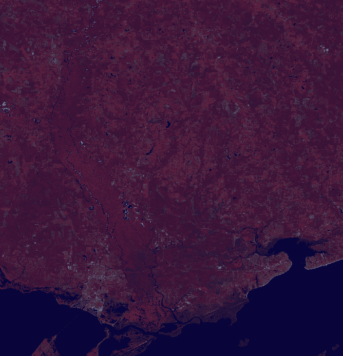

大部分植被看起来是红色的，水几乎看起来是黑色的。这是一类假彩色图像，意味着图像的颜色不是基于 RGB 光。然而，我们可以更改波段的顺序或替换某些波段，以创建另一种看起来更像我们习惯看到世界的假彩色图像。为此，你首先需要从这个链接下载此图像的 ZIP 文件：[`git.io/vqs41`](https://git.io/vqs41)。

我们在第四章“地理空间 Python 工具箱”的“安装 GDAL 和 NumPy”部分中安装了具有 Python 绑定的 GDAL 库。GDAL 库包含一个名为`gdal_array`的模块，该模块可以将遥感图像加载到 NumPy 数组中，并从 NumPy 数组中保存遥感图像，以便于操作。GDAL 本身是一个数据访问库，并不提供太多的处理功能。因此，在本章中，我们将主要依赖 NumPy 来实际更改图像。

在这个例子中，我们将使用`gdal_array`将图像加载到 NumPy 数组中，然后立即将其保存到一个新的 GeoTiff 文件中。然而，在保存时，我们将使用 NumPy 的高级数组切片功能来更改波段的顺序。在 NumPy 中，图像是多维数组，其顺序为波段、高度和宽度。这意味着具有三个波段的图像将是一个长度为 3 的数组，包含图像的波段、高度和宽度数组。需要注意的是，NumPy 引用数组位置的方式是*y,x（行，列）*，而不是我们在电子表格和其他软件中使用的常规*x, y（列，行）*格式。让我们开始吧：

1.  首先，我们将导入`gdal_array`：

```py
from gdal import gdal_array
```

1.  接下来，我们将加载一个名为`FalseColor.tif`的图像到`numpy`数组中：

```py
# name of our source image
src = "FalseColor.tif"
# load the source image into an array
arr = gdal_array.LoadFile(src)
```

1.  接下来，我们将通过切片数组、重新排列顺序并将它保存回来重新排序图像波段：

```py
# swap bands 1 and 2 for a natural color image.
# We will use numpy "advanced slicing" to reorder the bands.
# Using the source image
output = gdal_array.SaveArray(arr[[1, 0, 2], :], "swap.tif",
 format="GTiff", prototype=src)
# Dereference output to avoid corrupted file on some platforms
output = None
```

在`SaveArray`方法中，最后一个参数被称为**原型**。此参数允许您指定另一个 GDAL 图像，从中复制空间参考信息和一些其他图像参数。如果没有此参数，我们最终会得到一个没有地理参考信息的图像，这种图像不能在 GIS 中使用。在这种情况下，我们指定输入图像文件名，因为图像除了波段顺序外都是相同的。在这个方法中，你可以看出 Python GDAL API 是 C 库的包装器，并不像 Python 设计的库那样 Pythonic。例如，一个纯 Python 库会编写`SaveArray()`方法为`save_array()`，以遵循 Python 标准。

这个例子产生的结果是`swap.tif`图像，这是一个视觉效果更好的图像，有绿色植被和蓝色水域：

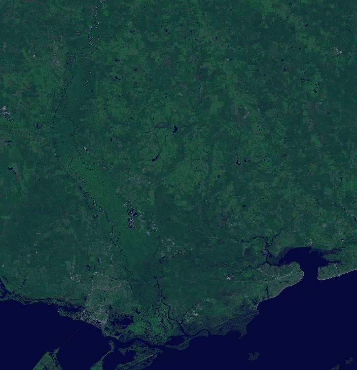

这张图片只有一个问题：它有点暗，看不清楚。让我们看看在下一节中能否找出原因。

# 创建直方图

直方图显示了数据集中数据分布的统计频率。在遥感的情况下，数据集是一个图像。数据分布是像素在**0**到**255**范围内的频率，这是在计算机上存储图像信息所使用的 8 字节数的范围。

在 RGB 图像中，颜色用 3 位数组表示，其中*(0,0,0)*表示黑色，*(255,255,255)*表示白色。我们可以用 y 轴上的每个值的频率和 x 轴上 256 个可能的像素值范围来绘制图像的直方图。

记得在第一章，*使用 Python 学习地理空间分析*，在*创建最简单的 Python GIS*部分，当我们使用 Python 包含的 Turtle 图形引擎创建一个简单的 GIS 时？嗯，我们也可以用它轻松地绘制直方图。

直方图通常是一个一次性产品，用于快速脚本。此外，直方图通常以条形图的形式显示，条形的宽度代表分组数据箱的大小。但是，在图像中，每个`bin`只有一个值，所以我们将创建一个线形图。我们将使用本例中的直方图函数，并为每个相应的波段创建红色、绿色和蓝色线条。

本例的绘图部分默认将*y*轴值缩放到图像中找到的最大 RGB 频率。技术上，*y*轴代表最大频率，即图像中的像素数，如果图像是单一颜色的话。我们将再次使用`turtle`模块，但这个例子可以轻松地转换成任何图形输出模块。让我们看看我们在前面的例子中创建的`swap.tif`图像：

1.  首先，我们导入所需的库，包括`turtle`图形库：

```py
from gdal import gdal_array
import turtle as t
```

1.  现在，我们创建一个`histogram`函数，它可以接受一个数组并将数字排序到直方图的各个箱子中：

```py
def histogram(a, bins=list(range(0, 256))):
 fa = a.flat
 n = gdal_array.numpy.searchsorted(gdal_array.numpy.sort(fa), bins)
 n = gdal_array.numpy.concatenate([n, [len(fa)]])
 hist = n[1:]-n[:-1]
 return hist
```

1.  最后，我们有我们的`turtle`图形函数，它接受直方图并绘制它：

```py
def draw_histogram(hist, scale=True):
```

1.  使用以下代码绘制图形轴：

```py
t.color("black")
axes = ((-355, -200), (355, -200), (-355, -200), (-355, 250))
t.up()
for p in axes:
  t.goto(p)
  t.down()
  t.up()
```

1.  然后，我们可以给它们标注：

```py
t.goto(0, -250)
t.write("VALUE", font=("Arial, ", 12, "bold"))
t.up()
t.goto(-400, 280)
t.write("FREQUENCY", font=("Arial, ", 12, "bold"))
x = -355
y = -200
t.up()
```

1.  现在，我们在 x 轴上添加刻度，这样我们就可以看到线条的值：

```py
for i in range(1, 11):
  x = x+65
  t.goto(x, y)
  t.down()
  t.goto(x, y-10)
  t.up()
  t.goto(x, y-25)
  t.write("{}".format((i*25)), align="center")
```

1.  我们会对 y 轴做同样的处理：

```py
x = -355
y = -200
t.up()
pixels = sum(hist[0])
if scale:
  max = 0
  for h in hist:
    hmax = h.max()
    if hmax > max:
      max = hmax
  pixels = max
label = int(pixels/10)
for i in range(1, 11):
  y = y+45
  t.goto(x, y)
  t.down()
  t.goto(x-10, y)
  t.up()
  t.goto(x-15, y-6)
  t.write("{}".format((i*label)), align="right")
```

1.  我们可以开始绘制我们的直方图线条：

```py
x_ratio = 709.0 / 256
y_ratio = 450.0 / pixels
colors = ["red", "green", "blue"]
for j in range(len(hist)):
  h = hist[j]
  x = -354
  y = -199
  t.up()
  t.goto(x, y)
  t.down()
  t.color(colors[j])
  for i in range(256):
    x = i * x_ratio
    y = h[i] * y_ratio
    x = x - (709/2)
    y = y + -199
    t.goto((x, y))
```

1.  最后，我们可以加载我们的图像，并使用之前定义的函数绘制其直方图：

```py
im = "swap.tif"
histograms = []
arr = gdal_array.LoadFile(im)
for b in arr:
  histograms.append(histogram(b))
draw_histogram(histograms)
t.pen(shown=False)
t.done()
```

这是运行前面的代码示例后`swap.tif`直方图的样子：

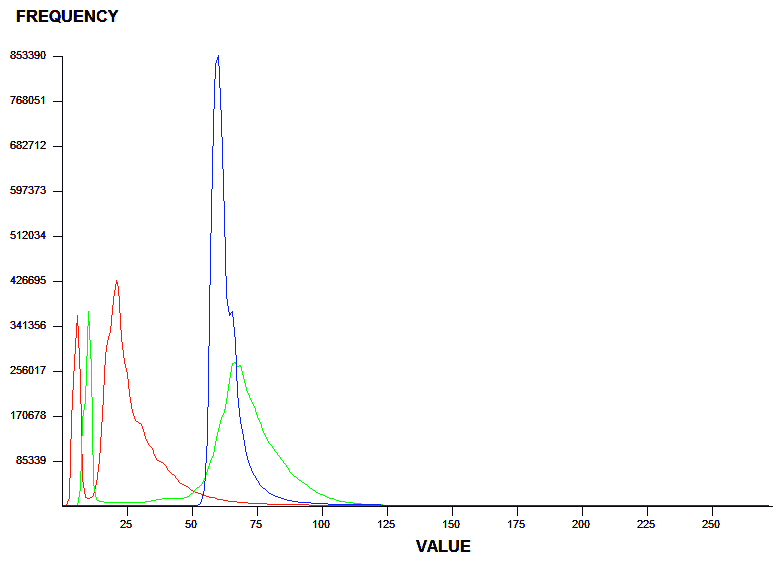

如您所见，所有三个波段都紧密地聚集在图表的左侧，并且所有值都小于**125**左右。随着这些值接近零，图像变暗，这并不奇怪。

为了好玩，让我们再次运行脚本，当我们调用`draw_histogram()`函数时，我们将添加`scale=False`选项，以了解图像的大小并提供绝对刻度。我们将更改以下行：

```py
draw_histogram(histograms)
```

这将变为以下内容：

```py
draw_histogram(histograms, scale=False)
```

这种变化将产生以下直方图图：

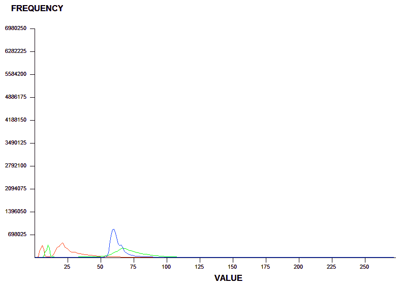

如您所见，很难看到值分布的细节。然而，如果您正在比较来自同一源图像的多个不同产品的多个直方图，这种绝对刻度方法是有用的。

因此，现在我们了解了使用直方图统计地查看图像的基本方法，那么我们如何使图像更亮呢？让我们在下一节中查看。

# 执行直方图拉伸

直方图拉伸操作确实如其名称所示。它在整个刻度上重新分配像素值。通过这样做，我们在高亮度级别有更多的值，图像变得更亮。因此，在这个例子中，我们将重用我们的直方图函数，但我们将添加另一个名为`stretch()`的函数，它接受一个图像数组，创建直方图，然后为每个波段扩展值范围。我们将在`swap.tif`上运行这些函数，并将结果保存到名为`stretched.tif`的图像中：

```py
import gdal_array
import operator
from functools import reduce

def histogram(a, bins=list(range(0, 256))):
 fa = a.flat
 n = gdal_array.numpy.searchsorted(gdal_array.numpy.sort(fa), bins)
 n = gdal_array.numpy.concatenate([n, [len(fa)]])
 hist = n[1:]-n[:-1]
 return hist

def stretch(a):
 """
 Performs a histogram stretch on a gdal_array array image.
 """
 hist = histogram(a)
 lut = []
 for b in range(0, len(hist), 256):
 # step size
 step = reduce(operator.add, hist[b:b+256]) / 255
 # create equalization look-up table
 n = 0
 for i in range(256):
 lut.append(n / step)
 n = n + hist[i+b]
 gdal_array.numpy.take(lut, a, out=a)
 return asrc = "swap.tif"
arr = gdal_array.LoadFile(src)
stretched = stretch(arr)
output = gdal_array.SaveArray(arr, "stretched.tif", format="GTiff", prototype=src)
output = None
```

`stretch`算法将产生以下图像。看看它变得多么明亮和视觉上吸引人：

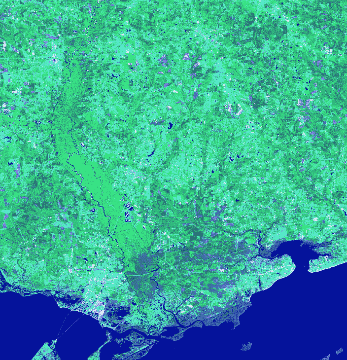

我们可以通过在`im`变量中更改文件名到`stretched.tif`来在我们的`turtle`图形直方图脚本上运行我们的`swap.tif`：

```py
im = "stretched.tif"
```

运行前面的代码将给出以下直方图：

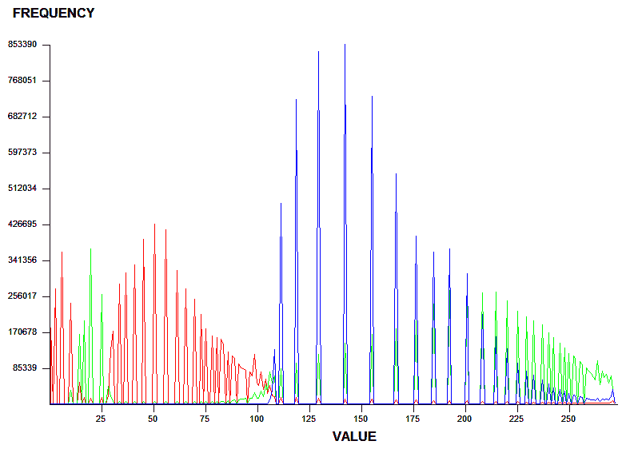

如您所见，现在三个波段都均匀分布了。它们相互之间的相对分布是相同的，但在图像中，它们现在分布在整个频谱上。

现在我们能够更改图像以获得更好的展示效果，让我们看看如何裁剪它们以检查特定感兴趣的区域。

# 裁剪图像

分析员很少对整个卫星场景感兴趣，这可以轻松覆盖数百平方英里。考虑到卫星数据的大小，我们非常希望将图像的大小减少到仅我们感兴趣的区域。实现这种减少的最佳方式是将图像裁剪到定义我们研究区域的边界。我们可以使用 shapefiles（或其他矢量数据）作为我们的边界定义，并基本上删除所有该边界之外的数据。

以下图像包含我们的`stretched.tif`图像，以及一个县边界文件叠加在上面，在**Quantum GIS**（**QGIS**）中可视化：

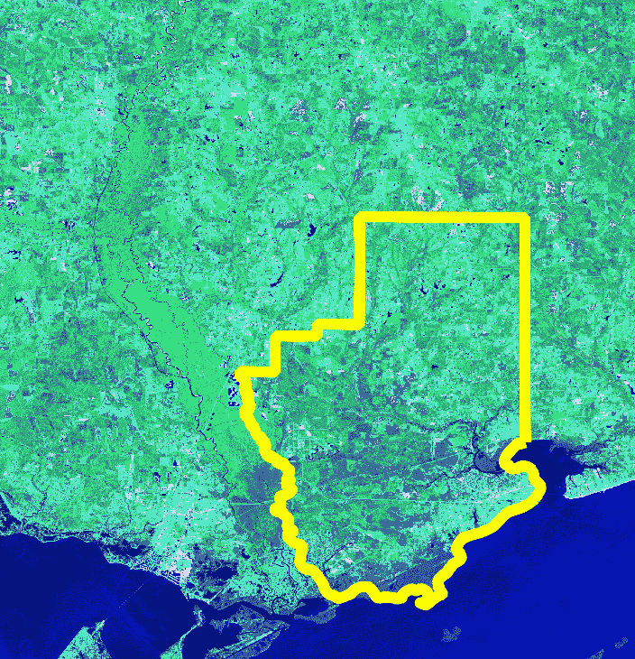

要裁剪图像，我们需要遵循以下步骤：

1.  使用`gdal_array`将图像加载到数组中。

1.  使用 PyShp 创建一个 shapefile 读取器。

1.  将 shapefile 栅格化到地理参考图像（将其从矢量转换为栅格）。

1.  将 shapefile 图像转换为二进制掩码或过滤器，以仅获取 shapefile 边界内我们想要的图像像素。

1.  通过掩码过滤卫星图像。

1.  丢弃掩码外的卫星图像数据。

1.  将裁剪后的卫星图像保存为`clip.tif`。

我们在第四章“地理空间 Python 工具箱”中安装了 PyShp，所以你应该已经通过 PyPi 安装了它。我们还将在此脚本中添加一些有用的新实用函数。第一个是`world2pixel()`，它使用 GDAL GeoTransform 对象为我们执行世界坐标到图像坐标的转换。

这仍然是我们在这本书中一直使用的相同过程，但它与 GDAL 的集成更好。

我们还添加了`imageToArray()`函数，它将 PIL 图像转换为 NumPy 数组。县边界 shapefile 是我们在前几章中使用的`hancock.shp`边界，但如果你需要，也可以从这里下载：[`git.io/vqsRH`](http://git.io/vqsRH)。

我们使用 PIL，因为它是将 shapefile 作为掩码图像光栅化的最简单方式，以过滤掉 shapefile 边界之外的像素。让我们开始吧：

1.  首先，我们将加载所需的库：

```py
import operator
from osgeo import gdal, gdal_array, osr
import shapefile
```

1.  现在，我们将加载 PIL。在不同的平台上可能需要以不同的方式安装，因此我们必须检查这种差异：

```py
try:
 import Image
 import ImageDraw
except:
 from PIL import Image, ImageDraw
```

1.  现在，我们将设置输入图像、shapefile 和输出图像的变量：

```py
# Raster image to clip
raster = "stretched.tif"
# Polygon shapefile used to clip
shp = "hancock"
# Name of clipped raster file(s)
output = "clip"
```

1.  接下来，创建一个函数，它简单地将图像转换为`numpy`数组，这样我们就可以将创建的掩码图像转换为 NumPy 数组，并在基于 NumPy 的裁剪过程中使用它：

```py
def imageToArray(i):
 """
 Converts a Python Imaging Library array to a gdal_array image.
 """
 a = gdal_array.numpy.fromstring(i.tobytes(), 'b')
 a.shape = i.im.size[1], i.im.size[0]
 return a
```

1.  接下来，我们需要一个函数将地理空间坐标转换为图像像素，这将允许我们使用来自裁剪 shapefile 的坐标来限制要保存的图像像素：

```py
def world2Pixel(geoMatrix, x, y):
 """
 Uses a gdal geomatrix (gdal.GetGeoTransform()) to calculate
 the pixel location of a geospatial coordinate
 """
 ulX = geoMatrix[0]
 ulY = geoMatrix[3]
 xDist = geoMatrix[1]
 yDist = geoMatrix[5]
 rtnX = geoMatrix[2]
 rtnY = geoMatrix[4]
 pixel = int((x - ulX) / xDist)
 line = int((ulY - y) / abs(yDist))
 return (pixel, line)
```

1.  现在，我们可以将源图像加载到`numpy`数组中：

```py
# Load the source data as a gdal_array array
srcArray = gdal_array.LoadFile(raster)
```

1.  我们还将以 gdal 图像的形式加载源图像，因为`gdal_array`没有给我们转换坐标到像素所需的地理变换信息：

```py
# Also load as a gdal image to get geotransform (world file) info
srcImage = gdal.Open(raster)
geoTrans = srcImage.GetGeoTransform()
```

1.  现在，我们将使用 Python shapefile 库打开我们的 shapefile：

```py
# Use pyshp to open the shapefile
r = shapefile.Reader("{}.shp".format(shp))
```

1.  接下来，我们将根据源图像将 shapefile 边界框坐标转换为图像坐标：

```py
# Convert the layer extent to image pixel coordinates
minX, minY, maxX, maxY = r.bbox
ulX, ulY = world2Pixel(geoTrans, minX, maxY)
lrX, lrY = world2Pixel(geoTrans, maxX, minY)
```

1.  然后，我们可以根据 shapefile 的范围计算输出图像的大小，并仅取源图像的相应部分：

```py
# Calculate the pixel size of the new image
pxWidth = int(lrX - ulX)
pxHeight = int(lrY - ulY)
clip = srcArray[:, ulY:lrY, ulX:lrX]
```

1.  接下来，我们将为输出图像创建新的几何矩阵数据：

```py
# Create a new geomatrix for the image
# to contain georeferencing data
geoTrans = list(geoTrans)
geoTrans[0] = minX
geoTrans[3] = maxY
```

1.  现在，我们可以从 shapefile 创建一个简单的黑白掩码图像，它将定义我们想要从源图像中提取的像素：

```py
# Map points to pixels for drawing the county boundary
# on a blank 8-bit, black and white, mask image.
pixels = []
for p in r.shape(0).points:
 pixels.append(world2Pixel(geoTrans, p[0], p[1]))
rasterPoly = Image.new("L", (pxWidth, pxHeight), 1)
# Create a blank image in PIL to draw the polygon.
rasterize = ImageDraw.Draw(rasterPoly)
rasterize.polygon(pixels, 0)
```

1.  接下来，我们将掩码图像转换为`numpy`数组：

```py
# Convert the PIL image to a NumPy array
mask = imageToArray(rasterPoly)
```

1.  最后，我们准备好使用掩码数组在`numpy`中裁剪源数组并将其保存为新的 geotiff 图像：

```py
# Clip the image using the mask
clip = gdal_array.numpy.choose(mask, (clip, 0)).astype(
 gdal_array.numpy.uint8)
# Save ndvi as tiff
gdal_array.SaveArray(clip, "{}.tif".format(output),
 format="GTiff", prototype=raster)
```

此脚本生成以下裁剪图像：

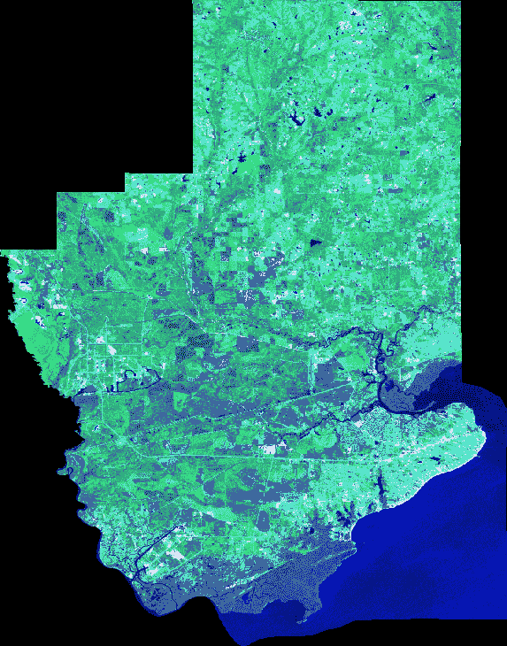

在县边界之外保留的黑色区域实际上被称为`NoData`值，这意味着在该位置没有信息，并且大多数地理空间软件会忽略这些值。因为图像是矩形的，所以`NoData`值对于不完全填充图像的数据是常见的。

您现在已经走过了全球地理空间分析师每天用来准备多光谱卫星和航空图像以用于 GIS 的整个工作流程。在下一节中，我们将探讨我们如何实际上分析图像作为信息。

# 图像分类

**自动化遥感**（**ARS**）很少在可见光谱中进行。ARS 处理图像时无需任何人工输入。在可见光谱之外最常用的波长是红外和近红外。

以下插图是一张热成像图（波段 10），来自最近一次的 Landsat 8 飞越美国墨西哥湾沿岸，从路易斯安那州的纽奥尔良到阿拉巴马州的莫比尔。图像中的主要自然特征已被标注，以便您定位：

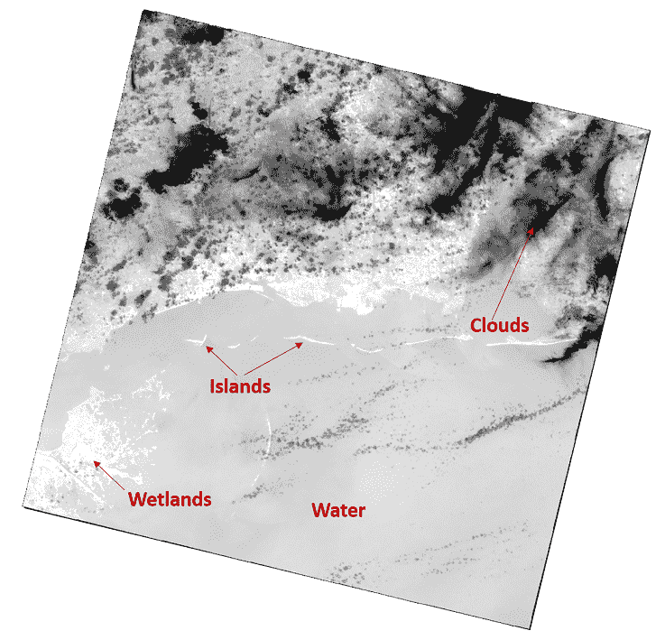

因为图像中的每个像素都有一个反射率值，所以它是信息，而不仅仅是颜色。反射率类型可以确切地告诉我们一个特征是什么，而不是我们通过观察来猜测。Python 可以看到这些值，并以与我们直观地通过分组相关像素值相同的方式挑选出特征。我们可以根据像素之间的关系对像素进行着色，以简化图像并查看相关特征。这种技术称为**分类**。

分类可以从基于直方图推导出的某些值分布算法的相对简单分组，到涉及训练数据集甚至计算机学习和人工智能的复杂方法。最简单的形式被称为**无监督分类**，其中除了图像本身之外没有提供任何其他输入。涉及某种训练数据以引导计算机的方法称为**监督分类**。需要注意的是，分类技术在许多领域都有应用，从寻找患者体内扫描中癌细胞的外科医生，到在赌场使用面部识别软件在安全录像中自动识别已知**骗子**在二十一点桌上的情况。

为了介绍遥感分类，我们将仅使用直方图将具有相似颜色和强度的像素分组，看看我们得到什么。首先，您需要从这里下载 Landsat 8 场景：[`git.io/vByJu`](http://git.io/vByJu)。

与之前示例中的`histogram()`函数不同，我们将使用 NumPy 中包含的版本，该版本允许您轻松指定箱数，并返回两个数组，包含频率以及箱值范围。我们将使用包含范围的第二个数组作为图像的类定义。`lut`或查找表是一个任意调色板，用于将颜色分配给 20 个无监督类别。您可以使用任何颜色。让我们看看以下步骤：

1.  首先，我们导入我们的库：

```py
import gdal
from gdal import gdal_array, osr
```

1.  接下来，我们为输入和输出图像设置一些变量：

```py
# Input file name (thermal image)
src = "thermal.tif"
# Output file name
tgt = "classified.jpg"
```

1.  将图像加载到`numpy`数组中进行处理：

```py
# Load the image into numpy using gdal
srcArr = gdal_array.LoadFile(src)
```

1.  现在，我们将使用 20 个组或`bins`来创建我们图像的直方图，这些组将用于分类：

```py
# Split the histogram into 20 bins as our classes
classes = gdal_array.numpy.histogram(srcArr, bins=20)[1]
```

1.  然后，我们将创建一个查找表，该表将定义我们类别的颜色范围，以便我们可以可视化它们：

```py
# Color look-up table (LUT) - must be len(classes)+1.
# Specified as R, G, B tuples
lut = [[255, 0, 0], [191, 48, 48], [166, 0, 0], [255, 64, 64], [255, 
    115, 115], [255, 116, 0], [191, 113, 48], [255, 178, 115], [0, 
    153, 153], [29, 115, 115], [0, 99, 99], [166, 75, 0], [0, 204, 
    0], [51, 204, 204], [255, 150, 64], [92, 204, 204], [38, 153, 
    38], [0, 133, 0], [57, 230, 57], [103, 230, 103], [184, 138, 0]]
```

1.  现在我们已经完成了设置，我们可以进行分类：

```py
# Starting value for classification
start = 1
# Set up the RGB color JPEG output image
rgb = gdal_array.numpy.zeros((3, srcArr.shape[0],
 srcArr.shape[1], ), gdal_array.numpy.float32)
# Process all classes and assign colors
for i in range(len(classes)):
  mask = gdal_array.numpy.logical_and(start <= srcArr, srcArr <= 
  classes[i])
 for j in range(len(lut[i])):
   rgb[j] = gdal_array.numpy.choose(mask, (rgb[j], lut[i][j]))
 start = classes[i]+1
```

1.  最后，我们可以保存我们的分类图像：

```py
# Save the image
output = gdal_array.SaveArray(rgb.astype(gdal_array.numpy.uint8), tgt, format="JPEG")
output = None
```

以下图像是我们的分类输出，我们刚刚将其保存为 JPEG 格式：

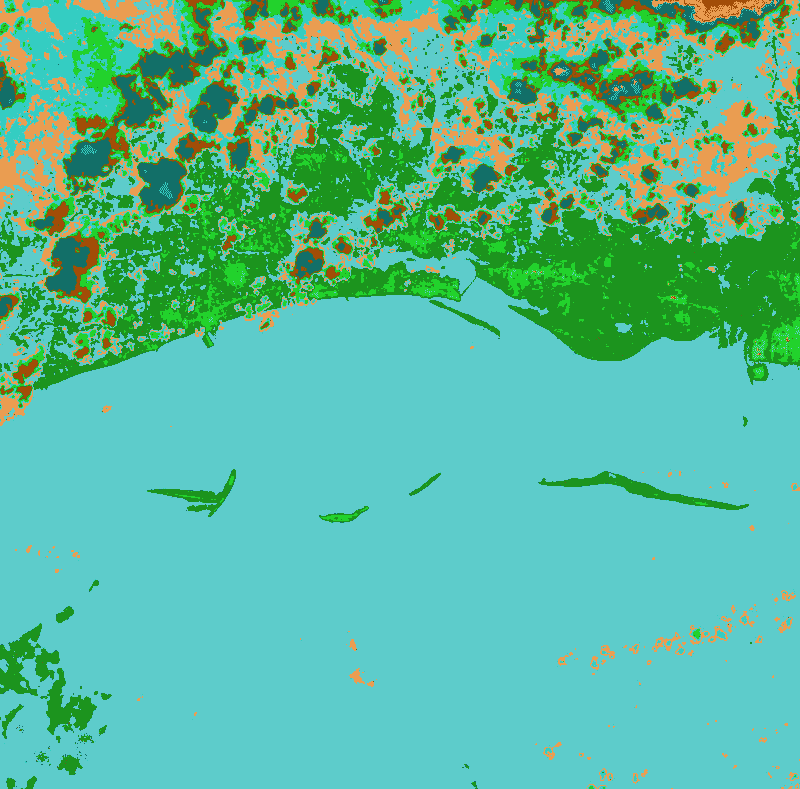

在保存为图像时，我们没有指定原型参数，因此它没有地理参考信息，尽管我们本可以轻松地将输出保存为 GeoTIFF 格式。

对于一个非常简单的无监督分类来说，这个结果并不坏。岛屿和海岸平原以不同的绿色色调出现。云被隔离为橙色和深蓝色。我们在内陆有一些混淆，因为陆地特征的颜色与墨西哥湾相同。我们可以通过手动定义类范围而不是仅仅使用直方图来进一步细化这个过程。

现在我们有了分离图像中特征的能力，我们可以尝试提取特征作为矢量数据，以便包含在 GIS 中。

# 从图像中提取特征

对图像进行分类的能力使我们转向另一个遥感能力。在你过去几章中处理形状文件之后，你是否曾经想过它们从何而来？像形状文件这样的矢量 GIS 数据通常是从遥感图像中提取的，例如我们之前看到的例子。

提取通常涉及分析师在图像中的每个对象周围点击并绘制特征以保存为数据。但是，有了良好的遥感数据和适当的预处理，从图像中自动提取特征是可能的。

对于这个例子，我们将从我们的 Landsat 8 热图像中取一个子集，以隔离墨西哥湾的一组屏障岛。岛屿呈现白色，因为沙子很热，而较冷的水则呈现黑色（你可以从这里下载这张图片：[`git.io/vqarj`](http://git.io/vqarj)）：

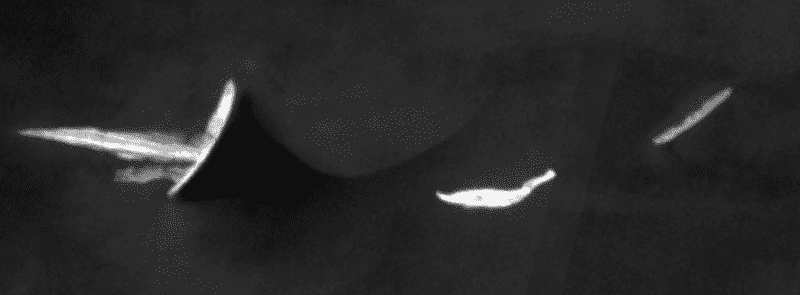

我们使用这个例子的目标是自动将图像中的三个岛屿提取为形状文件。但在我们能够做到这一点之前，我们需要屏蔽掉我们不感兴趣的数据。例如，水具有广泛的像素值范围，岛屿本身也是如此。如果我们只想提取岛屿本身，我们需要将所有像素值推入仅两个组中，使图像变为黑白。这种技术称为**阈值化**。图像中的岛屿与背景中的水有足够的对比度，阈值化应该可以很好地隔离它们。

在下面的脚本中，我们将图像读入一个数组，然后使用仅两个分箱对图像进行直方图化。然后，我们将使用黑色和白色为两个分箱着色。这个脚本只是我们分类脚本的修改版，输出非常有限。让我们看看以下步骤：

1.  首先，我们导入我们需要的库：

```py
from gdal import gdal_array
```

1.  接下来，我们定义输入和输出图像的变量：

```py
# Input file name (thermal image)
src = "islands.tif"
# Output file name
tgt = "islands_classified.tiff"
```

1.  然后，我们可以加载图像：

```py
# Load the image into numpy using gdal
srcArr = gdal_array.LoadFile(src)
```

1.  现在，我们可以设置我们的简单分类方案：

```py
# Split the histogram into 20 bins as our classes
classes = gdal_array.numpy.histogram(srcArr, bins=2)[1]
lut = [[255, 0, 0], [0, 0, 0], [255, 255, 255]]
```

1.  接下来，我们对图像进行分类：

```py
# Starting value for classification
start = 1
# Set up the output image
rgb = gdal_array.numpy.zeros((3, srcArr.shape[0], srcArr.shape[1], ),
 gdal_array.numpy.float32)
# Process all classes and assign colors
for i in range(len(classes)):
  mask = gdal_array.numpy.logical_and(start <= srcArr, srcArr <= 
  classes[i])
 for j in range(len(lut[i])):
   rgb[j] = gdal_array.numpy.choose(mask, (rgb[j], lut[i][j]))
   start = classes[i]+1
```

1.  最后，我们保存图像：

```py
# Save the image
gdal_array.SaveArray(rgb.astype(gdal_array.numpy.uint8),
 tgt, format="GTIFF", prototype=src) 
```

输出看起来很棒，如下面的图像所示：

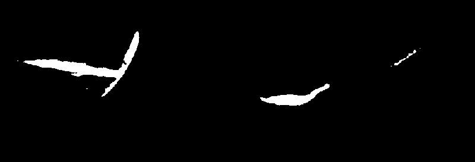

岛屿被清楚地隔离，因此我们的提取脚本将能够将它们识别为多边形并保存到形状文件中。GDAL 库有一个名为 `Polygonize()` 的方法，它正好做这件事。它将图像中所有孤立像素集分组，并将它们保存为要素数据集。在这个脚本中，我们将使用的一个有趣的技术是使用我们的输入图像作为掩码。

`Polygonize()` 方法允许您指定一个掩码，它将使用黑色作为过滤器，以防止水被提取为多边形，我们最终将只得到岛屿。在脚本中需要注意的另一个区域是，我们复制了源图像的地理参考信息到我们的形状文件，以正确地定位它。让我们看看以下步骤：

1.  首先，我们导入我们的库：

```py
import gdal
from gdal import ogr, osr
```

1.  接下来，我们设置输入和输出图像以及形状文件的变量：

```py
# Thresholded input raster name
src = "islands_classified.tiff"
# Output shapefile name
tgt = "extract.shp"
# OGR layer name
tgtLayer = "extract"
```

1.  让我们打开我们的输入图像并获取第一个也是唯一的一个波段：

```py
# Open the input raster
srcDS = gdal.Open(src)
# Grab the first band
band = srcDS.GetRasterBand(1)
```

1.  然后，我们将告诉 `gdal` 使用该波段作为掩码：

```py
# Force gdal to use the band as a mask
mask = band
```

1.  现在，我们准备好设置我们的形状文件：

```py
# Set up the output shapefile
driver = ogr.GetDriverByName("ESRI Shapefile")
shp = driver.CreateDataSource(tgt)
```

1.  然后，我们需要从源图像复制我们的空间参考信息到形状文件，以便在地球上定位它：

```py
# Copy the spatial reference
srs = osr.SpatialReference()
srs.ImportFromWkt(srcDS.GetProjectionRef())
layer = shp.CreateLayer(tgtLayer, srs=srs)
```

1.  现在，我们可以设置我们的形状文件属性：

```py
# Set up the dbf file
fd = ogr.FieldDefn("DN", ogr.OFTInteger)
layer.CreateField(fd)
dst_field = 0
```

1.  最后，我们可以提取我们的多边形：

```py
# Automatically extract features from an image!
extract = gdal.Polygonize(band, mask, layer, dst_field, [], None) 
```

输出的形状文件简单地命名为 `extract.shp`。如您从第四章中可能记得的，*地理空间 Python 工具箱*，我们使用 PyShp 和 PNG Canvas 创建了一个快速纯 Python 脚本，用于可视化形状文件。我们将把这个脚本带回这里，以便我们可以查看我们的形状文件，但我们会给它添加一些额外的功能。最大的岛屿有一个小潟湖，在多边形中显示为一个洞。为了正确渲染它，我们必须处理形状文件记录中的部分。

使用该脚本的前一个示例没有这样做，所以我们将在这个步骤中添加这个部分，我们将通过形状文件特征循环：

1.  首先，我们需要导入我们将需要的库：

```py
import shapefile
import pngcanvas
```

1.  接下来，我们从形状文件中获取空间信息，这将允许我们将坐标映射到像素：

```py
r = shapefile.Reader("extract.shp")
xdist = r.bbox[2] - r.bbox[0]
ydist = r.bbox[3] - r.bbox[1]
iwidth = 800
iheight = 600
xratio = iwidth/xdist
yratio = iheight/ydist
```

1.  现在，我们将创建一个列表来保存我们的多边形：

```py
polygons = []
```

1.  然后，我们将遍历形状文件并收集我们的多边形：

```py
for shape in r.shapes():
 for i in range(len(shape.parts)):
 pixels = []
 pt = None
 if i < len(shape.parts)-1:
   pt = shape.points[shape.parts[i]:shape.parts[i+1]]
 else:
   pt = shape.points[shape.parts[i]:]
```

1.  接下来，我们将每个点映射到图像像素：

```py
 for x, y in pt:
   px = int(iwidth - ((r.bbox[2] - x) * xratio))
   py = int((r.bbox[3] - y) * yratio)
   pixels.append([px, py])
 polygons.append(pixels)
```

1.  接下来，我们使用 `PNGCanvas` 中的多边形像素信息绘制图像：

```py
c = pngcanvas.PNGCanvas(iwidth, iheight)
for p in polygons:
 c.polyline(p)
```

1.  最后，我们保存图像：

```py
with open("extract.png", "wb") as f:
    f.write(c.dump())
    f.close()
```

以下图像显示了我们的自动提取的岛屿特征：

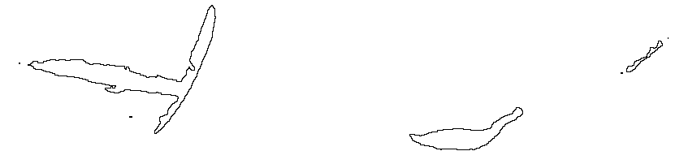

执行此类工作的商业软件可能轻易花费数万美元。虽然这些软件包非常稳健，但看到您仅使用简单的 Python 脚本和一些开源软件包就能走多远仍然很有趣且令人鼓舞。在许多情况下，您可以完成所需的所有工作。

最西端的岛屿包含多边形孔洞，如下面的图像所示，并放大了该区域：

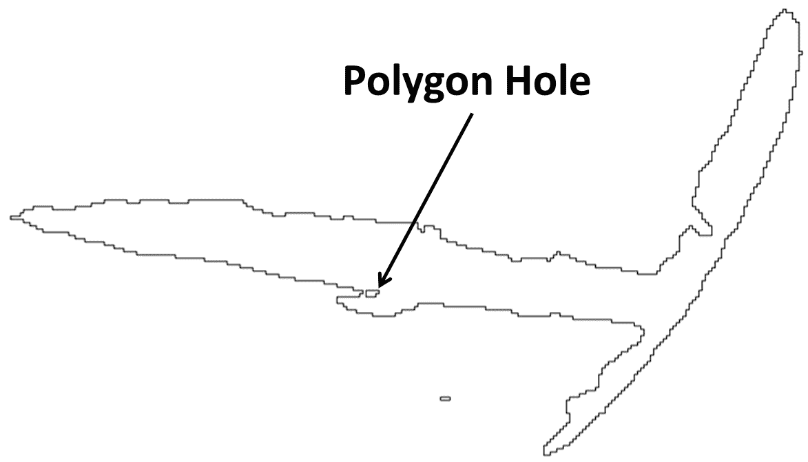

如果您想看看如果我们没有处理多边形孔洞会发生什么，只需运行第四章中“地理空间 Python 工具箱”的脚本版本，并与这个相同的 shapefile 进行比较即可。潟湖不容易看到，但如果你使用另一个脚本，你会找到它。

自动特征提取是地理空间分析中的圣杯，因为手动提取特征需要高昂的成本和繁琐的努力。特征提取的关键是正确的图像分类。自动特征提取与水体、岛屿、道路、农田、建筑和其他具有与背景高对比度像素值的特征配合得很好。

您现在已经很好地掌握了使用 GDAL、NumPy 和 PIL 处理遥感数据的方法。现在是时候继续到我们最复杂的例子：变化检测了。

# 理解变化检测

变化检测是从两个不同日期的同一区域自动识别差异的过程，这两个图像是精确地理配准的。这实际上只是图像分类的另一种形式。就像我们之前的分类示例一样，它可以从这里使用的简单技术到提供惊人精确和准确结果的复杂算法。

对于这个例子，我们将使用来自沿海地区的一对图像。这些图像显示了在一场大飓风前后的人口密集区域，因此存在显著差异，其中许多差异很容易通过视觉识别，这使得这些样本非常适合学习变化检测。我们的技术是简单地使用 NumPy 从第二张图像中减去第一张图像以获得简单的图像差异。这是一个有效且常用的技术。

优点是它全面且非常可靠。这个过于简单的算法的缺点是它没有隔离变化类型。许多变化对于分析来说并不重要，例如海洋上的波浪。在这个例子中，我们将有效地屏蔽水面以避免这种干扰，并仅关注差异图像直方图右侧的高反射率值。

您可以从[`git.io/vqa6h`](http://git.io/vqa6h)下载基线图像。

您可以从[`git.io/vqaic`](http://git.io/vqaic)下载已更改的图像。

注意这些图像相当大——分别为 24 MB 和 64 MB！

基准图像是全色图像，而变化图像是假彩色图像。全色图像是由捕获所有可见光的传感器创建的，通常是高分辨率传感器而不是捕获包含限制波长的波段的多元光谱传感器。 

通常，你会使用两个相同的波段组合，但这些样本将适用于我们的目的。我们可以用来评估变化检测的视觉标记包括图像东南象限的一座桥梁，它从半岛延伸到图像的边缘。这座桥梁在原始图像中清晰可见，但被飓风减少到桩。另一个标记是西北象限的一艘船，它在变化后的图像中表现为一条白色轨迹，但在原始图像中并不存在。

中性标记是水和穿过城镇并连接到桥梁的州际公路，这是一个容易看到的混凝土特征，在两个图像之间没有显著变化。以下是基于线的图像截图：

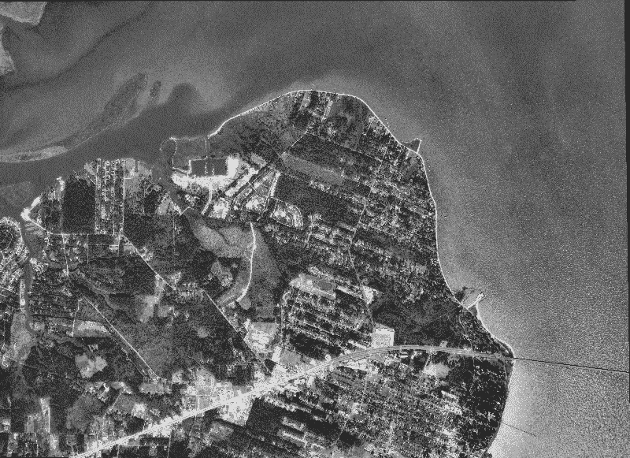

要自己近距离查看这些图像，你应该使用 QGIS 或 OpenEV（FWTools），如第三章中“地理空间技术景观”部分的*Quantum GIS and OpenEv*所述，以便轻松查看。以下图像是变化后的图像：

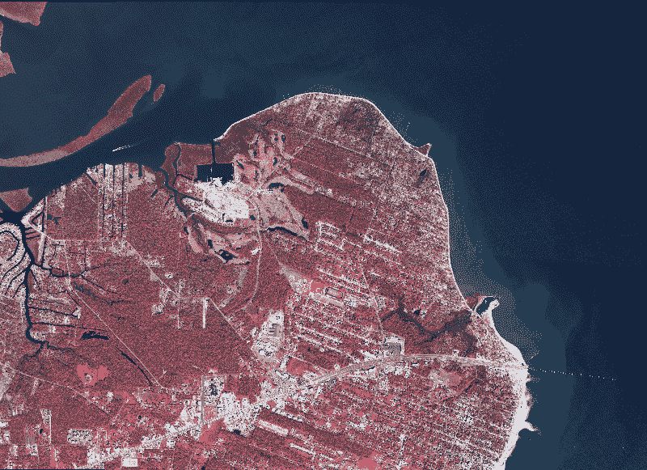

因此，让我们进行变化检测：

1.  首先，我们加载我们的库：

```py
import gdal
from gdal import gdal_array
import numpy as np
```

1.  现在，我们设置输入和输出图像的变量：

```py
# "Before" image
im1 = "before.tif"
# "After" image
im2 = "after.tif"
```

1.  接下来，我们使用`gdal_array`将这两张图像读入 NumPy 数组：

```py
# Load before and after into arrays
ar1 = gdal_array.LoadFile(im1).astype(np.int8)
ar2 = gdal_array.LoadFile(im2)[1].astype(np.int8)
```

1.  现在，我们从变化后的图像中减去原始图像（差值=变化后-变化前）：

```py
# Perform a simple array difference on the images
diff = ar2 - ar1
```

1.  然后，我们将图像分为五类：

```py
# Set up our classification scheme to try
# and isolate significant changes
classes = np.histogram(diff, bins=5)[1]
```

1.  接下来，我们将颜色表设置为使用黑色来屏蔽低级别。我们这样做是为了过滤水和道路，因为它们在图像中较暗：

```py
# The color black is repeated to mask insignificant changes
lut = [[0, 0, 0], [0, 0, 0], [0, 0, 0], [0, 0, 0], [0, 255, 0], [255, 0, 0]]
```

1.  然后，我们为类别分配颜色：

```py
# Starting value for classification
start = 1
# Set up the output image
rgb = np.zeros((3, diff.shape[0], diff.shape[1], ), np.int8)
# Process all classes and assign colors
for i in range(len(classes)):
 mask = np.logical_and(start <= diff, diff <= classes[i])
 for j in range(len(lut[i])):
 rgb[j] = np.choose(mask, (rgb[j], lut[i][j]))
 start = classes[i]+1
```

1.  最后，我们保存我们的图像：

```py
# Save the output image
output = gdal_array.SaveArray(rgb, "change.tif", format="GTiff", prototype=im2)
output = None
```

这是我们的初始差异图像的样子：

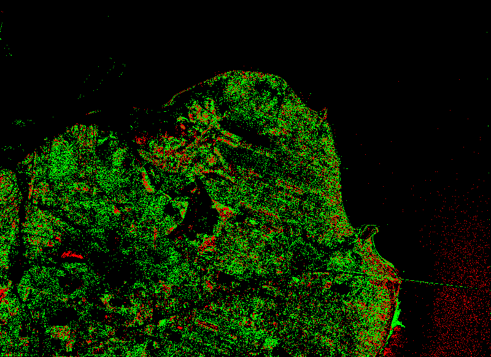

主要来说，绿色类别代表添加了某些东西的区域。红色则表示较暗的值，可能是移除了某些东西。我们可以看到，在西北象限的船迹是绿色的。我们还可以看到植被有很多变化，这是由于季节差异而预期的。桥梁是一个异常，因为暴露的桩比原始桥梁较暗的表面更亮，这使得它们变成了绿色而不是红色。

混凝土是变化检测中的一个重要指标，因为它在阳光下非常明亮，通常是新发展的标志。相反，如果一座建筑被拆除并且混凝土被移除，这种差异也容易识别。因此，我们在这里使用的简单差异算法并不完美，但可以通过阈值、掩膜、更好的类别定义和其他技术进行大幅改进。

要真正欣赏我们的变化检测产品，你可以在 QGIS 中将它叠加到原始或后续图像上，并将颜色设置为黑色透明，如图所示：

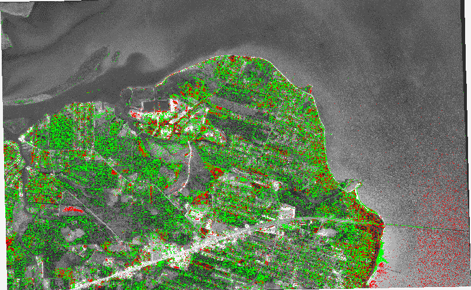

可能地，你可以将这种变化检测分析结合特征提取示例，以提取作为矢量数据的变化，这些数据可以在 GIS 中高效地进行分析。

# 摘要

在本章中，我们涵盖了遥感的基础，包括波段交换、直方图、图像分类、特征提取和变化检测。与其他章节一样，我们尽可能地接近纯 Python，在处理速度上做出妥协的地方，我们尽可能地限制软件库，以保持简单。然而，如果你安装了本章的工具，你实际上拥有一个完整的遥感软件包，其局限性仅在于你学习的愿望。

本章中的技术是所有遥感处理的基础，将使你能够构建更复杂的操作。

在下一章中，我们将研究高程数据。高程数据既不属于 GIS 也不属于遥感，因为它具有这两种处理方式的元素。

# 进一步阅读

GDAL 的作者提供了一系列 Python 示例，涵盖了多个可能对你感兴趣的高级主题。你可以在[`github.com/OSGeo/gdal/tree/master/gdal/swig/python/samples`](https://github.com/OSGeo/gdal/tree/master/gdal/swig/python/samples)找到它们。
