# Python 和高程数据

高程数据是地理空间数据中最迷人的类型之一。它代表了许多不同类型的数据源和格式。它可以显示矢量和栅格数据的属性，从而产生独特的数据产品。高程数据可用于地形可视化、土地覆盖分类、水文建模、交通路线规划、特征提取以及许多其他用途。

您不能使用栅格和矢量数据执行所有这些选项，但由于高程数据是三维的，因为它包含*x*、*y*和*z*坐标，您通常可以从这些数据中获得比其他任何类型更多的信息。

在本章中，我们将涵盖以下主题：

+   使用 ASCII 网格高程数据文件进行简单的高程处理

+   创建阴影地形图

+   创建高程等高线

+   栅格化激光雷达数据

+   创建 3D 网格

在本章中，您将学习如何以栅格和矢量格式读取和写入高程数据。我们还将创建一些衍生产品。

# 访问 ASCII 网格文件

对于本章的大部分内容，我们将使用 ASCII 网格文件，或称 ASCIIGRID。这些文件是一种通常与高程数据相关的栅格数据。这种网格格式以文本形式存储数据，在等大小的正方形行和列中，具有简单的标题。每一行/列中的每个单元格存储一个单一的数值，它可以代表地形的一些特征，如高程、坡度或流向。其简单性使其成为一种易于使用且平台无关的栅格格式。该格式在第二章的*ASCII 网格*部分中描述，*学习地理空间数据*。

在整本书中，我们一直依赖 GDAL，在一定程度上甚至依赖 PIL 来读取和写入地理空间栅格数据，包括`gdalnumeric`模块，这样我们就可以将栅格数据加载到 NumPy 数组中。ASCII 网格允许我们仅使用 Python 或甚至 NumPy 来读取和写入栅格，因为它是一种简单的纯文本格式。

作为提醒，一些高程数据集使用图像格式来存储高程数据。大多数图像格式仅支持介于 0 到 255 之间的 8 位值；然而，一些格式，包括 TIFF，可以存储更大的值。

地理空间软件通常可以显示这些数据集；然而，传统的图像软件和库通常不能。为了简化，在本章中，我们将主要坚持使用 ASCII 网格格式进行数据，它既适合人类阅读也适合机器阅读，并且得到了广泛的支持。

# 读取网格

NumPy 具有使用其`loadtxt()`方法直接读取 ASCII 网格格式的功能，该方法旨在从文本文件中读取数组。前六行是标题，它不是数组的一部分。以下是一些网格标题的示例：

```py
ncols 250
nrows 250
xllcorner 277750.0
yllcorner 6122250.0
cellsize 1.0
NODATA_value -9999
```

让我们看看前面代码中的每一行包含什么：

+   第 1 行包含网格中的列数，这与*x*轴同义。

+   第 2 行表示*y*轴作为行数。

+   第 3 行代表左下角的**x**坐标，这是以米为单位的**x**值最小值。

+   第 4 行是网格左下角对应的**y**值最小值。

+   第 5 行是栅格的单元格大小或分辨率。由于单元格是正方形，只需要一个大小值，而不是大多数地理空间栅格中单独的**x**和**y**分辨率值。

+   第 6 行是`NODATA_value`，这是一个分配给任何未提供值的单元格的数字。

地理空间软件在计算中忽略这些单元格，并且通常允许为它设置特殊的显示设置，例如将其设置为黑色或透明。`-9999`值是一个在行业中常用的无数据占位符值，在软件中易于检测，但可以任意选择。例如，负值的标高（即水深）可能在`-9999`米处有有效数据，并且可能选择`9999`或其他值。只要这个值在标题中定义，大多数软件都不会有问题。在某些示例中，我们将使用数字零；然而，零也可以是一个有效的数据值。

`numpy.loadtxt()`方法包括一个名为`skiprows`的参数，它允许您指定在读取数组值之前要跳过的文件中的行数。

要尝试这种技术，您可以从[`git.io/vYapU`](http://git.io/vYapU)下载一个名为`myGrid.asc`的示例网格文件。

因此，对于`myGrid.asc`，我们将使用以下代码：

```py
myArray  = numpy.loadtxt("myGrid.asc", skiprows=6)
```

这行代码导致`myArray`变量包含一个由 ASCIIGRID 格式的`myGrid.asc`文件派生的`numpy`数组。AS 文件扩展名由 ASCIIGRID 格式使用。这段代码运行得很好，但有一个问题。NumPy 允许我们跳过标题，但不能保留它。我们需要保留它，以便我们有数据的空间参考。我们还将使用它来保存此网格或创建一个新的网格。

为了解决这个问题，我们将使用 Python 内置的`linecache`模块来获取标题。我们可以打开文件，遍历行，将每一行存储在一个变量中，然后关闭文件。然而，`linecache`将解决方案简化为单行。以下行将文件的第一行读取到名为`line1`的变量中：

```py
import linecache
line1 = linecache.getline("myGrid.asc", 1)
```

在本章的示例中，我们将使用这种技术创建一个简单的标题处理器，它可以在几行代码中将这些标题解析到 Python 变量中。现在我们知道了如何读取网格，让我们学习如何写入它们。

# 编写网格

在 NumPy 中编写网格与读取它们一样简单。我们使用相应的`numpy.savetxt()`函数将网格保存到文本文件。唯一的难点是在将数组写入文件之前，我们必须构建并添加六行标题信息。这个过程对于不同版本的 NumPy 略有不同。在任何情况下，您首先将标题作为字符串构建。如果您使用的是 NumPy 1.7 或更高版本，`savetxt()`方法有一个可选的参数称为 header，允许您指定一个字符串作为参数。您可以使用以下命令从命令行快速检查您的 NumPy 版本：

```py
python -c "import numpy;print(numpy.__version__)"
1.8.2
```

向后兼容的方法是打开一个文件，写入标题，然后写入数组。以下是一个示例，说明如何使用 1.7 版本的 NumPy 将名为`myArray`的数组保存到名为`myGrid.asc`的 ASCIIGRID 文件中：

```py
header = "ncols {}\n".format(myArray.shape[1])
header += "nrows {}\n".format(myArray.shape[0])
header += "xllcorner 277750.0\n"
header += "yllcorner 6122250.0\n"
header += "cellsize 1.0\n"
header += "NODATA_value -9999"
numpy.savetxt("myGrid.asc", myArray, header=header, fmt="%1.2f")
```

我们利用 Python 格式字符串，它允许您在字符串中放置占位符以格式化要插入的 Python 对象。`{}`格式变量将您引用的对象转换为字符串。在这种情况下，我们引用数组中的列数和行数。

在 NumPy 中，一个数组有两个属性：

+   大小：它返回数组中值的整数。

+   形状：它返回一个元组，分别包含行数和列数。

因此，在先前的示例中，我们使用形状属性元组将行数和列数添加到我们的 ASCII 网格的标题中。请注意，我们还为每一行添加了尾随换行符（`\\n`）。除非我们在脚本中更改了它们，否则没有理由更改`x`和`y`值、单元格大小或无数据值。

`savetxt()`方法还有一个`fmt`参数，它允许您使用 Python 格式字符串来指定如何写入数组值。在这种情况下，`%1.2f`值指定至少有一个数字且不超过两位小数的浮点数。NumPy 在 1.6 之前的向后兼容版本以相同的方式构建标题字符串，但首先创建文件句柄：

```py
with open("myGrid.asc", "w") as f:
 f.write(header)
 numpy.savetxt(f, str(myArray), fmt="%1.2f")
```

如您将在接下来的示例中看到，仅使用 NumPy 就能生成有效的地理空间数据文件的能力非常强大。在接下来的几个示例中，我们将使用加拿大不列颠哥伦比亚省温哥华附近的一个山区 ASCIIGRID **数字高程模型**（**DEM**）。

您可以在以下网址下载此样本的 ZIP 文件：[`git.io/vYwUX`](http://git.io/vYwUX)。

以下图像是使用 QGIS 和颜色渐变对原始 DEM 进行着色，使得低海拔值呈现深蓝色，而高海拔值呈现亮红色：

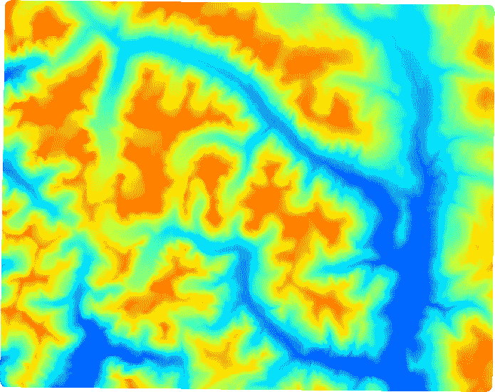

虽然我们可以从概念上理解这些数据，但这并不是一种直观的数据可视化方式。让我们看看通过创建阴影地形图是否能做得更好。

# 创建阴影地形图

阴影高程图以这种方式着色海拔，使得地形看起来像是在低角度光线下投射的，这创造了明亮的亮点和阴影。这种美学风格创造了一种几乎像照片一样的错觉，这很容易理解，以便我们可以理解地形的差异。重要的是要注意，这种风格实际上是一种错觉，因为光线在太阳角度方面往往物理上不准确，而海拔通常被夸大以增加对比度。

在这个例子中，我们将使用我们之前引用的 ASCII DEM 来创建另一个网格，该网格代表 NumPy 中地形阴影高程版本。这种地形非常动态，所以我们不需要夸大海拔；然而，脚本中有一个名为`z`的变量，可以从 1.0 增加到放大海拔。

在我们定义了所有变量，包括输入和输出文件名之后，我们将看到基于`linecache`模块的标题解析器，它还使用 Python 列表推导式来循环和解析然后从列表中分割成六个变量的行。我们还创建了一个名为`ycell`的`y`单元格大小，按照惯例，它只是单元格大小的倒数。如果我们不这样做，生成的网格将会转置。

注意，我们为坡度和方位角网格定义了文件名，这两个中间产品被组合起来创建最终产品。这些中间网格也被输出。它们也可以作为其他类型产品的输入。

此脚本使用 3x3 窗口方法扫描图像，并平滑这些小网格中的中心值，以有效地处理图像。它是在您计算机的内存限制内完成的。然而，因为我们使用 NumPy，我们可以通过矩阵一次处理整个数组，而不是使用一系列嵌套循环。这种技术基于一位名叫 Michal Migurski 的开发者的出色工作，他实现了 Matthew Perry 的 C++实现的巧妙 NumPy 版本，这成为了 GDAL 套件中 DEM 工具的基础。

在计算了坡度和方位角之后，它们被用来输出阴影高程图。坡度是山丘或山脉的陡峭程度，而方位角是网格单元面向的方向，以 0 到 360 度之间的度数指定。最后，所有内容都通过 NumPy 保存到磁盘上。在`savetxt()`方法中，我们指定一个由四个整数组成的格式字符串，因为峰值海拔高度是几千米：

1.  首先，我们将导入`linecache`模块来解析标题和`numpy`模块来进行处理：

```py
from linecache import getline
import numpy as np
```

1.  接下来，我们将设置所有将定义阴影高程处理方式的变量名称：

```py
# File name of ASCII digital elevation model
source = "dem.asc"

# File name of the slope grid
slopegrid = "slope.asc"

# File name of the aspect grid
aspectgrid = "aspect.asc"

# Output file name for shaded relief
shadegrid = "relief.asc"

# Shaded elevation parameters
# Sun direction
azimuth = 315.0

# Sun angle
altitude = 45.0

# Elevation exageration
z = 1.0

# Resolution
scale = 1.0

# No data value for output
NODATA = -9999

# Needed for numpy conversions
deg2rad = 3.141592653589793 / 180.0
rad2deg = 180.0 / 3.141592653589793
```

1.  现在我们已经设置了变量，我们可以解析标题：

```py
# Parse the header using a loop and
# the built-in linecache module
hdr = [getline(source, i) for i in range(1, 7)]
values = [float(h.split(" ")[-1].strip()) for h in hdr]
cols, rows, lx, ly, cell, nd = values
xres = cell
yres = cell * -1
```

1.  接下来，我们可以通过跳过标题部分使用`numpy`加载实际数据：

```py
# Load the dem into a numpy array
arr = np.loadtxt(source, skiprows=6)
```

1.  我们将逐行逐列遍历数据，以处理它。请注意，然而，我们将跳过包含无数据值的边缘。我们将随着进行将数据分成更小的 3 x 3 像素网格，因为对于每个网格单元，我们需要看到它周围的单元：

```py
# Exclude 2 pixels around the edges which are usually NODATA.
# Also set up structure for 3 x 3 windows to process the slope
# throughout the grid
window = []
for row in range(3):
 for col in range(3):
 window.append(arr[row:(row + arr.shape[0] - 2),
 col:(col + arr.shape[1] - 2)])

# Process each 3x3 window in both the x and y directions
x = ((z * window[0] + z * window[3] + z * window[3] + z * 
 window[6]) -
 (z * window[2] + z * window[5] + z * window[5] + z * 
 window[8])) / \
 (8.0 * xres * scale)
y = ((z * window[6] + z * window[7] + z * window[7] + z * 
 window[8]) -
 (z * window[0] + z * window[1] + z * window[1] + z * 
 window[2])) / \
 (8.0 * yres * scale)
```

1.  对于每个 3 x 3 的小窗口，我们将计算`slope`、`aspect`，然后是`shaded`高程值：

```py
# Calculate slope
slope = 90.0 - np.arctan(np.sqrt(x * x + y * y)) * rad2deg

# Calculate aspect
aspect = np.arctan2(x, y)

# Calculate the shaded relief
shaded = np.sin(altitude * deg2rad) * np.sin(slope * deg2rad) + \
 np.cos(altitude * deg2rad) * np.cos(slope * deg2rad) * \
 np.cos((azimuth - 90.0) * deg2rad - aspect)
```

1.  接下来，我们需要将每个值缩放到 0-255 之间，以便它可以作为一个图像来查看：

```py
# Scale values from 0-1 to 0-255
shaded = shaded * 255
```

1.  现在，我们必须重建我们的标题，因为我们忽略了无数据值的外边缘，并且我们的数据集更小了：

```py
# Rebuild the new header
header = "ncols {}\n".format(shaded.shape[1])
header += "nrows {}\n".format(shaded.shape[0])
header += "xllcorner {}\n".format(lx + (cell * (cols - 
 shaded.shape[1])))
header += "yllcorner {}\n".format(ly + (cell * (rows - 
 shaded.shape[0])))
header += "cellsize {}\n".format(cell)
header += "NODATA_value {}\n".format(NODATA)
```

1.  接下来，我们将任何无数据值设置为我们在变量开始时设置的选择的无数据值：

```py

# Set no-data values
for pane in window:
 slope[pane == nd] = NODATA
 aspect[pane == nd] = NODATA
 shaded[pane == nd] = NODATA
```

1.  我们将分别保存坡度和方向网格，以便我们可以在以后查看并理解阴影高程是如何创建的：

```py
# Open the output file, add the header, save the slope grid
with open(slopegrid, "wb") as f:
 f.write(bytes(header, "UTF-8")
 np.savetxt(f, slope, fmt="%4i")

# Open the output file, add the header, save the aspectgrid
with open(aspectgrid, "wb") as f:
 f.write(bytes(header, "UTF-8")
 np.savetxt(f, aspect, fmt="%4i")

# Open the output file, add the header, save the relief grid
with open(shadegrid, "wb") as f:
 f.write(bytes(header, 'UTF-8'))
 np.savetxt(f, shaded, fmt="%4i")
```

如果我们将输出的阴影高程网格加载到 QGIS 中，并将样式指定为拉伸图像到最小和最大值，我们将看到以下图像：

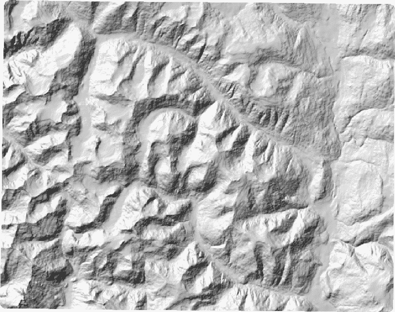

如果 QGIS 要求您指定投影，数据是 EPSG:3157。您还可以在第四章的“安装 GDAL”部分中讨论的 FWTools OpenEV 应用程序中打开图像，该应用程序将自动拉伸图像以实现最佳查看。

如您所见，前面的图像比我们最初检查的伪彩色表示更容易理解。接下来，让我们看看用于创建阴影高程的坡度栅格：

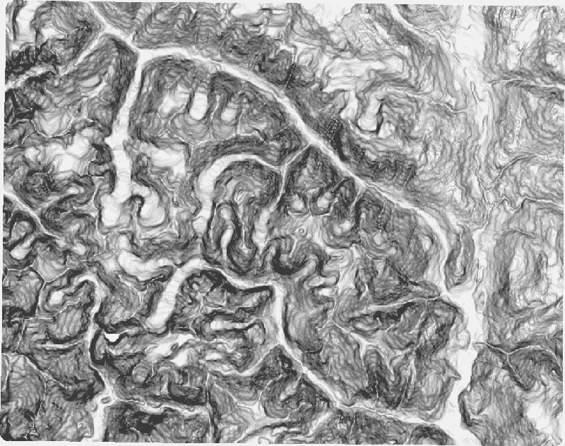

坡度显示了数据集中从高点到低点的所有方向上的高程逐渐下降。坡度是许多类型的水文模型的有用输入：

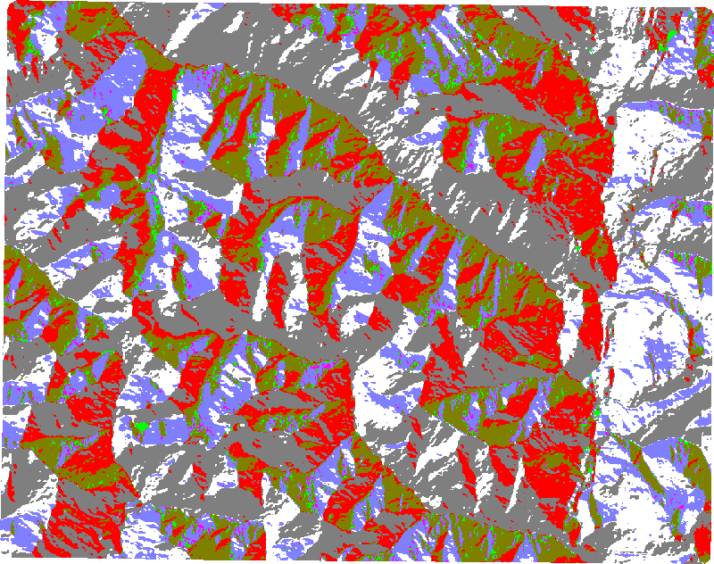

方向显示了从单元格到其邻居的下降变化的最大速率。如果您将方向图像与阴影高程图像进行比较，您将看到方向图像中的红色和灰色值对应于阴影高程中的阴影。因此，坡度主要负责将 DEM 转换为地形高程，而方向负责阴影。

现在我们能够以有用的方式显示数据，让我们看看我们是否也可以从中创建其他数据。

# 创建高程等高线

等高线是数据集中相同高程的等值线。等高线通常以间隔步进，以创建一种直观的方式来表示高程数据，无论是视觉上还是数值上，都使用资源高效的矢量数据集。现在，让我们看看另一种使用等高线更好地可视化高程的方法。

输入用于在 DEM 中生成等高线，输出是一个 shapefile。用于生成等高线的算法（Marching Squares：[`en.wikipedia.org/wiki/Marching_squares`](https://en.wikipedia.org/wiki/Marching_squares)）相当复杂，并且使用 NumPy 的线性代数实现非常困难。在这种情况下，我们的解决方案是回退到 GDAL 库，该库通过 Python API 提供了等高线方法。实际上，这个脚本的大部分内容只是设置输出 shapefile 所需的 OGR 库代码。实际的等高线生成是一个名为 `gdal.ContourGenerate()` 的方法调用。在这个调用之前，有一些注释定义了方法参数。其中最重要的如下：

+   `contourInterval`：这是等高线之间的距离，以数据集单位表示。

+   `contourBase`：这是等高线的起始海拔。

+   `fixedLevelCount`：这指定了等高线的固定数量，而不是距离。

+   `idField`：这是必需的 shapefile `dbf` 字段的名称，通常称为 ID。

+   `elevField`：这是必需的 shapefile `dbf` 字段名称，用于海拔值，并在地图标注中很有用。

您应该从第四章的 *安装 GDAL* 部分安装 GDAL 和 OGR。我们将实施以下步骤：

1.  首先，我们将定义输入 DEM 文件名。

1.  然后，我们将输出 shapefile 的名称。

1.  接下来，我们将使用 OGR 创建 shapefile 数据源。

1.  然后，我们将获取 OGR 图层。

1.  接下来，我们将打开 DEM。

1.  最后，我们将在 OGR 图层上生成等高线。

让我们看看前面步骤的代码表示：

1.  首先，我们加载 `gdal` 和 `ogr` 库来处理数据：

```py
import gdal
import ogr
```

1.  然后我们将设置一个用于文件名的变量：

```py
# Elevation DEM
source = "dem.asc"
```

1.  接下来，我们将使用 OGR 创建我们输出 shapefile 的开始部分：

```py
# Output shapefile
target = "contour"
ogr_driver = ogr.GetDriverByName("ESRI Shapefile")
ogr_ds = ogr_driver.CreateDataSource(target + ".shp")
ogr_lyr = ogr_ds.CreateLayer(target, 
# wkbLineString25D is the type code for geometry with a z 
# elevation value.
geom_type=ogr.wkbLineString25D)
field_defn = ogr.FieldDefn("ID" ogr.OFTInteger)
ogr_lyr.CreateField(field_defn)
field_defn = ogr.FieldDefn("ELEV" ogr.OFTReal)
ogr_lyr.CreateField(field_defn)
```

1.  然后，我们将创建一些等高线：

```py
# gdal.ContourGenerate() arguments
# Band srcBand,
# double contourInterval,
# double contourBase,
# double[] fixedLevelCount,
# int useNoData,
# double noDataValue,
# Layer dstLayer,
# int idField,
# int elevField
ds = gdal.Open(source)

# EPGS:3157
gdal.ContourGenerate(ds.GetRasterBand(1), 400, 10, [], 0, 0, ogr_lyr, 0, 1))
ogr_ds = None
```

1.  现在，让我们使用我们在第四章的 *PNGCanvas* 部分中介绍的 `pngcanvas` 来绘制我们刚刚创建的等高线 shapefile。请参阅第四章，*地理空间 Python 工具箱*：

```py
import shapefile
import pngcanvas

# Open the contours
r = shapefile.Reader("contour.shp")

# Setup the world to pixels conversion
xdist = r.bbox[2] - r.bbox[0]
ydist = r.bbox[3] - r.bbox[1]
iwidth = 800
iheight = 600
xratio = iwidth/xdist
yratio = iheight/ydist
contours = []

# Loop through all shapes
for shape in r.shapes():
 # Loop through all parts
 for i in range(len(shape.parts)):
   pixels = []
   pt = None
   if i < len(shape.parts) - 1:
     pt = shape.points[shape.parts[i]:shape.parts[i+1]]
   else:
     pt = shape.points[shape.parts[i]:]
   for x, y in pt:
     px = int(iwidth - ((r.bbox[2] - x) * xratio))
     py = int((r.bbox[3] - y) * yratio)
     pixels.append([px, py])
     contours.append(pixels)

# Set up the output canvas
canvas = pngcanvas.PNGCanvas(iwidth, iheight)

# PNGCanvas accepts rgba byte arrays for colors
red = [0xff, 0, 0, 0xff]
canvas.color = red

# Loop through the polygons and draw them
for c in contours:
 canvas.polyline(c)

# Save the image
with open("contours.png", "wb") as f:
 f.write(canvas.dump())
```

我们最终会得到以下图像：

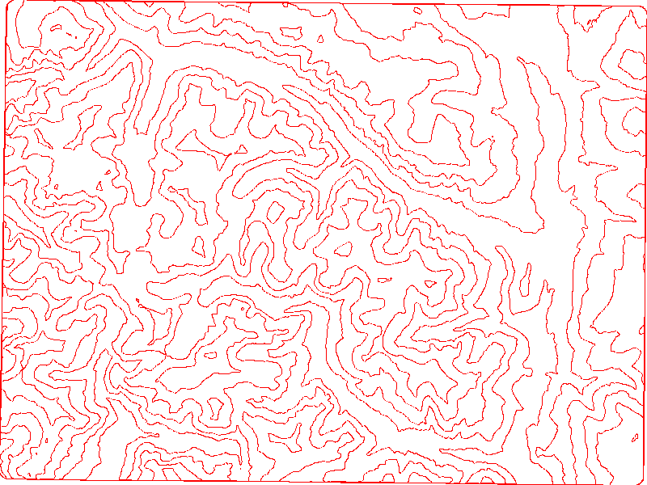

如果我们将我们的阴影高程 ASCIIGRID 和 shapefile 带入 GIS，例如 QGIS，我们可以创建一个简单的地形图，如下所示。您可以使用在脚本中指定的海拔（即 `ELEV`）`dbf` 字段来标注等高线的高度：

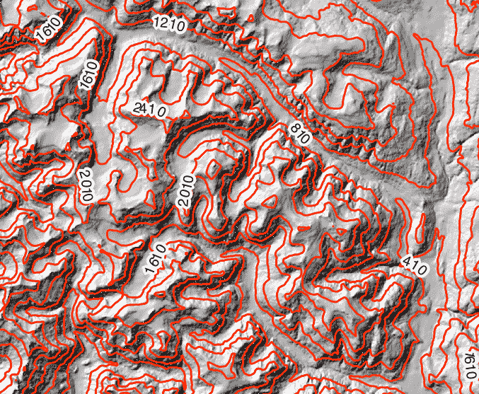

在这些 NumPy 网格示例中使用的技术为各种高程产品提供了构建块。接下来，我们将处理一种最复杂的高程数据类型：激光雷达数据。

# 处理激光雷达数据

**LIDAR**代表**光探测与测距**。它与基于雷达的图像类似，但使用有限的光束，每秒击中地面数十万次，以收集大量非常精细的(*x*, *y*, *z*)位置，以及时间和强度。强度值是 LIDAR 与其他数据类型真正区分开来的地方。例如，建筑物的沥青屋顶可能与附近树木的顶部处于相同的海拔高度，但强度值将不同。就像遥感一样，多光谱卫星图像中的辐射值允许我们建立分类库。LIDAR 数据的强度值允许我们对 LIDAR 数据进行分类和着色。

LIDAR 的高体积和精度实际上使其难以使用。LIDAR 数据集被称为点云，因为数据集的形状通常不规则，因为数据是三维的，并且有离群点。没有很多软件包能够有效地可视化点云。

此外，有限点的非规则形状很难交互，即使我们使用适当的软件。

由于这些原因，LIDAR 数据上最常用的操作之一是将数据投影并重新采样到规则网格。我们将使用一个小型的 LIDAR 数据集来完成这项工作。此数据集未压缩时大约为 7 MB，包含超过 600,000 个点。数据捕捉了一些易于识别的特征，如建筑物、树木和停车场中的汽车。您可以从[`git.io/vOERW`](http://git.io/vOERW)下载压缩后的数据集。

文件格式是 LIDAR 特有的非常常见的二进制格式，称为**LAS**，代表激光。将此文件解压缩到您的工作目录。为了读取此格式，我们将使用一个纯 Python 库，称为`laspy`。您可以使用以下命令安装 Python 版本 3.7：

```py
pip install http://git.io/vOER9
```

安装了`laspy`后，我们就准备好从 LIDAR 创建网格了。

# 从 LIDAR 数据创建网格

此脚本相当直接。我们遍历 LIDAR 数据中的(*x*, *y*)点位置，并将它们投影到我们的一个平方米大小的网格上。由于 LIDAR 数据的精度，我们最终会在单个单元格中结束多个点。我们将这些点平均以创建一个共同的海拔值。我们还要处理的一个问题是数据丢失。每次重新采样数据时，您都会丢失信息。

在这种情况下，我们最终会在栅格中间出现`NODATA`空洞。为了处理这个问题，我们将使用周围单元格的平均值填充这些空洞，这是一种插值的形式。我们只需要两个模块，这两个模块都可在 PyPI 上找到，如下面的代码所示：

```py
from laspy.file import File
import numpy as np

# Source LAS file
source = "lidar.las"

# Output ASCII DEM file
target = "lidar.asc"

# Grid cell size (data units)
cell = 1.0

# No data value for output DEM
NODATA = 0

# Open LIDAR LAS file
las = File(source, mode="r")

# xyz min and max
min = las.header.min
max = las.header.max

# Get the x axis distance in meters
xdist = max[0] - min[0]

# Get the y axis distance in meters
ydist = max[1] - min[1]

# Number of columns for our grid
cols = int(xdist) / cell

# Number of rows for our grid
rows = int(ydist) / cell
cols += 1
rows += 1

# Track how many elevation
# values we aggregate
count = np.zeros((rows, cols)).astype(np.float32)

# Aggregate elevation values
zsum = np.zeros((rows, cols)).astype(np.float32)

# Y resolution is negative
ycell = -1 * cell

# Project x, y values to grid
projx = (las.x - min[0]) / cell
projy = (las.y - min[1]) / ycell

# Cast to integers and clip for use as index
ix = projx.astype(np.int32)
iy = projy.astype(np.int32)

# Loop through x, y, z arrays, add to grid shape,
# and aggregate values for averaging
for x, y, z in np.nditer([ix, iy, las.z]):
 count[y, x] += 1
 zsum[y, x] += z

# Change 0 values to 1 to avoid numpy warnings,
# and NaN values in array
nonzero = np.where(count > 0, count, 1)

# Average our z values
zavg = zsum / nonzero

# Interpolate 0 values in array to avoid any
# holes in the grid
mean = np.ones((rows, cols)) * np.mean(zavg)
left = np.roll(zavg, -1, 1)
lavg = np.where(left > 0, left, mean)
right = np.roll(zavg, 1, 1)
ravg = np.where(right > 0, right, mean)
interpolate = (lavg + ravg) / 2
fill = np.where(zavg > 0, zavg, interpolate)

# Create our ASCII DEM header
header = "ncols {}\n".format(fill.shape[1])
header += "nrows {}\n".format(fill.shape[0])
header += "xllcorner {}\n".format(min[0])
header += "yllcorner {}\n".format(min[1])
header += "cellsize {}\n".format(cell)
header += "NODATA_value {}\n".format(NODATA)

# Open the output file, add the header, save the array
with open(target, "wb") as f:
 f.write(bytes(header, 'UTF-8'))
 # The fmt string ensures we output floats
 # that have at least one number but only
 # two decimal places
 np.savetxt(f, fill, fmt="%1.2f")
```

我们脚本的输出结果是一个 ASCIIGRID，当在 OpenEV 中查看时，看起来如下所示。高海拔地区较亮，而低海拔地区较暗。即使以这种形式，您也可以看到建筑物、树木和汽车：

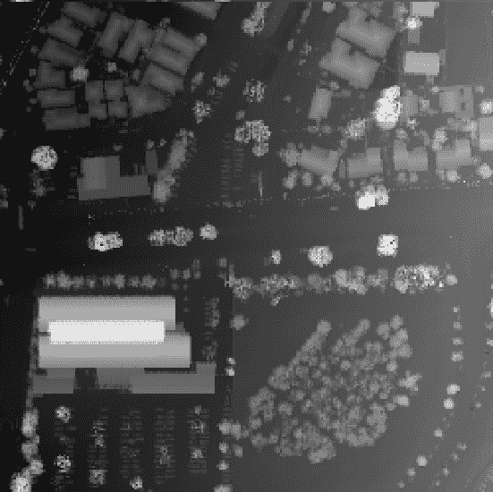

如果我们分配一个热图颜色渐变，颜色会给你一个更清晰的地面高度差异感：

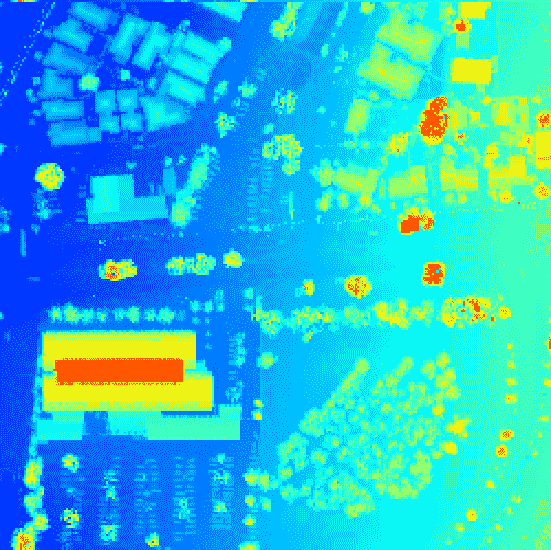

那么，如果我们运行这个输出 DEM 通过我们之前提到的阴影立体图脚本会发生什么？直边建筑和斜坡山之间的差异很大。如果您将阴影立体图脚本中的输入和输出名称更改为处理 LIDAR DEM，我们得到以下坡度结果：

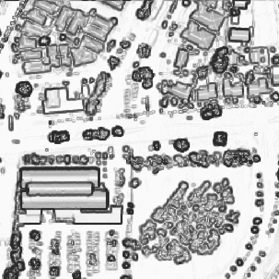

山地地形柔和的起伏坡度在图像中简化为主要特征的轮廓。在视向图像中，变化非常剧烈，且距离很短，因此输出图像看起来非常混乱，如下面的截图所示：

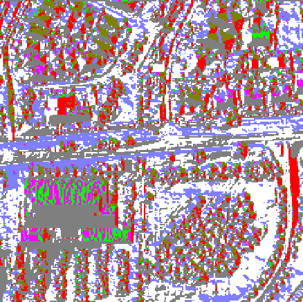

尽管这些图像与较粗糙但相对平滑的山地版本之间存在差异，但我们仍然得到了一个非常漂亮的阴影立体图，从视觉上看类似于黑白照片：

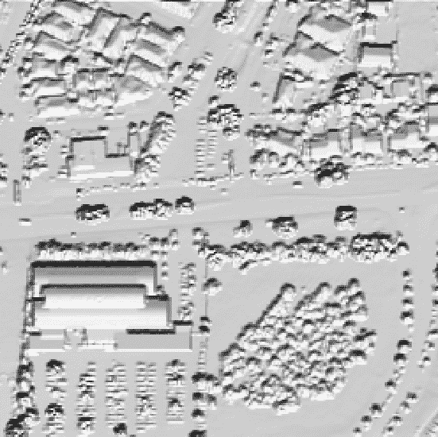

现在我们知道了如何处理 LIDAR 数据，让我们学习如何使用 Python 可视化它。

# 使用 PIL 可视化 LIDAR 数据

本章之前的部分 DEM 图像使用 QGIS 和 OpenEV 进行了可视化。我们还可以通过引入我们在前几章中没有使用的 **Python 图像库**（**PIL**）的一些新功能，在 Python 中创建输出图像。

在本例中，我们将使用 `PIL.ImageOps` 模块，该模块包含直方图均衡化和自动对比度增强的功能。我们将使用 PIL 的 `fromarray()` 方法从 `numpy` 导入数据。让我们看看如何通过以下代码帮助我们将输出与本章中展示的桌面 GIS 程序的输出尽可能接近：

```py
import numpy as np

try:
 import Image
 import ImageOps
except ImportError:
 from PIL import Image, ImageOps

# Source gridded LIDAR DEM file
source = "lidar.asc"

# Output image file
target = "lidar.bmp"

# Load the ASCII DEM into a numpy array
arr = np.loadtxt(source, skiprows=6)

# Convert array to numpy image
im = Image.fromarray(arr).convert("RGB")

# Enhance the image:
# equalize and increase contrast
im = ImageOps.equalize(im)
im = ImageOps.autocontrast(im)

# Save the image
im.save(target)
```

如您所见，在以下图像中，增强后的阴影立体图比之前的版本有更清晰的立体感：

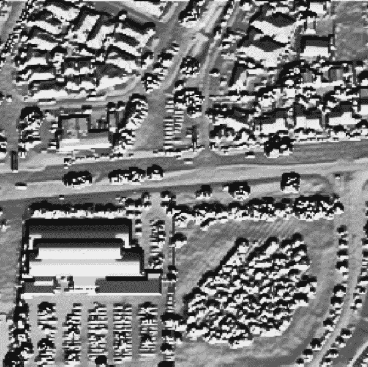

现在，让我们给我们的阴影立体图上色。我们将使用内置的 Python `colorsys` 模块进行颜色空间转换。通常，我们指定颜色为 RGB 值。然而，为了创建热图方案的色阶，我们将使用 **HSV**（代表 **色调、饱和度和亮度**）值来生成我们的颜色。

HSV 的优点是您可以调整 *H* 值，使其在色轮上的度数在 0 到 360 之间。使用单个色调值允许您使用线性渐变方程，这比处理三个单独的 RGB 值的组合要容易得多。以下图像来自在线杂志 *Qt Quarterly*，展示了 HSV 颜色模型：

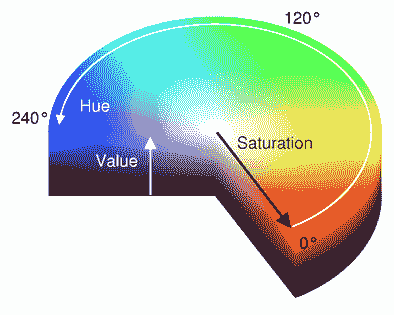

`colorsys` 模块允许你在 HSV 和 RGB 值之间切换。该模块返回 RGB 值的百分比，然后必须将每个颜色的百分比映射到 0-255 的刻度。

在以下代码中，我们将把 ASCII DEM 转换为 PIL 图像，构建我们的调色板，将调色板应用于灰度图像，并保存图像：

```py
import numpy as np

try:
 import Image
 import ImageOps
except:
 from PIL import Image, ImageOps
import colorsys

# Source LIDAR DEM file
source = "lidar.asc"

# Output image file
target = "lidar.bmp"

# Load the ASCII DEM into a numpy array
arr = np.loadtxt(source, skiprows=6)

# Convert the numpy array to a PIL image.
# Use black and white mode so we can stack
# three bands for the color image.
im = Image.fromarray(arr).convert('L')

# Enhance the image
im = ImageOps.equalize(im)
im = ImageOps.autocontrast(im)

# Begin building our color ramp
palette = []

# Hue, Saturation, Value
# color space starting with yellow.
h = .67
s = 1
v = 1

# We'll step through colors from:
# blue-green-yellow-orange-red.
# Blue=low elevation, Red=high-elevation
step = h / 256.0

# Build the palette
for i in range(256):
 rp, gp, bp = colorsys.hsv_to_rgb(h, s, v)
 r = int(rp * 255)
 g = int(gp * 255)
 b = int(bp * 255)
 palette.extend([r, g, b])
 h -= step

# Apply the palette to the image
im.putpalette(palette)

# Save the image
im.save(target)
```

上述代码生成以下图像，高海拔以暖色调表示，低海拔以冷色调表示：

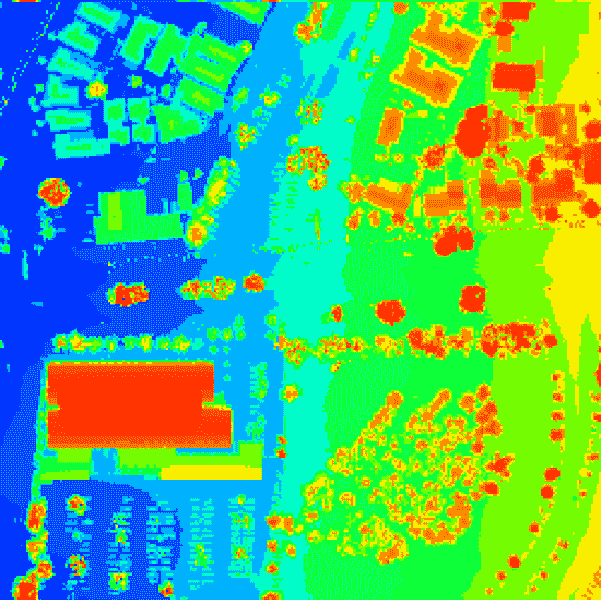

在这张图像中，我们实际上得到了比默认 QGIS 版本更多的变化。我们可以通过一个平滑算法来改善这张图像，该算法会在颜色相遇的地方混合颜色并使图像视觉上更柔和。如您所见，我们的颜色渐变范围从冷色调到暖色调，随着高程变化而增加。

# 创建不规则三角网

以下是我们迄今为止最复杂的示例。**不规则三角网**（**TIN**）是点数据集在点向量表面上的矢量表示，这些点以三角形的形式连接。一个算法确定哪些点是准确表示地形所绝对必要的，而不是像栅格那样，栅格在给定区域内存储固定数量的单元格，并且可能在相邻单元格中重复高程值，这些值可能更有效地存储为多边形。

TIN 比栅格更有效地在飞行中进行重采样，栅格在使用 GIS 中的 TIN 时需要更少的计算机内存和处理能力。最常见的 TIN 类型是基于**Delaunay 三角剖分**，它包括所有点而没有冗余三角形。

Delaunay 三角剖分非常复杂。我们将使用由 Bill Simons 编写的纯 Python 库，作为 Steve Fortune 的 Delaunay 三角剖分算法的一部分，名为`voronoi.py`，来计算我们的 LIDAR 数据中的三角形。您可以从[`git.io/vOEuJ`](http://git.io/vOEuJ)下载脚本到您的当前工作目录或`site-packages`目录。

此脚本读取 LAS 文件，生成三角形，遍历它们，并输出一个 shapefile。对于此示例，我们将使用我们 LIDAR 数据的裁剪版本以减少处理区域。如果我们运行包含 600,000 多个点的整个数据集，脚本将运行数小时并生成超过五十万个三角形。您可以从以下 URL 下载裁剪的 LIDAR 数据集作为 ZIP 文件：[`git.io/vOE62`](http://git.io/vOE62)。

由于以下示例的计算密集型特性，脚本运行时会打印出几个状态消息，该示例可能需要几分钟才能完成。我们将以**PolygonZ 类型**存储三角形，这允许顶点具有`z`高程值。解压缩 LAS 文件并运行以下代码以生成名为`mesh.shp`的 shapefile：

1.  首先，我们导入我们的库：

```py
import pickle
import os
import time
import math
import numpy as np
import shapefile
from laspy.file import File
# voronoi.py for Python 3: pip install http://git.io/vOEuJ
import voronoi
```

1.  接下来，我们定义我们的 LIDAR 文件的位置和名称、我们的目标输出文件以及我们的 pickle 文件：

```py
# Source LAS file
source = "clippedLAS.las"

# Output shapefile
target = "mesh"

# Triangles pickle archive
archive = "triangles.p"
```

1.  现在，我们将创建一个由`voronoi`模块需要的点类：

```py
class Point:
 """Point class required by the voronoi module"""
 def __init__(self, x, y):
   self.px = x
   self.py = y

def x(self):
 return self.px

def y(self):
 return self.py
```

1.  接下来，我们将创建一个三角形数组来跟踪为网格创建的三角形：

```py
# The triangle array holds tuples
# 3 point indices used to retrieve the points.
# Load it from a pickle
# file or use the voronoi module
# to create the triangles.
triangles = None
```

1.  接下来，我们需要打开我们的 LIDAR 文件并提取点：

```py
 # Open LIDAR LAS file
 las = File(source, mode="r")
else:

# Open LIDAR LAS file
 las = File(source, mode="r")
 points = []
 print("Assembling points...")

# Pull points from LAS file
 for x, y in np.nditer((las.x, las.y)):
 points.append(Point(x, y))
 print("Composing triangles...")
```

1.  现在，我们可以对点进行 Delaunay 计算来构建三角形：

```py
# Delaunay Triangulation
 triangles = voronoi.computeDelaunayTriangulation(points)
```

1.  如果我们再次运行这个脚本，我们将三角形存入 pickle 存档以节省时间：

```py
 # Save the triangles to save time if we write more than
 # one shapefile.
 f = open(archive, "wb")
 pickle.dump(triangles, f, protocol=2)
 f.close()
```

1.  接下来，我们可以创建一个 shapefile `Writer`对象，通过设置必要的字段来开始创建我们的输出 shapefile：

```py
print("Creating shapefile...")
 # PolygonZ shapefile (x, y, z, m)
 w = shapefile.Writer(target, shapefile.POLYGONZ)
 w.field("X1", "C", "40")
 w.field("X2", "C", "40")
 w.field("X3", "C", "40")
 w.field("Y1", "C", "40")
 w.field("Y2", "C", "40")
 w.field("Y3", "C", "40")
 w.field("Z1", "C", "40")
 w.field("Z2", "C", "40")
 w.field("Z3", "C", "40")
 tris = len(triangles)
```

1.  然后，我们遍历三角形并创建网格：

```py
# Loop through shapes and
 # track progress every 10 percent
 last_percent = 0
 for i in range(tris):
     t = triangles[i]
     percent = int((i/(tris*1.0))*100.0)
     if percent % 10.0 == 0 and percent > last_percent:
         last_percent = percent
         print("{} % done - Shape {}/{} at {}".format(percent, 
         i, tris, time.asctime()))
 part = []
 x1 = las.x[t[0]]
 y1 = las.y[t[0]]
 z1 = las.z[t[0]]
 x2 = las.x[t[1]]
 y2 = las.y[t[1]]
 z2 = las.z[t[1]]
 x3 = las.x[t[2]]
 y3 = las.y[t[2]]
 z3 = las.z[t[2]]
```

1.  接下来，我们可以消除任何极端长的线段，这些是库的错误计算：

```py
 # Check segments for large triangles
 # along the convex hull which is a common
 # artifact in Delaunay triangulation
 max = 3
 if math.sqrt((x2-x1)**2+(y2-y1)**2) > max:
 continue
 if math.sqrt((x3-x2)**2+(y3-y2)**2) > max:
 continue
 if math.sqrt((x3-x1)**2+(y3-y1)**2) > max:
 continue
 part.append([x1, y1, z1, 0])
 part.append([x2, y2, z2, 0])
 part.append([x3, y3, z3, 0])
 w.poly(parts=[part])
 w.record(x1, x2, x3, y1, y2, y3, z1, z2, z3)
 print("Saving shapefile...")
```

1.  最后，我们可以保存输出 shapefile：

```py
w.close()
print("Done.")
```

以下图像显示了 TIN 在着色 LIDAR 数据上的放大版本：

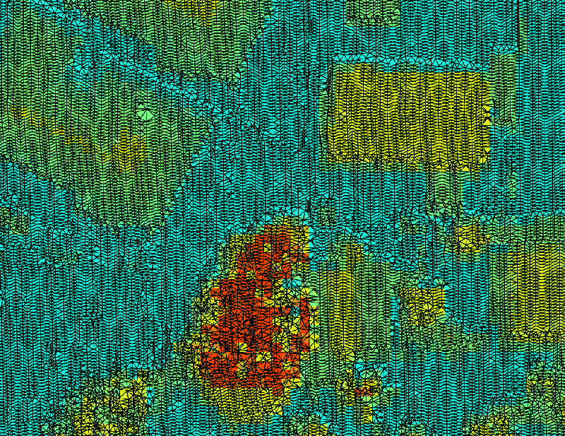

网格从点云中提供了一种高效、连续的表面，这通常比处理点云本身更容易。

# 摘要

高程数据通常可以提供完整的分析数据集和派生产品，无需其他数据。在本章中，你学习了如何仅使用 NumPy 读取和写入 ASCII 网格。你还学习了如何创建阴影地形图、坡度网格和方位网格。我们使用 GDAL 库的一个不为人知的功能——等高线，通过 Python 创建高程等高线。

接下来，我们将 LIDAR 数据转换成易于操作的 ASCII 网格。我们尝试了不同的方法来使用 PIL 可视化 LIDAR 数据。最后，我们将 LIDAR 点云转换成多边形的 3D 形状文件，从而创建一个 3D 表面或 TIN。这些是用于交通规划、建设规划、水文排水建模、地质勘探等的地形分析工具。

在下一章中，我们将结合前三章的内容，进行一些高级建模，并实际创建一些信息产品。

# 进一步阅读

你可以在以下链接找到一些关于 Python 和高程数据的额外教程： [`www.earthdatascience.org/tutorials/python/elevation/`](https://www.earthdatascience.org/tutorials/python/elevation/)。
