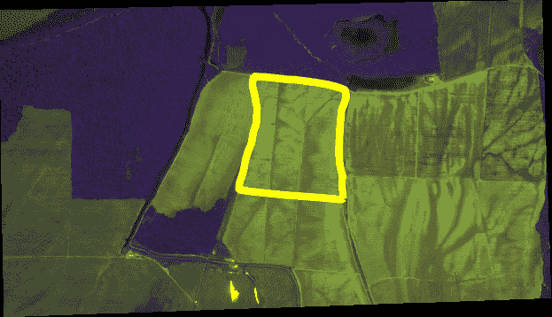
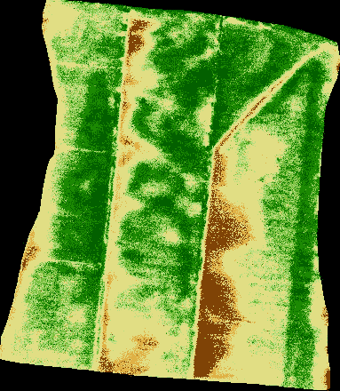
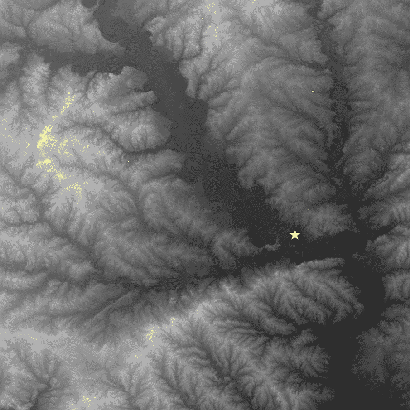
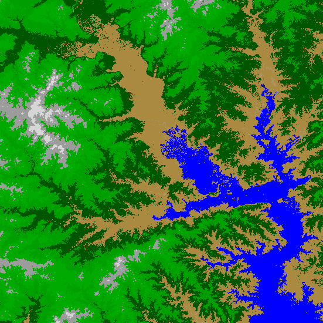
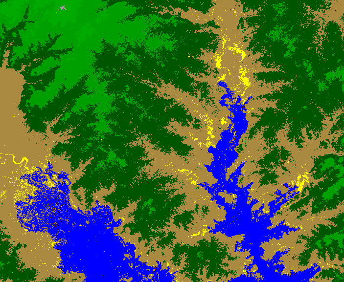
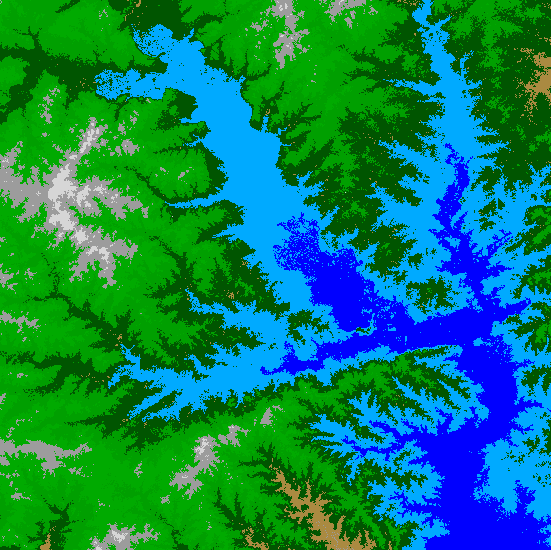
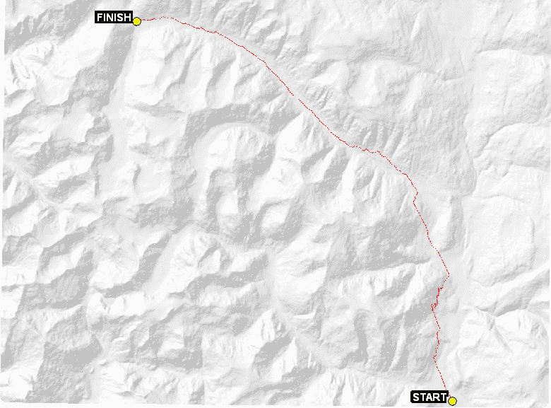
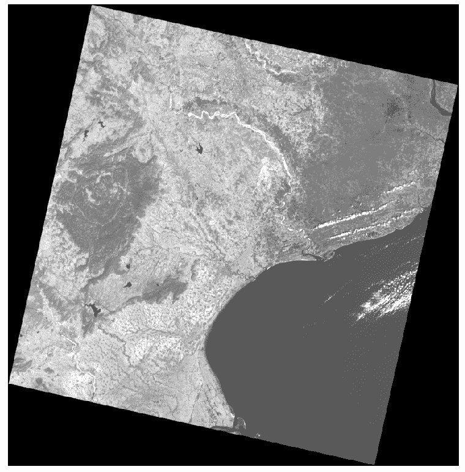
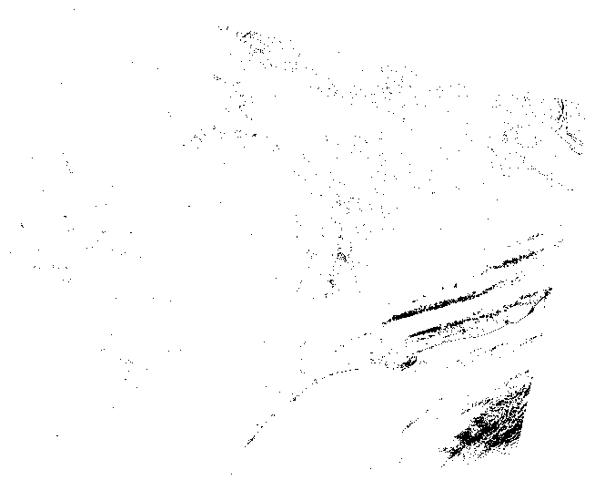
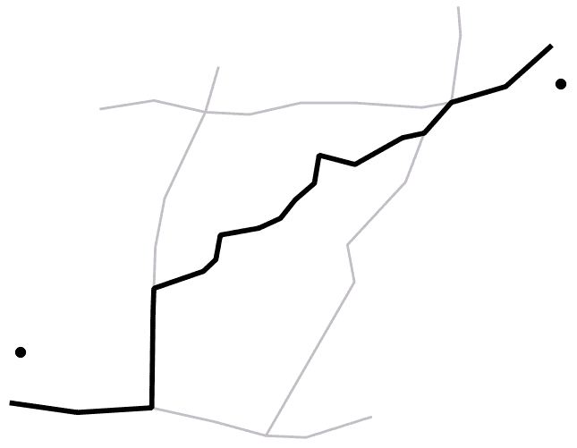

# 第八章：高级地理空间 Python 建模

在本章中，我们将基于我们已经学习的数据处理概念来创建一些全规模的信息产品。之前介绍的数据处理方法很少能单独提供答案。您将这些数据处理方法结合起来，从多个处理后的数据集中构建一个地理空间模型。地理空间模型是现实世界某个方面的简化表示，有助于我们回答一个或多个关于项目或问题的疑问。在本章中，我们将介绍一些在农业、应急管理、物流和其他行业中常用的重要地理空间算法。

我们将创建以下产品：

+   作物健康图

+   洪水淹没模型

+   彩色等高线

+   地形路由图

+   街道路由图

+   包含地理定位照片的 shapefile

虽然这些产品是针对特定任务的，但用于创建它们的算法在地理空间分析中得到了广泛应用。在本章中，我们将涵盖以下主题：

+   创建归一化植被指数（NVDI）

+   创建洪水淹没模型

+   创建彩色等高线

+   执行最低成本路径分析

+   将路线转换为 shapefile

+   沿街道路由

+   地理定位照片

+   计算卫星图像云覆盖率

本章中的示例比前几章更长、更复杂。因此，有更多的代码注释来使程序更容易理解。我们还将在这些建议中使用更多函数。在前几章中，为了清晰起见，通常避免使用函数，但这些示例足够复杂，某些函数可以使代码更容易阅读。这些示例是您作为地理空间分析师在工作中会使用的实际过程。

# 技术要求

对于本章，需要满足以下要求：

+   **版本**：Python 3.6 或更高版本

+   **RAM**：最小 6 GB（Windows），8 GB（macOS）；推荐 8 GB

+   **存储**：最小 7200 RPM SATA，可用空间 20 GB，推荐使用具有 40 GB 可用空间的 SSD。

+   **处理器**：最小 Intel Core i3 2.5 GHz，推荐 Intel Core i5。

# 创建归一化植被指数

我们的第一个示例将是一个**归一化植被指数**（**NVDI**）。NDVIs 用于显示感兴趣区域内植物的相对健康状况。NDVI 算法使用卫星或航空影像通过突出植物中的叶绿素密度来显示相对健康状况。NDVIs 仅使用红色和近红外波段。NDVI 的公式如下：

```py
NDVI = (Infrared – Red) / (Infrared + Red)
```

本分析的目标是首先生成一个包含红外和红波段的彩色图像，最终使用七个类别生成伪彩色图像，这些类别将健康的植物着色为深绿色，不太健康的植物着色为浅绿色，裸土为棕色。

由于健康指数是相对的，因此定位感兴趣区域非常重要。您可以对整个地球进行相对指数计算，但像撒哈拉沙漠这样的低植被极端地区和像亚马逊雨林这样的密集森林地区会扭曲中等植被范围的结果。然而，尽管如此，气候科学家通常会创建全球 NDVI 来研究全球趋势。尽管如此，最常见的应用是针对管理区域，例如森林或农田，就像这个例子一样。

我们将从密西西比三角洲的一个单一农田的分析开始。为此，我们将从一个相当大的区域的多光谱图像开始，并使用 shapefile 来隔离单个农田。以下截图中的图像是我们的大区域，感兴趣的区域用黄色突出显示：



您可以从[`git.io/v3fS9`](http://git.io/v3fS9)下载此图像和农田的 shapefile 作为 ZIP 文件。

在这个例子中，我们将使用 GDAL、OGR、`gdal_array`/`numpy`和**Python 图像库**（**PIL**）来裁剪和处理数据。在本章的其他示例中，我们只需使用简单的 ASCII 网格和 NumPy。由于我们将使用 ASCII 高程网格，因此不需要 GDAL。在所有示例中，脚本都遵循以下约定：

+   导入库。

+   定义函数。

+   定义全局变量，例如文件名。

+   执行分析。

+   保存输出。

我们对作物健康示例的方法分为两个脚本。第一个脚本创建索引图像，这是一个灰度图像。第二个脚本对索引进行分类并输出彩色图像。在这个第一个脚本中，我们将执行以下步骤来创建索引图像：

1.  读取红外波段。

1.  读取农田边界 shapefile。

1.  将 shapefile 栅格化成图像。

1.  将形状文件图像转换为 NumPy 数组。

1.  使用 NumPy 数组将红波段裁剪到农田。

1.  对红外波段也执行相同的操作。

1.  使用波段数组在 NumPy 中执行 NDVI 算法。

1.  使用`gdal_array`将结果索引算法保存到 GeoTIFF 文件中。

我们将分节讨论此脚本，以便更容易理解。代码注释也会告诉你每一步正在发生什么。

# 设置框架

设置框架将帮助我们导入所需的模块，并设置我们将用于先前指令步骤 1 到 5 的函数。`imageToArray()`函数将 PIL 图像转换为 NumPy 数组，并依赖于`gdal_array`和 PIL 模块。`world2Pixel()`函数将地理坐标转换为目标图像的像素坐标。此函数使用`gdal`模块提供的地理参考信息。`copy_geo()`函数将源图像的地理参考信息复制到目标数组，但考虑到我们在裁剪图像时创建的偏移。这些函数相当通用，可以在各种不同的遥感过程中发挥作用，而不仅仅是本例：

1.  首先，我们导入我们的库：

```py
import gdal
from osgeo import gdal
from osgeo import gdal_array
from osgeo import ogr
try:
 import Image
 import ImageDraw
except ImportError:
 from PIL import Image, ImageDraw
```

1.  然后，我们需要一个函数将图像转换为`numpy`数组：

```py
def imageToArray(i):
    """
    Converts a Python Imaging Library
    array to a gdal_array image.
    """
    a = gdal_array.numpy.fromstring(i.tobytes(), 'b')
    a.shape = i.im.size[1], i.im.size[0]
    return a
```

1.  现在，我们将设置一个函数来将坐标转换为图像像素：

```py
def world2Pixel(geoMatrix, x, y):
 """
 Uses a gdal geomatrix (gdal.GetGeoTransform())
 to calculate the pixel location of a
 geospatial coordinate
 """
 ulX = geoMatrix[0]
 ulY = geoMatrix[3]
 xDist = geoMatrix[1]
 yDist = geoMatrix[5]
 rtnX = geoMatrix[2]
 rtnY = geoMatrix[4]
 pixel = int((x - ulX) / xDist)
 line = int((ulY - y) / abs(yDist))
 return (pixel, line)
```

1.  最后，我们将创建一个函数来复制图像的地理元数据：

```py
def copy_geo(array, prototype=None, xoffset=0, yoffset=0):
 """Copy geotransfrom from prototype dataset to array but account
 for x, y offset of clipped array."""
 ds = gdal_array.OpenArray(array)
 prototype = gdal.Open(prototype)
 gdal_array.CopyDatasetInfo(prototype, ds,
 xoff=xoffset, yoff=yoffset)
 return ds
```

下一步是加载数据，我们将在下一节中检查。

# 加载数据

在本节中，我们使用`gdal_array`加载农田的源图像，将其直接转换为 NumPy 数组。我们还定义了输出图像的名称，它将是`ndvi.tif`。本节中一个有趣的部分是，我们使用`gdal`模块而不是`gdal_array`再次加载源图像。

第二次调用是为了捕获通过`gdal`而不是`gdal_array`提供的图像的地理参考数据。幸运的是，`gdal`仅在需要时加载栅格数据，因此这种方法避免了将整个数据集两次加载到内存中。一旦我们有了多维 NumPy 数组的数据，我们就将红色和红外波段分离出来，因为它们都将用于 NDVI 方程：

```py
# Multispectral image used
# to create the NDVI. Must
# have red and infrared
# bands
source = "farm.tif"

# Output geotiff file name
target = "ndvi.tif"

# Load the source data as a gdal_array array
srcArray = gdal_array.LoadFile(source)

# Also load as a gdal image to
# get geotransform info
srcImage = gdal.Open(source)
geoTrans = srcImage.GetGeoTransform()

# Red and infrared (or near infrared) bands
r = srcArray[1]
ir = srcArray[2]
```

现在我们已经加载了数据，我们可以将我们的 shapefile 转换为栅格数据。

# 将 shapefile 栅格化

本节开始裁剪的过程。然而，第一步是将我们打算分析的特定区域的边界 shapefile 栅格化。该区域位于更大的`field.tif`卫星图像内。换句话说，我们将它从矢量数据转换为栅格数据。但我们还希望在转换时填充多边形，以便它可以作为图像掩码使用。掩码中的像素将与红色和红外数组中的像素相关联。

任何在掩码之外的像素将被转换为`NODATA`像素，这样它们就不会作为 NDVI 的一部分进行处理。为了进行这种相关性，我们需要将实心多边形转换为 NumPy 数组，就像栅格波段一样。这种方法将确保我们的 NDVI 计算仅限于农田。

将 shapefile 多边形转换为填充多边形作为 NumPy 数组的简单方法是将它作为 PIL 图像中的多边形绘制出来，填充该多边形，然后使用 PIL 和 NumPy 中现有的方法将其转换为 NumPy 数组，这些方法允许进行该转换。

在这个例子中，我们使用`ogr`模块来读取 shapefile，因为我们已经有了 GDAL。但，我们也可以同样容易地使用 PyShp 来读取 shapefile。如果我们的农田图像可用作 ASCII 网格，我们可以完全避免使用`gdal`、`gdal_array`和`ogr`模块：

1.  首先，我们打开我们的 shapefile 并选择唯一的图层：

```py
# Clip a field out of the bands using a
# field boundary shapefile

# Create an OGR layer from a Field boundary shapefile
field = ogr.Open("field.shp")
# Must define a "layer" to keep OGR happy
lyr = field.GetLayer("field")
```

1.  只有一个多边形，所以我们将获取该特征：

```py
# Only one polygon in this shapefile
poly = lyr.GetNextFeature()
```

1.  现在我们将图层范围转换为图像像素坐标：

```py
# Convert the layer extent to image pixel coordinates
minX, maxX, minY, maxY = lyr.GetExtent()
ulX, ulY = world2Pixel(geoTrans, minX, maxY)
lrX, lrY = world2Pixel(geoTrans, maxX, minY)
```

1.  然后，我们计算新图像的像素大小：

```py
# Calculate the pixel size of the new image
pxWidth = int(lrX - ulX)
pxHeight = int(lrY - ulY)
```

1.  接下来，我们创建一个正确大小的空白图像：

```py
# Create a blank image of the correct size
# that will serve as our mask
clipped = gdal_array.numpy.zeros((3, pxHeight, pxWidth),
 gdal_array.numpy.uint8)
```

1.  现在，我们准备好使用边界框裁剪红光和红外波段：

```py
# Clip red and infrared to new bounds.
rClip = r[ulY:lrY, ulX:lrX]
irClip = ir[ulY:lrY, ulX:lrX]
```

1.  接下来，我们为图像创建地理参考信息：

```py
# Create a new geomatrix for the image
geoTrans = list(geoTrans)
geoTrans[0] = minX
geoTrans[3] = maxY
```

1.  然后，我们可以准备将点映射到像素以创建我们的掩码图像：

```py
# Map points to pixels for drawing
# the field boundary on a blank
# 8-bit, black and white, mask image.
points = []
pixels = []
# Grab the polygon geometry
geom = poly.GetGeometryRef()
pts = geom.GetGeometryRef(0)
```

1.  我们遍历所有点特征并存储它们的*x*和*y*值：

```py
# Loop through geometry and turn
# the points into an easy-to-manage
# Python list
for p in range(pts.GetPointCount()):
    points.append((pts.GetX(p), pts.GetY(p)))
```

1.  现在，我们将点转换为像素位置：

```py
# Loop through the points and map to pixels.
# Append the pixels to a pixel list
for p in points:
    pixels.append(world2Pixel(geoTrans, p[0], p[1]))
```

1.  接下来，我们创建一个新的图像，该图像将作为我们的掩码图像：

```py
# Create the raster polygon image as a black and white 'L' mode
# and filled as white. White=1
rasterPoly = Image.new("L", (pxWidth, pxHeight), 1)
```

1.  现在我们可以将我们的多边形栅格化：

```py
# Create a PIL drawing object
rasterize = ImageDraw.Draw(rasterPoly)

# Dump the pixels to the image
# as a polygon. Black=0
rasterize.polygon(pixels, 0)
```

1.  最后，我们可以将我们的掩码转换为`numpy`数组：

```py
# Hand the image back to gdal/gdal_array
# so we can use it as an array mask
mask = imageToArray(rasterPoly)
```

现在我们已经将 shapefile 转换为掩码图像，我们可以裁剪波段。

# 裁剪波段

现在我们有了我们的图像掩码，我们可以将红光和红外波段裁剪到掩码的边界。为此过程，我们使用 NumPy 的`choose()`方法，该方法将掩码单元格与栅格波段单元格相关联并返回该值，或返回`0`。结果是一个新的数组，裁剪到掩码，但带有来自栅格波段的关联值：

```py
# Clip the red band using the mask
rClip = gdal_array.numpy.choose(mask,
 (rClip, 0)).astype(gdal_array.numpy.uint8)

# Clip the infrared band using the mask
irClip = gdal_array.numpy.choose(mask,
 (irClip, 0)).astype(gdal_array.numpy.uint8)
```

现在我们只得到了我们想要的数据，因此我们可以应用我们的 NDVI 相对植被健康公式。

# 使用 NDVI 公式

我们创建 NDVI 的最终过程是执行方程式*红外 - 红光/红外 + 红光*。我们执行的第一步是消除 NumPy 中可能发生的任何**非数字**（NaN）值，也称为**NaN**。在我们保存输出之前，我们将任何 NaN 值转换为`0`。我们将输出保存为`ndvi.tif`，这将是下一个脚本的输入，以便对 NDVI 进行分类和着色如下：

1.  首先，我们将忽略来自`numpy`的任何警告，因为我们将在边缘附近遇到一些错误：

```py
# We don't care about numpy warnings
# due to NaN values from clipping
gdal_array.numpy.seterr(all="ignore")
```

1.  现在，我们可以执行我们的 NDVI 公式：

```py
# NDVI equation: (infrared - red) / (infrared + red)
# *1.0 converts values to floats,
# +1.0 prevents ZeroDivisionErrors
ndvi = 1.0 * ((irClip - rClip) / (irClip + rClip + 1.0))
```

1.  如果有任何 NaN 值，我们将它们转换为零：

```py
# Convert any NaN values to 0 from the final product
ndvi = gdal_array.numpy.nan_to_num(ndvi)
```

1.  最后，我们保存我们的完成 NDVI 图像：

```py
# Save the ndvi as a GeoTIFF and copy/adjust 
# the georeferencing info
gtiff = gdal.GetDriverByName( 'GTiff' )
gtiff.CreateCopy(target, copy_geo(ndvi, prototype=source, xoffset=ulX, yoffset=ulY))
gtiff = None
```

以下图是本例的输出。您需要使用地理空间查看器（如 QGIS 或 OpenEV）查看它。在大多数图像编辑器中无法打开该图像。灰色越浅，该字段内的植物越健康：


现在我们知道了如何使用 NDVI 公式，让我们看看如何对其进行分类。

# 分类 NDVI

我们现在有一个有效的索引，但它不容易理解，因为它是一个灰度图像。如果我们以直观的方式给图像上色，那么即使是孩子也能识别出更健康的植物。在下一节 *额外函数* 中，我们读取这个灰度索引，并使用七个类别将其从棕色分类到深绿色。分类和图像处理例程，如直方图和拉伸函数，几乎与我们在第六章 *Python 和遥感* 中 *创建直方图* 部分使用的相同，但这次我们以更具体的方式应用它们。

这个示例的输出将是一个 GeoTIFF 文件，但这次它将是一个彩色 RGB 图像。

# 额外函数

我们不需要之前 NDVI 脚本中的任何函数，但我们需要添加一个用于创建和拉伸直方图的函数。这两个函数都使用 NumPy 数组。在这个脚本中，我们将 `gdal_array` 的引用缩短为 `gd`，因为它是一个长名称，并且我们需要在整个脚本中使用它。

让我们看看以下步骤：

1.  首先，我们导入我们需要的库：

```py
import gdal_array as gd
import operator
from functools import reduce
```

1.  接下来，我们需要创建一个 `histogram` 函数，我们将需要它来进行直方图拉伸：

```py
def histogram(a, bins=list(range(256))):
 """
 Histogram function for multi-dimensional array.
 a = array
 bins = range of numbers to match
 """
 # Flatten, sort, then split our arrays for the histogram.
 fa = a.flat
 n = gd.numpy.searchsorted(gd.numpy.sort(fa), bins)
 n = gd.numpy.concatenate([n, [len(fa)]])
 hist = n[1:]-n[:-1]
 return hist
```

1.  现在，我们创建我们的直方图 `stretch` 函数：

```py
def stretch(a):
 """
 Performs a histogram stretch on a gdal_array array image.
 """
 hist = histogram(a)
 lut = []
 for b in range(0, len(hist), 256):
 # step size – create equal interval bins.
 step = reduce(operator.add, hist[b:b+256]) / 255
 # create equalization lookup table
 n = 0
 for i in range(256):
 lut.append(n / step)
 n = n + hist[i+b]
 gd.numpy.take(lut, a, out=a)
 return a
```

现在我们有了我们的实用函数，我们可以处理 NDVI。

# 加载 NDVI

接下来，我们将 NDVI 脚本的输出重新加载到 NumPy 数组中。我们还将定义我们的输出图像名称为 `ndvi_color.tif`，并创建一个零填充的多维数组作为彩色 NDVI 图像的红、绿、蓝波段的占位符。以下代码将加载 NDVI TIFF 图像到 `numpy` 数组中：

```py
# NDVI output from ndvi script
source = "ndvi.tif"

# Target file name for classified
# image image
target = "ndvi_color.tif"

# Load the image into an array
ndvi = gd.LoadFile(source).astype(gd.numpy.uint8)
```

现在我们已经将图像作为数组加载，我们可以拉伸它。

# 准备 NDVI

我们需要对 NDVI 执行直方图拉伸，以确保图像覆盖了将赋予最终产品意义的类范围：

```py
# Peform a histogram stretch so we are able to
# use all of the classes
ndvi = stretch(ndvi)

# Create a blank 3-band image the same size as the ndvi
rgb = gd.numpy.zeros((3, len(ndvi), len(ndvi[0])), gd.numpy.uint8)
```

现在我们已经拉伸了图像，我们可以开始分类过程。

# 创建类别

在这部分，我们为 NDVI 类设置范围，这些范围从 0 到 255。我们将使用七个类别。你可以通过向类别列表中添加或删除值来更改类别的数量。接下来，我们创建一个 **查找表**，或 **LUT**，以为每个类别分配颜色。颜色的数量必须与类别的数量相匹配。

颜色定义为 RGB 值。`start` 变量定义了第一个类的开始。在这种情况下，`0` 是一个 nodata 值，我们在之前的脚本中指定了它，因此我们从 `1` 开始分类。然后我们遍历类，提取范围，并使用颜色分配将 RGB 值添加到我们的占位符数组中。最后，我们将着色图像保存为 GeoTIFF 文件：

```py
# Class list with ndvi upper range values.
# Note the lower and upper values are listed on the ends
classes = [58, 73, 110, 147, 184, 220, 255]

# Color look-up table (lut)
# The lut must match the number of classes
# Specified as R, G, B tuples from dark brown to dark green
lut = [[120, 69, 25], [255, 178, 74], [255, 237, 166], [173, 232, 94],
 [135, 181, 64], [3, 156, 0], [1, 100, 0]]

# Starting value of the first class
start = 1
```

现在我们可以对图像进行分类：

```py
# For each class value range, grab values within range,
# then filter values through the mask.
for i in range(len(classes)):
 mask = gd.numpy.logical_and(start <= ndvi,
 ndvi <= classes[i])
 for j in range(len(lut[i])):
     rgb[j] = gd.numpy.choose(mask, (rgb[j], lut[i][j]))
     start = classes[i]+1
```

最后，我们可以保存我们的分类 GeoTIFF 文件：

```py
# Save a geotiff image of the colorized ndvi.
output=gd.SaveArray(rgb, target, format="GTiff", prototype=source)
output = None
```

这里是我们输出的图像：



这是本例的最终产品。农民可以使用这些数据来确定如何有效地灌溉和喷洒化学物质，如肥料和杀虫剂，以更精准、更有效、更环保的方式进行。实际上，这些类别甚至可以被转换成矢量 shapefile，然后加载到田间喷雾器的 GPS 驱动计算机上。这样，当喷雾器在田间移动时，或者在某些情况下，甚至可以携带喷雾附件的飞机在田间上空飞行，都会自动在正确的位置喷洒正确的化学物质数量。

注意，尽管我们已经将数据裁剪到田地中，但图像仍然是正方形。黑色区域是已转换为黑色的 nodata 值。在显示软件中，您可以设置 nodata 颜色为透明，而不会影响图像的其余部分。

尽管我们创建了一个非常具体的产品，即分类 NDVI，但这个脚本的框架可以被修改以实现许多遥感分析算法。有不同类型的 NDVI，但通过相对较小的修改，您可以将这个脚本变成一个工具，用于寻找海洋中的有害藻华，或者在森林中间的烟雾，这表明森林火灾。

本书试图尽可能减少 GDAL 的使用，以便专注于仅使用纯 Python 和可以从 PyPI 轻松安装的工具所能完成的工作。然而，记住关于使用 GDAL 及其相关实用程序执行类似任务的信息量很大。有关通过 GDAL 的命令行实用程序裁剪栅格的另一个教程，请参阅[`joeyklee.github.io/broc-cli-geo/guide/XX_raster_cropping_and_clipping.html`](https://joeyklee.github.io/broc-cli-geo/guide/XX_raster_cropping_and_clipping.html)。

现在我们已经处理了陆地，让我们处理水，以创建洪水淹没模型。

# 创建洪水淹没模型

在下一个例子中，我们将开始进入水文的世界。洪水是常见且破坏性极强的自然灾害之一，几乎影响着全球的每一个人口。地理空间模型是估计洪水影响并在发生前减轻这种影响的有力工具。我们经常在新闻中听到河流正在达到洪水位，但如果我们不能理解其影响，那么这些信息就是无意义的。

水文洪水模型开发成本高昂，可能非常复杂。这些模型对于工程师在建设防洪系统时至关重要。然而，第一响应者和潜在的洪水受害者只对即将发生的洪水的影响感兴趣。

我们可以使用一个非常简单且易于理解的工具来了解一个区域的洪水影响，这个工具被称为**洪水淹没模型**。该模型从一个单点开始，以洪水盆地在该特定洪水阶段可以容纳的最大水量来淹没一个区域。通常，这种分析是一个最坏情况。数百个其他因素都会影响到计算从河流顶部的洪水阶段进入盆地的水量。但我们仍然可以从这个简单的第一阶模型中学到很多东西。

如同在第一章的*高程数据*部分所述，*使用 Python 学习地理空间分析*，**航天飞机雷达地形任务**（**SRTM**）数据集提供了一个几乎全球性的 DEM，你可以用于这些类型的模型。有关 SRTM 数据的更多信息，请参阅[`www2.jpl.nasa.gov/srtm/`](http://www2.jpl.nasa.gov/srtm/)。

您可以从[`git.io/v3fSg`](http://git.io/v3fSg)下载 EPSG:4326 的 ASCII 网格数据，以及包含点作为`.zip`文件的 shapefile。这个 shapefile 仅作参考，在此模型中没有任何作用。以下图像是一个**数字高程模型**（**DEM**），其中源点以黄色星号显示在德克萨斯州休斯顿附近。在现实世界的分析中，这个点可能是一个流量计，你将会有关于河流水位的资料：



我们在本例中介绍的这个算法被称为**洪水填充算法**。这个算法在计算机科学领域是众所周知的，并被用于经典的电脑游戏**扫雷**中，当用户点击一个方块时，用于清除板上的空方块。它也是图形程序（如**Adobe Photoshop**）中众所周知的**油漆桶工具**所使用的方法，用于用不同颜色填充相邻像素的同一区域。

实现此算法的方法有很多。其中最古老且最常见的方法是递归地遍历图像中的每个像素。递归的问题在于你最终会多次处理像素，并创建不必要的额外工作。递归洪水填充的资源使用量很容易在即使是中等大小的图像上使程序崩溃。

此脚本使用基于四向队列的洪水填充，可能会多次访问一个单元格，但确保我们只处理一个单元格一次。队列仅通过使用 Python 内置的集合类型来包含唯一的未处理单元格，该类型只持有唯一值。我们使用两个集合：**fill**，包含我们需要填充的单元格，和**filled**，包含已处理的单元格。

此示例执行以下步骤：

1.  从 ASCII DEM 中提取标题信息。

1.  将 DEM 作为`numpy`数组打开。

1.  将我们的起点定义为数组中的行和列。

1.  声明洪水高程值。

1.  仅过滤地形到所需的 elevations 值及其以下。

1.  处理过滤后的数组。

1.  创建一个 1, 0, 0 数组（即二进制数组），其中淹没的像素为 1。

1.  将洪水淹没数组保存为 ASCII 网格。

这个例子在较慢的机器上可能需要一两分钟才能运行；我们将在整个脚本中使用`print`语句作为跟踪进度的简单方法。我们再次将此脚本分解为解释，以便清晰。

现在我们有了数据，我们可以开始我们的洪水填充函数。

# 洪水填充函数

在这个例子中，我们使用 ASCII 网格，这意味着这个模型的引擎完全在 NumPy 中。我们首先定义`floodFill()`函数，这是这个模型的核心和灵魂。这篇维基百科关于洪水填充算法的文章提供了不同方法的优秀概述：[`en.wikipedia.org/wiki/Flood_fill`](http://en.wikipedia.org/wiki/Flood_fill)。

洪水填充算法从一个给定的单元格开始，开始检查相邻单元格的相似性。相似性因素可能是颜色，或者在我们的情况下是海拔。如果相邻单元格的海拔与当前单元格相同或更低，则该单元格被标记为检查其邻居，直到整个网格被检查。NumPy 不是设计用来以这种方式遍历数组的，但它总体上在处理多维数组方面仍然很高效。我们逐个单元格地通过并检查其北、南、东和西的邻居。任何可以淹没的单元格都被添加到填充集合中，它们的邻居也被添加到填充集合中以供算法检查。

如前所述，如果您尝试将相同的值添加到集合中两次，它将忽略重复条目并保持唯一的列表。通过在数组中使用集合，我们有效地检查单元格一次，因为填充集合包含唯一的单元格。以下代码实现了我们的`floodFill`函数：

1.  首先，我们导入我们的库：

```py
import numpy as np
from linecache import getline
```

1.  接下来，我们创建我们的`floodFill`函数：

```py
def floodFill(c, r, mask):
 """
 Crawls a mask array containing
 only 1 and 0 values from the
 starting point (c=column,
 r=row - a.k.a. x, y) and returns
 an array with all 1 values
 connected to the starting cell.
 This algorithm performs a 4-way
 check non-recursively.
 """
```

1.  接下来，我们创建集合来跟踪我们已经覆盖的单元格：

```py
 # cells already filled
 filled = set()
 # cells to fill
 fill = set()
 fill.add((c, r))
 width = mask.shape[1]-1
 height = mask.shape[0]-1
```

1.  然后我们创建我们的淹没数组：

```py
 # Our output inundation array
 flood = np.zeros_like(mask, dtype=np.int8)
```

1.  现在我们可以遍历单元格并填充它们，或者不填充：

```py
 # Loop through and modify the cells which
 # need to be checked.
 while fill:
   # Grab a cell
   x, y = fill.pop()
```

1.  如果土地高于洪水水位，则跳过它：

```py
   if y == height or x == width or x < 0 or y < 0:
    # Don't fill
    continue
```

1.  如果土地海拔等于或低于洪水水位，则填充它：

```py
   if mask[y][x] == 1:
    # Do fill
    flood[y][x] = 1
   filled.add((x, y))
```

1.  现在，我们检查周围的相邻单元格以查看它们是否需要填充，当我们用完单元格时，我们返回填充的矩阵：

```py
   # Check neighbors for 1 values
   west = (x-1, y)
   east = (x+1, y)
   north = (x, y-1)
   south = (x, y+1)
   if west not in filled:
     fill.add(west)
   if east not in filled:
     fill.add(east)
   if north not in filled:
     fill.add(north)
   if south not in filled:
     fill.add(south)
 return flood
```

现在我们已经设置了`floodFill`函数，我们可以创建一个洪水。

# 预测洪水淹没

在脚本剩余部分，我们从 ASCII 网格加载我们的地形数据，定义我们的输出网格文件名，并在地形数据上执行算法。洪水填充算法的种子是一个任意点，即`sx`和`sy`位于低海拔区域。在实际应用中，这些点可能是一个已知位置，例如河流流量计或大坝的裂缝。在最后一步，我们保存输出网格。

需要执行以下步骤：

1.  首先，我们设置我们的`source`和`target`数据名称：

```py
source = "terrain.asc"
target = "flood.asc"
```

1.  接下来，我们打开源：

```py
print("Opening image...")
img = np.loadtxt(source, skiprows=6)
print("Image opened")
```

1.  我们将创建一个低于`70`米的掩码数组：

```py
# Mask elevations lower than 70 meters.
wet = np.where(img < 70, 1, 0)
print("Image masked")
```

1.  现在，我们将解析标题中的地理空间信息：

```py
# Parse the header using a loop and
# the built-in linecache module
hdr = [getline(source, i) for i in range(1, 7)]
values = [float(h.split(" ")[-1].strip()) for h in hdr]
cols, rows, lx, ly, cell, nd = values
xres = cell
yres = cell * -1
```

1.  现在，我们将建立一个位于河床中的起点：

```py
# Starting point for the
# flood inundation in pixel coordinates
sx = 2582
sy = 2057
```

1.  现在，我们触发我们的`floodFill`函数：

```py
print("Beginning flood fill")
fld = floodFill(sx, sy, wet)
print("Finished flood fill")

header = ""
for i in range(6):
 header += hdr[i]
```

1.  最后，我们可以保存我们的洪水淹没模型输出：

```py
print("Saving grid")
# Open the output file, add the hdr, save the array
with open(target, "wb") as f:
 f.write(bytes(header, 'UTF-8'))
 np.savetxt(f, fld, fmt="%1i")
print("Done!")
```

下面的截图显示了在分类版本的 DEM 上洪水淹没的输出，低海拔值用棕色表示，中值用绿色表示，高值用灰色和白色表示：



包含所有低于 70 米区域的洪水栅格用蓝色表示。这张图片是用 QGIS 创建的，但它也可以在 ArcGIS 中以 EPSG:4326 格式显示。您也可以使用 GDAL 将洪水栅格网格保存为 8 位 TIFF 文件或 JPEG 文件，就像 NDVI 示例一样，以便在标准图形程序中查看。

下面的截图中的图像几乎相同，只是显示黄色的是从过滤掩码中导出的淹没，这是通过为数组生成一个名为`wet`的文件来完成的，而不是`fld`，以显示非连续区域，这些区域不是洪水的一部分。这些区域与源点不相连，因此在洪水事件中不太可能被触及：



通过改变海拔值，您可以创建额外的洪水淹没栅格。我们从一个 70 米的海拔值开始。如果我们将其值增加到 90，我们可以扩大洪水范围。下面的截图显示了 70 米和 90 米处的洪水事件：



90 米淹没区域是较浅的蓝色多边形。您可以采取更大或更小的步骤，以不同的图层显示不同的影响。

这个模型是一个优秀且有用的可视化工具。然而，您可以通过使用 GDAL 的`polygonize()`方法对洪水掩膜进行分析，进一步扩展这个分析，正如我们在第六章的“从图像中提取特征”部分所做的那样，*Python 和遥感*。这个操作将为您提供矢量洪水多边形。然后，您可以使用我们在第五章的“执行选择”部分讨论的原则，*Python 和地理信息系统*，使用多边形选择建筑物以确定人口影响。您还可以将洪水多边形与第五章的“点密度计算”部分中的点密度示例结合起来，以评估洪水潜在的人口影响。可能性是无限的。

# 创建一个彩色阴影图

在这个例子中，我们将结合之前的技术，将我们从第七章，“Python 和高程数据”中提取的地形阴影与我们在 LIDAR 上使用的颜色分类结合起来。对于这个例子，我们需要之前章节中使用的名为`dem.asc`和`relief.asc`的 ASCII 网格 DEM。

我们将创建一个彩色 DEM 和一个阴影，然后使用 PIL 将它们混合在一起以增强高程可视化。代码注释将引导你通过这个例子，因为许多这些步骤你已经很熟悉了：

1.  首先，我们导入所需的库：

```py
import gdal_array as gd
try:
 import Image
except ImportError:
 from PIL import Image
```

对于下一部分，你需要以下两个文件：[`github.com/GeospatialPython/Learn/raw/master/relief.zip`](https://github.com/GeospatialPython/Learn/raw/master/relief.zip) 和 [`github.com/GeospatialPython/Learn/raw/master/dem.zip`](https://github.com/GeospatialPython/Learn/raw/master/dem.zip)。

1.  然后，我们将设置输入和输出的变量：

```py
relief = "relief.asc"
dem = "dem.asc"
target = "hillshade.tif"
```

1.  接下来，我们将加载我们的`relief`图像：

```py
# Load the relief as the background image
bg = gd.numpy.loadtxt(relief, skiprows=6)
```

1.  然后，我们将加载 DEM 图像，这样我们就会有高程数据：

```py
# Load the DEM into a numpy array as the foreground image
fg = gd.numpy.loadtxt(dem, skiprows=6)[:-2, :-2]
```

1.  现在，我们将创建一个新的图像用于我们的彩色化，其中高程断点形成类别，并在 LUT 中对应相应的颜色：

```py
# Create a blank 3-band image to colorize the DEM
rgb = gd.numpy.zeros((3, len(fg), len(fg[0])), gd.numpy.uint8)

# Class list with DEM upper elevation range values.
classes = [356, 649, 942, 1235, 1528,
 1821, 2114, 2300, 2700]

# Color look-up table (lut)
# The lut must match the number of classes.
# Specified as R, G, B tuples
lut = [[63, 159, 152], [96, 235, 155], [100, 246, 174],
 [248, 251, 155], [246, 190, 39], [242, 155, 39],
 [165, 84, 26], [236, 119, 83], [203, 203, 203]]

# Starting elevation value of the first class
start = 1
```

1.  我们现在可以进行我们的颜色分类：

```py
# Process all classes.
for i in range(len(classes)):
 mask = gd.numpy.logical_and(start <= fg,
 fg <= classes[i])
 for j in range(len(lut[i])):
 rgb[j] = gd.numpy.choose(mask, (rgb[j], lut[i][j]))
 start = classes[i]+1
```

1.  然后，我们可以将我们的阴影高程数组转换为图像，以及我们的彩色 DEM：

```py
# Convert the shaded relief to a PIL image
im1 = Image.fromarray(bg).convert('RGB')

# Convert the colorized DEM to a PIL image.
# We must transpose it from the Numpy row, col order
# to the PIL col, row order (width, height).
im2 = Image.fromarray(rgb.transpose(1, 2, 0)).convert('RGB')
```

1.  现在，我们将混合两个图像以产生最终效果，并将其保存为图像文件：

```py
# Blend the two images with a 40% alpha
hillshade = Image.blend(im1, im2, .4)

# Save the hillshade
hillshade.save(target)
```

下面的图像显示了输出，它非常适合作为 GIS 地图的背景：


现在我们能够模拟地形，让我们学习如何在上面导航。

# 执行最小成本路径分析

计算驾驶方向是全球最常用的地理空间功能。通常，这些算法计算点 *A* 和 *B* 之间的最短路径，或者它们可能会考虑道路的速度限制，甚至当前的交通状况，以便通过驾驶时间选择路线。

但如果你的工作是建造一条新的道路？或者如果你负责决定在偏远地区铺设电力传输线或水管的位置？在地形环境中，最短路径可能会穿过一个困难的山脉，或者穿过一个湖泊。在这种情况下，我们需要考虑障碍物，并在可能的情况下避开它们。然而，如果避开一个小障碍物让我们偏离得太远，实施该路线的成本可能比翻越山脉还要高。

这种类型的高级分析称为**最低成本路径分析**。我们在区域内搜索最佳折衷路线，该路线是距离与跟随该路线的成本的最佳平衡。我们用于此过程的算法称为**A 星或 A***算法。最古老的路线方法是**Dijkstra 算法**，它计算网络中的最短路径，例如道路网络。A*方法也可以做到这一点，但它更适合穿越类似网格的 DEM。

您可以在以下网页上了解更多关于这些算法的信息：

+   Dijkstra 算法：[`en.wikipedia.org/wiki/Dijkstra's_algorithm`](http://en.wikipedia.org/wiki/Dijkstra's_algorithm)。

+   A*算法：[`en.wikipedia.org/wiki/A-star_algorithm`](http://en.wikipedia.org/wiki/A-star_algorithm)。

这个例子是本章中最复杂的。为了更好地理解它，我们有一个简单的程序版本，它是基于文本的，并在一个 5 x 5 的网格上操作，使用随机生成的值。您实际上可以在尝试在具有数千个值的等高线网格上之前看到这个程序如何遵循算法。

此程序执行以下步骤：

1.  创建一个简单的网格，具有介于 1 和 16 之间的随机生成的伪高程值。

1.  在网格的左下角定义一个起始位置。

1.  定义终点为网格的右上角。

1.  创建一个成本网格，包含每个单元格的高程以及单元格到终点的距离。

1.  检查从起始位置开始的每个相邻单元格，并选择成本最低的一个。

1.  使用所选单元格重复评估，直到到达终点。

1.  返回所选单元格的集合作为最低成本路径。

1.  设置测试网格。

您只需从命令行运行此程序并查看其输出。此脚本的第一个部分设置我们的模拟地形网格，作为一个随机生成的 NumPy 数组，具有介于 1 和 16 之间的理论高程值。我们还创建了一个距离网格，该网格计算每个单元格到目标单元格的距离。这个值是每个单元格的成本。

让我们看看以下步骤：

1.  首先，我们将导入`numpy`并设置我们网格的大小：

```py
import numpy as np

# Width and height
# of grids
w = 5
h = 5
```

1.  接下来，我们设置起始位置单元格和结束位置：

```py
# Start location:
# Lower left of grid
start = (h-1, 0)

# End location:
# Top right of grid
dx = w-1
dy = 0
```

1.  现在，我们可以根据我们的宽度和高度创建一个零网格：

```py
# Blank grid
blank = np.zeros((w, h))
```

1.  接下来，我们将设置我们的距离网格，以便创建阻抗值：

```py
# Distance grid
dist = np.zeros(blank.shape, dtype=np.int8)

# Calculate distance for all cells
for y, x in np.ndindex(blank.shape):
 dist[y][x] = abs((dx-x)+(dy-y))
```

1.  现在，我们将打印出我们成本网格中每个单元格的成本值：

```py
# "Terrain" is a random value between 1-16.
# Add to the distance grid to calculate
# The cost of moving to a cell
cost = np.random.randint(1, 16, (w, h)) + dist

print("COST GRID (Value + Distance)\n{}\n".format(cost))
```

现在我们有一个模拟的地形网格可以工作，我们可以测试一个路由算法。

# 简单的 A*算法

这里实现的 A*搜索算法以类似于前一个示例中我们的洪水填充算法的方式遍历网格。再次，我们使用集合来避免使用递归，并避免单元格检查的重复。但这次，我们不是检查高程，而是检查通过问题单元格的路线成本。如果移动增加了到达终点的成本，那么我们就选择成本更低的选项。

需要执行以下步骤：

1.  首先，我们将通过创建跟踪路径进度的集合来开始我们的 A*函数：

```py
# Our A* search algorithm
def astar(start, end, h, g):
    closed_set = set()
    open_set = set()
    path = set()
```

1.  接下来，我们将起始单元格添加到待处理的开放单元格列表中，以便开始循环处理该集合：

```py
    open_set.add(start)
    while open_set:
        cur = open_set.pop()
        if cur == end:
            return path
        closed_set.add(cur)
        path.add(cur)
        options = []
        y1 = cur[0]
        x1 = cur[1]
```

1.  我们检查周围单元格作为前进的选项：

```py
        if y1 > 0:
            options.append((y1-1, x1))
        if y1 < h.shape[0]-1:
            options.append((y1+1, x1))
        if x1 > 0:
            options.append((y1, x1-1))
        if x1 < h.shape[1]-1:
            options.append((y1, x1+1))
        if end in options:
            return path
        best = options[0]
        closed_set.add(options[0])
```

1.  然后，我们将检查每个选项以找到最佳选项，并将其附加到路径上，直到我们到达终点：

```py
        for i in range(1, len(options)):
            option = options[i]
            if option in closed_set:
                continue
            elif h[option] <= h[best]:
                best = option
                closed_set.add(option)
            elif g[option] < g[best]:
                best = option
                closed_set.add(option)
            else:
                closed_set.add(option)
        print(best, ", ", h[best], ", ", g[best])
        open_set.add(best)
    return []
```

现在我们已经设置了算法，我们可以通过创建路径来测试它：

# 生成测试路径

在本节中，我们将在测试网格上生成路径。我们将调用 A*函数，使用起点、终点、成本网格和距离网格：

```py
# Find the path
path = astar(start, (dy, dx), cost, dist)
print()
```

现在，我们将我们的路径放在自己的网格上并打印出来：

```py
# Create and populate the path grid
path_grid = np.zeros(cost.shape, dtype=np.uint8)
for y, x in path:
 path_grid[y][x] = 1
path_grid[dy][dx] = 1

print("PATH GRID: 1=path")
print(path_grid)
```

接下来，我们将查看这个测试的输出。

# 查看测试输出

当你运行这个程序时，你会生成一个类似以下随机编号的网格：

```py
COST GRID (Value + Distance)
[[13 10 5 15 9]
 [15 13 16 5 16]
 [17 8 9 9 17]
 [ 4 1 11 6 12]
 [ 2 7 7 11 8]]

(Y,X), HEURISTIC, DISTANCE
(3, 0) , 4 , 1
(3, 1) , 1 , 0
(2, 1) , 8 , 1
(2, 2) , 9 , 0
(2, 3) , 9 , 1
(1, 3) , 5 , 0
(0, 3) , 15 , 1

PATH GRID: 1=path
[[0 0 0 1 1]
 [0 0 0 1 0]
 [0 1 1 1 0]
 [1 1 0 0 0]
 [1 0 0 0 0]]
```

网格足够小，你可以轻松地手动追踪算法的步骤。这个实现使用的是**曼哈顿距离**，这意味着距离不使用对角线——只有左、右、上、下的测量。搜索也不会对角移动，以保持简单。

# 真实世界的例子

现在我们对 A*算法有了基本的了解，让我们转到更复杂的例子。对于缓解示例，我们将使用与加拿大不列颠哥伦比亚省温哥华附近相同的 DEM，我们在*创建阴影高程*部分第七章中使用了它。这个网格的空间参考是 EPSG:26910 NAD 83/UTM 区域 10N。您可以从[`git.io/v3fpL`](http://git.io/v3fpL)下载 DEM、高程和形状文件的起点和终点作为压缩包。

我们实际上将使用阴影高程进行可视化。在这个练习中，我们的目标是以最低的成本从起点移动到终点：


仅从地形来看，有两条路径遵循低海拔路线，方向变化不大。这两条路径在下面的屏幕截图中有展示：


因此，我们预计当我们使用 A*算法时，它将非常接近。记住，算法只查看直接附近，所以它不能像我们一样查看整个图像，并且它不能根据已知的障碍物在路线早期进行调整。

我们将从简单的示例扩展这个实现，使用欧几里得距离，或者说是“如鸟飞”的测量，我们还将允许搜索在八个方向上而不是四个方向上进行。我们将优先考虑地形作为主要决策点。我们还将使用距离，即到终点和从起点的距离，作为次要优先级，以确保我们朝着目标前进，而不是偏离轨道太远。除了这些差异之外，步骤与简单示例相同。输出将是一个栅格，路径值设为`1`，其他值设为`0`。

现在我们已经理解了问题，让我们来解决这个问题！

# 加载网格

在本节和接下来的几节中，我们将创建一个脚本，该脚本可以创建地面的路线。脚本开始得很简单。我们从 ASCII 网格将网格加载到 NumPy 数组中。我们命名我们的输出路径网格，然后定义起始单元格和结束单元格：

1.  首先，我们导入我们的库：

```py
import numpy as np
import math
from linecache import getline
import pickle
```

1.  接下来，我们将定义我们的输入和输出数据源：

```py
# Our terrain data
source = "dem.asc"

# Output file name for the path raster
target = "path.asc"
```

1.  然后，我们可以加载网格，跳过标题行：

```py
print("Opening %s..." % source)
cost = np.loadtxt(source, skiprows=6)
print("Opened %s." % source)
```

1.  接下来，我们将解析标题以获取地理空间和网格大小信息：

```py
# Parse the header
hdr = [getline(source, i) for i in range(1, 7)]
values = [float(ln.split(" ")[-1].strip()) for ln in hdr]
cols, rows, lx, ly, cell, nd = values
```

1.  最后，我们将定义我们的起始和结束位置：

```py
# Starting column, row
sx = 1006
sy = 954

# Ending column, row
dx = 303
dy = 109
```

现在我们已经加载了网格，我们可以设置所需的函数。

# 定义辅助函数

我们需要三个函数来在地面进行路由。一个是 A*算法，另外两个辅助算法帮助算法选择下一步。我们将简要讨论这些辅助函数。首先，我们有一个简单的欧几里得距离函数，名为`e_dist`，它返回两点之间的直线距离，以地图单位计。接下来，我们有一个重要的函数，称为`weighted_score`，它根据相邻单元格和当前单元格之间的高度变化以及到目的地的距离为相邻单元格评分。

这个函数比单独的距离或海拔更好，因为它减少了两个单元格之间出现平局的可能性，使得避免回溯更容易。这个评分公式松散地基于一个称为**Nisson 评分**的概念，这个概念在类似算法中常用，并在本章前面提到的维基百科文章中有所提及。这个函数的伟大之处在于它可以对相邻单元格进行任何你想要的评分。你也可能使用实时数据来查看相邻单元格的当前天气，并避免有雨或雪的单元格。

以下代码将创建我们的距离函数和权重函数，这些函数是我们穿越地形所需的：

1.  首先，我们将创建一个欧几里得距离函数，它将给出两点之间的距离：

```py
def e_dist(p1, p2):
 """
 Takes two points and returns
 the Euclidian distance
 """
 x1, y1 = p1
 x2, y2 = p2
 distance = math.sqrt((x1-x2)**2+(y1-y2)**2)
 return int(distance)
```

1.  现在，我们将创建我们的权重函数，以便为每个节点的移动适宜性评分：

```py
def weighted_score(cur, node, h, start, end):
 """
 Provides a weighted score by comparing the
 current node with a neighboring node. Loosely
 based on the Nisson Score concept: f=g+h
 In this case, the "h" value, or "heuristic",
 is the elevation value of each node.
 """
```

1.  我们从`score`为`0`开始，检查节点与起点和终点的距离：

```py
 score = 0
 # current node elevation
 cur_h = h[cur]
 # current node distance from end
 cur_g = e_dist(cur, end)
 # current node distance from
 cur_d = e_dist(cur, start)
```

1.  接下来，我们检查相邻的节点并决定移动的方向：

```py
 # neighbor node elevation
 node_h = h[node]
 # neighbor node distance from end
 node_g = e_dist(node, end)
 # neighbor node distance from start
 node_d = e_dist(node, start)
 # Compare values with the highest
 # weight given to terrain followed
 # by progress towards the goal.
 if node_h < cur_h:
 score += cur_h-node_h
 if node_g < cur_g:
 score += 10
 if node_d > cur_d:
 score += 10
 return score
```

现在我们已经完成了辅助函数，我们可以构建 A*函数。

# 实际的 A*算法

这个算法比我们之前示例中的简单版本更复杂。我们使用集合来避免冗余。它还实现了我们更高级的评分算法，并在进行额外计算之前检查我们是否在路径的末端。与我们的上一个示例不同，这个更高级的版本还检查八个方向上的单元格，因此路径可以斜向移动。在这个函数的末尾有一个被注释掉的`print`语句。你可以取消注释它来观察搜索如何在网格中爬行。下面的代码将实现我们将在本节中使用的 A*算法：

1.  首先，我们通过接受起点、终点和分数来打开函数：

```py
def astar(start, end, h):
 """
 A-Star (or A*) search algorithm.
 Moves through nodes in a network
 (or grid), scores each node's
 neighbors, and goes to the node
 with the best score until it finds
 the end. A* is an evolved Dijkstra
 algorithm.
 """
```

1.  现在，我们设置跟踪进度的集合：

```py
 # Closed set of nodes to avoid
 closed_set = set()
 # Open set of nodes to evaluate
 open_set = set()
 # Output set of path nodes
 path = set()
```

1.  接下来，我们开始使用起点进行处理：

```py
 # Add the starting point to
 # to begin processing
 open_set.add(start)
 while open_set:
 # Grab the next node
 cur = open_set.pop()
```

1.  如果我们到达终点，我们返回完成的路径：

```py
 # Return if we're at the end
 if cur == end:
 return path
```

1.  否则，我们继续在网格中工作，消除可能性：

```py
 # Close off this node to future
 # processing
 closed_set.add(cur)
 # The current node is always
 # a path node by definition
 path.add(cur)
```

1.  为了保持进度，我们在进行过程中抓取所有需要处理的邻居：

```py
 # List to hold neighboring
 # nodes for processing
 options = []
 # Grab all of the neighbors
 y1 = cur[0]
 x1 = cur[1]
 if y1 > 0:
 options.append((y1-1, x1))
 if y1 < h.shape[0]-1:
 options.append((y1+1, x1))
 if x1 > 0:
 options.append((y1, x1-1))
 if x1 < h.shape[1]-1:
 options.append((y1, x1+1))
 if x1 > 0 and y1 > 0:
 options.append((y1-1, x1-1))
 if y1 < h.shape[0]-1 and x1 < h.shape[1]-1:
 options.append((y1+1, x1+1))
 if y1 < h.shape[0]-1 and x1 > 0:
 options.append((y1+1, x1-1))
 if y1 > 0 and x1 < h.shape[1]-1:
 options.append((y1-1, x1+1))
```

1.  我们检查每个邻居是否是目的地：

```py
 # If the end is a neighbor, return
 if end in options:
 return path
```

1.  我们将第一个选项作为“最佳”选项，并处理其他选项，在过程中进行升级：

```py
 # Store the best known node
 best = options[0]
 # Begin scoring neighbors
 best_score = weighted_score(cur, best, h, start, end)
 # process the other 7 neighbors
 for i in range(1, len(options)):
 option = options[i]
 # Make sure the node is new
 if option in closed_set:
 continue
 else:
 # Score the option and compare 
 # it to the best known
 option_score = weighted_score(cur, option, 
 h, start, end)
 if option_score > best_score:
 best = option
 best_score = option_score
 else:
 # If the node isn't better seal it off
 closed_set.add(option)
 # Uncomment this print statement to watch
 # the path develop in real time:
 # print(best, e_dist(best, end))
 # Add the best node to the open set
 open_set.add(best)
return []
```

现在我们有了我们的路由算法，我们可以生成实际路径。

# 生成实际路径

最后，我们将实际路径作为一个零网格中的一系列一，这个栅格可以随后被导入到 QGIS 等应用程序中，并在地形网格上可视化。在下面的代码中，我们将使用我们的算法和辅助函数来生成路径，如下所示：

1.  首先，我们将起点、终点以及地形网格发送到路由函数：

```py
print("Searching for path...")
p = astar((sy, sx), (dy, dx), cost)
print("Path found.")
print("Creating path grid...")
path = np.zeros(cost.shape)
print("Plotting path...")
for y, x in p:
 path[y][x] = 1
path[dy][dx] = 1
print("Path plotted.")
```

1.  一旦我们有了路径，我们就可以将其保存为 ASCII 网格：

```py
print("Saving %s..." % target)
header = ""
for i in range(6):
 header += hdr[i]

# Open the output file, add the hdr, save the array
with open(target, "wb") as f:
 f.write(bytes(header, 'UTF-8'))
 np.savetxt(f, path, fmt="%4i")
```

1.  现在，我们想要保存我们的路径数据，因为点按正确的顺序排列，从起点到终点。当我们把它们放入网格中时，我们失去了这个顺序，因为它们都是一个栅格。我们将使用内置的 Python `pickle`模块将列表对象保存到磁盘。我们将在下一节中使用这些数据来创建路线的矢量形状文件。因此，我们将我们的路径数据保存为可重用的 pickle Python 对象，以后无需运行整个程序：

```py
print("Saving path data...")
with open("path.p", "wb") as pathFile:
 pickle.dump(p, pathFile)
print("Done!")
```

这是我们的搜索输出路径：



如您所见，A*搜索非常接近我们手动选择的路线之一。在几个案例中，算法选择解决一些地形，而不是尝试绕过它。有时，轻微的地形被认为比绕行的距离成本低。您可以在路线右上角的放大部分中看到这种选择的例子。红线是我们程序通过地形生成的路线：


我们只使用了两个值：地形和距离。但您也可以添加数百个因素，例如土壤类型、水体和现有道路。所有这些项目都可以作为阻抗或直接的障碍。您只需修改示例中的评分函数，以考虑任何额外的因素。请记住，您添加的因素越多，追踪 A*实现选择路线时的“思考”就越困难。

对于这项分析来说，一个明显的未来方向是创建一个作为线的矢量版本的路线。这个过程包括将每个单元格映射到一个点，然后使用最近邻分析正确排序点，最后将其保存为 shapefile 或 GeoJSON 文件。

# 将路线转换为 shapefile

最短路径路由的光栅版本对于可视化很有用，但它在分析方面并不太好，因为它嵌入在光栅中，因此很难与其他数据集相关联，就像我们在本书中多次做的那样。我们的下一个目标将是使用创建路线时保存的路径数据来创建 shapefile，因为保存的数据是正确排序的。以下代码将我们的光栅路径转换为 shapefile，这使得在 GIS 中进行分析更容易：

1.  首先，我们将导入所需的模块，数量并不多。我们将使用`pickle`模块来恢复路径`data`对象。然后，我们将使用`linecache`模块从路径光栅中读取地理空间标题信息，以便将路径的行和列映射到地球坐标。最后，我们将使用`shapefile`模块来导出 shapefile：

```py
import pickle
from linecache import getline
import shapefile
```

1.  接下来，我们将创建一个函数来将行和列转换为*x*和*y*坐标。该函数接受路径光栅文件中的元数据标题信息，以及列和行号：

```py
def pix2coord(gt,x,y):
 geotransform = gt
 ox = gt[2]
 oy = gt[3]
 pw = gt[4]
 ph = gt[4]
 cx = ox + pw * x + (pw/2)
 cy = oy + pw * y + (ph/2)
 return cx, cy
```

1.  现在，我们将从 pickle 对象中恢复`path`对象：

```py
with open("path.p", "rb") as pathFile:
 path = pickle.load(pathFile)
```

1.  然后，我们将解析路径光栅文件中的元数据信息：

```py
hdr = [getline("path.asc", i) for i in range(1, 7)]
gt = [float(ln.split(" ")[-1].strip()) for ln in hdr]
```

1.  接下来，我们需要一个列表对象来存储转换后的坐标：

```py
coords = []
```

1.  现在，我们将每个光栅位置从最短路径对象转换为地理空间坐标，并将其存储在我们创建的列表中：

```py
for y,x in path:
 coords.append(pix2coord(gt,x,y))
```

1.  最后，只需几行代码，我们就可以写出一条线 shapefile：

```py
with shapefile.Writer("path", shapeType=shapefile.POLYLINE) as w:
 w.field("NAME")
 w.record("LeastCostPath")
 w.line([coords])
```

干得好！您已经创建了一个程序，可以根据一组规则自动导航通过障碍物，并将其导出为可以在 GIS 中显示和分析的文件！我们只使用了三个规则，但您可以通过添加其他数据集来添加额外的限制，例如天气或水体，或您能想到的任何其他东西。

现在我们已经了解了在任意表面上开辟路径，我们将看看在网络中路由。

# 计算卫星图像云覆盖

卫星图像为我们提供了强大的鸟瞰地球的视角。它们在多种用途中都很有用，我们在第六章 Python 和遥感中看到了这一点。然而，它们有一个缺点——云层。当卫星绕地球飞行并收集图像时，不可避免地会拍摄到云层。除了遮挡我们对地球的视线外，云层数据还可能通过在无用的云层数据上浪费 CPU 周期或引入不希望的数据值来不利地影响遥感算法。

解决方案是创建一个云层掩码。云层掩码是一个将云层数据隔离在单独的栅格中的栅格。然后你可以使用这个栅格作为参考来处理图像，以避免云层数据，或者甚至可以使用它从原始图像中移除云层。

在本节中，我们将使用`rasterio`模块和`rio-l8qa`插件为 Landsat 图像创建一个云层掩码。云层掩码将作为一个单独的图像创建，仅包含云层：

1.  首先，我们需要从[`bit.ly/landsat8data`](http://bit.ly/landsat8data)下载一些样本 Landsat 8 卫星图像数据作为 ZIP 文件。

1.  点击右上角的下载图标以将数据作为 ZIP 文件下载，并将其解压缩到名为`l8`的目录中：

1.  接下来，确保你已经安装了我们需要的栅格库，通过运行`pip`：

```py
pip install rasterio
pip install rio-l8qa
```

1.  现在，我们将首先导入我们需要的库来创建云层掩码：

```py
import glob
import os
import rasterio
from l8qa.qa import write_cloud_mask
```

1.  接下来，我们需要提供一个指向我们的卫星图像目录的引用：

```py
# Directory containing landsat data
landsat_dir = "l8"
```

1.  现在，我们需要定位卫星数据的质量保证元数据，它提供了我们生成云层掩码所需的信息：

```py
src_qa = glob.glob(os.path.join(landsat_dir, '*QA*'))[0]
```

1.  最后，我们使用质量保证文件创建一个云层掩码 TIFF 文件：

```py
with rasterio.open(src_qa) as qa_raster:
 profile = qa_raster.profile
 profile.update(nodata=0)
 write_cloud_mask(qa_raster.read(1), profile, 'cloudmask.tif')
```

以下图像只是来自 Landsat 8 数据集的 7 波段（短波红外）图像：



下一张图像是仅包含云层和阴影位置的云层掩码图像：



最后，这里是对图像上的云层的掩码，显示云层为黑色：


这个例子只是简单介绍了你可以使用图像掩码做什么。另一个`rasterio`模块，`rio-cloudmask`，允许你从头开始计算云层掩码，而不使用质量保证数据。但这需要一些额外的预处理步骤。你可以在这里了解更多信息：[`github.com/mapbox/rio-cloudmask.`](https://github.com/mapbox/rio-cloudmask)

# 沿街道进行路由

沿街道进行路由使用称为图的连接线网络。图中的线条可以具有阻抗值，这会阻止路由算法将它们包括在路径中。阻抗值的例子通常包括交通量、速度限制，甚至是距离。路由图的一个关键要求是，所有称为边的线条都必须是连通的。为制图创建的道路数据集通常会包含节点不交叉的线条。

在这个例子中，我们将通过距离计算图中的最短路径。我们将使用起点和终点，它们不是图中的节点，这意味着我们首先必须找到距离我们的起点和目的地最近的图节点。

为了计算最短路径，我们将使用一个名为 NetworkX 的强大纯 Python 图形库。NetworkX 是一个通用的网络图形库，可以创建、操作和分析复杂网络，包括地理空间网络。如果 `pip` 在您的系统上没有安装 NetworkX，您可以在 [`networkx.readthedocs.org/en/stable/`](http://networkx.readthedocs.org/en/stable/) 找到针对不同操作系统的下载和安装 NetworkX 的说明。

您可以从 [`git.io/vcXFQ`](http://git.io/vcXFQ) 下载道路网络以及位于美国墨西哥湾沿岸的起点和终点，作为一个 ZIP 文件。然后，您可以按照以下步骤操作：

1.  首先，我们需要导入我们将要使用的库。除了 NetworkX 之外，我们还将使用 PyShp 库来读取和写入形状文件：

```py
import networkx as nx
import math
from itertools import tee
import shapefile
import os
```

1.  接下来，我们将定义当前目录为我们创建的路线形状文件输出目录：

```py
savedir = "."
```

1.  现在，我们需要一个函数来计算点之间的距离，以便填充我们图中的阻抗值，并找到路线的起点和终点附近的节点：

```py
def haversine(n0, n1):
 x1, y1 = n0
 x2, y2 = n1
 x_dist = math.radians(x1 - x2)
 y_dist = math.radians(y1 - y2)
 y1_rad = math.radians(y1)
 y2_rad = math.radians(y2)
 a = math.sin(y_dist/2)**2 + math.sin(x_dist/2)**2 \
 * math.cos(y1_rad) * math.cos(y2_rad)
 c = 2 * math.asin(math.sqrt(a))
 distance = c * 6371
 return distance
```

1.  然后，我们将创建另一个函数，该函数从列表中返回点对，为我们提供构建图边所用的线段：

```py
def pairwise(iterable):
 """Return an iterable in tuples of two
 s -> (s0,s1), (s1,s2), (s2, s3), ..."""
 a, b = tee(iterable)
 next(b, None)
 return zip(a, b)
```

1.  现在，我们将定义我们的道路网络形状文件。这个道路网络是美国地质调查局（**美国地质调查局**）（**USGS**）的 U.S. 州际公路文件形状文件的一个子集，已经编辑过以确保所有道路都是连通的：

```py
shp = "road_network.shp"
```

1.  接下来，我们将使用 NetworkX 创建一个图，并将形状文件段添加为图边：

```py
G = nx.DiGraph()
r = shapefile.Reader(shp)
for s in r.shapes():
 for p1, p2 in pairwise(s.points):
 G.add_edge(tuple(p1), tuple(p2))
```

1.  然后，我们可以提取连接组件作为子图。然而，在这种情况下，我们已经确保整个图是连通的：

```py
sg = list(nx.connected_component_subgraphs(G.to_undirected()))[0]
```

1.  接下来，我们可以读取我们想要导航的 `start` 和 `end` 点：

```py
r = shapefile.Reader("start_end")
start = r.shape(0).points[0]
end = r.shape(1).points[0]
```

1.  现在，我们遍历图，并为每个边分配距离值，使用我们的 `haversine` 公式：

```py
for n0, n1 in sg.edges_iter():
 dist = haversine(n0, n1)
 sg.edge[n0][n1]["dist"] = dist
```

1.  接下来，我们必须找到图中距离我们的起点和终点最近的节点，以便通过遍历所有节点并测量到终点的距离来开始和结束我们的路线，直到找到最短距离：

```py
nn_start = None
nn_end = None
start_delta = float("inf")
end_delta = float("inf")
for n in sg.nodes():
 s_dist = haversine(start, n)
 e_dist = haversine(end, n)
 if s_dist < start_delta:
 nn_start = n
 start_delta = s_dist
 if e_dist < end_delta:
 nn_end = n 
 end_delta = e_dist
```

1.  现在，我们已经准备好通过我们的道路网络计算最短距离：

```py
path = nx.shortest_path(sg, source=nn_start, target=nn_end, weight="dist")
```

1.  最后，我们将结果添加到 shapefile 中，并保存我们的路线：

```py
w = shapefile.Writer(shapefile.POLYLINE)
w.field("NAME", "C", 40)
w.line(parts=[[list(p) for p in path]])
w.record("route")
w.save(os.path.join(savedir, "route"))
```

以下屏幕截图显示了浅灰色中的道路网络、起点和终点以及黑色中的路线。你可以看到路线穿过道路网络，以便以最短的距离到达最近的终点道路：



现在我们知道了如何创建各种类型的路线，我们可以看看在沿着路线旅行时可能会拍摄到的照片的位置。

# 地理定位照片

带有 GPS 功能的相机拍摄的照片，包括智能手机，在文件的头部存储位置信息，格式称为**EXIF**标签。这些标签主要基于 TIFF 图像标准中使用的相同头部标签。在这个例子中，我们将使用这些标签创建一个包含照片点位置和照片文件路径的 shapefile，并将这些路径作为属性。

在这个例子中，我们将使用 PIL，因为它具有提取 EXIF 数据的能力。大多数用智能手机拍摄的照片都是带有地理标记的图像；然而，你可以从[`git.io/vczR0`](http://git.io/vczR0)下载本例中使用的集合：

1.  首先，我们将导入所需的库，包括用于图像元数据的 PIL 和用于 shapefiles 的 PyShp：

```py
import glob
import os
try:
 import Image
 import ImageDraw
except ImportError:
 from PIL import Image
 from PIL.ExifTags import TAGS
import shapefile
```

1.  现在，我们需要三个函数。第一个函数提取 EXIF 数据。第二个函数将**度、分、秒**（**DMS**）坐标转换为十进制度（EXIF 数据以 DMS 坐标存储 GPS 数据）。第三个函数提取 GPS 数据并执行坐标转换：

```py
def exif(img):
 # extract exif data.
 exif_data = {}
 try: 
 i = Image.open(img)
 tags = i._getexif()
 for tag, value in tags.items():
 decoded = TAGS.get(tag, tag)
 exif_data[decoded] = value
 except:
 pass
 return exif_data

def dms2dd(d, m, s, i):
 # convert degrees, min, sec to decimal degrees
 sec = float((m * 60) + s)
 dec = float(sec / 3600)
 deg = float(d + dec)
 if i.upper() == 'W':
 deg = deg * -1
 elif i.upper() == 'S':
 deg = deg * -1
 return float(deg)

def gps(exif):
 # get gps data from exif
 lat = None
 lon = None
 if exif['GPSInfo']: 
 # Lat
 coords = exif['GPSInfo']
 i = coords[1]
 d = coords[2][0][0]
 m = coords[2][1][0]
 s = coords[2][2][0]
 lat = dms2dd(d, m, s, i)
 # Lon
 i = coords[3]
 d = coords[4][0][0]
 m = coords[4][1][0]
 s = coords[4][2][0]
 lon = dms2dd(d, m, s, i)
 return lat, lon
```

1.  接下来，我们将遍历照片，提取坐标，并将坐标和文件名存储在字典中：

```py
photos = {}
photo_dir = "./photos"
files = glob.glob(os.path.join(photo_dir, "*.jpg"))
for f in files:
 e = exif(f)
 lat, lon = gps(e)
 photos[f] = [lon, lat]
```

1.  现在，我们将保存照片信息为 shapefile 格式：

```py
with shapefile.Writer("photos", shapefile.POINT) as w:
    w.field("NAME", "C", 80)
    for f, coords in photos.items():
        w.point(*coords)
        w.record(f)
```

shapefile 中照片的文件名现在是照片拍摄地点的属性。包括 QGIS 和 ArcGIS 在内的 GIS 程序具有将那些属性转换为链接的工具，当你点击照片路径或点时。以下是从 QGIS 中截取的屏幕截图，显示了使用“运行要素动作工具”点击相关点后打开的一张照片：


要查看结果，请按照以下说明操作：

1.  从[`qgis.org`](http://qgis.org)下载 QGIS 并遵循安装说明。

1.  打开 QGIS 并将`photos.shp`文件拖放到空白地图上。

1.  在左侧的图层面板上，右键单击名为“照片”的图层并选择“属性”。

1.  在“操作”选项卡上，点击绿色加号以打开新的操作对话框。

1.  在类型下拉菜单中，选择“打开”。

1.  在描述字段中，输入“打开图像”。

1.  点击右下角的“插入”按钮。

1.  点击“确定”按钮，然后关闭属性对话框。

1.  点击运行功能工具右侧的小黑箭头，该工具是一个带有绿色中心和白色箭头的齿轮图标。

1.  在弹出的菜单中，选择打开图片。

1.  现在，点击地图上的一个点，查看带有地理标签的图片弹出窗口。

现在，让我们从在地球上拍摄的图片，转到拍摄地球本身的图片，通过处理卫星图像来实现。

# 摘要

在本章中，我们学习了如何创建三个现实世界的产品，这些产品在政府、科学和工业中每天都会使用。除了这种分析通常使用成本数千美元的**黑盒**软件包之外，我们能够使用非常少和免费的跨平台 Python 工具。而且除了本章中的示例之外，你现在还有一些可重用的函数、算法和用于其他高级分析的处理框架，这将使你能够解决你在交通、农业和天气等领域遇到的新问题。

在下一章中，我们将进入地理空间分析的一个相对较新的领域：实时和近实时数据。
