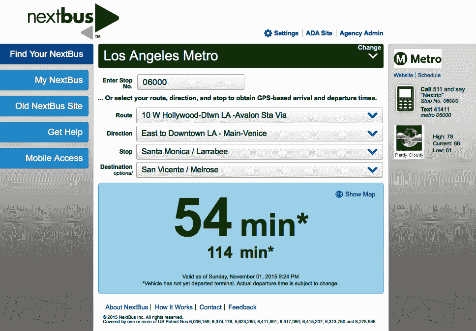
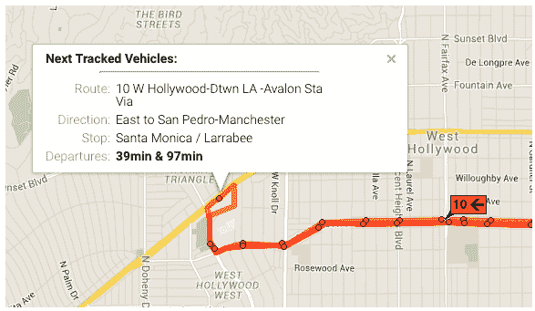
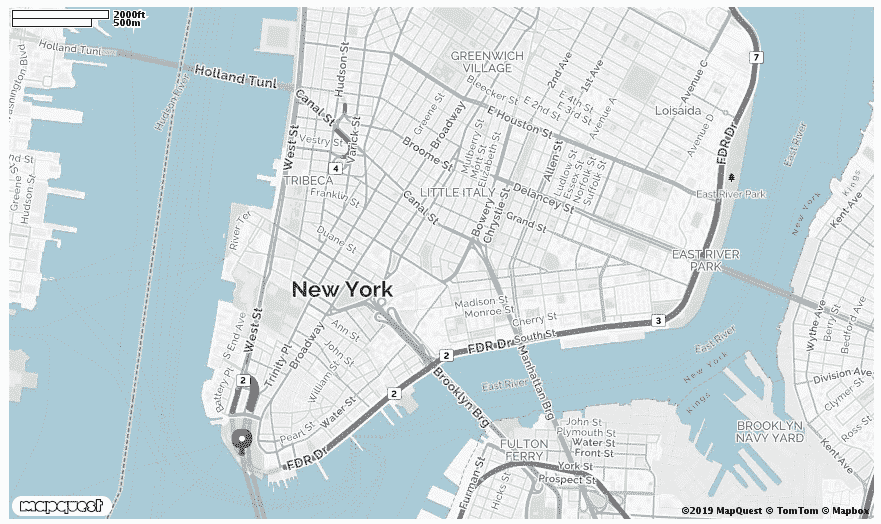
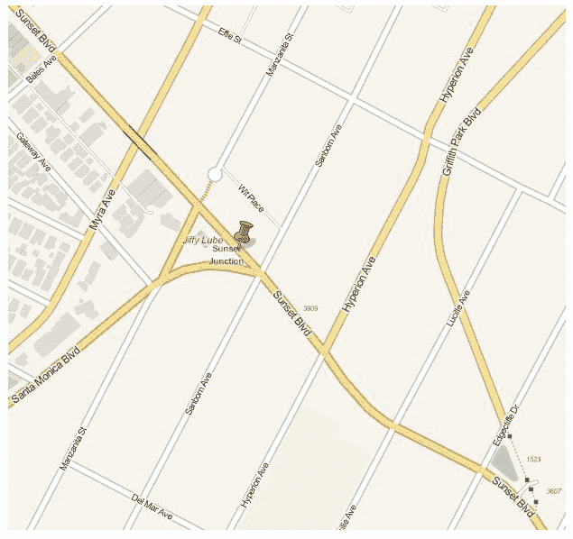
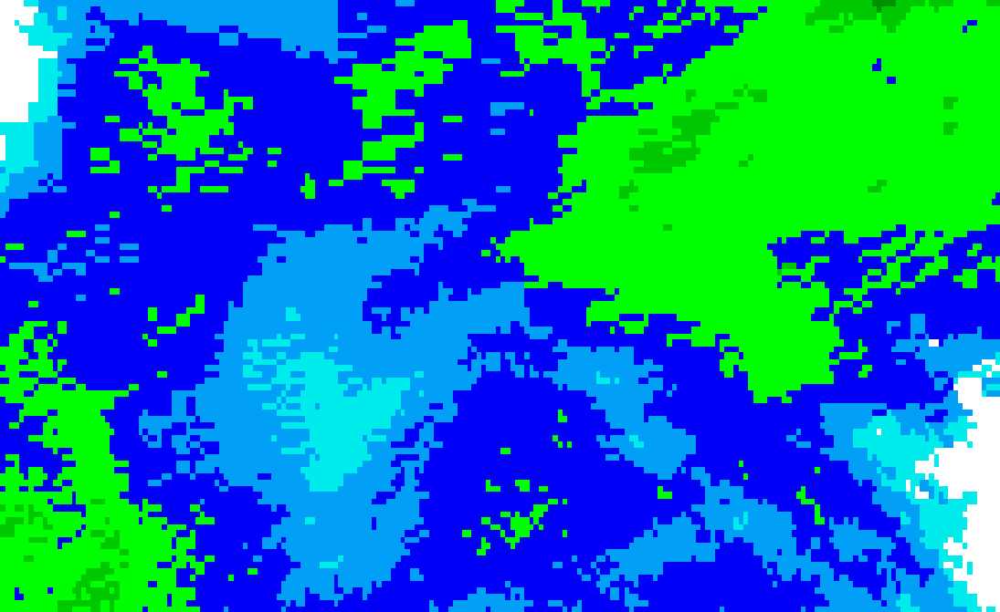
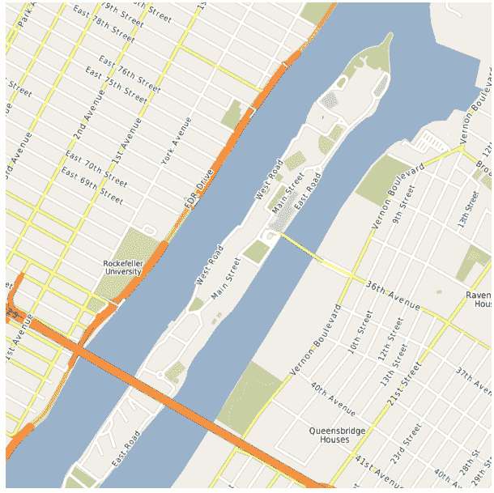
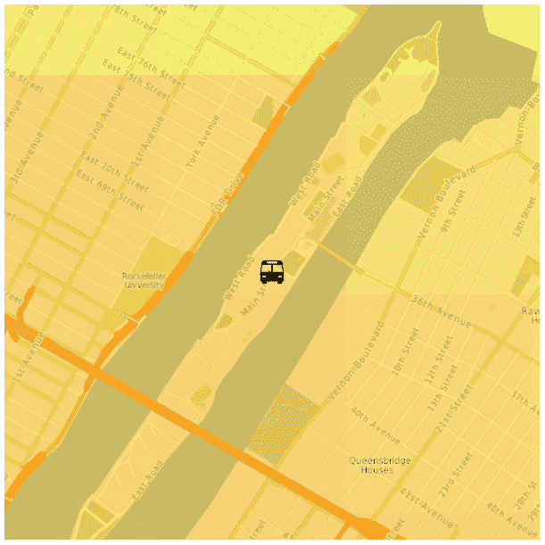
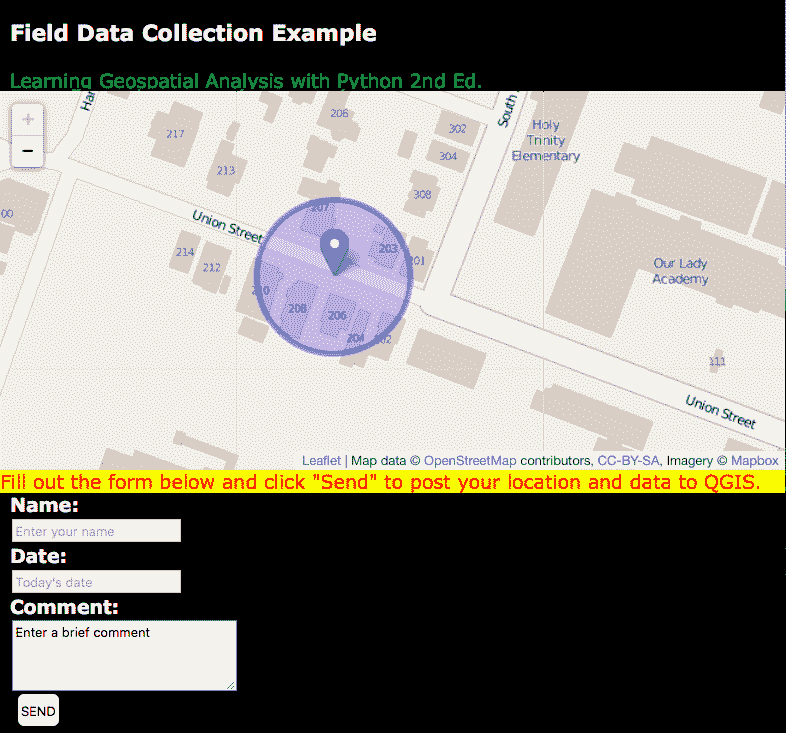

# 实时数据

地理空间分析师中有一句俗语：“地图一旦制作出来，就立刻过时了”。这句话反映了地球及其上的一切都在不断变化的事实。在地理空间分析的大部分历史中，以及本书的大部分内容中，地理空间产品相对静态。原始数据集通常每隔几个月到几年更新一次。地图中地理空间数据的时代被称为**数据货币**。

由于收集数据所需的时间和费用，数据货币传统上并不是主要关注点。网络地图、无线蜂窝调制解调器和低成本 GPS 天线改变了这一焦点。现在，从物流上讲，监控快速变化的对象或系统并将其变化广播给数百万在线用户变得可行，甚至相当经济。这种变化正在改变地理空间技术，并将其引向新的方向。这一革命的直接证据是使用 Google Maps 或 OpenLayers 等系统进行的网络地图混合应用，以及可在线访问的数据格式。每天都有越来越多的电子设备被连接到网络上，以广播其位置和数据，用于自动化或远程控制。例如，恒温器、摄像头、汽车等等。你还可以使用流行的 Raspberry Pi 等廉价的嵌入式计算机将几乎任何东西变成一个连接的**智能**设备。将设备连接成数据和信息网络的概念被称为**物联网**（**IoT**）。

本章我们将探讨以下主题：

+   实时数据的局限性

+   使用实时数据

+   轨迹车辆

+   暴风雨追逐

+   现场报告

到最后，你将学会如何处理实时地理空间数据，并且能够构建一个可以作为任何类型数据传输源的现场报告工具。

# 技术要求

本章需要以下几样东西：

+   Python 3.6 或更高版本

+   内存：最小 6 GB（Windows），8 GB（macOS），推荐 8 GB

+   存储：最小 7200 RPM SATA，可用空间 20 GB，推荐使用 SSD，可用空间 40 GB

+   处理器：最小 Intel Core i3 2.5 GHz，推荐 Intel Core i5

+   MapQuest 开发者 API 密钥，可在以下链接获取：[`developer.mapquest.com/plan_purchase/steps/business_edition/business_edition_free/register`](https://developer.mapquest.com/plan_purchase/steps/business_edition/business_edition_free/register)

# 实时数据的局限性

术语**实时数据**通常意味着接近实时。一些跟踪设备捕获实时数据，并且可能每秒更新几次。但是，广播这些数据的底层基础设施的限制可能将输出频率限制为每 10 秒或更长。气象雷达是一个完美的例子。**多普勒天气雷达**（**DWR**）持续扫描，但数据通常每五分钟在线更新一次。但是，与传统地理空间数据更新相比，几分钟的刷新已经足够实时。限制可以总结如下：

+   网络带宽限制限制数据大小

+   网络延迟限制数据更新频率

+   由于电池寿命等限制，数据源的可访问性

+   由于数据立即对消费者可用而缺乏质量控制

+   由于快速摄取未经验证的数据导致的安全漏洞

实时数据为地理空间应用开辟了额外的机会，因此我们将探讨如何使用它。

# 使用实时数据

网络混合应用通常使用实时数据。网络混合应用非常神奇，已经改变了许多不同行业的运营方式。但它们通常受到限制，通常只是在一个地图上显示预处理的 数据，并给开发者提供访问 JavaScript API 的权限。但如果你想以某种方式处理数据呢？如果你想过滤、更改，然后将其发送到另一个系统呢？为了使用实时数据进行地理空间分析，你需要能够将其作为点数据或地理参考栅格访问。

你可以在这里了解更多关于网络地图混合应用的信息： [`www.esri.com/arcgis-blog/products/product/uncategorized/digital-map-mashups/`](https://www.esri.com/arcgis-blog/products/product/uncategorized/digital-map-mashups/).

与前几章中的示例一样，脚本尽可能简单，并设计为从头到尾阅读，无需太多心理循环。当使用函数时，它们首先列出，然后是脚本变量声明，最后是主程序执行。

现在让我们看看如何使用 NextBus API 中的车辆来访问实时和点位置数据源。

# 轨迹车辆

对于我们的第一个实时数据源，我们将使用优秀的**NextBus API**。NextBus ([`www.nextbus.com/`](http://www.nextbus.com/)) 是一个商业服务，用于跟踪包括公交车、有轨电车和火车在内的市政公共交通。乘坐这些交通线路的人可以跟踪下一辆**公交车**的到达时间。

更好的是，在客户同意的情况下，NextBus 通过**表示状态转移**（**REST**）**API**发布跟踪数据。使用 URL API 调用，开发者可以请求有关车辆的信息，并接收有关其位置的 XML 文档。这是一种直接开始使用实时数据的方法。

如果你访问 NextBus，你会看到一个如以下截图所示的网页界面，显示加利福尼亚州洛杉矶的地铁系统数据：



该系统允许你选择多个参数来了解下一站的当前位置和时间预测。在屏幕的右侧，有一个链接到一个 Google Maps 混合应用，显示特定路线的公交跟踪数据，如下面的截图所示：



这是一个非常有用的网站，但它不让我们控制数据的显示和使用方式。让我们直接使用 Python 和 NextBus REST API 来访问原始数据，开始处理实时数据。

在本章的例子中，我们将使用这里找到的文档化的 NextBus API：[`www.nextbus.com/xmlFeedDocs/NextBusXMLFeed.pdf`](http://www.nextbus.com/xmlFeedDocs/NextBusXMLFeed.pdf)。

为了开始这个例子，我们需要一个所需公交车的列表。

# NextBus 机构列表

NextBus 的客户被称为**机构**。在我们的例子中，我们将追踪加利福尼亚州洛杉矶的公交车路线。首先，我们需要获取一些关于该机构的信息。NextBus API 由一个名为`publicXMLFeed`的 Web 服务组成，在其中你设置一个名为`command`的参数。我们将使用浏览器中的`agencyList`命令，通过以下 REST URL 获取包含机构信息的 XML 文档：[`webservices.nextbus.com/service/publicXMLFeed?command=agencyList`](http://webservices.nextbus.com/service/publicXMLFeed?command=agencyList)。

当我们在浏览器中访问该链接时，它返回一个包含`<agency/>`标签的 XML 文档。洛杉矶的标签如下所示：

```py
<agency tag="lametro" title="Los Angeles Metro" regionTitle="California-Southern"/> 
```

现在我们有了公交车的列表，我们需要获取它们可以行驶的路线。

# NextBus 路线列表

`tag`属性是桑德贝的 ID，我们需要它来执行其他 NextBus API 命令。其他属性是可读的元数据。我们需要获取的下一项信息是关于**路线 2**公交车路线的详细信息。为了获取这些信息，我们将使用机构 ID 和`routeList` REST 命令，将 URL 粘贴到我们的网页浏览器中获取另一个 XML 文档。

注意，机构 ID 被设置为 REST URL 中的参数：[`webservices.nextbus.com/service/publicXMLFeed?command=routeList&a=lametro`](http://webservices.nextbus.com/service/publicXMLFeed?command=routeList&a=lametro)。

当我们在浏览器中调用此 URL 时，我们得到以下 XML 文档：

```py
<?xml version="1.0" encoding="utf-8" ?>
<body copyright="All data copyright Los Angeles Metro 2015."><route tag="2" title="2 Downtown LA - Pacific Palisades Via"/><route tag="4" title="4 Downtown LA - Santa Monica Via Santa"/>
<route tag="10" title="10 W Hollywood-Dtwn LA -Avalon Sta Via"/>
...
<route tag="901" title="901 Metro Orange Line"/>
<route tag="910" title="910 Metro Silver Line"/>
</body>
```

我们有了公交车和路线。我们准备好开始追踪它们的地理位置了！

# NextBus 车辆位置

因此，根据这些结果，存储在`tag`属性中的主线路线 ID 仅仅是`1`。因此，现在我们拥有了追踪**洛杉矶地铁路线 2**上公交车所需的所有信息。

只有一个必需的参数（称为 `t`），它代表自 **1970 年纪元日期**（**1970 年 1 月 1 日午夜 UTC**）以来的毫秒数。纪元日期是机器用来跟踪时间的一个计算机标准。在 NextBus API 中，最简单的事情就是为这个值指定 `0`，这将返回最后 15 分钟的数据。

有一个可选的 `direction` 标签，允许你指定一个终止的公交车站，如果一条路线上有多个公交车在相反方向上运行。但是，如果我们不指定，API 将返回第一个，这符合我们的需求。获取洛杉矶地铁主线路线的 REST URL 看起来如下所示：[`webservices.nextbus.com/service/publicXMLFeed?command=vehicleLocations&a=lametro&r=2&t=0`](http://webservices.nextbus.com/service/publicXMLFeed?command=vehicleLocations&a=lametro&r=2&t=0)。

在浏览器中调用此 REST URL 返回以下 XML 文档：

```py
<?xml version="1.0" encoding="utf-8" ?>
<body copyright="All data copyright Los Angeles Metro 2015.">
<vehicle id="7582" routeTag="2" dirTag="2_758_0" lat="34.097992" lon="-118.350365" secsSinceReport="44" predictable="true" heading="90" speedKmHr="0"/>
<vehicle id="7583" routeTag="2" dirTag="2_779_0" lat="34.098076" lon="-118.301399" secsSinceReport="104" predictable="true" heading="90" speedKmHr="37"/>
. . .
</body >  
```

每个 `vehicle` 标签代表过去 15 分钟内的一个位置。`last` 标签是最新的位置（尽管 XML 在技术上是无序的）。

这些公共交通系统并非全天运行。许多在当地时间晚上 10:00（22:00）关闭。如果你在脚本中遇到错误，请使用 NextBus 网站定位一个正在运行的系统，并将机构变量和路线变量更改为该系统。

我们现在可以编写一个 Python 脚本来返回给定路线上的公交车位置。如果我们不指定 `direction` 标签，NextBus 将返回第一个。在这个例子中，我们将通过调用 REST URL 并使用之前章节中演示的内置 Python `urllib` 库来轮询 NextBus 跟踪 API。

我们将使用简单内置的 `minidom` 模块解析返回的 XML 文档，该模块在 第四章*The minidom module* 部分中也有介绍，这是 [Geospatial Python Toolbox*]。此脚本仅输出路线 2 公交的最新纬度和经度。你将在顶部看到机构和路线变量。为此，我们需要遵循以下步骤：

1.  首先，我们导入所需的库：

```py
import urllib.request
import urllib.parse
import urllib.error
from xml.dom import minidom
```

1.  现在我们设置 API 模式和我们要查询的客户和路线的变量：

```py
# Nextbus API command mode
command = "vehicleLocations"

# Nextbus customer to query
agency = "lametro"

# Bus we want to query
route = "2"
```

1.  我们将时间值设置为 `0`，这将获取最后 `15` 分钟的数据：

```py
# Time in milliseconds since the
# 1970 epoch time. All tracks
# after this time will be returned.
# 0 only returns data for the last
# 15 minutes
epoch = "0"
```

1.  现在我们需要构建我们将用于访问 API 的查询 URL：

```py
# Build our query url
# webservices base url
url = "http://webservices.nextbus.com"

# web service path
url += "/service/publicXMLFeed?"

# service command/mode
url += "command=" + command

# agency
url += "&a=" + agency
url += "&r=" + route
url += "&t=" + epoch
```

1.  接下来，我们可以使用 `urllib` 调用 API：

```py
# Access the REST URL
feed = urllib.request.urlopen(url)
if feed:
 # Parse the xml feed
 xml = minidom.parse(feed)
 # Get the vehicle tags
 vehicles = xml.getElementsByTagName("vehicle")
 # Get the most recent one. Normally there will
 # be only one.
```

1.  最后，我们可以访问结果并打印出每辆公交车的位置：

```py
 if vehicles:
   bus = vehicles.pop()
   # Print the bus latitude and longitude
   att = bus.attributes
   print(att["lon"].value, ",", att["lat"].value)
 else:
   print("No vehicles found.")
```

此脚本的输出只是一个纬度和经度值，这意味着我们现在控制了 API 并理解了它。输出应该是纬度和经度的坐标值。

现在我们已经准备好使用这些位置值来创建我们自己的地图。

# 映射 NextBus 位置

可自由获取的街道地图数据最佳来源是 **OpenStreetMap** （**OSM**）项目：[`www.openstreetmap.org`](http://www.openstreetmap.org)。OSM 还有一个公开可用的 REST API，用于创建静态地图图像，称为 **StaticMapLite**：[`staticmap.openstreetmap.de`](http://staticmap.openstreetmap.de)。

**OSM StaticMapLite API** 提供了一个基于 Google 静态地图 API 的 `GET` API，用于创建具有有限数量点标记和线条的简单地图图像。与 REST API 相比，`GET` API 允许您在 URL 上的问号后附加名称/值参数对。REST API 将参数作为 URL 路径的一部分。我们将使用该 API 按需创建我们的 NextBus API 地图，并为公交车位置使用红色推针图标。

在下一个示例中，我们将之前的脚本压缩成一个名为 `nextbus()` 的紧凑函数。`nextbus()` 函数接受一个机构、路线、命令和纪元作为参数。命令默认为 `vehicleLocations`，纪元默认为 `0` 以获取最后 15 分钟的数据。在这个脚本中，我们将传递 LA 路线-2 的路线信息，并使用默认命令返回公交车的最新经纬度。

我们有一个名为 `nextmap()` 的第二个函数，每次调用时都会在公交车的当前位置创建一个带有紫色标记的地图。地图是通过构建一个针对 OSM `StaticMapLite` API 的 `GET` URL 来创建的，该 URL 以公交车的位置为中心，并使用介于 *1-18* 之间的缩放级别和地图大小来确定地图范围。

您可以直接在浏览器中访问 API，以查看 `nextmap()` 函数的示例。您需要通过在此处注册来获取免费的 MapQuest 开发者 API 密钥：[`developer.mapquest.com/plan_purchase/steps/business_edition/business_edition_free/register`](https://developer.mapquest.com/plan_purchase/steps/business_edition/business_edition_free/register)。一旦您有了密钥，将其插入到 `key` 参数中，即 `YOUR_API_KEY_HERE`。然后，您可以测试以下示例 URL：`https://www.mapquestapi.com/staticmap/v4/getmap?size=865,512&type=map&pois=mcenter,40.702147,-74.015794|&zoom=14&center=40.714728,-73.998672&imagetype=JPEG&key=YOUR_API_KEY_HERE`。

静态地图看起来类似于以下这样：



`nextmap()` 函数接受 NextBus 机构 ID、路线 ID 和地图的基本图像名称字符串。该函数调用 `nextbus()` 函数以获取经纬度对。该程序的执行在定时间隔内循环，第一次通过创建地图，然后在后续通过中覆盖地图。程序还会在每次保存地图时输出一个时间戳。`requests` 变量指定通过次数，`freq` 变量代表每个循环之间的时间（以秒为单位）。让我们检查以下代码，看看这个例子是如何工作的：

1.  首先，我们导入所需的库：

```py
import urllib.request
import urllib.parse
import urllib.error
from xml.dom import minidom
import time
```

1.  接下来，我们创建一个函数，可以获取给定路线上一辆公交车的最新位置：

```py
def nextbus(a, r, c="vehicleLocations", e=0):
 """Returns the most recent latitude and
 longitude of the selected bus line using
 the NextBus API (nbapi)
 Arguments: a=agency, r=route, c=command,
 e=epoch timestamp for start date of track,
 0 = the last 15 minutes"""
 nbapi = "http://webservices.nextbus.com"
 nbapi += "/service/publicXMLFeed?"
 nbapi += "command={}&a={}&r={}&t={}".format(c, a, r, e)
 xml = minidom.parse(urllib.request.urlopen(nbapi))
 # If more than one vehicle, just get the first 
 bus = xml.getElementsByTagName("vehicle")[0]
 if bus: 
 at = bus.attributes
 return(at["lat"].value, at["lon"].value)
 else:
 return (False, False)
```

1.  现在我们有一个函数可以在地图图像上绘制公交车位置：

```py
def nextmap(a, r, mapimg):
 """Plots a nextbus location on a map image
 and saves it to disk using the MapQuest OpenStreetMap Static Map 
 API (osmapi)"""
 # Fetch the latest bus location
 lat, lon = nextbus(a, r)
 if not lat:
   return False
 # Base url + service path
```

1.  在该函数中，我们在 URL 中设置 API 参数：

```py
 osmapi = "https://www.mapquestapi.com/staticmap/v4/getmap?
 type=map&"
# Use a red, pushpin marker to pin point the bus
 osmapi += "mcenter={},{}|&".format(lat, lon)
# Set the zoom level (between 1-18, higher=lower scale)
 osmapi += "zoom=18&"
# Center the map around the bus location
 osmapi += "center={},{}&".format(lat, lon)
# Set the map image size
 osmapi += "&size=1500,1000"
# Add our API Key
 osmapi += "&key=YOUR_API_KEY_HERE"
```

1.  现在，我们可以通过调用 URL 并保存它来创建图像：

```py
 # Create a PNG image
 osmapi += "imagetype=png&"
 img = urllib.request.urlopen(osmapi)

# Save the map image
 with open("{}.png".format(mapimg), "wb") as f:
   f.write(img.read())
return True
```

1.  现在在我们的主程序中，我们可以设置我们想要跟踪的公交车的变量：

```py
# Nextbus API agency and bus line variables
agency = "lametro"
route = "2"
# Name of map image to save as PNG
nextimg = "nextmap"
```

1.  然后，我们可以指定我们想要的跟踪点的数量和频率：

```py
# Number of updates we want to make
requests = 1
# How often we want to update (seconds)
freq = 5
```

1.  最后，我们可以开始跟踪和更新我们的地图图像：

```py
# Map the bus location every few seconds
for i in range(requests):
 success = nextmap(agency, route, nextimg)
 if not success:
   print("No data available.")
   continue
 print("Saved map {} at {}".format(i, time.asctime()))
 time.sleep(freq)
```

1.  当脚本运行时，你会看到类似以下输出的结果，显示脚本保存每张地图的时间：

```py
Saved map 0 at Sun Nov 1 22:35:17 2015
Saved map 1 at Sun Nov 1 22:35:24 2015
Saved map 2 at Sun Nov 1 22:35:32 2015
```

此脚本保存的地图图像类似于以下内容，这取决于你运行脚本时公交车所在的位置：



这张地图是使用 API 创建自定义地图产品的优秀示例。但它是一个非常基础的跟踪应用。为了开始将其开发成一个更有趣的地理空间产品，我们需要将其与其他实时数据源相结合，这些数据源能给我们提供更多的情境感知。

现在我们能够跟踪公交车了，让我们添加一些对乘坐公交车的乘客有用的额外信息到地图上。让我们添加一些天气数据。

# 暴风雨追逐

到目前为止，我们已经创建了一个比 NextBus 网站所做更简单的版本。但我们以最终使我们完全控制输出的方式完成了它。现在我们想要使用这种控制来超越 NextBus Google Maps 混合应用所能做到的。我们将添加另一个对旅行者和公交车线路运营商都非常重要的实时数据源：天气。

**爱荷华州立大学的 Mesonet 项目**提供免费且经过精炼的天气数据，适用于各种应用。我们使用这些数据为我们的公交车位置地图创建实时天气地图。我们可以使用**开放地理空间联盟**（**OGC**）的**网络地图服务**（**WMS**）标准来请求我们感兴趣区域的单张图像。WMS 是 OGC 的一个标准，通过互联网提供地理参考地图图像；它们通过地图服务器通过 HTTP 请求生成。

Mesonet 系统提供了一个优秀的网络地图服务，该服务根据正确格式的 WMS 请求从全球降水镶嵌图中返回一个子集图像。以下是一个此类请求的示例查询：[`mesonet.agron.iastate.edu/cgi-bin/wms/nexrad/n0r.cgi?SERVICE=WMS&VERSION=1.1.1&REQUEST=GetMap&LAYERS=nexrad-n0r&STYLES=&SRS=EPSG:900913&BBOX=-15269659.42,2002143.61,-6103682.81,7618920.15&WIDTH=600&HEIGHT=600&FORMAT=image/png`](http://mesonet.agron.iastate.edu/cgi-bin/wms/nexrad/n0r.cgi?service=wms&version=1.1.1&request=getmap&layers=nexrad-n0r&styles=&srs=epsg:900913&bbox=-15269659.42,2002143.61,-6103682.81,7618920.15&width=600&height=600&format=image/png)。

由于本章的示例依赖于实时数据，所列出的具体请求如果没有在感兴趣的区域有活动，可能会产生空白天气图像。您可以访问此链接（[`radar.weather.gov/ridge/Conus/index.php`](http://radar.weather.gov/ridge/Conus/index.php)）以找到正在发生风暴的区域。此页面包含 Google Earth 或 QGIS 的 KML 链接。这些 WMS 图像是类似于以下样本的透明 PNG 图像：



另一方面，OSM 网站不再通过 WMS 提供其街道地图——只提供瓦片。然而，他们允许其他组织下载瓦片或原始数据以扩展免费服务。美国**国家海洋和大气管理局**（**NOAA**）就是这样做的，并为他们的 OSM 数据提供了一个 WMS 接口，允许请求检索我们需要的单个基图图像，用于我们的公交路线：



现在我们有了获取基图和天气数据的数据源。我们想要将这些图像合并并绘制公交车的当前位置。而不是一个简单的点，这次我们将更加复杂，并添加以下公交图标：


您需要从以下链接下载此图标`busicon.png`到您的当前工作目录：[`github.com/GeospatialPython/Learn/blob/master/busicon.png?raw=true`](https://github.com/GeospatialPython/Learn/blob/master/busicon.png?raw=true)。

现在我们将结合之前编写的脚本和新的数据源来创建一个实时天气公交地图。由于我们将融合街道地图和天气地图，我们需要使用之前章节中提到的**Python 图像处理库**（**PIL**）。我们将用之前示例中的`nextmap()`函数替换为一个简单的`wms()`函数，该函数可以从任何 WMS 服务中通过边界框获取地图图像。此外，我们还将添加一个将十进制度数转换为米的函数，命名为`ll2m()`。

该脚本获取公交车位置，将位置转换为米，在位置周围创建一个 2 英里（3.2 公里）的矩形，然后下载街道和天气地图。然后使用 PIL 将地图图像混合在一起。PIL 然后将公交车图标图像缩小到 30 x 30 像素，并将其粘贴在地图的中心，即公交车位置。让我们看看以下代码是如何工作的：

1.  首先，我们将导入所需的库：

```py
import sys
import urllib.request
import urllib.parse
import urllib.error
from xml.dom import minidom
import math
try:
 import Image
except:
 from PIL import Image
```

1.  现在，我们将重用之前示例中的`nextbus`函数来获取公交跟踪数据：

```py
def nextbus(a, r, c="vehicleLocations", e=0):
 """Returns the most recent latitude and
 longitude of the selected bus line using
 the NextBus API (nbapi)"""
 nbapi = "http://webservices.nextbus.com"
 nbapi += "/service/publicXMLFeed?"
 nbapi += "command=%s&a=%s&r=%s&t=%s" % (c, a, r, e)
 xml = minidom.parse(urllib.request.urlopen(nbapi))
 # If more than one vehicle, just get the first
 bus = xml.getElementsByTagName("vehicle")[0]
 if bus:
 at = bus.attributes
 return(at["lat"].value, at["lon"].value)
 else:
 return (False, False)
```

1.  我们还需要一个将纬度和经度转换为米的函数：

```py
def ll2m(lon, lat):
 """Lat/lon to meters"""
 x = lon * 20037508.34 / 180.0
 y = math.log(math.tan((90.0 + lat) *
 math.pi / 360.0)) / (math.pi / 180.0)
 y = y * 20037508.34 / 180
 return (x, y)
```

1.  现在我们需要一个函数来检索 WMS 地图图像，我们将使用它来获取天气图像：

```py
def wms(minx, miny, maxx, maxy, service, lyr, epsg, style, img, w, 
        h):
    """Retrieve a wms map image from
    the specified service and saves it as a JPEG."""
    wms = service
    wms += "?SERVICE=WMS&VERSION=1.1.1&REQUEST=GetMap&"
    wms += "LAYERS={}".format(lyr)
    wms += "&STYLES={}&".format(style)
    wms += "SRS=EPSG:{}&".format(epsg)
    wms += "BBOX={},{},{},{}&".format(minx, miny, maxx, maxy)
    wms += "WIDTH={}&".format(w)
    wms += "HEIGHT={}&".format(h)
    wms += "FORMAT=image/jpeg"
    wmsmap = urllib.request.urlopen(wms)
    with open(img + ".jpg", "wb") as f:
        f.write(wmsmap.read())
```

1.  现在我们可以设置主程序中的所有变量以使用我们的函数：

```py
# Nextbus agency and route ids
agency = "roosevelt"
route = "shuttle"
# OpenStreetMap WMS service
basemap = "http://ows.mundialis.de/services/service"
# Name of the WMS street layer
streets = "TOPO-OSM-WMS"
# Name of the basemap image to save
mapimg = "basemap"
# OpenWeatherMap.org WMS Service
weather = "https://mesonet.agron.iastate.edu/cgi-bin/wms/nexrad/n0q.cgi?"
# If the sky is clear over New York,
# use the following url which contains
# a notional precipitation sample:
# weather = "http://git.io/vl4r1"
# WMS weather layer
weather_layer = "nexrad-n0q-900913"
# Name of the weather image to save
skyimg = "weather"
# Name of the finished map to save
final = "next-weather"
# Transparency level for weather layer
# when we blend it with the basemap.
# 0 = invisible, 1 = no transparency
opacity = .5
# Pixel width and height of the
# output map images
w = 600
h = 600
# Pixel width/height of the the
# bus marker icon
icon = 30
```

1.  现在，我们已经准备好获取我们的公交车位置：

```py
# Get the bus location
lat, lon = nextbus(agency, route)
if not lat:
 print("No bus data available.")
 print("Please try again later")
 sys.exit()
# Convert strings to floats
lat = float(lat)
lon = float(lon)
# Convert the degrees to Web Mercator
# to match the NOAA OSM WMS map
x, y = ll2m(lon, lat)
# Create a bounding box 1600 meters
# in each direction around the bus
minx = x - 1600
maxx = x + 1600
miny = y - 1600
maxy = y + 1600
```

1.  然后，我们可以下载我们的街道地图：

```py
# Download the street map
wms(minx, miny, maxx, maxy, basemap, streets, mapimg, w, h)
```

1.  然后，我们可以下载天气地图：

```py
# Download the weather map
wms(minx, miny, maxx, maxy, weather, weather_layer, skyimg, w, h)
```

1.  现在，我们可以将天气数据叠加到公交地图上：

```py
# Open the basemap image in PIL
im1 = Image.open("basemap.png").convert('RGBA')
# Open the weather image in PIL
im2 = Image.open("weather.png").convert('RGBA')
# Convert the weather image mode
# to "RGB" from an indexed PNG
# so it matches the basemap image
im2 = im2.convert(im1.mode)
# Create a blended image combining
# the basemap with the weather map
im3 = Image.blend(im1, im2, opacity)
```

1.  接下来，我们需要将公交图标添加到我们的组合地图中，以显示公交车的位置：

```py
# Open up the bus icon image to
# use as a location marker.
# http://git.io/vlgHl 
im4 = Image.open("busicon.png")
# Shrink the icon to the desired
# size
im4.thumbnail((icon, icon))
# Use the blended map image
# and icon sizes to place
# the icon in the center of
# the image since the map
# is centered on the bus
# location.
w, h = im3.size
w2, h2 = im4.size
# Paste the icon in the center of the image
center_width = int((w/2)-(w2/2))
center_height = int((h/2)-(h2/2))
im3.paste(im4, (center_width, center_height), im4)
```

1.  最后，我们可以保存完成的地图：

```py
# Save the finished map
im3.save(final + ".png")
```

此脚本将生成一个类似于以下地图：



地图显示公交车在其当前位置正经历中等降水。颜色渐变，如之前 Mesonet 网站截图所示，从浅蓝色（轻度降水）到绿色、黄色、橙色，最后到红色（或黑白中的浅灰色到深灰色），随着雨势加大。因此，在创建此地图时，公交车线路运营商可以使用此图像告诉他们的司机开慢一点，乘客也会知道在前往公交车站之前可能需要拿一把伞。

由于我们想从底层学习 NextBus API，我们直接使用内置的 Python 模块来使用 API。但存在几个用于 API 的第三方 Python 模块，包括 PyPI 上名为`nextbus`的一个，它允许你使用所有 NextBus 命令的高级对象，并提供比本章简单示例中不包括的更健壮的错误处理。

现在我们已经学会了如何检查天气，让我们使用 Python、HTML 和 JavaScript 将离散的实时数据源组合成更有意义的产品。

# 现场报告

在本章的最后一个示例中，我们将从公交车上下来，进入现场。现代智能手机、平板电脑和笔记本电脑使我们能够从任何地方更新 GIS 并查看这些更新。我们将使用 HTML、GeoJSON、Leaflet JavaScript 库以及一个名为 Folium 的纯 Python 库来创建一个客户端-服务器应用程序，允许我们将地理空间信息发布到服务器，然后创建一个交互式网络地图来查看这些数据更新。

首先，我们需要一个 Web 表单，它显示你的当前位置，并在你提交表单并附上关于你位置的评论时更新服务器。你可以在以下位置找到该表单：[`geospatialpython.github.io/Learn/fieldwork.html`](http://geospatialpython.github.io/Learn/fieldwork.html)。

以下截图显示了表单：



你可以查看该表单的源代码以了解其工作原理。映射是通过 Leaflet 库完成的，并将 GeoJSON 发布到[myjson.com](http://myjson.com/)上的一个独特 URL。你可以在移动设备上使用此页面，将其移动到任何 Web 服务器，甚至可以在你的本地硬盘上使用它。

表单发布到以下公开 URL 在[myjson.com](http://myjson.com/)上：[`api.myjson.com/bins/467pm`](https://api.myjson.com/bins/467pm)。你可以在浏览器中访问该 URL 以查看原始 GeoJSON。

接下来，你需要从 PyPI 安装 Folium 库。Folium 提供了一个简单的 Python API 来创建 Leaflet 网络地图。你可以在以下位置找到更多关于 Folium 的信息：[`github.com/python-visualization/folium`](https://github.com/python-visualization/folium)。

Folium 使得制作 Leaflet 地图变得极其简单。这个脚本只有几行，并将输出一个名为`map.html`的网页。我们传递 GeoJSON URL 给`map`对象，它将在地图上绘制位置：

```py
import folium
m = folium.Map()
m.geo_json(geo_path="https://api.myjson.com/bins/467pm")
m.create_map(path="map.html")
```

生成的交互式地图将以标记的形式显示点。当你点击一个标记时，表单中的信息将被显示出来。你只需在任何浏览器中打开 HTML 文件即可。

# 摘要

实时数据是进行新型地理空间分析的一种令人兴奋的方式，这是由包括网络地图、GPS 和无线通信在内的多种不同技术的进步才最近才成为可能。在本章中，你学习了如何访问实时位置数据的原始数据流，如何获取实时栅格数据的子集，如何仅使用 Python 将不同类型的实时数据组合成定制的地图分析产品，以及如何构建客户端-服务器地理空间应用程序以实时更新 GIS。

与前面的章节一样，这些示例包含构建块，将使你能够使用 Python 构建新的应用程序类型，这些应用程序远远超出了典型的基于 JavaScript 的流行和普遍的混合应用。

在下一章中，我们将把迄今为止所学的一切结合成一个完整的地理空间应用程序，在现实场景中应用算法和概念。
