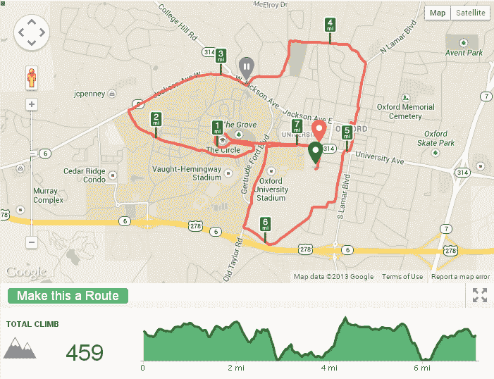
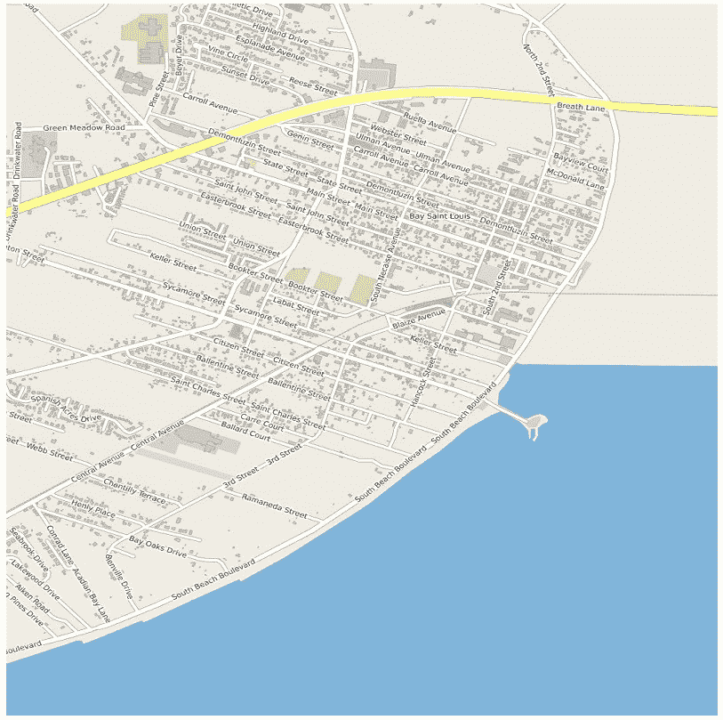
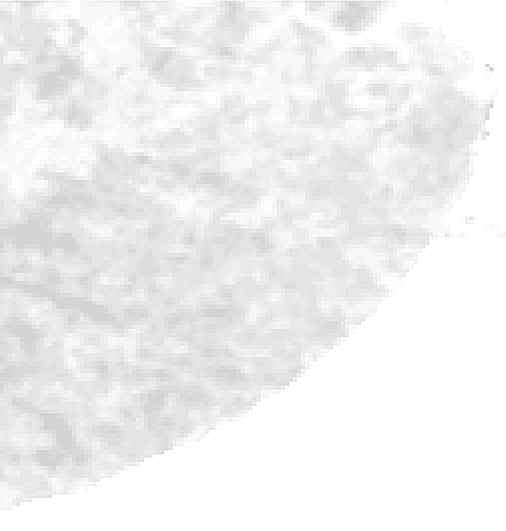
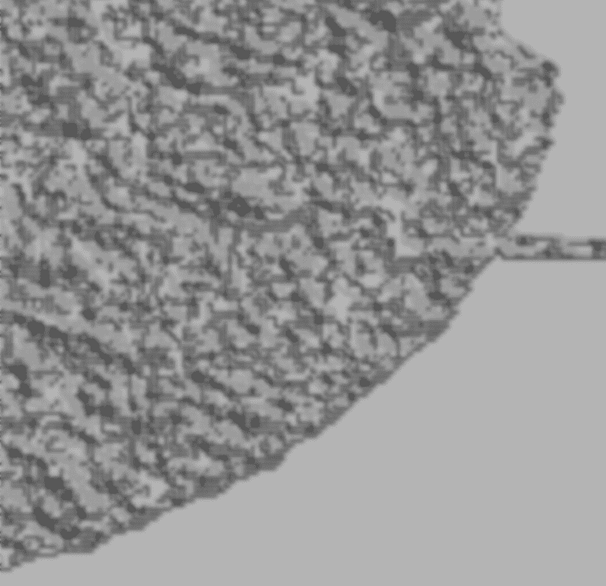
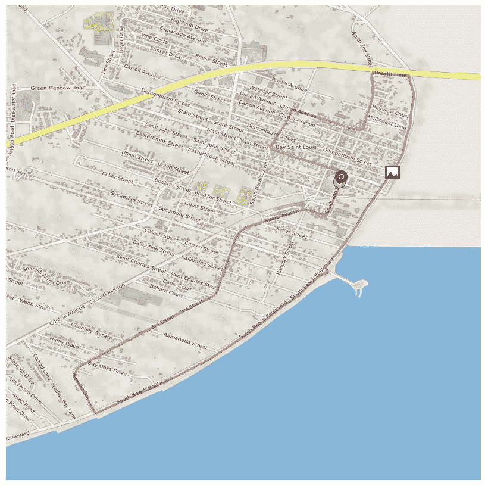
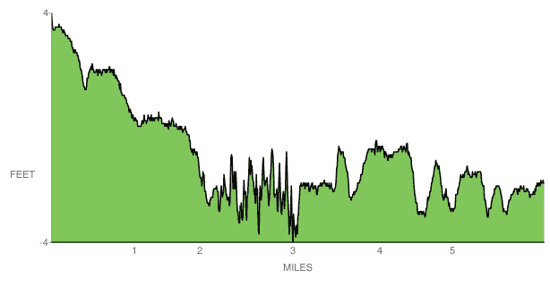
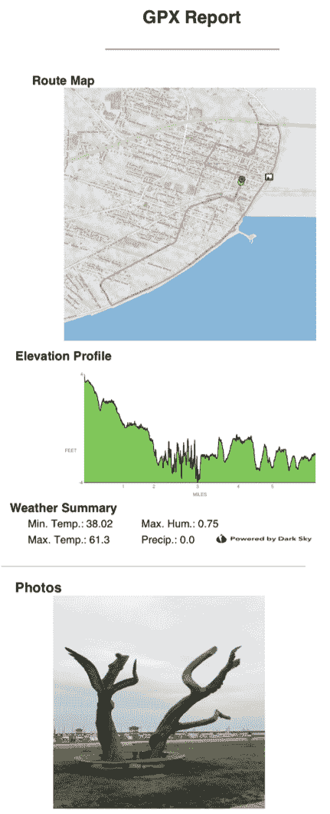

# 整合所有内容

在整本书中，我们已经触及了地理空间分析的所有重要方面，并且我们使用了多种不同的 Python 技术来分析不同类型的地理空间数据。在本章的最后，我们将利用我们几乎涵盖的所有主题，来制作一个实际应用且非常受欢迎的产品：GPS 路线分析报告。

这些报告在数十个移动应用服务、GPS 手表、车载导航系统和其他基于 GPS 的工具中很常见。GPS 通常记录位置、时间和海拔。从这些值中，我们可以推导出大量关于记录数据沿途发生事件的辅助信息。包括 RunKeeper、MapMyRun、Strava 和 Nike Plus 在内的健身应用都使用类似的报告来展示跑步、徒步、骑行和步行的 GPS 追踪运动数据。

我们将使用 Python 创建这样的报告。这个程序将近 500 行代码，是我们迄今为止最长的，因此我们将分部分逐步进行。我们将结合以下技术：

+   理解典型的 GPS 报告

+   构建 GPS 报告工具

随着我们逐步通过这个程序，我们将使用所有熟悉的技术，但我们将以新的方式使用它们。

# 技术要求

我们在本章中需要以下东西：

+   Python 3.6 或更高版本

+   内存：最低要求 – 6 GB（Windows），8 GB（macOS）；推荐 8 GB

+   存储：最低要求 7200 RPM SATA，可用空间 20 GB，推荐 SSD，可用空间 40 GB

+   处理器：最低要求 Intel Core i3 2.5 GHz，推荐 Intel Core i5

+   PIL：Python 图像库

+   NumPy：一个多维和数组处理库

+   `pygooglechart`：Google 图表 API 的 Python 封装器

+   FPDF：一个简单且纯 Python 的 PDF 编写器

# 理解典型的 GPS 报告

一个典型的 GPS 报告包括常见的元素，如路线图、海拔剖面图和速度剖面图。以下截图是一个通过 RunKeeper 记录的典型路线的报告（[`runkeeper.com/index`](https://runkeeper.com/index)）：



我们的报告将与这个服务类似，但我们还会增加一个特色。我们将包括路线图和海拔剖面图，就像这个服务一样，但我们还会添加在记录该路线时发生的天气条件以及沿途拍摄的地理定位照片。

既然我们已经了解了 GPS 报告是什么，那么让我们学习如何构建它。

# 构建 GPS 报告工具

我们程序的名字是 `GPX-Reporter.py`。如果您还记得 第二章 中关于 *标签和标记格式* 的部分，*学习地理空间数据*，**GPX** 格式是存储 GPS 路线信息最常见的方式。几乎每个依赖 GPS 数据的程序和设备都可以转换为 GPX 格式。

对于这个示例，您可以从以下链接下载一个示例 GPX 文件：[`git.io/vl7qi`](http://git.io/vl7qi)。此外，您还需要从 PyPI 安装几个 Python 库。

您只需使用 `easy_install` 或 `pip` 安装这些工具。我们还将使用一个名为 `SRTM.py` 的模块。此模块是用于处理 2000 年由航天飞机奋进号在 11 天的 **航天飞机雷达地形测量任务**（**SRTM**）期间收集的近全球高程数据的实用工具。使用 `pip` 安装 SRTM 模块：

```py
pip install srtm.py
```

或者，您也可以下载压缩文件，解压后，将 `srtm` 文件夹复制到您的 Python `site-packages` 目录或工作目录：[`git.io/vl5Ls`](http://git.io/vl5Ls)。

您还需要注册一个免费的 Dark Sky API。这项免费服务提供独特的工具。这是唯一提供全球、历史天气数据的服务，对于几乎任何地点，每天最多可免费请求 1,000 次：[`darksky.net/dev`](https://darksky.net/dev)。

**Dark Sky** 将为您提供一个文本密钥，您需要在运行 GPX-Reporter 程序之前将其插入到名为 `api_key` 的变量中。最后，根据 Dark Sky 的服务条款，您需要下载一个标志图像并将其插入到报告中：[`raw.githubusercontent.com/GeospatialPython/Learn/master/darksky.png`](https://raw.githubusercontent.com/GeospatialPython/Learn/master/darksky.png)。

您可以在此处查看 Dark Sky 的 *服务条款*：[`darksky.net/dev/docs/terms`](https://darksky.net/dev/docs/terms)。

现在，我们准备好通过 GPX-Reporter 程序进行工作。像本书中的其他脚本一样，此程序试图最小化函数，以便您可以更好地在心理上追踪程序并轻松修改它。以下列表包含程序中的主要步骤：

1.  设置 Python `logging` 模块

1.  建立我们的辅助函数

1.  解析 GPX 数据文件

1.  计算路线边界框

1.  缓冲边界框

1.  将框转换为米

1.  下载底图

1.  下载高程数据

1.  对高程数据进行阴影处理

1.  增加阴影对比度

1.  混合阴影和高程图

1.  在单独的图像上绘制 GPX 轨迹

1.  将轨迹图像和底图混合

1.  绘制起点和终点

1.  保存地图图像

1.  计算路线里程标记

1.  构建高程剖面图

1.  获取路线时间段内的天气数据

1.  生成 PDF 报告

下一个子节将带您了解第一步。

# 初始设置

程序的开始是 `import` 语句，然后是 Python `logging` 模块。`logging` 模块提供了一种比简单的 `print` 语句更健壮的方式来跟踪和记录程序状态。在这个程序部分，我们按照以下步骤进行配置：

1.  我们首先需要安装所有需要的库，如下面的代码所示：

```py
from xml.dom import minidom
import json
import urllib.request
import urllib.parse
import urllib.error
import math
import time
import logging
import numpy as np
import srtm # Python 3 version: http://git.io/vl5Ls
import sys
from pygooglechart import SimpleLineChart
from pygooglechart import Axis
import fpdf
import glob
import os
try:
 import Image
 import ImageFilter
 import ImageEnhance
 import ImageDraw
except:
 from PIL import Image
 from PIL import ImageFilter
 from PIL import ImageEnhance
 from PIL import ImageDraw
 from PIL.ExifTags import TAGS
```

1.  现在，我们可以配置 Python `logging` 模块，以在整个过程中告诉我们发生了什么，如下所示：

```py
# Python logging module.
# Provides a more advanced way
# to track and log program progress.
# Logging level - everything at or below
# this level will output. INFO is below.
level = logging.DEBUG
# The formatter formats the log message.
# In this case we print the local time, logger name, and message
formatter = logging.Formatter("%(asctime)s - %(name)s - %(message)s")
# Establish a logging object and name it
log = logging.getLogger("GPX-Reporter")
# Configure our logger
log.setLevel(level)
# Print to the command line
console = logging.StreamHandler()
console.setLevel(level)
console.setFormatter(formatter)
log.addHandler(console)
```

此日志记录器将输出到控制台，但通过简单的修改，你可以将其输出到文件，甚至是一个数据库，只需更改本节中的配置即可。此模块是 Python 内置的，在此处有文档：[`docs.python.org/3/howto/logging.html`](https://docs.python.org/3/howto/logging.html)。

接下来，我们有几个在程序中多次使用的实用函数。

# 使用实用函数

所有以下函数（除与时间相关的函数外）已在之前的章节中以某种形式使用过。让我们看看如何在我们的示例中使用实用函数：

1.  首先，`ll2m()` 函数将纬度和经度转换为米：

```py
def ll2m(lat, lon):
 """Lat/lon to meters"""
 x = lon * 20037508.34 / 180.0
 y = math.log(math.tan((90.0 + lat) *
 math.pi / 360.0)) / (math.pi / 180.0)
 y = y * 20037508.34 / 180
 return (x, y)
```

1.  `world2pixel()` 函数将地理空间坐标转换为输出地图图像上的像素坐标：

```py
def world2pixel(x, y, w, h, bbox):
 """Converts world coordinates
 to image pixel coordinates"""
 # Bounding box of the map
 minx, miny, maxx, maxy = bbox
 # world x distance
 xdist = maxx - minx
 # world y distance
 ydist = maxy - miny
 # scaling factors for x, y
 xratio = w/xdist
 yratio = h/ydist
 # Calculate x, y pixel coordinate
 px = w - ((maxx - x) * xratio)
 py = (maxy-y) * yratio
 return int(px), int(py)
```

1.  然后，我们有 `get_utc_epoch()` 和 `get_local_time()` 函数将 GPX 文件中存储的 UTC 时间转换为沿路线的本地时间：

```py
def get_utc_epoch(timestr):
 """Converts a GPX timestamp to Unix epoch seconds
 in Greenwich Mean Time to make time math easier"""
 # Get time object from ISO time string
 utctime = time.strptime(timestr, '%Y-%m-%dT%H:%M:%S.000Z')
 # Convert to seconds since epoch
 secs = int(time.mktime(utctime))
 return secs
```

1.  现在我们有一个 haversine 距离函数和我们的简单 `wms` 函数来检索地图图像：

```py
def haversine(x1, y1, x2, y2):
 """Haversine distance formula"""
 x_dist = math.radians(x1 - x2)
 y_dist = math.radians(y1 - y2)
 y1_rad = math.radians(y1)
 y2_rad = math.radians(y2)
 a = math.sin(y_dist/2)**2 + math.sin(x_dist/2)**2 \
 * math.cos(y1_rad) * math.cos(y2_rad)
 c = 2 * math.asin(math.sqrt(a))
 # Distance in miles. Just use c * 6371
 # for kilometers
 distance = c * (6371/1.609344) # Miles
 return distance
```

1.  `wms()` 函数使用以下代码检索地图图像：

```py
def wms(minx, miny, maxx, maxy, service, lyr, epsg, style, img, w, h):
 """Retrieve a wms map image from
 the specified service and saves it as a JPEG."""
 wms = service
 wms += "?SERVICE=WMS&VERSION=1.1.1&REQUEST=GetMap&"
 wms += "LAYERS={}".format(lyr)
 wms += "&STYLES={}&".format(style)
 wms += "SRS=EPSG:{}&".format(epsg)
 wms += "BBOX={},{},{},{}&".format(minx, miny, maxx, maxy)
 wms += "WIDTH={}&".format(w)
 wms += "HEIGHT={}&".format(h)
 wms += "FORMAT=image/jpeg"
 wmsmap = urllib.request.urlopen(wms)
 with open(img + ".jpg", "wb") as f:
   f.write(wmsmap.read())
```

1.  接下来，我们有一个 `exif()` 函数用于从照片中提取元数据：

```py
def exif(img):
 """Return EXIF metatdata from image"""
 exif_data = {}
 try: 
 i = Image.open(img)
 tags = i._getexif()
 for tag, value in tags.items():
 decoded = TAGS.get(tag, tag)
 exif_data[decoded] = value
 except:
 pass
 return exif_data
```

1.  然后，我们有一个 `dms2dd()` 函数将度/分/秒坐标转换为十进制度，因为这是照片坐标的存储方式：

```py
def dms2dd(d, m, s, i):
 """Convert degrees/minutes/seconds to
 decimal degrees"""
 s *= .01
 sec = float((m * 60.0) + s)
 dec = float(sec / 3600.0)
 deg = float(d + dec)
 if i.upper() == 'W':
 deg = deg * -1.0
 elif i.upper() == 'S':
 deg = deg * -1.0
 return float(deg)
```

1.  最后，我们有一个 `gps()` 函数用于从照片元数据中提取坐标：

```py
def gps(exif):
 """Extract GPS info from EXIF metadat"""
 lat = None
 lon = None
 if exif['GPSInfo']: 
 # Lat
 coords = exif['GPSInfo']
 i = coords[1]
 d = coords[2][0][0]
 m = coords[2][1][0]
 s = coords[2][2][0]
 lat = dms2dd(d, m ,s, i)
 # Lon
 i = coords[3]
 d = coords[4][0][0]
 m = coords[4][1][0]
 s = coords[4][2][0]
 lon = dms2dd(d, m ,s, i)
 return lat, lon
```

1.  接下来，我们有我们的程序变量。我们将访问由名为 **Mundalis** 的公司免费提供的 **OpenStreetMap WMS** 服务以及由 NASA 提供的 SRTM 数据。

在本书中，我们为了简便起见使用 Python 的 `urllib` 库来访问 WMS 服务，但如果你计划频繁使用 OGC 网络服务，你应该使用通过 PyPI 可用的 Python 包 OWSLib：[`pypi.python.org/pypi/OWSLib`](https://pypi.python.org/pypi/OWSLib)。

现在让我们执行以下步骤来设置 WMS 网络服务：

1.  我们将输出几个中间产品和图像。这些变量在这些步骤中使用。`route.gpx` 文件在本节中定义为 `gpx` 变量。首先，我们设置一些用于度到弧度转换以及反向转换的转换常量，如下所示：

```py
# Needed for numpy conversions in hillshading
deg2rad = 3.141592653589793 / 180.0
rad2deg = 180.0 / 3.141592653589793
```

1.  接下来，我们设置 `.gpx` 文件的名称如下：

```py
# Program Variables

# Name of the gpx file containing a route.
# https://git.io/fjwHW
gpx = "route.gpx"
```

1.  现在，我们开始设置 WMS 网络服务，它将检索地图：

```py
# NOAA OpenStreetMap Basemap

# OSM WMS service
osm_WMS = "http://ows.mundialis.de/services/service"

# Name of the WMS street layer
# streets = "osm"
osm_lyr = "OSM-WMS"

# Name of the basemap image to save
osm_img = "basemap"

# OSM EPSG code (spatial reference system)
osm_epsg = 3857

# Optional WMS parameter
osm_style = ""
```

1.  接下来，我们设置我们的阴影参数，这将确定人工太阳的角度和方向：

```py
# Shaded elevation parameters
#
# Sun direction
azimuth = 315.0

# Sun angle
altitude = 45.0

# Elevation exageration
z = 5.0

# Resolution
scale = 1.0
```

1.  然后，我们设置没有海拔信息的地方的 `no_data` 值：

```py
# No data value for output
no_data = 0
```

1.  接下来，我们设置输出图像的名称如下：

```py
# Output elevation image name
elv_img = "elevation"
```

1.  现在我们使用以下代码创建我们最小和最大海拔值对应的颜色：

```py
# RGBA color of the SRTM minimum elevation
min_clr = (255, 255, 255, 0)

# RGBA color of the SRTM maximum elevation
max_clr = (0, 0, 0, 0)

# No data color
zero_clr = (255, 255, 255, 255)
```

1.  然后，我们设置我们的输出图像大小，如下所示：

```py
# Pixel width and height of the

# output images
w = 800
h = 800
```

现在我们了解了函数的工作原理，让我们解析 GPX。

# 解析 GPX

现在，我们将使用`内置的 xml.dom.minidom`模块解析 GPX 文件，它只是 XML。我们将提取纬度、经度、海拔和时间戳，并将它们存储在列表中以供以后使用。时间戳使用 Python 的`time`模块转换为`struct_time`对象，这使得处理更加容易。

解析需要执行以下步骤：

1.  首先，我们使用`minidom`模块解析`gpx`文件：

```py
# Parse the gpx file and extract the coordinates
log.info("Parsing GPX file: {}".format(gpx))
xml = minidom.parse(gpx)
```

1.  接下来，我们获取所有包含海拔信息的`"trkpt"`标签：

```py
# Grab all of the "trkpt" elements
trkpts = xml.getElementsByTagName("trkpt")
```

1.  现在，我们设置列表以存储我们解析的位置和海拔值：

```py
# Latitude list
lats = []
# Longitude list
lons = []
# Elevation list
elvs = []
# GPX timestamp list
times = []
```

1.  然后，我们遍历 GPX 中的 GPS 条目并解析值：

```py
# Parse lat/long, elevation and times
for trkpt in trkpts:
 # Latitude
 lat = float(trkpt.attributes["lat"].value)
 # Longitude
 lon = float(trkpt.attributes["lon"].value)
 lats.append(lat)
 lons.append(lon)
 # Elevation
 elv = trkpt.childNodes[0].firstChild.nodeValue
 elv = float(elv)
 elvs.append(elv)
```

时间戳需要一点额外的工作，因为我们必须将 GMT 时间转换为本地时间：

```py
 # Times
 t = trkpt.childNodes[1].firstChild.nodeValue
 # Convert to local time epoch seconds
 t = get_local_time(t)
 times.append(t)
```

解析 GPX 后，我们需要路线的边界框以从其他地理空间服务下载数据。

# 获取边界框

当我们下载数据时，我们希望数据集覆盖的区域比路线更广，这样地图就不会在路线的边缘裁剪得太紧。因此，我们将边界框的每侧缓冲 20%。最后，我们需要以东西和南北方向的数据来与 WMS 服务一起工作。东西和南北是笛卡尔坐标系中点的*x*和*y*坐标，以米为单位。它们在 UTM 坐标系中常用：

1.  首先，我们按照以下方式从坐标列表中获取范围：

```py
# Find Lat/Long bounding box of the route
minx = min(lons)
miny = min(lats)
maxx = max(lons)
maxy = max(lats)
```

1.  接下来，我们缓冲边界框以确保轨迹不会靠近边缘：

```py
# Buffer the GPX bounding box by 20%
# so the track isn't too close to
# the edge of the image.
xdist = maxx - minx
ydist = maxy - miny
x20 = xdist * .2
y20 = ydist * .2

# 10% expansion on each side
minx -= x20
miny -= y20
maxx += x20
maxy += y20
```

1.  最后，我们在变量中设置我们的边界框并将坐标转换为米，这是网络服务所要求的：

```py
# Store the bounding box in a single
# variable to streamline function calls
bbox = [minx, miny, maxx, maxy]

# We need the bounding box in meters
# for the OSM WMS service. We will
# download it in degrees though to
# match the SRTM file. The WMS spec
# says the input SRS should match the
# output but this custom service just
# doesn't work that way
mminx, mminy = ll2m(miny, minx)
mmaxx, mmaxy = ll2m(maxy, maxx)
```

通过这种方式，我们现在将下载我们的地图和海拔图像。

# 下载地图和海拔图像

我们首先下载作为底图的 OSM 底图，它包含街道和标签：

1.  首先，我们将使用`log.info`下载 OSM 底图：

```py
# Download the OSM basemap
log.info("Downloading basemap")
wms(mminx, mminy, mmaxx, mmaxy, osm_WMS, osm_lyr,
 osm_epsg, osm_style, osm_img, w, h)
```

本节将生成如下截图所示的中间图像：



1.  接下来，我们将从**SRTM**数据集中下载一些海拔数据。SRTM 几乎覆盖全球，提供 30-90 米的分辨率。`SRTM.py` Python 模块使得处理这些数据变得容易。`SRTM.py`下载数据并设置请求。因此，如果您从不同地区下载数据，您可能需要清理位于您家目录中的缓存（`~/.srtm`）。这部分脚本可能需要 2-3 分钟才能完成，具体取决于您的计算机和互联网连接速度：

```py
# Download the SRTM image

# srtm.py downloader
log.info("Retrieving SRTM elevation data")
# The SRTM module will try to use a local cache

# first and if needed download it.
srt = srtm.get_data()
# Get the image and return a PIL Image object
image = srt.get_image((w, h), (miny, maxy), (minx, maxx),
 300, zero_color=zero_clr, min_color=min_clr,
 max_color=max_clr)
# Save the image
image.save(elv_img + ".png")
```

脚本的这一部分也会输出中间海拔图像，如下截图所示：



现在我们有了海拔图像，我们可以将其转换为阴影图。

# 创建阴影图

我们可以将这些数据通过与第七章中*创建阴影图*部分相同的**阴影图**算法运行。为此，让我们遵循以下步骤：

1.  首先，我们打开我们的高程图像并将其读入一个`numpy`数组：

```py
# Hillshade the elevation image
log.info("Hillshading elevation data")
im = Image.open(elv_img + ".png").convert("L")
dem = np.asarray(im)
```

1.  现在我们设置我们的处理窗口以通过网格移动并高效地分析小部分：

```py
# Set up structure for a 3x3 windows to
# process the slope throughout the grid
window = []
# x, y resolutions
xres = (maxx-minx)/w
yres = (maxy-miny)/h
```

1.  然后，我们将高程图像分割成如下窗口：

```py
# Create the windows
for row in range(3):
 for col in range(3):
 window.append(dem[row:(row + dem.shape[0]-2),
 col:(col + dem.shape[1]-2)])
```

1.  我们将创建用于处理的窗口数组如下：

```py
# Process each cell
x = ((z * window[0] + z * window[3] + z * window[3] + z * window[6]) -
 (z * window[2] + z * window[5] + z * window[5] + z * window[8])) \
 / (8.0 * xres * scale)

y = ((z * window[6] + z * window[7] + z * window[7] + z * window[8]) -
 (z * window[0] + z * window[1] + z * window[1] + z * window[2])) \
 / (8.0 * yres * scale)
```

1.  最后，由于`numpy`，我们可以一次性处理它们：

```py
# Calculate slope
slope = 90.0 - np.arctan(np.sqrt(x*x + y*y)) * rad2deg

# Calculate aspect
aspect = np.arctan2(x, y)

# Calculate the shaded relief
shaded = np.sin(altitude * deg2rad) * np.sin(slope * deg2rad) \
 + np.cos(altitude * deg2rad) * np.cos(slope * deg2rad) \
 * np.cos((azimuth - 90.0) * deg2rad - aspect)

shaded = shaded * 255
```

现在我们有了等高线层，我们可以开始创建地图。

# 创建地图

我们已经有了开始构建报告地图所需的数据。我们的方法如下：

+   使用过滤器增强高程和底图图像

+   将图像混合在一起以提供等高线阴影 OSM 地图

+   创建一个半透明层来绘制街道路线

+   将路线层与等高线阴影地图混合

这些任务都将使用 PIL `Image`和`ImageDraw`模块完成，如下所示：

1.  首先，我们将阴影高程`numpy`数组转换回图像并平滑它：

```py
# Convert the numpy array back to an image
relief = Image.fromarray(shaded).convert("L")

# Smooth the image several times so it's not pixelated
for i in range(10):
 relief = relief.filter(ImageFilter.SMOOTH_MORE)

log.info("Creating map image")
```

1.  现在我们将增加图像的对比度，使其更加突出：

```py
# Increase the hillshade contrast to make
# it stand out more
e = ImageEnhance.Contrast(relief)
relief = e.enhance(2)
```

1.  接下来，我们将地图图像裁剪到与高程图像相同的大小：

```py
# Crop the image to match the SRTM image. We lose
# 2 pixels during the hillshade process
base = Image.open(osm_img + ".jpg").crop((0, 0, w-2, h-2))
```

1.  然后我们增加地图图像的对比度，并将其与等高线图像混合：

```py
# Enhance basemap contrast before blending
e = ImageEnhance.Contrast(base)
base = e.enhance(1)

# Blend the the map and hillshade at 90% opacity
topo = Image.blend(relief.convert("RGB"), base, .9)
```

1.  现在我们准备在混合地图上绘制 GPS 轨迹，首先将我们的点转换为像素：

```py
# Draw the GPX tracks
# Convert the coordinates to pixels
points = []
for x, y in zip(lons, lats):
 px, py = world2pixel(x, y, w, h, bbox)
 points.append((px, py))
```

1.  我们还需要从即将创建的轨迹图像的边缘缓冲区中减去缓冲区：

```py
# Crop the image size values to match the map
w -= 2
h -= 2
```

1.  接下来，我们创建一个透明图像，并将我们的轨迹作为红线绘制：

```py
# Set up a translucent image to draw the route.
# This technique allows us to see the streets
# and street names under the route line.

track = Image.new('RGBA', (w, h))

track_draw = ImageDraw.Draw(track)

# Route line will be red at 50% transparency (255/2=127)
track_draw.line(points, fill=(255, 0, 0, 127), width=4)
```

1.  现在我们可以使用以下代码将轨迹粘贴到我们的图像上：

```py
# Paste onto the basemap using the drawing layer itself
# as a mask.
topo.paste(track, mask=track)
```

1.  现在我们将在路线上绘制一个起点，如下所示：

```py
# Now we'll draw start and end points directly on top
# of our map - no need for transparency
topo_draw = ImageDraw.Draw(topo)

# Starting circle
start_lon, start_lat = (lons[0], lats[0])
start_x, start_y = world2pixel(start_lon, start_lat, w, h, bbox)
start_point = [start_x-10, start_y-10, start_x+10, start_y+10]
topo_draw.ellipse(start_point, fill="lightgreen", outline="black")
start_marker = [start_x-4, start_y-4, start_x+4, start_y+4]
topo_draw.ellipse(start_marker, fill="black", outline="white")
```

1.  下面的代码片段是终点：

```py
# Ending circle
end_lon, end_lat = (lons[-1], lats[-1])
end_x, end_y = world2pixel(end_lon, end_lat, w, h, bbox)
end_point = [end_x-10, end_y-10, end_x+10, end_y+10]
topo_draw.ellipse(end_point, fill="red", outline="black")
end_marker = [end_x-4, end_y-4, end_x+4, end_y+4]
topo_draw.ellipse(end_marker, fill="black", outline="white")
```

现在我们已经绘制了轨迹，我们准备放置我们的地理标记照片。

# 定位照片

我们将使用带有 GPS 位置坐标的手机照片。你可以从以下链接下载：

[`raw.githubusercontent.com/GeospatialPython/Learn/master/RoutePhoto.jpg`](https://raw.githubusercontent.com/GeospatialPython/Learn/master/RoutePhoto.jpg)。

将图像放置在与脚本同一级别的名为`photos`的目录中。我们只会使用一张照片，但脚本可以处理你想要的任意多张图片。我们将在地图上绘制并放置一个照片图标，然后按照以下步骤保存完成的底图：

1.  首先，我们使用以下代码获取图像列表：

```py
# Photo icon
images = glob.glob("photos/*.jpg")
```

1.  然后，我们遍历每个图像并获取其 GPS 信息：

```py
for i in images:
 e = exif(i)
```

1.  然后，我们使用我们的 GPS 函数如下解析位置信息：

```py
 photo_lat, photo_lon = gps(e)
 #photo_lat, photo_lon = 30.311364, -89.324786
```

1.  现在，我们可以将照片坐标转换为图像像素坐标：

```py
 photo_x, photo_y = world2pixel(photo_lon, photo_lat, w, h, bbox)
```

1.  然后，我们将使用以下代码为照片位置绘制一个图标：

```py
 topo_draw.rectangle([photo_x - 12, photo_y - 10, photo_x + 12, \
 photo_y + 10], fill="black", outline="black")
 topo_draw.rectangle([photo_x - 9, photo_y - 8, photo_x + 9, \
 photo_y + 8], fill="white", outline="white")
 topo_draw.polygon([(photo_x-8,photo_y+7), (photo_x-3,photo_y-1), (photo_x+2,photo_y+7)], fill = "black")
 topo_draw.polygon([(photo_x+2,photo_y+7), (photo_x+7,photo_y+3), (photo_x+8,photo_y+7)], fill = "black")
```

1.  最后，我们将以如下方式保存我们的地图：

```py
# Save the topo map
topo.save("{}_topo.jpg".format(osm_img))
```

尽管没有保存到文件系统，但等高线高程看起来如下：



混合地形地图看起来如下截图：



虽然阴影映射可以给我们一个关于海拔的印象，但它不提供任何定量数据。为了更详细，我们将创建一个简单的高程图表。

# 测量海拔

使用出色的 Google Chart API，我们可以快速构建一个很好的高程剖面图表，显示海拔在路线上的变化：

1.  首先，我们将创建用于高程剖面的`chart`对象：

```py
# Build the elevation chart using the Google Charts API
log.info("Creating elevation profile chart")
chart = SimpleLineChart(600, 300, y_range=[min(elvs), max(elvs)])
```

1.  现在，我们需要创建一个表示最小值的线，如下所示：

```py
# API quirk - you need 3 lines of data to color
# in the plot so we add a line at the minimum value
# twice.
chart.add_data([min(elvs)]*2)
chart.add_data(elvs)
chart.add_data([min(elvs)]*2)

# Black lines
chart.set_colours(['000000'])
```

1.  接下来，我们可以按照以下方式填写我们的高程剖面：

```py
# fill in the elevation area with a hex color
chart.add_fill_range('80C65A', 1, 2)
```

1.  然后，我们可以按照以下方式设置高程标签并将它们分配给一个轴：

```py
# Set up labels for the minimum elevation, halfway value, and max value
elv_labels = int(round(min(elvs))), int(min(elvs)+((max(elvs)-min(elvs))/2))

# Assign the labels to an axis
elv_label = chart.set_axis_labels(Axis.LEFT, elv_labels)
```

1.  接下来，我们可以使用以下代码为轴本身添加标签：

```py
# Label the axis
elv_text = chart.set_axis_labels(Axis.LEFT, ["FEET"])
# Place the label at 30% the distance of the line
chart.set_axis_positions(elv_text, [30])
```

1.  现在，我们可以计算轨迹点之间的距离：

```py
# Calculate distances between track segments
distances = []
measurements = []
coords = list(zip(lons, lats))
for i in range(len(coords)-1):
 x1, y1 = coords[i]
 x2, y2 = coords[i+1]
 d = haversine(x1, y1, x2, y2)
 distances.append(d)
total = sum(distances)
distances.append(0)
j = -1
```

我们已经有了高程剖面，但我们需要在*x*轴上添加距离标记，以便我们知道剖面在路线上的变化位置。

# 测量距离

为了理解海拔数据图表，我们需要*x*轴上的参考点来帮助我们确定路线上的海拔。我们将计算路线上的英里分割，并将它们放置在图表 x 轴的适当位置。让我们看看以下步骤：

1.  首先，我们按照以下方式在轴上定位英里标记：

```py
# Locate the mile markers
for i in range(1, int(round(total))):
 mile = 0
 while mile < i:
 j += 1
 mile += distances[j]
 measurements.append((int(mile), j))
 j = -1
```

1.  接下来，我们设置英里标记的标签：

```py
# Set up labels for the mile points

positions = []
miles = []
for m, i in measurements:
 pos = ((i*1.0)/len(elvs)) * 100
 positions.append(pos)
 miles.append(m)

# Position the mile marker labels along the x axis
miles_label = chart.set_axis_labels(Axis.BOTTOM, miles)
chart.set_axis_positions(miles_label, positions)
```

1.  现在，我们可以按照以下方式为英里标记添加标签：

```py
# Label the x axis as "Miles"
miles_text = chart.set_axis_labels(Axis.BOTTOM, ["MILES", ])
chart.set_axis_positions(miles_text, [50, ])

# Save the chart
chart.download('{}_profile.png'.format(elv_img))
```

我们的图表现在应该看起来像以下截图：



我们的第一张图表已经完成。现在，让我们看看路线上的天气数据。

# 获取天气数据

在本节中，我们将检索我们的最终数据元素：天气。如前所述，我们将使用 Dark Sky 服务，该服务允许我们收集世界上任何地方的天气历史报告。天气 API 是基于 REST 和 JSON 的，因此我们将使用`urllib`模块来请求数据，并使用`json`库来解析它。在本节中值得注意的是，我们将在本地缓存数据，这样您就可以在需要时离线运行脚本进行测试。在本节早期，您需要放置您的 Dark Sky API 密钥，该密钥由`YOUR KEY HERE`文本标记。让我们看看以下步骤：

1.  首先，我们需要我们感兴趣区域的中心：

```py
log.info("Creating weather summary")

# Get the bounding box centroid for georeferencing weather data
centx = minx + ((maxx-minx)/2)
centy = miny + ((maxy-miny)/2)
```

1.  现在，我们按照以下方式设置免费的 Dark API 密钥，以便我们可以检索天气数据：

```py
# DarkSky API key
# You must register for free at DarkSky.net
# to get a key to insert here.
api_key = "YOUR API KEY GOES HERE"
```

1.  然后，我们获取我们用于天气查询的数据中的最新时间戳：

```py
# Grab the latest route time stamp to query weather history
t = times[-1]
```

1.  现在我们已经准备好按照以下方式执行我们的天气数据查询：

```py
history_req = "https://api.darksky.net/forecast/{}/".format(api_key)
#name_info = [t.tm_year, t.tm_mon, t.tm_mday, route_url.split(".")[0]]
#history_req += "/history_{0}{1:02d}{2:02d}/q/{3}.json" .format(*name_info)
history_req += "{},{},{}".format(centy, centx, t)
history_req += "?exclude=currently,minutely,hourly,alerts,flags"
request = urllib.request.urlopen(history_req)
weather_data = request.read()
```

1.  我们将像这样缓存天气数据，以防我们以后想查看它：

```py
# Cache weather data for testing
with open("weather.json", "w") as f:
 f.write(weather_data.decode("utf-8"))
```

1.  然后，我们按照以下方式解析天气 JSON 数据：

```py
# Retrieve weather data
js = json.loads(open("weather.json").read())
history = js["daily"]
```

1.  我们需要的只是天气摘要，这是列表中的第一项：

```py
# Grab the weather summary data.
# First item in a list.
daily = history["data"][0]
```

1.  现在，我们将按照以下方式获取特定的天气属性：

```py
# Max temperature in Imperial units (Farenheit).
# Celsius would be metric: "maxtempm"
maxtemp = daily["temperatureMax"]

# Minimum temperature
mintemp = daily["temperatureMin"]

# Maximum humidity
maxhum = daily["humidity"]

# Precipitation in inches (cm = precipm)
if "precipAccumulation" in daily:
 precip = daily["precipAccumulation"]
else:
 precip = "0.0"
```

1.  现在我们已经将天气数据存储在变量中，我们可以完成最后一步：将其全部添加到 PDF 报告中。

在某些情况下，`fpdf`库除了 PIL 没有其他依赖。就我们的目的而言，它将工作得相当好。我们将继续向下添加页面元素。`fpdf.ln()`用于分隔行，而`fpdf.cells`包含文本，并允许更精确的布局。

我们终于准备好按照以下步骤创建我们的 PDF 报告：

1.  首先，我们按照以下方式设置我们的`pdf`对象：

```py
# Simple fpdf.py library for our report.
# New pdf, portrait mode, inches, letter size
# (8.5 in. x 11 in.)
pdf = fpdf.FPDF("P", "in", "Letter")
```

1.  然后，我们将为我们的报告添加一个页面并设置我们的字体偏好：

```py
# Add our one report page
pdf.add_page()

# Set up the title
pdf.set_font('Arial', 'B', 20)
```

1.  我们将使用以下代码为我们的报告创建一个标题：

```py
# Cells contain text or space items horizontally
pdf.cell(6.25, 1, 'GPX Report', border=0, align="C")

# Lines space items vertically (units are in inches)
pdf.ln(h=1)
pdf.cell(1.75)

# Create a horizontal rule line
pdf.cell(4, border="T")
pdf.ln(h=0)
pdf.set_font('Arial', style='B', size=14)
```

1.  现在，我们可以添加路线图，如下所示：

```py
# Set up the route map
pdf.cell(w=1.2, h=1, txt="Route Map", border=0, align="C")
pdf.image("{}_topo.jpg".format(osm_img), 1, 2, 4, 4)
pdf.ln(h=4.35)
```

1.  接下来，我们添加如下所示的高程图：

```py
# Add the elevation chart
pdf.set_font('Arial', style='B', size=14)
pdf.cell(w=1.2, h=1, txt="Elevation Profile", border=0, align="C")
pdf.image("{}_profile.png".format(elv_img), 1, 6.5, 4, 2)
pdf.ln(h=2.4)
```

1.  然后，我们可以使用以下代码编写天气数据摘要：

```py
# Write the weather summary
pdf.set_font('Arial', style='B', size=14)
pdf.cell(1.2, 1, "Weather Summary", align="C")
pdf.ln(h=.25)
pdf.set_font('Arial', style='', size=12)
pdf.cell(1.8, 1, "Min. Temp.: {}".format(mintemp), align="L")
pdf.cell(1.2, 1, "Max. Hum.: {}".format(maxhum), align="L")
pdf.ln(h=.25)
pdf.cell(1.8, 1, "Max. Temp.: {}".format(maxtemp), align="L")
pdf.cell(1.2, 1, "Precip.: {}".format(precip), align="L")
pdf.ln(h=.25)
```

1.  暗黑天空条款要求我们在报告中添加一个标志，以感谢优秀的数据来源：

```py
# Give Dark Sky credit for a great service (https://git.io/fjwHl)
pdf.image("darksky.png", 3.3, 9, 1.75, .25)
```

1.  现在，我们可以使用以下代码添加地理定位的图片：

```py
# Add the images for any geolocated photos
pdf.ln(h=2.4)
pdf.set_font('Arial', style='B', size=14)
pdf.cell(1.2, 1, "Photos", align="C")
pdf.ln(h=.25)
for i in images:
 pdf.image(i, 1.2, 1, 3, 3)
 pdf.ln(h=.25)
```

1.  最后，我们可以保存报告并查看它：

```py
# Save the report
log.info("Saving report pdf")
pdf.output('report.pdf', 'F')
```

你应该在你的工作目录中有一个名为`report.pdf`的 PDF 文档，其中包含你的成品。它应该看起来像以下截图所示的图片：



通过这种方式，我们已经使用了本书中学到的所有技术，并构建了一个 GPS 报告工具。

# 摘要

恭喜！在这本书中，你汇集了成为一名现代地理空间分析师所需的最基本工具和技能。无论你偶尔使用地理空间数据还是一直使用它，你都将更好地利用地理空间分析。本书主要关注使用开源工具，这些工具几乎都可以在 PyPI 目录中找到，以便于安装和集成。但即使你使用 Python 作为商业 GIS 软件包或 GDAL 等流行库的驱动程序，纯 Python 测试新概念的能力也总是很有用的。

# 进一步阅读

Python 提供了一套丰富的库用于数据可视化。其中最突出的是**Matplotlib**，它可以生成多种类型的图表和地图，并将它们保存到 PDF 中。Packt 有几本关于 Matplotlib 的书，包括《Matplotlib 30 个食谱》：[`www.packtpub.com/big-data-and-business-intelligence/matplotlib-30-cookbook`](https://www.packtpub.com/big-data-and-business-intelligence/matplotlib-30-cookbook)。
