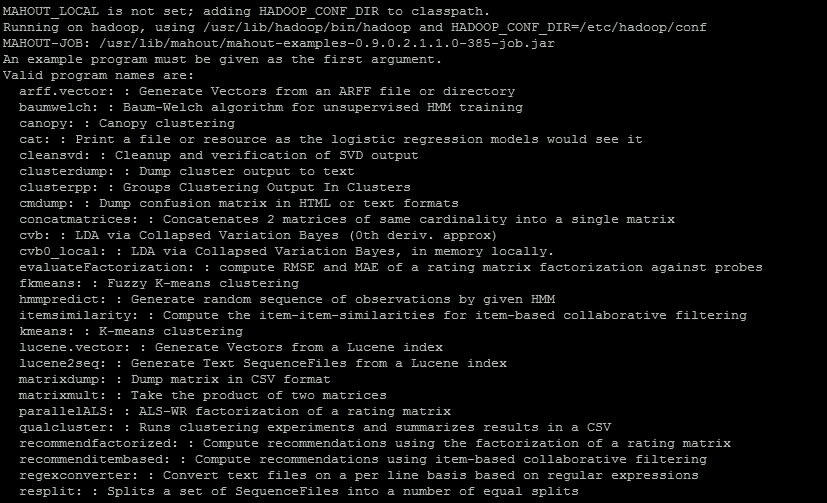
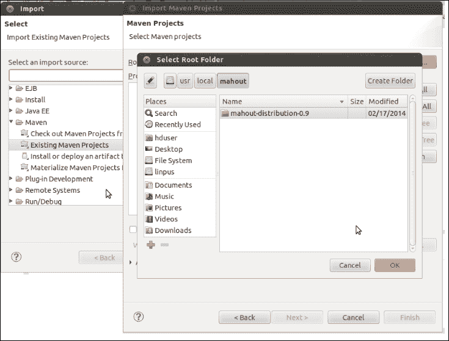
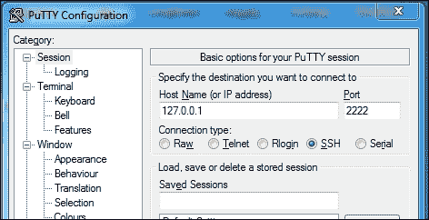
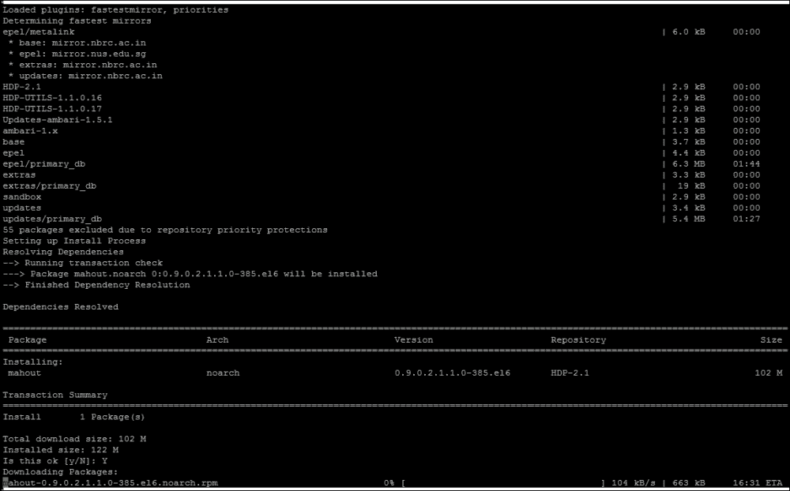

# 第二章：Apache Mahout

在上一章中，我们讨论了分类，并探讨了 Mahout 在该领域提供的算法。在探讨这些算法之前，我们需要了解 Mahout 及其安装。在本章中，我们将探讨以下主题：

+   什么是 Apache Mahout？

+   Mahout 支持的算法

+   为什么它是分类问题的好选择？

+   设置 Mahout 开发环境

# 介绍 Apache Mahout

Mahout 是指骑乘和控制大象的人。Apache Mahout 中的大多数算法都是在 Hadoop 之上实现的，Hadoop 是另一个 Apache 许可的项目，并以大象为标志 ([`hadoop.apache.org/`](http://hadoop.apache.org/))。由于 Apache Mahout 在 Hadoop 上运行，这个名字是合理的。

Apache Mahout 是 Apache 软件基金会的一个项目，它实现了机器学习算法。Mahout 于 2008 年作为 Apache Lucene 项目的子项目启动。经过一段时间，一个名为 **Taste** 的开源项目，该项目是为了协同过滤而开发的，后来被纳入 Mahout。Mahout 使用 Java 编写，并提供可扩展的机器学习算法。当数据太大而无法适应单个机器时，Mahout 是机器学习问题的默认选择。Mahout 提供了 Java 库，但不提供任何用户界面或服务器。它是一个开发者可以使用和适应的工具框架。


总结来说，Mahout 为你在分类、聚类和推荐领域的常用机器学习算法提供了实现。它不是让我们花时间编写算法，而是提供了现成的解决方案。

Mahout 使用 Hadoop 来实现其算法，但其中一些算法也可以在没有 Hadoop 的情况下运行。目前，Mahout 支持以下用例：

+   **推荐**：这会根据用户数据尝试预测用户可能喜欢的项目。在这个用例中，你可以看到所有向用户销售商品的网站。基于你的先前行为，他们会尝试找出可能有用的未知项目。一个例子可以是：当你从亚马逊选择一些书籍时，网站会显示一系列其他书籍，标题为 **Customers Who Bought This Item Also Bought**。它还会显示标题，**What Other Items Do Customers Buy After Viewing This Item?** 推荐的另一个例子是在 YouTube 上播放视频时，根据你的选择推荐你听一些其他视频。Mahout 提供了完整的 API 支持来开发你自己的基于用户或基于项目的推荐引擎。

+   **分类**：如前一章所述，分类决定一个项目属于特定类别多少。用于过滤垃圾邮件的电子邮件分类是分类的一个经典例子。Mahout 提供了一套丰富的 API 来构建自己的分类模型。例如，可以使用 Mahout 构建文档分类器或电子邮件分类器。

+   **聚类**：这是一种试图根据某种相似性将项目分组的技术。在这里，我们根据某些属性找到不同的项目簇，我们事先不知道簇的名称。聚类与分类的主要区别在于，在分类中，我们知道最终类别的名称。聚类在找出不同的客户细分市场时很有用。Google News 使用聚类技术来分组新闻。对于聚类，Mahout 已经实现了该领域最流行的算法，如 k-means、模糊 k-means、canopy 等。

+   **降维**：正如我们在上一章所讨论的，特征被称为维度。降维是减少考虑的随机变量数量的过程。这使得数据易于使用。Mahout 提供了降维算法。奇异值分解和 Lanczos 是 Mahout 提供的算法示例。

+   **主题建模**：主题建模用于捕捉文档的抽象思想。主题模型是一种将概率分布与每个文档的主题相关联的模型。鉴于一个文档是关于特定主题的，人们会期望某些词在文档中出现频率较高或较低。"足球"和"进球"将在关于体育的文档中出现的频率更高。**潜在狄利克雷分配**（**LDA**）是主题建模的一个强大学习算法。在 Mahout 中，实现了 LDA 的塌陷变分贝叶斯。

# Mahout 支持的算法

Mahout 中算法的实现可以分为两组：

+   **顺序算法**：这些算法是顺序执行的，不使用 Hadoop 可扩展处理。它们通常是来自 Taste 的算法。例如：基于用户的协同过滤、逻辑回归、隐马尔可夫模型、多层感知器、奇异值分解。

+   **并行算法**：这些算法可以使用 Hadoop 的 map 支持 PB 级的数据，从而减少并行处理。例如，随机森林、朴素贝叶斯、canopy 聚类、k-means 聚类、谱聚类等。

# 选择 Mahout 进行分类的原因

在机器学习系统中，您使用的数据越多，构建的系统就越准确。使用 Hadoop 进行可扩展性的 Mahout 在处理大型数据集方面远远领先于其他系统。随着训练集数量的增加，Mahout 的性能也会提高。如果训练示例的输入大小从 100 万增加到 1000 万，那么 Mahout 是一个很好的选择。

对于分类问题，增加训练数据是有益的，因为它可以提高模型的准确性。通常，随着数据集数量的增加，内存需求也会增加，算法会变慢，但 Mahout 的可扩展和并行算法在处理时间方面表现更好。每增加一台新机器都会减少训练时间并提供更高的性能。

# 安装 Mahout

现在我们来尝试这本书的稍微有点挑战性的部分：Mahout 的安装。根据常见经验，我总结出以下用户在安装前可能会遇到的问题或疑虑：

+   我对 Maven 一无所知。我该如何编译 Mahout 构建？

+   我该如何设置 Eclipse 以在 Mahout 中编写自己的程序？

+   如何在 Windows 系统上安装 Mahout？

因此，我们将通过以下步骤安装 Mahout。每个步骤都是独立的。您可以选择以下任何一个：

+   使用 Maven 构建 Mahout 代码

+   使用 Eclipse 设置开发环境

+   为 Windows 用户设置 Mahout

在任何步骤之前，以下是一些先决条件：

+   您应该在系统上安装 Java。Wikihow 是 Linux 上安装 Java 的好资源，请参阅[`www.wikihow.com/Install-Java-on-Linux`](http://www.wikihow.com/Install-Java-on-Linux)

+   您应该从[`hadoop.apache.org/docs/stable/hadoop-project-dist/hadoop-common/SingleNodeSetup.html`](http://hadoop.apache.org/docs/stable/hadoop-project-dist/hadoop-common/SingleNodeSetup.html) URL 安装 Hadoop

## 使用 Maven 从源代码构建 Mahout

Mahout 的构建和发布系统基于 Maven。

### 安装 Maven

1.  创建文件夹`/usr/local/maven`，如下所示：

    ```py
    mkdir /usr/local/maven

    ```

1.  从 Maven 网站下载发行版`apache-maven`-`x.y.z-bin.tar.gz`（[`maven.apache.org/download.cgi`](http://maven.apache.org/download.cgi)），并将其移动到`/usr/local/maven`，如下所示：

    ```py
    mv apache-maven-x.y.z-bin.tar.gz /usr/local/maven
    ```

1.  解压到`/usr/local/maven`位置，如下所示：

    ```py
    tar –xvf apache-maven-x.y.z-bin.tar.gz
    ```

1.  编辑`.bashrc`文件，如下所示：

    ```py
    export M2_HOME=/usr/local/apache-maven-x.y.z
    export M2=$M2_HOME/bin
    export PATH=$M2:$PATH

    ```

### 注意

对于 Eclipse IDE，转到**帮助**并选择**安装新软件**。点击**添加**按钮，在弹出的窗口中输入名称`M2Eclipse`，提供链接[`download.eclipse.org/technology/m2e/releases`](http://download.eclipse.org/technology/m2e/releases)，然后点击**确定**。

### 构建 Mahout 代码

默认情况下，Mahout 假定系统上已经安装了 Hadoop。Mahout 使用`HADOOP_HOME`和`HADOOP_CONF_DIR`环境变量来访问 Hadoop 集群配置。为了设置 Mahout，执行以下步骤：

1.  从[`archive.apache.org/dist/mahout/0.9/`](http://archive.apache.org/dist/mahout/0.9/)位置下载 Mahout 分发文件 `mahout-distribution-0.9-src.tar.gz`。

1.  选择 Mahout 的安装目录（`/usr/local/Mahout`），并将下载的源文件放置在该文件夹中。解压源代码并确保文件夹包含 `pom.xml` 文件。以下是源代码的确切位置：

    ```py
    tar -xvf  mahout-distribution-0.9-src.tar.gz

    ```

1.  安装 Mahout Maven 项目，并在安装时跳过测试用例，操作如下：

    ```py
    mvn install -Dmaven.test.skip=true

    ```

1.  在 `~/.bashrc` 文件中设置 `MAHOUT_HOME` 环境变量，并更新 `PATH` 变量以包含 `Mahout bin` 目录：

    ```py
    export MAHOUT_HOME=/user/local/mahout/mahout-distribution-0.9
    export PATH=$PATH:$MAHOUT_HOME/bin

    ```

1.  要测试 Mahout 安装，执行命令：`mahout`。这将列出分发包内的可用程序，如下截图所示：



## 使用 Eclipse 设置开发环境

对于此设置，您应该在系统上安装 Maven 和 Eclipse 的 Maven 插件。参考前面章节中解释的 *安装 Maven* 步骤。此设置可以按以下步骤完成：

1.  从[`archive.apache.org/dist/mahout/0.9/`](http://archive.apache.org/dist/mahout/0.9/)位置下载 Mahout 分发文件 `mahout-distribution-0.9-src.tar.gz` 并解压：

    ```py
    tar xzf mahout-distribution-0.9-src.tar.gz

    ```

1.  在 `/usr/local/workspace` 下创建一个名为 `workspace` 的文件夹，操作如下：

    ```py
    mkdir /usr/local/workspace

    ```

1.  将下载的分发文件移动到该文件夹（从下载文件夹），操作如下：

    ```py
    mv mahout-distribution-0.9 /usr/local/workspace/

    ```

1.  移动到 `/usr/local/workspace/mahout-distribution-0.9` 文件夹并创建一个 Eclipse 项目（此命令可能需要一个小时）：

    ```py
    mvn eclipse:eclipse

    ```

1.  在 `.bashrc` 文件中设置 Mahout home，如前面 *构建 Mahout 代码* 部分所述。

1.  现在，打开 Eclipse。选择文件，导入 Maven，并选择 **Existing Maven Projects**。现在，导航到 **mahout-distribution-0.9** 的位置并点击 **Finish**。

## 为 Windows 用户设置 Mahout

Windows 用户可以使用 Cygwin（一个包含大量 GNU 和开源工具的集合，在 Windows 上提供类似于 Linux 分发的功能）来设置他们的环境。还有另一种简单易用的方式，如下步骤所示：

1.  从[`hortonworks.com/products/hortonworks-sandbox/#install`](http://hortonworks.com/products/hortonworks-sandbox/#install)位置下载适用于虚拟盒子的 Hortonworks Sandbox。您的系统上的 Hortonworks Sandbox 将是 Hadoop 的伪分布式模式。

1.  登录到控制台。使用 *Alt* + *F5* 或作为替代，下载 Putty 并提供 **127.0.0.1** 作为主机名和 **2222** 作为端口号，如图所示。使用用户名 `root` 和密码 `-hadoop` 登录。

1.  输入以下命令：

    ```py
    yum install mahout

    ```

    现在，您将看到如下屏幕：

    

1.  输入`y`，你的 Mahout 将开始安装。一旦完成，你可以通过输入命令`mahout`来测试，这将显示与之前看到的*使用 Eclipse 设置开发环境*食谱中相同的屏幕。

# 摘要

在本章中，我们详细讨论了 Apache Mahout。我们涵盖了在系统上安装 Mahout 的过程，以及设置一个准备好执行 Mahout 算法的开发环境。我们还探讨了为什么 Mahout 被认为是分类的良好选择的原因。现在，我们将进入下一部分，我们将了解逻辑回归，并学习在 Mahout 中执行第一个算法需要遵循的过程。
