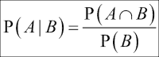
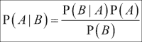
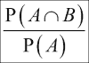
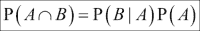
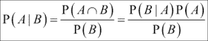
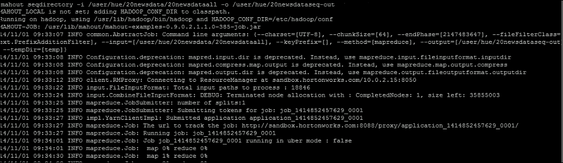
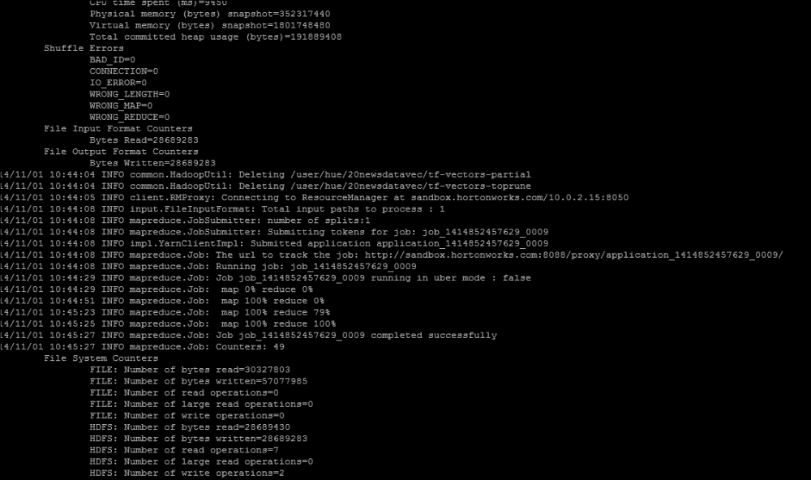
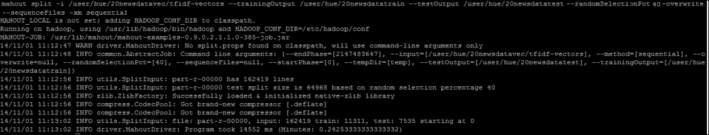
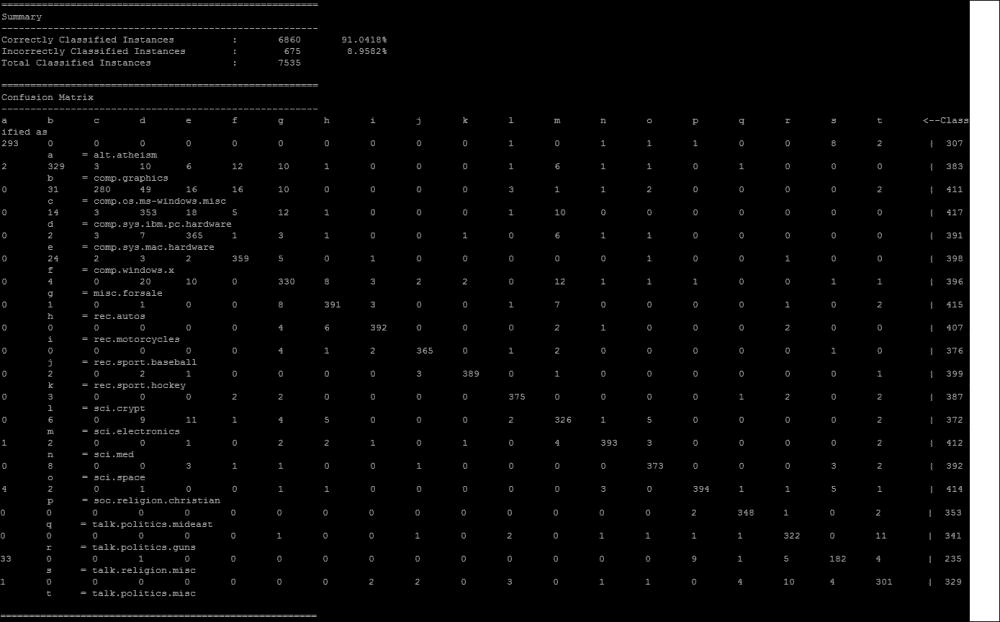

# 第四章：使用 Mahout 学习朴素贝叶斯分类

在本章中，我们将使用朴素贝叶斯分类算法对一组文档进行分类。由于涉及到的数据准备步骤，对文本文档进行分类有点棘手。在本章中，我们将探讨以下主题：

+   条件概率和贝叶斯定理

+   理解朴素贝叶斯算法

+   理解文本分类中使用的术语

+   在 Apache Mahout 中使用朴素贝叶斯算法

# 介绍条件概率和贝叶斯定理

在学习朴素贝叶斯算法之前，你应该了解条件概率和贝叶斯定理。

简单来说，条件概率是在已知另一件事情已经发生的情况下，某件事情发生的概率。它表示为 *P(A/B)*，可以读作在 B 的条件下 A 的概率，它找出在事件 B 已经发生的情况下事件 A 发生的概率。

从数学上定义如下：



例如，如果你从一副标准的扑克牌中抽取一张牌，如果有人问你这张牌是红桃的概率，你会很快回答 13/52 或 0.25，因为牌中有 13 张红桃牌。然而，如果你然后查看这张牌并宣布它是红色的，那么我们将把这张牌的可能性缩小到 26 张可能的牌，这张牌是红桃的概率现在是 13/26 = 0.5。所以，如果我们定义 A 为红桃牌，B 为红牌，那么 *P(A/B)* 将是已知这张牌是红色的条件下，这张牌是红桃的概率。

有时，对于给定的一对事件，条件概率难以计算，而贝叶斯定理通过给出两个条件概率之间的关系来帮助我们。

贝叶斯定理定义为如下：



公式中的术语定义如下：

+   **P(A)**: 这被称为先验概率或先验

+   **P(B/A)**: 这被称为条件概率或似然

+   **P(B)**: 这被称为边缘概率

+   **P(A/B)**: 这被称为后验概率或后验

以下公式仅从条件概率公式推导而来。我们可以定义 *P(B/A)* 如下：



重新排列后，公式变为：



现在，从先前的条件概率公式中，我们得到以下：



让我们举一个例子，这个例子将帮助我们理解贝叶斯定理是如何应用的。

当患者确实受到癌症影响时，癌症测试以 97%的概率给出阳性结果，而当患者未受到影响时，以 99%的概率给出阴性结果。如果从一个人群中随机抽取一个患者，该人群中 0.2%的人受到癌症影响，并且他被发现是阳性的，那么他或她确实受到癌症影响的概率是多少？在概率论中，我们关于这个问题的了解可以定义为以下内容：

*P (阳性|癌症) = 0.97*

*P (阳性|无癌症) = 1-0.99 = 0.01*

*P (癌症) = 0.002*

*P (无癌症) = 1-0.002= 0.998*

*P (阳性) = P (阳性|癌症) P (癌症) + P (阳性|无癌症) P (无癌症)*

*= 0.97*0.002 + 0.01*0.998*

*= 0.01192*

现在 *P (癌症|阳性) = (0.97*0.002)/0.01192 = 0.1628*

因此，即使发现阳性，在这个例子中，患者受到癌症影响的概率大约是 16%。

# 理解朴素贝叶斯算法

在贝叶斯定理中，我们了解到结果仅基于一个证据，但在分类问题中，我们有多个证据，并且我们必须预测结果。在朴素贝叶斯中，我们解耦多个证据，并独立地处理每一个。它定义如下：

*P (结果 | 多个证据) ) = P (证据 1|结果)* P (证据 2|结果)* P (证据 3|结果) …… /P (证据)*

对每个可能的结果运行这个公式。由于我们正在尝试分类，每个结果都将被称为一个类别。我们的任务是查看证据（特征）以考虑它属于特定类别的可能性，然后相应地分配。具有最高概率的类别将被分配给该组合的证据。让我们用一个例子来理解这一点。

假设我们有关于 1000 件水果的数据。它们可能是香蕉、苹果或其他水果。我们知道每件水果的三个特征：

+   **大小**：它们要么是长，要么不是长

+   **味道**：它们要么是甜的，要么不是甜的

+   **颜色**：它们要么是黄色，要么不是黄色

假设我们有一个如下所示的数据集：

| 水果类型 | 味道 – 甜 | 味道 – 不甜 | 颜色 – 黄色 | 颜色 – 非黄色 | 大小 – 长 | 大小 – 非长 | 总计 |
| --- | --- | --- | --- | --- | --- | --- | --- |
| **香蕉** | 350 | 150 | 450 | 50 | 400 | 100 | 500 |
| **苹果** | 150 | 150 | 100 | 200 | 0 | 300 | 300 |
| **其他** | 150 | 50 | 50 | 150 | 100 | 100 | 200 |
| **总计** | 650 | 350 | 600 | 400 | 500 | 500 | 1000 |

现在我们来看看我们拥有的东西：

*P (香蕉) = 500/1000 = 0.5*

*P (苹果) = 300/1000 = 0.3*

*P (其他) = 200/1000 = 0.2*

让我们看看特征的概率：

*P (甜) = 650/1000 = 0.65*

*P (黄色) = 600/1000 = 0.6*

*P (长) = 500/1000 = 0.5*

*P (非甜) = 350/1000 = 0.35*

*P (非黄色) = 400/1000= 0.4*

*P (非长) = 500/1000 = 0.5*

现在我们想知道如果它既不黄也不长也不甜，我们将有什么水果。它成为苹果的概率如下：

*P (Apple| sweet, not long, not yellow) = P (sweet | Apple)* P (not long | Apple)* P (not yellow | Apple)*P (Apple)/P (sweet)* P (not long) *P (not yellow)*

*= 0.5*1*0.67*0.3/P (证据)*

*= 0.1005/P (证据)*

它成为香蕉的概率如下：

*P (banana| sweet, not long, not yellow) = P (sweet | banana)* P (not long | banana)* P (not yellow | banana)*P (banana)/P (sweet)* P (not long) *P (not yellow)*

*= 0.7*0.2*0.1*0.5/P (证据)*

*= 0.007/P (证据)*

它成为任何其他水果的概率如下：

*P (other fruit| sweet, not long, not yellow) = P (sweet | other fruit)* P (not long | other fruit)* P (not yellow | other fruit) *P (other fruit)/P (sweet)* P (not long) *P (not yellow)*

*= 0.75*0.5*0.75*0.2/P (证据)*

*= 0.05625/ P (证据)*

因此，从结果中，你可以看到如果水果是甜的、不长的、不是黄色的，那么最高的概率是它将是一个苹果。所以找出最高的概率，并将未知项分配到那个类别。

Naïve Bayes 是文本分类的一个非常好的选择。在我们继续在 Mahout 中使用 Naïve Bayes 进行文本分类之前，让我们了解一些对文本分类非常有用的术语。

# 理解文本分类中使用的术语

准备数据以便它可以被分类器使用是一个复杂的过程。从原始数据中，我们可以收集解释变量和目标变量并将它们编码为 **向量**，这是分类器的输入。

向量是有序的值列表，如定义在二维空间中。你也可以从坐标几何中得到线索。点 (3, 4) 是 x 和 y 平面上的一个点。在 Mahout 中，情况不同。在这里，一个向量可以有 (3, 4) 或 10,000 个维度。

Mahout 提供了创建向量的支持。在 Mahout 中有两种类型的向量实现：稀疏向量和密集向量。对于文本分类，我们需要了解一些术语：

+   **词袋模型**：这把每个文档视为单词的集合。它忽略了单词顺序、语法和标点符号。因此，如果每个单词都是一个特征，那么计算文档单词的特征值就表示为一个标记。如果存在，则赋予其值 1，如果不存在，则赋予其值 0。

+   **词频**：这考虑了文档中的单词计数而不是 0 和 1。因此，单词的重要性随着它在文档中出现的次数而增加。考虑以下示例句子：

    苹果已经推出了 iPhone，它将继续推出类似的产品。其他竞争对手也在计划推出类似 iPhone 的产品。

以下表示词频的表格：

| 术语 | 数量 |
| --- | --- |
| Apple | 1 |
| 启动 | 3 |
| iPhone | 2 |
| 产品 | 2 |
| 计划 | 1 |

以下技术通常用于生成此类表格：

+   **词干提取**：这样，从单词中移除了后缀，所以"launched"、"launches"和"launch"都被视为"launch"。

+   **案例归一化**：这样，每个术语都被转换为小写。

+   **停用词去除**：有一些词几乎出现在每个文档中。我们称这些词为停用词。在从文档中提取重要特征时，这些词会被考虑，但它们对整体计算没有帮助。这些词的例子有"是、有、这、那个、等等"。所以，在提取时，我们将忽略这类词。

+   **逆文档频率**：这被认为是术语因罕见而获得的提升。一个术语不应该太常见。如果一个术语出现在每个文档中，它对分类并不好。一个术语出现在的文档越少，它对其出现的文档的重要性可能就越大。对于一个术语 t，逆文档频率的计算如下：

    *IDF(t) = 1 + log(总文档数/包含 t 的文档数)*

+   **词频和逆文档频率**：这是文本的流行表示之一。它是词频和逆文档频率的乘积，如下所示：

    *TFIDF(t, d) = TF(t, d) * IDF(t)*

每个文档都是一个特征向量，文档的集合是一组这些特征向量，这组向量作为分类的输入。现在我们已经了解了文本文档向量创建的基本概念，让我们继续到下一节，我们将使用朴素贝叶斯算法对文本文档进行分类。

# 在 Apache Mahout 中使用朴素贝叶斯算法

我们将使用 20 个新闻组的数据集来完成这个练习。20 个新闻组数据集是一个标准数据集，通常用于机器学习研究。数据来自 20 个 Usenet 新闻组在 20 世纪 90 年代初发布的几个月的帖子记录。这个数据集由消息组成，每个文件一个消息。每个文件以标题行开始，指定了诸如谁发送了消息、消息有多长、使用了什么软件以及主题等信息。随后是一个空行，然后是消息体，作为未格式化的文本。

从[`qwone.com/~jason/20Newsgroups/`](http://qwone.com/~jason/20Newsgroups/)下载`20news-bydate.tar.gz`数据集。以下步骤用于使用 Mahout 构建朴素贝叶斯分类器：

1.  创建一个`20newsdata`目录并将数据解压到这里：

    ```py
    mkdir /tmp/20newsdata
    cd /tmp/20newsdata
    tar –xzvf /tmp/20news-bydate.tar.gz

    ```

1.  在`20newsdata: 20news-bydate-test`和`20news-bydate-train`下你会看到两个文件夹。现在创建另一个名为`20newsdataall`的目录，并将 20 个新闻组的训练数据和测试数据合并。

1.  退出目录并移动到`home`目录，然后执行以下操作：

    ```py
    mkdir /tmp/20newsdataall
    cp –R /20newsdata/*/* /tmp/20newsdataall

    ```

1.  在 Hadoop 中创建一个目录并将这些数据以 HDFS 格式保存：

    ```py
    hadoop fs –mkdir /user/hue/20newsdata
    hadoop fs –put /tmp/20newsdataall /user/hue/20newsdata

    ```

1.  将原始数据转换为序列文件。`seqdirectory`命令将从目录生成序列文件。序列文件用于 Hadoop。序列文件是一个由二进制键/值对组成的平面文件。我们将文件转换为序列文件，以便在 Hadoop 中处理，可以使用以下命令完成：

    ```py
    bin/mahout seqdirectory -i /user/hue/20newsdata/20newsdataall  -o /user/hue/20newsdataseq-out

    ```

    以下截图显示了前一个命令的输出：

    

1.  使用以下命令将序列文件转换为稀疏向量：

    ```py
    bin/mahout seq2sparse -i /user/hue/20newsdataseq-out/part-m-00000 -o /user/hue/20newsdatavec -lnorm -nv -wt tfidf

    ```

    前一个命令中使用的术语如下：

    +   `lnorm`：这表示输出向量要进行对数归一化

    +   `nv`：这指的是命名向量

    +   `wt`：这指的是要使用的权重类型；在这里，我们使用`tfidf`

    以下截图显示了在控制台上执行前一个命令的输出：

    

1.  将向量集分为训练集和测试集：

    ```py
    bin/mahout split -i /user/hue/20newsdatavec/tfidf-vectors --trainingOutput /user/hue/20newsdatatrain --testOutput /user/hue/20newsdatatest --randomSelectionPct 40 --overwrite --sequenceFiles -xm sequential

    ```

    前一个命令中使用的术语如下：

    +   `randomSelectionPct`：这会将数据百分比分为测试集和训练集。在这里，60%用于测试，40%用于训练。

    +   `xm`：这指的是要使用的执行方法：顺序或 mapreduce。默认为`mapreduce`。

    

1.  现在训练模型：

    ```py
    bin/mahout trainnb -i /user/hue/20newsdatatrain -el -o /user/hue/model -li /user/hue/labelindex -ow -c

    ```

1.  使用以下命令测试模型：

    ```py
    bin/mahout testnb -i /user/hue/20newsdatatest -m /user/hue/model/ -l  /user/hue/labelindex -ow -o /user/hue/results

    ```

    以下截图显示了在控制台上执行前一个命令的输出：

    

我们得到了针对 20 个新闻组的 Naïve Bayes 分类器的结果。

# 摘要

在本章中，我们讨论了 Naïve Bayes 算法。这是一种简单但备受推崇的统计模型，在工业和学术界都得到了广泛应用，并且在许多场合都产生了良好的结果。我们最初讨论了条件概率和贝叶斯定理。然后，我们看到了 Naïve Bayes 算法的一个示例。你学习了将文本转换为向量格式的各种方法，这是分类器的输入。最后，我们使用 20 个新闻组数据集，在 Mahout 中使用 Naïve Bayes 算法构建了一个分类器。在下一章中，我们将继续探索在 Mahout 中使用隐马尔可夫模型实现分类算法的旅程。
