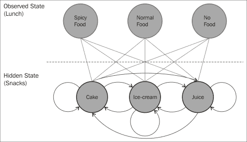
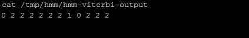

# 第五章. 使用 Mahout 学习隐马尔可夫模型

在本章中，我们将介绍分类技术中最有趣的主题之一：**隐马尔可夫模型**（**HMM**）。为了理解 HMM，我们将在本章中介绍以下主题：

+   确定性和非确定性模式

+   马尔可夫过程

+   介绍 HMM

+   使用 Mahout 进行 HMM

# 确定性和非确定性模式

在确定性系统中，每个状态仅依赖于它之前的状态。例如，让我们以一组交通信号灯为例。灯光的序列是红色→绿色→黄色→红色。所以，在这里我们知道当前状态之后将是什么状态。一旦确定了转换，确定性系统就很容易理解。

对于非确定性模式，考虑一个名叫鲍勃的人，他每天下午 4:00 吃零食的例子。假设他从菜单上的三个选项中任选其一：冰淇淋、果汁或蛋糕。即使我们知道他今天吃什么，我们也无法确定他明天会吃什么。这是一个非确定性模式的例子。

# 马尔可夫过程

在马尔可夫过程中，下一个状态依赖于前面的状态。如果我们假设我们有一个*n*状态系统，那么下一个状态将依赖于前面的*n*个状态。这个过程被称为*n*阶模型。在马尔可夫过程中，我们以概率的方式选择下一个状态。所以，考虑到我们之前的例子，如果鲍勃今天喝了果汁，他明天可以喝果汁、冰淇淋或蛋糕。同样，我们可以从上一个状态达到系统中的任何状态。马尔可夫过程如下图中所示：


如果一个过程中有*n*个状态，那么我们可以通过 n² 个转换达到任何状态。我们移动到任何状态的概率，因此我们将有 n² 个这样做概率。对于马尔可夫过程，我们将有以下三个项目：

+   **状态**：这指的是系统中的状态。在我们的例子中，让我们假设有三个状态：状态 1、状态 2 和状态 3。

+   **转移矩阵**：这将包含从一个状态移动到任何其他状态的概率。以下截图显示了转移矩阵的示例：

    这个矩阵显示，如果系统昨天处于状态 1，那么它今天保持同一状态的概率将是 0.1。

+   **初始状态向量**：这是系统的初始状态向量。（在这个向量中，任何一个状态将有 1 的概率，其余状态将有 0 的概率。）

# 介绍隐马尔可夫模型

**隐马尔可夫模型**（**HMM**）是一种分类技术，通过观察结果来预测系统的状态，而不需要访问实际的州本身。它是一个状态是隐藏的马尔可夫模型。

让我们继续之前看到的鲍勃的零食例子。现在假设我们有一个直接可观察的事件集。我们知道鲍勃吃了什么午餐，他的零食摄入量与他的午餐有关。因此，我们有一个观察状态，即鲍勃的午餐，以及隐藏状态，即他的零食摄入量。我们想要构建一个算法，可以根据鲍勃的午餐预测他选择的零食。



除了隐马尔可夫模型中的转移概率矩阵外，我们还有一个称为**发射矩阵**的矩阵。这个矩阵包含在分配了一个隐藏状态的情况下，可观察状态的概率。发射矩阵如下：

P (可观察状态 | 一个状态)

因此，隐马尔可夫模型具有以下属性：

+   **状态向量**：这包含隐藏模型在开始时处于特定状态的概率

+   **转移矩阵**：这包含给定前一个隐藏状态时隐藏状态的概率

+   **发射矩阵**：给定隐藏模型处于特定隐藏状态，这包含观察特定可观察状态的概率

+   **隐藏状态**：这指的是可以由隐马尔可夫模型定义的系统状态

+   **可观察状态**：在过程中可见的状态

使用隐马尔可夫模型可以解决三种类型的问题。前两种与模式识别问题相关，第三种类型的问题是在给定一系列观察的情况下生成一个隐马尔可夫模型。让我们看看这三种类型的问题：

+   **评估**：这是在给定一个隐马尔可夫模型（HMM）的情况下，找出观察序列的概率。从描述不同系统和一系列观察的不同隐马尔可夫模型的数量，我们的目标将是找出哪个 HMM 最有可能生成所需的序列。我们使用前向算法来计算当给定一个特定的 HMM 时观察序列的概率，并找出最可能的 HMM。

+   **解码**：这是从某些观察中找到最可能的隐藏状态序列。当你有一系列观察和一个隐马尔可夫模型（HMM）时，我们使用维特比算法来确定最可能的隐藏状态序列。

+   **学习**：学习是从一系列观察中生成 HMM。所以，如果我们有这样的序列，我们可能会想知道哪个模型最有可能生成这个序列。前向-后向算法在解决这个问题时很有用。

隐马尔可夫模型被用于不同的应用，如语音识别、手写字母识别、基因组分析、词性标注、客户行为建模等。

# 使用 Mahout 进行隐马尔可夫模型

Apache Mahout 有隐马尔可夫模型的实现。它位于 `org.apache.mahout.classifier.sequencelearning.hmm` 包中。

整体实现由八个不同的类提供：

+   `HMMModel`: 这是定义隐马尔可夫模型的主要类。

+   `HmmTrainer`: 这个类有用于训练隐马尔可夫模型的算法。主要算法包括监督学习、无监督学习和无监督 Baum-Welch。

+   `HmmEvaluator`: 这个类提供了评估 HMM 模型的不同方法。以下用例包含在这个类中：

    +   从模型（预测）生成输出状态的序列

    +   计算给定模型生成给定输出状态序列的概率（模型似然）

    +   计算给定模型和给定观察序列的最可能隐藏序列（解码）

+   `HmmAlgorithms`: 这个类包含三个主要 HMM 算法的实现：前向、后向和维特比。

+   `HmmUtils`: 这是一个实用类，提供处理 HMM 模型对象的方法。

+   `RandomSequenceGenerator`: 这是一个命令行工具，可以根据给定的 HMM 生成序列。

+   `BaumWelchTrainer`: 这是一个从控制台训练 HMM 的类。

+   `ViterbiEvaluator`: 这也是一个用于维特比评估的命令行工具。

现在，让我们用鲍勃的例子来操作。

以下是一个给定的矩阵和初始概率向量：

| 冰淇淋 | 蛋糕 | 果汁 |
| --- | --- | --- |
| 0.36 | 0.51 | 0.13 |

以下将是状态转移矩阵：

|   | 冰淇淋 | 蛋糕 | 果汁 |
| --- | --- | --- | --- |
| **冰淇淋** | 0.365 | 0.500 | 0.135 |
| **蛋糕** | 0.250 | 0.125 | 0.625 |
| **果汁** | 0.365 | 0.265 | 0.370 |

以下将是发射矩阵：

|   | 辣食 | 正常食物 | 没有食物 |
| --- | --- | --- | --- |
| **冰淇淋** | 0.1 | 0.2 | 0.7 |
| **蛋糕** | 0.5 | 0.25 | 0.25 |
| **果汁** | 0.80 | 0.10 | 0.10 |

现在，我们将执行这个问题的基于命令行的示例。鲍勃吃零食的三个隐藏状态：冰淇淋、蛋糕或果汁。然后，我们有三个可观察状态，即他在午餐时吃什么：辣食、正常食物或完全不吃。现在，以下是从命令行执行的步骤：

1.  创建一个名为`hmm`的目录：`mkdir /tmp/hmm`。进入此目录并创建观察状态的样本输入文件。这将包括鲍勃午餐习惯的序列：辣食（状态 0）、正常食物（状态 1）和没有食物（状态 2）。执行以下命令：

    ```py
    echo "0 1 2 2 2 1 1 0 0 2 1 2 1 1 1 1 2 2 2 0 0 0 0 0 0 2 2 2 0 0 0 0 0 0 1 1 1 1 2 2 2 2 2 0 2 1 2 0 2 1 2 1 1 0 0 0 1 0 1 0 2 1 2 1 2 1 2 1 1 0 0 2 2 0 2 1 1 0" > hmm-input

    ```

1.  使用以下命令运行 BaumWelch 算法来训练模型：

    ```py
    mahout baumwelch -i /tmp/hmm/hmm-input -o /tmp/hmm/hmm-model -nh 3 -no 3 -e .0001 -m 1000

    ```

    在前面的命令中使用的参数如下：

    +   `i`: 这是输入文件的位置

    +   `o`: 这是模型的输出位置

    +   `nh`: 这是隐藏状态的数量。在我们的例子中，它是三个（冰淇淋、果汁或蛋糕）

    +   `no`: 这是可观察状态的数量。在我们的例子中，它是三个（辣的、正常的或没有食物）

    +   `e`: 这是 epsilon 数值。这是收敛阈值值

    +   `m`: 这是最大迭代次数

    以下截图显示了执行上一个命令的输出：

    

1.  现在我们有一个 HMM 模型，可以用来构建预测序列。我们将运行该模型，使用以下命令预测可观测序列的下一个 15 个状态：

    ```py
    mahout hmmpredict -m /tmp/hmm/hmm-model -o /tmp/hmm/hmm-predictions -l 10

    ```

    上述命令中使用的参数如下：

    `m`：这是 HMM 模型的路径

    `o`：这是输出目录路径

    `l`：这是生成的序列长度

1.  要查看下一个 10 个可观测状态的预测，请使用以下命令：

    ```py
    mahout hmmpredict -m /tmp/hmm/hmm-model -o /tmp/hmm/hmm-predictions -l 10

    ```

    上述命令的输出如下截图所示：

    

    从输出中，我们可以得出结论，Bob 的午餐下一个可观测状态将是辣的，辣的，辣的，正常，正常，没有食物，没有食物，没有食物，没有食物，以及没有食物。

1.  现在，我们将使用另一个算法来预测隐藏状态。我们将使用 Viterbi 算法来预测给定观测状态序列的隐藏状态。我们将首先使用以下命令创建观测状态的序列：

    ```py
    echo "0 1 2 0 2 1 1 0 0 1 1 2" > /tmp/hmm/hmm-viterbi-input

    ```

1.  我们将使用 Viterbi 命令行选项来生成具有生成此序列似然值的输出：

    ```py
    mahout viterbi --input /tmp/hmm/hmm-viterbi-input --output tmp/hmm/hmm-viterbi-output --model /tmp/hmm/hmm-model --likelihood

    ```

    上述命令中使用的参数如下：

    +   `input`：这是文件的输入位置

    +   `output`：这是 Viterbi 算法输出的输出位置

    +   `model`：这是我们之前创建的 HMM 模型位置

    +   `likelihood`：这是计算出的观测序列的似然值

    以下截图显示了执行上述命令的输出：

    

1.  Viterbi 的预测结果保存在输出文件中，可以使用 `cat` 命令查看：

    ```py
    cat /tmp/hmm/hmm-viterbi-output

    ```

    以下输出显示了隐藏状态的预测：

    

# 摘要

在本章中，我们讨论了另一种分类技术：隐马尔可夫模型。你学习了确定性和非确定性模式。我们还简要介绍了马尔可夫过程和隐马尔可夫过程。我们检查了 Mahout 中实现以支持隐马尔可夫模型的类。我们举了一个例子来创建 HMM 模型，并进一步使用此模型来预测观测状态序列。我们使用了 Mahout 中实现的 Viterbi 算法来预测系统中的隐藏状态。

现在，在下一章中，我们将介绍分类领域中使用的另一个有趣的算法：随机森林。
