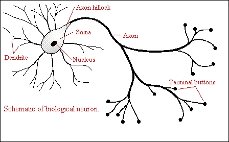
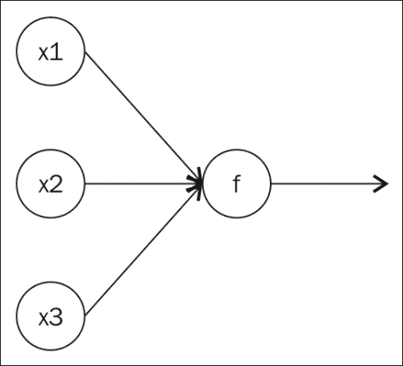
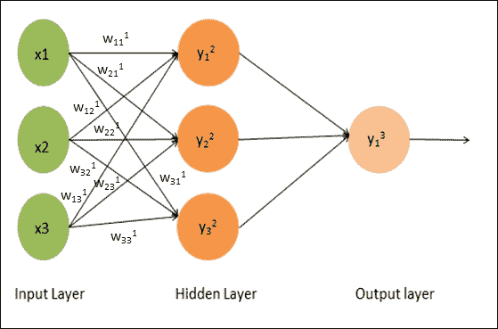
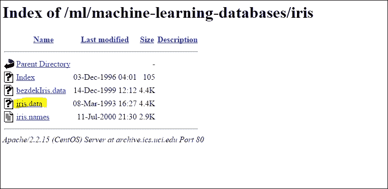
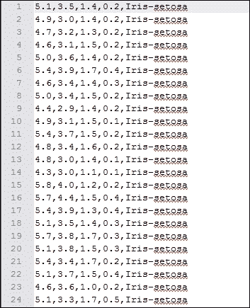
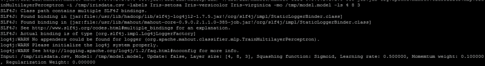
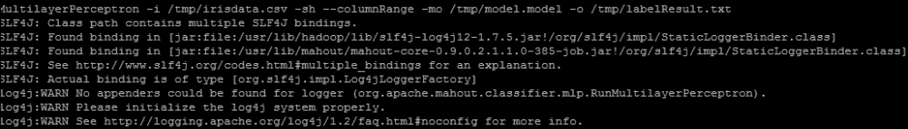

# 第七章. 使用 Mahout 学习多层感知器

要理解**多层感知器**（**MLP**），我们首先将探索一种更流行的机器学习技术：**神经网络**。在本章中，我们将探讨以下主题：

+   神经网络和神经元

+   MLP

+   使用 Mahout 进行 MLP 实现

# 神经网络和神经元

神经网络是一个古老的算法，它的开发目标是给计算机提供大脑。神经网络受到人类大脑生物结构的启发，其中多个神经元连接并形成列和层。**神经元**是一个电可兴奋的细胞，通过电和化学信号处理和传输信息。感知输入通过我们的感官器官进入神经网络，然后进一步处理到更高层次。让我们了解神经元在我们大脑中的工作方式。

神经元是大脑中的计算单元，它们从输入神经（称为**树突**）收集输入。它们对这些输入信息进行计算，并通过输出神经（称为**轴突**）发送输出。请参见以下图示 ([`vv.carleton.ca/~neil/neural/neuron-a.html`](http://vv.carleton.ca/~neil/neural/neuron-a.html))：



同样地，我们在计算机中开发神经网络。我们可以在以下图中表示我们的算法中的神经元：



在这里，**x1**、**x2**和**x3**是特征向量，它们被分配给一个函数**f**，该函数将进行计算并提供输出。这个激活函数通常从 S 形函数家族中选择（如第三章中定义，第三章，*使用 Mahout 学习逻辑回归 / SGD*）。在分类问题的情况下，使用 softmax 激活函数。在分类问题中，我们希望输出是目标类别的概率。因此，输出应介于 0 和 1 之间，总和接近 1。softmax 函数强制执行这些约束。它是逻辑函数的推广。有关 softmax 函数的更多详细信息，请参阅 [`www.faqs.org/faqs/ai-faq/neural-nets/part2/section-12.html`](http://www.faqs.org/faqs/ai-faq/neural-nets/part2/section-12.html)。

# 多层感知器

神经网络或人工神经网络通常指的是 MLP 网络。我们在上一节中定义了神经元为计算机中的实现。MLP 网络由多个层的这些神经元单元组成。让我们了解一个三层感知器网络，如图所示。MLP 的第一层代表输入，除了将输入路由到每个连接单元的前馈方式外，没有其他目的。第二层被称为隐藏层，最后一层具有确定输出的特殊目的。隐藏层中神经元的激活可以定义为所有输入权重的总和。第 2 层的第 1 个神经元定义如下：

Y12 = g(w110x0 +w111x1+w112x2+w113x3)

第一部分，其中*x0 = 0*，被称为偏置，可以用作偏移，与输入无关。第 2 层的第 2 个神经元定义如下：

Y22 = g(w120x0 +w121x1+w122x2+w123x3)



第 2 层的第 3 个神经元定义如下：

Y32 = g (w130x0 +w131x1+w132x2+w133x3)

在这里，g 是 sigmoid 函数，如第三章中定义的，*使用 Mahout 学习逻辑回归/SGD*。函数如下：

g(z) = 1/1+e (-z)

在这个 MLP 网络输出中，从每个输入和隐藏层，神经元单元分布到其他节点，这就是为什么这种网络被称为全连接网络。在这个网络中，没有值被反馈到前一层。（前馈是另一种策略，也称为反向传播。有关详细信息，请参阅[`home.agh.edu.pl/~vlsi/AI/backp_t_en/backprop.html`](http://home.agh.edu.pl/~vlsi/AI/backp_t_en/backprop.html)。)

MLP 网络可以有多于一个的隐藏层。为了得到权重值，以便我们能够将预测值尽可能接近实际值，这是一个 MLP 的训练过程。为了构建一个有效的网络，我们考虑了许多项目，例如隐藏层的数量和每层的神经元单元数，最小化预测值和实际值之间误差的成本函数，等等。

现在我们来讨论在创建 MLP 网络时出现的两个更重要且具有挑战性的问题：

+   应该使用多少个隐藏层来构建网络？

+   在隐藏层中应该使用多少个隐藏单元（神经元单元）？

对于线性可分的数据，不需要隐藏层。假设你的数据确实需要通过非线性技术进行分离，始终从一个隐藏层开始。几乎可以肯定，这将是所有你需要的东西。如果你的数据可以使用 MLP 进行分离，那么这个 MLP 可能只需要一个隐藏层。为了选择不同层的单元数，以下是一些指导原则：

+   **输入层**：这指的是模型中的解释变量数量加上一个偏置节点。

+   **输出层**：在分类的情况下，这指的是目标变量的数量，而在回归的情况下，这显然是一个。

+   **隐藏层**：从单个隐藏层开始构建你的网络，并使用与输入层单元数量相当的神经元单元数量。最好的方法是训练几个具有不同隐藏层和隐藏神经元数量的神经网络，并使用交叉验证来衡量这些网络的性能。你可以坚持使用产生最佳性能网络的数字。需要两个隐藏层的问题很少遇到。然而，具有多个隐藏层的神经网络可以表示任何形状的函数。目前还没有理论来证明使用超过两个隐藏层的神经网络是合理的。实际上，对于许多实际问题，没有必要使用超过一个隐藏层。没有隐藏层的网络只能表示线性可分函数。单层网络可以逼近任何包含从一个有限空间到另一个连续映射的函数，而具有两个隐藏层的网络可以使用有理激活函数以任意精度表示任意决策边界，并且可以逼近任何平滑映射以任意精度（Java 神经网络入门第五章）。

+   **神经元或隐藏单元的数量**：使用与输入层单元数量相当的神经元单元数量。隐藏单元的数量应小于输入层单元数量的两倍。另一种计算方法是 *(输入单元数量 + 输出单元数量)* 2/3。

进行泛化误差、训练误差、偏差和方差的测试。当泛化误差下降时，通常在它开始再次增加之前，会发现节点数量在此点达到完美。

现在让我们继续到下一节，探讨如何使用 Mahout 进行 MLP。

# Mahout 中的 MLP 实现

MLP 实现基于一个更通用的神经网络类。它被实现为在单个机器上使用随机梯度下降运行，其中权重是使用每个数据点一次进行更新的。

可以手动指定层数和每层的单元数，这决定了整个拓扑结构，每个单元都与前一层的每个单元完全连接。每个层的输入自动添加一个偏差单元。偏差单元有助于将激活函数向左或向右移动。它就像给线性函数添加一个系数一样。

目前，逻辑 Sigmoid 函数被用作每个隐藏层和输出层的压缩函数。

命令行版本不会在小数据集上导致不良结果的迭代。另一个限制是，MLP 的 CLI 版本仅支持分类，因为当在命令行中执行实现时，必须明确给出标签。

可以使用 `--update` 标志存储和更新学习模型，并使用新的训练实例。分类结果的输出保存为 `.txt` 文件，并且仅包含分配的标签。除了命令行界面外，还可以使用 `mrlegacy` 包中的 API 和接口构建和编译更专业的神经网络。（核心包已重命名为 `mrlegacy`。）

在命令行中，我们使用 `TrainMultilayerPerceptron` 和 `RunMultilayerPerceptron` 类，这些类在 `mrlegacy` 包中可用，与另外三个类一起使用：`Neural network.java`、`NeuralNetworkFunctions.java` 和 `MultilayerPerceptron.java`。对于这个特定的实现，用户可以自由控制 MLP 的拓扑结构，包括以下内容：

+   输入层的大小

+   隐藏层的数量

+   每个隐藏层的大小

+   输出层的大小

+   成本函数

+   挤压函数

模型以在线学习的方式进行训练，其中 MLP 中的神经元权重使用 Rumelhart, D. E.、Hinton, G. E. 和 Williams, R. J.（1986）提出的反向传播算法进行更新和增加。（*Rumelhart, D. E., Hinton, G. E., and Williams, R. J. (1986), Learning representations by back-propagating errors. Nature, 323, 533-536*。）

# 使用 Mahout 进行 MLP

Mahout 为 MLP 网络提供了实现。MLP 实现目前位于 `Map-Reduce-Legacy` 包中。与其他分类算法一样，实现了两个分离的类来训练和使用这个分类器。用于训练分类器的类是 `org.apache.mahout.classifier.mlp.TrainMultilayerPerceptron`，用于运行分类器的类是 `org.apache.mahout.classifier.mlp.RunMultilayerPerceptron`。定义了多个参数，这些参数与这些类一起使用，但我们将在我们对数据集运行示例后讨论这些参数。

**数据集**

在本章中，我们将训练一个 MLP 来对鸢尾花数据集进行分类。鸢尾花数据集包含三种花卉物种的数据，每个数据点由四个特征组成。这个数据集是由罗纳德·费舍尔爵士引入的。它包括来自三种鸢尾花物种的 50 个样本。这些物种是 Iris setosa、Iris virginica 和 Iris versicolor。从每个样本测量了四个特征：

+   萼片长度

+   花瓣宽度

+   花瓣长度

+   花瓣宽度

所有测量值都以厘米为单位。您可以从 [`archive.ics.uci.edu/ml/machine-learning-databases/iris/`](https://archive.ics.uci.edu/ml/machine-learning-databases/iris/) 下载此数据集，并将其保存为 `.csv` 文件，如下截图所示：



这个数据集看起来如下截图所示：



## 在 Mahout 中使用 MLP 算法的步骤

在 Mahout 中使用 MLP 算法的步骤如下：

1.  创建 MLP 模型。

    要创建 MLP 模型，我们将使用 `TrainMultilayerPerceptron` 类。使用以下命令生成模型：

    ```py
    bin/mahout org.apache.mahout.classifier.mlp.TrainMultilayerPerceptron -i /tmp/irisdata.csv -labels Iris-setosa Iris-versicolor Iris-virginica -mo /tmp/model.model -ls 4 8 3 -l 0.2 -m 0.35 -r 0.0001

    ```

    您也可以使用核心 jar 运行：Mahout 核心 jar（`xyz` 代表版本）。如果您直接安装了 Mahout，它可以在 `/usr/lib/mahout` 文件夹下找到。执行以下命令：

    ```py
    Java –cp /usr/lib/mahout/ mahout-core-xyz-job.jar org.apache.mahout.classifier.mlp.TrainMultilayerPerceptron -i /tmp/irisdata.csv -labels Iris-setosa Iris-versicolor Iris-virginica -mo /user/hue/mlp/model.model -ls 4 8 3 -l 0.2 -m 0.35 -r 0.0001

    ```

    这里使用 `TrainMultilayerPerceptron` 类，它接受不同的参数。此外，`i` 是输入数据集的路径。在这里，我们将数据集放在了 `/tmp` 文件夹下（本地文件系统）。此外，数据集中还定义了标签。以下是我们定义的标签：

    +   `mo` 是创建的模型的输出位置。

    +   `ls` 是每层的单元数，包括输入层、隐藏层和输出层。此参数指定了网络的拓扑结构。在这里，我们使用 `4` 作为输入特征，`8` 作为隐藏层，`3` 作为输出类别数。

    +   `l` 是用于权重更新的学习率。默认值为 0.5。为了近似梯度下降，神经网络通过算法进行训练。学习可以通过批量或在线方法进行。在批量训练中，权重变化在整个训练数据展示（一个 epoch）之后才会应用，而在在线训练中，在每个训练示例（实例）展示后更新权重。更多详情请参阅 [`axon.cs.byu.edu/papers/Wilson.nn03.batch.pdf`](http://axon.cs.byu.edu/papers/Wilson.nn03.batch.pdf)。

    +   `m` 是用于梯度下降的动量权重。这个值必须在 0–1.0 的范围内。

    +   `r` 是权重向量的正则化值。这个值必须在 0–0.1 的范围内。它用于防止过拟合。

    

1.  要测试/运行训练模型的 MLP 分类，我们可以使用以下命令：

    ```py
    bin/mahout org.apache.mahout.classifier.mlp.RunMultilayerPerceptron -i /tmp/irisdata.csv -cr 0 3 -mo /tmp/model.model -o /tmp/labelResult.txt

    ```

    您也可以使用 Mahout 核心 jar 运行（`xyz` 代表版本）。如果您直接安装了 Mahout，它可以在 `/usr/lib/mahout` 文件夹下找到。执行以下命令：

    ```py
    Java –cp /usr/lib/mahout/ mahout-core-xyz-job.jar org.apache.mahout.classifier.mlp.RunMultilayerPerceptron -i /tmp/irisdata.csv -cr 0 3 -mo /tmp/model.model -o /tmp/labelResult.txt

    ```

    这里使用 `RunMultilayerPerceptron` 类来使用模型。此类也接受不同的参数，如下所示：

    +   `i` 表示输入数据集的位置

    +   `cr` 是从输入文件中使用的列的范围，从 0 开始（即 `-cr 0 5` 仅包括前六列）

    +   `mo` 是先前构建的模型的位置

    +   `o` 是存储模型运行结果的标签化结果的路径

    

# 摘要

在本章中，我们讨论了 Mahout 中新实施的一个算法：MLP。我们通过理解神经网络和神经元单元开始了我们的讨论，并进一步讨论以理解 MLP 网络算法。我们讨论了如何选择不同的层单元。然后我们转向 Mahout，并使用 iris 数据集来测试和运行 Mahout 中实现的 MLP 算法。至此，我们已经完成了对 Apache Mahout 中可用的分类算法的讨论。

现在我们继续进入这本书的下一章节，我们将讨论新发布的 Mahout 版本中的新变化。
