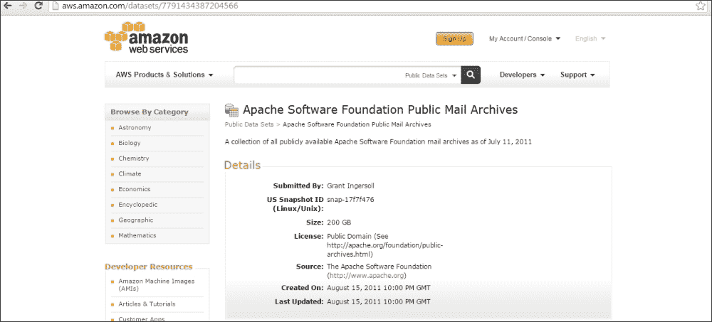

# 第九章：使用 Apache Mahout 构建电子邮件分类系统

在本章中，我们将使用 Mahout 创建一个分类器系统。为了构建这个系统，我们将涵盖以下主题：

+   获取数据集

+   数据集准备

+   准备模型

+   训练模型

在本章中，我们将针对创建两个不同的分类器。第一个将是一个简单的分类器，因为你可以在一个伪分布式 Hadoop 安装上创建和测试它。对于第二个分类器，我将提供所有细节，以便你可以使用你的完全分布式 Hadoop 安装来运行它。我将把第二个分类器视为本书读者的实践练习。

首先，让我们了解第一个用例的问题陈述。如今，在大多数电子邮件系统中，我们看到电子邮件被分类为垃圾邮件或非垃圾邮件。非垃圾邮件直接进入我们的收件箱，而垃圾邮件则存储在名为 `Spam` 的文件夹中。通常，基于某些模式，如消息主题、发件人的电子邮件地址或消息体中的某些关键词，我们将 incoming 电子邮件分类为垃圾邮件。我们将使用 Mahout 创建一个分类器，将电子邮件分类为垃圾邮件或非垃圾邮件。我们将使用 SpamAssassin，一个 Apache 开源项目数据集来完成这项任务。

对于第二个用例，我们将创建一个分类器，它可以预测一组 incoming 电子邮件。作为一个开源项目，Apache 软件基金会下有许多项目，例如 Apache Mahout、Apache Hadoop、Apache Solr 等。我们将使用 **Apache** **软件基金会** (**ASF**) 的电子邮件数据集，并使用这个数据集来创建和训练我们的模型，以便我们的模型可以预测新的 incoming 电子邮件。因此，基于某些特征，我们将能够预测新 incoming 电子邮件属于哪个组。

在 Mahout 的分类问题中，我们将在数据集中识别一个模式，以帮助我们预测新电子邮件的组别。我们已经有了一个数据集，它被项目名称分开。我们将使用 ASF 公共电子邮件存档数据集来处理这个用例。

现在，让我们考虑我们的第一个用例：垃圾邮件检测分类器。

# 垃圾邮件数据集

正如我提到的，我们将使用 Apache SpamAssassin 项目数据集。Apache SpamAssassin 是一个开源的垃圾邮件过滤器。从 [`spamassassin.apache.org/publiccorpus/`](http://spamassassin.apache.org/publiccorpus/) 下载 `20021010_easy_ham.tar` 和 `20021010_spam.tar`，如下截图所示：


# 使用 Assassin 数据集创建模型

我们可以通过以下步骤创建模型：

1.  在 `tmp` 目录下创建一个名为 `dataset` 的文件夹，然后点击该文件夹，使用以下命令解压数据集：

    ```py
    mkdir /tmp/assassin/dataset
    tar –xvf  /tmp/assassin/ 20021010_easy_ham.tar.bz2 
    tar –xvf /tmp/assassin/ 20021010_spam.tar.bz2

    ```

    这将在 `dataset` 文件夹下创建两个文件夹，`easy _ham` 和 `spam`，如下截图所示：

    

1.  在`Hdfs`中创建一个文件夹并将此数据集移动到 Hadoop 中：

    ```py
    hadoop fs  -mkdir /user/hue/assassin/
    hadoop fs –put /tmp/assassin/dataset  /user/hue/assassin 
    tar –xvf /tmp/assassin/ 20021010_spam.tar.bz2

    ```

    现在我们已完成数据准备。我们已经下载了数据并将这些数据移动到`hdfs`中。让我们继续下一步。

1.  将此数据转换为序列文件，以便我们可以使用 Hadoop 进行处理：

    ```py
    bin/mahout seqdirectory –i /user/hue/assassin/dataset –o /user/hue/assassinseq-out

    ```

    

1.  使用以下命令将`sequence`文件转换为稀疏向量（Mahout 算法接受向量格式的输入，因此我们需要将`sequence`文件转换为稀疏向量）：

    ```py
    bin/mahout seq2sparse -i /user/hue/assassinseq-out/part-m-00000 -o /user/hue/assassinvec -lnorm -nv -wt tfidf

    ```

    

    上一张截图中的命令解释如下：

    +   `lnorm`: 这个命令用于输出向量的对数归一化。

    +   `nv`: 这个命令用于命名向量。

    +   `wt`: 这个命令用于确定要使用的权重类型。在这里我们使用`tf-idf`。

1.  按以下方式拆分向量集以训练和测试模型：

    ```py
    bin/mahout split -i /user/hue/assassinvec/tfidf-vectors --trainingOutput /user/hue/assassindatatrain --testOutput /user/hue/assassindatatest --randomSelectionPct 20 --overwrite --sequenceFiles -xm sequential

    ```

    上一条命令可以这样解释：

    +   `randomSelectionPct` 参数将数据百分比分为测试集和训练集。在这种情况下，测试集为 80%，训练集为 20%。

    +   `xm` 参数指定了要使用的`tf (tf-idf)`向量的部分，以标准差倍数表示。

    +   符号σ指定了这些向量的文档频率。它可以用来移除真正高频的术语。它以双精度值表示。一个合适的值是 3.0。如果值小于`0`，则不会过滤掉任何向量。

    

1.  现在，使用以下命令训练模型：

    ```py
    bin/mahout trainnb -i /user/hue/assassindatatrain -el -o /user/hue/prodmodel -li /user/hue/prodlabelindex -ow -c

    ```

    

1.  现在，使用以下命令测试模型：

    ```py
    bin/mahout testnb -i /user/hue/assassindatatest -m /user/hue/prodmodel/ -l  /user/hue/prodlabelindex -ow -o /user/hue/prodresults

    ```

    

您可以从结果中看到，输出显示在控制台上。根据矩阵，系统正确分类了 99.53%的实例。

我们可以使用这个创建的模型来对新文档进行分类。为此，我们可以使用 Java 程序或创建一个可以部署到我们服务器上的 servlet。

让我们以这个练习的例子来分析一个 Java 程序。

# 使用分类模型模型的程序

我们将创建一个 Java 程序，该程序将使用我们的模型来对新电子邮件进行分类。该程序将接受模型、标签索引、字典文件、文档频率和文本文件作为输入，并为类别生成分数。类别将根据较高的分数来决定。

让我们一步一步地看看这个程序：

+   制作此程序所需的`.jar`文件如下：

    +   `Hadoop-core-x.y.x.jar`

    +   `Mahout-core-xyz.jar`

    +   `Mahout-integration-xyz.jar`

    +   `Mahout-math-xyz.jar`

+   `import` 语句列表如下。我们讨论这个问题是因为 Mahout 的版本中有很多变化，人们通常发现很难找到正确的类。

    +   `import java.io.BufferedReader;`

    +   `import java.io.FileReader;`

    +   `import java.io.StringReader;`

    +   `import java.util.HashMap;`

    +   `import java.util.Map;`

    +   `import org.apache.hadoop.conf.Configuration;`

    +   `import org.apache.hadoop.fs.Path;`

    +   `import org.apache.lucene.analysis.Analyzer;`

    +   `import org.apache.lucene.analysis.TokenStream;`

    +   `import org.apache.lucene.analysis.standard.StandardAnalyzer;`

    +   `import org.apache.lucene.analysis.tokenattributes.CharTermAttribute;`

    +   `import org.apache.lucene.util.Version;`

    +   `import org.apache.mahout.classifier.naivebayes.BayesUtils;`

    +   `import org.apache.mahout.classifier.naivebayes.NaiveBayesModel;`

    +   `import org.apache.mahout.classifier.naivebayes.StandardNaiveBayesClassifier;`

    +   `import org.apache.mahout.common.Pair;`

    +   `import org.apache.mahout.common.iterator.sequencefile.SequenceFileIterable;`

    +   `import org.apache.mahout.math.RandomAccessSparseVector;`

    +   `import org.apache.mahout.math.Vector;`

    +   `import org.apache.mahout.math.Vector.Element;`

    +   `import org.apache.mahout.vectorizer.TFIDF;`

    +   `import org.apache.hadoop.io.*;`

    +   `import com.google.common.collect.ConcurrentHashMultiset;`

    +   `import com.google.common.collect.Multiset;`

+   读取字典的支持方法如下：

    ```py
    public static Map<String, Integer> readDictionary(Configuration conf, Path dictionaryPath) {
      Map<String, Integer> dictionary = new HashMap<String, Integer>();
      for (Pair<Text, IntWritable> pair : new SequenceFileIterable<Text, IntWritable>(dictionaryPath, true, conf)) {
        dictionary.put(pair.getFirst().toString(), pair.getSecond().get());
      }
      return dictionary;
    }
    ```

+   读取文档频率的支持方法如下：

    ```py
    public static Map<Integer, Long> readDocumentFrequency(Configuration conf, Path documentFrequencyPath) {
      Map<Integer, Long> documentFrequency = new HashMap<Integer, Long>();
      for (Pair<IntWritable, LongWritable> pair : new SequenceFileIterable<IntWritable, LongWritable>(documentFrequencyPath, true, conf)) {
        documentFrequency.put(pair.getFirst().get(), pair.getSecond().get());
      }
      return documentFrequency;
    }
    ```

+   `main` 方法的第一部分用于执行以下操作：

    +   获取输入

    +   加载模型

    +   使用我们创建的模型初始化 `StandardNaiveBayesClassifier`

    +   读取在创建向量时从数据集创建的 `labelindex`、文档频率和字典

        以下代码可用于执行前面的操作：

        ```py
        public static void main(String[] args) throws Exception {
          if (args.length < 5) {
            System.out.println("Arguments: [model] [labelindex] [dictionary] [documentfrequency] [new file] ");
            return;
          }
          String modelPath = args[0];
          String labelIndexPath = args[1];
          String dictionaryPath = args[2];
          String documentFrequencyPath = args[3];
          String newDataPath = args[4];
          Configuration configuration = new Configuration(); // model is a matrix (wordId, labelId) => probability score
          NaiveBayesModel model = NaiveBayesModel.materialize(new Path(modelPath), configuration); 
          StandardNaiveBayesClassifier classifier = new StandardNaiveBayesClassifier(model); 
          // labels is a map label => classId
          Map<Integer, String> labels = BayesUtils.readLabelIndex(configuration, new Path(labelIndexPath));
          Map<String, Integer> dictionary = readDictionary(configuration, new Path(dictionaryPath));
          Map<Integer, Long> documentFrequency = readDocumentFrequency(configuration, new Path(documentFrequencyPath));
        ```

+   `main` 方法的第二部分用于从电子邮件中提取单词：

    ```py
    Analyzer analyzer = new StandardAnalyzer(Version.LUCENE_CURRENT);

    int labelCount = labels.size();
    int documentCount = documentFrequency.get(-1).intValue();

    System.out.println("Number of labels: " + labelCount);
    System.out.println("Number of documents in training set: " + documentCount);
    BufferedReader reader = new BufferedReader(new FileReader(newDataPath));
    while(true) {
      String line = reader.readLine();
      if (line == null) {
        break;
      }

      ConcurrentHashMultiset<Object> words = ConcurrentHashMultiset.create(); 
      // extract words from mail
      TokenStream ts = analyzer.tokenStream("text", new StringReader(line));
      CharTermAttribute termAtt = ts.addAttribute(CharTermAttribute.class);
      ts.reset();
      int wordCount = 0;
      while (ts.incrementToken()) {
        if (termAtt.length() > 0) {
          String word = ts.getAttribute(CharTermAttribute.class).toString();
          Integer wordId = dictionary.get(word);
          // if the word is not in the dictionary, skip it
          if (wordId != null) {
            words.add(word);
            wordCount++;
          }
        }
      }
      ts.close();
    ```

+   `main` 方法的第三部分用于创建 `id` 单词的向量和 `tf-idf` 权重：

    ```py
    Vector vector = new RandomAccessSparseVector(10000);
    TFIDF tfidf = new TFIDF();
    for (Multiset.Entry entry:words.entrySet()) {
      String word =  (String)entry.getElement();
      int count = entry.getCount();
      Integer wordId = dictionary.get(word);
      Long freq = documentFrequency.get(wordId);
      double tfIdfValue = tfidf.calculate(count, freq.intValue(), wordCount, documentCount);
      vector.setQuick(wordId, tfIdfValue);
    }
    ```

+   在 `main` 方法的第四部分，使用 `classifier` 获取每个标签的分数，并将电子邮件分配给得分较高的标签：

    ```py
      Vector resultVector = classifier.classifyFull(vector);
        double bestScore = -Double.MAX_VALUE;
        int bestCategoryId = -1;          
        for(int i=0 ;i<resultVector.size();i++) {
          Element e1  = resultVector.getElement(i);
          int categoryId = e1.index();
          double score = e1.get();
          if (score > bestScore) {
            bestScore = score;
            bestCategoryId = categoryId;
          }
          System.out.print("  " + labels.get(categoryId) + ": " + score);
        }
        System.out.println(" => " + labels.get(bestCategoryId));
      }
    }
    ```

现在，将这些代码放在一个类中，并创建这个类的 `.jar` 文件。我们将使用这个 `.jar` 文件来测试我们新的电子邮件。

# 测试程序

要测试程序，请执行以下步骤：

1.  在本地目录中创建一个名为 `assassinmodeltest` 的文件夹，如下所示：

    ```py
    mkdir /tmp/assassinmodeltest

    ```

1.  要使用此模型，从 `hdfs` 获取以下文件到 `/tmp/assassinmodeltest`：

    +   对于之前创建的模型，使用以下命令：

        ```py
        hadoop fs –get /user/hue/prodmodel /tmp/assassinmodeltest

        ```

    +   对于 `labelindex`，使用以下命令：

        ```py
        hadoop fs –get /user/hue/prodlabelindex  /tmp/assassinmodeltest

        ```

    +   对于 `assassinvec` 文件夹中的 `df-counts`（将 `part-00000` 文件名更改为 `df-count`），使用以下命令：

        ```py
        hadoop fs –get /user/hue/assassinvec/df-count  /tmp/assassinmodeltest
        dictionary.file-0 from the same assassinvec folder
        hadoop fs –get /user/hue/assassinvec/dictionary.file-0  /tmp/assassinmodeltest

        ```

1.  在 `/tmp/assassinmodeltest` 目录下创建一个文件，其内容如以下截图所示：

1.  现在，使用以下命令运行程序：

    ```py
    Java –cp /tmp/assassinmodeltest/spamclassifier.jar:/usr/lib/mahout/* com.packt.spamfilter.TestClassifier /tmp/assassinmodeltest /tmp/assassinmodeltest/prodlabelindex /tmp/assassinmodeltest/dictionary.file-0 /tmp/assassinmodeltest/df-count /tmp/assassinmodeltest/testemail

    ```

    

1.  现在，更新`test`电子邮件文件，使用以下截图中的消息：

1.  再次使用步骤 4 中给出的相同命令运行程序，并查看以下结果：

现在，我们有一个程序可以用来使用我们的分类器模型并预测未知项。让我们继续我们的第二个用例。

# 作为练习的第二个用例

如本章开头所述，我们现在将处理第二个用例，在这个用例中，我们将预测一封新电子邮件的类别。

## ASF 电子邮件数据集

Apache 软件基金会电子邮件数据集按项目分区。此电子邮件数据集可在[`aws.amazon.com/datasets/7791434387204566`](http://aws.amazon.com/datasets/7791434387204566)找到。



可以在[`files.grantingersoll.com/ibm.tar.gz`](http://files.grantingersoll.com/ibm.tar.gz)找到较小的数据集。（参考[`lucidworks.com/blog/scaling-mahout/`](http://lucidworks.com/blog/scaling-mahout/)）。使用这些数据执行以下步骤：

1.  将这些数据移动到您选择的文件夹（`/tmp/asfmail`）并解压文件夹：

    ```py
    mkdir /tmp/asfmail
    tar –xvf  ibm.tar

    ```

1.  将数据集移动到`hdfs`：

    ```py
    hadoop fs -put /tmp/asfmail/ibm/content /user/hue/asfmail

    ```

1.  使用 Mahout 的`SequenceFilesFromMailArchives`将`mbox`文件转换为 Hadoop 的`SequenceFile`格式，如下所示：

    ```py
    mahout  org.apache.mahout.text.SequenceFilesFromMailArchives --charset "UTF-8" --body --subject --input /user/hue/asfmail/content --output /user/hue/asfmailout

    ```

    

1.  将`sequence`文件转换为稀疏向量：

    ```py
    mahout  seq2sparse --input /user/hue/asfmailout --output /user/hue/asfmailseqsp --norm 2 --weight TFIDF --namedVector --maxDFPercent 90 --minSupport 2 --analyzerName org.apache.mahout.text.MailArchivesClusteringAnalyzer

    ```

    

1.  修改标签：

    ```py
    mahout  org.apache.mahout.classifier.email.PrepEmailDriver --input /user/hue/asfmailseqsp --output /user/hue/asfmailseqsplabel --maxItemsPerLabel 1000

    ```

现在，接下来的三个步骤与我们之前执行的操作类似：

1.  使用以下命令将数据集拆分为`training`和`test`数据集：

    ```py
    mahout  split --input /user/hue/asfmailseqsplabel --trainingOutput /user/hue/asfmailtrain --testOutput /user/hue/asfmailtest  --randomSelectionPct 20 --overwrite --sequenceFiles

    ```

1.  使用以下方式使用`training`数据集训练模型：

    ```py
    mahout trainnb -i /user/hue/asfmailtrain -o /user/hue/asfmailmodel -extractLabels --labelIndex /user/hue/asfmaillabels

    ```

1.  使用`test`数据集测试模型：

    ```py
    mahout testnb -i /user/hue/asfmailtest -m /user/hue/asfmailmodel --labelIndex /user/hue/asfmaillabels

    ```

如您可能已经注意到的，所有步骤都与我们之前执行的操作完全相同。因此，我将这个主题留作练习，让您使用此模型创建自己的分类器系统。您可以使用提供的提示来创建垃圾邮件过滤器分类器。我们现在将讨论调整我们的分类器。让我们简要概述一下该领域的最佳实践。

# 分类器调整

我们已经在第一章 *数据分析中的分类* 中讨论了分类器的评估技术。仅作为提醒，我们使用混淆矩阵、熵矩阵、曲线下面积等技术来评估我们的模型。

从解释变量中，我们创建特征向量。为了检查特定模型的工作情况，这些特征向量需要被调查。在 Mahout 中，有一个用于此目的的类，`ModelDissector`。它需要以下三个输入：

+   **特征**：这个类接受一个要使用的特征向量（破坏性）

+   **TraceDictionary**：这个类接受一个包含变量及其在特征向量中受影响的位置的跟踪字典

+   **学习者**：这个课程采用我们正在探查的模型来寻找特征权重

`ModelDissector` 调整特征向量并观察模型输出的变化。通过取示例数量的平均值，我们可以确定不同解释变量的影响。

`ModelDissector` 有一个摘要方法，它返回最重要的特征及其权重、最重要的类别以及它们影响的几个顶级类别。

`ModelDissector` 的输出有助于解决错误创建的模型中的问题。

有关代码的更多细节可以在[`github.com/apache/mahout/blob/master/mrlegacy/src/main/java/org/apache/mahout/classifier/sgd/ModelDissector.java`](https://github.com/apache/mahout/blob/master/mrlegacy/src/main/java/org/apache/mahout/classifier/sgd/ModelDissector.java)找到。

在提高分类器输出时，应该注意两个常见问题：目标泄露和损坏的特征提取。

如果模型显示的结果太好以至于不真实或超出预期，我们可能存在目标泄露问题。这种错误发生在目标变量的信息被包含在用于训练分类器的解释变量中时。在这种情况下，分类器对 `test` 数据集的表现会太好。

另一方面，当特征提取失败时，会发生损坏的特征提取。这种类型的分类器会显示与目标泄露分类器相反的结果。在这里，模型提供的结果比预期更差。

要调整分类器，我们可以使用新的解释变量、解释变量的变换，也可以消除一些变量。我们还应该尝试不同的学习算法来创建模型，并选择一个在性能、训练时间和速度方面都好的算法。

更多关于调整的细节可以在《Mahout in Action》一书的第十六章“部署分类器”中找到。

# 摘要

在本章中，我们讨论了创建我们自己的生产就绪分类器模型。我们在这里提出了两个用例，一个是电子邮件垃圾邮件过滤器，另一个是根据项目对电子邮件进行分类。我们使用了 Apache SpamAssassin 的数据集用于电子邮件过滤器，以及 ASF 用于电子邮件分类器。

我们还看到了如何提高模型性能的方法。

因此，你现在可以准备好使用 Apache Mahout 实现分类器，用于你自己的实际用例。祝学习愉快！
