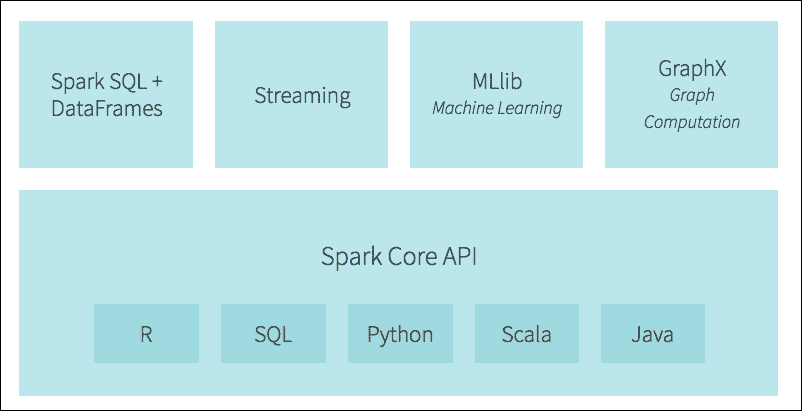
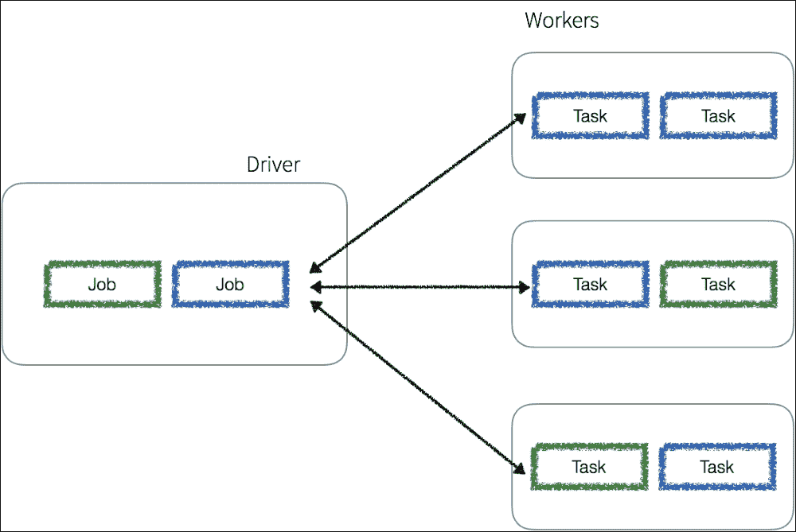
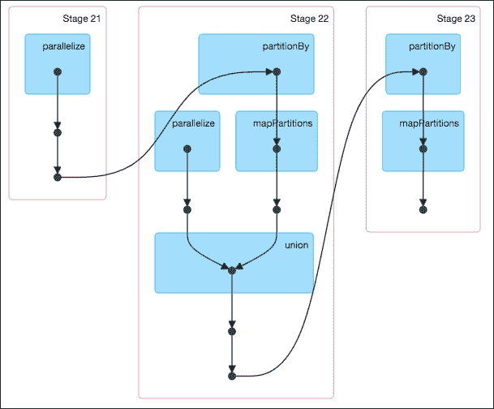
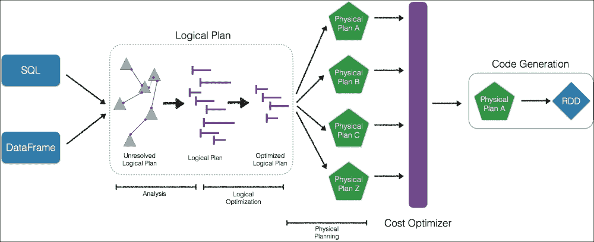
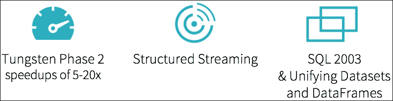
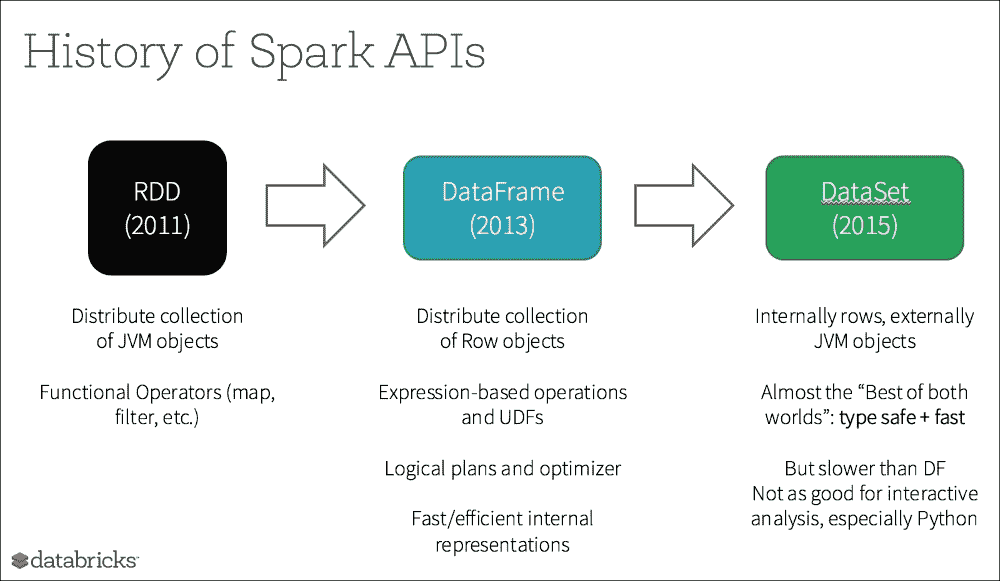
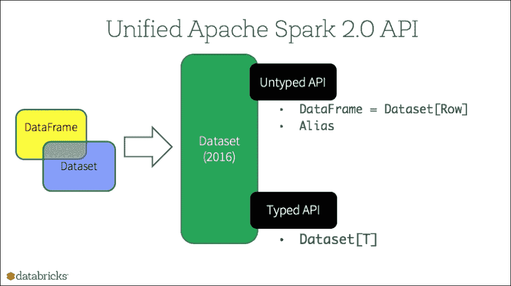
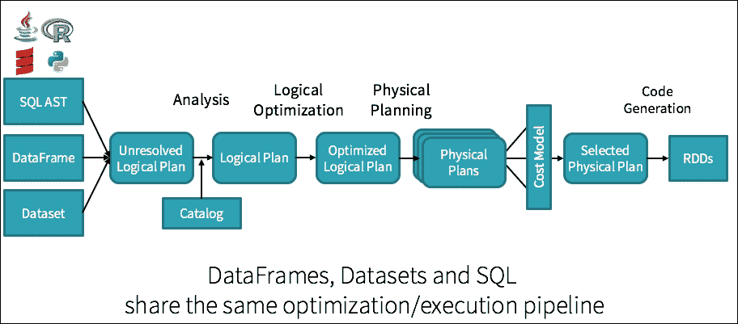
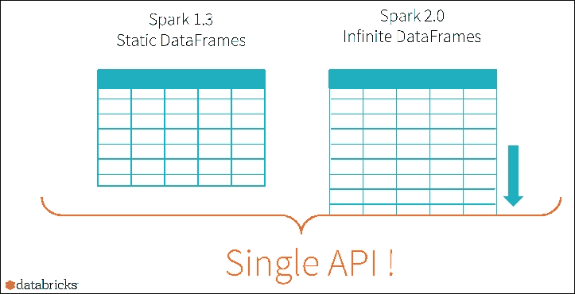
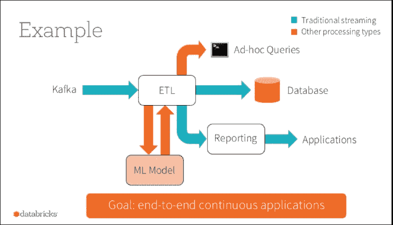

# 第一章：理解 Spark

Apache Spark 是一个强大的开源处理引擎，最初由 Matei Zaharia 在加州大学伯克利分校攻读博士学位时作为其博士论文的一部分开发。Spark 的第一个版本于 2012 年发布。从那时起，在 2013 年，Zaharia 共同创立了 Databricks，并成为其 CTO；他还在斯坦福大学担任教授，此前毕业于麻省理工学院。同时，Spark 代码库捐赠给了 Apache 软件基金会，并成为其旗舰项目。

Apache Spark 是一个快速、易于使用的框架，允许您解决各种复杂的数据问题，无论是半结构化、结构化、流式处理，还是机器学习/数据科学。它已经成为大数据领域最大的开源社区之一，拥有来自 250 多个组织的 1000 多名贡献者，以及全球 570 多个地点的 30 万多名 Spark Meetup 社区成员。

在本章中，我们将提供了解 Apache Spark 的基础。我们将解释 Spark 作业和 API 背后的概念，介绍 Spark 2.0 架构，并探讨 Spark 2.0 的功能。

涵盖的主题包括：

+   什么是 Apache Spark？

+   Spark 作业和 API

+   弹性分布式数据集（RDDs）、DataFrames 和 Dataset 综述

+   催化剂优化器和钨项目综述

+   Spark 2.0 架构综述

# 什么是 Apache Spark？

Apache Spark 是一个开源的强大分布式查询和处理引擎。它提供了 MapReduce 的灵活性和可扩展性，但速度显著更高：当数据存储在内存中时，速度可高达 Apache Hadoop 的 100 倍，当访问磁盘时，速度可高达 10 倍。

Apache Spark 允许用户轻松地读取、转换和聚合数据，以及训练和部署复杂的统计模型。Spark API 在 Java、Scala、Python、R 和 SQL 中均可访问。Apache Spark 可用于构建应用程序或将其打包成库以在集群上部署，或通过笔记本（例如，Jupyter、Spark-Notebook、Databricks 笔记本和 Apache Zeppelin）进行交互式地快速分析。

Apache Spark 向数据分析师、数据科学家或研究人员暴露了大量的库，这些人员曾使用过 Python 的`pandas`或 R 的`data.frames`或`data.tables`。需要注意的是，尽管 Spark DataFrames 对`pandas`或`data.frames` / `data.tables`用户来说可能很熟悉，但它们之间仍有一些差异，所以请调整您的期望。具有更多 SQL 背景的用户也可以使用该语言来塑造他们的数据。此外，Apache Spark 还提供了几个已实现和调优的算法、统计模型和框架：MLlib 和 ML 用于机器学习，GraphX 和 GraphFrames 用于图处理，以及 Spark Streaming（DStreams 和 Structured）。Spark 允许用户在同一个应用程序中无缝地组合这些库。

Apache Spark 可以轻松地在笔记本电脑上本地运行，也可以轻松地以独立模式、在 YARN 或 Apache Mesos 上部署 - 要么在本地集群中，要么在云中。它可以读取和写入多种数据源，包括但不限于 HDFS、Apache Cassandra、Apache HBase 和 S3：



来源：Apache Spark 是大数据的智能手机 [`bit.ly/1QsgaNj`](http://bit.ly/1QsgaNj)

### 注意

如需更多信息，请参阅：Apache Spark 是大数据的智能手机 [`bit.ly/1QsgaNj`](http://bit.ly/1QsgaNj)

# Spark 作业和 API

在本节中，我们将简要概述 Apache Spark 作业和 API。这为 Spark 2.0 架构的后续章节提供了必要的知识基础。

## 执行过程

任何 Spark 应用都会在 *master* 节点上启动一个单独的驱动进程（可能包含多个作业），然后根据以下图中所示，将执行进程（包含多个任务）分布到多个 *worker* 节点上：



驱动进程根据为给定作业生成的图确定要发送到执行节点的任务进程的数量和组成。请注意，任何工作节点都可以执行来自多个不同作业的任务。

Spark 作业与一系列对象依赖关系相关联，这些依赖关系组织在一个直接无环图（DAG）中，如下例所示，该图由 Spark UI 生成。基于此，Spark 可以优化这些任务的调度（例如，确定所需任务和工人的数量）和执行：



### 注意

关于 DAG 调度器的更多信息，请参阅 [`bit.ly/29WTiK8`](http://bit.ly/29WTiK8)。

## 弹性分布式数据集

Apache Spark 是围绕一组称为弹性分布式数据集（RDD，简称）的不可变 Java 虚拟机（JVM）对象构建的。由于我们使用 Python，因此重要的是要注意 Python 数据存储在这些 JVM 对象中。更多关于 RDD 和 DataFrame 的内容将在后续章节中讨论。这些对象允许任何作业快速执行计算。RDD 是在它们上计算、缓存和存储在内存中的：与 Apache Hadoop 等其他传统分布式框架相比，这种方案的计算速度要快得多。

同时，RDDs 提供了一些粗粒度的转换（如 `map(...)`, `reduce(...)`, 和 `filter(...)`，我们将在第二章 *Resilient Distributed Datasets* 中更详细地介绍），保持了 Hadoop 平台的灵活性和可扩展性，以执行各种计算。RDDs 并行应用和记录转换到数据中，从而提高了速度和容错性。通过注册转换，RDDs 提供数据血缘——以图形形式表示的中间步骤的祖先树。这实际上保护了 RDDs 防止数据丢失——如果 RDD 的一个分区丢失，它仍然有足够的信息来重新创建该分区，而不是仅仅依赖于复制。

### 注意

如果你想了解更多关于数据血缘的信息，请查看这个链接 [`ibm.co/2ao9B1t`](http://ibm.co/2ao9B1t)。

RDDs 有两套并行操作：*转换*（返回指向新 RDD 的指针）和*动作*（在执行计算后返回值到驱动程序）；我们将在后面的章节中更详细地介绍这些内容。

### 注意

关于最新的转换和动作列表，请参阅 Spark 编程指南 [`spark.apache.org/docs/latest/programming-guide.html#rdd-operations`](http://spark.apache.org/docs/latest/programming-guide.html#rdd-operations)。

RDD 转换操作在某种程度上是 *懒加载* 的，它们不会立即计算结果。转换只有在执行动作并且需要将结果返回给驱动程序时才会进行计算。这种延迟执行导致查询更加精细：针对性能优化的查询。这种优化从 Apache Spark 的 DAGScheduler 开始——一个以 *阶段* 为导向的调度器，如前一张截图所示使用 *阶段* 进行转换。通过将 RDD 的 *转换* 和 *动作* 分开，DAGScheduler 可以在查询中执行优化，包括能够避免 *shuffle*，即数据（最耗资源的任务）。

关于 DAGScheduler 和优化（特别是关于窄或宽依赖）的更多信息，一个很好的参考资料是 *High Performance Spark* 中的 *Narrow vs. Wide Transformations* 部分，位于 *第五章，有效的转换* ([`smile.amazon.com/High-Performance-Spark-Practices-Optimizing/dp/1491943203`](https://smile.amazon.com/High-Performance-Spark-Practices-Optimizing/dp/1491943203))。

## DataFrames

DataFrames，像 RDDs 一样，是在集群节点间分布的数据的不可变集合。然而，与 RDDs 不同，在 DataFrames 中，数据被组织成命名的列。

### 注意

如果你熟悉 Python 的 `pandas` 或 R 的 `data.frames`，这是一个类似的概念。

DataFrame 被设计得使大数据集的处理更加容易。它们允许开发者形式化数据的结构，允许更高层次的抽象；从这个意义上讲，DataFrame 类似于关系数据库世界中的表。DataFrame 提供了一个特定领域的语言 API 来操作分布式数据，并使 Spark 对更广泛的受众，而不仅仅是专业数据工程师，变得可访问。

DataFrame 的一大优点是 Spark 引擎最初构建一个逻辑执行计划，并根据成本优化器确定的物理计划执行生成的代码。与在 Python 中与 Java 或 Scala 相比可能显著较慢的 RDD 不同，DataFrame 的引入使得所有语言都实现了性能上的对等。

## Datasets

Spark 1.6 中引入的 Spark Datasets 的目标是提供一个 API，使用户能够轻松地表达对域对象的转换，同时提供强大 Spark SQL 执行引擎的性能和好处。不幸的是，在撰写本书时，Datasets 只在 Scala 或 Java 中可用。当它们在 PySpark 中可用时，我们将在未来的版本中介绍它们。

## Catalyst Optimizer

Spark SQL 是 Apache Spark 中技术含量最高的组件之一，因为它既支持 SQL 查询，也支持 DataFrame API。Spark SQL 的核心是 Catalyst 优化器。该优化器基于函数式编程结构，并设计有两个目的：简化新优化技术和功能添加到 Spark SQL 中，并允许外部开发者扩展优化器（例如，添加特定数据源规则，支持新数据类型等）：



### 注意

更多信息，请参阅 *Spark SQL 的 Catalyst 优化器深入解析* ([`bit.ly/271I7Dk`](http://bit.ly/271I7Dk)) 和 *Apache Spark DataFrame：结构化数据的简单快速分析* ([`bit.ly/29QbcOV`](http://bit.ly/29QbcOV))

## 项目 Tungsten

Tungsten 是 Apache Spark 执行引擎的一个总称项目代号。该项目专注于改进 Spark 算法，以便它们更有效地使用内存和 CPU，将现代硬件的性能推向极限。

该项目的努力主要集中在以下方面：

+   显式管理内存，以消除 JVM 对象模型和垃圾回收的开销

+   设计算法和数据结构以利用内存层次结构

+   在运行时生成代码，以便应用程序可以利用现代编译器并针对 CPU 进行优化

+   消除虚函数调度，以减少多个 CPU 调用

+   利用低级编程（例如，将即时数据加载到 CPU 寄存器中）来加速内存访问，并优化 Spark 引擎以高效地编译和执行简单的循环

### 注意

更多信息，请参阅

*Project Tungsten：将 Apache Spark 带到裸金属更近一步* ([`databricks.com/blog/2015/04/28/project-tungsten-bringing-spark-closer-to-bare-metal.html`](https://databricks.com/blog/2015/04/28/project-tungsten-bringing-spark-closer-to-bare-metal.html))

*深入探讨 Project Tungsten：将 Spark 带到裸金属更近一步* [SSE 2015 视频 和 幻灯片] ([`spark-summit.org/2015/events/deep-dive-into-project-tungsten-bringing-spark-closer-to-bare-metal/`](https://spark-summit.org/2015/events/deep-dive-into-project-tungsten-bringing-spark-closer-to-bare-metal/)) 以及

*Apache Spark 作为编译器：在笔记本电脑上每秒连接十亿行数据* ([`databricks.com/blog/2016/05/23/apache-spark-as-a-compiler-joining-a-billion-rows-per-second-on-a-laptop.html`](https://databricks.com/blog/2016/05/23/apache-spark-as-a-compiler-joining-a-billion-rows-per-second-on-a-laptop.html))

# Spark 2.0 架构

Apache Spark 2.0 的引入是 Apache Spark 项目基于过去两年平台开发关键经验教训的最新主要版本：



来源：Apache Spark 2.0：更快、更简单、更智能 [`bit.ly/2ap7qd5`](http://bit.ly/2ap7qd5)

Apache Spark 2.0 版本的三个主要主题围绕着性能提升（通过 Tungsten 第二阶段），引入结构化流，以及统一 Datasets 和 DataFrames。我们将描述 Datasets，因为它们是 Spark 2.0 的一部分，尽管它们目前仅在 Scala 和 Java 中可用。

### 注意

参考以下由关键 Spark 委员会成员提供的演示，以获取有关 Apache Spark 2.0 的更多信息：

*Reynold Xin 的 Apache Spark 2.0：更快、更简单、更智能* 网络研讨会 [`bit.ly/2ap7qd5`](http://bit.ly/2ap7qd5)

*Michael Armbrust 的 Structuring Spark：DataFrames、Datasets 和 Streaming* [`bit.ly/2ap7qd5`](http://bit.ly/2ap7qd5)

*Tathagata Das 的深入探讨 Spark Streaming* [`bit.ly/2aHt1w0`](http://bit.ly/2aHt1w0)

*Joseph Bradley 的 Apache Spark MLlib 2.0 预览：数据科学和生产* [`bit.ly/2aHrOVN`](http://bit.ly/2aHrOVN)

## 统一 Datasets 和 DataFrames

在上一节中，我们指出（在撰写本书时）Datasets 只在 Scala 或 Java 中可用。然而，我们提供以下背景信息以更好地理解 Spark 2.0 的方向。

Datasets 于 2015 年作为 Apache Spark 1.6 版本的一部分引入。Datasets 的目标是提供一个类型安全的编程接口。这允许开发者使用半结构化数据（如 JSON 或键值对）进行编译时类型安全（即，生产应用程序在运行之前可以检查错误）。Python 不实现 Dataset API 的一部分原因是因为 Python 不是一个类型安全语言。

同样重要的是，Dataset API 包含高级领域特定语言操作，如 `sum()`、`avg()`、`join()` 和 `group()`。这一特性意味着您具有传统 Spark RDDs 的灵活性，但代码也更容易表达、阅读和编写。类似于 DataFrames，Dataset 可以利用 Spark 的催化剂优化器，通过向查询计划器公开表达式和数据字段以及利用 Tungsten 的快速内存编码。

Spark API 的历史在以下图中表示，显示了从 RDD 到 DataFrame 到 Dataset 的演变：



来源：网络研讨会 Apache Spark 1.5：DataFrame 和 RDD 之间的区别是什么？[`bit.ly/29JPJSA`](http://bit.ly/29JPJSA)

DataFrame 和 Dataset API 的统一可能会对向后兼容性造成破坏性变化。这是 Apache Spark 2.0 成为重大版本（而不是 1.x 小版本，这将最小化任何破坏性变化）的主要原因之一。正如您可以从以下图中看到的那样，DataFrame 和 Dataset 都属于 Apache Spark 2.0 作为一部分引入的新 Dataset API：



来源：三个 Apache Spark API 的故事：RDD、DataFrames 和 Datasets [`bit.ly/2accSNA`](http://bit.ly/2accSNA)

如前所述，Dataset API 提供了一个类型安全的面向对象编程接口。Dataset 可以通过向查询计划器公开表达式和数据字段以及利用 Project Tungsten 的快速内存编码来利用催化剂优化器。但是，随着 DataFrame 和 Dataset 现在作为 Apache Spark 2.0 的一部分统一，DataFrame 现在是 Dataset Untyped API 的别名。更具体地说：

```py
DataFrame = Dataset[Row]
```

## 介绍 SparkSession

在过去，您可能会使用 `SparkConf`、`SparkContext`、`SQLContext` 和 `HiveContext` 分别执行各种 Spark 查询以进行配置、Spark 上下文、SQL 上下文和 Hive 上下文。`SparkSession` 实质上是这些上下文的组合，包括 `StreamingContext`。

例如，您不再需要编写：

```py
df = sqlContext.read \
    .format('json').load('py/test/sql/people.json')
```

现在您可以编写：

```py
df = spark.read.format('json').load('py/test/sql/people.json')
```

或者：

```py
df = spark.read.json('py/test/sql/people.json')
```

`SparkSession` 现在是读取数据、处理元数据、配置会话和管理集群资源的入口点。

## Tungsten 第二阶段

当项目开始时，对计算机硬件景观的基本观察是，尽管在 RAM 内存、磁盘和（在一定程度上）网络接口中 *性能/价格比* 有所提高，但 CPU 的 *性能/价格比* 进步并不相同。尽管硬件制造商可以在每个插槽中放入更多的核心（即通过并行化提高性能），但实际核心速度并没有显著提高。

Project Tungsten 于 2015 年推出，旨在对 Spark 引擎进行重大改进，重点是提高性能。这些改进的第一阶段主要集中在以下方面：

+   **内存管理和二进制处理**：利用应用语义显式管理内存并消除 JVM 对象模型和垃圾回收的开销。

+   **缓存感知计算**：算法和数据结构来利用内存层次结构。

+   **代码生成**：利用代码生成来利用现代编译器和 CPU。

以下图表是更新后的 Catalyst 引擎，表示包含 Dataset。如图所示（图表右侧，成本模型右侧），**代码生成**用于针对选定的物理计划生成底层的 RDD：



来源：结构化 Spark：DataFrame、Dataset 和流 [`bit.ly/2cJ508x`](http://bit.ly/2cJ508x)

作为钨磷 2 阶段的一部分，现在正在推动**全阶段**代码生成。也就是说，Spark 引擎现在将在编译时为整个 Spark 阶段生成字节码，而不是只为特定的作业或任务生成。

+   **无虚拟函数调度**：这减少了在调度数十亿次时可能对性能产生深远影响的多次 CPU 调用。

+   **内存中的中间数据与 CPU 寄存器**：钨磷 2 阶段将中间数据放入 CPU 寄存器。这是从 CPU 寄存器而不是从内存中获取数据周期数减少了一个数量级。

+   **循环展开和 SIMD**：优化 Apache Spark 的执行引擎，以利用现代编译器和 CPU 高效编译和执行简单`for`循环的能力（与复杂的函数调用图相反）。

要深入了解 Project Tungsten，请参阅：

+   *Apache Spark 关键术语解释* [`databricks.com/blog/2016/06/22/apache-spark-key-terms-explained.html`](https://databricks.com/blog/2016/06/22/apache-spark-key-terms-explained.html)

+   *Apache Spark 作为编译器：在笔记本电脑上每秒连接十亿行* [`databricks.com/blog/2016/05/23/apache-spark-as-a-compiler-joining-a-billion-rows-per-second-on-a-laptop.html`](https://databricks.com/blog/2016/05/23/apache-spark-as-a-compiler-joining-a-billion-rows-per-second-on-a-laptop.html)

+   *Project Tungsten：将 Apache Spark 带到裸金属更近一步* [`databricks.com/blog/2015/04/28/project-tungsten-bringing-spark-closer-to-bare-metal.html`](https://databricks.com/blog/2015/04/28/project-tungsten-bringing-spark-closer-to-bare-metal.html)

## 结构化流

如 Reynold Xin 在 2016 年 Spark Summit East 上所说：

> “执行流式分析最简单的方法就是无需对**流**进行推理。”

这是构建结构化流的基础。虽然流式处理功能强大，但其中一个关键问题是流式处理可能难以构建和维护。尽管像 Uber、Netflix 和 Pinterest 这样的公司已经在生产中运行 Spark Streaming 应用程序，但他们也有专门的团队来确保系统高度可用。

### 注意

关于 Spark Streaming 的高级概述，请参阅 Spark Streaming：它是什麼以及谁在使用它？[`bit.ly/1Qb10f6`](http://bit.ly/1Qb10f6)

如前所述，在操作 Spark Streaming（以及任何流式系统）时可能会出现许多问题，包括但不限于迟到的事件、部分输出到最终数据源、失败时的状态恢复以及/或分布式读写：



来源：深入解析结构化流 [`bit.ly/2aHt1w0`](http://bit.ly/2aHt1w0)

因此，为了简化 Spark Streaming，现在有一个单一的 API 解决了 Apache Spark 2.0 发布中的批量和流式处理。更简洁地说，高级流式处理 API 现在建立在 Apache Spark SQL 引擎之上。它运行与使用 Datasets/DataFrames 相同的查询，为您提供所有性能和优化优势，以及诸如事件时间、窗口、会话、源和汇等好处。

## 持续应用程序

总的来说，Apache Spark 2.0 不仅统一了 DataFrame 和 Dataset，还统一了流式处理、交互式和批量查询。这开启了一系列全新的用例，包括将数据聚合到流中，然后使用传统的 JDBC/ODBC 进行服务，在运行时更改查询，以及/或在不同延迟用例中构建和应用 ML 模型：



来源：Apache Spark 关键术语解释 [`databricks.com/blog/2016/06/22/apache-spark-key-terms-explained.html`](https://databricks.com/blog/2016/06/22/apache-spark-key-terms-explained.html)。

现在，您可以一起构建端到端的**持续应用程序**，在其中您可以向批量处理和实时数据发出相同的查询，执行 ETL，生成报告，更新或跟踪流中的特定数据。

### 注意

关于持续应用程序的更多信息，请参阅 Matei Zaharia 的博客文章*持续应用程序：Apache Spark 2.0 中流式处理的演变 - 端到端实时应用程序的基础* [`bit.ly/2aJaSOr`](http://bit.ly/2aJaSOr)。

# 摘要

在本章中，我们回顾了什么是 Apache Spark，并提供了 Spark 作业和 API 的入门介绍。我们还提供了关于弹性分布式数据集（RDDs）、DataFrames 和 Dataset 的入门介绍；我们将在后续章节中进一步探讨 RDDs 和 DataFrames。我们还讨论了由于 Spark SQL 引擎的 Catalyst 优化器和 Project Tungsten，DataFrames 如何在 Apache Spark 中提供更快的查询性能。最后，我们还提供了 Spark 2.0 架构的高级概述，包括 Tungsten Phase 2、Structured Streaming 以及统一 DataFrames 和 Dataset。

在下一章中，我们将介绍 Spark 中的一个基本数据结构：弹性分布式数据集，或 RDDs。我们将向您展示如何使用转换器和操作来创建和修改这些无模式的数据库结构，以便您的 PySpark 之旅可以开始。

在此之前，然而，请检查链接[`www.tomdrabas.com/site/book`](http://www.tomdrabas.com/site/book)中的 Bonus Chapter 1，其中概述了如何在您的机器上本地安装 Spark 的说明（除非您已经安装了它）。以下是直接链接到手册：[`www.packtpub.com/sites/default/files/downloads/InstallingSpark.pdf`](https://www.packtpub.com/sites/default/files/downloads/InstallingSpark.pdf)。
