# 第四章：准备数据以进行建模

所有数据都是脏的，无论数据的来源可能让您相信什么：可能是您的同事、一个监控您环境的遥测系统、您从网络上下载的数据集，或者其他来源。直到您已经测试并证明自己数据处于干净状态（我们将在下一节中解释干净状态的含义），您都不应该信任它或将其用于建模。

您的数据可能会受到重复项、缺失观测值和异常值、不存在的地址、错误的电话号码和区号、不准确的地标坐标、错误的日期、不正确的标签、大小写混合、尾部空格以及许多其他更微妙的问题的影响。无论您是数据科学家还是数据工程师，您的任务是清理它，以便您可以构建统计或机器学习模型。

如果您的数据集中没有发现上述任何问题，则您的数据集被认为是技术上干净的。然而，为了建模目的清理数据集，您还需要检查您特征的分布，并确认它们符合预定义的标准。

作为数据科学家，您可以预期将花费 80-90%的时间对数据进行“按摩”并熟悉所有特征。本章将引导您通过这个过程，利用 Spark 的能力。

在本章中，您将学习以下内容：

+   识别和处理重复项、缺失观测值和异常值

+   计算描述性统计和相关性

+   使用 matplotlib 和 Bokeh 可视化您的数据

# 检查重复项、缺失观测值和异常值

在您完全测试数据并证明它值得您的时间之前，您都不应该信任它或使用它。在本节中，我们将向您展示如何处理重复项、缺失观测值和异常值。

## 重复项

重复项是在您的数据集中作为独立行出现的观测值，但在仔细检查后看起来是相同的。也就是说，如果您将它们并排查看，这两行（或更多）中的所有特征将具有完全相同的值。

另一方面，如果您的数据具有某种形式的 ID 来区分记录（或将其与某些用户关联，例如），那么最初可能看起来是重复项的，可能不是；有时系统会失败并产生错误的 ID。在这种情况下，您需要检查相同的 ID 是否是真正的重复项，或者您需要提出一个新的 ID 系统。

考虑以下示例：

```py
df = spark.createDataFrame([
        (1, 144.5, 5.9, 33, 'M'),
        (2, 167.2, 5.4, 45, 'M'),
        (3, 124.1, 5.2, 23, 'F'),
        (4, 144.5, 5.9, 33, 'M'),
        (5, 133.2, 5.7, 54, 'F'),
        (3, 124.1, 5.2, 23, 'F'),
        (5, 129.2, 5.3, 42, 'M'),
    ], ['id', 'weight', 'height', 'age', 'gender'])
```

如您所见，我们这里有几个问题：

+   我们有两行 ID 等于`3`，它们完全相同

+   ID 为`1`和`4`的行是相同的——唯一不同的是它们的 ID，因此我们可以安全地假设它们是同一个人

+   我们有两行 ID 等于`5`，但看起来这似乎是一个录音问题，因为它们似乎不是同一个人

这是一个非常简单的数据集，只有七行。当你有数百万个观察值时，你该怎么办？我通常做的第一件事是检查是否有任何重复：我将完整数据集的计数与运行 `.distinct()` 方法后得到的计数进行比较：

```py
print('Count of rows: {0}'.format(df.count()))
print('Count of distinct rows: {0}'.format(df.distinct().count()))
```

这是我们的 DataFrame 返回的内容：


如果这两个数字不同，那么你就知道你有了，我喜欢称之为，纯重复：彼此完全相同的行。我们可以通过使用 `.dropDuplicates(...)` 方法来删除这些行：

```py
df = df.dropDuplicates()
```

您的数据集将如下所示（一旦运行 `df.show()`）：

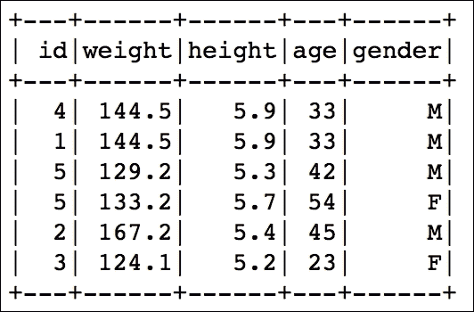

我们删除了具有 ID `3` 的一行。现在让我们检查数据中是否存在任何与 ID 无关的重复项。我们可以快速重复之前所做的操作，但仅使用除 ID 列之外的其他列：

```py
print('Count of ids: {0}'.format(df.count()))
print('Count of distinct ids: {0}'.format(
    df.select([
        c for c in df.columns if c != 'id'
    ]).distinct().count())
)
```

我们应该看到一行额外的重复项：

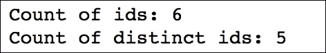

我们仍然可以使用 `.dropDuplicates(...)`, 但会添加一个 `subset` 参数，该参数指定除了 `id` 列之外的其他列：

```py
df = df.dropDuplicates(subset=[
    c for c in df.columns if c != 'id'
])
```

`subset` 参数指示 `.dropDuplicates(...)` 方法仅使用通过 `subset` 参数指定的列来查找重复行；在上面的例子中，我们将删除具有相同 `weight`、`height`、`age` 和 `gender` 但不是 `id` 的重复记录。运行 `df.show()`，我们得到以下更干净的数据集，因为我们删除了 `id = 1` 的行，因为它与 `id = 4` 的记录完全相同：

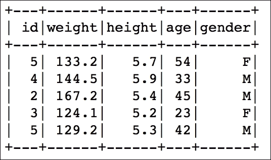

现在我们知道没有完整的行重复，或者只有 ID 不同的相同行，让我们检查是否有任何重复的 ID。为了在一步中计算总数和不同 ID 的数量，我们可以使用 `.agg(...)` 方法：

```py
import pyspark.sql.functions as fn

df.agg(
    fn.count('id').alias('count'),
    fn.countDistinct('id').alias('distinct')
).show()
```

这是前面代码的输出：

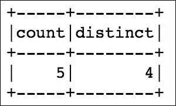

在上一个例子中，我们首先从 `pyspark.sql` 模块导入所有函数。

### 提示

这使我们能够访问各种函数，太多以至于无法在此列出。然而，我们强烈建议您研究 PySpark 的文档，网址为 [`spark.apache.org/docs/2.0.0/api/python/pyspark.sql.html#module-pyspark.sql.functions`](http://spark.apache.org/docs/2.0.0/api/python/pyspark.sql.html#module-pyspark.sql.functions)。

接下来，我们使用 `.count(...)` 和 `.countDistinct(...)` 分别计算 DataFrame 中的行数和不同 `ids` 的数量。`.alias(...)` 方法允许我们为返回的列指定一个友好的名称。

如您所见，我们总共有五行，但只有四个不同的 ID。由于我们已经删除了所有重复项，我们可以安全地假设这可能是 ID 数据中的一个偶然错误，因此我们将为每一行分配一个唯一的 ID：

```py
df.withColumn('new_id', fn.monotonically_increasing_id()).show()
```

前面的代码片段生成了以下输出：

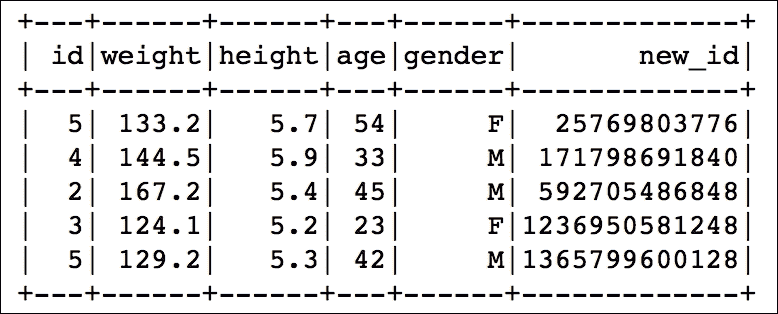

`.monotonicallymonotonically_increasing_id()`方法为每条记录分配一个唯一且递增的 ID。根据文档，只要你的数据被放入少于大约 10 亿个分区，每个分区少于 80 亿条记录，ID 就可以保证是唯一的。

### 注意

一个警告：在 Spark 的早期版本中，`.monotonicallymonotonically_increasing_id()`方法在多次评估同一个 DataFrame 时可能不会返回相同的 ID。然而，这已经在 Spark 2.0 中得到了修复。

## 缺失的观测值

你经常会遇到包含*空白*的数据集。缺失值可能由多种原因造成：系统故障、人为错误、数据模式变更，仅举几例。

如果你的数据可以承受，处理缺失值的最简单方法是在发现任何缺失值时删除整个观测值。你必须小心不要删除太多：根据缺失值在你数据集中的分布，这可能会严重影响数据集的可用性。如果删除行后，我最终得到一个非常小的数据集，或者发现数据量减少了 50%以上，我开始检查我的数据，看看哪些特征有最多的空缺，也许可以完全排除它们；如果一个特征的大部分值都是缺失的（除非缺失值有特定的含义），从建模的角度来看，它几乎是毫无用处的。

处理具有缺失值的观测值的另一种方法是，用某些值代替那些`Nones`。根据你的数据类型，你有几个选项可以选择：

+   如果你的数据是离散布尔值，你可以通过添加第三个类别——`缺失`来将其转换为分类变量

+   如果你的数据已经是分类的，你可以简单地扩展级别数量，并添加`缺失`类别

+   如果你正在处理有序或数值数据，你可以用均值、中位数或其他预定义的值（例如，第一或第三四分位数，取决于你数据的分布形状）来插补。

考虑一个与我们之前展示的类似的例子：

```py
df_miss = spark.createDataFrame([
        (1, 143.5, 5.6, 28,   'M',  100000),
        (2, 167.2, 5.4, 45,   'M',  None),
        (3, None , 5.2, None, None, None),
        (4, 144.5, 5.9, 33,   'M',  None),
        (5, 133.2, 5.7, 54,   'F',  None),
        (6, 124.1, 5.2, None, 'F',  None),
        (7, 129.2, 5.3, 42,   'M',  76000),
    ], ['id', 'weight', 'height', 'age', 'gender', 'income'])
```

在我们的例子中，我们处理了多个缺失值类别。

分析*行*，我们可以看到以下：

+   ID 为`3`的行只有一个有用的信息——`身高`

+   ID 为`6`的行只有一个缺失值——`年龄`

分析*列*，我们可以看到以下：

+   `收入`列，由于它是一个非常私人的信息，大部分值都是缺失的

+   `体重`和`性别`列各有只有一个缺失值

+   `年龄`列有两个缺失值

要找到每行的缺失观测值数量，我们可以使用以下代码片段：

```py
df_miss.rdd.map(
    lambda row: (row['id'], sum([c == None for c in row]))
).collect()
```

它生成了以下输出：


它告诉我们，例如，ID 为`3`的行有四个缺失观测值，正如我们之前观察到的。

让我们看看哪些值是缺失的，这样当我们计算列中的缺失观测值时，我们可以决定是否删除整个观测值或对某些观测值进行插补：

```py
df_miss.where('id == 3').show()
```

我们得到以下结果：

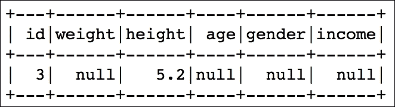

现在我们来检查每列中缺失观测值的百分比是多少：

```py
df_miss.agg(*[
    (1 - (fn.count(c) / fn.count('*'))).alias(c + '_missing')
    for c in df_miss.columns
]).show()
```

这生成了以下输出：

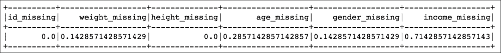

### 注意

`.count(...)`方法的`*`参数（代替列名）指示该方法计算所有行。另一方面，列表声明前的`*`指示`.agg(...)`方法将列表视为一组单独的参数传递给函数。

因此，我们在`weight`和`gender`列中有 14%的缺失观测值，在`height`列中有两倍于此，在`income`列中有近 72%的缺失观测值。现在我们知道该做什么了。

首先，我们将删除`'income'`特征，因为其中大部分值是缺失的。

```py
df_miss_no_income = df_miss.select([
    c for c in df_miss.columns if c != 'income'
])
```

我们现在看到，我们不需要删除 ID 为`3`的行，因为在`'weight'`和`'age'`列中的观测值覆盖足够（在我们的简化示例中）来计算平均值并将其插补到缺失值的位置。

然而，如果你决定删除观测值，你可以使用`.dropna(...)`方法，如下所示。在这里，我们还将使用`thresh`参数，它允许我们指定每行缺失观测值的阈值，以确定该行是否应该被删除。这对于你拥有具有数十或数百个特征的 dataset 来说很有用，你只想删除那些超过一定缺失值阈值的行：

```py
df_miss_no_income.dropna(thresh=3).show()
```

上述代码产生以下输出：

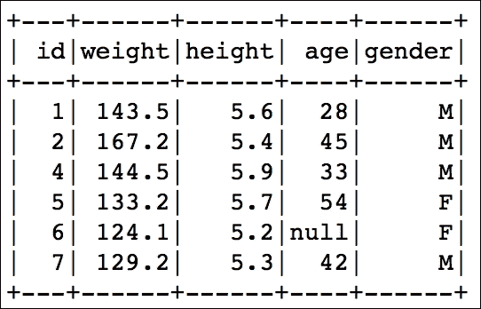

另一方面，如果你想插补观测值，你可以使用`.fillna(...)`方法。此方法接受单个整数（长整型也接受），浮点数或字符串；然后整个 dataset 中的所有缺失值都将用该值填充。你也可以传递一个形式为`{'<colName>': <value_to_impute>}`的字典。这有一个相同的限制，即，作为`<value_to_impute>`，你只能传递整数、浮点数或字符串。

如果你想要插补平均值、中位数或其他计算值，你需要首先计算该值，创建一个包含这些值的字典，然后将它传递给`.fillna(...)`方法。

这是我们的做法：

```py
means = df_miss_no_income.agg(
    *[fn.mean(c).alias(c) 
        for c in df_miss_no_income.columns if c != 'gender']
).toPandas().to_dict('records')[0]

means['gender'] = 'missing'

df_miss_no_income.fillna(means).show()
```

上述代码将产生以下输出：

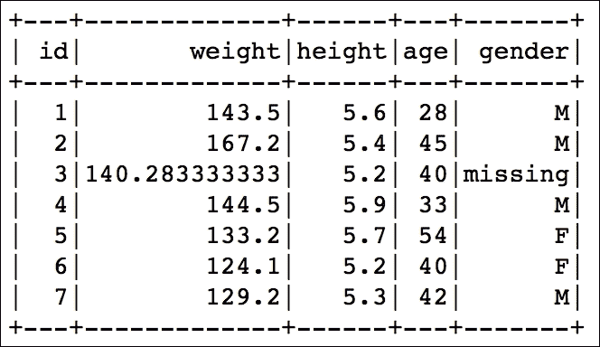

我们省略了`性别`列，因为显然无法对分类变量计算平均值。

我们在这里使用双重转换。首先将`.agg(...)`方法的输出（一个 PySpark DataFrame）转换为 pandas DataFrame，然后再将其转换为字典。

### 提示

注意，调用`.toPandas()`可能会有问题，因为这个方法基本上与 RDD 中的`.collect()`方法以相同的方式工作。它会从工作者那里收集所有信息，并将其带到驱动器上。除非你有成千上万的特征，否则这不太可能成为前一个数据集的问题。

pandas 的`.to_dict(...)`方法的`records`参数指示它创建以下字典：

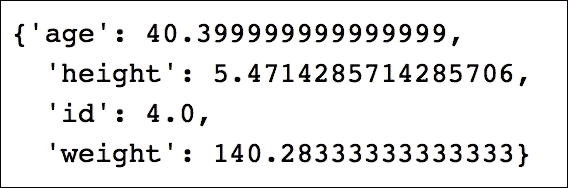

由于我们无法计算分类变量的平均值（或任何其他数值指标），我们在`gender`特征的字典中添加了`missing`类别。注意，尽管年龄列的平均值是 40.40，但在插补时，`df_miss_no_income.age`列的类型仍然被保留——它仍然是一个整数。

## 异常值

异常值是那些与你的样本中其余部分分布显著偏离的观测值。*显著性*的定义各不相同，但最一般的形式，你可以接受如果没有异常值，所有值都大致在 Q1−1.5IQR 和 Q3+1.5IQR 范围内，其中 IQR 是四分位距；IQR 定义为上四分位数和下四分位数的差，即 75 百分位数（Q3）和 25 百分位数（Q1）。

让我们再次考虑一个简单的例子：

```py
df_outliers = spark.createDataFrame([
        (1, 143.5, 5.3, 28),
        (2, 154.2, 5.5, 45),
        (3, 342.3, 5.1, 99),
        (4, 144.5, 5.5, 33),
        (5, 133.2, 5.4, 54),
        (6, 124.1, 5.1, 21),
        (7, 129.2, 5.3, 42),
    ], ['id', 'weight', 'height', 'age'])
```

现在我们可以使用我们之前概述的定义来标记异常值。

首先，我们计算每个特征的上下限。我们将使用`.approxQuantile(...)`方法。指定的第一个参数是列名，第二个参数可以是`0`到`1`之间的数字（其中`0.5`表示计算中位数）或列表（如我们的情况），第三个参数指定每个指标的容错水平（如果设置为`0`，它将为指标计算一个精确值，但这可能非常昂贵）：

```py
cols = ['weight', 'height', 'age']
bounds = {}

for col in cols:
    quantiles = df_outliers.approxQuantile(
        col, [0.25, 0.75], 0.05
    )

    IQR = quantiles[1] - quantiles[0]

    bounds[col] = [
        quantiles[0] - 1.5 * IQR, 
        quantiles[1] + 1.5 * IQR
]
```

`bounds`字典包含每个特征的上下限：

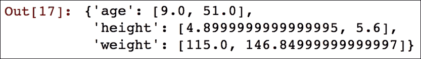

让我们现在使用它来标记我们的异常值：

```py
outliers = df_outliers.select(*['id'] + [
    (
        (df_outliers[c] < bounds[c][0]) | 
        (df_outliers[c] > bounds[c][1])
    ).alias(c + '_o') for c in cols
])
outliers.show()
```

之前的代码产生以下输出：

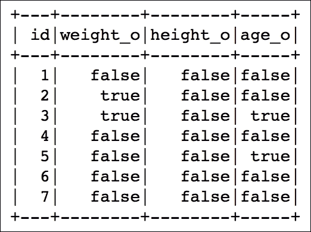

我们在`weight`特征和`age`特征中各有两个异常值。到现在你应该知道如何提取这些值，但这里有一个列出与整体分布显著不同的值的代码片段：

```py
df_outliers = df_outliers.join(outliers, on='id')
df_outliers.filter('weight_o').select('id', 'weight').show()
df_outliers.filter('age_o').select('id', 'age').show()
```

之前的代码将给出以下输出：

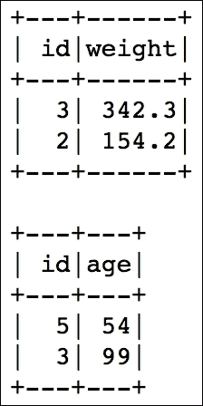

有了本节中描述的方法，你可以快速清理甚至最大的数据集。

# 熟悉你的数据

尽管我们强烈反对这种行为，但你可以在不了解数据的情况下构建模型；这可能会花费你更长的时间，并且生成的模型的质量可能不如最佳，但这是可行的。

### 注意

在本节中，我们将使用我们从 [`packages.revolutionanalytics.com/datasets/ccFraud.csv`](http://packages.revolutionanalytics.com/datasets/ccFraud.csv) 下载的数据集。我们没有更改数据集本身，但它被 GZipped 并上传到 [`tomdrabas.com/data/LearningPySpark/ccFraud.csv.gz`](http://tomdrabas.com/data/LearningPySpark/ccFraud.csv.gz)。请首先下载文件，并将其保存在包含你本章笔记本的同一文件夹中。

数据集的头部看起来如下所示：

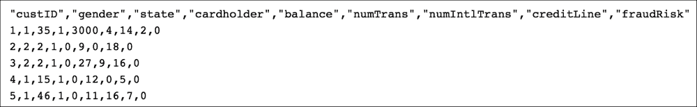

因此，任何严肃的数据科学家或数据模型师在开始任何建模之前都会熟悉数据集。作为第一步，我们通常从一些描述性统计开始，以了解我们正在处理的内容。

## 描述性统计

描述性统计，在最简单的意义上，会告诉你关于你的数据集的基本信息：你的数据集中有多少非缺失观测值，列的均值和标准差，以及最小值和最大值。

然而，首先的事情是——让我们加载数据并将其转换为 Spark DataFrame：

```py
import pyspark.sql.types as typ
```

首先，我们加载我们需要的唯一模块。`pyspark.sql.types` 暴露了我们可以使用的数据类型，例如 `IntegerType()` 或 `FloatType()`。

### 注意

要查看可用类型的完整列表，请检查[`spark.apache.org/docs/latest/api/python/pyspark.sql.html#module-pyspark.sql.types`](http://spark.apache.org/docs/latest/api/python/pyspark.sql.html#module-pyspark.sql.types)。

接下来，我们使用 `.filter(...)` 方法读取数据并删除标题行。这之后，我们将行按每个逗号分割（因为这是一个 `.csv` 文件），并将每个元素转换为整数：

```py
fraud = sc.textFile('ccFraud.csv.gz')
header = fraud.first()

fraud = fraud \
    .filter(lambda row: row != header) \
    .map(lambda row: [int(elem) for elem in row.split(',')])
```

接下来，我们为我们的 DataFrame 创建模式：

```py
fields = [
    *[
        typ.StructField(h[1:-1], typ.IntegerType(), True)
        for h in header.split(',')
    ]
]
schema = typ.StructType(fields)
```

最后，我们创建我们的 DataFrame：

```py
fraud_df = spark.createDataFrame(fraud, schema)
```

在创建我们的 `fraud_df` DataFrame 之后，我们可以计算数据集的基本描述性统计。然而，你需要记住，尽管我们的所有特征在本质上都表现为数值型，但其中一些是分类的（例如，`gender` 或 `state`）。

这是我们的 DataFrame 的模式：

```py
fraud_df.printSchema()
```

表示如下所示：

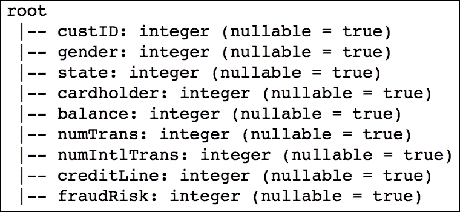

此外，从计算 `custId` 列的均值和标准差中不会获得任何信息，所以我们不会进行这项操作。

为了更好地理解分类列，我们将使用 `.groupby(...)` 方法计算其值的频率。在这个例子中，我们将计算 `gender` 列的频率：

```py
fraud_df.groupby('gender').count().show()
```

上述代码将产生以下输出：

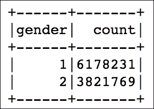

如你所见，我们正在处理一个相当不平衡的数据集。你可能会期望看到性别分布是相等的。

### 注意

这超出了本章的范围，但如果我们在构建统计模型，就需要注意这些类型的偏差。您可以在[`www.va.gov/VETDATA/docs/SurveysAndStudies/SAMPLE_WEIGHT.pdf`](http://www.va.gov/VETDATA/docs/SurveysAndStudies/SAMPLE_WEIGHT.pdf)了解更多信息。

对于真正的数值特征，我们可以使用`.describe()`方法：

```py
numerical = ['balance', 'numTrans', 'numIntlTrans']
desc = fraud_df.describe(numerical)
desc.show()
```

`.show()`方法将产生以下输出：

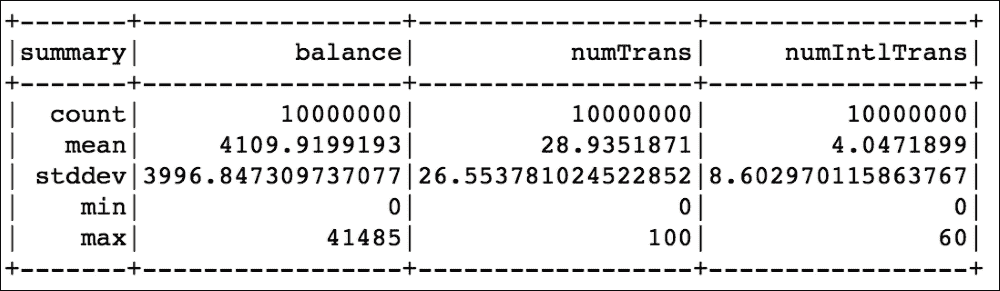

即使从这些相对较少的数字中，我们也可以得出很多结论：

+   所有特征都是正偏的。最大值是平均值的数倍。

+   变异系数（平均值与标准差的比率）非常高（接近或大于`1`），表明观察值的分布范围很广。

以下是检查`偏度`（我们只为`'balance'`特征做此操作）的方法：

```py
fraud_df.agg({'balance': 'skewness'}).show()
```

上述代码产生以下输出：

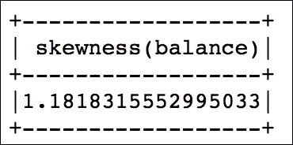

聚合函数列表（名称相当直观）包括：`avg()`、`count()`、`countDistinct()`、`first()`、`kurtosis()`、`max()`、`mean()`、`min()`、`skewness()`、`stddev()`、`stddev_pop()`、`stddev_samp()`、`sum()`、`sumDistinct()`、`var_pop()`、`var_samp()`和`variance()`。

## 相关系数

另一个非常有用的衡量特征之间相互关系的方法是相关系数。通常，您的模型只会包括与您的目标高度相关的特征。然而，检查特征之间的相关性几乎同样重要；包括彼此高度相关（即，*共线性*）的特征可能会导致模型的行为不可预测，或者可能不必要地使模型复杂化。

### 注意

我在我的另一本书中更多地讨论了多重共线性，*《实用数据分析食谱，Packt 出版社》* ([`www.packtpub.com/big-data-and-business-intelligence/practical-data-analysis-cookbook`](https://www.packtpub.com/big-data-and-business-intelligence/practical-data-analysis-cookbook))，在第五章介绍 MLlib 中，标题为*识别和解决多重共线性*的部分。

一旦您的数据以 DataFrame 形式存在，在 PySpark 中计算相关系数非常简单。唯一的困难是`.corr(...)`方法目前只支持皮尔逊相关系数，并且它只能计算成对的相关性，如下所示：

```py
fraud_df.corr('balance', 'numTrans')
```

为了创建相关系数矩阵，您可以使用以下脚本：

```py
n_numerical = len(numerical)

corr = []

for i in range(0, n_numerical):
    temp = [None] * i

    for j in range(i, n_numerical):
        temp.append(fraud_df.corr(numerical[i], numerical[j]))
    corr.append(temp)
```

上述代码将产生以下输出：

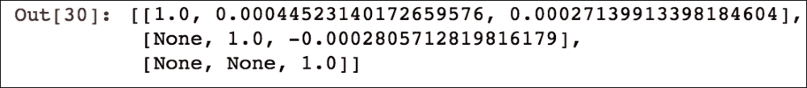

如您所见，信用卡欺诈数据集中数值特征之间的相关系数几乎不存在。因此，所有这些特征都可以用于我们的模型，如果它们在解释我们的目标时在统计上是有意义的。

检查完相关系数后，我们现在可以继续对数据进行视觉检查。

# 可视化

虽然存在多个可视化包，但在这个部分，我们将专门使用 `matplotlib` 和 Bokeh，以提供最适合你需求的工具。

这两个包都预装在 Anaconda 中。首先，让我们加载模块并设置它们：

```py
%matplotlib inline
import matplotlib.pyplot as plt
plt.style.use('ggplot')

import bokeh.charts as chrt
from bokeh.io import output_notebook

output_notebook()
```

`%matplotlib inline` 和 `output_notebook()` 命令将使 `matplotlib` 或 Bokeh 生成的每个图表都出现在笔记本中，而不是作为单独的窗口。

## 直方图

直方图无疑是直观评估特征分布的最简单方法。在 PySpark（或 Jupyter notebook）中，你可以通过以下三种方式生成直方图：

+   在工作节点上聚合数据，并将直方图中每个箱子的箱子和计数列表返回给驱动程序

+   将所有数据点返回给驱动程序，并允许绘图库的方法为你完成工作

+   样本你的数据，然后将它们返回给驱动程序进行绘图。

如果你的数据集的行数以亿计，那么第二种方法可能不可行。因此，你需要首先聚合数据：

```py
hists = fraud_df.select('balance').rdd.flatMap(
    lambda row: row
).histogram(20)
```

要绘制直方图，你可以简单地调用 `matplotlib`，如下面的代码所示：

```py
data = {
    'bins': hists[0][:-1],
    'freq': hists[1]
}
plt.bar(data['bins'], data['freq'], width=2000)
plt.title('Histogram of \'balance\'')
```

这将生成以下图表：

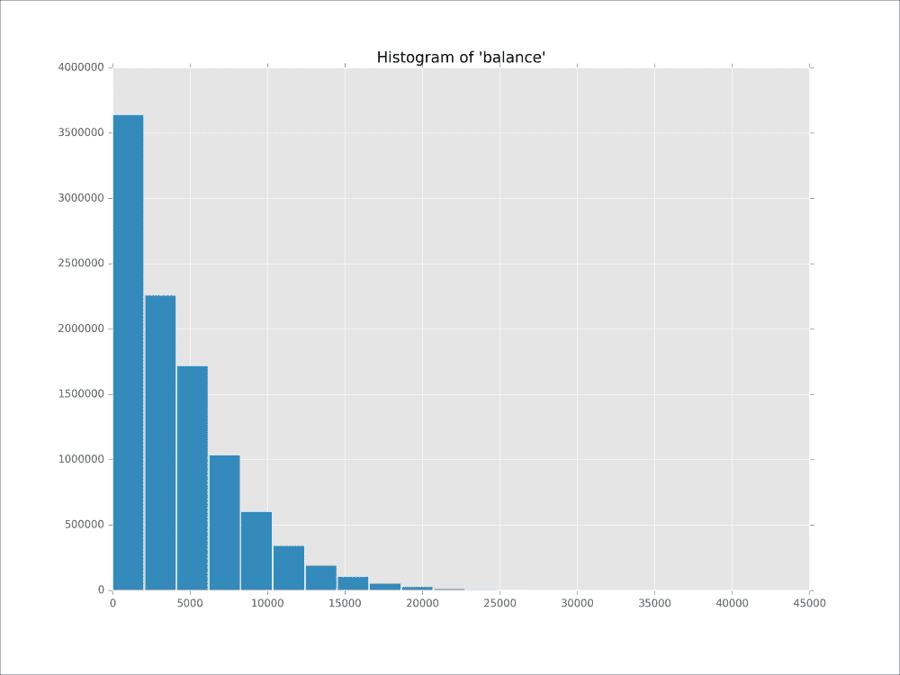

以类似的方式，可以使用 Bokeh 创建直方图：

```py
b_hist = chrt.Bar(
    data, 
    values='freq', label='bins', 
    title='Histogram of \'balance\'')
chrt.show(b_hist)
```

由于 Bokeh 在后台使用 D3.js，生成的图表是交互式的：

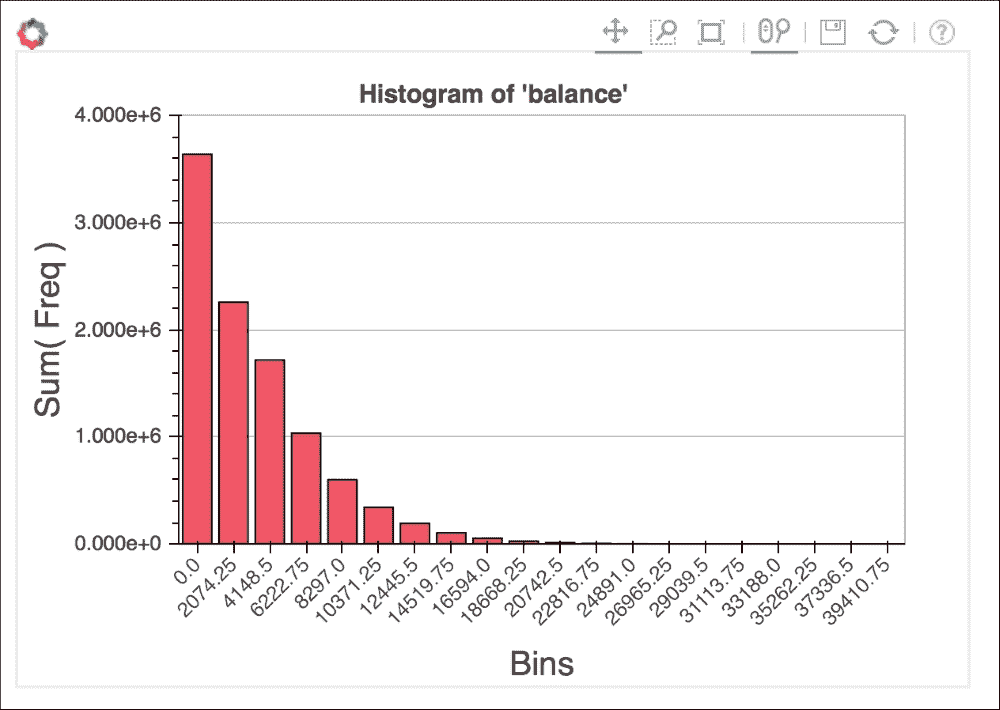

如果你的数据足够小，可以放在驱动程序上（尽管我们会争论通常使用前一种方法会更快），你可以将数据带进来，并使用 `.hist(...)`（来自 `matplotlib`）或 `.Histogram(...)`（来自 Bokeh）方法：

```py
data_driver = {
    'obs': fraud_df.select('balance').rdd.flatMap(
        lambda row: row
    ).collect()
}
plt.hist(data_driver['obs'], bins=20)
plt.title('Histogram of \'balance\' using .hist()')
b_hist_driver = chrt.Histogram(
    data_driver, values='obs', 
    title='Histogram of \'balance\' using .Histogram()', 
    bins=20
)
chrt.show(b_hist_driver)
```

这将为 `matplotlib` 生成以下图表：


对于 Bokeh，将生成以下图表：

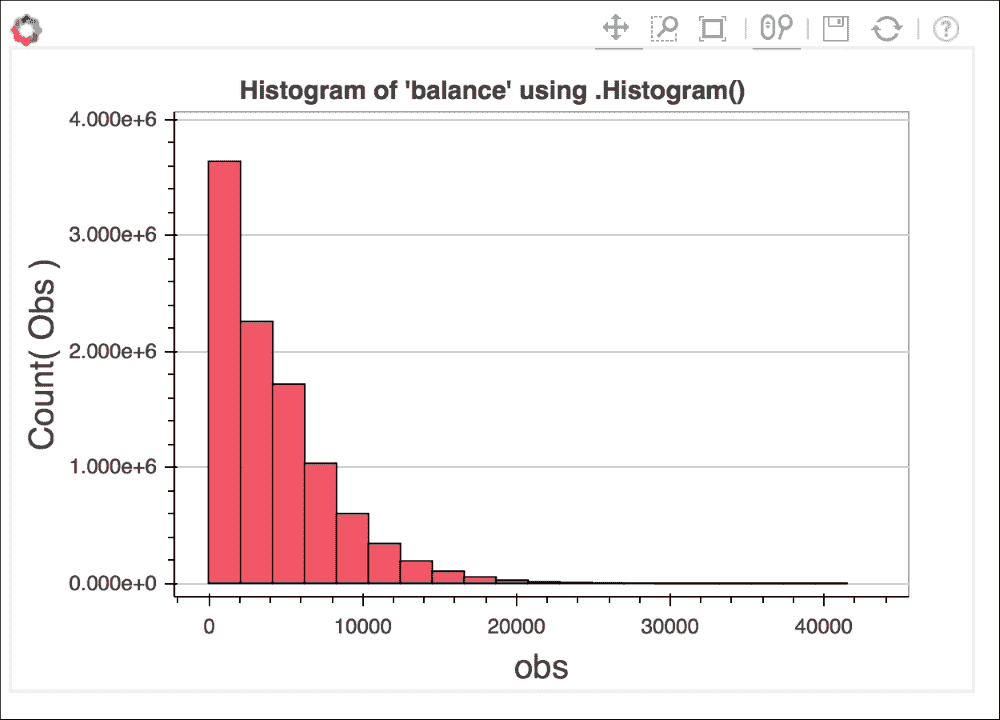

## 特征之间的交互

散点图允许我们同时可视化最多三个变量之间的交互（尽管在本节中我们将只展示二维交互）。

### 提示

你很少需要回退到三维可视化，除非你处理的是一些时间数据，并且你想观察随时间的变化。即使在这种情况下，我们宁愿将时间数据进行离散化，并展示一系列二维图表，因为解读三维图表相对复杂，并且（大多数时候）令人困惑。

由于 PySpark 在服务器端不提供任何可视化模块，并且同时尝试绘制数十亿个观察值将非常不切实际，因此在本节中，我们将对数据集进行 0.02%（大约 2,000 个观察值）的抽样。

### 提示

除非你选择了分层抽样，否则你应该创建至少三个到五个样本，在预定义的抽样比例下，以便检查你的样本是否在一定程度上代表了你的数据集——也就是说，样本之间的差异不大。

在这个例子中，我们将以 0.02% 的比例对欺诈数据集进行抽样，给定 `'gender'` 作为分层：

```py
data_sample = fraud_df.sampleBy(
    'gender', {1: 0.0002, 2: 0.0002}
).select(numerical)
```

要一次性放入多个二维图表，你可以使用以下代码：

```py
data_multi = dict([
    (elem, data_sample.select(elem).rdd \
        .flatMap(lambda row: row).collect()) 
    for elem in numerical
])
sctr = chrt.Scatter(data_multi, x='balance', y='numTrans')
chrt.show(sctr)
```

上一段代码将生成以下图表：

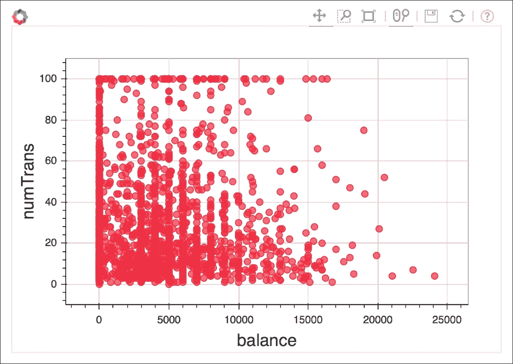

如你所见，有许多欺诈交易余额为 0，但许多交易——即新卡和交易的大幅增加。然而，除了在$1,000 间隔发生的一些*带状*之外，没有特定的模式可以展示。

# 摘要

在本章中，我们探讨了如何通过识别和解决数据集中缺失值、重复值和异常值来清洁和准备数据集以进行建模。我们还探讨了如何使用 PySpark 工具（尽管这绝对不是如何分析数据集的完整手册）来更熟悉你的数据。最后，我们展示了如何绘制数据图表。

在接下来的两章中，我们将使用这些（以及更多）技术来构建机器学习模型。
