# 第七章. GraphFrames

图是解决数据问题的有趣方式，因为图结构是许多数据问题类别的更直观的方法。

在本章中，你将了解：

+   为什么使用图？

+   理解经典图问题：航班数据集

+   理解图顶点和边

+   简单查询

+   使用基元发现

+   使用广度优先搜索

+   使用 PageRank

+   使用 D3 可视化航班

无论是在社交网络中还是在餐厅推荐中，在图结构（顶点、边和属性）的背景下理解这些数据问题更容易：


例如，在**社交网络**的背景下，**顶点**是人，而**边**是他们之间的连接。在**餐厅推荐**的背景下，顶点（例如）包括位置、菜系类型和餐厅，而边是他们之间的连接（例如，这三家餐厅都在**温哥华，不列颠哥伦比亚省**，但只有两家提供拉面）。

虽然这两个图看起来是断开的，但实际上，你可以根据社交圈中朋友的评论创建一个社交网络 + 餐厅推荐图，如下面图所示：

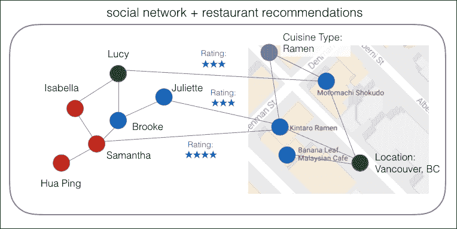

例如，如果**伊莎贝拉**想在温哥华找一家好的拉面餐厅，通过查看她朋友的评论，她很可能会选择**金太郎拉面**，因为**萨曼莎**和**朱丽叶特**都对该餐厅给出了好评：

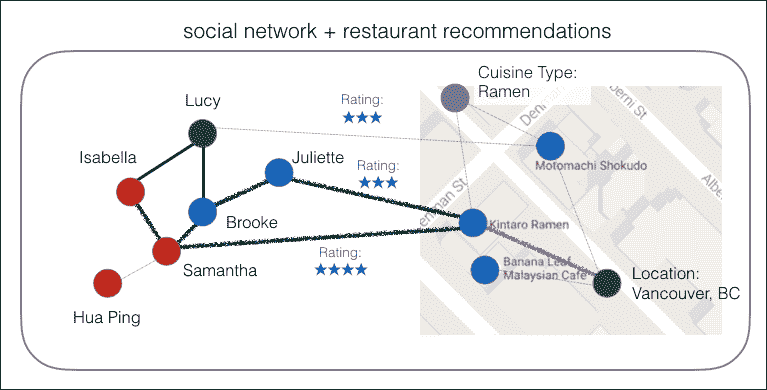

另一个经典的图问题是航班数据的分析：机场由**顶点**表示，而机场之间的航班由**边**表示。此外，与这些航班相关的属性众多，包括但不限于出发延误、飞机类型和航空公司：

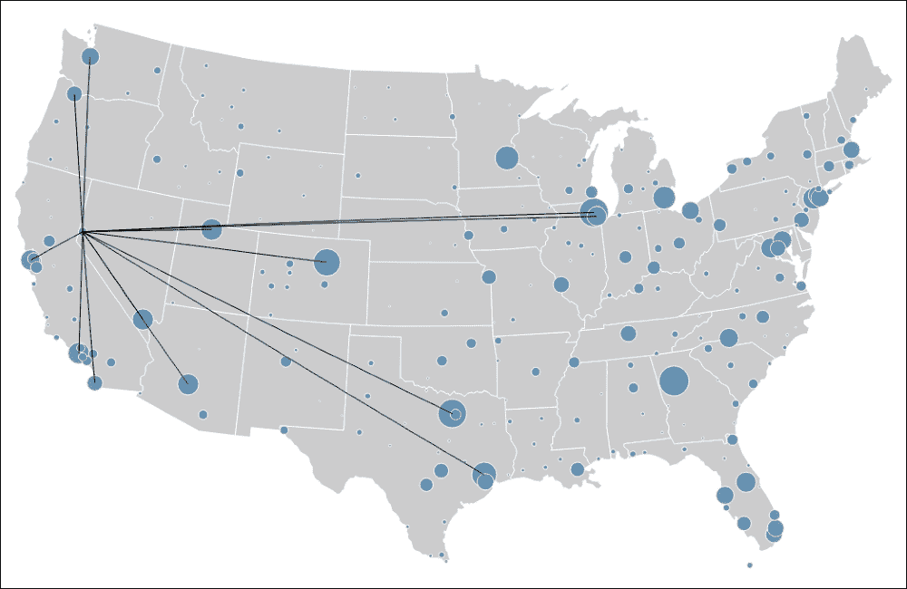

在本章中，我们将使用 GraphFrames 快速轻松地分析以图结构组织的数据的航班性能数据。因为我们使用图结构，所以我们可以轻松地提出许多在表格结构中不那么直观的问题，例如找到结构基元、使用 PageRank 对机场进行排名以及城市之间的最短路径。GraphFrames 利用 DataFrame API 的分布和表达式能力，既简化了查询，又利用了 Apache Spark SQL 引擎的性能优化。

此外，使用 GraphFrames，图分析在 Python、Scala 和 Java 中都是可用的。同样重要的是，你可以利用现有的 Apache Spark 技能来解决图问题（除了机器学习、流和 SQL），而不是学习新框架进行范式转换。

# 介绍 GraphFrames

GraphFrames 利用 Apache Spark DataFrame 的强大功能来支持通用图处理。具体来说，顶点和边由 DataFrame 表示，允许我们为每个顶点和边存储任意数据。虽然 GraphFrames 与 Spark 的 GraphX 库类似，但有一些关键区别，包括：

+   GraphFrames 利用 DataFrame API 的性能优化和简洁性。

+   通过使用 DataFrame API，GraphFrames 现在拥有 Python、Java 和 Scala API。GraphX 仅通过 Scala 访问；现在所有算法都可在 Python 和 Java 中访问。

+   注意，在撰写本文时，存在一个错误阻止 GraphFrames 与 Python3.x 一起工作，因此我们将使用 Python2.x。

在撰写本文时，GraphFrames 版本为 0.3，作为 Spark 包在[`spark-packages.org`](http://spark-packages.org)的[`spark-packages.org/package/graphframes/graphframes`](https://spark-packages.org/package/graphframes/graphframes)处可用。

### 小贴士

有关 GraphFrames 的更多信息，请参阅[`databricks.com/blog/2016/03/03/introducing-graphframes.html`](https://databricks.com/blog/2016/03/03/introducing-graphframes.html)上的*GraphFra* *mes*介绍。

# 安装 GraphFrames

如果您从 Spark CLI（例如，`spark-shell, pyspark, spark-sql, spark-submit`）运行作业，您可以使用`–-packages`命令，该命令将为您提取、编译和执行必要的代码，以便使用 GraphFrames 包。

例如，要使用与 Spark 2.0 和 Scala 2.11 兼容的最新 GraphFrames 包（版本 0.3）和 spark-shell，命令如下：

```py
> $SPARK_HOME/bin/spark-shell --packages graphframes:graphframes:0.3.0-spark2.0-s_2.11

```

如果您使用的是笔记本服务，您可能需要先安装该包。例如，以下部分显示了在免费 Databricks 社区版([`databricks.com/try-databricks`](http://databricks.com/try-databricks))中安装 GraphFrames 库的步骤。

## 创建库

在 Databricks 中，您可以使用 Scala/Java JAR、Python Egg 或 Maven 坐标（包括 Spark 包）创建库。

要开始，请转到**databricks**中的**工作区**，右键单击您想要创建库的文件夹（在本例中为**flights**），点击**创建**，然后点击**库**：

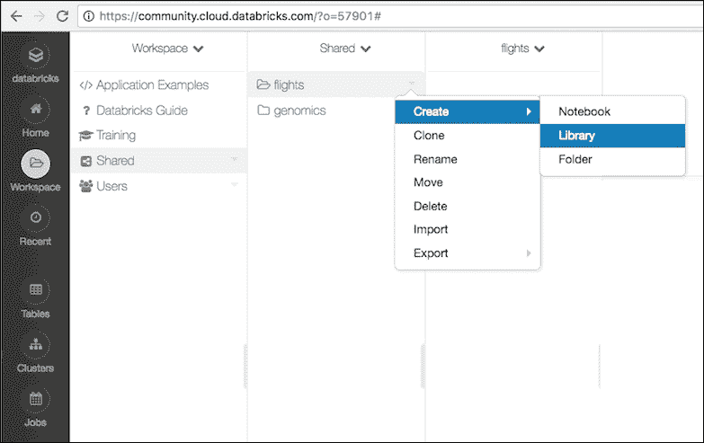

在**创建库**对话框中，在**源**下拉菜单中选择，如以下图所示**Maven 坐标**：

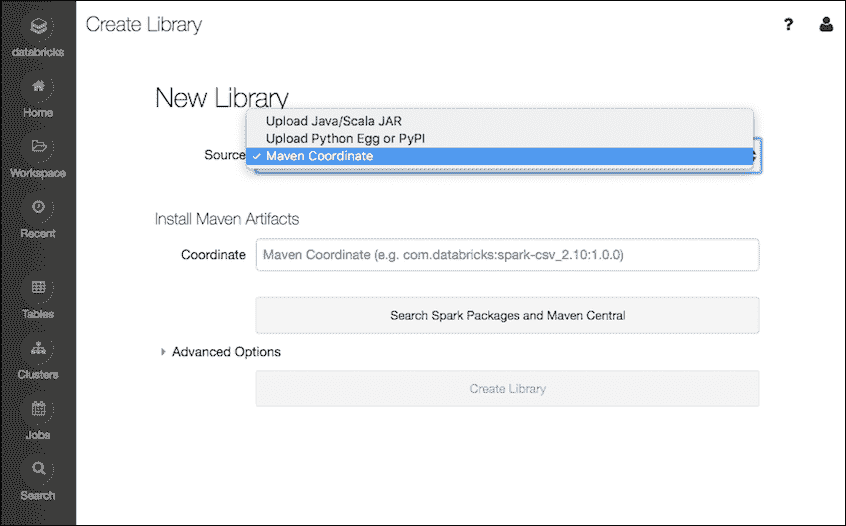

### 小贴士

Maven 是一种用于构建和管理基于 Java 的项目（如 GraphFrames 项目）的工具。Maven 坐标唯一标识这些项目（或依赖项或插件），以便您可以在 Maven 仓库中快速找到项目；例如，[`mvnrepository.com/artifact/graphframes/graphframes`](https://mvnrepository.com/artifact/graphframes/graphframes)。

从这里，您可以点击**搜索 Spark 包和 Maven Central**按钮，搜索 GraphFrames 包。确保您匹配 Spark（例如，Spark 2.0）和 Scala（例如，Scala 2.11）的 GraphFrames 版本与您的 Spark 集群相匹配。

如果您已经知道 Maven 坐标，您也可以输入 GraphFrames Spark 包的 Maven 坐标。对于 Spark 2.0 和 Scala 2.11，输入以下坐标：

```py
graphframes:graphframes:0.3.0-spark2.0-s_2.11
```

输入后，点击**创建库**，如以下截图所示：

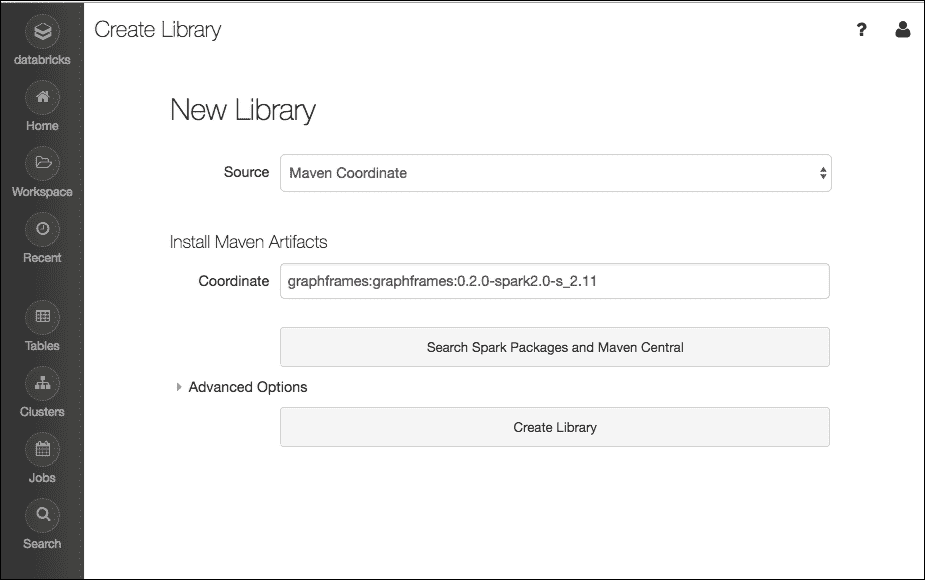

注意，这是 GraphFrames Spark 包的一次性安装任务（作为库的一部分）。一旦安装，您默认可以自动将包附加到您创建的任何 Databricks 集群：


# 准备您的航班数据集

对于这个航班示例场景，我们将使用两组数据：

+   *航空公司准点率与航班延误原因*：[[`bit.ly/2ccJPPM`](http://bit.ly/2ccJPPM)] 此数据集包含由美国航空公司报告的预定和实际起飞和到达时间，以及延误原因。数据由航空公司信息办公室，**运输统计局**（**BTS**）收集。

+   *Open Flights：机场和航空公司数据*：[[`openflights.org/data.html`](http://openflights.org/data.html)] 此数据集包含美国机场数据列表，包括 IATA 代码、机场名称和机场位置。

我们将创建两个 DataFrame – `airports`和`departureDelays` – 分别构成我们的 GraphFrame 的**顶点**和**边**。我们将使用 Python 创建这个航班示例应用程序。

由于我们在这个示例中使用 Databricks 笔记本，我们可以使用`/databricks-datasets/`位置，其中包含许多样本数据集。您也可以从以下链接下载数据：

+   `departureDelays.csv`: [`bit.ly/2ejPr8k`](http://bit.ly/2ejPr8k)

+   `airportCodes`: [`bit.ly/2ePAdKT`](http://bit.ly/2ePAdKT)

在此示例中，我们创建了两个变量，分别表示机场和出发延误数据的文件路径。然后我们将加载这些数据集并创建相应的 Spark DataFrame；注意对于这两个文件，我们可以轻松推断其模式：

```py
# Set File Paths
tripdelaysFilePath = "/databricks-datasets/flights/departuredelays.csv"
airportsnaFilePath = "/databricks-datasets/flights/airport-codes-na.txt"

# Obtain airports dataset
# Note, this dataset is tab-delimited with a header
airportsna = spark.read.csv(airportsnaFilePath, header='true', inferSchema='true', sep='\t')
airportsna.createOrReplaceTempView("airports_na")

# Obtain departure Delays data
# Note, this dataset is comma-delimited with a header
departureDelays = spark.read.csv(tripdelaysFilePath, header='true')
departureDelays.createOrReplaceTempView("departureDelays")
departureDelays.cache()
```

一旦我们加载了`departureDelays` DataFrame，我们也会将其缓存，这样我们就可以以高效的方式对数据进行一些额外的过滤：

```py
# Available IATA codes from the departuredelays sample dataset
tripIATA = spark.sql("select distinct iata from (select distinct origin as iata from departureDelays union all select distinct destination as iata from departureDelays) a")
tripIATA.createOrReplaceTempView("tripIATA")
```

前面的查询使我们能够构建一个具有不同出发城市 IATA 代码的独立列表（例如，`西雅图 = 'SEA'，旧金山 = 'SFO'，纽约 JFK = 'JFK'`等）。接下来，我们只包括在`departureDelays` DataFrame 中发生旅行的机场： 

```py
# Only include airports with atleast one trip from the 
# `departureDelays` dataset
airports = spark.sql("select f.IATA, f.City, f.State, f.Country from airports_na f join tripIATA t on t.IATA = f.IATA")
airports.createOrReplaceTempView("airports")
airports.cache()
```

通过构建独特的出发机场代码列表，我们可以构建机场 DataFrame，只包含存在于 `departureDelays` 数据集中的机场代码。以下代码片段生成一个新的 DataFrame (`departureDelays_geo`)，它包含包括航班日期、延误、距离和机场信息（出发地、目的地）在内的关键属性：

```py
# Build `departureDelays_geo` DataFrame
# Obtain key attributes such as Date of flight, delays, distance, 
# and airport information (Origin, Destination)  
departureDelays_geo = spark.sql("select cast(f.date as int) as tripid, cast(concat(concat(concat(concat(concat(concat('2014-', concat(concat(substr(cast(f.date as string), 1, 2), '-')), substr(cast(f.date as string), 3, 2)), ''), substr(cast(f.date as string), 5, 2)), ':'), substr(cast(f.date as string), 7, 2)), ':00') as timestamp) as `localdate`, cast(f.delay as int), cast(f.distance as int), f.origin as src, f.destination as dst, o.city as city_src, d.city as city_dst, o.state as state_src, d.state as state_dst from departuredelays f join airports o on o.iata = f.origin join airports d on d.iata = f.destination") 

# Create Temporary View and cache
departureDelays_geo.createOrReplaceTempView("departureDelays_geo")
departureDelays_geo.cache()
```

要快速查看这些数据，您可以运行此处所示的方法 `show`：

```py
# Review the top 10 rows of the `departureDelays_geo` DataFrame
departureDelays_geo.show(10)
```

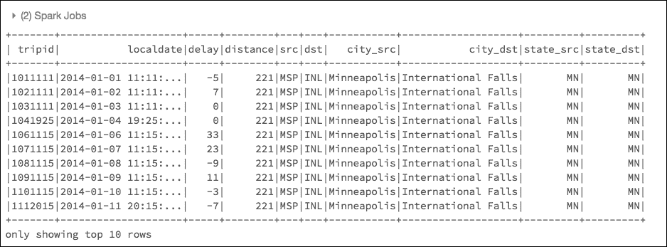

# 构建图

现在我们已经导入了数据，让我们构建我们的图。为此，我们将构建顶点和边的结构。在撰写本文时，GraphFrames 需要顶点和边具有特定的命名约定：

+   代表 *顶点* 的列需要命名为 `id`。在我们的案例中，飞行数据的顶点是机场。因此，我们需要在 `airports` DataFrame 中将 IATA 机场代码重命名为 `id`。

+   代表 *边* 的列需要具有源 (`src`) 和目标 (`dst`)。在我们的飞行数据中，边是航班，因此 `src` 和 `dst` 是来自 `departureDelays_geo` DataFrame 的出发地和目的地列。

为了简化我们的图边，我们将创建一个名为 `tripEdges` 的 DataFrame，它包含 `departureDelays_Geo` DataFrame 中的一部分列。此外，我们还创建了一个名为 `tripVertices` 的 DataFrame，它只是将 `IATA` 列重命名为 `id` 以匹配 GraphFrame 命名约定：

```py
# Note, ensure you have already installed 
# the GraphFrames spark-package
from pyspark.sql.functions import *
from graphframes import *

# Create Vertices (airports) and Edges (flights)
tripVertices = airports.withColumnRenamed("IATA", "id").distinct()
tripEdges = departureDelays_geo.select("tripid", "delay", "src", "dst", "city_dst", "state_dst")

# Cache Vertices and Edges
tripEdges.cache()
tripVertices.cache()
```

在 Databricks 中，您可以使用 `display` 命令查询数据。例如，要查看 `tripEdges` DataFrame，命令如下：

```py
display(tripEdges)
```

输出如下：

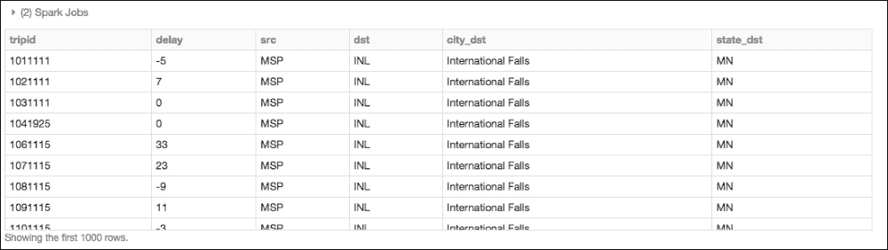

现在我们有了这两个 DataFrame，我们可以使用 `GraphFrame` 命令创建一个 GraphFrame：

```py
tripGraph = GraphFrame(tripVertices, tripEdges)
```

# 执行简单查询

让我们从一组简单的图查询开始，以了解飞行性能和出发延误。

## 确定机场和航班数量

例如，要确定机场和航班的数量，您可以运行以下命令：

```py
print "Airports: %d" % tripGraph.vertices.count()
print "Trips: %d" % tripGraph.edges.count()
```

如您从结果中看到的，有 279 个机场，有 136 万次航班：

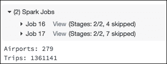

## 确定该数据集中的最长延迟

要确定数据集中最长延误的航班，您可以运行以下查询，结果为 1,642 分钟（即超过 27 小时！）：

```py
tripGraph.edges.groupBy().max("delay")

# Output
+----------+
|max(delay)| 
+----------+ 
|      1642| 
+----------+
```

## 确定延误航班与准点/提前航班数量

要确定延误航班与准点（或提前）航班的数量，您可以运行以下查询：

```py
print "On-time / Early Flights: %d" % tripGraph.edges.filter("delay <= 0").count()
print "Delayed Flights: %d" % tripGraph.edges.filter("delay > 0").count()
```

结果显示，几乎 43% 的航班延误了！

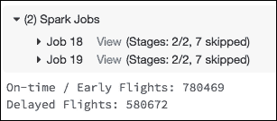

## 从西雅图出发的航班中，哪些最有可能出现重大延误？

在这些数据中进一步挖掘，让我们找出从西雅图出发的航班中，最有可能有显著延误的前五大目的地。这可以通过以下查询实现：

```py
tripGraph.edges\
  .filter("src = 'SEA' and delay > 0")\
  .groupBy("src", "dst")\
  .avg("delay")\
  .sort(desc("avg(delay)"))\
  .show(5)
```

如您在以下结果中可以看到：费城（PHL）、科罗拉多斯普林斯（COS）、弗雷斯诺（FAT）、长滩（LGB）和华盛顿特区（IAD）是从西雅图出发的航班延误最严重的五大城市：

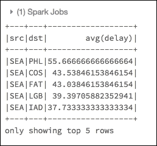

## 哪些州从西雅图出发往往会有显著的延误？

让我们找出哪些州从西雅图出发的累积延误最长（个别延误超过 100 分钟）。这次我们将使用`display`命令来查看数据：

```py
# States with the longest cumulative delays (with individual
# delays > 100 minutes) (origin: Seattle)
display(tripGraph.edges.filter("src = 'SEA' and delay > 100"))
```

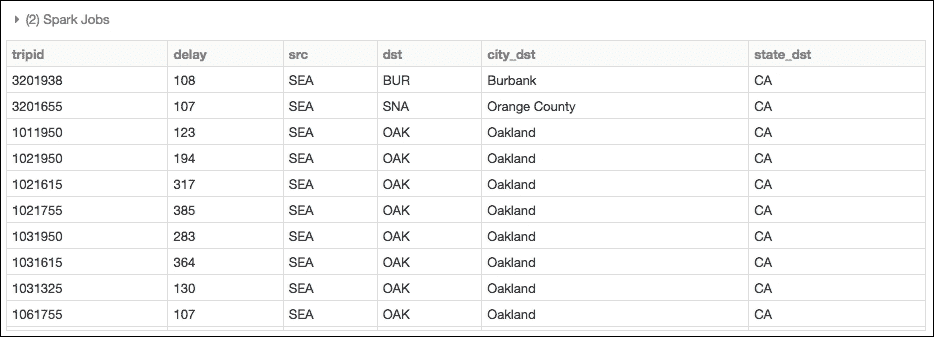

使用 Databricks 的`display`命令，我们也可以快速将数据从表格视图转换为地图视图。如图所示，从西雅图出发（在此数据集中）累积延误最多的州是加利福尼亚州：

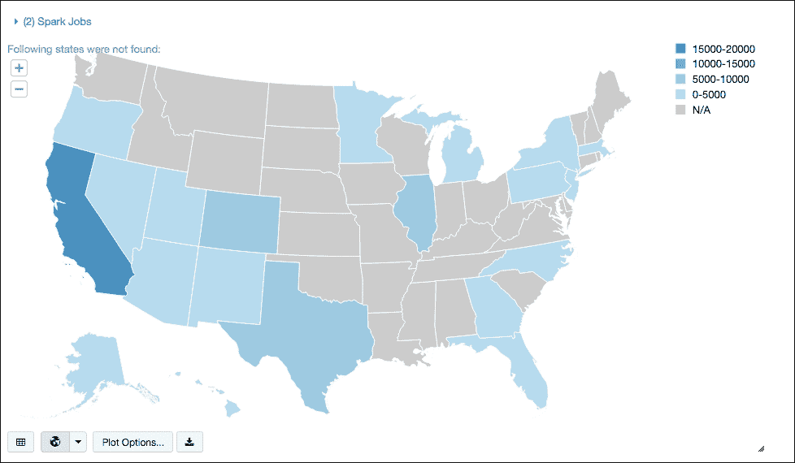

# 理解顶点度数

在图论背景下，顶点周围的度数是围绕顶点的边的数量。在我们的*航班*示例中，度数就是到达顶点（即机场）的总边数（即航班）。因此，如果我们从我们的图中获取前 20 个顶点度数（按降序排列），那么我们就是在请求前 20 个最繁忙的机场（进出航班最多）的查询。这可以通过以下查询快速确定：

```py
display(tripGraph.degrees.sort(desc("degree")).limit(20))
```

因为我们使用了`display`命令，所以我们可以快速查看此数据的条形图：

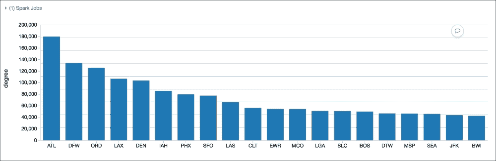

深入更多细节，以下是前 20 个`inDegrees`（即进入航班）：

```py
display(tripGraph.inDegrees.sort(desc("inDegree")).limit(20))
```


虽然这里有前 20 个`outDegrees`（即出发航班）：

```py
display(tripGraph.outDegrees.sort(desc("outDegree")).limit(20))
```

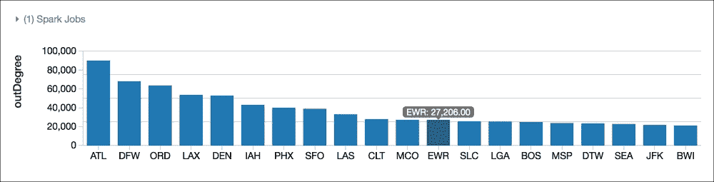

有趣的是，尽管前 10 个机场（亚特兰大/ATL 到夏洛特/CLT）在进出航班中的排名相同，但下一个 10 个机场的排名发生了变化（例如，西雅图/SEA 在进出航班中分别排名第 17 和第 18）。

# 确定顶级中转机场

对于机场理解顶点度数的扩展是确定顶级中转机场。许多机场被用作中转点而不是最终目的地。计算这个的一个简单方法是计算`inDegrees`（飞往机场的航班数量）和`outDegrees`（离开机场的航班数量）的比率。接近`1`的值可能表示许多中转，而小于`1`的值表示许多出发航班，大于`1`的值表示许多到达航班。

注意，这是一个简单的计算，不考虑航班的时刻或调度，只是数据集中的整体汇总数：

```py
# Calculate the inDeg (flights into the airport) and 
# outDeg (flights leaving the airport)
inDeg = tripGraph.inDegrees
outDeg = tripGraph.outDegrees

# Calculate the degreeRatio (inDeg/outDeg)
degreeRatio = inDeg.join(outDeg, inDeg.id == outDeg.id) \
  .drop(outDeg.id) \
  .selectExpr("id", "double(inDegree)/double(outDegree) as degreeRatio") \
  .cache()

# Join back to the 'airports' DataFrame 
# (instead of registering temp table as above)
transferAirports = degreeRatio.join(airports, degreeRatio.id == airports.IATA) \
  .selectExpr("id", "city", "degreeRatio") \
  .filter("degreeRatio between 0.9 and 1.1")

# List out the top 10 transfer city airports
display(transferAirports.orderBy("degreeRatio").limit(10))
```

此查询的输出是顶级 10 个中转城市机场（即枢纽机场）的条形图：

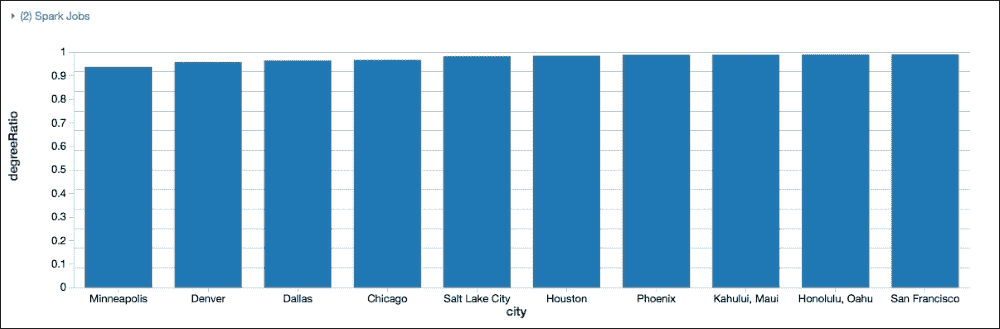

这是有意义的，因为这些机场是主要的国家航空公司枢纽（例如，达美航空使用明尼阿波利斯和盐湖城作为其枢纽，边疆航空使用丹佛，美国航空使用达拉斯和凤凰城，联合航空使用休斯顿、芝加哥和旧金山，夏威夷航空使用卡胡鲁伊和檀香山作为其枢纽）。

# 理解 motifs

为了更容易理解城市机场之间以及彼此之间的复杂关系，我们可以使用 `motifs` 来找到由航班连接的机场（例如，顶点）的模式。结果是包含按 motif 键命名的列的 DataFrame。请注意，motif 寻找是 GraphFrames 作为其一部分支持的新图算法之一。

例如，让我们确定由于 **旧金山国际机场**（**SFO**）造成的延误：

```py
# Generate motifs
motifs = tripGraphPrime.find("(a)-[ab]->(b); (b)-[bc]->(c)")\
  .filter("(b.id = 'SFO') and (ab.delay > 500 or bc.delay > 500) and bc.tripid > ab.tripid and bc.tripid < ab.tripid + 10000")

# Display motifs
display(motifs)
```

将前面的查询分解，`(x)` 表示顶点（即机场），而 `[xy]` 表示边（即机场之间的航班）。因此，要确定由于旧金山国际机场（SFO）造成的延误，请使用以下查询：

+   顶点 `(b)` 表示中间机场（即 SFO）

+   顶点 `(a)` 表示原始机场（在数据集中）

+   顶点 `(c)` 表示目的地机场（在数据集中）

+   边 `[ab]` 表示 `(a)`（即原始）和 `(b)`（即 SFO）之间的航班

+   边 `[bc]` 表示 `(b)`（即 SFO）和 `(c)`（即目的地）之间的航班

在 `filter` 语句中，我们放入了一些基本的约束（请注意，这是航班路径的过于简化的表示）：

+   `b.id = 'SFO'` 表示中间顶点 `(b)` 仅限于 SFO 机场

+   `(ab.delay > 500 or bc.delay > 500)` 表示我们仅限于延误超过 500 分钟的航班

+   `(bc.tripid > ab.tripid and bc.tripid < ab.tripid + 10000)` 表示 `(ab)` 航班必须在 `(bc)` 航班之前，并且在同一天内。`tripid` 是从日期时间派生出来的，因此解释了为什么可以以这种方式简化

此查询的输出在以下图中注明：

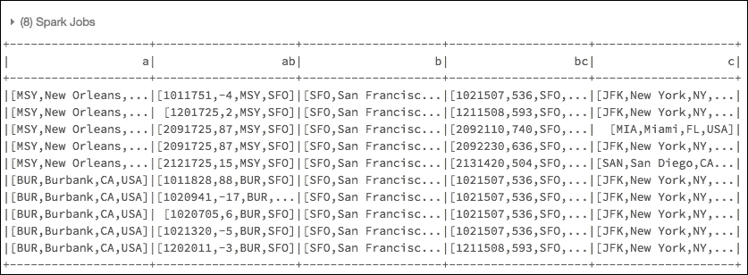

以下是从该查询中提取的简化子集，其中列是相应的 motif 键：

| a | ab | b | bc | c |
| --- | --- | --- | --- | --- |
| `休斯顿 (IAH)` | `IAH -> SFO (-4)``[1011126]` | `旧金山 (SFO)` | `SFO -> 纽约肯尼迪机场 (JFK) (536)``[1021507]` | `纽约 (JFK)` |
| `图森 (TUS)` | `TUS -> SFO (-5)``[1011126]` | `旧金山 (SFO)` | `SFO -> 纽约肯尼迪机场 (JFK) (536)``[1021507]` | `纽约 (JFK)` |

参考 TUS > SFO > JFK 航班，你会发现，虽然图森到旧金山的航班提前了 5 分钟起飞，但旧金山到纽约 JFK 的航班延误了 536 分钟。

通过使用模式发现，你可以轻松地在图中搜索结构模式；通过使用 GraphFrames，你正在利用 DataFrames 的强大功能和速度来分发和执行你的查询。

# 使用 PageRank 确定机场排名

因为 GraphFrames 建立在 GraphX 之上，所以我们可以立即利用几个算法。PageRank 是由 Google 搜索引擎普及并由拉里·佩奇创造的。引用维基百科：

> "PageRank 通过计算指向一个页面的链接数量和质量，以确定一个粗略的估计，即该网站的重要性。其基本假设是，更重要的网站更有可能从其他网站获得更多链接。"

虽然前面的例子提到了网页，但这个概念同样适用于任何图结构，无论它是从网页、自行车站还是机场创建的。然而，通过 GraphFrames 的接口调用方法非常简单。`GraphFrames.PageRank`将返回 PageRank 结果，作为附加到*vertices* DataFrame 的新列，以简化我们的下游分析。

由于数据集中包含了众多机场的航班和连接，我们可以使用 PageRank 算法让 Spark 迭代遍历图，以计算每个机场重要性的粗略估计：

```py
# Determining Airport ranking of importance using 'pageRank'
ranks = tripGraph.pageRank(resetProbability=0.15, maxIter=5)

# Display the pageRank output
display(ranks.vertices.orderBy(ranks.vertices.pagerank.desc()).limit(20))
```

注意，`resetProbability = 0.15`表示重置到随机顶点的概率（这是默认值），而`maxIter = 5`是一个固定的迭代次数。

### 小贴士

更多关于 PageRank 参数的信息，请参考维基百科 > Page Rank [`en.wikipedia.org/wiki/PageRank`](https://en.wikipedia.org/wiki/PageRank)。

PageRank 的结果如下所示：

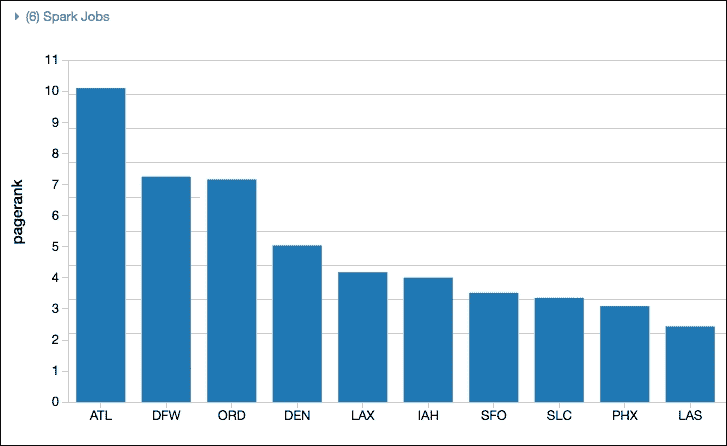

在机场排名方面，`PageRank`算法确定 ATL（哈茨菲尔德-杰克逊亚特兰大国际机场）是美国最重要的机场。这一观察结果是合理的，因为 ATL 不仅是美国最繁忙的机场([`bit.ly/2eTGHs4`](http://bit.ly/2eTGHs4))，也是 2000-2015 年世界上最繁忙的机场([`bit.ly/2eTGDsy`](http://bit.ly/2eTGDsy))。

# 确定最受欢迎的非直飞航班

在我们的`tripGraph` GraphFrame 的基础上进行扩展，以下查询将允许我们找到美国最受欢迎的非直飞航班（对于这个数据集）：

```py
# Determine the most popular non-stop flights
import pyspark.sql.functions as func
topTrips = tripGraph \
  .edges \
  .groupBy("src", "dst") \
  .agg(func.count("delay").alias("trips"))

# Show the top 20 most popular flights (single city hops)
display(topTrips.orderBy(topTrips.trips.desc()).limit(20))
```

注意，虽然我们使用了`delay`列，但我们实际上只是在计算行程数量。以下是输出结果：

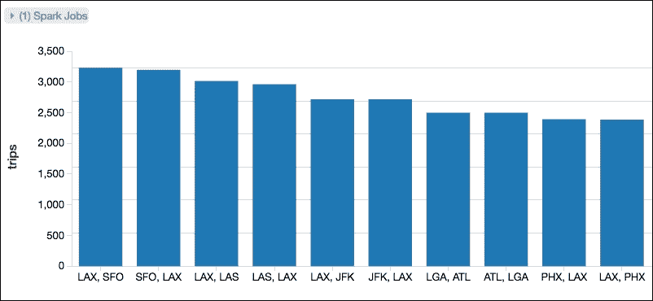

从这个查询中可以看出，最频繁的非直飞航班是洛杉矶（LAX）和旧金山（SFO）之间的航班。这些航班如此频繁的事实表明它们在航空市场中的重要性。正如 2016 年 4 月 4 日的《纽约时报》文章中提到的，*阿拉斯加航空视维珍美国航空为西海岸的关键* ([`nyti.ms/2ea1uZR`](http://nyti.ms/2ea1uZR))，在这些两个机场获得航班时刻表是阿拉斯加航空公司收购维珍航空的原因之一。图表不仅有趣，而且可能包含潜在的商业洞察力！

# 使用广度优先搜索

**广度优先搜索**（**BFS**）是 GraphFrames 的一部分新算法，它可以从一组顶点找到另一组顶点的最短路径。在本节中，我们将使用 BFS 遍历我们的`tripGraph`，快速找到所需的顶点（即机场）和边（即航班）。让我们尝试根据数据集找到城市之间最短连接数。请注意，这些示例不考虑时间或距离，只是城市之间的跳数。例如，要找到西雅图和旧金山之间的直飞航班数量，您可以运行以下查询：

```py
# Obtain list of direct flights between SEA and SFO
filteredPaths = tripGraph.bfs(
  fromExpr = "id = 'SEA'",
  toExpr = "id = 'SFO'",
  maxPathLength = 1)

# display list of direct flights
display(filteredPaths)
```

`fromExpr`和`toExpr`是表示起点和目的地机场的表达式（即 SEA 和 SFO）。`maxPathLength = 1`表示我们只想在两个顶点之间有一个边，即西雅图和旧金山之间的直飞航班。正如以下结果所示，西雅图和旧金山之间有大量的直飞航班：

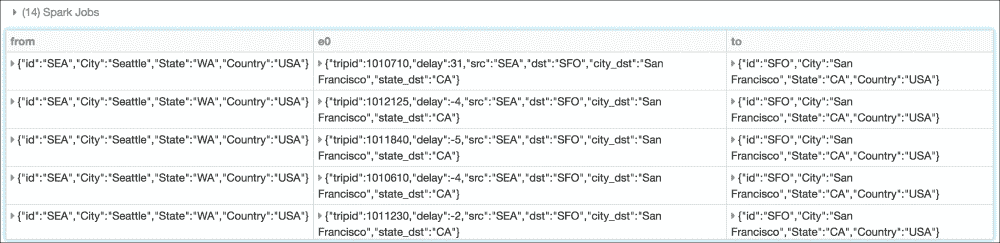

但如果我们想确定旧金山和布法罗之间的直飞航班数量呢？运行以下查询将显示没有结果，也就是说，两个城市之间没有直飞航班：

```py
# Obtain list of direct flights between SFO and BUF
filteredPaths = tripGraph.bfs(
  fromExpr = "id = 'SFO'",
  toExpr = "id = 'BUF'",
  maxPathLength = 1)

# display list of direct flights
display(filteredPaths)
```

一旦我们将前面的查询修改为 `maxPathLength = 2`，即一次转机，那么您将看到更多的航班选择：

```py
# display list of one-stop flights between SFO and BUF
filteredPaths = tripGraph.bfs(
  fromExpr = "id = 'SFO'",
  toExpr = "id = 'BUF'",
  maxPathLength = 2)

# display list of flights
display(filteredPaths)
```

下表提供了此查询输出的简略版本：

| 从 | 转机 | 到 |
| --- | --- | --- |
| `SFO` | **MSP** (**明尼阿波利斯**) | `BUF` |
| `SFO` | **EWR** (**纽瓦克**) | `BUF` |
| `SFO` | **JFK** (**纽约**) | `BUF` |
| `SFO` | **ORD** (**芝加哥**) | `BUF` |
| `SFO` | **ATL** (**亚特兰大**) | `BUF` |
| `SFO` | **LAS** (**拉斯维加斯**) | `BUF` |
| `SFO` | **BOS** (**波士顿**) | `BUF` |

但现在我已经有了机场列表，我该如何确定哪些转机机场在 SFO 和 BUF 之间更受欢迎？为了确定这一点，您现在可以运行以下查询：

```py
# Display most popular layover cities by descending count
display(filteredPaths.groupBy("v1.id", "v1.City").count().orderBy(desc("count")).limit(10))
```

下面的条形图显示了输出结果：

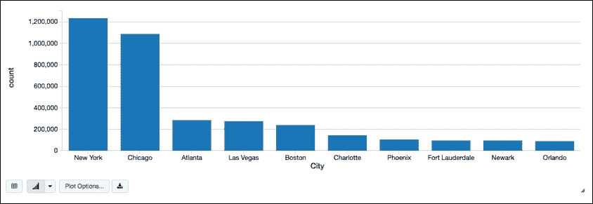

# 使用 D3 可视化航班

要获取此数据集中航班路径和连接的强大且有趣的可视化，我们可以在我们的 Databricks 笔记本中使用 Airports D3 可视化 ([`mbostock.github.io/d3/talk/20111116/airports.html`](https://mbostock.github.io/d3/talk/20111116/airports.html))。通过连接我们的 GraphFrames、DataFrames 和 D3 可视化，我们可以可视化所有航班连接的范围，正如数据集中所有准时或提前起飞的航班所注明的。

蓝色圆圈代表顶点（即机场），圆圈的大小代表进出这些机场的边的数量。黑色线条是边本身（即航班）以及它们与其他顶点（即机场）的相应连接。注意，对于超出屏幕的任何边，它们代表夏威夷和阿拉斯加州的顶点（即机场）。

为了使这可行，我们首先创建一个名为 `d3a` 的 `scala` 包，该包嵌入在我们的笔记本中（你可以从这里下载：[`bit.ly/2kPkXkc`](https://github.com/drabastomek/learningPySpark/blob/master/Chapter08/LearningPySpark_Chapter08.ipynb))。因为我们使用 Databricks 笔记本，我们可以在 PySpark 笔记本中调用 `Scala`：

```py
%scala
// On-time and Early Arrivals
import d3a._
graphs.force(
  height = 800,
  width = 1200,
  clicks = sql("""select src, dst as dest, count(1) as count from departureDelays_geo where delay <= 0 group by src, dst""").as[Edge])
```

前一个查询的准时和提前到达航班的结果显示在下述屏幕截图：


你可以在机场 D3 可视化中悬停于机场（蓝色圆圈，顶点）上，其中线条代表边（航班）。前一个可视化是悬停在西雅图（SEA）机场时的快照；而下一个可视化是悬停在洛杉矶（LAX）机场时的快照：

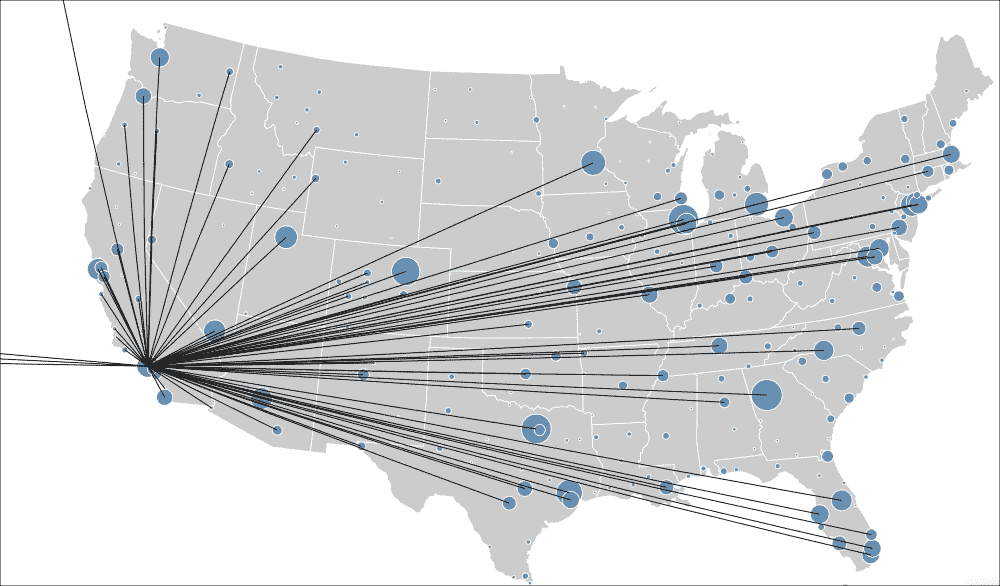

# 摘要

正如本章所示，你可以通过针对图结构执行查询轻松执行大量强大的数据分析。使用 GraphFrames，你可以利用 DataFrame API 的强大、简单和性能来解决你的图问题。

关于 GraphFrames 的更多信息，请参阅以下资源：

+   *介绍 GraphFrames* ([`bit.ly/2dBPhKn`](http://bit.ly/2dBPhKn))

+   *Apache Spark 中的 GraphFrames 准时航班性能* ([`bit.ly/2c804ZD`](http://bit.ly/2c804ZD))

+   *Apache Spark（Spark 2.0）中的 GraphFrames 准时航班性能笔记本* ([`bit.ly/2kPkXkc`](https://github.com/drabastomek/learningPySpark/blob/master/Chapter08/LearningPySpark_Chapter08.ipynb))

+   *GraphFrames 概述* ([`graphframes.github.io/`](http://graphframes.github.io/))

+   *Pygraphframes 文档* ([`graphframes.github.io/api/python/graphframes.html`](http://graphframes.github.io/api/python/graphframes.html))

+   *GraphX 编程指南* ([`spark.apache.org/docs/latest/graphx-programming-guide.html`](http://spark.apache.org/docs/latest/graphx-programming-guide.html))

在下一章中，我们将扩展我们的 PySpark 视野，进入深度学习领域，重点关注 TensorFlow 和 TensorFrames。
