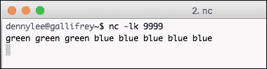

# 第十章：结构化流

本章将介绍 Spark Streaming 背后的概念以及它如何演变成结构化流（Structured Streaming）。结构化流的一个重要方面是它利用 Spark DataFrames。这种范式转变将使 Python 开发者更容易开始使用 Spark Streaming。

在本章中，你将学习：

+   什么是 Spark Streaming？

+   我们为什么需要 Spark Streaming？

+   Spark Streaming 应用程序数据流是什么？

+   使用 DStream 的简单流应用程序

+   Spark Streaming 全球聚合的快速入门

+   介绍结构化流

注意，本章的前几节将使用 Scala 代码示例，因为这是大多数 Spark Streaming 代码的编写方式。当我们开始关注结构化流时，我们将使用 Python 示例。

# 什么是 Spark Streaming？

在其核心，Spark Streaming 是一个可扩展、容错的流处理系统，它采用了 RDD 批处理范式（即批量处理数据）并加快了处理速度。虽然这是一个轻微的简化，但基本上 Spark Streaming 在微批或批处理间隔（从 500ms 到更大的间隔窗口）中运行。

如以下图所示，Spark Streaming 接收一个输入数据流，并将其内部分解成多个更小的批量（其大小基于 *批处理间隔*）。Spark 引擎处理这些输入数据批量，生成处理后的数据批量结果集。


来源：Apache Spark Streaming 编程指南，请参阅：[`spark.apache.org/docs/latest/streaming-programming-guide.html`](http://spark.apache.org/docs/latest/streaming-programming-guide.html)

Spark Streaming 的关键抽象是离散流（Discretized Stream，DStream），它代表了之前提到的构成数据流的小批量。DStreams 建立在 RDD 之上，允许 Spark 开发者在 RDD 和批处理相同的上下文中工作，现在只是将其应用于他们的流处理问题。此外，一个重要的方面是，因为你使用 Apache Spark，Spark Streaming 与 MLlib、SQL、DataFrames 和 GraphX 集成。

以下图表示 Spark Streaming 的基本组件：


来源：Apache Spark Streaming 编程指南，请参阅：[`spark.apache.org/docs/latest/streaming-programming-guide.html`](http://spark.apache.org/docs/latest/streaming-programming-guide.html)

Spark Streaming 是一个高级 API，为有状态操作提供容错**精确一次**语义。Spark Streaming 内置**接收器**，可以处理许多来源，其中最常见的是 Apache Kafka、Flume、HDFS/S3、Kinesis 和 Twitter。例如，Kafka 和 Spark Streaming 之间最常用的集成在 Spark Streaming + Kafka 集成指南中有很好的文档记录，该指南可在[`spark.apache.org/docs/latest/streaming-kafka-integration.html`](https://spark.apache.org/docs/latest/streaming-kafka-integration.html)找到。

此外，您还可以创建自己的**自定义接收器**，例如 Meetup 接收器([`github.com/actions/meetup-stream/blob/master/src/main/scala/receiver/MeetupReceiver.scala`](https://github.com/actions/meetup-stream/blob/master/src/main/scala/receiver/MeetupReceiver.scala))，它允许您使用 Spark Streaming 读取 Meetup 流式 API([`www.meetup.com/meetup_api/docs/stream/2/rsvps/`](https://www.meetup.com/meetup_api/docs/stream/2/rsvps/))。

### 注意

**观看 Meetup 接收器在实际操作中的表现**

如果您对查看 Spark Streaming Meetup 接收器在实际操作中的表现感兴趣，您可以参考以下 Databricks 笔记本：[`github.com/dennyglee/databricks/tree/master/notebooks/Users/denny%40databricks.com/content/Streaming%20Meetup%20RSVPs`](https://github.com/dennyglee/databricks/tree/master/notebooks/Users/denny%40databricks.com/content/Streaming%20Meetup%20RSVPs)，这些笔记本使用了之前提到的 Meetup 接收器。

以下是在左侧窗口中查看 Spark UI（流式处理选项卡）时，笔记本的实际截图。


您将能够使用 Spark Streaming 接收来自全国（或世界）的 Meetup RSVP，并通过州（或国家）获得近乎实时的 Meetup RSVP 摘要。注意，这些笔记本目前是用`Scala`编写的。

# 我们为什么需要 Spark Streaming？

如 Tathagata Das 所述——Apache Spark 项目的提交者和项目管理委员会（PMC）成员，以及 Spark Streaming 的首席开发者——在 Datanami 文章《Spark Streaming：它是什么以及谁在使用它》([`www.datanami.com/2015/11/30/spark-streaming-what-is-it-and-whos-using-it/`](https://www.datanami.com/2015/11/30/spark-streaming-what-is-it-and-whos-using-it/))中提到，对于流式处理存在**业务需求**。随着在线交易、社交媒体、传感器和设备的普及，公司正在以更快的速度生成和处理更多数据。

能够在规模和实时性上开发可操作的见解，为这些企业提供竞争优势。无论您是检测欺诈交易、提供传感器异常的实时检测，还是对下一个病毒式推文做出反应，流式分析正在成为数据科学家和数据工程师工具箱中越来越重要的组成部分。

Spark Streaming 之所以被迅速采用，是因为 Apache Spark 将所有这些不同的数据处理范式（通过 ML 和 MLlib 进行机器学习、Spark SQL 和流式处理）统一在同一个框架中。因此，你可以从训练机器学习模型（ML 或 MLlib）开始，到使用这些模型评分数据（流式处理），再到使用你喜欢的 BI 工具进行数据分析（SQL）——所有这些都在同一个框架内完成。包括 Uber、Netflix 和 Pinterest 在内的公司经常展示他们的 Spark Streaming 应用案例：

+   *Uber 如何使用 Spark 和 Hadoop 优化客户体验*：[`www.datanami.com/2015/10/05/how-uber-uses-spark-and-hadoop-to-optimize-customer-experience/`](https://www.datanami.com/2015/10/05/how-uber-uses-spark-and-hadoop-to-optimize-customer-experience/)

+   *Netflix 的 Spark 和 Spark Streaming*：[`spark-summit.org/2015/events/spark-and-spark-streaming-at-netflix/`](https://spark-summit.org/2015/events/spark-and-spark-streaming-at-netflix/)

+   *Spark Streaming 能否在混沌猴子测试中生存？* [`techblog.netflix.com/2015/03/can-spark-streaming-survive-chaos-monkey.html`](http://techblog.netflix.com/2015/03/can-spark-streaming-survive-chaos-monkey.html)

+   *Pinterest 的实时分析*：[`engineering.pinterest.com/blog/real-time-analytics-pinterest`](https://engineering.pinterest.com/blog/real-time-analytics-pinterest)

目前，围绕 Spark Streaming 有四个广泛的应用场景：

+   **流式 ETL**：在将数据推送到下游之前，数据会持续进行清洗和聚合。这通常是为了减少最终数据存储中需要存储的数据量。

+   **触发器**：实时检测行为或异常事件会触发立即和下游操作。例如，一个位于检测器或信标附近的设备将触发一个警报。

+   **数据丰富**：将实时数据与其他数据集合并，以进行更深入的分析。例如，将实时天气信息与航班信息结合，以构建更好的旅行警报。

+   **复杂会话和持续学习**：与实时流相关联的多组事件持续进行分析和/或更新机器学习模型。例如，与在线游戏相关的用户活动流，使我们能够更好地细分用户。

# Spark Streaming 应用数据流是什么？

下图提供了 Spark 驱动程序、工作节点、流式数据源和目标之间的数据流：


所有这一切都始于 Spark Streaming 上下文，如前图所示`ssc.start()`：

1.  当 Spark Streaming 上下文启动时，驱动程序将在 executors（即 Spark 工作节点）上执行一个长时间运行的任务。

1.  执行器上的**接收器**（此图中的**Executor 1**）从流式源接收数据流。随着数据流的到来，接收器将流分成块，并将这些块保存在内存中。

1.  这些块也被复制到另一个执行器，以避免数据丢失。

1.  块 ID 信息被传输到驱动程序上的**块管理主节点**。

1.  对于在 Spark Streaming 上下文中配置的每个批次间隔（通常这是每秒一次），驱动程序将启动 Spark 任务来处理这些块。然后，这些块被持久化到任意数量的目标数据存储中，包括云存储（例如，S3、WASB 等）、关系型数据存储（例如，MySQL、PostgreSQL 等）和 NoSQL 存储。

对于流式应用程序来说，有很多动态部分需要不断优化和配置。Spark Streaming 的大部分文档在 Scala 中更为完整，因此，当您使用 Python API 时，您可能有时需要参考 Scala 版本的文档。如果这种情况发生在您身上，请提交一个错误报告，并且/或者如果您有一个建议的修复方案，请填写一个 PR ([`issues.apache.org/jira/browse/spark/`](https://issues.apache.org/jira/browse/spark/))。

关于这个主题的更深入探讨，请参阅：

1.  *Spark 1.6 流式编程指南*: [`spark.apache.org/docs/1.6.0/streaming-programming-guide.html`](https://spark.apache.org/docs/1.6.0/streaming-programming-guide.html)

1.  *《达沙塔·达斯深入浅出 Spark Streaming（Spark Meetup 2013-06-17）》*: [`www.slideshare.net/spark-project/deep-divewithsparkstreaming-tathagatadassparkmeetup20130617`](http://www.slideshare.net/spark-project/deep-divewithsparkstreaming-tathagatadassparkmeetup20130617)

# 使用 DStreams 的简单流式应用程序

让我们使用 Python 中的 Spark Streaming 创建一个简单的词频统计示例。对于这个示例，我们将使用 DStream——组成数据流的小批次的离散流。本书本节使用的示例可以在以下位置找到：[`github.com/drabastomek/learningPySpark/blob/master/Chapter10/streaming_word_count.py`](https://github.com/drabastomek/learningPySpark/blob/master/Chapter10/streaming_word_count.py)。

这个词频统计示例将使用 Linux/Unix 的`nc`命令——这是一个简单的工具，可以在网络连接中读取和写入数据。我们将使用两个不同的 bash 终端，一个使用`nc`命令将单词发送到我们计算机的本地端口（`9999`），另一个终端将运行 Spark Streaming 以接收这些单词并计数。我们脚本的初始命令集在此处记录：

```py
1\. # Create a local SparkContext and Streaming Contexts
2\. from pyspark import SparkContext
3\. from pyspark.streaming import StreamingContext
4\. 
5\. # Create sc with two working threads 
6\. sc = SparkContext("local[2]", "NetworkWordCount")
7\. 
8\. # Create local StreamingContextwith batch interval of 1 second
9\. ssc = StreamingContext(sc, 1)
10\. 
11\. # Create DStream that connects to localhost:9999
12\. lines = ssc.socketTextStream("localhost", 9999)
```

这里有一些关于前面命令的重要说明：

1.  第 9 行的`StreamingContext`是 Spark Streaming 的入口点

1.  第 9 行`...(sc, 1)`中的`1`是*批次间隔*；在这种情况下，我们每秒运行微批次。

1.  第 12 行的 `lines` 是通过 `ssc.socketTextStream` 提取的数据流的 `DStream`。

1.  如描述中所述，`ssc.socketTextStream` 是 Spark Streaming 方法，用于审查特定套接字的文本流；在这种情况下，你的本地计算机在套接字 `9999` 上。

下几行代码（如注释中所述），将行 DStream 分割成单词，然后使用 RDDs，对每个数据批次中的每个单词进行计数，并将此信息打印到控制台（第 9 行）：

```py
1\. # Split lines into words
2\. words = lines.flatMap(lambda line: line.split(" "))
3\. 
4\. # Count each word in each batch
5\. pairs = words.map(lambda word: (word, 1))
6\. wordCounts = pairs.reduceByKey(lambda x, y: x + y)
7\. 
8\. # Print the first ten elements of each RDD in this DStream 
9\. wordCounts.pprint()
```

代码的最后一行启动了 Spark Streaming (`ssc.start()`)，然后等待一个终止命令来停止运行（例如，`<Ctrl><C>`）。如果没有发送终止命令，那么 Spark Streaming 程序将继续运行。

```py
# Start the computation
ssc.start()             

# Wait for the computation to terminate
ssc.awaitTermination()  
```

现在你有了脚本，如之前所述，打开两个终端窗口——一个用于你的 `nc` 命令，另一个用于 Spark Streaming 程序。要启动 `nc` 命令，在你的一个终端中输入：

```py
nc –lk 9999

```

从现在开始，你在这个终端中输入的所有内容都将被传输到端口 `9999`，如下面的截图所示：



在这个例子（如之前所述）中，我输入了三次单词 **green** 和五次 **blue**。从另一个终端屏幕，让我们运行你刚刚创建的 Python 流脚本。在这个例子中，我将脚本命名为 `streaming_word_count.py` 并使用命令 `../bin/spark-submit streaming_word_count.py localhost 9999`。

这个命令将运行 `streaming_word_count.py` 脚本，读取你的本地计算机（即 `localhost`）端口 `9999` 以接收发送到该套接字的所有单词。由于你已经在第一个屏幕上向该端口发送了信息，脚本启动后不久，Spark Streaming 程序将读取发送到端口 `9999` 的单词并执行单词计数，如下面的截图所示：


`streaming_word_count.py` 脚本将继续读取并打印任何新的信息到控制台。回到我们第一个终端（使用 `nc` 命令），我们现在可以输入下一组单词，如下面的截图所示：


查看第二个终端中的流脚本，你会注意到这个脚本每秒继续运行（即配置的 *批处理间隔*），你会在几秒钟后注意到计算出的 `gohawks` 单词计数：


使用这个相对简单的脚本，现在你可以看到 Spark Streaming 使用 Python 的实际应用。但是，如果你继续在 `nc` 终端中输入单词，你会注意到这些信息没有被聚合。例如，如果我们继续在 `nc` 终端中写入绿色（如下所示）：


Spark Streaming 终端将报告当前数据快照；即，这里提到的两个额外的 `green` 值：


没有发生的是全局聚合的概念，其中我们会保留该信息的 *状态*。这意味着，而不是报告 2 个新的 `green`，我们可以让 Spark Streaming 给我们提供绿色的总体计数，例如，7 个 `green`，5 个 `blue`，和 1 个 `gohawks`。我们将在下一节以 `UpdateStateByKey` / `mapWithState` 的形式讨论全局聚合。

### 小贴士

对于其他好的 PySpark 流式处理示例，请查看：

网络单词计数（在 Apache Spark GitHub 仓库中）：[`github.com/apache/spark/blob/master/examples/src/main/python/streaming/network_wordcount.py`](https://github.com/apache/spark/blob/master/examples/src/main/python/streaming/network_wordcount.py)

Python 流式处理示例：[`github.com/apache/spark/tree/master/examples/src/main/python/streaming`](https://github.com/apache/spark/tree/master/examples/src/main/python/streaming)

S3 FileStream Wordcount（Databricks 笔记本）：[`docs.cloud.databricks.com/docs/latest/databricks_guide/index.html#07%20Spark%20Streaming/06%20FileStream%20Word%20Count%20-%20Python.html`](https://docs.cloud.databricks.com/docs/latest/databricks_guide/index.html#07%20Spark%20Streaming/06%20FileStream%20Word%20Count%20-%20Python.html)

# 全球聚合的快速入门

如前节所述，到目前为止，我们的脚本已经执行了点时间流式单词计数。以下图表示了 **lines DStream** 及其微批处理，正如我们在前一节中脚本执行的那样：


在 1 秒的标记处，我们的 Python Spark Streaming 脚本返回了 `{(blue, 5), (green, 3)}` 的值，在 2 秒的标记处返回了 `{(gohawks, 1)}`，在 4 秒的标记处返回了 `{(green, 2)}`。但如果你想要特定时间窗口内的聚合单词计数呢？

下图展示了我们计算状态聚合的过程：


在这种情况下，我们有一个 0-5 秒的时间窗口。注意，在我们的脚本中，我们没有得到指定的时间窗口：每秒钟，我们计算单词的累积总和。因此，在 2 秒的标记处，输出不仅仅是 1 秒标记处的 `green` 和 `blue`，还包括 2 秒标记处的 `gohawks`：`{(blue, 5), (green, 3), (gohawks, 1)}`。在 4 秒的标记处，额外的 2 个 `green` 使总数达到 `{(blue, 5), (green, 5), (gohawks, 1)}`。

对于那些经常与关系型数据库工作的人来说，这似乎只是一个 `GROUP BY, SUM()` 语句。然而，在流式分析的情况下，持久化数据以运行 `GROUP BY, SUM()` 语句的时间比 *批处理间隔*（例如，1 秒）要长。这意味着我们将会不断落后并试图赶上数据流。

例如，如果你要运行 [`github.com/dennyglee/databricks/blob/master/notebooks/Users/denny%40databricks.com/content/Streaming%20Meetup%20RSVPs/1.%20Streaming%20and%20DataFrames.scala`](https://github.com/dennyglee/databricks/blob/master/notebooks/Users/denny%40databricks.com/content/Streaming%20Meetup%20RSVPs/1.%20Streaming%20and%20DataFrames.scala) 的 *1\. Streaming and DataFrames.scala* Databricks 笔记本，并且查看 Spark UI 中的流式作业，你会得到以下类似图示：


注意在图中，**调度延迟**和**总延迟**的数字正在迅速增加（例如，平均总延迟为**54 秒 254 毫秒**，实际总延迟大于 2 分钟）并且远远超出 1 秒的 *批处理间隔* 阈值。我们看到这种延迟的原因是因为，在那个笔记本的流式代码内部，我们也运行了以下代码：

```py
// Populate `meetup_stream` table
sqlContext.sql("insert into meetup_stream select * from meetup_stream_json")
```

即，插入任何新的数据块（即，1 秒 RDD 微批），将它们转换为 DataFrame（`meetup_stream_json` 表），并将数据插入到持久表中（`meetup_stream` 表）。以这种方式持久化数据导致了缓慢的流式性能和不断增长的调度延迟。为了通过 *流式分析* 解决这个问题，这就是通过 `UpdateStateByKey`（Spark 1.5 及之前）或 `mapWithState`（Spark 1.6 及以后）创建全局聚合的地方。

### 小贴士

关于 Spark Streaming 的可视化信息，请花时间查看 *理解 Apache Spark Streaming 应用程序的新可视化*：[`databricks.com/blog/2015/07/08/new-visualizations-for-understanding-apache-spark-streaming-applications.html`](https://databricks.com/blog/2015/07/08/new-visualizations-for-understanding-apache-spark-streaming-applications.html)。

了解这一点后，让我们重新编写原始的 `streaming_word_count.py`，现在我们有一个名为 `stateful_streaming_word_count.py` 的 *有状态* 版本；你可以在这个脚本的全版本在 [`github.com/drabastomek/learningPySpark/blob/master/Chapter10/stateful_streaming_word_count.py`](https://github.com/drabastomek/learningPySpark/blob/master/Chapter10/stateful_streaming_word_count.py)。

我们脚本的初始命令集合如下所示：

```py
 1\. # Create a local SparkContext and Streaming Contexts
 2\. from pyspark import SparkContext
 3\. from pyspark.streaming import StreamingContext
 4\. 
 5\. # Create sc with two working threads 
 6\. sc = SparkContext("local[2]", "StatefulNetworkWordCount")
 7\. 
 8\. # Create local StreamingContext with batch interval of 1 sec
 9\. ssc = StreamingContext(sc, 1)
10\. 
11\. # Create checkpoint for local StreamingContext
12\. ssc.checkpoint("checkpoint")
13\. 
14\. # Define updateFunc: sum of the (key, value) pairs
15\. def updateFunc(new_values, last_sum):
16\.   return sum(new_values) + (last_sum or 0)
17\. 
18\. # Create DStream that connects to localhost:9999
19\. lines = ssc.socketTextStream("localhost", 9999)
```

如果你还记得 `streaming_word_count.py`，主要的不同之处从第 11 行开始：

+   第 12 行的`ssc.checkpoint("checkpoint")`配置了一个 Spark Streaming *检查点*。为了确保 Spark Streaming 由于持续运行而具有容错性，它需要将足够的信息检查点到容错存储中，以便在发生故障时恢复。注意，我们不会深入探讨这个概念（尽管在下面的*小贴士*部分有更多信息），因为许多这些配置都将通过 Structured Streaming 抽象化。

+   第 15 行的`updateFunc`告诉程序通过`UpdateStateByKey`更新应用程序的*状态*（在代码的后面部分）。在这种情况下，它返回前一个值（`last_sum`）和新的值的总和（`sum(new_values) + (last_sum or 0)`）。

+   在第 19 行，我们有与上一个脚本相同的`ssc.socketTextStream`。

    ### 小贴士

    关于 Spark Streaming *检查点*的更多信息，以下是一些好的参考资料：

    Spark Streaming 编程指南 > 检查点: [`spark.apache.org/docs/1.6.0/streaming-programming-guide.html#checkpointing`](https://spark.apache.org/docs/1.6.0/streaming-programming-guide.html#checkpointing)

    探索 Apache Spark 中的有状态流: [`asyncified.io/2016/07/31/exploring-stateful-streaming-with-apache-spark/`](http://asyncified.io/2016/07/31/exploring-stateful-streaming-with-apache-spark/)

代码的最后一部分如下：

```py
 1\. # Calculate running counts
 2\. running_counts = lines.flatMap(lambda line: line.split(" "))\
 3\.           .map(lambda word: (word, 1))\
 4\.           .updateStateByKey(updateFunc)
 5\. 
 6\. # Print the first ten elements of each RDD generated in this 
 7\. # stateful DStream to the console
 8\. running_counts.pprint()
 9\. 
10\. # Start the computation
11\. ssc.start()             
12\. 
13\. # Wait for the computation to terminate
14\. ssc.awaitTermination()  
```

当第 10-14 行的代码与上一个脚本相同，但区别在于我们现在有一个`running_counts`变量，它将数据拆分以获取单词，并在每个批次中运行一个映射函数来计算每个单词（在之前的脚本中这是`words`和`pairs`变量）。

主要区别在于使用`updateStateByKey`方法，该方法将执行之前提到的`updateFunc`，该函数执行求和操作。`updateStateByKey`是 Spark Streaming 执行对数据流进行计算并高效更新每个键的状态的方法。需要注意的是，你通常会在 Spark 1.5 及更早版本中使用`updateStateByKey`；这些*有状态*的全局聚合的性能与*状态的大小*成正比。从 Spark 1.6 版本开始，你应该使用`mapWithState`，因为其性能与*批次的大小*成正比。

### 小贴士

注意，与`updateStateByKey`相比，`mapWithState`通常涉及更多的代码，因此示例是使用`updateStateByKey`编写的。

关于有状态 Spark Streaming 的更多信息，包括`mapWithState`的使用，请参阅：

有状态网络词频 Python 示例: [`github.com/apache/spark/blob/master/examples/src/main/python/streaming/stateful_network_wordcount.py`](https://github.com/apache/spark/blob/master/examples/src/main/python/streaming/stateful_network_wordcount.py)

使用 mapWithState 在 Scala 中进行全局聚合：[`docs.cloud.databricks.com/docs/latest/databricks_guide/index.html#07%20Spark%20Streaming/12%20Global%20Aggregations%20-%20mapWithState.html`](https://docs.cloud.databricks.com/docs/latest/databricks_guide/index.html#07%20Spark%20Streaming/12%20Global%20Aggregations%20-%20mapWithState.html)

使用 mapWithState 在 Scala 中计算单词数量：[`docs.cloud.databricks.com/docs/spark/1.6/examples/Streaming%20mapWithState.html`](https://docs.cloud.databricks.com/docs/spark/1.6/examples/Streaming%20mapWithState.html)

在 Apache Spark Streaming 中实现更快的有状态流处理：[`databricks.com/blog/2016/02/01/faster-stateful-stream-processing-in-apache-spark-streaming.html`](https://databricks.com/blog/2016/02/01/faster-stateful-stream-processing-in-apache-spark-streaming.html)

# 介绍结构化流

在 Spark 2.0 中，Apache Spark 社区正在通过引入 *结构化流* 的概念来简化流处理，该概念将流的概念与 Datasets/DataFrames 相结合（如下图中所示）：


如前几章关于 DataFrames 所述，在 Spark SQL 引擎（和 Catalyst 优化器）中执行 SQL 和/或 DataFrame 查询的过程是围绕构建逻辑计划、构建多个物理计划、引擎根据其成本优化器选择正确的物理计划，然后生成代码（即 *代码生成*）以高效地提供结果。*结构化流* 引入的概念是 **增量执行计划**。当处理数据块时，结构化流会对其接收到的每一组新数据块重复应用执行计划。通过这种方式运行，引擎可以利用 Spark DataFrames/Datasets 中的优化，并将它们应用于传入的数据流。这将更容易集成 Spark 的其他 DataFrame 优化组件，包括 ML 流水线、GraphFrames、TensorFrames 以及许多其他组件。

使用结构化流也将简化你的代码。例如，以下是一个读取数据流从 S3 并将其保存到 MySQL 数据库的 *批量聚合* 的伪代码示例：

```py
logs = spark.read.json('s3://logs')

logs.groupBy(logs.UserId).agg(sum(logs.Duration))
.write.jdbc('jdbc:mysql//...')
```

以下是一个 *连续聚合* 的伪代码示例：

```py
logs = spark.readStream.json('s3://logs').load()

sq = logs.groupBy(logs.UserId).agg(sum(logs.Duration))
.writeStream.format('json').start()
```

创建 `sq` 变量的原因是它允许你检查你的结构化流作业的状态并终止它，如下所示：

```py
# Will return true if the `sq` stream is active
sq.isActive

# Will terminate the `sq` stream
sq.stop()
```

让我们将使用 `updateStateByKey` 的有状态流式单词计数脚本转换为结构化流式单词计数脚本；你可以从以下链接获取完整的 `structured_streaming_word_count.py` 脚本：[`github.com/drabastomek/learningPySpark/blob/master/Chapter10/structured_streaming_word_count.py`](https://github.com/drabastomek/learningPySpark/blob/master/Chapter10/structured_streaming_word_count.py)。

与之前的脚本相反，我们现在使用更熟悉的 DataFrame 代码，如以下所示：

```py
# Import the necessary classes and create a local SparkSession
from pyspark.sql import SparkSession
from pyspark.sql.functions import explode
from pyspark.sql.functions import split

spark = SparkSession \
   .builder \
   .appName("StructuredNetworkWordCount") \
   .getOrCreate()
```

脚本的最初几行导入必要的类并建立当前的 `SparkSession`。但是，与之前的流脚本相反，在脚本的下一行中注意到的这里，你不需要建立流上下文，因为这已经包含在 `SparkSession` 中：

```py
 1\. # Create DataFrame representing the stream of input lines
 2\. # from connection to localhost:9999
 3\.  lines = spark\
 4\.    .readStream\
 5\.    .format('socket')\
 6\.    .option('host', 'localhost')\
 7\.   .option('port', 9999)\
 8\.   .load()
 9.
10\. # Split the lines into words
11\. words = lines.select(
12\.   explode(
13\.          split(lines.value, ' ')
14\.   ).alias('word')
15\.   )
16.
17\. # Generate running word count
18\. wordCounts = words.groupBy('word').count()
```

相反，代码中的流部分是通过在第 4 行调用 `readStream` 来启动的。

+   第 3-8 行启动从端口 `9999` 的数据流 *读取*，就像前两个脚本一样

+   我们不需要运行 RDD 的 `flatMap`、`map` 和 `reduceByKey` 函数来分割读取的行到单词并计算每个批次中的每个单词，我们可以使用 PySpark SQL 函数 `explode` 和 `split`，如第 10-15 行所示

+   我们不需要运行 `updateStateByKey` 或创建 `updateFunc`，就像状态流词频脚本中所做的那样，我们可以使用熟悉的 DataFrame `groupBy` 语句和 `count()` 来生成运行词频，如第 17-18 行所示

要将此数据输出到控制台，我们将使用 `writeStream`，如以下所示：

```py
 1\. # Start running the query that prints the 
 2\. # running counts to the console
 3\. query = wordCounts\
 4\.     .writeStream\
 5\.     .outputMode('complete')\
 6\.     .format('console')\
 7\.     .start()
 8\. 
 9\. # Await Spark Streaming termination
10\. query.awaitTermination()
```

我们不是使用 `pprint()`，而是明确调用 `writeStream` 来写入流，并定义格式和输出模式。虽然写起来稍微长一些，但这些方法和属性与 DataFrame 调用的语法相似，你只需要更改 `outputMode` 和 `format` 属性来将其保存到数据库、文件系统、控制台等。最后，正如第 10 行所注明的，我们将运行 `awaitTermination` 来等待取消此流作业。

让我们回到第一个终端并运行我们的 `nc` 作业：

```py
$ nc –lk 9999
green green green blue blue blue blue blue
gohawks
green green

```

检查以下输出。正如你所见，你得到了具有状态流的优势，但使用了更熟悉的 DataFrame API：


# 摘要

重要的是要注意，结构化流目前（在撰写本文时）尚未准备好投入生产。然而，它却是 Spark 中的一个范式转变，有望使数据科学家和数据工程师更容易构建 **持续应用程序**。虽然在前面的章节中没有明确指出，但在处理流应用程序时，你将需要为许多潜在问题进行设计，例如迟到事件、部分输出、失败时的状态恢复、分布式读写等。使用结构化流，许多这些问题将被抽象化，以便你更容易构建 *持续应用程序*。

我们鼓励你尝试 Spark 结构化流，这样你将能够轻松构建随着结构化流成熟的应用程序。正如 Reynold Xin 在他的 Spark Summit 2016 East 演讲 *Spark 的实时未来* 中指出（[`www.slideshare.net/rxin/the-future-of-realtime-in-spark`](http://www.slideshare.net/rxin/the-future-of-realtime-in-spark)）：

> "执行流式分析最简单的方法就是无需对流进行*推理*。"

更多信息，以下是一些额外的结构化流资源：

+   *PySpark 2.1 文档: pyspark.sql.module*: [`spark.apache.org/docs/2.1.0/api/python/pyspark.sql.html`](http://spark.apache.org/docs/2.1.0/api/python/pyspark.sql.html)

+   *介绍 Apache Spark 2.1*: [`databricks.com/blog/2016/12/29/introducing-apache-spark-2-1.html`](https://databricks.com/blog/2016/12/29/introducing-apache-spark-2-1.html)

+   *结构化 Apache Spark 2.0：SQL、数据框、数据集和流式处理 - 作者：Michael Armbrust*: [`www.slideshare.net/databricks/structuring-spark-dataframes-datasets-and-streaming-62871797`](http://www.slideshare.net/databricks/structuring-spark-dataframes-datasets-and-streaming-62871797)

+   *结构化流编程指南*: [`spark.apache.org/docs/latest/streaming-programming-guide.html`](http://spark.apache.org/docs/latest/streaming-programming-guide.html)

+   *结构化流（又称流式数据框）[SPARK-8360]*: [`issues.apache.org/jira/browse/SPARK-8360`](https://issues.apache.org/jira/browse/SPARK-8360)

+   *结构化流编程抽象、语义和 API - Apache JIRA*: [`issues.apache.org/jira/secure/attachment/12793410/StructuredStreamingProgrammingAbstractionSemanticsandAPIs-ApacheJIRA.pdf`](https://issues.apache.org/jira/secure/attachment/12793410/StructuredStreamingProgrammingAbstractionSemanticsandAPIs-ApacheJIRA.pdf)

在下一章中，我们将向您展示如何模块化并打包您的 PySpark 应用程序，并程序化地提交它以执行。
