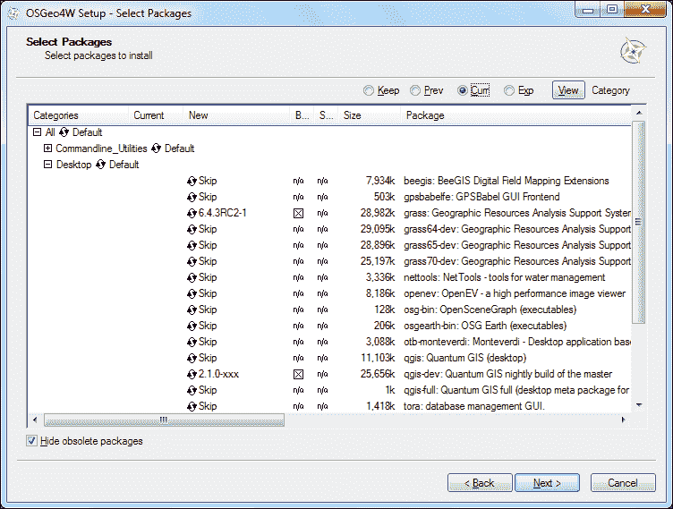

# 第一章. QGIS 入门

在本章中，我们将安装和配置 QGIS 地理信息系统。我们还将了解用户界面以及如何自定义它。到本章结束时，您将在您的机器上运行 QGIS，并准备好开始教程。

# 安装 QGIS

QGIS 可以在 Windows、各种 Linux 发行版、Unix、Mac OS X 和 Android 上运行。此外，QGIS 项目还提供了现成的软件包以及从源代码构建的说明，可在[download.qgis.org](http://download.qgis.org)下载。我们将介绍如何在 Windows 和 Ubuntu 这两个最常用的系统上安装 QGIS，以及如何避免最常见的陷阱。

与许多其他开源项目一样，QGIS 提供了稳定发布版本和前沿的开发者版本，也称为**master**。QGIS master 将包含最新的最伟大的发展，但请注意，在某些日子里，它可能不如您习惯的那样可靠。对于本书中的教程，我们将使用 QGIS 2.0 发布版本。

## Windows 上的安装

在 Windows 上，我们有两种不同的安装 QGIS 的选项：独立安装程序和 OSGeo4W 安装程序。独立安装程序是一个大型的下载（大约 130MB），它包含一个 QGIS 发布版本和地理资源分析支持系统（**GRASS**）GIS，打包在一个软件包中。OSGeo4W 安装程序是一个小巧灵活的安装工具，使得可以下载和安装 QGIS 以及许多其他 OSGeo 工具及其依赖项。与独立安装程序相比，其主要优势是它使得更新 QGIS 及其依赖项变得非常容易。如果您选择这样做，您始终可以访问当前发布版本和开发者版本，但当然，您永远不会被迫更新。这就是为什么我推荐使用 OSGeo4W。OSGeo4W 安装程序可以从[osgeo4w.osgeo.org](http://osgeo4w.osgeo.org)（或直接从[download.osgeo.org/osgeo4w/osgeo4w-setup.exe](http://download.osgeo.org/osgeo4w/osgeo4w-setup.exe)）下载。下载它并保存！将来，无论何时您想要更改或更新您的系统，只需再次运行它即可。

### 小贴士

无论您选择哪个安装程序，请确保在安装路径中避免特殊字符，因为它们可能会在以后造成问题，例如在插件安装期间。

当 OSGeo4W 安装程序启动时，我们可以选择**Express Desktop**、**Express Web-GIS**和**Advanced**安装方式。要安装 QGIS 的发布版本，我们可以简单地选择**Express Desktop**选项，下一个对话框将列出可用的桌面应用程序，如 QGIS、uDig 和 GRASS GIS。我们只需选择 QGIS，点击**Next**，下载和安装将自动开始。安装完成后，将在桌面上为 OSGeo4W 和 QGIS 创建快捷方式和开始菜单条目。

如果我们想安装 QGIS master 版本，我们需要进行 **高级** 安装。此安装路径提供了许多选项，例如 **下载但不安装** 和 **从本地目录安装**，这些选项可以用来在一个机器上下载所有必要的包，以便稍后在没有互联网访问的机器上安装。通常不需要更改默认设置，但如果您的机器，例如，位于代理后面，您将能够在此处指定它。在安装程序从 OSGeo 的服务器获取最新的包信息后，我们可以选择要安装的包。QGIS master 在桌面类别中列名为 **qgis-dev**。要选择它进行安装，点击显示为 **跳过** 的文本，它将改变并显示版本号。安装程序将自动选择所有必要的依赖项（如 GDAL、SAGA、OTB 和 GRASS），所以我们不必担心这一点。点击 **下一步** 后，下载和安装将自动开始，就像 Express 版本一样。对话框将看起来像以下截图：



如果您尝试运行 QGIS 并弹出一个提示说 **“程序入口点 <some-name> 无法在动态链接库 <dll-name>.dll 中找到”**，那么您正在面对 Windows 系统上常见的一个问题：DLL 冲突。这些问题很容易解决；只需将错误信息中提到的 DLL 文件从 `C:\OSGeo4W\bin\` 复制到 `C:\OSGeo4W\apps\qgis\bin\`（如有必要，调整路径）。

## 在 Ubuntu 上安装

在 Ubuntu 上，QGIS 项目为发布版本和开发者版本都提供了软件包。但请注意，您一次只能安装一个版本。软件包没有列在默认的 Ubuntu 仓库中。因此，我们必须将适当的仓库添加到 Ubuntu 的源列表中，您可以在 `/etc/apt/sources.list` 中找到它。您可以使用任何文本编辑器打开该文件。

确保您有超级用户权限，因为您需要它们来保存您的编辑。一个选项是使用默认安装在 Ubuntu 上的 gedit。要编辑 `sources.list` 文件，请使用以下命令：

```py
sudo gedit /etc/apt/sources.list

```

确保只添加以下四个软件包源选项之一，以避免由于不兼容的软件包而导致的冲突。您必须添加到源列表中的具体行取决于您的 Ubuntu 版本。

首选和默认选项是安装当前发布版本。要在 Precise Penguin 上安装 QGIS 发布版本，请将以下行添加到您的文件中：

```py
deb     http://qgis.org/debian precise main
deb-src http://qgis.org/debian precise main
```

如有必要，将 `precise` 替换为 `raring`、`oneiric`、`natty` 或 `lucid` 以适应您的系统。要获取支持的 Ubuntu 版本的更新列表，请检查 [download.qgis.org](http://download.qgis.org)。

第二个选项是安装 QGIS master 版本，目前它适用于 `precise`、`quantal` 和 `raring`。将以下行添加到您的文件中：

```py
deb     http://qgis.org/debian-nightly precise main
deb-src http://qgis.org/debian-nightly precise main
```

### 小贴士

之前的版本依赖于其他包，如 GDAL 和 proj4，这些包在 Ubuntu 存储库中可用。值得一提的是，这些包通常相当旧。

因此，第三个选项是使用由`ubuntugis`存储库提供的更新依赖项安装 QGIS 发布版本。将以下行添加到您的文件中：

```py
deb     http://ppa.launchpad.net/ubuntugis/ubuntugis-unstable/ubuntu precise main
deb-src http://ppa.launchpad.net/ubuntugis/ubuntugis-unstable/ubuntu precise main
```

第四个选项是带有更新依赖项的 QGIS master。将以下行添加到您的文件中：

```py
deb     http://qgis.org/ubuntugis-nightly precise main
deb-src http://qgis.org/ubuntugis-nightly precise main
deb     http://ppa.launchpad.net/ubuntugis/ubuntugis-unstable/ubuntu precise main
```

在选择存储库后，我们将`qgis.org`存储库的公钥添加到我们的`apt`密钥环中。这将避免在从非默认存储库安装时可能收到的警告。请在终端中运行以下命令：

```py
gpg --keyserver keyserver.ubuntu.com --recv 997D3880
gpg --export --armor 997D3880 | sudo apt-key add –

```

### 注意

自本书印刷以来，关键信息可能已更改。请参阅[hub.qgis.org/projects/quantum-gis/wiki/Download#26-Ubuntu](http://hub.qgis.org/projects/quantum-gis/wiki/Download#26-Ubuntu)获取最新更新。

最后，要安装 QGIS，请运行以下命令：

```py
sudo apt-get update
sudo apt-get install qgis python-qgis qgis-plugin-grass

```

# 首次运行 QGIS

默认情况下，QGIS 将使用操作系统的默认语言。为了跟随本书中的教程，建议通过导航到**设置** | **选项** | **区域设置**将语言更改为英语。在首次运行时，工具栏排列成两行，根据您的屏幕分辨率，这可能会隐藏许多按钮。为了能够高效工作，因此建议排列工具栏。我喜欢将一些工具栏放在屏幕的左右边缘，以节省垂直屏幕空间——尤其是在宽屏显示器上。

此外，我们通过导航到**查看** | **面板** | **浏览器**来激活文件浏览器。它将为我们提供快速访问空间数据。最后，您的屏幕应该类似于以下屏幕截图：


接下来，我们通过导航到**插件** | **管理并安装插件**来激活一些必备插件。通过勾选其名称旁边的复选框来激活插件。一开始，我推荐以下插件：

+   **坐标捕获**：此插件在地图中拾取坐标很有用。

+   **fTools**：此插件提供矢量分析和管理工具。

+   **GdalTools**：此插件提供栅格分析和管理工具。

+   **处理**：此插件提供了访问许多有用的栅格和矢量分析工具以及用于任务自动化的模型构建器。

为了更容易找到特定的插件，我们可以使用窗口顶部的**搜索**输入字段来过滤插件列表，您可以在以下屏幕截图中看到：


# 介绍 QGIS 用户界面

现在我们已经设置了 QGIS，让我们熟悉一下界面！最大的区域是为地图预留的。地图的左侧是**图层**和**浏览器**面板。在地图下方，我们可以找到重要信息，如（从左到右），当前地图坐标、地图比例和（目前不活跃）项目**坐标参考系统**（**CRS**）。

接下来，有多个工具栏可供探索。如果你按照上一节所示排列，你将在顶部行找到以下工具栏：

+   **文件**：此工具栏包含创建、打开、保存和打印项目所需的工具

+   **管理图层**：此工具栏包含从矢量或栅格文件、数据库、网络服务、文本文件添加图层或创建新图层的工具

+   **数据库**：目前，此工具栏仅包含数据库管理器，但安装其他数据库相关工具时，它们将出现在这里

+   **帮助**：指向用户手册下载

以下截图显示了前面工具栏的外观：


工具栏的第二行包含以下内容：

+   **地图导航**：此工具栏包含平移和缩放工具

+   **属性**：这些工具用于识别、选择、打开属性表、测量等

+   **标签**：这些工具用于添加、配置和修改标签

+   **矢量**：目前为空，但将被额外的 Python 插件填充

+   **网络**：目前为空，但将被额外的 Python 插件填充

以下截图显示了前面工具栏的外观：


在屏幕的左侧边缘，我们放置以下内容：

+   **插件**：目前为空，但将被额外的 Python 插件填充

+   **栅格**：此工具栏包括直方图拉伸、亮度、对比度控制

以下截图显示了前面工具栏的外观：


最后，在屏幕的右侧边缘，我们可以找到以下内容：

+   **数字化**：这些工具使编辑、基本要素创建和编辑成为可能

+   **高级数字化**：此工具栏包含撤销/重做、高级编辑工具、几何简化等

以下截图显示了前面工具栏的外观：


### 小贴士

所有数字化工具目前都是非激活状态。只有在开始编辑矢量图层时，它们才会变为激活状态。

工具栏和面板可以通过**视图**菜单中的**面板**和**工具栏**选项以及通过右键点击菜单或工具栏来激活和关闭，这会打开一个包含所有可用工具栏和面板的上下文菜单。所有工具栏工具也可以通过菜单访问。例如，如果你关闭了**管理图层**工具栏，你仍然可以通过**图层**菜单添加图层。

QGIS 具有高度的可定制性。您可以通过导航到 **设置** | **配置快捷键** 来为经常使用的工具分配快捷键，从而提高您的生产力。同样，如果您发现您从未使用过某个工具栏按钮或菜单项，您可以通过导航到 **设置** | **自定义** 来隐藏它。例如，如果您无法访问 Oracle Spatial 数据库，您可能希望隐藏相关的按钮以减少杂乱并节省屏幕空间，如下面的截图所示：


# 摘要

在本章中，我们安装了 QGIS 并通过选择有用的默认设置和排列用户界面元素来配置它。最后，我们探索了构成 QGIS 用户界面的面板、工具栏和菜单，并学习了如何自定义它们以提高生产力。
