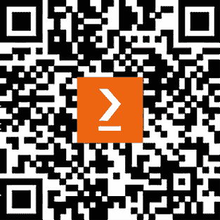

# 前言

自从 IBM 在 2016 年免费在云上发布他们的第一个商业量子系统以来，许多研究人员、开发者、教师、学生和量子爱好者已经在真实的量子计算机上运行他们的实验。从那时起，学术界和工业界都投入了时间和人力来调查量子计算所具有的潜力。量子之旅的第一步是教育，这也是你购买这本书的原因。在这本书中，你将学习量子计算的基本原理以及如何利用这些原理来创建量子算法并在 IBM 强大的量子计算机上运行它们。

这本书通过**IBM 量子**平台为你提供了量子计算的逐步介绍。你将学习如何自己构建量子程序，以便你可以在自己的行业或领域中发现早期用例并掌握量子计算技能。

你将从简单的程序开始，这些程序说明了量子计算原理与经典计算的不同之处，然后逐渐过渡到更复杂的程序和算法，这些程序和算法利用了高级量子计算算法。

我们将要探索的量子计算原理包括叠加、纠缠和干涉，然后你将熟悉这些原理是如何用于创建量子电路的，你可以在 IBM 量子系统上运行这些电路。

然后，你将了解量子门以及它们如何在量子比特上操作，并发现**量子信息科学套件**（**QISKIT**，根据你询问的人不同，发音为 KISS-kit）及其电路库和高级功能，这些可以帮助你构建量子算法。

接下来，你将掌握德意志-约萨、西蒙、格罗弗和肖尔等量子算法，同时可视化如何在 IBM 量子平台上托管的任何量子计算机上创建量子电路并运行算法。

之后，你将通过了解 Qiskit 运行时来探索你的电路如何在量子硬件上运行的基础知识，它具有许多功能来帮助你优化量子电路。

在本书结束时，你将学会自己构建量子程序，并将获得可以应用于你所在行业或领域的实用量子计算技能。

# 本书面向的对象

这本书是为对量子计算感兴趣并希望利用 Qiskit 扩展他们解决经典难以解决的问题能力的 Python 开发者所写的。需要一些计算机科学和 Python 的背景知识。虽然建议有物理学和线性代数的背景，但这不是完全必需的。

# 本书涵盖的内容

*第一章*，*探索 IBM 量子工具*，将向你介绍 IBM 量子平台上所有可用的工具。这些工具将帮助你快速轻松地开始，无需安装或购买任何东西。

*第二章*，*使用 IBM Quantum Composer 创建量子电路*，讨论了这个易于使用的用户界面，这是一个可视化各种量子门和操作如何影响每个量子比特并帮助建立经典计算与量子计算之间差异的直观理解的优秀工具。

*第三章*，*介绍和安装 Qiskit*，探讨了**量子信息科学套件**（**Qiskit**）及其高级特性，用于开发和实现各种量子算法和噪声模型。Qiskit 具有各种功能，可以帮助您轻松构建量子电路、算法和应用，并允许您在本地模拟器和真实量子系统上运行它们。

*第四章*，*理解基本量子计算原理*，通过讨论叠加、纠缠和干涉等基本量子计算原理开始了我们的量子之旅，这些原理被许多量子算法所使用。这也有助于您理解量子计算与经典计算的区别。

*第五章*，*理解量子比特*，涵盖了量子比特是什么以及您如何使用各种门和算符在量子系统上操作它，以及如何可视化这些操作的结果。

*第六章*，*理解量子逻辑门*，深入探讨了用于改变量子比特和您的量子电路状态的各种量子门和操作。

*第七章*，*使用 Qiskit 编程*，是我们开始深入挖掘使用我们迄今为止所学的量子门和操作创建量子电路的地方。您还将了解这些门和操作是如何转换为微波脉冲时序的，这是用于在量子系统上操作量子比特的。

*第八章*，*优化和可视化量子电路*，讨论了将您的量子程序中的指令发送到量子系统上运行的过程，其中在后台有一些有趣的工作正在进行。哪些量子比特最适合运行您的电路？我们应该在量子比特之间选择哪些连接以最小化门数？所有这些都将由预设的传递管理器生成器处理，我们将在本章中介绍。

*第九章*，*模拟量子系统和噪声模型*，解释了所有量子系统，无论使用什么技术创建，都必须处理噪声问题。在本章中，您将了解这些噪声是什么，以及如何创建模拟它们的模型，以更好地理解它们对您的量子电路产生的影响。

*第十章*，*抑制和减轻量子噪声*，解释了如何减轻噪声对量子系统产生的各种影响。

*第十一章，理解量子算法*深入探讨了基本量子算法，以帮助理解叠加、纠缠和干涉等量子计算原理是如何被使用的。我们还将回顾和编码一些基本概念和算法，这将帮助我们理解更复杂的算法。

*第十二章，应用量子算法*将带你了解如何将我们所学到的量子计算原理和概念应用到一些复杂的量子算法中。

*第十三章，理解量子效用和 Qiskit 模式*涵盖了量子效用是什么以及为什么它是我们接近量子优势的关键。它还将概述 Qiskit 模式以及它们如何简化你构建复杂量子电路的开发体验。

*附录 A：资源*提供了一列你可以用来更详细地探索本书涵盖主题的进一步资源。

*附录 B，评估*提供了你在每一章末尾找到的问题的答案。

# 要充分利用本书

+   你需要互联网访问来访问你可用的 IBM 量子系统。由于该平台托管在云上，你将不需要除浏览器和注册免费账户之外的其他任何东西。

+   你还需要一个最新的浏览器（Firefox、Chrome、Safari）

+   操作系统要求（仅当本地安装软件时）：Windows、Mac 和 Linux。

## 下载示例代码文件

本书代码包托管在 GitHub 上，网址为[`github.com/PacktPublishing/Learning-Quantum-Computing-with-Python-and-IBM-Quantum-Second-Edition`](https://github.com/PacktPublishing/Learning-Quantum-Computing-with-Python-and-IBM-Quantum-Second-Edition)。我们还有其他丰富的图书和视频的代码包，可在[`github.com/PacktPublishing/`](https://github.com/PacktPublishing/)找到。查看它们吧！

## 下载彩色图像

我们还提供了一个包含本书中使用的截图/图表彩色图像的 PDF 文件。你可以从这里下载：[`packt.link/gbp/9781803244808`](https://packt.link/gbp/9781803244808)。

## 使用的约定

本书使用了多种文本约定。

`CodeInText`：表示文本中的代码单词、数据库表名、文件夹名、文件名、文件扩展名、路径名、虚拟 URL、用户输入和 Twitter 昵称。例如；“只需从你的命令行或 Python 环境中运行`pip install qiskit-aer`，这就应该足够了。”

代码块应如下设置：

```py
from qiskit_ibm_runtime import QiskitRuntimeService
# Save your IBM Quantum account to allow you to use systems:
QiskitRuntimeService.save_account(channel="ibm_quantum", token='PASTE-API-TOKEN-HERE', set_as_default=True) 
```

当我们希望引起你对代码块中特定部分的注意时，相关的行或项目将被设置为粗体：

```py
import numpy as np
#Bind the parameters with a value, in this case 2π
qc = qc.assign_parameters(parameters={param_theta: 2*np.pi})
#Draw the circuit with the set parameter values
**qc.draw(output='mpl')** 
```

任何命令行输入或输出都应如下编写：

```py
pip install qiskit 
```

**粗体**：表示新术语、重要单词或您在屏幕上看到的单词，例如在菜单或对话框中，也会在文本中这样显示。例如：“从量子力学中出现的更受欢迎的实验之一是**双缝实验**。”

警告或重要提示会像这样显示。

小贴士和技巧会像这样显示。

# 联系我们

我们始终欢迎读者的反馈。

**一般反馈**：请通过电子邮件[feedback@packtpub.com](https://feedback@packtpub.com)发送，并在邮件主题中提及书籍标题。如果您对本书的任何方面有疑问，请通过电子邮件`questions@packtpub.com`联系我们。

**勘误**：尽管我们已经尽一切努力确保内容的准确性，但错误仍然可能发生。如果您在此书中发现错误，我们将不胜感激，如果您能向我们报告，我们将不胜感激。请访问[`www.packtpub.com/submit-errata`](http://www.packtpub.com/submit-errata)，选择您的书籍，点击勘误提交表单链接，并输入详细信息。

**盗版**：如果您在互联网上以任何形式遇到我们作品的非法副本，如果您能提供地址或网站名称，我们将不胜感激。请通过电子邮件`copyright@packtpub.com`与我们联系，并提供材料的链接。

**如果您有兴趣成为作者**：如果您在某个领域有专业知识，并且您有兴趣撰写或为书籍做出贡献，请访问[`authors.packtpub.com`](http://authors.packtpub.com)。

# 留下评论！

感谢您从 Packt Publishing 购买此书——我们希望您喜欢它！您的反馈对我们来说是无价的，它帮助我们改进和成长。一旦您阅读完毕，请花一点时间在亚马逊上留下评论；这只需一分钟，但对像您这样的读者来说意义重大。

扫描下面的二维码以获得您选择的免费电子书。


[`packt.link/NzOWQ`](https://packt.link/NzOWQ)

# 下载此书的免费 PDF 副本

感谢您购买此书！

您喜欢在路上阅读，但无法携带您的印刷书籍到处走吗？

您的电子书购买是否与您选择的设备不兼容？

请放心，现在，每购买一本 Packt 书籍，您都可以免费获得该书的 DRM 免费 PDF 版本。

在任何地方、任何设备上阅读。直接从您喜欢的技术书籍中搜索、复制和粘贴代码到您的应用程序中。

优惠不会就此结束，您还可以获得独家折扣、时事通讯和每天收件箱中的精彩免费内容。

按照以下简单步骤获取好处：

1.  扫描下面的二维码或访问以下链接：



[`packt.link/free-ebook/9781803244808`](https://packt.link/free-ebook/9781803244808)

1.  提交您的购买证明。

1.  就这样！我们将直接将您的免费 PDF 和其他好处发送到您的电子邮件。
