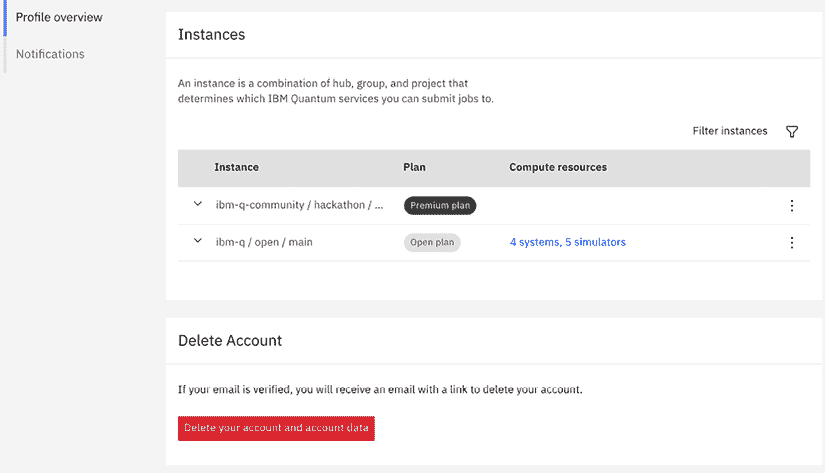
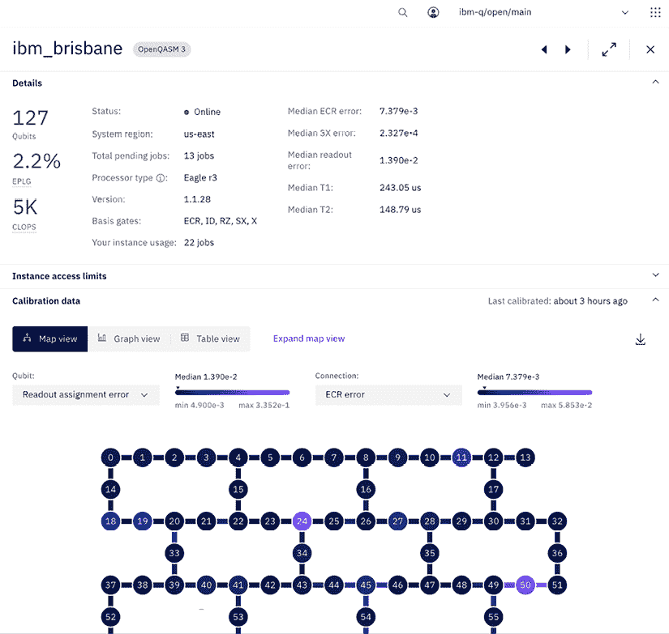

# 探索 IBM 量子工具

近年来，量子计算越来越受欢迎，尤其是在 2016 年 5 月 IBM 发布了第一台商业可用的云量子计算机之后，当时被称为 IBM 量子体验，现在更名为**IBM 量子平台**（**IQP**）。这次发布是同类中的第一次，托管在云上，为世界提供了免费实验量子设备的机会。该平台包括一个**用户界面**（**UI**），允许任何人在真实的量子计算机上运行实验。最近还增加了直接访问所有文档和学习资源的功能，例如教程和课程，直接从平台访问，使您在学习过程中更容易运行电路。

本章的目标是首先向您介绍 IBM 量子平台，该平台包含了您学习如何在真实量子系统上创建和运行量子电路所需的一切。它还为您提供课程和教程，以便您实验现有的量子算法和应用。IBM 量子平台由以下三个应用程序组成，您可以在平台的右上角找到这些应用程序的列表（见*图 1.1*）：

+   **平台**：列出您在平台上可以访问的所有作业和系统（仪表板、系统和作业）。

+   **文档**：提供一系列资源，帮助您入门。资源包括如何设置您的开发环境，在量子系统上构建/测试/执行量子电路。它还提供了**量子信息科学套件**（**Qiskit**）开源代码最新版本的 API 文档。

+   **学习**：为不同水平的用户提供量子课程和教程。这些课程涵盖了量子计算的基础、变分算法设计，以及新增内容：量子安全加密！

您可以通过点击您头像旁边的左上角应用程序图标来选择和切换每个应用程序，切换器在以下图中显示：

图 1.1：应用程序选择

本章将帮助您了解每个应用程序中可用的操作和信息，我们将在后面的章节中更详细地介绍每个应用程序，以给您一个概览，了解所有内容的位置。这包括创建电路、在模拟器和真实量子设备上运行电路、查看您的个人资料和可用的后端系统信息，以及可视化实验结果。那么，让我们开始吧！

本章将涵盖以下主题：

+   开始使用 IBM 量子平台

+   使用文档快速入门

+   理解 IBM 量子工具

# 技术要求

在本书中，我们期望您在 Python 开发方面有一些经验，尽管这不是必需的，但一些经典和量子力学的基本知识将有所帮助。大部分信息将在每个章节中提供，所以如果您对经典或量子力学没有知识，我们将在这里介绍您需要了解的内容。对于那些在这个领域已有知识的人，这里的信息将作为一个有用的复习。

本书所使用的 Python 编辑器是 **Jupyter Notebook**。当然，您可以使用任何您选择的 Python 编辑器。这可以包括 **Watson Studio**、**PyCharm**、**Spyder**、**Visual Studio Code** 等等。

这是本书中使用的源代码：[`github.com/PacktPublishing/Learning-Quantum-Computing-with-Python-and-IBM-Quantum-Second-Edition`](https://github.com/PacktPublishing/Learning-Quantum-Computing-with-Python-and-IBM-Quantum-Second-Edition%0D%0A)

# 开始使用 IBM 量子平台

如前所述，IBM 量子平台应用程序是您登录后通常会看到的高级视图。在此提及，由于平台在写作时间之后随着技术的发展而更新，工具可能会有更新，因此某些可视化结果可能会有所不同。该平台聚合了您可以看到的多个视图，这有助于您了解您有权访问哪些机器以及您有哪些待处理、正在运行或已完成的工作。

在本节中，我们将介绍注册步骤。让我们开始吧。

## 注册到 IBM 量子平台

在本节中，我们将注册并解释您首次注册到 IBM 量子平台后后台会发生什么。这将帮助您了解注册后可用的功能和配置。

注册步骤如下：

1.  第一步是访问以下链接的 IBM 量子平台网站：[`quantum.ibm.com/`](https://quantum.ibm.com/%0D%0A)

1.  您应该会看到登录界面，如图 *图 1.2* 所示。您的具体情况将决定您如何继续操作：

    +   如果您已经有了账户或者已经登录，您可以登录并跳过这一部分。

    +   如果您尚未注册，您可以从登录界面选择您喜欢的登录方式。如您所见，您可以使用各种方式注册，例如使用您的 **IBMid**、**Google**、**GitHub**、**Twitter**、**LinkedIn** 或通过电子邮件。

    +   如果您没有上述任何账户类型，您可以简单地注册一个 **IBMid** 账户并使用该账户登录：

图 1.2：IBM 量子平台登录页面

1.  一旦您选择了您偏好的登录方式，您将看到该方法的登录屏幕。只需填写信息（如果尚未填写），然后选择**登录**。

1.  登录后，您将进入 IBM 量子平台的主页。这是您每次登录时看到的第一个页面：

图 1.3：IBM 量子主页

现在您已经注册了 IBM 量子平台，让我们快速浏览一下，并深入了解构成主页的一些功能。

首先请注意，在平台应用程序页面的顶部有三个选项卡：**仪表板**、**系统**和**作业**。每个选项卡都为您提供各种信息，我们将在以下章节中详细说明。但在我们开始之前，让我们看看**管理账户**设置视图。

## 理解管理账户设置视图

首先，让我们回顾一下主页，特别是**管理账户**设置视图。您可以通过页面右上角的头像访问您的用户账户和设置视图（如图*1.3*所示）。

此视图提供了登录用户的**个人资料设置**，如图*1.4*所示：

图 1.4：管理账户设置视图

此视图还提供了有关您个人资料的操作，例如设置您的密码、电子邮件、API 令牌和在应用内通知设置。

API 令牌由提供商用于确定您为您的账户配置了哪些系统。当您使用平台时，它会自动生成；但是，如果您决定在平台之外运行笔记本，那么您需要将 API 令牌本地保存。我们将在*第七章*，*使用 Qiskit 和 Qiskit 运行时服务编程*中描述如何保存和加载您的账户详情。

在**管理账户设置**下方是**实例**列表，它允许您查看您是哪些实例的成员。实例用于确定您根据哪个枢纽、项目或组可以访问哪些 IBM 量子系统，如图*1.4*所示。此外，在实例列表下方还有**删除账户**选项，这将删除您所有的账户数据。

图 1.5：实例和删除账户视图

最后，在**个人资料**设置的底部，您将看到您的**通知**设置，您可以根据您的偏好启用它们。

## 熟悉计算资源视图

**计算资源**视图为您提供了一切可用的量子服务列表，包括量子系统。您可以通过选择位于 IBM 量子平台视图左上角的网格图标，并选择**平台**选项卡来查看所有可用服务。

当您打开**计算资源**页面时，您将看到以下图中通过一个框突出显示的下拉选择器对系统的分组。这些分组是您可访问的系统以及所有系统的列表，包括为高级用户预留的系统，如图*图 1.6*所示：

图 1.6：计算资源视图

该视图包含您可用的所有系统。

每张卡（或如果以表格模式查看则为每行）代表一个不同的量子系统，以及描述每个系统的详细信息。在上一张图中，您可以看到它列出了详细的规格。旁边有锁形图标的系统是为高级用户预留的，例如 IBM 量子网络的活跃成员。

您可以看到的每个系统的详细信息包括：

+   **量子比特**，即可用的量子比特数量

+   **每层门错误**（**EPLG**），这是衡量量子系统质量和性能的最新指标

+   **每秒电路层操作数**（**CLOPS**）

+   **状态**，即系统的可用性（在线、维护等）

+   **总待处理作业**，即等待在系统（队列）上运行的作业数量

+   **处理器类型**，即系统的处理器类型和版本

这些信息使您能够可视化所有系统和它们的指标，以便您可以选择一个理想的系统来运行您的量子电路。

第二个选择器用于查看**所有实例**；这列出了您可用的所有量子系统，包括开放系统以及如果您是量子网络成员，还包括高级量子系统。要将列表以表格形式查看，而不是以卡片形式，您可以选择表格视图（位于系统选择器上方），如图*图 1.7*所示：

图 1.7：所有可用系统的表格视图 – 显示所有可用的量子系统，包括高级系统

在此视图中，与**您的资源**视图相同，每一行代表每个量子系统属性（如状态、处理器类型、量子比特数量、量子体积和**CLOPS**）的详细信息。

CLOPS 是用于确定量子计算机性能的测量之一。它衡量量子处理器执行电路层的速度，类似于用于测量量子计算机量子体积的参数化模型电路。

系统的名称不代表设备的地理位置；城市名称起源于 IBM 研究实验室的位置，并已扩展到包括世界各地 IBM 的办事处所在的城市。在撰写本文时，IBM 量子系统遍布世界各地。最大的群体位于纽约州 Yorktown Heights 的 IBM 研究实验室和 Poughkeepsie。现在在许多地点都有许多本地系统，例如德国 IBM Ehningen（通过与弗劳恩霍夫协会的合作）、东京大学。最近在克利夫兰诊所安装了第一个不在 IBM 网站上的本地系统，还有更多计划在其他国家如西班牙和韩国安装。

在行上方有几个功能；一个是搜索窗口，帮助你找到特定的系统，旁边是过滤器选项，允许你根据提供者、状态或处理器类型缩小可见系统列表。如果你选择表格右上角的卡片选择，你还可以将它们视为卡片。

要查看每个量子系统的更多详细信息，让我们选择一个系统；在这种情况下，我将选择**ibm-brisbane**，如*图 1.8*所示。请注意，系统将继续发展，并在撰写本文时可能被替换，所以如果你在这本书中提到的一个系统你没有看到，不要担心；只需选择你喜欢的任何系统，因为您看到的细节将因设备而异。

图 1.8：设备详细信息视图（所有 127 个量子比特的截断视图）

在这个视图中，你可以更详细地检查每个系统。每个量子系统都有一组你可以查看的属性。如果你希望在你的量子程序上运行的系统类型有一些限制或要求，这会非常有帮助——例如，量子比特之间的连接性、每个量子比特及其物理连接的错误率、基本门以及其他我们将在本书的各个章节中详细介绍的细节。

这种视图还允许你下载一个包含所有这些属性的 CSV 文件，这样你就可以使用你想要的任何分析工具来分析它们。要下载属性，只需点击位于**校准数据**部分**最后校准**时间下方的下载图标。

你还会注意到，在系统的量子比特映射上方有两个下拉选项可用，其中一个为**量子比特**提供一组选项，另一个为量子比特之间的**连接**。这些选项为你提供了查看你希望为每个量子比特和连接渲染的属性的能力。在量子比特选项中，你可以选择查看每个量子比特的详细信息，例如其频率、T1/T2 时间、非简谐性和读出分配错误。连接选项允许你查看每个物理连接量子比特之间的 CNOT 错误和门时间（以纳秒为单位）。

当然，你也可以使用 Qiskit 代码以其他方式编程地获取这些属性，但我们将在此书的后面部分介绍这一点。现在，这只是为了提高意识，所以当你在后面的章节中了解更多关于它们的信息时，你会知道信息所在的位置。

我们现在熟悉了将要运行量子电路的系统及其细节；让我们看看在量子系统完成其任务后，我们如何查看结果。

## 了解待处理和最新作业

当你将电路发送到模拟器或量子系统运行时，你将想知道电路的状态。这就是**作业**视图派上用场的地方。要进入作业视图，请返回仪表板左上角的网格图标，并从视图列表中选择**作业**。一旦视图打开，你将看到一个表格，如图 1.9 所示，其中包含在模拟器或后端设备上待完成的作业的完整列表。你可以使用此视图查看你的电路或程序的状态、作业 ID、使用的提供者和服务以及其他每个提交的作业的详细信息：

图 1.9：作业视图列表

作业 ID 列出，以便你可以在以后调用该作业的详细信息。每个作业最初按创建日期排序，但也可以按**状态**（完成、待处理或返回）、**会话 ID**（作业运行的会话的唯一 ID）、**计算资源**（使用了哪个模拟器或量子系统）或**使用情况**（表示作业运行时间的时长）进行筛选。

关于作业对象的相关细节将在**第七章**，**使用 Qiskit 编程**中介绍。

在本节中，你学习了如何从 IBM 量子平台上的各种视图中找到有关你的实验的信息，以及量子设备的硬件细节。还有一些视图为你提供了开始编程和运行量子计算机上电路所需的工具，这些工具以易于使用的格式提供，无需安装任何软件。

在下一节中，我们将回顾文档应用为你提供的内容，以帮助你开始使用本节中刚刚学到的系统。

# 使用文档快速入门

在本章的早期部分，我们介绍了你可以访问的系统以及每个系统的详细信息。在本节中，我们将回顾文档应用，它将为你提供有关如何快速启动并运行量子计算机上的量子电路的信息和指导。

首先，从应用选择器中选择**文档**应用。这将打开如图 1.10 所示的**文档**页面：

图 1.10：文档应用视图

让我们看看页面顶部，你将看到七个快捷方式，每个快捷方式都能帮助你开始。它们描述如下：

+   **概述**：当你首次到达包含所有选项的文档页面时看到的视图

+   **开始**：如何设置你的本地系统并安装 Qiskit

+   **构建**：如何设计和开发你的第一个量子电路的说明

+   **转换**：如何优化你的电路映射到所选设备的过程，以确保最高质量和性能

+   **验证**：如标题所示，如何测试、验证和评估你的量子电路

+   **运行**：在量子系统上执行你的测试量子电路

+   API 参考：快速链接到常见对象和函数的关键文档

在页面上的**开始使用 Qiskit**和**API 参考**部分下方，你还会看到针对那些已经设置好系统并想立即开始运行量子计算机上的量子算法的用户的各种教程。每个图块代表一个不同的教程，它们是相互独立的，所以你可以选择你喜欢的任何一个开始，无需担心任何其他教程的依赖性。

现在你已经知道了如何找到帮助你快速启动所需的文档，让我们继续探索你可以使用 IBM Quantum Composer 生成量子电路的工具。

# 理解 IBM 量子工具

理解系统和了解我们的电路作业的状态是很好的，但了解如何创建这些电路并运行它们显然是一个重要的步骤。在本节中，我们将回顾你可用到的两种工具。使用应用程序切换器，选择列出的最后一个应用程序，**学习**。

下图，*图 1.11*是 IBM 量子学习应用程序视图。这个视图为你提供了一个一站式商店的资源。一开始，你会看到顶部突出显示的是最新发布的课程。在撰写本文时，它是**量子算法基础**。下面是平台上可用的课程目录，主题从量子信息科学的基础到量子安全加密。

图 1.11：IBM 量子学习应用程序视图

在课程下方，你将看到另外三个部分。第一个是教程列表。这是你在上一节中看到的相同列表。为了完整性，它被复制在这个部分，因为它是当然的学习应用。底部是**资源**部分，列出了其他有用的学习资源，如图所示：

图 1.12：课程、教程、工具和资源部分。

我们有两种方式来启动每个工具。首先，如*图 1.12*所示，你可以在**工具**部分点击每个工具来启动它。第二种方式是在页面顶部选择它，如*图 1.11*所示。

编曲器是一个图形用户界面，你可以通过将量子门拖放到量子电路上来创建你的量子电路。编曲器还提供了各种结果的可视化表示，例如电路的状态和预期的概率测量。这使得编曲器成为帮助你直观理解各种量子门和属性如何影响量子位本身和整体量子状态结果的绝佳工具。这是一个我强烈推荐你从它开始使用的工具，因为它包含一些非常不错的入门教程，你可以按照这些教程创建你的第一个量子电路并在实际的量子计算机上运行它。我们将在*第二章*，*使用 IBM 量子编曲器创建量子电路*中创建一个简单的电路并在量子计算机上运行它。

现在我们已经完成了对 IBM 量子工具的游览，我们准备开始工作。在接下来的章节中，我们将进一步探讨编曲器，并逐步编写量子程序。

# 摘要

在本章中，我们回顾了 IBM 量子平台，它提供了大量信息，帮助你了解整个情况。你现在知道在哪里可以找到有关你的个人资料、你拥有的每个设备的具体信息、每个设备的状态以及你的实验的状态和结果的信息。某些视图可能根据你的提供商级别而略有不同。我选择在整个书中使用免费开放提供商，以便所有用户都可以看到一般视图。如果你是高级或合作伙伴用户，那么你的视图可能包含更多或更具体的信息和选项，这些信息和选项针对你的提供商。关于这些差异的详细信息超出了本书的范围；然而，你可以咨询你的 IBM 量子代表以获取有关附加视图和角色的详细信息。

知道在哪里找到这些信息将帮助你监控你的实验，并使你能够通过审查你的后端服务、监控队列时间以及查看你的结果队列来理解你的实验状态。

在下一章中，我们将详细了解编曲器，并运行我们第一个量子电路。

# 问题

1.  哪个应用程序包含你的 API 令牌？

1.  在你的资源列表中，哪个设备具有最少的量子位？

1.  哪个应用程序能为你提供一个量子系统的量子位图？

# 加入我们的 Discord

加入我们社区的 Discord 空间，与作者和其他读者进行讨论：

`packt.link/3FyN1`

