# 2

# 使用 IBM 量子作曲家创建量子电路

在本章中，您将学习如何使用 **IBM 量子作曲家** 以及其每个组件的功能，这些功能与创建和运行实验相关。作曲家将帮助您通过其内置 UI 可视化创建量子电路，这反过来又帮助您可视化量子力学的基本原理，这些原理用于优化您的实验。您还将学习如何预览每个实验的结果并创建您的第一个量子电路。

本章将涵盖以下主题：

+   开始使用量子作曲家

+   使用量子作曲家创建量子电路

到本章结束时，您将了解如何使用 **作曲家** 创建量子电路，并创建模拟经典门和量子门的实验。您还将学习如何检查实验的各种结果，例如状态向量和它们的概率。这将帮助您了解某些量子门操作如何影响每个量子比特。

# 技术要求

在本章中，假设读者具备一些计算机基础知识，例如理解经典计算系统中的基本门。

这是本书中使用的完整源代码：[`github.com/PacktPublishing/Learning-Quantum-Computing-with-Python-and-IBM-Quantum-Second-Edition`](https://github.com/PacktPublishing/Learning-Quantum-Computing-with-Python-and-IBM-Quantum-Second-Edition%0D%0A)

# 开始使用 IBM 量子作曲家

在本节中，我们将回顾 IBM 量子作曲家（以下简称作曲家）布局，以便您了解其在创建或编辑量子电路时的功能和行为。在这里，您还将创建几个电路，利用作曲家的可视化功能使您更容易理解量子电路是如何创建的。因此，让我们从开始：启动作曲家。

## 启动作曲家

要创建量子电路，首先让我们从打开作曲家开始。要打开作曲家视图，请点击 IBM 量子学习([`learning.quantum.ibm.com`](https://learning.quantum.ibm.com)) 应用程序顶部的 **作曲家** 按钮，如下截图所示：

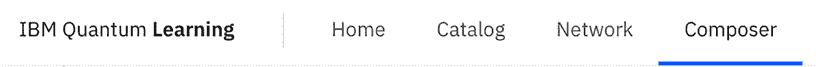

图 2.1：启动作曲家

现在您已经打开了作曲家，让我们来看看作曲家编辑器中的每个组件提供了什么。

## 熟悉作曲家组件

在本节中，我们将熟悉构成作曲家的每个组件。这些组件允许您以各种方式查看实验结果。可视化量子电路的构建将帮助您理解每个量子门如何影响量子比特。

### 理解作曲家

在本节中，我们将回顾各种功能，以确保您对您可用的所有不同功能有良好的理解。

在*图 2.2*中，您可以看到**作曲家**视图的着陆页：

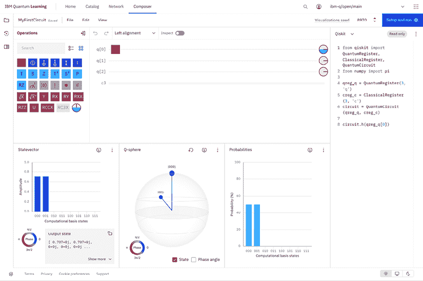

图 2.2：IBM 量子作曲家视图

从前一个屏幕截图，您可以看到**作曲家**视图，包含三个量子位（**q[0]**，**q[1]**和**q[2]**）。当您第一次启动作曲家时，这可能看起来并不相同。如果您想添加或删除量子位，您可以简单地通过点击它来选择一个量子位，例如**q[1]**，然后选择加号图标或垃圾桶图标，它将出现在特定的量子位上。

如果有任何视图不可见，这仅仅意味着它们尚未启用。您可以通过选择位于作曲家顶部的**视图**下拉菜单，悬停在**面板**上，并选择不可见的视图来启用它们：例如，**状态向量**视图。

要复制本章中使用的视图，只需添加或删除量子位，直到只剩三个量子位为止。您可以通过点击量子位标签来添加/删除。默认为三个。

现在您已经设置了视图，让我们继续到作曲家视图本身。在下面的屏幕截图中，您可以看到一系列**门**和**操作**：

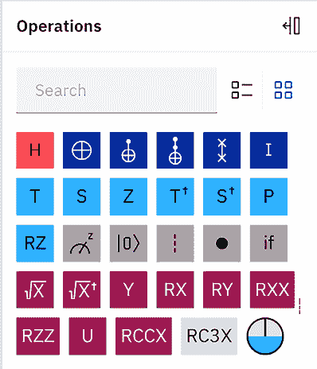

图 2.3：门和操作

所示的每个组件都有特定的功能或操作，它作用于量子位（s），我们将在*第六章*，*理解量子逻辑门*中详细讨论。

如以下屏幕截图所示，我们还有**电路编辑器**本身，这是作曲家的一部分，我们将通过放置各种门和操作来创建我们的量子电路：

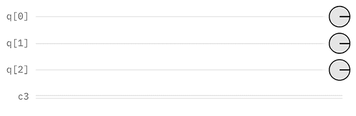

图 2.4：电路编辑器

如前一个屏幕截图所示，默认电路包括三个量子位（尽管这可能会随时间而改变），每个量子位都标记为**q**，并从左到右按顺序附加索引（在这种情况下，**q[2]**，**q[1]**和**q[0]**）。当我们想要将量子电路的结果映射时，这将很重要。在运行实验之前，每个量子位都初始化为**0**的初始状态。

最后一行是经典位，这是我们将其映射到每个量子位上的内容，以便当我们完成量子电路的运行时，结果将根据映射传递到经典位。默认情况下，量子位到位的映射是基于量子位的索引。例如，q[0]测量结果将通过测量算子映射到 c[0]，我们将在运行量子电路时看到它。您可以通过与量子位相同的方式添加或删除经典位。

在量子位旁边，您将看到一条线，它看起来像从每个量子位延伸出来的导线，在电路编辑器中：

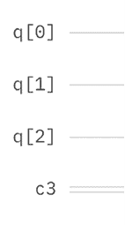

图 2.5：量子位和电路导线

这些线条是您将在这里创建电路的地方，通过在这些线条上放置各种门、操作和屏障。这个电路有三条线，每条线都与量子计算机上的三个量子位之一相关。它被称为**作曲家**的主要原因是因为这些线条看起来非常类似于音乐家用来作曲的音乐五线谱。在我们的情况下，音乐五线谱上的音符由最终用于创建量子算法的门和操作来表示。

在下一节中，我们将回顾您可用于自定义作曲家视图的各种选项。这将确保您在创建量子电路时只能看到您想看到的内容。

### 自定义您的视图

在我们的作曲家之旅中继续前进，在作曲家视图的顶部是电路菜单选项，允许您保存您的电路、清除电路或共享您的量子电路：

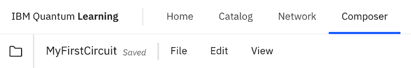

图 2.6：作曲家菜单选项

首先，我们将介绍如何保存您的电路。为此，只需点击作曲器顶部左边的默认文本，当前显示为**未命名电路**，并输入您想要的任何标题。理想情况下，选择与实验相关的名称。在这个例子中，让我们称它为**MyFirstCircuit**，并通过按*Enter*键或点击标题右侧的勾选图标来保存，如下所示：

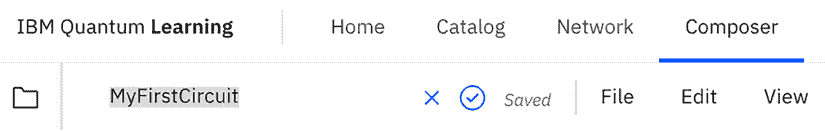

图 2.7：重命名电路

在作曲器的顶部，您将看到一系列下拉菜单选项。前面截图中的菜单项有以下选项：

+   **文件**提供创建和打开电路、复制、导出、共享或删除当前电路的选项。

+   **编辑**允许您管理您的电路并清除门和算子。

+   **视图**启用各种视图选项，我们将在以下几节中查看。

现在，让我们在接下来的几节中查看各个不同的视图。

#### 图形编辑器视图

**图形编辑器**视图包含一些用于创建量子电路的组件：

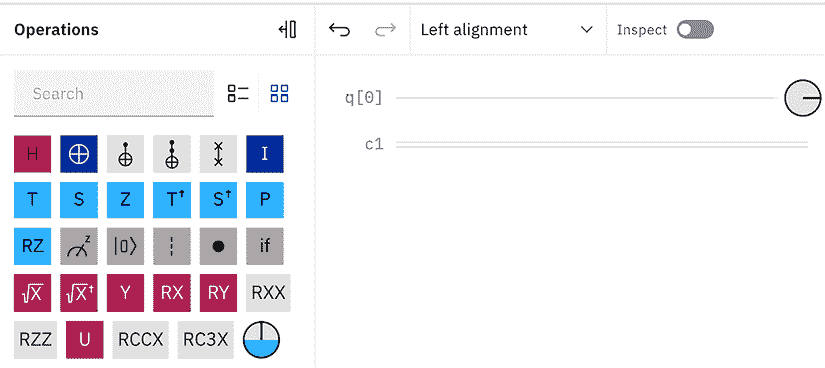

图 2.8：图形编辑器视图选项

组件包括以下内容：

+   **电路作曲家**：用于创建量子电路的 UI 组件。

+   **操作**：一个可用的拖放门和算子列表，用于生成量子电路。

+   **选项**：设置对齐方式并开启**检查**功能的能力，这允许您像在 IDE 或浏览器上调试代码一样逐步通过每个门和操作。

+   **磁盘**：位于电路末端的磁盘，用作添加门和操作时每个量子比特的视觉表示。

现在我们知道了在哪里创建量子电路，让我们继续到显示部分，它提供了各种方式来可视化量子电路的结果。

#### 状态向量视图

**状态向量**视图允许您预览状态向量结果，也就是说，您的量子电路的量子状态结果。状态向量视图以几种不同的方式展示了量子电路的计算基态。为了简化视图，我已经移除了除了一个量子比特之外的所有量子比特，这样更容易读取值。

如果您愿意，可以这样做，否则您的 x 轴可能不仅仅只有 0 和 1 这两种状态，如下面的图所示：

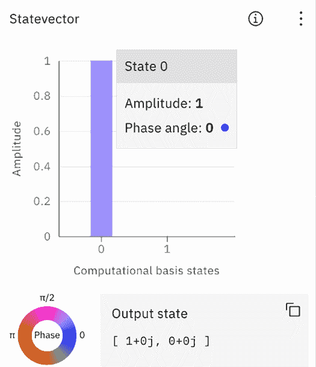

图 2.9：状态向量视图

首先，我们看到**振幅**条形图，它表示**计算基态**的振幅。在这种情况下，如前所述，为了简化，我们将量子比特的数量减少到只有一个量子比特，对于这个量子比特有两个计算基态，0 和 1。这些表示在*x*轴上。每个基态振幅的值表示在*y*轴上。在这种情况下，由于我们的电路中没有门或算子，状态向量表示是初始（基态）状态。初始状态表示所有量子比特都设置为 0（零）状态，由振幅值为 1 表示。

在状态向量视图的底部，我们看到代表每个计算基态复数值的**输出状态**。在这种情况下，由于我们处于初始状态，我们看到`1 + 0j`处的 0 状态和`0 + 0j`处的 1 状态。

在左下角是**相位轮**。相位轮是每个基态相位的颜色视觉表示，其范围在 0 到 2π之间。由于我们没有应用任何相位门，我们看到默认相位 0 由蓝色表示。当您对每个量子比特应用相位偏移时，条形的颜色将根据相位的颜色表示更新。

我们将在后面的章节中更详细地介绍相位，但到目前为止，只需知道它们在哪里以及如何表示，无论是通过状态向量结果中的值还是通过相位轮中的颜色表示。

状态向量信息只是您量子电路的视觉表示之一。在继续之前，我们还想参观几个其他的内容。

#### 概率视图

下一个视图是**概率**视图。这个视图展示了量子电路（在量子比特上添加单个测量算子）的预期概率结果。如前所述，并在以下屏幕截图所示，由于电路中没有任何算子，显示的结果都是初始状态 0：

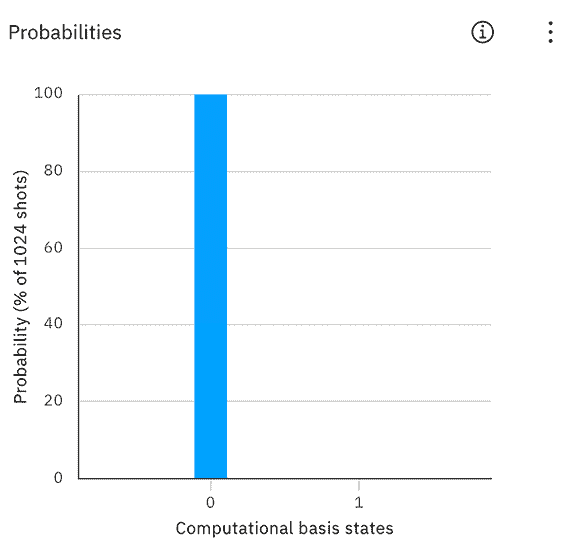

图 2.10：概率视图

概率视图是基于期望值的一般结果表示，而不是你将从量子系统中获得的实际结果。这个视图目前表示 Composer 正在经典上计算的内容，因为我们还没有在实际量子计算机上运行这个电路。当我们创建这个电路时，你将看到的结果是由经典系统计算的，而不是由量子系统计算的。量子系统的结果将在我们发送完成的电路运行后接收。

#### Q 球视图

最后，我们必须回顾的最后一种状态可视化是**Q 球**视图。Q 球看起来类似于 Bloch 球，它用于表示量子比特当前状态的状态向量。然而，Bloch 球确实有一些局限性，尤其是它只能表示单个量子比特的状态。另一方面，Q 球可以用来在一个球体中直观地表示单个量子比特或多个量子比特的状态信息，包括相位信息。以下截图显示了三个量子比特的电路表示，它们都处于初始状态：

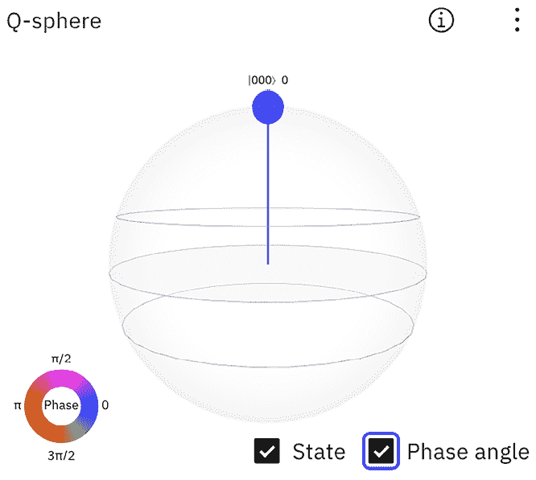

图 2.11：Q 球视图

Q 球视图有两个组成部分；第一个是 Q 球本身，它表示多量子比特状态的状态向量，这个向量以球心为起点。向量的末端是一个较小的球体，它通过 Q 球表面的顶部圆的半径来表示状态的概率。当鼠标悬停在这些小球体上时，可以看到它们所表示的状态。上一张截图展示了初始状态下的三个量子比特，概率为 1，相位角为 0。

数字周围的这些花哨的符号被称为 Ket；我们将在本书的后面学习它们。现在，只需将它们视为标签，以区分数字 0 和量子态|0〉，例如。

第二个组成部分位于左下角，是一个图例，描述了状态相位。由于小球体代表相位角为 0，球体的颜色是蓝色，这与图例对 0 相位所指示的颜色相同。如果状态具有π的相位值，那么球体的颜色将是红色。

这里有多种选项；在右上角你可以看到一个省略号，你可以选择它，提供不同的选项来下载不同图像格式的可视化，以及将视图移动到左侧或右侧。在右下角你可以选择是否启用 Q 球的状态或相位角信息。

好的，我们已经了解了构成 Composer 视图的所有各种视图和组件，所以现在让我们进入有趣的部分，开始创建我们的第一个量子电路！

# 使用 Quantum Composer 创建量子电路

现在我们已经知道了 Composer 中的所有内容的位置，我们将创建我们的第一个量子电路。这将帮助您更好地理解所有这些组件是如何协同工作的，并且将向您展示这些组件是如何在您构建第一个量子实验时提供诸如当前状态及其概率估计等见解的。

## 构建具有经典比特行为的量子电路

我们都熟悉一些基本的经典比特门，例如**NOT**、**AND**、**OR**和**XOR**。这些经典门在比特上执行的行为可以使用量子门在量子电路中重现。我们的第一个实验将涵盖这些基本构建块，这将帮助您理解量子算法和经典算法之间的相关性。

我们的第一个实验将是模拟一个经典门，具体是一个`NOT`门。`NOT`门用于改变量子比特的值，在这种情况下，从|0〉状态变为|1〉状态，反之亦然。我们将在*第六章，理解量子逻辑门*中详细介绍这个门在量子比特上的操作细节。

要在量子电路中模拟`NOT`门，请按照以下步骤操作：

1.  如果您还没有这样做，请从之前创建并命名为`MyFirstCircuit`的开放 Composer 编辑器中减少量子比特和经典比特的数量，每个只保留一个。这将简化我们结果的可视化。您可能需要重新打开其他视图，如 qsphere，以获取更新的更改。

1.  接下来，点击并拖动`NOT`门，该门以符号表示，从门列表拖到第一个量子比特上，如下面的截图所示：

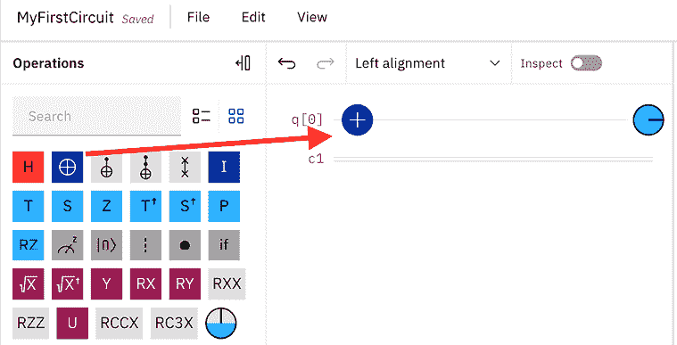

图 2.12：向第一个量子比特添加 X（NOT）门

1.  接下来，点击并拖动测量操作到`NOT`门之后的第一个量子比特，q[0]：

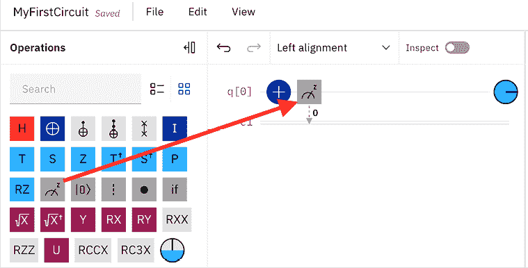

图 2.13：向第一个量子比特添加测量算子

1.  通过对量子比特进行测量并将其值发送到相关的经典比特，我们实际上是在读取量子比特的状态。您可以通过测量算子和经典比特之间的连接箭头来看到这一点。它还包括经典比特的索引，测量算子将写入的结果，在这种情况下是位置 0 的比特。

注意，结果比特，类似于量子比特，将从左到右排序：例如，c[2]c[1]c[0]。

当您想要观察量子比特的状态时，就会发生测量。这意味着我们将量子比特的状态折叠到`0`或`1`。在这个例子中，当我们在`NOT`门之后测量量子比特时，读数将是`1`。这是因为初始状态被设置为`0`，应用`NOT`门将把它从`0`翻转到`1`。

在我们运行这个实验之前，让我们记下几点。首先，请注意经典比特都在一行上。这主要是为了节省空间。接下来是注意，随着我们添加门和算子，所有视图都会更新。如前所述，这是系统在计算这些经典值以提供理想结果。我们尚未指定要在哪台量子计算机上运行此电路，因此您看到的结果是经典系统正在计算的结果，而不是量子计算机的实时结果。

1.  选择位于 Composer 视图右上角的**设置和运行**按钮。这将显示运行设置，如下所示：

    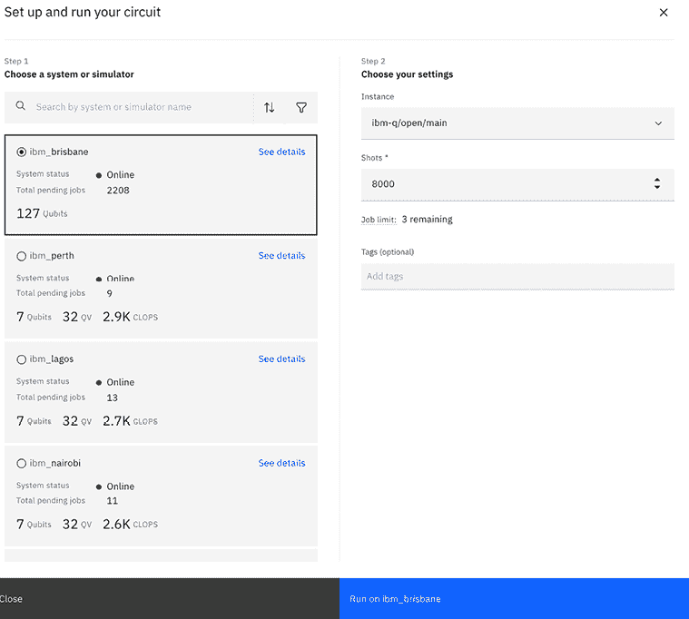

    图 2.14：运行设置视图

1.  运行对话框提示您执行两个步骤：

    +   首先，选择您要在其上运行实验的量子系统。选择您希望运行的任何选项。在这个例子中，我们将选择`ibm_brisbane`。

    +   第二步首先允许您选择**提供商**。有不同的提供商——`ibm-q/open/main`用于开放的免费量子设备，如果您是 IBM 量子网络的成员，那么您将有一个分配给您可用高级量子设备的提供商。

    目前，请保持默认设置。此步骤还会提示您选择要运行的量子电路的**射击次数**。这意味着您希望在实验中让量子电路运行多少次以获得可靠的总体结果。目前，让我们将其设置为`8000`。

1.  现在您已经选择了运行选项，让我们运行电路。点击**在 ibm_brisbane 上运行**。如果您选择了不同的设备，它将相应地指示。

一旦实验开始，您应该在 Composer 视图左侧面板的**作曲家作业**视图中看到该实验的条目，表明您的实验处于**挂起**状态。在作业挂起期间，它将显示作业的状态，相应地。

注意，根据所选设备有多忙，您可能需要等待一段时间才能完成作业。

一旦完成，您将看到指定作业的状态为**完成**，如下所示：

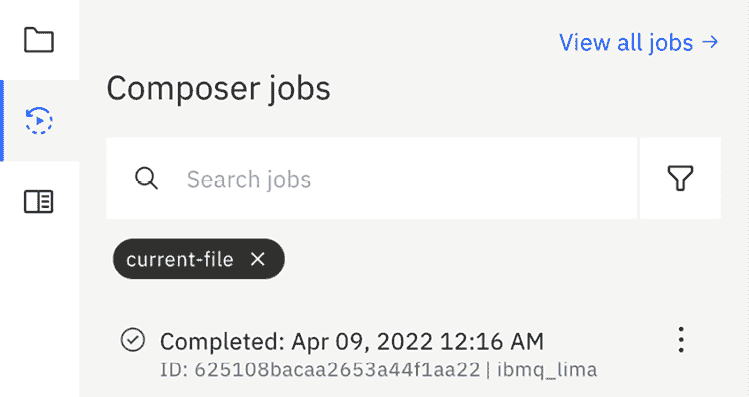

图 2.15：Composer 作业视图显示所选电路的作业状态

1.  完成后，通过点击作业从列表中打开您的实验。这会打开**作业**结果视图：

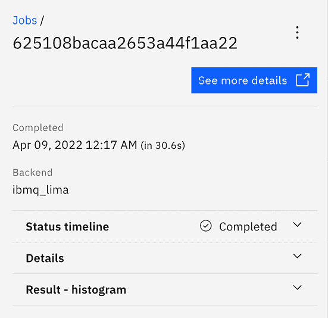

图 2.16：作业结果视图

1.  一旦打开作业，您可以看到有关作业的一些基本信息，例如顶部的作业 ID，然后是作业完成的日期和时间，运行的底层以及包含有关作业本身详细信息的三个视图，例如状态、详细信息和结果。您还会在右上角看到一个按钮，它将在单独的窗口中提供相同的信息。接下来，让我们回顾一下这些视图。

首先，我们有**状态时间线**视图，如图 2.17 所示：

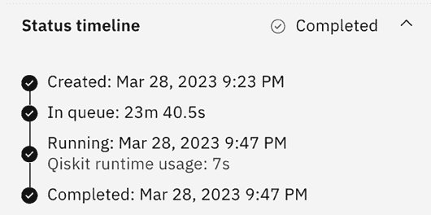

图 2.17：作业状态时间线视图

在这里，您可以查看表示完成您的电路所需时间的时间线。每个步骤代表您的电路在量子系统上执行时完成的不同的过程：

**创建**：作业实例被添加到队列以在特定量子系统上运行的时间和日期。

**排队中**：您的作业在量子系统上运行之前在队列中的时间长度。

**运行**：从离开队列并在量子系统上运行，直到返回结果的时间。**系统内时间**是指电路在量子系统上实际运行的时间，与在经典组件上的时间分开。例如，将电路从数字转换为模拟和从模拟转换为数字不包括在**系统内时间**值中。

**完成**：作业在量子系统上完成运行的时间和日期。

接下来是**详细信息**视图，如图所示，它提供了作业的详细信息；在这种情况下，它是从`MyFirstCircuit`发送的。它还提供了有关程序、射击次数、电路数量和实例的信息。实例是量子系统的提供；由于我们使用的是开放免费设备，因此这被归类为开放系统。

如果您是高级用户，您可能会以特定于您的提供商的模式运行，您可以从您的管理提供商处获得有关这些细节的信息。

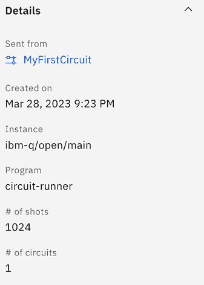

图 2.18：详细信息视图

最后，**结果 – 直方图**视图，如图 2.19 所示，显示了您的实验结果，以直方图的形式呈现。

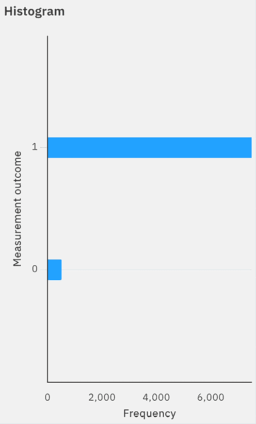

图 2.19：作业结果 – 直方图视图

在此视图中，*x*轴代表每次射击后电路产生的每个状态的频率。*y*轴代表每个有结果的状态。

所有这些视图都可以通过点击报告右上角的**查看更多详细信息**按钮在单独的页面上查看。这将提供有关您实验的相同详细信息，还包括转换后的电路图。转换后的图将显示相同的电路，但它将使用指定量子系统的基门。我们将在后面的章节中介绍基门是什么以及它们是如何转换到电路中的。现在，将其视为使用特定于量子系统的门的电路，如下面的屏幕截图所示：

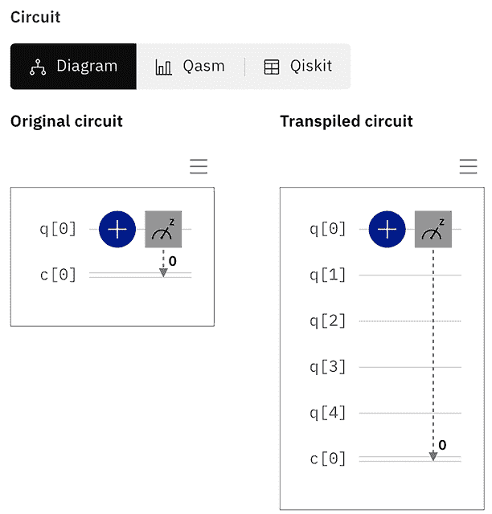

图 2.20：包含原始电路（左侧）和转换后电路（右侧）的详细信息视图

电路图只是电路的三种表示方法之一。其他两个标签将显示**Qasm**和**Qiskit**表示。请注意，根据您运行此设备的尺寸，您可能看到所有量子比特的列表（可能超过 100 个量子比特）。在这种情况下，我截断了视图，以便您只能看到几个量子比特以节省空间。

现在我们已经运行了我们的第一个量子电路并得到了结果，让我们更仔细地看看我们的结果，看看我们得到了什么。

## 检查您的结果

*图 2.19*中的直方图结果提供了我们实验结果的信息。有些部分可能看起来很简单，但让我们来回顾一下细节。现在可能看起来微不足道，但当我们后来处理更复杂的量子算法时，理解这些结果将证明是无价的。

结果有两个轴。在*y*轴上，我们有电路的所有可能状态（或测量结果）。这是测量操作在测量量子比特时观察到的。回想一下，我们测量了第一个量子比特，所以从最不重要的位（最右侧）开始，q[0]在每个可能的状态结果中位于最右侧。因此，当我们添加更多量子比特时，它们将附加到前一个量子比特的左侧。例如，一个三量子比特系统将按以下顺序设置，q[2]，q[1S]，q[0]。我们知道我们的可能结果![img/B18420_02_003.png]是正确的，因为我们在一个量子比特上放置了一个`NOT`门，这将其状态从 0 变为 1。如果我们再添加两个量子比特，那么第二个和第三个量子比特将简单地执行一个等于测量初始状态的测量，我们知道初始状态是 0，从而产生一个可能的结果![img/B18420_02_004.png]。

*x* 轴提供了每个可能状态的输出结果。由于我们进行了`8000`次实验，结果显示我们有很大的可能性第一个量子比特将处于`1`的状态。结果不是 100%的原因是由于量子设备的噪声。我们将在后面的章节中介绍噪声的话题，但现在我们可以根据我们的结果有信心地认为 NOT 门是有效的。

在本节中，我们在量子设备上模拟了一个简单的`NOT`门操作，并运行了电路。

# 摘要

在本章中，你了解了 IBM 量子 Composer 及其许多组件。你创建了一个模拟经典 NOT 门的实验。然后你在直方图上查看结果，并基于结果读取概率。

这为你提供了实验其他门操作的技能，以查看每个操作对每个量子比特的影响以及基于操作结果可能确定或使用的信息。当我们查看一些量子算法以及这些操作如何被利用来解决某些问题时，这将非常有帮助。

在下一组章节中，我们将从 UI 的点击和拖拽操作中移开，而是使用 Jupyter Notebook 创建实验，并开始使用 Python 编写量子电路。

# 问题

1.  从 Composer 中，你可以在哪里找到在量子计算机上运行你的电路所需的时间？

1.  你如何在 Composer 中移除或添加一个量子比特到你的电路中？

1.  在哪个视图中你会指定运行你的电路的量子系统？

1.  哪个球体最适合用来观察三个量子比特在单个球体中的量子状态？

# 加入我们的 Discord

加入我们的社区 Discord 空间，与作者和其他读者进行讨论：

`packt.link/3FyN1`

