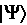

# 理解量子比特

我们都非常熟悉经典比特，或者简单地说是比特，在当前的计算机硬件系统中。它是用于计算从简单的数学问题，如加法和乘法，到涉及大量信息的更复杂算法的基本单元。

量子计算机有一个类似的基本单元，称为**量子比特**，或**qubit**，这是它的常用称呼。在本章中，我们将从数学（计算）和硬件的角度描述什么是 qubit，以帮助您了解它们是如何用于计算信息的。我们将涵盖 qubit 和比特之间的差异，特别是关于计算是如何定义的。然后，本章将从单量子比特状态过渡到多量子比特状态，并讨论多量子比特状态的优势。

我们还将概述量子比特的硬件实现以及量子比特是如何用于计算信息的。由于我们将使用 Qiskit Runtime 服务来运行我们的实验，您将使用可用的超导量子比特系统。描述和计算是硬件无关的；我们将涵盖的大部分信息将适用于大多数其他可用的量子硬件系统。

最后，我们将讨论量子系统如何从经典系统中读取、操作和控制量子比特的信息流动。

本章将涵盖以下主题：

+   比较经典比特和量子比特

+   可视化量子比特的状态向量

+   可视化多个量子比特的状态向量

+   在超导系统中实现量子比特

# 技术要求

在本章中，一些基本的计算机架构知识、基本的线性代数和二进制逻辑可能会很有用。了解比特是如何用于计算的将是有用的，但不是硬性要求，因为重点将主要放在量子比特上。以下是本书中使用的源代码：[`github.com/PacktPublishing/Learning-Quantum-Computing-with-Python-and-IBM-Quantum-Second-Edition`](https://github.com/PacktPublishing/Learning-Quantum-Computing-with-Python-and-IBM-Quantum-Second-Edition)。

# 比较经典比特和量子比特

在本节中，我们将比较和回顾经典比特的构建块以及通过经典门对这些构建块执行的一些操作。然后，我们将了解量子计算机的基本单元——量子比特，以及它如何与比特相似，但由于我们在上一章中学到的量子计算原理，它比比特具有更大的计算空间。

## 回顾经典比特

在我们深入探讨量子比特是什么以及它是如何被使用之前，让我们花一点时间来回顾一下经典比特。正如量子比特是量子算法的基本构建块一样，比特在经典计算系统中扮演着同样的角色。

在计算系统中，比特被用来定义逻辑状态，通常指的是开启或关闭、真或假，或者最常用的选项，1 或 0。状态的转换可以通过物理方式应用，要么是在操作触发后，例如**AND 门**的结果，要么是外部实体输入的结果，例如从外部数据源读取。它通常使用晶体管来表示，晶体管检测电压差异，通常包含一个阈值，用于确定晶体管处于低（0）或高（1）状态。电压阈值，通常称为**晶体管-晶体管逻辑**（**TTL**）电压，通常在 0 到 0.5 伏之间表示低，在 2 到 5 伏之间表示高。

下图展示了在比特上执行 NOT 操作的简单过程。比特首先被初始化或设置为一种状态，要么是 0 要么是 1。然后，对比特执行操作，根据操作的结果，比特的状态将改变或保持不变。然后，信息就可以被读取和/或存储。在这个例子中，NOT 操作将状态从 0 变为 1 或相反：


图 5.1：比特的 NOT 操作

比特的实现可以有多种形式：触发器、TTL 等。信息可以通过将值写入持久数据存储库来存储，以便稍后读取。使用比特的计算通常使用**比特串**进行，它是一组单独的比特组合，用来表示一系列的 1 和 0，通常如下所示：


这表明*x*是一个 4 位的比特串，其中每个比特可以是`1`或`0`；例如，`0010`或`1101`。

使用比特的计算通常使用二进制逻辑。例如，假设我们想要加两个数；比如说，2 和 3。我们只需将值 2 和 3 分配给一个变量，该变量以二进制形式存储。然后，我们使用二进制加法将两个数相加，并传递值，这将得到 5，如下所示。请创建一个新的笔记本并输入以下内容：

```py
%run helper_file_1.0.ipynb
#Adding two binary numbers
two = 0b010
three = 0b011
answer = two + three
print(bin(answer)) 
0b101. The code reads the binary values of 2 and 3 and returns the result as a binary called answer, which is printed as a binary using the bin() function. In order to obtain the results of adding two numbers together, classical systems use Modulo 2 arithmetic, which is the result of using logic gates, in this case, an XOR gate. When XORing two input bits, that is, , the input values can also be written as two binary numbers, *x*1 and *x*2; that is, . Note that the result will work for the following input values of x1 and *x*2: 0+0, 0+1, and 1+0. However, when the input values of *x*1 and *x*2 are 1+1, we will need a second qubit to carry the value, hence the result for 1+1 will be 10.
```

*那么，我们为什么要通过这样一个简单的例子呢？* 目的不是让你对简单的二进制计算感到厌烦；目的是提供一个关于在经典系统上计算时门级发生机制的知识更新。这样，在描述量子系统时，它将帮助你比较和对比信息创建、计算和存储方面的差异。有了这个，我们将继续到下一部分，并描述什么是量子比特。

## 理解量子比特

与我们之前描述的比特类似，量子比特是量子信息科学中的基本单位。量子比特与比特相似，因为它可以表示相同的状态，即 0 和 1，尽管量子比特表示量子态。量子比特的值是可以读取的。这里的“读取”意味着我们可以测量结果，这我们在 *第四章*，*理解基本量子计算原理* 中已经讨论过。

它们也可以被操作以推导出基于对每个量子比特执行的操作的计算。回想一下，比特的状态可以用 0 或 1 来表示。量子比特也可以表示为 0 和 1 的复线性组合。为了防止混淆并区分比特和量子比特，我们将使用 **狄拉克符号**， 和 ，来分别表示上述 0 和 1 状态的量子版本。让我们先可视化一些东西，以帮助我们看到两种状态之间的差异。

首先，量子比特的状态通常表示为一个数组或向量，它描述了量子比特的计算基态，在 **希尔伯特空间** 中，这通常表示为 。

希尔伯特空间本质上是一个包含所有可能实数和复数的向量空间。希尔伯特空间通常应用于无限维向量空间中，而欧几里得空间，例如，指的是具有内积的有限维线性空间。

量子态可以表示为两个相互垂直的基矢量，如下所示：


第二个矢量如下所示：


如我们所见，比特和量子比特在它们可以表示两个基态方面是相似的，在这种情况下，是 0 和 1。量子比特与经典比特的不同之处在于，量子比特总是处于基态的线性组合中，也就是说，它们总是处于  和  的叠加态。更正式地说，这可以用以下格式表示：


从前面的方程中，我们可以看出  和  是复杂的，因为它们的幅值之和等于 1，每个平方系数代表概率幅值，它代表测量对应基态的  或  的概率：


关于量子力学，还有一点需要了解，那就是我们无法获得  和  的值，即使是在测量量子比特时。测量量子比特需要量子比特坍缩到 0 或 1 的基态之一。

![img/B18420_05_017.png]和![img/B18420_05_018.png]仅仅提供了一些关于结果是一还是另一的概率信息，但这并不确定。这是量子力学的一个谜团。目前，你可以将测量量子比特的概念化地理解为观察或折叠一个旋转的硬币以揭示它是正面还是反面。一旦测量过，或者折叠过，你就无法在不重新启动实验的情况下让硬币继续旋转，因此所有信息都会丢失。你必须再次执行旋转硬币的完整操作。

使用简单的二维平面可以可视化量子比特的状态，其中*x*轴用于表示![img/B18420_05_004.png]状态，而*y*轴用于表示![img/B18420_02_003.png]状态。因此，向量可以用来表示每个状态的概率，这些概率的总和应为 1。

在本节中，我们介绍了比特和量子比特之间的区别。在下一节中，我们将学习如何使用状态向量来可视化量子比特及其状态。

# 可视化量子比特的状态向量

另一种表示量子比特及其状态的视觉方法是**布洛赫球面**，以物理学家费利克斯·布洛赫命名。布洛赫球面是一个普通的三个维度球面，通常用作量子比特的几何表示。通过这种方式，我们指的是球面可以表示布洛赫球面表面上的任意一点来代表量子比特的状态。正如前一章所描述的，基态由南北两极表示。

传统上，布洛赫球面的北极表示![img/B18420_04_006.png]状态，而南极表示![img/B18420_02_003.png]状态。布洛赫球面上的任何一点都可以表示为从中心（原点）到布洛赫球面表面的单位向量，代表状态的线性组合。

由于我们受到量子力学的约束，即向量的总概率必须等于 1，我们得到以下公式：

![img/B18420_05_023.png]

然后，向量只能通过以下表示在布洛赫球面的![img/B18420_05_024.png]和![img/B18420_05_025.png]轴周围旋转：

![img/B18420_05_026.png]

在这里，（表示量子比特的振幅）和（表示量子比特的相位）的值（极限）分别是和![img/B18420_05_030.png]。这表明，只要和![img/B18420_05_028.png]的值本身是唯一的，球面上的任何一点都是唯一的，其中![img/B18420_05_027.png]表示指向*z*轴的余纬，![img/B18420_05_028.png]表示从*x*轴起的经度。量子态是在应用![img/B18420_05_027.png]和![img/B18420_05_028.png]的旋转之后，从初始态设置的，如下面的图所示：


图 5.2：量子比特布洛赫球

（图片来源：https://commons.wikimedia.org/wiki/File: Sphere_bloch.jpg）

为了继续描述量子比特，我们将使用视觉来帮助说明一些可以在布洛赫球上看到的关键概念。这也有助于为你提供更多的动手练习。

## 可视化量子比特的表示

在本节中，我们将使用两个可视化绘图器，**布洛赫球**和**qsphere**，来可视化量子比特状态的表示。我们将首先创建初始态的量子比特的布洛赫球，以便我们可以可视化量子比特的状态向量和相位：

1.  创建一个新的笔记本，我们就像处理所有我们的笔记本一样，首先加载我们的辅助文件。当然，如果你希望重用之前的笔记本，你可以这样做并跳过此步骤：

    ```py
    # Load the helper file
    %run helper_file_1.0.ipynb 
    ```

1.  接下来，我们将创建一个只有一个量子比特的简单电路，并使用我们导入的可视化工具来可视化量子比特的状态。我们将导入第一个，其初始状态为。

```py
 finished, whereas the qasm simulator returns count information. Finally, we will execute our circuit and get the state vector results:
```

```py
#Create a simple circuit with just one qubit
qc = QuantumCircuit(1) 
```

1.  接下来，我们将在状态向量模拟器上运行我们的电路，并通过将`statevectorResult`对象传递给`plot_bloch_multivector`函数的参数来在布洛赫球上查看结果：

    ```py
    # Get the state vector result from the circuit
    stateVectorResult = Statevector(qc)
    print('state vector results', stateVectorResult) 
    ```

在前面的单元格执行完毕后，你应该会在你的控制台上看到如下打印出的状态向量结果。

```py
state vector results:  Statevector([1.+0.j, 0.+0.j],
            dims=(2,)) 
```

接下来，我们将首先使用`Statevector`对象的`draw`函数在布洛赫球上显示。这个函数与我们之前使用的可视化方法非常相似，只不过在这种情况下，我们可以包含一个参数来描述要使用哪个球来显示状态向量信息。在这个例子中，我们使用`bloch`来表示布洛赫球；我们将继续使用它，以便在布洛赫球和 qsphere 之间切换时简化操作。请注意，我们应该期望看到我们的状态向量在初始态中，因为我们没有对量子比特执行任何操作。

```py
# Display the Bloch sphere
stateVectorResult.draw('bloch') 
```

前面函数的输出将是布洛赫球，量子比特状态指向北极或  状态，如下所示：


图 5.3：量子比特布洛赫球状态向量初始化为 

1.  接下来，我们将在 qsphere 上显示状态向量结果。在这个可视化中，您将看到状态向量与前面图中显示的布洛赫球处于相同的状态：

    ```py
    stateVectorResult.draw('qsphere') 
    ```

您还会看到，它包括由右下角的彩色阴影球体表示的状态向量的相位，如下面的输出所示：


图 5.4：量子比特状态向量初始化为  且相位为 0

从前面的图中可以看出，状态向量在 qsphere 的表面指向北极，表明它处于  状态。它也被蓝色阴影覆盖，以表示量子比特的相位；在这种情况下，因为我们没有改变相位，所以它被设置为默认相位 *0*（蓝色，如 qsphere 右下角的图例轮所示）。

注意，所有图像都可以在以下地址以彩色形式获取：[ADD COLOR IMAGE PACK URL]

这是为了表示状态向量的相位。前面图中右下角的彩色图是状态向量相位的参考，目前为 *0*。

1.  现在我们已经熟悉了量子比特的状态向量，让我们来实际操作一下。我们将首先使用 NOT 门将向量从初始状态  翻转到  状态，然后重新运行我们的状态向量并绘制结果：

    ```py
    qc = QuantumCircuit(1)
    qc.x(0)
    #Run circuit using state vector and display results
    stateVectorResult = Statevector(qc)
    stateVectorResult.draw('qsphere') 
    ```

如您所见，我们现在处于  状态，相位仍然为 **0**，如下面的图所示：


图 5.5：量子比特状态向量设置为  且相位为 0

1.  接下来，我们将通过添加一个哈达玛门并再次执行电路来将量子比特置于叠加态。我们将创建一个新的电路，并包括一个哈达玛门，如下面的代码片段所示，然后执行电路并绘制状态向量结果的布洛赫球，这表明状态向量的位置。在这种情况下，它位于赤道：

    ```py
    qc = QuantumCircuit(1)
    qc.h(0)
    #Run the circuit using the state vector and display results
    stateVectorResult = Statevector(qc)
    stateVectorResult.draw('bloch') 
    ```

注意，状态向量是  和  的精确线性组合：


图 5.6：布洛赫球叠加表示，是  和  的线性组合

让我们通过绘制状态向量结果来看看 qsphere 上的样子。

1.  在 qsphere 上绘制状态向量结果：

    ```py
    stateVectorResult.draw('qsphere') 
    ```

你可以在以下图中看到上一段代码片段的输出：


图 5.7：量子比特状态向量设置为和的线性组合，叠加

结果可能有点令人困惑。你可能想知道为什么只有一个量子比特时却有两个向量，以及为什么它们基于 Bloch 球的结果。*难道我们不应该只看到一个吗？* 好吧，区别在于 qsphere 可视化的是 Bloch 球无法显示的内容；即每个可能状态的振幅的视觉表示。如果你观察在执行或状态时 qsphere 先前结果的球体大小，你会发现球体的直径比前一张图表面的两个球体大得多。这是因为振幅在这两种状态下是相等的，所以大小被分成了两部分，而在先前的例子中，振幅完全存在于两个状态中的一个。

在本节中，我们了解到量子比特可以通过使用 0 和 1 的两个基态来表示自己。我们还看到它可以表示为两个基态的线性组合，即振幅（纵向）和相位（横向）。

正是通过利用这些特性，量子算法才能提供比使用经典比特更优化的计算解决方案的潜力。我们也看到了如何使用两个 Qiskit 可视化函数，即 Bloch 球和 qsphere，来可视化量子比特的状态，这些函数提供了诸如振幅和相位等信息。

在下一节中，我们将探讨如何表示多个量子比特，以及如何可视化并绘制它们的实部和虚部。

# 可视化多个量子比特的状态向量

到目前为止，我们已经学习了表示量子比特的各种方法，无论是作为向量还是可视化在 Bloch 球上。我们在 qsphere 上也做了类似的事情。在本节中，我们将学习如何表示多个量子比特以及如何表示它们的通用状态。我们将首先对符号进行轻微的更新。单个量子比特表示为以下向量：


因此，我们可以以类似的方式表示两个量子比特，如下所示：


从前面的方程中，你可以看到状态  用于表示多个量子比特，而  用于表示单个量子比特。区别在于大小写：单个量子比特使用小写，多量子比特使用大写。因此，概率振幅以及由归一化约束的 1 可以表示如下：


让我们来看一个包含两个量子比特的例子，第一个量子比特处于  状态，如下所示：


另一个量子比特，处于  状态，如下所示：


结合这两个状态意味着取它们的**张量积**，用于描述多个子系统的系统，用符号  表示的两个量子比特状态如下：


交叉相乘，我们得到以下结果：


这导致振幅向量如下：


最后，通过它们的张量积表示多量子比特的另一种方式是通过它们的乘积状态。在这里，*n* 个量子比特的乘积状态是一个大小为 2^n 的向量。我们将使用之前描述的相同两个向量示例。第一个是 *00* 状态：


*01* 状态如下：


*10* 状态如下：


最后，*11* 状态如下：


从前面的方程中，我们可以得出结论，我们可以将两个量子比特分别表示为两个 *2 x 1* 列向量。然而，当我们想要表示整个系统的联合状态时，我们用张量积来表示它们，这产生了之前展示的 *4 x 1* 列向量。这是量子状态的数学表示，也称为双量子比特系统的计算基态。

在下一节中，我们将简要讨论在 IQP 系统上实现量子比特的方法，并讨论其他用于实现量子比特的技术。

# 在超导系统中实现量子比特

在本章的开头，我们了解到经典比特可以通过各种平台实现，这些平台可以检测电压或电流的相位之间的差异，或者通过触发器的状态。正如比特有用于其实现的平台一样，量子比特也是如此。

一些更常见的量子比特平台包括**中性原子**、**量子点**、钻石中的**氮空位**（**NV**）中心、**俘获离子**和**超导量子比特**。在这些平台中，用于 IQP 上量子设备的超导量子比特被使用。因此，在本节中，我们将介绍这个平台。

如果你想了解更多关于其他平台的信息，你可以阅读迈克尔·尼尔森和伊萨克·丘恩的书籍《量子计算与量子信息》，该书详细介绍了这些内容。

超导体是由铌和铝的混合物制成的材料，它没有电阻，但这通常只能在非常低的温度下实现，通常在 20 毫开尔文左右。因此，超导体上的电子被用作构成一对电子的基本电荷载体，更常见的是称为**库珀对**。这与其他导体不同，其他导体通常使用单个电子。关于库珀对的量子力学或超导行为的细节讨论超出了本书的范围。然而，如果你感兴趣，可以在*附录 A*中找到各种参考资料。现在，我们可以将超导体视为构成量子比特的超导电路的组成部分之一。

现在我们已经介绍了如何使用状态向量模拟器来可视化量子比特的状态，并在 Bloch 球和 qsphere 上显示它，我们可以继续到下一章，该章将描述所有量子比特门操作符及其相互之间的作用。

# 摘要

在本章中，你学习了比特和量子比特之间的区别以及它们的数学和视觉表示方式。你还看到了单量子比特和多量子比特系统是如何表示的，包括它们的数学表示，以及它们的构建和操作方式。我们还介绍了如何将量子比特可视化为 Bloch 球和 qsphere。

你现在有了表示单量子比特和多量子比特的矢量状态的能力。你也理解了使用量子比特的张量积将多个量子比特表示为单独的实体或作为完整系统的一部分之间的区别。这将帮助你实现和操作 IBM 量子系统上的量子比特。

在下一章中，我们将介绍如何对单量子比特和多量子比特进行操作，以及这些操作如何在真实设备上的量子比特上触发。

# 问题

1.  哪个会提供关于量子比特相位的视觉信息——Bloch 球还是 qsphere？

1.  你能在 Bloch 球上可视化多个量子比特吗？如果不能，请描述你为什么不能。

1.  将三个量子比特状态的张量积以所有形式写出来。

1.  三量子比特系统的概率振幅是什么？

# 加入我们的 Discord 社区

加入我们社区的 Discord 空间，与作者和其他读者进行讨论：

[`packt.link/3FyN1`](https://packt.link/3FyN1)


