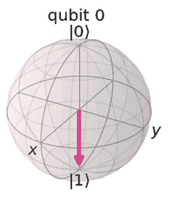
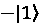
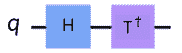

# 6

# 理解量子逻辑门

量子逻辑门与它们的经典对应物非常相似，因为它们通过操纵量子比特以提供解决方案的方式来执行操作。当然，比较到此为止。经典门通过单一操作将比特的状态从一种转换到另一种，在这种情况下，将比特值从 0 翻转到 1，或反之亦然。**量子门**，有时也称为**量子比特门**，部分不同之处在于它们在复杂向量空间中对一个或多个量子比特执行线性变换，以将它们从一个状态转换到另一个状态。

本章将涵盖以下主题：

+   复习经典逻辑门

+   理解单位算子

+   理解单量子比特门

+   理解多量子比特门

+   理解不可逆算子

阅读本章后，您将了解可以对单个和多个量子比特执行的基本操作。但在我们深入探讨之前，让我们先讨论我将尝试解释每个量子比特门的格式。首先，从学习角度来看，有些人倾向于在内容仅以数学形式呈现时学得更快；其他人更喜欢图表等视觉辅助工具；还有一些人更喜欢更具直观性的方法，例如类比和示例。

考虑到这一点，我将尽最大努力确保通过尽可能多地结合这些学习风格来展示每个门。这将通过提供每个量子比特门的数学表示、视觉表示以及当然，运行量子比特门操作及其结果的源代码来实现。

# 技术要求

在本章中，我们将讨论希尔伯特空间中矩阵的线性变换，因此强烈建议您了解线性代数的基础知识。

了解量子比特及其状态如何在布洛赫球面、**QSphere**或数学上表示是推荐的，因为本章将执行这些量子比特状态的复杂线性转换。了解基本的经典单比特和多比特门也是推荐的，但不是必需的，因为如果需要，会有复习内容。

这是本书中使用的完整源代码：[`github.com/PacktPublishing/Learning-Quantum-Computing-with-Python-and-IBM-Quantum-Second-Edition`](https://github.com/PacktPublishing/Learning-Quantum-Computing-with-Python-and-IBM-Quantum-Second-Edition)。

# 复习经典逻辑门

本节将作为经典逻辑门（如**与**、**或**、**或非**等）的复习。如果您熟悉这个主题，您可以快速浏览以刷新记忆，或者完全跳过并跳到下一节。*否则，让我们开始逻辑思考！*

**逻辑门**被定义为一种设备，无论是电子的还是其他类型的，它实现了逻辑操作（通常是布尔操作）。单位门和双位门分别有一个或两个输入。每个输入位值是 0 或 1 的状态值。对输入的操作因门类型而异。每个门操作通常使用逻辑真值表来描述，如下表所示：

| **门** | **操作** | **输入**A B | **输出**Y | **图形表示** |
| --- | --- | --- | --- | --- |
| **Buffer** | 输出与输入相同的值 | 01 | 01 |  |
| **NOT** | 反转输入状态 | 01 | 10 |  |
| **AND** | 仅当两个输入都是 1 时输出 1，否则输出 0 | 0 00 11 01 1 | 0001 |  |
| **OR** | 如果没有输入是 1，则输出 0，否则输出 1 | 0 00 11 01 1 | 0111 |  |
| **XOR** | 仅当两个输入不同时输出 1，否则输出 0 | 0 00 11 01 1 | 0110 |  |
| **NAND** | 仅当两个输入都是 1 时输出 0，否则输出 1 | 0 00 11 01 1 | 1110 |  |
| **NOR** | 仅当两个输入都是 0 时输出 1，否则输出 0 | 0 00 11 01 1 | 1000 |  |
| **XNOR** | 仅当输入都是 0 或 1 时输出 1，否则输出 0 | 0 00 11 01 1 | 1001 |  |

表 6.1：经典逻辑门

上述表格列出了一些常见的经典门，描述了每个门对输入状态的操作，门操作的结果（输出），以及它们的图形表示。

让我们考虑一些关于经典比特的注意事项，这有助于你以后理解它们与**量子比特**（**qubits**）相比的不同之处。首先，只有两个单比特门，即缓冲门和非门。在这两个门中，只有非门对经典比特执行布尔操作，通过翻转输入的比特值，所以如果非门的输入是 0，则输出将是 1。另一方面，缓冲门简单地输出与输入相同的值。所有其他门都操作于两个输入比特值，输出一个值，该值由门的布尔操作确定。例如，如果一个与门（AND gate）的两个输入值都是 1，它将输出 1。否则，输出将是 0。

然而，有一个问题，尤其是关于两位门的问题，那就是如果您只能访问输出，那么关于输入的信息就会丢失。例如，如果您从 AND 位得到结果，并且值是 0，*您能说出 A 和 B（输入）的输入值是什么吗？*不幸的是，这个问题的答案是不了。输入信息丢失，因为输出没有包含任何关于输入值的信息，这使得门不可逆。同样，对于其他两位门，如果我只给你门的输出值，你也不能 100%确定输入值是什么。

**可逆性**是量子比特门的一个独特属性，即您可以反转量子比特门的操作以获得先前状态。这也是因为量子力学的第二个公设指出，量子状态之间的变换必须是单位变换，因此是可逆的。当我们对一个基态 0 的单个量子比特应用 Hadamard 门时，我们就会看到这一点；如果我们对第一个 Hadamard 门之后应用另一个 Hadamard 门，那么量子比特的状态就会返回到基态 0。

最后，为了结束我们对经典门的讨论，我们将讨论**通用逻辑门**。这些门是用于创建其他逻辑门的那种门。**NOR**和**NAND**门是通用门的良好例子，因为它们可以用来创建 NOT 和 AND 门。让我们看看以下图表，它展示了如何使用 NAND 门创建一个 NOT 门（反相器）：


图 6.1：使用 NAND 门创建 NOT 门

如您所见，通过将 NAND 门的两个输入连接在一起，形成一个单一输入（**A**），这逻辑上创建了一个 NOT 门，它会翻转输入的值。拥有通用门的计算系统是一个重要特性，因为它提供了组合复杂逻辑电路以解决问题的能力。这当然导致了集成电路的创造，这些是用于计算问题或执行特定操作（如加法器或计数器）的专用电路。

现在我们已经回顾了经典门的功能，我们可以继续到下一节，在那里我们将介绍量子逻辑门的基础。在那里，我们还将看到它们与经典比特的一些相似之处和一些独特属性。

# 理解量子单位算子

**幺正算子**定义为希尔伯特空间刚性旋转的幺正变换。当这些幺正算子作用于希尔伯特空间的基本态，例如， 和  态时，它们会改变状态向量的位置，但不会改变其长度。让我们看看这对一个量子比特意味着什么。量子比特的基本态按照 *第五章*，*理解量子比特*， 和  的描述映射到希尔伯特空间 ，其中  和  是在幺正变换下保持正交性的线性变换。我们可以通过首先从数学角度来理解这个定义，来更好地把握这个定义。

在复向量空间上的线性变换可以用一个 2x2 矩阵 **U** 来描述：


此外，如果我们得到矩阵 U 的复共轭转置，记为 ，通过转置矩阵 U 并应用复共轭，如图所示：


然后，我们可以说，如果矩阵 U 满足 ，则 U 是幺正的，其中 I 代表单位矩阵 ，如图所示：


一种直观的想法是，将幺正变换简单地想象为保持原始向量长度的复向量空间的旋转。复向量空间的旋转进一步确保量子变换不仅是幺正操作，而且是**可逆操作**，因为它们会围绕一个指定的轴旋转。

**量子门的可逆性**是通过幺正变换实现的。如前一个幺正方程所示，如果您通过一个门将幺正算子 **U** 应用到一个量子比特上，那么通过第二个门将幺正算子的复共轭  应用到量子比特上，结果将等同于对原始向量应用单位矩阵。

一个例子是，如果您触发一个将向量空间绕 *x* 轴旋转角度 π 的操作，然后应用该操作的复共轭，那么您将返回到您开始的位置。这种可逆功能是之前提到的某些经典比特门所不具备的，例如 AND 门。

在量子幺正变换中，信息不会丢失。如果您需要返回到之前的状态，只需使用它们的共轭转置，并按相反的顺序应用，您就可以回到最初的位置。我们将看到所有门中可逆性的有趣例子。

有一个特殊情况的操作是不可逆的，即**测量算子**，我们将在 *理解不可逆算子* 部分学习它。

现在我们已经理解了幺正和可逆算符，我们可以开始学习量子门了。

# 理解单量子比特门

在我们开始深入量子门的描述之前，让我们简化格式，使其易于理解和参考。直观地说，想象每个门操作的最容易方法是围绕指定的轴旋转在 Bloch 球表面上结束的矢量。同时回忆一下，Bloch 球始终从将单位矢量设置为初始状态开始。初始状态是在量子电路首次创建时设置的；在这种情况下，它被初始化为基态 （Bloch 球的北极），如下面的图所示：


图 6.2：基态  的 Bloch 球表示

要帮助我们理解在门真值表中看到的一些标签，我们可以定义每个轴的值，其中每个轴被称为**基元素**。例如，我们可以从之前的图中看到，*z* 轴的北极标记为  ，南极标记为  。这两个点形成了基态向量  和  的计算基元素。然而，我们还没有为 *x* 或 *y* 轴定义标签。现在让我们定义它们。

每个基元素（轴）都有一个正负两侧，它们起源于 Bloch 球的中心。每个基都与每个轴相关联一个名称：

+   **Computational** 对 *z* 轴

+   **Hadamard** 对 *x* 轴

+   **Circular** 对 *y* 轴

x 基础的标签定义如下：


-x 基础的标签定义如下：


-y 基础的标签定义如下：


-y 基础的标签定义如下：


z 基础的标签定义如下：


-z 基础的标签定义如下：


标签也在以下 Bloch 球图的每个轴的末端进行了说明，其中虚线表示轴的负方向：


图 6.3：Bloch 球每个轴的基态标签

在代码片段中应用的每个门都会作用于从初始 | 状态开始的量子比特。你会看到一些门，我们将使用 H 门将它们制备成叠加态以观察效果。

在这种情况下，通过将向量过渡到*x*轴，然后应用 Z 门旋转，你可以更清楚地看到旋转的效果。如何做到这一点将在 Z 门的描述中详细介绍。但就现在而言，让我们打开辅助文件并回顾一个将帮助我们可视化门而无需编写太多代码，并处理一些重复性功能（如执行和可视化电路）的功能。这样，我们只需创建量子电路，添加门，并使用一个函数执行电路，该函数将返回结果和图像以可视化结果和电路图。首先，让我们回顾一下辅助文件中名为`execute_circuit_sv`的函数，该函数将处理此操作：

```py
# Will run the circuit on the state vector (sv) simulator
# Returns state vector results, circuit diagram, BlochSphere and QSphere
def execute_circuit_sv(quantum_circuit):
    #Get the state vector results
    statevectorResults = run_sv_circuit(quantum_circuit)
    #Draw the circuit diagram
    circuit_diagram = quantum_circuit.draw(output="mpl")
    #Draw the QSphere
    q_sphere = statevectorResults.draw('qsphere')
    #Draw the Bloch sphere     bloch_sphere = statevectorResults.draw('bloch')
    #Return the results, circuit diagram, and QSphere     return statevectorResults, circuit_diagram, q_sphere, bloch_sphere 
```

上述代码将返回四个组件：状态向量结果、电路图以及 QSphere 和 Bloch 球。我们将使用这些来展示每个状态向量结果、电路上的每个门以及可视化表示。

现在我们可以专注于量子门及其对量子比特的影响，而不太关注执行电路或显示结果。

## 霍达德（H）门

**H**门是最常用的量子门之一。这并不奇怪，因为这个门将量子比特的量子状态置于两个基态的复杂线性叠加中。这就是建立了大多数量子算法所利用的所有量子比特的叠加。它表示如下：


以下真值表说明该操作将量子比特的状态向量沿*x*轴和*z*轴旋转 90°（），导致状态向量处于和![img/B18420_06_018.png]的复杂线性叠加中：


表 6.2：霍达门操作的真值表

让我们继续，并创建一个新的笔记本，按照以下步骤添加一个电路：

1.  首先，我们向量子比特添加一个 H 门，并在后端执行它，就像我们在前面的例子中所做的那样：

    ```py
    # Load helper file
    %run helper_file_1.0.ipynb
    #H-gate
    #Create the single qubit circuit
    qc = QuantumCircuit(1)
    #Add an H gate to the qubit
    qc.h(0)
    #Execute the circuit and capture all the results
    result, img, qsphere, bloch_sphere = execute_circuit_sv(qc) 
    ```

1.  让我们通过运行以下单元格来检查状态向量结果：

    ```py
    result 
    ```

这将打印出以下量子比特的状态向量值：

```py
Statevector([0.70710678+0.j, 0.70710678+0.j], dims=(2,)) 
```

1.  要绘制 H 门的电路图，请在单元格中运行以下代码：

    ```py
    img 
    ```

这显示了添加了**H**门的量子比特的电路图，如下所示：


图 6.4：带有 H 门的电路图

1.  现在要查看 Bloch 球表示，请在单元格中运行以下代码：

    ```py
    bloch_sphere 
    ```

1.  Bloch 球表示已变为叠加态，这意味着它将具有等概率的结果为或。


图 6.5：H 门 Bloch 球

1.  要查看 QSphere 表示，请在单元格中运行以下代码：

    ```py
    qsphere 
    ```

正如你所见，QSphere 有相等的机会是或![img/B18420_06_018.png]。正如你将注意到的，向量的尖端具有相同的直径，从视觉上表明两者具有相等的概率：


图 6.6：H 门 QSphere 表示

霍尔丹（H）门是一个独特的门。我们将在本章和未来的章节中多次看到这个门——具有否定状态向量，也称为相位踢的能力，在许多量子算法中非常有用。

## 泡利门

我们将要讨论的第一组单量子比特门通常被称为**泡利矩阵**门，以物理学家沃尔夫冈·泡利命名。这四个门，**I**、**X**、**Y**和**Z**的复数矩阵表示，定义为*2 x 2*复数矩阵，它们既是厄米矩阵也是幺正矩阵，分别用希腊字母西格玛表示。当一个复数 N x N 矩阵的共轭转置等于其自身时，这样的矩阵被称为厄米矩阵。

注意，恒等矩阵的下标为 0，*x, y, z*下标也可以表示为。

我们将从最简单的门开始，即恒等门。

### 恒等（I）泡利门

**I 门**，也称为**恒等门**，是一个不对量子比特执行任何操作的门。它不会改变量子比特的状态。在数学上，这表示为恒等矩阵，因此得名该门。该方程如下所示：


这个门的真实表显示输入和输出状态相同：


表 6.3：恒等门真值表

恒等门的概念通常在数学上用来说明操作的一些性质，正如我们在本章前面所做的那样，以证明幺正算子是可逆的。在那个例子中，恒等矩阵被用来说明将幺正算子与其复共轭相乘会产生与不对量子比特进行操作，或使用恒等矩阵对量子比特进行操作相同的结果。

让我们继续到下一个门部分。

### 非（X）泡利门

**X 门**也称为非门，因为它对基态的影响与它的经典比特门对应物相似。一个显著的区别是 X 门将状态向量从一个基态移动到另一个基态，如*表 6.4*所示。通过布洛赫球结果可视化此操作可以看到从初始状态的向量旋转。由于其球面表示，我们称这些操作为绕某个轴的旋转，在这种情况下，X 门是绕*x*轴的π（180°）旋转，这由泡利 X 门算子如下表示：


以下真值表说明了该操作将输入绕*x*轴旋转（180 度），因此如果输入是，则输出是，反之亦然：


表 6.4：X（非）门真值表

现在，让我们按照以下步骤创建一个电路，并将其包含在我们的笔记本中：

1.  首先，向其中添加一个 X 门，并使用我们的辅助函数执行它，以为我们做繁重的工作：

    ```py
    #X-gate
    #Create the single qubit circuit
    qc = QuantumCircuit(1)
    #Add an X gate to the qubit
    qc.x(0)
    #Execute the circuit and capture all the results
    result, img, qsphere, bloch_sphere = execute_circuit_sv(qc) 
    ```

1.  让我们通过运行以下单元格来检查状态向量结果：

    ```py
    result 
    ```

这将打印出量子比特的状态向量值，我们预计它应该代表，其中*a*=0 和*b*=1，如下所示的结果：

```py
Statevector([0.+0.j, 1.+0.j], dims=(2,)) 
```

1.  然后，为了绘制 X 门的电路图，请在单元格中运行以下代码：

    ```py
    img 
    ```

这显示了添加到量子比特的**X**门的电路图，如下所示：


图 6.7：X 门

1.  现在，要查看布洛赫球表示，请在单元格中运行以下代码：

    ```py
    bloch_sphere 
    ```

1.  布洛赫球表示已将量子比特的状态从变为：



图 6.8：X 门布洛赫球

1.  现在，要查看 QSphere 表示，请在单元格中运行以下代码：

    ```py
    qsphere 
    ```

QSphere 表示量子比特从到的量子状态转换：


图 6.9：X 门 QSphere

如我们所见，X 门是一个很好的例子，说明量子门也可以执行与经典门相同的操作。从 QSphere 结果中，你还会注意到代表状态向量相位的彩色轮，在这种情况下，它呈蓝色，表示它在相位（0）。

### Y 泡利门

**Y 门**是绕*y*轴旋转（180°），如下所示：


在这里，以下真值表说明了操作将输入绕*y*轴旋转了（180°），因此如果门的输入是，那么门的输出是，反之亦然；注意在处有*i*相位，而有一个相位偏移，用*-i*表示：


表 6.5：表示 y 轴相位旋转的真值表

现在，让我们按照以下步骤创建一个电路：

1.  首先，向其中添加一个 Y 门，并使用我们的辅助函数执行它，该函数提供了我们执行的每个量子电路及其可视化表示：

    ```py
    #Y-gate operation on a qubit
    #Create the single qubit circuit
    qc = QuantumCircuit(1)
    #Add a Y gate to the qubit
    qc.y(0)
    #Execute the circuit and capture all the results returned
    result, img, qsphere, bloch_sphere = execute_circuit_sv(qc) 
    ```

1.  通过运行以下单元格来检查状态向量结果：

    ```py
    result 
    ```

这将打印出量子比特的状态向量值：

```py
Statevector([0.-0.j, 0.+1.j], dims=(2,)) 
```

1.  要绘制 Y 门的电路图，请在单元格中运行以下代码：

    ```py
    img 
    ```

前面的代码显示了添加到量子比特的 Y 门的电路图，如下所示：


图 6.10：Y 门

1.  现在，要查看布洛赫球面表示，请在单元格中运行以下代码：

    ```py
    bloch_sphere 
    ```

1.  布洛赫球面表示已从变为；然而，旋转是围绕*y*轴而不是*x*轴进行的，在这种情况下，结果是相同的。


图 6.11：Y 门布洛赫球面

1.  要查看 QSphere 表示，请在单元格中运行以下代码。当然，您也可以使用`bloch_sphere`来查看布洛赫球面：

    ```py
    qsphere 
    ```

如您所见，QSphere 将量子比特的状态从|转换到|。请注意，表示状态的色彩可能根据您的系统设置而不同，或者随着时间的推移在代码本身中可视化时可能发生变化：


图 6.12：Y 门 QSphere

从结果中我们可以看到，Y 门与 X 门操作非常相似，至少当状态向量的原点是相同的时候。

现在，让我们继续到最后一个泡利门。

### Z 门

**Z 门**也常被称为**相位门**，主要是因为它不像 X 和 Y 门那样沿着垂直轴旋转，而是沿着希尔伯特空间的经度旋转，因此产生了希尔伯特空间的相位。这表示如下：


以下真值表说明操作将输入绕*z*轴旋转（180°）。如果旋转从基态开始，则相位不变；然而，如果输入从状态开始，则输出是相位为*p*到的相移。这种否定是一个非常重要的特性，您将在许多量子算法中看到：


表 6.6：围绕 x 轴相移的真值表

现在让我们创建一个用于 Z 门的电路：

1.  首先，我们使用 H 门将量子比特置于叠加态，然后向其添加一个 Z 门算子：

    ```py
    #Z-gate
    #Create the single qubit circuit
    qc = QuantumCircuit(1)
    #Add an H gate to the qubit to set the qubit in #superposition
    qc.h(0)
    #Add a Z gate to the qubit to rotate out of phase by π/2
    qc.z(0)
    #Execute the circuit and capture all the results
    result, img, qsphere, bloch_sphere = execute_circuit_sv(qc) 
    ```

1.  让我们通过运行以下单元格来检查状态向量结果：

    ```py
    result 
    ```

这将打印出量子比特的状态向量值。请注意，根据您的设置，非常小的值可能被截断为 0。如果没有设置，您可能会看到一个非常小的值，例如`0.00000000e+00j`：

```py
Statevector([ 0.70710678+0.j, -0.70710678+0.j], dims=(2,)) 
```

1.  要绘制 Z 门的电路图，请在单元格中运行以下代码：

    ```py
    img 
    ```

这显示了移除 H 门后的电路图，所以不要认为你必须包含 H 门才能使用 Z 门——如前所述，H 门只是添加来展示门的操作效果：


图 6.13：包含 Z 门的电路图

1.  现在，要查看布洛赫球面表示，请在单元格中运行以下代码：

    ```py
    bloch_sphere 
    ```

1.  布洛赫球面表示已经变成了在和之间的叠加态；然而，它位于*x*轴的负侧。


图 6.14：Z 门布洛赫球面

1.  要查看 QSphere 表示，请在单元格中运行以下代码：

    ```py
    qsphere 
    ```

如您所见，QSphere 有等概率处于|和|状态；然而，您所看到的|状态相位差为，如下面的输出所示：


图 6.15：应用第一个 H 门后的 Z 门 QSphere 表示

如前图所示，Z 门提供了一种对量子比特执行相移的方法，导致量子比特的状态从正变为负。如果您想亲自体验，请尝试以下操作。

回想一下你之前运行的执行 X 门的代码。在那个例子中，我们从一个初始基态|的量子比特开始，然后应用了一个导致状态|的 X 门。现在，在添加 X 门之后添加另一行，并包括 Z 门。你会注意到结果是相同的，|，但现在你会注意到状态结果是负的。我将留给你自己尝试并观察差异。

让我们继续到下一节，我们将讨论**相位门**。

## 相位门

相位门是我们用来将|映射到||的工具，其中是欧拉公式。这不会影响测量|或|的概率；然而，它确实会影响量子状态的相位。这可能现在还不清楚，但一旦你开始学习一些利用相移的高级特性，它将会非常清晰。现在，让我们学习操作量子比特上各种相移的门。

### S 门

**S 门**就像一个 Z 门；唯一的区别是状态向量旋转的量。对于 S 门，这个旋转是。S 门的矩阵表示在这里描述：


以下真值表说明了操作旋转输入绕*z*轴 90°（），因此如果输入是|，则输出是相位偏移：


表 6.7：表示相位旋转 S 的真值表

我们将遵循以下步骤来创建一个包含 S 门的电路：

1.  通过将向量首先放置在*x*轴上，可以用真值表最好地说明；我们首先添加一个 H 门，然后再添加 S 门：

    ```py
    #S-gate
    #Create the single qubit circuit
    qc = QuantumCircuit(1)
    #Add an H gate to the qubit to drop the vector onto the #X-axis
    qc.h(0)
    #Add an S gate to the qubit
    qc.s(0)
    #Execute the circuit and capture all the results
    result, img, qsphere, bloch_sphere = execute_circuit_sv(qc) 
    ```

1.  通过运行以下单元格，让我们检查状态向量结果：

    ```py
    result 
    ```

这将打印出量子比特的状态向量值：

```py
Statevector([7.07106781e-01+0.j, 4.32978028e-17+0.70710678j], dims=(2,)) 
```

1.  要绘制 S 门的电路图，请在单元格中运行以下代码：

    ```py
    img 
    ```

这显示了添加了 H 门以诱导叠加，然后对量子比特应用**S**门的电路图，如下所示：


图 6.16：包含 S 门的电路

1.  现在，要查看 Bloch 球表示，请在单元格中运行以下代码：

    ```py
    bloch_sphere 
    ```

1.  Bloch 球表示已经变成了叠加态，这意味着它将有一个相等的概率结果为或，但有一个相移：


图 6.17：S 门 Bloch 球

1.  要查看 QSphere 表示，请在单元格中运行以下代码：

    ```py
    qsphere 
    ```

如您所见，QSphere 有相等的概率是  和 ，相位差为 ：


图 6.18：S 门，QSphere 上的  相位旋转

当 S 门通过  将状态转换到正 Z 轴时，我们现在将看到如何通过  将状态转换到负 Z 轴：

### S†（求逆）门

 门与 S 门相同，只是它沿相反方向或负方向旋转。因此，结果相同，但取反。矩阵表示通过包括负相位差来说明这一点：


以下真值表说明该操作将输入绕 *z* 轴旋转 （-90）。与 S 门一样，如果输入是  状态，则输出是 ，但如果输入是  状态，则输出是负方向的相位旋转：


表 6.8：相位门  的真值表表示

这最好通过首先使用 H 门将量子比特置于叠加态来展示。然后，我们通过以下步骤创建  门的电路图：

1.  在附加  (`sdg`) 之前，我们首先添加一个 H 门：

    ```py
    #Sdg-gate
    #Create the single qubit circuit
    qc = QuantumCircuit(1)
    #Add an H gate to the qubit to drop the vector onto the #X-axis
    qc.h(0)
    #Add an S† gate to the qubit
    qc.sdg(0)
    #Execute the circuit and capture all the results
    result, img, qsphere, bloch_sphere = execute_circuit_sv(qc) 
    ```

1.  让我们通过运行以下单元格来检查状态向量结果：

    ```py
    result 
    ```

这将打印出量子比特的状态向量值：

```py
Statevector([0.70710678+0.j, 4.32978028e-17-0.70710678j], dims=(2,)) 
```

1.  要绘制  门的电路图，请在单元格中运行以下代码：

    ```py
    img 
    ```

这显示了添加到量子比特的  门的电路图，如下所示：


图 6.19：带有  门的电路

1.  现在，要查看 Bloch 球表示，请在单元格中运行以下代码：

    ```py
    bloch_sphere 
    ```

1.  Bloch 球表示已变为叠加态，这意味着它将以  或  的相等概率结果，相位差为  或 。


图 6.20： 门 Bloch 球

1.  要查看 QSphere 表示，请在单元格中运行以下代码：

    ```py
    qsphere 
    ```

如您所见，QSphere 有相等的概率是  和 ，相位差为  或 ：


图 6.21：门，QSphere 上的相位旋转

现在我们已经创建了一个包含门的电路，并且可以沿相反方向移动量子比特的相位，而不受限于应用相位移动的单个方向，我们将继续到下一节，该节将帮助我们了解如何使用 T 门创建电路。

### T 门

**T 门**与 S 门相同，只是旋转方向不同。该门的矩阵表示如下：


下面的真值表说明了该操作将输入绕*z*轴旋转（45°），因此如果输入是状态，则输出将与输入相同。然而，如果输入是，则输出将是一个的相位旋转：


表 6.9：相位门 T 的真值表表示

与所有相位门一样，最好从叠加态开始，因此我们将首先包括一个 Hadamard 门，然后我们将使用 T 门创建一个电路，如下面的步骤所示：

1.  首先，我们在添加 T 门之前添加一个 H 门：

    ```py
    #T-gate
    #Create the single qubit circuit
    qc = QuantumCircuit(1)
    #Add an H gate to the qubit to drop the vector onto the #X-axis
    qc.h(0)
    #Add a T gate to the qubit
    qc.t(0)
    #Execute the circuit and capture all the results
    result, img, qsphere, bloch_sphere = execute_circuit_sv(qc) 
    ```

1.  我们然后通过运行以下单元格来检查状态向量结果：

    ```py
    result 
    ```

这将打印出量子比特的状态向量值：

```py
Statevector([0.70710678+0.j , 0.5+0.5j], dims=(2,)) 
```

1.  要为 T 门绘制电路图，请在单元格中运行以下命令：

    ```py
    img 
    ```

这显示了添加了**T**门的量子比特的电路图，如下所示：


图 6.22：T 门的电路表示

1.  现在，要查看 Bloch 球表示，请在单元格中运行以下命令：

    ```py
    bloch_sphere 
    ```

1.  Bloch 球表示已变为叠加态，这意味着它将具有或的相等概率结果，并且通过转换了状态的相位。


图 6.23：门 Bloch 球

1.  要查看 QSphere 表示，请在单元格中运行以下命令：

    ```py
    qsphere 
    ```

正如你所见，QSphere 通过转换了状态的相位：


图 6.24：T 门，QSphere 上的相位旋转

与 S 门类似，我们希望沿所有方向旋转，因此让我们看看一个将量子比特状态转换到相反方向的相位门。

### T†（共轭）门

门与 T 门具有相同的相位旋转，即，只是在相反方向。其矩阵表示如下：


下面的真值表说明了该操作将输入绕*z*轴旋转（-45°），因此如果输入是|，则输出是|。如果输入是|，则输出是的负旋转：


表 6.10：相位门的真值表表示

这最好通过首先将向量放置在*x*轴上来说明，因此我们将通过以下步骤创建一个电路，使用门：

1.  首先，我们在添加（`tdg`）门之前添加一个 H 门：

    ```py
    #Tdg-gate
    #Create the single qubit circuit
    qc = QuantumCircuit(1)
    #Add an H gate to the qubit to drop the vector onto the #X-axis
    qc.h(0)
    #Add a Tdg gate to the qubit
    qc.tdg(0)
    #Execute the circuit and capture all the results
    result, img, qsphere, bloch_sphere = execute_circuit_sv(qc) 
    ```

1.  接下来，我们通过运行以下单元格来检查状态向量结果：

    ```py
    result 
    ```

这将打印出量子比特的状态向量值，其中你会注意到虚数现在是负数：

```py
Statevector([0.70710678+0.j , 0.5 -0.5j], dims=(2,)) 
```

1.  要绘制门的电路图，请在单元格中运行以下代码：

    ```py
    img 
    ```

这显示了添加到量子比特的门的电路图，如下所示：



图 6.25：使用门的电路表示

1.  现在，要查看 Bloch 球表示，请在单元格中运行以下代码：

    ```py
    bloch_sphere 
    ```

1.  Bloch 球表示已经变成了叠加态，这意味着它将具有或的等概率结果，并且通过转换了量子比特的状态。


图 6.26：门，相位旋转在 Bloch 球上

1.  要查看 QSphere 表示，请在单元格中运行以下代码：

    ```py
    qsphere 
    ```

如你所见，QSphere 已经通过转换了量子比特的状态：


图 6.27：门，相位转换在 QSphere 上

前面的门，正如你可能注意到的，具有从水平或垂直轴预定的旋转角度，以帮助你设置量子比特的状态。如果你希望自行指定旋转角度，以下旋转门允许你指定围绕给定轴旋转的角度。像其他门一样，这些旋转门也是可逆的和幺正的。

### Rx 门

你可以将**Rx 门**视为自定义旋转门。请注意，我使用了术语*rotate*而不是*flip*。这是因为量子门的操作通常是通过 QSphere 来可视化的。

由于其球面表示，我们称操作为绕轴旋转![img/B18420_06_152.png]（我们将在下面的代码示例中清楚地看到这一点）：

![img/B18420_06_153.png]

通过应用 Y 旋转，我们得到以下公式：

![img/B18420_06_154.png]

最后，一个 Z 旋转将产生以下公式：

![img/B18420_06_155.png]

我们将使用旋转门之一来创建一个电路——让我们选择 Rz 门：

1.  首先，我们将沿着**z**轴旋转，如图所示 ![img/B18420_06_156.png]。我们将使用`math`库来`导入``pi`，并且我们的友好 H 门将被应用来帮助说明相移：

    ```py
    #Rz-gate
    #Create the single qubit circuit
    qc = QuantumCircuit(1)
    #Import pi from the math library
    from math import pi
    #Add an H gate to help visualize phase rotation
    qc.h(0)
    #Add an RZ gate with an arbitrary angle theta of pi/6
    qc.rz(pi/6, 0)
    #Execute the circuit and capture all the results
    result, img, qsphere, bloch_sphere = execute_circuit_sv(qc) 
    ```

1.  接下来，我们通过运行以下单元格来检查状态向量结果：

    ```py
    result 
    ```

这将打印出量子比特的状态向量值：

```py
Statevector([0.06830127-0.1830127j, 0.6830127+0.1830127j], dim=(2,)) 
```

1.  要绘制 Rz 门的电路图，请在单元格中运行以下代码：

    ```py
    img 
    ```

这显示了添加了**Rz**门的量子比特的电路图，如下所示：


图 6.28：使用 Rz 门的电路表示

1.  现在，要查看 Bloch 球表示，请在单元格中运行以下代码：

    ```py
    bloch_sphere 
    ```

1.  Bloch 球表示已经变成了叠加态，这意味着它将具有![img/B18420_05_004.png]或![img/B18420_05_005.png]的等概率结果，并且通过一个相移![img/B18420_06_156.png]旋转了状态。


图 6.29：RZ 门 Bloch 球

1.  要查看 QSphere 表示，请在单元格中运行以下代码：

    ```py
    qsphere 
    ```

如您所见，QSphere 通过一个相移![img/B18420_06_156.png]转换了状态：


图 6.30：RZ 门 QSphere 转换了π/6 的相移

这些旋转门帮助我们提供围绕每个轴的特定门旋转。

有其他通用门，它们通过更通用的替代方案模仿自定义门的功能，所以让我们接下来回顾它们。

## 通用 U 门

如前所述，**U 门**用于定义一个通用量子系统，其中您需要确保量子系统符合某些标准，其中最流行的是**DiVincenzo 标准**，其中之一指出它应该有一个通用的量子门集。

我们讨论了在经典系统中，NOR 和 NAND 门都被认为是经典通用门。在量子系统中，**U**门被定义为通用门，因为它能够为量子比特的 Hilbert 空间提供多个自由度来旋转。U 门有参数字段，用于确定状态向量应该在给定轴上移动多少。让我们首先单独查看它们，然后我们将每个门应用到量子比特上以检查结果。

**U**门有三个参数，分别应用于所有轴上的旋转，即*x*轴、*y*轴和*z*轴。U 门的矩阵表示定义为以下：

![img/B18420_06_161.png]

在前面的方程式，，和中，角度是以弧度表示的，如前所述的方程式。请注意，为了使 U 门保持为单位运算，即，角度必须限制在和的范围内。我们也可以在 U 矩阵中看到这些范围，这些值位于矩阵的参数中，这使相位 l 也有一个范围。

让我们创建一个实现 U 门的电路：

1.  首先，我们将创建一个单比特电路，并将 U 门应用于它，每个角度设置为![img/B18420_06_029.png]。我们将重用我们的状态向量辅助函数`execute_circuit_sv`，以便提取状态向量结果，并使用 QSphere 来可视化状态向量：

    ```py
    #U-gate
    from math import pi
    #Create a single qubit circuit
    qc = QuantumCircuit(1)
    #Add a U gate and rotate all parameters by pi/2, and #apply it to the qubit
    qc.u(pi/2, pi/2, pi/2, 0)
    #Execute the circuit and capture all the results
    result, img, qsphere, bloch_sphere = execute_circuit_sv(qc) 
    ```

我们将看到的值设置为以下：

```py
Statevector([7.07106781e-01+0.j, 4.32978028e-17+0.70710678j], dims=(2,)) 
```

注意，为了方便起见，我将结果中的值`4.32978028e-17`替换为`0`，因为该数字太小，不具意义。

1.  **U**门的预期电路图如下，参数列于底部：


图 6.31：将所有旋转参数设置为![img/B18420_06_029.png]的 U 门

1.  现在，要查看 Bloch 球面表示，请在单元格中运行以下命令：

    ```py
    bloch_sphere 
    ```

Bloch 球面表示已更改，状态是在所有参数应用指定的旋转后设置的。


图 6.32：U 门，Bloch 球面表示，所有参数设置为![img/B18420_06_029.png]

执行`qsphere`命令产生的 QSphere 表示如下：


图 6.33：将所有参数设置为![img/B18420_06_029.png]的 U 门的 QSphere 表示

如您所见，您可以对 U 门应用各种角度，以便将量子比特的状态设置为希尔伯特空间中的任意一点。这也允许您使用 U 门初始化量子比特的状态。

现在您知道单比特门提供了许多方法来创建其基态的复杂线性组合，但仅操纵单个量子比特不足以执行大多数量子算法所需的功能。一个这样的例子是**量子纠缠**。这就是多比特门发挥作用的地方。让我们在下一节中了解这些内容。

# 理解多比特门

如第五章中所述，两个或更多的量子比特可以通过它们的**张量积**组合它们的状态，有时也称为**克罗内克积**。

在本节中，我们将讨论多量子比特门以及它们如何与单量子比特门类似地操作量子比特，包括它们是幺正的和可逆的。

为了保持描述和示例的一致性，以下多量子比特门的描述将以与单量子比特门相同的方式进行展示。我们将再次打开辅助文件并回顾另一个名为 `execute_circuit_returns` 的函数。辅助函数将有一些不同之处，首先是使用 Qiskit 原语 Sampler 来运行我们的电路。我们目前使用它是为了确保你不会用完这些简单电路分配的量子硬件时间。为书中后面更有趣的工作保留硬件。同样，就像我们之前用于单量子比特门的辅助函数一样，这个函数将返回多个值，包括：总计数、电路图和结果直方图（或分布）。让我们回顾一下代码：

```py
# Will execute the circuit on the Sampler primitive
# Returns results, circuit diagram, and histogram
def execute_circuit_returns(quantum_circuit):
    from qiskit.primitives import Sampler
    sampler = Sampler()

result = sampler.run(quantum_circuit, shots=1024).result()
    quasi_dists = result.quasi_dists
#Get the counts
counts = quasi_dists[0].binary_probabilities()
circuit_diagram = quantum_circuit.draw(output="mpl")
    #Create a histogram of the results
    histogram = plot_distribution(counts)
    #Return the results, circuit diagram, and histogram
    return counts, circuit_diagram, histogram 
```

转向 Sampler 原语的目的并不是我们不能使用状态向量模拟器；主要是为了我们可以观察我们电路和门的一些有趣特性。对于那些希望使用状态向量模拟器的人来说，不用担心。在本章末尾的**问题**部分将有一些挑战，这将允许你使用它。

你还会看到另一个不同之处在于，我们不再使用 Bloch 球或 QSphere 来可视化量子状态。相反，我们将用准分布的`直方图`来代替它们，准分布是一个类似于字典的类，用于表示准概率。对于我们将要创建的每个电路，我们将包括一个以上的量子比特，因为这些多量子比特门都在两个或更多的量子比特上操作。

现在我们已经回顾了我们的辅助函数，让我们继续到下一组门，即**多量子比特门**，**特别是 2 量子比特门**。这些包括以下内容：

+   **CNOT** 门

+   **Toffoli** 门

+   **Swap** 门

我们将在接下来的章节中学习这些门。

## CNOT 二量子比特门

**CNOT 门**，通常被称为**控制非**门，与经典位运算中的**异或**门相似，即如果你提供两个输入状态，要么是 0 要么是 1，结果将与输入状态通过异或门运行的结果相同。CNOT 门由两部分组成。

第一部分是**控制**，它连接到一个量子比特上，并且是触发 CNOT 门对连接到 CNOT 门另一端的另一个量子比特执行操作的触发器，即**目标**。

目标是对其他量子比特执行的操作；在这种情况下，它是一个**NOT**操作。回想一下之前关于单量子比特门的部分，NOT 门将量子比特绕*x*轴旋转。CNOT 门是更常用的多量子比特门之一，因为它是量子比特纠缠的方式。

CNOT 门也被称为**控制-X**（**CX**）门，因为目标通常编码为 X 操作。您将在运行以下示例时看到这个 CX 门约定。

由于两个量子比特的张量积，CNOT 门的矩阵表示是一个*4 x 4*矩阵，如下所示：


注意，CNOT 矩阵的左上角*2 x 2*象限代表一个单位矩阵 I，右下角*2 x 2*象限代表**X**矩阵。这个矩阵描述了第一个量子比特 q[0]是目标，第二个量子比特 q[1]是控制的状态。

下面的真值表说明了当控制量子比特（输入向量的左侧）为 0 时，目标量子比特（输入向量的右侧）没有变化。当控制量子比特设置为 1 时，则目标量子比特的操作被启用，因此将目标量子比特绕*x*轴旋转π（即 180°）：


表 6.11：CNOT 门的真值表表示

现在我们来创建一个电路，添加一个 CNOT 门，并执行它：

1.  我们将首先创建一个双量子比特量子电路，并在第一个量子比特上应用 Hadamard 门，在两个量子比特上应用 CNOT 门，其中控制设置为第一个量子比特，目标设置为第二个量子比特：

    ```py
    #CNOT-gate
    #Create a two-qubit circuit
    qc = QuantumCircuit(2)
    #Add an H gate to the qubit
    qc.h(0)
    #Add an CNOT gate where, control = first, target = second #qubit
    qc.cx(0,1)
    #Measure all qubits and send results to classical bits
    qc.measure_all()
    #Execute the circuit and capture all the results
    counts, img, histogram = execute_circuit_returns(qc) 
    ```

1.  然后，我们将通过运行以下单元格来回顾结果计数：

    ```py
    counts 
    ```

这将打印出计数结果：

```py
{'11': 526, '00': 498} 
```

1.  要绘制 CNOT 门的电路图，请在单元格中运行以下代码：

    ```py
    img 
    ```

下面的电路图说明了 CNOT 门，其中控制是 q[0]，目标是 q[1]：


图 6.34：使用 CNOT 门的电路表示

1.  要查看执行之前电路后的计数直方图结果，请在单元格中输入以下内容：

    ```py
    histogram 
    ```

下面的图示包括一个 H 门的结果。下面的图表显示了结果为 00 或 11 的概率：


图 6.35：电路 CNOT 结果的历史图表示，其中 y 轴表示结果的准概率。

之前电路的结果说明了 CNOT 门如何用于纠缠两个量子比特，其中一个量子比特可以控制另一个量子比特的操作，在这种情况下，对目标量子比特应用 NOT 门。

在下一节中，我将阐明多个量子比特的纠缠意味着什么。还有其他控制门实现其他操作，例如**Control-Y**（**CY**）、**Control-Z**（**CZ**）、**Control-H**（**CH**）等。这些门都与 CNOT（**CX**，**Control-X**）门具有相同的特征，即它们都有一个源和目标。正如你可以想象的那样，主要区别在于目标会执行的操作。对于 CNOT 门，目标会与 X 门一起操作，而自然地，一个 Control-Y 门会在目标量子比特上执行 Y 门。自己尝试几个，看看结果如何不同。注意，操作将与单独运行到目标门的操作相同。

我们将要关注的最后一个多量子比特门，它也被用于各种量子算法中，是**Toffoli**门。

## Toffoli 多量子比特门

**Toffoli**门是以 Tommaso Toffoli 的名字命名的，他是波士顿大学计算机和电气工程系的意大利裔美国教授。这个门与前面提到的多量子比特控制门非常相似，只是这个门有多个控制和一个单一的目标，在这种情况下是一个 NOT 门。为了简化多控制门的描述，它们以下列格式写出：**CCX**。这是为了表明它是一个双控制控制非门，而**CCCX**是一个三控制控制非门。

Toffoli 门的通用矩阵表示是一个*8 x 8*矩阵，因为三个量子比特的张量积，如下面的矩阵所示。注意，前三个对角线*2 x 2*矩阵块是单位矩阵，最后一个*2 x 2*矩阵（右下角）是 NOT 门的表示，它翻转量子比特。注意，Qiskit 中 Toffoli 门的矩阵略有不同，因为它将矩阵大小增加了 2^n，其中*n*是应用该门的量子比特数量。在这种情况下，我们有 2³，因为我们有一个三量子比特门：


让我们运行这个门来看看它在我们的量子电路上的结果：

1.  我们将首先创建一个三量子比特量子电路，并应用一个`CCX`（Toffoli）门，其中前两个量子比特是控制量子比特，第三个量子比特是目标量子比特：

    ```py
    #Toffoli (CCX)-gate
    #Create a three-qubit circuit
    qc = QuantumCircuit(3)
    #Enable the Control qubits, first two qubits, of the Toffoli gate
    qc.x(range(2))
    #Add the Toffoli gate (CCX)
    qc.ccx(0,1,2)
    #Execute the circuit and capture all the results
    result, img, qsphere, bloch_sphere = execute_circuit_sv(qc) 
    ```

执行这个电路的结果不会令人惊讶，由于我们是在一个三量子比特电路上运行一切，因此有 8 种可能的状态，这意味着 2³个基态，其中最后一个状态 111 是唯一被设置的：

```py
[0.+0.00000000e+00j 0.+0.00000000e+00j 0.+0.00000000e+00j
 0.+0.00000000e+00j 0.+0.00000000e+00j 0.+0.00000000e+00j
 0.+0.00000000e+00j 1.-3.05311332e-16j] 
```

1.  让我们在一个新的单元格中可视化 Bloch 球：

    ```py
    bloch_sphere 
    ```


图 6.36：Toffoli（CCX）门电路结果的 Bloch 球表示

1.  现在，让我们使用`qsphere`命令在 QSphere 上查看我们的结果：


图 6.37：Toffoli（CCX）门电路结果的 Qsphere 表示

从上述结果中我们可以看到，最终状态是，正如预期的那样，因为量子比特最初都处于状态，但由于控制量子比特被分别设置为，这设置了目标量子比特（一个非门），使其启用并因此改变目标量子比特 q[2]的状态到状态，因此得到结果。

Toffoli 门的电路图如下：


图 6.38：Toffoli（CCX）门的电路表示

1.  让我们看看如何使用基本门来创建这个三量子比特门。在一个新的单元中，运行量子电路的`decompose`函数：

    ```py
    qc_decomposed = qc.decompose()
    qc_decomposed.draw(output="mpl") 
    ```

这将导致以下所有创建单个 Toffoli 门所需的门的示意图。请注意，这可能与写作时的显示不同：


图 6.39：创建 Toffoli（CCX）门所需的门

这看起来非常复杂。您可以看到，用于表示这个门的各个单量子比特和多量子比特门的使用相当复杂。在这个例子中，您可以看到 H、CNOT 和门的使用。还有其他多量子比特门，它们利用单量子比特和双量子比特门来操作。Toffoli 门允许我们在多个量子比特上操作，我们将在开始深入研究量子算法时看到这一点。

让我们看看我们用来在量子比特之间交换信息的门。

## 交换门

**交换门**用于交换两个量子比特的值。交换门的矩阵表示如下：


让我们创建一个电路，并通过交换两个量子比特来实现这一点：

1.  我们将第一个量子比特设置为状态，第二个量子比特设置为状态。然后，我们将使用`swap`门在这两个量子比特之间进行交换，并验证每个量子比特的结果：

    ```py
    #Swap-gate
    from math import pi
    #Create a two-qubit circuit
    qc = QuantumCircuit(2)
    #Qubit 0 is initialized to |0> state
    #Prepare qubit 1 to the |1> state
    qc.x(1)
    #Now swap gates
    qc.swap(0,1)
    #Execute the circuit and capture all the results
    result, img, qsphere, bloch_sphere = execute_circuit_sv(qc) 
    ```

通过查看电路的结果图（`img`），您将看到交换门的电路图，正如这里所示，就在我们为了比较而包含的 X 门之后：


图 6.40：X 门后跟交换门的电路图

1.  在查看每个量子比特的 Bloch 球和 QSphere 结果之前，让我们花点时间回顾一下我们期望看到的内容。我们的两个量子比特首先被初始化为状态，然后我们对第二个量子比特（q1）应用 X 门，将其状态改变为。最后，我们添加了一个交换门来交换 q[0]和 q[1]的值，这将导致和。让我们看看 Bloch 球和 QSphere 的结果：


图 6.41：交换门的布洛赫球表示

1.  在这里，你看到的结果是交换了一个量子比特的值与另一个量子比特，最终结果是量子比特 0 具有我们设置的值或量子比特 1，反之亦然。现在让我们看看 QSphere 的结果：


图 6.42：应用交换门后的 QSphere 表示

太棒了！正如我们可以在之前的图中看到的结果，显示两个量子比特的状态向量都按照预期设置，分别是和。

这是一个描述量子比特结果顺序在括号表示法中显示的好机会。注意从之前图中的 QSphere 值，位置 0（最右边的值）被设置为 1，位置 1 的量子比特被设置为 0。这就是括号量子比特的顺序。因此，随着更多量子比特的添加，它们被附加到之前量子比特的左侧，例如，

在本节中，我们学习了多量子比特门，即 CNOT 和 Toffoli 门。我们还学习了一个额外的门，即交换门。

现在我们已经熟悉了单量子比特和多量子比特门，让我们回顾一下不可逆测量算子。

# 理解测量算子

**不可逆算子**是应用于量子比特（s）的算子，如果再次在相同的量子比特上应用相同的算子，则结果不会将量子比特返回到应用算子之前的状态。

本节将涵盖不可逆算子，特别是测量算子，以及为什么它们与之前讨论的其他算子一样重要。

**测量**是一个指令量子系统测量系统的量子状态的算子。在我们深入探讨如何在我们的量子电路中包含测量指令之前，让我们首先定义一下测量系统量子状态的含义。

注意，测量结果通常是概率性的。我们失去的信息是每个计算基态的复振幅，我们可以将其编码信息。在最理想的情况下，我们可以多次重新运行和测量电路，至少得到统计数据。

我们从量子力学中知道，关于量子系统的信息是无法访问的，特别是对量子比特复振幅的测量。例如，假设我们有一个处于叠加态的量子比特，其中复振幅之和为 1：


对前面的测量无法提供中的复振幅信息。量子比特的测量返回的是标准基中状态的基，其概率为。

我们在描述 Hadamard 门时已经查看了一个这样的例子。当我们设置量子比特为 a|和 b|的复线性组合时，其中 a 和 b 是基态的复振幅，测量结果基于测量的概率和测量|的概率，对于 Hadamard 门结果是 50%，或。

关于测量系统状态的一个重要注意事项是，一旦你测量它，系统的量子信息就会丢失。这意味着通过测量量子比特，状态将坍缩到两个基态之一， 或 ，这取决于量子状态的分量幅度， 和 。测量之后，你就不再拥有包含在 a 和 b 中的信息来做其他任何事情了。

如果你尝试测量你刚刚测量的相同量子比特，结果将与第一次测量相同，但不会将量子比特设置回测量之前的量子状态。因此，测量是一个不可逆算子。

一旦完成测量，结果就会被发送到经典比特，这将信息返回到经典系统。现在我们了解了测量是如何工作的以及测量的结果是什么，让我们运行一些代码来看看它是如何工作的！

在这个例子中，我们将创建一个贝尔态电路（我们在*第四章*，*理解基本量子计算原理*中详细介绍了这些），它包含一个 Hadamard 门后跟一个 CNOT 门：

1.  首先，我们将在电路的末尾添加测量函数`measure_all()`，它将自动将测量量子比特的结果映射到它们各自的经典比特。我们还将添加 Hadamard 门和 CNOT 门：

    ```py
    #CNOT-gate
    #Create a two-qubit circuit
    qc = QuantumCircuit(2)
    #Add an H gate to the qubit
    qc.h(0)
    #Add a CNOT gate where, control = first, target = second
    #qubit
    qc.cx(0,1)
    #Measure qubits and map to classical bits
    qc.measure_all()
    #Execute the circuit and capture all the results
    result, img, histogram = execute_circuit_returns(qc) 
    ```

1.  现在我们通过在新的单元格中输入以下内容来查看我们的结果：

    ```py
    Result 
    ```

我们的结果如下：

```py
{'11': 448, '00': 512} 
```

1.  我们的辅助函数还包括了`histogram`图，这有助于可视化前面的结果。要查看直方图，请在下一个单元格中输入以下内容：

    ```py
    histogram 
    ```

输出是以下直方图：


图 6.43：测量结果的直方图

1.  现在，让我们看看添加了测量算子后的电路看起来是什么样子。在另一个单元格中运行以下内容：

    ```py
    img 
    ```

在以下图中所示电路的末尾，你会看到测量算符被添加到了所有量子比特上。你会看到经典比特的标签被命名为**measure**，量子比特被映射到它们各自的比特上，这些比特由索引数字标识，测量终止于经典比特：


图 6.44：添加到量子电路中的测量算符

障碍只是为了方便而添加的，以可视化电路操作结束和测量开始的位置。

1.  `measure_all()` 函数是一种方便的方法，可以将测量算符应用于你的量子电路。你也可以分别和不同时间对每个量子比特应用一个`measurement`算符，或者如果你希望改变量子比特到经典比特的分配，可以使用列表来安排映射。让我们再次重写我们的函数，但这次我们将为第一个电路（`qc1`）单独添加测量算符，然后使用列表以相同的方式对第二个电路（`qc2`）进行操作。这样你可以看到应用测量算符的各种方式，要么一次性应用，要么只测量某些量子比特：

    ```py
    #Measurement operator
    #Create two separate two-qubit,
    #and two classical bit circuits
    qc1 = QuantumCircuit(2,2)
    qc2 = QuantumCircuit(2,2)
    #In the first circuit (qc1), measure qubits individually
    qc1.measure(0,0)
    qc1.measure(1,1)
    #In the second circuit (qc2) measure using a list
    qc2.measure([0,1],[0,1])
    #Execute the circuit and capture all the results
    result, img, histogram = execute_circuit_returns(qc1)
    result2, img2, histogram2 = execute_circuit_returns(qc2) 
    ```

执行代码后，在单独的单元格中显示两个图像（`img` 和 `img2`），并注意从测量算符的角度来看，两个电路看起来是相同的。

在本节中，你学习了非可逆算符。我们还使用测量算符创建了一个简单的双量子比特电路。

# 摘要

在本章中，你学习了所有可以操作单量子比特和多量子比特的各种方法。这些操作提供了各种向量状态，每个量子比特都可以旋转到这些状态。你还学习了如何在电路中可视化门，并学习了如何将它们分解为通用门，以便你可以实现传递给量子系统的信息。

你现在已经理解了这些门如何在量子比特上操作。你现在拥有的技能将极大地帮助你理解如何在许多量子算法中使用门，以帮助解决各种问题。

在下一章中，我们将学习关于**量子信息科学套件**（**Qiskit**），发音为*kiss-kit*（根据你问的人不同，它也可能被发音为*kwis-kit*）。Qiskit 提供了我们迄今为止用来操作量子比特的许多对象和函数，以及其他有助于创建量子算法、减轻近期设备中发现的噪声，并产生用户可以利用的量子算法的功能。

# 问题

1.  对于多量子比特门，尝试翻转源和目标。你在分解电路时看到有区别吗？

1.  将单量子比特和多量子比特电路的所有门都分解开。你注意到通用门是如何构建的？

1.  在一个三量子比特电路的中心量子比特上实现 Toffoli 门。

1.  将 Toffoli 门分解。总共需要使用多少个门来构建它？

1.  将 Toffoli 门和 Hadamard 门应用于状态向量模拟器，并将结果与 Sampler 原语的结果进行比较。你看到了哪些差异，为什么？

1.  如果你想以相反的方向对三个量子比特进行排序，你会使用哪些门，以及它们的顺序是什么？

# 加入我们的 Discord

加入我们社区的 Discord 空间，与作者和其他读者进行讨论：

`packt.link/3FyN1`


