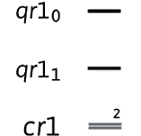
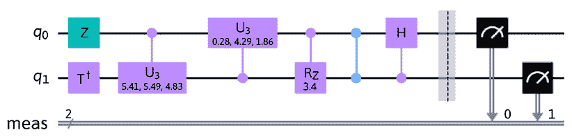

# 第七章：使用 Qiskit 进行编程

**Qiskit** 拥有多种库，这些库将量子系统的核心硬件与创建量子电路所需的工具连接起来，这些工具通过代码堆栈向上扩展。因此，它是创建量子电路以及从电路到硬件设备生成和调度脉冲的基础。其他功能，如优化器和转换器，用于确保电路优化以减少退相干并提高性能。在本章中，我们将探讨 Qiskit 中所有关键功能，以帮助您创建自己的电路、优化器和脉冲时序。

本章将涵盖以下主题：

+   理解量子电路

+   在硬件上生成脉冲时序

+   理解作业组件

Qiskit 具有许多功能和增强功能，要描述它们需要整本书。为了涵盖尽可能多的功能，我们将创建一个量子电路，并带您了解各种功能。阅读本章后，您将能够理解如何从基本电路到自定义电路，包括用户定义的标签以帮助您理解电路。您还将了解作业组件，该组件用于在量子系统上运行您的电路。

我们甚至将深入硬件以在量子比特上调度脉冲操作，以便更好地理解电路是如何从数字信号转换为模拟信号以在量子比特上执行操作，然后从量子比特读取信息并将信号从模拟转换为数字。

听起来很激动人心？太好了！让我们开始吧！

# 技术要求

在本章中，我们假设您熟悉前面章节中描述的量子电路基础知识，例如创建和执行量子电路、可视化电路图以及了解量子比特逻辑门。

本书所使用的源代码如下：[`github.com/PacktPublishing/Learning-Quantum-Computing-with-Python-and-IBM-Quantum-Second-Edition`](https://github.com/PacktPublishing/Learning-Quantum-Computing-with-Python-and-IBM-Quantum-Second-Edition)。

# 定制和优化量子电路

在前面的章节中，您已经接触了一些量子电路操作，以了解一些基本量子组件。这些基本操作包括创建量子电路、将量子门应用于电路以及在模拟器上执行电路。

现在，我们将更深入地研究量子电路，以更好地了解我们可用的属性和功能，不仅要在实际设备上执行这些电路，而且要尽可能优化地执行。在本节中，我们将学习如何提取电路属性，例如电路深度、宽度和大小，以及获取实际操作器的数量。让我们首先回顾创建量子电路的各种形式。

## 量子电路的组件

Qiskit 提供了多种创建量子电路的方法，每种方法都取决于你在电路中需要多少信息。到目前为止，我们一直在使用单个构造函数创建电路，该构造函数会自动创建所需的电路寄存器。在这种形式中，参数表示量子寄存器和经典寄存器的量子比特和比特数量，分别：

```py
# Load helper file
%run helper_file_1.0.ipynb
qc = QuantumCircuit(2,2) 
```

在本节中，我们将描述创建电路的其他方法，并讨论使用某种形式或另一种形式的优点。

构建量子电路类（`QuantumCircuit`）的另一种方法是独立于量子电路构造函数创建量子寄存器和经典寄存器。在这里，我们将首先创建量子寄存器和经典寄存器，每个寄存器分别包含两个量子比特和两个比特，然后绘制电路。构造函数允许我们自定义寄存器的标签，这在之前的形式中是无法做到的：

```py
# Import registers
from qiskit import QuantumRegister, ClassicalRegister
qr = QuantumRegister(2, 'my_QR')
cr = ClassicalRegister(2, 'my_CR')
qc = QuantumCircuit(qr,cr)
qc.draw(output='mpl') 
```

从前面的代码中，注意第二个参数：即寄存器构造函数的`name`属性：允许我们为每个寄存器添加标签，如下面的截图所示：


图 7.1：自定义量子寄存器和经典寄存器标签

自定义寄存器的标签简化了电路的阅读，尤其是在电路变得复杂时，多个寄存器执行不同的过程。你可能希望有一个固定数量的量子比特的寄存器，另一个动态寄存器，其中定义量子比特的数量将基于某些预处理步骤。你将在本章后面创建复合体时看到这一点的重要性。

当然，如果需要，你也可以在一行中将创建寄存器和电路构造函数合并：

```py
qc = QuantumCircuit(QuantumRegister(2, 'my_QR'), ClassicalRegister(2, 'my_CR')) 
```

假设现在你有两个量子电路，并且你想将它们连接在一起。以下示例将说明如何将两个电路连接成一个，而无需基于两个现有的量子电路显式地重新创建一个：

1.  在以下代码中，我们将创建第一个电路，并在量子寄存器和经典寄存器上包含标签，以便我们可以监控它们实际上是否已合并：

    ```py
    #Create the quantum and classical registers, each with 
    #labels
    qr1 = QuantumRegister(2, name='qr1')
    cr1 = ClassicalRegister(2, name='cr1')
    #Create the quantum circuit using the registers
    qc1 = QuantumCircuit(qr1, cr1)
    #Draw the circuit
    qc1.draw(output='mpl') 
    ```

以下截图显示了运行上一段代码后应显示的内容：



图 7.2：我们将加入的两个量子电路中的第一个

1.  接下来，我们将创建第二个电路，它与第一个非常相似，只是我们将更新标签以识别它是第二个：

    ```py
    #Create two Quantum and Classical registers
    qr2 = QuantumRegister(2, name='qr2')
    cr2 = ClassicalRegister(2, name='cr2')
    #Create a second circuit using the registers created 
    #above
    qc2 = QuantumCircuit(qr2, cr2)
    #Draw the second quantum circuit
    qc2.draw(output='mpl') 
    ```

代码的结果应该不会令人惊讶：它与第一个相同，只是标签按预期更新：


图 7.3：我们将加入的两个量子电路中的第二个

1.  现在，让我们通过将一个电路与另一个电路结合来完成，也就是说，我们将电路宽度从 2 扩展到 4 个量子比特。为此，我们将使用 `add_register` 函数，该函数将量子寄存器和经典寄存器组合成一个单独的电路。在这里，我们将电路 `qc2` 和 `qc1` 组合成一个新的电路，标题为 `qc_combined`，然后绘制结果：

    ```py
    #Concatenate the two previous circuits to create a new #circuit
    #Create an empty quantum circuit
    qc_combined = QuantumCircuit()
    #Add the two previous quantum and classical 
    #registers to the empty quantum circuit
    qc_combined.add_register(qr1, qr2, cr1, cr2)
    #Draw the concatenated circuit
    qc_combined.draw(output='mpl') 
    ```

如以下截图所示，结果现在是两个先前量子电路通过组合寄存器合并成一个新的电路：


图 7.4：两个量子电路的连接

我们最初创建了两个单独的量子电路，每个电路有两个量子寄存器和两个经典寄存器。然后我们将它们连接起来，创建了一个包含四个量子寄存器和四个经典寄存器的量子电路。量子电路的顺序是基于它们连接的顺序。作为额外的练习，重复之前的连接代码，并切换顺序以确认或创建更多的量子电路并将它们组合在一起。

我想分享的最后一个电路创建对象是随机电路生成器，正如其名所示，它将为你生成一个随机电路。拥有创建随机电路的能力可以帮助你根据一组参数（如电路宽度和深度）创建测试电路或示例。如下面的代码块所示，`random_circuit` 对象需要两个参数。它们是你想要随机电路包含的量子比特数量和电路的深度，分别：其中深度表示每个量子比特随机添加的标准门数量，这些门来自 Qiskit 电路扩展列表，如 API 文档中所述。你也可以指示你是否想要电路包含测量操作符：

```py
#Import the random_circuit class
from qiskit.circuit.random import random_circuit
#Construct the random circuit with the number of qubits = 3
#with a depth = 2, and include the measurement operator for 
#each qubit
qc = random_circuit(3, 2, measure=True)
#Draw the circuit
qc.draw(output='mpl') 
```

随机电路的结果当然会因每次执行而变化，这是应该的。不会变化的是参数选项，尤其是量子比特的数量和深度计数。在这种情况下，你的结果应该包含三个量子比特和两个操作符的深度。以下随机电路是运行前面代码的结果。请注意，测量操作符不包括在深度计数中：


图 7.5：使用 3 个量子比特和深度 2 生成的随机电路

现在你已经熟悉了生成量子电路的各种方法，我们将继续并看看我们可以从创建的电路中提取哪些属性。这些属性可以用来分析生成的电路，并确保通过利用 Qiskit 中可用的某些优化功能来优化它。

## 获取电路属性和分析

一旦开始构建电路，构建电路可能会变得非常复杂，尤其是如果你创建门和组合它们以形成更大的门。如果你需要分析结果，你将想要在过程中获取有关你的电路的一些信息。

对于我们来说，好事是 Qiskit 已经为我们处理了一些这方面的工作，通过使我们能够访问许多这些属性。让我们从一些基本属性开始。假设我们想知道我们的电路中有多少量子比特。正如我们在上一节中学到的，我们知道我们可以将两个或多个电路连接在一起。当我们添加更多的电路时，确定我们连接的电路将具有多少量子比特和门变得困难或繁琐。正是在这里，宽度、深度和算子计数函数变得非常有用。

在下面的代码中，我们将创建两个双量子比特随机电路，每个电路具有不同的门计数。然后我们将一个电路附加到另一个电路上，并使用我们的电路属性函数来帮助我们获取总宽度、深度和算子计数。所有附加的电路都需要使用此方法具有相同数量的量子比特：

```py
#Import the random circuit class
from qiskit.circuit.random import random_circuit
#Create two random circuits, each with 2 qubit registers and 
#random gate operator counts.
qc1 = random_circuit(2,2)
qc2 = random_circuit(2,4)
#Concatenate the two random circuits into one
qc = qc1.compose(qc2, [0,1])
#Draw the circuit
qc.draw(output='mpl') 
```

结果应该是一个具有随机门算子集的双量子比特电路，总深度为 6。我们知道这一点，因为我们创建了它们，并且可以从`random_circuit`构造函数中看到这些值：


图 7.6：深度为 6 的随机生成的双量子比特电路

现在，让我们使用我们的电路属性函数来获取电路的宽度、深度、大小和算子计数。为了简化这一点，我们将创建一个辅助函数，该函数将打印出我们将作为参数传递的量子电路的电路属性：

```py
#Define function to print circuit properties:
def print_circuit_props(qc):
    width = qc.width()
    depth = qc.depth()
    num_operators = qc.count_ops()
    circuit_size = qc.size()
    print('Width = ', width)
    print('Depth = ', depth)
    print('Circuit size = ', circuit_size)
    print('Number of operators = ', num_operators) 
```

现在，我们可以通过我们的辅助函数运行我们的电路，该函数将打印出我们需要的所有属性：

```py
#Pass our quantum circuit to print out the circuit properties
print_circuit_props(qc) 
```

我们的结果应该对于`Width`和`Depth`具有相同的值。然而，由于我们正在使用随机电路，我们的电路大小和算子数量将不同，因为它们基于随机选择的门。然而，通过观察电路，你会看到`size()`和`count_ops()`的结果值是相同的。这两者之间的区别在于，电路大小返回电路中的总门数，而算子计数列出每种门类型的名称以及电路中每种门类型的总数：

```py
Width =  2
Depth =  6
Circuit size =  7
Number of operators =  OrderedDict([('cu3', 2), ('z', 1), ('tdg', 1), ('crz', 1), ('cz', 1), ('ch', 1)]) 
```

现在，让我们尝试添加一些经典寄存器、测量和障碍，看看我们会得到什么。我们可以使用`measure_all()`快捷方式来包含测量算子，这将附加一个障碍、每个量子比特的测量以及与我们的电路量子寄存器中量子比特数量相匹配的经典寄存器：

```py
#Use measure_all() to automatically add the barrier, 
#measurement, and classical register to our existing circuit.
qc.measure_all()
#Draw the circuit
qc.draw(output='mpl') 
```

现在的结果包括了测量和读取我们的量子比特所需的所有经典组件。这些包括标记为`measure`的两个位经典寄存器、一个将量子门与测量操作符分开的屏障以及测量操作符，如下面的屏幕截图所示：



图 7.7：添加经典组件的随机电路

现在，让我们打印我们的电路属性函数，以查看更新的计数：

```py
#Print out the circuit properties
print_circuit_props(qc) 
```

结果显示了我们一般会预期的内容。由于添加了两个位的经典寄存器，`Width`计数增加了 2。由于添加了屏障，`Depth`计数增加了 1。请注意，测量操作符不包括在大小或操作符计数中，如下所示：

```py
Width =  4
Depth =  7
Circuit size =  9
Number of operators =  OrderedDict([('cu3', 2), ('measure', 2), ('z', 1), ('tdg', 1), ('crz', 1), ('cz', 1), ('ch', 1), ('barrier', 1)]) 
```

在进入下一节之前，让我们看看我们电路属性函数的一个有趣的注意事项。大多数门是由特定于所使用量子计算机的基门创建的。对于大多数量子系统，有一组基门用于创建其他门。

然而，一些门，如**Toffoli**和**Swap**门，不仅需要多个量子比特，而且由多个基门组成。让我们以 Toffoli 门为例：

1.  我们将创建一个包含 3 个量子比特的量子电路，并向其中添加一个 Toffoli 门，如图所示：

    ```py
    qc = QuantumCircuit(3)
    qc.ccx(0,1,2)
    qc.draw(output='mpl') 
    ```

这里，我们看到了预期的 Toffoli 门，0 和 1 源量子比特纠缠，量子比特 2 为目标：


图 7.8：量子电路上的 Toffoli 门

1.  我们打印出带有 Toffoli 门的量子电路的电路属性：

    ```py
    #Print out the circuit properties
    print_circuit_props(qc) 
    ```

如我们所见，结果并不令人惊讶，因为这些值也不令人惊讶：一个宽度为`3`、深度为`1`的三量子比特门：

```py
Width = 3
Depth = 1
Circuit size = 1
Number of operators = OrderedDict([('ccx', 1)]) 
```

1.  现在，让我们打印我们的电路属性，但这次，让我们分解我们的量子电路以查看结果。如您所回忆的，当我们对量子电路调用`decompose()`函数时，我们请求电路分解为其基门，这些基门用于创建我们电路中的门。在这种情况下，我们指的是用于创建 Toffoli 门的基门：

    ```py
    #Print out the circuit properties
    print_circuit_props(qc.decompose()) 
    ```

*注意区别吗？* 确实令人惊讶！通过观察结果，我们看到 Toffoli 门需要 15 个操作符，这些操作符由各种门组成，例如 T、![img/B18420_07_001.png]、H 和 CNOT：

```py
Width = 3
Depth = 11
Circuit size = 15
Number of operators = OrderedDict([('cx', 6), ('t', 4), ('tdg', 3), ('h', 2)]) 
```

我之所以想提到这一点，是为了让你意识到所使用的某些门不是基门，而是用于生成所需门功能的基门的组合。在分析你的电路与量子比特噪声或退相干相关时，了解这一点是很有用的。

尝试同样的练习，但这次尝试创建一个具有 Swap 门的二量子比特电路，看看你得到什么结果。

现在你已经熟悉了创建量子电路的各种形式，让我们看看我们如何以模块化的方式重复使用这些电路，使其易于组合和理解。

## 定制和参数化电路库

有时候，你可能需要在多个场合重复使用一个电路。为了简化这个过程，你可以创建操作符的复合体并在整个电路中重复使用它们。这不仅简化了从模块创建电路的过程，而且使其他人很容易理解这些复合体中电路的功能。Qiskit 根据指令集或量子电路创建这些复合体。

在以下步骤中，我们将创建一个由多个量子位和门组成的复合门：

1.  首先，我们创建一个两量子位的量子电路，给它起个名字，并将其转换为通用量子指令：

    ```py
    #Create a custom two-qubit composite gate
    #Create the quantum register
    qr = QuantumRegister(2, name='qr_c')
    #Generate quantum circuit which will make up the 
    #composite gate
    comp_qc = QuantumCircuit(qr, name='My-composite')
    #Add any gates you wish to your composite gate
    comp_qc.h(0)
    comp_qc.cx(0, 1)
    #Create the composite instructions by converting
    #the QuantumCircuit to a list of Instructions
    composite_inst = comp_qc.to_instruction()
    #Draw the circuit which will represent the composite gate
    comp_qc.draw(output='mpl') 
    ```

上述代码将创建以下两个量子位的电路，我们将将其用作复合门：


图 7.9：将表示复合门的量子电路

1.  现在，让我们创建一个量子电路，将复合门附加到我们创建的电路上：

    ```py
    #Create your 2-qubit circuit to generate your composite gate
    qr2 = QuantumRegister(3, 'qr')
    #Create a quantum circuit using the quantum register
    qc = QuantumCircuit(qr2)
    #Add any arbitrary gates that would represent the function
    #of the composite gate
    qc.h(0)
    qc.cx(0,1)
    qc.cx(0,2)
    #Draw the composite circuit
    qc.draw(output='mpl') 
    ```

上述代码将创建电路，我们在包含复合门之前预先填充了一些门：


图 7.10：我们将附加到复合门上的量子电路

1.  由于我们的复合门由两个量子位组成，我们需要指明将我们的二量子位复合门附加到哪三个量子位上。对于这个例子，我们将它附加到前两个量子位上：

    ```py
    #Append your composite gate to the specified qubits.
    qc.append(composite_inst, [qr2[0], qr2[1]])
    #Draw the complete circuit
    qc.draw(output='mpl') 
    ```

从结果中我们可以看到，我们的复合门已成功附加到第一和第二个量子位上。它还包括复合门的名字，这使得任何人，包括你自己，都能轻松阅读电路并理解复合门在电路中的功能：


图 7.11：具有预定义电路复合门表示的量子电路

与将两个量子电路简单连接起来相比，这使得阅读你的电路变得更加容易。

当然，如果你有一个可以立即运行的电路，这是理想的。然而，有时你可能希望控制你生成的复合门中某些门的旋转量。这就是复合门参数化的作用所在。我们现在将创建另一个复合门，但这一次它将包括向你的复合门添加参数的能力，使其更加动态。这通常被称为**参数化量子电路**（**PQC**）。

1.  为了参数化一个门，我们需要创建一个`Parameter`类并将其设置为旋转门；在这个例子中，我们将参数应用到 R[Z]门上：

    ```py
    #Import the Parameter object
    from qiskit.circuit import Parameter
    #Construct the Parameter set to Theta
    param_theta = Parameter('Ө')
    #Create a two-qubit quantum circuit and add some gates
    qc = QuantumCircuit(2)
    qc.h(0)
    qc.cx(0, 1)
    #Include a rotation gate which we wish to apply
    #the Parameter value
    qc.rz(param_theta, 0)
    qc.rz(param_theta, 1)
    #Draw the circuit
    qc.draw(output='mpl') 
    ```

注意，参数值定义为，但不是设置为显式值。它只是预留了`Parameter`值，以便稍后包含一个旋转值：


图 7.12：将 R[z]门的参数设置为θ

1.  让我们将我们门的`Parameter`值绑定到并绘制电路：

    ```py
    import numpy as np
    #Bind the parameters with a value, in this case 2π
    qc = qc.assign_parameters(parameters={param_theta: 2*np.pi})
    #Draw the circuit with the set parameter values
    qc.draw(output='mpl') 
    ```

注意，我们的旋转门其 theta 值被设置为，正如预期的那样：


图 7.13：旋转门 R[z]现在将参数值θ设置为 2π

我们的电路现在已准备好运行，并绑定了参数值。通过这个特性，我们可以在循环中迭代它，并在需要时绑定多个值，这样我们就可以迭代所有这些值，而无需手动更新绑定的值。这极大地优化了我们运行和分析电路每个迭代的运行结果的能力。

在本节中，我们了解了使用 Qiskit 提供的类和函数创建量子电路的各种形式和方法，以帮助我们分析电路属性和结构。我们还学习了如何重用创建的电路。

在下一节中，我们将更深入地探讨操纵量子比特，但这次不是从基本门开始，而是直接使用硬件本身来操纵量子比特！

# 在硬件上生成脉冲计划

到目前为止，您已经学习了如何创建量子电路，添加操纵电路中量子比特的门，并执行电路。在本节中，我们将进一步探讨量子电路是如何从数字指令转换为脉冲指令的，这些脉冲指令根据量子电路的指令，通过微波脉冲物理地操纵量子比特。微波脉冲是操纵量子设备上量子比特的元素。一个信号被生成并调整到每个量子比特的特定频率，以确保信号只影响脉冲调整到的量子比特。

本节的大部分内容将假设您对信号处理有一定的了解，特别是关于类似 transmon 的超导量子比特和微波脉冲。为了参考，这是一篇非常棒的论文，详细介绍了相关内容，[`arxiv.org/pdf/1904.06560.pdf`](https://arxiv.org/pdf/1904.06560.pdf)，其中第*4.C*和*4.D*部分概述了如何使用微波信号来操纵量子比特。

到目前为止，您可能想知道为什么您应该有脉冲访问来操作量子比特。首先，了解超导量子比特是通过微波脉冲来操作的这一点很重要。这些脉冲使用量子比特的载波频率将信号发送到每个量子比特，以确保脉冲操作只会影响调谐到该特定频率的量子比特。这样，如果您是内核开发者，例如，配置脉冲的能力让您能够自行微调门操作，而不是默认的脉冲形状。这些微调不仅可以应用于单门操作，还可以应用于像 CNOT 门这样的双量子比特操作。

我们将首先说明硬件组件是如何连接到各种脉冲通道的。IBM Quantum 以与其他大多数云上可用的量子系统不同的方式为您提供对机器的访问。Qiskit 包括一个`Pulse`库，允许您控制发送到控制设备的脉冲。根据`OpenPulse`文档([`arxiv.org/abs/1809.03452`](https://arxiv.org/abs/1809.03452))，它专门提供生成用于控制量子比特的脉冲信号的功能。

为了理解脉冲功能的工作原理，我们将首先描述您将使用的四个主要组件：

+   指令

+   脉冲库

+   通道

+   时间表

在接下来的章节中，我们将学习关于前面组件的内容。

在我们进入下一节之前，我们将使用以下代码，该代码将导入我们直接创建、安排和触发量子设备上的脉冲所需的所有内容：

```py
#Import pulse classes
from qiskit.pulse import Waveform, DriveChannel, Play, Schedule 
```

现在我们已经导入了所需的文件，我们将进入下一节，关于指令。

## 了解指令

**脉冲程序**，或者，如 Qiskit API 文档所述，**时间表**，是一组用于描述量子系统电子组件控制的指令。`qiskit.pulse`库中包含各种指令对象，它们具有调制脉冲信号频率和相位的特性。

`pulse`本质上为您提供指定量子电路中每个操作动态的能力，这样您就可以以尽可能减少噪声的方式对每个操作进行微调。`pulse`具有各种功能，让您能够访问发送和接收每个量子比特信息的通道，并包括您可以用作基础并相应修改的脉冲库。

您还可以延迟指令的触发，类似于大多数编程语言中的`sleep()`函数。最后，它还赋予您通过播放和捕获微波脉冲信号来触发操作和启用获取通道的能力。

理解以下每个指令都取决于理解*为什么*你想使用这些函数。例如，设置频率很重要，因为每个量子比特都调谐到特定的频率，因此任何脉冲操作都应该在指定量子比特的载波频率上发送；否则，操作将不会工作，或者更糟，它可能会对您不想更新的量子比特进行操作。现在，让我们描述每个指令及其参数：

+   `SetFrequency(frequency, channel, name)`，其中`frequency`以 Hz 为单位，`channel`表示频率将应用到的通道，`name`是你可以为指令设置的名称。`SetFrequency`指令的默认*持续时间*为`0`。这非常简单地设置了通道的频率，以便应用于通道的脉冲相应地调谐。如果你在创建特定量子比特的脉冲时没有指定频率，将使用驱动通道上量子比特的默认频率。

+   `ShiftPhase(phase, channel, name)`，其中`phase`是旋转角度（以弧度为单位），`channel`表示频率将应用到的通道，`name`参数是你可以为指令设置的名称。此指令通过增加提供的弧度数来增加旋转角度，从而移动脉冲的相位。

+   `Delay(duration, channel, name)`，其中`duration`是延迟的长度（在文档中，这也被称为*时间步长*或`dt`），`channel`表示将应用延迟的通道，`name`表示你可以为指令设置的名称。`Delay`指令通常用于将脉冲与其他脉冲指令对齐。例如，如果您希望发送两个脉冲并在脉冲之间包含一个时间间隔，您可以通过添加一个具有所需时间间隔的`Delay`指令来指定时间间隔。

+   `Play(pulse, channel, name)`，其中`pulse`是你希望应用的脉冲波形，`channel`表示脉冲将应用到的通道，`name`是你可以为指令设置的名称。`Play`指令将脉冲输出应用于指定的通道，其中脉冲输出之前已使用`SetFrequency`和`SetPhase`指令进行调制。

+   `Acquire(duration, channel, mem_slot, reg_slot, kernel, discriminator, name)`，其中`duration`是获取数据信息的时间步数（dt），`channel`表示从哪个通道获取数据，`mem_slot`是存储每个返回结果的经典内存槽，`reg_slot`是用于存储分类和读出结果的寄存器槽。`kernel`参数用于对每个槽的原始数据进行积分，`discriminator`用于将核化的 IQ 数据分类为`0`或`1`结果，`name`表示你可以为指令设置的名称。

每条指令都包含一个将应用于指定通道的操作符。操作符包括脉冲调制器、延迟和从通道读取。在我们讨论通道之前，让我们使用 Qiskit Pulse 库创建一些脉冲。

## 理解脉冲和 Pulse 库

每个微波脉冲都是由一个**任意波形发生器**（**AWG**）生成的，它指定了脉冲信号的频率和相位。频率和相位分别由我们之前学过的`SetFrequency`和`ShiftPhase`指令设置。

**重要提示**

Qiskit Pulse 提供了一个很好的波形库，可以简化创建我们需要在量子比特上操作的脉冲。以下是在编写本章时可用波形的类型：`Constant`、`Drag`、`Discrete`、`Gaussian`、`GaussianSquare`和`Waveform`。这些波形中的每一个都有其特定的功能，例如，`Drag`用于减少量子比特到状态的泄漏，并使其保持在和状态。

Pulse 库中提供的每个波形都有其特定的功能。以下我们将介绍其中的一些，但我鼓励你阅读 Qiskit 文档[`docs.quantum.ibm.com/api/qiskit/pulse`](https://docs.quantum.ibm.com/api/qiskit/pulse)，其中包含了每个波形的详细描述。

`Waveform`允许你通过提供一个复数值样本数组作为参数来自定义脉冲。这些样本每个都有一个预定义的时间步长，`dt`，这是每个样本播放的时间周期，它根据指定的后端而变化。以下代码是一个简单正弦波形的 128 个样本脉冲的示例：

```py
#Import numpy and generate the sine sample values
import numpy as np
x = np.linspace(0,2*np.pi,64)
data = np.sin(x)
#Generate our Waveform
waveform = Waveform(data, name="sine_64_pulse")
#Draw the generated waveform
waveform.draw() 
```

以下截图是我们创建的正弦波形样本脉冲的结果：


图 7.14：正弦波形的样本脉冲

现在我们尝试从 Pulse 库中生成一个波形。

Pulse 库提供了一系列不同的波形，例如`Gaussian`、`GaussianSquare`、`Constant`和`Drag`（仅举几个例子）。每个都有其独特的形状，我们可以利用这些形状来微调我们想要的任何脉冲。

让我们创建一个`GaussianSquare`脉冲，它是一种两端带有高斯边缘的方形脉冲，而不是截断边缘的方形脉冲：

```py
#Import the Gaussian Square pulse from Pulse Library
from qiskit.pulse.library import GaussianSquare
#Create a Gaussian Square pulse
#Args: duration, amp, sigma, width, name
gaussian_square_pulse = GaussianSquare(128, 1, 2, 112, name="gaussian square")
gaussian_square_pulse.draw() 
```

前面的代码将产生以下脉冲，其中脉冲持续时间(`dt`)为`128`，放大最大值为`1`，sigma 设置为`2`，脉冲峰值的宽度为`112`(`dt`)：


图 7.15：高斯平方脉冲

如您所见，我们可用的参数允许以多种方式调整波形。在`高斯平方`波形样本中，我们能够调整幅度、宽度和其 sigma，这因此为我们提供了更多控制脉冲创建的能力，这可能会减少噪声或任何其他可能来自基于量子电路指令创建的标准脉冲的影响。

现在我们能够创建脉冲，让我们了解一下我们将通过这些通道传输脉冲的通道。

## 利用通道传输和接收指令

Qiskit Pulse 中有两种类型的通道：

+   第一种类型是**脉冲通道**，它将生成的脉冲传输到量子设备。这些包括**驱动通道**、**控制通道**和**测量通道**。

+   另一种类型的通道是**采集通道**。目前，这种类型仅包括**采集通道**，这是接收来自量子设备脉冲的通道。

所有通道只有一个参数，即索引，用于分配通道。以下列表描述了所有通道：

+   **驱动通道**是用于将脉冲信号传输到量子比特以执行门操作的通道。当显示时，它具有前缀**D**。

+   **控制通道**通常用于多量子比特门操作，如`Control-Not`、`Control-Phase`等。它们通常通过驱动通道提供对量子比特的辅助控制。当显示时，它具有前缀**U**。

+   **测量通道**向量子比特传输测量刺激脉冲，以从量子比特进行读出。当显示时，它具有前缀**M**。

+   **采集通道**是唯一用于从设备接收信息的通道。它用于收集量子设备的数据。当显示时，它具有前缀**A**。

到目前为止，我们已经了解到脉冲程序是由用于在量子设备上执行门操作的波形脉冲组成的指令。我们还介绍了可用于在量子设备之间传输和接收信息的不同通道。有了这些信息，我们现在可以看看如何安排这些指令在真实设备上执行。

## 生成和执行调度

脉冲调度是一组通过指定通道发送到量子设备上执行的指令。`Schedule`类可以由指令或其他调度的组合组成。这意味着您可以使用我们之前学到的其中一个指令创建一个调度，或者将调度组合或附加到现有调度中。我们将在本节中完成所有这些操作。

我们将利用本章迄今为止学到的知识来构建一个时间表。首先，我们将构建一个时间表，并将脉冲库中的一个脉冲插入其中，该脉冲将在`time = 0`时触发。然后，我们将创建另一个时间表，并将脉冲库中的不同脉冲插入其中。第二个时间表将被附加到第一个时间表上，然后进行平移，以便在第一个脉冲完成后在某个时间触发。然后，我们将在量子设备上执行时间表并获取其结果：

1.  让我们继续使用我们迄今为止一直在使用的笔记本来创建我们的第一个时间表，并将其命名为`schedule_1`。我们还将使用`Play`指令插入我们之前生成的高斯方波脉冲，并将时间表分配给驱动通道`0`：

    ```py
    #Create the first schedule with our Gaussian Square pulse
    schedule_1 = Schedule(name='Schedule 1')
    schedule_1 = schedule_1.insert(0, 
            Play(gaussian_square_pulse, DriveChannel(0)))
    #Draw the schedule
    schedule_1.draw() 
    ```

我们看到的结果是我们的高斯方波脉冲被添加到从`time = 0`开始的时间表中，如下所示：


图 7.16：时间表 1：高斯方波脉冲

1.  现在，让我们继续创建第二个时间表，`schedule_2`，我们将使用我们之前生成的样本脉冲：

    ```py
    #Create a second schedule with our sample pulse
    schedule_2 = Schedule(name='Schedule 2')
    schedule_2 = schedule_2.insert(0, Play(waveform, DriveChannel(0)))
    #Draw the schedule
    schedule_2.draw() 
    ```

这导致以下时间表：注意我们的样本脉冲的持续时间为 64，而高斯方波脉冲的持续时间为 128：


图 7.17：时间表 2：样本（正弦波形）脉冲

1.  接下来，我们将创建第三个时间表，`schedule_3`，我们将通过插入`schedule_1`和`schedule_2`，并在两者之间留出 5 个时间步长（`dt`）的间隔来构建它：

    ```py
    #Let's create a third schedule, where we add the first 
    #schedule and second schedules and shift the second 
    # to the right by a time of 5 after the first
    schedule_3 = schedule_1.insert(schedule_1.duration+5, schedule_2)
    schedule_3.draw() 
    ```

结果是`schedule_1`从`time = 0`开始，然后我们在第一个时间表之后 5 个时间单位插入`schedule_2`。注意使用`duration`变量确保脉冲不会与第一个重叠。因此，时间表 3 的总时间为两个脉冲加上两者之间的 5 个时间单位，总计 197，如下图所示：


图 7.18：时间表 3，在两者之间有 5 个时间单位差异地组合时间表 1 和时间表 2

1.  当然，还有其他方法可以组合脉冲。如果您想在两者之间没有间隔的情况下组合两个时间表，那么您只需简单地使用`append`函数将它们组合即可：

    ```py
    #We could have also combined the two using the append operator
    #The two schedules are appended immediately after one #another
    schedule_3_append = schedule_1.append(schedule_2)
    schedule_3_append.draw() 
    ```

上述代码产生以下输出。注意，总时间单位等于两个脉冲的总时间单位，两个脉冲之间没有额外的 5 个时间单位：


图 7.19：时间表 3，在两者之间没有时间间隔地附加两个时间表

到目前为止，我们能够生成脉冲，将其应用于指令，并安排在指定的通道上运行以操纵量子位。生成一组脉冲可以让你了解我们如何将两个不同的门操作顺序地安排在指定的通道上的单个量子位。

在下一节中，我们将看到我们如何在提交量子电路后找到其状态。

# 理解作业组件

我们将要讨论的最后一个组件是`Job`组件。`Job`组件基本上是在后端上执行过的电路的实例，并包含有关执行电路（如结果、后端、持续时间等）的信息。这意味着一旦你将电路发送到后端以执行，后端将生成`Job`实例并附加有关作业的信息：如状态、结果、作业标识符等信息。以下是一个可用的`Job`函数列表：

+   `backend()`提供了作业正在运行的后端。

+   `status()`提供作业的状态。

+   `result()`在后台执行完成后提供作业结果。

+   `cancel()`提供了取消作业的能力。

+   `job_id()`提供了字母数字作业标识符。

为了简单起见，我们将重用我们之前创建的电路`transpiled_qc`，这样我们就可以查看`Job`对象及其函数。让我们首先导入`job_monitor`类并启动 Qiskit 作业监视器，然后在一个后端上运行电路并运行作业监视器以查看作业的输出状态：

```py
#Run the simple quantum circuit on local Sampler
from qiskit.primitives import Sampler
sampler = Sampler()
#Let's create a simple circuit
qc = QuantumCircuit(1,1)
qc.h(0)
qc.measure([0],[0])
#Let's run a circuit with the Sampler primitive
job = sampler.run(qc, shots=1024)
print(job.status()) 
```

上述代码将执行一个电路，以下将显示`Job`对象的详细信息；例如，它将指示作业是否在队列中、正在运行或成功完成。在这种情况下，状态的结果表明作业已成功运行：

```py
Job Status: JobStatus.DONE 
```

还可以从`Job`对象中提取其他信息。**作业 ID**是正在运行的作业的唯一标识符。这个 ID 在多种情况下非常有用，例如跟踪结果，如果你在后台运行的作业遇到问题，你可以向支持团队提及作业 ID，这将帮助团队找到该作业。可以使用`status()`和`result()`函数分别显式调用状态和结果。`result`对象提供了在后台运行作业的所有信息。让我们运行这些函数来查看我们刚刚运行的作业的结果：

```py
#From the previous output of executed jobs, obtain its job id 
#and print out information about the Job.
print('Print Job ID: ', job.job_id())
print('Print Job Status: ', job.status())
print('Print Job Result: ', job.result()) 
```

代码片段中每个函数的结果如下：

```py
Print Job ID:  dc25c6bd-2ce6-41d5-9caf-f1326f70b90d
Print Job Status:  JobStatus.DONE
Print Job Result:  SamplerResult(quasi_dists=[{0: 0.5107421875, 1: 0.4892578125}], metadata=[{'shots': 1024}]) 
```

在这里，我们可以提取特定的结果信息，我们可以使用这些信息来可视化作业的状态。例如，以下代码将从结果中提取计数并显示在直方图中：

```py
job_result = job.result()
quasi_dists = job_result.quasi_dists
# Get result counts
counts = quasi_dists[0].binary_probabilities()
#Print and plot results
print(counts)
plot_distribution(counts) 
```

结果将生成以下直方图，该直方图涉及每个射击的结果，作为一个总概率（准概率）如下：

```py
{'0': 547, '1': 477} 
```

直方图将显示如下：


图 7.20：概率结果作为直方图

`job` 对象帮助我们获取有关我们已发送到量子系统上运行的电路的详细信息。这些信息可用于将结果返回到我们的应用程序，并相应地可视化结果。它还提供了状态和其他信息，我们可以使用这些信息来跟踪作业，并与他人分享有关结果的其他详细信息，例如支持团队，这样他们可以轻松地在后端识别作业。

# 摘要

在本章中，我们仅介绍了 Qiskit 库中包含的许多功能之一。我们回顾了创建量子电路，以及如何在模拟器和真实量子设备上执行它们。我们还回顾了如何连接电路，以便您可以将它们组合并创建复合电路，这包括绑定参数以允许调整各种门。

我们介绍了如何使用 Qiskit 的 Pulse 库将电路转换为脉冲，并创建了计划，这些计划是发送脉冲信息通过各种通道到底层硬件的程序，并查看如何获取后端上运行的作业的详细信息。

在下一章中，我们将通过回顾通过传递管理器和优化器提供的功能来介绍优化您的量子电路的技术。我们还将学习各种可视化您的量子电路和监控您在量子后端系统上执行作业的方法。

# 问题

1.  构建一个宽度为 4 且深度为 9 的随机量子电路。

1.  创建另一个与你在 *问题 1* 中创建的电路宽度相同的随机量子电路，并将其连接起来，以便在你在前面创建的随机量子电路之前添加。

1.  打印 *问题 3* 中连接的量子电路的电路属性，并指定操作符的总数，不包括任何测量操作符。

1.  创建一个具有参数化 R[Y] 门的电路，该门将旋转一个角度为 。

# 加入我们的 Discord 社区

加入我们社区的 Discord 空间，与作者和其他读者进行讨论：

`packt.link/3FyN1`


